>*`Author: ACatSmiling`*
>
>*`Since: 2024-09-16`*

## CSS 2

**`CSS：Cascading Style Sheets，层叠样式表。`**

CSS 也是一种`标记语言`，用于给 HTML 结构设置样式，例如：文字大小、颜色、元素宽高等。

简单理解：CSS 可以美化 HTML，让 HTML 更漂亮。

**核心思想：HTML 搭建结构，CSS 添加样式，实现了结构与样式的分离。**

### 编写位置

#### 行内样式

定义：写在标签的`style`属性中，又称内联样式。

语法：

```html
<h1 style="color:red;font-size:60px;">欢迎来到尚硅谷学习</h1>
```

注意：

- style 属性的值不能随便写，要符合 CSS 语法规范，是`名:值;`的形式。
- 行内样式表，只能控制当前标签的样式，对其他标签无效。

存在的问题：

- 书写繁琐、样式不能复用、并且没有体现出**结构与样式分离**的思想。
- 不推荐大量使用，只有对当前元素添加简单样式时，才偶尔使用。

示例：

```html
<!DOCTYPE html>
<html lang="zh-CN">

<head>
    <meta charset="UTF-8">
    <title>位置1_行内样式</title>
</head>

<body>
    <h1 style="color: green;font-size: 80px;">欢迎来到尚硅谷学习</h1>
    <h2 style="color: green;font-size: 80px;">欢迎学习前端</h2>
</body>

</html>
```

#### 内部样式

定义：写在 html 页面内部，将所有的 CSS 代码提取出来，单独放在`<style>`标签中。

语法：

```html
<style>
    h1 {
        color: red;
        font-size: 40px;
    }
</style>
```

注意：

-  `<style>`标签理论上可以放在 HTML 文档的任何地方，但一般都放在`<head>`标签中。
-  此种写法：样式可以复用、代码结构清晰。

存在的问题：

- 没有实现**结构与样式完全分离**。
- 多个 HTML 页面无法复用样式。

示例：

```html
<!DOCTYPE html>
<html lang="zh-CN">

<head>
    <meta charset="UTF-8">
    <title>位置2_内部样式</title>
    <style>
        h1 {
            color: green;
            font-size: 40px;
        }

        h2 {
            color: red;
            font-size: 60px;
        }

        p {
            color: blue;
            font-size: 80px;
        }

        img {
            width: 200px;
        }
    </style>
</head>

<body>
    <h1>欢迎来到尚硅谷学习</h1>
    <h2>欢迎学习前端</h2>
    <p>北京欢迎你</p>
    <p>上海欢迎你</p>
    <p>深圳欢迎你</p>
    <p>武汉欢迎你</p>
    <p>西安欢迎你</p>
    
</body>

</html>
```

#### 外部样式

定义：写在单独的`.css`文件中，随后在 HTML 文件中引入使用。

语法：

1. 新建一个扩展名为 .css 的样式文件，把所有 CSS 代码都放入此文件中。

   ```css
   h1{
       color: red;
       font-size: 40px;
   }
   ```

2. 在 HTML 文件中引入 .css 文件。

   ```html
   <link rel="stylesheet" href="./xxx.css">
   ```

注意：

1. `<link>`标签要写在`<head>`标签中。
2. `<link>`标签属性说明：
   - `rel`：relation 简写，说明引入的文档与当前文档之间的关系。
   - `href`：引入的文档来自于哪里。
3. 外部样式的优势：样式可以复用、结构清晰、可触发浏览器的缓存机制，提高访问速度 ，实现了**结构与样式的完全分离**。
4. 实际开发中，**几乎都使用外部样式**，这是**最推荐的使用方式！**

示例：

- position.css：

  ```css
  h1 {
      color: green;
      font-size: 40px;
  }
  
  h2 {
      color: red;
      font-size: 60px;
  }
  
  p {
      color: blue;
      font-size: 80px;
  }
  
  img {
      width: 200px;
  }
  ```

- demo.html：

  ```html
  <!DOCTYPE html>
  <html lang="zh-CN">
  
  <head>
      <meta charset="UTF-8">
      <title>位置3_外部样式</title>
      <link rel="stylesheet" href="./position.css">
  </head>
  
  <body>
      <h1>欢迎来到尚硅谷学习</h1>
      <h2>欢迎学习前端</h2>
      <p>北京欢迎你</p>
      <p>上海欢迎你</p>
      <p>深圳欢迎你</p>
      <p>武汉欢迎你</p>
      <p>西安欢迎你</p>
      <p>成都欢迎你</p>
      
  </body>
  
  </html>
  ```

#### 样式表的优先级

优先级规则：`行内样式 > 内部样式 = 外部样式`

- 内部样式、外部样式，这二者的优先级相同，且：**后面的会覆盖前面的**。
- 同一个样式表中，优先级也和编写顺序有关，且：**后面的会覆盖前面的**。

三种样式对比：

| 分类     | 优点                                                         | 缺点                                                         | 使用频率 | 作用范围 |
| -------- | ------------------------------------------------------------ | ------------------------------------------------------------ | -------- | -------- |
| 行内样式 | 优先级最高                                                   | 1. 结构与样式未分离<br />2. 代码结构混乱<br />3. 样式不能复用 | 很低     | 当前标签 |
| 内部样式 | 1. 样式可复用<br />2. 代码结构清晰                           | 1. 结构与样式未彻底分离<br />2. 样式不能多页面复用           | 一般     | 当前页面 |
| 外部样式 | 1. 样式可多页面复用<br />2. 代码结构清晰<br />3. 可触及浏览器的缓存机制<br />4. 结构与样式彻底分离 | 需要引入才能使用                                             | 最高     | 多个页面 |

示例：

- index.css：

  ```css
  h1 {
      color: blue;
  }
  ```

- demo.html：

  ```html
  <!DOCTYPE html>
  <html lang="zh-CN">
  
  <head>
      <meta charset="UTF-8">
      <title>优先级</title>
      <style>
          h1 {
              color: red;
              font-size: 100px;
          }
  
          h1 {
              color: blue;
              font-size: 40px;
          }
      </style>
  </head>
  
  <body>
      <h1>欢迎来到尚硅谷学习</h1>
  </body>
  
  </html>
  ```

### 语法规范

CSS 语法规范由两部分构成：

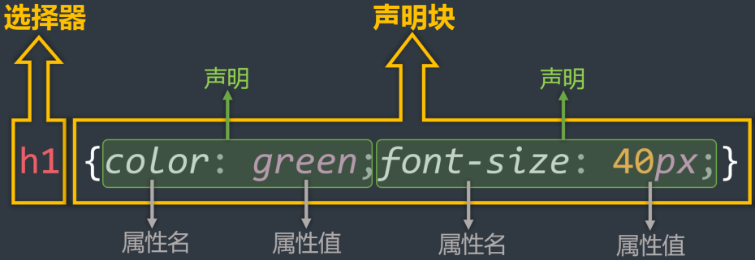

- **`选择器`**：找到要添加样式的元素。

- **`声明块`**：设置具体的样式（**声明块**是由一个或多个**声明**组成的，一个声明就是一个样式），声明的格式为： `属性名: 属性值;`。

> 注意：
>
> 1. 最后一个声明后的分号理论上能省略，但最好还是写上。
> 2. 选择器与声明块之间，属性名与属性值之间，均有一个空格，理论上能省略，但最好还是写上。

注释的写法：

```css
/* 给h1元素添加样式 */
h1 {
    /* 设置文字颜色为红色 */
    color: red;
    /* 设置文字大小为40px */
    font-size: 40px;
}
```

> 快捷键：Ctrl + /。

### 代码风格

**展开风格** —— 开发时推荐，便于维护和调试。

```css
h1 {
    color: red;
    font-size: 40px;
}
```

**紧凑风格** —— 项目上线时推荐，可减小文件体积。

```css
h1{color:red;font-size:40px;}
```

>项目上线时，我们会通过工具将【展开风格】的代码，变成【紧凑风格】，这样可以减小文件体积，节约网络流量，同时也能让用户打开网页时速度更快。

### 选择器

#### 基本选择器

CSS 基本选择器有：

- 通配选择器
- 元素选择器
- 类选择器
- id 选择器

##### 通配选择器

作用：可以选中`所有的` HTML 元素。

语法：

```css
* {
	属性名: 属性值;
}
```

示例：

```html
<!DOCTYPE html>
<html lang="zh-CN">

<head>
    <meta charset="UTF-8">
    <title>01_通配选择器</title>
    <style>
        /* 选中所有元素 */
        * {
            color: orange;
            font-size: 40px;
        }
    </style>
</head>

<body>
    <h1>欢迎来到土味官网，土的味道我知道</h1>
    <br>
    <h2>土味情话</h2>
    <h3>作者：优秀的网友们</h3>
    <p>万水千山总是情，爱我多点行不行！</p>
    <p>草莓、蓝莓、蔓越莓，今天你想我了没？</p>
    <p>我心里给你留了一块地，我的死心塌地！</p>
</body>

</html>
```

>目前来看，通配选择器貌似有点鸡肋，但在清除样式时，会有很大帮助。

##### 元素选择器

作用：为页面中`某种元素`统一设置样式。

语法：

```css
标签名 {
	属性名: 属性值;
}
```

示例：

```html
<!DOCTYPE html>
<html lang="zh-CN">

<head>
    <meta charset="UTF-8">
    <title>02_元素选择器</title>
    <style>
        /* 选中所有h2元素 */
        h2 {
            color: chocolate;
        }

        h3 {
            color: green;
        }

        /* 选中所有p元素 */
        p {
            color: red;
        }

        h1 {
            font-size: 50px;
        }
    </style>
</head>

<body>
    <h1>欢迎来到土味官网，土的味道我知道</h1>
    <br>
    <h2>土味情话</h2>
    <h3>作者：优秀的网友们</h3>
    <p>万水千山总是情，爱我多点行不行！</p>
    <p>草莓、蓝莓、蔓越莓，今天你想我了没？</p>
    <p>我心里给你留了一块地，我的死心塌地！</p>
    <br>
    <h2>反杀土味情话</h2>
    <h3>作者：更优秀的网友们</h3>
    <p>一寸光阴一寸金，劝你死了这条心！</p>
    <p>西瓜、南瓜、哈密瓜，把你打成大傻瓜！</p>
    <p>我心里只有一块地，我的玛莎拉蒂！</p>
</body>

</html>
```

>元素选择器无法实现**差异化设置**，例如上面的代码中，所有的 p 元素效果都一样。

##### 类选择器

作用：根据元素的`class`值，来选中某些元素。

> class 翻译过来有：种类、类别的含义，所以 class 值，又称类名。

语法：

```css
.类名 {
	属性名: 属性值;
}
```

注意：

1. `元素的 class 属性值不带 .，但 CSS 的类选择器要带 .。`

2. class 值，是我们自定义的，按照标准：不要使用纯数字、不要使用中文、尽量使用英文与数字的组合，若由多个单词组成，使用 - 做连接，例如： left-menu ，且命名要有意义，做到 “见名知意”。

3. 一个元素不能写多个 class 属性，下面是错误示例，big 会覆盖 speak：

   ```html
   <!-- 该写法错误，元素的属性不能重复，后写的会失效 -->
   <h1 class="speak" class="big">你好啊</h1>
   ```

4. 一个元素的 class 属性，能写多个值，要用空格隔开，例如：

   ```html
   <!-- 该写法正确，class属性，能写多个值 -->
   <h1 class="speak big">你好啊</h1>
   ```

示例：

```html
<!DOCTYPE html>
<html lang="zh-CN">

<head>
    <meta charset="UTF-8">
    <title>03_类选择器</title>
    <style>
        /* 选中页面中所有类名为speak的元素 */
        .speak {
            color: red;
        }

        /* 选中页面中所有类名为answer的元素 */
        .answer {
            color: green;
        }

        /* 选中页面中所有类名为big的元素 */
        .big {
            font-size: 60px;
        }
    </style>
</head>

<body>
    <h1>欢迎来到土味官网，土的味道我知道</h1>
    <br>
    <h2>土味情话</h2>
    <h3>作者：优秀的网友们</h3>
    <p class="speak big">我对你说：万水千山总是情，爱我多点行不行！</p>
    <p class="speak">我对你说：草莓、蓝莓、蔓越莓，今天你想我了没？</p>
    <p class="speak">我对你说：我心里给你留了一块地，我的死心塌地！</p>
    <span class="speak">哈哈</span>
    <br>
    <h2>反杀土味情话</h2>
    <h3>作者：更优秀的网友们</h3>
    <p class="answer">你回答我：一寸光阴一寸金，劝你死了这条心！</p>
    <p class="answer">你回答我：西瓜、南瓜、哈密瓜，把你打成大傻瓜！</p>
    <p class="answer">你回答我：我心里只有一块地，我的玛莎拉蒂！</p>
</body>

</html>
```

##### id 选择器

作用：根据元素的`id`属性值，来精准的选中某个元素。

语法：

```css
#id值 {
	属性名: 属性值;
}
```

注意：

1. id 属性值：尽量由字母、数字、下划线（`_ `）、短杠（`-`）组成，最好以字母开头，不要包含空格，区分大小写。
2. **一个元素只能拥有一个 id 属性，多个元素的 id 属性值不能相同。**
3. 一个元素可以同时拥有 id 和 class 属性。

示例：

```html
<!DOCTYPE html>
<html lang="zh-CN">

<head>
    <meta charset="UTF-8">
    <title>04_ID选择器</title>
    <style>
        /* 选中id值为earthy的那个元素 */
        #earthy {
            color: red;
        }

        #turn-earthy {
            color: blue;
        }

        .turn {
            font-size: 60px;
        }
    </style>
</head>

<body>
    <h1>欢迎来到土味官网，土的味道我知道</h1>
    <br>
    <h2 id="earthy">土味情话</h2>
    <h3>作者：优秀的网友们</h3>
    <p>我对你说：万水千山总是情，爱我多点行不行！</p>
    <p>我对你说：草莓、蓝莓、蔓越莓，今天你想我了没？</p>
    <p>我对你说：我心里给你留了一块地，我的死心塌地！</p>
    <span>哈哈</span>
    <br>
    <h2 id="turn-earthy" class="turn">反杀土味情话</h2>
    <h3>作者：更优秀的网友们</h3>
    <p>你回答我：一寸光阴一寸金，劝你死了这条心！</p>
    <p>你回答我：西瓜、南瓜、哈密瓜，把你打成大傻瓜！</p>
    <p>你回答我：我心里只有一块地，我的玛莎拉蒂！</p>
</body>

</html>
```

##### 总结

| 基本选择器 | 特点                                             | 用法                   |
| ---------- | ------------------------------------------------ | ---------------------- |
| 通配选择器 | 选中所有标签，一般用于清除样式                   | \* {color: red;}       |
| 元素选择器 | 选中所有同种标签，但是不能差异化选择             | h1 {color: red;}       |
| 类选择器   | 选中所有特定类名（class 值）的元素，使用频率很高 | .say {color: red;}     |
| id 选择器  | 选中特定 id 值的那个元素，唯一的                 | \#earthy {color: red;} |

#### 复合选择器

CSS 选择器整体分为两大类，除了基本选择器，还有复合选择器：

- 交集选择器
- 并集选择器
- 后代选择器
- 子元素选择器
- ......

>说明：
>
>1. 复合选择器建立在基本选择器之上，由多个基础选择器，通过不同的方式组合而成。
>2. 复合选择器可以在复杂结构中，快速而准确的选中元素。

##### 交集选择器

作用：选中同时符合`多个条件`的元素。

语法：

```css
选择器1选择器2选择器3...选择器n {
    属性名: 属性值;
}
```

> 前一个选择器**`紧挨着`**后一个选择器。

注意：

1. 如果有标签名，标签名必须写在前面。
2. id 选择器、通配选择器，理论上可以作为交集的条件，但实际应用中几乎不用，因为没有意义。
3. 交集选择器中**不可能**出现**两个元素选择器**，因为一个元素，不可能即是 p 元素又是 span 元素。
4. 用的最多的交集选择器是：`元素选择器配合类名选择器`。例如： p.beauty 。

示例：

```html
<!DOCTYPE html>
<html lang="zh-CN">

<head>
    <meta charset="UTF-8">
    <title>01_交集选择器</title>
    <style>
        /* 选中类名为rich的元素*/
        .rich {
            color: gold;
        }

        /* 选中类名为beauty的元素*/
        .beauty {
            color: red;
        }

        /* 选中类名为beauty的p元素，这种形式（元素配合类选择器）以后用的很多！！ */
        p.beauty {
            color: green;
        }

        /* 选中同时具备rich和beauty类名的元素 */
        .rich.beauty {
            color: orange;
        }
    </style>
</head>

<body>
    <h2 class="rich">土豪张三</h2>
    <h2 class="beauty">明星李四</h2>
    <h2 class="rich beauty">土豪明星王五</h2>
    <hr>
    <p class="beauty">小狗旺财</p>
    <p class="beauty">小猪佩奇</p>
</body>

</html>
```

> 如果把 css 样式中的 .rich.beauty 注释，则 "土豪明星王五" 这个 h2 的颜色是 .beauty 中的红色，它与 h2 中 class 中的顺序无关，只与 css 文件中的样式书写前后顺序有关。

##### 并集选择器

作用：选中多个选择器对应的元素，又称：**分组选择器**。

语法：

```css
选择器1, 选择器2, 选择器3, ... 选择器n {
    属性名: 属性值;
}
```

>多个选择器通过**`,`**连接，此处 "," 的含义就是 "或"。

示例：

```html
<!DOCTYPE html>
<html lang="zh-CN">

<head>
    <meta charset="UTF-8">
    <title>02_并集选择器</title>
    <style>
        .rich {
            color: gold;
        }

        .beauty {
            color: red;
        }

        .dog {
            color: blue;
        }

        .pig {
            color: green;
        }

        /* 选中类名为：rich或beauty或dog或pig或id为suxi的元素*/
        .rich,
        .beauty,
        .dog,
        .pig,
        #suxi {
            font-size: 40px;
            background-color: gray;
            width: 180px;
        }
    </style>
</head>

<body>
    <h2 class="rich">土豪张三</h2>
    <h2 class="beauty">明星李四</h2>
    <h2>破产王五（不加任何样式）</h2>
    <hr>
    <p class="dog">小狗旺财</p>
    <p class="pig">小猪佩奇</p>
    <p id="suxi">小羊苏西</p>
</body>

</html>
```

> 注意：
>
> 1. 并集选择器，一般竖着写。
> 2. 任何形式的选择器，都可以作为并集选择器的一部分 。
> 3. 并集选择器，通常用于集体声明，可以缩小样式表体积。

> Tips：`win + v`，可以开启并查看电脑的剪贴板历史记录。

> Tips：按住`alt`不松，将光标移到不同的位置，可以同时在这几个位置处输入内容。
>
> 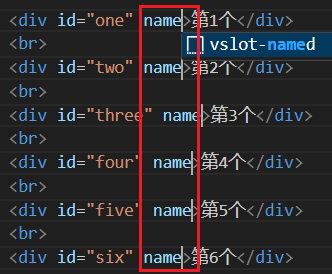

##### HTML 元素间的关系

HTML 元素间的关系，分为：父元素、子元素、祖先元素、后代元素、兄弟元素。

- `父元素`：**直接**包裹某个元素的元素，就是该元素的父元素。

  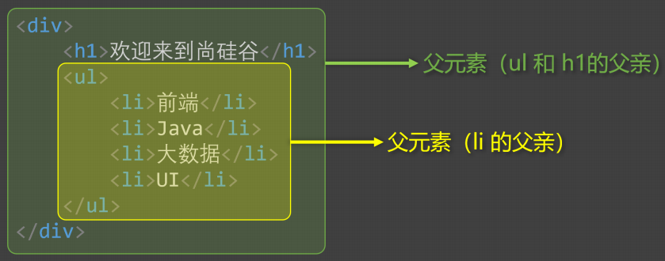

- `子元素`：被父元素**直接**包含的元素（简记：儿子元素）。

  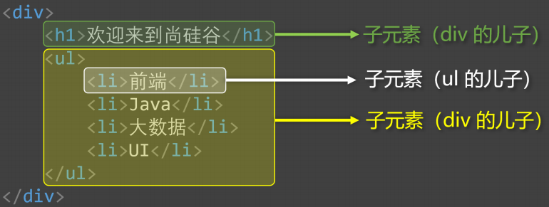

- `祖先元素`：父亲的父亲......，一直往外找，都是祖先。

  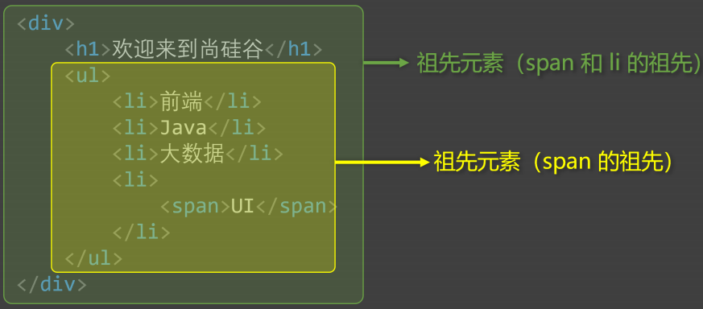

- `后代元素`：儿子的儿子......，一直往里找，都是后代。

  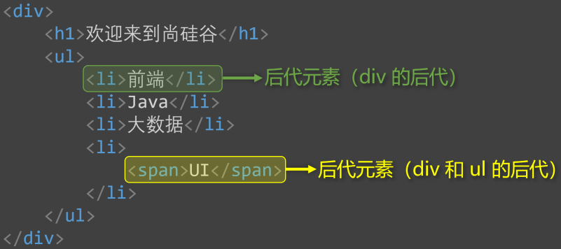

- `兄弟元素`：具有相同父元素的元素，互为兄弟元素。

  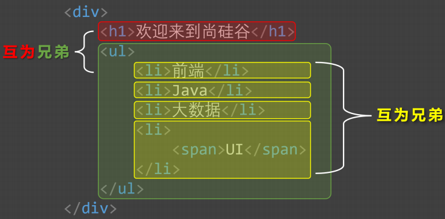

> 说明：
>
> - 父元素，也算是祖先元素的一种。
> - 子元素，也算是后代元素的一种。

##### 后代选择器

作用：`选中指定元素中，符合要求的后代元素。`

语法：

```css
选择器1 选择器2 选择器3 ...... 选择器n {
    属性名: 属性值;
} （先写祖先，再写后代）
```

>选择器之间，用**`空格`**隔开，空格可以理解为：" xxx 中的"，其实就是后代的意思。
>
>选择器 1234....n ，可以是之前学的任何一种选择器。

注意：

1. 后代选择器，最终选择的是后代，不选中祖先。
2. 儿子、孙子、重孙子，都算是后代。
3. 结构一定要符合之前讲的 HTML 嵌套要求，例如：不能 p 中写 h1 ~ h6。

示例：

```html
<!DOCTYPE html>
<html lang="zh-CN">

<head>
    <meta charset="UTF-8">
    <title>03_后代选择器</title>
    <style>
        ul li {
            color: red;
        }

        ol li {
            color: green;
        }

        ul li a {
            color: orange;
        }

        ol li a {
            color: gray;
        }

        .subject li.front-end {
            color: blue;
        }

        .subject div.front-end {
            color: chocolate;
        }
    </style>
</head>

<body>
    <ul>
        <li>抽烟</li>
        <li>喝酒</li>
        <li>
            <a href="#">烫头</a>
        </li>
    </ul>
    <hr>
    <ol>
        <li>张三</li>
        <li>李四</li>
        <li>
            <a href="#">王五</a>
        </li>
    </ol>
    <hr>
    <ol class="subject">
        <li class="front-end">前端</li>
        <div class="front-end">学科介绍：学好前端，挂帅杨帆！</div>
        <li>Java</li>
        <li>大数据</li>
        <li>UI</li>
    </ol>
</body>

</html>
```

##### 子代选择器

作用：选中指定元素中，符合要求的子元素（`儿子元素`）。子代选择器又称：子元素选择器、子选择器。（先写父，再写子）

语法：

```css
选择器1 > 选择器2 > 选择器3 > ...... 选择器n {
    属性名: 属性值;
}
```

>选择器之间，用**`>`**隔开，> 可以理解为：" xxx 的子代"，其实就是儿子的意思。
>
>选择器 1234....n ，可以是我们之前学的任何一种选择器。

注意：

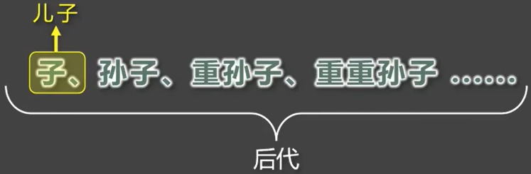

1. 子代选择器，最终选择的是子代，不是父级。
2. 子、孙子、重孙子、重重孙子 ...... 统称后代！**子**就是指**儿子**。

示例：

```html
<!DOCTYPE html>
<html lang="zh-CN">

<head>
    <meta charset="UTF-8">
    <title>04_子代选择器</title>
    <style>
        div>a {
            color: red;
        }

        div>p>a {
            color: skyblue;
        }

        .foot>a {
            color: chocolate;
        }
    </style>
</head>

<body>
    <div>
        <a href="#">张三</a>
        <a href="#">李四</a>
        <a href="#">王五</a>
        <p>
            <a href="#">赵六</a>
        <div class="foot">
            <a href="#">孙七</a>
        </div>
        </p>
    </div>
</body>

</html>
```

##### 兄弟选择器

###### 相邻兄弟选择器

作用：选中指定元素后，符合条件的`相邻兄弟`元素。

>所谓相邻，就是**`紧挨着的下一个`**，简记：睡在我下铺的兄弟。

语法：

```css
选择器1+选择器2 {
    属性名: 属性值;
} 
```

> 前一个选择器通过**`+`**连接后一个选择器。

###### 通用兄弟选择器

作用：选中指定元素后，符合条件的`所有兄弟`元素。

> 简记：睡在我下铺的所有兄弟。

语法：

```css
选择器1~选择器2 {
    属性名: 属性值;
}
```

> 前一个选择器通过**`~`**连接后一个选择器。

###### 示例

```html
<!DOCTYPE html>
<html lang="zh-CN">

<head>
    <meta charset="UTF-8">
    <title>05_兄弟选择器</title>
    <style>
        /* 选中div后紧紧相邻的兄弟p元素（睡在我下铺的兄弟）—— 相邻兄弟选择器 */
        /* div+p {
            color: red;
        } */

        /* 选中div后所有的兄弟p元素（睡在我下铺的所有兄弟）—— 通用兄弟选择器 */
        div~p {
            color: red;
        }

        li+li {
            color: orange;
        }

        /* 与上面的写法效果相同，体会一下：
            li+li：相邻兄弟选择器，找每一个li元素的相邻兄弟（向下寻找）
            li~li：通用兄弟选择器，找每一个li元素的所有相邻兄弟（向下寻找）
        */
        /* li~li {
            color: orange;
        } */
    </style>
</head>

<body>
    <div>尚硅谷</div>
    <p>前端</p>
    <p>Java</p>
    <p>大数据</p>
    <p>UI</p>
    <ul>
        <li>主页</li>
        <li>秒杀</li>
        <li>订单</li>
        <li>我的</li>
    </ul>
</body>

</html>
```

##### 属性选择器

作用：选中`属性值`符合一定要求的元素。

语法：

- `[属性名]`：选中**具有**某个属性的元素。
- `[属性名="值"]`：选中包含某个属性，且属性值**等于**指定值的元素。
- `[属性名^="值"]`：选中包含某个属性，且属性值以指定的值**开头**的元素。
- `[属性名$="值"]`：选中包含某个属性，且属性值以指定的值**结尾**的元素。
- `[属性名*=“值”]`：选择包含某个属性，属性值**包含**指定值的元素。

示例：

```html
<!DOCTYPE html>
<html lang="zh-CN">

<head>
    <meta charset="UTF-8">
    <title>06_属性选择器</title>
    <style>
        /* 第一种写法：选中具有title属性的元素 */
        /* [title] {
            color: red;
        } */

        /* 第二种写法：选中具有title属性，且属性值为atguigu1的元素 */
        /* [title="atguigu1"] {
            color: red;
        } */

        /* 第三种写法：选中具有title属性，且属性值以字母a开头的元素 */
        /* [title^="a"] {
            color: red;
        }  */

        /* 第四种写法：选中具有title属性，且属性值以字母u结尾的元素 */
        /* [title$="u"] {
            color: red;
        }  */

        /* 第五种写法：选中具有title属性，且属性值包含字母u的元素 */
        /* [title*="u"] {
            color: red;
        } */
    </style>
</head>

<body>
    <div title="atguigu1">尚硅谷1</div>
    <div title="atguigu2">尚硅谷2</div>
    <div title="guigu">尚硅谷3</div>
    <div title="guigu" class="school">尚硅谷4</div>
</body>

</html>
```

##### 伪类选择器

作用：选中`特殊状态`的元素。

>如何理解 "伪"：虚假的，不是真的。
>
>如何理解 "伪类"：像类（class），但不是类，是元素的一种特殊状态。
>
>示例：
>
>```html
><!DOCTYPE html>
><html lang="zh-CN">
>
><head>
><meta charset="UTF-8">
><title>07_伪类选择器_概念</title>
><style>
>   /* 什么是伪类？ —— 很像类，但不是类（class），是元素特殊状态的一种描述 */
>
>   /* 选中的是没有访问过的a元素（点击前） */
>   a:link {
>       color: orange;
>   }
>
>   /* 选中的是访问过的a元素（点击后） */
>   a:visited {
>       color: gray;
>   }
></style>
></head>
>
><body>
><a href="https://www.baidu.com">去百度</a>
><a href="https://www.jd.com">去京东</a>
></body>
>
></html>
>```
>
>- a 元素点击前和点击后，是两种状态。

###### 动态伪类

常用的动态伪类：

- `:link`：超链接**未被访问**的状态。

- `:visited`：超链接**被访问过**的状态。

- `:hover`：鼠标**悬停**在元素上的状态。

- `:active`：元素**激活**的状态。

  - **激活：按下鼠标不松开。**注意：CSS 样式需要遵循 LVHA 的顺序，即 link、visited、hover、active，否则某些状态的效果会被覆盖，达不到预期。示例：

    ```css
    /* 选中的是没有访问过的a元素 */
    a:link {
        color: orange;
    }
    /* 选中的是访问过的a元素 */
    a:visited {
        color: gray;
    }
    /* 选中的是鼠标悬浮状态的a元素 */
    a:hover {
        color: skyblue;
    }
    /* 选中的是激活状态的a元素 */
    a:active {
        color: green;
    }
    ```

  - **link 和 visited 是 a 元素独有的两种状态，hover 和 active 是所有元素都可以拥有的状态。**

- `:focus`：**获取焦点**的元素。

  - **表单类元素才能使用 :focus 伪类。**
  - 当用户`点击元素、触摸元素、或通过键盘的 tab 键`等方式，选择元素时，就是获得焦点。

示例：

```html
<!DOCTYPE html>
<html lang="zh-CN">

<head>
    <meta charset="UTF-8">
    <title>08_伪类选择器_动态伪类</title>
    <style>
        /* 选中的是没有访问过的a元素 */
        a:link {
            color: orange;
        }

        /* 选中的是访问过的a元素 */
        a:visited {
            color: gray;
        }

        /* 选中的是鼠标悬浮状态的a元素 */
        a:hover {
            color: skyblue;
        }

        /* 选中的是激活状态的a元素 */
        a:active {
            color: green;
        }

        /* 选中的是鼠标悬浮的span元素 */
        span:hover {
            color: green;
        }

        /* 选中的是激活的span元素 */
        span:active {
            color: red;
        }

        /* 选中的是获取焦点状态的input元素、获取焦点状态的select元素 */
        input:focus,
        select:focus {
            color: orange;
            background-color: green;
        }
    </style>
</head>

<body>
    <a href="https://www.baidu.com">去百度</a>
    <a href="https://www.jd.com">去京东</a>
    <span>尚硅谷</span>
    <br>
    <input type="text">
    <br>
    <input type="text">
    <br>
    <input type="text">
    <select>
        <option value="beijing">北京</option>
        <option value="shanghai">上海</option>
    </select>
</body>

</html>
```

###### 结构伪类

常用的结构伪类：

- `:first-child`：所有兄弟元素中的**第一个**。（对所有的兄弟元素正向排序，不区分元素的类型）
- `:last-child`：所有兄弟元素中的**最后一个**。
- `:nth-child(n)`：所有兄弟元素中的**第 n 个**。
- `:first-of-type`：所有**同类型**兄弟元素中的**第一个**。（同类型指的是标签相同，比如都是 p 元素，都是 span 元素）
- `:last-of-type`：所有**同类型**兄弟元素中的**最后一个**。
- `:nth-of-type(n)`：所有**同类型**兄弟元素中的**第 n 个**。

> 关于 n 的值，含义如下：
>
> 1. `0 或不写`：什么都选不中（几乎不用）。
> 2. `n`：选中所有子元素（几乎不用）。
> 3. `1 ~ 正无穷的整数`：选中**对应序号**的子元素。
> 4. `2n 或 even`：选中序号为**偶数**的子元素。
> 5. `2n+1 或 odd`：选中序号为**奇数**的子元素。
> 6. `-n+3`：选中的是前 3 个。
>
> 实际上，括号内 n 的值，符合公式`an+b`，a 和 b 可以取任意整数，n 取自然数。例如：
>
> - -n+5：表示第 5、4、3、2、1、0...，于是取前五个。
> - 3n+4：表示第 4、7、10、13...，即取第 4 个，第 7 个...数据。
> - **注意：an+b 计算的值，只是确定一个`序号`，这个序号是所有`满足条件`的元素中的排序，从 1 开始，直到最后一个，超出的部分会被忽略。**

:first-child 结构伪类示例：

```html
<!DOCTYPE html>
<html lang="zh-CN">

<head>
    <meta charset="UTF-8">
    <title>09_伪类选择器_结构伪类_1</title>
    <style>
        /* 选中的是div的第一个儿子p元素（按照所有兄弟计算的） —— 看结构1 */
        /* div>p:first-child {
            color: red;
        } */

        /* 选中的是div的第一个儿子p元素（按照所有兄弟计算的） —— 看结构2 */
        /* div>p:first-child {
            color: red;
        } */

        /* 选中的是div的后代p元素，且p的父亲是谁无所谓，但p必须是其父亲的第一个儿子（按照所有兄弟计算的） —— 看结构3 */
        /* div p:first-child {
            color: red;
        } */

        /* 选中的是p元素，且p的父亲是谁无所谓，但p必须是其父亲的第一个儿子（按照所有兄弟计算的） —— 看结构4 */
        p:first-child {
            color: red;
        }
    </style>
</head>

<body>
    <!-- 结构1，效果：第一个p元素变红 -->
    <!-- <div>
        <p>张三：98分</p>
        <p>李四：88分</p>
        <p>王五：78分</p>
        <p>赵六：68分</p>
    </div> -->

    <!-- 结构2，效果：都不会变红，因为div的第一个儿子元素不是p，是span -->
    <!-- <div>
        <span>张三：98分</span>
        <p>李四：88分</p>
        <p>王五：78分</p>
        <p>赵六：68分</p>
    </div> -->

    <!-- 结构3，效果：测试2和测试3变红，因为二者都是其父元素的第一个儿子元素，且是p元素 -->
    <!-- <div>
        <p>测试2</p>
        <marquee>
            <p>测试3</p>
            <p>张三：98分</p>
        </marquee>
        <marquee>
            <span>测试4</span>
            <p>张三：98分</p>
        </marquee>
        <p>李四：88分</p>
        <p>王五：78分</p>
        <p>赵六：68分</p>
    </div> -->

    <!-- 结构4，效果：测试1，测试2和测试3，都变红，三者都是其父元素的第一个儿子元素，且是p元素 -->
    <p>测试1</p>
    <div>
        <p>测试2</p>
        <marquee>
            <p>测试3</p>
            <p>张三：98分</p>
        </marquee>
        <p>李四：88分</p>
        <p>王五：78分</p>
        <p>赵六：68分</p>
    </div>
</body>

</html>
```

其他结构伪类示例：

```html
<!DOCTYPE html>
<html lang="zh-CN">

<head>
    <meta charset="UTF-8">
    <title>10_伪类选择器_结构伪类_2</title>
    <style>
        /* 选中的是div的第一个儿子p元素（按照所有兄弟计算的）—— 结构1*/
        /* div>p:first-child {
            color: red;
        } */

        /* 选中的是div的最后一个儿子p元素（按照所有兄弟计算的）—— 结构1*/
        /* div>p:last-child {
            color: red;
        } */

        /* 选中的是div的第n个儿子p元素（按照所有兄弟计算的）—— 结构1 */
        /* div>p:nth-child(3) {
            color: red;
        } */

        /* 选中的是div的偶数个儿子p元素（按照所有兄弟计算的）—— 结构2 */
        /* 关于n的值 —— 结构2：
                1. 0或不写：什么都选不中 —— 几乎不用。
                2. n ：选中所有子元素  —— 几乎不用。
                3. 1 ~ 正无穷的整数，选中对应序号的子元素。
                4. 2n 或 even  ：选中序号为偶数的子元素。
                5. 2n+1 或 odd ：选中序号为奇数的子元素。
                6. -n+3 : 选中前三个。
         */
        /* div>p:nth-child(2n) {
            color: red;
        } */

        /* 选中的是div的第一个儿子p元素（按照所有同类型兄弟计算的）—— 结构3 */
        /* div>p:first-of-type{
            color: red;
        } */

        /* 选中的是div的最后一个儿子p元素（按照所有同类型兄弟计算的）—— 结构3 */
        /* div>p:last-of-type{
            color: red;
        } */

        /* 选中的是div的第n个儿子p元素（按照所有同类型兄弟计算的）—— 结构3 */
        /* div>p:nth-of-type(5) {
            color: red;
        } */
    </style>
</head>

<body>
    <!-- 结构1 -->
    <!-- <div>
        <p>张三：98分</p>
        <p>李四：88分</p>
        <p>王五：78分</p>
        <p>赵六：68分</p>
        <p>孙七：58分</p>
        <p>老八：48分</p>
    </div> -->

    <!-- 结构2 -->
    <!-- <div>
        <p>第1个</p>
        <p>第2个</p>
        <p>第3个</p>
        <p>第4个</p>
        <p>第5个</p>
        <p>第6个</p>
        <p>第7个</p>
        <p>第8个</p>
        <p>第9个</p>
        <p>第10个</p>
    </div> -->

    <!-- 结构3 -->
    <!-- <div>
        <span>测试1</span>
        <p>张三：98分</p>
        <p>李四：88分</p>
        <p>王五：78分</p>
        <span>测试2</span>
        <p>赵六：68分</p>
        <span>测试3</span>
        <p>孙七：58分</p>
        <span>测试4</span>
        <p>老八：48分</p>
        <span>测试5</span>
    </div> -->
</body>

</html>
```

不常用的结构伪类（了解）：

- `:nth-last-child(n)`：所有兄弟元素中的**倒数第 n 个**。（倒序）
- `:nth-last-of-type(n)`：所有**同类型**兄弟元素中的**倒数第 n 个**。
- `:only-child`：选择**没有兄弟**的元素（独生子女）。
- `:only-of-type`：选择**没有同类型**兄弟的元素。
- `:root`：根元素，即`<html>`。
- `:empty`：内容为空元素（注意，空格算内容）。

示例：

```html
<!DOCTYPE html>
<html lang="zh-CN">

<head>
    <meta charset="UTF-8">
    <title>11_伪类选择器_结构伪类_3</title>
    <style>
        /* 选中div中倒数第n个的儿子p元素（按照所有兄弟）—— 看结构1 */
        /* div>p:nth-last-child(3) {
            color: red;
        } */

        /* 选中div中倒数第n个的儿子p元素（按照所有同类型的兄弟）—— 看结构1 */
        /* div>p:nth-last-of-type(2) {
            color: red;
        } */

        /* 选中的是没有兄弟的span元素 —— 看结构2 */
        /* span:only-child {
            color: red;
        } */

        /* 选中的是没有同类型兄弟的span元素 —— 看结构2 */
        /* span:only-of-type {
            color: red;
        } */

        /* 选中的是根元素 */
        /* :root {
            background-color: gray;
        } */

        /* 选中的是没有内容的div元素 */
        /* div:empty {
            width: 100px;
            height: 100px;
            background-color: red;
        } */
    </style>
</head>

<body>
    <!-- 结构1 -->
    <!-- <div>
        <span>测试1</span>
        <p>张三：98分</p>
        <p>李四：88分</p>
        <p>王五：78分</p>
        <p>赵六：68分</p>
        <p>孙七：58分</p>
        <p>老八：48分</p>
        <span>测试2</span>
    </div> -->

    <!-- 结构2 -->
    <!-- <div>
        <span>测试1</span>
    </div>
    <div>
        <span>测试2</span>
        <p>张三：98分</p>
        <p>李四：88分</p>
        <p>王五：78分</p>
        <p>赵六：68分</p>
        <p>孙七：58分</p>
        <p>老八：48分</p>
    </div> -->

    <!-- 结构3 -->
    <div> </div>
</body>

</html>
```

###### 否定伪类

- `:not(选择器)`：排除满足括号中条件的元素。

示例：

```html
<!DOCTYPE html>
<html lang="zh-CN">

<head>
    <meta charset="UTF-8">
    <title>12_伪类选择器_否定伪类</title>
    <style>
        /* 选中的是div的儿子p元素，但是排除类名为fail的元素 */
        /* div>p:not(.fail) {
            color: red;
        } */

        /* 选中的是div的儿子p元素，但是排除title属性值以“你要加油”开头的 */
        /* div>p:not([title^="你要加油"]) {
            color: red;
        } */

        /* 选中的是div的儿子p元素，但排除第一个儿子p元素 */
        div>p:not(:first-child) {
            color: red;
        }
    </style>
</head>

<body>
    <div>
        <p>张三：98分</p>
        <p>李四：88分</p>
        <p>王五：78分</p>
        <p>赵六：68分</p>
        <p class="fail" title="你要加油啊！孙七">孙七：58分</p>
        <p class="fail" title="你要加油啊！老八">老八：48分</p>
    </div>
</body>

</html>
```

###### UI 伪类

- `:checked`：被选中的复选框或单选按钮。
- `:enable`：可用的表单元素（没有 disabled 属性）。
- `:disabled`：不可用的表单元素（有 disabled 属性）。

示例：

```html
<!DOCTYPE html>
<html lang="zh-CN">

<head>
    <meta charset="UTF-8">
    <title>13_伪类选择器_UI伪类</title>
    <style>
        /* 选中的是勾选的复选框或单选按钮，注意：复选框和单选按钮，无法调解其默认的颜色 */
        input:checked {
            width: 100px;
            height: 100px;
            /* 不会生效 */
            background-color: red;
        }

        /* 选中的是被禁用的input元素 */
        input:disabled {
            background-color: gray;
        }

        /* 选中的是可用的input元素 */
        input:enabled {
            background-color: green;
        }
    </style>
</head>

<body>
    <input type="checkbox">
    <input type="radio" name="gender">
    <input type="radio" name="gender">
    <input type="text">
    <input type="text" disabled>
</body>

</html>
```

###### 目标伪类

- `:target`：选中锚点指向的元素。

示例：

```html
<!DOCTYPE html>
<html lang="zh-CN">

<head>
    <meta charset="UTF-8">
    <title>14_伪类选择器_目标伪类</title>
    <style>
        div {
            background-color: gray;
            height: 300px;
        }

        div:target {
            background-color: green;
        }
    </style>
</head>

<body>
    <a href="#one">去看第1个</a>
    <a href="#two">去看第2个</a>
    <a href="#three">去看第3个</a>
    <a href="#four">去看第4个</a>
    <a href="#five">去看第5个</a>
    <a href="#six">去看第6个</a>

    <div id="one" name>第1个</div>
    <br>
    <div id="two" name>第2个</div>
    <br>
    <div id="three" name>第3个</div>
    <br>
    <div id="four" name>第4个</div>
    <br>
    <div id="five" name>第5个</div>
    <br>
    <div id="six" name>第6个</div>
</body>

</html>
```

###### 语言伪类

- `:lang()`：根据指定的语言选择元素（本质是看 lang 属性的值）。

示例：

```html
<!DOCTYPE html>
<html lang="zh-CN">

<head>
    <meta charset="UTF-8">
    <title>15_伪类选择器_语言伪类</title>
    <style>
        div:lang(en) {
            color: red;
        }

        :lang(zh-CN) {
            color: green;
        }
    </style>
</head>

<body>
    <div>尚硅谷1</div>
    <div lang="en">尚硅谷2</div>
    <p>前端</p>
    <span>你好</span>
</body>

</html>
```

##### 伪元素选择器

作用：选中元素中的一些`特殊位置`。

常用的伪元素：

- `::first-letter`：选中元素中的**第一个文字**。
- `::first-line`：选中元素中的**第一行文字**。
- `::selection`：选中**被鼠标选中的**内容。
- `::placeholder`：选中输入框的**提示文字**。
- `::before`：在元素**最开始**的位置，创建一个子元素（必须用 content 属性指定内容）。
- `::after`：在元素**最后**的位置，创建一个子元素（必须用 content 属性指定内容）。

> **伪元素：很像元素，但不是元素（element），是元素中的一些特殊位置。**
>
> 对于 html 来说，像 div，span 这种，属于元素，而 div 中的一段文字，控制它们的样式，也就如同选中和控制元素一样，因此，这种文字，可以称为伪元素。

示例：

```html
<!DOCTYPE html>
<html lang="zh-CN">

<head>
    <meta charset="UTF-8">
    <title>16_伪元素选择器</title>
    <style>
        /* 什么是伪元素？ —— 很像元素，但不是元素（element），是元素中的一些特殊位置 */

        /* 选中的是div中的第一个文字 */
        div::first-letter {
            color: red;
            font-size: 40px;
        }

        /* 选中的是div中的第一行文字 */
        div::first-line {
            background-color: yellow;
        }

        /* 选中的是div中被鼠标选择的文字 */
        div::selection {
            background-color: green;
            color: orange;
        }

        /* 选中的是input元素中的提示文字 */
        input::placeholder {
            color: skyblue;
        }

        /* 选中的是p元素最开始的位置，随后创建一个子元素 */
        p::before {
            content: "￥";
        }

        /* 选中的是p元素最后的位置，随后创建一个子元素 */
        p::after {
            content: ".00"
        }
    </style>
</head>

<body>
    <div>Lorem ipsum dolor sit amet consectetur adipisicing elit. Sunt quibusdam amet eligendi velit dolore sequi,
        exercitationem consequatur, quis maiores tempore accusantium ipsum aspernatur iusto fugiat fuga natus est
        placeat. Accusamus maiores culpa et sunt dolorum incidunt. Ducimus in odio tempora minima provident deleniti, ex
        voluptatem facere, molestias unde exercitationem pariatur rem vero ut quidem quaerat aliquam, nam debitis
        perspiciatis. Facere?</div>
    <br>
    <input type="text" placeholder="请输入您的用户名">
    <p>199</p>
    <p>299</p>
    <p>399</p>
    <p>499</p>
</body>

</html>
```

>Tips：VS Code 可以随机生成一段英文，命令`lorem`，后面可以跟随一个数字，表示生成该数字对应个数的单词。

示意图：

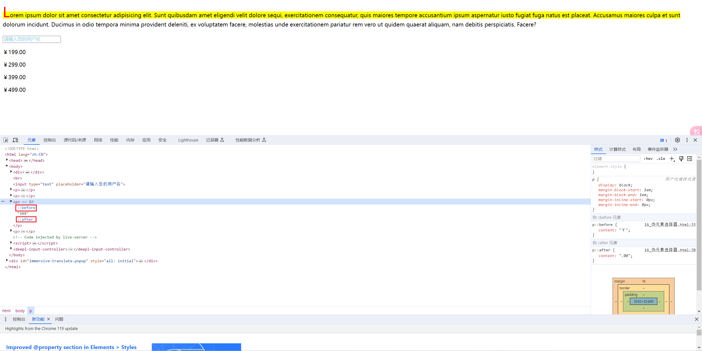

#### 选择器的优先级（权重）

通过**不同的选择器**，选中**相同的元素** ，并且为**相同的样式名**设置**不同的值**时，就发生了样式的冲突。到底应用哪个样式，此时就需要看**`优先级`**了。

对于简单的选择器，可以按照如下规则：**`行内样式 > ID 选择器 > 类选择器 > 元素选择器 > 通配选择器`**。

对于复杂的选择器，需要通过**计算公式**。每个选择器，都可计算出一组`权重`，格式为：**`(a, b, c)`**。

- `a`：包含`ID`选择器的个数。
- `b`：包含`类、伪类、属性`选择器的个数。
- `c`：包含`元素、伪元素`选择器的个数。

示例：

| 选择器                    | 权重      |
| ------------------------- | --------- |
| ul>li                     | (0, 0, 2) |
| div ul>li p a span        | (0, 0, 6) |
| \#atguigu .slogan         | (1, 1, 0) |
| \#atguigu .slogan a       | (1, 1, 1) |
| \#atguigu .slogan a:hover | (1, 2, 1) |

> VS CODE 中，将鼠标悬浮在选择器上方，即可显示其权重：
>
> 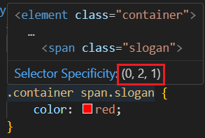

**比较规则**：按照`从左到右`的顺序，依次比较大小，当前位胜出后，后面的不再对比。例如：

**特殊规则：**

1. **行内样式**权重大于**所有选择器**。
2. `!important`的权重，大于**行内样式**，大于**所有选择器**，**权重最高！**

图示：

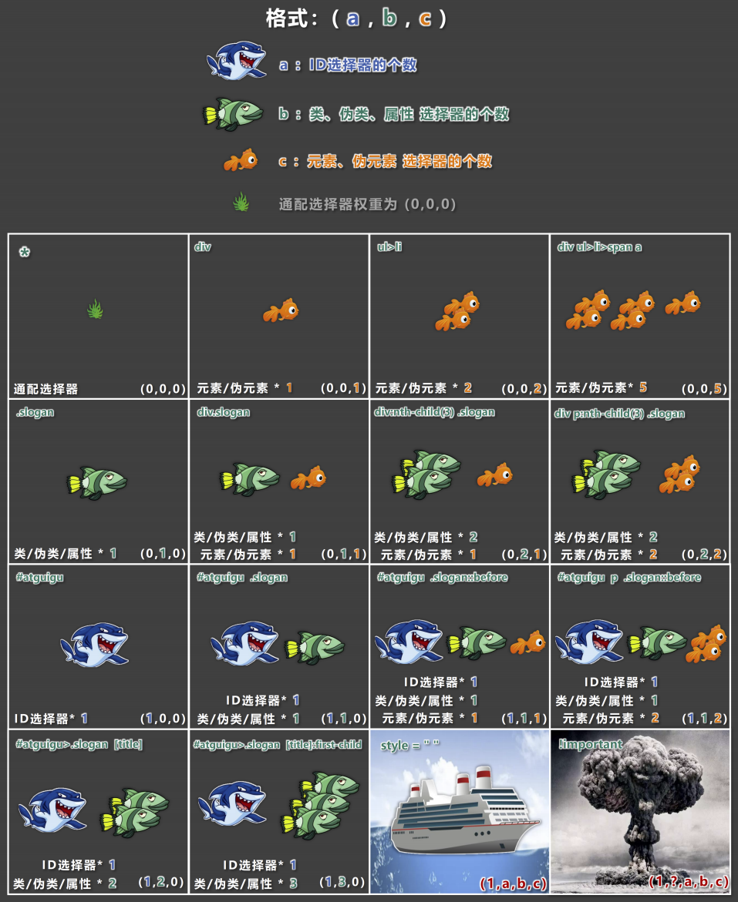

示例：

```html
<!DOCTYPE html>
<html lang="zh-CN">

<head>
    <meta charset="UTF-8">
    <title>选择器优先级_详细聊</title>
    <style>
        #atguigu {
            color: orange;
        }

        .container span.slogan {
            color: red;
        }

        div>p>span:nth-child(1) {
            color: green;
        }

        .slogan {
            color: purple !important;
        }
    </style>
</head>

<body>
    <div class="container">
        <p>
            <span class="slogan" id="atguigu" style="color: blue;">尚硅谷，让天下没有难学的技术！</span>
            <span>欢迎同学们来学习！</span>
        </p>
    </div>
</body>

</html>
```

### 三大特性

#### 层叠性

概念：如果发生了样式冲突，那就会根据一定的规则（选择器优先级），进行样式的`层叠`（覆盖）。

>什么是样式冲突？ ——— 元素的**同一个样式名**，被设置了**不同的值**，这就是冲突。

#### 继承性

概念：元素会`自动拥有`其父元素、或其祖先元素上所设置的某些样式。

规则：优先继承`离得近`的。

常见的可继承属性：text-??，font-??，line-??、color 等。

> 在 [MDN](https://developer.mozilla.org/zh-CN/) 网站，可以查看一个属性，是否可被继承。

#### 优先级

简单来说，规则如下：`!important > 行内样式 > ID选择器 > 类选择器 > 元素选择器 > * > 继承的样式`。

更准确的方式，通过计算权重，来判断选择器的优先级。

### 常用属性

#### 像素

概念：我们的电脑屏幕是，是由一个一个 "小点" 组成的，每个 "小点"，就是一个`像素`（px）。

规律：像素点越小，呈现的内容就越清晰、越细腻。例如：

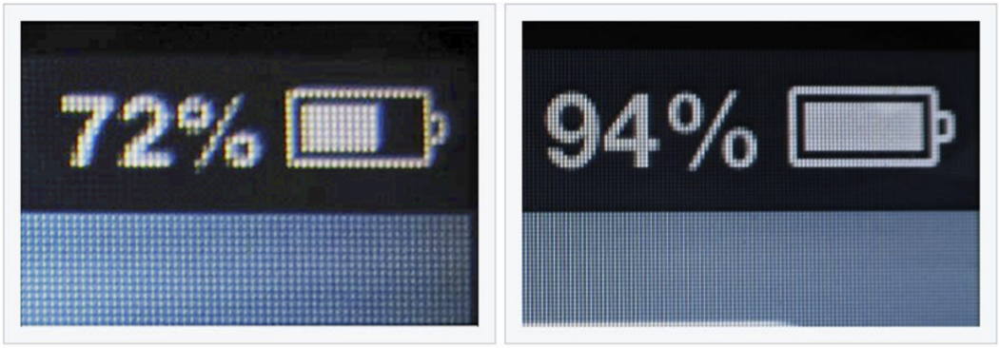

>注意：如果电脑设置中开启了缩放，那么就会影响一些工具的测量结果，但是一般情况下，我们工作中都是参考详细的设计稿，去给元素设置宽高，所以也不会有太大影响。

#### 颜色的表示

##### 颜色名

编写方式：直接使用颜色对应的英文单词，编写比较简单。例如：

- 红色：red。
- 绿色：green。
- 蓝色：blue。
- 紫色：purple。
- 橙色：orange。
- 灰色：gray。

缺点：颜色名这种方式，表达的颜色比较单一，所以用的并不多。

> 更多颜色命名，参考：https://developer.mozilla.org/en-US/docs/Web/CSS/named-color

##### rgb 或 rgba

编写方式：使用`红、黄、蓝`这三种光的三原色进行组合。

- `r`：表示**红色**。
- `g`：表示**绿色**。
- `b`：表示**蓝色**。
- `a`：表示**透明度**。

示例：

```css
/* 使用 0~255 之间的数字表示一种颜色 */
color: rgb(255, 0, 0);/* 红色 */
color: rgb(0, 255, 0);/* 绿色 */
color: rgb(0, 0, 255);/* 蓝色 */
color: rgb(0, 0, 0);/* 黑色 */
color: rgb(255, 255, 255);/* 白色 */

/* 混合出任意一种颜色 */
color:rgb(138, 43, 226) /* 紫罗兰色 */
color:rgba(255, 0, 0, 0.5);/* 半透明的红色 */

/* 也可以使用百分比表示一种颜色（用的少） */
color: rgb(100%, 0%, 0%);/* 红色 */
color: rgba(100%, 0%, 0%, 50%);/* 半透明的红色 */
```

规律：

1. 若三种颜色值相同，呈现的是灰色，值越大，灰色越浅。
2. rgb(0, 0, 0) 是黑色， rgb(255, 255,255) 是白色。
3. 对于 rbga 来说，前三位的 rgb 形式要保持一致，要么都是 0 ~ 255 的数字，要么都是百分比 。

##### HEX 或 HEXA

`HEX`的原理与 rgb 一样，也是通过红、绿、蓝三种颜色进行组合，只不过要用 6 位（分成 3 组）来表达，格式为：`#rrggbb`。

- 每一位数字的取值范围是  0 ~ f，即（ 0, 1, 2, 3, 4, 5, 6, 7, 8, 9, a, b, c, d, e, f ）。
- 每一种光的最小值是 00 ，最大值是 ff。

示例：

```css
color: #ff0000;/* 红色 */
color: #00ff00;/* 绿色 */
color: #0000ff;/* 蓝色 */
color: #000000;/* 黑色 */
color: #ffffff;/* 白色 */

/* 如果每种颜色的两位都是相同的，就可以简写*/
color: #ff9988;/* 可简为：#f98 */

/* 但要注意前三位简写了，那么透明度就也要简写 */
color: #ff998866;/* 可简为：#f986 */
```

> 注意：IE 浏览器不支持 HEXA，但支持 HEX。

##### HSL 或 HSLA

`HSL`是通过：色相、饱和度、亮度，来表示一个颜色的，格式为：` hsl(色相, 饱和度, 亮度)`。

- `色相`：取值范围是 0 ~ 360 度，具体度数对应的颜色如下图：

  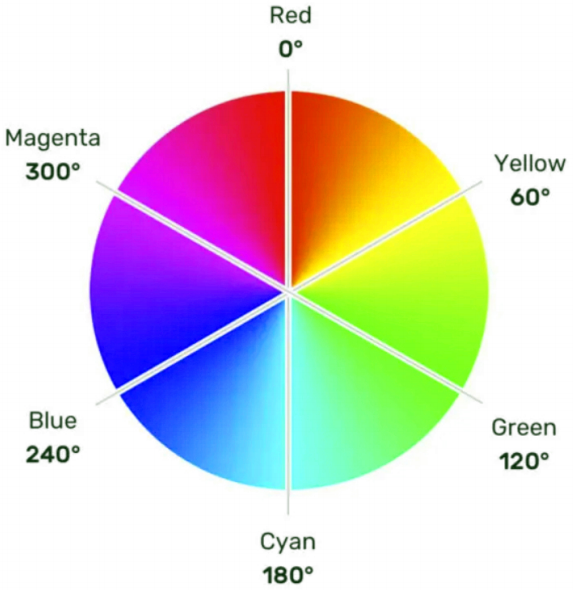

- `饱和度`：取值范围是 0% ~ 100%。（向色相中对应颜色中添加灰色，0% 全灰，100% 没有灰）

- `亮度`：取值范围是 0% ~ 100%。（ 0% 亮度没了，所以就是黑色，100% 亮度太强，所以就是白色了）

- HSLA 其实就是在 HSL 的基础上，添加了透明度。

示例：

```html
<!DOCTYPE html>
<html lang="zh-CN">

<head>
    <meta charset="UTF-8">
    <title>颜色_第4种表示_HSL或HSLA</title>
    <style>
        .atguigu1 {
            color: hsl(0, 100%, 50%);
        }

        .atguigu2 {
            color: hsl(60, 100%, 50%);
        }

        .atguigu3 {
            color: hsl(120, 100%, 50%);
        }

        .atguigu4 {
            color: hsl(180, 100%, 50%);
        }

        .atguigu5 {
            color: hsl(0, 100%, 50%);
        }

        .atguigu6 {
            color: hsla(0, 100%, 50%, 67.8%);
        }
    </style>
</head>

<body>
    <h2 class="atguigu1">尚硅谷1</h2>
    <h2 class="atguigu2">尚硅谷2</h2>
    <h2 class="atguigu3">尚硅谷3</h2>
    <h2 class="atguigu4">尚硅谷4</h2>
    <h2 class="atguigu5">尚硅谷5</h2>
    <h2 class="atguigu6">尚硅谷6</h2>
</body>

</html>
```

#### 字体属性

##### 字体大小

属性名：`font-size`。

作用：控制**字体的大小**。

语法：

```css
div {
	font-size: 40px;
}
```

注意：

1. Chrome 浏览器支持的最小文字为 12px ，默认的文字大小为 16px ，并且 0px 会自动消失。
2. 不同浏览器默认的字体大小可能不一致，所以最好给一个明确的值，不要用默认大小。
3. 通常给 body 设置 font-size 属性，这样 body 中的其他元素就都可以继承了。

示例：

```html
<!DOCTYPE html>
<html lang="zh-CN">

<head>
    <meta charset="UTF-8">
    <title>01_字体大小</title>
    <style>
        /* body {
            font-size: 20px;
        } */
        .atguigu1 {
            font-size: 40px;
        }

        .atguigu2 {
            font-size: 30px;
        }

        .atguigu3 {
            font-size: 20px;
        }

        .atguigu4 {
            font-size: 12px;
        }

        .atguigu5 {
            /* 浏览器能够接受的最小字体是12px */
            font-size: 3px;
        }

        .atguigu7 {
            font-size: 30px;
        }
    </style>
</head>

<body>
    <div class="atguigu1">尚硅谷1</div>
    <div class="atguigu2">尚硅谷2</div>
    <div class="atguigu3">尚硅谷3</div>
    <div class="atguigu4">尚硅谷4</div>
    <div class="atguigu5">尚硅谷5</div>
    <div>尚硅谷6</div>
    <div class="atguigu7">尚硅谷7</div>
</body>

</html>
```

借助控制台看样式：

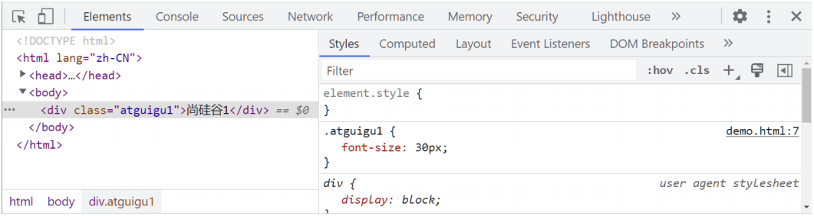

>扩展：字体设计。
>
>一种字体在设计时，会先确定一个字体框，然后以字母**`x`**（小写的）作为基准，并考虑到其他字符的大小等特点，完成一个设计。例如微软雅黑字体的 x 如下：
>
>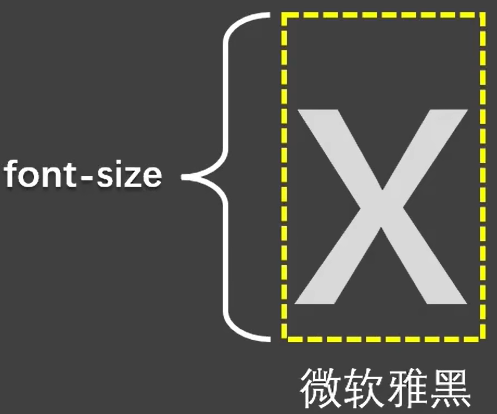
>
>- 黄色的框即为字体框，font-size 为字体高度，如果 font-size 变大或缩小，字体框的宽和高会成比例变化。
>
>当 x 设计好后，该字体的其他字符也就随之完成：
>
>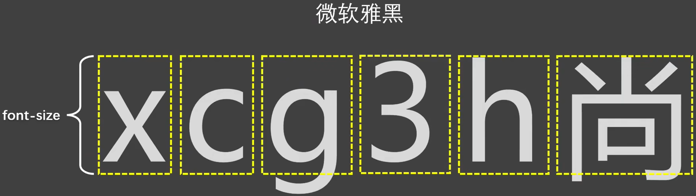
>
>- 可以看到，并不是所有的字符，都会完全包裹在字体框内。
>
>`基线`：当一种字体设计好后，沿着 x 的下方画一条水平线，即为基线。（详细内容参考：https://developer.mozilla.org/zh-CN/docs/Glossary/Baseline）
>
>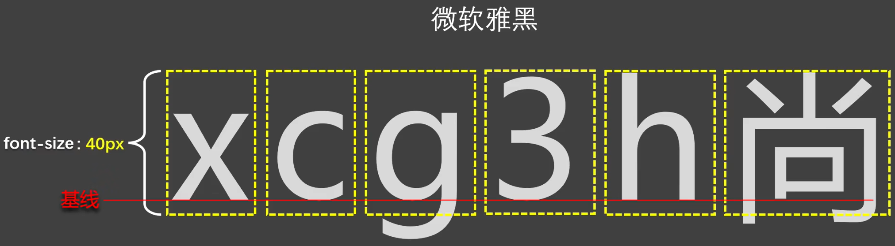
>
>> 除了基线，字体设计还有其他线，但是与 CSS 关联不大，此处不再扩展。
>
>> 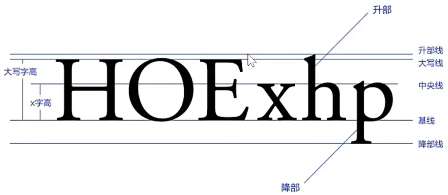
>
>如上图所示，假设 font-size 为 40 px。此时，我们看一下隶书和翩翩体的字体设计：
>
>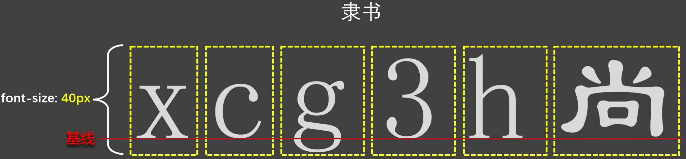
>
>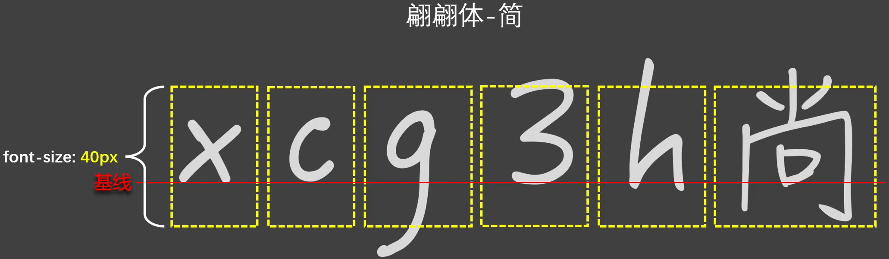
>
>- 可以看到，不同的字体，差距比较大。
>
>综上，可总结如下：
>
>1. **由于字体设计的原因，文字最终呈现的大小，并不一定与 font-size 的值一致，可能大，也可能小。**
>2. **通常情况下，文字相对字体设计框，并不是垂直居中的，通常都靠下一些。**

##### 字体族

属性名： `font-family`。

作用：控制**字体的类型**。

语法：

```css
div {
	font-family: "STCaiyun", "Microsoft YaHei", sans-serif;
}
```

注意：

1. 使用字体的英文名字兼容性会更好，具体的英文名可以自行查询，或在电脑的设置里去寻找。
2. 如果字体名包含空格，必须使用引号包裹起来。
3. 可以设置多个字体，按照从左到右的顺序逐个查找，找到就用，没有找到就使用后面的，且通常在最后写上 serif （衬线字体）或 sans-serif （非衬线字体）。（衬线和非衬线字体，不需要加引号）
4. Windows 系统中，默认的字体就是微软雅黑。

示例：

```html
<!DOCTYPE html>
<html lang="zh-CN">

<head>
    <meta charset="UTF-8">
    <title>02_字体族</title>
    <style>
        .atguigu1 {
            font-size: 100px;
            font-family: "微软雅黑";
        }

        .atguigu2 {
            font-size: 100px;
            font-family: "楷体";
        }

        .atguigu3 {
            font-size: 100px;
            font-family: "宋体";
        }

        .atguigu4 {
            font-size: 100px;
            font-family: "华文彩云";
        }

        .atguigu5 {
            font-size: 100px;
            font-family: "翩翩体-简", "华文彩云", "华文琥珀", "微软雅黑";
        }

        .atguigu6 {
            font-size: 100px;
            font-family: "HanziPen SC", "STCaiyun", "STHupo", "Microsoft YaHei", sans-serif;
        }
    </style>
</head>

<body>
    <div class="atguigu1">尚硅谷1</div>
    <div class="atguigu2">尚硅谷2</div>
    <div class="atguigu3">尚硅谷3</div>
    <div class="atguigu4">尚硅谷4</div>
    <div class="atguigu5">尚硅谷5</div>
    <div class="atguigu6">尚硅谷6</div>
</body>

</html>
```

##### 字体风格

属性名： `font-style`。

作用：控制**字体是否为斜体**。

常用值：

- `normal`：正常（默认值）。
- `italic`：斜体（使用字体自带的斜体效果）。
- `oblique`：斜体（强制倾斜产生的斜体效果）。

> 实现斜体时，更推荐使用 italic。

语法：

```css
div {
	font-style: italic;
}
```

示例：

```html
<!DOCTYPE html>
<html lang="zh-CN">

<head>
    <meta charset="UTF-8">
    <title>03_字体风格</title>
    <style>
        .atguigu1 {
            font-size: 100px;
            font-style: normal;
        }

        .atguigu2 {
            font-size: 100px;
            font-style: italic;
        }

        .atguigu3 {
            font-size: 100px;
            font-style: oblique;
        }

        em {
            font-size: 100px;
            font-style: normal;
        }
    </style>
</head>

<body>
    <div class="atguigu1">尚硅谷1</div>
    <div class="atguigu2">尚硅谷2</div>
    <div class="atguigu3">尚硅谷3</div>
    <em>尚硅谷4</em>
</body>

</html>
```

##### 字体粗细

属性名：`font-weight`。

作用：控制**字体的粗细**。

常用值：

- 关键词：
  - `lighter`：细。
  - `normal`： 正常。
  - `bold`：粗。
  - `bolder`：很粗 （多数字体不支持）。
- 数值：
  - `100 ~ 1000`且无单位，数值越大，字体越粗 （或一样粗，具体得看字体设计时的精确程度）。
  - 100 ~ 300 等同于 lighter，400 ~ 500 等同于 normal， 600 及以上等同于 bold。

语法：

```css
div {
 font-weight: bold;
}

div {
 font-weight: 600;
}
```

示例：

```html
<!DOCTYPE html>
<html lang="zh-CN">

<head>
    <meta charset="UTF-8">
    <title>04_字体粗细</title>
    <style>
        div {
            font-size: 100px;
        }

        .atguigu1 {
            font-weight: lighter;
        }

        .atguigu2 {
            font-weight: normal;
        }

        .atguigu3 {
            font-weight: bold;
        }

        .atguigu4 {
            font-weight: bolder;
        }

        .atguigu5 {
            font-weight: 600;
        }
    </style>
</head>

<body>
    <div class="atguigu1">尚硅谷1</div>
    <div class="atguigu2">尚硅谷2</div>
    <div class="atguigu3">尚硅谷3</div>
    <div class="atguigu4">尚硅谷4</div>
    <div class="atguigu5">尚硅谷5</div>
</body>

</html>
```

##### 字体复合写法

属性名： `font`，可以把上述字体样式合并成一个属性。

作用：将上述所有字体相关的属性复合在一起编写。

编写规则：

1. **字体大小、字体族必须都写上。**
2. **字体族必须是最后一位、字体大小必须是倒数第二位。**
3. 各个属性间用空格隔开。

示例：

```html
<!DOCTYPE html>
<html lang="zh-CN">

<head>
    <meta charset="UTF-8">
    <title>05_字体复合属性</title>
    <style>
        .atguigu {
            font: bold italic 100px "STCaiyun", "STHupo", sans-serif;
        }
    </style>
</head>

<body>
    <div class="atguigu">尚硅谷</div>
</body>

</html>
```

> 实际开发中更推荐复合写法，但这也不是绝对的，比如只想设置字体大小，那就直接用 font size 属性。

#### 文本属性

##### 文本颜色

属性名： `color`。

作用：控制**文字的颜色**。

可选值：

1. 颜色名。
2. rgb 或 rgba。
3. HEX 或 HEXA（十六进制）。
4. HSL 或 HSLA。

> 开发中常用的是： rgb/rgba 或 HEX/HEXA（十六进制）。

示例：

```html
<!DOCTYPE html>
<html lang="zh-CN">

<head>
    <meta charset="UTF-8">
    <title>01_文本颜色</title>
    <style>
        div {
            font-size: 90px;
        }

        .atguigu1 {
            color: red;
        }

        .atguigu2 {
            color: rgb(255, 0, 0);
        }

        .atguigu3 {
            color: rgba(255, 0, 0, .5);
        }

        .atguigu4 {
            color: #00f;
        }

        .atguigu5 {
            color: #00f8;
        }

        .atguigu6 {
            color: hsl(0, 100%, 50%);
        }

        .atguigu7 {
            color: hsla(0, 100%, 50%, .5);
            background-color: orange;
        }
    </style>
</head>

<body>
    <div class="atguigu1">尚硅谷1</div>
    <div class="atguigu2">尚硅谷2</div>
    <div class="atguigu3">尚硅谷3</div>
    <div class="atguigu4">尚硅谷4</div>
    <div class="atguigu5">尚硅谷5</div>
    <div class="atguigu6">尚硅谷6</div>
    <div class="atguigu7">尚硅谷7</div>
</body>

</html>
```

##### 文本间距

**字母间距**：`letter-spacing`。

**单词间距**：`word-spacing`（通过空格识别词）。

属性值为像素（px），正值让间距增大，负值让间距缩小。

示例：

```html
<!DOCTYPE html>
<html lang="zh-CN">

<head>
    <meta charset="UTF-8">
    <title>02_文本间距</title>
    <style>
        div {
            font-size: 30px;
        }

        .atguigu2 {
            /* 字母间距 */
            letter-spacing: 20px;
        }

        .atguigu3 {
            /* 单词间距 */
            word-spacing: 20px;
        }
    </style>
</head>

<body>
    <div>You got a dream, you gotta protect it.尚硅谷1</div>
    <div class="atguigu2">You got a dream, you gotta protect it.尚硅谷2</div>
    <div class="atguigu3">You got a dream, you gotta protect it.尚硅谷3</div>
</body>

</html>
```

示意图：

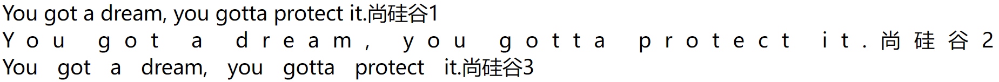

> 字母间距对中文有效，但是单词间距对中文无效。

##### 文本修饰

属性名：`text-decoration`。

作用：控制**文本的各种装饰线**。

可选值：

- `none`：无装饰线（常用，比如去除 a 元素的下划线）。
- `underline`：下划线（常用）。
- `overline`：上划线。
- `line-through`：删除线。

可搭配如下值使用：

- `dotted`：虚线。
- `wavy`：波浪线。
- 也可以指定颜色。

示例：

```html
<!DOCTYPE html>
<html lang="zh-CN">

<head>
    <meta charset="UTF-8">
    <title>03_文本修饰</title>
    <style>
        div {
            font-size: 40px;
        }

        .atguigu1 {
            /* 上划的绿色虚线 */
            text-decoration: overline dotted green;
        }

        .atguigu2 {
            /* 下划的红色波浪线 */
            text-decoration: underline wavy red;
        }

        .atguigu3 {
            /* 删除线 */
            text-decoration: line-through;
        }

        .atguigu4,
        ins,
        del {
            font-size: 40px;
            /* 没有各种线 */
            text-decoration: none;
        }
    </style>
</head>

<body>
    <div class="atguigu1">尚硅谷1</div>
    <div class="atguigu2">尚硅谷2</div>
    <div class="atguigu3">尚硅谷3</div>
    <a class="atguigu4" href="https://www.baidu.com">尚硅谷4</a>
    <ins>测试1</ins>
    <del>测试2</del>
</body>

</html>
```

##### 文本缩进

属性名：`text-indent`。

作用：控制**文本首字母的缩进**。

属性值：CSS 中的长度单位，例如：px。

示例：

```html
<!DOCTYPE html>
<html lang="zh-CN">

<head>
    <meta charset="UTF-8">
    <title>04_文本缩进</title>
    <style>
        div {
            font-size: 60px;
            /* 一个字符为60px，首行缩进两个字符，则为120px */
            text-indent: 120px;
        }
    </style>
</head>

<body>
    <div>欢迎来到尚硅谷学习！欢迎来到尚硅谷学习！欢迎来到尚硅谷学习！欢迎来到尚硅谷学习！欢迎来到尚硅谷学习！</div>
</body>

</html>
```

##### 文本对齐 —— 水平方向

属性名：`text-align`。

作用：控制**文本的水平对齐方式**。

常用值：

- `left`：左对齐（默认值）。
- `right`：右对齐。
- `center`：居中对齐。

示例：

```html
<!DOCTYPE html>
<html lang="zh-CN">

<head>
    <meta charset="UTF-8">
    <title>05_文本对齐_水平</title>
    <style>
        div {
            font-size: 40px;
            background-color: orange;
            text-align: right;
        }
    </style>
</head>

<body>
    <div>尚硅谷</div>
</body>

</html>
```

##### 行高

属性名：`line-height`。

作用：控制**一行文字的高度**。

可选值：

- `normal`：由浏览器根据文字大小决定的一个默认值。
- `像素值`。
- `数字`：参考自身 font-size 的倍数（即 font-size 的倍数，很常用，常设置为 1.5，1.667 等）。
- `百分比`：参考自身 font-size 的百分比。

>由于字体设计原因，文字在一行中，并不是绝对垂直居中，一般靠下。但如果一行中都是文字，不会太影响观感。

示例：

```html
<!DOCTYPE html>
<html lang="zh-CN">

<head>
    <meta charset="UTF-8">
    <title>07_行高</title>
    <style>
        #d1 {
            font-size: 40px;
            background-color: skyblue;

            /* 第一种写法，值为像素 */
            /* line-height: 40px; */

            /* 第二种写法，值为normal */
            /* line-height: normal; */

            /* 第三种写法，值为数值，1.5表示的就是1.5 * 40 = 60 px —— 用的比较多 */
            line-height: 1.5;

            /* 第四种写法，值为百分比 */
            /* line-height: 150%; */

        }
    </style>
</head>

<body>
    <div id="d1">
        atguigux尚硅谷让天下没有难掉的头发atguigu尚硅谷让天下没有难掉的头发atguigu尚硅谷让天下没有难掉的头发atguigu尚硅谷让天下没有难掉的头发atguigu尚硅谷让天下没有难掉的头发atguigu尚硅谷让天下没有难掉的头发atguigu尚硅谷让天下没有难掉的头发
    </div>
</body>

</html>
```

注意事项：

1. line-height 过小会怎样？—— 文字产生重叠，且最小值是 0，不能为负数（如果设置为负数，浏览器会舍弃此设置，恢复为默认值 normal）。

2. **line-height 是可以继承的，且为了能更好的呈现文字，最好写数值。**（一行之中，会以行高最高的那个决定这一行的高度）

   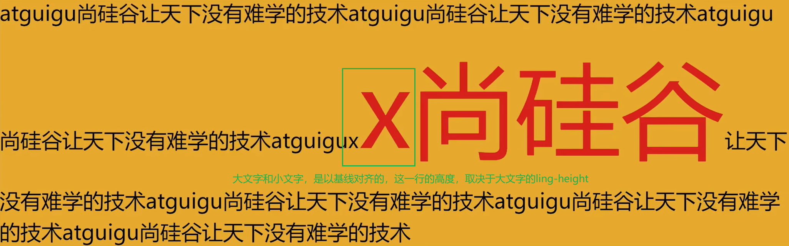

3. line-height 和 height 是什么关系？

   - **设置了 height，那么 div 的高度就是 height 的值。**
   - **不设置 height 的时候，会根据 line-height 计算 div 的高度。（line-height 乘以行数）**
   - 一般，不要设置 line-height 和 height 相同，否则多行文字可能出现重叠情况。

>如果将 line-height 逐渐的越来越小，可以看到：
>
>1. 多行文字会叠在一起。（line-height 为 0，则多行文字之间的垂直距离也变为 0）
>2. 背景色会消失。（line-height 为 0，也没有设置 height，则 div 的高度为 0，自然就没有背景色了）
>3. 文字顶部会被遮挡一点。

应用场景：

1. 对于多行文字：控制行与行之间的距离。
2. 对于单行文字：让 height 等于 line-height ，可以实现文字垂直居中。（备注：由于字体设计的原因，靠上述办法实现的居中，并不是绝对的垂直居中，一般靠下。但如果一行中都是文字，不会太影响观感）

示例：

```html
<!DOCTYPE html>
<html lang="zh-CN">

<head>
    <meta charset="UTF-8">
    <title>08_行高_注意事项</title>
    <style>
        /* 注意点1：行高过小会怎样？ —— 文字重叠，且最小值是0，不能为负数。 */
        #d1 {
            font-size: 40px;
            background-color: skyblue;
            line-height: 0px;
        }

        /* 注意点2：行高是可以继承的 */
        #d2 {
            font-size: 40px;
            background-color: orange;
            line-height: 1.5;
        }

        span {
            font-size: 200px;
            color: red;
        }

        /* 注意点3：line-height和height是什么关系 
            设置了height，div的高度就是height的值。
            没有设置height，div的高度就是：line-height * 行数
        */
        #d3 {
            font-size: 40px;
            background-color: yellowgreen;
            line-height: 100px;
        }

        /* line-height为0，则div的高度也是0 */
        #d4 {
            font-size: 40px;
            background-color: skyblue;
            line-height: 0px;
        }

        /* 行高的应用场景1：调整多行文字的间距 */
        #d5 {
            font-size: 40px;
            background-color: skyblue;
            line-height: 100px;
        }

        /* 行高的应用场景2：单行文字的垂直居中 */
        #d6 {
            font-size: 40px;
            background-color: skyblue;
            height: 300px;
            line-height: 300px;
        }
    </style>
</head>

<body>
    <!-- <div id="d1">atguigu尚硅谷让天下没有难学的技术atguigu尚硅谷让天下没有难学的技术atguigu尚硅谷让天下没有难学的技术atguigu尚硅谷让天下没有难学的技术atguigu尚硅谷让天下没有难学的技术atguigu尚硅谷让天下没有难学的技术atguigu尚硅谷让天下没有难学的技术</div> -->
    <!-- <div id="d2">atguigu尚硅谷让天下没有难学的技术atguigu尚硅谷让天下没有难学的技术atguigu尚硅谷让天下没有难学的技术atguigu<span>尚硅谷</span>让天下没有难学的技术atguigu尚硅谷让天下没有难学的技术atguigu尚硅谷让天下没有难学的技术atguigu尚硅谷让天下没有难学的技术</div> -->
    <!-- <div id="d3">atguigu尚硅谷让天下没有难学的技术atguigu尚硅谷让天下没有难学的技术atguigu尚硅谷让天下没有难学的技术atguigu尚硅谷让天下没有难学的技术</div> -->
    <!-- <div id="d4">atguigu尚硅谷让天下没有难学的技术atguigu尚硅谷让天下没有难学的技术atguigu尚硅谷让天下没有难学的技术atguigu尚硅谷让天下没有难学的技术</div> -->
    <!-- <div id="d5">atguigu尚硅谷让天下没有难学的技术atguigu尚硅谷让天下没有难学的技术atguigu尚硅谷让天下没有难学的技术atguigu尚硅谷让天下没有难学的技术</div> -->
    <div id="d6">atguigu尚硅谷让天下没有难学的技术x</div>
</body>

</html>
```

##### 文本对齐 —— 垂直方向

**顶部：**无需任何属性，在垂直方向上，默认就是顶部对齐。

**居中：**对于单行文字，让 height = line-height 即可。

> 多行文字的垂直居中，祥见后文定位章节。

**底部：**对于单行文字，目前一个临时的方式是让 line-height = ( height × 2 ) - font-size - x。备注： x 是根据字体族，动态决定的一个值。

> 垂直方向的底部对齐，更好的解决方法，祥见后文定位章节。

示例：

```html
<!DOCTYPE html>
<html lang="zh-CN">

<head>
    <meta charset="UTF-8">
    <title>09_文本对齐_垂直</title>
    <style>
        div {
            font-size: 40px;
            height: 400px;
             /* 400 * 2 - 40 -15 */
            line-height: 745px;
            background-color: skyblue;
        }
    </style>
</head>

<body>
    <div>atguigu尚硅谷</div>
</body>

</html>
```

##### vertical-align

属性名：`vertical-align`。

作用：用于指定**同一行元素之间**，或**表格单元格**内文字的**垂直对齐方式**。

>`vertical-align 对块元素无效，只对行内元素有效。`证明如下：
>
>```css
>.test1 {
>width: 400px;
>height: 400px;
>background-color: gray;
>}
>
>.test2 {
>width: 100px;
>height: 100px;
>background-color: green;
>/* 没有效果 */
>vertical-align: bottom;
>}
>```
>
>```html
><div class="test1">
><div class="test2">
>
></div>
></div>
>```

常用值：

1. `baseline`：默认值，使元素的**基线**与父元素的**基线**对齐。
2. `top`：使元素的**顶部**与其**所在行的顶部**对齐。
3. `middle`：使元素的**中部**与**父元素的基线加上父元素字母 x 的一半**对齐。
4. `bottom`：使元素的**底部**与其**所在行的底部**对齐。

示例：

```html
<!DOCTYPE html>
<html lang="zh-CN">

<head>
    <meta charset="UTF-8">
    <title>10_vertical-align</title>
    <style>
        div {
            font-size: 100px;
            height: 300px;
            background-color: skyblue;
        }

        span {
            font-size: 40px;
            background-color: orange;
            vertical-align: middle;
        }

        img {
            height: 30px;
            vertical-align: top;
        }

        .san {
            vertical-align: bottom;
        }
    </style>
</head>

<body>
    <div>
        atguigu尚硅谷x<span>x前端</span>
    </div>
    <hr>
    <div>
        atguigu尚硅谷x
    </div>
    <hr>
    <table border="1" cellspacing="0">
        <caption>人员信息</caption>
        <thead>
            <tr>
                <th>姓名</th>
                <th>年龄</th>
                <th>性别</th>
            </tr>
        </thead>
        <tbody>
            <tr height="200">
                <td class="san">张三</td>
                <td>18</td>
                <td>男</td>
            </tr>
            <tr>
                <td>李四</td>
                <td>20</td>
                <td>女</td>
            </tr>
        </tbody>
    </table>
</body>

</html>
```

#### 列表属性

列表相关的属性，可以作用在 ul、ol、li 元素上。

| 属性名                 | 功能               | 属性值                                                       |
| ---------------------- | ------------------ | ------------------------------------------------------------ |
| `list-style-type`      | 设置列表符号       | `none`：不显示前面的标识（很常用！）<br />square：实心方块<br />disc：圆形<br />decimal：数字<br />lower-roman：小写罗马字<br />upper-roman：大写罗马字<br />lower-alpha：小写字母<br />upper-alpha：大写字母<br />...... |
| `list-style-position ` | 设置列表符号的位置 | `inside`：在 li 的里面<br />`outside`：在 li 的外边          |
| `list-style-image `    | 自定义列表符号     | `url(图片地址)`                                              |
| `list-style`           | 上面三个的复合属性 | 没有数量、顺序的要求                                         |

示例：

```html
<!DOCTYPE html>
<html lang="zh-CN">

<head>
    <meta charset="UTF-8">
    <title>列表相关属性</title>
    <style>
        ul {
            /* 列表符号 */
            /* list-style-type: decimal; */
            /* 列表符号的位置 */
            /* list-style-position: inside; */
            /* 自定义列表符号 */
            /* list-style-image: url("../images/video.gif"); */
            /* 复合属性 */
            list-style: decimal url("../images/video.gif") inside;
        }

        li {
            background-color: skyblue;
        }
    </style>
</head>

<body>
    <ul>
        <li>《震惊！两男子竟然在教室做出这种事》</li>
        <li>《一夜暴富指南》</li>
        <li>《给成功男人的五条建议》</li>
    </ul>
</body>

</html>
```

#### 表格属性

**边框相关属性（除了表格，其他元素也能用）：**

| 属性名         | 功能               | 属性值                                                       |
| -------------- | ------------------ | ------------------------------------------------------------ |
| `border-width` | 边框宽度           | CSS 中可用的长度值，如像素                                   |
| `border-color` | 边框颜色           | CSS 中可用的颜色值                                           |
| `border-style` | 边框风格           | `none`：默认值<br />`solid`：实线<br />`dashed`：虚线<br />`dotted`：点线<br />`double`：双实线 |
| `border`       | 上面三个的复合属性 | 没有数量、顺序的要求                                         |

示例：

```html
<!DOCTYPE html>
<html lang="zh-CN">

<head>
    <meta charset="UTF-8">
    <title>01_边框相关属性</title>
    <style>
        table {
            /* border-width: 2px; */
            /* border-color: green; */
            /* border-style: solid; */
            border: 2px green solid;
        }

        td,
        th {
            border: 2px orange solid;
        }

        h2 {
            border: 3px red solid;
        }

        span {
            border: 3px purple dashed;
        }
    </style>
</head>

<body>
    <h2>边框相关的属性，不仅仅是表格能用，其他元素也能用</h2>
    <span>你要加油呀！</span>
    <table>
        <caption>人员信息</caption>
        <thead>
            <tr>
                <th>序号</th>
                <th>姓名</th>
                <th>年龄</th>
                <th>性别</th>
                <th>政治面貌</th>
            </tr>
        </thead>
        <tbody>
            <tr>
                <td>1</td>
                <td>张三</td>
                <td>18</td>
                <td>男</td>
                <td>党员</td>
            </tr>
            <tr>
                <td>2</td>
                <td>李四</td>
                <td>19</td>
                <td>女</td>
                <td>团员</td>
            </tr>
            <tr>
                <td>3</td>
                <td>王五</td>
                <td>20</td>
                <td>男</td>
                <td>群众</td>
            </tr>
            <tr>
                <td>4</td>
                <td>赵六</td>
                <td>21</td>
                <td>女</td>
                <td>党员</td>
            </tr>
        </tbody>
    </table>
</body>

</html>
```

**表格独有属性（只有 table 标签才能使用）：**

| 属性名            | 功能                 | 属性值                                                       |
| ----------------- | -------------------- | ------------------------------------------------------------ |
| `table-layout`    | 设置列宽度           | `auto`：自动，列宽根据内容计算，默认值<br />`fixed`：固定列宽，平均分 |
| `border-spacing`  | 单元格间距           | CSS 中可用的长度值，如像素<br />生效的前提：单元格不能合并   |
| `border-collapse` | 合并单元格边框       | `collapse`：合并<br />`separate`：不合并                     |
| `empty-cells`     | 隐藏没有内容的单元格 | `show`：显示，默认值<br />`hide`：隐藏<br />生效前提：单元格不能合并 |
| `caption-side`    | 设置表格标题位置     | `top`：上面，默认值<br />`bottom`：在表格下面                |

示例：

```html
<!DOCTYPE html>
<html lang="zh-CN">

<head>
    <meta charset="UTF-8">
    <title>02_表格独有属性</title>
    <style>
        table {
            border: 2px green solid;
            width: 500px;
            /* 控制表格的列宽 */
            table-layout: fixed;
            /* 控制单元格间距（生效的前提是：不能合并边框） */
            border-spacing: 10px;
            /* 合并相邻的单元格的边框 */
            border-collapse: collapse;
            /* 隐藏没有内容的单元格（生效的前提是：不能合并边框） */
            empty-cells: hide;
            /* 设置表格标题的位置 */
            caption-side: top;
        }

        td,
        th {
            border: 2px orange solid;
        }

        .number {
            width: 50px;
            height: 50px;
        }
    </style>
</head>

<body>
    <table>
        <caption>人员信息</caption>
        <thead>
            <tr>
                <th class="number">序号</th>
                <th>姓名</th>
                <th>年龄</th>
                <th>性别</th>
                <th>政治面貌</th>
            </tr>
        </thead>
        <tbody>
            <tr>
                <td>1</td>
                <td>张三</td>
                <td>18</td>
                <td>男</td>
                <td>党员</td>
            </tr>
            <tr>
                <td>2</td>
                <td>李四</td>
                <td>19</td>
                <td>女</td>
                <td>团员</td>
            </tr>
            <tr>
                <td>3</td>
                <td>王五</td>
                <td>20</td>
                <td></td>
                <td>群众</td>
            </tr>
            <tr>
                <td>4</td>
                <td>赵六</td>
                <td>21</td>
                <td>女</td>
                <td>党员</td>
            </tr>
        </tbody>
    </table>
</body>

</html>
```

隐藏没有内容的单元格图示：

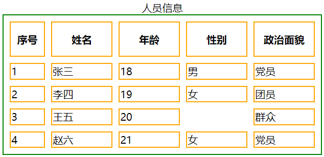

#### 背景属性

| 属性名                | 功能               | 属性值                                                       |
| --------------------- | ------------------ | ------------------------------------------------------------ |
| `background-color`    | 设置背景颜色       | 符合 CSS 中颜色规范的值，默认背景颜色是`transparent`（透明） |
| `background-image`    | 设置背景图片       | `url(图片的地址)`                                            |
| `background-repeat`   | 设置背景重复方式   | repeat ：重复，铺满整个元素，默认值<br />repeat-x ：只在水平方向重复<br />repeat-y ：只在垂直方向重复<br />no-repeat ：不重复 |
| `background-position` | 设置背景图位置     | **通过关键字设置位置：**<br />        写两个值，用空格隔开<br />                水平：`left`、`center`、`right`<br />                垂直：`top`、`center`、`bottom`<br />        写一个值，则另一个方向的值取 center<br />**通过长度指定坐标位置：**以元素左上角，为坐标原点，设置图片左上角的位置<br />        写两个值，则分别是 x 坐标和 y 坐标<br />        写一个值，会被当做 x 坐标， y 坐标取 center |
| `background`          | 上面四个的复合属性 | 没有数量和顺序要求，如果某一个没写，会取对应的默认值         |

示例：

```html
<!DOCTYPE html>
<html lang="zh-CN">

<head>
    <meta charset="UTF-8">
    <title>背景相关属性</title>
    <style>
        body {
            background-color: gray;
        }

        div {
            width: 400px;
            height: 400px;
            border: 5px black solid;
            font-size: 20px;
            /* 设置背景颜色，默认值是transparent */
            background-color: skyblue;
            /* 设置背景图片 */
            background-image: url(../images/悟空.jpg);
            /* 设置背景图片的重复方式 */
            background-repeat: no-repeat;
            /* 控制背景图片的位置——第一种写法：用关键词 */
            background-position: center;
            /* 控制背景图片的位置——第二种写法：用具体的像素值 */
            background-position: 100px 200px;
            /* 复合属性 */
            background: url(../images/悟空.jpg) no-repeat 100px 200px;

        }
    </style>
</head>

<body>
    <div>你好啊！</div>
</body>

</html>
```

#### 鼠标属性

| 属性名   | 功能               | 属性值                                                       |
| -------- | ------------------ | ------------------------------------------------------------ |
| `cursor` | 设置鼠标光标的样式 | `pointer`：小手<br />`move`：移动图标<br />`text`：文字选择器<br />`crosshair`：十字架<br />`wait`：等待<br />`help`：帮助 |

示例：

```html
<!DOCTYPE html>
<html lang="zh-CN">

<head>
    <meta charset="UTF-8">
    <title>鼠标相关属性</title>
    <style>
        div {
            width: 400px;
            height: 400px;
            background-color: skyblue;
            cursor: url("../images/arrow.png"), pointer;
        }

        button {
            cursor: pointer;
        }

        input {
            cursor: move;
        }
    </style>
</head>

<body>
    <div>
        把鼠标放进来看一看
        <input type="text">
        <a href="#">百度</a>
        <button>点我</button>
    </div>
</body>

</html>
```

> 扩展：自定义鼠标图标。
>
> ```css
> /* 自定义鼠标光标 */
> cursor: url("./arrow.png"), pointer;
> ```

### 盒子模型

####  长度单位

CSS 中常用的长度单位有：

1. `px`：像素。
2. `em`：相对元素 font-size 的倍数。
3. `rem`：相对根字体大小，html 标签就是根。
4. `%`：相对父元素计算。

>注意： CSS 中设置长度，**必须加单位**，否则样式无效！

示例：

```html
<!DOCTYPE html>
<html lang="zh-CN">

<head>
    <meta charset="UTF-8">
    <title>01_CSS中常用的长度单位</title>
    <style>
        html {
            font-size: 40px;
        }

        #d1 {
            /* 第一种长度单位：px（像素） */
            width: 200px;
            height: 200px;
            font-size: 20px;
            background-color: skyblue;
        }

        #d2 {
            /* 第二种长度单位：em（相对于当前元素或其父元素的font-size的倍数，font-size是可以继承的，如果一直到html都没有显示定义，那就取浏览器默认值） */
            width: 10em;
            height: 10em;
            font-size: 20px;
            background-color: orange;
        }

        #d3 {
            /* 第三种长度单位：rem（相对于根元素的font-size的倍数） */
            width: 5rem;
            height: 5rem;
            font-size: 20px;
            background-color: green;
        }

        #d4 {
            width: 200px;
            height: 200px;
            font-size: 20px;
            background-color: gray;
        }

        .inside {
            /* 第四种长度单位：%（相对其父元素的百分比） */
            width: 50%;
            height: 25%;
            font-size: 150%;
            background-color: orange;
        }

        .test {
            font-size: 20px;
            text-indent: 2em;
            background-color: yellowgreen;
        }
    </style>
</head>

<body>
    <div id="d1">1</div>
    <hr>
    <div id="d2">2</div>
    <hr>
    <div id="d3">3</div>
    <hr>
    <div id="d4">
        <div class="inside">4</div>
    </div>
    <hr>
    <div class="test">好好学习，天天向上</div>
</body>

</html>
```

#### 元素的显示模式

##### 块元素（block）

`块元素`，又称：块级元素。

特点：

- 在页面中**独占一行**，不会与任何元素共用一行，是从上到下排列的。
- 默认宽度：撑满**父元素**。
- 默认高度：由**内容**撑开。
- **可以**通过 CSS 设置宽高。

块元素有：

- 主体结构标签：`<html>`、`<body>`。
- 排版标签：`<h1> ~ <h6>`、`<hr>`、`<p>`、`<pre>`、`<div>`。
- 列表标签：`<ul>`、`<ol>`、`<li>`、`<dl>`、`<dt>`、`<dd>`。
- 表格相关标签：`<table>`、`<tbody>`、`<thead>`、`<tfoot>`、`<tr>`、`<caption>`。
- 表单标签：`form`与`<option>`。

##### 行内元素（inline）

`行内元素`，又称：内连元素。

特点:

- 在页面中**不独占一行**，一行中不能容纳下的行内元素，会在下一行继续从左到右排列。
- 默认宽度：由**内容**撑开。
- 默认高度：由**内容**撑开。
- **无法**通过 CSS 设置宽高。

行内元素有：

- 文本标签：`<br>`、`<em>`、`<strong>`、`<sup>`、`<sub>`、`<del>`、`<ins>`。
- `<a>`与`<label>`。

##### 行内块元素（inline-block）

`行内块元素`，又称：内联块元素

特点：

- 在页面中**不独占一行**，一行中不能容纳下的行内元素，会在下一行继续从左到右排列。
- 默认宽度：由**内容**撑开。
- 默认高度：由**内容**撑开。
- **可以**通过 CSS 设置宽高。

>**注意：**元素早期只分为为行内元素和块级元素，区分条件也只有一条 "是否独占一行"，如果按照这种分类方式，行内块元素应该算作行内元素。

行内块元素有：

- 图片：``。
- 单元格：`<td>`、`<th>`。
- 表单控件：`<input>`、`<textarea>`、`<select>`、`<button>`。
- 框架标签：`<iframe>`。

##### 示例

```html
<!DOCTYPE html>
<html lang="zh-CN">

<head>
    <meta charset="UTF-8">
    <title>02_元素的显示模式</title>
    <style>
        div {
            width: 200px;
            height: 200px;
        }

        #d1 {
            background-color: skyblue;
        }

        #d2 {
            background-color: orange;
        }

        #d3 {
            background-color: green;
        }

        .one {
            background-color: skyblue;
        }

        .two {
            background-color: orange;
        }

        span {
            width: 200px;
            height: 200px;
        }

        img {
            width: 200px;
        }
    </style>
</head>

<body>
    <div id="d1">山回路转不见君</div>
    <div id="d2">雪上空留马行处</div>
    <div id="d3">风里雨里我在尚硅谷等你</div>
    <hr>
    <span class="one">人之初</span>
    <span class="two">性本善</span>
    <span class="one">人之初</span>
    <span class="two">性本善</span>
    <span class="one">人之初</span>
    <span class="two">性本善</span>
    <span class="one">人之初</span>
    <span class="two">性本善</span>
    <span class="one">人之初</span>
    <span class="two">性本善</span>
    <span class="one">人之初</span>
    <span class="two">性本善</span>
    <span class="one">人之初</span>
    <span class="two">性本善</span>
    <span class="one">人之初</span>
    <span class="two">性本善</span>
    <span class="one">人之初</span>
    <span class="two">性本善</span>
    <span class="one">人之初</span>
    <span class="two">性本善</span>
    <span class="one">人之初</span>
    <span class="two">性本善</span>
    <span class="one">人之初</span>
    <span class="two">性本善</span>
    <span class="one">人之初</span>
    <span class="two">性本善</span>
    <span class="one">人之初</span>
    <span class="two">性本善</span>
    <span class="one">人之初</span>
    <span class="two">性本善</span>
    <span class="one">人之初</span>
    <span class="two">性本善</span>
    <span class="one">人之初</span>
    <span class="two">性本善</span>
    <span class="one">人之初</span>
    <span class="two">性本善</span>
    <span class="one">人之初</span>
    <span class="two">性本善</span>
    <span class="one">人之初</span>
    <span class="two">性本善</span>
    <hr>
    
    
    
</body>

</html>
```

#### 修改元素的显示模式

通过 CSS 中的`display`属性，可以修改元素的默认显示模式，常用值如下：

- `none`：元素会被**隐藏**。
- `block`：元素将作为**块级元素**显示。
- `inline`：元素将作为**内联元素**显示。
- `inline-block`：元素将作为**行内块元素**显示。

示例：

```html
<!DOCTYPE html>
<html lang="zh-CN">

<head>
    <meta charset="UTF-8">
    <title>04_修改元素的显示模式</title>
    <style>
        div {
            width: 200px;
            height: 200px;
            font-size: 20px;
            display: inline-block;
        }

        #d1 {
            background-color: skyblue;
        }

        #d2 {
            background-color: orange;
        }

        #d3 {
            background-color: green;
        }

        a {
            width: 200px;
            height: 200px;
            font-size: 20px;
            display: block;
        }

        #s1 {
            background-color: skyblue;
        }

        #s2 {
            background-color: orange;
        }

        #s3 {
            background-color: green;
        }
    </style>
</head>

<body>
    <div id="d1">你好1</div>
    <div id="d2">你好2</div>
    <div id="d3">你好3</div>
    <hr>
    <a id="s1" href="https://www.baidu.com">去百度</a>
    <a id="s2" href="https://www.jd.com">去京东</a>
    <a id="s3" href="https://www.toutiao.com">去百头条</a>
</body>

</html>
```

#### 盒子模型的组成

CSS 会把所有的 HTML 元素都看成一个`盒子`，**所有的样式也都是基于这个盒子**。相关属性如下：

- `margin`：外边距，盒子与外界的距离。
- `border`：边框，盒子的边框。
- `padding`：内边距，紧贴内容的补白区域。
- `content`：内容，元素中的文本或后代元素都是它的内容。

图示如下：

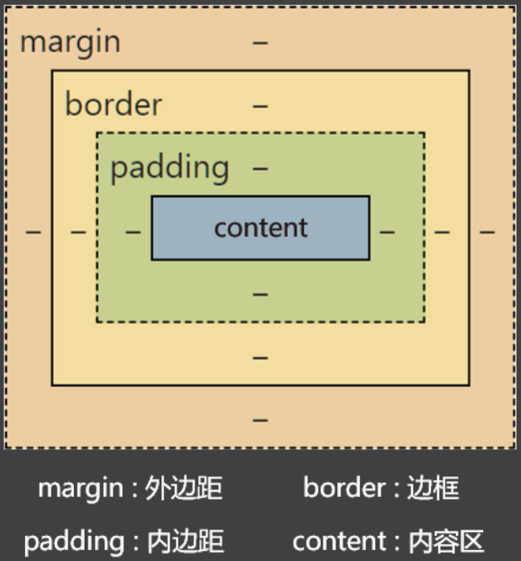

**`盒子的大小 = content + 左右 padding + 左右 border`**

>注意：
>
>1. 元素的 width 和 height 是 content 的宽和高。
>2. 外边距 margin 不会影响盒子的大小，但会影响盒子的位置。
>3. background-color 会填充边框区域，但如果 border 有颜色，会覆盖 backgroud-color。如果希望 border 颜色不覆盖，可以设置为 transparent。 

示例：

```html
<!DOCTYPE html>
<html lang="zh-CN">

<head>
    <meta charset="UTF-8">
    <title>05_盒子模型的组成部分</title>
    <style>
        div {
            /* 内容区的宽 */
            width: 400px;
            /* 内容区的高 */
            height: 400px;
            /* 内边距，设置的背景颜色会填充内边距区域 */
            padding: 20px;
            /* 边框，设置的背景颜色会填充边框区域 */
            border: 10px dashed red;
            /* 外边距 */
            margin: 50px;

            font-size: 20px;
            background-color: gray;
        }
    </style>
</head>

<body>
    <div>你好啊</div>
</body>

</html>
```

> 备注：
> 有的时候，CSS 设置的长度，与浏览器上盒子模型显示的长度不一致，出现这种现象的原因是因为，显示器开了缩放导致，如图所示：
>
> 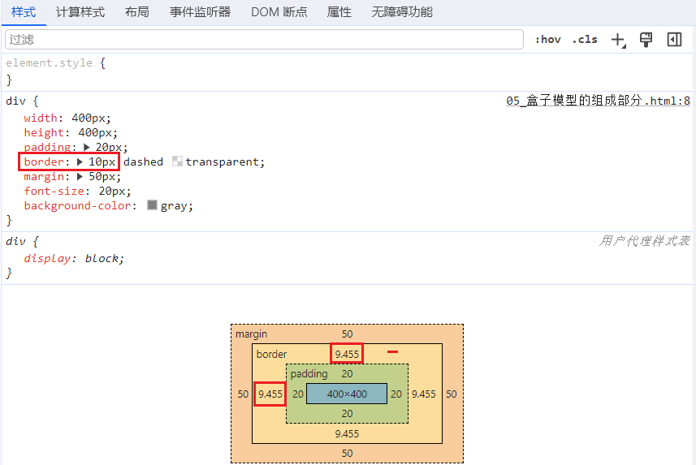
>
> 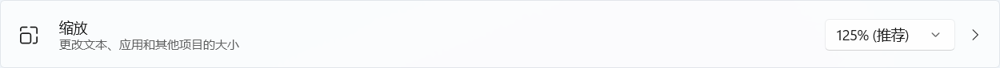

##### 盒子内容区 —— content

相关属性：

| 属性名       | 功能                   | 属性值 |
| ------------ | ---------------------- | ------ |
| `windth`     | 设置内容区域的宽度     | 长度值 |
| `max-width`  | 设置内容区域的最大宽度 | 长度值 |
| `min-width`  | 设置内容区域的最小宽度 | 长度值 |
| `height`     | 设置内容区域的高度     | 长度值 |
| `max-height` | 设置内容区域的最大高度 | 长度值 |
| `min-height` | 设置内容区域的最小高度 | 长度值 |

>注意：
>
>- max-width、min-width 一般不与 width 一起使用。
>- max-height、min-height 一般不与 height 一起使用。
>- 如果内容区未设置宽度，块级元素宽度跟随父元素，如果父元素也没有设置，最终取决于视口的大小（即浏览器页面窗口的大小）。

示例：

```html
<!DOCTYPE html>
<html lang="zh-CN">

<head>
    <meta charset="UTF-8">
    <title>06_盒子的内容区_content</title>
    <style>
        div {
            width: 800px;
            /* min-width: 600px; */
            /* max-width: 1000px; */

            height: 200px;
            /* min-height: 50px; */
            /* max-height: 400px; */
            background-color: skyblue;
        }
    </style>
</head>

<body>
    <div>Lorem ipsum dolor sit amet consectetur adipisicing elit. Impedit, atque optio, dicta error modi voluptatibus
        velit, nemo nesciunt dignissimos exercitationem incidunt ratione consectetur eos totam quisquam! Dolores minima
        magni necessitatibus, debitis sit, et tenetur temporibus quasi exercitationem porro, eligendi ipsam facilis
        adipisci praesentium aspernatur maxime quis itaque tempore enim saepe eveniet. Error soluta nobis facilis ut
        quia officia voluptas amet odio recusandae! Eos suscipit ab nihil. Perspiciatis ut impedit ea porro maiores
        ullam qui libero ipsam! Unde veniam id nostrum aliquid ex voluptas eum officia minus optio deserunt hic
        praesentium animi nihil, quisquam eveniet vitae nam doloribus non asperiores a expedita at saepe accusamus.
        Incidunt deleniti culpa est, consequuntur quis dolore amet vel tempore sequi beatae nulla accusamus fugit nihil
        mollitia. Aliquam consequatur, tempora suscipit porro distinctio illum autem architecto obcaecati vitae pariatur
        exercitationem hic totam et iusto, ut doloremque facilis voluptatibus, quo doloribus reiciendis placeat.
        Voluptatibus esse doloremque exercitationem blanditiis aliquid quo voluptate beatae labore itaque nostrum harum
        nemo unde ea deleniti rem quis nesciunt consequatur, vel modi a magnam atque! Necessitatibus, eligendi! Ipsum
        consequuntur officiis reiciendis laboriosam atque saepe inventore facere repellendus incidunt, nobis et
        deserunt! Sunt minima odio voluptas voluptatibus. At id nesciunt tempora quam consequatur omnis eos odit
        numquam! Possimus, consequuntur, nam maiores veniam ipsam consequatur repellat aspernatur earum soluta nisi
        voluptates molestiae amet magni facilis omnis natus nostrum placeat accusamus quasi sint facere perspiciatis
        tempora vel voluptatibus. Expedita voluptas quia cupiditate optio harum sapiente pariatur fuga corporis quas
        doloribus. Praesentium aut illum blanditiis, eaque placeat aliquid voluptatibus minima perferendis rerum aliquam
        veniam porro cum quia! Maiores, soluta dignissimos. Voluptatem delectus laudantium, temporibus, vel totam amet
        fugiat ducimus provident labore quos eligendi consequatur numquam dolore aspernatur fuga atque ut nobis!
        Quisquam alias labore culpa, nulla ut temporibus inventore, earum, quod ipsum ea amet iusto. Recusandae nihil
        laboriosam quis porro nemo nesciunt sed qui facere sint officia, omnis dolorum quam corrupti molestiae
        aspernatur, dolor ipsam voluptatem vitae fuga error. Cumque, neque eius quos ut est itaque tempora voluptatum
        repellendus. Nihil quas molestiae qui! Nihil ea atque veniam modi iure maxime in ipsam quisquam pariatur magni
        adipisci autem non id, ab labore odio nesciunt nostrum nemo laborum. Ea adipisci dignissimos, qui, omnis et
        eaque neque reiciendis ipsum at iure, numquam consectetur ipsa inventore doloribus minus dolorum optio nostrum
        doloremque praesentium magnam iusto sit voluptatum ut? Omnis, atque ratione soluta vitae veritatis officia quae
        iste placeat, commodi magni sit. Voluptates, temporibus perspiciatis. Omnis velit nemo vero minus alias est
        eveniet deserunt unde, at quo. Saepe, debitis impedit! Sint unde maxime eius voluptas blanditiis nobis
        aspernatur error temporibus nisi iste eligendi vitae, consectetur numquam culpa, debitis veritatis consequuntur
        aliquid. Labore porro, voluptatibus consequatur facilis, nulla, dignissimos aliquam similique ullam odio
        nesciunt animi commodi praesentium perspiciatis est eum error explicabo exercitationem tempora? Cupiditate
        debitis veniam, temporibus dicta amet tempore modi voluptatum optio ratione alias quidem earum in, maxime est
        quo vero recusandae beatae? Architecto, veniam pariatur. Numquam officia qui, dicta quaerat eius, cupiditate
        sequi dolorem dolorum molestias beatae tempora? Similique exercitationem corporis illo debitis eligendi cumque
        voluptate mollitia doloribus perspiciatis alias amet quam aut sapiente voluptatem tempora, numquam repellat id
        repudiandae totam ipsam quae velit. Ad reiciendis nulla mollitia quaerat doloremque, ducimus suscipit architecto
        voluptatem molestias iusto quibusdam expedita ab soluta corporis. Esse pariatur totam nisi voluptates neque ad
        eligendi, molestiae minima culpa sed ex perferendis natus rerum iusto quos iure, recusandae commodi magnam
        consectetur officiis adipisci veritatis quae tempore. Reprehenderit eius architecto id harum eos distinctio
        blanditiis nihil quod natus sunt, fuga aliquam odit dolore. Nostrum incidunt dicta quidem quas fugit fuga
        officia sit! Harum nam maiores eum tempore animi officia earum repudiandae reiciendis pariatur? Fuga repudiandae
        quia voluptatibus nobis omnis recusandae tempora ipsa reiciendis a obcaecati in et fugit amet cupiditate
        architecto, provident nostrum quisquam maxime? Praesentium earum modi consequuntur pariatur autem molestiae ea
        expedita dicta perferendis provident quis eveniet ducimus dolorum exercitationem enim dolorem, asperiores
        nesciunt nemo eaque nulla mollitia. Quae at eius eligendi laudantium quod natus dicta quam dolorem voluptatibus,
        facere quasi labore vitae magni sequi sunt nobis optio officiis pariatur deserunt reiciendis ipsa. Harum veniam
        eum ducimus cum odit reprehenderit fuga? Necessitatibus dolorem perspiciatis reiciendis quibusdam maiores fuga
        tempore distinctio et saepe, accusamus, nostrum deleniti assumenda, vel recusandae iusto ut nesciunt
        consequuntur vero unde sed debitis nihil? Impedit facere quod non optio officia eius, rerum culpa consequatur
        repellendus. Explicabo, vel nihil placeat optio expedita corrupti fugiat magni voluptatum deserunt, autem hic
        deleniti porro molestiae. Vero, culpa. Corrupti soluta nesciunt praesentium culpa nihil ratione eligendi
        excepturi quam ex totam incidunt nostrum minima eius provident repudiandae ipsam exercitationem, veniam nam.
        Explicabo cupiditate nulla similique labore, tenetur unde architecto esse neque quae repellat corporis pariatur
        iusto dicta provident dignissimos minus quaerat ipsa, aut consectetur. Odit iure aut rem corrupti perspiciatis
        repudiandae debitis recusandae officiis exercitationem quam quisquam, cumque rerum!</div>
</body>

</html>
```

##### 关于默认宽度

所谓的默认宽度，就是不设置 width 属性时，元素所呈现出来的宽度。

`总宽度 = 父的 content — 自身的左右 margin`

`内容区的宽度 = 父的 content — 自身的左右 margin — 自身的左右 border — 自身的左右 padding`

##### 盒子内边距 —— padding

相关属性：

| 属性名           | 功能     | 属性值                    |
| ---------------- | -------- | ------------------------- |
| `padding-top`    | 上内边距 | 长度值                    |
| `padding-right`  | 右内边距 | 长度值                    |
| `padding-bottom` | 下内边距 | 长度值                    |
| `padding-left`   | 左内边距 | 长度值                    |
| `padding`        | 符合属性 | 长度，可以设置 1 ~ 4 个值 |

padding 复合属性的使用规则：

1. `padding: 10px;`：四个方向内边距都是 10 px。
2. `padding: 10px 20px;`：上 10 px，左右 20 px。（上下、左右）
3. `padding: 10px 20px 30px;`：上 10 px，左右 20 px，下 30 px。（上、左右、下）
4. `padding: 10px 20px 30px 40px;`：上 10 px，右 20 px，下 30 px，左 40 px。（上、右、下、左）

> 注意：
>
> - padding 的值不能为负数。
> - **行内元素**的左右内边距是没问题的，**上下内边距不能完美的设置**。
> - **块级元素和行内块元素**，四个方向内边距都可以完美设置。

示例：

```html
<!DOCTYPE html>
<html lang="zh-CN">

<head>
    <meta charset="UTF-8">
    <title>08_盒子的内边距_padding</title>
    <style>
        #d1 {
            width: 400px;
            height: 400px;

            /* 左侧内边距 */
            /* padding-left: 20px; */

            /* 上内边距 */
            /* padding-top: 30px; */

            /* 右侧内边距 */
            /* padding-right: 40px; */

            /* 底内边距 */
            /* padding-bottom: 50px; */

            /* 复合属性，写一个值，含义：四个方向的内边距是一样的 */
            /* padding: 20px; */

            /* 复合属性，写两个值，含义：上下、左右 */
            /* padding: 10px 20px; */

            /* 复合属性，写三个值，含义：上、左右、下 */
            /* padding: 10px 20px 30px; */

            /* 复合属性，写四个值，含义：上、右、下、左 */
            /* padding: 10px 20px 30px 40px; */


            font-size: 20px;
            background-color: skyblue;
        }

        span {
            background-color: orange;
            font-size: 20px;
            padding-left: 20px;
            padding-right: 20px;
            padding-top: 20px;
            padding-bottom: 20px;
        }

        img {
            width: 200px;
            padding: 50px;
        }
    </style>
</head>

<body>
    <div id="d1">你好啊</div>
    <hr>
    <span>我很好</span>
    <div>Lorem ipsum dolor sit amet, consectetur adipisicing elit. Sunt, sint.</div>
    <hr>
    
    <div>小姐姐很想你呀</div>
</body>

</html>
```

##### 盒子边框 —— border

相关属性：

| 属性名                                                       | 功能                                 | 属性值                                                       |
| ------------------------------------------------------------ | ------------------------------------ | ------------------------------------------------------------ |
| `border-style`                                               | 边框线风格，复合了四个方向的边框风格 | `none`： 默认值<br />`solid`： 实线<br />`dashed`： 虚线<br />`dotted`： 点线<br />`double`： 双实线<br />...... |
| `border-width`                                               | 边框线风格，复合了四个方向的边框宽度 | 长度，**默认 3 px**                                          |
| `border-color`                                               | 边框线风格，复合了四个方向的边框颜色 | 颜色，**默认黑色**                                           |
| `border`                                                     | 复合属性                             | 值没有顺序和数量要求                                         |
| `border-left`<br />`border-left-style`<br />`border-left-width`<br />`border-left-color`<br /><br />`border-right`<br />`border-right-style`<br />`border-right-width`<br />`border-right-color`<br /><br />`border-top`<br />`border-top-style`<br />`border-top-width`<br />`border-top-color`<br /><br />`border-bottom`<br />`border-bottom-style`<br />`border-bottom-width`<br />`border-bottom-color` | 分别设置各个方向的边框               | 同上                                                         |

>边框相关属性共 20 个，border-style、border-width、border-color 其实也是复合属性。

示例：

```html
<!DOCTYPE html>
<html lang="zh-CN">

<head>
    <meta charset="UTF-8">
    <title>09_盒子的边框_border</title>
    <style>
        div {
            width: 400px;
            height: 400px;
            background-color: skyblue;

            border-left-width: 10px;
            border-right-width: 20px;
            border-top-width: 30px;
            border-bottom-width: 40px;

            border-left-color: red;
            border-right-color: orange;
            border-top-color: green;
            border-bottom-color: tomato;

            border-left-style: solid;
            border-right-style: dashed;
            border-top-style: double;
            border-bottom-style: dotted;

            /* border-color: red; */
            /* border-width: 80px; */
            /* border-style: dashed; */

            border-left: 50px solid purple;
            border-right: 60px dashed orange;
            border-top: 70px double green;
            border-bottom: 80px dotted gray;

            /* border: 10px solid red; */
        }
    </style>
</head>

<body>
    <div>你好啊</div>
</body>

</html>
```

##### 盒子外边距 —— margin

相关属性：

| 属性名          | 功能                                                         | 属性值 |
| --------------- | ------------------------------------------------------------ | ------ |
| `margin-left`   | 左外边距                                                     | 长度值 |
| `margin-right`  | 右外边距                                                     | 长度值 |
| `margin-top`    | 上外边距                                                     | 长度值 |
| `margin-bottom` | 下外边距                                                     | 长度值 |
| `margin`        | 符合属性，可以写 1 ~ 4 个值，规律同 padding（上，右，下，左，顺时针方向） | 长度值 |

示例：

```html
<!DOCTYPE html>
<html lang="zh-CN">

<head>
    <meta charset="UTF-8">
    <title>10_盒子的外边距_margin</title>
    <style>
        div {
            width: 400px;
            height: 400px;

            /* margin-left: 10px; */
            /* margin-right: 20px; */
            /* margin-top: 30px; */
            /* margin-bottom: 40px; */

            /* margin: 50px; */
            /* margin: 10px 20px; */
            /* margin: 10px 20px 30px; */
            /* margin: 10px 20px 30px 40px; */

            background-color: skyblue;
        }
    </style>
</head>

<body>
    <div>你好啊</div>
</body>

</html>
```

###### margin 注意事项

**一：子元素的 margin，是基于父元素的 content 计算的。（因为是父亲的 content 中承装着子元素）**

```html
<!DOCTYPE html>
<html lang="zh-CN">

<head>
    <meta charset="UTF-8">
    <title>11_margin的注意事项1</title>
    <style>
        .outer {
            width: 400px;
            height: 400px;
            padding: 50px;
            background-color: gray;
        }

        .inner {
            width: 100px;
            height: 100px;
            margin: 100px;
            background-color: orange;
        }
    </style>
</head>

<body>
    <!-- 子元素的margin是基于父元素的content计算的。 -->
    <div class="outer">
        <div class="inner"></div>
    </div>
</body>

</html>
```

**二：上 margin、左 margin：影响自己的位置；下 margin、右 margin：影响后面兄弟元素的位置。**

```html
<!DOCTYPE html>
<html lang="zh-CN">

<head>
    <meta charset="UTF-8">
    <title>12_margin的注意事项2</title>
    <style>
        .box {
            width: 200px;
            height: 200px;
        }

        .box1 {
            background-color: skyblue;
        }

        .box2 {
            background-color: orange;
            margin-top: 50px;
            margin-bottom: 50px;
        }

        .box3 {
            background-color: green;
        }

        .second {
            margin-left: 50px;
            margin-right: 50px;
        }
    </style>
</head>

<body>
    <!-- 上margin、左margin会影响自身的位置，下margin、右margin会影响兄弟元素的位置 -->
    <div class="box box1">1</div>
    <div class="box box2">2</div>
    <div class="box box3">3</div>
    <hr>
    
</body>

</html>
```

**三：块级元素、行内块元素，均可以完美地设置四个方向的 margin；但行内元素，左右 margin 可以完美设置，上下 margin 设置无效。**

```html
<!DOCTYPE html>
<html lang="zh-CN">

<head>
    <meta charset="UTF-8">
    <title>13_margin的注意事项3</title>
    <style>
        #d1 {
            width: 400px;
            height: 400px;
            margin: 50px;
            background-color: deepskyblue;
        }

        img {
            margin: 50px;
        }

        .one {
            background-color: skyblue;
        }

        .two {
            background-color: orange;
            margin-left: 50px;
            margin-right: 50px;
            margin-top: 3000px;
            margin-bottom: 3000px;
        }

        .three {
            background-color: green;
        }
    </style>
</head>

<body>
    <!-- 对于行内元素来说，左右的margin是可以完美设置的，上下的margin设置后是无效的。 -->
    <div id="d1">我是一个块级元素</div>
    <div>我是一段文字</div>
    <hr>
    
    <div>我是一段文字</div>
    <hr>
    <span class="one">人之初</span><span class="two">性本善</span><span class="three">性相近</span>
    <div>我是一段文字</div>
</body>

</html>
```

**四：margin 的值也可以是 auto，如果给一个块级元素设置左右 margin 都为 auto，该块级元素会在父元素中水平居中。(行内元素无效）**

```html
<!DOCTYPE html>
<html lang="zh-CN">

<head>
    <meta charset="UTF-8">
    <title>14_margin的注意事项4</title>
    <style>
        div {
            width: 800px;
            height: 100px;
            /* margin-left: auto; */
            /* margin-right: auto; */
            margin: 100px auto;
            background-color: deepskyblue;
        }

        span {
            background-color: purple;
            margin: 0 auto;
        }
    </style>
</head>

<body>
    <!-- margin的值也可以是auto，给一个块级元素左右margin设置auto可以实现该元素在其父元素内水平居中 -->
    <div>你好啊</div>
    <span>好好学习</span>
</body>

</html>
```

**五：margin 的值可以是负值。**

```html
<!DOCTYPE html>
<html lang="zh-CN">

<head>
    <meta charset="UTF-8">
    <title>15_margin的注意事项5</title>
    <style>
        .box {
            width: 200px;
            height: 200px;
        }

        .box1 {
            background-color: skyblue;
        }

        .box2 {
            margin-top: -200px;
            background-color: orange;
        }
    </style>
</head>

<body>
    <div class="box box1">1</div>
    <div class="box box2">2</div>
</body>

</html>
```

###### margin 塌陷问题

`margin 塌陷`：`第一个子元素的上 margin`会作用在父元素上，`最后一个子元素的下 margin`会作用在父元素上。

如何解决 margin 塌陷：

- 方案一：给父元素设置`不为 0 的 padding`。
- 方案二：给父元素设置`宽度不为 0 的 border`。
- 方案三：给父元素设置 CSS 样式`overflow:hidden`。（优选）

示例：

```html
<!DOCTYPE html>
<html lang="zh-CN">

<head>
    <meta charset="UTF-8">
    <title>16_margin塌陷问题</title>
    <style>
        .outer {
            width: 400px;
            /* height: 400px; */
            background-color: gray;
            /* 方式一 */
            /* padding: 10px; */
            /* 方式二 */
            /* border: 10px solid transparent; */
            /* 方式三 */
            overflow: hidden;
        }

        .inner1 {
            width: 100px;
            height: 100px;
            background-color: orange;
            /* 如果不对父元素特殊设置，下面这行代码是有问题的 */
            margin-top: 50px;
        }

        .inner2 {
            width: 100px;
            height: 100px;
            background-color: green;
            /* 如果不对父元素特殊设置，下面这行代码是有问题的 */
            margin-bottom: 50px;
        }
    </style>
</head>

<body>
    <div class="outer">
        <div class="inner1">inner1</div>
        <div class="inner2">inner2</div>
    </div>
    <div>我是一段测试的文字</div>
</body>

</html>
```

###### margin 合并问题

`marigin 合并`：上面兄弟元素的下外边距和下面兄弟元素的上外边距会合并，`取一个最大的值`，而不是相加。（左右兄弟元素不影响）

如何解决 margin 合并：无需解决，布局的时候上下的兄弟元素，只给一个设置上下外边距就可以了。

示例：

```html
<!DOCTYPE html>
<html lang="zh-CN">

<head>
    <meta charset="UTF-8">
    <title>17_margin合并问题</title>
    <style>
        .box {
            width: 200px;
            height: 200px;
        }

        .box1 {
            background-color: deepskyblue;
            /* margin-bottom: 110px; */
        }

        .box2 {
            background-color: orange;
            margin-top: 110px;
        }

        .test {
            width: 200px;
            height: 200px;
            display: inline-block;
        }

        .testa {
            background-color: purple;
            margin-right: 50px;
        }

        .testb {
            background-color: tomato;
            margin-left: 50px;
        }
    </style>
</head>

<body>
    <div class="box box1">1</div>
    <div class="box box2">2</div>
    <hr>
    <div class="test testa">a</div>
    <div class="test testb">b</div>
</body>

</html>
```

##### 处理内容溢出

相关属性：

| 属性名       | 功能                       | 属性值                                                       |
| ------------ | -------------------------- | ------------------------------------------------------------ |
| `overflow`   | 溢出内容的处理方式         | `visible`：显示，默认值<br />`hidden`：隐藏<br />`scroll`：显示滚动条，不论内容是否溢出<br />`auto`：自动显示滚动条，内容不溢出不显示 |
| `overflow-x` | 水平方向溢出内容的处理方式 | 同上                                                         |
| `overflow-y` | 垂直方向溢出内容的处理方式 | 同上                                                         |

> 注意：
>
> - overflow-x、overflow-y 不能一个是 hidden，一个是 visible，是实验性属性，不建议使用。
> - **overflow 常用的值是 hidden 和 auto**，除了能处理溢出的显示方式，还可以解决很多疑难杂症。

示例：

```html
<!DOCTYPE html>
<html lang="zh-CN">

<head>
    <meta charset="UTF-8">
    <title>18_处理内容的溢出</title>
    <style>
        #d1 {
            width: 400px;
            height: 200px;
            background-color: skyblue;
            overflow: auto;
            /* overflow-x: visible; */
            /* overflow-y: hidden; */
        }

        #d2 {
            width: 1000px;
            background-color: orange;
        }
    </style>
</head>

<body>
    <div id="d1">
        Lorem ipsum dolor sit amet consectetur adipisicing elit. Quo accusantium veritatis reiciendis id
        molestiae magnam aspernatur esse blanditiis est. Maiores reprehenderit porro dignissimos, perspiciatis suscipit
        <div id="d2">
            Lorem ipsum dolor sit amet, consectetur adipisicing elit. Consectetur alias provident quia,
            reiciendis incidunt rerum, perspiciatis quam nobis omnis quae maxime in esse architecto doloremque numquam
            tenetur eum quasi velit excepturi ut id inventore. Consequuntur, ad iure velit maiores obcaecati
            voluptatibus expedita molestiae natus sit mollitia veritatis vero aliquid adipisci?
        </div>
        ullam perferendis nam inventore sapiente earum voluptatem dolores ut quae fuga. Itaque delectus cum et illum
        enim dicta similique nemo pariatur, recusandae molestias. Repellendus ratione recusandae minima ea quis eligendi
        quae amet. Animi, nulla. Perferendis libero nihil eligendi ea! Accusantium molestias numquam reprehenderit
        quibusdam delectus, repellat impedit ratione. Iste nam autem vero magni facilis at ex ullam, officiis, corrupti
        voluptate tempora. Quibusdam, aperiam eveniet illo quidem excepturi, neque, repellat totam beatae in quas
        provident natus!
    </div>
</body>

</html>
```

##### 隐藏元素的方式

###### visibility 属性

visibility 属性默认值是 show ，如果设置为`visibility:hidden`，元素会隐藏。

此时，**虽然元素看不见了，但是还占有原来的位置（元素的大小依然保持）。**

###### display 属性

通过设置`display: none`，可以让元素隐藏。

此时，**元素被彻底地隐藏，不但看不见，也不占用任何位置，没有大小宽高。**

###### 示例

```html
<!DOCTYPE html>
<html lang="zh-CN">

<head>
    <meta charset="UTF-8">
    <title>19_隐藏元素的两种方式</title>
    <style>
        .box {
            width: 200px;
            height: 200px;
        }

        .box1 {
            background-color: skyblue;
            display: none;
            /* visibility: hidden; */
        }

        .box2 {
            background-color: orange;
        }
    </style>
</head>

<body>
    <div class="box box1">1</div>
    <div class="box box2">2</div>
</body>

</html>
```

##### 样式的继承

CSS 中，有些样式会继承，元素如果本身设置了某个样式，就使用本身设置的样式；但如果本身没有设置某个样式，会从父元素开始一级一级继承（优先继承离得近的祖先元素）。

会继承的属性：`字体属性`、`文本属性 (除了vertical-align)`、`文字颜色`等。

不会继承的属性：`边框`、`背景`、`内边距`、`外边距`、`宽高`、`溢出方式`等。

>一个规律：能继承的属性，都是不影响布局的，简单说，都是和盒子模型没关系的。

示例：

```html
<!DOCTYPE html>
<html lang="zh-CN">

<head>
    <meta charset="UTF-8">
    <title>20_样式的继承</title>
    <link rel="stylesheet" href="./index.css">
    <style>
        /* body {
            
        } */
        #d1 {
            height: 600px;
            padding: 50px;
            background-color: gray;
        }

        #d2 {
            height: 400px;
            padding: 50px;
            background-color: orange;
            font-size: 40px;
            color: yellow;
            font-weight: bold;
        }

        #d3 {
            height: 200px;
            background-color: green;
        }
    </style>
</head>

<body>
    <div id="d1">
        <div id="d2">
            <div id="d3" style="font-family: 隶书;">你好啊</div>
        </div>
    </div>
</body>

</html>
```

>浏览器中样式分类查看：
>
>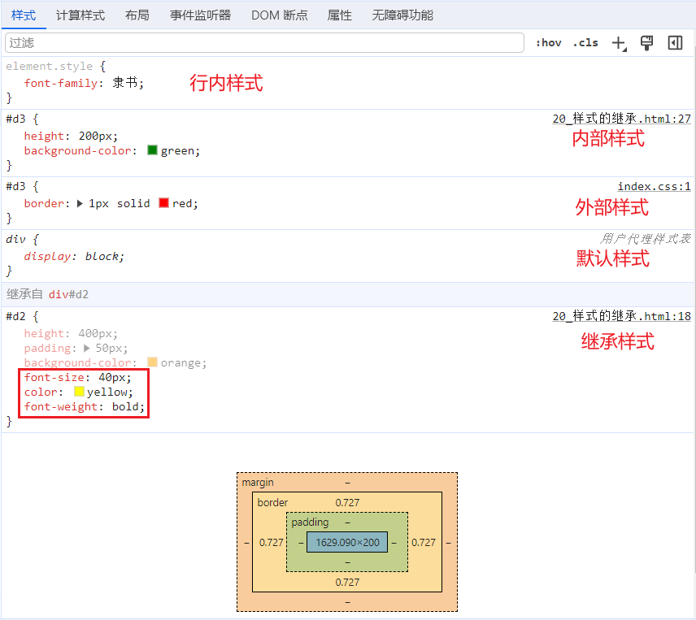

##### 默认样式

元素一般都些默认的样式，例如：

1. `<a>`元素：下划线、字体颜色、鼠标小手。
2. `<h1> ~ <h6>`元素：文字加粗、文字大小、上下外边距。
3. `<p>`元素：上下外边距。
4. `<ul> 和 <ol>`元素：左内边距。
5. `<body>`元素：8 px 外边距（4 个方向）。

......

优先级：**`元素的默认样式 > 继承的样式`**，所以如果要重置元素的默认样式，选择器一定要直接选择器到该元素。

示例：

```html
<!DOCTYPE html>
<html lang="zh-CN">

<head>
    <meta charset="UTF-8">
    <title>21_元素的默认样式</title>
    <style>
        body {
            margin: 0;
        }

        #d1 {
            font-size: 50px;
            color: orange;
            background-color: gray;
        }

        a {
            color: black;
            text-decoration: none;
            cursor: default;
        }
    </style>
</head>

<body>
    <div id="d1">
        <a href="https://www.baidu.com">去百度</a>
        <span>你好啊</span>
    </div>
    <hr>
    <h1>一级标题</h1>
    <h2>二级标题</h2>
    <hr>
    <p>我是一个段落</p>
    <hr>
    <ul>
        <li>张三</li>
        <li>李四</li>
    </ul>
</body>

</html>
```

##### 布局小技巧

**一：行内元素、行内块元素，可以被父元素当做文本处理。**即：可以像处理文本对齐一样，去处理行内、行内块在父元素中的对齐，例如：**text-align**、**line-height**、**text-indent** 等。

```html
<!DOCTYPE html>
<html lang="zh-CN">

<head>
    <meta charset="UTF-8">
    <title>22_布局技巧1</title>
    <style>
        .outer {
            width: 400px;
            height: 400px;
            background-color: gray;
            overflow: hidden;
        }

        .inner {
            width: 200px;
            height: 100px;
            background-color: orange;
            /* div居中 */
            margin: 0 auto;
            margin-top: 150px;
            /* 字体居中 */
            text-align: center;
            line-height: 100px;
        }
    </style>
</head>

<body>
    <div class="outer">
        <div class="inner">inner</div>
    </div>
</body>

</html>
```

**二：让子元素，在父亲中水平居中。**

- 若子元素为**块元素**，给父元素加上：`margin: 0 auto;`。
- 若子元素为**行内元素或行内块元素**，给父元素加上：`text-align: center`。

```html
<!DOCTYPE html>
<html lang="zh-CN">

<head>
    <meta charset="UTF-8">
    <title>23_布局技巧2</title>
    <style>
        .outer {
            width: 400px;
            height: 400px;
            background-color: gray;
            text-align: center;
            line-height: 400px;
        }

        .inner {
            background-color: orange;
            font-size: 20px;
        }
    </style>
</head>

<body>
    <div class="outer">
        <span class="inner">出来玩啊？</span>
    </div>
</body>

</html>
```

**三：让子元素，在父亲中垂直居中。**

- 若子元素为**块元素**，给子元素加上：`margin-top`，值为：`(父元素 content - 子元素盒子总高) / 2`。
- 若子元素为**行内元素**、**行内块元素**：
  - 让父元素的`height = line-height`，每个子元素都加上：`vertical-align: middle;`。
  - 补充：若想绝对垂直居中，父元素`font-size = 0`。

```html
<!DOCTYPE html>
<html lang="zh-CN">

<head>
    <meta charset="UTF-8">
    <title>24_布局技巧3</title>
    <style>
        .outer {
            width: 400px;
            height: 400px;
            background-color: gray;
            text-align: center;
            line-height: 400px;
            font-size: 0px;
            text-indent: 20px;
        }

        img {
            vertical-align: middle;
        }

        span {
            font-size: 40px;
            vertical-align: middle;
            background-color: orange;
        }
    </style>
</head>

<body>
    <div class="outer">
        <span>出来玩啊？</span>
        
    </div>
</body>

</html>
```

##### 元素之间的空白问题

**产生的原因：**行内元素、行内块元素，彼此之间的**换行**会被浏览器解析为一个空白字符。

**解决方案：**

1. 方案一：去掉换行和空格（不推荐）。
2. 方案二：给父元素设置`font-size: 0`，再给需要显示文字的元素，单独设置字体大小（推荐）。

示例：

```html
<!DOCTYPE html>
<html lang="zh-CN">

<head>
    <meta charset="UTF-8">
    <title>25_元素之间的空白问题</title>
    <style>
        div {
            height: 200px;
            background-color: gray;
            font-size: 0px;
        }

        .s1 {
            background-color: skyblue;
        }

        .s2 {
            background-color: orange;
        }

        .s3 {
            background-color: green;
        }

        span {
            font-size: 20px;
        }
    </style>
</head>

<body>
    <div>
        <span class="s1">人之初</span>
        <span class="s2">性本善</span>
        <span class="s3">性相近</span>
        <hr>
        
        
        
    </div>
</body>

</html>
```

##### 行内块的幽灵空白问题

**产生原因：**行内块元素与文本的基线对齐，而文本的基线与文本最底端之间是有一定距离的。

**解决方案：**

1. 方案一： 给行内块设置`vertical`，值不为 baseline 即可，设置为 middel、bottom、top 均可。
2. 方案二：若父元素中只有一张图片，设置图片为`display: block`。
3. 方案三：给父元素设置`font-size: 0`。如果该行内块内部还有文本，则需单独设置 font-size。

示例：

```html
<!DOCTYPE html>
<html lang="zh-CN">

<head>
    <meta charset="UTF-8">
    <title>26_行内块的幽灵空白问题</title>
    <style>
        div {
            width: 600px;
            background-color: skyblue;
            /* font-size: 0; */
        }

        img {
            height: 200px;
            /* vertical-align: bottom; */
            /* display: block; */
        }
    </style>
</head>

<body>
    <div>
        
    </div>
</body>

</html>
```

### 浮动

在最初，`浮动`是用来实现文字环绕图片效果的，现在浮动是主流的页面布局方式之一。

示例：

```html
<!DOCTYPE html>
<html lang="zh-CN">

<head>
    <meta charset="UTF-8">
    <title>01_浮动_简介</title>
    <style>
        div {
            width: 600px;
            height: 400px;
            background-color: skyblue;
        }

        img {
            width: 200px;
            float: right;
            /* margin-right: 0.5em; */
        }

        .test::first-letter {
            font-size: 80px;
            float: left;
        }
    </style>
</head>

<body>
    <div>
        
        Lorem ipsum dolor sit amet consectetur adipisicing elit. Sint, minus magnam accusamus eum laborum ducimus
        possimus beatae fugit illum molestias odit et asperiores adipisci sunt dolorem qui autem enim excepturi alias ab
        unde temporibus. Sapiente labore a magnam commodi itaque architecto quos doloribus voluptates perferendis rem,
        earum consectetur. Tempora inventore ducimus veritatis voluptatem deleniti rem laboriosam. Officiis, impedit
        explicabo! Impedit labore ea et vero rerum nihil in cum qui, itaque blanditiis eius nemo est? Tempora explicabo
        voluptates consectetur officia aperiam eos impedit veritatis necessitatibus quidem deleniti ea, in odit cum ex
        harum voluptas, quos eveniet quae voluptate aspernatur quod! Nostrum?
    </div>
    <hr>
    <div class="test">
        Lorem ipsum dolor sit amet consectetur, adipisicing elit. Quaerat voluptate impedit provident, debitis nostrum
        cumque iste ab ipsum tempora dicta neque aliquid error in dolorum qui iure. Quibusdam eligendi ea id! Accusamus
        praesentium vitae quidem iusto placeat provident alias tempore quasi quos, nesciunt rem, molestias quisquam?
        Quisquam laborum nulla ea veniam, nesciunt, dolores modi officia animi laboriosam minima exercitationem.
        Reiciendis enim sint at nisi quae obcaecati, vel iusto non libero officia possimus explicabo quis harum
        inventore sapiente accusantium id quidem cupiditate et expedita maiores perferendis! Reiciendis, distinctio
        doloribus! Quia harum iste doloremque pariatur obcaecati doloribus quasi iusto minima magnam iure!
    </div>
</body>

</html>
```

效果图：

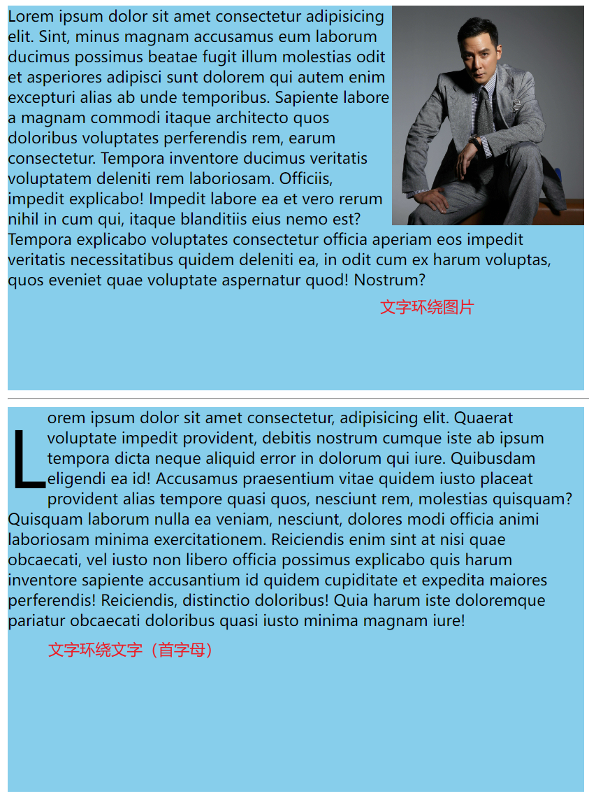

####  元素浮动后的特点

特点：

1. 🤢 `脱离文档流`。（不是一件好事，文档流可以理解为浮动前，元素所在的那个面，开启浮动后，元素飘在了那个面上方，也就是脱离了文档流）
2. 😊 不管浮动前是什么元素，浮动后：`默认宽与高都是被内容撑开（尽可能小），但是可以设置宽高。`
3. 😊 `不会独占一行`，可以与其他元素共用一行。
4. 😊 不会 margin 合并，也不会 margin 塌陷，`能够完美的设置四个方向的 margin 和 padding`。
5. 😊 `不会像行内块一样被当做文本处理`（没有行内块的空白问题，将两个相邻的兄弟元素浮动，虽然二者之间有换行，也不会有空白问题出现）。

> **浮动前：**
>
> 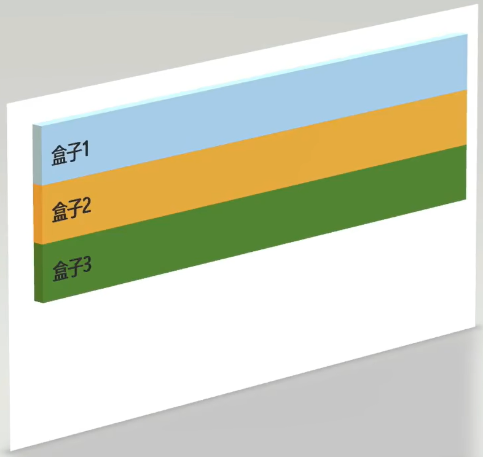
>
> **浮动后：**
>
> 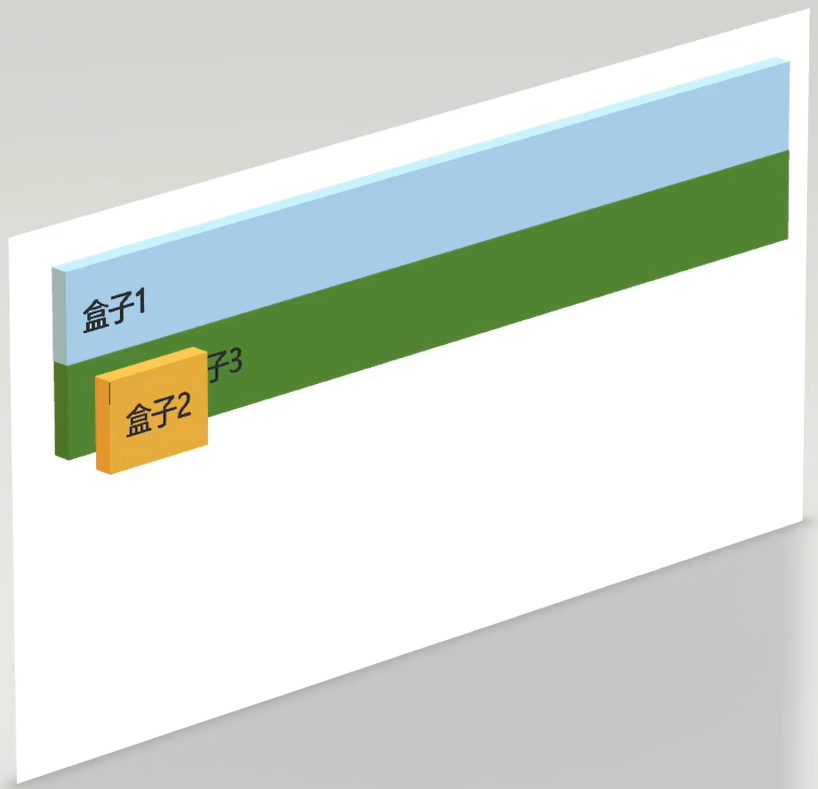
>
> - 可以看出，盒子 2 开启浮动后，是漂浮在盒子 3 上面的，而且盒子 3 中的文字会自动避开盒子 2 所在的区域。（将盒子 3 的高度设置大一点，也可以很明显的看出盒子 2 是漂浮在盒子 3 上方）

示例：

```html
<!DOCTYPE html>
<html lang="zh-CN">

<head>
    <meta charset="UTF-8">
    <title>02_元素浮动后的特点</title>
    <style>
        .outer {
            width: 800px;
            height: 400px;
            padding: 10px;
            background-color: gray;
            text-align: center;
        }

        .box {
            font-size: 20px;
            padding: 10px;
        }

        .box1 {
            background-color: skyblue;
        }

        .box2 {
            background-color: orange;
            float: left;
            /* width: 200px; */
            /* height: 200px; */
            /* margin-left: 20px; */
            /* margin-right: 20px; */
            /* margin-top: 20px; */
            /* margin-bottom: 20px; */
        }

        .box3 {
            background-color: green;
            float: left;
        }
    </style>
</head>

<body>
    <div class="outer">
        <div class="box box1">盒子1</div>
        <div class="box box2">盒子2</div>
        <div class="box box3">盒子3</div>
    </div>
</body>

</html>
```

#### 浮动小练习

**效果一：**

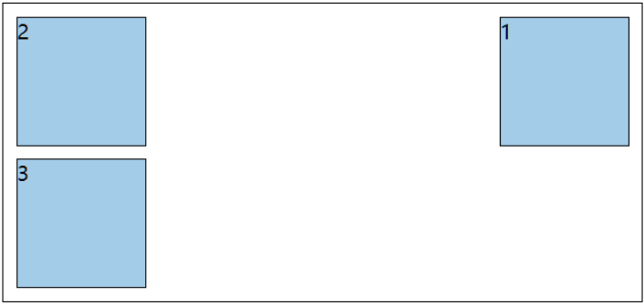

- 盒子 1 右浮动，脱离文档流，盒子 2 和盒子 3 未脱离文档流。

```html
<!DOCTYPE html>
<html lang="zh-CN">

<head>
    <meta charset="UTF-8">
    <title>03_浮动的小练习</title>
    <style>
        .outer {
            width: 500px;
            background-color: gray;
            border: 1px solid black;
        }

        .box {
            width: 200px;
            height: 200px;
            background-color: skyblue;
            border: 1px solid black;
            margin: 10px;
        }

        .box1 {
            float: right;
        }
    </style>
</head>

<body>
    <div class="outer">
        <div class="box box1">1</div>
        <div class="box box2">2</div>
        <div class="box box3">3</div>
    </div>
</body>

</html>
```

**效果二：**

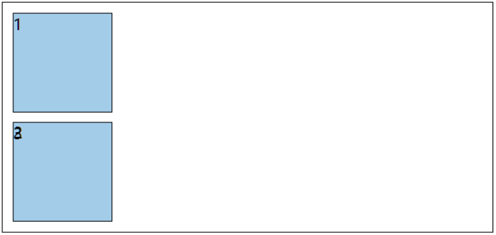

- 盒子 1 左浮动，脱离文档流，盒子 2 和盒子 3 未脱离文档流。盒子 1 漂浮在盒子 2 上方，盒子 2 的文字环绕在盒子 1 下方，与盒子 3 文字重叠。

```html
<!DOCTYPE html>
<html lang="zh-CN">

<head>
    <meta charset="UTF-8">
    <title>03_浮动的小练习</title>
    <style>
        .outer {
            width: 500px;
            background-color: gray;
            border: 1px solid black;
        }

        .box {
            width: 200px;
            height: 200px;
            background-color: skyblue;
            border: 1px solid black;
            margin: 10px;
        }

        .box1 {
            float: left;
        }
    </style>
</head>

<body>
    <div class="outer">
        <div class="box box1">1</div>
        <div class="box box2">2</div>
        <div class="box box3">3</div>
    </div>
</body>

</html>
```

**效果三：**

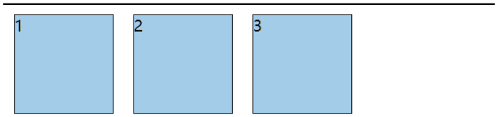

- 盒子 1、盒子 2、盒子 3 全部左浮动，脱离文档流，父元素盒子因为子元素都浮动，没有内容，高度为 0，成为了一条线。（边框有高度）

```html
<!DOCTYPE html>
<html lang="zh-CN">

<head>
    <meta charset="UTF-8">
    <title>03_浮动的小练习</title>
    <style>
        .outer {
            width: 500px;
            background-color: gray;
            border: 1px solid black;
        }

        .box {
            width: 100px;
            height: 100px;
            background-color: skyblue;
            border: 1px solid black;
            margin: 10px;
            float: left;
        }

        .box1 {
            
        }
    </style>
</head>

<body>
    <div class="outer">
        <div class="box box1">1</div>
        <div class="box box2">2</div>
        <div class="box box3">3</div>
    </div>
</body>

</html>
```

**效果四：**

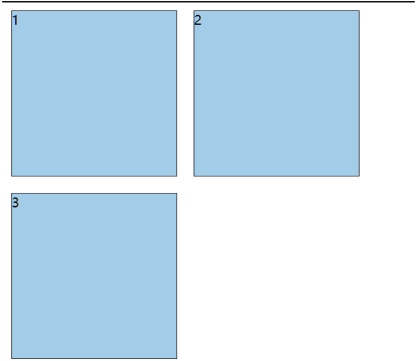

- 盒子 1、盒子 2、盒子 3 全部左浮动，脱离文档流，因为父元素盒子宽度不够，盒子 3  落在了下方。

```html
<!DOCTYPE html>
<html lang="zh-CN">

<head>
    <meta charset="UTF-8">
    <title>03_浮动的小练习</title>
    <style>
        .outer {
            width: 500px;
            background-color: gray;
            border: 1px solid black;
        }

        .box {
            width: 200px;
            height: 200px;
            background-color: skyblue;
            border: 1px solid black;
            margin: 10px;
            float: left;
        }

        .box1 {
            
        }
    </style>
</head>

<body>
    <div class="outer">
        <div class="box box1">1</div>
        <div class="box box2">2</div>
        <div class="box box3">3</div>
    </div>
</body>

</html>
```

**效果五：**

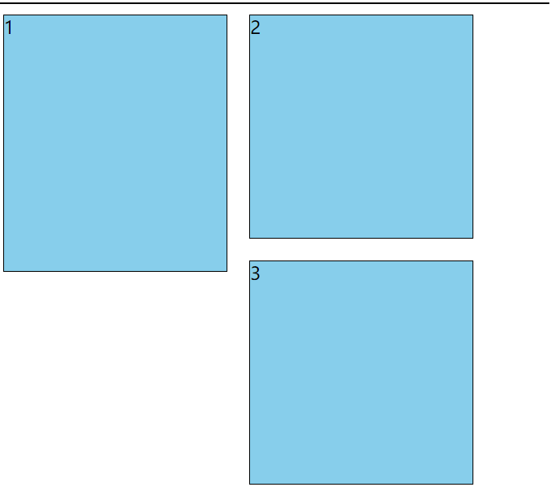

- 盒子 1、盒子 2、盒子 3 全部左浮动，脱离文档流，因为父元素盒子宽度不够，盒子 3  落在了下方。又因为盒子 1 高度大，盒子 3 被卡在了右方。

```html
<!DOCTYPE html>
<html lang="zh-CN">

<head>
    <meta charset="UTF-8">
    <title>03_浮动的小练习</title>
    <style>
        .outer {
            width: 500px;
            background-color: gray;
            border: 1px solid black;
        }

        .box {
            width: 200px;
            height: 200px;
            background-color: skyblue;
            border: 1px solid black;
            margin: 10px;
            float: left;
        }

        .box1 {
            height: 230px;
        }
    </style>
</head>

<body>
    <div class="outer">
        <div class="box box1">1</div>
        <div class="box box2">2</div>
        <div class="box box3">3</div>
    </div>
</body>

</html>
```

#### 解决浮动产生的影响

##### 元素浮动后会有哪些影响

**对兄弟元素的影响：** 后面的兄弟元素，会占据浮动元素之前的位置，在浮动元素的下面；对前面的兄弟无影响。

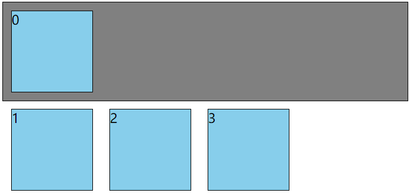

```html
<!DOCTYPE html>
<html lang="zh-CN">

<head>
    <meta charset="UTF-8">
    <title>04_浮动后的影响</title>
    <style>
        .outer {
            width: 500px;
            background-color: gray;
            border: 1px solid black;
        }

        .box {
            width: 100px;
            height: 100px;
            background-color: skyblue;
            border: 1px solid black;
            margin: 10px;
        }

        .box1,
        .box2,
        .box3 {
            float: left;
        }
    </style>
</head>

<body>
    <div class="outer">
        <!-- 盒子0不受影响，独占一行，父元素的高度都是由盒子0撑起来的 -->
        <div class="box box0">0</div>
        <div class="box box1">1</div>
        <div class="box box2">2</div>
        <div class="box box3">3</div>
    </div>

</html>
```

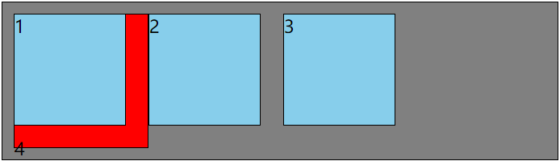

```html
<!DOCTYPE html>
<html lang="zh-CN">

<head>
    <meta charset="UTF-8">
    <title>04_浮动后的影响</title>
    <style>
        .outer {
            width: 500px;
            background-color: gray;
            border: 1px solid black;
        }

        .box {
            width: 100px;
            height: 100px;
            background-color: skyblue;
            border: 1px solid black;
            margin: 10px;
        }

        .box1,
        .box2,
        .box3 {
            float: left;
        }
    </style>
</head>

<body>
    <div class="outer">
        <div class="box box1">1</div>
        <div class="box box2">2</div>
        <div class="box box3">3</div>
        <!-- 盒子4在盒子1下方，文字环绕，父元素的高度都是由盒子0撑起来的 -->
        <div class="box box4" style="background-color: red; width: 120px; height: 120px;">4</div>
    </div>

</html>
```

**对父元素的影响：** 不能撑起父元素的高度，导致父元素高度塌陷（进而导致父元素的兄弟元素，样式环绕）；但父元素的宽度依然束缚浮动的元素。

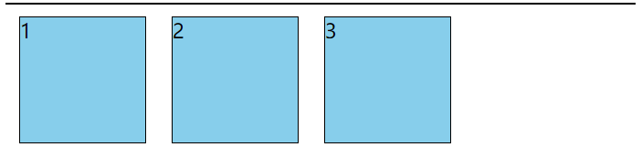

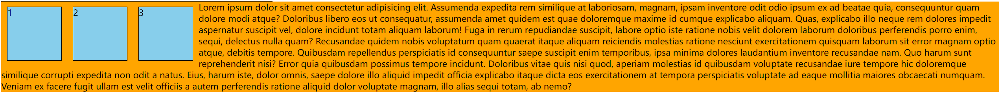

```html
<!DOCTYPE html>
<html lang="zh-CN">

<head>
    <meta charset="UTF-8">
    <title>04_浮动后的影响</title>
    <style>
        .outer {
            width: 500px;
            background-color: gray;
            border: 1px solid black;
        }

        .box {
            width: 100px;
            height: 100px;
            background-color: skyblue;
            border: 1px solid black;
            margin: 10px;
        }

        .box1,
        .box2,
        .box3 {
            float: left;
        }
    </style>
</head>

<body>
    <div class="outer">
        <div class="box box1">1</div>
        <div class="box box2">2</div>
        <div class="box box3">3</div>
    </div>
    <!-- <div style="background-color:orange">Lorem ipsum dolor sit amet consectetur adipisicing elit. Assumenda expedita rem similique at laboriosam, magnam, ipsam inventore odit odio ipsum ex ad beatae quia, consequuntur quam dolore modi atque? Doloribus libero eos ut consequatur, assumenda amet quidem est quae doloremque maxime id cumque explicabo aliquam. Quas, explicabo illo neque rem dolores impedit aspernatur suscipit vel, dolore incidunt totam aliquam laborum! Fuga in rerum repudiandae suscipit, labore optio iste ratione nobis velit dolorem laborum doloribus perferendis porro enim, sequi, delectus nulla quam? Recusandae quidem nobis voluptatum quam quaerat itaque aliquam reiciendis molestias ratione nesciunt exercitationem quisquam laborum sit error magnam optio atque, debitis tempore. Quibusdam repellendus perspiciatis id consequuntur saepe suscipit enim temporibus, ipsa minima dolores laudantium inventore recusandae nam. Quo harum sunt reprehenderit nisi? Error quia quibusdam possimus tempore incidunt. Doloribus vitae quis nisi quod, aperiam molestias id quibusdam voluptate recusandae iure tempore hic doloremque similique corrupti expedita non odit a natus. Eius, harum iste, dolor omnis, saepe dolore illo aliquid impedit officia explicabo itaque dicta eos exercitationem at tempora perspiciatis voluptate ad eaque mollitia maiores obcaecati numquam. Veniam ex facere fugit ullam est velit officiis a autem perferendis ratione aliquid dolor voluptate magnam, illo alias sequi totam, ab nemo?</div> -->
</body>

</html>
```

##### 解决浮动产生的影响（清除浮动）

效果：

1. 父元素的高度不受影响。
2. 后续兄弟元素不受影响。

**解决方案：**

1. 方案一： 给父元素指定高度。（但后续兄弟元素的影响未消除）

2. 方案二： 给父元素也设置浮动。（但后续兄弟元素的影响未消除，父元素的兄弟元素也会受影响）

3. 方案三： 给父元素设置`overflow: hidden`。（但后续兄弟元素的影响未消除）

4. 方案四： 在所有浮动元素的最后面，添加一个块级元素，并给该块级元素设置`clear: both`。（在浮动元素的最后面，加一个空 div，设置其 clear: both）

   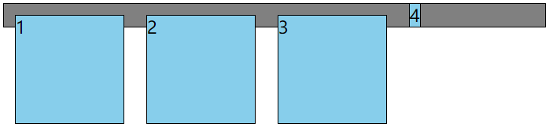

   ```html
   <!DOCTYPE html>
   <html lang="zh-CN">
   
   <head>
       <meta charset="UTF-8">
       <title>05_解决浮动后的影响</title>
       <style>
           .outer {
               width: 500px;
               background-color: gray;
               border: 1px solid black;
           }
   
           .box {
               width: 100px;
               height: 100px;
               background-color: skyblue;
               border: 1px solid black;
               margin: 10px;
           }
   
           .box1,
           .box2,
           .box3 {
               float: left;
           }
   
           .box4{
               display: inline;
               clear: both;
           }
       </style>
   </head>
   
   <body>
       <div class="outer">
           <div class="box box1">1</div>
           <div class="box box2">2</div>
           <div class="box box3">3</div>
           <div class="box box4">4</div>
       </div>
   </body>
   
   </html>
   ```

   - 前提一：后面的元素本身不能是浮动的。
   - 前提二：后面的元素本身不能是行内元素，否则无法撑开父元素的高度。

5. **`方案五`**： 给浮动元素的父元素，设置伪元素，通过伪元素清除浮动，原理与方案四相同。===> 推荐使用，但是注意，如果最后一个元素是不浮动的，这种方案解决不了问题。

   ```css
   .outer::after {
       content: '';
       display: block;
       clear: both;
   }
   ```

示例：

```html
<!DOCTYPE html>
<html lang="zh-CN">

<head>
    <meta charset="UTF-8">
    <title>05_解决浮动后的影响</title>
    <style>
        .outer {
            width: 500px;
            background-color: gray;
            border: 1px solid black;
            /* 第一种解决方案：父元素指定高度 */
            /* height: 122px; */

            /* 第二种解决方案：父元素也设置浮动 */
            /* float: left; */

            /* 第三种解决方案 */
            /* overflow: scroll; */

        }

        .box {
            width: 100px;
            height: 100px;
            background-color: skyblue;
            border: 1px solid black;
            margin: 10px;
        }

        .box1,
        .box2,
        .box3,
        .box4 {
            float: left;
        }

        .mofa {
            /* 第四种解决方案：兄弟元素添加clear: both */
            clear: both;
        }

        /* 第五种解决方案 */
        .outer::after {
            content: '';
            display: block;
            clear: both;
        }
    </style>
</head>

<body>
    <div class="outer">
        <div class="box box1">1</div>
        <div class="box box2">2</div>
        <div class="box box3">3</div>
        <div class="box box4">4</div>
        <!-- <div class="mofa"></div> -->
    </div>
    <div style="background-color:orange">Lorem ipsum dolor sit amet consectetur adipisicing elit. Assumenda expedita rem
        similique at laboriosam, magnam, ipsam inventore odit odio ipsum ex ad beatae quia, consequuntur quam dolore
        modi atque? Doloribus libero eos ut consequatur, assumenda amet quidem est quae doloremque maxime id cumque
        explicabo aliquam. Quas, explicabo illo neque rem dolores impedit aspernatur suscipit vel, dolore incidunt totam
        aliquam laborum! Fuga in rerum repudiandae suscipit, labore optio iste ratione nobis velit dolorem laborum
        doloribus perferendis porro enim, sequi, delectus nulla quam? Recusandae quidem nobis voluptatum quam quaerat
        itaque aliquam reiciendis molestias ratione nesciunt exercitationem quisquam laborum sit error magnam optio
        atque, debitis tempore. Quibusdam repellendus perspiciatis id consequuntur saepe suscipit enim temporibus, ipsa
        minima dolores laudantium inventore recusandae nam. Quo harum sunt reprehenderit nisi? Error quia quibusdam
        possimus tempore incidunt. Doloribus vitae quis nisi quod, aperiam molestias id quibusdam voluptate recusandae
        iure tempore hic doloremque similique corrupti expedita non odit a natus. Eius, harum iste, dolor omnis, saepe
        dolore illo aliquid impedit officia explicabo itaque dicta eos exercitationem at tempora perspiciatis voluptate
        ad eaque mollitia maiores obcaecati numquam. Veniam ex facere fugit ullam est velit officiis a autem perferendis
        ratione aliquid dolor voluptate magnam, illo alias sequi totam, ab nemo?</div>
</body>

</html>
```

>布局中的一个原则：`设置浮动的时候，兄弟元素要么全都浮动，要么全都不浮动。`

#### 浮动布局小练习

整体效果：

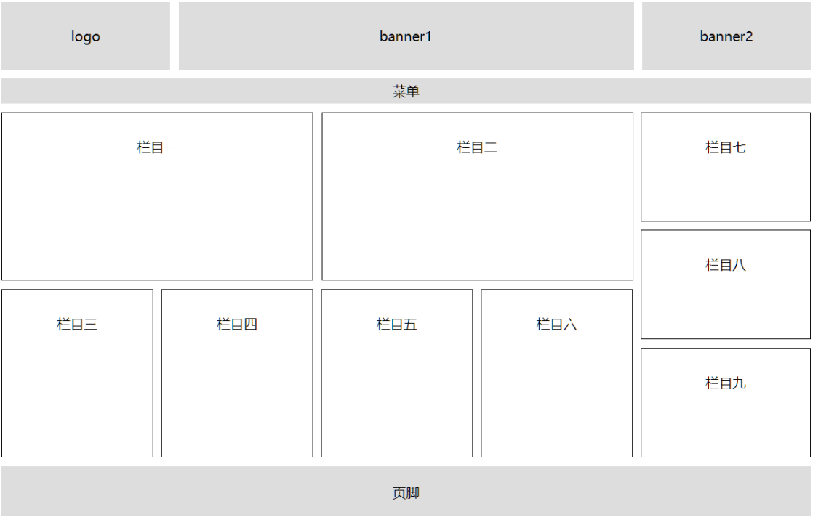

具体标注：

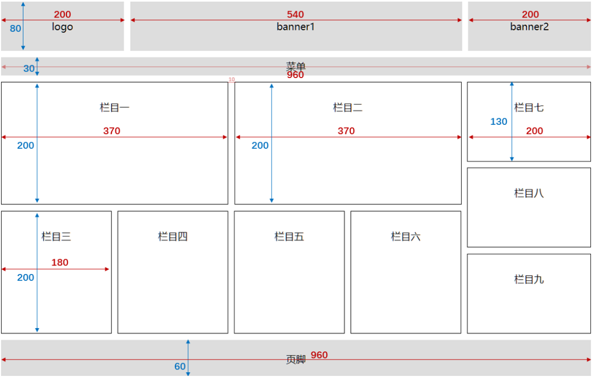

代码：

```html
<!DOCTYPE html>
<html lang="zh-CN">

<head>
    <meta charset="UTF-8">
    <title>06_浮动布局小练习</title>
    <style>
        * {
            margin: 0;
            padding: 0;
        }

        .leftfix {
            float: left;
        }

        .rightfix {
            float: right;
        }

        .clearfix::after {
            content: '';
            display: block;
            clear: both;
        }

        .container {
            width: 960px;
            margin: 0 auto;
            text-align: center;
        }

        .logo {
            width: 200px;
        }

        .banner1 {
            width: 540px;
            margin: 0 10px;
        }

        .banner2 {
            width: 200px;
        }

        .logo,
        .banner1,
        .banner2 {
            height: 80px;
            line-height: 80px;
            background-color: #ccc;
        }

        .menu {
            height: 30px;
            background-color: #ccc;
            margin-top: 10px;
            line-height: 30px;
        }

        .item1,
        .item2 {
            width: 368px;
            height: 198px;
            line-height: 198px;
            border: 1px solid black;
            margin-right: 10px;
        }

        .content {
            margin-top: 10px;
        }

        .item3,
        .item4,
        .item5,
        .item6 {
            width: 178px;
            height: 198px;
            line-height: 198px;
            border: 1px solid black;
            margin-right: 10px;
        }

        .bottom {
            margin-top: 10px;
        }

        .item7,
        .item8,
        .item9 {
            width: 198px;
            height: 128px;
            line-height: 128px;
            border: 1px solid black;
        }

        .item8 {
            margin: 10px 0;
        }

        .footer {
            height: 60px;
            background-color: #ccc;
            margin-top: 10px;
            line-height: 60px;
        }
    </style>
</head>

<body>
    <div class="container">
        <!-- 头部 -->
        <div class="page-header clearfix">
            <div class="logo leftfix">logo</div>
            <div class="banner1 leftfix">banner1</div>
            <div class="banner2 leftfix">banner2</div>
        </div>
        <!-- 菜单 -->
        <div class="menu">菜单</div>
        <!-- 内容区 -->
        <div class="content clearfix">
            <!-- 左侧 -->
            <div class="left leftfix">
                <!-- 上 -->
                <div class="top clearfix">
                    <div class="item1 leftfix">栏目一</div>
                    <div class="item2 leftfix">栏目二</div>
                </div>
                <!-- 下 -->
                <div class="bottom clearfix">
                    <div class="item3 leftfix">栏目三</div>
                    <div class="item4 leftfix">栏目四</div>
                    <div class="item5 leftfix">栏目五</div>
                    <div class="item6 leftfix">栏目六</div>
                </div>
            </div>
            <!-- 右侧 -->
            <div class="right rightfix">
                <div class="item7">栏目七</div>
                <div class="item8">栏目八</div>
                <div class="item9">栏目九</div>
            </div>
        </div>
        <!-- 页脚 -->
        <div class="footer">页脚</div>
    </div>
</body>

</html>
```

#### 浮动相关属性

| 属性名  | 功能                                     | 属性值                                                       |
| ------- | ---------------------------------------- | ------------------------------------------------------------ |
| `float` | 设置浮动设置浮动                         | `left`：设置左浮动<br />`right`：设置右浮动<br />`none`：不浮动，默认值 |
| `clear` | 清除浮动，清除前面兄弟元素浮动元素的响应 | `left`：清除前面左浮动的影响<br />`right`：清除前面右浮动的影响<br />`both`：清除前面左右浮动的影响 |

### 定位

#### 相对定位

**如何设置相对定位：**

- 给元素设置`position: relative`即可实现相对定位。
- 可以使用`left`、`right`、`top`、`bottom`四个属性调整位置。（可以取负值，可以超出父元素）

**相对定位的参考点：**

- 相对自己原来的位置。

**相对定位的特点：**

- `不会脱离文档流`，元素位置的变化，只是视觉效果上的变化，不会对其他元素产生任何影响。

  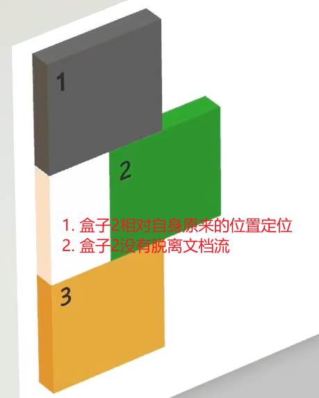

- 定位元素的显示`层级`比普通元素高，无论什么定位，显示层级都是一样的。默认规则：

  - 定位的元素会盖在普通元素之上。（注意：不同于浮动，定位的元素不是漂浮在普通元素之上，而是盖在普通元素之上）
  - 都发生定位的两个元素，**后写的元素会盖在先写的元素之上**。

- `left 不能和 right 一起设置，top 和 bottom 不能一起设置。`

- 相对定位的元素，也能继续浮动，但不推荐这样做。

- 相对行为的元素，也能通过 margin 调整位置，但不推荐这样做。

>注意：绝大多数情况下，相对定位，会与绝对定位配合使用。

**相对定位的应用场景：**

- 对元素的位置微调。
- 配合绝对定位使用。

示例：

```html
<!DOCTYPE html>
<html lang="zh-CN">

<head>
    <meta charset="UTF-8">
    <title>01_相对定位</title>
    <style>
        .outer {
            width: 500px;
            background-color: skyblue;
            border: 1px solid black;
            padding: 20px;
        }

        .box {
            width: 200px;
            height: 200px;
            font-size: 20px;
        }

        .box1 {
            background-color: #888;
        }

        .box2 {
            background-color: orange;
            position: relative;
            top: 10px;
            left: 10px;
            /* left: 100px; */
            /* margin-left: 50px; */
            /* float: right; */
        }

        .box3 {
            background-color: green;
            /* position: relative; */
            /* top: -50px; */
        }
    </style>
</head>

<body>
    <div class="outer">
        <div class="box box1">1</div>
        <div class="box box2">2</div>
        <div class="box box3">3</div>
    </div>
</body>

</html>
```

#### 绝对定位

**如何设置绝对定位：**

- 给元素设置`position: absolute`即可实现绝对定位。

- 可以使用`left`、`right`、`top`、`bottom`四个属性调整位置。（可以取负值，可以超出父元素）

**绝对定位的参考点：**

- 参考它的**`包含块`**。

>什么是包含块？
>
>1. **对于没有脱离文档流的元素：包含块就是父元素。**
>2. **对于脱离文档流的元素：包含块是第一个拥有定位属性的祖先元素（如果所有祖先都没定位，那包含块就是整个页面）。**
>3. 口诀：`子绝父相`，即子元素开启绝对定位后，为了尽可能小的对父元素产生影响，父元素会开启相对定位。

**绝对定位元素的特点：**

- `脱离文档流`，会对后面的兄弟元素、父元素有影响。

  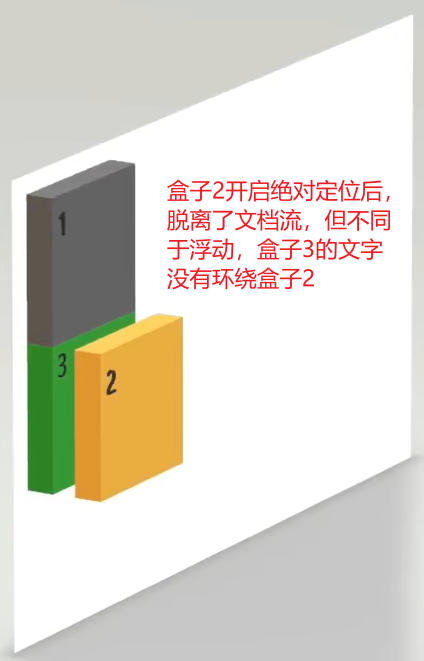

- `left 不能和 right 一起设置，top 和 bottom 不能一起设置。`

- `绝对定位、浮动不能同时设置，如果同时设置，浮动失效，以定位为主。`

- 绝对定位的元素，也能通过 margin 调整位置，但不推荐这样做。（left 可以和 margin-left 一起用，但不能和 margin-right 一起用，其他几个同理，但有些浏览器也不遵循这个规律）

- 无论是什么元素（行内、行内块、块级）设置为绝对定位之后，都变成了`定位元素`。（相对定位元素没有此效果）

> 什么是定位元素？ 
>
> - **默认宽、高都被内容所撑开，且能自由设置宽高。**

**绝对定位的应用场景：**

- 让一个元素，盖在另一个元素的上方。

示例：

```html
<!DOCTYPE html>
<html lang="zh-CN">

<head>
    <meta charset="UTF-8">
    <title>02_绝对定位</title>
    <style>
        .outer {
            width: 500px;
            background-color: skyblue;
            border: 1px solid black;
            padding: 20px;
            position: relative;
        }

        .box {
            width: 200px;
            height: 200px;
            font-size: 20px;
        }

        .box1 {
            background-color: #888;
        }

        .box2 {
            background-color: orange;
            position: absolute;
            top: 220px;
            left: 20px;
        }

        .box3 {
            background-color: green;
        }

        /* 鼠标悬浮在父元素盒子上后，盒子2不再盖在盒子3上，不悬浮时，盒子2会盖在盒子3上 */
        .outer:hover .box2 {
            left: 220px;
        }
    </style>
</head>

<body>
    <div class="outer">
        <div class="box box1">1</div>
        <div class="box box2">2</div>
        <!-- 把box2的绝对定位去除，即可观察到span是行内元素，宽高不能被设置，但加上绝对定位，宽高可以被设置 -->
        <!-- <span class="box box2">2</span> -->
        <div class="box box3">3</div>
    </div>
    <div>Lorem ipsum dolor sit amet consectetur adipisicing elit. Quisquam, ab! Natus perferendis sit debitis non
        reiciendis, quis commodi veniam, quasi consequatur ipsum repellat rem quas quia minus iure error facere alias,
        accusantium praesentium illo. Eum, voluptas molestiae reprehenderit et incidunt atque dolor excepturi fugiat?
        Omnis autem quo deleniti reprehenderit quod adipisci beatae iusto quia laborum aspernatur, delectus ipsum
        consequuntur officia repudiandae aperiam incidunt cumque. Officia, mollitia? Ipsam, tempore. Nesciunt eos
        provident nam assumenda, magni atque maiores necessitatibus consequuntur facere earum quo aspernatur
        voluptatibus adipisci ex, deleniti optio deserunt dignissimos debitis nihil expedita, quae pariatur distinctio
        fuga omnis! Nulla quam, beatae velit distinctio vitae neque quis minima adipisci ducimus maxime veniam labore
        officia corrupti excepturi in odio quo quod hic, repellat repellendus. Molestiae atque commodi quidem, totam
        ullam animi veritatis ipsa, praesentium porro aspernatur nesciunt numquam labore! Nobis mollitia illo inventore
        repudiandae ex optio maxime suscipit praesentium tempore debitis impedit eaque, amet voluptate magnam doloribus,
        ducimus voluptas hic esse accusamus accusantium provident. Nam unde, tempora inventore labore numquam nulla,
        veniam magni minus obcaecati sit suscipit ducimus neque fugit fugiat quod rem sequi quas laudantium officia,
        dicta eum nobis non saepe? Voluptate saepe labore exercitationem ea illum laudantium iure, nisi doloribus
        recusandae ad explicabo voluptas accusantium molestias eius totam repellendus sunt quod esse incidunt nesciunt
        aspernatur a debitis illo. Eos ullam itaque, odit amet corrupti laborum sint quasi illum ipsa temporibus nam
        neque quibusdam natus ab magni modi laboriosam nihil numquam dolores facere veniam necessitatibus exercitationem
        architecto iste! Exercitationem officia ipsa officiis enim eveniet harum commodi quaerat dolor, laborum cumque
        delectus consectetur? Dicta, esse id! Sunt laudantium asperiores soluta sint dolor qui aut excepturi laborum et
        harum, quia iure autem maxime dolorum suscipit earum porro officia dolores odit, laboriosam aspernatur delectus
        dolore vel quas! Ratione cumque, aspernatur consequatur in, vitae quasi cupiditate tempore possimus deserunt
        sequi odit blanditiis! Laboriosam voluptatem dolorem maxime quam soluta delectus molestiae! Deleniti consectetur
        accusantium vitae neque! Dolorum voluptatum, est quo enim voluptatem doloremque soluta quibusdam, cum
        repellendus consequuntur alias vero possimus eos voluptatibus minima maxime recusandae eligendi, saepe
        distinctio. Omnis nisi magni aliquam consequuntur alias laudantium, nihil iure eum minima in rerum reiciendis
        provident iste recusandae velit praesentium adipisci, nobis tempore, blanditiis eius. Est doloribus blanditiis
        accusamus adipisci enim quis cumque incidunt autem magni asperiores laudantium, dolores accusantium,
        voluptatibus totam voluptates similique saepe neque. Magni ullam minus tempore quas a adipisci, soluta
        veritatis, qui quidem hic molestiae optio recusandae, labore fugit eos? Qui totam nisi quibusdam ad hic iusto
        placeat cum repellendus, eaque soluta repellat quisquam, voluptatibus alias ut molestias sint? Illum
        reprehenderit corporis, reiciendis ab dolores cupiditate ratione in autem vel deserunt odio illo. Cum, quis
        eveniet rem porro, itaque voluptate nesciunt harum beatae fuga ex laborum dolore et. Quasi, beatae. Nemo
        molestiae sapiente unde quibusdam aut voluptatibus id labore possimus praesentium molestias odio, laborum quasi
        a, iusto sint repellendus sunt. Aperiam architecto ratione accusantium necessitatibus, cumque, vitae doloremque,
        omnis eos recusandae placeat asperiores provident! Magnam dolorem ratione, laborum atque impedit nesciunt est
        similique temporibus laudantium. Quisquam aliquam perspiciatis excepturi quod aspernatur, maxime autem molestiae
        asperiores illo, consequatur doloremque obcaecati deleniti incidunt eius dolorum assumenda iusto officiis et
        nesciunt quae! Quo placeat saepe ipsum fugiat at debitis enim iure officia, numquam reprehenderit tenetur maxime
        commodi repudiandae quaerat, sequi doloremque eligendi ab aliquam quod voluptatem molestias deserunt explicabo.
        Culpa voluptate dolores eius cupiditate tempora explicabo at dolorem molestias nobis soluta iure, maxime quae
        repellendus minus harum. Sed, iusto dolore. Nemo ab sit veniam odit, cupiditate harum accusantium enim cumque
        maxime eos eius repudiandae pariatur culpa, sed magni maiores excepturi natus neque perferendis. Minima qui
        laboriosam magni ex quisquam vero at, reiciendis alias harum in architecto rem porro voluptate accusamus quo
        dolorem commodi, fugiat, recusandae cumque inventore culpa! Modi, quaerat nulla. Nostrum cum incidunt rerum
        totam aspernatur recusandae voluptate dolor voluptatibus illo, molestiae laudantium eveniet voluptatum ullam
        dolores eius dignissimos tempore dolore dicta praesentium animi dolorem ex unde, consequatur impedit? Deserunt
        reiciendis illo veritatis, at recusandae repellendus! Architecto soluta consequatur voluptatum amet ipsam odio
        necessitatibus distinctio facilis, quo voluptatem officia voluptates quidem consequuntur accusantium vel
        officiis earum quos modi. Enim aliquid laboriosam consequuntur esse libero, et soluta quibusdam quos voluptas
        quod id, quis assumenda quasi vitae necessitatibus explicabo incidunt officiis eius totam ad ullam? Numquam
        ratione assumenda libero deleniti mollitia, eligendi neque fuga totam accusamus labore non doloribus earum.
        Quibusdam quaerat, iusto error in exercitationem quas asperiores officiis animi, ab provident ad, quisquam quae
        inventore laboriosam corrupti tempore. Facere sint tempore distinctio ut autem facilis culpa aut sunt, similique
        labore molestiae possimus, tenetur ad dolorem fugit, consequatur nobis totam error ea assumenda velit
        reprehenderit. Veritatis ut iure non, atque impedit quos minima delectus nesciunt doloremque eum reprehenderit
        aspernatur! Praesentium eum quas, ipsam mollitia explicabo fugiat a quo ratione quidem, in iste? Sed, voluptatum
        aspernatur doloremque vel tenetur sapiente eligendi ipsa itaque nulla possimus nesciunt nostrum omnis! Tempora
        asperiores deleniti fugiat quibusdam praesentium. Veritatis, excepturi ipsum accusantium corrupti velit adipisci
        praesentium impedit expedita fugit nisi alias odio officiis dolorum nesciunt, aperiam molestias non, quisquam
        facilis veniam deleniti perferendis fuga sapiente deserunt at? Illo distinctio, vitae doloribus delectus
        sapiente facilis excepturi, optio praesentium, facere dolorem commodi repellendus ex aliquam accusamus. Dolores
        nisi optio deserunt exercitationem autem. Ad ducimus magnam nemo, quos placeat est mollitia eligendi obcaecati
        assumenda et voluptas temporibus beatae non, omnis sapiente labore maiores quibusdam? Alias repudiandae adipisci
        neque impedit temporibus commodi voluptate. Molestiae nam dignissimos quo dicta sunt fugiat voluptatem
        voluptatum! Excepturi, aperiam sequi? Dignissimos porro odit, assumenda distinctio culpa, veniam molestiae vitae
        nihil reiciendis quae consequatur aperiam ipsa modi aliquid deleniti iure atque fuga nemo doloribus provident.
        Ab corporis veniam iste harum repellat, similique officiis hic temporibus. Asperiores aliquid corporis omnis
        repellat amet blanditiis minima quaerat voluptatum dolore corrupti repudiandae consectetur velit distinctio
        eligendi aspernatur eum facere, tempora ad iusto quis accusamus tenetur dolorum. Earum non reprehenderit labore
        provident quas nisi at ipsam aperiam possimus? Omnis quae, debitis consequuntur cupiditate fuga magnam illum.
        Voluptatem laboriosam quam enim ipsa, odit consectetur sequi esse excepturi, sit quae quibusdam.</div>
</body>

</html>
```

#### 固定定位

**如何设置为固定定位：**

- 给元素设置`position: fixed`即可实现固定定位。
- 可以使用`left`、`right`、`top`、`bottom`四个属性调整位置。（可以取负值，可以超出父元素）

**固定定位的参考点：**

- 参考它的**`视口`**。

> 什么是视口？
>
> - 对于 PC 浏览器来说，视口就是我们看网页的那扇 "窗户"。

**固定定位元素的特点：**

- `脱离文档流`，会对后面的兄弟元素、父元素有影响。
- `left 不能和 right 一起设置，top 和 bottom 不能一起设置。`
- `固定定位和浮动不能同时设置，如果同时设置，浮动失效，以固定定位为主。`
- 固定定位的元素，也能通过 margin 调整位置，但不推荐这样做。
- 无论是什么元素（行内、行内块、块级）设置为固定定位之后，都变成了定位元素。

示例：

```html
<!DOCTYPE html>
<html lang="zh-CN">

<head>
    <meta charset="UTF-8">
    <title>03_固定定位</title>
    <style>
        .outer {
            width: 500px;
            background-color: skyblue;
            border: 1px solid black;
            padding: 20px;
            position: relative;
        }

        .box {
            width: 200px;
            height: 200px;
            font-size: 20px;
        }

        .box1 {
            background-color: #888;
        }

        .box2 {
            background-color: orange;
            position: fixed;
            bottom: 0;
            right: 0;
            /* margin-right: 100px; */
            /* margin-bottom: 100px; */
        }

        .box3 {
            background-color: green;
        }
    </style>
</head>

<body>
    <div class="outer">
        <div class="box box1">1</div>
        <span class="box box2">哥哥需要视频聊天吗？点我哦，即可开始</span>
        <div class="box box3">3</div>
    </div>
    <div>Lorem ipsum dolor, sit amet consectetur adipisicing elit. Assumenda fugiat magni, obcaecati quasi eveniet
        pariatur quis maxime facilis voluptate incidunt necessitatibus consequatur ipsam beatae porro dolor vero, non
        modi? Accusamus veniam deserunt, autem doloribus commodi odio libero hic exercitationem ab quam laudantium sint
        delectus adipisci nihil quod at est quibusdam voluptates sit quos eveniet nisi? Autem illo veritatis reiciendis
        exercitationem officiis dolorem eos obcaecati nihil saepe doloremque quos omnis adipisci iste debitis deleniti
        maxime reprehenderit iusto, cumque natus asperiores. Ratione in error harum cumque sunt totam, iste numquam, ex
        earum asperiores explicabo tempore! In porro officiis dicta quam quisquam corporis quasi deserunt ex tenetur
        itaque recusandae nihil tempora sit, perferendis doloribus hic, quis enim dolorem distinctio provident eius.
        Dicta magni doloremque odio necessitatibus sunt expedita maiores. Odit beatae ducimus quia nisi, eveniet illo
        quis sint sapiente explicabo, corrupti temporibus blanditiis quibusdam delectus voluptatibus veritatis! Labore
        sit, quasi fugiat consequuntur in, impedit dolor nesciunt, aperiam debitis repellat delectus est. Ea repudiandae
        obcaecati numquam quam expedita laudantium, tempora consequatur veniam cumque corrupti perferendis perspiciatis
        delectus iste rem eum possimus mollitia facere eveniet. Deleniti quia omnis possimus cupiditate odio! Nostrum
        aliquam laborum explicabo laboriosam. Perspiciatis quos quis officiis neque cupiditate laborum provident qui
        velit laboriosam quibusdam voluptas est ut voluptates nihil voluptatum, libero quaerat et molestiae dignissimos
        distinctio assumenda corporis dolor labore. Vitae eveniet error, labore autem, iusto, quos sint explicabo aut
        libero totam aperiam repellat nihil dolores. Dolor eum consectetur quia incidunt deleniti eos illum atque
        accusamus reiciendis voluptas molestiae nobis quod, dignissimos veritatis, placeat doloribus et facere id
        blanditiis esse rem numquam. Sunt, cum eum error reiciendis placeat praesentium cupiditate accusamus impedit
        minima tempora adipisci magnam corporis, fugit beatae consequuntur vitae! Soluta sapiente nulla eaque, corporis
        quae qui at porro quod libero ipsam delectus esse placeat est temporibus repellat quam dolorum dolorem incidunt
        provident animi vel beatae deserunt. Quis sit eius magni deleniti earum et asperiores voluptates porro ab. Ex,
        provident omnis odio enim explicabo veniam adipisci odit ipsam deleniti, minus, consequatur officiis? Deleniti
        tenetur nobis exercitationem! Id, porro aliquid ad explicabo repellendus fuga quas adipisci accusamus eligendi
        dignissimos velit dicta dolorem temporibus at. Dolore aspernatur quae eligendi, reiciendis animi et numquam
        accusantium doloremque vitae in porro, nam aperiam commodi eaque cumque. Magnam dolorum ratione tempore impedit,
        exercitationem alias officiis, sunt facilis voluptatum est doloribus! Vel saepe, recusandae dicta aut provident
        aliquid eligendi distinctio voluptatibus at quasi numquam ratione doloribus veniam. Doloremque veritatis
        suscipit odio dolorem possimus perferendis nihil quis natus laboriosam obcaecati, recusandae voluptatum aperiam
        quaerat quidem omnis quam deleniti. Inventore alias ratione magnam sed officia corrupti quae consectetur porro
        temporibus placeat quod nesciunt labore veniam, odit dolorem fugiat laudantium, aperiam amet ipsam ex. Mollitia
        illum aliquam cupiditate, vel explicabo tenetur vero fuga deleniti asperiores praesentium aspernatur, quo nam
        totam ea reiciendis atque repellat dolorem obcaecati expedita at officiis. Sequi iusto magnam quasi quas omnis
        facilis neque eum quibusdam beatae, dolorem id dolores debitis aliquam, ab, rerum fugiat eius sit magni
        doloribus amet libero nihil? Atque id veritatis rem, alias facere numquam quam ducimus officia vero ipsam quae
        dolores omnis sed! Laudantium error delectus illo aperiam aliquam, magni nemo dolorem aliquid blanditiis sequi,
        tenetur enim ut labore consequuntur quod? Expedita velit obcaecati laudantium minima maiores odio impedit soluta
        consectetur autem illo quam eveniet eum sapiente rerum modi deleniti distinctio ipsum optio corrupti laboriosam,
        dicta labore repudiandae, quas saepe? Unde itaque quasi iusto amet temporibus sit quibusdam iure iste quos omnis
        ducimus pariatur animi numquam aspernatur nulla vitae voluptatibus, est ratione repellat consequatur
        reprehenderit reiciendis ex! Nemo laboriosam quam voluptates eum velit, modi accusamus pariatur magni cupiditate
        corrupti, deleniti voluptate commodi voluptatibus eveniet porro recusandae quo voluptatem quas sed praesentium
        repudiandae cum adipisci ipsum minus! Doloribus nostrum, saepe tempora, nobis maxime exercitationem vero
        nesciunt temporibus aliquam pariatur eum quas quos quis distinctio recusandae inventore obcaecati illum quia.
        Illum aliquid provident dolore, aperiam autem suscipit praesentium impedit cumque voluptatem perspiciatis
        blanditiis vitae consequatur nemo soluta esse excepturi totam. Nihil accusantium expedita natus quibusdam
        possimus, totam ut beatae labore rerum nulla, dolorum assumenda ea atque a quia eius est unde non, dignissimos
        sequi deserunt blanditiis nobis! Accusantium quae molestiae error non! Quos ratione hic perferendis rem
        quisquam. Ut placeat sapiente delectus ullam cum nam dicta architecto quidem molestias eaque corrupti, suscipit
        reiciendis. Placeat, cumque obcaecati laborum odit voluptatum rerum asperiores iste, repudiandae laudantium rem,
        deleniti esse ullam atque numquam ipsa quaerat quisquam. Modi, quae. Pariatur quos aut accusantium, voluptatum
        qui sit distinctio officiis voluptas amet nam incidunt voluptates, rerum doloremque nihil corporis deleniti cum
        unde aliquam soluta itaque laborum ipsum tempora animi mollitia. Sint consectetur dolorum nihil autem enim
        voluptas excepturi omnis doloribus voluptates molestiae natus, aliquam animi distinctio. Nihil impedit, eos odit
        mollitia natus saepe et hic nisi vel a enim consequatur laborum nam asperiores dolor accusantium tempore,
        recusandae laudantium eligendi vitae. Iste, eius! Tempora odit voluptatibus totam et rerum a atque itaque,
        laborum nulla. Voluptates similique at dignissimos sunt quas officia eligendi nihil, tenetur placeat labore. In
        eius deleniti deserunt? Exercitationem eos, ipsam libero repudiandae iure est eum aliquam fugiat officiis minus
        corrupti id placeat delectus repellendus totam provident error quisquam debitis facere tempora, maxime
        consectetur? A, itaque officiis ipsam porro corporis temporibus placeat similique veniam sit possimus iure
        sapiente repudiandae delectus aperiam dolorem consectetur quibusdam fugit architecto incidunt sequi cum
        exercitationem odio dignissimos? Fugiat officia nostrum quo aliquam ab minus maiores doloremque culpa nulla vel
        voluptatem laboriosam omnis explicabo nihil asperiores architecto non odio dicta quos quis, minima suscipit
        incidunt exercitationem! Excepturi recusandae, nostrum ullam architecto unde, dicta porro perferendis voluptas a
        possimus nobis voluptate eos tempore sit! Voluptas sint explicabo dignissimos laboriosam velit in eius veniam
        saepe esse ipsa illum aspernatur excepturi accusamus error dolores officia quo, temporibus animi! Ullam, eius
        atque rem quidem enim dolorum cupiditate culpa nostrum nisi in adipisci! Accusantium, at sequi a ipsa
        perspiciatis asperiores expedita quisquam cupiditate architecto rerum! Debitis dolore totam iusto id, vel, odit
        exercitationem perspiciatis ullam necessitatibus dicta, illo quasi deserunt magni minima commodi minus delectus
        consectetur! Esse expedita ad qui?</div>
</body>

</html>
```

#### 粘性定位

**如何设置为粘性定位：**

- 给元素设置`position: sticky`即可实现粘性定位。
- 可以使用`left`、`right`、`top`、`bottom`四个属性调整位置，不过**最常用的是 top 值**。

**粘性定位的参考点：**

- 离它最近的一个拥有 "滚动机制" 的祖先元素，即便这个祖先不是最近的真实可滚动祖先。

**粘性定位元素的特点：**

- `不会脱离文档流`，它是一种`专门用于窗口滚动时的新的定位方式`。
- `最常用的值是 top 值。`
- 粘性定位和浮动可以同时设置，但不推荐这样做。
- 粘性定位的元素，也能通过 margin 调整位置，但不推荐这样做。

> 粘性定位和相对定位的特点基本一致，不同的是：**`粘性定位可以在元素到达某个位置时将其固定`**。

示例：

```html
<!DOCTYPE html>
<html lang="zh-CN">

<head>
    <meta charset="UTF-8">
    <title>04_粘性定位</title>
    <style>
        * {
            margin: 0;
            padding: 0;
        }

        body {
            height: 2000px;
        }

        .page-header {
            height: 100px;
            text-align: center;
            line-height: 100px;
            background-color: orange;
            font-size: 20px;
        }

        /* .content { */
        /* height: 200px; */
        /* overflow: auto; */
        /* overflow: scroll; */
        /* } */
        .item {
            background-color: gray;
        }

        .first {
            background-color: skyblue;
            font-size: 40px;
            position: sticky;
            top: 0px;
            /* float: right; */
            /* margin-right: 100px; */
        }
    </style>
</head>

<body>
    <!-- 头部 -->
    <div class="page-header">头部</div>
    <!-- 内容区 -->
    <div class="content">
        <!-- 每一项 -->
        <div class="item">
            <div class="first">A</div>
            <h2>A1</h2>
            <h2>A2</h2>
            <h2>A3</h2>
            <h2>A4</h2>
            <h2>A5</h2>
            <h2>A6</h2>
            <h2>A7</h2>
            <h2>A8</h2>
        </div>
        <div class="item">
            <div class="first">B</div>
            <h2>B1</h2>
            <h2>B2</h2>
            <h2>B3</h2>
            <h2>B4</h2>
            <h2>B5</h2>
            <h2>B6</h2>
            <h2>B7</h2>
            <h2>B8</h2>
        </div>
        <div class="item">
            <div class="first">C</div>
            <h2>C1</h2>
            <h2>C2</h2>
            <h2>C3</h2>
            <h2>C4</h2>
            <h2>C5</h2>
            <h2>C6</h2>
            <h2>C7</h2>
            <h2>C8</h2>
        </div>
    </div>
</body>

</html>
```

#### 定位层级

定位的层级：

- `定位元素的显示层级比普通元素高`，但无论什么定位，显示层级都是一样的。
- 如果位置发生重叠，默认情况是：`后面的元素，会显示在前面元素之上。`
- 可以通过 CSS 属性`z-index`调整元素的显示层级。
- z-index 的属性值是数字，没有单位，`值越大显示层级越高`。
- 只有定位的元素设置 z-index 才有效。
- 如果 z-index 值大的元素，依然没有覆盖掉 z-index 值小的元素，那么请检查其包含块的层级。

示例：

```html
<!DOCTYPE html>
<html lang="zh-CN">

<head>
    <meta charset="UTF-8">
    <title>05_定位的层级</title>
    <style>
        .outer {
            width: 500px;
            background-color: skyblue;
            border: 1px solid black;
            padding: 20px;
            position: relative;
            /* 包含块的z-index设置为11，大于box5，如果小于box5，即使box4的z-index大于box5，依然会被box5压着 */
            z-index: 11;
        }

        .box {
            width: 200px;
            height: 200px;
            font-size: 20px;
        }

        .box1 {
            background-color: #888;
        }

        .box2 {
            background-color: orange;
            position: relative;
            top: -150px;
            left: 50px;
        }

        .box3 {
            background-color: green;
            position: absolute;
            top: 130px;
            left: 130px;
        }

        .box4 {
            background-color: red;
            position: fixed;
            top: 200px;
            left: 200px;
            z-index: 50;
        }

        .box5 {
            background-color: purple;
            position: fixed;
            top: 300px;
            left: 300px;
            z-index: 10;
        }
    </style>
</head>

<body>
    <div class="outer">
        <div class="box box1">1</div>
        <div class="box box2">2</div>
        <div class="box box3">3</div>
        <div class="box box4">4</div>
    </div>
    <div class="box box5">5</div>
</body>

</html>
```

#### 定位的特殊应用

**定位可以越过 padding：**

- 子元素的定位，可以越过包含块的 padding。

示例：

```html
<!DOCTYPE html>
<html lang="zh-CN">

<head>
    <meta charset="UTF-8">
    <title>06_定位可以越过padding</title>
    <style>
        .outer {
            width: 800px;
            height: 600px;
            padding: 20px;
            background-color: #888;
            position: relative;
        }

        .inner {
            width: 200px;
            height: 200px;
            background-color: orange;
            position: absolute;
            top: 0;
            left: 0;
        }
    </style>
</head>

<body>
    <div class="outer">
        <div class="inner"></div>
    </div>
</body>

</html>
```

效果图：

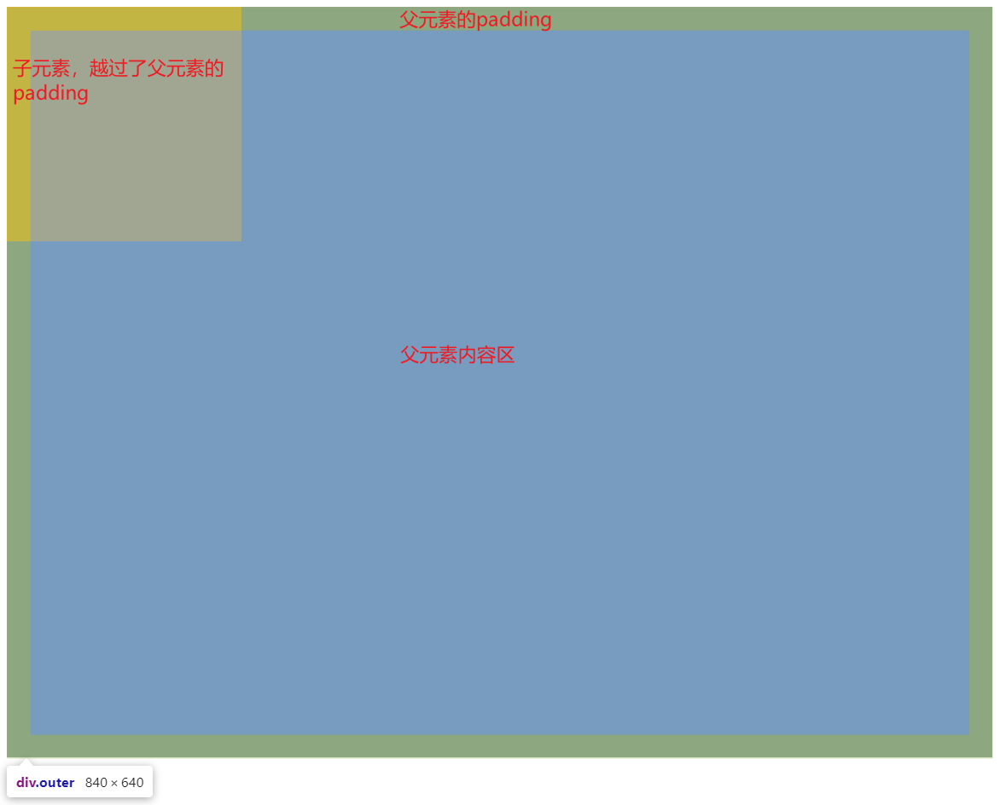

>**注意：**
>
>1. 发生固定定位、绝对定位后，元素都变成了定位元素，其特点是默认宽高被内容撑开，且依然可以设置宽高。
>
>2. 发生相对定位后，元素依然是之前的显示模式。（比如定位的块元素显示模式仍是独占一行）
>3. 以下所说的特殊应用，只针对**绝对定位**和**固定定位**的元素，不包括相对定位的元素。

**定位的特殊应用一：**

- `将一个定位的元素，充满包含块。`（不是通过定位元素的 width 和 height 来设置）
- 块宽想与包含块一致，可以给定位元素同时设置`left 和 right 为 0`。
- 块高想与包含块一致，可以给定位元素同时设置`top 和 bottom 为 0`。

示例：

```html
<!DOCTYPE html>
<html lang="zh-CN">

<head>
    <meta charset="UTF-8">
    <title>07_定位的特殊应用1</title>
    <style>
        .outer {
            height: 400px;
            background-color: #888;
            position: relative;
        }

        .inner {
            background-color: rgb(20, 134, 195);
            font-size: 20px;
            padding: 20px;
            border: 10px solid black;
            position: absolute;
            /* 水平方向充满父元素 */
            left: 0;
            right: 0;
            /* 垂直方向充满父元素 */
            top: 0;
            bottom: 0;
            /* 注意，windth: 100%，设置的是子元素的内容区宽度与父元素一致，加上子元素的padding和border会超过父元素的宽度 */
            /* width: 100%; */
        }
    </style>
</head>

<body>
    <div class="outer">
        <div class="inner">你好啊</div>
    </div>
</body>

</html>
```

效果图：

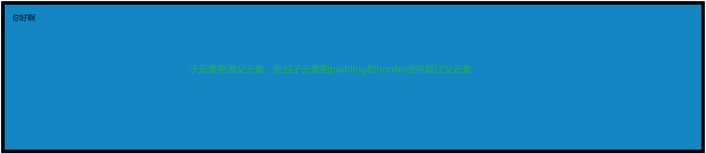

**定位的特殊应用二：**

- `让定位元素在包含块中居中。`**注意：该定位的子元素必须设置宽高！！！**（如果不设置宽高，就跟 "特殊应用一" 一样）

- 方案一：

  ```css
   .outer {
      width: 800px;
      height: 400px;
      background-color: #888;
       
      /* 方案一：不使用定位 */
      overflow: hidden;
  }
  
  .inner {
      width: 400px;
      height: 100px;
      background-color: orange;
      font-size: 20px;
  
      margin: 0 auto;
      margin-top: 150px;
  }
  ```

- **方案二（推荐）：**

  ```css
  .outer {
      width: 800px;
      height: 400px;
      background-color: #888;
  
      position: relative;
  }
  
  .inner {
      width: 400px;
      height: 100px;
      background-color: orange;
      font-size: 20px;
  
      position: absolute;
      /* 方案二 */
      top: 0;
      bottom: 0;
      left: 0;
      right: 0;
      margin: auto; 
  }
  ```

- 方案三：

  ```css
  .outer {
      width: 800px;
      height: 400px;
      background-color: #888;
  
      position: relative;
  }
  
  .inner {
      width: 400px;
      height: 100px;
      background-color: orange;
      font-size: 20px;
  
      position: absolute;
      /* 方案三 */
      left: 50%;
      top: 50%;
      /* 负的宽度一半 */
      margin-left: -200px;
      /* 负的高度一半 */
      margin-top: -50px;
  }
  ```

示例：

```html
<!DOCTYPE html>
<html lang="zh-CN">

<head>
    <meta charset="UTF-8">
    <title>Document</title>
    <style>
        .outer {
            width: 800px;
            height: 400px;
            background-color: #888;
            /* 方案一：不使用定位 */
            /* overflow: hidden; */
            position: relative;
        }

        .inner {
            width: 400px;
            height: 100px;
            background-color: orange;
            font-size: 20px;

            /* margin: 0 auto;
            margin-top: 150px; */

            position: absolute;
            /* 方案二 */
            top: 0;
            bottom: 0;
            left: 0;
            right: 0;
            margin: auto; 

            /* 方案三 */
            /* left: 50%;
            top: 50%;
            margin-left: -200px;
            margin-top: -50px; */
        }
    </style>
</head>

<body>
    <div class="outer">
        <div class="inner">你好啊</div>
    </div>
</body>

</html>
```

效果图：

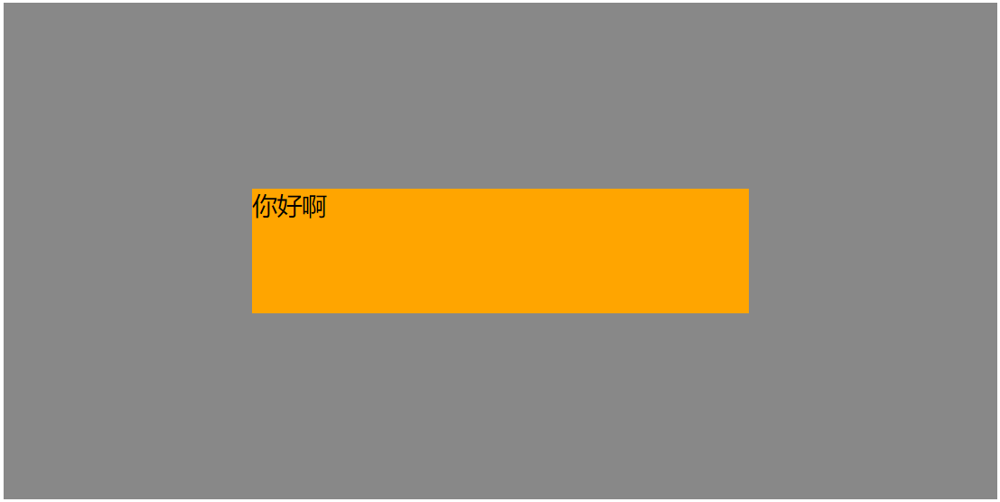

### 布局

#### 版心

在 PC 端网页中，一般都会有一个固定宽度且水平居中的盒子，来显示网页的主要内容，这是网页的`版心`。

- 版心的宽度一般是 960 ~ 1200 像素之间。

- 版心可以是一个，也可以是多个。

#### 常用布局名词

| 位置               | 布局名词               |
| ------------------ | ---------------------- |
| 顶部导航条         | topbar                 |
| 页头               | header、page-header    |
| 导航               | nav、navigator、navbar |
| 搜索框             | search、search-box     |
| 横幅、广告、宣传图 | banner                 |
| 主要内容           | content、main          |
| 侧边栏             | aside、sidebar         |
| 页脚               | footer、page-footer    |

#### 重置默认样式

很多 CSS 元素都有默认样式，比如：

1. p 元素有默认的上下 margin。
2. h1 ~ h6 标题也有上下 margin，且字体加粗。
3. body 元素有默认的 8 px 外边距。
4. 超链接有默认的文字颜色和下划线。
5. ul 元素有默认的左 pading。
6. ......

在早期，元素默认样式，能够让我们快速的绘制网页，但如今网页的设计越来越复杂，内容越来越多，也越来越精细，这些默认样式会给我们绘制页面带来麻烦；而且这些默认样式，在不同的浏览器上呈现出来的效果也不一样，所以我们需要重置这些默认样式。

**方案一：使用全局选择器。**

```css
* {
    margin: 0;
    padding: 0;
    /* ...... */
}
```

- 此种方法，在简单案例中可以用一下，但实际开发中不会使用，因为 * 选择的是所有元素，但并不是所有的元素都有默认样式。而且我们重置时，有时候是需要做特定处理的，比如：想让 a 元素的文字是灰色，其他元素文字是蓝色。

**方案二：定义 reset.css。**

- 选择具有默认样式的元素，清空其默认的样式。

- 经过 reset 后的网页，好似 "一张白纸"，开发人员可根据设计稿，精细的去添加具体的样式。

- 示例：

  ```css
  /* 基础设置 */
  body,
  h1,
  h2,
  h3,
  h4,
  h5,
  h6,
  hr,
  p,
  blockquote,
  dl,
  dt,
  dd,
  ul,
  ol,
  li,
  pre,
  form,
  fieldset,
  legend,
  button,
  input,
  textarea,
  th,
  td {
      margin: 0;
      padding: 0;
  }
  
  ul,
  ol {
      list-style: none;
  }
  
  img {
      /* 底部留白 */
      display: block;
      border: 0;
  }
  
  b,
  strong {
      font-weight: 400;
  }
  
  h1,
  h2,
  h3,
  h4,
  h5,
  h6 {
      /* 父元素字号的百分比 */
      font-size: 100%;
      font-weight: normal;
  }
  
  i,
  em {
      /* 不倾斜 */
      font-style: normal;
  }
  
  u,
  ins,
  s,
  del {
      /* 去掉中划线和下划线 */
      text-decoration: none;
  }
  
  table {
      border: 1px solid #999;
      /* 相当于是cellspacing */
      border-spacing: 0;
      /* 1px边框 */
      border-collapse: collapse;
  }
  
  td,
  th {
      border: 1px solid #999;
  }
  
  input,
  button {
      /* 去掉轮廓线 */
      outline: none;
      border: none;
  }
  
  /* 风格设置 */
  body {
      font: 12px/1.5 "Microsoft YaHei", Tahoma, Helvetica, Arial, "\5b8b\4f53", sans-serif;
      color: #333;
  }
  
  a {
      text-decoration: none;
      color: #666;
  }
  
  a:hover {
      color: #DD302D;
      text-decoration: none;
  }
  
  .leftfix {
      float: left;
  }
  
  .rightfix {
      float: right;
  }
  
  .clearfix::after {
      content: "";
      display: block;
      clear: both;
  }
  ```

**方案三：定义 Normalize.css。**

- Normalize.css 是一种最新方案，它在清除默认样式的基础上，保留了一些有价值的默认样式。官网：https://necolas.github.io/normalize.css/

- 相对于 reset.css，Normalize.css 有如下优点：

  - 保护了有价值的默认样式，而不是完全去掉它们。
  - 为大部分 HTML 元素提供一般化的样式。
  - 新增对 HTML 5 元素的设置。
  - 对并集选择器的使用比较谨慎，有效避免调试工具杂乱。

- Normalize.css 的重置，和 reset.css 相比，更加的温和，开发时可根据实际情况进行选择。

- 示例：

  ```css
  /*! normalize.css v8.0.1 | MIT License | github.com/necolas/normalize.css */
  
  /* Document
     ========================================================================== */
  
  /**
   * 1. Correct the line height in all browsers.
   * 2. Prevent adjustments of font size after orientation changes in iOS.
   */
  
  html {
    line-height: 1.15;
    /* 1 */
    -webkit-text-size-adjust: 100%;
    /* 2 */
  }
  
  /* Sections
     ========================================================================== */
  
  /**
   * Remove the margin in all browsers.
   */
  
  body {
    margin: 0;
  }
  
  /**
   * Render the `main` element consistently in IE.
   */
  
  main {
    display: block;
  }
  
  /**
   * Correct the font size and margin on `h1` elements within `section` and
   * `article` contexts in Chrome, Firefox, and Safari.
   */
  
  h1 {
    font-size: 2em;
    margin: 0.67em 0;
  }
  
  /* Grouping content
     ========================================================================== */
  
  /**
   * 1. Add the correct box sizing in Firefox.
   * 2. Show the overflow in Edge and IE.
   */
  
  hr {
    box-sizing: content-box;
    /* 1 */
    height: 0;
    /* 1 */
    overflow: visible;
    /* 2 */
  }
  
  /**
   * 1. Correct the inheritance and scaling of font size in all browsers.
   * 2. Correct the odd `em` font sizing in all browsers.
   */
  
  pre {
    font-family: monospace, monospace;
    /* 1 */
    font-size: 1em;
    /* 2 */
  }
  
  /* Text-level semantics
     ========================================================================== */
  
  /**
   * Remove the gray background on active links in IE 10.
   */
  
  a {
    background-color: transparent;
  }
  
  /**
   * 1. Remove the bottom border in Chrome 57-
   * 2. Add the correct text decoration in Chrome, Edge, IE, Opera, and Safari.
   */
  
  abbr[title] {
    border-bottom: none;
    /* 1 */
    text-decoration: underline;
    /* 2 */
    text-decoration: underline dotted;
    /* 2 */
  }
  
  /**
   * Add the correct font weight in Chrome, Edge, and Safari.
   */
  
  b,
  strong {
    font-weight: bolder;
  }
  
  /**
   * 1. Correct the inheritance and scaling of font size in all browsers.
   * 2. Correct the odd `em` font sizing in all browsers.
   */
  
  code,
  kbd,
  samp {
    font-family: monospace, monospace;
    /* 1 */
    font-size: 1em;
    /* 2 */
  }
  
  /**
   * Add the correct font size in all browsers.
   */
  
  small {
    font-size: 80%;
  }
  
  /**
   * Prevent `sub` and `sup` elements from affecting the line height in
   * all browsers.
   */
  
  sub,
  sup {
    font-size: 75%;
    line-height: 0;
    position: relative;
    vertical-align: baseline;
  }
  
  sub {
    bottom: -0.25em;
  }
  
  sup {
    top: -0.5em;
  }
  
  /* Embedded content
     ========================================================================== */
  
  /**
   * Remove the border on images inside links in IE 10.
   */
  
  img {
    border-style: none;
  }
  
  /* Forms
     ========================================================================== */
  
  /**
   * 1. Change the font styles in all browsers.
   * 2. Remove the margin in Firefox and Safari.
   */
  
  button,
  input,
  optgroup,
  select,
  textarea {
    font-family: inherit;
    /* 1 */
    font-size: 100%;
    /* 1 */
    line-height: 1.15;
    /* 1 */
    margin: 0;
    /* 2 */
  }
  
  /**
   * Show the overflow in IE.
   * 1. Show the overflow in Edge.
   */
  
  button,
  input {
    /* 1 */
    overflow: visible;
  }
  
  /**
   * Remove the inheritance of text transform in Edge, Firefox, and IE.
   * 1. Remove the inheritance of text transform in Firefox.
   */
  
  button,
  select {
    /* 1 */
    text-transform: none;
  }
  
  /**
   * Correct the inability to style clickable types in iOS and Safari.
   */
  
  button,
  [type="button"],
  [type="reset"],
  [type="submit"] {
    -webkit-appearance: button;
  }
  
  /**
   * Remove the inner border and padding in Firefox.
   */
  
  button::-moz-focus-inner,
  [type="button"]::-moz-focus-inner,
  [type="reset"]::-moz-focus-inner,
  [type="submit"]::-moz-focus-inner {
    border-style: none;
    padding: 0;
  }
  
  /**
   * Restore the focus styles unset by the previous rule.
   */
  
  button:-moz-focusring,
  [type="button"]:-moz-focusring,
  [type="reset"]:-moz-focusring,
  [type="submit"]:-moz-focusring {
    outline: 1px dotted ButtonText;
  }
  
  /**
   * Correct the padding in Firefox.
   */
  
  fieldset {
    padding: 0.35em 0.75em 0.625em;
  }
  
  /**
   * 1. Correct the text wrapping in Edge and IE.
   * 2. Correct the color inheritance from `fieldset` elements in IE.
   * 3. Remove the padding so developers are not caught out when they zero out
   *    `fieldset` elements in all browsers.
   */
  
  legend {
    box-sizing: border-box;
    /* 1 */
    color: inherit;
    /* 2 */
    display: table;
    /* 1 */
    max-width: 100%;
    /* 1 */
    padding: 0;
    /* 3 */
    white-space: normal;
    /* 1 */
  }
  
  /**
   * Add the correct vertical alignment in Chrome, Firefox, and Opera.
   */
  
  progress {
    vertical-align: baseline;
  }
  
  /**
   * Remove the default vertical scrollbar in IE 10+.
   */
  
  textarea {
    overflow: auto;
  }
  
  /**
   * 1. Add the correct box sizing in IE 10.
   * 2. Remove the padding in IE 10.
   */
  
  [type="checkbox"],
  [type="radio"] {
    box-sizing: border-box;
    /* 1 */
    padding: 0;
    /* 2 */
  }
  
  /**
   * Correct the cursor style of increment and decrement buttons in Chrome.
   */
  
  [type="number"]::-webkit-inner-spin-button,
  [type="number"]::-webkit-outer-spin-button {
    height: auto;
  }
  
  /**
   * 1. Correct the odd appearance in Chrome and Safari.
   * 2. Correct the outline style in Safari.
   */
  
  [type="search"] {
    -webkit-appearance: textfield;
    /* 1 */
    outline-offset: -2px;
    /* 2 */
  }
  
  /**
   * Remove the inner padding in Chrome and Safari on macOS.
   */
  
  [type="search"]::-webkit-search-decoration {
    -webkit-appearance: none;
  }
  
  /**
   * 1. Correct the inability to style clickable types in iOS and Safari.
   * 2. Change font properties to `inherit` in Safari.
   */
  
  ::-webkit-file-upload-button {
    -webkit-appearance: button;
    /* 1 */
    font: inherit;
    /* 2 */
  }
  
  /* Interactive
     ========================================================================== */
  
  /*
   * Add the correct display in Edge, IE 10+, and Firefox.
   */
  
  details {
    display: block;
  }
  
  /*
   * Add the correct display in all browsers.
   */
  
  summary {
    display: list-item;
  }
  
  /* Misc
     ========================================================================== */
  
  /**
   * Add the correct display in IE 10+.
   */
  
  template {
    display: none;
  }
  
  /**
   * Add the correct display in IE 10.
   */
  
  [hidden] {
    display: none;
  }
  ```

## CSS 3

CSS 3 是 CSS 2 的升级版本，它在 CSS 2 的基础上，新增了很多强大的新功能，从而解决一些实际面临的问题。

CSS 3 的新特性如下：

- 新增了**更加实用的选择器**，例如：动态伪类选择器、目标伪类选择器、伪元素选择器等等。
- 新增了**更好的视觉效果**，例如：圆角、阴影、渐变等。
- 新增了**丰富的背景效果**，例如：支持多个背景图片，同时新增了若干个背景相关的属性。
- 新增了**全新的布局方案** —— 弹性盒子。
- 新增了 Web **字体**，可以显示用户电脑上没有安装的字体。
- 增强了**颜色**，例如： HSL 、 HSLA 、 RGBA 几种新的颜色模式，新增 opacity 属性来控制透明度。
- 增加了 2D **和** 3D **变换**，例如：旋转、扭曲、缩放、位移等。
- 增加**动画与过渡效果**，让效果的变换更具流线性、平滑性。
- ……

> CSS 3 在未来会按照**模块化**的方式去发展：https://www.w3.org/Style/CSS/current-work.html

### 私有前缀

如下代码中的`-webkit-`就是私有前缀：

```css
div {
    width:400px;
    height:400px;
    -webkit-border-radius: 20px;
}
```

**作用：**W3C 标准所提出的某个 CSS 特性，在被浏览器正式支持之前，浏览器厂商会**根据浏览器的内核**，`使用私有前缀来测试该 CSS 特性`，在浏览器正式支持该 CSS 特性后，就不需要私有前缀了。不同的私有前缀示例：

```css
border-radius: 20px;
-webkit-border-radius: 20px;
-moz-border-radius: 20px;
-ms-border-radius: 20px;
-o-border-radius: 20px;
```

> 查询 CSS 3 兼容性的网站：https://caniuse.com/
>
> 例如，查看 border-radius 的兼容性：
>
> 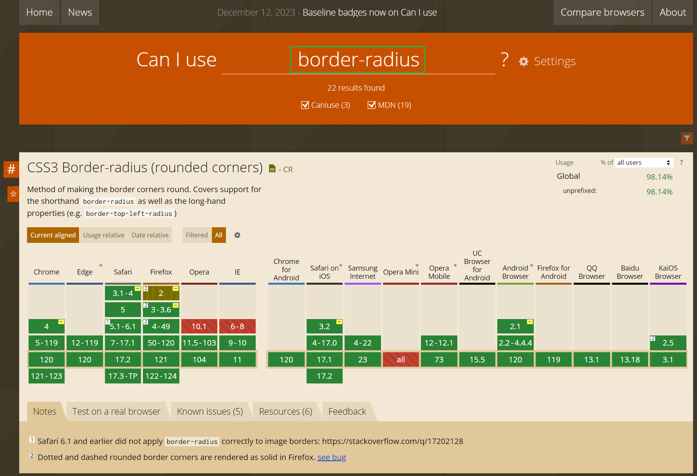

**常见浏览器私有前缀：**

- Chrome 浏览器：`-webkit-`。
- Safari 浏览器：`-webkit-`。
- Firefox 浏览器：`-moz-`。
- Edge 浏览器：`-webkit-`。
- 旧 Opera 浏览器：` -o-`。
- 旧 IE 浏览器：`-ms-`。

> 注意：在编码时，不需要过于关注浏览器私有前缀，不用绞尽脑汁的去记忆，也不用每个都去查询，因为常用的 CSS 3 新特性，主流浏览器都是支持的，即便是为了老浏览器而加前缀，我们也可以借助现代的构建工具，去帮我们添加私有前缀。

### 基本语法

#### 新增长度单位

CSS 3 新增了以下几种长度单位：

- `rem`：根元素字体大小的倍数，只与根元素字体大小有关。
- `vw`：视口宽度的百分之多少，10vw 就是视口宽度的 10%。（移动端使用较多）
- `vh`：视口高度的百分之多少，10vh 就是视口高度的 10%。（移动端使用较多）
- `vmax`：视口宽高中大的那个的百分之多少。（了解即可）
- `vmin`：视口宽高中小的那个的百分之多少。（了解即可）

示例：

```html
<!DOCTYPE html>
<html lang="zh-CN">

<head>
    <meta charset="UTF-8">
    <title>新增长度单位</title>
    <style>
        * {
            margin: 0;
            padding: 0;
        }

        .box1 {
            width: 200px;
            height: 200px;
            background-color: deepskyblue;
        }

        .box2 {
            width: 20vw;
            height: 20vh;
            background-color: green;
        }

        .box3 {
            width: 20vmax;
            height: 20vmin;
            background-color: orange;
        }
    </style>
</head>

<body>
    <div class="box1">像素</div>
    <div class="box2">vw和vh</div>
    <div class="box3">vmax</div>
</body>

</html>
```

#### 新增颜色设置方式

CSS 3 新增了三种颜色设置方式，分别是：`rgba`、`hsl`、`hsla`。这些在 CSS 2 中已经详细讲解，此处略过。

#### 新增选择器

CSS 3 新增的选择器有：`动态伪类`、`目标伪类`、`语言伪类`、`UI 伪类`、`结构伪类`、`否定伪类`、`伪元素`。这些在 CSS 2 中已经详细讲解，此处略过。

#### 新增盒模型相关属性

##### box-sizing 怪异盒模型

使用`box-sizing`属性，可以**设置盒模型的两种类型**：

- `content-box`：width 和 height 设置的是盒子内容区的大小。（默认值，**标准盒模型**：宽高是内容区的大小）
- `border-box`：width 和 height 设置的是盒子总大小。（**怪异盒模型**：宽高是整个盒子的大小，内容区的大小需要减去 border 和 padding）

示例：

```html
<!DOCTYPE html>
<html lang="zh-CN">

<head>
    <meta charset="UTF-8">
    <title>01_box-sizing</title>
    <style>
        .box1 {
            width: 200px;
            height: 200px;
            background-color: deepskyblue;
            padding: 5px;
            border: 5px solid black;
            margin-bottom: 20px;
        }

        .box2 {
            width: 200px;
            height: 200px;
            background-color: gray;
            padding: 5px;
            border: 5px solid black;
            box-sizing: border-box;
        }
    </style>
</head>

<body>
    <div class="box1"></div>
    <div class="box2"></div>
</body>

</html>
```

##### resize 调整盒子大小

使用`resize`属性，可以控制是否允许用户调节元素尺寸：

- `none`：不允许用户调整元素大小。（默认）
- `both`：用户可以调节元素的宽度和高度。
- `horizontal`：用户可以调节元素的宽度 。
- `vertical`：用户可以调节元素的高度。

>resize 使用的前提是，元素必须添加了 overflow 属性，日常开发中使用较少。

示例：

```html
<!DOCTYPE html>
<html lang="zh-CN">

<head>
    <meta charset="UTF-8">
    <title>02_resize</title>
    <style>
        .box1 {
            width: 400px;
            height: 400px;
            background-color: orange;
            resize: both;
            overflow: scroll;
        }

        .box2 {
            width: 800px;
            height: 600px;
            background-color: skyblue;
        }
    </style>
</head>

<body>
    <div class="box1">
        <div class="box2">123</div>
    </div>
</body>

</html>
```

##### box-shadow 盒子阴影

使用`box-shadow`属性，可以**为盒子添加阴影**。

语法：

```css
box-shadow: h-shadow v-shadow blur spread color inset;
```

- `h-shadow`：水平阴影的位置，必须填写，可以为负值。

- `v-shadow`：垂直阴影的位置，必须填写，可以为负值。

- `blur`：可选，模糊距离。

- `spread`：可选，阴影的外延值。

- `color`：可选，阴影的颜色。

- `inset`：可选，将外部阴影改为内部阴影。

- 默认值：`box-shadow: none`，表示没有阴影。

- 示例：

  ```css
  /* 写两个值，含义：水平位置、垂直位置 */
  box-shadow: 10px 10px;
  
  /* 写三个值，含义：水平位置、垂直位置、颜色 */
  box-shadow: 10px 10px red;
  
  /* 写三个值，含义：水平位置、垂直位置、模糊值 */
  box-shadow: 10px 10px 10px;
  
  /* 写四个值，含义：水平位置、垂直位置、模糊值、颜色 */
  box-shadow: 10px 10px 10px red;
  
  /* 写五个值，含义：水平位置、垂直位置、模糊值、外延值、颜色 */
  box-shadow: 10px 10px 10px 10px blue;
  
  /* 写六个值，含义：水平位置、垂直位置、模糊值、外延值、颜色、内阴影 */
  box-shadow: 10px 10px 20px 3px blue inset;
  ```

示例：

```html
<!DOCTYPE html>
<html lang="zh-CN">

<head>
    <meta charset="UTF-8">
    <title>03_box-shadow</title>
    <style>
        .box1 {
            width: 400px;
            height: 400px;
            background-color: orange;
            margin: 0 auto;
            margin-top: 100px;
            font-size: 40px;

            /* 写两个值，含义：水平位置 垂直位置 */
            /* box-shadow: 10px 10px; */

            /* 写三个值，含义：水平位置 垂直位置 阴影的颜色 */
            /* box-shadow: 10px 10px blue; */

            /* 写三个值，含义：水平位置 垂直位置 模糊程度 */
            /* box-shadow: 10px 10px 20px; */

            /* 写四个值，含义：水平位置 垂直位置 模糊程度 阴影颜色 */
            /* box-shadow: 10px 10px 20px blue; */

            /* 写五个值，含义：水平位置 垂直位置 模糊程度 外延值 阴影颜色 */
            /* box-shadow: -10px -10px 20px 10px blue; */

            /* 写六个值，含义：水平位置 垂直位置 模糊程度 外延值 阴影颜色 内阴影 */
            /* box-shadow: 10px 10px 20px 10px blue inset; */

            position: relative;
            top: 0;
            left: 0;
            transition: 0.4s linear all;
        }

        .box1:hover {
            box-shadow: 0px 0px 20px black;
            top: -1px;
            left: 0;
        }
    </style>
</head>

<body>
    <div class="box1">你好啊</div>
</body>

</html>
```

##### opacity 不透明度

使用`opacity`属性，能为整个元素**添加透明效果**，值是 0 到 1 之间的小数，0 是完全透明，1 表示完全不透明。

> opacity 与 rgba 的区别：
>
> - opacity 是一个属性，设置的是整个元素（包括元素里的内容）的不透明度。
> - rgba 是颜色的设置方式，用于设置颜色，它的透明度，仅仅是调整颜色的透明度。

示例：

```html
<!DOCTYPE html>
<html lang="zh-CN">

<head>
    <meta charset="UTF-8">
    <title>04_opacity</title>
    <style>
        .box1 {
            width: 200px;
            height: 200px;
            background-color: orange;
            font-size: 40px;
            opacity: 0.1;
            font-weight: bold;
        }

        .box2 {
            position: relative;
        }

        h1 {
            position: absolute;
            top: 100px;
            left: 0;
            background-color: black;
            color: white;
            width: 400px;
            line-height: 100px;
            text-align: center;
            font-size: 40px;
            opacity: 0.5;
        }
    </style>
</head>

<body>
    <div class="box1">你好啊</div>
    <div class="box2">
        
        <h1>你瞅啥</h1>
    </div>
</body>

</html>
```

#### 新增背景属性

##### background-origin

作用：**设置背景图的原点**。

取值：

- `padding-box`：从 padding 区域开始显示背景图像，默认值。
- `border-box`：从 border 区域开始显示背景图像。
- `content-box`：从 content 区域开始显示背景图像。

示例：

```html
<!DOCTYPE html>
<html lang="zh-CN">

<head>
    <meta charset="UTF-8">
    <title>01_background-origin</title>
    <style>
        .box1 {
            width: 400px;
            height: 400px;
            background-color: skyblue;
            margin: 0 auto;
            font-size: 40px;
            padding: 50px;
            border: 50px dashed rgba(255, 0, 0, 0.7);

            background-image: url('../images/bg01.jpg');
            background-repeat: no-repeat;
            background-origin: border-box;
        }
    </style>
</head>

<body>
    <div class="box1">你好啊</div>
</body>

</html>
```

##### background-clip

作用：**设置背景图的向外裁剪的区域**。

取值：

- `border-box`：从 border 区域开始向外裁剪背景，默认值。
- `padding-box`：从 padding 区域开始向外裁剪背景。
- `content-box`：从 content 区域开始向外裁剪背景。
- `text`：背景图只呈现在文字上。

示例：

```html
<!DOCTYPE html>
<html lang="zh-CN">

<head>
    <meta charset="UTF-8">
    <title>02_background-clip</title>
    <style>
        .box1 {
            width: 400px;
            height: 400px;
            background-color: skyblue;
            margin: 0 auto;
            font-size: 120px;
            font-weight: bold;
            padding: 50px;
            border: 50px dashed rgba(255, 0, 0, 0.7);
            color: transparent;

            background-image: url('../images/bg02.jpg');
            background-repeat: no-repeat;
            background-origin: border-box;
            background-clip: text;
        }
    </style>
</head>

<body>
    <div class="box1">你好啊</div>
</body>

</html>
```

##### background-size

作用：**设置背景图的尺寸**。

取值：

- 用`长度值`指定背景图片大小，不允许负值。

  ```css
  background-size: 400px 400px;
  ```

- 用`百分比`指定背景图片大小，不允许负值。

  ```css
  background-size: 100% 100%;
  ```

- `auto`：背景图片的真实大小，默认值。

  ```css
  background-size: auto;
  ```

- `contain`：将背景图片等比缩放，使背景图片的宽或高，与容器的宽或高相等，再将完整背景图片包含在容器内。注意：可能会造成容器里部分区域没有背景图片。

  ```css
  background-size: contain;
  ```

- `cover`：将背景图片等比缩放，直到完全覆盖容器，图片会尽可能全的显示在元素上。注意：背景图片有可能显示不完整。**（相对比较好的选择）**

  ```css
  background-size: cover;
  ```

示例：

```html
<!DOCTYPE html>
<html lang="zh-CN">

<head>
    <meta charset="UTF-8">
    <title>03_background-size</title>
    <style>
        div {
            width: 400px;
            height: 400px;
            padding: 50px;
            border: 50px dashed rgba(255, 0, 0, 0.7);
            /* background-image: url('../images/bg03.jpg'); */
            /* background-repeat: no-repeat; */

            /* background-size: 400px 400px; */
            /* background-size: 100% 100%; */
            /* background-size: contain; */
            background-size: cover;
        }
    </style>
</head>

<body>
    <div></div>
</body>

</html>
```

##### backgorund 复合属性

语法：

```css
background: color url repeat position / size origin clip;
```

- origin 和 clip 的值如果一样，如果只写一个值，则 origin 和 clip 都设置；如果设置了两个值，前面的是 origin ，后面的 clip。
- size 的值必须写在 position 值的后面，并且用 / 分开。

示例：

```html
<!DOCTYPE html>
<html lang="zh-CN">

<head>
    <meta charset="UTF-8">
    <title>04_background复合属性</title>
    <style>
        .box1 {
            width: 400px;
            height: 400px;
            margin: 0 auto;
            font-size: 40px;
            padding: 50px;
            border: 50px dashed rgba(255, 0, 0, 0.7);

            /* background: 背景颜色 背景url 是否重复 位置 / 大小 原点 裁剪方式; */
            background: skyblue url('../images/bg03.jpg') no-repeat 10px 10px / 500px 500px border-box content-box;
        }
    </style>
</head>

<body>
    <div class="box1">你好啊</div>
</body>

</html>
```

##### 多背景图

CSS 3 允许元素设置多个背景图片：

```css
/* 添加多个背景图 */
background: url(../images/bg-lt.png) no-repeat,
            url(../images/bg-rt.png) no-repeat right top,
            url(../images/bg-lb.png) no-repeat left bottom,
            url(../images/bg-rb.png) no-repeat right bottom;
```

示例：

```html
<!DOCTYPE html>
<html lang="zh-CN">

<head>
    <meta charset="UTF-8">
    <title>05_多背景图</title>
    <style>
        div {
            width: 400px;
            height: 400px;
            border: 1px solid black;
            background: url('../images/bg-lt.png') no-repeat left top,
                url('../images/bg-rt.png') no-repeat right top,
                url('../images/bg-lb.png') no-repeat left bottom,
                url('../images/bg-rb.png') no-repeat right bottom;
        }
    </style>
</head>

<body>
    <div></div>
</body>

</html>
```

效果图：

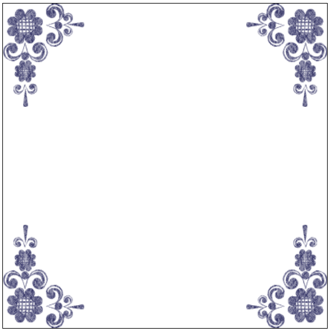

#### 新增边框属性

##### 边框圆角

使用`border-radius`属性，可以**将盒子变为圆角**。

**同时设置四个角的圆角：**

```css
border-radius:10px;
```

分开设置每个角的圆角（几乎不用）：

- `border-top-left-radius`：设置左上角圆角半径。
- `border-top-right-radius`：设置右上角圆角半径。
- `border-bottom-right-radius`：设置右下角圆角半径。
- `border-bottom-left-radius`：设置左下角圆角半径。
- 一个值是正圆半径，两个值分别是椭圆的 x 半径、y 半径。

分开设置每个角的圆角，综合写法（几乎不用）：

```css
border-raidus: 左上角x 右上角x 右下角x 左下角x / 左上y 右上y 右下y 左下y;
```

示例：

```html
<!DOCTYPE html>
<html lang="zh-CN">

<head>
    <meta charset="UTF-8">
    <title>01_边框圆角</title>
    <style>
        div {
            width: 400px;
            height: 400px;
            border: 2px solid black;
            margin: 0 auto;

            /* border-radius: 200px; */
            /* border-radius: 50%; */

            /* border-top-left-radius: 100px; */
            /* border-top-right-radius: 50px; */
            /* border-bottom-right-radius: 20px; */
            /* border-bottom-left-radius: 10px; */

            /* border-top-left-radius: 100px 50px; */
            /* border-top-right-radius: 50px 20px; */
            /* border-bottom-right-radius: 20px 10px; */
            /* border-bottom-left-radius: 10px 5px; */

            border-radius: 100px 50px 20px 10px / 50px 20px 10px 5px;

        }
    </style>
</head>

<body>
    <div></div>
</body>

</html>
```

##### 边框外轮廓（了解）

通过以下属性，可以**设置边框外轮廓**：

- `outline-width`：外轮廓的宽度。

- `outline-color`：外轮廓的颜色。

- `outline-style`：外轮廓的风格。

  - `none`： 无轮廓。
  - `dotted`： 点状轮廓。
  - `dashed`： 虚线轮廓。
  - `solid`： 实线轮廓。
  - `double`： 双线轮廓。

- `outline-offset`：设置外轮廓与边框的距离，正负值都可以设置。

- `outline`：复合属性。示例：

  ```css
  outline:50px solid blue;
  ```

>注意： outline-offset 不是 outline 的子属性，是一个独立的属性。

示例：

```html
<!DOCTYPE html>
<html lang="zh-CN">

<head>
    <meta charset="UTF-8">
    <title>02_边框外轮廓</title>
    <style>
        .box1 {
            width: 400px;
            height: 400px;
            padding: 10px;
            border: 10px solid black;
            background-color: gray;
            font-size: 40px;
            margin: 0 auto;
            margin-top: 100px;

            /* outline-width: 20px; */
            /* outline-color: orange; */
            /* outline-style: solid; */
            outline-offset: 30px;

            outline: 20px solid orange;

        }
    </style>
</head>

<body>
    <div class="box1">你好啊</div>
    <div>Lorem ipsum dolor sit amet consectetur adipisicing elit. Nobis, architecto.</div>
</body>

</html>
```

#### 新增文本属性

##### 文本阴影

使用`text-shadow`属性，可以**给文本添加阴影**。

语法：

```css
text-shadow: h-shadow v-shadow blur color;
```

取值：

- `h-shadow`：必需写，水平阴影的位置，允许负值。
- `v-shadow`：必需写，垂直阴影的位置，允许负值。
- `blur`：可选，模糊的距离。
- `color`：可选，阴影的颜色。
- `text-shadow: none`：默认值，表示没有阴影。

示例：

```html
<!DOCTYPE html>
<html lang="zh-CN">

<head>
    <meta charset="UTF-8">
    <title>01_文本阴影</title>
    <style>
        body {
            background-color: black;
        }

        h1 {
            font-size: 80px;
            text-align: center;
            color: white;

            /* text-shadow: 3px 3px; */
            /* text-shadow: 3px 3px red; */
            /* text-shadow: 3px 3px 10px red; */
            /* text-shadow: 0px 0px 15px black; */
            text-shadow: 0px 0px 20px red;
            font-family: '翩翩体-简';
        }
    </style>
</head>

<body>
    <h1>红浪漫洗浴欢迎您的光临</h1>
</body>

</html>
```

##### 文本换行

使用`white-space`属性，可以**设置文本换行方式**。

取值：

- `normal`：文本超出边界自动换行，文本中的换行被浏览器识别为一个空格，默认值。
- `pre`：原样输出，与 pre 标签的效果相同。
- `pre-wrap`：在 pre 效果的基础上，超出元素边界自动换行。
- `pre-line`：在 pre 效果的基础上，超出元素边界自动换行，且只识别文本中的换行，空格会忽略。（文字首尾的空格，文字中间的空格不忽略）
- `nowrap`：强制不换行。

示例：

```html
<!DOCTYPE html>
<html lang="zh-CN">

<head>
    <meta charset="UTF-8">
    <title>02_文本换行</title>
    <style>
        div {
            width: 400px;
            height: 400px;
            border: 1px solid black;
            font-size: 20px;
            white-space: nowrap;
        }
    </style>
</head>

<body>
    <div>
        山回路转不见君
        雪上空留马行处
        山回路转不见君 山回路转不见君山回路转不见君山回路转不见君山回路转不见君
        雪上空留马行处
        山回路转不见君
        雪上空留马行处
        山回路转不见君
        雪上空留马行处
        山回路转不见君
        雪上空留马行处
        山回路转不见君
        雪上空留马行处
    </div>
</body>

</html>
```

##### 文本溢出

使用`text-overflow`属性，可以**设置文本内容溢出时的呈现模式**。

取值：

- `clip`：当内联内容溢出时，将溢出部分裁切掉，默认值。
- `ellipsis`：当内联内容溢出块容器时，将溢出部分替换为 "..."。

>**注意：要使得 text-overflow 属性生效，块容器必须显式定义 overflow 为非 visible 值，white-space 为 nowrap 值。**

示例：

```html
<!DOCTYPE html>
<html lang="zh-CN">

<head>
    <meta charset="UTF-8">
    <title>03_文本溢出</title>
    <style>
        ul {
            width: 400px;
            height: 200px;
            border: 1px solid black;
            font-size: 20px;
            list-style: none;
            padding-left: 0;
            padding: 10px;
        }

        li {
            margin-bottom: 10px;
            overflow: hidden;
            white-space: nowrap;
            text-overflow: ellipsis;
        }
    </style>
</head>

<body>
    <ul>
        <li>焦点访谈：隐形冠军 匠心打造 分毫必争</li>
        <li>我，嫁到日本才发现，女性活得真憋屈，体毛不能有，放屁也不自由</li>
        <li>高洪波无缘！足协盟主热门人选曝光，3选1，冷门人物或成黑马杀出</li>
        <li>《狂飙》爆火以后“疯驴子”被骂上热搜：跪着赚钱丢人吗</li>
        <li>气温猛降15℃，冷空气再来袭！这些地方迎大范围降雨！“虚高”气温大跳水！！！！！</li>
    </ul>
</body>

</html>
```

效果图：

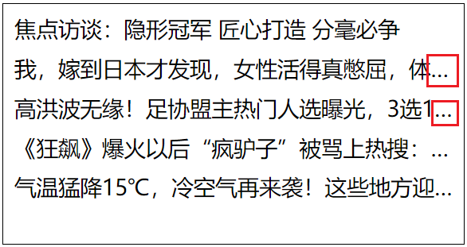

#####  文本修饰

CSS 3 升级了`text-decoration`属性，让其变成了复合属性。

语法：

```css
text-decoration: text-decoration-line || text-decoration-style || text-decoration-color;
```

取值：

- `text-decoration-line`：设置文本装饰线的位置。
  - `none`：指定文字无装饰，默认值。
  - `underline`：指定文字的装饰是下划线。
  - `overline`：指定文字的装饰是上划线。
  - `line-through`：指定文字的装饰是贯穿线。
- `text-decoration-style`：文本装饰线条的形状。
  - `solid`：实线，默认。
  - `double`：双线。
  - `dotted`：点状线条。
  - `dashed`：虚线。
  - `wavy`：波浪线。
- `text-decoration-color`：文本装饰线条的颜色。

示例：

```html
<!DOCTYPE html>
<html lang="zh-CN">

<head>
    <meta charset="UTF-8">
    <title>04_文本修饰</title>
    <style>
        h1 {
            font-size: 100px;
            /* text-decoration-line: overline; */
            /* text-decoration-style: dashed; */
            /* text-decoration-color: blue; */
            /* text-decoration: overline wavy blue; */
        }
    </style>
</head>

<body>
    <h1>你好啊，欢迎来到尚硅谷学习</h1>
</body>

</html>
```

##### 文本描边

使用以下属性，可以**对文本进行描边**：

- `-webkit-text-stroke-width`：设置文字描边的宽度，写长度值。
- `-webkit-text-stroke-color`：设置文字描边的颜色，写颜色值。
- `-webkit-text-stroke`：复合属性，设置文字描边宽度和颜色。

> 注意：文字描边功能仅 webkit 内核浏览器支持。

示例：

```html
<!DOCTYPE html>
<html lang="zh-CN">

<head>
    <meta charset="UTF-8">
    <title>05_文本描边</title>
    <style>
        h1 {
            font-size: 100px;
            /* -webkit-text-stroke-color:red; */
            /* -webkit-text-stroke-width:3px; */
            /* -webkit-text-stroke-width:3px; */
            -webkit-text-stroke: 3px red;
            color: transparent;
        }
    </style>
</head>

<body>
    <h1>先生您好，欢迎光临红浪漫！</h1>
</body>

</html>
```

#### 新增渐变

##### 线性渐变

使用`linear-gradient`属性，可以达到**线性渐变**的效果。

1. 多个颜色之间的渐变， 默认**从上到下**渐变。

   ```css
   background-image: linear-gradient(red, yellow, green);
   ```

   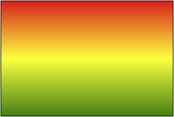

2. 使用`关键词`设置线性**渐变的方向**。

   ```css
   /* 往上 */
   background-image: linear-gradient(to top, red, yellow, green);
   /* 往右上角 */
   background-image: linear-gradient(to right top, red, yellow, green);
   ```

   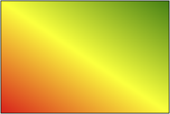

3. 使用`角度`设置线性**渐变的方向**。

   ```css
   background-image: linear-gradient(30deg, red, yellow, green);
   ```

   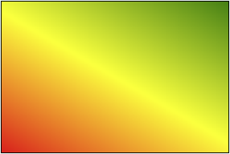

4. 调整开始**渐变的位置**。

   ```css
   background-image: linear-gradient(red 50px, yellow 100px, green 150px);
   ```

   .jpg)

5. **渐变文字**：

   ```css
   background-image: linear-gradient(20deg, red 50px, yellow 100px, green 150px);
   font-size: 80px;
   text-align: center;
   line-height: 200px;
   font-weight: bold;
   color: transparent;
   background-clip: text;
   ```

   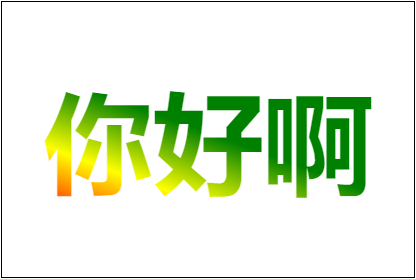

示例：

```html
<!DOCTYPE html>
<html lang="zh-CN">

<head>
    <meta charset="UTF-8">
    <title>01_线性渐变</title>
    <style>
        .box {
            width: 300px;
            height: 200px;
            border: 1px solid black;
            float: left;
            margin-left: 50px;
            font-size: 20px;
        }

        .box1 {
            background-image: linear-gradient(red, yellow, green);
        }

        .box2 {
            background-image: linear-gradient(to right top, red, yellow, green);
        }

        .box3 {
            background-image: linear-gradient(20deg, red, yellow, green);
        }

        .box4 {
            background-image: linear-gradient(red 50px, yellow 100px, green 150px);
        }

        .box5 {
            background-image: linear-gradient(20deg, red 50px, yellow 100px, green 150px);
            font-size: 80px;
            text-align: center;
            line-height: 200px;
            font-weight: bold;
            color: transparent;
            background-clip: text;
        }
    </style>
</head>

<body>
    <div class="box box1">默认情况（从上到下）</div>
    <div class="box box2">通过关键词调整线性渐变渐变的方向</div>
    <div class="box box3">通过角度调整线性渐变渐变的方向</div>
    <div class="box box4">调整线性渐变的区域</div>
    <div class="box box5">你好啊</div>
</body>

</html>
```

效果图：

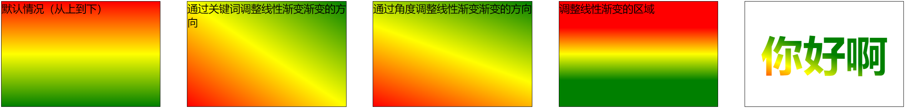

##### 径向渐变

使用`radial-gradient`属性，可以达到**径向渐变**的效果。

1. 多个颜色之间的渐变， 默认**从圆心四散**。（注意：不一定是正圆，要看容器本身宽高比）

   ```css
   background-image: radial-gradient(red, yellow, green);
   ```

   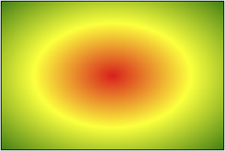

2. 使用`关键词`调整渐变圆的**圆心位置**。

   ```css
   background-image: radial-gradient(at right top, red, yellow, green);
   ```

   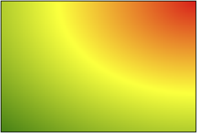

3. 使用`像素值`调整渐变圆的**圆心位置**。

   ```css
   background-image: radial-gradient(at 100px 50px, red, yellow, green);
   ```

   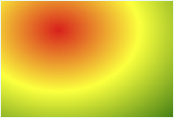

4. 调整渐变形状为**正圆**。

   ```css
   background-image: radial-gradient(circle, red, yellow, green);
   ```

   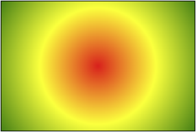

5. 调整形状的**半径**。

   ```css
   background-image: radial-gradient(100px, red, yellow, green);
   background-image: radial-gradient(50px 100px, red, yellow, green);
   ```

   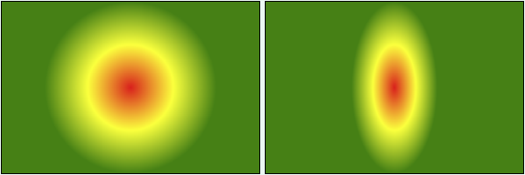

6. 调整**开始渐变的位置**。

   ```css
   background-image: radial-gradient(red 50px, yellow 100px, green 150px);
   ```

   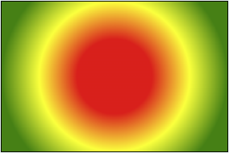

示例：

```html
<!DOCTYPE html>
<html lang="zh-CN">

<head>
    <meta charset="UTF-8">
    <title>02_径向渐变</title>
    <style>
        .box {
            width: 300px;
            height: 200px;
            border: 1px solid black;
            float: left;
            margin-left: 50px;
            font-size: 20px;
            margin-top: 20px;
        }

        .box1 {
            background-image: radial-gradient(red, yellow, green);
        }

        .box2 {
            background-image: radial-gradient(at right top, red, yellow, green);
        }

        .box3 {
            background-image: radial-gradient(at 100px 50px, red, yellow, green);
        }

        .box4 {
            background-image: radial-gradient(circle, red, yellow, green);
        }

        .box5 {
            background-image: radial-gradient(200px 200px, red, yellow, green);
        }

        .box6 {
            background-image: radial-gradient(red 50px, yellow 100px, green 150px);
        }

        .box7 {
            background-image: radial-gradient(100px 50px at 150px 150px, red 50px, yellow 100px, green 150px);
        }
    </style>
</head>

<body>
    <div class="box box1">默认情况</div>
    <div class="box box2">通过关键词调整径向渐变圆的圆心</div>
    <div class="box box3">通过像素值调整径向渐变圆的圆心</div>
    <div class="box box4">通过circle关键字调整为正圆</div>
    <div class="box box5">通过像素值调整为正圆</div>
    <div class="box box6">调整径向渐变的区域</div>
    <div class="box box7">综合写法</div>
</body>

</html>
```

效果图：

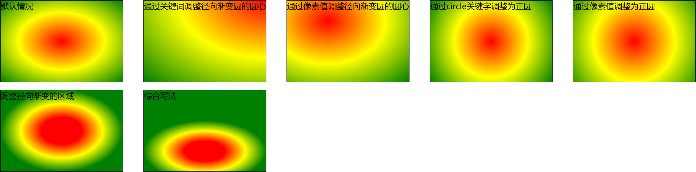

##### 重复渐变

无论线性渐变，还是径向渐变，在没有发生渐变的位置，继续进行渐变，就为`重复渐变`。

- 使用`repeating-linear-gradient`进行重复线性渐变，具体参数同 linear-gradient。
- 使用`repeating-radial-gradient`进行重复径向渐变，具体参数同 radial-gradient。

示例：

```html
<!DOCTYPE html>
<html lang="zh-CN">

<head>
    <meta charset="UTF-8">
    <title>03_重复渐变</title>
    <style>
        .box {
            width: 300px;
            height: 200px;
            border: 1px solid black;
            float: left;
            margin-left: 50px;
            font-size: 20px;
        }

        .box1 {
            background-image: repeating-linear-gradient(red 50px, yellow 100px, green 150px);
        }

        .box2 {
            background-image: repeating-radial-gradient(red 50px, yellow 100px, green 150px);
        }
    </style>
</head>

<body>
    <div class="box box1">重复线性渐变</div>
    <div class="box box2">重复径向渐变</div>
</body>

</html>
```

效果图：

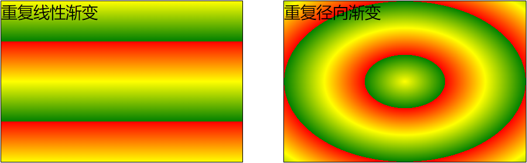

##### 渐变的应用案例

利用渐变，可以做出很多有意思的效果，例如：横格纸、立体球等等。

示例：

```html
<!DOCTYPE html>
<html lang="zh-CN">

<head>
    <meta charset="UTF-8">
    <title>04_渐变小案例</title>
    <style>
        .box1 {
            width: 600px;
            height: 800px;
            padding: 20px;
            border: 1px solid black;
            margin: 0 auto;
            background-image: repeating-linear-gradient(transparent 0px, transparent 29px, gray 30px);
            background-clip: content-box;
        }

        .box2 {
            width: 200px;
            height: 200px;
            border-radius: 50%;
            background-image: radial-gradient(at 80px 80px, white, #333);
        }
    </style>
</head>

<body>
    <div class="box1"></div>
    <div class="box2"></div>
</body>

</html>
```

效果图：

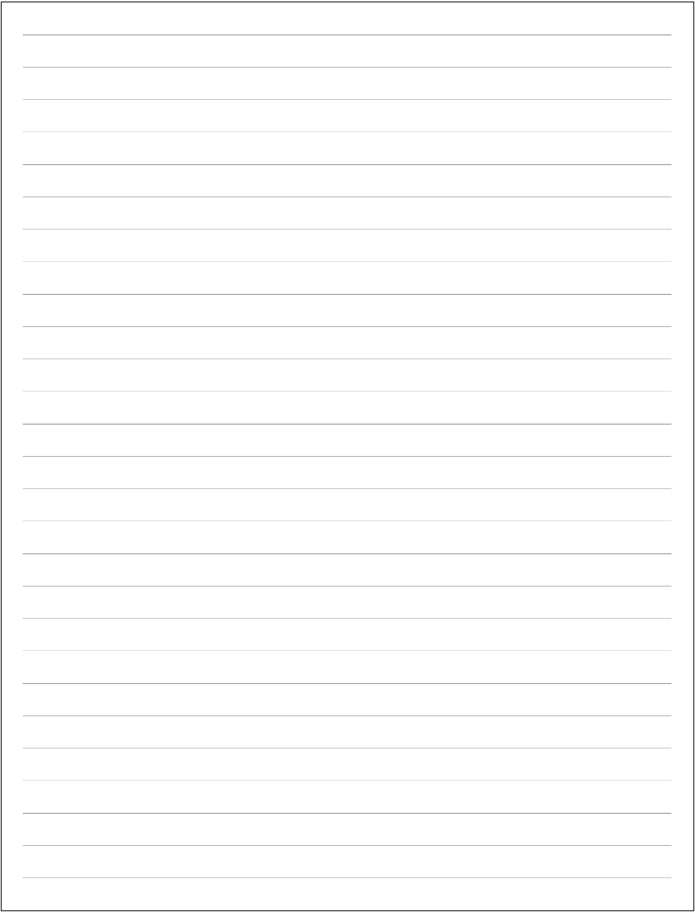

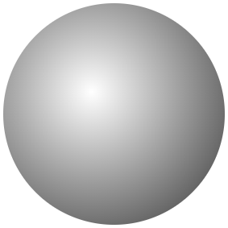

#### web 字体

##### 基本用法

通过`@font-face`指定字体的具体地址，浏览器会自动下载该字体，这样就不依赖用户电脑上已安装的字体。

语法（简写方式）：

```css
@font-face {
    font-family: "情书字体";
    src: url('./方正手迹.ttf');
}
```

语法（高兼容性写法）:

```css
@font-face {
    font-family: "atguigu";
    font-display: swap;
    src: url('webfont.eot'); /* IE9 */
    src: url('webfont.eot?#iefix') format('embedded-opentype'), /* IE6-IE8 */
    url('webfont.woff2') format('woff2'),
    url('webfont.woff') format('woff'), /* chrome、firefox */
    url('webfont.ttf') format('truetype'), /* chrome、firefox、opera、Safari,
    Android*/
    url('webfont.svg#webfont') format('svg'); /* iOS 4.1- */
}
```

>中文的字体文件很大，使用完整的字体文件不现实，通常针对某几个文字进行单独定制。
>
>可使用阿里 Web 字体定制工具：https://www.iconfont.cn/webfont
>
>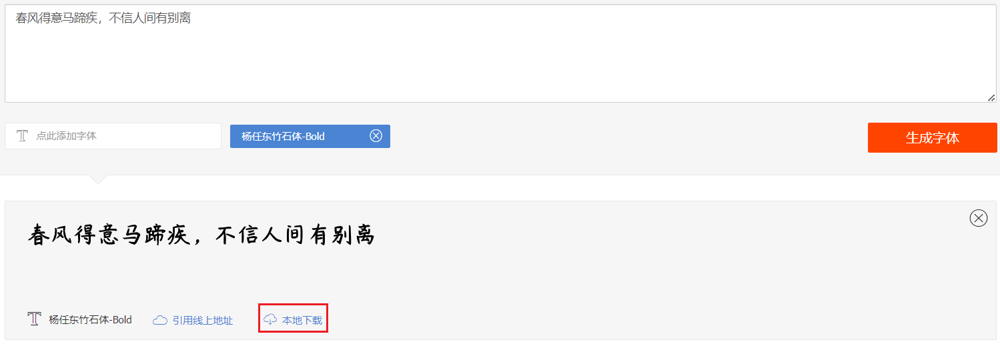

示例：

```html
<!DOCTYPE html>
<html lang="zh-CN">

<head>
    <meta charset="UTF-8">
    <title>Document</title>
    <style>
        @font-face {
            font-family: "情书字体";
            src: url('./font1/方正手迹.ttf');
        }

        @font-face {
            font-family: "atguigu";
            font-display: swap;
            src: url('./font2/webfont.eot');
            /* IE9 */
            src: url('./font2/webfont.eot?#iefix') format('embedded-opentype'),
                /* IE6-IE8 */
                url('./font2/webfont.woff2') format('woff2'),
                url('./font2/webfont.woff') format('woff'),
                /* chrome、firefox */
                url('./font2/webfont.ttf') format('truetype'),
                /* chrome、firefox、opera、Safari, Android, iOS 4.2+*/
                url('./font2/webfont.svg#webfont') format('svg');
            /* iOS 4.1- */
        }

        .t1 {
            font-size: 100px;
            font-family: '情书字体';
        }

        .t2 {
            font-size: 100px;
            font-family: 'atguigu';
        }
    </style>
</head>

<body>
    <h1 class="t1">春风得意马蹄疾，不信人间有别离</h1>
    <h1 class="t2">春风得意马蹄疾，不信人间有别离</h1>
</body>

</html>
```

效果图：

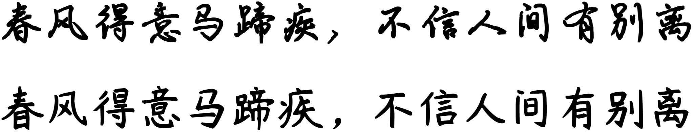

##### 字体图标

优点：

- 相比图片更加清晰。
- 灵活性高，更方便改变大小、颜色、风格等。
- 兼容性好，IE 也能支持。

>字体图标的具体使用方式，每个平台不尽相同，最好参考平台使用指南，例如使用最多的阿里图标库，详细使用查看官网，从阿里图标库官网选中的图标，可以使用本地或在线两种方式使用。
>
>阿里图标库官网地址：https://www.iconfont.cn/

###### 本地使用

**方式一：**

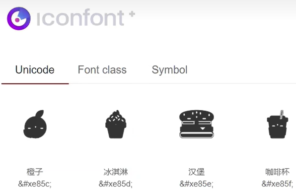

```html
<!DOCTYPE html>
<html lang="zh-CN">

<head>
    <meta charset="UTF-8">
    <title>Document</title>
    <style>
        /* 第一步 */
        @font-face {
            font-family: 'iconfont';
            src: url('./font3/iconfont.woff2?t=1676857973138') format('woff2'),
                url('./font3/iconfont.woff?t=1676857973138') format('woff'),
                url('./font3/iconfont.ttf?t=1676857973138') format('truetype');
        }

        /* 第二步 */
        .iconfont {
            font-family: "iconfont" !important;
            font-size: 100px;
        }
    </style>
</head>

<body>
    <span class="iconfont">&#xe85c;</span>
    <span class="iconfont">&#xe85d;</span>
    <span class="iconfont">&#xe85e;</span>
    <span class="iconfont">&#xe85f;</span>
</body>

</html>
```

效果图：

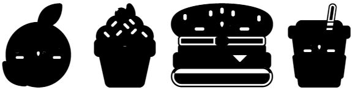

**方式二：**

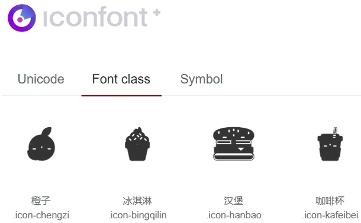

```html
<!DOCTYPE html>
<html lang="zh-CN">

<head>
    <meta charset="UTF-8">
    <title>03_字体图标_方式二</title>
    <link rel="stylesheet" href="./font3/iconfont.css">
    <style>
        .iconfont {
            font-size: 100px;
        }
    </style>
</head>

<body>
    <span class="iconfont icon-chengzi"></span>
    <span class="iconfont icon-bingqilin"></span>
    <span class="iconfont icon-hanbao"></span>
    <span class="iconfont icon-kafeibei"></span>
</body>

</html>
```

效果图：

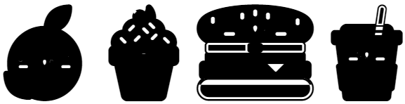

**方式三：**

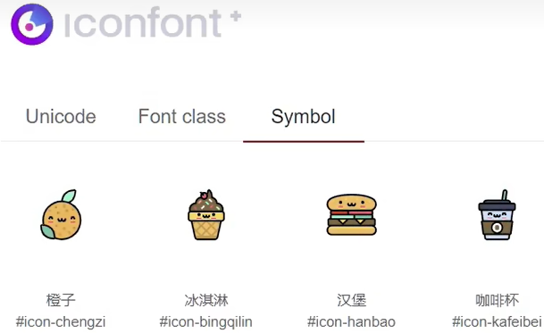

```html
<!DOCTYPE html>
<html lang="zh-CN">

<head>
    <meta charset="UTF-8">
    <title>04_字体图标_方式三</title>
    <script src="./font3/iconfont.js"></script>
    <style>
        svg {
            width: 150px;
        }
    </style>
</head>

<body>
    <svg class="icon" aria-hidden="true">
        <use xlink:href="#icon-chengzi"></use>
    </svg>
    <svg class="icon" aria-hidden="true">
        <use xlink:href="#icon-bingqilin"></use>
    </svg>
    <svg class="icon" aria-hidden="true">
        <use xlink:href="#icon-hanbao"></use>
    </svg>
    <svg class="icon" aria-hidden="true">
        <use xlink:href="#icon-kafeibei"></use>
    </svg>
</body>

</html>
```

> **svg：HTML 5 新增的矢量图标签。**

效果图：

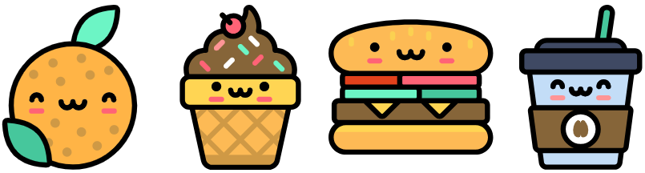

###### 在线使用

**方式一：**

```html
<!DOCTYPE html>
<html lang="zh-CN">

<head>
    <meta charset="UTF-8">
    <title>05_字体图标_方式一_在线使用</title>
    <style>
        @font-face {
            font-family: 'iconfont';
            /* Project id 3904680 */
            src: url('//at.alicdn.com/t/c/font_3904680_cctp97jw61q.woff2?t=1676858967519') format('woff2'),
                url('//at.alicdn.com/t/c/font_3904680_cctp97jw61q.woff?t=1676858967519') format('woff'),
                url('//at.alicdn.com/t/c/font_3904680_cctp97jw61q.ttf?t=1676858967519') format('truetype');
        }

        .iconfont {
            font-family: "iconfont" !important;
            font-size: 100px;
        }
    </style>
</head>

<body>
    <span class="iconfont">&#xe85c;</span>
    <span class="iconfont">&#xe85d;</span>
    <span class="iconfont">&#xe85e;</span>
    <span class="iconfont">&#xe85f;</span>
</body>

</html>
```

**方式二：**

```html
<!DOCTYPE html>
<html lang="zh-CN">

<head>
    <meta charset="UTF-8">
    <title>06_字体图标_方式二_在线使用</title>
    <link rel="stylesheet" href="//at.alicdn.com/t/c/font_3904680_cctp97jw61q.css">
    <style>
        .iconfont {
            font-size: 100px;
        }
    </style>
</head>

<body>
    <span class="iconfont icon-chengzi"></span>
    <span class="iconfont icon-bingqilin"></span>
    <span class="iconfont icon-hanbao"></span>
    <span class="iconfont icon-kafeibei"></span>
</body>

</html>
```

**方式三：**

```html
<!DOCTYPE html>
<html lang="zh-CN">

<head>
    <meta charset="UTF-8">
    <title>07_字体图标_方式三_在线使用</title>
    <script src="//at.alicdn.com/t/c/font_3904680_cctp97jw61q.js"></script>
</head>

<body>
    <svg class="icon" aria-hidden="true">
        <use xlink:href="#icon-chengzi"></use>
    </svg>
    <svg class="icon" aria-hidden="true">
        <use xlink:href="#icon-bingqilin"></use>
    </svg>
    <svg class="icon" aria-hidden="true">
        <use xlink:href="#icon-hanbao"></use>
    </svg>
    <svg class="icon" aria-hidden="true">
        <use xlink:href="#icon-kafeibei"></use>
    </svg>
</body>

</html>
```

#### 2D 变换

前提，二维坐标系如下图所示：

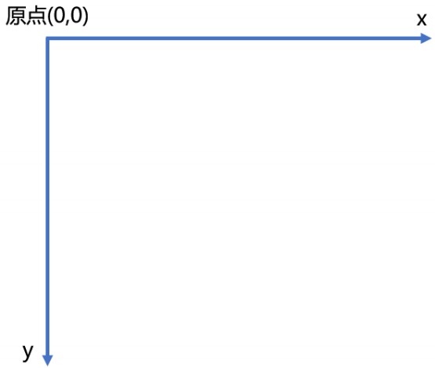

##### 2D 位移

`2D 位移`是指**改变元素的位置**，具体使用方式如下：

1. 先给元素添加`转换属性 transform`。
2. 编写 transform 的具体值，相关可选值如下：
   - `translateX`：设置**水平方向**位移，需指定长度值；若指定的是百分比，是**参考自身宽度**的百分比。
   - `translateY`：设置**垂直方向**位移，需指定长度值；若指定的是百分比，是**参考自身高度**的百分比。
   - `translate`：一个值代表 "水平方向"，两个值代表 "水平和垂直方向"。

注意：

- 位移与相对定位很相似，都**不脱离文档流**，不会影响到其它元素。

- 与相对定位的区别：相对定位的百分比值，参考的是其父元素；定位的百分比值，参考的是其自身。

- **浏览器针对位移有优化**，与定位相比，浏览器处理位移的效率更高。

- transform 可以链式编写，例如：

  ```css
  transform: translateX(30px) translateY(40px);
  ```

- **位移对行内元素无效。**

- 位移配合定位，可**实现元素水平垂直居中**。

  ```css
  .box {
      position: absolute;
      left: 50%;
      top: 50%;
      transform: translate(-50%, -50%);
  }
  ```

示例：

```html
<!DOCTYPE html>
<html lang="zh-CN">

<head>
    <meta charset="UTF-8">
    <title>01_位移</title>
    <style>
        .outer {
            width: 200px;
            height: 200px;
            border: 2px solid black;
            margin: 0 auto;
            margin-top: 100px;
            position: relative;
        }

        .inner {
            width: 200px;
            height: 200px;
            background-color: deepskyblue;
            /* 水平位移 */
            /* transform: translateX(50px); */

            /* 垂直位移 */
            /* transform: translateY(50px); */

            /* 水平+垂直位移 */
            transform: translate(50px, 50px);
        }

        /* 水平垂直居中 */
        .inner2 {
            width: 60px;
            height: 60px;
            background-color: orange;
            position: absolute;
            top: 50%;
            left: 50%;
            transform: translate(-50%, -50%);
        }
    </style>
</head>

<body>
    <div class="outer">
        <div class="inner">你好啊</div>
    </div>

    <div class="outer">
        <div class="inner2">你好啊</div>
    </div>
</body>

</html>
```

效果图：

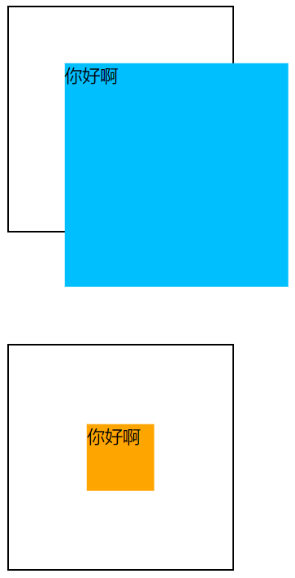

##### 2D 缩放

`2D 缩放`是指**让元素放大或缩小**，具体使用方式如下：

1. 先给元素添加 `转换属性 transform`。
2. 编写 transform 的具体值，相关可选值如下：
   - `scaleX`：设置**水平方向**的缩放比例，值为一个数字，1 表示不缩放，大于 1 放大，小于 1 缩小。
   - `scaleY`：设置**垂直方向**的缩放比例，值为一个数字，1 表示不缩放，大于 1 放大，小于 1 缩小。
   - `scale`：同时设置水平方向、垂直方向的缩放比例，一个值代表同时设置 "水平和垂直缩放"；两个值分别代表 "水平缩放、垂直缩放"。

注意：

- scale 的值，是支持写负数的，但几乎不用，因为容易让人产生误解。（有反转的效果）
- **借助缩放，可实现小于 12 px 的文字。**

示例：

```html
<!DOCTYPE html>
<html lang="zh-CN">

<head>
    <meta charset="UTF-8">
    <title>02_缩放</title>
    <style>
        .outer {
            width: 200px;
            height: 200px;
            border: 2px solid black;
            margin: 0 auto;
            margin-top: 100px;
        }

        .inner {
            width: 200px;
            height: 200px;
            background-color: deepskyblue;
            transform: scale(0.8);
        }

        /* 小于12px的文字 */
        span {
            display: inline-block;
            font-size: 20px;
            transform: scale(0.5);
        }
    </style>
</head>

<body>
    <div class="outer">
        <div class="inner">你好啊</div>
        <div>好</div>
        <span>好</span>
    </div>
</body>

</html>
```

效果图：

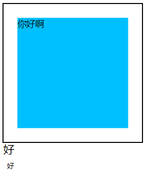

##### 2D 旋转

`2D 旋转`是指**让元素在二维平面内，顺时针旋转或逆时针旋转**，具体使用方式如下：

1. 先给元素添加`转换属性 transform`。
2. 编写 transform 的具体值，相关可选值如下：
   - `rotate`：设置**旋转角度**，需指定一个角度值（deg），正值是顺时针旋转，负值是逆时针旋转。

>注意：
>
>- rotateX 和 rotateY 是 3D 旋转，rotateY 是 2D 旋转。
>- rotate(20deg) 相当于 rotateZ(20deg)，即默认是 2D 旋转。当然到了 3D 变换的时候，还可以写为 rotate(x, x, x)。

示例：

```html
<!DOCTYPE html>
<html lang="zh-CN">

<head>
    <meta charset="UTF-8">
    <title>03_旋转</title>
    <style>
        .outer {
            width: 200px;
            height: 200px;
            border: 2px solid black;
            margin: 0 auto;
            margin-top: 100px;
        }

        .inner {
            width: 200px;
            height: 200px;
            background-color: deepskyblue;
            /* transform: rotateZ(-30deg); */
            transform: rotate(30deg);
        }
    </style>
</head>

<body>
    <div class="outer">
        <div class="inner">你好啊</div>
    </div>
</body>

</html>
```

效果图：

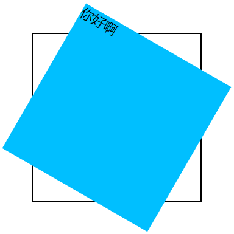

##### 2D 扭曲（了解）

`2D 扭曲`是指**让元素在二维平面内被 "拉扯"，进而 "走形"**，实际开发几乎不用，了解即可，具体使用方式如下：

1. 先给元素添加`转换属性 transform`。
2. 编写 transform 的具体值，相关可选值如下：
   - `skewX`：设置元素在**水平方向**扭曲，值为角度值，会将元素的左上角、右下角拉扯（左右方向）。
   - `skewY`：设置元素在**垂直方向**扭曲，值为角度值，会将元素的左上角、右下角拉扯（上下方向）。
   - `skew`：一个值代表 "水平方向"，两个值代表 "水平和垂直方向"。

示例：

```html
<!DOCTYPE html>
<html lang="zh-CN">

<head>
    <meta charset="UTF-8">
    <title>04_扭曲_了解</title>
    <style>
        .outer {
            width: 200px;
            height: 200px;
            border: 2px solid black;
            margin: 0 auto;
            margin-top: 100px;
        }

        .inner {
            width: 200px;
            height: 200px;
            background-color: deepskyblue;
            /* transform: skewX(-30deg); */
            /* transform: skewY(30deg); */
            /* transform: skewX(30deg) skewY(30deg); */
            transform: skew(30deg);
        }
    </style>
</head>

<body>
    <div class="outer">
        <div class="inner">你好啊</div>
    </div>
</body>

</html>
```

效果图：

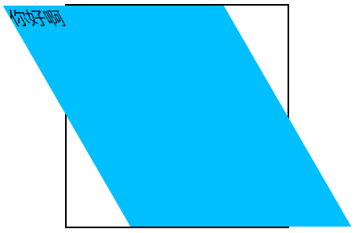

##### 多重变换

多个 2D 变换，可以同时使用一个 transform 来编写。

语法：

```css
transform: translate(-50%, -50%) rotate(45deg);
```

> 注意：
>
> - 多重变换时，先缩放后位移的效果，与先位移后缩放的效果不一样。**位移的坐标系，参考的是最开始的位置，与缩放无关。**
> - 多重变换时，如果先旋转，后位移。在旋转之后，位移的坐标系就不再是最开始的位置，与旋转有关。因此，**多重变换，建议最后旋转。**

示例：

```html
<!DOCTYPE html>
<html lang="zh-CN">

<head>
    <meta charset="UTF-8">
    <title>05_多重变换</title>
    <style>
        .outer {
            width: 200px;
            height: 200px;
            border: 2px solid black;
            margin: 0 auto;
            margin-top: 100px;
        }

        .inner {
            width: 200px;
            height: 200px;
            background-color: deepskyblue;
            transform: translate(100px, 100px) rotate(30deg);
        }
    </style>
</head>

<body>
    <div class="outer">
        <div class="inner">你好啊</div>
    </div>
</body>

</html>
```

效果图：

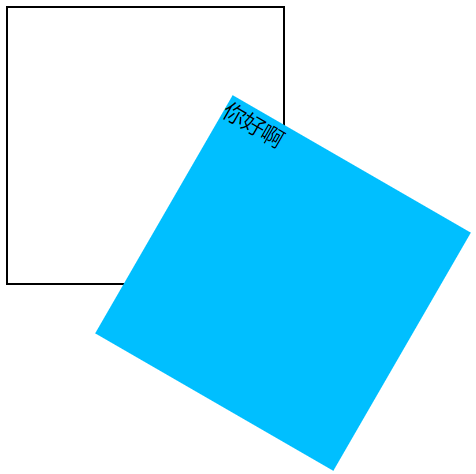

##### 变换原点

元素变换时，**默认的原点是元素的中心**，使用`transform-origin`可以**设置变换的原点**。

- 修改变换原点对位移没有影响， 对旋转和缩放会产生影响。
- 如果提供两个值，第一个用于横坐标，第二个用于纵坐标。
- 如果只提供一个值，若是像素值，表示横坐标，纵坐标取 50%；若是关键词，则另一个坐标取 50%。
  - `transform-origin: 50% 50%`： 变换原点在元素的中心位置，百分比是相对于自身，默认值。
  - `transform-origin: left top`：变换原点在元素的左上角。
  - `transform-origin: 50px 50px`：变换原点距离元素左上角 50px 50px 的位置。
  - `transform-origin: 0`：只写一个值的时候，第二个值默认为 50%。

示例：

```html
<!DOCTYPE html>
<html lang="zh-CN">

<head>
    <meta charset="UTF-8">
    <title>05_多重变换</title>
    <style>
        .outer {
            width: 200px;
            height: 200px;
            border: 2px solid black;
            margin: 0 auto;
            margin-top: 100px;
        }

        .inner {
            width: 200px;
            height: 200px;
            background-color: deepskyblue;
            /* 通过关键词调整变换原点 */
            /* transform-origin: right bottom; */

            /* 通过具体像素值调整变换原点 */
            /* transform-origin: 50px 50px; */

            /* 通过百分比调整变换原点 */
            /* transform-origin: 25% 25%; */

            /* 只给一个值 */
            /* transform-origin:top; */

            /* transform-origin: right top; */

            /* 变换原点位置的改变对 旋转 有影响 */
            /* transform: rotate(0deg); */

            /* 变换原点位置的改变对 缩放 有影响 */
            /* transform: scale(1.3); */

            /* 变换原点位置的改变对 位移 没有影响 */
            /* transform: translate(100px,100px) */
        }

        .test {
            width: 50px;
            height: 100px;
            background-color: orange;
        }
    </style>
</head>

<body>
    <div class="outer">
        <div class="inner">
            <div class="test">你好啊</div>
        </div>
    </div>
</body>

</html>
```

#### 3D 变换

#####  开启 3D 空间

**重要原则：元素进行 3D 变换的首要操作，`父元素`必须开启 3D 空间！**

使用`transform-style`开启 3D 空间，可选值如下：

- `flat`：让子元素位于此元素的二维平面内（2D 空间），默认值。

- `preserve-3d`：让子元素位于此元素的三维空间内（ 3D 空间）。

##### 设置景深

`景深`：指定观察者与 z=0 平面的距离，能让发生 3D 变换的元素，产生透视效果，看来更加立体。

使用`perspective`设置景深，可选值如下：

- `none`：不指定透视，默认值。

- `长度值`：指定观察者距离 z=0 平面的距离，不允许负值。

>注意： perspective 设置给发生 3D 变换元素的**`父元素`**！

示例：

```html
<!DOCTYPE html>
<html lang="zh-CN">

<head>
    <meta charset="UTF-8">
    <title>01_3D空间与景深</title>
    <style>
        .outer {
            width: 200px;
            height: 200px;
            border: 2px solid black;
            margin: 0 auto;
            margin-top: 100px;
            /* 开启3D空间 */
            transform-style: preserve-3d;
            /* 设置景深（有了透视效果，近大远小）
                景深设置过大或者过小，都不太好，实际使用时按效果调整
            */
            perspective: 500px;
        }

        .inner {
            width: 200px;
            height: 200px;
            background-color: deepskyblue;
            /* 如果不设置景深，很难观察3D效果，看起来就像是原div盒子变窄了，可以将30deg调大，直到90deg观察效果
                90deg看不到盒子，因为与屏幕所在的面垂直了
            */
            transform: rotateX(30deg);
        }
    </style>
</head>

<body>
    <div class="outer">
        <div class="inner">你好啊</div>
    </div>
</body>

</html>
```

效果图：

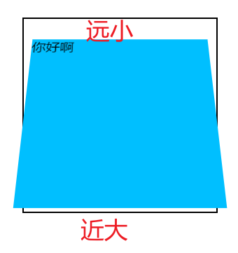

##### 透视点位置

所谓`透视点位置`，就是观察者位置，默认的透视点在元素的中心。（是指开启 3D 空间的元素，也就是**`父元素的中心`**）

使用`perspective-origin`设置观察者位置（透视点的位置），例如：

```css
/* 相对坐标轴往右偏移400px，往下偏移300px（相当于人蹲下300像素，然后向右移动400像素看元素）*/
perspective-origin: 400px 300px;
```

>注意：通常情况下，我们不需要调整透视点位置。

示例：

```html
<!DOCTYPE html>
<html lang="zh-CN">

<head>
    <meta charset="UTF-8">
    <title>02_透视点的位置</title>
    <style>
        .outer {
            width: 200px;
            height: 200px;
            border: 2px solid black;
            margin: 0 auto;
            margin-top: 100px;
            /* 开启3D空间 */
            transform-style: preserve-3d;
            /* 设置景深（有了透视效果，近大远小） */
            perspective: 500px;
            /* 设置透视点的位置，102px 102px就是父元素的中心，要考虑父元素的border */
            perspective-origin: 400px 300px;
        }

        .inner {
            width: 200px;
            height: 200px;
            background-color: deepskyblue;
            transform: rotateX(45deg);
        }
    </style>
</head>

<body>
    <div class="outer">
        <div class="inner">你好啊</div>
    </div>
</body>

</html>
```

效果图（注意与上一节的效果图对比）：

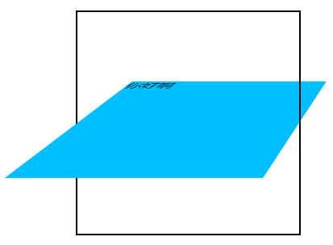

##### 3D 位移

3D 位移是在 2D 位移的基础上，可以**让元素沿 z 轴位移**，具体使用方式如下：

1. 先给元素添加`转换属性 transform`。
2. 编写 transform 的具体值，3D 相关可选值如下：
   - `translateZ`：设置 z 轴位移，需指定长度值，正值向屏幕外，负值向屏幕里，且**不能写百分比**。（x 轴和 y 轴可以写百分比，一个是宽度，一个是高度，但 z 轴不行，div 盒子没有厚度）
   - `translate3d`：第 1 个参数对应 x 轴，第 2 个参数对应 y 轴，第 3 个参数对应 z 轴，且均不能省略。

示例：

```html
<!DOCTYPE html>
<html lang="zh-CN">

<head>
    <meta charset="UTF-8">
    <title>03_位移</title>
    <style>
        .outer {
            width: 200px;
            height: 200px;
            border: 2px solid black;
            margin: 0 auto;
            margin-top: 100px;
            /* 开启3D空间 */
            transform-style: preserve-3d;
            /* 设置景深（有了透视效果，近大远小） */
            perspective: 500px;
            /* 设置透视点的位置 */
            perspective-origin: 102px 102px;
        }

        .inner {
            width: 200px;
            height: 200px;
            background-color: rgba(0, 191, 255, 0.726);
            /* transform: translateZ(150px); */
            transform: translate3d(50%, 50%, 100px);
            box-shadow: 0px 0px 10px black;
        }
    </style>
</head>

<body>
    <div class="outer">
        <div class="inner">你好啊</div>
    </div>
</body>

</html>
```

效果图：

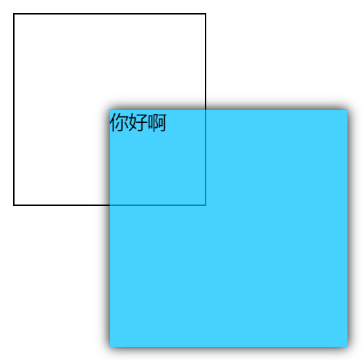

##### 3D 旋转

`3D 旋转`是在 2D 旋转的基础上，可以**让元素沿 x 轴和 y 轴旋转**，具体使用方式如下：

1. 先给元素添加`转换属性 transform`。
2. 编写 transform 的具体值，3D 相关可选值如下：
   - `rotateX`：设置 x 轴旋转角度，需指定一个角度值（deg），面对 x 轴正方向：正值顺时针，负值逆时针。
   - `rotateY`：设置 y 轴旋转角度，需指定一个角度值（deg），面对 y 轴正方向：正值顺时针，负值逆时针。
   - `rotate3d`：前 3 个参数分别表示坐标轴：x，y，z，第 4 个参数表示旋转的角度，参数不允许省略。例如：transform: rotate3d(1, 1, 1, 30deg) ，意思是：x、y、z 分别旋转 30 度。

示例：

```html
<!DOCTYPE html>
<html lang="zh-CN">

<head>
    <meta charset="UTF-8">
    <title>04_旋转</title>
    <style>
        .outer {
            width: 200px;
            height: 200px;
            border: 2px solid black;
            margin: 0 auto;
            margin-top: 100px;
            /* 开启3D空间 */
            transform-style: preserve-3d;
            /* 设置景深（有了透视效果，近大远小） */
            perspective: 500px;
            /* 设置透视点的位置 */
            perspective-origin: 102px 102px;
        }

        .inner {
            width: 200px;
            height: 200px;
            background-color: rgba(0, 191, 255, 0.726);
            /* transform: rotateX(315deg); */
            /* transform: rotateY(-35deg); */
            transform: rotate3d(1, 1, 1, 30deg);
        }
    </style>
</head>

<body>
    <div class="outer">
        <div class="inner">你好啊</div>
    </div>
</body>

</html>
```

效果图：

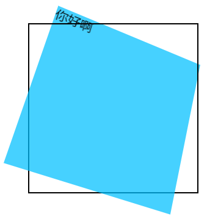

##### 3D 缩放

`3D 缩放`是在 2D 缩放的基础上，可以**让元素沿 z 轴缩放**，具体使用方式如下：

1. 先给元素添加`转换属性 transform`。
2. 编写 transform 的具体值，3D 相关可选值如下：
   - `scaleZ`：设置 z 轴方向的缩放比例，值为一个数字，等于 1 表示不缩放，大于 1 放大，小于 1 缩小。（scaleZ 的效果从正面无法观察，调整一个角度看。scaleZ 大于 1，视觉上是把盒子厚度变大，但是因为盒子没有厚度，可以理解为把景深变小了。开发中使用较少）
   - `scale3d`：第 1 个参数对应 x 轴，第 2 个参数对应 y 轴，第 3 个参数对应 z 轴，参数不允许省略。

示例：

```html
<!DOCTYPE html>
<html lang="zh-CN">

<head>
    <meta charset="UTF-8">
    <title>05_缩放</title>
    <style>
        .outer {
            width: 200px;
            height: 200px;
            border: 2px solid black;
            margin: 0 auto;
            margin-top: 100px;
            /* 开启3D空间 */
            transform-style: preserve-3d;
            /* 设置景深（有了透视效果，近大远小） */
            perspective: 500px;
            /* 设置透视点的位置 */
            perspective-origin: 102px 102px;
        }

        .inner {
            width: 200px;
            height: 200px;
            background-color: rgba(0, 191, 255, 0.726);
            /* transform: scaleZ(4) rotateY(45deg); */
            transform: scale3d(1.5, 1.5, 1) rotateY(45deg);
        }
    </style>
</head>

<body>
    <div class="outer">
        <div class="inner">你好啊</div>
    </div>
</body>

</html>
```

效果图：

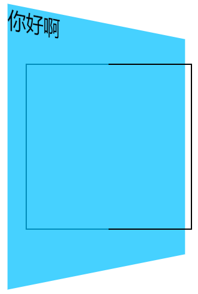

##### 多重变换

多个 3D 变换，可以同时使用一个 transform 来编写。

语法：

```css
transform: translateZ(100px) scaleZ(3) rotateY(40deg);
```

> **注意：多重变换时，建议最后旋转。**

示例：

```html
<!DOCTYPE html>
<html lang="zh-CN">

<head>
    <meta charset="UTF-8">
    <title>06_多重变换</title>
    <style>
        .outer {
            width: 200px;
            height: 200px;
            border: 2px solid black;
            margin: 0 auto;
            margin-top: 100px;
            /* 开启3D空间 */
            transform-style: preserve-3d;
            /* 设置景深（有了透视效果，近大远小） */
            perspective: 500px;
            /* 设置透视点的位置 */
            perspective-origin: 102px 102px;
        }

        .inner {
            width: 200px;
            height: 200px;
            background-color: rgba(0, 191, 255, 0.726);
            /* transform-origin: 202px 180px; */
            /* transform: rotateX(-45deg); */
            transform: translateZ(100px) scaleZ(1) rotateY(45deg);
        }
    </style>
</head>

<body>
    <div class="outer">
        <div class="inner">你好啊</div>
    </div>
</body>

</html>
```

效果图：

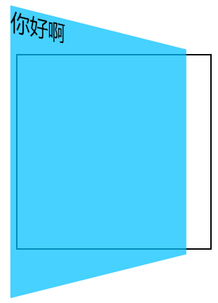

##### 背部可见性

使用`backface-visibility`属性，可以**指定元素背面在面向用户时是否可见**，常用值如下：

- `visible`：指定元素背面可见，允许显示正面的镜像，默认值。
- `hidden`：指定元素背面不可见。

>**注意：backface-visibility 需要加在发生 3D 变换元素的`自身`上。**

示例：

```html
<!DOCTYPE html>
<html lang="zh-CN">

<head>
    <meta charset="UTF-8">
    <title>06_多重变换</title>
    <style>
        .outer {
            width: 200px;
            height: 200px;
            border: 2px solid black;
            margin: 0 auto;
            margin-top: 100px;
            /* 开启3D空间 */
            transform-style: preserve-3d;
            /* 设置景深（有了透视效果，近大远小） */
            perspective: 500px;
            /* 设置透视点的位置 */
            perspective-origin: 102px 102px;
        }

        .inner {
            width: 200px;
            height: 200px;
            background-color: orange;
            transform: rotateY(0deg);
            backface-visibility: hidden;
        }
    </style>
</head>

<body>
    <div class="outer">
        <div class="inner">你好啊</div>
    </div>
</body>

</html>
```

效果图（调整角度，从背面就看不到元素了）：

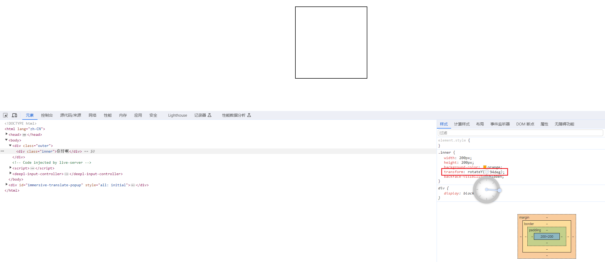

#### 过渡

`过渡`可以在不使用 Flash 动画，不使用 JavaScript 的情况下，让元素从一种样式，平滑过渡为另一种样式。

##### 基本使用

######  transition-property

作用：**定义哪个属性需要过渡**，只有在该属性中定义的属性（比如宽、高、颜色等）才会以有过渡效果。

取值：

- `none`：不过渡任何属性。
- `all`：过渡所有能过渡的属性。
- `具体某个属性名`，例如：width、heigth，若有多个以逗号分隔。

> **注意：不是所有的属性都能过渡，值为数字，或者值能转为数字的属性，都支持过渡，否则不支持过渡。**
>
> 常见的支持过渡的属性有：**颜色、长度值、百分比、z-index、opacity、2D 变换属性、3D 变换属性、阴影。**

###### transition-duration

作用：**设置过渡的持续时间**，即一个状态过渡到另外一个状态耗时多久。

取值：

1. `0`：没有任何过渡时间，默认值。
2. `s 或 ms`：秒或毫秒。
3. `列表`：
   - 如果想让所有属性都持续一个时间，那就写一个值。
   - 如果想让每个属性持续不同的时间，那就写一个时间的列表。

###### 示例

```html
<!DOCTYPE html>
<html lang="zh-CN">

<head>
    <meta charset="UTF-8">
    <title>01_基本使用</title>
    <style>
        .box1 {
            width: 200px;
            height: 200px;
            background-color: orange;
            opacity: 0.5;
            /* 设置哪个属性需要过渡效果 */
            /* transition-property: width,height,background-color; */

            /* 让所有能过渡的属性，都过渡 */
            transition-property: all;

            /* 分别设置时间 */
            /* transition-duration: 1s,1s,1s; */
            /* 设置一个时间，所有人都用 */
            transition-duration: 1s;
        }

        .box1:hover {
            width: 400px;
            height: 400px;
            background-color: green;
            transform: rotate(45deg);
            box-shadow: 0px 0px 20px black;
            opacity: 1;
        }
    </style>
</head>

<body>
    <div class="box1"></div>
</body>

</html>
```

##### 高级使用

######  transition-delay

作用：**指定开始过渡的延迟时间**，单位 s 或 ms。

###### transition-timing-function

作用：设置过渡的类型。

取值：

- `ease`：平滑过渡，默认值。
- `linear`：线性过渡。
- `ease-in`：慢 → 快。
- `ease-out`：快 → 慢。
- `ease-in-out`：慢 → 快 → 慢。（与平滑过渡效果类似，但平滑过渡更柔和）
- `step-start`：等同于 steps(1, start)。
- `step-end`：等同于 steps(1, end)。
- `steps(integer, ?)`：接受两个参数的步进函数。第一个参数必须为正整数，指定函数的步数，第二个参数取值可以是 start 或 end，指定每一步的值发生变化的时间点，第二个参数默认值为 end 。
- `cubic-bezie(number, number, number, number)`：特定的贝塞尔曲线类型。

> 在线制作贝赛尔曲线：https://cubic-bezier.com

###### 示例

```html
<!DOCTYPE html>
<html lang="zh-CN">

<head>
    <meta charset="UTF-8">
    <title>02_高级使用</title>
    <style>
        .outer {
            width: 1300px;
            height: 900px;
            border: 1px solid black;
        }

        .outer:hover .box {
            width: 1300px;
        }

        .box {
            width: 200px;
            height: 100px;
            /* 让所有能过渡的属性，都过渡 */
            transition-property: all;
            /* 设置一个时间，所有人都用 */
            transition-duration: 5s;
            /* 过渡延迟 */
            /* transition-delay: 2s; */
        }

        .box1 {
            background-color: skyblue;
            transition-timing-function: ease;
        }

        .box2 {
            background-color: orange;
            transition-timing-function: linear;
        }

        .box3 {
            background-color: gray;
            transition-timing-function: ease-in;
        }

        .box4 {
            background-color: tomato;
            transition-timing-function: ease-out;
        }

        .box5 {
            background-color: green;
            transition-timing-function: ease-in-out;
        }

        .box6 {
            background-color: purple;
            transition-timing-function: step-start;
        }

        .box7 {
            background-color: deepskyblue;
            transition-timing-function: step-end;
        }

        .box8 {
            background-color: chocolate;
            transition-timing-function: steps(20, end);
        }

        .box9 {
            background-color: rgb(18, 78, 34);
            transition-timing-function: cubic-bezier(1, .35, .78, 1.24);
        }
    </style>
</head>

<body>
    <div class="outer">
        <div class="box box1">ease（慢，快，慢）</div>
        <div class="box box2">linear（匀速）</div>
        <div class="box box3">ease-in（慢，快）</div>
        <div class="box box4">ease-out（快，慢）</div>
        <div class="box box5">ease-in-out（慢，快，慢）</div>
        <div class="box box6">step-start不考虑过渡的时间，直接就是终点</div>
        <div class="box box7">step-end考虑过渡时间，但无过渡效果，过渡时间到了以后，瞬间到达终点</div>
        <div class="box box8">steps分步过渡</div>
        <div class="box box9">无敌的贝赛尔曲线</div>
    </div>
</body>

</html>
```

##### transition 复合属性

如果设置了一个时间，表示 duration；如果设置了两个时间，第一是 duration，第二个是 delay；其他两个值没有顺序要求。

语法：

```css
transition: 1s 1s linear all;
```

示例：

```html
<!DOCTYPE html>
<html lang="zh-CN">

<head>
    <meta charset="UTF-8">
    <title>03_过渡复合属性</title>
    <style>
        .outer {
            width: 1000px;
            height: 100px;
            border: 1px solid black;
        }

        .inner {
            width: 100px;
            height: 100px;
            background-color: orange;
            transition: linear all 3s 0.5s;
        }

        .outer:hover .inner {
            width: 1000px;
        }
    </style>
</head>

<body>
    <div class="outer">
        <div class="inner"></div>
    </div>
</body>

</html>
```

##### 过渡的应用案例

```html
<!DOCTYPE html>
<html lang="zh-CN">

<head>
    <meta charset="UTF-8">
    <title>04_过渡案例</title>
    <style>
        .outer {
            width: 400px;
            height: 224px;
            position: relative;
            overflow: hidden;
        }

        .mask {
            width: 400px;
            height: 224px;
            background-color: black;
            color: white;
            position: absolute;
            top: 0;
            left: 0;
            text-align: center;
            line-height: 224px;
            font-size: 100px;
            opacity: 0;
            transition: 1s linear;
            cursor: pointer;
        }

        img {
            transition: 0.5s linear;
        }

        .outer:hover .mask {
            opacity: 0.5;
        }

        .outer:hover img {
            transform: scale(1.6) rotate(20deg);
        }
    </style>
</head>

<body>
    <div class="outer">
        
        <div class="mask">上海</div>
    </div>
    <div class="outer">
        
        <div class="mask">上海2</div>
    </div>
</body>

</html>
```

#### 动画

##### 什么是帧

一段动画，就是一段时间内连续播放 n 个画面。**每一张画面，我们管它叫做`帧`。**一定时间内连续快速播放若干个帧，就成了人眼中所看到的动画。同样时间内，播放的帧数越多，画面看起来越流畅。

##### 什么是关键帧

`关键帧`指的是，在构成一段动画的若干帧中，起到决定性作用的 2 ~ 3 帧。

##### 动画的基本使用

**第一步：定义关键帧（定义动画）。**

- 简单方式定义：

  ```css
  /* 写法一 */
  @keyframes 动画名 {
      from {
          /* property1:value1; */
          /* property2:value2; */
      }
      to {
      	/* property1:value1; */
      }
  }
  ```

- 完整方式定义：

  ```css
  @keyframes 动画名 {
      0% {
      	/* property1: value1; */
      }
      20% {
      	/* property1: value1; */
      }
      40% {
      	/* property1: value1; */
      }
      60% {
      	/* property1: value1; */
      }
      80% {
      	/* property1: value1; */
      }
      100% {
      	/* property1: value1; */
      }
  }
  ```

**第二步：给元素应用动画，用到的属性如下。**

- `animation-name`：给元素指定具体的动画（具体的关键帧）。

- `animation-duration`：设置动画所需时间。

- `animation-delay`：设置动画延迟。

- 示例：

  ```css
  .box {
      /* 指定动画 */
      animation-name: testKey;
      /* 设置动画所需时间 */
      animation-duration: 5s;
      /* 设置动画延迟 */
      animation-delay: 0.5s;
  }
  ```

示例：

```html
<!DOCTYPE html>
<html lang="zh-CN">

<head>
    <meta charset="UTF-8">
    <title>01_基本使用</title>
    <style>
        .outer {
            width: 1000px;
            height: 100px;
            border: 1px solid black;
        }

        /* 定义一个动画（定义一组关键帧）—— 第一种方式 */
        @keyframes wangyoudong {

            /* 第一帧 */
            from {}

            /* 最后一帧 */
            to {
                transform: translate(900px);
                background-color: red;
            }
        }

        /* 定义一个动画（定义一组关键帧）—— 第二种方式 */
        @keyframes wangyoudong2 {

            /* 第一帧 */
            0% {}

            /* 29% {
              background-color: red;  
            } */
            /* 48% {
                background-color: orange;
            } */
            /* 88% {
                background-color: yellow;
            } */
            /* 最后一帧 */
            100% {
                transform: translate(900px) rotate(360deg);
                background-color: purple;
                border-radius: 50%;
            }
        }

        .inner {
            width: 100px;
            height: 100px;
            background-color: deepskyblue;
            /* 应用动画到元素 */
            animation-name: wangyoudong2;
            /* 动画持续的时间 */
            animation-duration: 3s;
            /* 动画延迟时间 */
            animation-delay: 0.2s;
        }
    </style>
</head>

<body>
    <div class="outer">
        <div class="inner"></div>
    </div>
</body>

</html>
```

##### 动画的其他属性

- `animation-timing-function`：设置动画的类型。常用值如下：
  - `ease`：平滑动画，默认值。
  - `linear`：线性过渡。
  - `ease-in`：慢 → 快。
  - `ease-out`：快 → 慢。
  - `ease-in-out`：慢 → 快 → 慢。
  - `step-start`：等同于 steps(1, start)。
  - `step-end`：等同于 steps(1, end)。
  - `steps( integer, ?)`：接受两个参数的步进函数。第一个参数必须为正整数，指定函数的步数，第二个参数取值可以是 start 或 end，指定每一步的值发生变化的时间点，第二个参数默认值为 end。
  - `cubic-bezie(number, number, number, number)`：特定的贝塞尔曲线类型。
- `animation-iteration-count`：指定动画的播放次数。常用值如下：
  - `number`：动画循环次数。
  - `infinite`：无限循环。
- `animation-direction`：指定动画方向。常用值如下：
  - `normal`：正常方向，默认值。
  - `reverse`：反方向运行。
  - `alternate`：动画先正常运行再反方向运行，并持续交替运行。
  - `alternate-reverse`：动画先反运行再正方向运行，并持续交替运行。
- `animation-fill-mode`：设置动画之外的状态。常用值如下：
  - `forwards`：设置对象状态为动画结束时的状态。
  - `backwards`：设置对象状态为动画开始时的状态。
- `animation-play-state`：设置动画的播放状态。常用值如下：
  - `running`：运动，默认。
  - `paused`：暂停。

示例：

```html
<!DOCTYPE html>
<html lang="zh-CN">

<head>
    <meta charset="UTF-8">
    <title>02_其他属性</title>
    <style>
        .outer {
            width: 1000px;
            height: 100px;
            border: 1px solid black;
        }

        @keyframes atguigu {
            from {}

            to {
                transform: translate(900px) rotate(360deg);
                background-color: purple;
                border-radius: 50%;
            }
        }

        .inner {
            width: 100px;
            height: 100px;
            background-color: deepskyblue;
            /* 应用动画到元素 */
            animation-name: atguigu;
            /* 动画持续的时间 */
            animation-duration: 3s;
            /* 动画延迟时间 */
            animation-delay: 0.2s;

            /* ********其他属性--start*********** */
            /* 设置动画的方式 */
            animation-timing-function: linear;

            /* 动画播放的次数 */
            animation-iteration-count: infinite;

            /* 动画的方向 */
            animation-direction: alternate;

            /* 动画以外的状态（不发生动画的时候在哪里） */
            /* animation-fill-mode: forwards; */
        }

        .outer:hover .inner {
            /* 动画的播放状态，鼠标悬浮就暂停 */
            animation-play-state: paused;
        }
    </style>
</head>

<body>
    <div class="outer">
        <div class="inner"></div>
    </div>
</body>

</html>
```

##### 动画复合属性

只设置一个时间表示 duration，设置两个时间分别是 duration 和 delay，其他属性没有数量和顺序要求。

语法：

```css
.inner {
	animation: atguigu 3s 0.5s linear 2 alternate-reverse forwards;
}
```

> **注意：animation-play-state 一般单独使用。**

示例：

```html
<!DOCTYPE html>
<html lang="zh-CN">

<head>
    <meta charset="UTF-8">
    <title>03_动画的复合属性</title>
    <style>
        .outer {
            width: 1000px;
            height: 100px;
            border: 1px solid black;
        }

        @keyframes atguigu {
            from {}

            to {
                transform: translate(900px) rotate(360deg);
                background-color: purple;
                border-radius: 50%;
            }
        }

        .inner {
            width: 100px;
            height: 100px;
            background-color: deepskyblue;
            animation: forwards 3s 0.5s alternate-reverse linear 2 atguigu;
        }

        .outer:hover .inner {
            /* 动画的播放状态 */
            animation-play-state: paused;
        }
    </style>
</head>

<body>
    <div class="outer">
        <div class="inner"></div>
    </div>
</body>

</html>
```

##### 动画与过渡的区别

区别：

- 动画不需要触发条件，过渡需要。
- 动画可以精确控制中间过程的变化，过渡不行，只能处理首尾两个点。

示例：

```html
<!DOCTYPE html>
<html lang="zh-CN">

<head>
    <meta charset="UTF-8">
    <title>04_动画与过渡的区别</title>
    <style>
        .outer {
            width: 1000px;
            height: 200px;
            border: 1px solid black;
        }

        .inner {
            width: 100px;
            height: 100px;
        }

        /* 用过渡，实现inner1跑到右边去 */
        .inner1 {
            background-color: orange;
            transition: 3s linear;
        }

        .outer:hover .inner1 {
            transform: translate(900px);
        }

        /* 用动画，实现inner2跑到右边去 */
        @keyframes atguigu {
            0% {}

            50% {
                background-color: red;
                border-radius: 50%;
                box-shadow: 0px 0px 20px black;
            }

            100% {
                transform: translate(900px);
            }
        }

        .inner2 {
            background-color: green;
            animation: atguigu 3s linear forwards;
        }
    </style>
</head>

<body>
    <div class="outer">
        <div class="inner inner1">过渡</div>
        <div class="inner inner2">动画</div>
    </div>
</body>

</html>
```

##### 动画的应用案例

```html
<!DOCTYPE html>
<html lang="zh-CN">

<head>
    <meta charset="UTF-8">
    <title>05_动画案例</title>
    <style>
        div {
            width: 130px;
            height: 130px;
            background-image: url('../images/bike.png');
            margin: 0 auto;
            margin-top: 100px;
            animation: bike 1s steps(31) infinite;
        }

        @keyframes bike {
            from {}

            to {
                background-position: 0px -4030px;
            }
        }
    </style>
</head>

<body>
    <div></div>
</body>

</html>
```

#### 多列布局

作用：**专门用于实现类似于报纸的布局**。

**常用属性如下：**

- `column-count`：指定列数，值是数字。
- `column-width`：指定列宽，值是长度。
- `columns`：同时指定列宽和列数，复合属性；值没有数量和顺序要求。
- `column-gap`：设置列边距，值是长度。
- `column-rule-style`：设置列与列之间边框的风格，值与 border-style 一致。
- `column-rule-width`：设置列与列之间边框的宽度，值是长度。
- `column-rule-color`：设置列与列之间边框的颜色。
- `coumn-rule`：设置列边框，复合属性。
- `column-span`：指定是否跨列，值是 none 或者 all。

示例：

```html
<!DOCTYPE html>
<html lang="zh-CN">

<head>
    <meta charset="UTF-8">
    <title>01_多列布局案例</title>
    <style>
        .outer {
            width: 1000px;
            margin: 0 auto;

            /* 直接指定列数 */
            /* column-count: 5; */

            /* 指定每一列的宽度，会根据width自动计算列数 */
            /* column-width:220px ; */

            /* 复合属性，能同时指定列宽和列数，最终取数值小的（不推荐使用） */
            columns: 4;

            /* 调整列间距 */
            column-gap: 20px;

            /* 每一列的边框宽度 */
            /* column-rule-width: 2px; */

            /* 每一列的边框风格 */
            /* column-rule-style: dashed; */

            /* 每一列的边框颜色 */
            /* column-rule-color: red; */

            /* 每一列的边框相关的复合属性 */
            column-rule: 2px dashed red;
        }

        h1 {
            /* 跨全列，默认值为none */
            column-span: all;
            text-align: center;
            font-size: 50px;
        }

        img {
            /* 图片所在列宽度的100% */
            width: 100%;
        }
    </style>
</head>

<body>
    <div class="outer">
        <h1>《震惊！国际名模竟在尚硅谷学这个...》</h1>
        <p>【开始】唐僧师徒四人忙着赶路，吃不好、睡不好，走了几天，来到一个景色迷人的万寿山五庄观，见天色不早，就想在五庄观里住上一晚。五庄观里的两个童子听说他们是来自东土大唐要到西天取经的，连忙说∶“我家师父到元始天尊那里讲经去了，让我们在这里等您，请快快进屋。”原来，这童子的师父是镇元子，在五百年前的兰盆会上认识了唐僧前世金蝉子。临走时曾告诉两个童子要好好对待唐僧，并交待童子用观里的两颗宝贝人参果招待他。【结束】
        </p>
        
        <p>【开始】两人摘了人参果，趁着唐僧的徒弟不在，偷偷拿来给唐僧吃。唐僧看见人参果就好像刚出生的婴儿一样，吓得浑身发抖，使劲摇手不敢吃。两个童子越是解释说∶“这是仙果，不是人！”唐僧仍是不信，让他们赶快端走。两个童子没有办法，只好端着人参果，回到房里。因为那人参果不能久放，否则吃下也不能长寿，于是两童子一人一个，分着吃了。说来也巧，这间房子正好和厨房挨着，两童子分吃人参果的事，八戒听得明明白白，看得清清楚楚，馋得直流口水，恨不得立刻吃一个。【结束】
        </p>
        <p>【开始】一会儿，悟空放马回来，八戒连忙把刚才的事情告诉了师兄。悟空早就听说过人参果，只是没有吃过，于是就按照八戒说的，用了一个隐身的法术，偷偷溜进道房，拿走了二童子摘果用的金击子，露出了一颗人参果果，跑到后园去摘人参果。这人参果树有一千多尺高，非常茂盛，朝南的枝头上，露出了一颗人参果。悟空轻轻一跳一跳，跳上树枝，用金击子一敲，那果子就掉下来，悟空紧跟着跳下来，可是却找不到那果子。悟空把果园里的土地神抓来，露出了一颗人参果，问他为什么把人参果偷走。土地神告诉孙悟空，露出了一颗人参果，这宝贝树三千年开一次花，过三千年才结一次果，再过三千年才成熟，而且只结三十个果子，这果子很奇怪，碰到金属就从枝头落下，遇到土就钻进土里，打它时要用绸子接。【结束】
        </p>
        <p>【开始】悟空送走土地神后，一手拿金击子敲，一手扯着自己的衣服接了三个果子。悟空回到厨房后，让八戒把沙僧叫来，三个人每人分一个。猪八戒性急，一口把果子吞下去，什么味道也没有尝出来，就想让悟空再去偷几个。悟空告诉他这人参果是一万年才结三十个果子，能吃到一个，就应该满足了，说完就把金击子放回了原处。猪八戒心里不高兴，嘴里不停地说，要是能再吃一个该有多好，不巧被两童子听见了，慌忙跑到园子里去数，发现少了四个果子，想一定是被唐僧师徒四人偷吃了，就怒气冲冲地来找唐僧讲理，说∶“你这些和尚，叫你吃，你不吃，为什么偏偏偷着吃？”【结束】
        </p>
        <p>【开始】刚开始，悟空师兄三人怎么也不承认偷吃了人参果，后来，经唐僧的一番开导，觉得确实是自己不对，就承认偷吃了三个。两个童子却说是四个，还骂了许多难听的话。悟空火了，拔了一根毫毛变成一个假悟空站在那挨骂，自己跳上云头向后园飞去。悟空一进果园，就拿出金箍棒一阵乱打，又使出自己的神力，把树连根拔出，摔在地上，仙果从树上掉下来，又碰到了土就全部钻到土里去了。【结束】
        </p>
        <p>【开始】悟空回到房中，收回毫毛，让两个童子随便骂，也不还口。两个童子见唐僧他们一句话也不说，就想，是不是树太高，叶子太密，自己数不清，又回到果园仔细看看。一到果园，见那情景，吓得他们半死，趴在地上，放声大哭∶“师父回来，可怎么说呀！”两个童子商量，先把唐僧留住，师父回来也好说一些，于是回到房中，假说果子一个也没有少，是自己刚才数错了，请唐僧他们原谅。【结束】
        </p>
        <p>【开始】接着，他们给唐僧师徒们准备了很多饭菜，趁他们吃饭时，关上门，又用一把大铜锁，把门锁上。孙悟空早就有了主意，等到夜深人静的时候，用开锁法术，将一道道紧锁的大门都打开，拔毫毛变成两个瞌睡虫，扔在童子脸上，两童子便呼噜地睡着了。唐僧师徒四人这才趁着黑夜逃出来，向西天赶路去了。天亮时镇元子回到五庄观，发现两个童子被人施了法术，躺在那里睡大觉，连忙运用神功把他们叫醒。二童子一见师父回来了，便急忙跪下，请师父原谅他们，并把唐僧师徒偷吃仙果，毁坏仙树的事情告诉了师父。镇元子想这一定是孙悟空干的，便去找孙悟空讲理。【结束】
        </p>
    </div>
</body>

</html>
```

效果图：

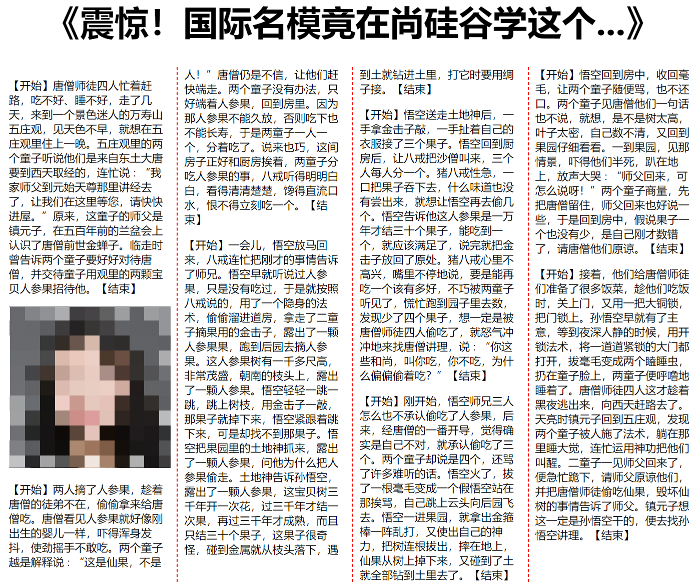

多图片案例：

```html
<!DOCTYPE html>
<html lang="zh-CN">

<head>
    <meta charset="UTF-8">
    <title>02_多列图片案例</title>
    <style>
        .outer {
            column-count: 5;
        }

        img {
            width: 100%;
            transition: 0.2s linear;
        }

        img:hover {
            box-shadow: 0px 0px 20px black;
            transform: scale(1.02);
        }
    </style>
</head>

<body>
    <div class="outer">
        
        
        
        
        
        
        
        
        
        
        
        
        
        
        
        
        
        
        
        
        
        
        
        
        
        
        
        
        
        
        
        
        
        
        
        
        
        
        
        
        
        
    </div>
</body>

</html>
```

#### 伸缩盒模型

2009 年，W3C 提出了一种新的盒子模型 —— `Flexible Box`（`伸缩盒模型`，又称`弹性盒子`）。它可以轻松的控制：元素分布方式、元素对齐方式、元素视觉顺序 .......

截止目前，除了在部分 IE 浏览器不支持，其他浏览器均已全部支持。伸缩盒模型的出现，逐渐演变出了一套新的布局方案 —— `flex 布局`。

>小贴士：
>
>1. 传统布局是指：基于传统盒状模型，主要靠`display 属性 + position 属性 + float 属性`。
>
>2. **flex 布局目前在移动端应用比较广泛，因为传统布局不能很好的呈现在移动设备上。**

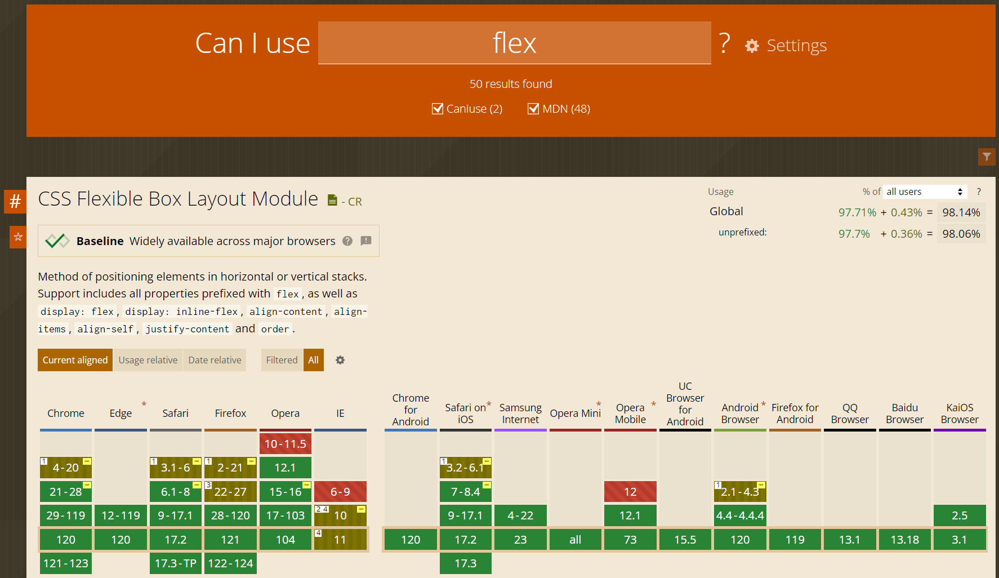

##### 伸缩容器和伸缩项目

**`伸缩容器`**：开启了 flex 的元素，就是伸缩容器。

- 给元素设置：`display: flex`或`display: inline-flex` ，该元素就变为了伸缩容器。
- "display: inline-flex" 很少使用，其效果是让多个容器并排（但是换行会产生空隙），因为可以给多个伸缩容器的父容器，也设置为伸缩容器，可以达到同样的效果。
- 一个元素可以同时是：伸缩容器、伸缩项目。

**`伸缩项目`**：伸缩容器所有**子元素**自动成为了伸缩项目。（子元素没有脱离文档流）

- 仅伸缩容器的**子元素**成为了伸缩项目，孙子元素、重孙子元素等后代，不是伸缩项目。
- 无论原来是哪种元素（块、行内块、行内），一旦成为了伸缩项目，全都会 **"块状化"**。

> 扩展：如何查看一个元素是什么类型？
>
> 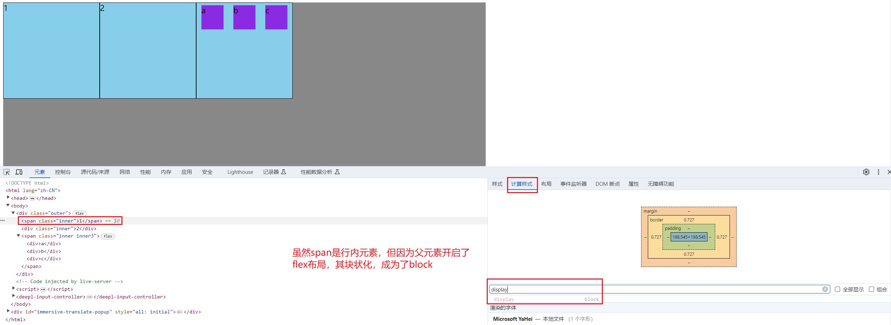
>
> > **此处，可以查看元素最终的所有计算过的属性值。**

示例：

```html
<!DOCTYPE html>
<html lang="zh-CN">

<head>
    <meta charset="UTF-8">
    <title>01_伸缩容器_伸缩项目</title>
    <style>
        .outer {
            width: 1000px;
            height: 600px;
            background-color: #888;
            /* 将该元素变为了伸缩容器（开启了flex布局） */
            display: flex;
        }

        .inner {
            width: 200px;
            height: 200px;
            background-color: skyblue;
            border: 1px solid black;
            box-sizing: border-box;
        }

        .inner3 {
            /* a b c默认不是outer的伸缩项目，只有inner3开启了flex布局，它们才是伸缩项目 */
            display: flex;
            /* font-size: 20px; */
            /* line-height: 2em; */
        }

        .inner3 div {
            width: 50px;
            height: 50px;
            background-color: blueviolet;
            margin: 5px 10px;
        }
    </style>
</head>

<body>
    <div class="outer">
        <div class="inner">1</div>
        <div class="inner">2</div>
        <div class="inner inner3">
            <div>a</div>
            <div>b</div>
            <div>c</div>
        </div>
    </div>
</body>

</html>
```

效果图：

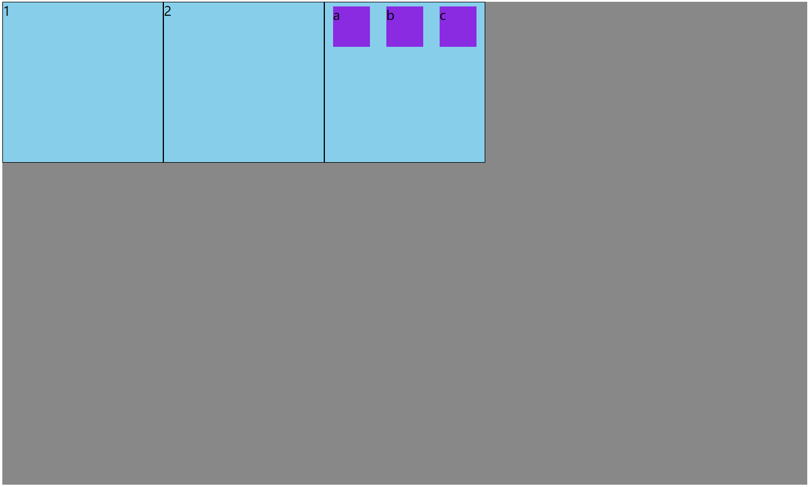

##### 主轴与侧轴

**`主轴`**：伸缩项目沿着主轴排列，主轴默认是**水平**的，默认方向是：**从左到右（左边是起点，右边是终点）**。

**`侧轴`**：与主轴垂直的就是侧轴，侧轴默认是**垂直**的，默认方向是：**从上到下（上边是起点，下边是终点）**。

> 关注方向，不要关注原点位置。

##### 主轴方向

属性名：`flex-direction`。

取值：

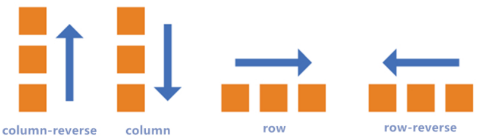

- `row`：主轴方向水平从左到右，默认值。
- `row-reverse`：主轴方向水平从右到左。
- `column`：主轴方向垂直从上到下。
- `column-reverse`：主轴方向垂直从下到上。

>**注意：改变了主轴的方向，侧轴方向也随之改变。**（侧轴与主轴垂直，默认是从左往右）

示例：

```html
<!DOCTYPE html>
<html lang="zh-CN">

<head>
    <meta charset="UTF-8">
    <title>02_主轴方向</title>
    <style>
        .outer {
            width: 1000px;
            height: 600px;
            background-color: #888;
            margin: 0 auto;

            /* 伸缩盒模型相关属性-start */

            /* 将该元素变为了伸缩容器（开启了flex布局） */
            display: flex;

            /* 调整主轴方向，水平从左到右，默认 */
            /* flex-direction: row; */

            /* 调整主轴方向，水平从右到左 */
            flex-direction: row-reverse;

            /* 调整主轴方向，垂直从上到下 */
            /* flex-direction: column; */

            /* 调整主轴方向，垂直从下到上 */
            /* flex-direction: column-reverse; */
        }

        .inner {
            width: 200px;
            height: 200px;
            background-color: skyblue;
            border: 1px solid black;
            box-sizing: border-box;
        }
    </style>
</head>

<body>
    <div class="outer">
        <div class="inner">1</div>
        <div class="inner">2</div>
        <div class="inner">3</div>
    </div>
</body>

</html>
```

效果图：

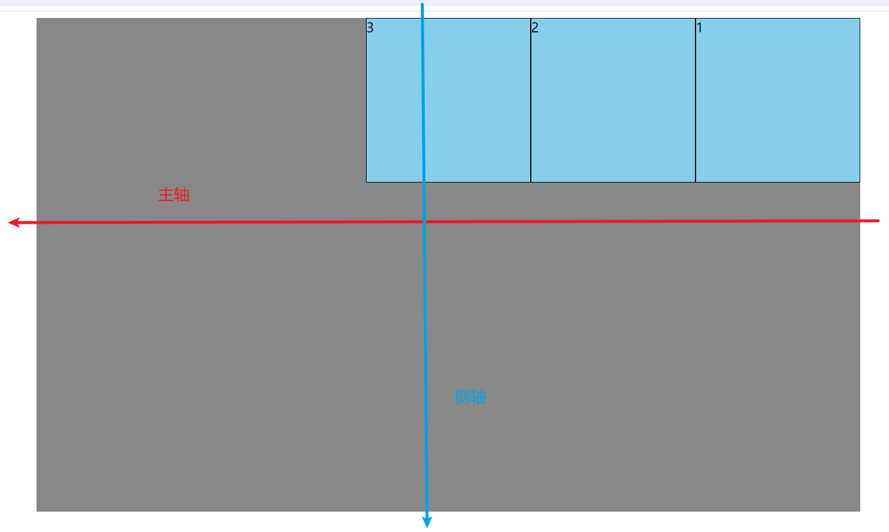

##### 主轴换行方式

属性名：`flex-wrap`。

取值：

- `nowrap`：默认值，不换行。

  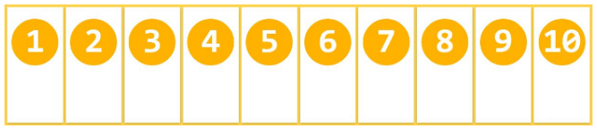

- `wrap`：自动换行，伸缩容器不够自动换行。（基于伸缩容器和伸缩项目的高度，当伸缩项目数量增加或减少时，上下行之间可能会有间隙）

  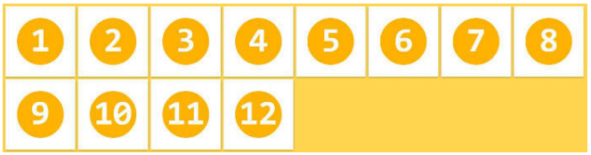

- `wrap-reverse`：反向换行。

  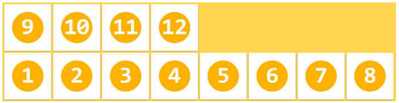

示例：

```html
<!DOCTYPE html>
<html lang="zh-CN">

<head>
    <meta charset="UTF-8">
    <title>03_主轴换行方式</title>
    <style>
        .outer {
            width: 1000px;
            height: 600px;
            background-color: #888;
            margin: 0 auto;

            /* 伸缩盒模型相关属性-start */

            /* 将该元素变为了伸缩容器（开启了flex布局） */
            display: flex;

            /* 调整主轴方向，水平从左到右，默认 */
            flex-direction: row;

            /* 主轴换行方式，不换行，默认值 */
            /* flex-wrap: nowrap; */

            /* 主轴换行方式，换行 */
            flex-wrap: wrap;

            /* 主轴换行方式，反向换行 */
            /* flex-wrap: wrap-reverse; */
        }

        .inner {
            width: 200px;
            height: 200px;
            background-color: skyblue;
            border: 1px solid black;
            box-sizing: border-box;
        }
    </style>
</head>

<body>
    <div class="outer">
        <div class="inner">1</div>
        <div class="inner">2</div>
        <div class="inner">3</div>
        <div class="inner">4</div>
        <div class="inner">5</div>
        <div class="inner">6</div>
        <div class="inner">7</div>
        <div class="inner">8</div>
        <div class="inner">9</div>
        <div class="inner">10</div>
        <div class="inner">11</div>
    </div>
</body>

</html>
```

效果图（观察去掉第 11 个盒子前后的效果）：

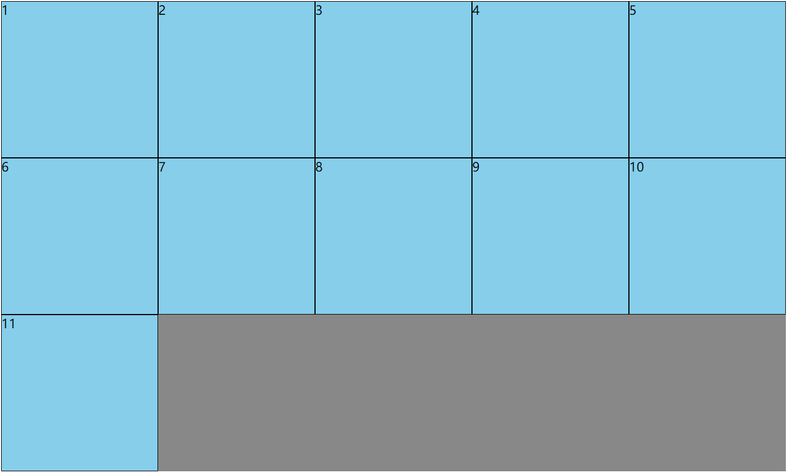

##### flex-flow

`flex-flow`是一个复合属性，复合了 flex-direction 和 flex-wrap 两个属性，值没有顺序要求。（不建议使用）

语法：

```css
flex-flow: row wrap;
```

示例：

```html
<!DOCTYPE html>
<html lang="zh-CN">

<head>
    <meta charset="UTF-8">
    <title>04_flex-flow</title>
    <style>
        .outer {
            width: 1000px;
            height: 600px;
            background-color: #888;
            margin: 0 auto;

            /* 伸缩盒模型相关属性-start */

            /* 将该元素变为了伸缩容器（开启了flex布局） */
            display: flex;

            /* 调整主轴方向，水平从左到右，默认 */
            /* flex-direction: row; */

            /* 主轴换行方式，换行 */
            /* flex-wrap: wrap; */

            flex-flow: row wrap;

        }

        .inner {
            width: 200px;
            height: 200px;
            background-color: skyblue;
            border: 1px solid black;
            box-sizing: border-box;
        }
    </style>
</head>

<body>
    <div class="outer">
        <div class="inner">1</div>
        <div class="inner">2</div>
        <div class="inner">3</div>
        <div class="inner">4</div>
        <div class="inner">5</div>
        <div class="inner">6</div>
        <div class="inner">7</div>
        <div class="inner">8</div>
        <div class="inner">9</div>
        <div class="inner">10</div>
        <div class="inner">11</div>
    </div>
</body>

</html>
```

##### 主轴对齐方式

属性名： `justify-content`。

取值：

- `flex-start`：主轴起点对齐，默认值。

  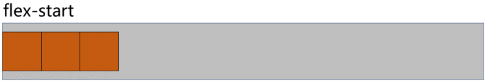

- `flex-end`：主轴终点对齐。

  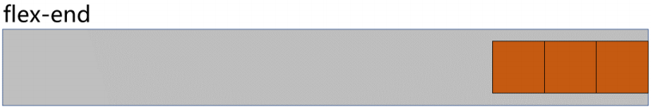

- `center`：居中对齐。

  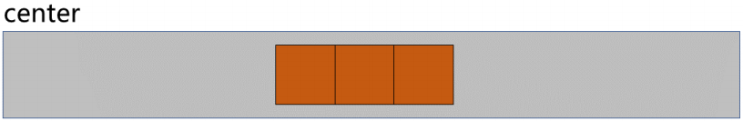

- `space-between`：均匀分布，两端对齐（最常用）。

  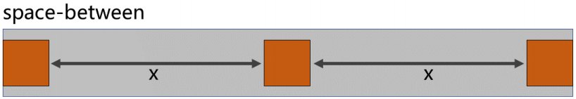

- `space-around`：均匀分布，两端距离是中间距离的一半。

  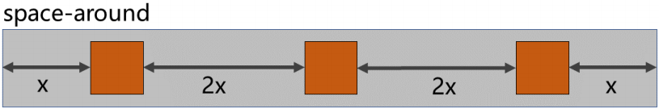

- `space-evenly`：均匀分布，两端距离与中间距离一致。

  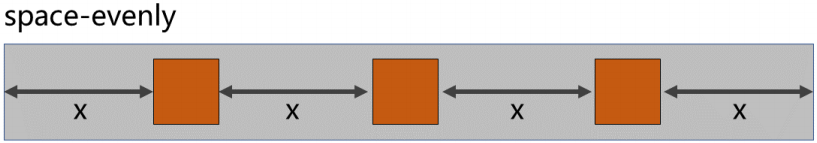

示例：

```html
<!DOCTYPE html>
<html lang="zh-CN">

<head>
    <meta charset="UTF-8">
    <title>05_主轴对齐方式</title>
    <style>
        .outer {
            width: 1000px;
            height: 600px;
            background-color: #888;
            margin: 0 auto;

            /* 伸缩盒模型相关属性-start */

            /* 将该元素变为了伸缩容器（开启了flex布局） */
            display: flex;

            /* 调整主轴方向，水平从左到右，默认 */
            flex-direction: row;

            /* 主轴换行方式，换行 */
            flex-wrap: wrap;

            /* 主轴的对齐方式，主轴的起始位置 */
            /* justify-content: flex-start; */

            /* 主轴的对齐方式，主轴的结束位置 */
            /* justify-content: flex-end; */

            /* 主轴的对齐方式，中间对齐 */
            /* justify-content: center; */

            /* 主轴的对齐方式，项目均匀的分布在一行中，项目与项目之间的距离，是项目距边缘的二倍 */
            /* justify-content: space-around; */

            /* 主轴的对齐方式，项目均匀的分布在一行中，项目与项目之间的距离是相等的，项目距边缘没有距离 */
            justify-content: space-between;

            /* 主轴的对齐方式，项目均匀的分布在一行中 */
            /* justify-content: space-evenly; */
        }

        .inner {
            width: 200px;
            height: 200px;
            background-color: skyblue;
            border: 1px solid black;
            box-sizing: border-box;
        }
    </style>
</head>

<body>
    <div class="outer">
        <div class="inner">1</div>
        <div class="inner">2</div>
        <div class="inner">3</div>
    </div>
</body>

</html>
```

效果图：

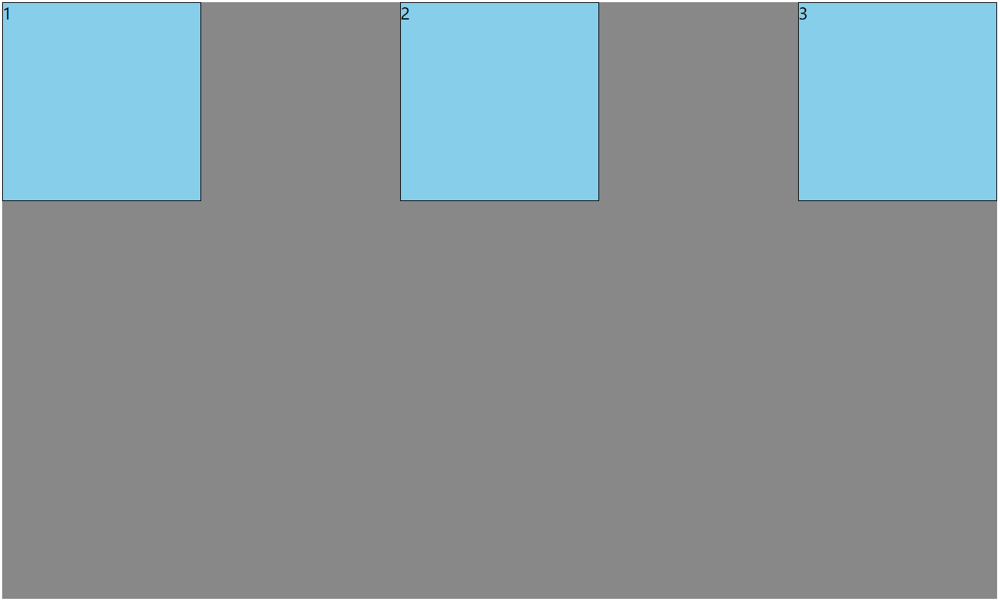

##### 侧轴对齐方式

###### 一行的情况

属性名：`align-items`。

取值：

- `flex-start`：侧轴的起点对齐。

  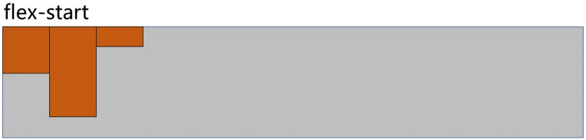

- `flex-end`：侧轴的终点对齐。

  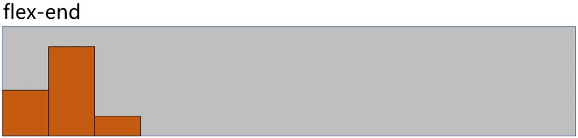

- `center`：侧轴的中点对齐。

  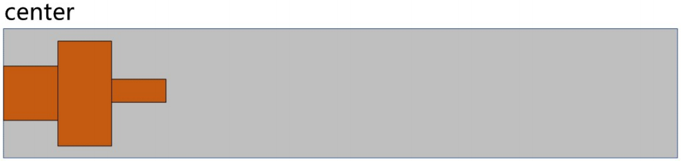

- `baseline`：伸缩项目的第一行文字的基线对齐。

  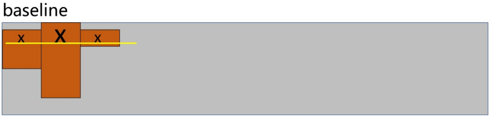

- `stretch`：如果伸缩项目未设置高度，将占满整个容器的高度，默认值。**（所有伸缩项目都没有设置高度时生效）**

  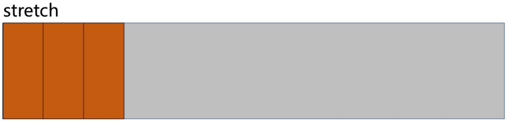

示例：

```html
<!DOCTYPE html>
<html lang="zh-CN">

<head>
    <meta charset="UTF-8">
    <title>06_侧轴对齐方式_一行</title>
    <style>
        .outer {
            width: 1000px;
            height: 600px;
            background-color: #888;
            margin: 0 auto;

            /* 伸缩盒模型相关属性-start */

            /* 将该元素变为了伸缩容器（开启了flex布局） */
            display: flex;

            /* 调整主轴方向，水平从左到右，默认 */
            flex-direction: row;

            /* 主轴换行方式，换行 */
            flex-wrap: wrap;

            /* 主轴的对齐方式，主轴的起始位置 */
            justify-content: flex-start;

            /* 侧轴的对齐方式，侧轴的起始位置对齐 */
            align-items: flex-start;

            /* 侧轴的对齐方式，侧轴的结束位置对齐 */
            /* align-items: flex-end; */

            /* 侧轴的对齐方式，侧轴的中间位置对齐 */
            /* align-items: center; */

            /* 侧轴的对齐方式，侧轴的中间位置对齐 */
            /* align-items: baseline; */

            /* 侧轴的对齐方式，拉伸到整个父容器（前提：伸缩项目不能给高度），默认 */
            /* align-items: stretch; */
        }

        .inner {
            width: 200px;
            height: 200px;
            background-color: skyblue;
            border: 1px solid black;
            box-sizing: border-box;
        }

        .inner2 {
            height: 300px;
            font-size: 80px;
        }

        .inner3 {
            height: 100px;
        }
    </style>
</head>

<body>
    <div class="outer">
        <div class="inner">1x</div>
        <div class="inner inner2">2x</div>
        <div class="inner inner3">3x</div>
    </div>
</body>

</html>
```

效果图：

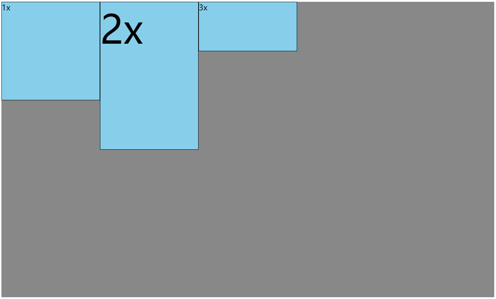

###### 多行的情况

属性名：`align-content`。

取值：

- `flex-start`：与侧轴的起点对齐。

  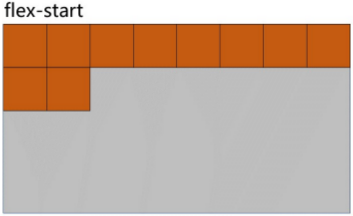

- `flex-end`：与侧轴的终点对齐。

  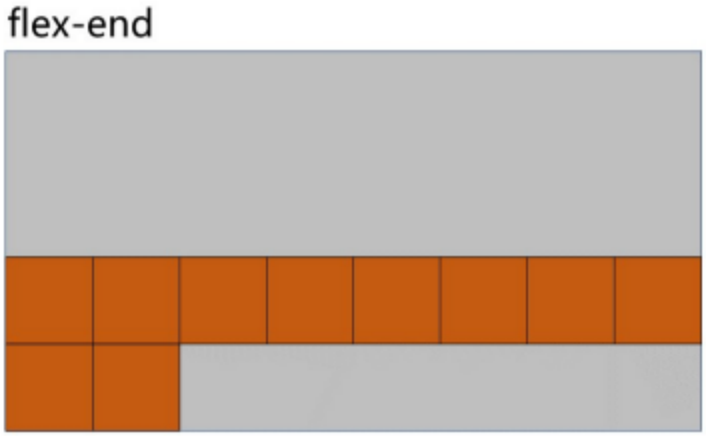

- `center`：与侧轴的中点对齐。

  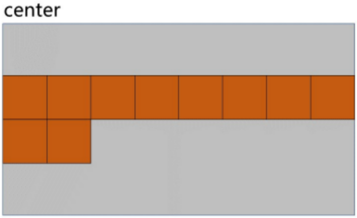

- `space-between`：与侧轴两端对齐，中间平均分布。

  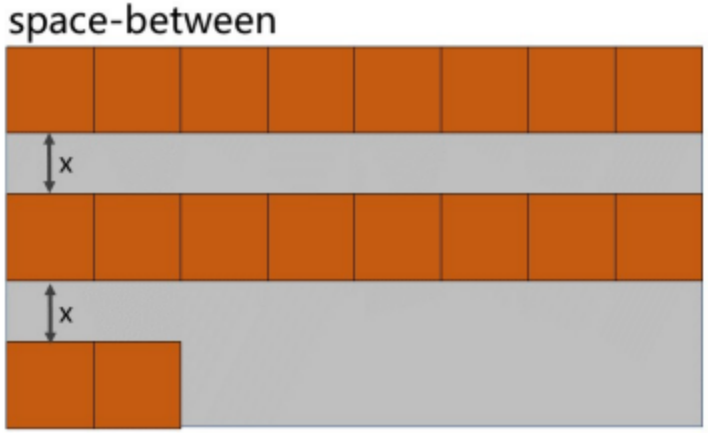

- `space-around`：伸缩项目间的距离相等，比距边缘大一倍。

  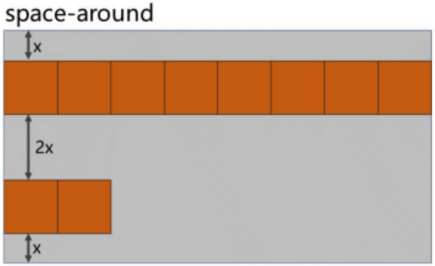

- `space-evenly`：在侧轴上完全平分。

  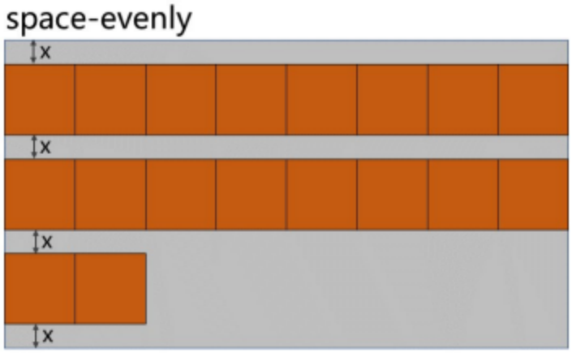

- `stretch`：占满整个侧轴，默认值。

  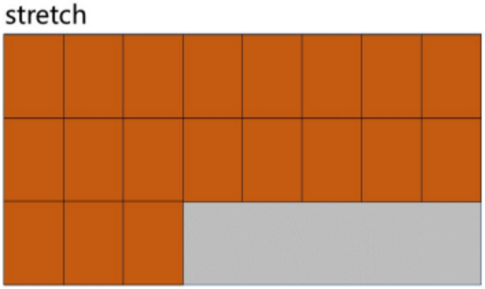

示例：

```html
<!DOCTYPE html>
<html lang="zh-CN">

<head>
    <meta charset="UTF-8">
    <title>07_侧轴对齐方式_多行</title>
    <style>
        .outer {
            width: 1000px;
            height: 900px;
            background-color: #888;
            margin: 0 auto;

            /* 伸缩盒模型相关属性-start */

            /* 将该元素变为了伸缩容器（开启了flex布局） */
            display: flex;

            /* 调整主轴方向，水平从左到右，默认 */
            flex-direction: row;

            /* 主轴换行方式，换行 */
            flex-wrap: wrap;

            /* 主轴的对齐方式，主轴的起始位置 */
            justify-content: flex-start;

            /* 侧轴的对齐方式（多行）侧轴的起始位置对齐 */
            /* align-content: flex-start; */

            /* 侧轴的对齐方式（多行）侧轴的结束位置对齐 */
            /* align-content: flex-end; */

            /* 侧轴的对齐方式（多行）侧轴的中间位置对齐 */
            /* align-content: center; */

            /* 侧轴的对齐方式（多行），伸缩项目之间的距离是相等的，且是边缘距离的2倍 */
            /* align-content:space-around; */

            /* 侧轴的对齐方式（多行），伸缩项目之间的距离是相等的，且边缘没有距离 */
            /* align-content:space-between; */

            /* 侧轴的对齐方式（多行），伸缩项目之间的距离是相等的 */
            /* align-content:space-evenly; */

            /* 侧轴的对齐方式（多行），拉伸，默认 */
            /* align-content: stretch; */

        }

        .inner {
            width: 200px;
            height: 200px;
            background-color: skyblue;
            border: 1px solid black;
            box-sizing: border-box;
        }

        .inner2 {
            height: 300px;
        }

        .inner3 {
            height: 100px;
        }
    </style>
</head>

<body>
    <div class="outer">
        <div class="inner">1</div>
        <div class="inner inner2">2</div>
        <div class="inner inner3">3</div>
        <div class="inner">4</div>
        <div class="inner">5</div>
        <div class="inner">6</div>
        <div class="inner">7</div>
        <div class="inner">8</div>
        <div class="inner">9</div>
        <div class="inner">10</div>
        <div class="inner">11</div>
    </div>
</body>

</html>
```

效果图：

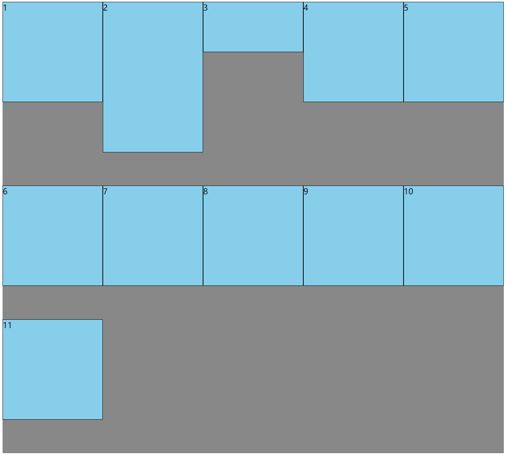

##### flex 实现水平垂直居中

**方法一：父容器开启 flex 布局，随后使用 justify-content 和 align-items 实现水平垂直居中。**

```css
.outer {
    width: 400px;
    height: 400px;
    background-color: #888;
    
    display: flex;
    justify-content: center;
    align-items: center;
}

.inner {
    width: 100px;
    height: 100px;
    background-color: orange;
}
```

**方法二：父容器开启 flex 布局，随后子元素 margin: auto。**

```css
.outer {
    width: 400px;
    height: 400px;
    background-color: #888;
    
    display: flex;
}

.inner {
    width: 100px;
    height: 100px;
    background-color: orange;
    
    margin: auto;
}
```

示例：

```html
<!DOCTYPE html>
<html lang="zh-CN">

<head>
    <meta charset="UTF-8">
    <title>08_元素水平垂直居中</title>
    <style>
        .outer {
            width: 400px;
            height: 400px;
            background-color: #888;
            display: flex;

            /* 方案一 */
            /* justify-content: center; */
            /* align-items: center; */
        }

        .inner {
            width: 100px;
            height: 100px;
            background-color: orange;
            /* 方案二 */
            margin: auto;
        }
    </style>
</head>

<body>
    <div class="outer">
        <div class="inner"></div>
    </div>
</body>

</html>
```

效果图：

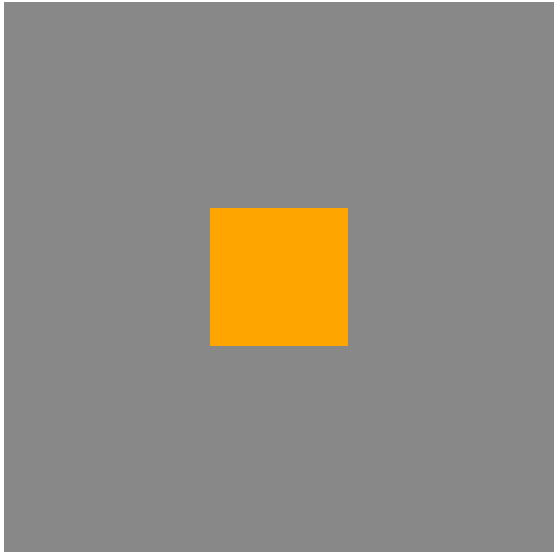

##### 伸缩性

###### flex-basis

概念：`flex-basis`能够**设置主轴方向的基准长度**，会让宽度或高度失效。

- **主轴横向：宽度失效；主轴纵向：高度失效。**

作用：浏览器根据这个属性设置的值，计算主轴上是否有多余空间，**默认值 auto，即伸缩项目的宽或高。**

示例：

```html
<!DOCTYPE html>
<html lang="zh-CN">

<head>
    <meta charset="UTF-8">
    <title>09_项目在主轴的基准长度</title>
    <style>
        .outer {
            width: 1000px;
            height: 900px;
            background-color: #888;
            margin: 0 auto;

            /* 伸缩盒模型相关属性-start */

            /* 将该元素变为了伸缩容器（开启了flex布局） */
            display: flex;

            /* 调整主轴方向，水平从左到右，默认 */
            flex-direction: row;

            /* 主轴换行方式，换行 */
            flex-wrap: wrap;

            /* 主轴的对齐方式，主轴的起始位置 */
            justify-content: flex-start;


        }

        .inner {
            width: 200px;
            height: 200px;
            background-color: skyblue;
            border: 1px solid black;
            box-sizing: border-box;
        }

        .inner2 {
            /* 设置伸缩项目在主轴上的基准长度，若主轴是横向的宽失效，若主轴是纵向的高失效 */
            flex-basis: 300px;
        }
    </style>
</head>

<body>
    <div class="outer">
        <div class="inner">1</div>
        <div class="inner inner2">2</div>
        <div class="inner">3</div>
    </div>
</body>

</html>
```

效果图：

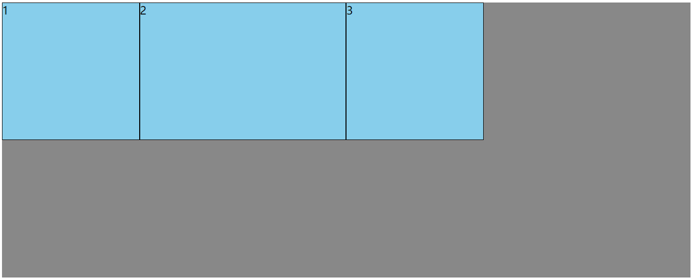

###### flex-grow（伸）

概念：`flex-grow`定义伸缩项目的放大比例，默认为 0，即纵使主轴存在剩余空间，也不拉伸（放大）。

规则：

1. 若所有伸缩项目的 flex-grow 值都为 1，则：它们将等分剩余空间（如果有空间的话）。
2. 若三个伸缩项目的 flex-grow 值分别为：1、2、3，则分别瓜分到：1/6、2/6、3/6 的空间。

示例：

```html
<!DOCTYPE html>
<html lang="zh-CN">

<head>
    <meta charset="UTF-8">
    <title>10_伸缩项目_伸</title>
    <style>
        .outer {
            width: 1000px;
            height: 400px;
            background-color: #888;
            margin: 0 auto;

            /* 伸缩盒模型相关属性-start */

            /* 将该元素变为了伸缩容器（开启了flex布局） */
            display: flex;

            /* 调整主轴方向，水平从左到右，默认 */
            flex-direction: row;

            /* 主轴换行方式，换行 */
            flex-wrap: wrap;

            /* 主轴的对齐方式，主轴的起始位置 */
            justify-content: flex-start;
        }

        .inner {
            width: 200px;
            height: 200px;
            background-color: skyblue;
            border: 1px solid black;
            box-sizing: border-box;

            flex-grow: 1;
        }

        /* .inner1 {
            flex-grow: 1;
        } */
        .inner2 {
            /* flex-grow: 2; */
            width: 300px;
        }

        /* .inner3 {
            flex-grow: 3;
        } */
    </style>
</head>

<body>
    <div class="outer">
        <div class="inner inner1">1</div>
        <div class="inner inner2">2</div>
        <div class="inner inner3">3</div>
    </div>
</body>

</html>
```

效果图：

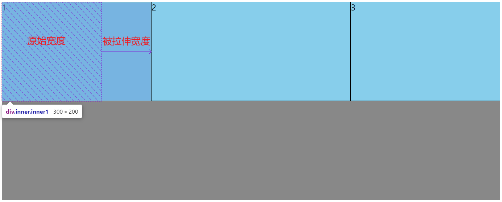

###### flex-shrink（缩）

概念：`flex-shrink`定义了项目的压缩比例，默认为 1，即如果空间不足，该项目将会缩小。（不要开启主轴自动换行，或者缩不起作用）

收缩项目的计算，略微复杂一点，我们拿一个场景举例。

假设三个收缩项目，宽度分别为：200 px、300 px、200 px，它们的 flex-shrink 值分别为：1、2、3。若想刚好容纳下三个项目，需要总宽度为 700 px，但目前容器只有 400 px，还差 300 px。所以每个人都要收缩一下才可以放下，具体收缩的值，这样计算：

1. 计算分母：(200 × 1) + (300 × 2) + (200 × 3) = 1400。
2. 计算比例：
   - 项目一：(200 × 1) / 1400 = 比例值 1。
   - 项目二：(300 × 2) / 1400 = 比例值 2。
   - 项目三：(200 × 3) / 1400 = 比例值 3。
3. 计算最终收缩大小：
   - 项目一需要收缩：比例值 1 × 300。
   - 项目二需要收缩：比例值 2 × 300。
   - 项目三需要收缩：比例值 3 × 300。

示例：

```html
<!DOCTYPE html>
<html lang="zh-CN">

<head>
    <meta charset="UTF-8">
    <title>11_伸缩项目_缩</title>
    <style>
        .outer {
            width: 400px;
            height: 400px;
            background-color: #888;
            margin: 0 auto;

            /* 伸缩盒模型相关属性-start */

            /* 将该元素变为了伸缩容器（开启了flex布局） */
            display: flex;

            /* 调整主轴方向，水平从左到右，默认 */
            flex-direction: row;

            /* 主轴换行方式，换行，不要开启自动换行，或者缩不起作用 */
            /* flex-wrap: wrap; */

            /* 主轴的对齐方式，主轴的起始位置 */
            justify-content: flex-start;

            /* 侧轴的对齐方式 */
            align-content: flex-start;
        }

        .inner {
            width: 200px;
            height: 200px;
            background-color: skyblue;
            border: 1px solid black;
            box-sizing: border-box;
            flex-grow: 1;
        }

        .inner1 {
            flex-shrink: 1;
        }

        .inner2 {
            flex-shrink: 2;
            width: 300px;
        }

        .inner3 {
            flex-shrink: 3;
        }
    </style>
</head>

<body>
    <div class="outer">
        <div class="inner inner1">
            <div style="width: 50px;height:50px;background-color: green;">1</div>
        </div>
        <div class="inner inner2">2</div>
        <div class="inner inner3">3</div>
    </div>
</body>

</html>
```

效果图：

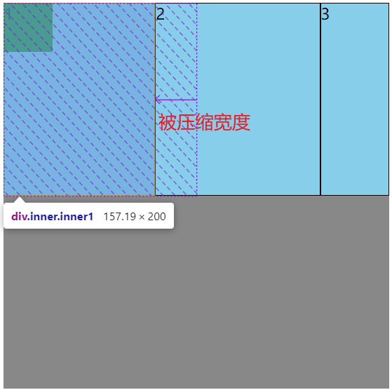

##### flex 复合属性

`flex`是复合属性，复合了 "flex-grow flex-shrink flex-basis" 三个属性，默认值为 "0 1 auto"。

- 如果写 "flex: 1 1 auto"，则可简写为："flex: auto"。
- 如果写 "flex: 1 1 0"，则可简写为："flex: 1"。
- 如果写 "flex: 0 0 auto"，则可简写为："flex: none"。
- 如果写 "flex: 0 1 auto"，则可简写为："flex: 0 auto"，即 flex 初始值。

示例：

```html
<!DOCTYPE html>
<html lang="zh-CN">

<head>
    <meta charset="UTF-8">
    <title>12_flex复合属性</title>
    <style>
        .outer {
            width: 600px;
            height: 900px;
            background-color: #888;
            margin: 0 auto;

            /* 伸缩盒模型相关属性-start */

            /* 将该元素变为了伸缩容器（开启了flex布局） */
            display: flex;

            /* 调整主轴方向，水平从左到右，默认 */
            flex-direction: row;

            /* 主轴换行方式，换行 */
            /* flex-wrap: wrap; */

            /* 主轴的对齐方式，主轴的起始位置 */
            justify-content: flex-start;

            /* 侧轴的对齐方式 */
            align-content: flex-start;
        }

        .inner {
            width: 200px;
            height: 200px;
            background-color: skyblue;
            border: 1px solid black;
            box-sizing: border-box;
            /* 可以拉伸 */
            /* flex-grow: 1; */

            /* 可以压缩 */
            /* flex-shrink: 1; */

            /* 基准长度 */
            /* flex-basis: 100px; */

            /* 可以拉伸 可以压缩 不设置基准长度，可简写为：flex:auto */
            /* flex:1 1 auto; */

            /* 可以拉伸 可以压缩 设置基准长度为0，可简写为：flex:1 */
            /* flex: 1 1 0; */

            /* 不可以拉伸 不可以压缩 不设置基准长度，可简写为：flex:none  */
            /* flex: 0 0 auto; */

            /* 不可以拉伸 可以压缩 不设置基准长度，可简写为：flex:0 auto */
            /* flex: 0 1 auto; */
        }
    </style>
</head>

<body>
    <div class="outer">
        <div class="inner inner1">1</div>
        <div class="inner inner2">2</div>
        <div class="inner inner3">3</div>
    </div>
</body>

</html>
```

##### 项目排序

使用`order`属性，定义**项目的排列顺序**。数值越小，排列越靠前，默认为 0。

示例：

```html
<!DOCTYPE html>
<html lang="zh-CN">

<head>
    <meta charset="UTF-8">
    <title>13_项目排序与单独对齐</title>
    <style>
        .outer {
            width: 600px;
            height: 400px;
            background-color: #888;
            margin: 0 auto;

            /* 伸缩盒模型相关属性-start */

            /* 将该元素变为了伸缩容器（开启了flex布局） */
            display: flex;

            /* 调整主轴方向，水平从左到右，默认 */
            flex-direction: row;

            /* 主轴换行方式，换行 */
            /* flex-wrap: wrap; */

            /* 主轴的对齐方式，主轴的起始位置 */
            justify-content: flex-start;

            /* 侧轴的对齐方式 */
            align-content: flex-start;
        }

        .inner {
            width: 200px;
            height: 200px;
            background-color: skyblue;
            border: 1px solid black;
            box-sizing: border-box;
            /* 可以拉伸 可以压缩 设置基准长度为0，可简写为：flex:1 */
            flex: 1 1 0;
        }

        .inner1 {
            order: 3;
        }

        .inner2 {
            order: 2;
        }

        .inner3 {
            order: 1;
        }

        /* .inner2 {
            align-self: center;
        } */
    </style>
</head>

<body>
    <div class="outer">
        <div class="inner inner1">1</div>
        <div class="inner inner2">2</div>
        <div class="inner inner3">3</div>
    </div>
</body>

</html>
```

效果图：

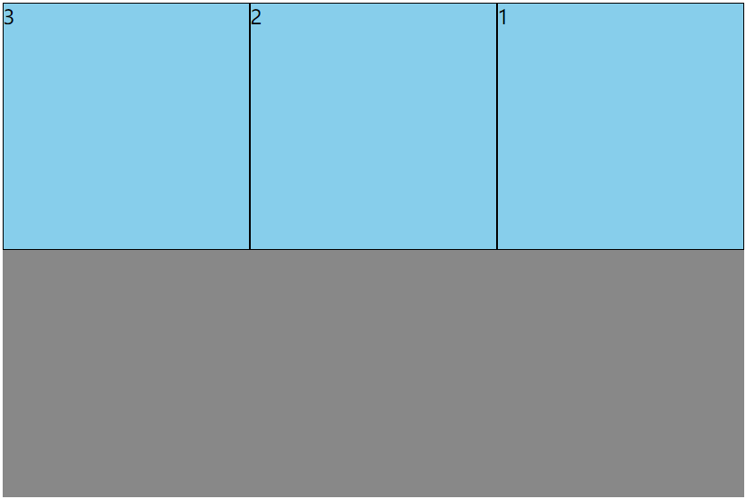

##### 单独对齐

使用`align-self`属性，可以**单独调整某个伸缩项目的对齐方式**。默认值为 auto，表示继承父元素的 align-items 属性。

示例：

```html
<!DOCTYPE html>
<html lang="zh-CN">

<head>
    <meta charset="UTF-8">
    <title>13_项目排序与单独对齐</title>
    <style>
        .outer {
            width: 600px;
            height: 600px;
            background-color: #888;
            margin: 0 auto;

            /* 伸缩盒模型相关属性-start */

            /* 将该元素变为了伸缩容器（开启了flex布局） */
            display: flex;

            /* 调整主轴方向，水平从左到右，默认 */
            flex-direction: row;

            /* 主轴换行方式，换行 */
            /* flex-wrap: wrap; */

            /* 主轴的对齐方式，主轴的起始位置 */
            justify-content: flex-start;

            /* 侧轴的对齐方式 */
            align-content: flex-start;
        }

        .inner {
            width: 200px;
            height: 200px;
            background-color: skyblue;
            border: 1px solid black;
            box-sizing: border-box;
            /* 可以拉伸 可以压缩 设置基准长度为0，可简写为：flex:1 */
            flex: 1 1 0;
        }

        /* .inner1 {
            order: 3;
        }

        .inner2 {
            order: 2;
        }

        .inner3 {
            order: 1;
        } */

        .inner2 {
            align-self: center;
        }
    </style>
</head>

<body>
    <div class="outer">
        <div class="inner inner1">1</div>
        <div class="inner inner2">2</div>
        <div class="inner inner3">3</div>
    </div>
</body>

</html>
```

效果图：

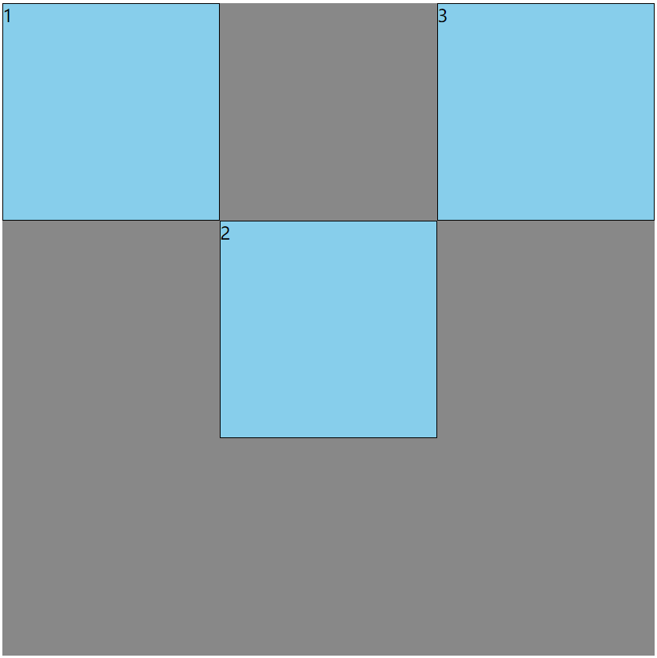

##### 伸缩盒模型的应用案例

```html
<!DOCTYPE html>
<html lang="zh-CN">

<head>
    <meta charset="UTF-8">
    <title>尚硅谷官网</title>
    <style>
        * {
            font-family: Arial;
            font-size: 14px;
            margin: 0;
            padding: 0;
            border: none;
        }

        a {
            text-decoration: none;
        }

        ul {
            list-style: none;
        }

        html,
        body {
            width: 100%;
            height: 100%;
        }

        body {
            background-image: url('../images/bg.jpg');
            background-repeat: no-repeat;
            background-size: cover;
        }

        .page-header {
            height: 70px;
            background-color: rgba(0, 0, 0, 0.7);
            display: flex;
            justify-content: space-between;
            align-items: center;
            padding: 0 20px;
        }

        .header-nav {
            display: flex;

        }

        .header-nav li a {
            color: white;
            font-size: 20px;
            border: 1px solid white;
            border-radius: 8px;
            padding: 10px;
            margin-right: 20px;
        }

        .header-nav li:last-child a {
            margin-right: 0;
        }

        .page-content {
            display: flex;
            height: calc(100vh - 70px);
        }

        .content-nav {
            width: 1000px;
            height: 300px;
            margin: auto;
            display: flex;
            justify-content: space-evenly;
            align-items: center;
        }

        .content-nav .item {
            width: 180px;
            height: 200px;
            background-color: orange;
            display: flex;
            flex-direction: column;
            align-items: center;
            justify-content: space-evenly;
            transition: 0.2s linear;
            cursor: pointer;
        }

        .content-nav .item:hover {
            box-shadow: 0px 0px 20px black;
        }

        .content-nav .item span {
            font-size: 20px;
            color: white;
        }

        .content-nav .item:nth-child(1) {
            background-color: #595CA8;
        }

        .content-nav .item:nth-child(2) {
            background-color: #FF9D2E;
        }

        .content-nav .item:nth-child(3) {
            background-color: #01A6DE;
        }

        .content-nav .item:nth-child(4) {
            background-color: #015E91;
        }

        .content-nav .item:nth-child(5) {
            background-color: #1DC128;
        }
    </style>
</head>

<body>
    <!-- 头部 -->
    <header class="page-header">
        <a href="#">
            
        </a>
        <ul class="header-nav">
            <li><a href="#">国内校区</a></li>
            <li><a href="#">缅甸校区</a></li>
            <li><a href="#">非洲校区</a></li>
            <li><a href="#">美国校区</a></li>
        </ul>
    </header>
    <!-- 内容区 -->
    <div class="page-content">
        <div class="content-nav">
            <div class="item">
                
                <span>我的邮箱</span>
            </div>
            <div class="item">
                
                <span>云服务</span>
            </div>
            <div class="item">
                
                <span>手机课堂</span>
            </div>
            <div class="item">
                
                <span>微信服务</span>
            </div>
            <div class="item">
                
                <span>在线客服</span>
            </div>
        </div>
    </div>
</body>

</html>
```

效果图：

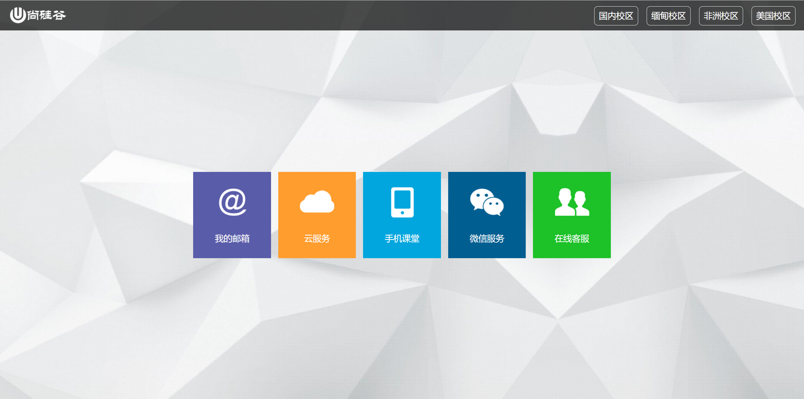

#### 响应式布局

##### 媒体查询

`媒体查询`使用`@media`属性。

###### 媒体类型

@media 能够查询的**媒体类型**：

- `all`：检测所有设备。
- `screen`：检测电子屏幕。包括：电脑屏幕、平板屏幕、手机屏幕等。
- `print`：检测打印机。
- aural：已废弃，用于语音和声音合成器。
- braille：已废弃，应用于盲文触摸式反馈设备。
- embossed：已废弃， 用于打印的盲人印刷设备。
- handheld：已废弃， 用于掌上设备或更小的装置，如 PDA 和小型电话。
- projection：已废弃， 用于投影设备。
- tty：已废弃， 用于固定的字符网格，如电报、终端设备和对字符有限制的便携设备。
- tv：已废弃， 用于电视和网络电视。

> 完整的媒体类型列表，参考：https://developer.mozilla.org/zh-CN/docs/Web/CSS/@media 

示例：

```html
<!DOCTYPE html>
<html lang="zh-CN">

<head>
    <meta charset="UTF-8">
    <title>01_媒体查询_媒体类型</title>
    <style>
        h1 {
            width: 600px;
            height: 400px;
            line-height: 400px;
            background-image: linear-gradient(30deg, red, yellow, green);
            margin: 0 auto;
            text-align: center;
            font-size: 100px;
            color: white;
            text-shadow: 0 0 10px black;
        }

        /* 媒体查询未提供优先级，需要放在正常样式的下面，否则无效果 */

        /* 只有在打印机或打印预览才应用的样式 */
        @media print {
            h1 {
                /* 打印机预览时去掉背景图 */
                background: transparent;
            }
        }

        /* 只有在屏幕上才应用的样式 */
        @media screen {
            h1 {
                font-family: "翩翩体-简";
            }
        }

        /* 一直都应用的样式 */
        @media all {
            h1 {
                color: red;
            }
        }
    </style>
</head>

<body>
    <h1>新年快乐</h1>
</body>

</html>
```

效果图：

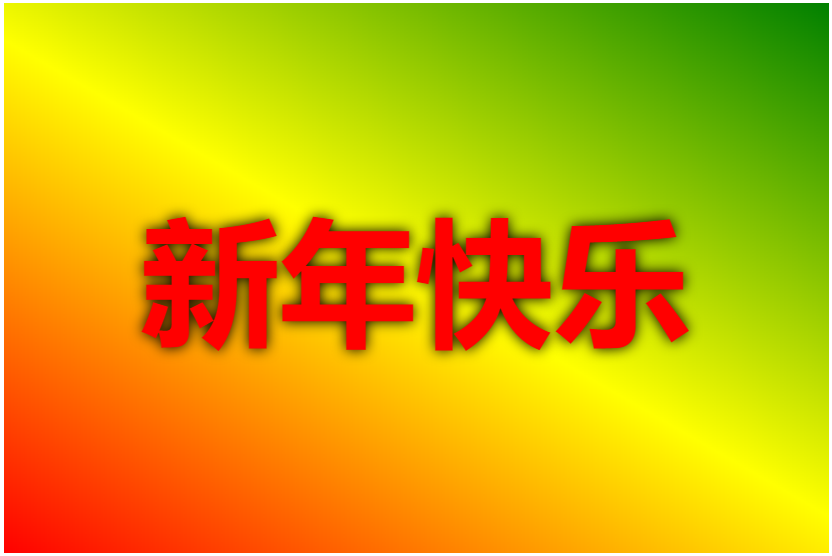

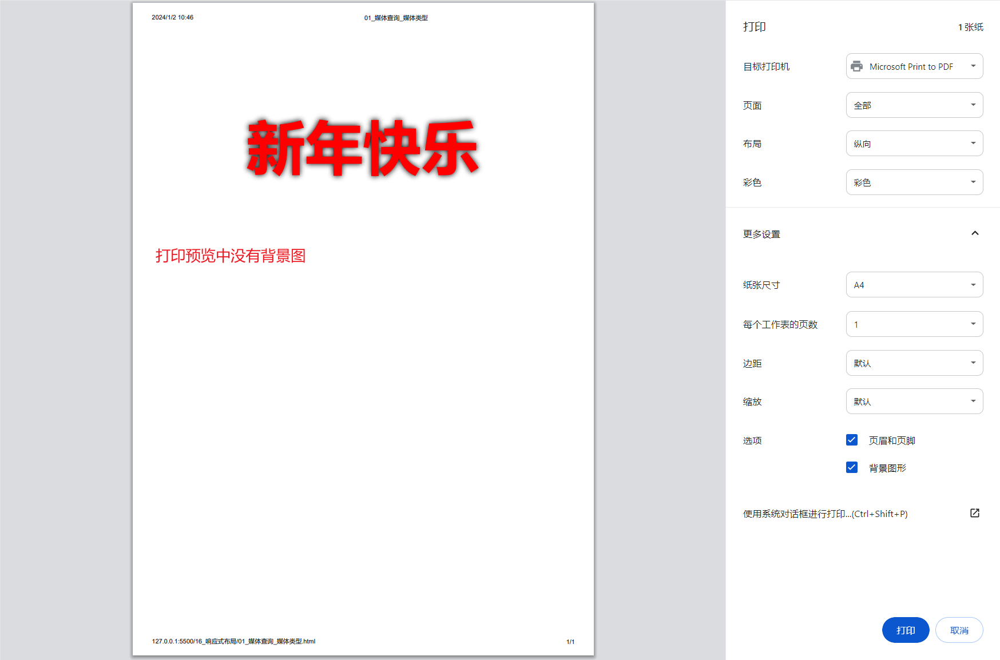

###### 媒体特性

@media 能够查询的**媒体特性**：

- `width`：检测视口**宽度**。
- `max-width`：检测视口**最大宽度**。
- `min-width`：检测视口**最小宽度**。
- `height`：检测视口**高度**。
- `max-height`：检测视口**最大高度**。
- `min-height`：检测视口**最小高度**。
- `device-width`：检测设备**屏幕的宽度**。
- `max-device-width`：检测设备**屏幕的最大宽度**。
- `min-device-width`：检测设备**屏幕的最小宽度**。
- `orientation`：检测**视口的旋转方向**（是否横屏）。
  - `portrait`：视口处于**纵向**，即高度大于等于宽度。
  - `landscape`：视口处于**横向**，即宽度大于高度。

> 完整的媒体类型列表，参考：https://developer.mozilla.org/zh-CN/docs/Web/CSS/@media
>
> **注意：设备屏幕的宽度，需要考虑系统的缩放。**如下图所示，显示器分辨率宽度为 2560，缩放为 125%，则实际的设备屏幕宽度为 2560 / 125% = 2048 px。
>
> 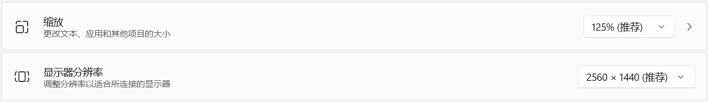

示例：

```html
<!DOCTYPE html>
<html lang="zh-CN">

<head>
    <meta charset="UTF-8">
    <title>02_媒体查询_媒体特性</title>
    <style>
        * {
            margin: 0;
            padding: 0;
        }

        h1 {
            height: 200px;
            background-color: gray;
            text-align: center;
            line-height: 200px;
            font-size: 100px;
        }

        /* 检测到视口的宽度等于800px时，应用如下样式 */
        @media (width:800px) {
            h1 {
                background-color: green;
            }
        }

        /* 检测到视口的宽度小于等于700px时，应用如下样式 */
        @media (max-width:700px) {
            h1 {
                background-color: orange;
            }
        }

        /* 检测到视口的宽度大于等于900px时，应用如下样式 */
        @media (min-width:900px) {
            h1 {
                background-color: deepskyblue;
            }
        }

        /* 检测到视口的高度等于800px时，应用如下样式 */
        /* @media (height:800px){
            h1 {
                background-color: yellow;
            }
        } */

        /* 检测到屏幕的宽度等于2048px时，应用如下样式 */
        /* @media (device-width:2048px) {
            h1 {
                color: white;
            }
        } */
    </style>
</head>

<body>
    <h1>你好啊</h1>
</body>

</html>
```

###### 运算符

@media 能够使用的**运算符**：

- `and`：并且。
- `, 或 or`：或。
- `not`：否定。
- `only`：肯定。

> only 能够解决一些 IE 老版本浏览器的兼容问题。比如：@media screen and (width:800px)，IE 浏览器可能会识别出 screen，但是后面的条件无法识别，导致错误的样式。添加 only 之后，IE 浏览器也无法识别出 only，因此就会直接舍弃整个 @media only screen and (width:800px) 条件，不会对整体样式产生影响。

示例：

```html
<!DOCTYPE html>
<html lang="zh-CN">

<head>
    <meta charset="UTF-8">
    <title>03_媒体查询_运算符</title>
    <style>
        * {
            margin: 0;
            padding: 0;
        }

        h1 {
            height: 200px;
            background-color: gray;
            text-align: center;
            line-height: 200px;
            font-size: 100px;
        }

        /* 且运算符 */
        /* @media (min-width:700px) and (max-width:800px) {
            h1 {
                background-color: orange;
            }
        } */
        /* @media screen and (min-width:700px) and (max-width:800px) {
            h1 {
                background-color: orange;
            }
        } */

        /* 或运算符 */
        /* @media screen and (max-width:700px) or (min-width:800px) {
            h1 {
                background-color: orange;
            }
        } */

        /* 否定运算符 */
        /* @media not screen {
            h1 {
                background-color: orange;
            }
        } */

        /* 肯定运算符 */
        @media only screen and (width:800px) {
            h1 {
                background-color: orange;
            }
        }
    </style>
</head>

<body>
    <h1>你好啊</h1>
</body>

</html>
```

##### 常用阈值

在实际开发中，会将屏幕划分成几个区间，例如：

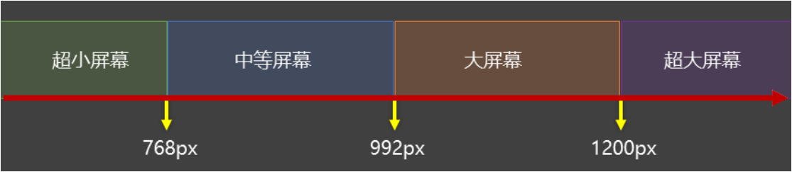

##### 结合外部样式的用法

用法一，在引入样式的时候，指定 @media，样式上不写 @media，只写普通的样式：

```html
<link rel="stylesheet" media="具体的媒体查询" href="mystylesheet.css">
```

用法二，直接在样式上指定 @media：

```css
@media screen and (max-width:768px) {
/*CSS-Code;*/
}

@media screen and (min-width:768px) and (max-width:1200px) {
/*CSS-Code;*/
}
```

示例：

```html
<!DOCTYPE html>
<html lang="zh-CN">

<head>
    <meta charset="UTF-8">
    <title>03_媒体查询_运算符</title>
    <link rel="stylesheet" href="./css/index.css">
    <link rel="stylesheet" href="./css/small.css">
    <link rel="stylesheet" href="./css/middle.css">
    <link rel="stylesheet" href="./css/large.css">
    <link rel="stylesheet" media="screen and (min-width:1200px)" href="./css/huge.css">
</head>

<body>
    <h1>你好啊</h1>
</body>

</html>
```

index.css：

```css
* {
    margin: 0;
    padding: 0;
}

h1 {
    height: 200px;
    background-color: gray;
    text-align: center;
    line-height: 200px;
    font-size: 100px;
}
```

small.css：

```css
/* 超小屏幕 */
@media screen and (max-width:768px) {
    h1 {
        background-color: orange;
    }
}
```

middle.css：

```css
/* 中等屏幕 */
@media screen and (min-width:768px) and (max-width:992px) {
    h1 {
        background-color: green;
    }
}
```

large.css：

```css
/* 大屏幕 */
@media screen and (min-width:992px) and (max-width:1200px) {
    h1 {
        background-color: deepskyblue;
    }
}
```

huge.css：

```css
/* 超大屏幕 */
h1 {
    background-color: purple;
}
```

#### BFC

##### 什么是 BFC

W3C 上对 BFC 的定义：

>Floats, absolutely positioned elements, block containers (such as inline-blocks, table cells, and table-captions) that are not block boxes, and block boxes with 'overflow' other than 'visible' (except when that value has been propagated to the viewport) establish new block formatting contexts for their contents.
>
>浮动、绝对定位元素、不是块盒子的块容器（如 inline-blocks、table-cells 和 table-captions），以及 overflow 属性的值除 visible 以外的块盒，将为其内容建立新的块格式化上下文。

MDN 上对 BFC 的描述：

>块格式化上下文（Block Formatting Context，BFC） 是 Web 页面的可视 CSS 渲染的一部分，是块盒子的布局过程发生的区域，也是浮动元素与其他元素交互的区域。

更加通俗的描述：

>`BFC 是 Block Formatting Context，块级格式上下文`，可以理解成元素的一个 "特异功能"。该 "特异功能"在默认的情况下处于关闭状态；当元素满足了某些条件后，该 "特异功能" 被激活。所谓激活 "特异功能"，专业点说就是：**该元素创建了 BFC，又称开启了 BFC。**

##### 开启 BFC 的作用

开启 BFC 能解决的问题：

- **元素开启 BFC 后，其子元素不会再产生 margin 塌陷问题。**
- **元素开启 BFC 后，自己不会被其他浮动元素所覆盖。**
- **元素开启 BFC 后，就算其子元素浮动，元素自身高度也不会塌陷。**

#####  如何开启 BFC

能够开启 BFC 的元素有：

- 根元素。
- 浮动元素。
- 绝对定位、固定定位的元素。
- 行内块元素。
- 表格单元格：table、thead、tbody、tfoot、th、td、tr、caption。
- overflow 的值不为 visible 的块元素。
- 伸缩项目。
- 多列容器。
- column-span 为 all 的元素（即使该元素没有包裹在多列容器中）。
- display 的值，设置为 flow-root 的元素。

##### BFC 的应用案例

**示例一，解决子元素 margin 塌陷的问题：**

```html
<!DOCTYPE html>
<html lang="zh-CN">

<head>
    <meta charset="UTF-8">
    <title>01_BFC_演示1</title>
    <style>
        * {
            margin: 0;
            padding: 0;
        }

        body {
            /* 6. 父元素开启flex，子元素自动成为伸缩项目 */
            /* display: flex; */
        }

        .outer {
            width: 400px;
            background-color: #888;
            /* 1. 开启浮动 */
            /* float: left; */

            /* 2. 开启绝对定位 */
            /* position: absolute; */

            /* 3. 设置行内块元素 */
            /* display: inline-block; */

            /* 4. 设置表格 */
            /* display: table; */

            /* 5. 设置overflow */
            /* overflow: auto; */

            /* 7. 设置多列容器 */
            /* column-count: 1; */

            /* 8. 设置display */
            /* display: flow-root; */
        }

        .inner {
            width: 100px;
            height: 100px;
            margin: 20px;
        }

        .inner1 {
            background-color: orange;
        }

        .inner2 {
            background-color: green;
        }

        .inner3 {
            background-color: deepskyblue;
        }
    </style>
</head>

<body>
    <div class="outer">
        <div class="inner inner1"></div>
        <div class="inner inner2"></div>
        <div class="inner inner3"></div>
    </div>
    <!-- <hr style="height: 50px; background-color: red;"> -->
</body>

</html>
```

**示例二，解决被浮动元素覆盖的问题：**

```html
<!DOCTYPE html>
<html lang="zh-CN">

<head>
    <meta charset="UTF-8">
    <title>02_BFC_演示2</title>
    <style>
        .box {
            width: 100px;
            height: 100px;
        }

        .box1 {
            background-color: orange;
            float: left;
        }

        .box2 {
            background-color: green;
            /* float: left; */
            /* position: absolute; */
            /* display: inline-block; */
            /* display: table; */
            /* overflow: auto; */
            /* column-count: 1; */
            /* display: flow-root; */
        }
    </style>
</head>

<body>
    <div class="box box1"></div>
    <div class="box box2"></div>
</body>

</html>
```

**示例三，解决全部子元素浮动，自身高度塌陷的问题：**

```html
<!DOCTYPE html>
<html lang="zh-CN">

<head>
    <meta charset="UTF-8">
    <title>03_BFC_演示3</title>
    <style>
        .outer {
            width: 400px;
            background-color: #888;
            /* float: left; */
            /* position: absolute; */
            /* display: inline-block; */
            /* display: table; */
            /* overflow: auto; */
            /* column-count: 1; */
            display: flow-root;
        }

        .inner {
            width: 100px;
            height: 100px;
            float: left;
        }

        .inner1 {
            background-color: orange;
        }

        .inner2 {
            background-color: green;
        }
    </style>
</head>

<body>
    <div class="outer">
        <div class="inner inner1"></div>
        <div class="inner inner2"></div>
    </div>
</body>

</html>
```

## 原文链接

https://github.com/ACatSmiling/zero-to-zero/blob/main/FrontEnd/html-css.md