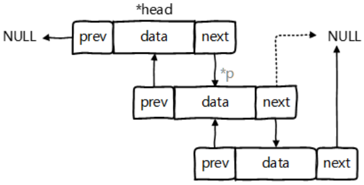
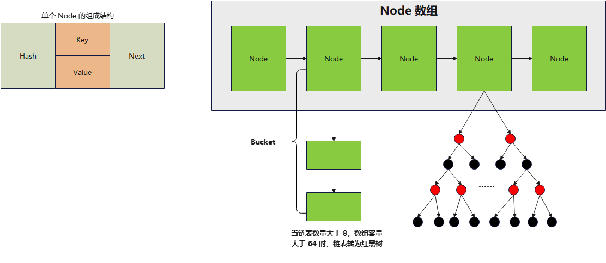

> *`Author: ACatSmiling`*
>
> *`Since: 2024-07-28`*

## 概述

在 Java 语言中，数组（Array）和集合都是对多个数据进行存储操作的结构，简称`Java 容器`。此时的存储，主要指的是内存层面的存储，不涉及到持久化的存储。

数组在内存存储方面的特点：

- 数组一旦初始化以后，其长度就确定了。
- 数组一旦定义好，其元素的类型也就确定了。

数组在存储数据方面的弊端：

- 数组一旦初始化以后，其长度就不可修改，不便于扩展。
- 数组中提供的属性和方法少，不便于进行添加、删除、插入等操作，且效率不高。
- 数组中没有现成的属性和方法，去直接获取数组中已存储的元素的个数（只能直接知道数组的长度）。
- 数组存储的数据是有序的、可重复的。对于无序、不可重复的需求，不能满足，即数组存储数据的特点比较单一。

Java 集合类可以用于存储数量不等的多个对象，还可用于保存具有映射关系的关联数组。

Java 集合框架可分为`Collection`和`Map`两种体系：

- Collection 接口 ：单列集合，用来存储一个一个的对象。
  - **`List 接口：存储有序的、可重复的数据。`**包括：ArrayList、LinkedList、Vector。
  - **`Set 接口：存储无序的、不可重复的数据。`**包括：HashSet、LinkedHashSet、TreeSet。
- **`Map 接口：双列集合，用来存储具有映射关系 "key - value 对" 的数据。`**包括：HashMap、LinkedHashMap、TreeMap、Hashtable、Properties。

## List 接口

List 集合类中元素有序、且可重复，集合中的每个元素都有其对应的顺序索引。

### ArrayList

基础属性：

```java
public class ArrayList<E> extends AbstractList<E>
        implements List<E>, RandomAccess, Cloneable, java.io.Serializable
{
    @java.io.Serial
    private static final long serialVersionUID = 8683452581122892189L;

    /**
     * Default initial capacity.
     */
    private static final int DEFAULT_CAPACITY = 10;

    /**
     * Shared empty array instance used for empty instances.
     */
    private static final Object[] EMPTY_ELEMENTDATA = {};

    /**
     * Shared empty array instance used for default sized empty instances. We
     * distinguish this from EMPTY_ELEMENTDATA to know how much to inflate when
     * first element is added.
     */
    private static final Object[] DEFAULTCAPACITY_EMPTY_ELEMENTDATA = {};

    /**
     * The array buffer into which the elements of the ArrayList are stored.
     * The capacity of the ArrayList is the length of this array buffer. Any
     * empty ArrayList with elementData == DEFAULTCAPACITY_EMPTY_ELEMENTDATA
     * will be expanded to DEFAULT_CAPACITY when the first element is added.
     */
    transient Object[] elementData; // non-private to simplify nested class access

    /**
     * The size of the ArrayList (the number of elements it contains).
     *
     * @serial
     */
    private int size;
}
```

> 本文源码，均基于 JDK 17。

new ArrayList() 时，`底层 Object[] 数组 elementData 初始化为 {}，是一个长度为 0 的空数组`：

```java
/**
 * Constructs an empty list with an initial capacity of ten.
 */
public ArrayList() {
    this.elementData = DEFAULTCAPACITY_EMPTY_ELEMENTDATA;
}
```

第一次调用 add() 方法，`初始化底层 Object[] 数组 elementData 的长度为 10`，并将元素添加到 elementData 中：

```java
/**
 * Appends the specified element to the end of this list.
 *
 * @param e element to be appended to this list
 * @return {@code true} (as specified by {@link Collection#add})
 */
public boolean add(E e) {
    modCount++;
    add(e, elementData, size);
    return true;
}
```

```java
/**
 * This helper method split out from add(E) to keep method
 * bytecode size under 35 (the -XX:MaxInlineSize default value),
 * which helps when add(E) is called in a C1-compiled loop.
 */
private void add(E e, Object[] elementData, int s) {
    // 第一次执行 add() 方法，size 属性的值为 0，elementData.length 为 0
    if (s == elementData.length)
        elementData = grow();
    // 添加元素到数组中
    elementData[s] = e;
    size = s + 1;
}
```

```java
private Object[] grow() {
    return grow(size + 1);
}
```

```java
/**
 * Increases the capacity to ensure that it can hold at least the
 * number of elements specified by the minimum capacity argument.
 *
 * @param minCapacity the desired minimum capacity
 * @throws OutOfMemoryError if minCapacity is less than zero
 */
private Object[] grow(int minCapacity) {
    int oldCapacity = elementData.length;
    if (oldCapacity > 0 || elementData != DEFAULTCAPACITY_EMPTY_ELEMENTDATA) {
        int newCapacity = ArraysSupport.newLength(oldCapacity,
                minCapacity - oldCapacity, /* minimum growth */
                oldCapacity >> 1           /* preferred growth */);
        return elementData = Arrays.copyOf(elementData, newCapacity);
    } else {
        // 初始化数组，长度为 DEFAULT_CAPACITY，即 10
        return elementData = new Object[Math.max(DEFAULT_CAPACITY, minCapacity)];
    }
}
```

之后，每次执行 add() 方法，直接将元素添加到 elementData 对应的位置，直到第 11 次添加元素。此时，添加的元素的总数，已经超过了数组的长度，需要进行`扩容操作`：

```java
/**
 * This helper method split out from add(E) to keep method
 * bytecode size under 35 (the -XX:MaxInlineSize default value),
 * which helps when add(E) is called in a C1-compiled loop.
 */
private void add(E e, Object[] elementData, int s) {
    // 第 11 次添加元素，此时，满足 s == elementData.length 条件
    if (s == elementData.length)
        elementData = grow();
    elementData[s] = e;
    size = s + 1;
}
```

默认情况下，`数组长度扩容为原来容量的 1.5 倍，同时，将原有数组中的数据复制到新的数组中`：

```java
/**
 * Increases the capacity to ensure that it can hold at least the
 * number of elements specified by the minimum capacity argument.
 *
 * @param minCapacity the desired minimum capacity
 * @throws OutOfMemoryError if minCapacity is less than zero
 */
private Object[] grow(int minCapacity) {
    int oldCapacity = elementData.length;
    // 满足 oldCapacity > 0 条件
    if (oldCapacity > 0 || elementData != DEFAULTCAPACITY_EMPTY_ELEMENTDATA) {
        // 扩容数组长度到原来的 1.5 倍
        int newCapacity = ArraysSupport.newLength(oldCapacity,
                minCapacity - oldCapacity, /* minimum growth */
                oldCapacity >> 1           /* preferred growth */);
        // 复制原数组数据到新数组
        return elementData = Arrays.copyOf(elementData, newCapacity);
    } else {
        return elementData = new Object[Math.max(DEFAULT_CAPACITY, minCapacity)];
    }
}
```

结论：

1. **ArrayList 是第一次添加元素时，才创建一个初始容量为 10 的数组，延迟了数组的创建。**
2. **添加数据时，如果底层的数组需要扩容，均扩容为原来容量的 1.5 倍，同时，将原有数组中的数据复制到新的数组中。**
3. **开发中使用 ArrayList 时，建议按需求在初始化时就指定 ArrayList 的容量，以尽可能的避免扩容。**

### LinkedList

`双向链表，内部定义了内部类 Node，作为 LinkedList 中保存数据的基本结构。`

LinkedList 内部没有声明数组，而是定义了 Node 类型的 first 和 last，用于记录首末元素：



> 对于`频繁的插入或删除元素`的操作，建议使用 LinkedList 类，效率较高。

new LinkedList() 时，内部声明了 Node 类型的 first 和 last 属性，默认值为 null：

```java
public class LinkedList<E>
    extends AbstractSequentialList<E>
    implements List<E>, Deque<E>, Cloneable, java.io.Serializable
{
    transient int size = 0;

    /**
     * Pointer to first node.
     */
    transient Node<E> first;

    /**
     * Pointer to last node.
     */
    transient Node<E> last;

    /**
     * Constructs an empty list.
     */
    public LinkedList() {
    }
}
```

```java
// Node 内部类
private static class Node<E> {
    // 当前 Node 存储的数据
    E item;
    // 指向链表的后一个元素
    Node<E> next;
    // 指向链表的前一个元素
    Node<E> prev;

    Node(Node<E> prev, E element, Node<E> next) {
        this.item = element;
        this.next = next;
        this.prev = prev;
    }
}
```

调用 add() 方法添加元素：

```java
/**
 * Appends the specified element to the end of this list.
 *
 * <p>This method is equivalent to {@link #addLast}.
 *
 * @param e element to be appended to this list
 * @return {@code true} (as specified by {@link Collection#add})
 */
public boolean add(E e) {
    linkLast(e);
    return true;
}
```

```java
/**
 * Links e as last element.
 */
void linkLast(E e) {
    // last，原链表的最后一个对象
    final Node<E> l = last;
    // 创建一个新的 Node 对象
    final Node<E> newNode = new Node<>(l, e, null);
    // 当前新创建的 Node 对象，成为新链表的最后一个对象
    last = newNode;
    if (l == null)
        // 如果原链表为 null，则将当前新创建的 Node 对象指定为链表的第一个节点 first
        first = newNode;
    else
        // 如果原链表不为 null，则将原链表的最后一个对象，指向当前新的 Node 对象
        l.next = newNode;
    size++;
    modCount++;
}
```

## Set 接口

Set 集合存储`无序的、不可重复的`数据，如果把两个相同的元素加入同一个 Set 集合中，则添加操作失败。

- **无序性：不等于随机性。**以 HashSet 为例，存储的数据在底层数组中并非按照数组索引的顺序添加，而是根据数据的哈希值决定的。
- **不可重复性：保证添加的元素按照 equals() 判断时，不能返回 true。**即：相同的元素只能添加一个。

Set 接口是 Collection 的子接口，Set 接口没有提供额外的方法，使用的都是Collection中声明过的方法。

Set 判断两个对象是否相同不是使用 == 运算符，而是根据 equals()。**对于存放在 Set（主要指：HashSet、LinkedHashSet）容器中的对象，其对应的类一定要重写`equals()`和`hashCode()`，以实现对象相等规则。**

- 要求：重写的 hashCode() 和 equals() 尽可能保持一致性，即：`相等的对象必须具有相等的散列码`。
  - 如果不重写所添加元素所在类的 hashCode()，则会调用 Object 类的 hashCode()，该方法是产生一个随机数，因此，即使添加两个一样的元素，其 hashCode 值也可能不同，也就都能添加成功。
- 重写两个方法的小技巧：对象中用作 equals() 方法比较的 Field，都应该用来计算 hashCode 值。
- TreeSet 比较两个元素是否相同的方法，不是 equals() 和 hashCode()，而是元素对应类的排序方法。

**重写 hashCode() 方法的基本原则：**

- 在程序运行时，同一个对象多次调用 hashCode() 方法应该返回相同的值。
- 当两个对象的 equals() 方法比较返回 true 时，这两个对象的 hashCode() 方法的返回值也应相等。
- 对象中用作 equals() 方法比较的 Field，都应该用来计算 hashCode 值。

**重写 equals() 方法的基本原则，以自定义的 Customer 类为例，何时需要重写 equals()：**

- 如果一个类有自己特有的 "逻辑相等" 概念，当重写 equals() 的时候，总是需要重写 hashCode()。因为根据一个类改写后的 equals()，两个截然不同的实例有可能在逻辑上是相等的，但是，根据 Object 类的 hashCode()，它们仅仅是两个对象。这种情况，违反了 "相等的对象必须具有相等的散列码" 的原则。

结论：重写 equals() 的时候，一般都需要同时重写 hashCode() 方法。通常参与计算 hashCode 的对象的属性也应该参与到 equals() 中进行计算。

> Eclipse/IDEA 工具里 hashCode() 的重写，为什么会有 31 这个数字：
>
> ```java
> @Override
> public int hashCode() {
>     int result = name.hashCode();
>     result = 31 * result + age;
>     return result;
> }
> ```
>
> - 选择系数的时候要选择尽量大的系数，因为如果计算出来的 hashCode 值越大，所谓的冲突就越少，查找起来效率也会提高。---> 减少冲突
> - 31 只占用 5 bits，相乘造成数据溢出的概率较小。
> - 31 可以由`i * 31 == (i << 5) - 1`来表示，现在很多虚拟机里面都有做相关优化。---> 提高算法效率
> - 31 是一个素数，素数作用就是如果用一个数字来乘以这个素数，那么最终出来的结果只能被素数本身和被乘数还有 1 来整除！---> 减少冲突

### HashSet

HashSet 按 Hash 算法来存储集合中的元素，因此具有很好的存取、查找、删除性能。

HashSet 具有以下特点：

- 不保证元素的排列顺序。
- 不是线程安全的。
- 集合元素可以是 null，但是只能有一个。

HashSet 的底层，使用的是 HashMap：

```java
/**
 * Constructs a new, empty set; the backing {@code HashMap} instance has
 * default initial capacity (16) and load factor (0.75).
 */
public HashSet() {
    map = new HashMap<>();
}
```

### LinkedHashSet

LinkedHashSet 根据元素的 hashCode 值来决定元素的存储位置，但它同时`使用双向链表维护元素的次序`，这使得元素看起来是以插入顺序保存的。

- **遍历 LinkedHashSet 内部数据时，可以按照添加的顺序遍历。**

LinkedHashSet 插入性能略低于 HashSet，但在迭代访问 Set 里的全部元素时有很好的性能。**对于频繁的遍历操作，LinkedHashSet 效率高于 HashSet。**

LinkedHashSet 的底层，使用的是 LinkedHashMap：

```java
public LinkedHashSet() {
    super(16, .75f, true);
}
```

```java
HashSet(int initialCapacity, float loadFactor, boolean dummy) {
    map = new LinkedHashMap<>(initialCapacity, loadFactor);
}
```

 ## Map 接口

### HashMap

HashMap 源码中的重要常量：

- **`DEFAULT_INITIAL_CAPACITY`：HashMap 的默认容量，`16`**。

  ```java
  /**
   * The default initial capacity - MUST be a power of two.
   */
  static final int DEFAULT_INITIAL_CAPACITY = 1 << 4; // aka 16
  ```

- `MAXIMUM_CAPACITY`：HashMap 的最大支持容量，$2^{30}$。

  ```java
  /**
   * The maximum capacity, used if a higher value is implicitly specified
   * by either of the constructors with arguments.
   * MUST be a power of two <= 1<<30.
   */
  static final int MAXIMUM_CAPACITY = 1 << 30;
  ```

- **`DEFAULT_LOAD_FACTOR`：HashMap 的默认加载因子，`0.75`。**

  ```java
  /**
   * The load factor used when none specified in constructor.
   */
  static final float DEFAULT_LOAD_FACTOR = 0.75f;
  ```

  - 不同于 ArrayList，HashMap 不是在底层数组全部填满时才进行扩容操作，因为数组上有一些位置可能会一直都没有添加元素，但其他位置上元素可能有很多，导致链表和二叉树结构变多。因此，会在元素添加到一定数量时，就执行扩容操作，即添加元素数量达到 threshold 值时扩容。默认加载因子如果过小，会导致数组还有很多空位置时扩容，数组利用率低；默认加载因子如果过大，会导致数组中存在很多元素时才扩容，链表和二叉树结构过多。因此，默认加载因子在 0.7 ~ 0.75 左右比较合适。

- `TREEIFY_THRESHOLD`：Bucket 中链表存储的 Node 长度大于该默认值，判断是否转换为红黑树，**默认为 8**。

  ```java
  /**
   * The bin count threshold for using a tree rather than list for a
   * bin.  Bins are converted to trees when adding an element to a
   * bin with at least this many nodes. The value must be greater
   * than 2 and should be at least 8 to mesh with assumptions in
   * tree removal about conversion back to plain bins upon
   * shrinkage.
   */
  static final int TREEIFY_THRESHOLD = 8;
  ```

- `UNTREEIFY_THRESHOLD`：Bucket 中红黑树存储的 Node 长度小于该默认值，转换为链表，**默认为 6**。

  ```java
  /**
   * The bin count threshold for untreeifying a (split) bin during a
   * resize operation. Should be less than TREEIFY_THRESHOLD, and at
   * most 6 to mesh with shrinkage detection under removal.
   */
  static final int UNTREEIFY_THRESHOLD = 6;
  ```

- `MIN_TREEIFY_CAPACITY`：桶中的 Node 被树化时最小的 hash 表容量，默认为 64。

  ```java
  /**
   * The smallest table capacity for which bins may be treeified.
   * (Otherwise the table is resized if too many nodes in a bin.)
   * Should be at least 4 * TREEIFY_THRESHOLD to avoid conflicts
   * between resizing and treeification thresholds.
   */
  static final int MIN_TREEIFY_CAPACITY = 64;
  ```

  - 当桶中 Node 的数量大到需要变红黑树（8）时，若 hash 表容量小于 MIN_TREEIFY_CAPACITY，此时应执行 resize() 进行扩容操作。MIN_TREEIFY_CAPACITY 的值至少是 TREEIFY_THRESHOLD 的 4 倍。

- `table`：**存储元素的数组，长度总是 2 的 n 次幂。**

  ```java
  /**
   * The table, initialized on first use, and resized as
   * necessary. When allocated, length is always a power of two.
   * (We also tolerate length zero in some operations to allow
   * bootstrapping mechanics that are currently not needed.)
   */
  transient Node<K,V>[] table;
  ```

- entrySet：存储具体元素的集。

  ```java
  /**
   * Holds cached entrySet(). Note that AbstractMap fields are used
   * for keySet() and values().
   */
  transient Set<Map.Entry<K,V>> entrySet;
  ```

- size：HashMap 中已存储的键值对的数量。

  ```java
  /**
   * The number of key-value mappings contained in this map.
   */
  transient int size;
  ```

- modCount：HashMap 扩容和结构改变的次数。

  ```java
  /**
   * The number of times this HashMap has been structurally modified
   * Structural modifications are those that change the number of mappings in
   * the HashMap or otherwise modify its internal structure (e.g.,
   * rehash).  This field is used to make iterators on Collection-views of
   * the HashMap fail-fast.  (See ConcurrentModificationException).
   */
  transient int modCount;
  ```

- **`threshold`：扩容的临界值，其值一般等于（容量 \* 加载因子），`(int) Math.min(capacity * loadFactor, MAXIMUM_CAPACITY + 1);`。扩容的操作不是当底层数组全部被填满后再扩容，而是达到临界值后的下一次添加操作进行扩容。**

  ```java
  /**
   * The next size value at which to resize (capacity * load factor).
   *
   * @serial
   */
  // (The javadoc description is true upon serialization.
  // Additionally, if the table array has not been allocated, this
  // field holds the initial array capacity, or zero signifying
  // DEFAULT_INITIAL_CAPACITY.)
  int threshold;
  ```

- loadFactor：加载因子。

  ```java
  /**
   * The load factor for the hash table.
   *
   * @serial
   */
  final float loadFactor;
  ```

 new HashMap<>() 时，`赋值加载因子 loadFactor 为 DEFAULT_LOAD_FACTOR，即 0.75`：

```java
/**
 * Constructs an empty {@code HashMap} with the default initial capacity
 * (16) and the default load factor (0.75).
 */
public HashMap() {
    this.loadFactor = DEFAULT_LOAD_FACTOR; // all other fields defaulted
}
```

第一次调用 put() 方法时，`通过 resize() 方法，创建一个长度为 16 的 Node 数组`：

```java
/**
 * Associates the specified value with the specified key in this map.
 * If the map previously contained a mapping for the key, the old
 * value is replaced.
 *
 * @param key key with which the specified value is to be associated
 * @param value value to be associated with the specified key
 * @return the previous value associated with {@code key}, or
 *         {@code null} if there was no mapping for {@code key}.
 *         (A {@code null} return can also indicate that the map
 *         previously associated {@code null} with {@code key}.)
 */
public V put(K key, V value) {
    // key 做 hash
    return putVal(hash(key), key, value, false, true);
}
```

```java
/**
 * Implements Map.put and related methods.
 *
 * @param hash hash for key
 * @param key the key
 * @param value the value to put
 * @param onlyIfAbsent if true, don't change existing value
 * @param evict if false, the table is in creation mode.
 * @return previous value, or null if none
 */
final V putVal(int hash, K key, V value, boolean onlyIfAbsent,
               boolean evict) {
    Node<K,V>[] tab; Node<K,V> p; int n, i;
    if ((tab = table) == null || (n = tab.length) == 0)
        // 第一次调用 put() 方法，此时，table 未初始化，为 null，调用 resize() 方法，创建长度为 16 的 Node 数组
        n = (tab = resize()).length;
    // 然后，查看 Node 数组中的位置 i 的元素 p，是否为 null
    if ((p = tab[i = (n - 1) & hash]) == null)
        // 如果 p 为 null，说明当前位置 i 没有元素，添加成功 ---> 情况 1
        tab[i] = newNode(hash, key, value, null);
    else {
        Node<K,V> e; K k;
        if (p.hash == hash &&
            ((k = p.key) == key || (key != null && key.equals(k))))
            // 位置 i 上的元素，与当前待添加元素的 key 相同
            e = p;
        else if (p instanceof TreeNode)
            e = ((TreeNode<K,V>)p).putTreeVal(this, tab, hash, key, value);
        else {
            // 位置 i 上的元素，与当前待添加元素的 key 不同
            for (int binCount = 0; ; ++binCount) {
                // 位置 i 上，只有一个元素
                if ((e = p.next) == null) {
                    // 位置 i 上的原元素指向当前待添加的元素，添加成功 ---> 情况 2 和 3
                    p.next = newNode(hash, key, value, null);
                    if (binCount >= TREEIFY_THRESHOLD - 1) // -1 for 1st
                        // 如果链表的长度超过 8 时，判断是否转为红黑树结构
                        treeifyBin(tab, hash);
                    break;
                }
                // 位置 i 上，不止一个元素，依次获得该链表上的每一个元素，与当前待添加元素的 key，对比 hash 值和 equals() 方法
                if (e.hash == hash &&
                    ((k = e.key) == key || (key != null && key.equals(k))))
                    break;
                p = e;
            }
        }
        if (e != null) { // existing mapping for key
            V oldValue = e.value;
            if (!onlyIfAbsent || oldValue == null)
                e.value = value;
            afterNodeAccess(e);
            return oldValue;
        }
    }
    ++modCount;
    if (++size > threshold)
        resize();
    afterNodeInsertion(evict);
    return null;
}
```

```java
/**
 * Initializes or doubles table size.  If null, allocates in
 * accord with initial capacity target held in field threshold.
 * Otherwise, because we are using power-of-two expansion, the
 * elements from each bin must either stay at same index, or move
 * with a power of two offset in the new table.
 *
 * @return the table
 */
final Node<K,V>[] resize() {
    Node<K,V>[] oldTab = table;
    int oldCap = (oldTab == null) ? 0 : oldTab.length;
    int oldThr = threshold;
    int newCap, newThr = 0;
    if (oldCap > 0) {
        if (oldCap >= MAXIMUM_CAPACITY) {
            threshold = Integer.MAX_VALUE;
            return oldTab;
        }
        else if ((newCap = oldCap << 1) < MAXIMUM_CAPACITY &&
                 oldCap >= DEFAULT_INITIAL_CAPACITY)
            newThr = oldThr << 1; // double threshold
    }
    else if (oldThr > 0) // initial capacity was placed in threshold
        newCap = oldThr;
    else {               // zero initial threshold signifies using defaults
        // 默认数组长度 16
        newCap = DEFAULT_INITIAL_CAPACITY;
        // 默认扩容的临界值 0.75 * 16 = 12
        newThr = (int)(DEFAULT_LOAD_FACTOR * DEFAULT_INITIAL_CAPACITY);
    }
    if (newThr == 0) {
        float ft = (float)newCap * loadFactor;
        newThr = (newCap < MAXIMUM_CAPACITY && ft < (float)MAXIMUM_CAPACITY ?
                  (int)ft : Integer.MAX_VALUE);
    }
    // 赋值扩容的临界值 12
    threshold = newThr;
    @SuppressWarnings({"rawtypes","unchecked"})
    // 创建一个长度为 16 的 Node 数组
    Node<K,V>[] newTab = (Node<K,V>[])new Node[newCap];
    table = newTab;
    if (oldTab != null) {
        for (int j = 0; j < oldCap; ++j) {
            Node<K,V> e;
            if ((e = oldTab[j]) != null) {
                oldTab[j] = null;
                if (e.next == null)
                    newTab[e.hash & (newCap - 1)] = e;
                else if (e instanceof TreeNode)
                    ((TreeNode<K,V>)e).split(this, newTab, j, oldCap);
                else { // preserve order
                    Node<K,V> loHead = null, loTail = null;
                    Node<K,V> hiHead = null, hiTail = null;
                    Node<K,V> next;
                    do {
                        next = e.next;
                        if ((e.hash & oldCap) == 0) {
                            if (loTail == null)
                                loHead = e;
                            else
                                loTail.next = e;
                            loTail = e;
                        }
                        else {
                            if (hiTail == null)
                                hiHead = e;
                            else
                                hiTail.next = e;
                            hiTail = e;
                        }
                    } while ((e = next) != null);
                    if (loTail != null) {
                        loTail.next = null;
                        newTab[j] = loHead;
                    }
                    if (hiTail != null) {
                        hiTail.next = null;
                        newTab[j + oldCap] = hiHead;
                    }
                }
            }
        }
    }
    return newTab;
}
```

计算 key 的 hash 值：

```java
/**
 * Computes key.hashCode() and spreads (XORs) higher bits of hash
 * to lower.  Because the table uses power-of-two masking, sets of
 * hashes that vary only in bits above the current mask will
 * always collide. (Among known examples are sets of Float keys
 * holding consecutive whole numbers in small tables.)  So we
 * apply a transform that spreads the impact of higher bits
 * downward. There is a tradeoff between speed, utility, and
 * quality of bit-spreading. Because many common sets of hashes
 * are already reasonably distributed (so don't benefit from
 * spreading), and because we use trees to handle large sets of
 * collisions in bins, we just XOR some shifted bits in the
 * cheapest possible way to reduce systematic lossage, as well as
 * to incorporate impact of the highest bits that would otherwise
 * never be used in index calculations because of table bounds.
 */
static final int hash(Object key) {
    int h;
    return (key == null) ? 0 : (h = key.hashCode()) ^ (h >>> 16);
}
```

判断链表是否转红黑树：

```java
/**
 * Replaces all linked nodes in bin at index for given hash unless
 * table is too small, in which case resizes instead.
 */
final void treeifyBin(Node<K,V>[] tab, int hash) {
    int n, index; Node<K,V> e;
    if (tab == null || (n = tab.length) < MIN_TREEIFY_CAPACITY)
        // 如果底层数组的长度小于 64，只扩容，不转红黑树
        resize();
    else if ((e = tab[index = (n - 1) & hash]) != null) {
        TreeNode<K,V> hd = null, tl = null;
        do {
            TreeNode<K,V> p = replacementTreeNode(e, null);
            if (tl == null)
                hd = p;
            else {
                p.prev = tl;
                tl.next = p;
            }
            tl = p;
        } while ((e = e.next) != null);
        if ((tab[index] = hd) != null)
            hd.treeify(tab);
    }
}
```

总结：

- new HashMap<>() 时，底层没有创建数组，只赋值加载因子 loadFactor 为 0.75。
- 首次调用 put() 方法时，底层创建长度为 16 的 Node 数组。
- 执行 map.put(key1, value1) 操作，可能已经执行过多次 put() 方法：
  - 首先，计算 key1 所在类的 hashCode() 以及其他操作计算 key1 的哈希值，此哈希值经过某种算法计算以后，得到在 Node 数组中的存放位置。

  - 如果此位置上的数据为空，此时的 key1 - value1 添加成功。---> 情况 1
  - 如果此位置上的数据不为空，意味着此位置上存在一个或多个数据，比较 key1 和已经存在的一个或多个数据的哈希值：
    - 如果 key1 的哈希值与已经存在的数据的哈希值都不相同，此时 key1 - value1 添加成功。---> 情况 2
    - 如果 key1 的哈希值和已经存在的某一个数据（key2 - value2）的哈希值相同，则调用 key1 所在类的 equals(key2)，继续比较：
      - 如果 equals() 返回 false：此时 key1 - value1 添加成功。---> 情况 3
      - 如果 equals() 返回 true：使用 value1 替换 value2。
  - 补充：关于情况 2 和情况 3，此时 key1 - value1 和原来的数据以链表的方式存储。
- **当数组的某一个索引位置上的元素以链表形式存在的数据个数 > 8 且当前数组的长度 > 64时，此时此索引位置上的数据改为使用红黑树存储。**

**存储结构：`数组 + 链表 + 红黑树`。**



- HashMap 的内部存储结构其实是数组 + 链表 + 红黑树的结合。当实例化一个 HashMap 时，会初始化 initialCapacity 和 loadFactor，在 put 第一对映射关系时，系统会创建一个长度为 initialCapacity 的 Node 数组，这个长度在哈希表中被称为`容量（Capacity）`，在这个数组中可以存放元素的位置我们称之为 `"桶"（Bucket）`，每个 Bucket 都有自己的索引，系统可以根据索引快速的查找 Bucket 中的元素。
- 每个 Bucket 中存储一个元素，即一个 Node 对象，但每一个 Node 对象可以带一个引用变量 next，用于指向下一个元素，因此，在一个桶中，就有可能生成一个 Node 链。也可能是一个一个 TreeNode 对象，每一个 TreeNode 对象可以有两个叶子结点 left 和 right，因此，在一个桶中，就有可能生成一个 TreeNode 树。而新添加的元素作为链表的 last，或树的叶子结点。

**扩容过程：**

- 当 HashMap 中的元素越来越多的时候，hash 冲突的几率也就越来越高，因为底层数组的长度是固定的。所以为了提高查询的效率，就要对 HashMap 的底层数组进行扩容，而在 HashMap 数组扩容之后，最消耗性能的点就出现了：原数组中的数据必须重新计算其在新数组中的位置，并放进去，这就是`resize()`。
- 当 HashMap 中的元素个数超过 "数组大小（数组总大小 length，不是数组中存储的元素个数 size） \* loadFactor" 时 ， 就会进行数组扩容 。其中，loadFactor 的 默认值为 0.75，这是一个折中的取值，默认情况下，数组大小为 16，那么当 HashMap 中元素个数 ≥ 16 \* 0.75 = 12 （这个值就是代码中的 threshold 值，也叫做临界值）且要存放的位置非空的时候，就把数组的大小扩展为 2 \* 16 = 32，即扩大一倍，然后重新计算每个元素在数组中的位置，把原有的数据复制到新数组中。
- **扩容是一个非常消耗性能的操作，如果已经预知 HashMap 中元素的个数，那么预设元素的个数能够有效的提高 HashMap 的性能。**

### LinkedHashMap

LinkedHashMap 在 HashMap 存储结构的基础上，使用了一对`双向链表`来记录添加元素的顺序，**对于频繁的遍历操作，执行效率高于 HashMap。**

- **LinkedHashMap 在遍历元素时，可以按照添加的顺序实现遍历。**

LinkedHashMap 在原有的 HashMap 底层结构基础上，添加了一对指针 befor 和 after，指向当前元素的前一个和后一个元素：

```java
/**
 * HashMap.Node subclass for normal LinkedHashMap entries.
 */
static class Entry<K,V> extends HashMap.Node<K,V> {
    Entry<K,V> before, after;
    Entry(int hash, K key, V value, Node<K,V> next) {
        super(hash, key, value, next);
    }
}
```

## 扩展

### 红黑树在 HashMap 中的应用

HashMap 在 Java 8 中引入了`红黑树`作为链表的替代数据结构，**用于在发生哈希冲突时优化查询性能，红黑树的引入主要是为了提高高冲突情况下的性能。**

下面是详细解释：

1. **链表的性能问题。**在早期版本的 HashMap 中，当多个键的哈希值相同时，这些键值对会存储在同一个链表中。如果哈希冲突较多，链表变长，查找、插入和删除操作的时间复杂度会从平均情况下的 O(1) 降到最坏情况下的 O(n)，其中 n 是链表的长度。

2. **红黑树的引入。**`红黑树是一种自平衡二叉搜索树`，具有以下特性：

  - 每个节点都是红色或黑色。
  - 根节点是黑色。
  - 所有叶子节点（NIL 节点）都是黑色。
  - 如果一个节点是红色，则其两个子节点都是黑色（即不能有两个连续的红色节点）。
  - 从任一节点到其每个叶子的所有路径都包含相同数目的黑色节点。
  - 以上这些特性，使得`红黑树在最坏情况下的时间复杂度为 O(log n)`，其中 n 是树的节点数。这意味着，即使在发生大量哈希冲突的情况下，查找、插入和删除操作的性能也能得到保证。

3. **红黑树在 HashMap 中的应用。**在 Java 8 及之后的版本中，HashMap 在发生哈希冲突时，会根据链表的长度决定是否将链表转换为红黑树：

  - 当链表长度超过某个阈值（默认是 8），HashMap 会将链表转换为红黑树。
  - 当红黑树节点数量下降到某个阈值（默认是 6）以下时，红黑树会重新转换为链表。
  - 这样做的目的是`在链表较短时保持简单的链表结构（因为链表在长度较短时性能很好且占用内存较小），而在链表较长时切换到红黑树以提高性能。`

4. 红黑树的实现。HashMap 中的红黑树由一个内部类 TreeNode 表示，TreeNode 类继承了 HashMap 的 Node 类，并增加了红黑树特有的属性和方法。以下是简化的 TreeNode 类定义：

  ```java
  /**
   * Entry for Tree bins. Extends LinkedHashMap.Entry (which in turn
   * extends Node) so can be used as extension of either regular or
   * linked node.
   */
  static final class TreeNode<K,V> extends LinkedHashMap.Entry<K,V> {
      // 父节点
      TreeNode<K,V> parent;  // red-black tree links
      // 左子节点
      TreeNode<K,V> left;
      // 右子节点
      TreeNode<K,V> right;
      // 前一个节点
      TreeNode<K,V> prev;    // needed to unlink next upon deletion
      // 节点颜色
      boolean red;
      
      TreeNode(int hash, K key, V val, Node<K,V> next) {
          super(hash, key, val, next);
      }
      
      // 红黑树相关的方法，如插入、删除、旋转等
  }
  ```

结论：**HashMap 使用红黑树来处理高冲突情况下的性能问题，这样可以保证在最坏情况下，查找、插入和删除操作的时间复杂度为 O(log n)，从而提高了 HashMap 的整体性能和稳定性。这种设计使得 HashMap 在面对大量数据和高冲突时依然能够保持高效的性能表现。**

### 红黑树 vs B+Tree

红黑树和 B+Tree是两种常用的数据结构，它们都有各自的应用场景和特点。下面详细介绍这两种数据结构的区别：

1. **数据结构和节点类型**
  - 红黑树
    - 是一种自平衡的二叉搜索树。
    - 每个节点包含一个键和值，以及颜色属性（红色或黑色）。
    - 每个节点最多有两个子节点。
  - B+Tree:
    - 是一种多路搜索树，常用于数据库和文件系统中。
    - 每个节点可以有多个子节点和多个键。
    - 所有的键值对都存储在叶子节点，内节点只存储键不存储值。
    - 叶子节点形成一个有序链表，便于范围查询。
2. **平衡机制**
  - 红黑树
    - 通过红黑规则（如红色节点不能有红色子节点、从根到叶子的所有路径包含相同数量的黑色节点等）来保持平衡。
    - 通过旋转和重新着色操作进行自平衡，插入和删除操作的时间复杂度为 O(log n)。
  - B+Tree
    - 通过分裂和合并操作来保持平衡。
    - 每个节点（除根节点外）至少有 ⌈m/2⌉ - 1 个键，最多有 m - 1 个键，其中 m 是树的阶数。
    - 内节点的插入和删除操作可能会引发分裂和合并，但时间复杂度也是 O(log n)。
3. **应用场景**
  - 红黑树
    - 主要用于内存中的数据结构，例如 TreeMap 和 TreeSet。
    - 适合需要频繁插入、删除和查找操作的场景。
  - B+Tree
    - 主要用于磁盘存储的数据库索引和文件系统。
    - 适合需要高效范围查询和顺序访问的场景。
    - 由于叶子节点构成有序链表，范围查询效率较高。
4. **查询性能**
  - 红黑树
    - 查找单个元素的时间复杂度为 O(log n)。
    - 不适合大规模范围查询，因为需要遍历树结构。
  - B+Tree
    - 查找单个元素的时间复杂度也是 O(log n)。
    - 范围查询性能优越，因为叶子节点形成有序链表，查询可以在链表中顺序遍历。
5. **存储效率**
  - 红黑树
    - 每个节点存储一个键和值，以及指向左右子节点的指针和颜色信息。
    - 节点的存储开销相对较小。
  - B+Tree
    - 内节点存储多个键和指向子节点的指针，叶子节点存储键值对。
    - 内节点的存储开销较大，但可以有效减少树的高度，适合磁盘存储。
6. **叶子节点**
  - 红黑树
    - 叶子节点可以包含数据，也可以为空（表示树的末端）。
  - B+Tree
    - 所有数据都存储在叶子节点，内节点只存储索引。
    - 叶子节点通过指针相连，形成有序链表。
7. **插入和删除**
  - 红黑树
    - 插入操作：
      - 新节点首先作为红色节点插入。
      - 可能需要通过旋转和重新着色来修复红黑树的平衡性质。

    - 删除操作：
      - 如果删除的节点是红色节点，直接删除即可。
      - 如果删除的节点是黑色节点，可能需要通过旋转和重新着色来修复红黑树的平衡性质。

  - B+Tree
    - 插入操作：
      - 插入新键时，如果目标节点已满，需要进行节点分裂。
      - 新的键会被推到父节点，可能引发递归的节点分裂。

    - 删除操作：
      - 删除键时，如果节点中的键数量低于最低要求（通常是 ⌈m/2⌉ - 1 个键），需要进行节点合并或重新分配。
      - 这些操作可能引发递归的合并或重新分配，直到树恢复平衡。


总结：

- 红黑树
  - **适用于内存中的高效查找、插入和删除操作。**
  - **不适合大规模的范围查询。**
  - **结构相对简单，节点存储开销较小。**
- B+Tree
  - **适用于数据库和文件系统中的索引结构，特别是磁盘存储。**
  - **适合大规模的范围查询和顺序访问。**
  - **由于内节点存储多个键和指向子节点的指针，存储开销较大，但树的高度较小，适合减少磁盘 I/O。**

## 原文链接

https://github.com/ACatSmiling/zero-to-zero/blob/main/JavaLanguage/java-advanced.md
