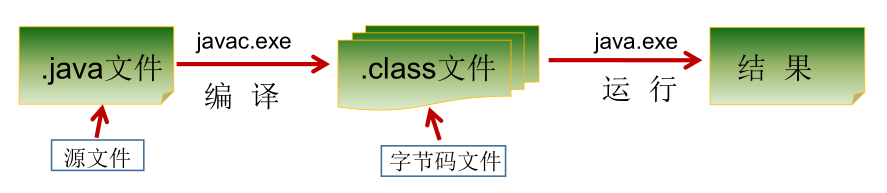
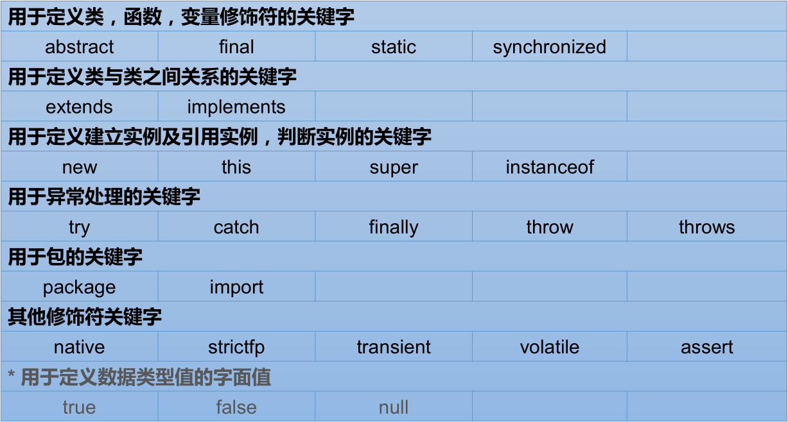
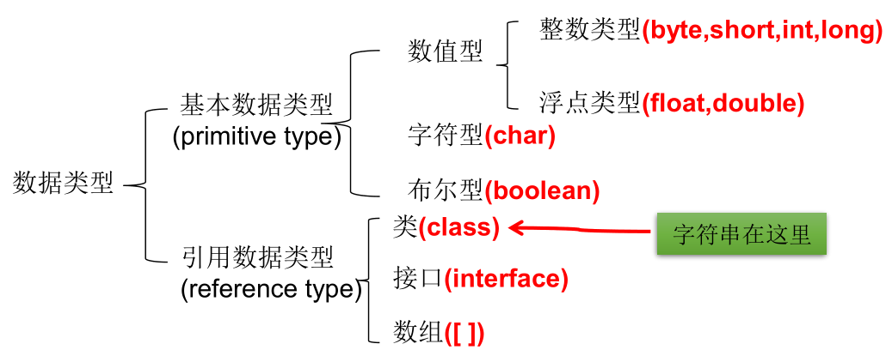
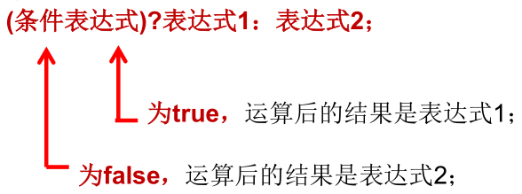
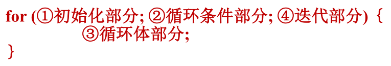

> *`Author: ACatSmiling`*
>
> *`Since: 2024-09-30`*

## bit 和 byte

计算机本质是一系列的电路开关。每个开关存在两种状态：开（on）和关（off）。如果电路是开的，它的值是 1，如果电路是关的，它的值是 0。

- 一个 0 或者一个 1 存储为一个`比特（bit）`，是计算机中**最小的存储单位**。

- 计算机中**最基本的存储单元**是`字节（byte）`，`每个字节由 8 个比特构成`。

计算机的存储能力是以字节来衡量的。如下：

- 千字节（kilobyte，KB）= 1024 B


- 兆字节（megabyte，MB）= 1024 KB


- 千兆字节（gigabyte，GB）= 1024 MB


- 万亿字节（terabyte，TB）= 1024 GB


## JDK、JRE 和 JVM


- JDK = JRE + 开发工具集（例如 Javac 编译工具等）。

- JRE = JVM + Java SE 标准类库。

## 阶段



**`编写`**：编写的 Java 代码保存在以`.java`为结尾的源文件中。

- 在一个 Java 源文件中，可以声明多个 class 类，但是，只能最多有`一个`类声明为 public。而且，声明为 public 的类名，必须与源文件名相同。

**`编译`**：使用 javac.exe 命令编译 Java 源文件。格式：`javac 源文件名.java`。

- 编译之后，会生成一个或多个以`.class`结尾的字节码文件，字节码文件的文件名与 Java 源文件中的类名相同，二者是一一对应的。

**`运行`**：使用 java.exe 命令解释运行字节码文件。格式：`java 类名`。

- 运行的字节码文件，需要有入口函数`main()`方法，且书写格式是固定的。

> **编译完源文件后，生成一个或多个字节码文件。然后运行时，使用 JVM 中的类的加载器和解释器，对生成的字节码文件进行解释运行。即：此时，需要将字节码文件对应的类加载到内存中，这个过程涉及到内存解析。**

## 注释

单行注释：`// 注释文字`

多行注释：` /* 注释文字 */`

文档注释：`/** 注释文字 */`

- 对于单行注释和多行注释，被注释的文字，不会被 JVM 解释执行；

- 多行注释里面不允许有多行注释嵌套；

- 文档注释内容可以被 JDK 提供的工具`javadoc`所解析，生成一套以网页文件形式体现该程序的说明文档。

## 关键字和保留字

### 关键字（key word）

定义：被 Java 语言赋予了特殊含义，用做专门用途的字符串（单词）。

特点：关键字中所有字母都为小写。

官方地址：https://docs.oracle.com/javase/tutorial/java/nutsandbolts/_keywords.html




### 保留字（reserved word）

现有 Java 版本尚未使用，但以后版本可能会作为关键字使用。自己命名标识符时要避免使用这些保留字：`goto` 、`const`。

## 标识符

Java 对各种变量、方法和类等要素命名时使用的字符序列称为`标识符`。

- 技巧：凡是自己可以起名字的地方都叫标识符。

定义合法标识符规则：

- 由 26 个英文字母大小写，数字 0 - 9，_ 或 $ 组成。

- 不可以数字开头。

- 不可以使用关键字和保留字，但能包含关键字和保留字。

- Java 中严格区分大小写，长度无限制。

- 标识符不能包含空格。

- 如果不遵守以上规则，编译不通过。

名称命名规范：

- 包名：多单词组成时所有字母都小写，如 xxxyyyzzz。
- 类名、接口名：多单词组成时，所有单词的首字母大写，如 XxxYyyZzz。
- 变量名、方法名：多单词组成时，第一个单词首字母小写，第二个单词开始每个单词首字母大写：xxxYyyZzz。
- 常量名：所有字母都大写。多单词时每个单词用下划线连接：XXX_YYY_ZZZ。

- 在命名时，为了提高阅读性，要尽量有意义，做到见名知意。

- Java 采用 Unicode 字符集，因此标识符也可以使用汉字声明，但是不建议使用。 

## 变量

### 定义

变量是内存中的一个存储区域，该区域的数据可以在同一类型范围内不断变化。

```java
public class VariableTest{
    public static void main(String[] args){
        // 变量的定义
        int myAge = 12;
        // 变量的使用
        System.out.println(myAge);
        
        // 编译错误: 使用myNumber之前未定义myNumber
        // System.out.println(myNumber);
        
        // 变量的定义
        int myNumber;
        
        // 编译错误: 使用myNumber之前未赋值myNumber
        // System.out.println(myNumber);
        
        // 变量的赋值
        myNumber = 1001;
        
        // 变量的使用
        System.out.println(myNumber);
    }
}
```

- 变量是程序中最基本的存储单元，包含变量类型、变量名和存储的值。
- Java 中每个变量必须先声明，后使用，使用变量名来访问这块区域的数据。
- 变量的作用域：其定义所在的一对`{}`内，变量只有在其作用域内才有效，在同一个作用域内，不能定义重名的变量。

### 按数据类型分类

Java 是`强类型语言`，对于每一种数据都定义了明确的具体数据类型，并在内存中分配了不同大小的内存空间。



#### 基本数据类型

| 类型    | 占有存储空间                       |
| ------- | ---------------------------------- |
| byte    | 1 字节，8 位                       |
| short   | 2 字节，16 位                      |
| int     | 4 字节，32 位                      |
| long    | 8 字节，64 位                      |
| float   | 4 字节，32 位                      |
| double  | 8 字节，64 位                      |
| char    | 2 字节，16 位                      |
| boolean | 未明确指定，取决于虚拟机的实现方式 |

##### 整数类型


- Java 各整数类型有固定的表数范围和字段长度，不受具体 OS 的影响，以保证 Java 程序的可移植性。


- `Java 的整型常量默认为 int 型`，声明 long 型常量须后加 'l' 或 'L'。Java 程序中整形变量通常声明为 int 型，除非不足以表示较大的数，才使用 long。

##### 浮点类型


- 与整数类型类似，Java 浮点类型也有固定的表数范围和字段长度，不受具体操作系统的影响。

- float：单精度，尾数可以精确到 7 位有效数字。很多情况下，精度很难满足需求。

- double：双精度，精度是 float 的两倍。通常采用此类型。

- `Java 的浮点型常量默认为 double 型`，声明 float 型常量，须后加 'f' 或 'F'。

##### 字符类型

char 型数据用来表示通常意义上的 "字符"，**占用 2 个字节**。char 类型是可以进行运算的，因为它都对应有 Unicode 码。

Java 中的所有字符都使用 Unicode 编码，故一个字符可以存储一个字母，一个汉字，或其他书面语的一个字符。

字符型变量的三种表现形式：

- 字符常量是用单引号括起来的单个字符。例如：`char c1 = 'a'; char c2= '中'; char c3 = '9';`。

- Java 中还允许使用转义字符`\`来将其后的字符转变为特殊字符型常量。例如：`char c3 = '\n'; // '\n'表示换行符`。常用的转义字符如下：


- 直接使用 Unicode 值来表示字符型常量：'\uXXXX'。其中，XXXX 代表一个十六进制整数。如：\u000a 表示 \n。

##### 布尔类型

boolean 类型用来判断逻辑条件，一般用于程序流程控制。

**boolean 类型数据只允许取值 true 和 false，无 null。**

> Java 虚拟机中没有任何供 boolean 值专用的字节码指令，Java 语言表达所操作的 boolean 值，在编译之后都使用 Java 虚拟机中的 int 数据类型来代替：true 用 1 表示，false 用 0 表示。———《Java 虚拟机规范 8 版》
>
> Java 规范中，没有明确指出 boolean 的大小。在《Java 虚拟机规范》给出了单个 boolean 占 4 个字节，和 boolean 数组 1 个字节的定义，具体还要看虚拟机实现是否按照规范来，所以 1 个字节、4 个字节都是有可能的，具体参考 https://cloud.tencent.com/developer/article/1552613。

##### 基本数据类型之间的转换

`自动类型转换`：不同数据类型的变量做运算时，容量小的数据类型自动转换为容量大的数据类型。数据类型按容量大小排序为：


- 此处的容量大小，指的是该数据类型表示数的范围的大和小。

- 有多种类型的数据混合运算时，系统首先自动将所有数据转换成容量最大的那种数据类型，然后再进行计算。

- byte，short 和 char 之间不会相互转换，他们三者在计算时首先转换为 int 类型。

- boolean 类型不能与其它数据类型运算。

- 当把任何基本数据类型的值和字符串（String）进行连接运算时（+），基本数据类型的值将自动转化为字符串（String）类型。

`强制类型转换`：自动类型转换的逆过程，将容量大的数据类型转换为容量小的数据类型。使用时要加上强制转换符`()`，但可能造成精度降低或溢出。

- 通常，字符串不能直接转换为基本类型，但通过基本类型对应的包装类，可以实现把字符串转换成基本类型。如：`String a = "43"; int i = Integer.parseInt(a);`。 

- boolean 类型不可以转换为其它的数据类型。

#### 引用数据类型

##### String

String 不是基本数据类型，属于引用数据类型（class）。使用方式与基本数据类型一致，例如：`String str = "abcd";`。

一个字符串可以串接另一个字符串，也可以直接串接其他类型的数据。例如：`str = str + "xyz"; int n = 100; str = str + n;`。

> String 与 8 种基本数据类型做运算时，只能是连接运算。

### 按声明位置分类


- `成员变量`：在方法体外部，类体内部声明的变量。

- `局部变量`：在方法体内部声明的变量。
- 成员变量和局部变量在初始化值方面的异同：
  - 相同点：都有生命周期。
  - 不同点：局部变量除形参外，需显式初始化。

## 进制

对于整数，有四种表示方式：

- `二进制 (binary)`：0 - 1，满 2 进 1，以 0b 或 0B 开头表示。

- `十进制 (decimal)`：0 - 9，满 10 进 1。

- `八进制 (octal)`：0 - 7，满 8 进 1，以数字 0 开头表示。

- `十六进制 (hex)`：0 - 9 及 A - F，满 16 进 1，以 0x 或 0X 开头表示。此处的 A - F 不区分大小写。如：0x21AF + 1 = 0X21B0。


> 在计算机底层，所有数字都以`二进制`形式存在。

### 二进制

Java 整数常量默认是 int 类型，当用二进制定义整数时，其`第 32 位是符号位`；当是 long 类型时，二进制默认占 64 位，其`第 64 位是符号位`。

二进制的整数有如下三种形式：

- `原码`：直接将一个数值换成二进制数，最高位是符号位。
- 负数的`反码`：是对原码按位取反，但最高位（符号位）不变，确定为 1。
- 负数的`补码`：其反码加 1。


>正数的原码、反码、补码都相同。

**计算机以`二进制补码`的形式保存所有的整数。**

原码到补码的转换：


### 不同进制间转换

十进制转二进制：除 2 取余的逆。   


二进制和八进制、十六进制转换：


## 运算符

`运算符`是一种特殊的符号，用以表示数据的运算、赋值和比较等。

### 算术运算符


- 如果对负数取模，可以把模数负号忽略不记，如：5 % -2 = 1。 如果被模数是负数，则不可忽略，如：-5 % 2 = -1。此外，取模运算的结果不一定总是整数。

- 对于除号 "/"，它的整数除和小数除是有区别的：整数之间做除法时，只保留整数部分而舍弃小数部分。 例如：`int x = 3510; x = x / 1000 * 1000;`，x 的结果是 3000。

- "+" 除字符串相加功能外，还能把非字符串转换成字符串。例如：`System.out.println("5 + 5 = " + 5 + 5); `，打印结果是：5 + 5 = 55 。

### 赋值运算符

符号：=。当 "=" 两侧数据类型不一致时，可以使用自动类型转换或使用强制类型转换原则进行处理。支持连续赋值。

扩展赋值运算符： +=，-=，*=，/=，%=。这几个赋值运算符不会改变变量本身的数据类型。

```java
int i = 1;
i *= 0.1;
System.out.println(i);// 0
i++;
System.out.println(i);// 1
```

```java
int m = 2;
int n = 3;
n *= m++;// n = n * m++;
System.out.println("m = " + m);// 3
System.out.println("n = " + n);// 6
```

```java
int n = 10;
n += (n++) + (++n);// n = n + (n++) + (++n); → n = 10 + 10 + 12;
System.out.println(n);// 32
```

### 比较运算符/关系运算符


- 比较运算符的结果都是 boolean 型。

### 逻辑运算符

&：逻辑与，|：逻辑或，!：逻辑非。
&&：短路与，||：短路或，^：逻辑异或。


- 逻辑运算符用于连接布尔型表达式，在 Java 中不可以写成 3 < x < 6，应该写成 x > 3 & x < 6。

- **"&" 和 "&&" 的区别：& 表示，左边无论真假，右边都进行运算；&& 表示，如果左边为真，右边参与运算，如果左边为假，右边不参与运算。**

- **"|" 和 "||" 的区别同理：| 表示，左边无论真假，右边都进行运算；|| 表示，如果左边为假，右边参与运算，如果左边为真，右边不参与运算。**

- 异或（^）与或（|）的不同之处是：当左右都为 true 时，结果为 false。即：异或，追求的是异!

```java
int x = 1;
int y = 1;
if (x++ == 2 & ++y == 2) {
    x = 7;
}
System.out.println("x = " + x + ", y = " + y);// x = 2, y = 2

x = 1;
y = 1;
if (x++ == 2 && ++y == 2) {
    x = 7;
}
System.out.println("x = " + x + ", y = " + y);// x = 2, y = 1

x = 1;
y = 1;
if (x++ == 1 | ++y == 1) {
    x = 7;
}
System.out.println("x = " + x + ", y = " + y);// x = 7, y = 2

x = 1;
y = 1;
if (x++ == 1 || ++y == 1) {
    x = 7;
}
System.out.println("x = " + x + ", y = " + y);// x = 7, y = 1
```

```java
boolean x = true;
boolean y = false;
short z = 42;
if ((z++ == 42) && (y = true)) {
    z++;
}
if ((x = false) || (++z == 45)) {
    z++;
}
System.out.println("z = " + z);// z = 46
```

### 位运算符


- 无 <<< 运算符。

- **位运算是直接对整数的二进制进行的运算。**

  

  

  

- << ：在一定范围内，每向左移一位，相当于乘以 2。

- \>>：在一定范围内，每向右移一位，相当于除以2。

- 面试题：最高效的计算 2 * 8。利用：2 << 3，或者 8 << 1。

交换两个数：

```java
int num1 = 10;
int num2 = 20;
System.out.println(num1 + ", " + num2);

// 方式一
int temp;
temp = num1;
num1 = num2;
num2 = temp;
System.out.println(num1 + ", " + num2);

// 方式二
num1 = 10;
num2 = 20;
num1 = num1 + num2;
num2 = num1 - num2;
num1 = num1 - num2;
System.out.println(num1 + ", " + num2);

// 方式三
num1 = 10;
num2 = 20;
num1 = num1 ^ num2;
num2 = num1 ^ num2;
num1 = num1 ^ num2;
System.out.println(num1 + ", " + num2);

// 方式四
num1 = 10;
num2 = 20;
num1 = num1 << 1;// 10 乘 2
num2 = num2 >> 1;// 20 除 2
System.out.println(num1 + ", " + num2);
```

### 三元运算符

格式：



- **表达式 1 和表达式 2 要求类型是一致的，因为要与接受的参数类型相同。**

凡是可以使用三元运算符的地方，都可以改写为 if-else 结构，反之，不成立。如果既可以使用三元运算符，又可以使用 if-else 结构，优先使用三元运算符，因为更简洁、效率更高。

三元运算符与 if-else 的联系与区别：

- 三元运算符可简化 if-else 语句。
- 三元运算符要求必须返回一个结果。
- if 后的代码块可有多个语句。

### 运算符的优先级


- 运算符有不同的优先级，所谓优先级就是表达式运算中的运算顺序。如上表，上一行运算符总优先于下一行。
- 只有单目运算符、三元运算符、赋值运算符是从右向左运算的。

## 程序流程控制

流程控制语句是用来控制程序中各语句执行顺序的语句，可以把语句组合成能完成一定功能的小逻辑模块。

流程控制方式采用结构化程序设计中规定的三种基本流程结构，即：

- `顺序结构`：程序从上到下逐行地执行，中间没有任何判断和跳转。
- `分支结构`：根据条件，选择性地执行某段代码。有`if-else`和`switch-case`两种分支语句。
- `循环结构`：根据循环条件，重复性的执行某段代码。有`while`、`do-while`、`for`三种循环语句。


> 注：JDK 1.5 提供了 foreach 循环，方便遍历集合、数组元素。

### if-else 结构


### switch-case 结构


- switch（表达式）中表达式的值，必须是下述几种类型之一：**byte，short，char，int，枚举类（JDK 5.0），String 类（JDK 7.0）。**
- case 子句中的值**必须是常量**，不能是变量名或不确定的表达式值。
- 同一个 switch 语句，所有 case 子句中的常量值互不相同。
- break 语句用来在执行完一个 case 分支后使程序跳出 switch 语句块；如果没有 break，程序会顺序执行到 switch 结尾。
- default 子句是可任选的。同时，位置也是灵活的。当没有匹配的 case 时，执行 default。
- 如果多个 case 的执行语句相同，则可以将其合并。
- 同等情况下，switch-case 结构比 if-else 结构的效率稍高。

```java
Scanner scanner = new Scanner(System.in);
int num = scanner.nextInt();
switch (num) {
    case 0:
        System.out.println(0);
    case 1:
        System.out.println(1);
    case 2:
        System.out.println(2);
    default:
        System.out.println("other");
}
```

添加 break 和不添加 break 的结果是不同的。

```java
Scanner scanner = new Scanner(System.in);
int num = scanner.nextInt();
switch (num) {
    case 0:
        System.out.println(0);
        break;
    case 1:
        System.out.println(1);
        break;
    case 2:
        System.out.println(2);
        break;
    default:
        System.out.println("other");
        break;// default位于最后, 此break可以不添加
}
```

键盘输入一个月份和天数，判断其是一年中的第几天：

```java
public static void main(String[] args) {
    Scanner scanner = new Scanner(System.in);
    System.out.println("请输入month：");
    int month = scanner.nextInt();
    System.out.println("请输入day：");
    int day = scanner.nextInt();
    int sumDays = 0;

    switch (month) {
        case 12:
            sumDays += 30;
        case 11:
            sumDays += 31;
        case 10:
            sumDays += 30;
        case 9:
            sumDays += 31;
        case 8:
            sumDays += 31;
        case 7:
            sumDays += 30;
        case 6:
            sumDays += 31;
        case 5:
            sumDays += 30;
        case 4:
            sumDays += 31;
        case 3:
            sumDays += 28;
        case 2:
            sumDays += 31;
        case 1:
            sumDays += day;
    }

    System.out.println(month + "月" + day + "日，是当年的第" + sumDays + "天。");
}
```

键盘输入一个年份、月份和天数，判断其是该年中的第几天：

```java
public static void main(String[] args) {
    Scanner scanner = new Scanner(System.in);
    System.out.println("请输入year：");
    int year = scanner.nextInt();
    System.out.println("请输入month：");
    int month = scanner.nextInt();
    System.out.println("请输入day：");
    int day = scanner.nextInt();
    int sumDays = 0;

    switch (month) {
        case 12:
            sumDays += 30;
        case 11:
            sumDays += 31;
        case 10:
            sumDays += 30;
        case 9:
            sumDays += 31;
        case 8:
            sumDays += 31;
        case 7:
            sumDays += 30;
        case 6:
            sumDays += 31;
        case 5:
            sumDays += 30;
        case 4:
            sumDays += 31;
        case 3:
            if ((year % 4 == 0 && year % 100 != 0) ||
                    year % 400 == 0) {
                sumDays += 29;// 闰年2月29天
            } else {
                sumDays += 28;// 平年2月28天
            }
        case 2:
            sumDays += 31;
        case 1:
            sumDays += day;
    }

    System.out.println(year + "年" + month + "月" + day + "日，是当年的第" + sumDays + "天。");
}
```

> 判断一年是否是闰年的标准：
>
> 1）可以被 4 整除，但不可被 100 整除。
>
> 或
>
> 2）可以被 400 整除。

### for 循环

语法格式：



执行过程：① - ② - ③ - ④ - ② - ③ - ④ - ② - ③ - ④ - ...... - ②

说明：

- ② 循环条件部分为 boolean 类型表达式，当值为 false 时，退出循环。
- ① 初始化部分可以声明多个变量，但必须是同一个类型，用逗号分隔。
- ④ 迭代部分可以有多个变量更新，用逗号分隔。

键盘输入两个正整数，求他们的最大公约数和最小公倍数：

```java
public static void main(String[] args) {
    Scanner scanner = new Scanner(System.in);
    System.out.println("请输入第一个正整数：");
    int firstNum = scanner.nextInt();
    System.out.println("请输入第二个正整数：");
    int secondNum = scanner.nextInt();
    int min = Math.min(firstNum, secondNum);
    int max = Math.max(firstNum, secondNum);

    // 最大公约数
    for (int i = min; i >= 1; i--) {
        if (firstNum % i == 0 && secondNum % i == 0) {
            System.out.println(firstNum + "和" + secondNum + "的最大公约数为：" + i);
            break;
        }
    }

    // 最小公倍数
    for (int i = max; i <= firstNum * secondNum; i++) {
        if (i % firstNum == 0 && i % secondNum == 0) {
            System.out.println(firstNum + "和" + secondNum + "的最小公倍数为：" + i);
            break;
        }
    }
}

请输入第一个正整数：
12
请输入第二个正整数：
20
12和20的最大公约数为：4
12和20的最小公倍数为：60
```

### while 循环

语法格式：


执行过程：① - ② - ③ - ④ - ② - ③ - ④ - ② - ③ - ④ - ...... - ②

说明：

- 注意不要忘记声明 ④ 迭代部分。否则，循环将不能结束，变成死循环。
- for 循环和 while 循环可以相互转换。

### do-while 循环

语法格式：


执行过程：① - **③ - ④** - ② - ③ - ④ - ② - ③ - ④ - ② - ③ - ④ - ...... - ②

说明：

- do-while 循环至少执行一次循环体 。

### 嵌套循环

将一个循环放在另一个循环体内，就形成了嵌套循环。其中，for，while，do-while 均可以作为外层循环或内层循环。

实质上，嵌套循环就是把内层循环当成外层循环的循环体。当只有内层循环的循环条件为 false 时，才会完全跳出内层循环，才可结束外层的当次循环，开始下一次的循环。

假设外层循环次数为 m 次，内层为 n 次，则内层循环体实际上需要执行 m * n 次。

九九乘法表：

```java
public static void main(String[] args) {
    for (int i = 1; i <= 9; i++) {
        for (int j = 1; j <= i; j++) {
            System.out.print(j + " * " + i + " = " + (j * i) + "\t");
        }
        System.out.println();
    }
}

1 * 1 = 1	
1 * 2 = 2	2 * 2 = 4	
1 * 3 = 3	2 * 3 = 6	3 * 3 = 9	
1 * 4 = 4	2 * 4 = 8	3 * 4 = 12	4 * 4 = 16	
1 * 5 = 5	2 * 5 = 10	3 * 5 = 15	4 * 5 = 20	5 * 5 = 25	
1 * 6 = 6	2 * 6 = 12	3 * 6 = 18	4 * 6 = 24	5 * 6 = 30	6 * 6 = 36	
1 * 7 = 7	2 * 7 = 14	3 * 7 = 21	4 * 7 = 28	5 * 7 = 35	6 * 7 = 42	7 * 7 = 49	
1 * 8 = 8	2 * 8 = 16	3 * 8 = 24	4 * 8 = 32	5 * 8 = 40	6 * 8 = 48	7 * 8 = 56	8 * 8 = 64	
1 * 9 = 9	2 * 9 = 18	3 * 9 = 27	4 * 9 = 36	5 * 9 = 45	6 * 9 = 54	7 * 9 = 63	8 * 9 = 72	9 * 9 = 81	
```

10000 以内所有的质数：

```java
// 方式一
public static void main(String[] args) {
    // 质数: 素数, 只能被1和它本身整除的自然数, 2是最小的质数
    int count = 0;
    boolean ifFlag = true;
    for (int i = 2; i <= 100000; i++) {
        // 优化一: 使用Math.sqrt(i)代替i, 减少循环的次数
        // i除以一个从2开始的小数, 会得到一个从i-1开始的大数, 因此, 除以2开始的小数与除以从i-1开始的大数, 
        // 可以省略一个, 以减少次数, 这样计算的中点是i开方的值
        for (int j = 2; j <= Math.sqrt(i); j++) {
            if (i % j == 0) {
                ifFlag = false;
                // 优化二: 使用break, 跳出不必要的循环
                break;
            }
        }
        if (ifFlag) {
            // 优化三: 不打印, i越大, 打印的耗时越长
            // System.out.println("质数：" + i);
            count++;
        }
        // 重置
        ifFlag = true;
    }
    System.out.println("质数的个数有：" + count);// 质数的个数有: 9592
}
```

```java
// 方式二
public static void main(String[] args) {
    // 质数: 素数, 只能被1和它本身整除的自然数, 2是最小的质数
    int count = 0;
    label:
    for (int i = 2; i <= 100000; i++) {
        // 优化一: 使用Math.sqrt(i)代替i, 减少循环的次数
        // i除以一个从2开始的小数, 会得到一个从i-1开始的大数, 因此, 除以2开始的小数与除以从i-1开始的大数, 
        // 可以省略一个, 以减少次数, 这样计算的中点是i开方的值
        for (int j = 2; j <= Math.sqrt(i); j++) {
            if (i % j == 0) {
                continue label;
            }
        }
        count++;
    }
    System.out.println("质数的个数有：" + count);// 质数的个数有: 9592
}
```

### break 和 continue

- break 使用在 switch-case 结构或者循环结构中。

- continue 只能使用在循环结构中。

- **break 语句用于终止某个语句块的执行，跳出当前循环，continue 语句用于跳过其所在循环语句块的当次执行，继续下一次循环。**

  ```java
  public static void main(String[] args) {
      for (int i = 1; i <= 10; i++) {
          if (i % 4 == 0) {
              break;// 输出结果: 1 2 3
              continue;// 输出结果: 1 2 3 5 6 7 9 10
          }
          System.out.print(i + "\t");
      }
  }
  ```

- break 语句出现在多层嵌套的语句块中时，可以通过标签指明要终止的是哪一层语句块（默认跳出包裹 break 最近的一层循环）：


- continue 语句出现在多层嵌套的循环语句体中时，可以通过标签指明要跳过的是哪一层循环（默认跳出包裹 continue 最近的一层循环）。

  ```java
  public static void main(String[] args) {
      label:
      for (int i = 1; i <= 4; i++) {
          for (int j = 1; j <= 10; j++) {
              if (j % 4 == 0) {
                  break label;// 结束指定标识label层的当前循环
                  continue label;// 结束指定标识label层的当次循环
              }
              System.out.print(j);
          }
          System.out.println();
      }
  }
  break label输出结果：
  123
  continue label输出结果：
  123123123123
  ```

- break 和 continue 关键字后面不能直接声明执行语句。

## 原文链接

https://github.com/ACatSmiling/zero-to-zero/blob/main/JavaLanguage/java.md