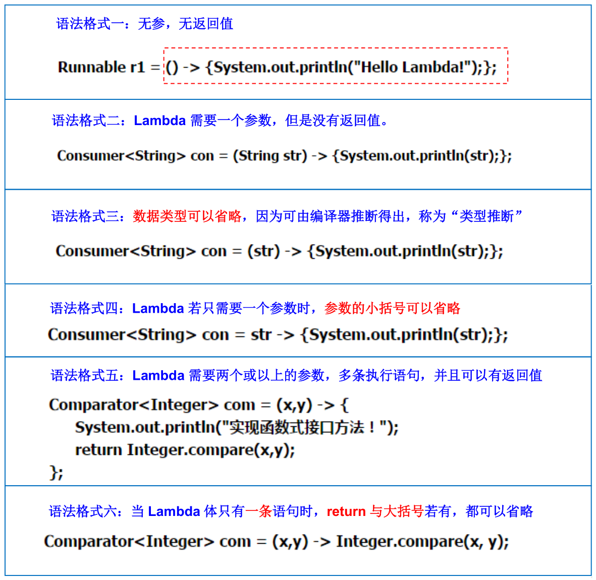
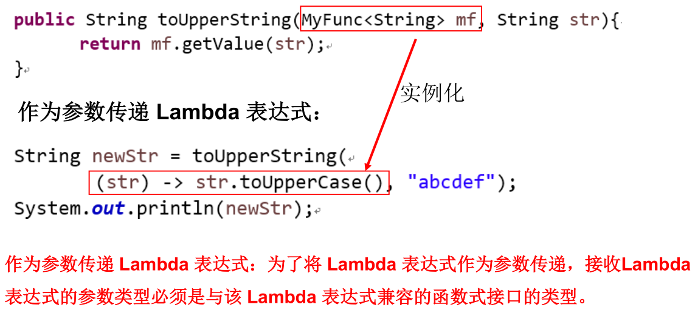
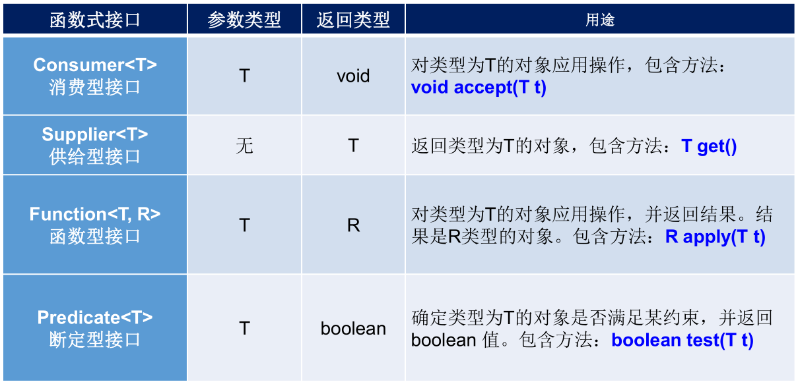
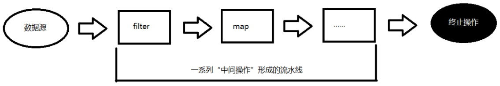

>*`Author: ACatSmiling`*
>
>*`Since: 2024-10-01`*

## Lambda 表达式

**`Lambda 是一个匿名函数`**，我们可以把 Lambda 表达式理解为是一段可以传递的代码（将代码像数据一样进行传递）。使用它可以写出更简洁、更灵活的代码。作为一种更紧凑的代码风格，使 Java 的语言表达能力得到了提升。

Lambda 表达式：在 Java 8 语言中引入的一种新的语法元素和操作符。`这个操作符为 "->"，该操作符被称为 Lambda 操作符或箭头操作符。`它将 Lambda 分为两个部分：

- **左侧**：指定了 Lambda 表达式需要的参数列表。
- **右侧**：指定了 **Lambda 体**，是抽象方法的实现逻辑，也即 Lambda 表达式要执行的功能。

语法格式：



**`类型推断`**：上述 Lambda 表达式中的参数类型都是由编译器推断得出的。Lambda 表达式中无需指定类型，程序依然可以编译，这是因为 javac 根据程序的上下文，在后台推断出了参数的类型。Lambda 表达式的类型依赖于上下文环境，是由编译器推断出来的。这就是所谓的类型推断。

```java
public class LambdaTest {
    // 语法格式三：数据类型可以省略，因为可由编译器推断得出，称为 "类型推断"
    @Test
    public void test3() {
        Consumer<String> con1 = (String s) -> {
            System.out.println(s);
        };
        con1.accept("一个是听的人当真了，一个是说的人当真了");

        System.out.println("*******************");

        Consumer<String> con2 = (s) -> {
            System.out.println(s);
        };
        con2.accept("一个是听的人当真了，一个是说的人当真了");
    }

    @Test
    public void test4() {
        ArrayList<String> list = new ArrayList<>();// 类型推断，ArrayList<String> list = new ArrayList<String>();

        int[] arr = {1, 2, 3};// 类型推断，int[] arr = new int[]{1, 2, 3};
    }
}
```

Lambda 示例：

```java
/**
 * Lambda 表达式的使用
 *
 * 1. 举例：(o1,o2) -> Integer.compare(o1,o2);
 * 2. 格式：
 *      ->: lambda 操作符或箭头操作符
 *      ->左边：lambda 形参列表（其实就是接口中的抽象方法的形参列表）
 *      ->右边：lambda 体（其实就是重写的抽象方法的方法体）
 *
 * 3. Lambda 表达式的使用：（分为 6 种情况介绍）
 *
 *    总结：
 *    ->左边：lambda 形参列表的参数类型可以省略(类型推断)；如果 lambda 形参列表只有一个参数，其一对 () 也可以省略，其他情况不能省略
 *    ->右边：lambda 体应该使用一对 {} 包裹；如果 lambda 体只有一条执行语句（也可能是 return 语句），省略这一对 {} 和 return 关键字
 *
 * 4. Lambda表达式的本质：作为函数式接口的实例
 *
 * 5. 如果一个接口中，只声明了一个抽象方法，则此接口就称为函数式接口。我们可以在一个接口上使用 @FunctionalInterface 注解，这样做可以检查它是否是一个函数式接口
 *
 * 6. 所有以前用匿名实现类表示的现在都可以用 Lambda 表达式来写
 */
public class LambdaTest {
    // 语法格式一：无参，无返回值
    @Test
    public void test1() {
        Runnable r1 = new Runnable() {
            @Override
            public void run() {
                System.out.println("我爱北京天安门");
            }
        };
        r1.run();

        System.out.println("***********************");

        Runnable r2 = () -> {
            System.out.println("我爱北京故宫");
        }
        r2.run();
    }

    // 语法格式二：Lambda 需要一个参数，但是没有返回值
    @Test
    public void test2() {
        Consumer<String> con = new Consumer<String>() {
            @Override
            public void accept(String s) {
                System.out.println(s);
            }
        };
        con.accept("谎言和誓言的区别是什么？");

        System.out.println("*******************");

        Consumer<String> con1 = (String s) -> {
            System.out.println(s);
        }
        con1.accept("一个是听的人当真了，一个是说的人当真了");
    }

    // 语法格式三：数据类型可以省略，因为可由编译器推断得出，称为 "类型推断"
    @Test
    public void test3() {
        Consumer<String> con1 = (String s) -> {
            System.out.println(s);
        };
        con1.accept("一个是听的人当真了，一个是说的人当真了");

        System.out.println("*******************");

        Consumer<String> con2 = (s) -> {
            System.out.println(s);
        };
        con2.accept("一个是听的人当真了，一个是说的人当真了");
    }

    // 语法格式四：Lambda 若只需要一个参数时，参数的小括号可以省略
    @Test
    public void test4() {
        Consumer<String> con1 = (s) -> {
            System.out.println(s);
        };
        con1.accept("一个是听的人当真了，一个是说的人当真了");

        System.out.println("*******************");

        Consumer<String> con2 = s -> {
            System.out.println(s);
        };
        con2.accept("一个是听的人当真了，一个是说的人当真了");
    }

    // 语法格式五：Lambda 需要两个或以上的参数，多条执行语句，并且可以有返回值
    @Test
    public void test5() {
        Comparator<Integer> com1 = new Comparator<Integer>() {
            @Override
            public int compare(Integer o1, Integer o2) {
                System.out.println(o1);
                System.out.println(o2);
                return o1.compareTo(o2);
            }
        };
        System.out.println(com1.compare(12, 21));

        System.out.println("*****************************");

        Comparator<Integer> com2 = (o1, o2) -> {
            System.out.println(o1);
            System.out.println(o2);
            return o1.compareTo(o2);
        };
        System.out.println(com2.compare(12, 6));
    }

    // 语法格式六：当 Lambda 体只有一条语句时，return 与大括号若有，都可以省略
    @Test
    public void test6() {
        Comparator<Integer> com1 = (o1, o2) -> {
            return o1.compareTo(o2);
        };
        System.out.println(com1.compare(12, 6));

        System.out.println("*****************************");

        Comparator<Integer> com2 = (o1, o2) -> o1.compareTo(o2);
        System.out.println(com2.compare(12, 21));
    }

    @Test
    public void test7() {
        Consumer<String> con1 = s -> {
            System.out.println(s);
        };
        con1.accept("一个是听的人当真了，一个是说的人当真了");

        System.out.println("*****************************");

        Consumer<String> con2 = s -> System.out.println(s);
        con2.accept("一个是听的人当真了，一个是说的人当真了");
    }
}
```

## 函数式（Functional）接口

什么是`函数式（Functional）接口`：

- **`只包含一个抽象方法的接口，称为函数式接口。`**
- 你可以通过 Lambda 表达式来创建该接口的对象。（若 Lambda 表达式抛出一个受检异常（即：非运行时异常），那么该异常需要在目标接口的抽象方法上进行声明。）
- 我们可以在一个接口上使用**`@FunctionalInterface`**注解，这样做可以检查它是否是一个函数式接口。同时 javadoc 也会包含一条声明，说明这个接口是一个函数式接口。
- **在`java.util.function`包下定义了 Java 8 的丰富的函数式接口。**

如何理解函数式接口：

- Java 从诞生日起就是一直倡导 "一切皆对象"，在 Java 里面面向对象（OOP）编程是一切。但是随着 Python、Scala 等语言的兴起和新技术的挑战，Java 不得不做出调整以便支持更加广泛的技术要求，也即`Java 不但可以支持 OOP，还可以支持 OOF（面向函数编程）`。
- 在函数式编程语言当中，函数被当做一等公民对待。在将函数作为一等公民的编程语言中，Lambda 表达式的类型是函数。但是在 Java 8 中，有所不同。在 Java 8 中，Lambda 表达式是对象，而不是函数，它们必须依附于一类特别的对象类型——函数式接口。
- 简单的说，在 Java 8 中，**Lambda 表达式就是一个函数式接口的实例。**这就是 Lambda 表达式和函数式接口的关系。也就是说，只要一个对象是函数式接口的实例，那么该对象就可以用 Lambda 表达式来表示。
- **所有以前用匿名实现类表示的现在都可以用 Lambda 表达式来写。**

函数式接口举例：

```java
@FunctionalInterface // 接口上添加 @FunctionalInterface 注解
public interface Runnable {
    /**
     * When an object implementing interface {@code Runnable} is used
     * to create a thread, starting the thread causes the object's
     * {@code run} method to be called in that separately executing
     * thread.
     * <p>
     * The general contract of the method {@code run} is that it may
     * take any action whatsoever.
     *
     * @see     java.lang.Thread#run()
     */
    public abstract void run(); // 接口中只有一个抽象方法
}
```

自定义函数式接口：

- 函数式接口中不使用泛型：

  ```java
  @FunctionalInterface
  public interface MyNumber {
      double getValue();
  }
  ```

- 函数式接口中使用泛型：

  ```java
  @FunctionalInterface
  public interface MyNumber<T> {
      T getValue(T t);
  }
  ```

`作为参数传递 Lambda 表达式`：



Java 内置四大核心函数式接口：



其他接口：


示例：

```java
/**
 * Java 内置的 4 大核心函数式接口：
 *
 * 消费型接口 Consumer<T>     void accept(T t)
 * 供给型接口 Supplier<T>     T get()
 * 函数型接口 Function<T,R>   R apply(T t)
 * 断定型接口 Predicate<T>    boolean test(T t)
 */
public class LambdaTest {
    // 作为参数传递 Lambda 表达式
    // happyTime()：将参数 1 传给函数式接口 con，Consumer 函数式接口包含唯一方法 accept()
    public void happyTime(double money, Consumer<Double> con) {
        con.accept(money);
    }

    @Test
    public void test1() {
        happyTime(500, new Consumer<Double>() {
            @Override
            public void accept(Double aDouble) {// 重写 accept()
                System.out.println("学习太累了，去天上人间买了瓶矿泉水，价格为：" + aDouble);
            }
        });

        System.out.println("********************");

        happyTime(400, money -> System.out.println("学习太累了，去天上人间喝了口水，价格为：" + money));
    }

    // filterString()：根据给定的规则，过滤集合中的字符串。此规则由 Predicate 的方法决定
    // Predicate 函数式接口包含唯一方法 test()
    public List<String> filterString(List<String> list, Predicate<String> pre) {
        ArrayList<String> filterList = new ArrayList<>();
        // 过滤 list 中的每一个元素，通过 Predicate 实例 test() 验证的，添加到 filterList 中并返回
        for (String s : list) {
            if (pre.test(s)) {
                filterList.add(s);
            }
        }
        return filterList;
    }

    @Test
    public void test2() {
        List<String> list = Arrays.asList("北京", "南京", "天津", "东京", "西京", "普京");

        List<String> filterStrs = filterString(list, new Predicate<String>() {
            @Override
            public boolean test(String s) {// 重写 test()
                return s.contains("京");
            }
        });
        System.out.println(filterStrs);

        System.out.println("********************");

        List<String> filterStrs1 = filterString(list, s -> s.contains("京"));
        System.out.println(filterStrs1);
    }
}
```

> 关于面向函数编程的精髓，可以从以下链接中体会：https://blog.csdn.net/qq_27416233/article/details/83418791

## 方法引用

**当要传递给 Lambda 体的操作，已经有实现的方法了，可以使用`方法引用（Method References）`！**

方法引用可以看做是 Lambda 表达式深层次的表达。换句话说，**方法引用就是 Lambda 表达式，也就是函数式接口的一个实例，通过方法的名字来指向一个方法，可以认为是 Lambda 表达式的一个`语法糖`。**

格式：使用操作符**`::`**将类（或对象）与方法名分隔开来。

方法引用有如下三种主要使用情况：

- **`对象::实例方法名`**
- **`类::静态方法名`**
- **`类::实例方法`**

要求：

- 针对情况一和情况二：**实现接口的抽象方法的参数列表和返回值类型，必须与方法引用的方法的参数列表和返回值类型保持一致！**
- 针对情况三：**`ClassName::methodName`**，当函数式接口方法的第一个参数是方法引用的方法的调用者，并且第二个参数是方法引用的方法的参数（或无参数/返回值类型）时使用。

示例：

```java
public class Employee {

    private int id;
    private String name;
    private int age;
    private double salary;

    public int getId() {
        return id;
    }

    public void setId(int id) {
        this.id = id;
    }

    public String getName() {
        return name;
    }

    public void setName(String name) {
        this.name = name;
    }

    public int getAge() {
        return age;
    }

    public void setAge(int age) {
        this.age = age;
    }

    public double getSalary() {
        return salary;
    }

    public void setSalary(double salary) {
        this.salary = salary;
    }

    public Employee() {
        System.out.println("Employee().....");
    }

    public Employee(int id) {
        this.id = id;
        System.out.println("Employee(int id).....");
    }

    public Employee(int id, String name) {
        this.id = id;
        this.name = name;
    }

    public Employee(int id, String name, int age, double salary) {
        this.id = id;
        this.name = name;
        this.age = age;
        this.salary = salary;
    }

    @Override
    public String toString() {
        return "Employee{" + "id=" + id + ", name='" + name + '\'' + ", age=" + age + ", salary=" + salary + '}';
    }

    @Override
    public boolean equals(Object o) {
        if (this == o)
            return true;
        if (o == null || getClass() != o.getClass())
            return false;

        Employee employee = (Employee) o;

        if (id != employee.id)
            return false;
        if (age != employee.age)
            return false;
        if (Double.compare(employee.salary, salary) != 0)
            return false;
        return name != null ? name.equals(employee.name) : employee.name == null;
    }

    @Override
    public int hashCode() {
        int result;
        long temp;
        result = id;
        result = 31 * result + (name != null ? name.hashCode() : 0);
        result = 31 * result + age;
        temp = Double.doubleToLongBits(salary);
        result = 31 * result + (int) (temp ^ (temp >>> 32));
        return result;
    }
}
```

```java
/**
 * 方法引用的使用
 *
 * 1. 使用情境：当要传递给 Lambda 体的操作，已经有实现的方法了，可以使用方法引用！
 *
 * 2. 方法引用，本质上就是 Lambda 表达式，而 Lambda 表达式作为函数式接口的实例。所以方法引用，也是函数式接口的实例。
 *
 * 3. 使用格式：  类(或对象)::方法名
 *
 * 4. 具体分为如下的三种情况：
 *    情况 1     对象::非静态方法
 *    情况 2     类::静态方法
 *
 *    情况 3     类::非静态方法
 *
 * 5. 方法引用使用的要求：要求接口中的抽象方法的形参列表和返回值类型与方法引用的方法的形参列表和返回值类型相同！（针对于情况 1 和情况 2）
 */
public class MethodRefTest {
    // 情况一：对象::实例方法
    // Consumer 中的 void accept(T t)
    // PrintStream 中的 void println(T t)
    @Test
    public void test1() {
        // System.out.println(str) 这个方法体，在 PrintStream 中已经存在实现的方法
        Consumer<String> con1 = str -> System.out.println(str);
        con1.accept("北京");

        System.out.println("*******************");

        PrintStream ps = System.out;// 利用 System.out 的对象，调用其 println() 方法
        Consumer<String> con2 = ps::println;
        con2.accept("beijing");
    }

    // Supplier 中的 T get()
    // Employee 中的 String getName()
    @Test
    public void test2() {
        Employee emp = new Employee(1001, "Tom", 23, 5600);

        // emp.getName() 这个方法体，对应的就是 emp 对象的 getName() 方法
        Supplier<String> sup1 = () -> emp.getName();
        System.out.println(sup1.get());// 返回 emp 对象的 name

        System.out.println("*******************");

        Supplier<String> sup2 = emp::getName;
        System.out.println(sup2.get());
    }

    // 情况二：类::静态方法
    // Comparator 中的 int compare(T t1,T t2)
    // Integer 中的 int compare(T t1,T t2)
    @Test
    public void test3() {
        Comparator<Integer> com1 = (t1, t2) -> Integer.compare(t1, t2);
        System.out.println(com1.compare(12, 21));

        System.out.println("*******************");

        Comparator<Integer> com2 = Integer::compare;
        System.out.println(com2.compare(12, 3));
    }

    // Function 中的 R apply(T t)
    // Math 中的 Long round(Double d)
    @Test
    public void test4() {
        Function<Double, Long> func = new Function<Double, Long>() {
            @Override
            public Long apply(Double d) {
                return Math.round(d);
            }
        };

        System.out.println("*******************");

        Function<Double, Long> func1 = d -> Math.round(d);// lambda 表达式
        System.out.println(func1.apply(12.3));

        System.out.println("*******************");

        Function<Double, Long> func2 = Math::round;// 方法引用
        System.out.println(func2.apply(12.6));
    }

    // 情况三：类::实例方法
    // Comparator 中的 int comapre(T t1,T t2)
    // String 中的 int t1.compareTo(t2)
    @Test
    public void test5() {
        Comparator<String> com1 = (s1, s2) -> s1.compareTo(s2);
        System.out.println(com1.compare("abc", "abd"));

        System.out.println("*******************");

        Comparator<String> com2 = String::compareTo;
        System.out.println(com2.compare("abd", "abm"));
    }

    // BiPredicate 中的 boolean test(T t1, T t2);
    // String 中的 boolean t1.equals(t2)
    @Test
    public void test6() {
        // 原始写法
        BiPredicate<String, String> pre = new BiPredicate<String, String>() {
            @Override
            public boolean test(String s1, String s2) {
                return s1.equals(s2);
            }
        };
        System.out.println(pre.test("abc", "abc"));

        System.out.println("*******************");

        // lambda 表达式：lambda 体是参数 1 调用一个方法，参数 2 是那个方法的入参
        BiPredicate<String, String> pre1 = (s1, s2) -> s1.equals(s2);
        System.out.println(pre1.test("abc", "abc"));

        System.out.println("*******************");

        // 方法引用：String 类的 equals() 符合上述 lambda 体的功能
        BiPredicate<String, String> pre2 = String::equals;
        System.out.println(pre2.test("abc", "abd"));
    }

    // Function 中的 R apply(T t)
    // Employee 中的 String getName();
    @Test
    public void test7() {
        Employee employee = new Employee(1001, "Jerry", 23, 6000);

        // 原始写法：lambda 体是参数 1 调用一个方法，返回一个参数 2 类型的值
        Function<Employee, String> func = new Function<Employee, String>() {
            @Override
            public String apply(Employee employee) {
                return employee.getName();
            }
        };

        System.out.println("*******************");

        // lambda 表达式：Employee 类的 getName() 符合上述 lambda 体的功能
        Function<Employee, String> func1 = e -> e.getName();
        System.out.println(func1.apply(employee));

        System.out.println("*******************");

        // 方法引用
        Function<Employee, String> func2 = Employee::getName;
        System.out.println(func2.apply(employee));
    }
}
```

## 构造器引用

格式：**`ClassName::new`**。

与函数式接口相结合，自动与函数式接口中方法兼容。可以把构造器引用赋值给定义的方法，**要求构造器参数列表要与接口中抽象方法的参数列表一致，且方法的返回值即为构造器对应类的对象。**

示例：

```java
/**
 * 一、构造器引用
 *      和方法引用类似，函数式接口的抽象方法的形参列表和构造器的形参列表一致。
 *      抽象方法的返回值类型即为构造器所属的类的类型
 */
public class ConstructorRefTest {
    // 构造器引用
    // Supplier 中的 T get()
    // Employee 的空参构造器：Employee()
    @Test
    public void test1() {
        // 原始写法
        Supplier<Employee> sup = new Supplier<Employee>() {
            @Override
            public Employee get() {
                return new Employee();
            }
        };
        System.out.println(sup.get());

        System.out.println("*******************");

        // Lambda 表达式
        Supplier<Employee> sup1 = () -> new Employee();
        System.out.println(sup1.get());

        System.out.println("*******************");

        // 方法引用：Employee 的无参构造器符合上述 Lambda 体
        Supplier<Employee> sup2 = Employee::new;
        System.out.println(sup2.get());
    }

    // Function 中的 R apply(T t)
    @Test
    public void test2() {
        // 原始写法
        Function<Integer, Employee> func = new Function<Integer, Employee>() {
            @Override
            public Employee apply(Integer id) {
                return new Employee(id);
            }
        };
        Employee employee = func.apply(1000);
        System.out.println(employee);

        System.out.println("*******************");

        // Lambda 表达式
        Function<Integer, Employee> func1 = id -> new Employee(id);
        Employee employee1 = func1.apply(1001);
        System.out.println(employee1);

        System.out.println("*******************");

        // 方法引用：Employee 的带 id 的有参构造器符合上述 Lambda 体
        Function<Integer, Employee> func2 = Employee::new;
        Employee employee2 = func2.apply(1002);
        System.out.println(employee2);
    }

    // BiFunction 中的 R apply(T t,U u)
    @Test
    public void test3() {
        // 原始写法
        BiFunction<Integer, String, Employee> func = new BiFunction<Integer, String, Employee>() {
            @Override
            public Employee apply(Integer id, String name) {
                return new Employee(id, name);
            }
        };
        System.out.println(func.apply(1000, "Tom"));

        System.out.println("*******************");

        // Lambda 表达式
        BiFunction<Integer, String, Employee> func1 = (id, name) -> new Employee(id, name);
        System.out.println(func1.apply(1001, "Tom"));

        System.out.println("*******************");

        // 方法引用：Employee 的带 id 和 name 的有参构造器符合上述 Lambda 体
        BiFunction<Integer, String, Employee> func2 = Employee::new;
        System.out.println(func2.apply(1002, "Tom"));
    }
}
```

## 数组引用

格式：**`type[]::new`**。

可以把数组看做是一个特殊的类，则写法与构造器引用一致。

示例：

```java
/**
 * 二、数组引用
 *     大家可以把数组看做是一个特殊的类，则写法与构造器引用一致。
 */
public class ConstructorRefTest {
    // 数组引用
    // Function 中的 R apply(T t)
    @Test
    public void test4() {
        // 原始写法
        Function<Integer, String[]> func = new Function<Integer, String[]>() {
            @Override
            public String[] apply(Integer length) {
                return new String[length];
            }
        };
        String[] arr = func.apply(1);
        System.out.println(Arrays.toString(arr));

        System.out.println("*******************");

        // Lambda 表达式
        Function<Integer, String[]> func1 = length -> new String[length];
        String[] arr1 = func1.apply(5);
        System.out.println(Arrays.toString(arr1));

        System.out.println("*******************");

        // 方法引用
        Function<Integer, String[]> func2 = String[]::new;
        String[] arr2 = func2.apply(10);
        System.out.println(Arrays.toString(arr2));
    }
}
```

## Optional 类

到目前为止，臭名昭著的空指针异常是导致 Java 应用程序失败的最常见原因。以前，为了解决空指针异常，Google 公司著名的 Guava 项目引入了 Optional 类，Guava 通过使用检查空值的方式来防止代码污染，它鼓励程序员写更干净的代码。受到 Google Guava 的启发，Optional 类已经成为 Java 8 类库的一部分。

**`Optional<T>`类（`java.util.Optional`）是一个容器类，它可以保存类型 T 的值，代表这个值存在。或者仅仅保存 null，表示这个值不存在。原来用 null 表示一个值不存在，现在 Optional 可以更好的表达这个概念。并且可以避免空指针异常。**

- Optional 类的 Javadoc 描述如下：这是一个可以为 null 的容器对象。如果值存在则`isPresent()`会返回 true，调用`get()`会返回该对象。

- Optional 类提供了很多有用的方法，这样我们就不用显式进行空值检测。

创建 Optional 类对象的方法：

- **`Optional.of(T t)`**：创建一个 Optional 实例，t 必须非空。否则，报 NullPointerException。

  ```java
  public class OptionalTest {
      @Test
      public void test() {
          Optional<Employee> opt = Optional.of(new Employee("张三", 8888));
          // 判断 opt 中员工对象是否满足条件，如果满足就保留，否则返回空
          Optional<Employee> emp = opt.filter(e -> e.getSalary() > 10000);
          System.out.println(emp);
      }
  }
  ```

  ```java
  public class OptionalTest {
      @Test
      public void test() {
          Optional<Employee> opt = Optional.of(new Employee("张三", 8888));
          // 如果 opt 中员工对象不为空，就涨薪 10%
          Optional<Employee> emp = opt.map(e ->
          {
              e.setSalary(e.getSalary() % 1.1);
              return e;
          });
          System.out.println(emp);
      }
  }
  ```

- `Optional.empty()`：创建一个空的 Optional 实例。

- **`Optional.ofNullable(T t)`**：创建一个 Optional 实例，t 可以为 null。

判断 Optional 容器中是否包含对象：

- **`boolean isPresent()`**：判断是否包含对象。

- `void ifPresent(Consumer<? super T> consumer)`：如果有值，就执行 Consumer 接口的实现代码，并且该值会作为参数传给它。

  ```java
  public class OptionalTest {
      @Test
      public void test() {
          Boy b = new Boy("张三");
          Optional<Girl> opt = Optional.ofNullable(b.getGrilFriend());
          // 如果女朋友存在就打印女朋友的信息
          opt.ifPresent(System.out::println);
      }
  }
  ```

获取 Optional 容器的对象：

- **`T get()`**：如果调用对象包含值，返回该值，否则抛异常。可以对应于`Optional.of(T t)`一起使用。

- **`T orElse(T other)`**：如果有值则将其返回，否则返回指定的 other 对象。可以对应于`Optional.ofNullable(T t)`一起使用。

  ```java
  public class OptionalTest {
      @Test
      public void test() {
          Boy b = new Boy("张三");
          Optional<Girl> opt = Optional.ofNullable(b.getGrilFriend());
          // 如果有女朋友就返回他的女朋友，否则只能欣赏 "嫦娥" 了
          Girl girl = opt.orElse(new Girl("嫦娥"));
          System.out.println("他的女朋友是：" + girl.getName());
      }
  }
  ```

- `T orElseGet(Supplier<? extends T> other)`：如果有值则将其返回，否则返回由 Supplier 接口实现提供的对象。

- `T orElseThrow(Supplier<? extends X> exceptionSupplier)`：如果有值则将其返回，否则抛出由 Supplier 接口实现提供的异常。

示例：

```java
public class Boy {
    private Girl girl;

    public Girl getGirl() {
        return girl;
    }

    public void setGirl(Girl girl) {
        this.girl = girl;
    }

    public Boy() {
    }

    public Boy(Girl girl) {
        this.girl = girl;
    }

    @Override
    public String toString() {
        return "Boy{" +
                "girl=" + girl +
                '}';
    }
}
```

```java
public class Girl {
    private String name;

    public String getName() {
        return name;
    }

    public void setName(String name) {
        this.name = name;
    }

    public Girl() {
    }

    public Girl(String name) {
        this.name = name;
    }

    @Override
    public String toString() {
        return "Girl{" +
                "name='" + name + '\'' +
                '}';
    }
}
```

```java
/**
 * Optional 类：为了在程序中避免出现空指针异常而创建的。
 *
 * 常用的方法：ofNullable(T t)
 *           orElse(T t)
 */
public class OptionalTest {
    /*
    Optional.of(T t)：创建一个 Optional 实例，t 必须非空。否则，报 NullPointerException
    Optional.empty()：创建一个空的 Optional 实例
    Optional.ofNullable(T t)：t 可以为 null
     */
    @Test
    public void test1() {
        Girl girl = new Girl();
        // girl = null;

        // of(T t)：保证 t 是非空的
        Optional<Girl> optionalGirl = Optional.of(girl);
    }

    @Test
    public void test2() {
        Girl girl = new Girl();
        // girl = null;

        // ofNullable(T t)：t 可以为 null
        Optional<Girl> optionalGirl = Optional.ofNullable(girl);
        System.out.println(optionalGirl);

        // orElse(T t1)：如果当前的 Optional 内部封装的 t 是非空的，则返回内部的 t。
        //                  如果内部的 t 是空的，则返回 orElse() 方法中的参数 t1。
        Girl girl1 = optionalGirl.orElse(new Girl("赵"));
        System.out.println(girl1);
    }

    @Test
    public void test3() {
        Boy boy = new Boy();
        boy = null;
        String girlName = getGirlName(boy);
        // String girlName = getGirlName1(boy);// 不会出现 NullPointerException
        System.out.println(girlName);
    }

    @Test
    public void test4() {
        Boy boy = null;
        boy = new Boy();
        boy = new Boy(new Girl("苍"));
        String girlName = getGirlName2(boy);
        System.out.println(girlName);
    }


    // 未优化代码，容易出现 NullPointerException
    public String getGirlName(Boy boy) {
        return boy.getGirl().getName();
    }

    // 优化以后的 getGirlName()
    public String getGirlName1(Boy boy) {
        if (boy != null) {
            Girl girl = boy.getGirl();
            if (girl != null) {
                return girl.getName();
            }
        }
        return null;
    }

    // 使用 Optional 类优化的 getGirlName()
    public String getGirlName2(Boy boy) {
        // boy 可能为空
        Optional<Boy> boyOptional = Optional.ofNullable(boy);
        // 此时的 boy1 一定非空
        Boy boy1 = boyOptional.orElse(new Boy(new Girl("迪")));

        // girl 可能为空
        Girl girl = boy1.getGirl();
        Optional<Girl> girlOptional = Optional.ofNullable(girl);
        // 此时的 girl1 一定非空
        Girl girl1 = girlOptional.orElse(new Girl("古"));
        return girl1.getName();
    }
}
```

## Stream API

Java 8 中有两大最为重要的改变。第一个是`Lambda 表达式`；另外一个则是`Stream API`。

Stream API（`java.util.stream`）把真正的函数式编程风格引入到 Java 中。这是目前为止对 Java 类库最好的补充，因为 Stream API 可以极大提供 Java 程序员的生产力，让程序员写出高效率、干净、简洁的代码。

Stream 是 Java 8 中处理集合的关键抽象概念，它可以指定你希望对集合进行的操作，可以执行非常复杂的查找、过滤和映射数据等操作。 使用 Stream API 对集合数据进行操作，就类似于使用 SQL 执行的数据库查询。也可以使用 Stream API 来并行执行操作。简言之，Stream API 提供了一种高效且易于使用的处理数据的方式。

为什么要使用 Stream API：

- 实际开发中，项目中多数数据源都来自于 MySQL，Oracle 等。但现在数据源可以更多了，有 MongDB，Redis 等，而这些 NoSQL 的数据就需要 Java 层面去处理。
- **Stream 和 Collection 集合的区别：Collection 是一种静态的内存数据结构，而 Stream 是有关计算的。`Collection 主要面向内存`，存储在内存中，`Stream 主要面向 CPU`，通过 CPU 实现计算。**

**Stream 就是一个数据渠道，用于操作数据源（集合、数组等）所生成的元素序列。"集合讲的是数据，Stream 讲的是计算！"**

**Stream 的特性：**

- **Stream 自己不会存储元素。**
- **Stream 不会改变源对象。相反，它们会返回一个持有结果的新 Stream。**
- **Stream 操作是延迟执行的。这意味着它们会等到需要结果的时候才执行。**

Stream 操作的三个步骤：



- **`1 - 创建 Stream`**
  - 一个数据源（如：集合、数组），获取一个流。
- **`2 - 中间操作`**
  - 一个中间操作链，对数据源的数据进行处理。
- **`3 - 终止操作（操作）`**
  - 一旦执行终止操作，就执行中间操作链，并产生结果。之后，不会再被使用。

### Stream 的创建

**步骤一：Stream 的四种创建方式。**

- 方式一：通过`集合`。

  - Java 8 中的 Collection 接口被扩展，提供了两个获取流的方法：
    - **`default Stream<E> stream()`**：返回一个顺序流。
    - **`default Stream<E> parallelStream()`**：返回一个并行流。

- 方式二：通过`数组`。

  - Java 8 中的 Arrays 类的静态方法`stream()`可以获取数组流：
    - **`static <T> Stream<T> stream(T[] array)`**：返回一个特殊对象数组的流。
  - 重载形式，能够处理对应基本类型的数组：
    - `public static IntStream stream(int[] array)`：返回一个 int 数组的流。
    - `public static LongStream stream(long[] array)`：返回一个 long 数组的流。
    - `public static DoubleStream stream(double[] array)`：返回一个 double 数组的流。

- 方式三：通过 Stream 类的`of()`。

  - 可以调用 Stream 类静态方法`of()`，通过显示值创建一个流。它可以接收任意数量的参数。
    - **`public static<T> Stream<T> of(T... values)`**：返回一个流。

- 方式四：创建`无限流`。

  - 可以使用静态方法`Stream.iterate()`和`Stream.generate()`这两种方式，创建无限流。
    - 迭代：`public static<T> Stream<T> iterate(final T seed, final UnaryOperator<T> f)`
    - 生成：`public static<T> Stream<T> generate(Supplier<T> s)`

示例：

```java
/**
 * 提供用于测试的数据
 */
public class EmployeeData {
    public static List<Employee> getEmployees() {
        List<Employee> list = new ArrayList<>();
        list.add(new Employee(1001, "马1", 34, 6000.38));
        list.add(new Employee(1002, "马2", 12, 9876.12));
        list.add(new Employee(1003, "刘", 33, 3000.82));
        list.add(new Employee(1004, "雷", 26, 7657.37));
        list.add(new Employee(1005, "李", 65, 5555.32));
        list.add(new Employee(1006, "比", 42, 9500.43));
        list.add(new Employee(1007, "任", 26, 4333.32));
        return list;
    }
}
```

```java
/**
 * 1. Stream 关注的是对数据的运算，与 CPU 打交道
 *    集合关注的是数据的存储，与内存打交道
 *
 * 2.
 * 	① Stream 自己不会存储元素
 * 	② Stream 不会改变源对象。相反，它们会返回一个持有结果的新 Stream
 * 	③ Stream 操作是延迟执行的。这意味着它们会等到需要结果的时候才执行
 *
 * 3. Stream 执行流程
 * 	① Stream 的实例化
 * 	② 一系列的中间操作（过滤、映射、...）
 * 	③ 终止操作
 *
 * 4. 说明：
 * 4.1 一个中间操作链，对数据源的数据进行处理
 * 4.2 一旦执行终止操作，就执行中间操作链，并产生结果。之后，不会再被使用
 *
 */
public class StreamAPITest {
    // 创建 Stream 方式一：通过集合
    @Test
    public void test1() {
        List<Employee> employees = EmployeeData.getEmployees();

        // 方法一：
        // default Stream<E> stream()：返回一个顺序流
        Stream<Employee> stream = employees.stream();

        // 方法二：
        // default Stream<E> parallelStream()：返回一个并行流
        Stream<Employee> parallelStream = employees.parallelStream();
    }

    // 创建 Stream 方式二：通过数组
    @Test
    public void test2() {
        int[] arr = new int[]{1, 2, 3, 4, 5, 6};

        // 调用 Arrays 类的 static <T> Stream<T> stream(T[] array)：返回一个流
        IntStream stream = Arrays.stream(arr);

        Employee e1 = new Employee(1001, "Tom");
        Employee e2 = new Employee(1002, "Jerry");
        Employee[] arr1 = new Employee[]{e1, e2};
        Stream<Employee> stream1 = Arrays.stream(arr1);
    }

    // 创建 Stream 方式三：通过 Stream 的 of()
    @Test
    public void test3() {
        Stream<Integer> stream = Stream.of(1, 2, 3, 4, 5, 6);

        Stream<String> stringStream = Stream.of("A", "B", "C", "D", "E", "F");
    }

    // 创建 Stream 方式四：创建无限流 --- 用的比较少
    @Test
    public void test4() {
        // 迭代
        // public static<T > Stream < T > iterate( final T seed, final UnaryOperator<T> f)
        // 遍历前 10 个偶数
        Stream.iterate(0, t -> t + 2).limit(10).forEach(System.out::println);// 从 0 开始，后一个数是前一个数 +2

        // 生成
        // public static<T> Stream<T> generate(Supplier<T> s)
        // 遍历前 10 个随机数
        Stream.generate(Math::random).limit(10).forEach(System.out::println);
    }
}
```

### Stream 的中间操作

**步骤二：Stream 的中间操作。**

- **多个中间操作可以连接起来形成一个流水线，`除非流水线上触发终止操作，否则中间操作不会执行任何的处理`！而在终止操作时一次性全部处理，这称为`惰性求值`。**

####  筛选与切片

| 方法                                     | 描述                                                         |
| ---------------------------------------- | ------------------------------------------------------------ |
| `filter(Predicate<? super T> predicate)` | 过滤，接收 Lambda，从流中排除某些元素                        |
| distinct()                               | 去重，根据流所生成元素的 hashCode() 和 equals() 去除重复元素 |
| limit(long maxSize)                      | 截断流，使其元素不超过给定数量 maxSize                       |
| skip(long n)                             | 跳过元素，返回一个扔掉了前 n 个元素的流，若流中的元素不足 n 个，则返回一个空流，与 limit(n) 互补 |

示例：

```java
public class StreamAPITest {
    // 1 - 筛选与切片
    @Test
    public void test1() {
        List<Employee> list = EmployeeData.getEmployees();

        // filter(Predicate p) --- 接收Lambda，从流中排除某些元素。
        // 练习：查询员工表中薪资大于7000的员工信息
        list.stream().filter(e -> e.getSalary() > 7000).forEach(System.out::println);

        System.out.println("************************");

        // limit(n) --- 截断流，使其元素不超过给定数量n。
        // 练习：打印员工表中前三名的员工信息
        list.stream().limit(3).forEach(System.out::println);// 前一个流已经关闭，必须重新建一个流

        System.out.println("************************");

        // skip(n) --- 跳过元素，返回一个扔掉了前n个元素的流。若流中元素不足n个，则返回一个空流。与limit(n)互补。
        // 练习：跳过员工表中前三名的员工信息，然后打印之后的每个员工的信息
        list.stream().skip(3).forEach(System.out::println);

        System.out.println("************************");

        // distinct() --- 筛选，通过流所生成元素的hashCode()和equals()去除重复元素
        list.add(new Employee(1010, "刘强东", 40, 8000));
        list.add(new Employee(1010, "刘强东", 41, 8000));
        list.add(new Employee(1010, "刘强东", 40, 8000));
        list.add(new Employee(1010, "刘强东", 40, 8000));
        list.add(new Employee(1010, "刘强东", 40, 8000));
        // System.out.println(list);
        list.stream().distinct().forEach(System.out::println);
    }
}
```

#### 映射

| 方法                                                         | 描述                                                         |
| ------------------------------------------------------------ | ------------------------------------------------------------ |
| `map(Function<? super T, ? extends R> mapper)`               | 接收一个函数作为参数，该函数会被应用到流中每个元素上，并将其映射成一个新的元素 |
| mapToInt(ToIntFunction<? super T> mapper)                    | 接收一个函数作为参数，该函数会被应用到流中每个元素上，并将其映射成一个新的 IntStream |
| mapToLong(ToLongFunction<? super T> mapper)                  | 接收一个函数作为参数，该函数会被应用到流中每个元素上，并将其映射成一个新的 LongStream |
| mapToDouble(ToDoubleFunction<? super T> mapper)              | 接收一个函数作为参数，该函数会被应用到流中每个元素上，并将其映射成一个新的 DoubleSteam |
| `flatMap(Function<? super T, ? extends Stream<? extends R>> mapper)` | 接收一个函数作为参数，将流中的每个元素都换成另一个流，然后把所有流连接成一个新的流 |
| flatMapToInt(Function<? super T, ? extends IntStream> mapper) | 接收一个函数作为参数，将流中的每个元素都换成另一个流，然后把所有流连接成一个新的 IntStream |
| flatMapToLong(Function<? super T, ? extends LongStream> mapper) | 接收一个函数作为参数，将流中的每个元素都换成另一个流，然后把所有流连接成一个新的 LongStream |
| flatMapToDouble(Function<? super T, ? extends DoubleStream> mapper) | 接收一个函数作为参数，将流中的每个元素都换成另一个流，然后把所有流连接成一个新的 DoubleSteam |

**map() VS flatMap()：**

- map() 的主要作用是**将流中的每个元素按照给定的函数进行转换**，然后返回一个包含转换后元素的新流。这个方法不会改变原始流的元素数量，只是对每个元素进行一对一的转换。
- flatMap() 用于**将流中的每个元素转换为一个流，然后将这些流扁平化（即将多个子流中的元素合并到一个流中）**，这个方法在处理包含多个子元素的流（如包含集合的集合的流）时非常有用。

示例：

```java
public class StreamAPITest {
    // 将字符串中的多个字符构成的集合转换为对应的 Stream 的实例
    public static Stream<Character> fromStringToStream(String str) {// 如：aa ---> 返回两个字符 a 组成的集合对应的流
        ArrayList<Character> list = new ArrayList<>();
        for (Character c : str.toCharArray()) {
            list.add(c);
        }
        return list.stream();
    }
    
    // 2-映射
    @Test
    public void test2() {
        // map(Function f) --- 接收一个函数作为参数，将元素转换成其他形式或提取信息，该函数会被应用到每个元素上，并将其映射成一个新的元素
        //      ---> 类似于 List 的 add()：如果流的每个值转换成新流，则将每个新流作为一个元素组成新的流
        //            即类似：[1, [1, 2], 5, [1, 3, 2, 5], 9]

        // 练习 1：将 list 中的每一个元素变成大写并打印
        List<String> list = Arrays.asList("aa", "bb", "cc", "dd");
        // list.stream().map(str -> str.toUpperCase()).forEach(System.out::println);
        list.stream().map(String::toUpperCase).forEach(System.out::println);

        System.out.println();

        // 练习 2：获取员工姓名长度大于 3 的员工的姓名
        List<Employee> employees = EmployeeData.getEmployees();
        Stream<String> namesStream = employees.stream().map(Employee::getName);
        namesStream.filter(name -> name.length() > 3).forEach(System.out::println);

        System.out.println();

        //  练习3：
        Stream<Stream<Character>> streamStream = list.stream().map(StreamAPITest::fromStringToStream);
        // streamStream.forEach(System.out::println);
        // 体会下下面的写法与上面写法的区别
        streamStream.forEach(s -> {
            s.forEach(System.out::println);
        });

        System.out.println("************************");

        // flatMap(Function f) --- 接收一个函数作为参数，将流中的每个值都换成另一个流，然后把所有流连接成一个流
        //      ---> 类似于 List 的 addAll()：如果流的每个值转换成新流，则将每个新流的值组合连接成一个流
        //            即类似：[1, 1, 2, 5, 1, 3, 2, 5, 9]
        Stream<Character> characterStream = list.stream().flatMap(StreamAPITest::fromStringToStream);
        characterStream.forEach(System.out::println);
    }

    // 对比 map() 和 flatmap() 的区别
    @Test
    public void test3() {
        ArrayList list1 = new ArrayList();
        list1.add(1);
        list1.add(2);
        list1.add(3);

        ArrayList list2 = new ArrayList();
        list2.add(4);
        list2.add(5);
        list2.add(6);

        list1.add(list2);// [1, 2, 3, [4, 5, 6]]
        list1.addAll(list2);// [1, 2, 3, 4, 5, 6]
        System.out.println(list1);
    }
}
```

#### 排序

| 方法                                       | 描述                         |
| ------------------------------------------ | ---------------------------- |
| sorted()                                   | 产生一个新流，元素按自然排序 |
| `sorted(Comparator<? super T> comparator)` | 产生一个新流，元素按定制排序 |

示例：

```java
public class StreamAPITest {
    // 3-排序
    @Test
    public void test4() {
        // sorted() --- 自然排序
        List<Integer> list = Arrays.asList(12, 43, 65, 34, 87, 0, -98, 7);
        list.stream().sorted().forEach(System.out::println);
        // 抛异常，原因：Employee 没有实现 Comparable 接口
        // List<Employee> employees = EmployeeData.getEmployees();
        // employees.stream().sorted().forEach(System.out::println);

        // sorted(Comparator com) --- 定制排序
        List<Employee> employees = EmployeeData.getEmployees();
        employees.stream().sorted((e1, e2) -> {
            int ageValue = Integer.compare(e1.getAge(), e2.getAge());// 先按年龄
            if (ageValue != 0) {
                return ageValue;
            } else {
                return -Double.compare(e1.getSalary(), e2.getSalary());// 再按薪水
            }
        }).forEach(System.out::println);
    }
}
```

### Stream 的终止操作

**步骤三：Stream 的终止操作。**

终端操作会从流的流水线生成结果。其结果可以是任何不是流的值，例如：List、Integer，甚至是 void。

**`流进行了终止操作后，不能再次使用。`**

#### 匹配与查找

| 方法                                      | 描述                                                         |
| ----------------------------------------- | ------------------------------------------------------------ |
| anyMatch(Predicate<? super T> predicate)  | 检查是否至少匹配流中的一个元素                               |
| allMatch(Predicate<? super T> predicate)  | 检查是否至少匹配流中的所有元素                               |
| noneMatch(Predicate<? super T> predicate) | 检查是否没有匹配流中的所有元素                               |
| findFirst()                               | 返回流中的第一个元素                                         |
| findAny()                                 | 返回流中的任意一个元素                                       |
| min(Comparator<? super T> comparator)     | 返回流中的最小值                                             |
| max(Comparator<? super T> comparator)     | 返回流中的最大值                                             |
| `count()`                                 | 返回流中元素的总数                                           |
| `forEach(Consumer<? super T> action)`     | 内部迭代（使用 Collection 接口需要用户去做迭代，这叫做外部迭代） |

示例：

```java
public class StreamAPITest {
    // 1-匹配与查找
    @Test
    public void test1() {
        List<Employee> employees = EmployeeData.getEmployees();

        // allMatch(Predicate p) --- 检查是否匹配所有元素
        // 练习：是否所有的员工的年龄都大于 18
        boolean allMatch = employees.stream().allMatch(e -> e.getAge() > 18);
        System.out.println(allMatch);

        // anyMatch(Predicate p) --- 检查是否至少匹配一个元素
        // 练习：是否存在员工的工资大于 10000
        boolean anyMatch = employees.stream().anyMatch(e -> e.getSalary() > 10000);
        System.out.println(anyMatch);

        // noneMatch(Predicate p) ---- 检查是否没有匹配的元素。如果有，返回 false
        // 练习：是否存在员工姓 "雷"
        boolean noneMatch = employees.stream().noneMatch(e -> e.getName().startsWith("雷"));
        System.out.println(noneMatch);

        // findFirst() --- 返回第一个元素
        Optional<Employee> employee = employees.stream().findFirst();
        System.out.println(employee);

        // findAny() --- 返回当前流中的任意元素
        Optional<Employee> employee1 = employees.parallelStream().findAny();
        System.out.println(employee1);
    }

    @Test
    public void test2() {
        List<Employee> employees = EmployeeData.getEmployees();
        // count --- 返回流中元素的总个数
        // 练习：返回工资高于 5000 的员工个数
        long count = employees.stream().filter(e -> e.getSalary() > 5000).count();
        System.out.println(count);

        // max(Comparator c) --- 返回流中最大值
        // 练习：返回最高的工资
        Stream<Double> salaryStream = employees.stream().map(Employee::getSalary);
        Optional<Double> maxSalary = salaryStream.max(Double::compare);
        System.out.println(maxSalary);

        // min(Comparator c) --- 返回流中最小值
        // 练习：返回最低工资的员工
        Optional<Employee> employee = employees.stream().min((e1, e2) -> Double.compare(e1.getSalary(), e2.getSalary()));
        System.out.println(employee);

        System.out.println("************************");

        // forEach(Consumer c) --- 内部迭代
        employees.stream().forEach(System.out::println);
        // 外部迭代
        Iterator<Employee> iterator = employees.iterator();
        while (iterator.hasNext()) {
            System.out.println(iterator.next());
        }
        // 使用集合的遍历操作方法
        employees.forEach(System.out::println);
    }
}
```

#### 归约

| 方法                                              | 描述                                                   |
| ------------------------------------------------- | ------------------------------------------------------ |
| reduce(T identity, BinaryOperator<T> accumulator) | 将流中的元素反复结合起来，得到一个值，返回 T           |
| `reduce(BinaryOperator<T> accumulator)`           | 将流中的元素反复结合起来，得到一个值，返回 Optional<T> |

- map 和 reduce 的连接通常称为`map-reduce`模式，因 Google 用它来进行网络搜索而出名。
- **map 是一对一映射，由 n 到 n；reduce 是多对一归约，由 n 到 1。**

示例：

```java
public class StreamAPITest {
    // 2-归约
    @Test
    public void test3() {
        // reduce(T identity, BinaryOperator) --- 可以将流中元素反复结合起来，得到一个值，返回 T
        // 练习 1：计算1-10的自然数的和
        List<Integer> list = Arrays.asList(1, 2, 3, 4, 5, 6, 7, 8, 9, 10);
        Integer sum = list.stream().reduce(0, Integer::sum);// 有一个初始值，在初始值基础上操作
        System.out.println(sum);

        // reduce(BinaryOperator) --- 可以将流中元素反复结合起来，得到一个值，返回 Optional<T>
        // 练习 2：计算公司所有员工工资的总和
        List<Employee> employees = EmployeeData.getEmployees();
        Stream<Double> salaryStream = employees.stream().map(Employee::getSalary);
        Optional<Double> sumMoney = salaryStream.reduce((d1, d2) -> d1 + d2);
        // Optional<Double> sumMoney = salaryStream.reduce(Double::sum);// 方法引用
        // Double sumMoney = salaryStream.reduce(0.0, Double::sum);// 也可以计算工资总和
        System.out.println(sumMoney.get());
    }
}
```

#### 收集

| 方法                                            | 描述                                                         |
| ----------------------------------------------- | ------------------------------------------------------------ |
| `collect(Collector<? super T, A, R> collector)` | 将流转换为其他形式，接收一个 Collector 接口的实现，用于给 Stream 中元素做汇总的方法 |

- Collector 接口中方法的实现决定了如何对流执行收集的操作，如收集到 List、Set、Map 等。

- `Collectors 实用类`提供了很多静态方法，可以方便地创建常见收集器实例（Collector 实例），具体方法与实例如下表：

  | 方法                                                         | 返回类型              | 描述                                                         | 示例                                                         |
  | ------------------------------------------------------------ | --------------------- | ------------------------------------------------------------ | ------------------------------------------------------------ |
  | `toList()`                                                   | List<T>               | 把流中的元素收集到 List                                      | List<Employee> emps= list.stream().collect(Collectors.toList()); |
  | `toSet()`                                                    | Set<T>                | 把流中的元素收集到 Set                                       | Set<Employee> emps= list.stream().collect(Collectors.toSet()); |
  | `toCollection(Supplier<C> collectionFactory)`                | Collection<T>         | 把流中的元素收集到创建的集合                                 | Collection<Employee> emps= list.stream().collect(Collectors.toCollection(ArrayList::new)); |
  | counting()                                                   | Long                  | 计算流中元素的个数                                           | list.stream().collect(Collectors.counting());                |
  | summingInt(ToIntFunction<? super T> mapper)                  | Integer               | 对流中元素的整数属性求和                                     | list.stream().collect(Collectors.summingInt(Employee::getSalary)); |
  | averagingInt(ToIntFunction<? super T> mapper)                | Double                | 计算流中元素整数属性的平均值                                 | list.stream().collect(Collectors.averagingInt(Employee::getSalary)); |
  | summarizingInt(ToIntFunction<? super T> mapper)              | IntSummaryStatistics  | 收集流中整数属性的统计值，如平均值                           | list.stream().collect(Collectors.summarizingInt(Employee::getSalary)); |
  | `joining()`                                                  | String                | 连接流中的每个字符串                                         | list.stream().map(Employee::getName).collect(Collectors.joining()); |
  | minBy(Comparator<? super T> comparator)                      | Optional<T>           | 根据比较器选择最小值                                         | list.stream().collect(Collectors.minBy(Comparator.comparingInt(Employee::getSalary))); |
  | maxBy(Comparator<? super T> comparator)                      | Optional<T>           | 根据比较器选择最大值                                         | list.stream().collect(Collectors.maxBy(Comparator.comparingInt(Employee::getSalary))); |
  | reducing(BinaryOperator<T> op)                               | 归约产生的类型        | 从一个作为累加器的初始值开始，利用 BinaryOperator 与流中元素逐个结合，从而规约成单个值 | list.stream().collect(Collectors.reducing(0, Employee::getSalary, Integer::sum)); |
  | collectingAndThen(Collector<T,A,R> downstream, Function<R,RR> finisher) | 转换函数返回的类型    | 包裹另一个收集器，对其结果转换函数                           | list.stream().collect(Collectors.collectingAndThen(Collectors.toList(), List::size)); |
  | groupingBy(Function<? super T, ? extends K> classifier)      | Map<K, List<T>>       | 根据某属性值对流分组，属性为 K，结果为 V                     | list.stream().collect(Collectors.groupingBy(Employee::getDepartmentName)); |
  | partitioningBy(Predicate<? super T> predicate)               | Map<Boolean, List<T>> | 根据 true 或 false 进行分区                                  | list.stream().collect(Collectors.partitioningBy(Employee::getStatus)); |

示例：

```java
public class StreamAPITest {
    // 3 - 收集
    @Test
    public void test4() {
        // collect(Collector c) --- 将流转换为其他形式，接收一个 Collector 接口的实现，用于给 Stream 中元素做汇总的方法
        // 练习：查找工资大于 6000 的员工，结果返回为一个 List 或 Set

        List<Employee> employees = EmployeeData.getEmployees();

        // 返回 List
        List<Employee> employeeList = employees.stream().filter(e -> e.getSalary() > 6000).collect(Collectors.toList());
        employeeList.forEach(System.out::println);

        System.out.println("************************");

        // 返回 Set
        Set<Employee> employeeSet = employees.stream().filter(e -> e.getSalary() > 6000).collect(Collectors.toSet());
        employeeSet.forEach(System.out::println);
    }

    // 4 - 将 List 转变为逗号分隔的字符串
    @Test
    public void test5() {
        List<String> list = Arrays.asList("A", "B", "C", "D", "E");

        // String 类的方法，推荐
        String join = String.join(",", list);
        System.out.println(join);

        // Java 8 流式写法
        String collect = list.stream().collect(Collectors.joining(","));
        System.out.println(collect);

        // 常规写法，使用循环遍历添加，此处不表
    }
}
```

## 原文链接

https://github.com/ACatSmiling/zero-to-zero/blob/main/JavaLanguage/java.md