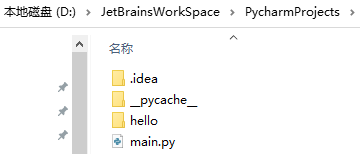
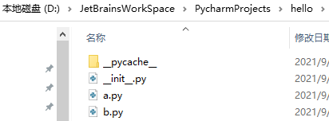

>*`Author: ACatSmiling`*
>
>*`Since: 2024-09-27`*

## 什么是对象

`对象`：是内存中专门用来存储数据的一块区域。

对象中可以存放各种数据，比如：数字、布尔值、代码。

对象由三部分组成：

- 对象的标识（id）
- 对象的类型（type）
- 对象的值（value）

## 面向对象（oop）

Python 是一门面向对象的编程语言。所谓的面向对象的语言，简单理解就是语言中的所有操作都是通过对象来进行的。

- `面向过程的编程的语言`：
  - 面向过程指将我们的程序的逻辑分解为一个一个的步骤，通过对每个步骤的抽象，来完成程序。
  - 例子：孩子上学，可能有以下过程。
    1. 妈妈起床。
    2. 妈妈洗漱。
    3. 妈妈做早饭。
    4. 妈妈叫孩子起床。
    5. 孩子要洗漱。
    6. 孩子吃饭。
    7. 孩子背着书包上学校。
  - 面向过程的编程思想将一个功能分解为一个一个小的步骤，我们通过完成一个一个的小的步骤来完成一个程序。
  - 这种编程方式，符合我们人类的思维，编写起来相对比较简单。
  - 但是这种方式编写代码的往往只适用于一个功能，如果要在实现别的功能，即使功能相差极小，也往往要重新编写代码，所以它可复用性比较低，并且难于维护 。
- `面向对象的编程语言`：
  - 面向对象的编程语言，关注的是对象，而不关注过程。
  - 对于面向对象的语言来说，一切都是对象。
  - 面向对象的编程思想，将所有的功能统一保存到对应的对象中。比如，妈妈的功能保存到妈妈的对象中，孩子的功能保存到孩子对象中，要使用某个功能，直接找到对应的对象即可。
  - 这种方式编写的代码，比较容易阅读，并且比较易于维护，容易复用。
  - 但是这种方式编写，不太符合常规的思维，编写起来稍微麻烦一点。
- 简单归纳一下，面向对象的思想：
  - 第一步：创建对象。
  - 第二步：处理对象。

## 类的简介

我们目前所学习的对象都是 Python 内置的对象，但是内置对象并不能满足所有的需求，所以我们在开发中经常需要自定义一些对象。

**`类`**：简单理解它就相当于一个图纸，在程序中我们需要根据类来创建对象。

- 类就是对象的图纸！

- 我们也称对象是类的`实例（instance）`。

- 如果多个对象是通过一个类创建的，我们称这些对象是一类对象。

- 像 int()，float()，bool()，str()，list()，dict()等，这些都是类。

  - `a = int(10) # 创建一个 int 类的实例` 等价于 `a = 10`。

- 我们自定义的类都需要**使用大写字母开头，使用大驼峰命名法（帕斯卡命名法）来对类命名。**

- 类也是一个对象！

- 类就是一个用来创建对象的对象！

- **类是 type 类型的对象，定义类实际上就是定义了一个 type 类型的对象。**

- 使用类创建对象的流程：

  

  - 第一步：创建一个变量。
  - 第二步：在内存中创建一个新对象。
  - 第三步：将对象的 id 赋值给变量。

语法：

```python
class 类名([父类]):
    代码块
```

- 如果没有父类，() 可以省略。

示例：

```python
a = int(10)  # 创建一个 int 类的实例
b = str('hello')  # 创建一个 str 类的实例
print(a, type(a))  # 10 <class 'int'>
print(b, type(b))  # hello <class 'str'>


# 定义一个简单的类
# 使用 class 关键字来定义类，语法和函数很像！
# class 类名([父类]):
#   代码块
# <class '__main__.MyClass'>
class MyClass():  # 如果没有父类，() 可以省略
    pass


print(MyClass)  # <class '__main__.MyClass'>

# 使用 MyClass 创建一个对象
# 使用类来创建对象，就像调用一个函数一样
mc = MyClass()  # mc 就是通过 MyClass 创建的对象，mc 是 MyClass 的实例
print(mc, type(mc))  # <__main__.MyClass object at 0x000001B009813E50> <class '__main__.MyClass'>
mc_2 = MyClass()
mc_3 = MyClass()
mc_4 = MyClass()
# mc mc_2 mc_3 mc_4 都是 MyClass 的实例，它们都是一类对象
# isinstance() 用来检查一个对象是否是一个类的实例
result = isinstance(mc_2, MyClass)
print(result)  # True
result = isinstance(mc_2, str)
print(result)  # False

# 类是一个 type 类型的对象
print(id(MyClass), type(MyClass))  # 1560257906784 <class 'type'>

# 现在我们通过 MyClass 这个类创建的对象都是一个空对象
# 也就是对象中实际上什么都没有，就相当于是一个空的盒子
# 可以向对象中添加变量，对象中的变量称为属性
# 语法：对象.属性名 = 属性值
mc.name = '孙悟空'
print(mc.name)  # 孙悟空
mc_2.name = '猪八戒'
print(mc_2.name)  # 猪八戒
```

## 类的定义

类和对象都是对现实生活中的事物或程序中的内容的抽象。

实际上所有的事物都由两部分构成：

- 数据（属性）
- 行为（方法）

在类的代码块中，我们可以定义变量和函数：

- **变量会成为该类实例的公共属性**，所有的该类实例都可以通过`对象.属性名`的形式访问。
- **函数会成为该类实例的公共方法**，所有该类实例都可以通过`对象.方法名()`的形式调用方法。

> 注意：**方法调用时，默认第一个参数由解析器自动传递，所以定义方法时，至少要定义一个形参！ 一般我们都会将这个参数命名为 self。**（如果是函数调用，则调用时传几个参数，就会有几个实参）

实例为什么能访问到类中的属性和方法：

- 类中定义的属性和方法都是公共的，任何该类实例都可以访问。
- 属性和方法查找的流程：
  - 当我们调用一个对象的属性时，解析器会先在当前对象中寻找是否含有该属性，如果有，则直接返回当前的对象的属性值；如果没有，则去当前对象的类对象中去寻找，如果有，则返回类对象的属性值，如果类对象中依然没有，则报错！
- 类对象和实例对象中都可以保存属性（方法）：
  - **如果这个属性（方法）是所有的实例共享的，则应该将其保存到类对象中。**
  - **如果这个属性（方法）是某个实例独有，则应该保存到实例对象中。**
  - 比如，Person 类中，name 属性每个对象都不同，应该保存到各个实例对象中，而国籍假设都是中国人，是一样的，则应该保存到类对象中。
  - 一般情况下，属性保存到实例对象中，而方法需要保存到类对象中。

示例：

```python
# 尝试定义一个表示人的类
class Person:
    # 在类的代码块中，我们可以定义变量和函数
    # 在类中我们所定义的变量，将会成为所有的实例的公共属性
    # 所有实例都可以访问这些变量
    name = 'swk'  # 公共属性，所有实例都可以访问

    # 在类中也可以定义函数，类中的定义的函数，我们称为方法
    # 这些方法可以通过该类的所有实例来访问

    def say_hello(self):
        # 方法每次被调用时，解析器都会自动传递第一个实参
        # 第一个参数，就是调用方法的对象本身，
        #   如果是 p1 调的，则第一个参数就是 p1 对象
        #   如果是 p2 调的，则第一个参数就是 p2 对象
        # 一般我们都会将这个参数命名为 self

        # say_hello() 这个方法，可以显示如下格式的数据：
        #   你好！我是 xxx
        #   在方法中不能直接访问类中的属性
        print('你好！我是 %s' % self.name) # 类似Java中的this


# 创建 Person 的实例
p1 = Person()
p2 = Person()

# 调用属性：对象.属性名
print(p1.name)  # swk
print(p2.name)  # swk

# 调用方法：对象.方法名()
# 方法调用和函数调用的区别
#   如果是函数调用，则调用时传几个参数，就会有几个实参
#   但是如果是方法调用，默认传递一个参数，所以方法中至少要定义一个形参
p1.say_hello()  # 你好！我是 swk
p2.say_hello()  # 你好！我是 swk

# 修改p1的name属性
p1.name = '猪八戒'
p2.name = '沙和尚'
print(p1.name)
print(p2.name)
p1.say_hello()  # 你好！我是 猪八戒
p2.say_hello()  # 你好！我是 沙和尚

del p2.name  # 删除 p2 的 name 属性
print(p2.name)  # swk
```

## 对象的初始化

类的基本结构：

```python
class 类名([父类]) :

        公共的属性... 

        # 对象的初始化方法
        def __init__(self, ...):
            ...

        # 其他的方法    
        def method_1(self, ...):
            ...

        def method_2(self, ...):
            ...

        ...
```

创建对象的流程，`p1 = Person()`：

- 第一步：创建一个变量。
- 第二步：在内存中创建一个新对象。
- 第三步：`__init__(self)`方法执行。
- 第四步：将对象的 id 赋值给变量。

示例：

```python
class Person:
    # 在类中可以定义一些特殊方法（魔术方法）
    # 特殊方法都是以 __ 开头，__ 结尾的方法
    # 特殊方法不需要我们自己调用，不要尝试去调用特殊方法
    # 特殊方法将会在特殊的时刻自动调用
    # 学习特殊方法：
    #   1. 特殊方法什么时候调用
    #   2. 特殊方法有什么作用
    # 创建对象的流程
    # p1 = Person() 的运行流程
    #   1. 创建一个变量
    #   2. 在内存中创建一个新对象
    #   3. __init__(self) 方法执行
    #   4. 将对象的 id 赋值给变量

    # init 会在对象创建以后立刻执行
    # init 可以用来向新创建的对象中初始化属性
    # 调用类创建对象时，类后边的所有参数都会依次传递到 init() 中
    def __init__(self, name):
        # print(self)
        # 通过 self 向新建的对象中初始化属性
        self.name = name

    def say_hello(self):
        print('大家好，我是%s' % self.name)


# 目前来讲，对于 Person 类来说 name 是必须的，并且每一个对象中的 name 属性基本上都是不同
# 而我们现在是将 name 属性在定义为对象以后，手动添加到对象中，这种方式很容易出现错误
# 我们希望，在创建对象时，必须设置 name 属性，如果不设置对象将无法创建
#   并且属性的创建应该是自动完成的，而不是在创建对象以后手动完成
# p1 = Person()
# 手动向对象添加 name 属性
# p1.name = '孙悟空'

# p2 = Person()
# p2.name = '猪八戒'

# p3 = Person()
# p3.name = '沙和尚'

# p3.say_hello()

p1 = Person('孙悟空')
p2 = Person('猪八戒')
p3 = Person('沙和尚')
p4 = Person('唐僧')
# p1.__init__() 不要这么做

# print(p1.name)
# print(p2.name)
# print(p3.name)
# print(p4.name)

p4.say_hello()
```

```python
class Dog:
    '''
        表示狗的类
    '''

    def __init__(self, name, age, gender, height):
        self.name = name
        self.age = age
        self.gender = gender
        self.height = height

    def jiao(self):
        '''
            狗叫的方法
        '''
        print('汪汪汪~~~')

    def yao(self):
        '''
            狗咬的方法
        '''
        print('我咬你~~')

    def run(self):
        print('%s 快乐的奔跑着~~' % self.name)


d = Dog('小黑', 8, 'male', 30)
print(d.name, d.age, d.gender, d.height)

# 目前我们可以直接通过 对象.属性 的方式来修改属性的值，这种方式导致对象中的属性可以随意修改
#   非常的不安全，值可以任意修改，不论对错
# 现在我们就需要一种方式来增强数据的安全性
#   1. 属性不能随意修改（我让你改你才能改，不让你改你就不能改）
#   2. 属性不能修改为任意的值（年龄不能是负数）
d.name = '阿黄'
d.age = -10
d.run()

print(d.age)
```

## 封装

```python
# 封装是面向对象的三大特性之一
# 封装指的是隐藏对象中一些不希望被外部所访问到的属性或方法
# 如何隐藏一个对象中的属性？
#   - 将对象的属性名，修改为一个外部不知道的名字
# 如何获取（修改）对象中的属性？
#   - 需要提供一个 getter 和 setter 方法使外部可以访问到属性
#   - getter 获取对象中的指定属性（get_属性名）
#   - setter 用来设置对象的指定属性（set_属性名）
# 使用封装，确实增加了类的定义的复杂程度，但是它也确保了数据的安全性
#   1. 隐藏了属性名，使调用者无法随意的修改对象中的属性
#   2. 增加了 getter 和 setter 方法，很好的控制的属性是否是只读的
#       如果希望属性是只读的，则可以直接去掉 setter 方法
#       如果希望属性不能被外部访问，则可以直接去掉 getter 方法
#   3. 使用 setter 方法设置属性，可以增加数据的验证，确保数据的值是正确的
#   4. 使用 getter 方法获取属性，使用 setter 方法设置属性
#       可以在读取属性和修改属性的同时做一些其他的处理
#   5. 使用 getter 方法可以表示一些计算的属性

class Dog:
    '''
        表示狗的类
    '''

    def __init__(self, name, age):
        self.hidden_name = name
        self.hidden_age = age

    def say_hello(self):
        print('大家好，我是 %s' % self.hidden_name)

    def get_name(self):
        '''
            get_name()用来获取对象的name属性
        '''
        # print('用户读取了属性')
        return self.hidden_name

    def set_name(self, name):
        # print('用户修改了属性')
        self.hidden_name = name

    def get_age(self):
        return self.hidden_age

    def set_age(self, age):
        if age > 0:
            self.hidden_age = age


d = Dog('旺财', 8)

# d.say_hello()

# 调用 setter 来修改 name 属性 
d.set_name('小黑')
d.set_age(-10)

# d.say_hello()
print(d.get_age())
```

```python
class Rectangle:
    '''
        表示矩形的类
    '''

    def __init__(self, width, height):
        self.hidden_width = width
        self.hidden_height = height

    def get_width(self):
        return self.hidden_width

    def get_height(self):
        return self.hidden_height

    def set_width(self, width):
        self.hidden_width = width

    def set_height(self, height):
        self.hidden_height = height

    def get_area(self):
        return self.hidden_width * self.hidden_height


# 测试
r = Rectangle(5, 2)
print(r.get_area())  # 10
r.set_width(10)
r.set_height(20)
print(r.get_area())  # 200


# 可以为对象的属性使用双下划线开头，__xxx
# 双下划线开头的属性，是对象的隐藏属性，隐藏属性只能在类的内部访问，无法通过对象访问
# 其实隐藏属性只不过是 Python 自动为属性改了一个名字
#   实际上是将名字修改为了，_类名__属性名 比如 __name -> _Person__name
class Person:
    def __init__(self, name):
        self.__name = name

    def get_name(self):
        return self.__name

    def set_name(self, name):
        self.__name = name


p = Person('孙悟空')

# print(p.__name)  # __ 开头的属性是隐藏属性，无法通过对象访问
print(p._Person__name)  # 能直接访问，孙悟空
p._Person__name = '猪八戒'
print(p.get_name())  # 也能直接更改，猪八戒


# 上面使用 __ 开头的属性，实际上依然可以在外部访问，所以这种方式我们一般不用
#   一般我们会将一些私有属性（不希望被外部访问的属性）以 _ 开头（实际上也可以直接访问和修改）
#   一般情况下，使用 _ 开头的属性都是私有属性，没有特殊需要不要修改私有属性
class Person:
    def __init__(self, name):
        self._name = name

    def get_name(self):
        return self._name

    def set_name(self, name):
        self._name = name


p = Person('孙悟空')

print(p._name)  # 能直接访问
p._name = '猪八戒'
print(p._name)  # 也能直接修改，猪八戒
```

```python
class Person:
    def __init__(self, name, age):
        self._name = name
        self._age = age

    # property 装饰器，用来将一个 getter 方法，转换为对象的属性
    # 添加为 property 装饰器以后，我们就可以像调用属性一样使用 getter 方法
    # 使用 property 装饰的方法，必须和属性名是一样的
    @property
    def name(self):
        print('get方法执行了~~~')
        return self._name

    # setter 方法的装饰器：@属性名.setter
    @name.setter
    def name(self, name):
        print('setter方法调用了')
        self._name = name

    @property
    def age(self):
        return self._age

    @age.setter
    def age(self, age):
        self._age = age


p = Person('猪八戒', 18)

print(p.name, p.age)  # 调用的就是装饰器装饰的 setter 和 getter 方法

p.name = '孙悟空'
p.age = 28

print(p.name, p.age)
```

## 继承

```python
# 继承

# 定义一个类 Animal（动物）
#   这个类中需要两个方法：run() sleep()
class Animal:
    def run(self):
        print('动物会跑~~~')

    def sleep(self):
        print('动物睡觉~~~')

    # def bark(self):
    #     print('动物嚎叫~~~')


# 定义一个类 Dog（狗）
#   这个类中需要三个方法：run() sleep() bark()
# class Dog:
#     def run(self):
#         print('狗会跑~~~')

#     def sleep(self):
#         print('狗睡觉~~~')

#     def bark(self):
#         print('汪汪汪~~~')

# 有一个类，能够实现我们需要的大部分功能，但是不能实现全部功能
# 如何能让这个类来实现全部的功能呢？
#   ① 直接修改这个类，在这个类中添加我们需要的功能
#       - 修改起来会比较麻烦，并且会违反 OCP 原则
#   ② 直接创建一个新的类
#       - 创建一个新的类比较麻烦，并且需要大量的进行复制粘贴，会出现大量的重复性代码
#   ③ 直接从 Animal 类中来继承它的属性和方法
#       - 继承是面向对象三大特性之一
#       - 通过继承我们可以使一个类获取到其他类中的属性和方法
#       - 在定义类时，可以在类名后的括号中指定当前类的父类（超类、基类、super）
#           子类（衍生类）可以直接继承父类中的所有的属性和方法
#
#  通过继承可以直接让子类获取到父类的方法或属性，避免编写重复性的代码，并且也符合 OCP 原则
#   所以我们经常需要通过继承来对一个类进行扩展

class Dog(Animal):
    def run(self):
        print('狗跑~~~~')

    def bark(self):
        print('汪汪汪~~~')


class Hashiqi(Dog):
    def fan_sha(self):
        print('我是一只傻傻的哈士奇')


d = Dog()
d.run()  # 狗跑~~~~
d.sleep()  # 动物睡觉~~~
d.bark()  # 汪汪汪~~~
print(isinstance(d, Dog))  # True
print(isinstance(d, Animal))  # True

h = Hashiqi()
h.run()  # 狗跑~~~~
h.fan_sha()  # 我是一只傻傻的哈士奇
print(isinstance(h, Hashiqi))  # True
print(isinstance(h, Dog))  # True
print(isinstance(h, Animal))  # True

print('######################################')


# 在创建类时，如果省略了父类，则默认父类为 object
#   object 是所有类的父类，所有类都继承自 object
class Person(object):
    pass


# issubclass() 检查一个类是否是另一个类的子类
print(issubclass(Animal, Dog))  # False
print(issubclass(Animal, object))  # True
print(issubclass(Person, object))  # True

# isinstance() 用来检查一个对象是否是一个类的实例
#   如果这个类是这个对象的父类，也会返回 True
#   所有的对象都是 object 的实例
print(isinstance(print, object))  # True
```

```python
class Animal:
    def __init__(self, name):
        self._name = name

    def run(self):
        print('动物会跑~~~')

    def sleep(self):
        print('动物睡觉~~~')

    @property
    def name(self):
        return self._name

    @name.setter
    def name(self, name):
        self._name = name


# 父类中的所有方法都会被子类继承，包括特殊方法，也可以重写特殊方法
class Dog(Animal):

    def __init__(self, name, age):
        # 希望可以直接调用父类的 __init__ 来初始化父类中定义的属性
        # super() 可以用来获取当前类的父类，
        #   并且通过 super() 返回对象调用父类方法时，不需要传递 self
        super().__init__(name)
        self._age = age

    def run(self):
        print('狗跑~~~~')

    def bark(self):
        print('汪汪汪~~~')

    @property
    def age(self):
        return self._age

    @age.setter
    def age(self, age):
        self._age = age


d = Dog('旺财', 18)

print(d.name)  # 旺财
print(d.age)  # 18
```

### 重写

```python
# 继承

# 定义一个类 Animal（动物）
#   这个类中需要两个方法：run() sleep()
class Animal:
    def run(self):
        print('动物会跑~~~')

    def sleep(self):
        print('动物睡觉~~~')


class Dog(Animal):
    def bark(self):
        print('汪汪汪~~~')

    def run(self):
        print('狗跑~~~~')


# 如果在子类中如果有和父类同名的方法，则通过子类实例去调用方法时，
#   会调用子类的方法而不是父类的方法，这个特点我们成为叫做方法的重写（覆盖，override）

# 创建 Dog 类的实例
d = Dog()

d.run()  # 狗跑~~~~


# 当我们调用一个对象的方法时，
#   会优先去当前对象中寻找是否具有该方法，如果有则直接调用
#   如果没有，则去当前对象的父类中寻找，如果父类中有则直接调用父类中的方法，
#   如果没有，则去父类的父类中寻找，以此类推，直到找到 object，如果依然没有找到，则报错
class A(object):
    def test(self):
        print('AAA')


class B(A):
    def test(self):
        print('BBB')


class C(B):
    def test(self):
        print('CCC')


# 创建一个c的实例
c = C()
c.test()  # CCC
```

### 多重继承

```python
class A(object):
    def test(self):
        print('AAA')


class B(object):
    def test(self):
        print('B中的test()方法~~')

    def test2(self):
        print('BBB')


# 在 Python 中是支持多重继承的，也就是我们可以为一个类同时指定多个父类
#   可以在类名的 () 后边添加多个类，来实现多重继承
#   多重继承，会使子类同时拥有多个父类，并且会获取到所有父类中的方法
# 在开发中没有特殊的情况，应该尽量避免使用多重继承，因为多重继承会让我们的代码过于复杂
# 如果多个父类中有同名的方法，则会先在第一个父类中寻找，然后找第二个，然后找第三个。。。
#   前边父类的方法会覆盖后边父类的方法
class C(A, B):
    pass


c = C()
c.test()  # AAA
c.test2()  # BBB

# 类名.__bases__ 这个属性可以用来获取当前类的所有父类，返回的是一个元组
print(B.__bases__)  # (<class 'object'>,)
print(C.__bases__)  # (<class '__main__.A'>, <class '__main__.B'>)
```

## 多态

```python
# 多态是面向对象的三大特征之一
# 多态从字面上理解是多种形态
# 狗（狼狗、藏獒、哈士奇、古牧 。。。）
# 一个对象可以以不同的形态去呈现

# 定义两个类
class A:
    def __init__(self, name):
        self._name = name

    @property
    def name(self):
        return self._name

    @name.setter
    def name(self, name):
        self._name = name


class B:
    def __init__(self, name):
        self._name = name

    def __len__(self):
        return 10

    @property
    def name(self):
        return self._name

    @name.setter
    def name(self, name):
        self._name = name


class C:
    pass


a = A('孙悟空')
b = B('猪八戒')
c = C()


# 定义一个函数
# 对于 say_hello() 这个函数来说，只要对象中含有name属性，它就可以作为参数传递
#   这个函数并不会考虑对象的类型，只要有 name 属性即可 ---> 多态的提现
def say_hello(obj):
    print('你好 %s' % obj.name)


# 在 say_hello_2 中我们做了一个类型检查，也就是只有 obj 是 A 类型的对象时，才可以正常使用，
#   其他类型的对象都无法使用该函数，这个函数就违反了多态
# 违反了多态的函数，只适用于一种类型的对象，无法处理其他类型对象，这样导致函数的适应性非常的差
# 注意，像 isinstance() 这种函数，在开发中一般是不会使用的！（使用这个函数，就表示可能违反了多态）
def say_hello_2(obj):
    # 做类型检查
    if isinstance(obj, A):
        print('你好 %s' % obj.name)
    # say_hello(b)


# say_hello_2(b)

# 鸭子类型（多态理论）：
#   如果一个东西，走路像鸭子，叫声像鸭子，那么它就是鸭子

# len()
# 之所以一个对象能通过 len() 来获取长度，是因为对象中具有一个特殊方法 __len__
# 换句话说，只要对象中具有 __len__ 特殊方法，就可以通过 len() 来获取它的长度
# 这就是多态的体现
l = [1, 2, 3]
s = 'hello'

print(len(l))  # 3
print(len(s))  # 5
print(len(b))  # 10
# print(len(c))  # 报错，object of type 'C' has no len()

# 面向对象的三大特征：
#   封装
#       - 确保对象中的数据安全
#   继承
#       - 保证了对象的可扩展性
#   多态
#       - 保证了程序的灵活性
```

## 类中的属性和方法

```python
# 定义一个类
class A(object):
    # 类属性---所有实例公用的
    # 实例属性---每个实例私有的
    # 类方法
    # 实例方法
    # 静态方法

    # 类属性，直接在类中定义的属性是类属性
    #   类属性可以通过类或类的实例访问到
    #   但是类属性只能通过类对象来修改，无法通过实例对象修改
    count = 0

    # __init__也是实例方法
    def __init__(self):
        # 实例属性，通过实例对象添加的属性属于实例属性
        #   实例属性只能通过实例对象来访问和修改，类对象无法访问修改
        self.name = '孙悟空'  # name也是实例属性

    # 实例方法
    #   在类中定义，以 self 为第一个参数的方法都是实例方法
    #   实例方法在调用时，Python 会将调用对象作为 self 传入
    #   实例方法可以通过实例和类去调用
    #       当通过实例调用时，会自动将当前调用对象作为 self 传入
    #       当通过类调用时，不会自动传递 self，此时我们必须手动传递 self
    def test(self):
        print('这是test方法~~~ ', self)

    # 类方法
    #   在类内部使用 @classmethod 来修饰的方法属于类方法
    #   类方法的第一个参数是 cls，也会被自动传递，cls 就是当前的类对象
    #   类方法和实例方法的区别，实例方法的第一个参数是 self，而类方法的第一个参数是 cls
    #   类方法可以通过类去调用，也可以通过实例调用，没有区别
    @classmethod
    def test_2(cls):
        print('这是test_2方法，他是一个类方法~~~ ', cls)
        print(cls.count)  # 这个访问的是类属性，与实例对象无关

    # 静态方法
    #   在类中使用 @staticmethod 来修饰的方法属于静态方法
    #   静态方法不需要指定任何的默认参数，静态方法可以通过类和实例去调用
    #   静态方法，基本上是一个和当前类无关的方法，它只是一个保存到当前类中的函数
    #   静态方法一般都是一些工具方法，和当前类无关（建议静态方法不要放到某个类中，或者全部放到一个工具类中）
    @staticmethod
    def test_3():
        print('test_3执行了~~~')


print('A ', A.count)  # 类访问类属性：0
a = A()
print('a ', a.count)  # 类的实例访问类属性：0

a.count = 10  # 类的实例无法修改类属性，此操作是给 a 这个实例对象，添加了一个实例属性 count
print('A ', A.count)  # 0
print('a ', a.count)  # 10
A.count = 100  # 类可以修改类属性，但不影响类的实例中已存在的同名属性
print('A ', A.count)  # 100
print('a ', a.count)  # 10
b = A()  # b这个实例对象中，没有count实例属性，访问的是A类的属性
print('b ', b.count)  # 100

# print('A ', A.name) # 类无法访问实例属性，AttributeError: type object 'A' has no attribute 'name'
print('a ', a.name)  # 孙悟空

# 类和类的实例，都可以访问实例方法
a.test()  # 等价于 A.test(a)：这是test方法~~~  <__main__.A object at 0x000002631BC28310>

# 类和类的实例，都可以访问类方法
A.test_2()  # 等价于 a.test_2()：这是test_2方法，他是一个类方法~~~  <class '__main__.A'>

# 静态方法，与类和类的实例无关
A.test_3()  # test_3执行了~~~
a.test_3()  # test_3执行了~~~
b.test_3()  # test_3执行了~~~
```

## 垃圾回收

```python
# 就像我们生活中会产生垃圾一样，程序在运行过程当中也会产生垃圾
# 程序运行过程中产生的垃圾会影响到程序的运行的运行性能，所以这些垃圾必须被及时清理
# 没用的东西就是垃圾
# 在程序中没有被引用的对象就是垃圾，这种垃圾对象过多以后会影响到程序的运行的性能
#   所以我们必须进行及时的垃圾回收，所谓的垃圾回收就是将垃圾对象从内存中删除
# 在 Python 中有自动的垃圾回收机制，它会自动将这些没有被引用的对象删除，
#   所以我们不用手动处理垃圾回收

class A:
    def __init__(self):
        self.name = 'A类'

    # del 是一个特殊方法，它会在垃圾对象被回收前调用
    def __del__(self):
        print('A()对象被回收了~~~', self)


a = A()
print(a.name)
# a = None  # 将 a 设置为 None，此时没有任何的变量对 A() 对象进行引用，A() 对象变成了垃圾
# 变成垃圾的 A() 对象会被回收，回收前调用 __del__()方法

# del a # del 会把 a 变量删除，也会导致 A() 对象变成垃圾

input('回车键退出程序...')  # 程序结束后，A() 对象即使还在被 a 变量引用，仍然会被回收
```

## 特殊方法

```python
# 特殊方法，也称为魔术方法
# 特殊方法都是使用 __ 开头和结尾的
# 特殊方法一般不需要我们手动调用，需要在一些特殊情况下自动执行

# 定义一个 Person 类
class Person(object):
    """人类"""

    def __init__(self, name, age):
        self.name = name
        self.age = age

    # __str__() 这个特殊方法会在尝试将对象转换为字符串的时候调用
    # 它的作用可以用来指定对象转换为字符串的结果（print 函数）
    def __str__(self):
        return 'Person [name=%s , age=%d]' % (self.name, self.age)

    # __repr__() 这个特殊方法会在对当前对象使用 repr() 函数时调用
    # 它的作用是指定对象在 '交互模式' 中直接输出的效果
    def __repr__(self):
        return 'Hello, this is repr'

    # 重写以下方法，让对象支持比较，以 __gt__() 为例说明
    # object.__lt__(self, other) 小于 <
    # object.__le__(self, other) 小于等于 <=
    # object.__eq__(self, other) 等于 ==
    # object.__ne__(self, other) 不等于 !=
    # object.__gt__(self, other) 大于 >
    # object.__ge__(self, other) 大于等于 >=

    # __gt__() 会在对象做大于比较的时候调用，该方法的返回值将会作为比较的结果
    # 它需要两个参数，一个 self 表示当前对象，other 表示和当前对象比较的对象
    # self > other
    def __gt__(self, other):
        return self.age > other.age  # 以年龄作为比较的指标

    # __len__() # 获取对象的长度

    # object.__bool__(self)
    # 可以通过 bool 来指定对象转换为布尔值的情况
    def __bool__(self):
        return self.age > 17

    # 运算的方法
    # object.__add__(self, other)
    # object.__sub__(self, other)
    # object.__mul__(self, other)
    # object.__matmul__(self, other)
    # object.__truediv__(self, other)
    # object.__floordiv__(self, other)
    # object.__mod__(self, other)
    # object.__divmod__(self, other)
    # object.__pow__(self, other[, modulo])
    # object.__lshift__(self, other)
    # object.__rshift__(self, other)
    # object.__and__(self, other)
    # object.__xor__(self, other)
    # object.__or__(self, other)


# 创建两个 Person 类的实例
p1 = Person('孙悟空', 18)
p2 = Person('猪八戒', 28)

# 打印 p1
# 当我们打印一个对象时，实际上打印的是对象的中特殊方法 __str__() 的返回值
# print(p1)  # 不改写 __str__() 方法的输出结果：<__main__.Person object at 0x04E95090>
print(p1)  # 改写 __str__() 方法后的输出结果：Person [name=孙悟空 , age=18]

print(repr(p1))  # Hello, this is repr

# 大于比较方法
print(p1 > p2)  # False

print(bool(p1))  # True
# 条件不清晰，p1 调用的就是 __bool__() 方法，一般不这样写
# if p1:
#     print(p1.name, '已经成年了')
# else:
#     print(p1.name, '还未成年了')
```

## 模块化

简介：

```python
# 模块（module）
# 模块化，模块化指将一个完整的程序分解为一个一个小的模块
#   通过将模块组合，来搭建出一个完整的程序
# 不采用模块化：统一将所有的代码编写到一个文件中
# 采用模块化：将程序分别编写到多个文件中
# 模块化的优点：
#     ① 方便开发
#     ② 方便维护
#     ③ 模块可以复用！

# 在 Python 中一个 py 文件就是一个模块，要想创建模块，实际上就是创建一个 python 文件
# 注意：模块名要符号标识符的规范

# 在一个模块中引入外部模块：
# ① import 模块名 （模块名，就是 python 文件的名字，注意不要 .py 后缀）
# ② import 模块名 as 模块别名
#   - 可以引入同一个模块多次，但是模块的实例只会创建一个
#   - import 可以在程序的任意位置调用，但是一般情况下，import 语句都会统一写在程序的开头
#   - 在每一个模块内部都有一个 __name__ 属性，通过这个属性可以获取到模块的名字
#   - __name__ 属性值为 __main__ 的模块是主模块，一个程序中只会有一个主模块
#       主模块就是我们直接通过 python 执行的模块（当前程序所在的模块）

import test_module as test

print(__name__)  # 主模块：__main__
print(test.__name__)  # 引入的外部模块：test_module
```

- `m.py`：

  ```python
  # 可以在模块中定义变量，在模块中定义的变量，在引入该模块后，就可以直接使用了
  a = 10
  b = 20
  
  # 添加了 _ 的变量，只能在模块内部访问，在通过 import * 方式引入时，不会引入 _ 开头的变量
  _c = 30
  
  
  # 可以在模块中定义函数，同样可以通过模块访问到
  def test():
      print('test')
  
  
  def test2():
      print('test2')
  
  
  # 也可以定义类
  class Person:
      def __init__(self):
          self.name = '孙悟空'
  
  
  # 编写测试代码：
  #   这部分代码，只有当前模块作为主模块的时候才需要被执行
  #   而当前模块被其他模块引入时，不需要被执行
  #   此时，我们就必须要检查当前模块是否是主模块
  if __name__ == '__main__':
      test()
      test2()
      p = Person()
      print(p.name)
  ```

- `main.py`：

  ```python
  import m
  
  # 访问模块中的变量：模块名.变量名
  print(m.a, m.b)  # 10 20.
  # print(m._c)  # 此方式可以访问_c 属性
  
  # 访问模块中的方法：模块名.方法名
  m.test()  # test
  m.test2()  # test2
  
  # 访问模块中的类：模块名.类名，创建类的实例
  p = m.Person()
  print(p.name)  # 孙悟空
  
  # 也可以只引入模块中的部分内容
  # 语法： from 模块名 import 变量, 变量....
  # from m import Person # 只引入 Person
  # from m import test # 只引入 test
  from m import Person, test  # 引入多个
  
  # 通过上面方式引入后，可以直接使用
  p1 = Person()
  print(p1)  # <m.Person object at 0x00000115DD088160>
  test()  # test
  
  
  # test2() # test2()没有引入，不能直接使用
  
  # from m import *  # 引入模块中所有内容，一般不会使用
  
  # 当前模块中，会覆盖被引入模块中的同名方法
  def test2():
      print('这是主模块中的test2')
  
  
  test2()  # 这是主模块中的 test2
  
  # 也可以为引入的变量使用别名
  # 语法：from 模块名 import 变量 as 别名
  from m import test2 as new_test2
  
  test2()  # 这是主模块中的 test2
  new_test2()  # test2
  
  # from m import *
  
  # print(_c) # _c 属性无法访问
  
  
  # 总结：
  # import xxx
  # import xxx as yyy
  # from xxx import yyy , zzz , fff
  # from xxx import *
  # from xxx import yyy as zz
  ```

## 包

结构：






- `hello/__init__.py`：

  ```python
  def test():
      print('test')
  ```

- `hello/a.py`：

  ```python
  c = 30
  ```

- `hello/b.py`：

  ```python
  d = 40
  ```

- `main.py`：

  ```python
  # 包 Package
  # 包也是一个模块
  # 当我们模块中代码过多时，或者一个模块需要被分解为多个模块时，这时就需要使用到包
  # 普通的模块就是一个 py 文件，而包是一个文件夹
  #   包中必须要有一个 __init__.py 文件，这个文件中可以包含有包中的主要内容
  from hello import a, b
  
  print(a.c)
  print(b.d)
  
  # __pycache__ 是模块的缓存文件
  # .py 代码在执行前，需要被解析器先转换为机器码，然后再执行
  #   所以我们在使用模块（包）时，也需要将模块的代码先转换为机器码，然后再交由计算机执行
  #   而为了提高程序运行的性能，python 会在编译过一次以后，将代码保存到一个缓存文件中
  #   这样在下次加载这个模块（包）时，就可以不再重新编译而是直接加载缓存中编译好的代码即可
  ```

## Python 标准库

```python
# 思想：开箱即用
# 为了实现开箱即用的思想，Python 中为我们提供了一个模块的标准库
# 在这个标准库中，有很多很强大的模块我们可以直接使用，并且标准库会随 Python 的安装一同安装

# sys 模块：
#   它里面提供了一些变量和函数，使我们可以获取到 Python 解析器的信息
#   或者通过函数来操作 Python 解析器
# 引入 sys 模块：
import sys

print(sys)  # <module 'sys' (built-in)>

# sys.argv：
#   命令行执行代码时，获取命令行中所包含的参数
#   该属性是一个列表，列表中保存了当前命令的所有参数
#   参考 IDEA 中 Java 程序 main() 方法模块参数的引入，注意第一个参数
print(sys.argv)  # ['D:/JetBrainsWorkSpace/PycharmProjects/main.py', 'aaa', 'bbb']

# sys.modules：
#   获取当前程序中引入的所有模块
#   modules 是一个字典，字典的 key 是模块的名字，字典的 value 是模块对象
print(sys.modules)  # {'sys': <module 'sys' (built-in)>, 'builtins': <module 'builtins' (built-in)>, ......}

# pprint 模块：
#   print() 打印不会格式化数据
#   它给我们提供了一个方法 pprint()，该方法可以用来对打印的数据做简单的格式化
# 引入 pprint 模块：
import pprint

pprint.pprint(sys.modules)

# sys.path：
#   它是一个列表，列表中保存的是模块的搜索路径，不要轻易更改
# ['D:\\JetBrainsWorkSpace\\PycharmProjects',
#  'D:\\JetBrainsWorkSpace\\PycharmProjects',
#  'D:\\Program Files\\PyCharm Professional Edition with Anaconda plugin '
#  '2020.1.2\\plugins\\python\\helpers\\pycharm_display',
#  'D:\\Program\\Miniconda3\\python38.zip',
#  'D:\\Program\\Miniconda3\\DLLs',
#  'D:\\Program\\Miniconda3\\lib',
#  'D:\\Program\\Miniconda3',
#  'D:\\Program\\Miniconda3\\lib\\site-packages',
#  'D:\\Program\\Miniconda3\\lib\\site-packages\\win32',
#  'D:\\Program\\Miniconda3\\lib\\site-packages\\win32\\lib',
#  'D:\\Program\\Miniconda3\\lib\\site-packages\\Pythonwin',
#  'D:\\Program Files\\PyCharm Professional Edition with Anaconda plugin '
#  '2020.1.2\\plugins\\python\\helpers\\pycharm_matplotlib_backend']
pprint.pprint(sys.path)

# sys.platform：
#   表示当前 Python 运行的平台
print(sys.platform)  # win32

# sys.exit()：
#   函数用来退出程序
# sys.exit('程序出现异常，结束！')  # 后面的 print('hello') 语句不再执行
# print('hello')

# os 模块：
#   让我们可以对操作系统进行访问
import os

# os.environ：
#   通过这个属性可以获取到系统的环境变量
pprint.pprint(os.environ)  # 所有的
pprint.pprint(os.environ['path'])  # 只查看 path 环境变量

# os.system()：
#   可以用来执行操作系统的命令
os.system('dir')  # dir 命令
os.system('notepad')  # 打开记事本命令
```

> 命令行执行代码时的参数：
>
> ```powershell
> PS D:\JetBrainsWorkSpace\PycharmProjects> python main.py aaa bbb
> ['main.py', 'aaa', 'bbb']
> ```


## 原文链接

https://github.com/ACatSmiling/zero-to-zero/blob/main/PythonLanguage/python.md