*`Author: ACatSmiling`*

*`Since: 2024-07-23`*

## 网络互联模型

为了更好的促进互联网络的研究和发展，国际标准化组织 ISO 在 1985 年制定了**`网络互联模型`**，即 `OSI 参考模型`（Open System Interconnect Reference Model）。

OSI 参考模型具有 7 层结构，实际应用时，多使用**`TCP/IP 协议`**，在高校研究中，则多采用 5 层结构。三者关系如下：

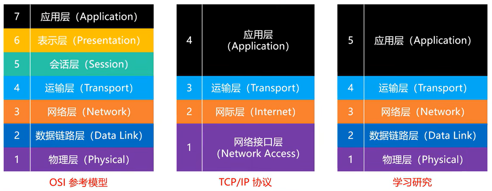

> 集线器工作在物理层，可以当作就是网线。（一层设备）
>
> 交换机记录的有 MAC 地址，工作一般是两层：物理层 + 数据链路层。（二层设备）
>
> 路由器记录的有目标 IP，工作是三层：物理层 + 数据链路层 + 网络层。（三层设备）

## 网络请求过程

**客户端发送数据时，从应用层到物理层，层层包装，传递给服务器后，服务器从物理层到应用层，层层解包，最终拿到数据。服务器返回数据给客户端时，遵循相同过程。同时，客户端的包装和服务器的解包，遵循相同的网络协议。**

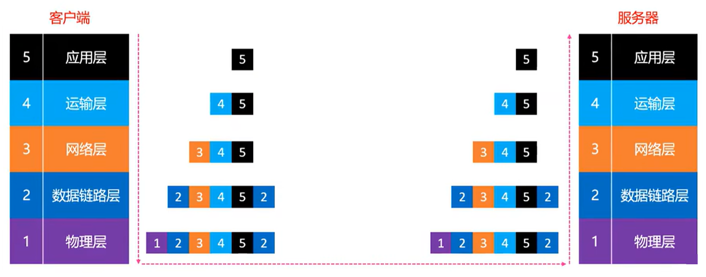


> 不同层的数据，对应不同的专业术语名称，也对应不同的网络协议。

## TCP 协议

TCP 的几个要点：可靠传输、流量控制、拥塞控制、连接控制。

### 数据格式


- `数据偏移 (Data Offset)`

  - 占 4 位，取值范围是 0x0101 ~ 0x1111。
  - 乘以 4，才是实际的首部长度（Header Length）。
  - 首部长度 = 固定首部 + 可变部分，范围是 20 ~ 60 字节。
    - 首部长度最小长度为 20 字节，此时数据偏移值为 0x0101。
    - 首部长度最大长度为 60 字节，此时数据偏移值为 0x1111。
  - UDP 的首部中，有个 16 位的字段，记录了整个 UDP 报文段的长度（首部 + 数据），但是，TCP 的首部中，仅仅只有个 4 位的字段，记录了 TCP 报文段的首部长度，并没有字段记录整个 TCP 报文段的数据长度。
    - UDP 首部中占 16 位的长度字段是冗余的，纯粹是为了保证首部是 32 bit 对齐。
    - TCP/UDP 的数据长度，完全可以由网络层的 IP 数据包的首部计算出来。
      - **传输层的数据长度 = 网络层的总长度 - 网络层的首部长度 - 传输层的首部长度。**

- `保留 (Reserved)`

  - 占 6 位，目前全为 0，暂时没什么用。

  - 有些资料中，TCP 首部的保留字段占 3 位，标志（Flags）字段占 9 位，例如 Wireshark 中即是如此，但最终效果是相同的。

    

- `检验和 (Checksum)`

  - 跟 UDP 一样，TCP 的校验和的计算内容：伪首部 + 首部 + 数据。

  - 伪首部：占用 12 字节，仅在计算校验和时起作用，并不会传递给网络层。

    

- `标志位 (Flags)`

  

  - `URG (Urgent)`

    - 当 URG = 1 时，首部中的紧急指针字段才有效，表明当前报文段中有紧急数据，应优先尽快传送。

  - **`ACK (Acknowledgment)`**

    - 当 ACK = 1 时，首部中的确认号字段才有效。

  - `PSH (Push)`

  - `RST (Reset)`

    - 当 RST = 1 时，表明连接中出现严重差错，必须释放连接，然后再重新建立连接。

  - **`SYN (Synchronization)`**

    

    - 当 SYN = 1、ACK = 0 时，表明这是一个建立连接的请求。
    - 若对方同意建立连接，则回复 SYN = 1、ACK = 1。
    - 收到对方回复后，发送 SYN = 0、ACK = 1，表明成功建立连接。

  - `FIN (Finish)`

    - 当 FIN = 1 时，表明数据已经发送完毕，要求释放连接。

- `序号 (Sequence Number)`

  - 占 32 位。
  - 首先，在传输过程中的每一个字节，都会有一个编号。
  - 在建立连接后，序号代表：这一次传给对方的 TCP 数据部分的第一个字节的编号。

- `确认号 (Acknowledgment Number)`

  - 占 32 位。
  - 在建立连接后，确认号代表：期望对方下一次传过来的 TCP 数据部分的第一个字节的编号。

- `窗口 (Window)`

  - 占 16 位。
  - 这个字段有流量控制功能，用以告知对方下一次允许发送的数据大小（单位为字节）。

### 可靠传输

#### 停止等待 ARQ 协议

**`ARQ：Automatic Repeat-reQuest，自动重传请求。`**

**无差错情况：**

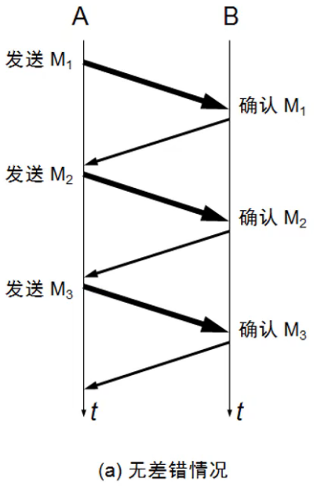

- B 收到 A 发送的 M1 后，返回确认信息给 A。
- A 接收到 B 的确认信息，并发送 M2 给 B。
- B 收到 A 发送的 M2 后，返回确认信息给 A。
- A 接收到 B 的确认信息，并发送 M3 给 B。

**超时重传：**


- B 未收到 A 发送的 M1，或者收到的 M1 有差错，则不返回确认信息给 A。
- A 收不到 B 的确认信息，等待超时后（定时器），重新发送 M1 给 B。

**确认丢失：**


- B 收到 A 发送的 M1 后，返回确认信息给 A。
- 确认信息发送过程中丢失，A 未收到，等待超时后，A 重新发送 M1 给 B。
- B 再次收到 A 发送的 M1 后，返回重传确认 M1 的信息给 A。
- A 收到 B 的重传确认 M1 的信息，并发送 M2 给 B。 

**确认迟到：**


- B 收到 A 发送的 M1 后，返回确认信息给 A，但确认信息发送过程耗时很久。
- A 因未收到 B 的确认信息，等待超时后，A 重新发送 M1 给 B。
- B 再次收到 A 发送的 M1 后，返回重传确认 M1 的信息给 A。
- A 收到 B 的重传确认 M1 的信息，并发送 M2 给 B。 
- 之后，A 收到 B 第一次发送的确认信息，但什么也不做。

**重传次数：**

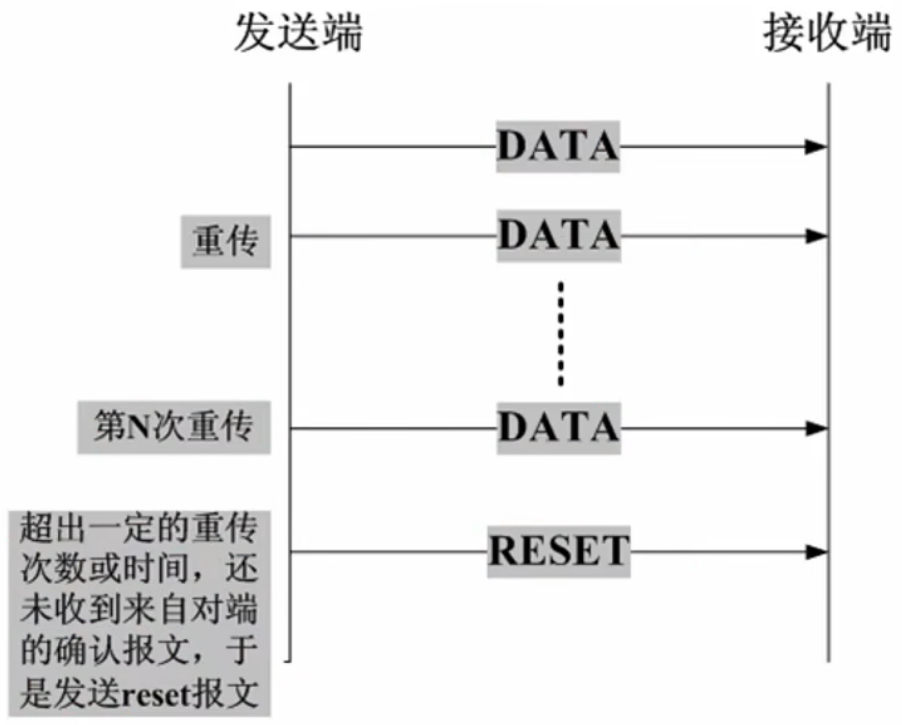

- 若有个包重传了 N 次还是失败，会一直持续重传到成功为止吗？这个取决于系统的设置，比如有些系统，重传 5 次还未成功，就会发送 reset 报文（RST=1）断开 TCP 连接。

#### 连续 ARQ 协议 + 滑动窗口协议

停止等待 ARQ 协议，虽然能保证可靠传输，但**效率很慢**。使用连续 ARQ 协议和滑动窗口协议，能够对此改进。


- A 一次性发送 M1、M2、M3 和 M4 给 B（这四个数据是连续的），B 收到后返回 M4 的确认信息，也是表明 M4 之前的数据都收到。
- A 收到 M4 的确认信息后，继续发送 M5、M6、M7 和 M8，以此类推。这个过程，就是**连续 ARQ 协议**。
- A 发送数据的窗口，其大小由 B 决定，当第一批数据传输完成，窗口向下滑动，形成新的一批待发送数据，即**滑动窗口协议**。
- 如果接收窗口最多只能接收 4 个包，但是发送方只发送了 2 个包，此时，接收方在等待一定时间后，如果还没有第 3 个包，就会返回确认收到 2 个包给发送方。

假设有一段数据，1200 个字节，分为 12 个数据包，每一个 100 字节，并有一个编号：


使用连续 ARQ 协议，加滑动窗口协议，数据传输过程如下：


> 窗口的大小，不是固定的，B 返回的确认信息中，包含下次 A 发送数据的窗口大小。

#### SACK

TCP 通信过程中，如果发送序列中间某个数据包丢失（例如 1、2、3、4、5 中的 3 丢失了），TCP 会通过重传最后确认的分组后续的分组（最后确认的是 2，会重传 3、4、5），这样，原先已经正确传输的分组，也可能重复发送（4、5），这降低了 TCP 的性能。

为了改善上述情况，发展出了**`SACK (Selective Acknowledgment，选择性确认) 技术`**，SACK 会告诉发送方哪些数据丢失，哪些数据已经提前收到，使 TCP 只重新发送丢失的包（3），而不用发送后续所有的分组（4、5）。

SACK 信息会放在 TCP 首部的**选项部分**，其数据格式如下：


- `Kind`：占 1 个字节。值为 5 时，代表这个是 SACK 选项。（TCP 首部的选项部分，并不全都是用来存储 SACK 信息的）

- `Length`：占 1 个字节。表明 SACK 选项一共占用多少字节。

- `Left Edge`：占 4 个字节，左边界。

- `Right Edge`：占 4 个字节，右边界。

- 一对边界信息需要占用 8 个字节，由于 TCP 首部的选项部分最多 40 字节，所以：

  

  - **SACK 选项最多携带 4 组边界信息。**
  - SACK 选项的最大占用字节数：4 * 8 + 2 = 34 字节。
  - 左边界和右边界，确定了已经接收到的数据块，如上图窗口中的 301 ~ 400、501 ~ 600、701 ~ 800 和 901 ~ 1000，都是已收到的数据。同一个窗口中，如果有超出 4 组边界信息，剩余的无法记录，再次传输时，会出现重复发送的情况。
  - SACK 就是通过左边界和右边界，来最大程度的，避免数据重复传输的情况出现。

#### 思考一个问题

为什么选择在传输层就将数据分成多个段，而不是等到网络层再分片传递给数据链路层？

- 因为可以提高重传的性能。
- 需要明确的是：**可靠传输是在传输层进行控制的。**
  - 如果在传输层不分段，一旦出现数据丢失，整个传输层的数据都得重传。
  - 如果在传输层分了段，一旦出现数据丢失，只需要重传丢失的那些段即可。

### 流量控制

数据传输过程中，如果接收方的缓存区满了，而发送方还在持续发生数据，就会导致接收方只能把收到的数据包丢掉，而大量的丢包会极大的浪费网络资源，因此，需要进行流量控制。

定义：`流量控制就是让发送方的发送速率不要太快，让接收方来得及接收处理。`

原理：

- `通过确认报文中窗口字段来控制发送方的发送速率。`
- 发送方的发送窗口大小，不能超过接收方给出的窗口大小。
- 当发送方收到接收方窗口的大小为 0 时，发送方就会停止发送数据。

特殊情况：


- 上图是模拟正常情况下的数据传输过程，其中，rwmd：receive window，即接收窗口大小。
- 有一种特殊情况是：
  - 一开始，接收方给发送方发送了 0 窗口的报文段。
  - 后面，接收方又有了一些存储空间，给发送方发送非 0 窗口的报文段。
  - 但是，因为某些原因，非 0 窗口的报文段丢失了，此时，发送方的发送窗口一直为 0，没有发送数据。
- 解决方案：
  - 当发送方收到 0 窗口的报文通知时，发送方就停止发送报文。
  - 并且，同时开启一个定时器，隔一段时间就发送一个测试报文，询问接收方最新的窗口大小。
  - 如果接收方返回的报文窗口大小还是为 0，则发送方再次刷新启动定时器。

### 拥塞控制

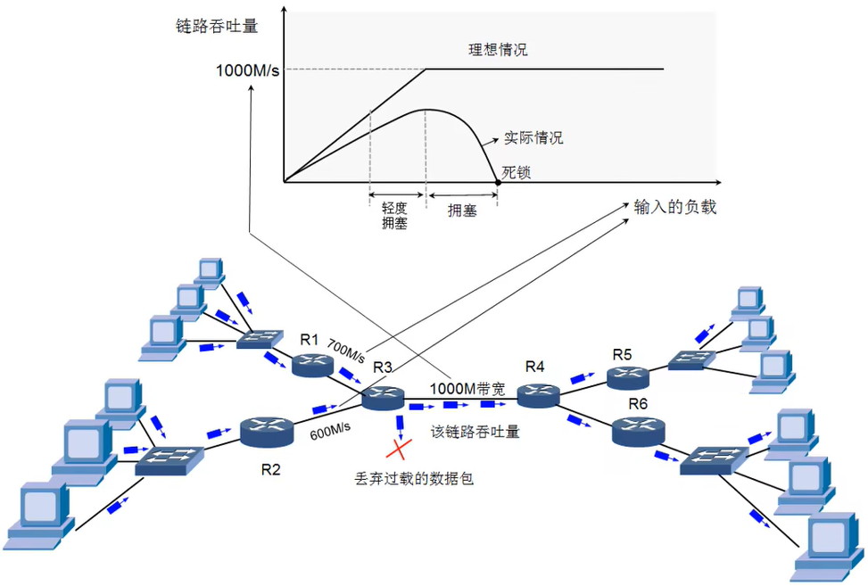

- 理想情况下，1000 M 带宽的链路吞吐量能达到 1000 M/s，但实际情况下，随着输入负载的增加，链路吞吐量在达到一个峰值后，便会逐渐减少，直至最后死锁。

拥塞控制的定义：

- 防止过多的数据注入到网络中。
- 避免网络中的路由器或者链路过载。
- `拥塞控制是一个全局性的过程`：
  - 涉及到所有的主机、路由器，以及与降低网络传输性能有关的所有因素。
  - 相比而言，流量控制是点对点通信的控制。

拥塞控制的方法：

  - `慢开始`（slow start，慢启动）。
  - `拥塞避免`（congestion avoidance）。
  - `快速重传`（fast retransmit）。
  - `快速恢复`（fast recovery）。

> 几个缩写：
>
> - **MSS**：Maximun Sgement Size，每个段最大的数据部分大小。
>   - 在建立连接时确定。
> - **cwnd**：congestion window，拥塞窗口。
> - **rwnd**：receive window，接收窗口。
> - **swnd**：send window，发送窗口。
>   - swnd = min (cwnd, rwnd)。

#### 慢开始


- MSS = 100，rwnd = 3000，理论上，发送方可以一次发送 30 个包，但实际上，第一轮，发送方只发送一个包，cwnd = 100，接收方成功接收后，第二轮，发送方发送两个包，cwnd = 200，然后第三轮，发送方发送四个包，以此类推，成指数增长，直到达到 rwnd 最大值 3000。

cwnd 随时间变化示意图：


- cwnd 的初始值比较小，然后随着数据包被接收方确认（收到一个 ACK），cwnd 就成倍增长（指数级）。

#### 拥塞避免

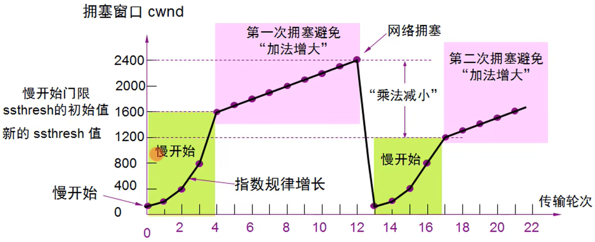

- ssthresh：slow start threshold，`慢开始阈值`，cwnd 达到阈值后，以线性方式增加。
- 拥塞避免（加法增大）：拥塞窗口缓慢增大，以防止网络过早出现拥塞。
- 乘法减小：只要网络出现拥塞（通过丢包判断），把 ssthresh 减半，于此同时，执行慢开始算法（cwnd 又恢复到初始值）。
- 当网络出现频繁拥塞时，ssthresh 值就下降的很快。

#### 快速重传


- 接收方：
  - 每收到一个失序的分组后，就立即发出重复确认，使发送方及时知道有分组没有到达，而不要等待自己发送数据时才进行确认。
- 发送方：
  - 只要连续收到三个重复确认（总共 4 个相同的确认），就应当立即重传对方尚未收到的报文段，而不必继续等待重传计时器到期后再重传。

> 对比超时重传。

#### 快速恢复


- 当发送方连续收到三个重复确认，就执行 "乘法减小" 算法，把 ssthresh 减半，这是为了预防网络发生拥塞。
- 由于发送方现在认为网络很可能没有发生拥塞，因此，与慢开始不同之处是，现在不执行慢开始算法，即 cwnd 现在不恢复到初始值，而是把 cwnd 值设置为 ssthresh 减半后的数值，然后开始执行拥塞避免算法（"加法增大"），使拥塞窗口缓慢的线性增大。

> **慢开始算法：ssthresh 成指数增长。**
>
> **拥塞避免算法：慢开始算法达到 ssthresh 后，"加法增大"，ssthresh 成线性增长。**
>
> **快速重传算法：发送方连续收到三个重复确认时，"乘法减小"，ssthresh 减半。**
>
> **快速恢复算法：从快速重传算法得到的新 ssthresh 值，直接执行拥塞避免算法，而不是执行慢开始算法。**

#### 发送窗口的最大值

发送窗口的最大值：**`swnd = min(cwnd, rwnd)`**。

- 当 rwnd < cwnd 时，是接收方的接受能力，限制了发送窗口的最大值。
- 当 cwnd < rwnd 时，时网络的拥塞，限制了发送窗口的最大值。

### 序号和确认号

序号和确认号的相对值：


序号和确认号的原生值：


- 客户端与服务器建立连接时，客户端除了发送 SYN = 1、ACK = 0，还发送了序号 seq 的原生值，这个值是随机产生的。
- 随后，服务器回复确认信息，发送 SYN = 1、ACK = 1，并发送了自己的序号 seq 的原生值，这个值也是随机产生的。

序号与确认号值变化推演：


- ①、②、③ 三个步骤，是客户端与服务器建立连接。
- ④ 是客户端发送 HTTP 请求。
- ⑤、⑥、⑦、⑧ 四个步骤，是服务器发送数据包给客户端。
- ⑨ 是客户端发送确认信息给服务器。

在每个阶段，序号与确认号值的变化情况：

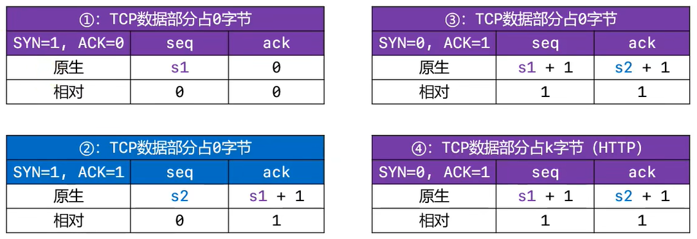

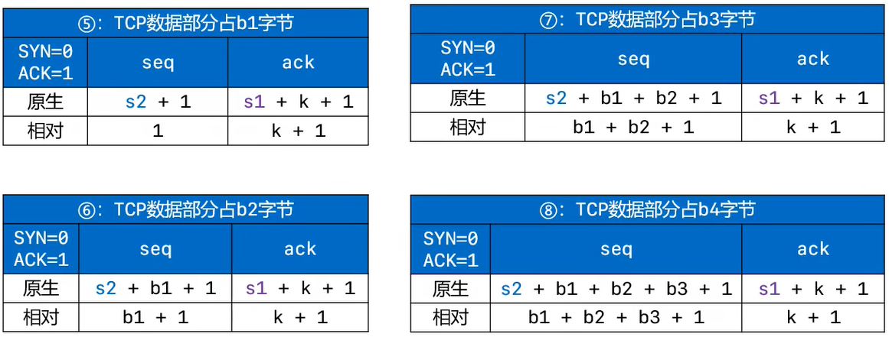

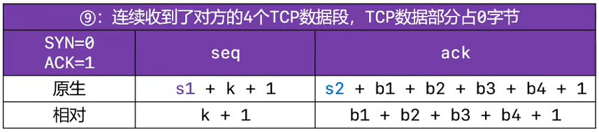

序号与确认号值变化：


### 连接控制

#### 建立连接：3 次握手


- `CLOSED`：一开始，Client 处于关闭状态。

- `LISTEN`：一开始，Server 处于监听状态。

- `SYN-SENT`：Client 发送连接请求（SYN 报文，第 1 次握手）后，状态变为 SYN-SENT，表明 Client 已发送 SYN 报文，等待 Server 的第 2 次握手。

- `SYN-RCVD`：Server 接收到了 SYN 报文，状态变为 SYN-RCVD，并发送连接请求确认。

- `ESTABLISHED`：Client 接收到了 Server 发送的连接请求确认，状态变为 ESTABLISHED，表示连接已经建立。然后，Client 发送确认请求（ACK 报文），当 Server 接收到了 ACK 报文后，也会变为 ESTABLISHED 状态。

- 前 2 次握手的特点：

  - SYN 的值都为 1。
  - 数据部分的长度都为 0。
  - TCP 头部的长度，一般都是 32 字节。
    - 固定头部：20 字节。
    - 选项部分：12 字节。
  - 双方会交换确认一些信息：
    - 比如 MSS、是否支持 SACK、Window scale（窗口缩放系数）等。
    - 这些数据都放在了 TCP 头部的选项部分中。

- 问题一：为什么建立连接的时候，要进行 3 次握手？2 次不行吗？

  - 主要目的：防止 Server 一直等待，浪费资源。
  - 如果建立连接只需要 2 次握手，可能会出现的情况：
    - 假设 Client 先发出了第一个连接请求报文段，因为网络延迟，Server 迟迟未收到请求。
    - 因为第一个连接请求没有收到回复，Client 发出了第二个连接请求报文段，Server 收到，并与 Client 做正常的交互，之后，Server 释放资源，连接断开。
    - 在连接释放以后的某个时间，Server 收到 Client 发送的第一个连接请求报文。本来这是一个早已失效的连接请求，但 Server 收到此失效的请求后，误认为是 Client 再次发出的一个新的连接请求。于是，Server 就向 Client 发出确认报文段，同意建立连接。
    - **如果不采用 3 次握手，那么只要 Server 发出确认，新的连接就建立了。**
    - 由于现在 Client 并没有真正想连接服务器的意愿，因此不会理睬 Server 的确认，也不会向 Server 发送数据。但 Server 却认为新的连接已经建立，并一直等待 Client 发来数据，这样，Server 的很多资源就白白浪费掉了。
  - 采用 3 次握手的方式，可以避免上述现象的发生：第 2 次握手之后，因为 Client 没有向 Server 的确认发出确认，Server 由于收不到确认，就知道 Client 并没有要求建立连接，也就会把资源进行释放。

- 问题二：第 3 次握手失败了，会怎么处理？

  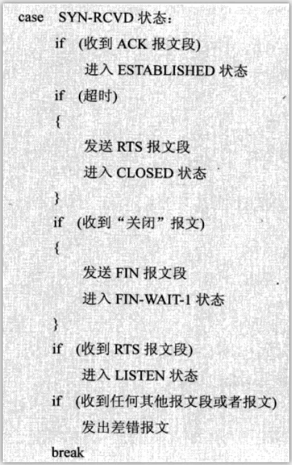

  - 此时 Server 的状态为 SYN-RCVD，若等不到 Client 的 ACK，Server 会重新发送 SYN + ACK 包。
  - 如果 Server 多次重发 SYN + ACK 都等不到 Client 的 ACK，就会发送 RST 包，强制关闭连接。

#### 释放连接：4 次挥手

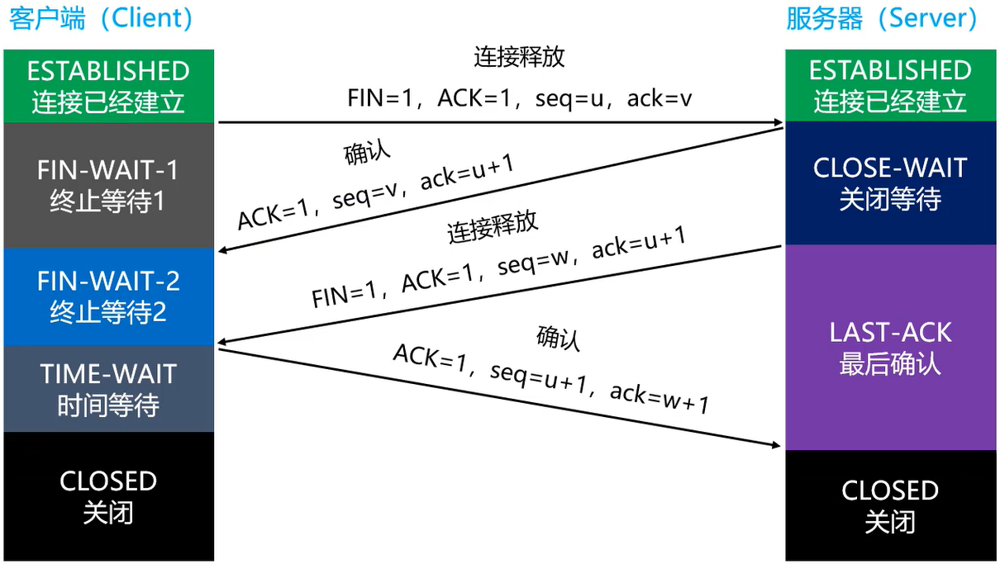

- `ESTABLISHED`：一开始，Client 和 Server 都处于 ESTABLISHED 状态。
- `FIN-WAIT-1`：表示想主动关闭连接（主动方）。
  - 一方向对方发送了 FIN 报文，此时进入到 FIN-WAIT-1 状态。
  - 想主动关闭的一方，既可以是 Client，也可以是 Server。TCP/IP 协议栈在设计上，允许任何一方先发起断开请求，此处演示的是 Client 主动要求断开。
- `CLOSE-WAIT`：表示在等待关闭（被动方）。
  - 当主动方发送 FIN 报文给被动方，被动方会回应一个 ACK 报文给主动方，此时被动方进入到 CLOSE-WAIT 状态。
  - 在此状态下，被动方需要考虑自己是否还有数据要发送给主动方，如果没有，则发送 FIN 报文给主动方（之后被动方进入 LAST-ACK 状态）。
- `FIN-WAIT-2`：只要被动方发送 ACK 报文确认后，主动方就会处于 FIN-WAIT-2 状态，然后等待被动方发送 FIN 报文。
- `CLOSING`：一种比较罕见的例外状态。
  - 表示一方发送 FIN 报文后，并没有收到对方的 ACK 报文，反而也收到了对方的 FIN 报文。
  - 如果双方几乎在同时准备关闭连接的话，那么就出现了双方同时发送 FIN 报文的情况，即会出现 CLOSING 状态。
  - 表示双方都正在关闭连接。
- `LAST-ACK`：被动方在发送 FIN 报文后，就进入 LAST-ACK 状态，等待主动方发送的 ACK 报文。
  - 当被动方收到主动发的 ACK 报文后，被动方就进入到了 CLOSED 状态。

- `TIME-WAIT`：表示主动方收到了被动方的 FIN 报文，并发送了 ACK 报文，此时，主动方进入 TIME-WAIT 状态，一般在`等待 2 MSL 后`即可进入 CLOSED 状态。
  - 如果 FIN-WAIT-1 状态下，收到了对方同时带 FIN 标志和 ACK 标志的报文时，可以直接进入到 TIME-WAIT 状态，而无须经过 FIN-WAIT-2 状态。（此时是 3 次挥手）
  - MSL：Maximum Segment Lifetime，最大分段生存期，MSL 是 TCP 报文在 Internet 上的最长生存时间。每个具体的 TCP 实现，都必须选择一个确定的 MSL 值，RFC 1122 建议是 2 分钟。
  - 等待 2 MSL 后在进入 CLOSE 状态，可以防止本次连接中产生的数据包，误传到下一次连接中，因为本次连接中的数据包，都会在 2 MSL 时间内消失。
  - 如果 Client 发送 ACK 报文后不等待马上释放资源，然后又因为网络原因，Server 没有收到 Client 的 ACK 报文，Server 就会重发 FIN 报文，此时，可能出现的情况是：
    - ① Client 没有任何响应，Server 会干等，甚至多次重发 FIN 报文，浪费资源。
    - ② Client 有个新的应用程序刚好分配了同一个端口，新的应用程序收到 FIN 报文后马上开始执行断开连接的操作，而实际上，这个新应用程序可能是想跟 Server 建立连接的。

- `CLOSED`：关闭状态。
- 问题：为什么释放连接的时候，要进行 4 次挥手？
  - TCP 是全双工模式。
  - 第 1 次挥手：当主机 1 发出 FIN 报文时：
    - 表示主机 1 告诉主机 2，主机 1 已经没有数据要发送了，但是，此时主机 1 还是可以接收来自主机 2 的数据。

  - 第 2 次挥手：当主机 2 返回 ACK 报文时：
    - 表示主机 2 已经知道主机 1 没有数据发送了，但是主机 2 还是可以发送数据到主机 1 的。

  - 第 3 次挥手：当主机 2 也发出 FIN 报文时：
    - 表示主机 2 告诉主机 1，主机 2 已经没有数据要发送了。

  - 第 4 次挥手：当主机 1 返回 ACK 报文时：
    - 表示主机 1 已经知道主机 2 没有数据发送了，随后正式断开整个 TCP 连接。

#### 完整流程

Client 和 Server 建立和释放连接全过程流程示意图：


有时候在使用抓包工具的时候，可能只会看到 3 次挥手：

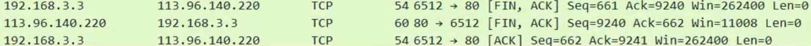

- 这其实就是将第 2 次挥手和第 3 次挥手合并了。
- 当被动方接收到主动发的 FIN 报文时，如果被动方此时也没有数据要发送给主动方，这时，被动方就可以将第 2 次挥手和第 3 次挥手合并，同时告诉主动方两件事：
  - 被动方已经知道主动发没有数据要发送。
  - 被动方本身也没有数据要发送。

> 图中的三向握手，也就是指特殊情况下的 3 次挥手。

`netstat`命令可以查看 TCP 连接的状态，但由于有些状态的时间比较短暂，所以很难用 netstat 命令看到，比如 SYN-RCVD、FIN-WAIT-1 等。

```bash
C:\Users\XiSun>netstat -n

活动连接

  协议  本地地址          外部地址        状态
  TCP    127.0.0.1:4292         127.0.0.1:63342        ESTABLISHED
  TCP    127.0.0.1:4297         127.0.0.1:49152        ESTABLISHED
  TCP    127.0.0.1:4374         127.0.0.1:8500         ESTABLISHED
  TCP    127.0.0.1:4374         127.0.0.1:12359        ESTABLISHED
  TCP    127.0.0.1:4376         127.0.0.1:40166        ESTABLISHED
  TCP    127.0.0.1:7890         127.0.0.1:7285         ESTABLISHED
  TCP    127.0.0.1:7890         127.0.0.1:7294         ESTABLISHED
  TCP    127.0.0.1:8694         127.0.0.1:7890         TIME_WAIT
  TCP    127.0.0.1:8741         127.0.0.1:7890         TIME_WAIT
  TCP    127.0.0.1:8743         127.0.0.1:7890         TIME_WAIT
  TCP    127.0.0.1:8771         127.0.0.1:9229         SYN_SENT
  TCP    127.0.0.1:9066         127.0.0.1:9067         ESTABLISHED
  TCP    127.0.0.1:9067         127.0.0.1:9066         ESTABLISHED
  TCP    127.0.0.1:9792         127.0.0.1:9793         ESTABLISHED
  TCP    127.0.0.1:9793         127.0.0.1:9792         ESTABLISHED
  TCP    127.0.0.1:11090        127.0.0.1:7890         ESTABLISHED
  TCP    127.0.0.1:11149        127.0.0.1:7890         ESTABLISHED
  TCP    127.0.0.1:11256        127.0.0.1:7890         TIME_WAIT
  TCP    127.0.0.1:11258        127.0.0.1:7890         TIME_WAIT
  TCP    127.0.0.1:11283        127.0.0.1:7890         TIME_WAIT
  TCP    127.0.0.1:11883        127.0.0.1:7890         ESTABLISHED
  TCP    127.0.0.1:11895        127.0.0.1:7890         ESTABLISHED
  TCP    192.168.3.144:7287     122.195.90.181:7826    ESTABLISHED
  TCP    192.168.3.144:7295     112.65.211.215:443     ESTABLISHED
  TCP    192.168.3.144:8349     220.196.139.176:80     ESTABLISHED
  TCP    192.168.3.144:8656     114.112.207.71:443     ESTABLISHED
  TCP    192.168.3.144:8673     58.254.138.133:443     TIME_WAIT
  TCP    192.168.3.144:8679     152.195.38.76:80       TIME_WAIT
  TCP    192.168.3.144:8684     34.170.65.59:443       ESTABLISHED
  TCP    192.168.3.144:8716     114.112.207.33:443     TIME_WAIT
  TCP    192.168.3.144:8731     114.112.207.33:443     TIME_WAIT
  TCP    192.168.3.144:8742     106.11.40.32:443       TIME_WAIT
  TCP    192.168.3.144:8744     106.11.40.32:443       TIME_WAIT
  TCP    192.168.3.144:8749     202.89.233.101:443     ESTABLISHED
  TCP    192.168.3.144:8758     211.94.93.212:443      CLOSE_WAIT
  TCP    192.168.3.144:8759     211.94.93.212:443      CLOSE_WAIT
  TCP    192.168.3.144:8769     114.112.207.1:443      TIME_WAIT
  TCP    192.168.3.144:9065     192.168.3.23:22        ESTABLISHED
  TCP    192.168.3.144:9485     59.82.58.85:443        ESTABLISHED
  TCP    192.168.3.144:11091    101.37.44.209:443      ESTABLISHED
  TCP    192.168.3.144:11858    58.243.179.131:443     CLOSE_WAIT
  TCP    192.168.3.144:11859    117.18.232.200:443     CLOSE_WAIT
  TCP    192.168.3.144:11886    122.195.90.174:7826    ESTABLISHED
  TCP    192.168.3.144:11897    112.83.140.11:443      ESTABLISHED
  TCP    192.168.3.144:11999    112.65.211.215:443     ESTABLISHED
  TCP    192.168.3.144:12000    114.250.52.78:443      ESTABLISHED
```

## 原文链接

https://github.com/ACatSmiling/zero-to-zero/blob/main/Network/network-protocol.md