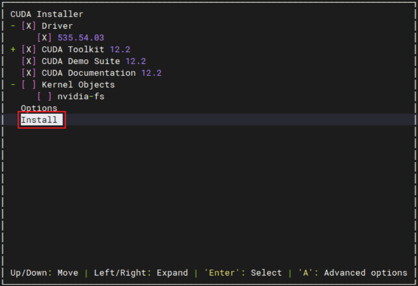

> *`Author: ACatSmiling`*
>
> *`Since: 2024-11-13`*

1. 根据操作系统版本和 GPU 型号等，下载对应的 cuda 驱动，下载地址：https://developer.nvidia.com/cuda-downloads

2. 检查服务器 GPU 识别情况，确保 GPU 卡能够完全识别，如不能识别，需要进行重新插拔、对调测试等步骤进行硬件排查。

   ```shell
   [root@desong-gpu-wushan ~]# lspci | grep -i nvidia
   00:07.0 3D controller: NVIDIA Corporation Device 2236 (rev a1)
   ```

3. 安装 gcc，g++ 编译器。（GPU 驱动安装时，需要 gcc 编译器）

   ```shell
   [root@desong-gpu-wushan ~]# gcc -v
   Using built-in specs.
   COLLECT_GCC=gcc
   COLLECT_LTO_WRAPPER=/usr/libexec/gcc/x86_64-redhat-linux/4.8.5/lto-wrapper
   Target: x86_64-redhat-linux
   Configured with: ../configure --prefix=/usr --mandir=/usr/share/man --infodir=/usr/share/info --with-bugurl=http://bugzilla.redhat.com/bugzilla --enable-bootstrap --enable-shared --enable-threads=posix --enable-checking=release --with-system-zlib --enable-__cxa_atexit --disable-libunwind-exceptions --enable-gnu-unique-object --enable-linker-build-id --with-linker-hash-style=gnu --enable-languages=c,c++,objc,obj-c++,java,fortran,ada,go,lto --enable-plugin --enable-initfini-array --disable-libgcj --with-isl=/builddir/build/BUILD/gcc-4.8.5-20150702/obj-x86_64-redhat-linux/isl-install --with-cloog=/builddir/build/BUILD/gcc-4.8.5-20150702/obj-x86_64-redhat-linux/cloog-install --enable-gnu-indirect-function --with-tune=generic --with-arch_32=x86-64 --build=x86_64-redhat-linux
   Thread model: posix
   gcc version 4.8.5 20150623 (Red Hat 4.8.5-16) (GCC) 
   [root@desong-gpu-wushan ~]# g++ -v
   Using built-in specs.
   COLLECT_GCC=g++
   COLLECT_LTO_WRAPPER=/usr/libexec/gcc/x86_64-redhat-linux/4.8.5/lto-wrapper
   Target: x86_64-redhat-linux
   Configured with: ../configure --prefix=/usr --mandir=/usr/share/man --infodir=/usr/share/info --with-bugurl=http://bugzilla.redhat.com/bugzilla --enable-bootstrap --enable-shared --enable-threads=posix --enable-checking=release --with-system-zlib --enable-__cxa_atexit --disable-libunwind-exceptions --enable-gnu-unique-object --enable-linker-build-id --with-linker-hash-style=gnu --enable-languages=c,c++,objc,obj-c++,java,fortran,ada,go,lto --enable-plugin --enable-initfini-array --disable-libgcj --with-isl=/builddir/build/BUILD/gcc-4.8.5-20150702/obj-x86_64-redhat-linux/isl-install --with-cloog=/builddir/build/BUILD/gcc-4.8.5-20150702/obj-x86_64-redhat-linux/cloog-install --enable-gnu-indirect-function --with-tune=generic --with-arch_32=x86-64 --build=x86_64-redhat-linux
   Thread model: posix
   gcc version 4.8.5 20150623 (Red Hat 4.8.5-16) (GCC) 
   ```

   - `yum install gcc`和`yum install gcc-c++`。

4. 安装 kernel-devel 和 kernel-headers 软件包。

   ```shell
   [root@desong-gpu-wushan ~]# yum list | grep kernel
   Repodata is over 2 weeks old. Install yum-cron? Or run: yum makecache fast
   kernel.x86_64                             3.10.0-693.el7               @anaconda
   kernel-abi-whitelists.noarch              3.10.0-693.el7               @base-52 
   kernel-devel.x86_64                       3.10.0-693.el7               @anaconda
   kernel-headers.x86_64                     3.10.0-693.el7               @anaconda
   kernel-tools.x86_64                       3.10.0-693.el7               @anaconda
   kernel-tools-libs.x86_64                  3.10.0-693.el7               @anaconda
   abrt-addon-kerneloops.x86_64              2.1.11-60.el7.centos         base     
   erlang-kernel.x86_64                      R16B-03.18.el7               epel     
   kernel.x86_64                             3.10.0-1160.42.2.el7         updates  
   kernel-abi-whitelists.noarch              3.10.0-1160.42.2.el7         updates  
   kernel-debug.x86_64                       3.10.0-1160.42.2.el7         updates  
   kernel-debug-devel.x86_64                 3.10.0-1160.42.2.el7         updates  
   kernel-devel.x86_64                       3.10.0-1160.42.2.el7         updates  
   kernel-doc.noarch                         3.10.0-1160.42.2.el7         updates  
   kernel-headers.x86_64                     3.10.0-1160.42.2.el7         updates  
   kernel-tools.x86_64                       3.10.0-1160.42.2.el7         updates  
   kernel-tools-libs.x86_64                  3.10.0-1160.42.2.el7         updates  
   kernel-tools-libs-devel.x86_64            3.10.0-1160.42.2.el7         updates  
   libreport-plugin-kerneloops.x86_64        2.1.11-53.el7.centos         base     
   lirc-disable-kernel-rc.noarch             0.10.0-16.el7                epel     
   php-symfony-http-kernel.noarch            2.8.12-2.el7                 epel     
   texlive-l3kernel.noarch                   2:svn29409.SVN_4469-45.el7   base     
   texlive-l3kernel-doc.noarch               2:svn29409.SVN_4469-45.el7   base
   ```

   - `yum install kernet-devel-$(uname -r) kernel-headers-$(uname -r)`。

5. 禁用系统自带的 nouveau 模块。

   ```shell
   # 检查 nouveau 模块是否加载
   [root@desong-gpu-wushan ~]# lsmod | grep nouveau
   nouveau              1622010  0 
   mxm_wmi                13021  1 nouveau
   wmi                    19070  2 mxm_wmi,nouveau
   video                  24520  1 nouveau
   i2c_algo_bit           13413  1 nouveau
   drm_kms_helper        159169  2 cirrus,nouveau
   ttm                    99345  2 cirrus,nouveau
   drm                   370825  5 ttm,drm_kms_helper,cirrus,nouveau
   i2c_core               40756  5 drm,i2c_piix4,drm_kms_helper,i2c_algo_bit,nouveau
   
   # 编辑 /usr/lib/modprobe.d/dist-blacklist.conf，添加以下内容，如果没有则创建
   [root@desong-gpu-wushan modprobe.d]# vim /usr/lib/modprobe.d/dist-blacklist.conf
   blacklist nouveau
   options nouveau modeset=0
   
   # 使内核生效
   [root@desong-gpu-wushan modprobe.d]# dracut -force
   ```

6. 修改系统运行级别为文本模式，GPU 驱动安装必须在文本模式下进行。

   ```shell
   [root@desong-gpu-wushan modprobe.d]# systemctl set-default multi-user.target
   Removed symlink /etc/systemd/system/default.target.
   Created symlink from /etc/systemd/system/default.target to /usr/lib/systemd/system/multi-user.target.
   # 重启系统
   [root@desong-gpu-wushan modprobe.d]# reboot
   ```

7. 验证 nouveau 模块禁用生效，并进入文本模式。

   ```shell
   [root@desong-gpu-wushan ~]# lsmod | grep nouveau
   ```

8. cuda 安装。

   ```shell
   # 赋予 cuda 安装包可执行权限
   [root@desong-gpu-wushan ~]# chmod +x cuda_12.2.0_535.54.03_linux.run
   # 执行 cuda 安装命令
   [root@desong-gpu-wushan ~]# ./cuda_12.2.0_535.54.03_linux.run --no-opengl-libs
   ```

   

   

   - 默认全部安装，如果已经安装过 GPU 驱动，则取消 Driver 选项的勾选。

   ```shell
   Driver:   Installed
   Toolkit:  Installed in /usr/local/cuda-12.2/
   
   Please make sure that
   
    -   PATH includes /usr/local/cuda-12.2/bin
    -   LD_LIBRARY_PATH includes /usr/local/cuda-12.2/lib64, or, add /usr/local/cuda-12.2/lib64 to /etc/ld.so.conf and run ldconfig as root
   
   To uninstall the CUDA Toolkit, run cuda-uninstaller in /usr/local/cuda-12.2/bin
   To uninstall the NVIDIA Driver, run nvidia-uninstall
   Logfile is /var/log/cuda-installer.log
   ```

9. 配置环境变量。

   ```shell
   [root@desong-gpu-wushan ~]# vim /etc/profile
   export PATH=/usr/local/cuda/bin:$PATH
   export LD_LIBRARY_PATH=/usr/local/cuda/lib64:$LD_LIBRARY_PATH
   ```

10. 生效环境变量。

    ```shell
    [root@desong-gpu-wushan ~]# source /etc/profile
    ```

11. 测试 cuda 是否安装成功。

    ```shell
    [root@desong-gpu-wushan ~]# nvcc -V
    nvcc: NVIDIA (R) Cuda compiler driver
    Copyright (c) 2005-2023 NVIDIA Corporation
    Built on Tue_Jun_13_19:16:58_PDT_2023
    Cuda compilation tools, release 12.2, V12.2.91
    Build cuda_12.2.r12.2/compiler.32965470_0
    ```

12. 修改系统运行级别为图形模式，然后重启系统。

    ```shell
    [root@desong-gpu-wushan ~]# systemctl set-default graphical.target
    Removed symlink /etc/systemd/system/default.target.
    Created symlink from /etc/systemd/system/default.target to /usr/lib/systemd/system/graphical.target.
    [root@desong-gpu-wushan ~]# reboot
    ```

13. 验证GPU驱动及CUDA安装成功，以及图形化界面显示正常。

    ```shell
    [root@desong-gpu-wushan ~]# nvidia-smi
    Wed Nov  6 07:18:06 2024       
    +---------------------------------------------------------------------------------------+
    | NVIDIA-SMI 535.54.03              Driver Version: 535.54.03    CUDA Version: 12.2     |
    |-----------------------------------------+----------------------+----------------------+
    | GPU  Name                 Persistence-M | Bus-Id        Disp.A | Volatile Uncorr. ECC |
    | Fan  Temp   Perf          Pwr:Usage/Cap |         Memory-Usage | GPU-Util  Compute M. |
    |                                         |                      |               MIG M. |
    |=========================================+======================+======================|
    |   0  NVIDIA A10                     Off | 00000000:00:07.0 Off |                    0 |
    |  0%   39C    P0              58W / 150W |      4MiB / 23028MiB |      0%      Default |
    |                                         |                      |                  N/A |
    +-----------------------------------------+----------------------+----------------------+
                                                                                             
    +---------------------------------------------------------------------------------------+
    | Processes:                                                                            |
    |  GPU   GI   CI        PID   Type   Process name                            GPU Memory |
    |        ID   ID                                                             Usage      |
    |=======================================================================================|
    |  No running processes found                                                           |
    +---------------------------------------------------------------------------------------+
    ```

    