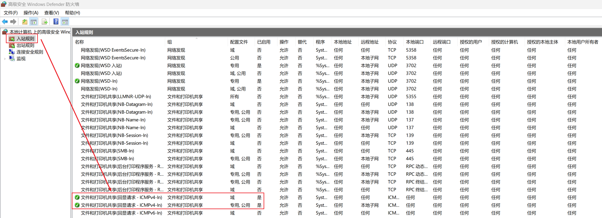

>*`Author: ACatSmiling`*
>
>*`Since: 2024-10-12`*

## Docker 安装

1. 官网下载安装包。（以下示例脚本为下载最新版 Docker 离线压缩包，也可以用浏览器打开官网地址直接下载再传到服务器。如果使用该脚本，下面的第 2、3 步可以不执行。）

   ```shell
   #!/bin/bash
   
   set -u
   # docker 官网下载地址
   url='https://download.docker.com/linux/static/stable/x86_64/'
   # 获取最新版的 docker 包名，地址：https://download.docker.com/linux/static/stable/x86_64/
   tarFile=$(curl -s ${url} | grep -E '.*docker-[0-9]*\.[0-9]*\.[0-9]*\.tgz' | tail -n 1 | awk -F '"' '{print $2}')
   # 拼接完整 url 并下载
   curl -o docker.tgz "${url}${tarFile}"
   
   # 解压，将压缩包内的文件挪到 /usr/local/bin
   tar xf docker.tgz
   mv docker/* /usr/local/bin/
   
   # 创建 docker 的数据目录
   mkdir -p /home/data/docker
   ```

   ```shell
   $ sudo bash docker.sh
   ```

2. 解压安装包，将安装包内的二进制程序解压到`/usr/local/bin`目录。

   ```shell
   $ tar xf docker.tgz
   $ mv docker/* /usr/local/bin/
   ```

3. 建立 Docker 的数据存放目录`/home/data/docker`。

   ```shell
   $ mkdir -p /home/data/docker
   ```

4. 创建 Docker 的 service 文件`/usr/lib/systemd/system/docker.service`。

   ```shell
   $ sudo vim /usr/lib/systemd/system/docker.service
   ```

   ```shell
   [Unit]
   Description=Docker Application Container Engine
   Documentation=https://docs.docker.com
   After=network-online.target firewalld.service
   Wants=network-online.target
   
   [Service]
   Type=notify
   # the default is not to use systemd for cgroups because the delegate issues still
   # exists and systemd currently does not support the cgroup feature set required
   # for containers run by docker
   ExecStart=/usr/local/bin/dockerd --data-root /home/data/docker
   
   ExecReload=/bin/kill -s HUP $MAINPID
   # Having non-zero Limit*s causes performance problems due to accounting overhead
   # in the kernel. We recommend using cgroups to do container-local accounting.
   LimitNOFILE=infinity
   LimitNPROC=infinity
   LimitCORE=infinity
   # Uncomment TasksMax if your systemd version supports it.
   # Only systemd 226 and above support this version.
   #TasksMax=infinity
   TimeoutStartSec=0
   # set delegate yes so that systemd does not reset the cgroups of docker containers
   Delegate=yes
   # kill only the docker process, not all processes in the cgroup
   KillMode=process
   # restart the docker process if it exits prematurely
   Restart=on-failure
   StartLimitBurst=3
   StartLimitInterval=60s
   
   [Install]
   WantedBy=multi-user.target
   ```

5. 配置 Docker 的 daemon.json。

   ```shell
   $ sudo vim /etc/docker/daemon.json
   ```

   ```shell
   {
       "registry-mirrors": [
           "https://dockerproxy.com",
           "https://hub-mirror.c.163.com",
           "https://mirror.baidubce.com",
           "https://ccr.ccs.tencentyun.com"
       ]
   }
   ```

   - /etc 目录下可能没有 docker 目录和 daemon.json，需要新建。
   - 检查 daemon.json 文件的格式：`cat /etc/docker/daemon.json | python -m json.tool`。

6. 生效配置。

   ```shell
   $ systemctl daemon-reload
   $ systemctl start docker
   $ systemctl enable docker
   ```

7. 验证。

   ```shell
   $ systemctl status docker
   $ docker info
   ```

8. 普通用户如需使用二进制方式安装的 Docker，可参考以下步骤，假设普通用户的用户名为 admin。

   ```shell
   # 1. 创建 docker 用户组
   $ sudo groupadd docker
   # 2. 将 admin 用户加到 docker 用户组
   $ sudo usermod admin -a -G docker
   # 3. 重启 docker
   $ systemctl restart docker
   # 4. admin 用户执行 docker 命令进行测试
   ```

9. 如果安装过程中出现错误，使用命令查看详细的错误日志。

   ```shell
   $ systemctl status docker.service
   $ journalctl -xeu docker | less
   ```

## docker-compose 安装

1. 官网下载二进制程序包（以下示例脚本为通过代理站从 GitHub 下载最新版 docker-compose 的安装包，也可以用浏览器直接从浏览器下载再传到服务器。如果使用该脚本，下面的第 2、3 步可以不执行。）

   ```shell
   #!/bin/bash
   
   set -eu
   tag=$(curl -s "https://api.github.com/repos/docker/compose/tags" | grep '"name":' | head -n 1 | awk -F '"' '{print $4}')
   
   url="https://github.com/docker/compose/releases/download/${tag}/docker-compose-$(uname -s)-$(uname -m)"
   
   curl -o docker-compose ${url}
   
   chmod +x docker-compose
   
   # 将 docker-compose 挪到 PATH 环境变量的路径
   mv docker-compose /usr/local/bin/
   
   # 验证并查看版本
   docker-compose --version
   ```

   ```shell
   $ sudo bash docker-compose.sh
   ```

2. 重命名为 docker-compose，并移到`/usr/local/bin`。

3. 验证。

> 如果脚本执行异常，下载的 docker-compose 安装包不正确，可以手动安装。（因为下载地址是 GitHub，如果没有配置代理，下载速度会很慢，甚至失败。）
>
> ```shell
> # 1. 查看最新版本
> $ curl -s "https://api.github.com/repos/docker/compose/tags" | grep '"name":' | head -n 1 | awk -F '"' '{print $4}'
> 
> # 2. 下载，如需下载其他版本，替换 v2.24.7 为最新的版本号即可
> $ sudo curl -L "https://github.com/docker/compose/releases/download/v2.24.7/docker-compose-$(uname -s)-$(uname -m)" -o /usr/local/bin/docker-compose
> 
> # 3. 赋予二进制文件可执行权限
> $ sudo chmod +x /usr/local/bin/docker-compose
> ```

## Docker 配置 clash 代理

国内镜像源偶尔会出现不能使用的情况，在已有代理的情况下，按如下方式配置：

```shell
# 1. 编辑 daemon.json 文件，添加代理，192.168.1.17:7890 是宿主机局域网中的代理服务器地址（国内镜像源的配置需要删除）
$ vim /etc/docker/daemon.json 
{
    "proxies": {
        "http-proxy": "http://192.168.1.17:7890",
        "https-proxy": "http://192.168.1.17:7890"
    }
}

# 2. 生效配置
$ sudo systemctl daemon-reload
$ sudo systemctl restart docker
```

代理配置完成后，需要设置防火墙的入站规则，否则可能出现无法拉取镜像，宿主机也无法 ping 通虚拟机的情况。




## 安装脚本

```shell
#!/bin/bash
# description：国内联网情况下通过 Docker 二进制包安装 Docker 和 docker-compose

set -u
dataDir='/home/apps/docker'

downloadDocker(){
 # Docker 官网下载地址
 local url='https://download.docker.com/linux/static/stable/x86_64/'
 # 获取最新版的 Docker 包名
 local tarFile=$(curl -s ${url} | grep -E '.*docker-[0-9]*\.[0-9]*\.[0-9]*\.tgz' | tail -n 1 | awk -F '"' '{print $2}')
 # 拼接完整 url 并下载
 curl -s -o docker.tgz "${url}${tarFile}"

 # 解压，将压缩包内的文件挪到 /usr/local/bin
 tar xf docker.tgz
 mv docker/* /usr/local/bin/

 # 创建 Docker 的数据目录
 mkdir -p ${dataDir}
 echo -e "\n\t>>> docker data dir: ${dataDir} <<<\n"

 # （可选）创建 Docker 用户组
 groupadd docker
}

downloadDockerCompose() {
 # 获取最新版 tag
 local tag=$(curl -s "https://api.github.com/repos/docker/compose/tags" | grep '"name":' | head -n 1 | awk -F '"' '{print $4}')
 # 通过 ghproxy 的代理拼接下载 url
 local url="https://ghproxy.com/https://github.com/docker/compose/releases/download/${tag}/docker-compose-linux-x86_64"

 curl -s -o docker-compose ${url}
 chmod +x docker-compose
 mv docker-compose /usr/local/bin
}

createSystemConfig() {
 cat > docker.service <<EOF
[Unit]
Description=Docker Application Container Engine
Documentation=https://docs.docker.com
After=network-online.target firewalld.service
Wants=network-online.target

[Service]
Type=notify
ExecStart=/usr/local/bin/dockerd --data-root ${dataDir}

ExecReload=/bin/kill -s HUP $MAINPID
LimitNOFILE=infinity
LimitNPROC=infinity
LimitCORE=infinity

#TasksMax=infinity
TimeoutStartSec=0

Delegate=yes

KillMode=process

Restart=on-failure
StartLimitBurst=3
StartLimitInterval=60s

[Install]
WantedBy=multi-user.target
EOF
 mv docker.service /etc/systemd/system/

 systemctl daemon-reload
 systemctl start docker
 systemctl enable docker
}

# 生成 Docker 的配置文件
createDockerConfig() {
 if [ ! -d "/etc/docker" ]; then
     echo -e "\n\t>>> /etc/docker is not exist. <<<\n"
     return
 fi

 if [ -f "/etc/docker/daemon.json" ]; then
     echo -e "\n\t>>> /etc/docker/daemon.json is exist. <<<\n"
     return
 fi

 cat > /etc/docker/daemon.json <<EOF
{
 "log-driver": "json-file",
 "log-level": "warn",
 "log-opts": {
     "max-size": "100m"
 }
}
EOF
 systemctl daemon-reload
 systemctl restart docker
}

main() {
 # 检测当前用户是否为 root 用户
 if [ $(whoami) != 'root' ]; then
     echo -e "\n\t>>> Please use \033[31mroot\033[0m privilege to run this script. <<<\n"
     exit 1
 fi

 # 检测 Docker 是否已安装
 docker --version > /dev/null 2>&1
 if [ $? -eq 0 ]; then
     echo -e "\n\t\033[31m>>> Docker is already installed. <<<\033[0m"
     echo -e "\t\033[31m>>> If you want to reinstall, please uninstall it first. <<<\033[0m\n"
     exit 1
 fi

 downloadDocker
 downloadDockerCompose
 createSystemConfig
 createDockerConfig
}

main
```