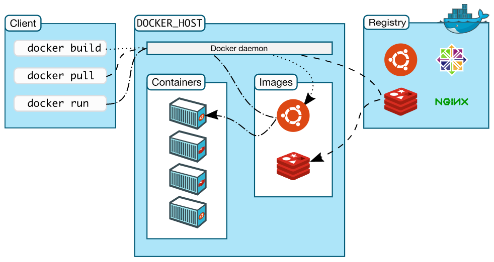
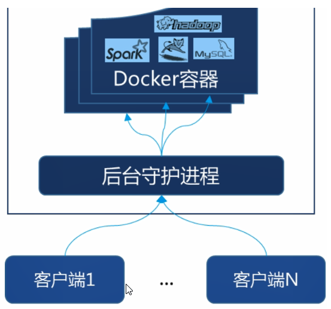

> *`Author: ACatSmiling`*
>
> *`Since: 2024-10-13`*

## Docker 的理念

Docker 是基于 Go 语言实现的云开源项目。

Docker 的主要目标是**`Build，Ship and Run Any App，Anywhere`**，也就是通过对应用组件的封装、分发、部署、运行等生命期的管理，使用户的 App（可以是一个 Web 应用或数据库应用等等）及其运行环境能够做到**`一次封装，到处运行`**。

Linux 容器技术的出现就解决了这样一个问题，而 Docker 就是在它的基础上发展过来的。将应用运行在 Docker 容器上面，而 Docker 容器在任何操作系统上都是一致的，这就实现了跨平台、跨服务器。**只需要一次配置好环境，换到别的机子上就可以一键部署好，大大简化了操作。**

总之，Docker 是一个解决了运行环境和配置问题的软件容器，是方便做持续集成并有助于整体发布的容器虚拟化技术。

## Docker 的基本组成

### 架构图



### 镜像（Image）

Docker**`镜像`**就是一个只读的模板。镜像可以用来创建 Docker 容器，一个镜像可以创建很多容器。

镜像与容器的关系类似于面向对象编程中的类与对象：

| Docker | 面向对象 |
| ------ | -------- |
| 镜像   | 类       |
| 容器   | 对象     |

### 容器（Container）

Docker 利用**`容器`**独立运行一个或一组应用。

- **容器是用镜像创建的运行实例。**
- 容器可以被启动、开始、停止、删除。**每个容器都是相互隔离的、保证安全的平台。**

- **容器可以看做是一个简易版的 Linux 环境（包括 root 用户权限、进程空间、用户空间和网络空间等）和运行在其中的应用程序。**
- 容器的定义和镜像几乎一模一样，也是一堆层的统一视角， 唯一区别在于**容器的最上面那一层是可读可写的。**

### 仓库（Repository）

**`仓库`**是集中存放镜像文件的场所。

- 仓库和仓库注册服务器（Registry）是有区别的。仓库注册服务器上往往存放着多个仓库，每个仓库中又包含了多镜像，每个镜像有不同的标签（tag）。
- 仓库分为公开仓库（Public）和私有仓库（Private）两种形式。
- 最大的公开仓库是[`Docker Hub`](https://hub.docker.com/)，存放了数量庞大的镜像供用户下载。国内的公开仓库包括阿里云、网易云等。

### 总结

Docker 本身是一个容器运行载体或称之为管理引擎。我们**把应用程序和配置依赖打包好形成一个可交付的运行环境，这个打包好的运行环境就是 Image 镜像文件。**只有通过这个镜像文件才能生成 Docker 容器。Image 文件可以看作是容器的模板。Docker 根据 Image 文件生成容器的实例。同一个 Image 文件，可以生成多个同时运行的容器实例。

- Image 文件生成的容器实例，本身也是一个文件，称为`镜像文件`。
- 一个容器运行一种服务，当我们需要的时候，就可以通过 Docker 客户端创建一个对应的运行实例，也就是我们的容器。
- 至于仓储，就是放了一堆镜像的地方，我们可以把镜像发布到仓储中，需要的时候从仓储中拉下来就可以了。

## Docker 的工作方式

Docker 是一个`Client-Server 结构`的系统，Docker 守护进程运行在主机上，然后通过 Socket 连接从客户端访问，守护进程从客户端接受命令并管理运行在主机上的容器。**容器，是一个运行时环境，就是我们前面说到的集装箱。**



## Docker 的常用命令

### 帮助命令

```shell
$ docker version

$ docker info

$ docker --help
```

### 镜像命令

**`列出镜像`**：

```shell
$ docker images [OPTIONS]
```

- OPTIONS 说明：
  - `-a`：列出本地所有的镜像（含中间映射层）。
  - `-q`：只显示镜像ID。
  - `--digests`：显示镜像的摘要信息。
  - `--no-trunc`：显示完整的镜像信息。

**`查询镜像`**：

```shell
$ docker search [OPTIONS] 镜像名字
```

- OPTIONS 说明：
  - `--no-trunc`：显示完整的镜像描述。
  - `-s`：列出收藏数不小于指定值的镜像。
  - `--automated`：只列出 automated build 类型的镜像


**`下载镜像`**：

```shell
$ docker pull 镜像名字[:TAG]
```

- "docker pull tomcat" 等价于 "docker pull tomcat:latest"，即默认下载最新版本。

**`删除镜像`**：

- 删除单个镜像：

  ```shell
  $ docker rmi -f 镜像名[:TAG]
  ```

- 删除多个镜像：

  ```shell
  $ docker rmi -f 镜像名1[:TAG] 镜像名2[:TAG] 镜像名3[:TAG] ...
  ```

- 删除全部镜像：

  ```shell
  $ docker rmi -f $(docker images -qa)
  ```

**`保存一个或多个镜像为压缩文件`**：

```shell
# 默认为 .tar 格式
$ docker save [OPTIONS] IMAGE [IMAGE...] > output.tar
```

- OPTIONS 说明：
  - `-o`：指定输出文件的名称和路径，和`>`的作用类似。

**`加载镜像压缩文件到本地仓库`**：

```shell
$ docker load [OPTIONS] < input.tar
```

- OPTIONS 说明：
  - `-i`：指定输入文件，和`<`的作用类似。

**`通过 Dockerfile 构建 Docker 镜像`**：

```shell
$ docker build [OPTIONS] PATH|URL|-
```

- OPTIONS（可选参数）
  - `-t，--tag`：用于给构建的镜像指定标签（名称和版本等信息），格式：`-t <repository>:<tag>`。
    - 例如："docker build -t my-image:latest ."，会构建一个名为 my-image、标签为 latest 的镜像。（注意最后的点表示当前目录是 Dockerfile 所在的目录）
    - 也可以同时指定多个标签，例如："docker build -t my-image:v1 -t my-image:latest ."。
  - `--no-cache`：默认情况下，docker build 会使用缓存来加速构建过程。如果之前已经构建过相同的指令，并且基础镜像和相关文件没有变化，Docker 会使用缓存的结果。但是使用 --no-cache 参数会强制不使用缓存，重新执行所有的构建指令。这在需要确保构建是最新的，或者在调试构建过程中可能出现的问题时很有用。
    - 例如："docker build --no-cache -t my-new-image:latest ."。
  - `-f，--file`：用于指定 Dockerfile 的路径。如果 Dockerfile 不在当前目录或者名称不是 Dockerfile，可以使用这个参数来指定。
    - 例如："docker build -f /path/to/Dockerfile -t my-custom-image:latest ."，其中 /path/to/Dockerfile 是 Dockerfile 的实际路径。
    - 当使用 docker build 命令并指定了`-f`参数时，通常也需要在命令末尾添加一个`.`，这个`.`代表当前目录，是告诉 docker build 命令在构建镜像时，以当前目录作为上下文路径（context path）。
  - --build-arg：用于在构建镜像时传递参数给 Dockerfile 中的 ARG 指令，格式：`--build-arg <key>=<value>`。
    - 例如："docker build --build-arg VERSION=2.0 -t my-image:latest ."，会将 VERSION 变量的值设置为 2.0，在 Dockerfile 中可以使用这个变量来构建不同版本的镜像。
- PATH | URL | -（必需参数）
  - `PATH`：这是最常见的情况，指的是`Dockerfile`所在的本地目录路径。
    - 例如："docker build -t my-image:latest /home/user/docker-project/"，表示在 /home/user/docker-project/ 目录下有 Dockerfile，并且以这个目录为基础构建镜像。
  - `URL`：可以从一个远程的 Dockerfile 仓库（如 Git 仓库）构建镜像。不过这种方式相对复杂，并且需要确保远程仓库的可访问性和 Dockerfile 的正确性。
    - 例如："docker build -t my-remote-image:latest https://github.com/user/docker-project.git#:sub-directory/"，表示从指定的 Git 仓库的子目录下构建镜像。
  - `-`：可以从标准输入读取 Dockerfile 内容来构建镜像。这种方式比较少见，但在一些特殊的自动化构建场景或者与其他工具集成时可能会用到。

### 容器命令

#### 基本操作

**`新建并启动容器`**：

```shell
$ docker run [OPTIONS] IMAGENAME [COMMAND][ARG]
```

- OPTIONS 说明：
  - `-d`：以守护进程（daemon）模式运行容器。
  - `-i`：以交互模式运行容器，保持容器的标准输入（stdin）打开。通常与`-t`参数一起使用。
  - `-t`：为容器分配一个伪终端（tty），使得容器内的命令输出更像是在本地终端中执行一样。常与`-i`参数一起使用，形成`-it`组合。
  - `-p`：将容器内部的端口映射到主机（宿主机）的端口。格式：
    - `-p <host-port>:<container-port>`
    - `-p <ip-address>:<host-port>:<container-port>`
  - `-P`：将容器内部所有声明了的端口（即通过 EXPOSE 指令在 Dockerfile 中声明的端口）自动映射到主机的随机端口。
  - `-v`：将主机的目录或者文件挂载到容器内，或者创建一个具名数据卷并挂载到容器内。格式：
    - `-v <host-dir>:<container-dir>`
    - `-v <volume-name>:<container-dir>`
  - `-e`：设置容器内的环境变量，格式：`-e <key>=<value>`。
    - 例如，"docker run -e MY_APP_VERSION=1.0 nginx" 会在容器内设置一个名为 MY_APP_VERSION 的环境变量，其值为 1.0。
  - `--name`：为容器指定一个名称，若不指定，由系统随机分配。
  - `--restart`：设置容器的重启策略。取值：
    - `no`：默认值，不重启。
    - `on-failure`：容器退出非 0 状态码时重启。
    - `always`：无论容器如何退出都重启。
    - `unless-stopped`：容器退出时重启，除非手动停止。
  - `--network`：将容器连接到指定的网络。取值：
    - `bridge`：默认网络。
    - `host`：容器使用主机网络。
    - `none`：容器没有网络。
    - `自定义网络`。
  - `--rm`：在容器退出后自动删除容器。
  - `--cpus`和`--memory`：--cpus 用于限制容器可以使用的 CPU 核心数，--memory 用于限制容器可以使用的内存大小。
    - 例如，"docker run --cpus=2 --memory=1G nginx" 会限制 Nginx 容器最多使用 2 个 CPU 核心和 1GB 的内存。

**`列出当前所有正在运行的容器`**：

```shell
$ docker ps [OPTIONS]
```

- OPTIONS 说明：
  - `-a`：显示所有的容器，包括正在运行的和已经停止的。默认情况下，docker ps 只显示正在运行的容器。
  - `-q`：以安静模式输出，只返回容器的 ID。这在需要将容器 ID 作为其他命令（如 docker stop、docker rm 等）的参数时特别方便。
  - `-n`：显示最近创建的 n 个容器，包括正在运行的和已经停止的。
  - `-l`：显示最新创建的容器，包括正在运行的和已经停止的。它和 "-n 1" 有点类似，但更强调是最后一个创建的容器。
  - `-s`：显示每个容器所占用的磁盘空间大小。这包括容器的读写层（用于存储容器内修改的数据）以及容器所使用的基础镜像的大小。
  - `--format`：按照指定的格式输出容器信息，格式可以使用 Go 语言的模板语法进行自定义。
    - 例如，`docker ps --format "table {{.ID}}\t{{.Names}}\t{{.Status}}"`会以表格形式输出容器的 ID、名称和状态信息，并且可以根据自己的需求调整表格的列内容和格式。
  - `--no-trunc`：不截断输出。在默认情况下，docker ps 会截断（truncate）容器 ID 和其他一些信息，以方便在终端中显示，使其输出更加整洁。但是，当使用 --no-trunc 参数时，docker ps 将不会截断容器 ID、镜像名称和其他相关信息，会完整地显示所有内容。


**`停止正在运行的容器`**：

```shell
$ docker stop <container_id_or_name>
```

**`启动已停止的容器`**：

```shell
$ docker start <container_id_or_name>
```

- 如果容器之前从未运行过，这个命令是无法启动它的，它的作用是恢复已经创建但当前处于停止状态的容器运行。

**`重新启动容器`**：

```shell
$ docker restart <container_id_or_name>
```

- 先停止容器，然后再重新启动它。即，不管容器当前是运行状态还是停止状态，docker restart 都会先终止容器进程，然后重新创建容器进程使其运行。相当于执行了一次 docker stop 和一次 docker start 的组合操作。

**`删除容器`**：

```shell
# 删除已经停止的容器
$ docker rm <container_id_or_name>

# 强制删除正在运行的容器
$ docker rm -f <container_id_or_name>

# 删除已停止的所有容器
$ docker rm -f $(docker ps -a -f "status=exited")
$ docker ps -a -f "status=exited" | xargs docker rm

# 删除所有容器，包括已经停止和正在运行的容器
$ docker rm -f $(docker ps -aq)
$ docker ps -aq | xargs docker rm
```

**`强制终止正在运行的容器`**：

```shell
$ docker kill <container_id_or_name>
```

#### 信息查看

**`查看容器详细信息`**：

```shell
$ docker inspect <container_id_or_name>
```

- 返回一个容器的详细配置信息，包括网络设置、挂载点、环境变量等，信息以 JSON 格式呈现。

**`查看容器日志`**：

```shell
$ docker logs [OPTIONS] <container_id_or_name>
```

- OPTIONS 说明：
  - `-t`：添加时间戳。
  - `-f`：跟踪最新的日志打印。
  - `--tail number`：显示最后 number 条。

**`查看正在运行的容器内的进程信息`**：

```shell
$ docker top [OPTIONS] <container_id_or_name> [ps OPTIONS]
```

- OPTIONS 说明：
  - `-f`：持续跟踪容器内进程信息的更新。
- ps OPTIONS 说明：
  - docker top 命令在内部是通过类似 ps （进程查看）命令来获取进程信息的，所以可以在这里传递一些 ps 命令的选项来定制输出。
  - 例如，-aux 是 ps 命令的常见选项，用于显示所有用户的所有进程（包括没有控制终端的进程）的详细信息，不过在 docker top 中使用这些选项可能会受到一定限制，具体取决于 Docker 的实现。

#### 容器交互

**`连接到正在运行容器的标准输入、输出和错误（stdin、stdout、stderr）流`**：

```shell
$ docker attach <container_id_or_name>
```

- 能够查看容器内主进程的输出，并在一定程度上与之交互。
- docker attach 直接关联到容器的主进程，主进程结束会导致容器停止。

**`进入容器内部，并开启一个新的 bash 进程`**：

```shell
$ docker exec -it <container_id_or_name> /bin/bash
```

- 会在容器已经运行的主进程之外，启动一个新的进程来执行指定的命令。

- docker exec 在容器内启动新的独立进程，新进程结束不会影响容器的主进程和容器的运行状态。

- 特例：以交互模式并带有伪终端的方式，在指定的 Docker 容器内部执行 "ls -l /tmp" 命令，从而查看该容器内 /tmp 目录下文件和目录的详细信息，并将结果展示在宿主机上的当前窗口。

  ```shell
  $ docker exec -it <container_id_or_name> ls -l /tmp
  ```

**`容器与宿主机之间进行数据拷贝`**：

```shell
# 从容器复制到宿主机
$ docker cp [OPTIONS] CONTAINER:SRC_PATH DEST_PATH

# 从宿主机复制到容器
$ docker cp [OPTIONS] SRC_PATH CONTAINER:DEST_PATH
```

- 在复制文件或目录时，需要确保目标路径在容器内或本地文件系统中，有足够的权限进行写入操作。
- 当复制目录时，docker cp 命令会递归地复制目录及其所有内容。

**`退出容器`**：

```shell
# 等同于 Ctrl + D 快捷键
$ exit
```

#### 容器迁移

**`导出容器的文件系统`**：

```shell
# 通常为 .tar 格式
$ docker export [OPTIONS] CONTAINER > output.tar
```

- OPTIONS 说明：
  - `-o`：指定输出文件的名称和路径，和 > 的作用类似。
- 与 docker save 不同的是，docker export 重点关注容器内部的文件系统内容，它不会包含镜像的元数据（如分层信息、标签、构建历史等）。这种方式导出的文件可以看作是对容器在某一时刻的文件系统状态的一个 "快照"。
- 当使用 docker export 时，导出的文件包含了容器内文件系统中的所有文件和目录。这包括应用程序文件、配置文件、数据文件等一切存储在容器文件系统中的内容。但是，由于没有包含镜像的元数据，所以通过 docker import （与 docker export 相对应的导入命令）导入后得到的新镜像，其历史记录和构建相关的信息是缺失的。这意味着新镜像更像是一个基于容器文件系统内容创建的基础镜像，与原来的镜像在构建和维护信息上没有关联。
- 应用场景示例：
  - **创建自定义基础镜像**：如果在一个容器中对软件环境进行了特定的配置（如安装了一些特殊的软件包组合、修改了配置文件等），并且希望以这个容器的文件系统为基础创建一个新的基础镜像，docker export 就非常有用。例如，在开发一个定制化的 Web 服务器环境时，在一个容器中安装了特定版本的 Web 服务器软件、配置了安全证书和自定义的服务器规则。通过 docker export 将这个容器的文件系统导出，然后使用 docker import 可以将其转换为一个新的基础镜像，用于后续创建更多具有相同环境设置的容器。
  - **迁移容器文件系统**：当需要将一个容器的文件系统迁移到其他环境（例如从开发环境迁移到测试环境），并且不关心镜像的构建历史和其他元数据时，可以使用 docker export。假设在开发环境中有一个容器，其中包含了正在开发的应用程序及其相关的数据和配置。将这个容器的文件系统导出后，可以在测试环境中通过 docker import 将其转换为新的镜像，进而创建容器进行测试，这样可以方便地在不同环境之间传递容器内的实际文件内容。
  - **分享容器文件系统内容**：有时候，可能只需要与他人分享容器内部的文件系统内容，而不是完整的镜像。例如，在团队协作中，已经在一个容器中构建了一个特定的项目环境，包括项目文件、依赖库等。使用 docker export 可以将这个容器的文件系统打包成一个文件，然后分享给团队成员。团队成员可以通过 docker import 将其导入到自己的环境中，查看和使用容器内的文件，而不需要关心镜像的其他信息，如它是如何构建的、使用了哪些基础镜像等。

**`导入容器的文件系统`**：

```shell
$ docker import [OPTIONS] file [REPOSITORY[:TAG]]
```

- OPTIONS 是可选参数，file 是要导入的文件（通常是一个 .tar 文件），REPOSITORY[:TAG] 是可选的镜像仓库名称和标签。
- 导入后的镜像特点：
  - 当通过 docker import 创建新镜像时，这个镜像实际上是一个全新的基础镜像。它没有之前镜像的构建历史和分层信息，就好像是直接从一个文件系统 “快照” 创建的。这意味着新镜像的大小可能会比原始镜像小，因为它没有包含那些用于构建和维护镜像的额外元数据。
  - 新镜像的启动方式等特性需要用户重新定义或者基于导入文件中的内容来推断。例如，没有了原来镜像的入口点（ENTRYPOINT）和命令（CMD）等元数据，在使用新镜像创建容器时，可能需要手动指定要运行的命令或者根据文件系统中的内容来确定合适的启动方式。
- 应用场景示例：
  - **基于容器文件系统创建新镜像**：如果已经使用 docker export 从一个容器中获取了其文件系统内容（例如，一个经过特殊配置的应用容器），可以使用 docker import 将其转换为一个新的镜像。例如，在一个容器中对数据库服务器进行了特定的配置（如修改了数据库的参数、导入了测试数据等），通过 docker export 将容器文件系统导出为一个文件，然后使用 docker import 将这个文件转换为一个新的镜像，用于创建具有相同配置的数据库容器，方便在不同环境（如开发、测试、生产）中进行部署。
  - **自定义基础镜像构建**：假设你有一个容器，其中包含了自己定制的软件工具链和开发环境（如安装了特定版本的编程语言编译器、代码格式化工具等）。使用 docker export 将这个容器的文件系统导出，然后通过 docker import 创建一个新的镜像，这个新镜像就可以作为自定义的基础镜像，用于后续开发其他容器，例如在这个基础镜像上构建和测试新的软件项目。

## Dockerfile 解析

**`Dockerfile`**：是一个文本文件，用于定义如何构建一个 Docker 镜像。它包含了一系列指令，这些指令按顺序执行，从一个基础镜像开始，逐步添加文件、安装软件、配置环境等操作，最终构建出一个完整的、符合特定需求的 Docker 镜像。可以把它看作是构建 Docker 镜像的 "配方"。

Dockerfile 的指令：

- `MAINTAINER`：维护者信息指令。
  - 用于指定镜像的维护者信息，格式：`MAINTAINER <name> <email>`。
  - 例如，"MAINTAINER John Doe john.doe@example.com"。
  - 注意：在较新的 Docker 版本中，更推荐使用`LABEL`指令来代替 MAINTAINER 指令来添加维护者信息。
- `FROM`：**基础镜像指令。**
  - 这是构建镜像的起点，格式：`FROM <image>:<tag>`。
  - 例如，"FROM ubuntu:latest" 表示以最新版本的 Ubuntu 操作系统镜像作为基础来构建新镜像。这个基础镜像提供了一个基本的操作系统环境，后续的所有指令都将在这个基础上进行。
- `COPY`和`ADD`：**复制文件指令。**
  - `COPY`用于将本地文件或目录复制到镜像中的指定位置，格式：`COPY <src> <dest>`。
  - 例如，"COPY . /app" 会将当前目录下的所有内容复制到镜像中的 /app 目录下。
  - `ADD`指令功能类似，但更强大，它还可以处理一些特殊情况，如解压本地的压缩文件并将内容复制到镜像中。不过，**在大多数情况下，推荐使用 COPY，因为 ADD 的功能可能会导致一些非预期的行为。**
- `RUN`：**运行命令指令。**
  - 用于在镜像构建过程中执行命令，格式：`RUN <command>`。
  - 例如，"RUN apt-get update && apt-get install - y python3" 会在镜像构建过程中更新软件包列表并安装 Python 3。这些命令会在基础镜像的环境中执行，并且每一个 RUN 命令都会在镜像中创建一个新的层，所以尽量将多个相关的命令合并成一个 RUN 命令，以减少镜像的层数和大小。
- `WORKDIR`：**工作目录指令。**
  - 用于设置容器内的工作目录，格式：`WORKDIR <path>`。
  - 例如，"WORKDIR /app" 会将容器内的工作目录设置为 /app。之后的 COPY、RUN 等指令如果涉及相对路径，都将以这个工作目录为基准。
- `ENV`：**环境变量指令。**
  - 用于设置环境变量，格式：`ENV <key> <value>`。
  - 例如，"ENV MY_APP_VERSION 1.0" 会在镜像中设置一个名为 MY_APP_VERSION 的环境变量，其值为 1.0。环境变量可以在容器运行时被应用程序读取，用于配置等目的。
- `CMD`和`ENTRYPOINT`：**容器启动命令指令。**
  - `CMD`用于指定容器启动时默认执行的命令，格式：`CMD ["<executable>", "<param1>", "<param2>"]`。
  - 例如，"CMD ["python3", "app.py"]" 表示容器启动时默认运行 python3 app.py。
  - `ENTRYPOINT`的功能类似，但更侧重于定义容器启动的固定入口，而 CMD 的参数可以在容器启动时被覆盖。它们可以一起使用，ENTRYPOINT 定义入口，CMD 提供默认参数。

- `EXPOSE`：**容器端口指令。**
  - 用于声明容器在运行时监听的网络端口，格式：`EXPOST <port>`。
  - **注意：这只是一种声明，实际上并不自动发布这些端口。**
  - 例如，"EXPOSE 80" 表示容器内的应用程序可能会在端口 80 上监听服务请求，但要使这个端口能够被外部访问，还需要在运行容器时使用`-p`或`-P`选项（`-p`用于指定端口映射，`-P`用于自动发布所有声明的端口）。
- `VOLUME`：**容器数据卷指令。**
  - 用于创建一个可以从容器外部挂载的数据卷或者指定容器内的挂载点，数据卷可以在容器和宿主机之间共享数据，或者在多个容器之间共享数据。格式：`VOLUME ["<volume-path-in-container>"]`或者`VOLUME <volume-path-in-container>`。
  - 例如，VOLUME /data 会在容器内创建一个 /data 数据卷，这个数据卷可以用于存储数据，并且可以在容器运行时从外部挂载不同的存储设备或者目录。
- `USER`：**用户设置指令。**
  - 用于设置在容器内运行后续命令（如 RUN、CMD、ENTRYPOINT）时使用的用户。格式：`USER <user>`或`USER <user>:<group>`。
  - 例如，"USER nobody" 表示在容器内执行后续命令时将以 nobody 用户身份运行，这对于提高容器的安全性很有用，特别是当容器内运行的应用程序不需要超级用户权限时。
- `LABEL`：**镜像标签指令。**
  - 用于为镜像添加元数据标签，格式：`LABEL <key>=<value>`。
  - 可以添加多个标签，例如，"LABEL maintainer="example@example.com" version="1.0""。这些标签可以用于描述镜像的各种信息，如维护者联系方式、版本号、应用程序名称等。
- `ARG`：**参数定义指令。**
  - 用于在构建镜像时定义可以从外部传入的变量，格式：`ARG <variable-name>`。
  - 例如，"ARG VERSION" 定义了一个名为 VERSION 的变量，可以在构建镜像时通过`--build-arg`选项传入变量的值，如 docker build --build-arg VERSION=2.0 -t my-image:latest。
- `HEALTHCHECK`：**健康检查指令。**
  - 用于设置容器的健康检查机制，可以通过指定命令来检查容器内的应用程序是否健康运行。
  - 例如，`HEALTHCHECK --interval=5m --timeout=3s CMD ["curl", "-f", "http://localhost/"]`，表示每隔 5 分钟检查一次，检查命令超时时间为 3 秒，检查内容是通过 curl 访问本地网站是否正常。

Dockerfile 构建镜像的过程：

- 当使用 docker build 命令并指定包含 Dockerfile 的目录时，Docker 会读取 Dockerfile 中的指令。
- 首先，它会拉取 FROM 指令指定的基础镜像。
- 然后，按照顺序依次执行后续的指令，每执行一个指令，就会在基础镜像的基础上创建一个新的层，这些层叠加在一起最终形成了完整的镜像。
- 在构建过程中，如果某个指令失败，构建过程会停止，并且之前构建的层仍然保留，以便于调试和重新构建。

## 原文链接

https://github.com/ACatSmiling/zero-to-zero/blob/main/Operation/docker.md