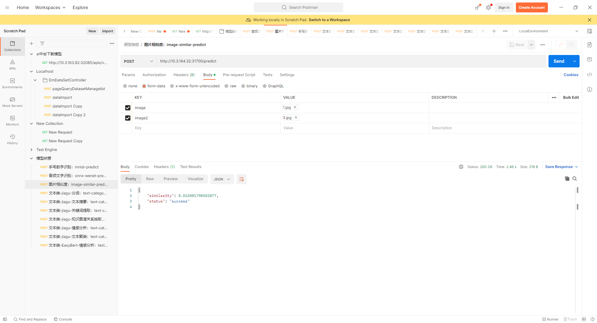

> `Author: ACatSmiling`
>
> `Since: 2024-11-23`

内网机加载 Docker 镜像，并使用 Flask 封装接口。

1. 此步骤针对内网机，首先，上传打包好的基础镜像文件到服务器，然后加载。

   ```shell
   [root@zeloud ~]# docker load -i similar.tar 
   9853575bc4f9: Loading layer [==================================================>]  77.83MB/77.83MB
   1505ca8b8119: Loading layer [==================================================>]  9.539MB/9.539MB
   3548b2e74780: Loading layer [==================================================>]  32.89MB/32.89MB
   2b728766068e: Loading layer [==================================================>]  4.608kB/4.608kB
   63d299102447: Loading layer [==================================================>]  12.08MB/12.08MB
   9967d022da90: Loading layer [==================================================>]  2.048kB/2.048kB
   e8f0676a25c7: Loading layer [==================================================>]   2.56kB/2.56kB
   d495473888f3: Loading layer [==================================================>]  6.656kB/6.656kB
   9ebdfa55c24e: Loading layer [==================================================>]  241.8MB/241.8MB
   24ac2bd8b6a9: Loading layer [==================================================>]  15.67MB/15.67MB
   77faf2b53f78: Loading layer [==================================================>]  1.025GB/1.025GB
   b8e9b30bceef: Loading layer [==================================================>]  820.6MB/820.6MB
   5a00afc95457: Loading layer [==================================================>]  829.3MB/829.3MB
   Loaded image: 10.3.170.88:5000/user/admin/similar:latest
   ```

2. 根据实际情况，确定是否需要重新打标签。

   ```shell
   [root@zeloud ~]# docker images | grep /user/admin
   10.3.164.57:5000/user/admin/similar                                 flask                         3d4e06e095fa   3 days ago      3.03GB
   10.3.170.88:5000/user/admin/onnxruntime                             wenet3                        03298f22daff   5 days ago      4.83GB
   registry.zeloud.com:5000/user/admin/onnxruntime                     wenet3                        03298f22daff   5 days ago      4.83GB
   10.3.170.88:5000/user/admin/esr_train_img                           v1.1.0                        18d583b4bbaf   6 weeks ago     24.2GB
   10.3.170.88:5000/user/admin/segan_2.2_docker                        v1.1                          b2118a02a24d   6 weeks ago     31.7GB
   10.3.170.88:5000/user/admin/segan_2.2_docker                        v1.0                          040f7f705966   6 weeks ago     31.7GB
   10.3.170.88:5000/user/admin/esr_train_img                           v1.0.0                        0212bfcc9ba6   6 months ago    24.2GB
   10.3.170.88:5000/user/admin/pytorch-py38-cuda11                     base-centos7                  c806bde76f8c   7 months ago    5.95GB
   10.3.170.88:5000/user/admin/fairseq-tools-202103                    v1.0                          ed750c76036b   13 months ago   21.3GB
   10.3.170.88:5000/user/admin/obj_detect_v1                           latest                        d64244ed90a3   14 months ago   5.64GB
   10.3.170.88:5000/user/admin/segan_2.1_docker                        latest                        d9565fdef5ad   17 months ago   31.7GB
   [root@zeloud ~]# docker tag 10.3.164.57:5000/user/admin/similar:flask 10.3.170.88:5000/user/admin/image-similar:dinov2
   [root@zeloud ~]# docker images | grep /user/admin
   10.3.164.57:5000/user/admin/image-similar                           dinov2                        3d4e06e095fa   3 days ago      3.03GB
   10.3.164.57:5000/user/admin/similar                                 flask                         3d4e06e095fa   3 days ago      3.03GB
   10.3.170.88:5000/user/admin/onnxruntime                             wenet3                        03298f22daff   5 days ago      4.83GB
   registry.zeloud.com:5000/user/admin/onnxruntime                     wenet3                        03298f22daff   5 days ago      4.83GB
   10.3.170.88:5000/user/admin/esr_train_img                           v1.1.0                        18d583b4bbaf   6 weeks ago     24.2GB
   10.3.170.88:5000/user/admin/segan_2.2_docker                        v1.1                          b2118a02a24d   6 weeks ago     31.7GB
   10.3.170.88:5000/user/admin/segan_2.2_docker                        v1.0                          040f7f705966   6 weeks ago     31.7GB
   10.3.170.88:5000/user/admin/esr_train_img                           v1.0.0                        0212bfcc9ba6   6 months ago    24.2GB
   10.3.170.88:5000/user/admin/pytorch-py38-cuda11                     base-centos7                  c806bde76f8c   7 months ago    5.95GB
   10.3.170.88:5000/user/admin/fairseq-tools-202103                    v1.0                          ed750c76036b   13 months ago   21.3GB
   10.3.170.88:5000/user/admin/obj_detect_v1                           latest                        d64244ed90a3   14 months ago   5.64GB
   10.3.170.88:5000/user/admin/segan_2.1_docker                        latest                        d9565fdef5ad   17 months ago   31.7GB
   [root@zeloud ~]# docker push 10.3.170.88:5000/user/admin/image-similar:dinov2
   The push refers to repository [10.3.170.88:5000/user/admin/image-similar]
   Get "https://10.3.170.88:5000/v2/": http: server gave HTTP response to HTTPS client
   ```

3. 查看 Docker 基础镜像，是否已安装 Flask，如果没有，则 pip 安装。

   ```shell
   [root@zeloud ~]# docker images | grep similar
   registry.zeloud.com:5000/user/admin/similar                    latest                e7edddd7af1c   2 days ago      3.02GB
   [root@zeloud ~]# docker run -it --rm --entrypoint /bin/bash e7edddd7af1c
   root@bb3bfdda299e:/app# pip --version
   pip 24.2 from /usr/local/lib/python3.10/site-packages/pip (python 3.10)
   root@bb3bfdda299e:/app# python --version
   Python 3.10.14
   root@bb3bfdda299e:/app# pip list | grep Flask
   root@bb3bfdda299e:/app# pip install flask -i https://depend.zeloud.com/artifactory/api/pypi/pypi-repo/simple
   Looking in indexes: https://depend.zeloud.com/artifactory/api/pypi/pypi-repo/simple
   Collecting flask
     Downloading https://depend.zeloud.com/artifactory/api/pypi/pypi-repo/packages/packages/af/47/93213ee66ef8fae3b93b3e29206f6b251e65c97bd91d8e1c5596ef15af0a/flask-3.1.0-py3-none-any.whl (102 kB)
   Collecting Werkzeug>=3.1 (from flask)
     Downloading https://depend.zeloud.com/artifactory/api/pypi/pypi-repo/packages/packages/52/24/ab44c871b0f07f491e5d2ad12c9bd7358e527510618cb1b803a88e986db1/werkzeug-3.1.3-py3-none-any.whl (224 kB)
   Requirement already satisfied: Jinja2>=3.1.2 in /usr/local/lib/python3.10/site-packages (from flask) (3.1.3)
   Collecting itsdangerous>=2.2 (from flask)
     Downloading https://depend.zeloud.com/artifactory/api/pypi/pypi-repo/packages/packages/04/96/92447566d16df59b2a776c0fb82dbc4d9e07cd95062562af01e408583fc4/itsdangerous-2.2.0-py3-none-any.whl (16 kB)
   Requirement already satisfied: click>=8.1.3 in /usr/local/lib/python3.10/site-packages (from flask) (8.1.7)
   Collecting blinker>=1.9 (from flask)
     Downloading https://depend.zeloud.com/artifactory/api/pypi/pypi-repo/packages/packages/10/cb/f2ad4230dc2eb1a74edf38f1a38b9b52277f75bef262d8908e60d957e13c/blinker-1.9.0-py3-none-any.whl (8.5 kB)
   Requirement already satisfied: MarkupSafe>=2.0 in /usr/local/lib/python3.10/site-packages (from Jinja2>=3.1.2->flask) (2.1.5)
   Installing collected packages: Werkzeug, itsdangerous, blinker, flask
   Successfully installed Werkzeug-3.1.3 blinker-1.9.0 flask-3.1.0 itsdangerous-2.2.0
   WARNING: Running pip as the 'root' user can result in broken permissions and conflicting behaviour with the system package manager, possibly rendering your system unusable.It is recommended to use a virtual environment instead: https://pip.pypa.io/warnings/venv. Use the --root-user-action option if you know what you are doing and want to suppress this warning.
   
   [notice] A new release of pip is available: 24.2 -> 24.3.1
   [notice] To update, run: pip install --upgrade pip
   root@bb3bfdda299e:/app# pip list | grep Flask
   Flask              3.1.0
   ```

   >安装 Flask 如果碰到依赖冲突，可以强制安装：
   >
   >```shell
   >root@bb3bfdda299e:/# pip install blinker==1.9 --ignore-installed -i https://depend.zeloud.com/artifactory/api/pypi/pypi-repo/simple
   >```

4. 新打开一个终端，查看上一步生成的容器，commit 为新镜像，并 push 到仓库，然后，退出上一步生成的容器。

   ```shell
   [root@zeloud ~]# docker ps | grep e7edddd7af1c
   bb3bfdda299e   e7edddd7af1c                                         "bash"                   8 minutes ago   Up 8 minutes                                                                                                               dazzling_clarke
   [root@zeloud ~]# docker commit bb3bfdda299e 10.3.170.88:5000/user/admin/similar:flask
   sha256:3d4e06e095fa5e222ac2e3798ac0642221356fc1191a759f34bc0d451ad9985c
   [root@zeloud ~]# docker push 10.3.170.88:5000/user/admin/similar:flask
   The push refers to repository [10.3.170.88:5000/user/admin/similar]
   96894b0a9bbe: Pushed 
   5a00afc95457: Pushed 
   b8e9b30bceef: Pushed 
   77faf2b53f78: Pushed 
   24ac2bd8b6a9: Pushed 
   9ebdfa55c24e: Pushed 
   d495473888f3: Pushed 
   e8f0676a25c7: Pushed 
   9967d022da90: Pushed 
   63d299102447: Pushed 
   2b728766068e: Pushed 
   3548b2e74780: Pushed 
   1505ca8b8119: Pushed 
   9853575bc4f9: Pushed 
   flask: digest: sha256:8822d2a1476f0b58852052074e9165de27db8a90e93d3dd0b2ab5cdde5a8e718 size: 3266
   [root@zeloud onnx-wenet-predict]# docker images | grep similar
   10.3.170.88:5000/user/admin/similar                    flask                 3d4e06e095fa   6 minutes ago   3.03GB
   10.3.170.88:5000/user/admin/similar                    latest                e7edddd7af1c   2 days ago      3.02GB
   ```

5. 如果需要迁移到其他内网机，可以将新镜像保存到本地，拷贝之后，使用 docker load 命令加载。

   ```shell
   # 打包保存
   [root@zeloud ~]# docker save -o similar_flask.tar 10.3.170.88:5000/user/admin/similar:flask
   
   # 或者打包之后进行压缩，docker load 之前，需要先 gunzip 解压
   [root@zeloud ~]# docker save 10.3.170.88:5000/user/admin/similar:flask | gzip > ./similar_flask.tar.gz
   ```

6. 使用新镜像启动容器，挂载 Flask 封装接口的路径。如果镜像没有默认启动 bash，则在 -c 参数前面加上 /bin/bash。如果希望后台启动，则添加 -d 参数。

   ```shell
   [root@xd-dev2 admin]# docker run -it --rm -p 31700:7000 -v /zeloud/volume/turing/gv1/admin/similar-predict/:/zeloud/similar-predict 3d4e06e095fa -c "cd /zeloud/similar-predict/ && python flask-app.py" 
    * Serving Flask app 'flask-app'
    * Debug mode: off
   WARNING: This is a development server. Do not use it in a production deployment. Use a production WSGI server instead.
    * Running on all addresses (0.0.0.0)
    * Running on http://127.0.0.1:7000
    * Running on http://172.17.0.7:7000
   Press CTRL+C to quit
   ```

   > 查看镜像的信息：
   >
   > ```shell
   > $ docker inspect <imageId>
   > ```

7. postman 请求调用示例：

   

8. Flask 封装接口示例：

   ```python
   from flask import Flask, request, jsonify
   import subprocess
   import os
   import io
   import torch
   from transformers import AutoImageProcessor, AutoModel
   from PIL import Image
   import torch.nn as nn
   
   app = Flask(__name__)
   
   def convert(image_data):
       image_stream = io.BytesIO(image_data)
       return Image.open(image_stream)
   
   @app.route("/predict", methods=["POST"])
   def predict():
       try:
           # 获取请求中的图片数据
           if 'image' not in request.files:
               return jsonify({"error": "No image file in the request"}), 400
           if 'image2' not in request.files:
               return jsonify({"error": "No pk image file in the request"}), 400
   
           image_data = request.files['image'].read()
           image2_data = request.files['image2'].read()
   
           # 将图片数据转换为 PIL 的 Image 格式
           image1 = convert(image_data)
           image2 = convert(image2_data)
   
           # 设置设备为GPU，如果不可用则使用CPU
           device = torch.device('cuda' if torch.cuda.is_available() else "cpu")
   
           # 加载预训练的图像处理器
           processor = AutoImageProcessor.from_pretrained('./models/dinov2-base',
                                                           local_files_only=True)
   
           # 加载预训练的模型，并将其移至相应的设备（GPU或CPU）
           model = AutoModel.from_pretrained('./models/dinov2-base',
                                           local_files_only=True).to(device)
   
           # 打开第一张图片
           # image1 = Image.open('5.jpg')
   
           # 不计算梯度，用于推断
           with torch.no_grad():
               # 使用处理器处理图像，转换为PyTorch张量，并移至相应设备
               inputs1 = processor(images=image1, return_tensors="pt").to(device)
               # 通过模型获取输出
               outputs1 = model(**inputs1)
               # 获取最后一层的隐藏状态
               image_features1 = outputs1.last_hidden_state
               # 对特征取平均，以得到单个向量表示
               image_features1 = image_features1.mean(dim=1)
               print(f"outputs1 is {image_features1.shape}")
   
           # 重复上述过程，处理第二张图片
           # image2 = Image.open('3.jpg')
           with torch.no_grad():
               inputs2 = processor(images=image2, return_tensors="pt").to(device)
               outputs2 = model(**inputs2)
               image_features2 = outputs2.last_hidden_state
               image_features2 = image_features2.mean(dim=1)
               print(f"outputs2 is {image_features2.shape}")
   
           # 使用余弦相似度计算两个向量的相似度
           cos = nn.CosineSimilarity(dim=0)
           sim = cos(image_features1[0],image_features2[0]).item()
           # 将相似度值调整到[0,1]范围内
           sim = (sim+1)/2
           print('similarity:', sim)
           return jsonify({'status': 'success', 'similarity': sim})
   
       except Exception as e:
           return jsonify({"error": str(e)})
   
   if __name__ == "__main__":
       app.run(host="0.0.0.0", port=7000)
   ```
