>*`Author: ACatSmiling`*
>
>*`Since: 2024-10-21`*

## 认识 Kubernetes

### 什么是 Kubernetes

官方网站：https://kubernetes.io

**`Kubernetes`**，是 Google 严格保密十几年的秘密武器 **Borg 系统**的一个开源版本，于 2014 年 9 月发布第一个版本，2015 年 7 月发布第一个正式版本。**Kubernetes 是一个全新的基于容器技术的分布式架构领先方案，提供了应用部署、规划、更新和维护的一种机制，用于管理云平台中多个主机上的容器化的应用，其目标是让部署容器化的应用简单且高效。**

Kubernetes 这个名字源于希腊语，意为 "舵手" 或 "飞行员"，简称 K8s，是用 8 代替 8 个字符 "ubernete" 而成的缩写。

### 为什么需要 Kubernetes

应用部署的三大阶段：

1. 传统部署

   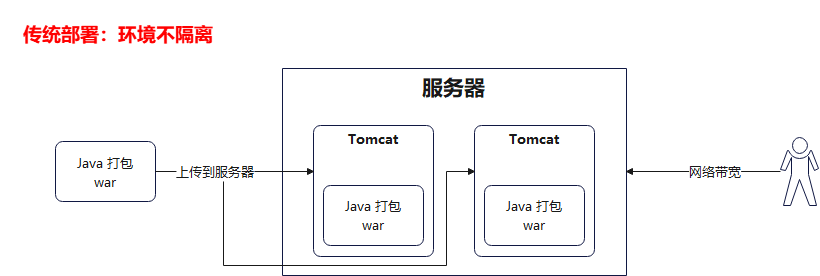

2. 虚拟化部署

   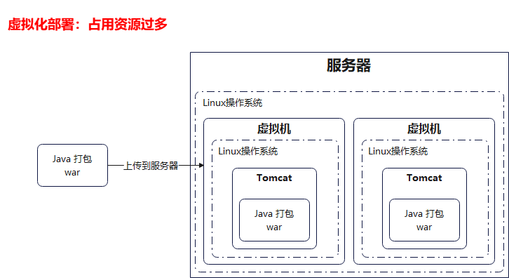

3. 容器化部署

   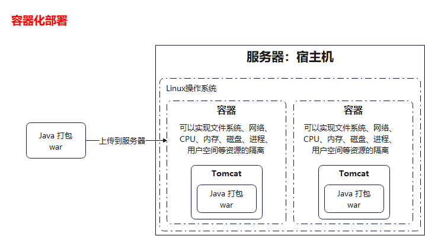

Kubernetes 的本质是一组服务器集群，它可以在集群的每个节点上运行特定的程序，来对节点中的容器进行管理。目的是实现资源管理的自动化，主要提供了如下的主要功能：

- `自我修复`：一旦某一个容器崩溃，能够在 1 秒左右迅速启动新的容器。
- `弹性伸缩`：可以根据需要，自动对集群中正在运行的容器数量进行调整。
- `服务发现`：服务可以通过自动发现的形式找到它所依赖的服务。
- `负载均衡`：如果一个服务起动了多个容器，能够自动实现请求的负载均衡。
- `版本回退`：如果发现新发布的程序版本有问题，可以立即回退到原来的版本。
- `存储编排`：可以根据容器自身的需求自动创建存储卷。

## 集群架构与组件

### Kubernetes  vs Borg 

Borg：

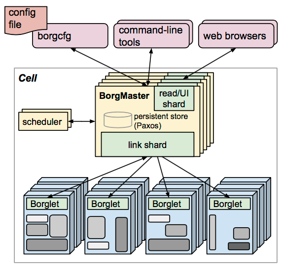

Kubernetes：

### 相关组件

#### 控制面板主件（Master）

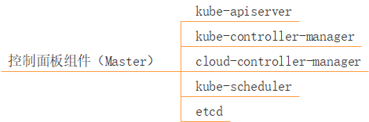

图解：

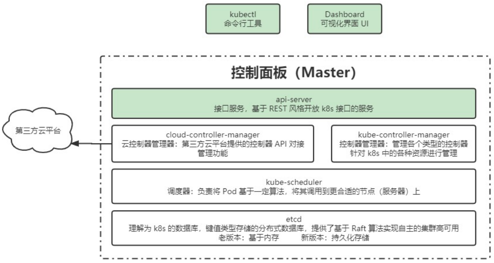

#### 节点组件（Node）

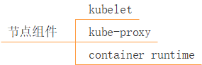

图解：

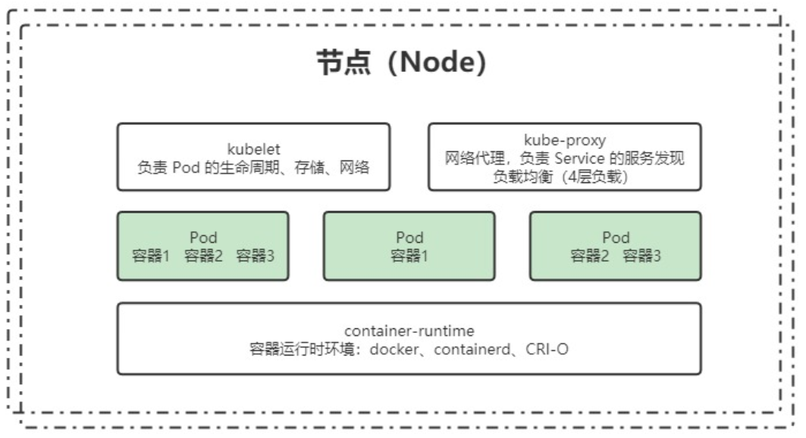

#### 附加组件

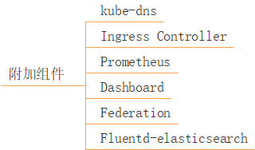

- kube-dns：负责为整个集群提供 DNS 服务。
- Ingress Controller：为服务提供外网入口。
- Prometheus：提供资源监控。
- Dashboard：提供 GUI。
- Federation：提供跨可用区的集群。
- Fluentd-elasticsearch：提供集群日志采集、存储和查询。

> 附加组件非强制要求安装，根据实际业务需求选择安装。

### 分层架构

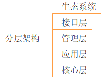

- `管理层`：系统度量（如基础设施、容器和网络的度量）、自动化（如自动扩展、动态 Provision 等），以及策略管理（RBAS、Quota、PSP、NetworkPolicy 等）。
- `应用层`：部署（无状态应用、有状态应用、批处理任务、集群应用等）和路由（服务发现、DNS 解析等）。
- `核心层`：Kubernetes 最核心的功能，对外提供 API 构建高层的应用，对内提供插件式应用执行环境。

图解：

## 核心概念与专业术语

### 服务的分类

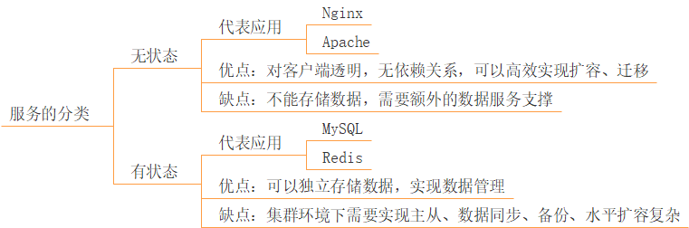

#### 无状态应用

`无状态应用`：不会对本地环境产生任何依赖，例如不会存储数据到本地磁盘。

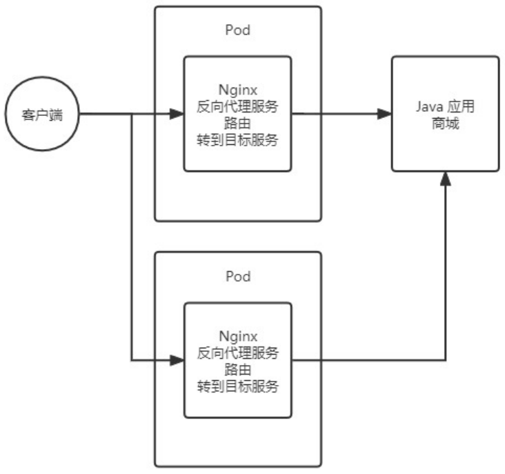

#### 有状态应用

`有状态应用`：会对本地环境产生依赖，例如需要存储数据到本地磁盘。

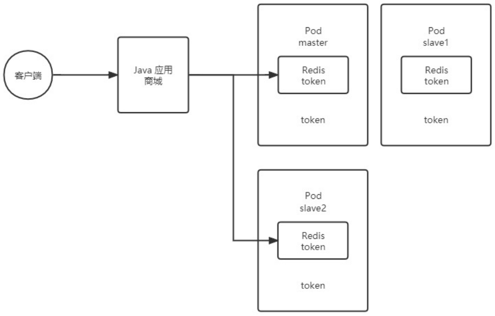

### 资源和对象

Kubernetes 中的所有内容都被抽象为`资源`，如 Pod、Service、Node 等都是资源。`对象是资源的实例`，是持久化的实体，如某个具体的 Pod、某个具体的 Node 等，Kubernetes 使用这些实体去表示整个集群的状态。

- **对象的创建、删除和修改，都是通过 Kubernetes API，也就是 Api Service 组件提供的 API 接口。**这些是 RESTFul 风格的 API，与 Kubernetes 的 "万物皆资源" 理念相符，命令行工具 kubectl，实际上也是调用 Kubernetes API。
- Kubernetes 中的资源类别有很多种，kubectl 可以通过配置文件来创建 "对象"，配置文件更像是描述对象属性的文件。**配置文件格式可以是 JSON 或者 YAML，常用 YAML。**

#### 资源的分类

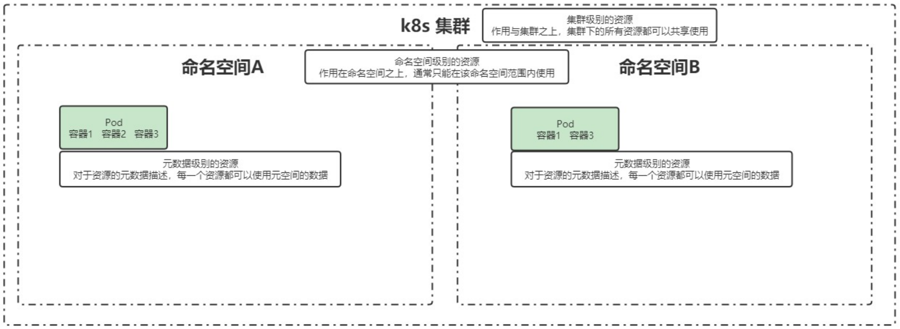

> Kubernetes 中的资源，不仅限于集群级、命名空间级、元数据级这三种类型，此处的类型划分，更多是为了理解不同资源的使用方式。

##### 集群级

集群级别的资源，作用于集群之上，集群下的所有资源都可以共享使用。

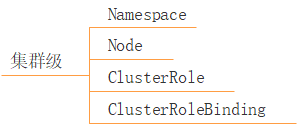

- `Namespace`：命名空间。
- `Node`：不像其他的资源（如 Pod 和 Namespace），Node 本质上不是 Kubernetes 来创建的，Kubernetes 只是管理 Node 上的资源，虽然可以通过 Manifest 创建一个 Node 对象，但 Kubernetes 也只是去检查是否真的有这么一个 Node，如果检查失败，也不会往上调度 Pod。
- `ClusterRole`：鉴权相关。
- `ClusterRoleBinding`：鉴权相关。

##### 命名空间级

命名空间级别的资源，作用于命名空间之上，通常只能在该命名空间范围内使用。

###### 工作负载型

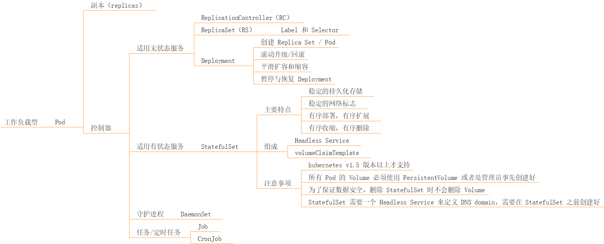

**`Pod`**：**是 Kubernetes 中最小的可部署单元，Pod 是容器组，一个 Pod 包含了一个应用程序容器（在某些情况下是多个容器）、存储资源、一个唯一的网络 IP 地址，以及一些确定容器该如何运行的选项。**Pod 容器组代表了 Kubernetes 中一个独立的应用程序运行实例，该实例可能由单个容器或者几个紧耦合在一起的容器组成。

- Pod 中的容器类型：Docker 是使用最广泛的容器引擎，但是 Kubernetes 在 1.24 版本后就不默认支持 Docker，而是使用 Containerd。
- Pod 的两种使用途径：
  - **一个 Pod 中只运行一个容器。**"one-container-per-pod" 是 Kubernetes 中最常见的使用方式，此时，可以认为 Pod 容器组是该容器的 wrapper，Kubernetes 通过 Pod 管理容器，而不是直接管理容器。
  - **一个 Pod 中运行多个需要互相协作的容器。**可以将多个紧密耦合、共享资源，且始终在一起运行的容器，编排在同一个 Pod 中。

>如图所示，在容器化部署中，我们希望当两个容器有强依赖关系时，它们可以共享网络，或者是希望当两个容器有强依赖关系时，可以实现容器之间文件系统的共享。在没有 Pod 之前，可以通过一些方式实现，比如 --links 参数，或者两个容器共享同一个容器卷，但这些操作都比较麻烦。**在 Pod 中，有一个 pause 容器，可以很好的实现网络、文件系统等的共享。**
>
>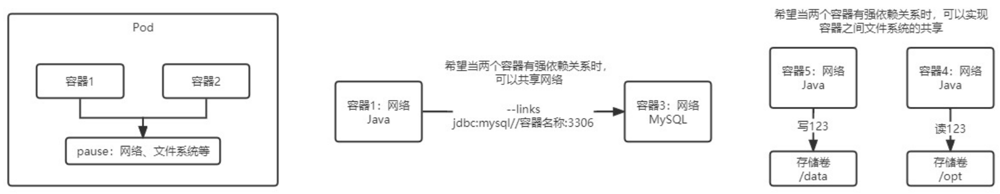

**`Replicas`**：**一个 Pod 可以被复制成多份，每一份可以称之为一个 "副本"。**这些副本除了一些描述性的信息（Pod 的名字，uid 等）不一样外，其他信息都是一样的，例如 Pod 内部的容器、容器数量、容器里面运行的应用等这些信息，这些副本提供同样的功能。

- Pod 的控制器通常包含一个名为 "replicas" 的属性，replicas 属性制定了特定 Pod 的副本的数量。如果当前集群中该 Pod 的数量与该属性指定的值不一样时，Kubernetes 会采取一些策略去使得当前状态满足配置的要求。

**`控制器`**：

- **适用无状态服务：**

  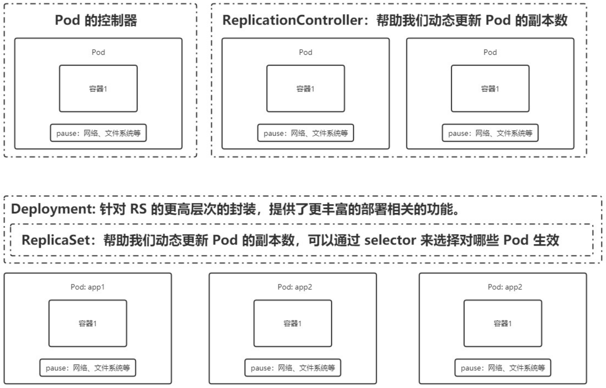

  - `ReplicationController（RC）`：RC 时 Kubernetes 系统中的核心概念之一，简单来说，RC 可以保证在任意时间运行 Pod 的副本数量，能够保证 Pod 总是可用的。如果实际 Pod 数量比指定的多，那就结束掉多的；如果实际 Pod 数量比指定的少，那就新启动一些 Pod。当 Pod 失败、被删除或者挂掉后， RC 都会去自动创建新的 Pod 来保证副本数量。所以，即使只有一个 Pod，也应该使用 RC 来管理。可以说，通过 RC，Kubernetes 实现了 Pod 的高可用性。总之，**RC 的主要作用就是用来确保容器应用的副本数，始终保持在用户定义的副本数。**

  - `ReplicaSet（RS）`：**RC 在 v1.11 版本被废弃，Kubernetes 官方建议使用 RS 替代 RC 进行部署，RS 与 RC 没有本质的不同，只是名字不一样，并且 RS 支持集合式的 Selector。**`RS 可以通过 Selector，选择指定的 Pod 进行动态的更新副本数。`

  - **`Deployment`**：在实际生产中，RC 和 RS 都不会使用，真正使用的是 Deployment，Deployment 是对 RS 更高层次的封装，提供了更丰富的部署相关的功能。

    - **创建 Replica Set / Pod。**

    - **滚动升级/回滚**：升级时，Deployment 基于 RS1，创建一个新的 RS2，在 RS2 中，运行新的 Pod（包含更新的内容），等新的 Pod 正常运行后（可用状态），将 RS1 中旧的 Pod 下线（不可用状态）。然后，在 RS2 中，继续运行一个新的 Pod（包含更新的内容），等待其达到可用状态后，将 RS1 中的第二个 Pod 下线（不可用状态）。至此，RS2 中的 Pod 都变为了可用状态，而 RS1 中的 Pod 都变为了不可用状态。**这个升级过程是滚动的，对于用户是无感知的，无论什么时候，用户都可以正常使用服务。**对于 RS1，会暂时保存不删除，如果需要回滚，则将 RS1 中的 Pod 依次启用，再依次下线 RS2 中的 Pod，最终达到全部回滚。

      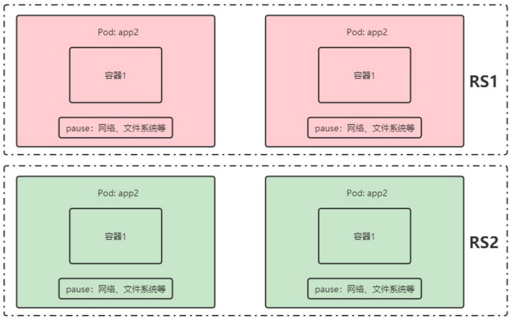

    - **平滑扩容和缩容**：基于 RS 实现的。

    - **暂停与恢复 Deployment。**

- **适用有状态服务：**

  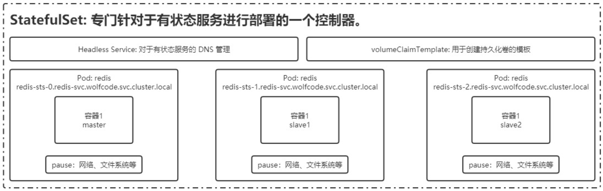

  - **`StatefulSet`**：对于有状态服务，需要考虑网络固定、数据不能丢失、服务部署的顺序得到保障。
    - 主要特点：
      - 稳定的持久化存储。
      - 稳定的网络标志。
      - 有序部署，有序扩展。
        - 即 Pod 是有顺序的，在部署或者扩展的时候，要依据定义的顺序依次进行（从 0 到 N-1，在下一个 Pod 运行之前，所有之前的 Pod 必须都是 Running 和 Ready 状态），基于 init containers 来实现。
      - 有序收缩，有序删除。
    - 组成：
      - **Headless Service**：用于有状态服务的 DNS 管理。DNS：Domain Name Server，域名服务，将域名与 IP 绑定映关系，即 "服务名 => 访问路径（域名）=> IP"。
        - StatefulSet 中每个 Pod 的 DNS 格式为 "statefulSetName-{0...N-1}.serviceName.namespace.svc.cluster.local"。
          - statefulSetName：是 StatefulSet 的名字。
          - 0...N-1：是 Pod 所在的序号，从 0 开始到 N-1。
          - serviceName：是 Headless Service 的名字。
          - namespace：是服务所在的 namespace，StatefulSet 和 Headless Service 必须在相同的 namespace。
          - cluster.local：是 Cluster Domain。
      - **volumeClaimTemplate**：用于创建持久化卷的模板。
    - 注意事项：
      - Kubernetes V1.5 版本以上才支持。
      - 所有 Pod 的 Volume 必须使用 PersistentVolume 或者是管理员事先创建好。
      - 为了保证数据安全，删除 StatefulSet 时不会删除 Volume。
      - StatefulSet 需要一个 Headless Service 来定义 DNS domain，需要在 StatefulSet 之前创建好。

- **守护进程：**

  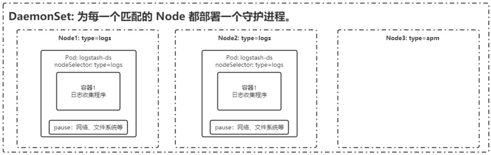

  - **`DaemonSet`**：DaemonSet 保证在每个 Node 上都运行一个容器副本，常用来部署一些集群的日志、监控或者其他系统管理应用。典型的应用包括：
    - 日志收集，比如 fluentld，logstash 等。
    - 系统监控，比如 Prometheus Node Exporter，collectd，New Relic agent，Ganglia gmond 等。
    - 系统程序，比如 kube-proxy，kube-dns，glusterd，ceph 等。

- **任务/定时任务：**

  - **`Job`**：一次性任务，运行完成后 Pod 销毁，不再重新启动新容器。
  - **`CronJob`**：在 Job 的基础上，增加了定时功能。

###### 服务发现

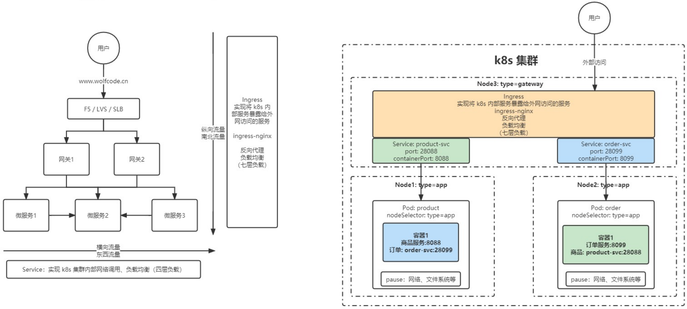

- **`Service`**：简写 svc，Pod 不能直接提供给外网访问，而是应该使用 Service。Service 就是把 Pod 暴露出来提供服务，Service 才是真正的 "服务"，它的中文名就叫 "服务"。可以说 Service 是一个应用服务的抽象，定义了 Pod 逻辑集合和访问这个 Pod 集合的策略。**Service 代理 Pod 集合，对外表现为一个访问入口，访问该入口的请求将经过负载均衡，转发到后端 Pod 中的容器。**
- **`Ingress`**

###### 存储

- **`Volume`**：数据卷，共享 Pod 中容器使用的数据，用来放持久化的数据，比如数据库数据。
- **`CSI`**：Container Storage Interface，是由来自 Kubernetes、Mesos、Docker 等社区成员联合制定的一个行业标准接口规范，旨在将任意存储系统暴露给容器化应用程序。CSI 规范定义了存储提供商实现 CSI 兼容的 Volume Plugin 的最小操作集和部署建议。CSI 规范的主要焦点是声明 Volume Plugin 必须实现的接口。

###### 特殊类型配置

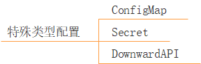

- **`ConfigMap`**
- **`Secret`**
- **`DownwardAPI`**

###### 其他

- **`Role`**
- **`RoleBinding`**

##### 元数据级

元数据级别的资源，对于资源的元数据描述，每一个资源都可以使用元空间的数据。

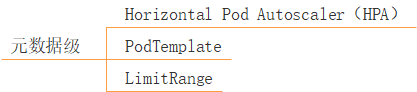

- `Horizontal Pod Autoscaler（HPA）`：Pod 自动扩容，可以根据 CPU 使用率或自定义指标（metrics），自动对 Pod 进行扩/缩容。
  - 控制管理器每隔 30s （可以通过 -horizontal-pod-autoscaler-sync-period 参数修改）查询 metrics 的资源使用情况。
  - 支持三种 metrics 类型：
    - 预定义 metrics：以利用率的方式计算，比如 Pod 的 CPU。
    - 自定义的 Pod metrics：以原始值（raw value）的方式计算。
    - 自定义的 object metrics。
  - 支持两种 metrics 查询方式：Heapster 和自定义的 REST API。
  - 支持多 metrics。
- `PodTemplate`：PodTemplate 时关于 Pod 的定义，但是被包含在其他的 Kubernetes 对象中（例如 Deployment、StatefulSet、DaemonSet 等控制器），控制器通过 PodTemplate 信息来创建 Pod。
- `LimitRange`：可以对集群内 Request 和 Limits 的配置做一个全局的统一的限制，相当于批量设置了某一个范围内（某个命名空间）的 Pod 的资源使用限制。

####  资源的清单

| 参数名                                      | 类型    | 字段说明                                                     |
| ------------------------------------------- | ------- | ------------------------------------------------------------ |
| apiVersion                                  | String  | Kubernetes API 的版本，可以用`kubectl api versions`命令查询  |
| kind                                        | String  | yaml 文件定义的资源类型和角色                                |
| metadata                                    | Object  | 元数据对象，下面是它的属性                                   |
| metadata.name                               | String  | 元数据对象的名字，比如 Pod 的名字                            |
| metadata.namespace                          | String  | 元数据对象的命名空间                                         |
| Spec                                        | Object  | 详细定义对象                                                 |
| spec.containers[]                           | list    | 定义 Spec 对象的容器列表                                     |
| spec.containers[].name                      | String  | 为列表中的某个容器定义名称                                   |
| spec.containers[].image                     | String  | 为列表中的某个容器定义需要的镜像名称                         |
| spec.containers[].imagePullPolicy           | string  | 定义镜像拉取策略，可选值为 Always、Never、IfNotPresent，默认值为 Always。 - Always：意思是每次都尝试重新拉取镜像。 - Never：表示仅适用本地镜像。 - IfNotPresent：如果本地有镜像就使用本地镜像，没有就拉取在线镜像。 |
| spec.containers[].command[]                 | list    | 指定容器启动命令，因为是数组可以指定多个，不指定则使用镜像打包时使用的启动命令 |
| spec.containers[].args[]                    | list    | 指定容器启动命令参数，因为是数组可以指定多个                 |
| spec.containers[].workingDir                | string  | 指定容器的工作目录                                           |
| spec.containers[].volumeMounts[]            | list    | 指定容器内部的存储卷配置                                     |
| spec.containers[].volumeMounts[].name       | string  | 指定可以被容器挂载的存储卷的名称                             |
| spec.containers[].volumeMounts[].mountPath  | string  | 指定可以被容器挂载的存储卷的路径                             |
| spec.containers[].volumeMounts[].readOnly   | string  | 设置存储卷路径的读写模式，ture 或者 false，默认是读写模式    |
| spec.containers[].ports[]                   | list    | 指定容器需要用到的端口列表                                   |
| spec.containers[].ports[].name              | string  | 指定端口的名称                                               |
| spec.containers[].ports[].containerPort     | string  | 指定容器需要监听的端口号                                     |
| spec.containers[].ports[].hostPort          | string  | 指定容器所在主机需要监听的端口号，默认跟上面 containerPort 相同，注意设置了 hostPort 同一台主机无法启动该容器的相同副本（因为主机的端口号不能相同，这样会冲突） |
| spec.containers[].ports[].protocol          | string  | 指定端口协议，支持 TCP 和 UDP，默认值为 TCP                  |
| spec.containers[].env[]                     | list    | 指定容器运行前需设置的环境变量列表                           |
| spec.containers[].env[].name                | string  | 指定环境变量名称                                             |
| spec.containers[].env[].value               | string  | 指定环境变量值                                               |
| spec.containers[].resources                 | Object  | 指定资源限制和资源请求的值（这里开始就是设置容器的资源上限） |
| spec.containers[].resources.limits          | Object  | 指定设置容器运行时资源的运行上限                             |
| spec.containers[].resources.limits.cpu      | string  | 指定 CPU 的限制，单位为 Core 数，将用于 docker run –cpu-shares 参数 |
| spec.containers[].resources.limits.memory   | string  | 指定 memory 内存的限制，单位为 MIB、GiB                      |
| spec.containers[].resources.requests        | Object  | 指定容器启动和调度时的限制设置                               |
| spec.containers[].resources.requests.cpu    | string  | CPU 请求，单位为 Core 数，容器启动时初始化可用数量           |
| spec.containers[].resources.requests.memory | string  | 内存请求，单位为 MIB、GiB，容器启动的初始化可用数量          |
| spec.restartPolicy                          | string  | 定义 Pod 的重启策略，可选值为 Always、OnFailure、Never，默认值为 Always。 - Always：Pod 一旦终止运行，则无论容器是如何终止的，kubelet 服务都将重启它。 - OnFailure：只有 Pod 以非零退出码终止时，kubelet 才会重启该容器。如果容器正常结束（退出码为 0），则 kubectl 将不会重启它。  - Never：Pod 终止后，kubelet 将退出码报告给 master，不会重启该 Pod。 |
| spec.nodeSelector                           | Object  | 定义 Node 的 label 过滤标签，以 "key: value" 格式指定        |
| spec.imagePullSecrets                       | Object  | 定义 pull 镜像时使用 secret 名称，以 "name: secretkey" 格式指定 |
| spec.hostNetwork                            | Boolean | 定义是否使用主机网络模式，默认值为 false。设置 true 表示使用宿主机网络，不使用 docker 网桥，同时设置了 true 将无法在同一台宿主机上启动第二个副本 |

> 上表为部分参数。

### 对象的规约和状态

#### 规约（Spec）

Spec 是规约、规格的意思，spec 是必需的，它描述了`对象的期望状态`（Desired State） —— 即希望对象所具有的特征。当创建 Kubernetes 对象时，必须提供对象的规约，用来描述该对象的期望状态，以及关于对象的一些基本信息，例如名称等。

#### 状态（Status）

Status 表示`对象的实际状态`，该属性由 Kubernetes 自己维护，Kubernetes 会通过一系列的控制器对对应对象进行管理，尽可能的让对象的实际状态与期望状态重合。

## 原文链接

https://github.com/ACatSmiling/zero-to-zero/blob/main/Operation/kubernetes.md