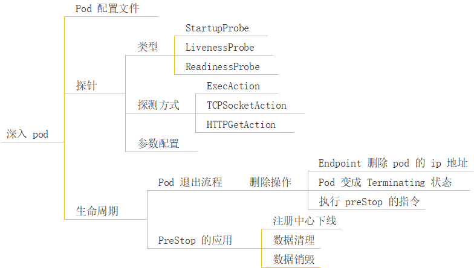
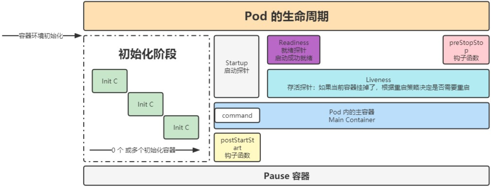

>*`Author: ACatSmiling`*
>
>*`Since: 2024-11-05`*



## kubectl 命令

### 创建 Pod

**方式一：使用配置文件创建。**

1. 首先，需要创建一个 Pod 的配置文件（通常是`.yaml`或`.yml`格式）。例如，创建一个简单的 Nginx Pod 配置文件 nginx-pod.yaml：

   ```yaml
   apiVersion: v1
   kind: Pod
   metadata:
     name: nginx-pod
   spec:
     containers:
     - name: nginx-container # 单容器 Pod
       image: nginx:latest
   ```

2. **`kubectl create`**：不存在则新建，存在则报错。

   ```shell
   $ kubectl create -f nginx-pod.yaml
   ```

3. **`kubectl apply`**：不存在则新建，存在则更新。

   ```shell
   $ kubectl apply -f nginx-pod.yaml
   ```

4. 创建多容器 Pod：

   ```yaml
   apiVersion: v1
   kind: Pod
   metadata:
     name: multi-container-pod
     labels:
       app: multi-app-label
   spec:
     containers:
       - name: container-1 # 容器 1
       image: nginx:latest
       ports:
         - containerPort: 80
       - name: container-2 # 容器 2
         image: redis:latest
   ```

   ```shell
   $ kubectl create -f multi-container-pod.yaml
   # 或者
   $ kubectl apply -f multi-container-pod.yaml
   ```

**方式二：使用命令行参数创建（不推荐用于复杂配置）。**

1. **`kubectl run`**：快速创建一个简单的 Pod。例如，创建一个名为 busybox-pod 的  Pod，运行 busybox 镜像：

   ```shell
   $ kubectl run busybox-pod --image=busybox:latest
   ```

### 查看 Pod

1. **`kubectl get pods`**：查看集群中所有命名空间下的所有 Pod 列表。示例：

   ```shell
   [root@k8s-master pods]# kubectl get pods
   NAME          READY   STATUS    RESTARTS   AGE
   nginx-pod     1/1     Running   0          10m
   ```

   - 输出结果通常包含以下列：

     - **NAMESPACE**：Pod 所在的命名空间。
     - **NAME**：Pod 的名称，用于在集群中唯一标识 Pod。
     - **READY**：显示准备就绪的容器数量与总容器数量的比例。
     - **STATUS**：Pod 的当前状态，常见的状态有`Pending`（等待调度或资源分配）、`Running`（正在运行）、`Succeeded`（成功完成任务，通常用于一次性任务的 Pod）、`Failed`（运行失败）。
     - **RESTARTS**：容器重启的次数。
     - **AGE**：Pod 自创建以来的时间。

   - `<pod-name>`：查看指定 Pod。示例：

     ```shell
     [root@k8s-master pods]# kubectl get pods nginx-pod
     NAME        READY   STATUS    RESTARTS   AGE
     nginx-pod   1/1     Running   0          9h
     ```

   - `-A, --all-namespaces`：查看所有命名空间中的 Pod，默认情况下，kubectl 仅在当前上下文的默认命名空间（通常是 `default`）中操作。示例：

     ```shell
     [root@k8s-master pods]# kubectl get pods -A
     NAMESPACE      NAME                                 READY   STATUS    RESTARTS       AGE
     kube-flannel   kube-flannel-ds-cdfvm                1/1     Running   18 (28d ago)   180d
     kube-flannel   kube-flannel-ds-fb79x                1/1     Running   19 (88m ago)   180d
     kube-flannel   kube-flannel-ds-t7nkg                1/1     Running   18 (28d ago)   180d
     kube-system    coredns-6d8c4cb4d-d6rrb              1/1     Running   14 (88m ago)   133d
     kube-system    coredns-6d8c4cb4d-zsx7n              1/1     Running   14 (88m ago)   133d
     kube-system    etcd-k8s-master                      1/1     Running   26 (88m ago)   188d
     kube-system    kube-apiserver-k8s-master            1/1     Running   24 (88m ago)   188d
     kube-system    kube-controller-manager-k8s-master   1/1     Running   29 (88m ago)   188d
     kube-system    kube-proxy-6xntx                     1/1     Running   20 (28d ago)   181d
     kube-system    kube-proxy-m2nbx                     1/1     Running   28 (88m ago)   188d
     kube-system    kube-proxy-vzsp7                     1/1     Running   19 (28d ago)   181d
     kube-system    kube-scheduler-k8s-master            1/1     Running   29 (88m ago)   188d
     [root@k8s-master pods]# kubectl get pods
     No resources found in default namespace.
     ```

   - `-n, --namespace`：查看特定命名空间中的 Pod。示例：

     ```shell
     [root@k8s-master pods]# kubectl get pods -n kube-system
     NAME                                 READY   STATUS    RESTARTS         AGE
     coredns-6d8c4cb4d-d6rrb              1/1     Running   7 (4d11h ago)    11d
     coredns-6d8c4cb4d-zsx7n              1/1     Running   7 (4d11h ago)    11d
     etcd-k8s-master                      1/1     Running   19 (4d11h ago)   66d
     kube-apiserver-k8s-master            1/1     Running   17 (4d11h ago)   66d
     kube-controller-manager-k8s-master   1/1     Running   22 (4d11h ago)   66d
     kube-proxy-6xntx                     1/1     Running   14 (4d11h ago)   59d
     kube-proxy-m2nbx                     1/1     Running   21 (4d11h ago)   66d
     kube-proxy-vzsp7                     1/1     Running   12 (4d11h ago)   59d
     kube-scheduler-k8s-master            1/1     Running   22 (4d11h ago)   66d
     ```

   - `-l`：按照标签来查看 Pod。示例：

     ```shell
     [root@k8s-master pods]# kubectl get pods -l app=nginx-pod-app
     NAME        READY   STATUS    RESTARTS   AGE
     nginx-pod   1/1     Running   0          8h
     ```

   - `-o wide`：以宽格式查看，获取更详细的信息，包括 Pod 所在的节点 IP 和节点名称等。示例：

     ```shell
     [root@k8s-master pods]#  kubectl get pods -o wide
     NAME        READY   STATUS    RESTARTS   AGE   IP            NODE        NOMINATED NODE   READINESS GATES
     nginx-pod   1/1     Running   0          10m   10.244.2.11   k8s-node2   <none>           <none>
     ```

   - `-o custom-columns`：自定义显示的列。示例：

     ```shell
     # 只显示 Pod 的名称和状态
     [root@k8s-master pods]# kubectl get pods -o custom-columns=NAME:.metadata.name,STATUS:.status.phase
     NAME        STATUS
     nginx-pod   Running
     ```

   - `-o yaml|json`：以 YAML 或 JSON 格式呈现 Pod 的完整配置信息。示例：

     ```shell
     [root@k8s-master pods]# kubectl get pod nginx-pod -o yaml
     apiVersion: v1
     kind: Pod
     metadata:
       creationTimestamp: "2024-11-03T02:56:23Z"
       labels:
         app: nginx-pod-app
       name: nginx-pod
       namespace: default
       resourceVersion: "404257"
       uid: 25c1720e-9653-4516-840a-56694aec429c
     spec:
       containers:
       - command:
         - nginx
         - -g
         - daemon off;
         env:
         - name: JVM_OPTS
           value: -Xms128m -Xmx128m
         image: nginx:latest
         imagePullPolicy: IfNotPresent
         name: nginx-pod
         ports:
         - containerPort: 80
           name: http
           protocol: TCP
         resources:
           limits:
             cpu: 200m
             memory: 256Mi
           requests:
             cpu: 100m
             memory: 128Mi
         terminationMessagePath: /dev/termination-log
         terminationMessagePolicy: File
         volumeMounts:
         - mountPath: /var/run/secrets/kubernetes.io/serviceaccount
           name: kube-api-access-2qcsr
           readOnly: true
         workingDir: /usr/share/nginx/html
       dnsPolicy: ClusterFirst
       enableServiceLinks: true
       nodeName: k8s-node2
       preemptionPolicy: PreemptLowerPriority
       priority: 0
       restartPolicy: OnFailure
       schedulerName: default-scheduler
       securityContext: {}
       serviceAccount: default
       serviceAccountName: default
       terminationGracePeriodSeconds: 30
       tolerations:
       - effect: NoExecute
         key: node.kubernetes.io/not-ready
         operator: Exists
         tolerationSeconds: 300
       - effect: NoExecute
         key: node.kubernetes.io/unreachable
         operator: Exists
         tolerationSeconds: 300
       volumes:
       - name: kube-api-access-2qcsr
         projected:
           defaultMode: 420
           sources:
           - serviceAccountToken:
               expirationSeconds: 3607
               path: token
           - configMap:
               items:
               - key: ca.crt
                 path: ca.crt
               name: kube-root-ca.crt
           - downwardAPI:
               items:
               - fieldRef:
                   apiVersion: v1
                   fieldPath: metadata.namespace
                 path: namespace
     status:
       conditions:
       - lastProbeTime: null
         lastTransitionTime: "2024-11-03T02:56:23Z"
         status: "True"
         type: Initialized
       - lastProbeTime: null
         lastTransitionTime: "2024-11-03T02:56:24Z"
         status: "True"
         type: Ready
       - lastProbeTime: null
         lastTransitionTime: "2024-11-03T02:56:24Z"
         status: "True"
         type: ContainersReady
       - lastProbeTime: null
         lastTransitionTime: "2024-11-03T02:56:23Z"
         status: "True"
         type: PodScheduled
       containerStatuses:
       - containerID: docker://986ebb51cd36474dcb6f9789e13e3ed6ddb064e4a799fd282389c7eddf013fe4
         image: nginx:latest
         imageID: docker-pullable://nginx@sha256:04ba374043ccd2fc5c593885c0eacddebabd5ca375f9323666f28dfd5a9710e3
         lastState: {}
         name: nginx-pod
         ready: true
         restartCount: 0
         started: true
         state:
           running:
             startedAt: "2024-11-03T02:56:23Z"
       hostIP: 192.168.1.122
       phase: Running
       podIP: 10.244.2.11
       podIPs:
       - ip: 10.244.2.11
       qosClass: Burstable
       startTime: "2024-11-03T02:56:23Z"
       
     [root@k8s-master pods]# kubectl get pod nginx-pod -o json
     {
         "apiVersion": "v1",
         "kind": "Pod",
         "metadata": {
             "creationTimestamp": "2024-11-03T02:56:23Z",
             "labels": {
                 "app": "nginx-pod-app"
             },
             "name": "nginx-pod",
             "namespace": "default",
             "resourceVersion": "404257",
             "uid": "25c1720e-9653-4516-840a-56694aec429c"
         },
         "spec": {
             "containers": [
                 {
                     "command": [
                         "nginx",
                         "-g",
                         "daemon off;"
                     ],
                     "env": [
                         {
                             "name": "JVM_OPTS",
                             "value": "-Xms128m -Xmx128m"
                         }
                     ],
                     "image": "nginx:latest",
                     "imagePullPolicy": "IfNotPresent",
                     "name": "nginx-pod",
                     "ports": [
                         {
                             "containerPort": 80,
                             "name": "http",
                             "protocol": "TCP"
                         }
                     ],
                     "resources": {
                         "limits": {
                             "cpu": "200m",
                             "memory": "256Mi"
                         },
                         "requests": {
                             "cpu": "100m",
                             "memory": "128Mi"
                         }
                     },
                     "terminationMessagePath": "/dev/termination-log",
                     "terminationMessagePolicy": "File",
                     "volumeMounts": [
                         {
                             "mountPath": "/var/run/secrets/kubernetes.io/serviceaccount",
                             "name": "kube-api-access-2qcsr",
                             "readOnly": true
                         }
                     ],
                     "workingDir": "/usr/share/nginx/html"
                 }
             ],
             "dnsPolicy": "ClusterFirst",
             "enableServiceLinks": true,
             "nodeName": "k8s-node2",
             "preemptionPolicy": "PreemptLowerPriority",
             "priority": 0,
             "restartPolicy": "OnFailure",
             "schedulerName": "default-scheduler",
             "securityContext": {},
             "serviceAccount": "default",
             "serviceAccountName": "default",
             "terminationGracePeriodSeconds": 30,
             "tolerations": [
                 {
                     "effect": "NoExecute",
                     "key": "node.kubernetes.io/not-ready",
                     "operator": "Exists",
                     "tolerationSeconds": 300
                 },
                 {
                     "effect": "NoExecute",
                     "key": "node.kubernetes.io/unreachable",
                     "operator": "Exists",
                     "tolerationSeconds": 300
                 }
             ],
             "volumes": [
                 {
                     "name": "kube-api-access-2qcsr",
                     "projected": {
                         "defaultMode": 420,
                         "sources": [
                             {
                                 "serviceAccountToken": {
                                     "expirationSeconds": 3607,
                                     "path": "token"
                                 }
                             },
                             {
                                 "configMap": {
                                     "items": [
                                         {
                                             "key": "ca.crt",
                                             "path": "ca.crt"
                                         }
                                     ],
                                     "name": "kube-root-ca.crt"
                                 }
                             },
                             {
                                 "downwardAPI": {
                                     "items": [
                                         {
                                             "fieldRef": {
                                                 "apiVersion": "v1",
                                                 "fieldPath": "metadata.namespace"
                                             },
                                             "path": "namespace"
                                         }
                                     ]
                                 }
                             }
                         ]
                     }
                 }
             ]
         },
         "status": {
             "conditions": [
                 {
                     "lastProbeTime": null,
                     "lastTransitionTime": "2024-11-03T02:56:23Z",
                     "status": "True",
                     "type": "Initialized"
                 },
                 {
                     "lastProbeTime": null,
                     "lastTransitionTime": "2024-11-03T02:56:24Z",
                     "status": "True",
                     "type": "Ready"
                 },
                 {
                     "lastProbeTime": null,
                     "lastTransitionTime": "2024-11-03T02:56:24Z",
                     "status": "True",
                     "type": "ContainersReady"
                 },
                 {
                     "lastProbeTime": null,
                     "lastTransitionTime": "2024-11-03T02:56:23Z",
                     "status": "True",
                     "type": "PodScheduled"
                 }
             ],
             "containerStatuses": [
                 {
                     "containerID": "docker://986ebb51cd36474dcb6f9789e13e3ed6ddb064e4a799fd282389c7eddf013fe4",
                     "image": "nginx:latest",
                     "imageID": "docker-pullable://nginx@sha256:04ba374043ccd2fc5c593885c0eacddebabd5ca375f9323666f28dfd5a9710e3",
                     "lastState": {},
                     "name": "nginx-pod",
                     "ready": true,
                     "restartCount": 0,
                     "started": true,
                     "state": {
                         "running": {
                             "startedAt": "2024-11-03T02:56:23Z"
                         }
                     }
                 }
             ],
             "hostIP": "192.168.1.122",
             "phase": "Running",
             "podIP": "10.244.2.11",
             "podIPs": [
                 {
                     "ip": "10.244.2.11"
                 }
             ],
             "qosClass": "Burstable",
             "startTime": "2024-11-03T02:56:23Z"
         }
     }
     ```

2. **`kubectl describe pod`**：查看单个 Pod 的详细信息，包括容器状态、事件等。示例：

   ```shell
   [root@k8s-master pods]# kubectl describe pod nginx-pod
   Name:         nginx-pod
   Namespace:    default
   Priority:     0
   Node:         k8s-node2/192.168.1.122
   Start Time:   Sun, 03 Nov 2024 10:56:23 +0800
   Labels:       app=nginx-pod-app
   Annotations:  <none>
   Status:       Running
   IP:           10.244.2.11
   IPs:
     IP:  10.244.2.11
   Containers:
     nginx-pod:
       Container ID:  docker://986ebb51cd36474dcb6f9789e13e3ed6ddb064e4a799fd282389c7eddf013fe4
       Image:         nginx:latest
       Image ID:      docker-pullable://nginx@sha256:04ba374043ccd2fc5c593885c0eacddebabd5ca375f9323666f28dfd5a9710e3
       Port:          80/TCP
       Host Port:     0/TCP
       Command:
         nginx
         -g
         daemon off;
       State:          Running
         Started:      Sun, 03 Nov 2024 10:56:23 +0800
       Ready:          True
       Restart Count:  0
       Limits:
         cpu:     200m
         memory:  256Mi
       Requests:
         cpu:     100m
         memory:  128Mi
       Environment:
         JVM_OPTS:  -Xms128m -Xmx128m
       Mounts:
         /var/run/secrets/kubernetes.io/serviceaccount from kube-api-access-2qcsr (ro)
   Conditions:
     Type              Status
     Initialized       True 
     Ready             True 
     ContainersReady   True 
     PodScheduled      True 
   Volumes:
     kube-api-access-2qcsr:
       Type:                    Projected (a volume that contains injected data from multiple sources)
       TokenExpirationSeconds:  3607
       ConfigMapName:           kube-root-ca.crt
       ConfigMapOptional:       <nil>
       DownwardAPI:             true
   QoS Class:                   Burstable
   Node-Selectors:              <none>
   Tolerations:                 node.kubernetes.io/not-ready:NoExecute op=Exists for 300s
                                node.kubernetes.io/unreachable:NoExecute op=Exists for 300s
   Events:                      <none>
   ```

   - 输出内容通常包含以下信息：
     - **Pod 的基本信息**：包括名称、命名空间、标签、注释等。
     - **容器信息**：包括容器名称、镜像、端口、资源请求和限制等，还会显示容器的状态，以及容器启动和停止的相关信息。
     - **卷（Volumes）信息**：如果 Pod 挂载了卷，会在这里显示卷的类型、来源等信息。
     - **事件信息**：记录了 Pod 生命周期内发生的事件，例如调度事件、容器启动和停止事件等。

3. **`kubectl logs`**：查看 Pod 中容器的日志。示例：

   ```shell
   [root@k8s-master pods]# kubectl logs nginx-pod
   2024/11/03 02:56:23 [notice] 1#1: using the "epoll" event method
   2024/11/03 02:56:23 [notice] 1#1: nginx/1.27.1
   2024/11/03 02:56:23 [notice] 1#1: built by gcc 12.2.0 (Debian 12.2.0-14) 
   2024/11/03 02:56:23 [notice] 1#1: OS: Linux 3.10.0-1160.el7.x86_64
   2024/11/03 02:56:23 [notice] 1#1: getrlimit(RLIMIT_NOFILE): 1048576:1048576
   2024/11/03 02:56:23 [notice] 1#1: start worker processes
   2024/11/03 02:56:23 [notice] 1#1: start worker process 6
   2024/11/03 02:56:23 [notice] 1#1: start worker process 7
   ```

   - `<pod-name> -c <container-name>`：如果 Pod 中有多个容器，需要指定容器名称。示例：

     ```shell
     # 查看 nginx-pod 中 nginx-pod 容器的日志
     [root@k8s-master pods]# kubectl logs nginx-pod -c nginx-pod
     2024/11/03 02:56:23 [notice] 1#1: using the "epoll" event method
     2024/11/03 02:56:23 [notice] 1#1: nginx/1.27.1
     2024/11/03 02:56:23 [notice] 1#1: built by gcc 12.2.0 (Debian 12.2.0-14) 
     2024/11/03 02:56:23 [notice] 1#1: OS: Linux 3.10.0-1160.el7.x86_64
     2024/11/03 02:56:23 [notice] 1#1: getrlimit(RLIMIT_NOFILE): 1048576:1048576
     2024/11/03 02:56:23 [notice] 1#1: start worker processes
     2024/11/03 02:56:23 [notice] 1#1: start worker process 6
     2024/11/03 02:56:23 [notice] 1#1: start worker process 7
     ```

   - `-f`：实时日志查看。示例：

     ```shell
     [root@k8s-master pods]# kubectl logs -f nginx-pod
     2024/11/03 02:56:23 [notice] 1#1: using the "epoll" event method
     2024/11/03 02:56:23 [notice] 1#1: nginx/1.27.1
     2024/11/03 02:56:23 [notice] 1#1: built by gcc 12.2.0 (Debian 12.2.0-14) 
     2024/11/03 02:56:23 [notice] 1#1: OS: Linux 3.10.0-1160.el7.x86_64
     2024/11/03 02:56:23 [notice] 1#1: getrlimit(RLIMIT_NOFILE): 1048576:1048576
     2024/11/03 02:56:23 [notice] 1#1: start worker processes
     2024/11/03 02:56:23 [notice] 1#1: start worker process 6
     2024/11/03 02:56:23 [notice] 1#1: start worker process 7
     
     ```

### 更新 Pod

1. **`kubectl set image`**：更新容器镜像。

   ```shell
   $ kubectl set image pod/<pod-name> <container-name>=<new-image>
   ```

   - 参数说明：

     - `<pod-name>`：要更新的 Pod 名称。
     - `<container-name>`：Pod 中要更新镜像的容器名称。
     - `<new-image>`：新的容器镜像。

   - 注意事项：

     - **更新过程**：当执行此命令后，Kubernetes 会自动触发容器的重新创建过程，以使用新的镜像。这个过程可能会导致短暂的服务中断，具体取决于应用程序的特性和更新策略。一些应用程序可能能够平滑地过渡到新镜像，而另一些可能需要一些额外的配置来确保数据的完整性和服务的连续性。
     - **滚动更新（Deployment）**：如果 Pod 是由 Deployment 管理的，那么更新镜像会触发 Deployment 进行滚动更新。滚动更新会逐步替换旧的 Pod 副本为新的副本，以确保服务的可用性，可以通过设置`maxSurge`和`maxUnavailable`等参数来控制滚动更新的速度和方式。
     - **版本兼容性**：在更新镜像时，要确保新镜像与现有应用程序的配置和数据格式兼容。例如，如果应用程序的数据库模式在新镜像中有变化，可能需要先进行数据库迁移等操作，否则可能会导致应用程序无法正常运行。

   - 示例：

     ```shell
     # 将名为 my-pod 的 Pod，其中名为 my-container 的容器，由当前使用的 nginx:1.19 镜像，更新为 nginx:1.23
     $ kubectl set image pod/my-pod my-container=nginx:1.23
     ```

2. **更新资源请求和限制（CPU、内存等）**

   - **修改配置文件并应用更新（推荐）**

     - 步骤一：修改配置文件。

       ```yaml
       # 更新前配置，CPU 为 0.2，内存为 256M
       apiVersion: v1
       kind: Pod
       metadata:
         name: my-pod
       spec:
         containers:
         - name: my - container
           image: nginx:latest
           resources:
             requests:
               cpu: "0.2"
               memory: "256Mi"
       ```

       ```yaml
       # 更新后配置，CPU 为 0.3，内存为 512M
       apiVersion: v1
       kind: Pod
       metadata:
         name: my-pod
       spec:
         containers:
         - name: my - container
           image: nginx:latest
           resources:
             requests:
               cpu: "0.3"
               memory: "512Mi"
       ```

     - 步骤二：应用更新。

       ```shell
       # Kubernetes 会根据新的配置调整 Pod 的资源分配
       $ kubectl apply -f my-pod.yaml
       ```

   - **`kubectl edit`**：临时修改。示例：

     ```shell
     $ kubectl edit pod my-pod
     ```

     - kubectk edit 命令，会打开一个文本编辑器（默认是 vi 或 vim），显示 Pod 的配置信息。
     - 在编辑器中修改资源请求和限制的相关内容，保存并退出后，Kubernetes 会尝试根据修改后的配置更新 Pod。不过这种方式的修改是直接作用于集群中的资源，没有经过配置文件的版本控制，所以在生产环境中使用时要谨慎，并且最好在修改后将更新后的配置保存到配置文件中，以方便后续的管理和维护。

### 删除 Pod

1. **`kubectl delete pod <pod-name>`**：删除单个 Pod。示例：

   ```shell
   $ kubectl delete pod nginx-pod
   ```

   - `--force`和`--grace-period=0`：强制删除 Pod，但这种方式可能会导致数据丢失或未完成的操作被中断，应该谨慎使用。示例：

     ```shell
     $ kubectl delete pod my-pod --force --grace-period=0
     ```

     - 正常情况下，当执行删除命令时，Kubernetes 会先发送`SIGTERM`信号给容器内的主进程，等待一段时间（默认是 30 秒，即`grace-period`），让进程进行清理操作（如保存数据、关闭连接等），然后再发送`SIGKILL`信号强制终止进程。如果使用了强制删除选项，就会跳过 SIGTERM 等待阶段，直接发送 SIGKILL 信号。

   - `-l`：通过标签选择器来删除多个 Pod。示例：

     ```shell
     # 删除带有 "app=my-app" 标签的 Pod
     $ kubectl delete pods -l app=my-app
     ```

   - `--all`和`-n`：删除指定命名空间下的所有 Pod。示例：

     ```shell
     # 删除 my-namespace 下的所有 Pod
     $ kubectl delete pods --all -n my-namespace
     ```

>在删除 Pod 时，要确保清楚自己的操作可能带来的影响。特别是对于一些有状态的应用，可能会导致数据丢失或服务中断。如果这些 Pod 是由更高层次的资源（如 Deployment、StatefulSet 等）管理的，删除后这些资源可能会自动重新创建 Pod，这也需要考虑对系统整体运行的影响。

## Pod 配置文件

在搭建 Kubernetes 集群时，创建过一个 Nginx 服务用于测试，现在将其删除：

```shell
[root@k8s-master ~]# kubectl get pods
NAME                     READY   STATUS             RESTARTS   AGE
nginx-85b98978db-bhrd8   0/1     ImagePullBackOff   0          3d12h
[root@k8s-master ~]# kubectl get deployment
NAME    READY   UP-TO-DATE   AVAILABLE   AGE
nginx   0/1     1            0           49d
# 删除 Nginx 对应的 deployment
[root@k8s-master ~]# kubectl delete deployment nginx
deployment.apps "nginx" deleted
[root@k8s-master ~]# kubectl get deployment
No resources found in default namespace.
# pod 是通过 deployment 创建的，删除 deplpyment，对应的 pod 也就删除了
[root@k8s-master ~]# kubectl get pods
No resources found in default namespace.

[root@k8s-master ~]# kubectl get services
NAME         TYPE        CLUSTER-IP      EXTERNAL-IP   PORT(S)        AGE
kubernetes   ClusterIP   10.96.0.1       <none>        443/TCP        58d
nginx        NodePort    10.98.189.130   <none>        80:31173/TCP   49d
# 删除 Nginx 对应的 service
[root@k8s-master ~]# kubectl delete services nginx
service "nginx" deleted
[root@k8s-master ~]# kubectl get services
NAME         TYPE        CLUSTER-IP   EXTERNAL-IP   PORT(S)   AGE
kubernetes   ClusterIP   10.96.0.1    <none>        443/TCP   58d

```

定义一个 nginx-pod.yaml 配置文件：

```yaml
apiVersion: v1 # api 文档版本
kind: Pod # 资源对象类型，也可以配置为像 Deployment、StatefulSet 这一类的对象
metadata: # Pod 相关的元数据，用于描述 Pod 的数据
  name: "nginx-pod" # Pod 的名称
  namespace: default # 定义 Pod 的命名空间
  labels: # 定义 Pod 的标签
    app: "nginx-pod-app" # 标签的 key:value，可以按实际来自定义
spec: # 规约，即期望当前 Pod 应按照下面的描述进行创建
  containers: # 对于 Pod 中的容器描述
  - name: nginx-pod # 容器的名称
    image: "nginx:latest" # 指定容器的镜像
    imagePullPolicy: IfNotPresent # 镜像拉取策略，指定如果本地有就用本地的，如果没有就拉取远程的
    command: # 指定容器启动时执行的命令
    - nginx
    - -g
    - 'daemon off;' # 当前 command 配置等同于命令：nginx -g 'daemon off;'
    workingDir: /usr/share/nginx/html # 定义容器启动后的工作目录
    resources:
      limits: # 最多可以使用的资源
        cpu: 200m # 限制 cpu 最多使用 0.2 个核心
        memory: 256Mi # 限制内存最多使用 256 MB
      requests: # 最少需要使用的资源
        cpu: 100m # 限制 cpu 最少使用 0.1 个核心
        memory: 128Mi # 限制内存最多使用 128 MB
    ports:
    - containerPort:  80 # 描述容器内要暴露什么端口
      name:  http # 端口名称
      protocol: TCP # 描述该端口是基于哪种协议通信的
    env: # 环境变量
    - name: JVM_OPTS # 环境变量名称
      value: '-Xms128m -Xmx128m' # 环境变量的值
  restartPolicy: OnFailure # 重启策略，只有失败的情况才会重启
```

> VS Code 中，可以安装`Kubernetes Templates`插件，用于快速创建配置文件。

通过 nginx-po.yaml 配置文件，创建 Pod：

```shell
[root@k8s-master pods]# cd /opt/k8s/pods/
[root@k8s-master pods]# kubectl create -f nginx-pod.yaml
pod/nginx-pod created
```

查看新建的 nginx-pod 这个 Pod 的信息：

```shell
# 查看 Pod 的简略信息
[root@k8s-master pods]# kubectl get pods
NAME         READY   STATUS    RESTARTS   AGE
nginx-pod    1/1     Running   0          3m5s # 此时 STATUS 已经是 Running，刚创建时状态为 ContainerCreating

# 查看 Pod 的详细信息
[root@k8s-master pods]# kubectl get pods -o wide
NAME         READY   STATUS    RESTARTS   AGE   IP            NODE        NOMINATED NODE   READINESS GATES
nginx-pod    1/1     Running   0          46m   10.244.2.10   k8s-node2   <none>           <none>

[root@k8s-master pods]# kubectl describe pod nginx-pod
Name:         nginx-pod
Namespace:    default
Priority:     0
Node:         k8s-node2/192.168.1.122
Start Time:   Sun, 27 Oct 2024 09:17:02 +0800
Labels:       app=nginx-pod-app
Annotations:  <none>
Status:       Running
IP:           10.244.2.10
IPs:
  IP:  10.244.2.10
Containers:
  nginx-pod:
    Container ID:  docker://52e0bb9cd83f20ebb50988bcac9878592c049a0b1b746672a80a7786c685ea72
    Image:         nginx:latest
    Image ID:      docker-pullable://nginx@sha256:04ba374043ccd2fc5c593885c0eacddebabd5ca375f9323666f28dfd5a9710e3
    Port:          80/TCP
    Host Port:     0/TCP
    Command:
      nginx
      -g
      daemon off;
    State:          Running
      Started:      Sun, 27 Oct 2024 09:17:03 +0800
    Ready:          True
    Restart Count:  0
    Limits:
      cpu:     200m
      memory:  256Mi
    Requests:
      cpu:     100m
      memory:  128Mi
    Environment:
      JVM_OPTS:  -Xms128m -Xmx128m
    Mounts:
      /var/run/secrets/kubernetes.io/serviceaccount from kube-api-access-k7zmc (ro)
Conditions:
  Type              Status
  Initialized       True 
  Ready             True 
  ContainersReady   True 
  PodScheduled      True 
Volumes:
  kube-api-access-k7zmc:
    Type:                    Projected (a volume that contains injected data from multiple sources)
    TokenExpirationSeconds:  3607
    ConfigMapName:           kube-root-ca.crt
    ConfigMapOptional:       <nil>
    DownwardAPI:             true
QoS Class:                   Burstable
Node-Selectors:              <none>
Tolerations:                 node.kubernetes.io/not-ready:NoExecute op=Exists for 300s
                             node.kubernetes.io/unreachable:NoExecute op=Exists for 300s
Events: # Pods 的事件
  Type    Reason     Age   From               Message
  ----    ------     ----  ----               -------
  Normal  Scheduled  17s   default-scheduler  Successfully assigned default/nginx-pod to k8s-node2 # 分配到 k8s-node2 节点
  Normal  Pulled     17s   kubelet            Container image "nginx:latest" already present on machine
  Normal  Created    17s   kubelet            Created container nginx-pod
  Normal  Started    17s   kubelet            Started container nginx-pod
```

- 最下面的 Events，描述了 Pod 的创建过程。


## 探针

**`探针`**：容器内应用的监测机制，根据不同的探针，可以判断容器应用当前的状态。

### 探针的类型

#### StartupProbe

**`StartupProbe`**：**启动探针，用于检测容器内应用程序是否已经完成启动过程。**在容器启动阶段，有些应用可能需要较长时间来完成初始化，如加载大量配置文件、建立数据库连接等。StartupProbe 允许这个启动过程完成，避免在启动阶段因为 LivenessProbe 或 ReadinessProbe 检查失败而导致容器被错误地重启。**只有当 StartupProbe 成功后，LivenessProbe 和 ReadinessProbe 才会开始正常工作。**

#### LivenessProbe

**`LivenessProbe`**：**存活探针，用于检测容器是否还在正常运行状态。**如果容器在运行过程中出现故障，例如进入死循环、内存泄漏等导致应用程序无法正常工作的情况，LivenessProbe 能够检测到这种异常，并根据配置决定是否重启容器。这有助于保持应用程序的健康运行，及时从故障状态中恢复。

#### ReadinessProbe

**`ReadinessProbe`**：**就绪探针，用于判断容器是否已经准备好接收请求。**与 LivenessProbe 不同，它关注的是容器是否能够正常处理业务流量，而不是仅仅是否存活。当容器刚启动或者在运行过程中，由于某些原因（如正在加载配置文件、预热缓存等）暂时无法接收请求时，ReadinessProbe 可以检测到这种状态，并且控制服务发现组件（如 Kubernetes 的 Service）暂时不将流量发送到还没准备好的容器。

### 探测的方式

三种探针，均支持以下三种探测方式：

1. `exec`：以执行命令的方式进行监测。
2. `tcpSocket`：以建立 TCP 连接的方式进行监测。
3. `httpGet`：以发送 HTTP 请求的方式进行监测。

下面以 livenessProbe 为例，给出这三种探测方式的使用说明。

#### ExecAction

示例：

```yaml
livenessProbe:
  exec:
    command: ["ps", "-ef", "|", "grep", "myapp", "|", "grep", "-v", "grep"]
  initialDelaySeconds: 20
  periodSeconds: 8
  failureThreshold: 3
```

含义：表示在容器启动 20 秒后开始，每 8 秒执行一次 "ps -ef | grep myapp | grep -v grep" 命令，检查进程是否存在。如果连续 3 次执行这个命令的结果为进程不存在，就判定容器存活状态检查失败，可能会重启容器。

#### TCPSocketAction

示例：

```yaml
livenessProbe:
  tcpSocket:
    port: 3306
  initialDelaySeconds: 10
  periodSeconds: 5
  failureThreshold: 2
```

含义：表示在容器启动 10 秒后开始，每 5 秒检查一次容器内 3306 端口是否可以建立 TCP 连接。如果连续 2 次检查失败，就判定容器存活状态检查失败，可能会重启容器。

#### HTTPGetAction

示例：

```yaml
livenessProbe:
  httpGet:
    path: /healthz
    port: 8080
    scheme: HTTP
  initialDelaySeconds: 15
  periodSeconds: 10
  failureThreshold: 3
```

含义：表示在容器启动 15 秒后开始，每隔 10 秒向容器内 8080 端口的 /healthz 路径发送一个 HTTP 请求。如果连续 3 次请求都没有得到预期的响应（如返回码不是 200 ~ 299 之间），就认为容器存活状态检查失败，可能会触发容器重启。

### 探针的参数配置

探针的通用参数配置及含义：

- `initialDelaySeconds`：初始化时间。
- `timeoutSeconds`：超时时间。
- `periodSeconds`：监测的间隔时间。
- `sucessThreshold`：监测成功多少次，才表示成功。
- `failureThreshold`：监测失败多少次，才表示失败。

## Pod 的生命周期

Pod 是 Kubernetes 中最小的可部署和可管理的计算单元，它有着完整的生命周期，主要包括以下几个阶段：

1. **`Pending（挂起）阶段`**
   - **状态描述**：当一个 Pod 被创建后，它首先会进入 Pending 状态。在这个阶段，Pod 正在等待被调度到一个合适的节点上运行。这可能是因为集群中没有足够的资源（如 CPU、内存、存储等）来立即启动 Pod，或者是因为需要等待一些外部依赖（如存储卷的准备完成）。
   - **关键事件**：在这个阶段，Kubernetes 调度器会不断评估集群中的节点资源情况，寻找能够满足 Pod 资源请求的节点。同时，系统会检查 Pod 所依赖的各种资源是否准备就绪。
2. **`Running（运行）阶段`**
   - **状态描述**：一旦 Pod 被调度到一个节点并且其所有的容器都已经成功启动，Pod 就会进入 Running 状态。在这个状态下，Pod 中的容器正在按照配置执行相应的任务。容器内的应用程序可以正常接收请求、处理数据等。
   - **关键事件**：容器启动过程中的初始化操作是这个阶段的关键。例如，对于一个基于 Java 的应用容器，可能会在启动时执行类加载、数据库连接初始化等操作。同时，容器会开始监听配置的端口，准备接收外部请求。
3. **`Succeeded（成功完成）阶段`**
   - **状态描述**：当 Pod 中的所有容器都正常退出，并且退出码为 0（表示成功完成任务）时，Pod 就会进入 Succeeded 状态。这个阶段适用于那些执行一次性任务的 Pod，通常用于执行批处理任务、数据迁移任务等 Pod。
   - **关键事件**：容器内任务的完成和正常退出是这个阶段的关键。例如，在数据迁移的例子中，任务完成后的清理操作（如关闭数据库连接、释放资源等）完成后，容器才会正常退出。在这个阶段，Pod 的资源会被保留，直到被手动删除或者根据 Kubernetes 的垃圾回收策略自动清除。可以通过查看容器的日志来确认任务是否成功完成，以及获取相关的执行结果。
4. **`Failed（失败）阶段`**
   - **状态描述**：如果 Pod 中的任何一个容器以非零退出码退出，或者容器无法启动（例如，由于镜像拉取失败、配置错误、资源不足等原因），Pod 就会进入 Failed 状态。
   - **应对措施**：容器启动失败或者运行过程中出现错误导致异常退出是这个阶段的关键。在这种情况下，需要查看容器的日志和相关的事件信息来确定失败的原因，例如通过 kubectl describe pod 命令来查看 Pod 的详细信息，包括容器的启动事件和错误消息。
5. **`Unknown（未知）阶段`**
   - **状态描述**：当 Kubernetes 无法获取 Pod 的状态信息时，Pod 会进入 Unknown 状态。这可能是由于网络问题、与节点通信中断或者 API 服务器出现故障等原因导致的。
   - **应对措施**：需要检查节点的状态，尝试恢复节点与集群控制平面的通信，以获取 Pod 的准确状态。如果节点已经不可恢复，可以考虑将 Pod 调度到其他节点上重新运行。

图示：



### PostStart 钩子函数

**`PostStart`**：**是一个容器生命周期钩子函数，它在容器创建后、主进程启动前被调用。**主要用于执行一些需要在容器主进程运行之前完成的初始化任务。例如，初始化网络连接、加载配置文件或者预热缓存等操作。这些操作对于容器主进程的正常运行可能是必需的，通过 PostStart 可以确保这些前置任务先完成。

配置示例：

```yaml
apiVersion: v1
kind: Pod
metadata:
  name: my-pod
spec:
  containers:
  - name: my-container
    image: nginx:latest
    lifecycle: # 生命周期配置
      postStart: # PostStart 钩子函数
        exec: # 可以是 exec、tcpSocket 或者 httpGet
          command: ["/bin/sh", "-c", "echo 'PostStart hook executed'"]
```

执行特性：

- **异步执行**：PostStart 钩子函数是异步执行的，容器主进程不会等待它完成就会启动。这意味着它可以在后台独立运行。但如果 PostStart 执行时间过长或者出错，可能会影响容器的启动。例如，如果 PostStart 执行的命令一直无法完成，容器可能会一直处于启动过程中。（也因为 PostStart 钩子函数与 Pod 主容器中的 command 的先后顺序难以保证，PostStart 钩子函数一般用的比较少，如果有要求在 Pod 主容器之前执行的操作，可以放在初始化阶段执行）
- **错误处理与重启策略相关**：如果 PostStart 执行失败，Kubernetes 会根据容器的重启策略来决定是否重启容器。若重启策略允许，容器可能会被重新启动以再次尝试执行 PostStart 和主进程。

### PreStop 钩子函数

**`PreStop`**：**是另一个容器生命周期钩子函数，它在容器终止之前被调用。**主要用于执行一些清理操作，例如优雅地关闭数据库连接、释放资源（如文件锁、网络连接等）、保存容器状态或数据等。这有助于确保容器在停止过程中能够有序地清理自己的资源，避免数据丢失或资源泄漏。

配置示例：

```yaml
apiVersion: v1
kind: Pod
metadata:
  name: my-pod
spec:
  containers:
  - name: my-container
  image: nginx:latest
  lifecycle: # 生命周期配置
    preStop: # PreStop 钩子函数
      exec: # 可以是 exec、tcpSocket 或者 httpGet
        command: ["/bin/sh", "-c", "echo 'PreStop hook executed'; sleep 10"]
```

执行特性：

- **同步执行**：PreStop 钩子函数是同步执行的，容器主进程会等待 PreStop 完成后才会完全终止。这是为了确保清理操作能够顺利完成。不过，如果 PreStop 执行的命令陷入死循环或者长时间无法完成，容器可能会一直处于停止过程中，直到 PreStop 执行完成或者达到 Pod 的终止宽限期（`grace-period`）。
- **终止宽限期**：Kubernetes 在发送终止信号给容器后，会等待一段时间（终止宽限期），**默认是 30 秒**。在这个期间内，PreStop 钩子函数会执行。如果 PreStop 执行时间超过终止宽限期，Kubernetes 会发送`SIGKILL`信号强制终止容器主进程。但通常建议合理设置 PreStop 执行的命令，使其在终止宽限期内完成。

### 钩子函数应用

将 nginx-pod.yaml 中，添加 PostStart 和 PreStop 的配置：

```yaml
apiVersion: v1 # api 文档版本
kind: Pod # 资源对象类型，也可以配置为像 Deployment、StatefulSet 这一类的对象
metadata: # Pod 相关的元数据，用于描述 Pod 的数据
  name: "nginx-pod" # Pod 的名称
  namespace: default # 定义 Pod 的命名空间
  labels: # 定义 Pod 的标签
    app: "nginx-pod-app" # 标签的 key:value，可以按实际来自定义
spec: # 规约，即期望当前 Pod 应按照下面的描述进行创建
  containers: # 对于 Pod 中的容器描述
  - name: nginx-pod # 容器的名称
    image: "nginx:latest" # 指定容器的镜像
    imagePullPolicy: IfNotPresent # 镜像拉取策略，指定如果本地有就用本地的，如果没有就拉取远程的
    lifecycle:
      postStart:
        exec:
          command:
          - sh
          - -c
          - "echo '<h1>pre stop</h1>' > /usr/share/nginx/html/prestop.html"
      preStop:
        exec:
          command:
          - sh
          - -c
          - "sleep 50; echo 'sleep finished...' > /usr/share/nginx/html/prestop.html"
    command: # 指定容器启动时执行的命令
    - nginx
    - -g
    - 'daemon off;' # 当前 command 配置等同于命令：nginx -g 'daemon off;'
    workingDir: /usr/share/nginx/html # 定义容器启动后的工作目录
    resources:
      limits: # 最多可以使用的资源
        cpu: 200m # 限制 cpu 最多使用 0.2 个核心
        memory: 256Mi # 限制内存最多使用 256 MB
      requests: # 最少需要使用的资源
        cpu: 100m # 限制 cpu 最少使用 0.1 个核心
        memory: 128Mi # 限制内存最多使用 128 MB
    ports:
    - containerPort:  80 # 描述容器内要暴露什么端口
      name:  http # 端口名称
      protocol: TCP # 描述该端口是基于哪种协议通信的
    env: # 环境变量
    - name: JVM_OPTS # 环境变量名称
      value: '-Xms128m -Xmx128m' # 环境变量的值
  restartPolicy: OnFailure # 重启策略，只有失败的情况才会重启
```

首先，创建 Pod，查看 PostStart 钩子函数的执行情况：

```shell
[root@k8s-master pods]# kubectl create -f nginx-pod.yaml 
pod/nginx-pod created
[root@k8s-master pods]# kubectl get pods -o wide
NAME        READY   STATUS    RESTARTS   AGE   IP            NODE        NOMINATED NODE   READINESS GATES
nginx-pod   1/1     Running   0          8s    10.244.2.12   k8s-node2   <none>           <none>
# 可以看到，PostStart 钩子函数的命令已执行
[root@k8s-master pods]# curl 10.244.2.12/prestop.html
<h1>pre stop</h1>
```

然后，开启两个窗口，一个窗口删除 Pod，另一个窗口监控 Pod 的变化：

```shell
# 窗口一，删除 Pod
[root@k8s-master pods]# time kubectl delete pod nginx-pod
pod "nginx-pod" deleted

real    0m31.454s # 删除操作实际花费时间 31.454 秒
user    0m0.049s
sys     0m0.013s
```

```shell
[root@k8s-master pods]# kubectl get pods -w
NAME        READY   STATUS    RESTARTS   AGE
nginx-pod   1/1     Running   0          38s
nginx-pod   1/1     Terminating   0          42s
nginx-pod   0/1     Terminating   0          73s # Pod 从开始删除到删除完成，时间为 31 秒
nginx-pod   0/1     Terminating   0          73s
nginx-pod   0/1     Terminating   0          73s

```

因为终止宽限期默认为 30s，虽然 PreStop 钩子函数设置 sleep 50s，但是 30s 后，容器主进程被强制终止。如果将终止宽限期设置为 40s，重复上面的过程，可以发现，删除 Pod 操作花费的时间是 40s 左右。

```yaml
...
spec:
  terminationGracePeriodSeconds: 40 # 设置终止宽限期为 40s，默认的是 30s
  containers:
  ...
```

## 原文链接

https://github.com/ACatSmiling/zero-to-zero/blob/main/Operation/kubernetes.md