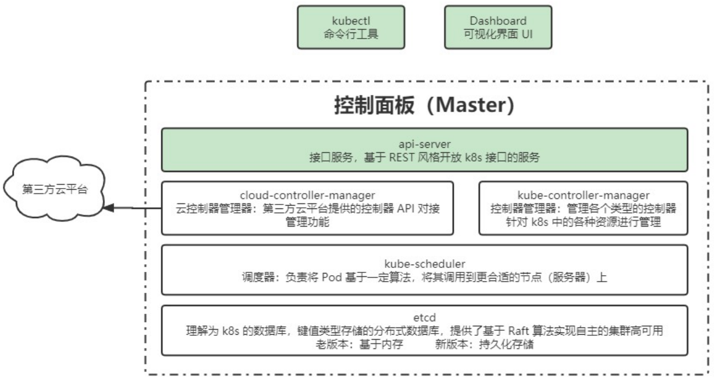
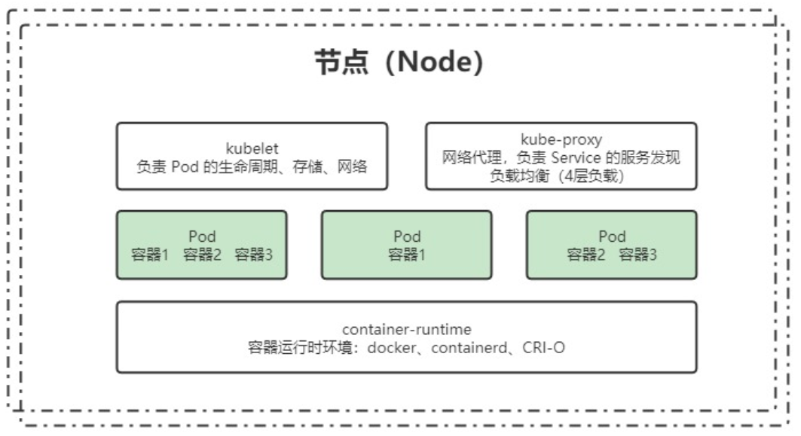

>*`Author: ACatSmiling`*
>
>*`Since: 2025-03-20`*

## 资源

**`资源`**：**在 Kubernetes 中，资源是构成集群的各种对象和实体。**这些资源按照一定的层级结构组织，从底层的物理资源到高层的应用部署，形成了一个完整的系统架构。

### 资源层级结构图

```tex
Cluster
  |
  |-- Namespace
  |    |
  |    |-- Pod
  |    |    |-- Container
  |    |    |-- Volume
  |    |
  |    |-- Service
  |    |-- Deployment
  |    |-- StatefulSet
  |    |-- DaemonSet
  |    |-- Job
  |    |-- CronJob
  |    |-- ConfigMap
  |    |-- Secret
  |    |-- PersistentVolume
  |    |-- PersistentVolumeClaim
  |    |-- Ingress
  |    |-- NetworkPolicy
  |
  |-- Node
       |
       |-- kubelet
       |-- container runtime
```

### 集群（Cluster）

**`集群`**：是 Kubernetes 的最高层级，由多个节点组成，提供计算、存储和网络资源。集群由 Kubernetes 主控节点（Master Node）和工作节点（Worker Node）组成。

- **主控节点**：

  

  - **API Server**：提供 Kubernetes API，是集群的前端。
  - **Controller Manager**：管理控制器进程。
  - **Scheduler**：负责将 Pod 调度到节点。
  - **etcd**：用于存储集群状态的键值存储。

- **工作节点**：

  

  - **kubelet**：在节点上运行，管理 Pod 和容器。
  - **container runtime**：运行容器的运行时环境，如 Docker 或 CRI-O。

#### 节点（Node）

**`节点`**：是 Kubernetes 集群中的物理或虚拟机，是集群的计算单元。每个节点都运行着 Kubernetes 的关键组件，例如 kubelet 和 container runtime（如 Docker 或 CRI-O）。

- **节点资源**：

  - **CPU**：节点的处理器资源。

  - **内存**：节点的内存资源。

  - **存储**：节点的存储资源。

#### 命名空间（Namespace）

**`命名空间`**：是 Kubernetes 中用于隔离资源的逻辑分区。通过命名空间，可以将集群资源划分为多个虚拟集群，每个命名空间中的资源相互隔离。

##### Pod

**`Pod`**：是 Kubernetes 中最基本的工作单元，封装了一个或多个容器。Pod 是 Kubernetes 调度的最小单位，可以包含多个容器，这些容器共享相同的网络命名空间和存储卷。

- **Pod 资源**：
  - **容器**：Pod 中运行的容器。
  - **存储卷**：Pod 中的存储卷，例如 emptyDir、hostPath、ConfigMap、Secret 等。
  - **网络**：Pod 的网络配置，包括 IP 地址、端口等。

##### 控制器（Controller）

**`控制器`**：是 Kubernetes 中用于管理 Pod 副本集的对象。控制器通过定义 Pod 的期望状态，自动管理 Pod 的生命周期，包括创建、更新和删除 Pod。

- **Deployment**：用于管理无状态应用的副本集。
- **StatefulSet**：用于管理有状态应用的副本集。
- **DaemonSet**：确保每个节点上都运行一个 Pod 副本。
- **Job**：用于运行一次性任务。
- **CronJob**：用于运行定时任务。

##### 服务（Service）

**`服务`**：是 Kubernetes 中用于定义一组 Pod 的逻辑集合以及访问它们的策略。服务提供了一种抽象，使得客户端可以通过一个稳定的 IP 地址和端口访问后端的 Pod。

- **ClusterIP**：默认类型，提供一个集群内部的虚拟 IP 地址。
- **NodePort**：在每个节点上开放一个端口，用于访问服务。
- **LoadBalancer**：在云服务提供商中，提供一个外部可访问的负载均衡器。
- **ExternalName**：将服务映射到一个外部名称。

##### 配置资源

**`配置资源`**：用于管理应用的配置数据和敏感信息。

- **ConfigMap**：用于存储配置数据，可以被 Pod 使用。
- **Secret**：用于存储敏感信息，如密码、密钥等。

##### 存储资源

**`存储资源`**：用于管理持久化存储。

- **PersistentVolume（PV）**：集群中的一块存储，由管理员配置。
- **PersistentVolumeClaim（PVC）**：用户请求的存储，绑定到 PV。
- **StorageClass**：定义存储的类别，用于动态配置 PV。

##### 网络资源

**`网络资源`**：用于管理集群的网络配置。

- **Ingress**：用于管理集群入站流量的规则。
- **NetworkPolicy**：用于定义 Pod 之间的网络访问策略。

## 模板文件

**`模板文件`**：**在 Kubernetes 中，模板文件（通常以 .yaml 或 .yml 为扩展名）用于定义各种资源的配置。**这些模板文件可以分为多种类型，每种类型对应不同的资源和用途，以下是一些常见的模板文件类型。这些模板文件通过声明式配置管理 Kubernetes 资源，使得资源的创建、更新和删除变得简单且可重复。通过编写这些 YAML 文件，可以定义资源的期望状态，然后使用`kubectl apply -f <template file path>`命令将这些配置应用到 Kubernetes 集群中。

### Pod 配置模板

Pod 配置模板包含以下内容：

- **metadata**：Pod 的元数据，如名称、标签等。
- **spec**：Pod 的详细配置，包括容器列表、资源请求等。

示例：

```yaml
apiVersion: v1 # 指定使用的 Kubernetes API 版本
kind: Pod # 指定资源类型
metadata: # 定义 Pod 的元数据，包括名称和标签
  name: nginx-pod # Pod 的名称，必须在命名空间中唯一
  labels: # 用于标识和选择 Pod 的键值对
    app: nginx
spec: # 定义 Pod 的规范，包括容器和资源需求
  containers: # 定义 Pod 中的容器列表
  - name: nginx # 容器的名称
    image: nginx:latest # 容器使用的镜像
    ports: # 定义容器暴露的端口
    - containerPort: 80 # 容器内部的端口号
    env: # 定义容器的环境变量
    - name: ENV_VAR_NAME # 环境变量的键
      value: "env_var_value" # 环境变量的值
    resources: # 定义容器的资源请求和限制，这些资源包括 CPU 和内存，CPU 资源以毫核（m）为单位，内存资源以字节（B）、千字节（Ki）、兆字节（Mi）、吉字节（Gi）等为单位
      requests: # 定义容器启动时需要的最小资源量
        memory: "64Mi" # 容器启动时请求的最小内存量为 64Mi（64 MB）
        cpu: "250m" # 容器启动时请求的最小 CPU 量为 250m（250 毫核，即 0.25 个 CPU 核心）
      limits: # 定义容器运行时可以使用的最大资源量
        memory: "128Mi" # 容器运行时允许使用的最大内存量为 128Mi（128 MB）
        cpu: "500m" # ：容器运行时允许使用的最大 CPU 量为 500m（500 毫核，即 0.5 个 CPU 核心）
    volumeMounts: # 定义容器挂载的存储卷
    - name: nginx-storage # 挂载的存储卷名称
      mountPath: /usr/share/nginx/html # 挂载路径
  volumes: # 定义 Pod 的存储卷
  - name: nginx-storage # 存储卷的名称
    emptyDir: {} # 定义一个空目录，用于存储临时数据
```

### Deployment 配置模板

Deployment 配置模板包含以下内容：

- **metadata**：Deployment 的元数据，如名称、标签等。
- **spec**：Deployment 的详细配置，包括副本数、Pod 模板等。

示例：

```yaml
apiVersion: apps/v1
kind: Deployment
metadata:
  name: my-deployment # Deployment 的名称
  namespace: default # 部署的命名空间，默认为 default
  labels:
    app: myapp # 用于标识 Deployment 的标签
spec:
  replicas: 3 # 指定 Pod 的副本数量
  selector:
    matchLabels:
      app: myapp # 用于选择 Pod 的标签选择器
  template:
    metadata:
      labels:
        app: myapp # Pod 的标签，必须与 selector 中的 matchLabels 匹配
    spec:
      containers:
      - name: mycontainer # 容器的名称
        image: nginx:latest # 容器使用的镜像及版本
        ports:
        - containerPort: 80 # 容器暴露的端口
        resources: # 资源限制和请求
          requests:
            memory: "64Mi" # 请求的内存大小
            cpu: "250m" # 请求的 CPU 资源
          limits:
            memory: "128Mi" # 限制的内存大小
            cpu: "500m" # 限制的 CPU 资源
        env: # 环境变量
        - name: MY_ENV_VAR
          value: "my_value"
        volumeMounts: # 挂载卷
        - name: my-volume
          mountPath: /data
      volumes: # 定义卷
      - name: my-volume
        emptyDir: {}
      imagePullSecrets: # 镜像拉取密钥
      - name: my-image-pull-secret
      restartPolicy: Always # 重启策略
```

### StatefulSet 配置模板

StatefulSet 是用于管理有状态应用的控制器。StatefulSet 配置模板包含以下内容：

- **metadata**：StatefulSet 的元数据，如名称、标签等。
- **spec**：StatefulSet 的详细配置，包括副本数、Pod 模板等。

示例：

```yaml
apiVersion: apps/v1
kind: StatefulSet
metadata:
  name: mysql
  labels:
    app: mysql
spec:
  serviceName: "mysql" # 对应的 Headless Service 名称
  replicas: 3 # Pod 的副本数量
  selector:
    matchLabels:
      app: mysql # 用于选择 Pod 的标签
  template:
    metadata:
      labels:
        app: mysql # Pod 的标签
    spec:
      containers:
      - name: mysql
        image: mysql:5.7 # 容器镜像
        env:
        - name: MYSQL_ROOT_PASSWORD
          value: "password"
        ports:
        - containerPort: 3306 # 容器暴露的端口
          name: mysql
        volumeMounts:
        - name: mysql-data # 挂载卷的名称
          mountPath: /var/lib/mysql # 挂载路径
  volumeClaimTemplates: # 动态创建的 PersistentVolumeClaim
  - metadata:
      name: mysql-data
    spec:
      accessModes: [ "ReadWriteOnce" ] # 访问模式
      resources:
        requests:
          storage: 1Gi # 请求的存储大小
```

### DaemonSet 配置模板

DaemonSet 确保每个节点上都运行一个 Pod 副本。DaemonSet 配置模板包含以下内容：

- **metadata**：DaemonSet 的元数据，如名称、标签等。
- **spec**：DaemonSet 的详细配置，包括 Pod 模板等。

示例：

```yaml
apiVersion: apps/v1
kind: DaemonSet
metadata:
  name: my-daemonset
  namespace: default
  labels:
    app: my-daemonset
spec:
  selector:
    matchLabels:
      app: my-daemonset
  template:
    metadata:
      labels:
        app: my-daemonset
    spec:
      containers:
      - name: my-container
        image: my-image:latest
        ports:
        - containerPort: 8080
        resources:
          requests:
            memory: "512Mi"
            cpu: "500m"
          limits:
            memory: "1Gi"
            cpu: "1"
        volumeMounts:
        - name: my-volume
          mountPath: /data
      volumes:
      - name: my-volume
        hostPath:
          path: /data
          type: Directory
      nodeSelector:
        disktype: ssd
      tolerations:
      - key: "node.kubernetes.io/disk-pressure"
        operator: "Exists"
        effect: "NoSchedule"
      affinity:
        nodeAffinity:
          requiredDuringSchedulingIgnoredDuringExecution:
            nodeSelectorTerms:
            - matchExpressions:
              - key: kubernetes.io/hostname
                operator: In
                values:
                - node1
                - node2
```

### Job 配置模板

Job 用于运行一次性任务。Job 配置模板包含以下内容：

- **metadata**：Job 的元数据，如名称、标签等。
- **spec**：Job 的详细配置，包括任务模板等。

示例：

```yaml
apiVersion: batch/v1
kind: Job
metadata:
  name: example-job
  namespace: default
  labels:
    app: example
spec:
  # 完成任务后保留的 Pod 数量，默认为 1
  backoffLimit: 4
  template:
    metadata:
      name: example-job-pod
      labels:
        app: example
    spec:
      # 容器定义
      containers:
      - name: example-container
        image: busybox
        command: ["sh", "-c", "echo Hello, Kubernetes! && sleep 30"]
        # 资源限制
        resources:
          requests:
            memory: "64Mi"
            cpu: "250m"
          limits:
            memory: "128Mi"
            cpu: "500m"
        # 环境变量
        env:
        - name: EXAMPLE_VAR
          value: "example-value"
      # 重启策略
      restartPolicy: Never
      # 节点选择器
      nodeSelector:
        disktype: ssd
      # 节点亲和性
      affinity:
        nodeAffinity:
          requiredDuringSchedulingIgnoredDuringExecution:
            nodeSelectorTerms:
            - matchExpressions:
              - key: kubernetes.io/e2e-az-name
                operator: In
                values:
                - e2e-az1
                - e2e-az2
      # 容器安全上下文
      securityContext:
        runAsUser: 1000
        runAsGroup: 3000
        fsGroup: 2000
```

### CronJob 配置模板

CronJob 用于运行定时任务。CronJob 配置模板包含以下内容：

- **metadata**：CronJob 的元数据，如名称、标签等。
- **spec**：CronJob 的详细配置，包括调度时间、任务模板等。

示例：

```yaml
apiVersion: batch/v1
kind: CronJob
metadata:
  name: my-cronjob
  namespace: default
spec:
  schedule: "0 2 * * *"  # 每天凌晨 2 点运行
  jobTemplate:
    spec:
      template:
        spec:
          containers:
          - name: my-container
            image: my-image:latest
            command: ["/bin/sh"]
            args: ["-c", "echo 'Hello, Kubernetes CronJob!'"]
            resources:
              requests:
                memory: "64Mi"
                cpu: "250m"
              limits:
                memory: "128Mi"
                cpu: "500m"
          restartPolicy: OnFailure
```

### Service 配置模板

Service 是 Kubernetes 中用于定义一组 Pod 的逻辑集合以及访问它们的策略。Service 配置模板包含以下内容：

- **metadata**：Service 的元数据，如名称、标签等。
- **spec**：Service 的详细配置，包括类型、端口映射等。

示例：

```yaml
apiVersion: v1
kind: Service
metadata:
  name: my-service
spec:
  selector:
    app: myapp
  ports:
    - protocol: TCP
      port: 80
      targetPort: 8080
  type: ClusterIP
```

```yaml
apiVersion: v1
kind: Service
metadata:
  name: my-service
spec:
  selector:
    app: myapp
  ports:
    - protocol: TCP
      port: 80
      targetPort: 8080
      nodePort: 30000
  type: NodePort
```

```yaml
apiVersion: v1
kind: Service
metadata:
  name: my-service
spec:
  selector:
    app: myapp
  ports:
    - protocol: TCP
      port: 80
      targetPort: 8080
  type: LoadBalancer
```

```yaml
apiVersion: v1
kind: Service
metadata:
  name: my-service
spec:
  ports:
    - protocol: TCP
      port: 80
      targetPort: 8080
  type: ExternalName
  externalName: my.external.service.com
```

### Ingress 配置模板

Ingress 是 Kubernetes 中用于管理集群入站流量的对象。Ingress 配置模板包含以下内容：

- **metadata**：Ingress 的元数据，如名称、标签等。
- **spec**：Ingress 的详细配置，包括规则、TLS 证书等。

示例：

```yaml
apiVersion: networking.k8s.io/v1
kind: Ingress
metadata:
  name: example-ingress
  namespace: default
  annotations:
    # 可选注解，用于配置 Ingress 的一些高级功能
    nginx.ingress.kubernetes.io/rewrite-target: /$1  # 重写目标路径
    nginx.ingress.kubernetes.io/ssl-redirect: "true"  # 强制使用 HTTPS
    nginx.ingress.kubernetes.io/proxy-body-size: "100m"  # 设置请求体大小
spec:
  tls:
    - hosts:
        - example.com  # 需要使用 TLS 的域名
      secretName: example-tls  # 对应的 TLS 密钥名称
  rules:
    - host: example.com  # 主机名
      http:
        paths:
          - path: /  # 路径规则
            pathType: Prefix  # 路径类型，Prefix 表示前缀匹配
            backend:
              service:
                name: web-service  # 后端服务名称
                port:
                  number: 80  # 后端服务端口
```

### ConfigMap 配置模板

ConfigMap 用于存储配置数据，可以被 Pod 使用。ConfigMap 配置模板包含以下内容：

- **metadata**：ConfigMap 的元数据，如名称、标签等。
- **data**：ConfigMap 的数据内容。

示例：

```yaml
apiVersion: v1
kind: ConfigMap
metadata:
  name: my-configmap
  namespace: mynamespace
  labels:
    app: myapp
data:
  # 定义键值对
  key1: value1
  key2: value2
  # 可以定义多行值
  key3: |
    line1
    line2
    line3
  # 可以定义 JSON 格式的数据
  key4: '{"key1":"value1","key2":"value2"}'
```

### Secret 配置模板

Secret 用于存储敏感信息，如密码、密钥等。Secret 配置模板包含以下内容：

- **metadata**：Secret 的元数据，如名称、标签等。
- **data**：Secret 的数据内容，通常以 base64 编码存储。

示例：

```yaml
apiVersion: v1
kind: Secret
metadata:
  name: mysecret
  namespace: mynamespace
type: Opaque
data:
  username: <base64-encoded-username>
  password: <base64-encoded-password>
```

## 本文参考

本文主要通过大模型整理，相关配置模板仅供参考。

## 声明

写作本文初衷是个人学习记录，鉴于本人学识有限，如有侵权或不当之处，请联系 [wdshfut@163.com](mailto:wdshfut@163.com)。
