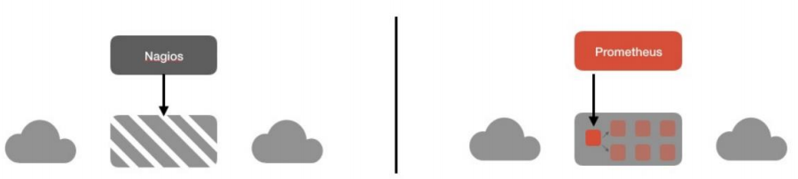
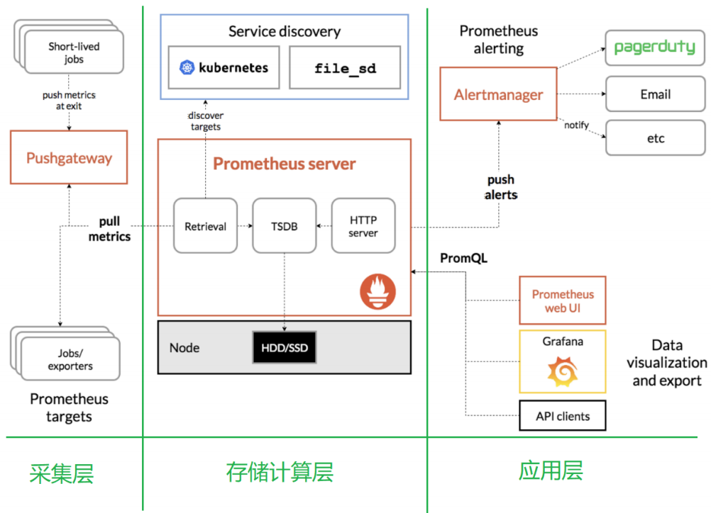
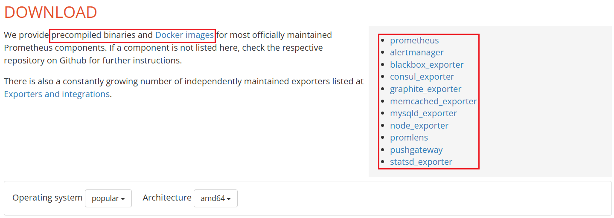
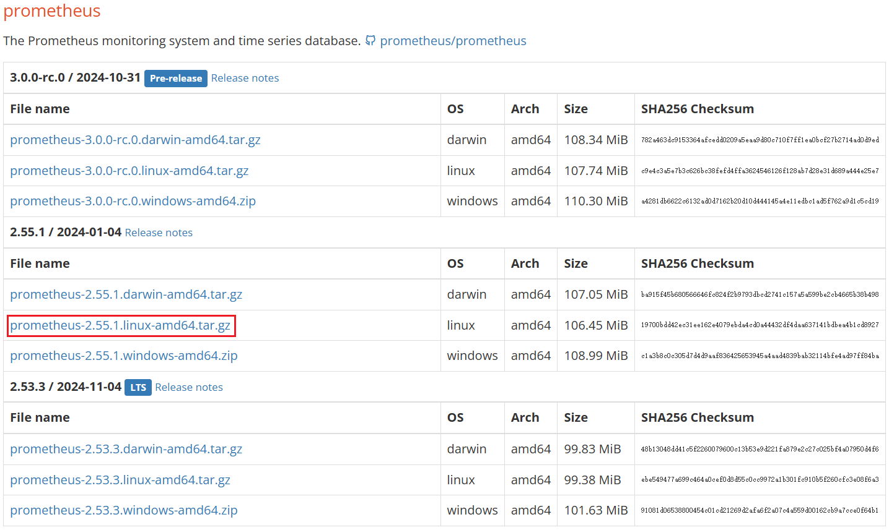
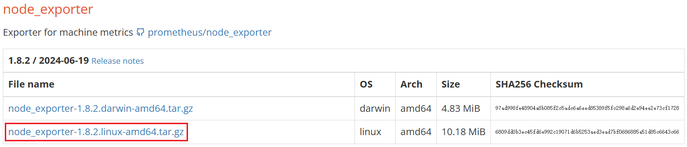

> `Author: ACatSmiling`
>
> `Since: 2024-11-11`

## 概述

Prometheus 受启发于 Google 的 Brogmon 监控系统（相似的 Kubernetes 是从 Google 的 Brog 系统演变而来），从 2012 年开始，由前 Google 工程师在 Soundcloud 以开源软件的

形式进行研发，并且于 2015 年早期对外发布早期版本。

2016 年 5 月继 Kubernetes 之后成为第二个正式加入 CNCF 基金会的项目，同年 6 月正式发布 1.0 版本。2017 年底发布了基于全新存储层的 2.0 版本，能更好地与容器平台、

云平台配合。

Prometheus 作为新一代的云原生监控系统，目前已经有超过 650+ 位贡献者参与到 Prometheus 的研发工作上，并且超过 120+ 项的第三方集成。

### Prometheus 的特点

Prometheus 是一个开源的完整监控解决方案，其对传统监控系统的测试和告警模型进行了彻底的颠覆，形成了基于中央化的规则计算、统一分析和告警的新模型。 相比于传统监控系统，Prometheus 具有以下优点。

#### 易于管理

- Prometheus 核心部分只有一个**单独的二进制文件**，不存在任何的第三方依赖（数据库，缓存等等）。唯一需要的就是本地磁盘，因此不会有潜在级联故障的风险。
- Prometheus **基于 Pull 模型的架构方式**，可以在任何地方（本地电脑，开发环境，测试环境）搭建监控系统。
- 对于一些复杂的情况，还可以使用 Prometheus **服务发现（Service Discovery）**的能力动态管理监控目标。

#### 监控服务的内部运行状态

Pometheus 鼓励用户监控服务的内部状态，基于 Prometheus 丰富的 Client 库，用户可以轻松的在应用程序中添加对 Prometheus 的支持，从而让用户可以获取服务和应用内部真正的运行状态。



#### 强大的数据模型

所有采集的监控数据均以`指标（metric）`的形式保存在**内置的时间序列数据库（TSDB）**当中。所有的样本，除了基本的指标名称以外，还包含一组用于描述该样本特征的标签。如下所示：

```tex
http_request_status{code='200',content_path='/api/path1',environment='produment'} => [value1@timestamp1,value2@timestamp2...]
http_request_status{code='200',content_path='/api/path2',environment='produment'} => [value1@timestamp1,value2@timestamp2...]
```

每一条时间序列由`指标名称（Metrics Name）`以及一组`标签（Labels）`唯一标识，每条时间序列按照时间的先后顺序存储一系列的样本值。

- http_request_status：指标名称。
- {code='200',content_path='/api/path1',environment='produment'}：表示维度的标签，基于这些 Labels，我们可以方便地对监控数据进行聚合，过滤，裁剪。
- [value1@timestamp1,value2@timestamp2...]：按照时间的先后顺序存储的样本值。

#### 强大的查询语言 PromQL

**Prometheus 内置了一个强大的数据查询语言 PromQL，通过 PromQL 可以实现对监控数据的查询、聚合。**同时 PromQL 也被应用于数据可视化（如 Grafana）以及告警当中。

通过 PromQL 可以轻松回答类似于以下问题：

- 在过去一段时间中，95% 应用延迟时间的分布范围？
- 预测在 4 小时后，磁盘空间占用大致会是什么情况？
- CPU 占用率前 5 位的服务有哪些？

#### 高效

对于监控系统而言，大量的监控任务必然导致有大量的数据产生，而 Prometheus 可以高效地处理这些数据，对于单一 Prometheus Server 实例而言，它可以处理：

- 数以百万的监控指标。
- 每秒处理数十万的数据点。

#### 可扩展

可以在每个数据中心、每个团队运行独立的 Prometheus Sevrer。Prometheus 对于联邦集群的支持，可以让多个 Prometheus 实例产生一个逻辑集群，当单实例 Prometheus  Server 处理的任务量过大时，通过使用`功能分区（sharding） + 联邦集群（federation）`，可以对其进行扩展。

#### 易于集成

使用 Prometheus 可以快速搭建监控服务，并且可以非常方便地在应用程序中进行集成。目前支持：Java，JMX，Python，Go，Ruby，.Net，Node.js 等等语言的客户端 SDK，基于这些 SDK 可以快速让应用程序纳入到 Prometheus 的监控当中，或者开发自己的监控数据收集程序。

同时这些客户端收集的监控数据，不仅仅支持 Prometheus，还能支持 Graphite 这些其他的监控工具。

同时，Prometheus 还支持与其他的监控系统进行集成：Graphite，Statsd，Collected，Scollector，muini，Nagios 等。

Prometheus 社区还提供了大量第三方实现的监控数据采集支持：JMX，CloudWatch，EC2，MySQL，PostgresSQL，Haskell，Bash，SNMP，Consul，Haproxy，Mesos，Bind，CouchDB，Django，Memcached，RabbitMQ，Redis，RethinkDB，Rsyslog 等等。

#### 可视化

- Prometheus Server 中自带的 Prometheus UI，可以方便地直接对数据进行查询，并且支持直接以图形化的形式展示数据。同时 Prometheus 还提供了一个独立的基于 Ruby On Rails 的 Dashboard 解决方案 Promdash。
- 最新的 Grafana 可视化工具也已经提供了完整的 Prometheus 支持，基于 Grafana 可以创建更加精美的监控图标。
- 基于 Prometheus 提供的 API 还可以实现自己的监控可视化 UI。

#### 开放性

通常来说，当我们需要监控一个应用程序时，一般需要该应用程序提供对相应监控系统协议的支持，因此应用程序会与所选择的监控系统进行绑定。为了减少这种绑定所带来的限制，对于决策者而言，要么你就直接在应用中集成该监控系统的支持，要么就在外部创建单独的服务来适配不同的监控系统。

而对于 Prometheus 来说，使用 Prometheus 的 client library 的输出格式，不仅支持 Prometheus 的格式化数据，也可以输出支持其它监控系统的格式化数据，比如 Graphite。因此，你甚至可以在不使用 Prometheus 的情况下，采用 Prometheus 的 client library 来让你的应用程序支持监控数据采集。

### Prometheus 的架构



#### 生态圈组件

- `Prometheus Server`：主服务器，负责收集和存储时间序列数据。
- `Client Libraies`：应用程序代码插桩，将监控指标嵌入到被监控应用程序中。
- `Pushgateway`：推送网关，为支持 short-lived 作业提供一个推送网关。
- `Exporter`：专门为一些应用开发的数据摄取组件，例如：HAProxy、StatsD、Graphite 等等。
- `Alertmanager`：专门用于处理 alert 的组件。

#### 架构理解

Prometheus 既然设计为一个维度存储模型，可以把它理解为一个 OLAP 系统。

##### 存储计算层

- `Prometheus Server`：里面包含了存储引擎和计算引擎。
  - `Retrieval`：取数组件，它会主动从 Pushgateway 或者 Exporter 拉取指标数据。
  - `TSDB`：数据核心存储与查询。
  - `HTTP server`：对外提供 HTTP 服务。
- `Service discovery`：可以动态发现要监控的目标。

##### 采集层

采集层分为两类，一类是生命周期较短的作业，还有一类是生命周期较长的作业。

- `短作业`：直接通过 API，在退出时间指标推送给 Pushgateway。
- `长作业`：Retrieval 组件，直接从 Job 或者 Exporter 拉取数据。

##### 应用层

应用层主要分为两种，一种是 AlertManager，另一种是数据可视化。

- `AlertManager`：
  - 对接 Pagerduty，是一套付费的监控报警系统。
  - 可实现短信报警、5 分钟无人 ack 打电话通知、仍然无人 ack，通知值班人员 Manager...，Emial，发送邮件等。
- `数据可视化`
  - Prometheus build-in WebUI。
  - Grafana。
  - 其他基于 API 开发的客户端。

## Prometheus 安装

官网：https://prometheus.io/

下载地址：https://prometheus.io/download/



Prometheus 下载：



node_export 下载：



将下载的二进制包上传到服务器后，解压缩：

```shell
ecs-user@iZgc70tmn4wtnfbbjzjqyaZ:/zeloud$ cd software/
ecs-user@iZgc70tmn4wtnfbbjzjqyaZ:/zeloud/software$ ls
node_exporter-1.8.2.linux-amd64.tar.gz  prometheus-2.55.1.linux-amd64.tar.gz
# 解压 prometheus
ecs-user@iZgc70tmn4wtnfbbjzjqyaZ:/zeloud/software$ tar -zxvf prometheus-2.55.1.linux-amd64.tar.gz -C /zeloud/server/
prometheus-2.55.1.linux-amd64/
prometheus-2.55.1.linux-amd64/consoles/
prometheus-2.55.1.linux-amd64/consoles/node-disk.html
prometheus-2.55.1.linux-amd64/consoles/node-overview.html
prometheus-2.55.1.linux-amd64/consoles/prometheus.html
prometheus-2.55.1.linux-amd64/consoles/index.html.example
prometheus-2.55.1.linux-amd64/consoles/node-cpu.html
prometheus-2.55.1.linux-amd64/consoles/prometheus-overview.html
prometheus-2.55.1.linux-amd64/consoles/node.html
prometheus-2.55.1.linux-amd64/promtool
prometheus-2.55.1.linux-amd64/LICENSE
prometheus-2.55.1.linux-amd64/prometheus
prometheus-2.55.1.linux-amd64/prometheus.yml
prometheus-2.55.1.linux-amd64/console_libraries/
prometheus-2.55.1.linux-amd64/console_libraries/menu.lib
prometheus-2.55.1.linux-amd64/console_libraries/prom.lib
prometheus-2.55.1.linux-amd64/NOTICE
# 解压 node_exporter
ecs-user@iZgc70tmn4wtnfbbjzjqyaZ:/zeloud/software$ tar -zxvf node_exporter-1.8.2.linux-amd64.tar.gz -C /zeloud/server/
node_exporter-1.8.2.linux-amd64/
node_exporter-1.8.2.linux-amd64/NOTICE
node_exporter-1.8.2.linux-amd64/node_exporter
node_exporter-1.8.2.linux-amd64/LICENSE
ecs-user@iZgc70tmn4wtnfbbjzjqyaZ:/zeloud/software$ cd /zeloud/server/
ecs-user@iZgc70tmn4wtnfbbjzjqyaZ:/zeloud/server$ mv prometheus-2.55.1.linux-amd64/ prometheus-2.55.1
ecs-user@iZgc70tmn4wtnfbbjzjqyaZ:/zeloud/server$ mv node_exporter-1.8.2.linux-amd64/ node_exporter-1.8.2
```

修改配置文件 prometheus.yml：

```shell
```

