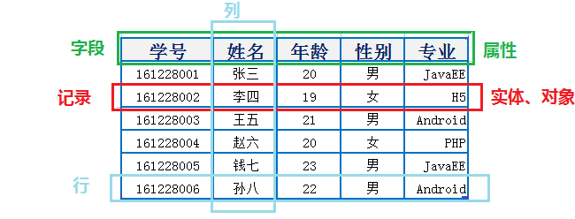

>`Author: ACatSmilin`
>
>`Since: 2024-09-18`

## 数据库与数据库管理系统

### 数据库的相关概念

`DB`：Database，数据库，即存储数据的 "仓库"，其本质是一个文件系统。它保存了一系列有组织的数据。

`DBMS`：Database Management System，数据库管理系统，是一种操纵和管理数据库的大型软件，用于建立、使用和维护数据库，对数据库进行统一管理和控制。用户通过数据库管理系统访问数据库中表内的数据。

`SQL`：Structured Query Language，结构化查询语言，专门用来与数据库通信的语言。

### 数据库与数据库管理系统的关系

`数据库管理系统（DBMS）可以管理多个数据库`，一般开发人员会针对每一个应用创建一个数据库。为保存应用中实体的数据，一般会在数据库创建多个表，以保存程序中实体用户的数据。

数据库管理系统、数据库和表的关系如图所示：


## 关系型数据库设计规则

- 关系型数据库的典型数据结构就是`数据表` ，这些数据表的组成都是结构化的（Structured）。

- 将数据放到表中，表再放到库中。

- 一个数据库中可以有多个表，每个表都有一个名字，用来标识自己。表名具有`唯一性`。

- 表具有一些特性，这些特性定义了数据在表中如何存储，类似 Java 和 Python 中类的设计。

### 表、记录、字段

`E-R（entity-relationship，实体-联系）`模型中有三个主要概念是：`实体集`、`属性`、`联系集`。

一个实体集（class）对应于数据库中的一个表（table），一个实体（instance）则对应于数据库表中的一行（row），也称为一条记录（record）。一个属性（attribute）对应于数据库表中的一列（column），也称为一个字段（field）。



`ORM 思想（Object Relational Mapping）`体现：

- 数据库中的一个表 <---> Java 或 Python 中的一个类。

- 表中的一条数据 <---> 类中的一个对象（或实体）。

- 表中的一个列 <----> 类中的一个字段、属性（field）。

### 表的关联关系

- 表与表之间的数据记录有关系（relationship）。现实世界中的各种实体以及实体之间的各种联系均用关系模型来表示。

- 四种：一对一关联、一对多关联、多对多关联、自我引用。

#### 一对一关联（one-to-one）

在实际的开发中应用不多，因为一对一可以创建成一张表。

一对一关联两种建表原则：

- `外键唯一`：主表的主键和从表的外键（唯一），形成主外键关系，外键唯一。
- `外键是主键`：主表的主键和从表的主键，形成主外键关系。

举例，设计学生表 ：学号、姓名、手机号码、班级、系别、身份证号码、家庭住址、籍贯、紧急联系人、...

- 拆为两个表：两个表的记录是一一对应关系。

- 基础信息表（常用信息）：学号、姓名、手机号码、班级、系别。

- 档案信息表（不常用信息）：学号、身份证号码、家庭住址、籍贯、紧急联系人、...

  

#### 一对多关联（one-to-many）

常见实例场景：客户表和订单表，分类表和商品表，部门表和员工表。

一对多关联建表原则：`在从表 (多方) 创建一个字段，字段作为外键指向主表 (一方) 的主键。`


举例：

- 员工表：编号、姓名、...、所属部门。

- 部门表：编号、名称、简介。

  

  

#### 多对多关联（many-to-many）

要表示多对多关联，必须创建第三个表，该表通常称为`联接表`，它将多对多关系划分为两个一对多关系。将这两个表的主键都插入到第三个表中。


多对多关联建表原则：`需要创建第三张表，中间表中至少两个字段，这两个字段分别作为外键指向各自一方的主键。`

举例 1：学生-课程

- 学生信息表 ：一行代表一个学生的信息（学号、姓名、手机号码、班级、系别...）。

- 课程信息表 ：一行代表一个课程的信息（课程编号、授课老师、简介...）。

- 选课信息表 ：一个学生可以选多门课，一门课可以被多个学生选择。

  

举例 2：产品-订单

- 订单表和产品表有一种多对多的关系，这种关系是通过与订单明细表建立两个一对多关系来定义的。一个订单可以有多个产品，每个产品可以出现在多个订单中。

- 产品表 ：产品表中的每条记录表示一个产品。

- 订单表 ：订单表中的每条记录表示一个订单。

- 订单明细表 ：每个产品可以与订单表中的多条记录对应，即出现在多个订单中。一个订单可以与产品表中的多条记录对应，即包含多个产品。

  

举例 3：用户-角色

- 一个用户，可能存在多个角色。

  

#### 自我引用（Self reference）


## SQL 语言

1946 年，世界上第一台电脑诞生，如今，借由这台电脑发展起来的互联网已经自成江湖。在这几十年里，无数的技术、产业在这片江湖里沉浮，有的方兴未艾，有的已经几幕兴衰。但在这片浩荡的波动里，有一门技术从未消失，甚至老当益壮，那就是 SQL。

45 年前，也就是 1974 年，IBM 研究员发布了一篇揭开数据库技术的论文《SEQUEL：一门结构化的英语查询语言》，直到今天这门结构化的查询语言并没有太大的变化，相比于其他语言， SQL 的半衰期可以说是非常长了。

不论是前端工程师，还是后端算法工程师，都一定会和数据打交道，都需要了解如何又快又准确地提取自己想要的数据。更别提数据分析师了，他们的工作就是和数据打交道，整理不同的报告，以便指导业务决策。

`SQL（Structured Query Language，结构化查询语言）`是使用关系模型的数据库应用语言，与数据直接打交道，由 IBM 上世纪70年代开发出来。后由美国国家标准局（ANSI）开始着手制定 SQL 标准，先后有 SQL-86，SQL-89，SQL-92，SQL-99 等标准。

SQL 有两个重要的标准，分别是`SQL-92`和`SQL-99`，它们分别代表了 92 年和 99 年颁布的 SQL 标准，我们今天使用的 SQL 语言依然遵循这些标准。

>SQL 存在不同版本的标准规范，因为不同规范下的表连接操作是有区别的。
>
>SQL 有两个主要的标准，分别是 SQL-92 和 SQL-99。92 和 99 代表了标准提出的时间，SQL-92 就是 92 年提出的标准规范。当然除了 SQL-92 和 SQL-99 以外，还存在 SQL-86、SQL-89、SQL:2003、SQL:2008、SQL:2011 和 SQL:2016 等其他的标准。
>
>这么多标准，到底该学习哪个呢？实际上最重要的 SQL 标准就是 SQL-92 和 SQL-99。一般来说 SQL-92 的形式更简单，但是写的 SQL 语句会比较长，可读性较差。而 SQL-99 相比于 SQL-92 来说，语法更加复杂，但可读性更强。我们从这两个标准发布的页数也能看出，SQL-92 的标准有 500 页，而 SQL-99 标准超过了 1000 页。实际上从 SQL-99 之后，很少有人能掌握所有内容，因为确实太多了。就好比我们使用 Windows、Linux 和 Office 的时候，很少有人能掌握全部内容一样。我们只需要掌握一些核心的功能，满足日常工作的需求即可。
>
>SQL-92 和 SQL-99 是经典的 SQL 标准，也分别叫做 SQL-2 和 SQL-3 标准。也正是在这两个标准发布之后，SQL 影响力越来越大，甚至超越了数据库领域。现如今 SQL 已经不仅仅是数据库领域的主流语言，还是信息领域中信息处理的主流语言。在图形检索、图像检索以及语音检索中都能看到 SQL 语言的使用。

不同的数据库生产厂商都支持 SQL 语句，但都有特有内容：


### SQL 语言的分类

SQL 语言在功能上主要分为如下三大类：

- **`DDL（Data Definition Languages，数据定义语言）`**：这些语句定义了不同的数据库、表、视图、索引等数据库对象，还可以用来创建、删除、修改数据库和数据表的结构。
  - 主要的语句关键字包括`CREATE`、`DROP`、`ALTER`等。
- **`DML（Data Manipulation Language，数据操作语言）`**：用于添加、删除、更新和查询数据库记录，并检查数据完整性。
  - 主要的语句关键字包括`INSERT`、`DELETE`、`UPDATE`、`SELECT`等。
  - `SELECT 是 SQL 语言的基础，最为重要。`
- **`DCL（Data Control Language，数据控制语言）`**：用于定义数据库、表、字段、用户的访问权限和安全级别。
  - 主要的语句关键字包括`GRANT`、`REVOKE`、`COMMIT`、`ROLLBACK`、`SAVEPOINT`等。

>因为查询语句使用的非常的频繁，所以很多人把查询语句单拎出来一类：`DQL（Data Query Language，数据查询语言）`。
>
>还有单独将 COMMIT 、 ROLLBACK 取出来的，称为`TCL（Transaction Control Language，事务控制语言）`。

### SQL 语言的规则与规范

#### 基本规则

- SQL 可以写在一行或者多行。为了提高可读性，各子句分行写，必要时使用缩进。
- 每条命令以`;`或`\g`或`\G`结束。
- 关键字不能被缩写也不能分行。
- 关于标点符号：
  - 必须保证所有的 ()、单引号、双引号是成对结束的。
  - 必须使用英文状态下的半角输入方式。
  - 字符串型和日期时间类型的数据可以使用单引号（''）表示。
  - 列的别名，尽量使用双引号（""），而且不建议省略 as。

#### SQL 大小写规范

- MySQL 在 Windows 环境下是大小写不敏感的。
- MySQL 在 Linux 环境下是大小写敏感的。
- 数据库名、表名、表的别名、变量名是严格区分大小写的。
  - 关键字、函数名、列名（字段名）、列的别名（字段的别名）是忽略大小写的。
- 推荐采用统一的书写规范：
  - `数据库名、表名、表别名、字段名、字段别名等都小写。`
  - `SQL 关键字、函数名、绑定变量等都大写。`

- 以上规范，建议遵守。

#### 注释

可以使用如下格式的注释结构：

- 单行注释：`#注释文字（MySQL 特有的方式）`
- 单行注释：`-- 注释文字（-- 后面必须包含一个空格）`
- 多行注释：`/* 注释文字 */`

#### 命名规则

- 数据库、表名不能超过 30 个字符，变量名限制为 29 个字符。
- 只能包含 A–Z，a–z，0–9 和 _ 共 63 个字符。
- 数据库名、表名、字段名等对象名中间不要包含空格。
- 同一个 MySQL 软件中，数据库不能同名；同一个库中，表不能重名；同一个表中，字段不能重名。
- 字段不能和保留字、数据库系统或常用方法冲突。如果必须使用，需在 SQL 语句中使用``（着重号）`引起来。
- 保持字段名和类型的一致性，在命名字段并为其指定数据类型的时候一定要保证一致性。假如数据类型在一个表里是整数，那在另一个表里可就别变成字符型了。

#### 导入指令

命令行登录 MySQL 客户端，使用`source`指令导入 sql 文件：

```sql
mysql> source /tmp/insert.sql;
```

> /tmp/insert.sql 是 sql 文件在服务器上的路径。

## 原文链接

https://github.com/ACatSmiling/zero-to-zero/blob/main/RelationalDatabase/mysql.md