>*`Author: ACatSmiling`*
>
>*`Since: 2024-09-19`*

## 多表查询

`多表查询`，也称为`关联查询`，指两个或更多个表一起完成查询操作。

前提条件：这些一起查询的表之间是有关系的（一对一、一对多），它们之间一定是有关联字段，这个关联字段可能建立了外键，也可能没有建立外键。比如：员工表和部门表，这两个表依靠 "部门编号" 进行关联。

### 笛卡尔积

`笛卡尔乘积`是一个数学运算。假设有两个集合 X 和 Y，那么 X 和 Y 的笛卡尔积就是 X 和 Y 的所有可能组合，也就是第一个对象来自于 X，第二个对象来自于 Y 的所有可能。组合的个数即为两个集合中元素个数的乘积数。

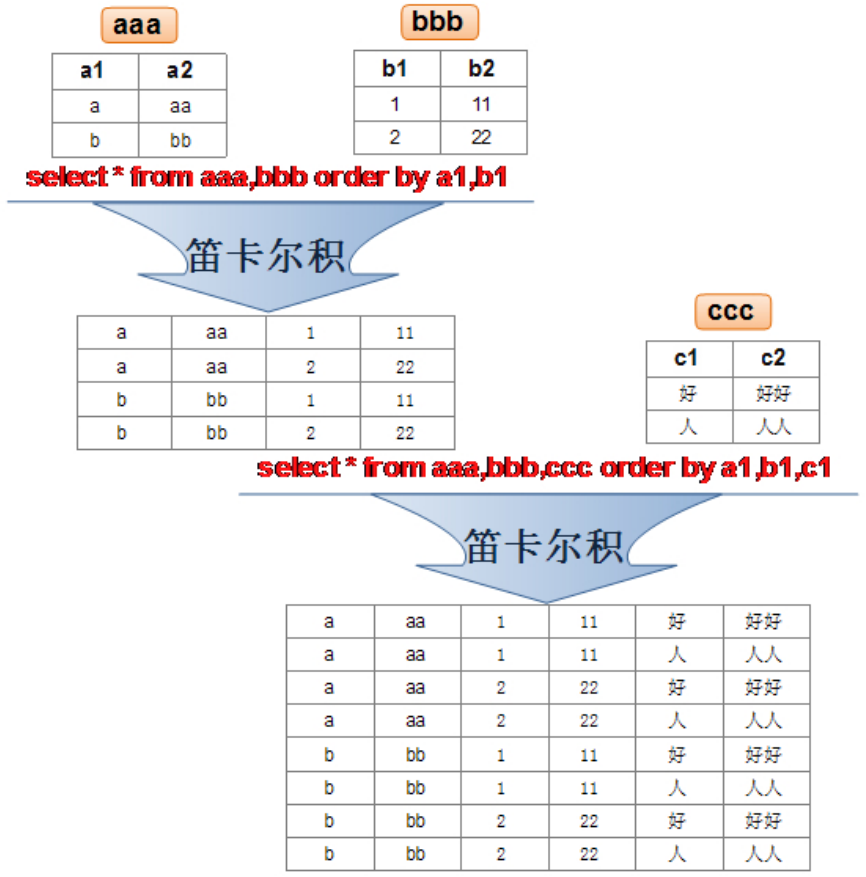

**SQL-92 中，笛卡尔积也称为交叉连接 ，英文是 CROSS JOIN 。**在  SQL-99  中也是使用 CROSS JOIN 表示交叉连接，它的作用就是可以把任意表进行连接，即使这两张表不相关。在 MySQL 中如下情况会出现笛卡尔积：

```mysql
# 查询员工姓名和所在部门名称
mysql> SELECT last_name, department_name FROM employees, departments;
+-------------+----------------------+
| last_name   | department_name      |
+-------------+----------------------+
| King        | Payroll              |
| King        | Recruiting           |
| King        | Retail Sales         |
| King        | Government Sales     |
| King        | IT Helpdesk          |
| King        | NOC                  |
| King        | IT Support           |
| King        | Operations           |
| King        | Contracting          |
| King        | Construction         |
| King        | Manufacturing        |
| King        | Benefits             |
| King        | Shareholder Services |
| King        | Control And Credit   |
| King        | Corporate Tax        |
| King        | Treasury             |
| King        | Accounting           |
| King        | Finance              |
| King        | Executive            |
| King        | Sales                |
| King        | Public Relations     |
| King        | IT                   |
| King        | Shipping             |
| King        | Human Resources      |
| King        | Purchasing           |
| King        | Marketing            |
| King        | Administration       |
| Kochhar     | Payroll              |
| ......                             |
+-------------+----------------------+
2889 rows in set (0.00 sec)

mysql> SELECT last_name, department_name FROM employees CROSS JOIN departments;
+-------------+----------------------+
| last_name   | department_name      |
+-------------+----------------------+
| King        | Payroll              |
| King        | Recruiting           |
| King        | Retail Sales         |
| King        | Government Sales     |
| King        | IT Helpdesk          |
| King        | NOC                  |
| King        | IT Support           |
| King        | Operations           |
| King        | Contracting          |
| King        | Construction         |
| King        | Manufacturing        |
| King        | Benefits             |
| King        | Shareholder Services |
| King        | Control And Credit   |
| King        | Corporate Tax        |
| King        | Treasury             |
| King        | Accounting           |
| King        | Finance              |
| King        | Executive            |
| King        | Sales                |
| King        | Public Relations     |
| King        | IT                   |
| King        | Shipping             |
| King        | Human Resources      |
| King        | Purchasing           |
| King        | Marketing            |
| King        | Administration       |
| Kochhar     | Payroll              |
| ......                             |
+-------------+----------------------+
2889 rows in set (0.00 sec)

mysql> SELECT last_name, department_name FROM employees INNER JOIN departments;
+-------------+----------------------+
| last_name   | department_name      |
+-------------+----------------------+
| King        | Payroll              |
| King        | Recruiting           |
| King        | Retail Sales         |
| King        | Government Sales     |
| King        | IT Helpdesk          |
| King        | NOC                  |
| King        | IT Support           |
| King        | Operations           |
| King        | Contracting          |
| King        | Construction         |
| King        | Manufacturing        |
| King        | Benefits             |
| King        | Shareholder Services |
| King        | Control And Credit   |
| King        | Corporate Tax        |
| King        | Treasury             |
| King        | Accounting           |
| King        | Finance              |
| King        | Executive            |
| King        | Sales                |
| King        | Public Relations     |
| King        | IT                   |
| King        | Shipping             |
| King        | Human Resources      |
| King        | Purchasing           |
| King        | Marketing            |
| King        | Administration       |
| Kochhar     | Payroll              |
| ......                             |
+-------------+----------------------+
2889 rows in set (0.00 sec)

mysql> SELECT last_name, department_name FROM employees JOIN departments;
+-------------+----------------------+
| last_name   | department_name      |
+-------------+----------------------+
| King        | Payroll              |
| King        | Recruiting           |
| King        | Retail Sales         |
| King        | Government Sales     |
| King        | IT Helpdesk          |
| King        | NOC                  |
| King        | IT Support           |
| King        | Operations           |
| King        | Contracting          |
| King        | Construction         |
| King        | Manufacturing        |
| King        | Benefits             |
| King        | Shareholder Services |
| King        | Control And Credit   |
| King        | Corporate Tax        |
| King        | Treasury             |
| King        | Accounting           |
| King        | Finance              |
| King        | Executive            |
| King        | Sales                |
| King        | Public Relations     |
| King        | IT                   |
| King        | Shipping             |
| King        | Human Resources      |
| King        | Purchasing           |
| King        | Marketing            |
| King        | Administration       |
| Kochhar     | Payroll              |
| ......                             |
+-------------+----------------------+
2889 rows in set (0.00 sec)
```

> 上述查询结果，称为`笛卡尔积的错误`，原因：
>
> ```mysql
> mysql> SELECT COUNT(employee_id) FROM employees;
> +--------------------+
> | COUNT(employee_id) |
> +--------------------+
> |                107 |
> +--------------------+
> 1 row in set (0.00 sec)
> 
> mysql> SELECT COUNT(department_id) FROM departments;
> +----------------------+
> | COUNT(department_id) |
> +----------------------+
> |                   27 |
> +----------------------+
> 1 row in set (0.00 sec)
> 
> mysql> SELECT 107 * 27 FROM dual;
> +----------+
> | 107 * 27 |
> +----------+
> |     2889 |
> +----------+
> 1 row in set (0.00 sec)
> ```

笛卡尔积的错误会在下面条件下产生：

- **省略多个表的连接条件（或关联条件）。**
- **连接条件（或关联条件）无效。**
- **所有表中的所有行互相连接。**

为了避免笛卡尔积， 可以**在 WHERE 加入有效的连接条件**。加入连接条件后，查询语法：

```mysql
SELECT table1.column, table2.column
FROM table1, table2
WHERE table1.column1 = table2.column2; # 连接条件
```

> 连接  n 个表，至少需要 n - 1 个连接条件。

查询员工的姓名及其部门名称，正确的写法：

```mysql
mysql> SELECT last_name, department_name FROM employees, departments WHERE employees.department_id = departments.department_id;
+-------------+------------------+
| last_name   | department_name  |
+-------------+------------------+
| Whalen      | Administration   |
| Hartstein   | Marketing        |
| Fay         | Marketing        |
| Raphaely    | Purchasing       |
+-------------+------------------+
106 rows in set (0.00 sec)
```

> **在不同表中有相同字段时，需要在字段前加上所属表名的前缀。多表查询时，建议对每一个查询字段，都添加上所属表名的前缀，这样一是避免相同字段不明确，二是可以对查询进行优化，以提高查询效率。**
>
> **需要注意的是，如果使用了表的别名，在查询字段中、过滤条件中就只能使用别名进行代替，不能使用原有的表名，否则就会报错，这涉及到 SQL 语句不同分段的顺序执行问题。**

>阿里开发规范 ：
>【 强制 】对于数据库中表记录的查询和变更，只要涉及多个表，都需要在列名前加表的别名（或表名）进行限定。
>
>说明 ：对多表进行查询记录、更新记录、删除记录时，如果对操作列没有限定表的别名（或表名），并且操作列在多个表中存在时，就会抛异常。
>
>正例 ：SELECT t1.name FROM table_first AS t1, table_second AS t2 WHERE t1.id = t2.id;
>
>反例 ：在某业务中，由于多表关联查询语句没有加表的别名（或表名）的限制，正常运行两年后，最近在某个表中增加一个同名字段，在预发布环境做数据库变更后，线上查询语句出现出 1052 异常：Column 'name' in field list is ambiguous。

### 多表查询的分类

#### 分类 1：等值连接 vs 非等值连接

##### 等值连接

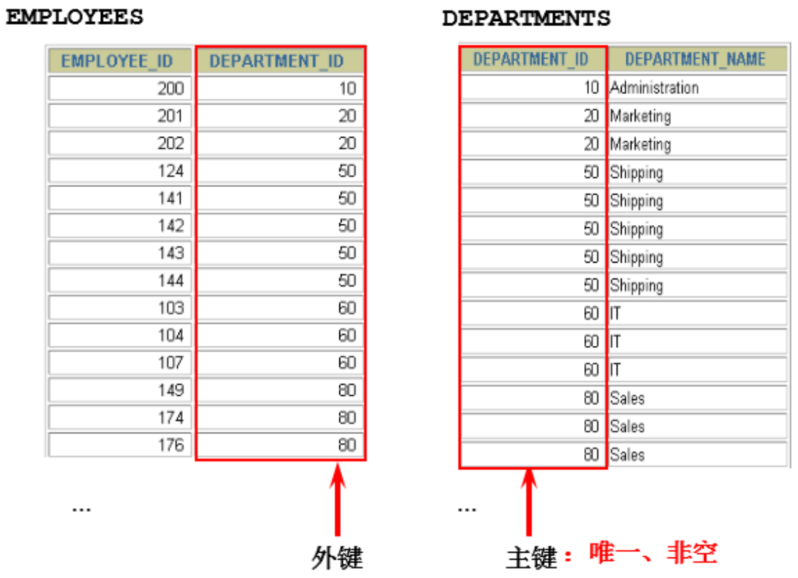

```mysql
mysql> SELECT employees.employee_id, employees.last_name, employees.department_id, departments.department_id, departments.location_id FROM employees, departments WHERE employees.department_id = departments.department_id;
+-------------+-------------+---------------+---------------+-------------+
| employee_id | last_name   | department_id | department_id | location_id |
+-------------+-------------+---------------+---------------+-------------+
|         103 | Hunold      |            60 |            60 |        1400 |
|         104 | Ernst       |            60 |            60 |        1400 |
|         105 | Austin      |            60 |            60 |        1400 |
|         106 | Pataballa   |            60 |            60 |        1400 |
|         107 | Lorentz     |            60 |            60 |        1400 |
+-------------+-------------+---------------+---------------+-------------+
106 rows in set (0.00 sec)
```

##### 非等值连接

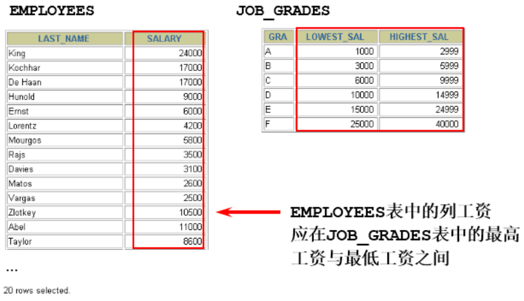

```mysql
mysql> SELECT e.last_name, e.salary, j.grade_level FROM employees e, job_grades j WHERE e.salary BETWEEN j.lowest_sal AND j.highest_sal;
+-------------+----------+-------------+
| last_name   | salary   | grade_level |
+-------------+----------+-------------+
| King        | 24000.00 | E           |
| Kochhar     | 17000.00 | E           |
| De Haan     | 17000.00 | E           |
| Hunold      |  9000.00 | C           |
| Ernst       |  6000.00 | C           |
| Austin      |  4800.00 | B           |
| Pataballa   |  4800.00 | B           |
| Lorentz     |  4200.00 | B           |
| Greenberg   | 12000.00 | D           |
| Gietz       |  8300.00 | C           |
+-------------+----------+-------------+
107 rows in set (0.00 sec)
```

#### 分类 2：自连接 vs 非自连接

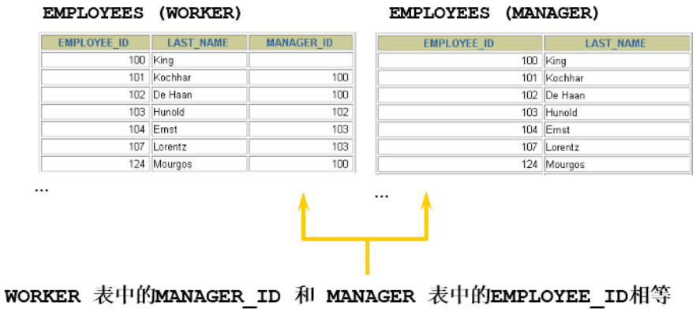

>table1 和 table2 本质上是同一张表，只是用取别名的方式虚拟成两张表以代表不同的意义，然后两个表再进行内连接、外连接等查询。

```mysql
mysql> SELECT CONCAT(worker.last_name, ' works for ', manager.last_name) FROM employees worker, employees manager WHERE worker.manager_id = manager.employee_id;
+------------------------------------------------------------+
| CONCAT(worker.last_name, ' works for ', manager.last_name) |
+------------------------------------------------------------+
| Kochhar works for King                                     |
| De Haan works for King                                     |
| Hunold works for De Haan                                   |
| Ernst works for Hunold                                     |
| Austin works for Hunold                                    |
| Pataballa works for Hunold                                 |
| Lorentz works for Hunold                                   |
| Gietz works for Higgins                                    |
+------------------------------------------------------------+
106 rows in set (0.00 sec)
```

#### 分类 3：内连接 vs 外连接

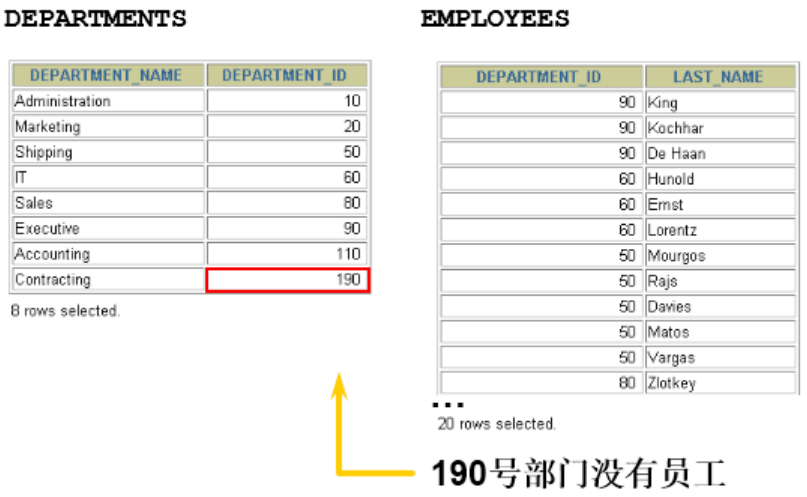

**`内连接`**：合并具有同一列的两个以上的表的行，**结果集中不包含一个表与另一个表不匹配的行**。

**`外连接`**：两个表在连接过程中除了返回满足连接条件的行以外，**还返回左（或右）表中不满足条件的行 ，这种连接称为左（或右） 外连接**。没有匹配的行时，结果表中相应的列为空（NULL）。

- 如果是左外连接，则连接条件中**左边的表也称为`主表`，右边的表称为`从表`。**

- 如果是右外连接，则连接条件中**右边的表也称为`主表` ，左边的表称为`从表`。**

### SQL-99 语法实现多表查询

#### 基本语法

使用`JOIN...ON`子句创建连接的语法结构：

```mysql
SELECT table1.column, table2.column,table3.column
FROM table1
JOIN table2 ON table1 和 table2 的连接条件
JOIN table3 ON table2 和 table3 的连接条件;
```

语法说明：

- 可以使用 ON 子句指定额外的连接条件。
- 这个连接条件是与其它条件分开的。
- ON 子句使语句具有更高的易读性。
- **关键字 JOIN、INNER JOIN、CROSS JOIN 的含义是一样的，都表示内连接。**

它的嵌套逻辑类似我们使用的 FOR 循环：

```mysql
for t1 in table1:
	for t2 in table2:
		if condition1:
			for t3 in table3:
				if condition2:
					output t1 + t2 + t3
```

> SQL-99 采用的这种嵌套结构非常清爽、层次性更强、可读性更强，即使再多的表进行连接也都清晰可见。如果采用 SQL-92，可读性就会大打折扣。

####  内连接（INNER JOIN）的实现

语法：

```mysql
SELECT 字段列表
FROM A表 INNER JOIN B表
ON 关联条件
WHERE 等其他子句;
```

```mysql
mysql> SELECT e.employee_id, e.last_name, e.department_id, d.department_id, d.location_id FROM employees e JOIN departments d ON (e.department_id = d.department_id);
+-------------+-------------+---------------+---------------+-------------+
| employee_id | last_name   | department_id | department_id | location_id |
+-------------+-------------+---------------+---------------+-------------+
|         103 | Hunold      |            60 |            60 |        1400 |
|         104 | Ernst       |            60 |            60 |        1400 |
|         105 | Austin      |            60 |            60 |        1400 |
|         106 | Pataballa   |            60 |            60 |        1400 |
|         107 | Lorentz     |            60 |            60 |        1400 |
|         204 | Baer        |            70 |            70 |        2700 |
+-------------+-------------+---------------+---------------+-------------+
106 rows in set (0.00 sec)

mysql> SELECT employee_id, city, department_name FROM employees e JOIN departments d ON d.department_id = e.department_id JOIN locations l ON d.location_id = l.location_id;
+-------------+---------------------+------------------+
| employee_id | city                | department_name  |
+-------------+---------------------+------------------+
|         200 | Seattle             | Administration   |
|         201 | Toronto             | Marketing        |
|         202 | Toronto             | Marketing        |
|         114 | Seattle             | Purchasing       |
|         115 | Seattle             | Purchasing       |
|         116 | Seattle             | Purchasing       |
|         117 | Seattle             | Purchasing       |
|         118 | Seattle             | Purchasing       |
|         119 | Seattle             | Purchasing       |
|         203 | London              | Human Resources  |
|         120 | South San Francisco | Shipping         |
|         206 | Seattle             | Accounting       |
+-------------+---------------------+------------------+
106 rows in set (0.00 sec)
```

#### 外连接（OUTER JOIN）的实现

##### 左外连接（LEFT OUTER JOIN）

语法：

```mysql
# 实现查询结果是 A
SELECT 字段列表
FROM A表 LEFT JOIN B表
ON 关联条件
WHERE 等其他子句;
```

```mysql
mysql> SELECT e.last_name, e.department_id, d.department_name FROM employees e LEFT OUTER JOIN departments d ON (e.department_id = d.department_id);
+-------------+---------------+------------------+
| last_name   | department_id | department_name  |
+-------------+---------------+------------------+
| King        |            90 | Executive        |
| Kochhar     |            90 | Executive        |
| De Haan     |            90 | Executive        |
| Hunold      |            60 | IT               |
| Ernst       |            60 | IT               |
| Livingston  |            80 | Sales            |
| Grant       |          NULL | NULL             |
| Johnson     |            80 | Sales            |
| Gietz       |           110 | Accounting       |
+-------------+---------------+------------------+
107 rows in set (0.00 sec)
```

> 内连接查询结果是 106 条记录，左外连接是 107 条记录，有一个员工不存在部门信息，内连接的时候，不会显示这个员工的信息。

##### 右外连接（RIGHT OUTER JOIN）

语法：

```mysql
# 实现查询结果是 B
SELECT 字段列表
FROM A表 RIGHT JOIN B表
ON 关联条件
WHERE 等其他子句;
```

```mysql
mysql> SELECT e.last_name, e.department_id, d.department_name FROM employees e RIGHT OUTER JOIN departments d ON (e.department_id = d.department_id);
+-------------+---------------+----------------------+
| last_name   | department_id | department_name      |
+-------------+---------------+----------------------+
| Whalen      |            10 | Administration       |
| Hartstein   |            20 | Marketing            |
| Fay         |            20 | Marketing            |
| Raphaely    |            30 | Purchasing           |
| Khoo        |            30 | Purchasing           |
| Baida       |            30 | Purchasing           |
| Tobias      |            30 | Purchasing           |
| Himuro      |            30 | Purchasing           |
| NULL        |          NULL | IT Support           |
| NULL        |          NULL | NOC                  |
| NULL        |          NULL | IT Helpdesk          |
| NULL        |          NULL | Government Sales     |
| NULL        |          NULL | Retail Sales         |
| NULL        |          NULL | Recruiting           |
| NULL        |          NULL | Payroll              |
+-------------+---------------+----------------------+
122 rows in set (0.00 sec)
```

>右连接查询时，有些部门没有员工，也会显示出部门的信息。
>
>需要注意的是，LEFT JOIN 和 RIGHT JOIN 只存在于 SQL-99 及以后的标准中，在 SQL-92 中不存在，只能用（+）表示。
>
>SQL-92 中采用（+）代表从表所在的位置。即左或右外连接中，（+）表示哪个是从表。Oracle 对 SQL-92 支持较好，而 MySQL 则不支持 SQL-92 的外连接。
>
>```sql
># 左外连接
>SELECT last_name,department_name
>FROM employees ,departments
>WHERE employees.department_id = departments.department_id(+);
>
># 右外连接
>SELECT last_name,department_name
>FROM employees ,departments
>WHERE employees.department_id(+) = departments.department_id;
>```

##### 满外连接（FULL OUTER JOIN）

`满外连接的结果 = 左右表匹配的数据 + 左表没有匹配到的数据 + 右表没有匹配到的数据。`

- SQL-99 是支持满外连接的。使用 FULL JOIN 或 FULL OUTER JOIN 来实现。
- 需要注意的是：**MySQL 不支持 FULL JOIN，但是可以用 LEFT JOIN UNION RIGHT JOIN 代替。**

> 在 SQL-92 中，只有左外连接和右外连接，没有满（或全）外连接。

### 合并查询结果

利用 UNION 关键字可以合并查询结果，可以给出多条 SELECT 语句，并将它们的结果组合成单个结果集。合并时，两个表对应的列数和数据类型必须相同，并且相互对应。**各个 SELECT 语句之间使用 UNION 或 UNION ALL 关键字分隔。**

语法格式：

```mysql
SELECT column,... FROM table1
UNION [ALL]
SELECT column,... FROM table2;
```

#### UNION 操作符

`UNION`操作符返回两个查询的结果集的并集，并去除重复记录。

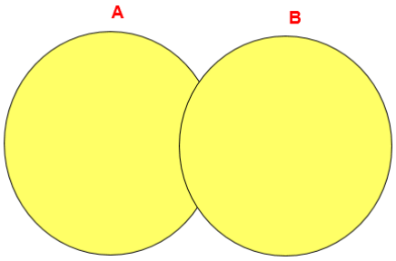

#### UNION ALL 操作符

`UNION ALL`操作符返回两个查询的结果集的并集，对于两个结果集的重复部分，不去重。

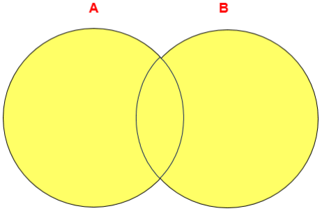

>**执行 UNION ALL 语句时所需要的资源比 UNION 语句少。**如果明确知道合并数据后的结果数据不存在重复数据，或者不需要去除重复的数据，则尽量使用 UNION ALL 语句，以提高数据查询的效率。

举例，查询邮箱包含 a 或者部门编号大于 90 的员工信息：

```mysql
mysql> SELECT * FROM employees WHERE email LIKE '%a%' OR department_id > 90;
+-------------+-------------+------------+----------+--------------------+------------+------------+----------+----------------+------------+---------------+
| employee_id | first_name  | last_name  | email    | phone_number       | hire_date  | job_id     | salary   | commission_pct | manager_id | department_id |
+-------------+-------------+------------+----------+--------------------+------------+------------+----------+----------------+------------+---------------+
|         101 | Neena       | Kochhar    | NKOCHHAR | 515.123.4568       | 1989-09-21 | AD_VP      | 17000.00 |           NULL |        100 |            90 |
|         102 | Lex         | De Haan    | LDEHAAN  | 515.123.4569       | 1993-01-13 | AD_VP      | 17000.00 |           NULL |        100 |            90 |
|         206 | William     | Gietz      | WGIETZ   | 515.123.8181       | 1994-06-07 | AC_ACCOUNT |  8300.00 |           NULL |        205 |           110 |
+-------------+-------------+------------+----------+--------------------+------------+------------+----------+----------------+------------+---------------+
67 rows in set (0.00 sec)
```

使用 UNION 写法：

```mysql
mysql> SELECT * FROM employees WHERE email LIKE '%a%' UNION SELECT * FROM employees WHERE department_id > 90;
+-------------+-------------+------------+----------+--------------------+------------+------------+----------+----------------+------------+---------------+
| employee_id | first_name  | last_name  | email    | phone_number       | hire_date  | job_id     | salary   | commission_pct | manager_id | department_id |
+-------------+-------------+------------+----------+--------------------+------------+------------+----------+----------------+------------+---------------+
|         101 | Neena       | Kochhar    | NKOCHHAR | 515.123.4568       | 1989-09-21 | AD_VP      | 17000.00 |           NULL |        100 |            90 |
|         102 | Lex         | De Haan    | LDEHAAN  | 515.123.4569       | 1993-01-13 | AD_VP      | 17000.00 |           NULL |        100 |            90 |
|         206 | William     | Gietz      | WGIETZ   | 515.123.8181       | 1994-06-07 | AC_ACCOUNT |  8300.00 |           NULL |        205 |           110 |
+-------------+-------------+------------+----------+--------------------+------------+------------+----------+----------------+------------+---------------+
67 rows in set (0.00 sec)
```

### 7 种 SQL JOINS 的实现


中图：内连接 A ∩ B。

```mysql
mysql> SELECT employee_id, last_name, department_name FROM employees e JOIN departments d ON e.department_id = d.department_id;
+-------------+-------------+------------------+
| employee_id | last_name   | department_name  |
+-------------+-------------+------------------+
|         200 | Whalen      | Administration   |
|         201 | Hartstein   | Marketing        |
|         202 | Fay         | Marketing        |
|         205 | Higgins     | Accounting       |
|         206 | Gietz       | Accounting       |
+-------------+-------------+------------------+
106 rows in set (0.00 sec)
```

左上图：左外连接。

```mysql
mysql> SELECT employee_id, last_name, department_name FROM employees e LEFT JOIN departments d ON e.department_id = d.department_id;
+-------------+-------------+------------------+
| employee_id | last_name   | department_name  |
+-------------+-------------+------------------+
|         100 | King        | Executive        |
|         101 | Kochhar     | Executive        |
|         102 | De Haan     | Executive        |
|         178 | Grant       | NULL             |
|         205 | Higgins     | Accounting       |
|         206 | Gietz       | Accounting       |
+-------------+-------------+------------------+
107 rows in set (0.00 sec)
```

右上图：右外连接。

```mysql
mysql> SELECT employee_id, last_name, department_name FROM employees e RIGHT JOIN departments d ON e.department_id = d.`department_id`;
+-------------+-------------+----------------------+
| employee_id | last_name   | department_name      |
+-------------+-------------+----------------------+
|         200 | Whalen      | Administration       |
|         201 | Hartstein   | Marketing            |
|         202 | Fay         | Marketing            |
|        NULL | NULL        | IT Helpdesk          |
|        NULL | NULL        | Government Sales     |
|        NULL | NULL        | Retail Sales         |
|        NULL | NULL        | Recruiting           |
|        NULL | NULL        | Payroll              |
+-------------+-------------+----------------------+
122 rows in set (0.00 sec)
```

左中图：A - A ∩ B。

```mysql
mysql> SELECT employee_id, last_name, department_name FROM employees e LEFT JOIN departments d ON e.department_id = d.department_id WHERE d.department_id IS NULL;
+-------------+-----------+-----------------+
| employee_id | last_name | department_name |
+-------------+-----------+-----------------+
|         178 | Grant     | NULL            |
+-------------+-----------+-----------------+
1 row in set (0.00 sec)
```

右中图：B - A ∩ B。

```mysql
mysql> SELECT employee_id, last_name, department_name FROM employees e RIGHT JOIN departments d ON e.department_id = d.department_id WHERE e.department_id IS NULL;
+-------------+-----------+----------------------+
| employee_id | last_name | department_name      |
+-------------+-----------+----------------------+
|        NULL | NULL      | Treasury             |
|        NULL | NULL      | Corporate Tax        |
|        NULL | NULL      | Control And Credit   |
|        NULL | NULL      | Shareholder Services |
|        NULL | NULL      | Benefits             |
|        NULL | NULL      | Manufacturing        |
|        NULL | NULL      | Construction         |
|        NULL | NULL      | Contracting          |
|        NULL | NULL      | Operations           |
|        NULL | NULL      | IT Support           |
|        NULL | NULL      | NOC                  |
|        NULL | NULL      | IT Helpdesk          |
|        NULL | NULL      | Government Sales     |
|        NULL | NULL      | Retail Sales         |
|        NULL | NULL      | Recruiting           |
|        NULL | NULL      | Payroll              |
+-------------+-----------+----------------------+
16 rows in set (0.00 sec)
```

左下图：满外连接，左中图 + 右上图，A∪B。

```mysql
# 没有去重操作，效率高
mysql> SELECT employee_id, last_name, department_name FROM employees e LEFT JOIN departments d ON e.department_id = d.department_id WHERE d.department_id IS NULL UNION ALL SELECT employee_id, last_name, department_name FROM employees e RIGHT JOIN departments d ON e.department_id = d.department_id;
+-------------+-------------+----------------------+
| employee_id | last_name   | department_name      |
+-------------+-------------+----------------------+
|         178 | Grant       | NULL                 |
|         200 | Whalen      | Administration       |
|         201 | Hartstein   | Marketing            |
|         202 | Fay         | Marketing            |
|         114 | Raphaely    | Purchasing           |
|        NULL | NULL        | Construction         |
|        NULL | NULL        | Contracting          |
|        NULL | NULL        | Operations           |
|        NULL | NULL        | IT Support           |
|        NULL | NULL        | NOC                  |
|        NULL | NULL        | IT Helpdesk          |
|        NULL | NULL        | Government Sales     |
|        NULL | NULL        | Retail Sales         |
|        NULL | NULL        | Recruiting           |
|        NULL | NULL        | Payroll              |
+-------------+-------------+----------------------+
123 rows in set (0.00 sec)
```

右下图：左中图 + 右中图，A ∪B - A ∩ B，或者 (A - A ∩ B) ∪ (B - A ∩ B)。

```mysql
mysql> SELECT employee_id, last_name, department_name FROM employees e LEFT JOIN departments d ON e.department_id = d.department_id WHERE d.department_id IS NULL UNION ALL SELECT employee_id, last_name, department_name FROM employees e RIGHT JOIN departments d ON e.department_id = d.department_id WHERE e.department_id IS NULL;
+-------------+-----------+----------------------+
| employee_id | last_name | department_name      |
+-------------+-----------+----------------------+
|         178 | Grant     | NULL                 |
|        NULL | NULL      | Treasury             |
|        NULL | NULL      | Corporate Tax        |
|        NULL | NULL      | Control And Credit   |
|        NULL | NULL      | Shareholder Services |
|        NULL | NULL      | Benefits             |
|        NULL | NULL      | Manufacturing        |
|        NULL | NULL      | Construction         |
|        NULL | NULL      | Contracting          |
|        NULL | NULL      | Operations           |
|        NULL | NULL      | IT Support           |
|        NULL | NULL      | NOC                  |
|        NULL | NULL      | IT Helpdesk          |
|        NULL | NULL      | Government Sales     |
|        NULL | NULL      | Retail Sales         |
|        NULL | NULL      | Recruiting           |
|        NULL | NULL      | Payroll              |
+-------------+-----------+----------------------+
17 rows in set (0.00 sec)
```

左中图语法格式：

```mysql
# 实现 A - A ∩ B
SELECT 字段列表
FROM A表 LEFT JOIN B表
ON 关联条件
WHERE 从表关联字段 IS NULL AND 等其他子句;
```

右中图语法格式：

```mysql
# 实现 B - A ∩ B
SELECT 字段列表
FROM A表 RIGHT JOIN B表
ON 关联条件
WHERE 从表关联字段 IS NULL AND 等其他子句;
```

左下图语法格式：

```mysql
# 实现查询结果是 A ∪ B，用左外的 A，union 右外的 B
SELECT 字段列表
FROM A表 LEFT JOIN B表
ON 关联条件
WHERE 等其他子句
UNION
SELECT 字段列表
FROM A表 RIGHT JOIN B表
ON 关联条件
WHERE 等其他子句;
```

### SQL-99 语法新特性

#### 自然连接

SQL-99 在 SQL-92 的基础上提供了一些特殊语法，比如`NATURAL JOIN`用来表示自然连接。我们可以把自然连接理解为 SQL-92 中的等值连接，它会自动**查询两张连接表中所有相同的字段**，然后进行等值连接。

在 SQL-92 标准中：

```mysql
mysql> SELECT employee_id, last_name, department_name FROM employees e JOIN departments d ON e.department_id = d.department_id AND e.manager_id = d.manager_id;
+-------------+------------+-----------------+
| employee_id | last_name  | department_name |
+-------------+------------+-----------------+
|         202 | Fay        | Marketing       |
|         115 | Khoo       | Purchasing      |
|         116 | Baida      | Purchasing      |
|         117 | Tobias     | Purchasing      |
|         118 | Himuro     | Purchasing      |
|         119 | Colmenares | Purchasing      |
|         129 | Bissot     | Shipping        |
|         130 | Atkinson   | Shipping        |
|         131 | Marlow     | Shipping        |
|         132 | Olson      | Shipping        |
|         184 | Sarchand   | Shipping        |
|         185 | Bull       | Shipping        |
|         186 | Dellinger  | Shipping        |
|         187 | Cabrio     | Shipping        |
|         104 | Ernst      | IT              |
|         105 | Austin     | IT              |
|         106 | Pataballa  | IT              |
|         107 | Lorentz    | IT              |
|         150 | Tucker     | Sales           |
|         151 | Bernstein  | Sales           |
|         152 | Hall       | Sales           |
|         153 | Olsen      | Sales           |
|         154 | Cambrault  | Sales           |
|         155 | Tuvault    | Sales           |
|         101 | Kochhar    | Executive       |
|         102 | De Haan    | Executive       |
|         109 | Faviet     | Finance         |
|         110 | Chen       | Finance         |
|         111 | Sciarra    | Finance         |
|         112 | Urman      | Finance         |
|         113 | Popp       | Finance         |
|         206 | Gietz      | Accounting      |
+-------------+------------+-----------------+
32 rows in set (0.00 sec)
```

在 SQL-99 中可以写成：

```mysql
mysql> SELECT employee_id, last_name, department_name FROM employees e NATURAL JOIN departments d;
+-------------+------------+-----------------+
| employee_id | last_name  | department_name |
+-------------+------------+-----------------+
|         202 | Fay        | Marketing       |
|         115 | Khoo       | Purchasing      |
|         116 | Baida      | Purchasing      |
|         117 | Tobias     | Purchasing      |
|         118 | Himuro     | Purchasing      |
|         119 | Colmenares | Purchasing      |
|         129 | Bissot     | Shipping        |
|         130 | Atkinson   | Shipping        |
|         131 | Marlow     | Shipping        |
|         132 | Olson      | Shipping        |
|         184 | Sarchand   | Shipping        |
|         185 | Bull       | Shipping        |
|         186 | Dellinger  | Shipping        |
|         187 | Cabrio     | Shipping        |
|         104 | Ernst      | IT              |
|         105 | Austin     | IT              |
|         106 | Pataballa  | IT              |
|         107 | Lorentz    | IT              |
|         150 | Tucker     | Sales           |
|         151 | Bernstein  | Sales           |
|         152 | Hall       | Sales           |
|         153 | Olsen      | Sales           |
|         154 | Cambrault  | Sales           |
|         155 | Tuvault    | Sales           |
|         101 | Kochhar    | Executive       |
|         102 | De Haan    | Executive       |
|         109 | Faviet     | Finance         |
|         110 | Chen       | Finance         |
|         111 | Sciarra    | Finance         |
|         112 | Urman      | Finance         |
|         113 | Popp       | Finance         |
|         206 | Gietz      | Accounting      |
+-------------+------------+-----------------+
32 rows in set (0.00 sec)
```

#### USING 连接

当进行连接的时候，SQL-99 还支持使用`USING`**指定数据表里的同名字段**进行等值连接，但是只能配合 JOIN 一起使用。比如：

```mysql
mysql> SELECT employee_id, last_name, department_name FROM employees e JOIN departments d USING (department_id);
+-------------+-------------+------------------+
| employee_id | last_name   | department_name  |
+-------------+-------------+------------------+
|         200 | Whalen      | Administration   |
|         201 | Hartstein   | Marketing        |
|         202 | Fay         | Marketing        |
|         205 | Higgins     | Accounting       |
|         206 | Gietz       | Accounting       |
+-------------+-------------+------------------+
106 rows in set (0.00 sec)
```

与自然连接 NATURAL JOIN 不同的是，USING 指定了具体的相同的字段名称，需要在 USING 的括号 () 中填入要指定的同名字段。同时使用 JOIN...USING 可以简化 JOIN ON 的等值连接。它与下面的 SQL 查询结果是相同的：

```mysql
mysql> SELECT employee_id, last_name, department_name FROM employees e, departments d WHERE e.department_id = d.department_id;
```

### 小结

表连接的约束条件可以有三种方式：WHERE，ON，USING。

- WHERE：适用于所有关联查询。
- ON ：只能和 JOIN 一起使用，只能写关联条件。虽然关联条件可以并到 WHERE 中和其他条件一起写，但分开写可读性更好。
- USING：只能和 JOIN 一起使用，要求两个关联字段在关联表中名称一致，而且只能表示关联字段值相等。

```mysql
# 把关联条件写在 where 后面
mysql> SELECT last_name, department_name FROM employees, departments WHERE employees.department_id = departments.department_id;

# 把关联条件写在 on 后面，只能和 JOIN 一起使用
mysql> SELECT last_name, department_name FROM employees INNER JOIN departments ON employees.department_id = departments.department_id;

mysql> SELECT last_name, department_name FROM employees CROSS JOIN departments ON employees.department_id = departments.department_id;

mysql> SELECT last_name, department_name FROM employees JOIN departments ON employees.department_id = departments.department_id;

# 把关联字段写在 using() 中，只能和 JOIN 一起使用，而且两个表中的关联字段必须名称相同，而且只能表示 =
# 查询员工姓名与基本工资
mysql> SELECT last_name, job_title FROM employees INNER JOIN jobs USING(job_id);

# n 张表关联，至少需要 n-1 个关联条件
# 查询员工姓名，基本工资，部门名称
mysql> SELECT last_name, job_title, department_name FROM employees, departments, jobs WHERE employees.department_id = departments.department_id AND employees.job_id = jobs.job_id;

mysql> SELECT last_name, job_title, department_name FROM employees INNER JOIN departments INNER JOIN jobs ON employees.department_id = departments.department_id AND employees.job_id = jobs.job_id;
```

>注意：`要控制连接表的数量`。多表连接就相当于嵌套 for 循环一样，非常消耗资源，会让 SQL 查询性能下降得很严重，因此不要连接不必要的表。在许多 DBMS 中，也都会有最大连接表的限#制。

### 连表查询的条件问题

正确写法：

```mysql
SELECT 
  ledger.credit_code AS '统一社会信用代码', info.company_name AS '企业名称', ledger.hazard_ledger_id AS '主键',
  (CASE ledger.danger_level WHEN 1 THEN '一级' WHEN 2 THEN '二级' WHEN 3 THEN '三级' WHEN 4 THEN '四级' ELSE ledger.danger_level END) AS '隐患等级',
  (CASE ledger.manager_level WHEN 0 THEN '集团级' WHEN 1 THEN '公司级' WHEN 2 THEN '企业级' WHEN 3 THEN '车间级' WHEN 4 THEN '装置级' ELSE ledger.manager_level END) AS '管理级别',
  ledger.danger_type AS '隐患类型分类编码',
  (CASE 
        WHEN ledger.danger_type LIKE '1-%' THEN '健康' 
        WHEN ledger.danger_type LIKE '2-%' THEN '安全' 
        WHEN ledger.danger_type LIKE '3-%' THEN '环保' 
        WHEN ledger.danger_type LIKE '4-%' THEN '节能' 
        WHEN ledger.danger_type LIKE '5-%' THEN '低碳' 
        WHEN ledger.danger_type LIKE '6-%' THEN '安保' 
        ELSE ledger.danger_type 
   END) AS '隐患类型一级分类',
  -- ledger.danger_name AS '隐患名称', ledger.danger_description AS '隐患描述', ledger.danger_src AS '隐患来源', ledger.danger_type AS '隐患类型(专业)', ledger.danger_type1 AS '隐患类型(危害因素)', ledger.danger_type2 AS '隐患类型(体系)',
  ledger.find_by_name AS '发现人', ledger.find_date AS '发现时间', ledger.registration_by_name AS '登记人', ledger.regist_time AS '登记时间', '自建系统' AS '系统类型', NOW() AS '导出时间'
FROM dp_phd_ledger ledger
LEFT JOIN company_info info ON ledger.credit_code = info.credit_code AND info.deleted = 0 # 注意此处
WHERE ledger.deleted = 0 AND ledger.danger_type IS NOT NULL AND ledger.find_date >= '2023-05-01 00:00:00' 
ORDER BY ledger.credit_code, DATE_FORMAT(ledger.find_date, '%Y-%m-%d')
```

错误写法：

```mysql
SELECT 
  ledger.credit_code AS '统一社会信用代码', info.company_name AS '企业名称', ledger.hazard_ledger_id AS '主键',
  (CASE ledger.danger_level WHEN 1 THEN '一级' WHEN 2 THEN '二级' WHEN 3 THEN '三级' WHEN 4 THEN '四级' ELSE ledger.danger_level END) AS '隐患等级',
  (CASE ledger.manager_level WHEN 0 THEN '集团级' WHEN 1 THEN '公司级' WHEN 2 THEN '企业级' WHEN 3 THEN '车间级' WHEN 4 THEN '装置级' ELSE ledger.manager_level END) AS '管理级别',
  ledger.danger_type AS '隐患类型分类编码',
  (CASE 
        WHEN ledger.danger_type LIKE '1-%' THEN '健康' 
        WHEN ledger.danger_type LIKE '2-%' THEN '安全' 
        WHEN ledger.danger_type LIKE '3-%' THEN '环保' 
        WHEN ledger.danger_type LIKE '4-%' THEN '节能' 
        WHEN ledger.danger_type LIKE '5-%' THEN '低碳' 
        WHEN ledger.danger_type LIKE '6-%' THEN '安保' 
        ELSE ledger.danger_type 
   END) AS '隐患类型一级分类',
  -- ledger.danger_name AS '隐患名称', ledger.danger_description AS '隐患描述', ledger.danger_src AS '隐患来源', ledger.danger_type AS '隐患类型(专业)', ledger.danger_type1 AS '隐患类型(危害因素)', ledger.danger_type2 AS '隐患类型(体系)',
  ledger.find_by_name AS '发现人', ledger.find_date AS '发现时间', ledger.registration_by_name AS '登记人', ledger.regist_time AS '登记时间', '自建系统' AS '系统类型', NOW() AS '导出时间'
FROM dp_phd_ledger ledger
LEFT JOIN company_info info ON ledger.credit_code = info.credit_code
# 注意此处
WHERE info.deleted = 0 AND ledger.deleted = 0 AND ledger.danger_type IS NOT NULL AND ledger.find_date >= '2023-05-01 00:00:00' 
ORDER BY ledger.credit_code, DATE_FORMAT(ledger.find_date, '%Y-%m-%d')
```

对比正确的连表查询条件写法，错误的写法中，将右表的 info.deleted = 0 条件放到了 WHERE 中，正确的写法则是放在了 ON 中，原因：dp_phd_ledger 为左表，company_info 表为右表，LEFT JOIN 时，company_info 表可能没有数据，此时，company_info 表的 deleted 字段为 NULL，不满足 deleted = 0 条件，`数据会丢失`。而将 info.deleted = 0 条件放到 ON 中，会先过滤 company_info 表的数据，此时不会丢失数据。

## 子查询

子查询指一个查询语句嵌套在另一个查询语句内部的查询，这个特性从 MySQL 4.1 开始引入。

SQL 中子查询的使用大大增强了 SELECT 查询的能力，因为很多时候查询需要从结果集中获取数据，或者需要从同一个表中先计算得出一个数据结果，然后与这个数据结果（可能是某个标量，也可能是某个集合）进行比较。

### 需求分析与问题解决

#### 实际问题


现有解决方式：

```mysql
# 方式一
mysql> SELECT salary FROM employees WHERE last_name = 'Abel';
+----------+
| salary   |
+----------+
| 11000.00 |
+----------+
1 row in set (0.00 sec)

mysql> SELECT last_name, salary FROM employees WHERE salary > 11000;
+-----------+----------+
| last_name | salary   |
+-----------+----------+
| King      | 24000.00 |
| Kochhar   | 17000.00 |
| De Haan   | 17000.00 |
| Greenberg | 12000.00 |
| Russell   | 14000.00 |
| Partners  | 13500.00 |
| Errazuriz | 12000.00 |
| Ozer      | 11500.00 |
| Hartstein | 13000.00 |
| Higgins   | 12000.00 |
+-----------+----------+
10 rows in set (0.00 sec)

# 方式二：自连接
mysql> SELECT e2.last_name, e2.salary FROM employees e1, employees e2 WHERE e1.last_name = 'Abel' AND e1.`salary` < e2.`salary`;
+-----------+----------+
| last_name | salary   |
+-----------+----------+
| King      | 24000.00 |
| Kochhar   | 17000.00 |
| De Haan   | 17000.00 |
| Greenberg | 12000.00 |
| Russell   | 14000.00 |
| Partners  | 13500.00 |
| Errazuriz | 12000.00 |
| Ozer      | 11500.00 |
| Hartstein | 13000.00 |
| Higgins   | 12000.00 |
+-----------+----------+
10 rows in set (0.01 sec)

# 方式三：子查询
mysql> SELECT last_name, salary FROM employees WHERE salary > (SELECT salary FROM employees WHERE last_name = 'Abel');
+-----------+----------+
| last_name | salary   |
+-----------+----------+
| King      | 24000.00 |
| Kochhar   | 17000.00 |
| De Haan   | 17000.00 |
| Greenberg | 12000.00 |
| Russell   | 14000.00 |
| Partners  | 13500.00 |
| Errazuriz | 12000.00 |
| Ozer      | 11500.00 |
| Hartstein | 13000.00 |
| Higgins   | 12000.00 |
+-----------+----------+
10 rows in set (0.00 sec)
```

#### 子查询的基本使用

子查询的基本语法结构：


- **子查询（内查询）在主查询之前一次执行完成。**
- **子查询的结果被主查询（外查询）使用。**

注意事项：

- 子查询要包含在括号内。
- 将子查询放在比较条件的右侧。
- 单行操作符对应单行子查询，多行操作符对应多行子查询。

#### 子查询的分类

分类方式一：按内查询的结果返回一条还是多条记录，将子查询分为`单行子查询`、`多行子查询`。

- 单行子查询

  

- 多行子查询

  

分类方式二：按内查询是否被执行多次，将子查询划分为`相关（或关联）子查询`和`不相关（或非关联）子查询`。

- 子查询从数据表中查询了数据结果，如果这个数据结果只执行一次，然后这个数据结果作为主查询的条件进行执行，那么这样的子查询叫做不相关子查询。
- 同样，如果子查询需要执行多次，即采用循环的方式，先从外部查询开始，每次都传入子查询进行查询，然后再将结果反馈给外部，这种嵌套的执行方式就称为相关子查询。

### 单行子查询

#### 单行比较操作符

| 操作符 | 含义                     |
| ------ | ------------------------ |
| =      | equal to                 |
| >      | greater than             |
| >=     | greater than or equal to |
| <      | less than                |
| <=     | less than or equal to    |
| <>     | not equal to             |

#### 代码示例

查询工资大于 149 号员工工资的员工的信息：

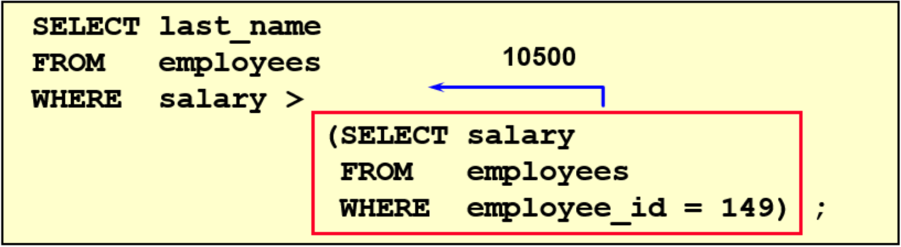

```mysql
mysql> SELECT last_name, salary FROM employees WHERE salary > (SELECT salary FROM employees WHERE employee_id = 149);
+-----------+----------+
| last_name | salary   |
+-----------+----------+
| King      | 24000.00 |
| Kochhar   | 17000.00 |
| De Haan   | 17000.00 |
| Greenberg | 12000.00 |
| Raphaely  | 11000.00 |
| Russell   | 14000.00 |
| Partners  | 13500.00 |
| Errazuriz | 12000.00 |
| Cambrault | 11000.00 |
| Ozer      | 11500.00 |
| Abel      | 11000.00 |
| Hartstein | 13000.00 |
| Higgins   | 12000.00 |
+-----------+----------+
13 rows in set (0.00 sec)
```

返回 job_id 与 141 号员工相同，salary 比 143 号员工多的员工姓名，job_id 和工资：

```mysql
mysql> SELECT last_name, job_id, salary FROM employees WHERE job_id = (SELECT job_id FROM employees WHERE employee_id = 141) AND salary > (SELECT salary FROM employees WHERE employee_id = 143);
+-------------+----------+---------+
| last_name   | job_id   | salary  |
+-------------+----------+---------+
| Nayer       | ST_CLERK | 3200.00 |
| Mikkilineni | ST_CLERK | 2700.00 |
| Bissot      | ST_CLERK | 3300.00 |
| Atkinson    | ST_CLERK | 2800.00 |
| Mallin      | ST_CLERK | 3300.00 |
| Rogers      | ST_CLERK | 2900.00 |
| Ladwig      | ST_CLERK | 3600.00 |
| Stiles      | ST_CLERK | 3200.00 |
| Seo         | ST_CLERK | 2700.00 |
| Rajs        | ST_CLERK | 3500.00 |
| Davies      | ST_CLERK | 3100.00 |
+-------------+----------+---------+
11 rows in set (0.00 sec)
```

返回公司工资最少的员工的 last_name，job_id 和 salary：

```mysql
mysql> SELECT last_name, job_id, salary FROM employees WHERE salary = (SELECT MIN(salary) FROM employees);
+-----------+----------+---------+
| last_name | job_id   | salary  |
+-----------+----------+---------+
| Olson     | ST_CLERK | 2100.00 |
+-----------+----------+---------+
1 row in set (0.00 sec)
```

查询与 141 号或 174 号员工的 manager_id 和 department_id 相同的其他员工的 employee_id，manager_id，department_id：

```mysql
# 方式一
mysql> SELECT employee_id, manager_id, department_id FROM employees WHERE manager_id IN (SELECT manager_id FROM employees WHERE employee_id IN (174,141)) AND department_id IN (SELECT department_id FROM employees WHERE employee_id IN (174,141)) AND employee_id NOT IN (174,141);
+-------------+------------+---------------+
| employee_id | manager_id | department_id |
+-------------+------------+---------------+
|         142 |        124 |            50 |
|         143 |        124 |            50 |
|         144 |        124 |            50 |
|         196 |        124 |            50 |
|         197 |        124 |            50 |
|         198 |        124 |            50 |
|         199 |        124 |            50 |
|         175 |        149 |            80 |
|         176 |        149 |            80 |
|         177 |        149 |            80 |
|         179 |        149 |            80 |
+-------------+------------+---------------+
11 rows in set (0.00 sec)

# 方式二
mysql> SELECT employee_id, manager_id, department_id FROM employees WHERE (manager_id, department_id) IN (SELECT manager_id, department_id FROM employees WHERE employee_id IN (141,174)) AND employee_id NOT IN (141,174);
+-------------+------------+---------------+
| employee_id | manager_id | department_id |
+-------------+------------+---------------+
|         142 |        124 |            50 |
|         143 |        124 |            50 |
|         144 |        124 |            50 |
|         196 |        124 |            50 |
|         197 |        124 |            50 |
|         198 |        124 |            50 |
|         199 |        124 |            50 |
|         175 |        149 |            80 |
|         176 |        149 |            80 |
|         177 |        149 |            80 |
|         179 |        149 |            80 |
+-------------+------------+---------------+
11 rows in set (0.00 sec)
```

#### HAVING 中的子查询

执行过程：

- 首先，执行子查询；
- 然后，向主查询中的 HAVING 子句返回结果。

查询最低工资大于 50 号部门最低工资的部门 id 和其最低工资：

```mysql
mysql> SELECT department_id, MIN(salary) FROM employees GROUP BY department_id HAVING MIN(salary) > (SELECT MIN(salary) FROM employees WHERE department_id = 50); 
+---------------+-------------+
| department_id | MIN(salary) |
+---------------+-------------+
|          NULL |     7000.00 |
|            10 |     4400.00 |
|            20 |     6000.00 |
|            30 |     2500.00 |
|            40 |     6500.00 |
|            60 |     4200.00 |
|            70 |    10000.00 |
|            80 |     6100.00 |
|            90 |    17000.00 |
|           100 |     6900.00 |
|           110 |     8300.00 |
+---------------+-------------+
11 rows in set (0.00 sec)
```

#### CASE 中的子查询

查询员工的 employee_id，last_name 和 location。其中，若员工 department_id 与 location_id 为1800 的员工的 department_id 相同，则 location 为 Canada，其余则为 USA。

```mysql
mysql> SELECT employee_id, last_name, (CASE department_id WHEN (SELECT department_id FROM departments WHERE location_id = 1800) THEN 'Canada' ELSE 'USA' END) location FROM employees;
+-------------+-------------+----------+
| employee_id | last_name   | location |
+-------------+-------------+----------+
|         100 | King        | USA      |
|         101 | Kochhar     | USA      |
|         102 | De Haan     | USA      |
|         103 | Hunold      | USA      |
|         104 | Ernst       | USA      |
|         105 | Austin      | USA      |
|         106 | Pataballa   | USA      |
|         107 | Lorentz     | USA      |
|         108 | Greenberg   | USA      |
|         109 | Faviet      | USA      |
|         110 | Chen        | USA      |
|         111 | Sciarra     | USA      |
|         112 | Urman       | USA      |
|         113 | Popp        | USA      |
|         200 | Whalen      | USA      |
|         201 | Hartstein   | Canada   |
|         202 | Fay         | Canada   |
|         203 | Mavris      | USA      |
|         204 | Baer        | USA      |
|         205 | Higgins     | USA      |
|         206 | Gietz       | USA      |
+-------------+-------------+----------+
107 rows in set (0.00 sec)
```

#### 空值问题

```mysql
mysql> SELECT last_name, job_id FROM employees WHERE job_id = (SELECT job_id FROM employees WHERE last_name = 'Haas');
Empty set (0.00 sec)

mysql> SELECT job_id FROM employees WHERE last_name = 'Haas';
Empty set 
```

> employees 中没有叫 Haas 的员工，子查询不返回任何行，主查询也为空值。

#### 非法使用子查询

```mysql
mysql> SELECT employee_id, last_name FROM employees WHERE salary = (SELECT MIN(salary) FROM employees GROUP BY department_id);
ERROR 1242 (21000): Subquery returns more than 1 row
```

> 多行子查询，但使用了单行比较符。

### 多行子查询

多行子查询，也称为集合比较子查询，其特点如下：

- 内查询返回多行。
- 使用多行比较操作符。

#### 多行比较操作符

| 操作符 | 含义                                                       |
| ------ | ---------------------------------------------------------- |
| IN     | 等于列表中的`任意一个`                                     |
| ANY    | 需要和单行比较操作符一起使用，和子查询返回的`某一个`值比较 |
| ALL    | 需要和单行比较操作符一起使用，和子查询返回的`所有`值比较   |
| SOME   | 实际上是 ANY 的别名，作用相同，一般常使用 ANY              |

#### 代码示例

返回其它 job_id 中比 job_id 为 IT_PROG 部门任一工资低的员工的员工号、姓名、job_id 以及 salary：

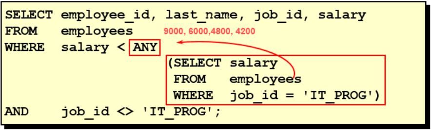

```mysql
mysql> SELECT employee_id, last_name, job_id, salary FROM employees WHERE salary < ANY (SELECT salary FROM employees WHERE job_id = 'IT_PROG') AND job_id <> 'IT_PROG';
+-------------+-------------+------------+---------+
| employee_id | last_name   | job_id     | salary  |
+-------------+-------------+------------+---------+
|         110 | Chen        | FI_ACCOUNT | 8200.00 |
|         111 | Sciarra     | FI_ACCOUNT | 7700.00 |
|         112 | Urman       | FI_ACCOUNT | 7800.00 |
|         113 | Popp        | FI_ACCOUNT | 6900.00 |
|         115 | Khoo        | PU_CLERK   | 3100.00 |		
|         116 | Baida       | PU_CLERK   | 2900.00 |
|         117 | Tobias      | PU_CLERK   | 2800.00 |
|         118 | Himuro      | PU_CLERK   | 2600.00 |
|         119 | Colmenares  | PU_CLERK   | 2500.00 |
|         120 | Weiss       | ST_MAN     | 8000.00 |
|         121 | Fripp       | ST_MAN     | 8200.00 |
|         122 | Kaufling    | ST_MAN     | 7900.00 |
|         123 | Vollman     | ST_MAN     | 6500.00 |
|         124 | Mourgos     | ST_MAN     | 5800.00 |
|         125 | Nayer       | ST_CLERK   | 3200.00 |
|         203 | Mavris      | HR_REP     | 6500.00 |
|         206 | Gietz       | AC_ACCOUNT | 8300.00 |
+-------------+-------------+------------+---------+
76 rows in set (0.00 sec)

mysql> SELECT salary FROM employees WHERE job_id = 'IT_PROG';
+---------+
| salary  |
+---------+
| 9000.00 |
| 6000.00 |
| 4800.00 |
| 4800.00 |
| 4200.00 |
+---------+
5 rows in set (0.00 sec)
```

返回其它 job_id 中比 job_id 为 IT_PROG 部门所有工资都低的员工的员工号、姓名、job_id 以及 salary：

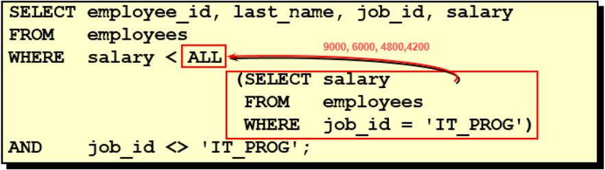

```mysql
mysql> SELECT employee_id, last_name, job_id, salary FROM employees WHERE salary < ALL (SELECT salary FROM employees WHERE job_id = 'IT_PROG') AND job_id <> 'IT_PROG';
+-------------+-------------+----------+---------+
| employee_id | last_name   | job_id   | salary  |
+-------------+-------------+----------+---------+
|         115 | Khoo        | PU_CLERK | 3100.00 |
|         116 | Baida       | PU_CLERK | 2900.00 |
|         117 | Tobias      | PU_CLERK | 2800.00 |
|         118 | Himuro      | PU_CLERK | 2600.00 |
|         119 | Colmenares  | PU_CLERK | 2500.00 |
|         125 | Nayer       | ST_CLERK | 3200.00 |
|         126 | Mikkilineni | ST_CLERK | 2700.00 |
|         127 | Landry      | ST_CLERK | 2400.00 |
|         128 | Markle      | ST_CLERK | 2200.00 |
|         129 | Bissot      | ST_CLERK | 3300.00 |
|         130 | Atkinson    | ST_CLERK | 2800.00 |
|         131 | Marlow      | ST_CLERK | 2500.00 |
|         132 | Olson       | ST_CLERK | 2100.00 |
|         193 | Everett     | SH_CLERK | 3900.00 |
|         194 | McCain      | SH_CLERK | 3200.00 |
|         195 | Jones       | SH_CLERK | 2800.00 |
|         196 | Walsh       | SH_CLERK | 3100.00 |
|         197 | Feeney      | SH_CLERK | 3000.00 |
|         198 | OConnell    | SH_CLERK | 2600.00 |
|         199 | Grant       | SH_CLERK | 2600.00 |
+-------------+-------------+----------+---------+
44 rows in set (0.00 sec)
```

查询平均工资最低的部门 id：

```mysql
# 方式一
mysql> SELECT department_id FROM employees GROUP BY department_id HAVING AVG(salary) = (SELECT MIN(avg_sal) FROM (SELECT AVG(salary) avg_sal FROM employees GROUP BY department_id) t_dept_avg_sal);
+---------------+
| department_id |
+---------------+
|            50 |
+---------------+
1 row in set (0.00 sec)

# 方式二
mysql> SELECT department_id FROM employees GROUP BY department_id HAVING AVG(salary) = (SELECT MIN(avg_sal) FROM (SELECT AVG(salary) avg_sal FROM employees GROUP BY department_id) t_dept_avg_sal);
+---------------+
| department_id |
+---------------+
|            50 |
+---------------+
1 row in set (0.00 sec)
```

> MySQL 中聚合函数不能嵌套使用。

#### 空值问题

```mysql
mysql> SELECT last_name FROM employees WHERE employee_id NOT IN (SELECT manager_id FROM employees);
Empty set (0.00 sec)

mysql> SELECT manager_id FROM employees;
+------------+
| manager_id |
+------------+
|       NULL |
|        100 |
|        100 |
|        100 |
|        149 |
|        149 |
|        201 |
|        205 |
+------------+
107 rows in set (0.00 sec)

mysql> SELECT last_name FROM employees WHERE employee_id NOT IN (SELECT manager_id FROM employees WHERE manager_id IS NOT NULL);
+-------------+
| last_name   |
+-------------+
| Ernst       |
| Austin      |
| Pataballa   |
| Lorentz     |
| Faviet      |
| Mavris      |
| Baer        |
| Gietz       |
+-------------+
89 rows in set (0.00 sec)
```

> 因为子查询中，返回了一个 NULL 值，导致主查询失败。添加条件后，主查询正常。

### 相关子查询

#### 相关子查询执行流程

如果子查询的执行依赖于外部查询，通常情况下都是因为子查询中的表用到了外部的表，并进行了条件关联，因此每执行一次外部查询，子查询都要重新计算一次，这样的子查询就称之为`关联子查询`。

相关子查询按照一行接一行的顺序执行，主查询的每一行都执行一次子查询。

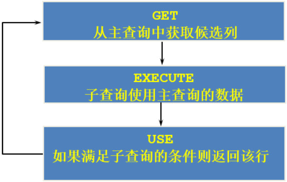

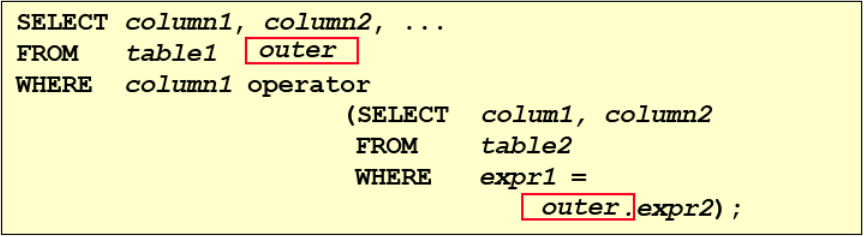

#### 代码示例

查询员工中工资大于本部门平均工资的员工的 last_name，salary 和其 department_id：

```mysql
# 相关子查询
mysql> SELECT e1.last_name, e1.salary, e1.department_id FROM employees e1 WHERE salary > (SELECT AVG(salary) FROM employees e2 WHERE e2.department_id = e1.department_id);
+-----------+----------+---------------+
| last_name | salary   | department_id |
+-----------+----------+---------------+
| King      | 24000.00 |            90 |
| Hunold    |  9000.00 |            60 |
| Ernst     |  6000.00 |            60 |
| Greenberg | 12000.00 |           100 |
| Faviet    |  9000.00 |           100 |
| Raphaely  | 11000.00 |            30 |
| Weiss     |  8000.00 |            50 |
| Fripp     |  8200.00 |            50 |
| Kaufling  |  7900.00 |            50 |
| Vollman   |  6500.00 |            50 |
| Mourgos   |  5800.00 |            50 |
| Ladwig    |  3600.00 |            50 |
| Rajs      |  3500.00 |            50 |
| Russell   | 14000.00 |            80 |
| Partners  | 13500.00 |            80 |
| Errazuriz | 12000.00 |            80 |
| Cambrault | 11000.00 |            80 |
| Zlotkey   | 10500.00 |            80 |
| Tucker    | 10000.00 |            80 |
| Bernstein |  9500.00 |            80 |
| Hall      |  9000.00 |            80 |
| King      | 10000.00 |            80 |
| Sully     |  9500.00 |            80 |
| McEwen    |  9000.00 |            80 |
| Vishney   | 10500.00 |            80 |
| Greene    |  9500.00 |            80 |
| Ozer      | 11500.00 |            80 |
| Bloom     | 10000.00 |            80 |
| Fox       |  9600.00 |            80 |
| Abel      | 11000.00 |            80 |
| Sarchand  |  4200.00 |            50 |
| Bull      |  4100.00 |            50 |
| Chung     |  3800.00 |            50 |
| Dilly     |  3600.00 |            50 |
| Bell      |  4000.00 |            50 |
| Everett   |  3900.00 |            50 |
| Hartstein | 13000.00 |            20 |
| Higgins   | 12000.00 |           110 |
+-----------+----------+---------------+
38 rows in set (0.00 sec)

# 方式二：在 FROM 中使用子查询
mysql> SELECT e1.last_name, e1.salary, e1.department_id FROM employees e1, (SELECT department_id, AVG(salary) dept_avg_sal FROM employees GROUP
BY department_id) e2 WHERE e1.department_id = e2.department_id AND e2.dept_avg_sal < e1.salary;
+-----------+----------+---------------+
| last_name | salary   | department_id |
+-----------+----------+---------------+
| Hartstein | 13000.00 |            20 |
| Raphaely  | 11000.00 |            30 |
| Weiss     |  8000.00 |            50 |
| Fripp     |  8200.00 |            50 |
| Kaufling  |  7900.00 |            50 |
| Vollman   |  6500.00 |            50 |
| Mourgos   |  5800.00 |            50 |
| Ladwig    |  3600.00 |            50 |
| Rajs      |  3500.00 |            50 |
| Sarchand  |  4200.00 |            50 |
| Bull      |  4100.00 |            50 |
| Chung     |  3800.00 |            50 |
| Dilly     |  3600.00 |            50 |
| Bell      |  4000.00 |            50 |
| Everett   |  3900.00 |            50 |
| Hunold    |  9000.00 |            60 |
| Ernst     |  6000.00 |            60 |
| Russell   | 14000.00 |            80 |
| Partners  | 13500.00 |            80 |
| Errazuriz | 12000.00 |            80 |
| Cambrault | 11000.00 |            80 |
| Zlotkey   | 10500.00 |            80 |
| Tucker    | 10000.00 |            80 |
| Bernstein |  9500.00 |            80 |
| Hall      |  9000.00 |            80 |
| King      | 10000.00 |            80 |
| Sully     |  9500.00 |            80 |
| McEwen    |  9000.00 |            80 |
| Vishney   | 10500.00 |            80 |
| Greene    |  9500.00 |            80 |
| Ozer      | 11500.00 |            80 |
| Bloom     | 10000.00 |            80 |
| Fox       |  9600.00 |            80 |
| Abel      | 11000.00 |            80 |
| King      | 24000.00 |            90 |
| Greenberg | 12000.00 |           100 |
| Faviet    |  9000.00 |           100 |
| Higgins   | 12000.00 |           110 |
+-----------+----------+---------------+
38 rows in set (0.00 sec)
```

>FROM 型的子查询：子查询是作为 FROM 的一部分，子查询要用 () 引起来，并且要给这个子查询取别名， 把它当成一张 "临时的虚拟的表" 来使用。（主表与虚拟表关联查询）

查询员工的 id，salary，按照 department_name 排序：

```mysql
# 在 ORDER BY 中使用子查询
mysql> SELECT e.employee_id, e.salary FROM employees e ORDER BY (SELECT department_name FROM departments d WHERE e.department_id = d.department_id);
+-------------+----------+
| employee_id | salary   |
+-------------+----------+
|         178 |  7000.00 |
|         205 | 12000.00 |
|         206 |  8300.00 |
|         200 |  4400.00 |
|         100 | 24000.00 |
|         101 | 17000.00 |
|         102 | 17000.00 |
|         108 | 12000.00 |
|         109 |  9000.00 |
|         110 |  8200.00 |
|         111 |  7700.00 |
|         196 |  3100.00 |
|         197 |  3000.00 |
|         198 |  2600.00 |
|         199 |  2600.00 |
+-------------+----------+
107 rows in set (0.00 sec)
```

>在SELECT中，除了GROUP BY 和 LIMIT之外，其他位置都可以声明子查询！

若 employees 表中 employee_id 与 job_history 表中 employee_id 相同的数目不小于 2，输出这些相同 id 的员工的 employee_id，last_name 和其 job_id：

```mysql
mysql> SELECT e.employee_id, e.last_name, e.job_id FROM employees e WHERE 2 <= (SELECT COUNT(*) FROM job_history WHERE employee_id = e.employee_id);
+-------------+-----------+---------+
| employee_id | last_name | job_id  |
+-------------+-----------+---------+
|         101 | Kochhar   | AD_VP   |
|         176 | Taylor    | SA_REP  |
|         200 | Whalen    | AD_ASST |
+-------------+-----------+---------+
3 rows in set (0.00 sec)
```

#### EXISTS 与 NOT EXISTS 关键字

**关联子查询通常也会和 EXISTS 操作符一起来使用，用来检查在子查询中是否存在满足条件的行。**

- 如果在子查询中不存在满足条件的行：
  - 条件返回 FALSE；
  - 继续在子查询中查找。（不满足继续找）

- 如果在子查询中存在满足条件的行：
  - 条件返回 TRUE；
  - 不在子查询中继续查找。（满足即返回）

**NOT EXISTS 关键字表示如果不存在某种条件，则返回 TRUE，否则返回 FALSE。**

查询公司管理者的 employee_id，last_name，job_id，department_id 信息：

```mysql
# 方式一：自连接
mysql> SELECT DISTINCT e1.employee_id, e1.last_name, e1.job_id, e1.department_id FROM employees e1 JOIN employees e2 WHERE e1.employee_id
= e2.manager_id;
+-------------+-----------+---------+---------------+
| employee_id | last_name | job_id  | department_id |
+-------------+-----------+---------+---------------+
|         100 | King      | AD_PRES |            90 |
|         101 | Kochhar   | AD_VP   |            90 |
|         102 | De Haan   | AD_VP   |            90 |
|         103 | Hunold    | IT_PROG |            60 |
|         108 | Greenberg | FI_MGR  |           100 |
|         114 | Raphaely  | PU_MAN  |            30 |
|         120 | Weiss     | ST_MAN  |            50 |
|         121 | Fripp     | ST_MAN  |            50 |
|         122 | Kaufling  | ST_MAN  |            50 |
|         123 | Vollman   | ST_MAN  |            50 |
|         124 | Mourgos   | ST_MAN  |            50 |
|         145 | Russell   | SA_MAN  |            80 |
|         146 | Partners  | SA_MAN  |            80 |
|         147 | Errazuriz | SA_MAN  |            80 |
|         148 | Cambrault | SA_MAN  |            80 |
|         149 | Zlotkey   | SA_MAN  |            80 |
|         201 | Hartstein | MK_MAN  |            20 |
|         205 | Higgins   | AC_MGR  |           110 |
+-------------+-----------+---------+---------------+
18 rows in set (0.00 sec)

# 方式二：存在一条记录，employees 表中的 manager_id 等于 employee_id，即该 employee 为管理者
mysql> SELECT employee_id, last_name, job_id, department_id FROM employees e1 WHERE EXISTS (SELECT * FROM employees e2 WHERE e2.manager_id = e1.employee_id);
+-------------+-----------+---------+---------------+
| employee_id | last_name | job_id  | department_id |
+-------------+-----------+---------+---------------+
|         100 | King      | AD_PRES |            90 |
|         101 | Kochhar   | AD_VP   |            90 |
|         102 | De Haan   | AD_VP   |            90 |
|         103 | Hunold    | IT_PROG |            60 |
|         108 | Greenberg | FI_MGR  |           100 |
|         114 | Raphaely  | PU_MAN  |            30 |
|         120 | Weiss     | ST_MAN  |            50 |
|         121 | Fripp     | ST_MAN  |            50 |
|         122 | Kaufling  | ST_MAN  |            50 |
|         123 | Vollman   | ST_MAN  |            50 |
|         124 | Mourgos   | ST_MAN  |            50 |
|         145 | Russell   | SA_MAN  |            80 |
|         146 | Partners  | SA_MAN  |            80 |
|         147 | Errazuriz | SA_MAN  |            80 |
|         148 | Cambrault | SA_MAN  |            80 |
|         149 | Zlotkey   | SA_MAN  |            80 |
|         201 | Hartstein | MK_MAN  |            20 |
|         205 | Higgins   | AC_MGR  |           110 |
+-------------+-----------+---------+---------------+
18 rows in set (0.00 sec)

# 方式三：相关子查询
mysql> SELECT employee_id, last_name, job_id, department_id FROM employees WHERE employee_id IN (SELECT DISTINCT manager_id FROM employees);
+-------------+-----------+---------+---------------+
| employee_id | last_name | job_id  | department_id |
+-------------+-----------+---------+---------------+
|         100 | King      | AD_PRES |            90 |
|         101 | Kochhar   | AD_VP   |            90 |
|         102 | De Haan   | AD_VP   |            90 |
|         103 | Hunold    | IT_PROG |            60 |
|         108 | Greenberg | FI_MGR  |           100 |
|         114 | Raphaely  | PU_MAN  |            30 |
|         120 | Weiss     | ST_MAN  |            50 |
|         121 | Fripp     | ST_MAN  |            50 |
|         122 | Kaufling  | ST_MAN  |            50 |
|         123 | Vollman   | ST_MAN  |            50 |
|         124 | Mourgos   | ST_MAN  |            50 |
|         145 | Russell   | SA_MAN  |            80 |
|         146 | Partners  | SA_MAN  |            80 |
|         147 | Errazuriz | SA_MAN  |            80 |
|         148 | Cambrault | SA_MAN  |            80 |
|         149 | Zlotkey   | SA_MAN  |            80 |
|         201 | Hartstein | MK_MAN  |            20 |
|         205 | Higgins   | AC_MGR  |           110 |
+-------------+-----------+---------+---------------+
18 rows in set (0.00 sec)
```

查询 departments 表中，不存在于 employees 表中的部门的 department_id 和 department_name：

```mysql
mysql> SELECT department_id, department_name FROM departments d WHERE NOT EXISTS (SELECT * FROM employees e WHERE e.department_id = d.department_id);
+---------------+----------------------+
| department_id | department_name      |
+---------------+----------------------+
|           120 | Treasury             |
|           130 | Corporate Tax        |
|           140 | Control And Credit   |
|           150 | Shareholder Services |
|           160 | Benefits             |
|           170 | Manufacturing        |
|           180 | Construction         |
|           190 | Contracting          |
|           200 | Operations           |
|           210 | IT Support           |
|           220 | NOC                  |
|           230 | IT Helpdesk          |
|           240 | Government Sales     |
|           250 | Retail Sales         |
|           260 | Recruiting           |
|           270 | Payroll              |
+---------------+----------------------+
16 rows in set (0.00 sec)
```

#### 相关更新

语法：

```mysql
UPDATE table1 alias1
SET column = (SELECT expression FROM table2 alias2 WHERE alias1.column = alias2.column);
```

>使用相关子查询依据一个表中的数据更新另一个表的数据。

在 employees 中增加一个 department_name 字段，数据为员工对应的部门名称：

```mysql
mysql> ALTER TABLE employees ADD(department_name VARCHAR(50));
Query OK, 0 rows affected (0.04 sec)
Records: 0  Duplicates: 0  Warnings: 0

mysql> UPDATE employees e SET department_name = (SELECT department_name FROM departments d WHERE e.department_id = d.department_id);
Query OK, 106 rows affected (0.01 sec)
```

#### 相关删除

语法：

```mysql
DELETE FROM table1 alias1
WHERE column operator (SELECT expression FROM table2 alias2 WHERE alias1.column = alias2.column);
```

> 使用相关子查询依据一个表中的数据删除另一个表的数据。

删除表 employees 中，与 emp_history 表皆有的数据：

```mysql
mysql> DELETE FROM employees e WHERE e.employee_id IN (SELECT eh.employee_id FROM emp_history eh WHERE eh.employee_id = e.employee_id);
```

### 子查询与自连接的对比

查询工资比 Abel 高的员工信息：

```mysql
# 方式一：子查询
mysql> SELECT last_name, salary FROM employees WHERE salary > (SELECT salary FROM employees WHERE last_name = 'Abel');

# 方式二：自连接
mysql> SELECT e2.last_name, e2.salary FROM employees e1, employees e2 WHERE e1.last_name = 'Abel' AND e1.salary < e2.salary;
```

此情况中，即可以使用子查询，也可以使用自连接。一般情况建议使用自连接，因为**在许多 DBMS 的处理过程中，对于自连接的处理速度要比子查询快得多。**

可以这样理解：子查询实际上是通过未知表进行查询后的条件判断，而自连接是通过已知的自身数据表进行条件判断，因此在大部分 DBMS 中都对自连接处理进行了优化。

## 原文链接

https://github.com/ACatSmiling/zero-to-zero/blob/main/RelationalDatabase/mysql.md