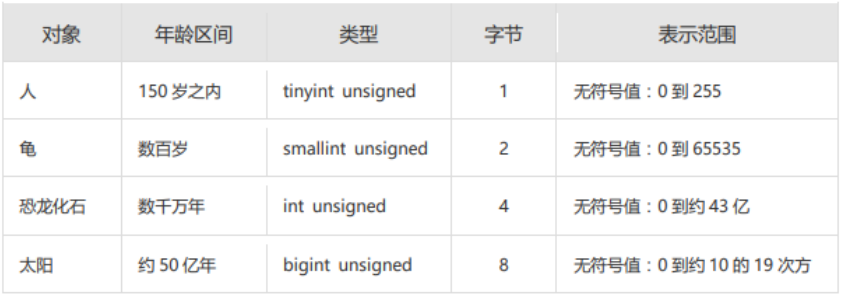
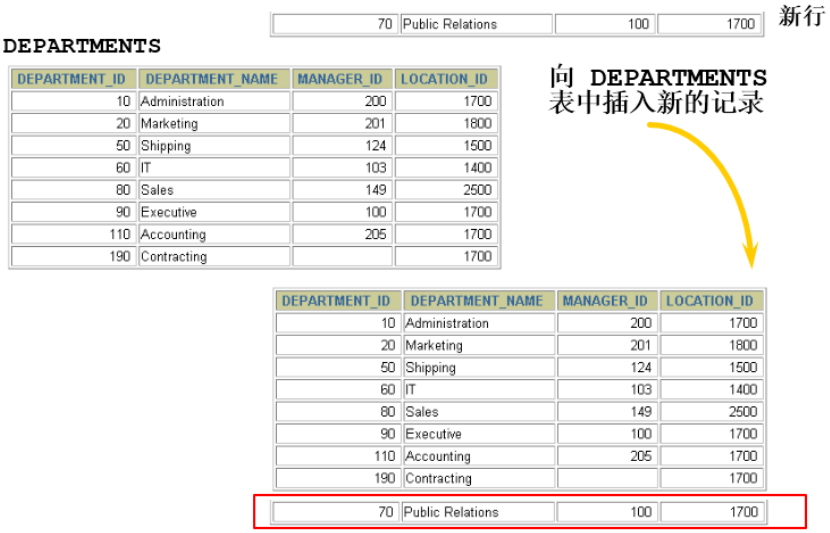
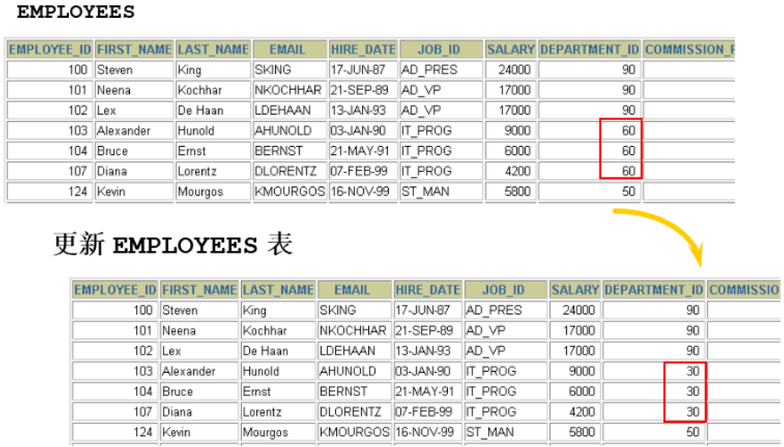

>*`Author: ACatSmiling`*
>
>*`Since: 2024-09-20`*

## 创建和管理表

### 基础知识

#### 一条数据存储的过程

**`存储数据`是处理数据的第一步。**只有正确地把数据存储起来，才能进行有效的处理和分析。否则，只能是一团乱麻，无从下手。

那么，怎样才能把用户各种经营相关的、纷繁复杂的数据，有序、高效地存储起来呢？ 在 MySQL 中，一个完整的数据存储过程总共有 4 步，分别是`创建数据库`、`确认字段`、`创建数据表`、`插入数据`。


从系统架构的层次上看，MySQL 数据库系统从大到小依次是`数据库服务器`、`数据库`、`数据表`、`数据表的行与列`。

#### 标识符命名规则

- 数据库名、表名不得超过 30 个字符，变量名限制为 29 个。
- 必须只能包含 A ~ Z，a ~ z，0 ~ 9，_ 共 63 个字符。
- 数据库名、表名、字段名等对象名中间不要包含空格。
- 同一个 MySQL 软件中，数据库不能同名；同一个库中，表不能重名；同一个表中，字段不能重名，应避免字段和保留字、数据库系统或常用方法名冲突。如果需要使用，在 SQL 语句中使用 `（着重号）引起来。
- 保持字段名和类型的一致性：在命名字段并为其指定数据类型的时候一定要保证一致性，假如数据类型在一个表里是整数，那在另一个表里也应该是整数。

### 创建和管理数据库

####  创建数据库

```mysql
# 方式一：创建数据库
mysql> CREATE DATABASE 数据库名;

# 方式二：创建数据库并指定字符集
mysql> CREATE DATABASE 数据库名 CHARACTER SET 字符集;

# 方式三：判断数据库是否已经存在, 不存在则创建数据库（推荐）
mysql> CREATE DATABASE IF NOT EXISTS 数据库名;
```

如果 MySQL 中已经存在相关的数据库，则忽略创建语句，不再创建数据库。

>注意：`DATABASE 不能改名`。一些可视化工具可以改名，它是建新库，把所有表复制到新库，再删旧库完成的。

#### 使用数据库

```mysql
# 查看当前所有的数据库
mysql> SHOW DATABASES;

# 查看当前正在使用的数据库
mysql> SELECT DATABASE();

# 查看指定库下所有的表
mysql> SHOW TABLES FROM 数据库名;

# 查看数据库的创建信息
mysql> SHOW CREATE DATABASE 数据库名;
mysql> SHOW CREATE DATABASE 数据库名\G

# 查看某张表属于哪个库
mysql> SELECT table_schema FROM information_schema.TABLES WHERE table_name = 表名;

# 使用/切换数据库
mysql> USE 数据库名;
```

>要操作表格和数据之前必须先说明是对哪个数据库进行操作，否则就要对所有对象加上 "数据库名."。

#### 修改数据库

```mysql
# 更改字符集，比如：gbk、utf8 等
mysql> ALTER DATABASE 数据库名 CHARACTER SET 字符集;
```

#### 删除数据库

```mysql
# 删除指定数据库
mysql> DROP DATABASE 数据库名;

# 删除指定数据库（推荐）
mysql> DROP DATABASE IF EXISTS 数据库名;
```

### 创建表

#### 创建方式一

必备条件：

- CREATE TABLE 权限；
- 存储空间。

语法格式：

```mysql
CREATE TABLE [IF NOT EXISTS] 表名(
字段1, 数据类型 [约束条件] [默认值],
字段2, 数据类型 [约束条件] [默认值],
字段3, 数据类型 [约束条件] [默认值],
……
[表约束条件]
);
```

>加上了 IF NOT EXISTS 关键字，则表示：如果当前数据库中不存在要创建的数据表，则创建数据表；如果当前数据库中已经存在要创建的数据表，则忽略建表语句，不再创建数据表。

必须指定：

- 表名；
- 列名或字段名，数据类型，长度。

可选指定：

- 约束条件；
- 默认值。

示例：

```mysql
-- 创建表
CREATE TABLE emp (
    -- int 类型
    emp_id INT,
    -- 最多保存 20 个中英文字符
    emp_name VARCHAR(20),
    -- 总位数不超过 15 位
    salary DOUBLE,
    -- 日期类型
    birthday DATE
);

CREATE TABLE dept(
    -- int 类型，自增
    deptno INT(2) AUTO_INCREMENT,
    dname VARCHAR(14),
    loc VARCHAR(13),
    -- 主键
    PRIMARY KEY (deptno)
);
```

>在 MySQL 8.x 版本中，不再推荐为 INT 类型指定显示长度，并在未来的版本中可能去掉这样的语法。

#### 创建方式二

使用`AS subquery`选项，将创建表和插入数据结合起来：


- 指定的列和子查询中的列要一一对应。
- 通过列名和默认值定义列。

示例：

```mysql
mysql> CREATE TABLE emp1 AS SELECT * FROM employees;

# 创建的 emp2 是空表
mysql> CREATE TABLE emp2 AS SELECT * FROM employees WHERE 1 = 2;

mysql> CREATE TABLE dept80 AS SELECT employee_id, last_name, salary * 12 ANNSAL, hire_date FROM employees WHERE department_id = 80;
```

#### 查看数据表结构

在 MySQL 中创建好数据表之后，可以查看数据表的结构。MySQL 支持使用`DESCRIBE/DESC`语句查看数据表结构，也支持使用`SHOW CREATE TABLE`语句查看数据表结构。

语法格式如下：

```mysql
SHOW CREATE TABLE 表名\G
```

> 使用 SHOW CREATE TABLE 语句不仅可以查看表创建时的详细语句，还可以查看存储引擎和字符编码。

### 修改表

修改表指的是修改数据库中已经存在的数据表的结构。

使用`ALTER TABLE`语句可以实现：

- 向已有的表中添加列。
- 修改现有表中的列。
- 删除现有表中的列。
- 重命名现有表中的列。

#### 追加一个列

语法：

```mysql
ALTER TABLE 表名 ADD [COLUMN] 字段名 字段类型 [FIRST|AFTER 字段名];
```

#### 修改一个列

可以修改列的数据类型，长度、默认值和位置。

语法：

```mysql
ALTER TABLE 表名 MODIFY [COLUMN] 字段名1 字段类型 [DEFAULT 默认值] [FIRST|AFTER 字段名2];
```

> 对默认值的修改只影响今后对表的修改。

#### 重命名一个列

语法：

```mysql
ALTER TABLE 表名 CHANGE [column] 列名 新列名 新数据类型;
```

#### 删除一个列

语法：

```mysql
ALTER TABLE 表名 DROP [COLUMN] 字段名;
```

### 重命名表

```mysql
# 方式一
mysql> RENAME TABLE emp TO myemp;

# 方式二
mysql> ALTER table dept RENAME [TO] detail_dept; -- [TO]可以省略
```

### 删除表

在 MySQL 中，当一张数据表没有与其他任何数据表形成关联关系时，可以将当前数据表直接删除。

- 数据和结构都被删除。
- 所有正在运行的相关事务被提交。
- 所有相关索引被删除。

语法：

```mysql
DROP TABLE [IF EXISTS] 数据表1 [, 数据表2, …, 数据表n];
```

- IF EXISTS 的含义为：如果当前数据库中存在相应的数据表，则删除数据表；如果当前数据库中不存在相应的数据表，则忽略删除语句，不再执行删除数据表的操作。

>注意：**DROP TABLE 语句不能回滚。**

### 清空表

`TRUNCATE TABLE`语句：

- 删除表中所有的数据。
- 释放表的存储空间。

语法：

```mysql
TRUNCATE TABLE 表名;
```

> 注意：**TRUNCATE 语句不能回滚，而使用 DELETE 语句删除数据，可以回滚。**

>阿里开发规范：
>【参考】TRUNCATE TABLE 比 DELETE 速度快，且使用的系统和事务日志资源少，但 TRUNCATE 无事务且不触发 TRIGGER，有可能造成事故，故不建议在开发代码中使用此语句。
>
>说明：TRUNCATE TABLE 在功能上与不带 WHERE 子句的 DELETE 语句相同。

### 阿里开发规范扩展

**拓展 1：阿里巴巴《Java 开发手册》之 MySQL 字段命名。**

- 【 强制 】表名、字段名必须使用小写字母或数字，禁止出现数字开头，禁止两个下划线中间只出现数字。数据库字段名的修改代价很大，因为无法进行预发布，所以字段名称需要慎重考虑。

  - 正例：aliyun_admin，rdc_config，level3_name。
  - 反例：AliyunAdmin，rdcConfig，level_3_name。

- 【 强制 】禁用保留字，如 desc、range、match、delayed 等，请参考 MySQL 官方保留字。

- 【 强制 】表必备三字段：id，gmt_create，gmt_modified。

  - 说明：其中 id 必为主键，类型为 BIGINT UNSIGNED、单表时自增、步长为 1。gmt_create，gmt_modified 的类型均为 DATETIME 类型，前者现在时表示主动式创建，后者过去分词表示被动式更新。

- 【 推荐 】表的命名最好是遵循 "业务名称_表的作用"。

- 【 推荐 】库名与应用名称尽量一致。

- 【参考】合适的字符存储长度，不但节约数据库表空间、节约索引存储，更重要的是提升检索速度。

  - 正例：无符号值可以避免误存负数，且扩大了表示范围。

    

**拓展 2：如何理解清空表、删除表等操作需谨慎？！**

表删除操作将把表的定义和表中的数据一起删除，并且 MySQL 在执行删除操作时，不会有任何的确认信息提示，因此执行删除操时应当慎重。在删除表前，最好对表中的数据进行备份，这样当操作失误时可以对数据进行恢复，以免造成无法挽回的后果。

同样的，在使用 ALTER TABLE 进行表的基本修改操作时，在执行操作过程之前，也应该确保对数据进行完整的备份，因为数据库的改变是无法撤销的，如果添加了一个不需要的字段，可以将其删除；相同的，如果删除了一个需要的列，该列下面的所有数据都将会丢失。

**拓展 3：MySQL 8.0 新特性 — DDL 的原子化。**

**在 MySQL 8.0 版本中，InnoDB 表的 DDL 支持事务完整性，即 DDL 操作要么成功要么回滚 。**DDL 操作回滚日志写入到 data dictionary 数据字典表 mysql.innodb_ddl_log（该表是隐藏的表，通过 SHOW TABLES 无法看到）中，用于回滚操作。通过设置参数，可将 DDL 操作日志打印输出到 MySQL 错误日志中。

示例：

```mysql
mysql> CREATE DATABASE mytest;

mysql> USE mytest;

mysql> CREATE TABLE book1(
        	book_id INT,
        	book_name VARCHAR(255)
	   );

mysql> SHOW TABLES;
```

在 MySQL 5.7 版本中，删除数据表 book1 和数据表 book2，结果如下：

```mysql
mysql> DROP TABLE book1, book2;
ERROR 1051 (42S02): Unknown table 'mytest.book2'

mysql> SHOW TABLES;
Empty set (0.00 sec)
```

> 从结果可以看出，虽然删除操作时报错了，但是仍然删除了数据表 book1。

在 MySQL 8.0 版本中，删除数据表 book1 和数据表 book2，结果如下：

```mysql
mysql> mysql> DROP TABLE book1, book2;
ERROR 1051 (42S02): Unknown table 'mytest.book2'

mysql> SHOW tables;
+------------------+
| Tables_in_mytest |
+------------------+
| book1            |
+------------------+
1 row in set (0.00 sec)
```

>从结果可以看出，数据表 book1 并没有被删除。

## 数据处理之增删改

### 插入数据

#### 实际问题



使用`INSERT`语句向表中插入数据。

#### 方式一：VALUES 的方式添加

情况 1：为表的所有字段按默认顺序插入数据。

```mysql
INSERT INTO 表名
VALUES (value1, value2, …);
```

>值列表中需要为表的每一个字段指定值，并且值的顺序必须和数据表中字段定义时的顺序相同。

情况 2：为表的指定字段插入数据。

```mysql
INSERT INTO 表名(column1 [, column2, …, columnn])
VALUES (value1 [,value2, …, valuen]);
```

>为表的指定字段插入数据，就是在 INSERT 语句中只向部分字段中插入值，而其他字段的值为表定义时的默认值。
>
>在 INSERT 子句中随意列出列名，但是一旦列出，VALUES 中要插入的 value1，...，valuen 需要与 column1，...，columnn 列一一对应。如果类型不同，将无法插入，并且 MySQL 会产生错误。

情况 3：同时插入多条记录。

INSERT 语句可以同时向数据表中插入多条记录，插入时指定多个值列表，每个值列表之间用逗号分隔开，基本语法格式如下：

```mysql
INSERT INTO table_name
VALUES
(value1 [, value2, …, valuen]),
(value1 [, value2, …, valuen]),
……
(value1 [, value2, …, valuen]);
```

```mysql
INSERT INTO table_name(column1 [, column2, …, columnn])
VALUES
(value1 [, value2, …, valuen]),
(value1 [, value2, …, valuen]),
……
(value1 [, value2, …, valuen]);
```

使用 INSERT 同时插入多条记录时，MySQL 会返回一些在执行单行插入时没有的额外信息，这些信息的含义如下：

- Records：表明插入的记录条数。 
- Duplicates：表明插入时被忽略的记录，原因可能是这些记录包含了重复的主键值。 
- Warnings：表明有问题的数据值，例如发生数据类型转换。

>一个同时插入多行记录的 INSERT 语句等同于多个单行插入的 INSERT 语句，但是多行的 INSERT 语句在处理过程中`效率更高`。**因为 MySQL 执行单条 INSERT 语句插入多行数据比使用多条 INSERT 语句快，所以在插入多条记录时最好选择使用单条 INSERT 语句的方式插入。**

>VALUES 也可以写成 VALUE，但是 VALUES 是标准写法。
>
>**字符和日期型数据应包含在单引号中。**

#### 方式二：将查询结果插入到表中

INSERT 还可以将 SELECT 语句查询的结果插入到表中，此时不需要把每一条记录的值一个一个输入，只需要使用一条 INSERT 语句和一条 SELECT 语句组成的组合语句，即可快速地从一个或多个表中向一个表中插入多行。

语法：

```mysql
INSERT INTO 目标表名
(tar_column1 [, tar_column2, …, tar_columnn])
SELECT
(src_column1 [, src_column2, …, src_columnn])
FROM 源表名
[WHERE condition];
```

- 在 INSERT 语句中加入子查询。
- 不必书写 VALUES 子句。
- 子查询中的值列表应与 INSERT 子句中的列名对应。

### 更新数据



使用`UPDATE`语句更新数据。

语法：

```mysql
UPDATE table_name
SET column1 = value1, column2 = value2, …, column = valuen
[WHERE condition];
```

- 可以一次更新多条数据。
- 如果需要回滚数据，需要保证在 DML 前，关闭自动提交：`SET AUTOCOMMIT = FALSE;`。
- 使用 WHERE 子句指定需要更新的数据。
- 如果省略 WHERE 子句，则表中的所有数据都将被更新。

连表更新：

```mysql
UPDATE hse_alratk.`work_ticket` ticket
 	INNER JOIN hse_alratk.`work_ticket_operation` operation ON ticket.id = operation.work_ticket
     	and operation.is_audit_complete = 1
     	and operation.operation_code = 'sign'
     	and operation.is_deleted = 0
     	and ticket.is_deleted = 0
SET ticket.actual_start_time = operation.updated_dt;
 
UPDATE hse_alratk.`work_task` task
    INNER JOIN (
     	SELECT work_task, MIN(actual_start_time) AS min_start_time
     	FROM hse_alratk.`work_ticket`
     	WHERE actual_start_time IS NOT NULL AND is_deleted = 0
     	GROUP BY work_task
    ) a ON a.work_task = task.id AND task.is_deleted = 0
SET task.actual_start_time = a.min_start_time;
```

### 删除数据

使用`DELETE`语句从表中删除数据。

语法：

```mysql
DELETE FROM 表名 [WHERE <condition>];
```

>如果没有 WHERE 子句，DELETE 语句将删除表中的所有记录。

### MySQL 8.0 新特性：计算列

简单来说，**计算列就是某一列的值是通过别的列计算得来的。**例如，a 列值为 1，b 列值为 2，c 列不需要手动插入，定义 a + b 的结果为 c 的值，那么 c 就是计算列，是通过别的列计算得来的。

在 MySQL 8.0 中，CREATE TABLE 和 ALTER TABLE 中都支持增加计算列。

示例：定义数据表 tb1，然后定义字段 id、字段 a、字段 b 和字段 c，其中字段 c 为计算列，用于计算 a + b 的值。 

```mysql
# 创建测试表 tb1
mysql> CREATE TABLE tb1(
    -> 		id INT,
    -> 		a INT,
    -> 		b INT,
    -> 		c INT GENERATED ALWAYS AS (a + b) VIRTUAL
    -> );
Query OK, 0 rows affected (0.03 sec)
    
# 插入数据
mysql> INSERT INTO tb1(a, b) VALUES (100, 200);
Query OK, 1 row affected (0.01 sec)

# 查询
mysql> SELECT * FROM tb1;
+------+------+------+------+
| id   | a    | b    | c    |
+------+------+------+------+
| NULL |  100 |  200 |  300 |
+------+------+------+------+
1 row in set (0.00 sec)

# 更新
mysql> UPDATE tb1 SET a = 500;
Query OK, 1 row affected (0.01 sec)
Rows matched: 1  Changed: 1  Warnings: 0

# 计算列同步更新
mysql> SELECT * FROM tb1;
+------+------+------+------+
| id   | a    | b    | c    |
+------+------+------+------+
| NULL |  500 |  200 |  700 |
+------+------+------+------+
1 row in set (0.00 sec)
```

## 原文链接

https://github.com/ACatSmiling/zero-to-zero/blob/main/RelationalDatabase/mysql.md