>*`Author: ACatSmiling`*
>
>*`Since: 2024-09-21`*

## 逻辑架构

### 逻辑架构剖析

#### 服务器处理客户端请求

首先，MySQL 是典型的 C/S 架构，即`Client/Server`架构，服务器端程序使用的是`mysqld`。

不论客户端进程和服务器进程是采用哪种方式进行通信，最后实现的效果都是：`客户端进程向服务器进程发送一段文本（SQL 语句），服务器进程处理后再向客户端进程发送一段文本（处理结果）`。

那服务器进程对客户端进程发送的请求做了什么处理，才能产生最后的处理结果呢？这里以查询请求为例展示：

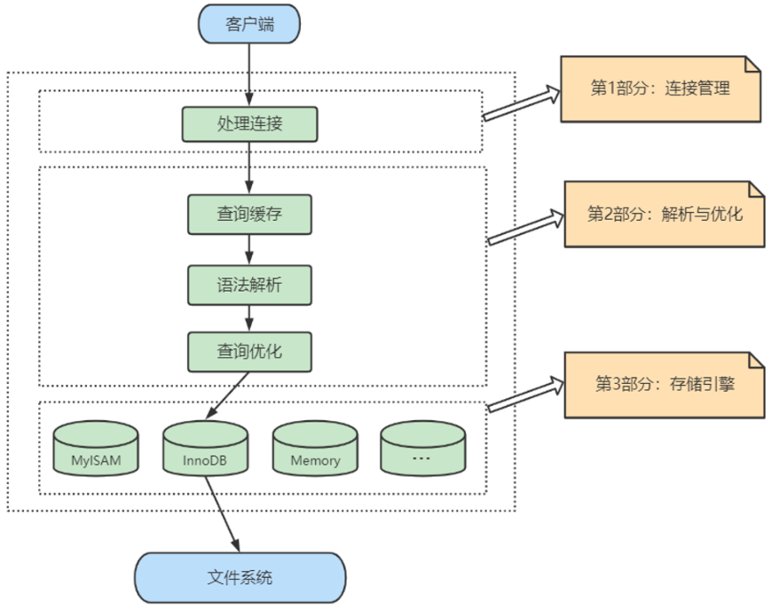

下面具体展开看一下：

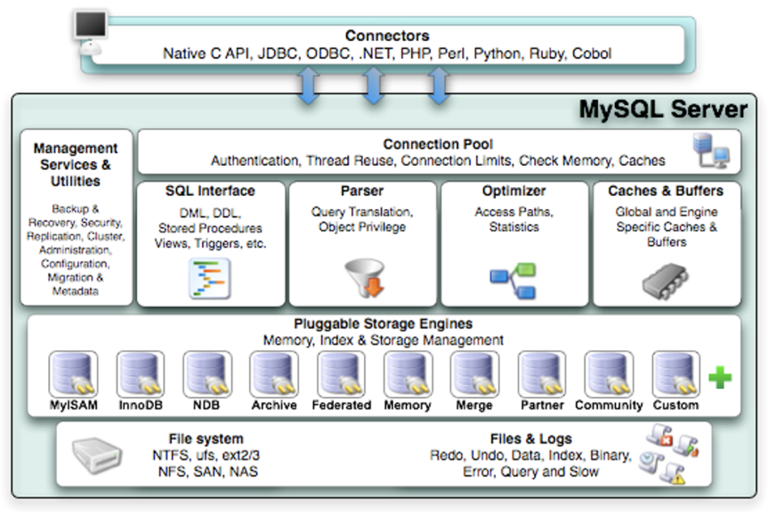

分析：


> 此图是针对 MySQL 5.7。

#### Connectors

`Connectors`：指的是不同语言中与 SQL 的交互。MySQL 首先是一 个网络程序，在 TCP 之上定义了自己的应用层协议。所以要使用 MySQL，我们可以编写代码，跟 MySQL Server 建立 TCP 连接，之后按照其定义好的协议进行交互。或者比较方便的办法是调用 SDK，比如 Native C API、JDBC、PHP 等各语言 MySQL Connector，或者通过 ODBC。但通过 SDK 来访问 MySQL，本质上还是在 TCP 连接上通过 MySQL 协议跟 MySQL 进行交互。

#### 第 1 层：连接层

系统（客户端）访问 MySQL 服务器前，做的第一件事就是`建立 TCP 连接`。经过三次握手建立连接成功后， MySQL 服务器对 TCP 传输过来的账号密码做身份认证、权限获取。

- 用户名或密码不对，会收到一个 Access denied for user 错误，客户端程序结束执行。
- 用户名密码认证通过，会从权限表查出账号拥有的权限与连接关联，之后的权限判断逻辑，都将依赖于此时读到的权限。

TCP 连接收到请求后，必须要分配给一个线程专门与这个客户端的交互。所以还会有个线程池，去走后面的流程，每一个连接从线程池中获取线程，省去了创建和销毁线程的开销。

接着我们来思考一个问题：一个系统只会和 MySQL 服务器建立一个连接吗？只能有一个系统和  MySQL 服务器建立连接吗？

当然不是，多个系统都可以和 MySQL 服务器建立连接，每个系统建立的连接肯定不止一个。**所以，为了解决 TCP 无限创建与 TCP 频繁创建销毁带来的资源耗尽、性能下降问题，MySQL 服务器里有专门的 TCP 连接池限制连接数，采用长连接模式复用 TCP 连接，来解决上述问题。**

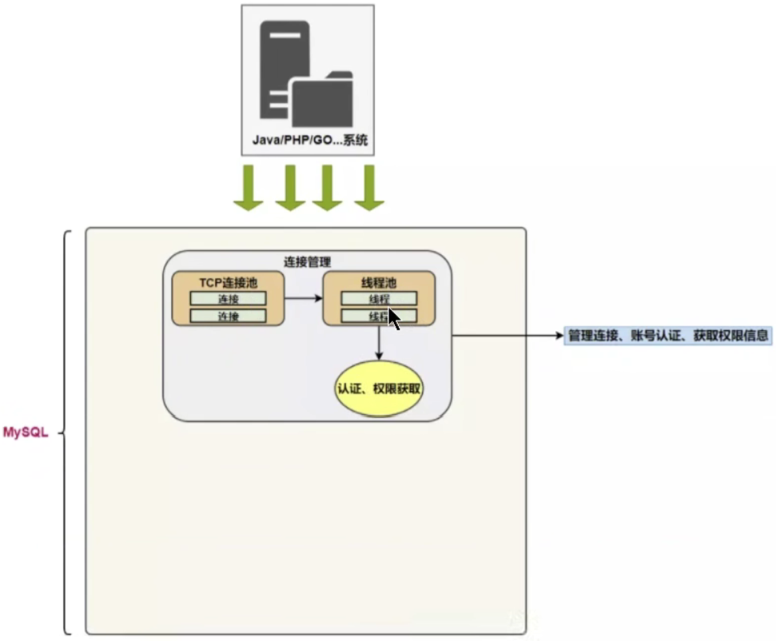

TCP 连接收到请求后，必须要分配给一个线程专门与这个客户端进行交互。所以还会有个线程池，去走后面的流程。每一个连接从线程池中获取线程，省去了创建和销毁线程的开销。这些内容我们都归纳到 MySQL 的连接管理组件中。

所以连接管理的职责是：**负责认证、管理连接、获取权限信息。**

#### 第 2 层：服务层

第二层架构主要完成大多数的核心服务功能，如 SQL 接口，并完成缓存的查询，SQL 的分析和优化及部分内置函数的执行。所有跨存储引擎的功能也在这一层实现，如过程、函数等。在该层，服务器会解析查询并创建相应的内部解析树，并对其完成相应的优化：如确定查询表的顺序，是否利用索引等，最后生成相应的执行操作。

如果是 SELECT 语句，服务器还会查询内部的缓存。如果缓存空间足够大，这样在解决大量读操作的环境中能够很好的提升系统的性能。

**`SQL Interface：SQL 接口`**

- 接收用户的 SQL 命令，并且返回用户需要查询的结果。比如 SELECT ... FROM 就是调用 SQL Interface。
- MySQL 支持 DML（数据操作语言）、DDL（数据定义语言）、视图、存储过程、触发器、自定义函数等多种 SQL 语言接口。

**`Parser：解析器`**

- 在解析器中对 SQL 语句进行语法分析、语义分析。将 SQL 语句分解成数据结构，并将这个结构传递到后续步骤，以后 SQL 语句的传递和处理就是基于这个结构的。如果在分解构成中遇到错误，那么就说明这个 SQL 语句是不合理的。
- SQL 命令传递到解析器的时候会被解析器验证和解析，并为其创建`语法树`，并根据数据字典丰富查询语法树，会`验证该客户端是否具有执行该查询的权限`。创建好语法树后，MySQL 还会对 SQl 查询进行语法上的优化，进行查询重写。

**`Optimizer：查询优化器`**

- SQL 语句在语法解析之后、查询之前会使用查询优化器确定 SQL 语句的执行路径，生成一个`执行计划`。
- 这个执行计划表明应该使用哪些索引进行查询（全表检索还是使用索引检索），表之间的连接顺序如何，最后会按照执行计划中的步骤调用存储引擎提供的方法来真正的执行查询，并将查询结果返回给用户。
- 它使用`选取-投影-连接`策略进行查询。例如`SELECT id, name FROM student WHERE gender = '女';`。
  - 这个 SELECT 查询先根据 WHERE 语句进行`选取`，而不是将表全部查询出来以后再进行 gender 过滤；
  - 这个 SELECT 查询先根据 id 和 name 进行属性`投影`，而不是将属性全部取出以后再进行过滤；
  - 然后，将这两个查询条件`连接`起来，生成最终查询结果。

**`Caches & Buffers：查询缓存组件`**

- MySQL 内部维持着一些 Cache 和 Buffer，比如 Query Cache 用来缓存一条 SELECT 语句的执行结果，如果能够在其中找到对应的查询结果，那么就不必再进行查询解析、优化和执行的整个过程了，直接将结果反馈给客户端。
- 这个缓存机制是由一系列小缓存组成的。比如表缓存，记录缓存，key 缓存，权限缓存等。
- 这个查询缓存可以在不同客户端之间共享。
- **从 MySQL 5.7.20 开始，不推荐使用查询缓存，并在 MySQL 8.0 中删除。**

#### 第 3 层：引擎层

和其它数据库相比，MySQL 有点与众不同，它的架构可以在多种不同场景中应用并发挥良好作用，主要体现在存储引擎的架构上，插件式的存储引擎架构将查询处理和其它的系统任务以及数据的存储提取相分离。这种架构可以根据业务的需求和实际需要选择合适的存储引擎。同时，开源的 MySQL 还允许开发人员设置自己的存储引擎。

这种高效的模块化架构为那些希望专门针对特定应用程序需求(例如数据仓库、事务处理或高可用性情况)的人提供了巨大的好处，同时享受使用一组独立于任何接口和服务的优势存储引擎。

**插件式存储引擎层（Storage Engines），真正的负责了 MySQL 中数据的存储和提取，对物理服务器级别维护的底层数据执行操作，服务器通过 API 与存储引擎进行通信。**不同的存储引擎具有的功能不同，这样就可以根据实际需要进行选取。

MySQL 8.0.29 默认支持的存储引擎如下：


```mysql
mysql> SHOW ENGINES;
+--------------------+---------+----------------------------------------------------------------+--------------+------+------------+
| Engine             | Support | Comment                                                        | Transactions | XA   | Savepoints |
+--------------------+---------+----------------------------------------------------------------+--------------+------+------------+
| FEDERATED          | NO      | Federated MySQL storage engine                                 | NULL         | NULL | NULL       |
| MEMORY             | YES     | Hash based, stored in memory, useful for temporary tables      | NO           | NO   | NO         |
| InnoDB             | DEFAULT | Supports transactions, row-level locking, and foreign keys     | YES          | YES  | YES        |
| PERFORMANCE_SCHEMA | YES     | Performance Schema                                             | NO           | NO   | NO         |
| MyISAM             | YES     | MyISAM storage engine                                          | NO           | NO   | NO         |
| MRG_MYISAM         | YES     | Collection of identical MyISAM tables                          | NO           | NO   | NO         |
| BLACKHOLE          | YES     | /dev/null storage engine (anything you write to it disappears) | NO           | NO   | NO         |
| CSV                | YES     | CSV storage engine                                             | NO           | NO   | NO         |
| ARCHIVE            | YES     | Archive storage engine                                         | NO           | NO   | NO         |
+--------------------+---------+----------------------------------------------------------------+--------------+------+------------+
9 rows in set (0.00 sec)
```

#### 存储层

所有的数据，数据库、表的定义，表的每一行的内容，索引，都是存在`文件系统`上，以`文件`的方式存在的，并完成与存储引擎的交互。当然有些存储引擎比如 InnoDB，也支持不使用文件系统直接管理裸设备，但现代文件系统的实现使得这样做没有必要了。在文件系统之下，可以使用本地磁盘，可以使用 DAS、NAS、SAN 等各种存储系统。

#### 小结

本节开篇所示的 MySQL 架构图，为了熟悉 SQL 执行流程方便，可以简化如下：

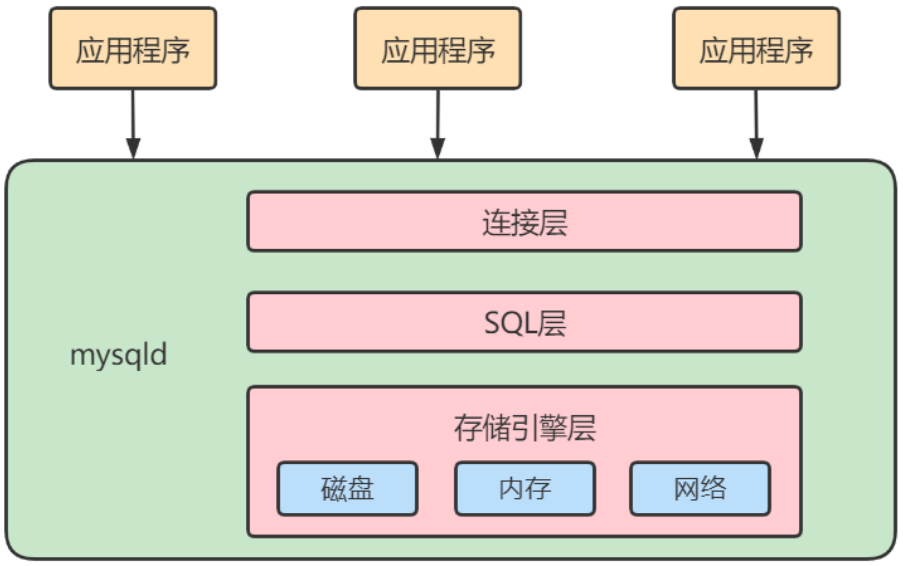

简化为三层结构：

- **`连接层`**：客户端和服务器端建立连接，客户端发送 SQL 至服务器端。
- **`SQL 层（服务层）`**：对 SQL 语句进行查询处理；与数据库文件的存储方式无关。
- **`存储引擎层`**：与数据库文件打交道，负责数据的存储和读取。

### SQL 执行流程

#### MySQL 中的 SQL 执行流程

MySQL 的查询流程：

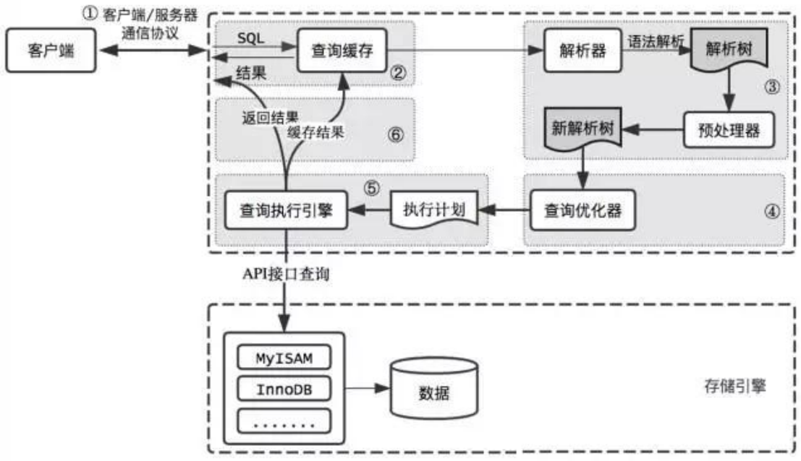

##### 查询缓存

Server 如果在查询缓存中发现了这条 SQL 语句，就会直接将结果返回给客户端；如果没有，就进入到解析器阶段。需要说明的是，**因为查询缓存往往效率不高，所以在 MySQL 8.0 之后舍弃了这个功能。**

**大多数情况查询缓存就是个鸡肋，为什么呢？**

查询缓存是提前把查询结果缓存起来，这样下次不需要执行就可以直接拿到结果。需要说明的是，**在 MySQL 中的查询缓存，不是缓存查询计划，而是查询对应的结果。**这就意味着查询匹配的鲁棒性大大降低，`只有相同的查询操作才会命中查询缓存`。**两个查询请求在任何字符上的不同（例如：空格、注释、大小写），都会导致缓存不会命中，因此 MySQL 的查询缓存命中率不高。**

**同时，如果查询请求中包含某些系统函数、用户自定义变量和函数、一些系统表，如 mysql 、information_schema、 performance_schema 数据库中的表，那这个请求就不会被缓存。**以某些系统函数举例，可能同样的函数的两次调用会产生不一样的结果，比如函数 NOW()，每次调用都会产生最新的当前时间，如果在一个查询请求中调用了这个函数，那即使查询请求的文本信息都一样，那不同时间的两次查询也应该得到不同的结果，如果在第一次查询时就缓存了，那第二次查询的时候直接使用第一次查询的结果就是错误的！

此外，既然是缓存，那就有缓存失效的时候。MySQL 的缓存系统会监测涉及到的每张表，只要该表的结构或者数据被修改，如对该表使用了 INSERT、UPDATE、DELETE、TRUNCATE TABLE、ALTER TABLE、DROP TABLE 或 DROP DATABASE 语句，那使用该表的所有高速缓存查询都将变为无效并从高速缓存中删除！对于更新压力大的数据库来说，查询缓存的命中率会非常低。

总之，因为查询缓存往往弊大于利，查询缓存的失效非常频繁。

一般建议大家在`静态表`里使用查询缓存，什么叫静态表呢？就是一般我们极少更新的表。比如，一个系统配置表、字典表，这张表上的查询才适合使用查询缓存。好在 MySQL 也提供了这种 "按需使用" 的方式。你可以将 my.cnf 参数`query_cache_type`设置成`DEMAND`，代表当 SQL 语句中有`SQL_CACHE`关键词时才缓存。比如：

```mysql
# query_cache_ type 有 3 个值：0 代表关闭查询缓存 0FF，1 代表开启 ON，2 代表 DEMAND
query_cache_ type=2
```

这样对于默认的 SQL 语句都不使用查询缓存，而对于你确定要使用查询缓存的语句，可以用 SQL_CACHE 显式指定，像下面这个语句一样：

```mysql
SELECT SQL_CACHE * FROM test WHERE id = 5;
```

查看当前 MySQL |实例是否开启缓存机制：

```mysql
# MySQL 5.7 中：
mysql> show global variables like "%query_cache_type%";
+------------------+-------+
| Variable_name    | Value |
+------------------+-------+
| query_cache_type | OFF   |
+------------------+-------+
1 row in set (0.00 sec)

# MySQL 8.0 中：
mysql> show global variables like "%query_cache_type%";
Empty set (0.00 sec)
```

监控查询缓存的命中率：

```mysql
show status like '%Qcache%';
```

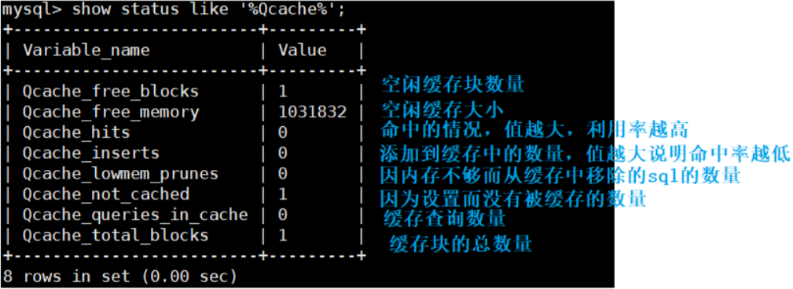

- `Qcache_free_blocks`：表示查询缓存中还有多少剩余的 blocks，如果该值显示较大，则说明查询缓存中的内存碎片过多了，可能在一定的时间进行整理。
- `Qcache_free_memory`：查询缓存的内存大小，通过这个参数可以很清晰的知道当前系统的查询内存是否够用，是多了，还是不够用，DBA 可以根据实际情况做出调整。
- `Qcache_hits`：表示有多少次命中缓存。我们主要可以通过该值来验证我们的查询缓存的效果。数字越大，缓存效果越理想。
- `Qcache_inserts`：表示多少次未命中然后插入，意思是新来的 SQL 请求在缓存中未找到，不得不执行查询处理，执行查询处理后把结果 insert 到查询缓存中。这样的情况的次数越多，表示查询缓存应用到的比较少，效果也就不理想。当然系统刚启动后，查询缓存是空的，这很正常。
- `Qcache_lowmem_prunes`：该参数记录有多少条查询因为内存不足而被移除出查询缓存。通过这个值，用户可以适当的调整缓存大小。
- `Qcache_not_cached`：表示因为 query_cache_type 的设置而没有被缓存的查询数量。
- `Qcache_queries_in_cache`：当前缓存中缓存的查询数量。
- `Qcache_total_blocks`：当前缓存的 block 数量。

##### 解析器

在解析器中对 SQL 语句进行语法分析、语义分析。

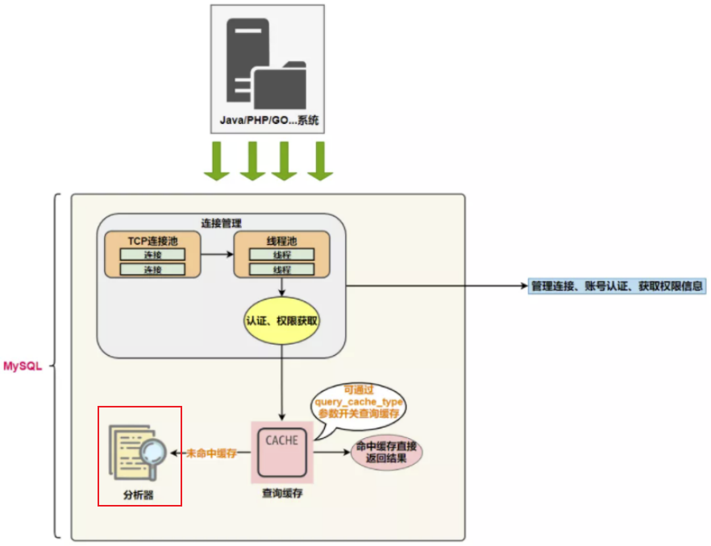

如果没有命中查询缓存，就要开始真正执行语句了。首先，MySQL 需要知道你要做什么，因此需要对 SQL 语句做解析。SQL 语句的分析分为`词法分析`与`语法分析`。

**分析器先做词法分析。**输入的是由多个字符串和空格组成的一条 SQL 语句，MySQL 需要识别出里面的字符串分别是什么，代表什么。 例如，MySQL 从输入的 SELECT 关键字识别出来，这是一个查询语句。另外，MySQL 也要把字符串 T 识别成表名 T，把字符串 ID 识别成列 ID 等。

**接着，要做语法分析。**根据词法分析的结果，语法分析器（比如：Bison）会根据语法规则，判断输入的这个 SQL 语句是否满足 MySQL 语法。

如果你的语句不对，就会收到 "" 的错误提醒，比如这个语句 FROM 写成了 FRO。

```mysql
mysql> SELECT * FROM user;
ERROR 1064 (42000): You have an error in your SQL syntax; check the manual that corresponds to your MySQL server version for the right syntax to use near 'fro user' at line 1
```

如果 SQL 语句正确，则会生成一个这样的语法树：

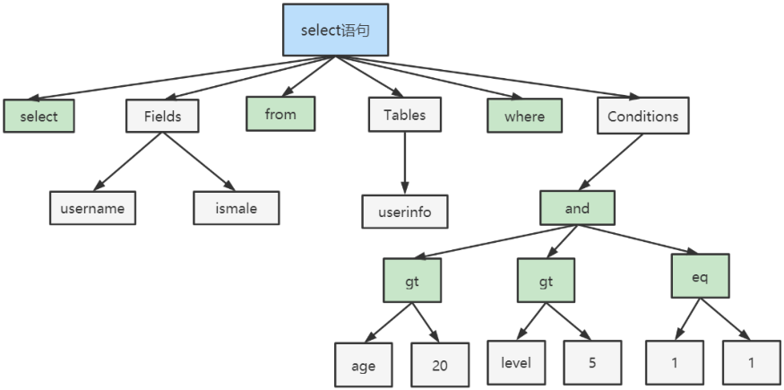

下图是 SQL 词法分析的过程步骤：

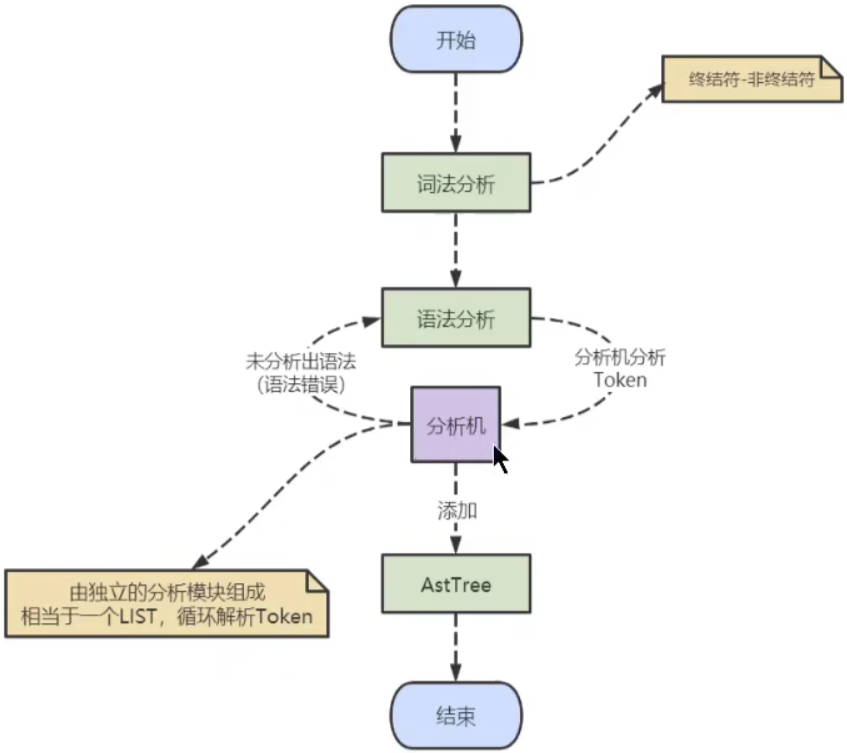

至此我们解析器的工作任务也基本圆满了，接下来进入到优化器。

##### 优化器

在`优化器中会确定 SQL 语句的执行路径`，比如是根据全表检索，还是根据索引检索等。

经过了解析器，MySQL 就知道你要做什么了。在开始执行之前，还要先经过优化器的处理。**一条查询可以有很多种执行方式，最后都返回相同的结果，优化器的作用就是找到这其中最好的执行计划**。

例如，如下语句是执行两个表的 JOIN：

```mysql
SELECT * FROM test1 JOIN test2 USING(ID) WHERE test1.name = 'aaa' AND test2.name = 'bbb';
```

方案 1：可以先从表 test1 里面取出 name = 'aaa' 的记录的 ID 值，再根据 ID 值关联到表 test2，再判断 test2 里面 name 的值是否等于 'bbb'。

方案 2：可以先从表 test2 里面取出 name = 'bbb' 的记录的 ID 值，再根据 ID 值关联到表 test1，再判断 test1 里面 name 的值是否等于 'aaa'。

这两种执行方法的逻辑结果是一样的，但是执行的效率会有不同，而优化器的作用就是决定选择使用哪一个方案。**优化器阶段完成后，SQL 语句的执行方案就确定下来了，然后进入执行器阶段。**

> 至于优化器是怎么选择索引的，有没有可能选择错等，索引章节再次说明。

在查询优化器中，可以分为`逻辑查询优化阶段`和`物理查询优化阶段`。

- 逻辑查询优化，是通过改变 SQL 语句的内容，来使得 SQL 查询更高效，同时为物理查询优化提供更多的候选执行计划。通常采用的方式是对 SQL 语句进行`等价变换`，对查询进行`重写`，而查询重写的数学基础就是关系代数。对条件表达式进行等价谓词重写、条件简化，对视图进行重写，对子查询进行优化，对连接语义进行了外连接消除、嵌套连接消除等。
- 物理查询优化，是基于`关系代数`进行的查询重写，而关系代数的每一步都对应着物理计算，这些物理计算往往存在多种算法，因此需要计算各种物理路径的代价，从中选择`代价最小的作为执行计划`。在这个阶段里，对于单表和多表连接的操作，需要高效的`使用索引`，提升查询效率。

##### 执行器

截止到现在，还没有真正去读写真实的表，仅仅只是产出了一个`执行计划`，接下来，就进入了`执行器阶段`。

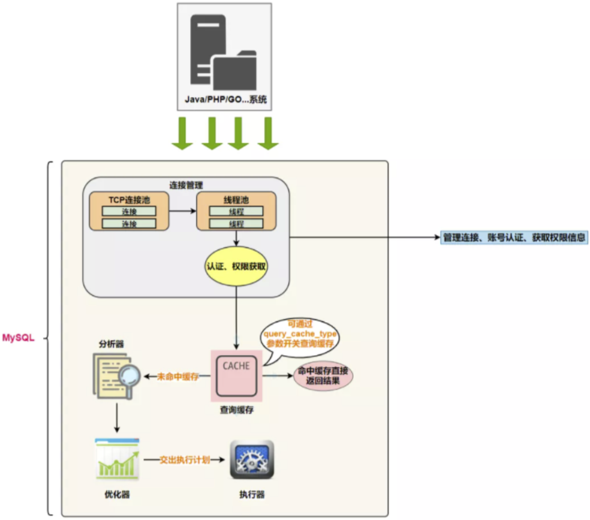

**在执行之前需要判断该用户是否具备权限。**如果没有，就会返回权限错误；如果具备权限，就执行 SQL 查询并返回结果。在 MySQL 8.0 以下的版本，如果设置了查询缓存，这时会将查询结果进行缓存。

如果有权限，就打开表继续执行。打开表的时候，执行器就会根据表的引擎定义，调用存储引擎API对表进行的读写。存储引擎API只是抽象接口，下面还有个**存储引擎层**，具体实现还是要看表选择的存储引擎。

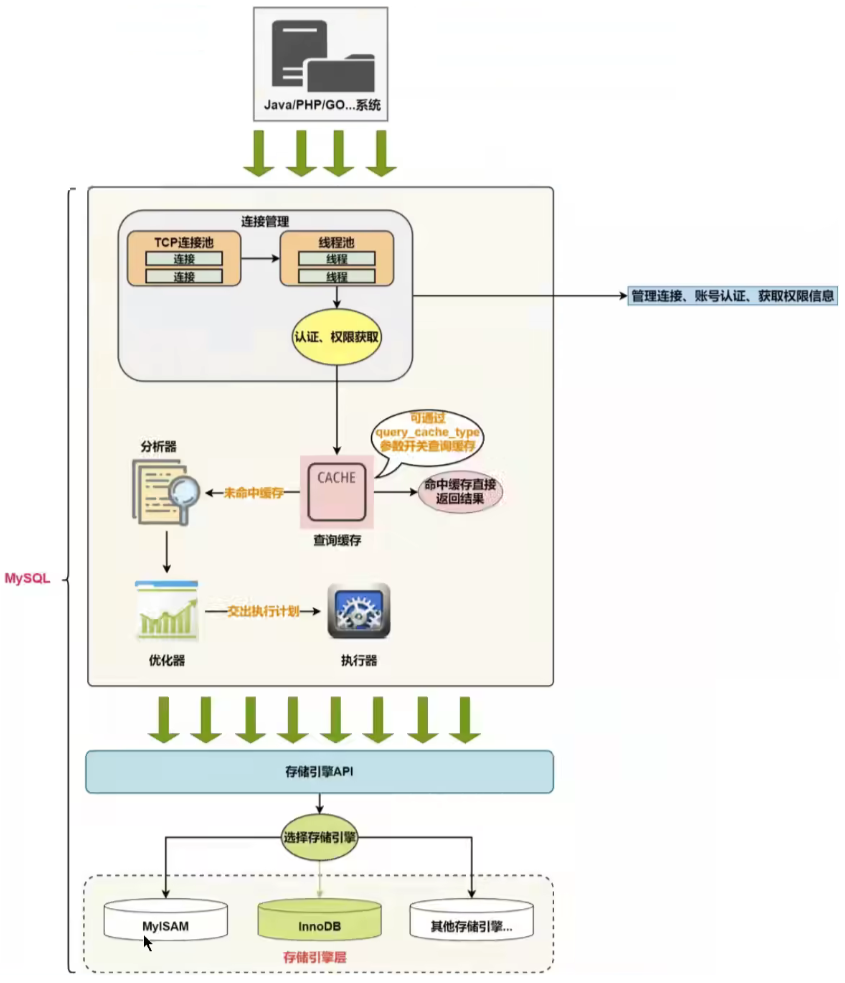

例如，表 test 中，name 字段没有索引，对于以下 SQL，执行器的执行流程是这样的：

```mysql
SELECT * FROM test WHERE name = 'a'
```

- 调用 InnoDB 引擎接口取 test 表的第一行，判断 name 值是不是 a，如果不是则跳过，如果是则将这行存在结果集中。
- 调用引擎接口取下一行，重复相同的判断逻辑，直到取到这个表的最后一行。
- 执行器将上述遍历过程中，所有满足条件的行组成的记录集作为结果集返回给客户端。
- 至此，这个语句就执行完成了。对于有索引的表，执行的逻辑也差不多。

##### 执行流程

综上，SQL 语句在 MySQL 中的流程是：**`SQL 语句 ---> [查询缓存] ---> 解析器 ---> 优化器 ---> 执行器。`**


#### MySQL 8 中的 SQL 执行原理

前面的结构图很复杂，我们需要抓取最核心的部分：`SQL 的执行原理`。不同的 DBMS 的 SQL 的执行原理是相通的，只是在不同的软件中，各有各的实现路径。

既然一条 SQL 语句会经历不同的模块，那我们就来看下，在不同的模块中，SQL 执行所使用的资源（时间）是怎样的。

下面演示如何在 MySQL 中对一条 SQL 语句的执行时间进行分析。

**第一步，确认 profiling 是否开启。**

了解查询语句底层执行的过程：`select @@profiling;`，或者`show variables like '%profiling%'`查看是否开启计划。开启它可以让 MySQL 收集在 SQL 执行时所使用的资源情况，命令如下：

```mysql
mysql> SELECT @@profiling;
+-------------+
| @@profiling |
+-------------+
|           0 |
+-------------+
1 row in set, 1 warning (0.00 sec)

mysql> SHOW VARIABLES LIKE '%profiling%';
+------------------------+-------+
| Variable_name          | Value |
+------------------------+-------+
| have_profiling         | YES   |
| profiling              | OFF   |
| profiling_history_size | 15    |
+------------------------+-------+
3 rows in set (0.01 sec)

# profiling = 0 代表关闭，需要把 profiling 打开，即设置为 1
mysql> SET profiling = 1;
Query OK, 0 rows affected, 1 warning (0.00 sec)
```

> Profiling 功能由 MySQL 会话变量 profiling 控制，默认是 OFF（关闭状态）。

**第二步，多次执行相同的 SQL 查询。**

```mysql
mysql> SELECT COUNT(1) FROM employees;
+----------+
| COUNT(1) |
+----------+
|      107 |
+----------+
1 row in set (0.01 sec)

mysql> SELECT COUNT(1) FROM employees;
+----------+
| COUNT(1) |
+----------+
|      107 |
+----------+
1 row in set (0.00 sec)

mysql> SELECT COUNT(1) FROM employees;
+----------+
| COUNT(1) |
+----------+
|      107 |
+----------+
1 row in set (0.00 sec)

mysql> SELECT COUNT(1) FROM employees;
+----------+
| COUNT(1) |
+----------+
|      107 |
+----------+
1 row in set (0.00 sec)

mysql> SELECT COUNT(1) FROM employees;
+----------+
| COUNT(1) |
+----------+
|      107 |
+----------+
1 row in set (0.01 sec)
```

**第三步，查看 profiles。**

```mysql
# 查看当前会话产生的所有 profiles
mysql> SHOW profiles;
+----------+------------+-----------------------------------+
| Query_ID | Duration   | Query                             |
+----------+------------+-----------------------------------+
|        1 | 0.00148825 | SHOW VARIABLES LIKE '%profiling%' |
|        2 | 0.00018850 | SELECT DATABASE()                 |
|        3 | 0.00016375 | SELECT DATABASE()                 |
|        4 | 0.00073875 | show databases                    |
|        5 | 0.00081400 | show tables                       |
|        6 | 0.00087100 | SELECT COUNT(1) FROM employees    |
|        7 | 0.00092375 | SELECT COUNT(1) FROM employees    |
|        8 | 0.00126200 | SELECT COUNT(1) FROM employees    |
|        9 | 0.00078000 | SELECT COUNT(1) FROM employees    |
|       10 | 0.00096625 | SELECT COUNT(1) FROM employees    |
+----------+------------+-----------------------------------+
10 rows in set, 1 warning (0.00 sec)
```

**第四步，查看 profile。**

```mysql
# 默认显示最后一次查询的执行计划，查看程序的执行步骤
mysql> SHOW profile;
+--------------------------------+----------+
| Status                         | Duration |
+--------------------------------+----------+
| starting                       | 0.000132 |
| Executing hook on transaction  | 0.000029 |
| starting                       | 0.000022 |
| checking permissions           | 0.000013 |  # 权限检查
| Opening tables                 | 0.000079 |  # 打开表
| init                           | 0.000009 |  # 初始化
| System lock                    | 0.000013 |  # 锁系统
| optimizing                     | 0.000006 |  # 优化查询
| statistics                     | 0.000024 |
| preparing                      | 0.000019 |  # 准备
| executing                      | 0.000537 |  # 执行
| end                            | 0.000006 |
| query end                      | 0.000003 |
| waiting for handler commit     | 0.000006 |
| closing tables                 | 0.000005 |
| freeing items                  | 0.000060 |
| cleaning up                    | 0.000007 |
+--------------------------------+----------+
17 rows in set, 1 warning (0.00 sec)
```

```mysql
# 也可以查询指定的 Query ID，Query 10 即为最后一次查询的 ID，与上面的结果相同
mysql> SHOW profile FOR QUERY 10;
+--------------------------------+----------+
| Status                         | Duration |
+--------------------------------+----------+
| starting                       | 0.000132 |
| Executing hook on transaction  | 0.000029 |
| starting                       | 0.000022 |
| checking permissions           | 0.000013 |
| Opening tables                 | 0.000079 |
| init                           | 0.000009 |
| System lock                    | 0.000013 |
| optimizing                     | 0.000006 |
| statistics                     | 0.000024 |
| preparing                      | 0.000019 |
| executing                      | 0.000537 |
| end                            | 0.000006 |
| query end                      | 0.000003 |
| waiting for handler commit     | 0.000006 |
| closing tables                 | 0.000005 |
| freeing items                  | 0.000060 |
| cleaning up                    | 0.000007 |
+--------------------------------+----------+
17 rows in set, 1 warning (0.00 sec)
```

```mysql
# 还可以查询更丰富的内容
mysql> SHOW profile cpu, block io FOR QUERY 10;
+--------------------------------+----------+----------+------------+--------------+---------------+
| Status                         | Duration | CPU_user | CPU_system | Block_ops_in | Block_ops_out |
+--------------------------------+----------+----------+------------+--------------+---------------+
| starting                       | 0.000132 | 0.000075 |   0.000061 |            0 |             0 |
| Executing hook on transaction  | 0.000029 | 0.000013 |   0.000011 |            0 |             0 |
| starting                       | 0.000022 | 0.000011 |   0.000010 |            0 |             0 |
| checking permissions           | 0.000013 | 0.000008 |   0.000006 |            0 |             0 |
| Opening tables                 | 0.000079 | 0.000043 |   0.000036 |            0 |             0 |
| init                           | 0.000009 | 0.000005 |   0.000003 |            0 |             0 |
| System lock                    | 0.000013 | 0.000007 |   0.000006 |            0 |             0 |
| optimizing                     | 0.000006 | 0.000003 |   0.000003 |            0 |             0 |
| statistics                     | 0.000024 | 0.000013 |   0.000010 |            0 |             0 |
| preparing                      | 0.000019 | 0.000011 |   0.000009 |            0 |             0 |
| executing                      | 0.000537 | 0.000849 |   0.000000 |            0 |             0 |
| end                            | 0.000006 | 0.000006 |   0.000000 |            0 |             0 |
| query end                      | 0.000003 | 0.000002 |   0.000000 |            0 |             0 |
| waiting for handler commit     | 0.000006 | 0.000006 |   0.000000 |            0 |             0 |
| closing tables                 | 0.000005 | 0.000005 |   0.000000 |            0 |             0 |
| freeing items                  | 0.000060 | 0.000060 |   0.000000 |            0 |             0 |
| cleaning up                    | 0.000007 | 0.000006 |   0.000000 |            0 |             0 |
+--------------------------------+----------+----------+------------+--------------+---------------+
17 rows in set, 1 warning (0.00 sec)

mysql> SHOW profile cpu, block io FOR QUERY 9;
+--------------------------------+----------+----------+------------+--------------+---------------+
| Status                         | Duration | CPU_user | CPU_system | Block_ops_in | Block_ops_out |
+--------------------------------+----------+----------+------------+--------------+---------------+
| starting                       | 0.000073 | 0.000039 |   0.000032 |            0 |             0 |
| Executing hook on transaction  | 0.000003 | 0.000002 |   0.000001 |            0 |             0 |
| starting                       | 0.000006 | 0.000003 |   0.000003 |            0 |             0 |
| checking permissions           | 0.000004 | 0.000002 |   0.000002 |            0 |             0 |
| Opening tables                 | 0.000027 | 0.000015 |   0.000012 |            0 |             0 |
| init                           | 0.000004 | 0.000002 |   0.000001 |            0 |             0 |
| System lock                    | 0.000006 | 0.000003 |   0.000003 |            0 |             0 |
| optimizing                     | 0.000004 | 0.000002 |   0.000002 |            0 |             0 |
| statistics                     | 0.000014 | 0.000008 |   0.000006 |            0 |             0 |
| preparing                      | 0.000012 | 0.000007 |   0.000006 |            0 |             0 |
| executing                      | 0.000524 | 0.000477 |   0.000390 |            0 |             0 |
| end                            | 0.000009 | 0.000003 |   0.000003 |            0 |             0 |
| query end                      | 0.000003 | 0.000002 |   0.000001 |            0 |             0 |
| waiting for handler commit     | 0.000006 | 0.000003 |   0.000002 |            0 |             0 |
| closing tables                 | 0.000006 | 0.000003 |   0.000003 |            0 |             0 |
| freeing items                  | 0.000073 | 0.000040 |   0.000033 |            0 |             0 |
| cleaning up                    | 0.000008 | 0.000004 |   0.000003 |            0 |             0 |
+--------------------------------+----------+----------+------------+--------------+---------------+
17 rows in set, 1 warning (0.00 sec)
```

除了查看 CPU、IO 阻塞等参数情况，还可以查看下列参数的利用情况：

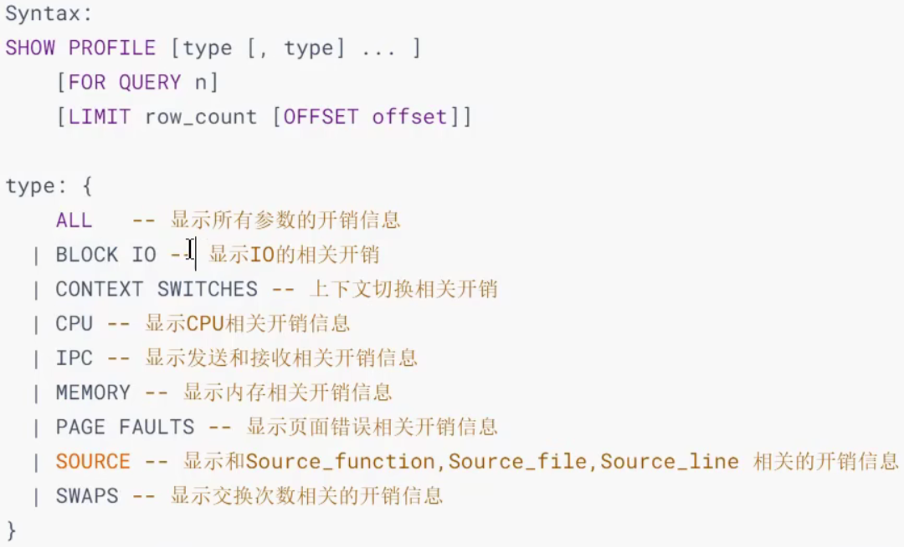

#### SQL 语法顺序

随着 MySQL 版本的更新换代，其优化器也在不断的升级，优化器会分析不同执行顺序产生的性能消耗的不同，而动态调整执行顺序。

需求：查询每个部门年龄高于 20 岁的人数，且高于 20 岁人数不能少于 2 人，显示人数最多的部门信息。

下面是经常出现的查询顺序：

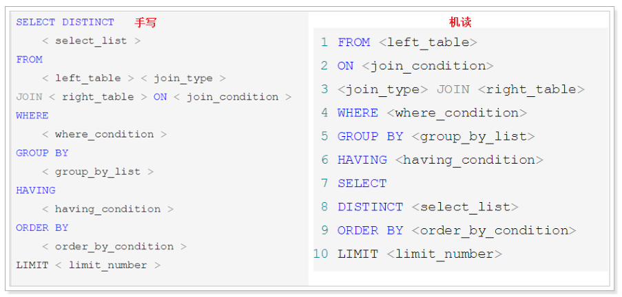

### 数据库缓冲池（Buffer Pool）

InnoDB 存储引擎是以页为单位来管理存储空间的，我们进行的增删改查操作其实本质上都是在访问页面（包括读页面、写页面、创建新页面等操作）。`磁盘 I/O 需要消耗的时间很多，而在内存中进行操作，效率则会高很多。`为了能让数据表或者索引中的数据随时被所用，DBMS 会申请`占用内存来作为数据缓冲池`，在真正访问页面之前，需要把在磁盘上的页缓存到内存中的 Buffer Pool 之后才可以访问。

这样做的好处是可以让磁盘活动最小化，从而`减少与磁盘直接进行 I/O 的时间`。要知道，这种策略对提升 SQL 语句的查询性能来说至关重要，如果索引的数据在缓冲池里，那么访问的成本就会降低很多。

#### 查询缓存 vs 缓冲池

##### 查询缓存

查询缓存是提前把`查询结果缓存`起来，这样下次不需要执行就可以直接拿到结果。需要说明的是，在 MySQL 中的查询缓存，不是缓存查询计划，而是查询对应的结果。因为命中条件苛刻，而且只要数据表发生变化，查询缓存就会失效，因此命中率低。

##### 缓冲池

首先需要了解在 InnoDB 存储引擎中，缓冲池都包括了哪些。

在 InnoDB 存储引擎中有一部分数据会放到内存中，缓冲池则占了这部分内存的大部分，它用来存储各种数据的缓存，如下图所示：

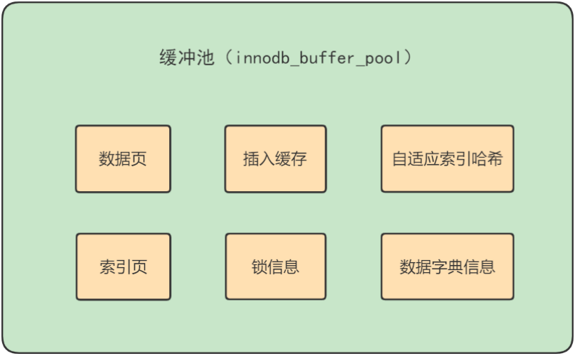

从图中，能看到 InnoDB 缓冲池包括了数据页、索引页、插入缓冲、锁信息、自适应 Hash 和数据字典信息等。

**缓存池的重要性：**

对于使用 InnoDB 作为存储引擎的表来说，不管是用于存储用户数据的索引（包括聚簇索引和二级索引），还是各种系统数据，都是以`页`的形式存放在`表空间`中的，而所谓的表空间只不过是 InnoDB 对文件系统上一个或几个实际文件的抽象，也就是说数据归根结底还是存储在磁盘上。同时，磁盘的速度，远远跟不上 CPU 的速度。因此，缓冲池可以很大程度上消除 CPU 和磁盘之间的鸿沟。

所以，InnoDB 存储引擎在处理客户端的请求时，当需要访问某个页的数据时，就会把`完整的页数据全部加载到内存中`，也就是说，即使只需要访问一个页的一条记录，也需要先把整个页的数据加载到内存中。将整个页加载到内存中后，就可以进行读写访问，在进行完读写访问之后，并不会立即把页对应的内存空间释放掉，而是将其`缓存`起来，这样将来有请求再次访问该页面时，就可以`省去磁盘 I/O 的开销`。

**缓存原则：**

`位置 * 频次`这个原则，可以对磁盘 I/O 访问效率进行优化。

首先，位置决定效率，提供缓冲池就是为了在内存中可以直接访问数据。

其次，频次决定优先级顺序。因为缓冲池的大小是有限的，比如磁盘有 200 GB，但是内存只有 16 GB，缓冲池大小只有 1 GB，就无法将所有数据都加载到缓冲池里，这时就涉及到优先级顺序，会`优先对使用频次高的热数据进行加载`。

**缓冲池的预读特性：**

缓冲池的作用是提升磁盘 I/O 效率，而进行读取数据的时候，存在一个`局部性原理`，也就是使用了一些数据后，`大概率还会使用它周围的一些数据`，因此采用`预读`的机制提前加载，可以减少未来可能的磁盘 I/O 操作。

#### 缓冲池如何读取数据

缓冲池管理器会尽量将经常使用的数据保存起来，在数据库进行页面读操作的时候，首先会判断该页面是否在缓冲池中，如果存在就直接读取，如果不存在，就会通过内存或磁盘将页面存放到缓冲池中再进行读取。

缓存在数据库中的结构和作用如下图所示：

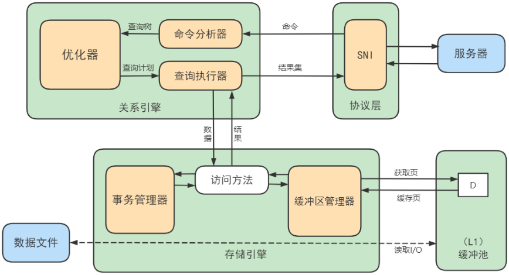

如果执行 SQL 语句的时候更新了缓存池中的数据，那么这些数据会马上同步到磁盘上吗？

实际上，当对数据库中的记录进行修改的时候，首先会修改缓冲池中页里面的记录信息，然后数据库会`以一定的频率刷新到磁盘上`。注意：并不是每一次发生更新操作，都会立刻进行磁盘回写，缓冲池会采用一种叫做`checkpoint`的机制，将数据回写到磁盘上，这样做的好处就是提升了数据库的整体性能。

比如，当缓冲池不够用时，需要释放掉一些不常用的页，此时就可以强行采用 checkpoint 的方式，将不常用的脏页回写到磁盘上，然后再从缓冲池中将这些页释放掉。这些`脏页（dirty page）`指的是缓冲池中被修改过的页，与磁盘上的数据页不一致。 

#### 查看和设置缓冲池的大小

如果你使用的是 MySQL MyISAM 存储引擎,它只缓存索引，不缓存数据，对应的键缓存参数`key_buffer_size`，你可以用它进行查看。

如果你使用的是 InnoDB 存储引擎，可以通过查看`innodb_buffer_pool_size`变量来查看缓冲池的大小。命令如下：

```mysql
mysql> SHOW VARIABLES LIKE 'innodb_buffer_pool_size';
+-------------------------+-----------+
| Variable_name           | Value     |
+-------------------------+-----------+
| innodb_buffer_pool_size | 134217728 |
+-------------------------+-----------+
1 row in set (0.00 sec)
```

InnoDB 的缓冲池大小，默认只有 $134217728 / 1024 / 1024 = 128$ MB。缓冲池大小可以修改，比如改为 256 MB：

```mysql
mysql> SET GLOBAL innodb_buffer_pool_size = 268435456;
Query OK, 0 rows affected (0.00 sec)

mysql> SHOW VARIABLES LIKE 'innodb_buffer_pool_size';
+-------------------------+-----------+
| Variable_name           | Value     |
+-------------------------+-----------+
| innodb_buffer_pool_size | 268435456 |
+-------------------------+-----------+
1 row in set (0.00 sec)
```

> 也可以通过配置文件修改：
>
> ```ini
> [server]
> innodb_buffer_pool_size = 268435456
> ```

#### 多个缓冲池实例

Buffer Pool 本质是 InnoDB 向操作系统申请的一块`连续的内存空间`，在多线程环境下，访问 Buffer Pool 中的数据都需要`加锁`处理。在 Buffer Pool 特别大而且多线程并发访问特别高的情况下，单一的 Buffer Pool 可能会影响请求的处理速度。所以在 Buffer Pool 特别大的时候，可以把它们`拆分成若干个小的 Buffer Pool`，每个 Buffer Pool 都称为一个`实例`，它们彼此是独立的，独立的申请内存空间，独立的管理各种链表。因此，在多线程并发访问时并不会相互影响，从而提高并发处理能力。

可以在服务器启动的时候，通过设置`innodb_buffer_pool_instances`的值，来修改 Buffer Pool 实例的个数：

```ini
[server]
innodb_buffer_pool_instances = 1
```

这样就表明我们要创建 1 个 Buffer Pool 实例。

命令查看缓冲池实例的个数：

```mysql
mysql> SHOW VARIABLES LIKE 'innodb_buffer_pool_instances';
+------------------------------+-------+
| Variable_name                | Value |
+------------------------------+-------+
| innodb_buffer_pool_instances | 1     |
+------------------------------+-------+
1 row in set (0.00 sec)
```

每个 Buffer Pool 实例实际占用的内存空间：`innodb_buffer_pool_size/innodb_buffer_pool_instances`。也就是总共的缓冲池大小除以实例的个数，结果就是每个 Buffer Pool 实例占用的内存空间大小。

不过也不是 Buffer Pool 的实例创建的越多越好，分别`管理各个 Buffer Pool 也需要性能开销`，InnoDB 规定：**当 innodb_buffer_pool_size 的值小于 1 GB 的时候，设置多个实例是无效的，此时，InnoDB 会默认把 innodb_buffer_pool_instances 的值修改为 1。当 innodb_buffer_pool_size 的值大于或等于 1 GB 的时候，建议设置多个实例。**

#### 引申问题

Buffer Pool 是 MySQL 内存结构中十分核心的一个组成，可以先把它想象成一个黑盒子。

黑盒下的更新数据流程：

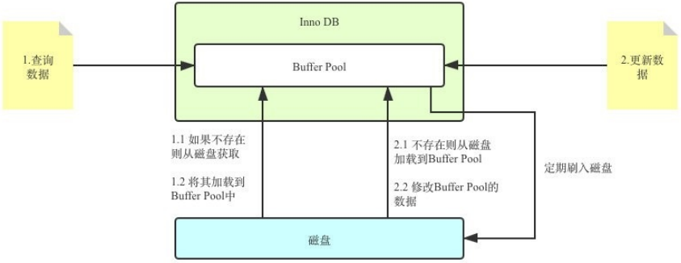

当查询数据的时候，会先去 Buffer Pool 中查询，如果 Buffer Pool 中不存在，存储引擎会先将数据从磁盘加载到 Buffer Pool 中，然后将数据返回给客户端。同理，当更新某个数据的时候，如果这个数据不存在于 Buffer Pool 中，存储引擎也会先将数据从磁盘加载到 Buffer Pool 中，然后修改 Buffer Pool 中的数据，被修改过的数据（脏数据），会在之后统一刷入磁盘中。

这个过程存在一个问题，假如修改 Buffer Pool 中的数据成功，但还未将数据刷入磁盘时，MySQL 服务发生异常宕机。此时，更新后的数据只存在于 Buffer Pool 中，因为 MySQL 宕机，会导致这部分修改的数据丢失。再者，更新操作到一半时，MySQL 服务发生异常宕机，此时，需要回滚到更新之前的状态，又该如何处理呢？

答案是：`redo log 和 undo log`。

## 存储引擎

为了便于管理，人们把`连接管理`、`查询缓存`、`语法解析`、`查询优化`这些并不涉及真实数据存储的功能划分为`MySQL Server`的功能，把真实存取数据的功能划分为`存储引擎`的功能。在 MySQL Server 完成了查询优化后，只需要按照生成的`执行计划`调用底层存储引擎提供的 API，获取到数据后返回给客户端就可以了。

简而言之，`存储引擎就是指表的类型`。存储引擎最开始叫表处理器，后来改名为存储引擎，它的功能就是接收上层传下来的指令，然后对表中的数据进行提取或写入操作。

### 查看存储引擎

查看 MySQL 提供的存储引擎：


```mysql
mysql> SHOW ENGINES;
+--------------------+---------+----------------------------------------------------------------+--------------+------+------------+
| Engine             | Support | Comment                                                        | Transactions | XA   | Savepoints |
+--------------------+---------+----------------------------------------------------------------+--------------+------+------------+
| FEDERATED          | NO      | Federated MySQL storage engine                                 | NULL         | NULL | NULL       |
| MEMORY             | YES     | Hash based, stored in memory, useful for temporary tables      | NO           | NO   | NO         |
| InnoDB             | DEFAULT | Supports transactions, row-level locking, and foreign keys     | YES          | YES  | YES        |
| PERFORMANCE_SCHEMA | YES     | Performance Schema                                             | NO           | NO   | NO         |
| MyISAM             | YES     | MyISAM storage engine                                          | NO           | NO   | NO         |
| MRG_MYISAM         | YES     | Collection of identical MyISAM tables                          | NO           | NO   | NO         |
| BLACKHOLE          | YES     | /dev/null storage engine (anything you write to it disappears) | NO           | NO   | NO         |
| CSV                | YES     | CSV storage engine                                             | NO           | NO   | NO         |
| ARCHIVE            | YES     | Archive storage engine                                         | NO           | NO   | NO         |
+--------------------+---------+----------------------------------------------------------------+--------------+------+------------+
9 rows in set (0.00 sec)
```

### 设置系统默认的存储引擎

查看默认的存储引擎：

```mysql
# 方式一
mysql> SHOW VARIABLES LIKE '%storage_engine%';
+---------------------------------+-----------+
| Variable_name                   | Value     |
+---------------------------------+-----------+
| default_storage_engine          | InnoDB    |
| default_tmp_storage_engine      | InnoDB    |
| disabled_storage_engines        |           |
| internal_tmp_mem_storage_engine | TempTable |
+---------------------------------+-----------+
4 rows in set (0.00 sec)

# 方式二
mysql> SELECT @@default_storage_engine;
+--------------------------+
| @@default_storage_engine |
+--------------------------+
| InnoDB                   |
+--------------------------+
1 row in set (0.00 sec)
```

如果在创建表的语句中没有显式指定表的存储引擎的话，那就会`默认使用 InnoDB 作为表的存储引擎`。如果想改变表的默认存储引擎的话，可以这样写启动服务器的命令行：

```mysql
SET DEFAULT_STORAGE_ENGINE = MyISAM;
```

或者修改 my.cnf 文件，然后重启服务：

```ini
default-storage-engine=MyISAM
```

### 设置表的存储引擎

存储引擎是负责对表中的数据进行提取和写入工作的，`可以为不同的表设置不同的存储引擎`，也就是说不同的表可以有不同的物理存储结构，不同的提取和写入方式。

#### 创建表时指定存储引擎

显式的指定表的存储引擎：

```mysql
CREATE TABLE 表名(
	建表语句;
) ENGINE = 存储引擎名称
```

#### 修改表的存储引擎

如果表已经建好了，也可以修改表的存储引擎：

```mysql
ALTER TABLE 表名 ENGINE = 存储引擎名称
```

修改完后，可以查看表结构验证是否修改成功，例如：

```mysql
mysql> SHOW CREATE TABLE engine_demo_table\G
*************************** 1. row ***************************
Table: engine_demo_table
Create Table: CREATE TABLE `engine_demo_table` (
  `i` int(11) DEFAULT NULL
) ENGINE=InnoDB DEFAULT CHARSET=utf8
1 row in set (0.01 sec)
```

### 引擎介绍

#### InnoDB 引擎

InnoDB 是`具备外键支持功能的事务存储引擎`。

- MySQL 从 3.23.34a 开始就包含 InnoDB 存储引擎，大于等于 5.5 之后，默认采用 InnoDB 引擎 。
- InnoDB 是 MySQL 的`默认事务型引擎`，它被设计用来处理大量的短期（short-lived）事务，可以确保事务的完整提交（Commit）和回滚（Rollback）。
- 除了增加和查询外，还需要更新、删除操作，那么，应优先选择 InnoDB 存储引擎。
- 除非有非常特别的原因需要使用其他的存储引擎，否则应该优先考虑 InnoDB 引擎。
- 数据文件结构：
  - 表名.frm 存储表结构（MySQL 8.0 时，合并在表名.ibd 中）。
  - 表名.ibd 存储数据和索引。
- InnoDB是`为处理巨大数据量的最大性能设计`。
  - 在以前的版本中，字典数据以元数据文件、非事务表等来存储，现在这些元数据文件被删除了。比如：.frm，.par，.trn，.isl，.db.opt 等都在 MySQL 8.0 中不存在了。
- 对比 MyISAM 存储引擎， InnoDB 写的处理效率差一些 ，并且会占用更多的磁盘空间以保存数据和索引。
- MyISAM 只缓存索引，不缓存真实数据；InnoDB 不仅缓存索引还要缓存真实数据， 对内存要求较高 ，而且内存大小对性能有决定性的影响。

#### MyISAM 引擎

MyISAM 引擎是`主要的非事务处理存储引擎`。

- MyISAM 提供了大量的特性，包括全文索引、压缩、空间函数（GIS）等，但 MyISAM 不支持事务、行级锁、外键，有一个毫无疑问的缺陷就是崩溃后无法安全恢复。
- MySQL 5.5 之前默认的存储引擎。
- 优势是访问的速度快，对事务完整性没有要求或者以 SELECT、INSERT 为主的应用。
- 针对数据统计有额外的常数存储，故而 COUNT(*) 的查询效率很高。
- 数据文件结构：
  - 表名.frm 存储表结构。
  - 表名.MYD 存储数据 (MYData)。
  - 表名.MYI 存储索引 (MYIndex)。
- 应用场景：只读应用或者以读为主的业务。

#### Archive 引擎

Archive 引擎用于数据存档。功能：


#### Blackhole 引擎

Blackhole 引擎：丢弃写操作，读操作会返回空内容。

#### CSV 引擎

CSV 引擎：存储数据时，以逗号分隔各个数据项。

示例：

```mysql
mysql> CREATE TABLE test (i INT NOT NULL, c CHAR(10) NOT NULL) ENGINE = CSV;
Query OK, 0 rows affected (0.01 sec)

mysql> INSERT INTO test VALUES (1, 'record one'), (2, 'record two');
Query OK, 2 rows affected (0.01 sec)
Records: 2  Duplicates: 0  Warnings: 0

mysql> SELECT * FROM test;
+---+------------+
| i | c          |
+---+------------+
| 1 | record one |
| 2 | record two |
+---+------------+
2 rows in set (0.00 sec)
```

创建 CSV 表还会创建相应的`元文件`，用于`存储表的状态`和`表中存在的行数`。此文件的名称与表的名称相同，后缀为 CSM。如图所示：

#### Memory 引擎

Memory 引擎：采用的逻辑介质是`内存`， 响应速度很快 ，但是当 mysqld 守护进程崩溃的时候`数据会丢失 `。另外，要求存储的数据是数据长度不变的格式，比如，Blob 和 Text 类型的数据不可用，因为长度是不固定的。

主要特征：

- Memory 同时支持哈希（HASH）索引和 B+Tree 索引。
- Memory表至少比 MyISAM 表要快一个数量级。
- MEMORY 表的大小是受到限制的。表的大小主要取决于两个参数，分别是 max_rows 和 max_heap_table_size。其中，max_rows 可以在创建表时指定；max_heap_table_size 的大小默认为 16 MB，可以按需要进行扩大。
- 数据文件与索引文件分开存储。
- 缺点：数据易丢失，生命周期短。基于这个缺陷，选择 MEMORY 存储引擎时需要特别小心。

使用 Memory 存储引擎的场景：

- 目标数据比较小 ，而且非常频繁的进行访问，在内存中存放数据，如果太大的数据会造成内存溢出。可以通过参数 max_heap_table_size 控制 Memory 表的大小，限制 Memory 表的最大的大小。
- 如果数据是临时的，而且必须立即可用得到，那么就可以放在内存中。
- 存储在 Memory 表中的数据如果突然间丢失的话也没有太大的关系。

#### Federated 引擎

Federated 引擎：访问远程表。Federated 引擎是访问其他 MySQL 服务器的一个代理，尽管该引擎看起来提供了一种很好的跨服务器的灵活性，但也经常带来问题，因此默认是禁用的。

#### Merge 引擎

Merge 引擎：管理多个 MyISAM 表构成的表集合。

#### NDB 引擎

NDB 引擎：MySQL 集群专用存储引擎，也叫做 NDB Cluster 存储引擎，主要用于 MySQL Cluster 分布式集群环境，类似于 Oracle 的 RAC 集
群。

#### 引擎对比

MySQL 中同一个数据库，不同的表可以选择不同的存储引擎。如下表对常用存储引擎做出了对比：

| 特点           | MyISAM                                                    | InnoDB                                                       | Memory | Merge | NDB  |
| -------------- | --------------------------------------------------------- | ------------------------------------------------------------ | ------ | ----- | ---- |
| 存储限制       | 有                                                        | 64 TB                                                        | 有     | 没有  | 有   |
| `事务安全性`   |                                                           | 支持                                                         |        |       |      |
| `锁机制`       | 表锁，即使操作一条 记录也会锁住整个表，不适合高并发的操作 | 行锁，操作时只锁某一行，不对其它行有影响，适合高并发的操作   | 表锁   | 表锁  | 行锁 |
| B 树索引       | 支持                                                      | 支持                                                         | 支持   | 支持  | 支持 |
| 哈希索引       |                                                           |                                                              | 支持   |       | 支持 |
| 全文索引       | 支持                                                      |                                                              |        |       |      |
| 集群索引       |                                                           | 支持                                                         |        |       |      |
| 数据缓存       |                                                           | 支持                                                         | 支持   |       |      |
| `索引缓存`     | 只缓存索引，不缓存真实数据                                | 不仅缓存索引还要缓存真实数据，对内存要求较高，而且内存大小对性能有决定性的影响 | 支持   | 支持  | 支持 |
| 数据可压缩     | 支持                                                      |                                                              |        |       |      |
| 空间使用       | 低                                                        | 高                                                           | N/A    | 低    | 低   |
| 内存使用       | 低                                                        | 高                                                           | 中等   | 低    | 高   |
| 批量插入的速度 | 高                                                        | 低                                                           | 高     | 高    | 高   |
| `支持外键`     |                                                           | 支持                                                         |        |       |      |

### MyISAM vs InnoDB

MySQL 5.5 之前默认的存储引擎是 MyISAM，5.5 之后改为了 InnoDB。

首先，对于 InnoDB 存储引擎，提供了良好的事务管理、崩溃修复能力和并发控制。因为 InnoDB 存储引擎支持事务，所以对于要求事务完整性的场合，需要选择 InnoDB。比如数据操作除了插入和查询以外，还包含很多更新、删除操作，像财务系统等对数据准确性要求较高的系统。缺点是读写效率稍差，占用的数据空间相对较大。

其次，对于 MyISAM 存储引擎，如果是小型应用，系统以读操作和插入操作为主，只有很少的更新、删除操作，并且对事务的要求没有那么高，则可以选择这个存储引擎。MyISAM 存储引擎的优势在于占用空间小、处理速度快。缺点是不支持事务的完整性和并发性。

这两种存储引擎各有特点，当然，在 MySQL 中，也可以针对不同的数据表，可以选择不同的存储引擎。

| 对比项         | MyISAM                                                     | InnoDB                                                       |
| -------------- | ---------------------------------------------------------- | ------------------------------------------------------------ |
| 外键           | 不支持                                                     | 支持                                                         |
| 事务           | 不支持                                                     | 支持                                                         |
| 行表锁         | 表锁，即使操作一条记录，也会锁住整个表，不适合高并发的操作 | 行锁，操作时只锁某一行，对其他行没有影响，适合高并发的操作   |
| 缓存           | 只缓存索引，不缓存真实数据                                 | 不仅缓存索引，也缓存真实数据，对内存要求较高，而且内存大小对性能有决定性的影响 |
| 自带系统表使用 | Y                                                          | N                                                            |
| 关注点         | 性能：节省资源、消耗少、简单业务                           | 事务：并发写、事务、更大资源                                 |
| 默认安装       | Y                                                          | Y                                                            |
| 默认使用       | N                                                          | Y                                                            |

### InnoDB 补充

#### InnoDB 表的优势

InnoDB 存储引擎在实际应用中拥有诸多优势，比如操作便利、提高了数据库的性能、维护成本低等。如果由于硬件或软件的原因导致服务器崩溃，那么在重启服务器之后不需要进行额外的操作。InnoDB 崩溃恢复功能自动将之前提交的内容定型，然后撤销没有提交的进程，重启之后继续从崩溃点开始执行。

InnoDB 存储引擎在主内存中维护缓冲池，高频率使用的数据将在内存中直接被处理。这种缓存方式应用于多种信息，加速了处理进程。

在专用服务器上，物理内存中高达 80% 的部分被应用于缓冲池。如果需要将数据插入不同的表中，可以设置外键加强数据的完整性。更新或者删除数据，关联数据将会被自动更新或删除。如果试图将数据插入从表，但在主表中没有对应的数据，插入的数据将被自动移除。如果磁盘或内存中的数据出现崩溃，在使用脏数据之前，校验和机制会发出警告。当每个表的主键都设置合理时，与这些列有关的操作会被自动优化。插入、更新和删除操作通过做改变缓冲自动机制进行优化。 **InnoDB 不仅支持当前读写，也会缓冲改变的数据到数据流磁盘。**

InnoDB 的性能优势不只存在于长时运行查询的大型表。在同一列多次被查询时，自适应哈希索引会提高查询的速度。使用 InnoDB 可以压缩表和相关的索引，**可以在不影响性能和可用性的情况下创建或删除索引。**对于大型文本和 BLOB 数据，使用动态行形式，这种存储布局更高效。通过查询 INFORMATION_SCHEMA 库中的表可以监控存储引擎的内部工作。在同一个语句中，InnoDB 表可以与其他存储引擎表混用。即使有些操作系统限制文件大小为 2 GB，InnoDB 仍然可以处理。 **当处理大数据量时，InnoDB 兼顾 CPU，以达到最大性能。**

#### InnoDB 和 ACID 模型

ACID 模型是一系列数据库设计规则，这些规则着重强调可靠性，而可靠性对于商业数据和任务关键型应用非常重要。MySQL 包含类似 InnoDB 存储引擎的组件，与 ACID 模型紧密相连，这样出现意外时，数据不会崩溃，结果不会失真。如果依赖 ACID 模型，可以不使用一致性检查和崩溃恢复机制。如果拥有额外的软件保护，极可靠的硬件或者应用可以容忍一小部分的数据丢失和不一致，可以将 MySQL 设置调整为只依赖部分 ACID 特性，以达到更高的性能。下面是 InnoDB 存储引擎与 ACID 模型相同作用的四个方面：

- `原子方面`：ACID 的原子方面主要涉及 InnoDB 事务。与 MySQL 相关的特性主要包括：
  - 自动提交设置。
  - COMMIT 语句。
  - ROLLBACK 语句。
  - 操作 INFORMATION_SCHEMA 库中的表数据。
- `一致性方面`：ACID 模型的一致性主要涉及保护数据不崩溃的内部 InnoDB 处理过程。与 MySQL 相关的特性主要包括：
  - InnoDB 双写缓存。
  - InnoDB 崩溃恢复。
- `隔离方面`：隔离是应用于事务的级别。与 MySQL 相关的特性主要包括：
  - 自动提交设置。
  - SET ISOLATION LEVEL 语句。
  - InnoDB 锁的低级别信息。
- `耐久性方面`：ACID 模型的耐久性主要涉及与硬件配置相互影响的 MySQL 软件特性。由于硬件复杂多样化，耐久性方面没有具体的规则可循。与 MySQL 相关的特性有：
  - InnoDB 双写缓存，通过 innodb_doublewrite 配置项配置。
  - 配置项 innodb_flush_log_at_trx_commit。
  - 配置项 sync_binlog。
  - 配置项 innodb_file_per_table。
  - 存储设备的写入缓存。
  - 存储设备的备用电池缓存。
  - 运行 MySQL 的操作系统。
  - 持续的电力供应。
  - 备份策略。
  - 对分布式或托管的应用，最主要的在于硬件设备的地点以及网络情况。

#### InnoDB 架构

- `缓冲池`：缓冲池是主内存中的一部分空间，用来缓存已使用的表和索引数据。缓冲池使得经常被使用的数据能够直接在内存中获得，从而提高速度。
- `更改缓存`：更改缓存是一个特殊的数据结构，当受影响的索引页不在缓存中时，更改缓存会缓存辅助索引页的更改。索引页被其他读取操作时会加载到缓存池，缓存的更改内容就会被合并。不同于集群索引，辅助索引并非独一无二的。当系统大部分闲置时，清除操作会定期运行，将更新的索引页刷入磁盘。更新缓存合并期间，可能会大大降低查询的性能。在内存中，更新缓存占用一部分 InnoDB 缓冲池。在磁盘中，更新缓存是系统表空间的一部分。更新缓存的数据类型由 innodb_change_buffering 配置项管理。
- `自适应哈希索引`：自适应哈希索引将负载和足够的内存结合起来，使得 InnoDB 像内存数据库一样运行，不需要降低事务上的性能或可靠性。这个特性通过 innodb_adaptive_hash_index 选项配置，或者通过 --skip-innodb_adaptive_hash_index 命令行在服务启动时关闭。
- `重做日志缓存`：重做日志缓存存放要放入重做日志的数据。重做日志缓存大小通过 innodb_log_buffer_size 配置项配置。重做日志缓存会定期地将日志文件刷入磁盘。大型的重做日志缓存使得大型事务能够正常运行而不需要写入磁盘。
- `系统表空间`：系统表空间包括 InnoDB 数据字典、双写缓存、更新缓存和撤销日志，同时也包括表和索引数据。多表共享，系统表空间被视为共享表空间。
- `双写缓存`：双写缓存位于系统表空间中，用于写入从缓存池刷新的数据页。只有在刷新并写入双写缓存后，InnoDB 才会将数据页写入合适的位置。
- `撤销日志`：撤销日志是一系列与事务相关的撤销记录的集合，包含如何撤销事务最近的更改。如果其他事务要查询原始数据，可以从撤销日志记录中追溯未更改的数据。撤销日志存在于撤销日志片段中，这些片段包含于回滚片段中。
- `每个表一个文件的表空间`：每个表一个文件的表空间是指每个单独的表空间创建在自身的数据文件中，而不是系统表空间中。这个功能通过 innodb_file_per_table 配置项开启。每个表空间由一个单独的 .ibd 数据文件代表，该文件默认被创建在数据库目录中。
- `通用表空间`：使用 CREATE TABLESPACE 语法创建共享的 InnoDB 表空间。通用表空间可以创建在 MySQL 数据目录之外能够管理多个表并支持所有行格式的表。
- `撤销表空间`：撤销表空间由一个或多个包含撤销日志的文件组成。撤销表空间的数量由 innodb_undo_tablespaces 配置项配置。
- `临时表空间`：用户创建的临时表空间和基于磁盘的内部临时表都创建于临时表空间。innodb_temp_data_file_path 配置项定义了相关的路径、名称、大小和属性。如果该值为空，默认会在 innodb_data_home_dir 变量指定的目录下创建一个自动扩展的数据文件。
- `重做日志`：重做日志是基于磁盘的数据结构，在崩溃恢复期间使用，用来纠正数据。正常操作期间，重做日志会将请求数据进行编码，这些请求会改变 InnoDB 表数据。遇到意外崩溃后，未完成的更改会自动在初始化期间重新进行。

## 原文链接

https://github.com/ACatSmiling/zero-to-zero/blob/main/RelationalDatabase/mysql.md