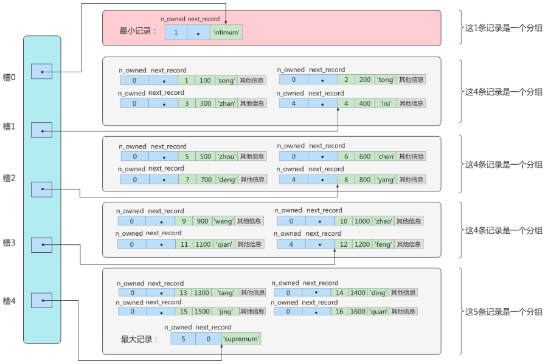
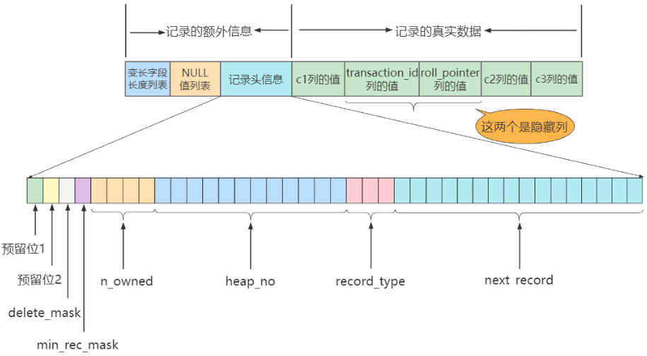
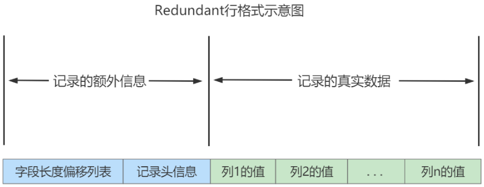

>*`Author: ACatSmiling`*
>
>*`Since: 2024-09-21`*

## 数据库的存储结构：页

索引结构提供了高效的索引方式，不过索引信息以及数据记录都是保存在文件上的，确切说时存储在页结构中。另一方面，索引实在存储引擎中实现的，MySQL 服务器上的存储引擎负责对表中数据的读取和写入工作。不同存储引擎中数据存放的格式一般是不同的，甚至有的存储引擎都不用磁盘来存储数据，比如 Memory。

### 磁盘与内存交互的基本单位：页

`InnoDB 存储引擎将数据划分为若干个页，InnoDB 中页的大小默认为 16 KB，一个页中可以存储多个行记录。`

InnoDB 以页（Page）作为磁盘和内存交互的基本单位，一次最少从磁盘中读取 16 KB 的内容到内存中，同时，一次也是最少把内存中的 16 KB 内容刷新到磁盘中。即：`在 MySQL 数据库中，管理存储空间的基本单位是页，数据库 I/O 操作的最小单位是页。`不论是读取一行数据，还是读取多行数据，都是将这些行所在的页进行加载。

> 记录是按照行来存储的，但是数据库的读取并不以行为单位，否则一次读取（也就是一次 I/O 操作）只能处理一行数据，效率会非常低。

### 页结构概述


页 a，页 b，页 c，一直到页 n，这些页可以`不在物理结构上相连`，只要通过`双向链表`相关联即可。每个数据页中的记录会按照主键值从小到大的顺序组成一个`单向链表`，每个数据页都会为存储在它里边的记录生成一个`页目录`，在通过主键查找某条记录的时候，可以在页目录中使用`二分法`快速定位到对应的槽，然后再遍历该槽对应分组中的记录，即可快速找到指定的记录。

### 页的大小

不同的数据库管理系统（DBMS）的页大小不同，MySQL 的 InnoDB 存储引擎，默认页的大小是 16 KB，可以通过命令查看：

```mysql
mysql> SHOW VARIABLES LIKE '%innodb_page_size%';
+------------------+-------+
| Variable_name    | Value |
+------------------+-------+
| innodb_page_size | 16384 |
+------------------+-------+
1 row in set (0.01 sec)
```

> SQL Server 中页的大小为 8 KB，Oracle 中用术语 "块" （Block）代表页，支持的块大小为 2 KB，4 KB，8 KB，16 KB，32 KB 和 64 KB。

### 页的上层结构

在数据库中，除了行和页之外，还存在区（Extent）、段（Segment）和表空间（Tablespace）的概念。行、页、区、段、表空间的关系，如下图所示：


- 区（Extent）是比页大一级的存储结构，在 InnoDB 存储引擎中，`一个区会分配 64 个连续的页`。因为 InnoDB 中的页默认大小是 16 KB，所以一个区的大小是 64 * 16 KB = 1 MB。
- 段（Segment）是由一个或多个区组成，区在文件系统是一个连续分配的空间（在 InnoDB 中是连续的 64 个页），不过在段中不要求区与区之间是相邻的。`段是数据库中的分配单位，不同类型的数据库对象以不同的段形式存在。`当创建数据表、索引的时候，会创建相对应的段，比如创建一张表时会创建一个表段，创建一个索引时会创建一个索引段。
- 表空间（Tablespace）是一个逻辑容器，表空间存储的对象是段，在一个表空间中可以有一个或多个段，但是一个段只能属于一个表空间。数据库由一个或多个表空间组成，表空间从管理上可以划分为`系统表空间`、`用户表空间`、`撤销表空间`、`临时表空间`等。

## 页的内部结构

页如果按照类型划分的话，常见的有`数据页（保存 B+Tree 节点）`、`系统页`、`Undo 页`和`事务数据页`等。数据页是最常使用的页。

数据页默认的 16 KB 大小的存储空间，被划分为七个部分，分别是`文件头（File Header）、页头（Page Header）、最大最小记录（Infimum + Supremum）、用户记录（User Records）、空闲空间（Free Space）、页目录（Page Directory）和文件尾（File Tailer）`。

页结构的示意图如下所示：


页的这 7 个结构的作用分别如下：

| 名称               | 占用大小 | 说明                                 |
| ------------------ | -------- | ------------------------------------ |
| File Header        | 38 字节  | 文件头，描述页的信息                 |
| Page Header        | 56 字节  | 页头，页的状态信息                   |
| Infimum + Supremum | 26 字节  | 最大和最小记录，这是两个虚拟的行记录 |
| User Records       | 不确定   | 用户记录，存储行记录内容             |
| Free Space         | 不确定   | 空闲记录，页中还没有被使用的空间     |
| Page Directory     | 不确定   | 页目录，存储用户记录的相对位置       |
| File Tailer        | 8 字节   | 文件尾，校验页是否完整               |

可以把这 7 个结构分成 3 个部分。

### 第 1 部分：File Header（文件头）和File Trailer（文件尾）

首先是`文件通用部分`，也就是文件头和文件尾。

#### File Header

**作用：**描述各种页的通用信息，比如页的编号、上一页、下一页是谁等。

**大小：**`38 个字节`。

**构成：**

| 名称                               | 占用空间大小 | 描述                                                         |
| ---------------------------------- | ------------ | ------------------------------------------------------------ |
| `FIL_PAGE_SPACE_OR_CHKSUM`         | `4 字节`     | 页的校验和（checksum 值）                                    |
| `FIL_PAGE_OFFSET`                  | `4 字节`     | 页号                                                         |
| `FIL_PAGE_PREV`                    | `4 字节`     | 上一个页的页号                                               |
| `FIL_PAGE_NEXT`                    | `4 字节`     | 下一个页的页号                                               |
| FIL_PAGE_LSN                       | `8 字节`     | 页面被最后修改时对应的日志序列位置（Log Sequence Number）    |
| `FIL_PAGE_TYPE`                    | `2 字节`     | 页的类型                                                     |
| FIL_PAGE_FILE_FLUSH_LSN            | `8 字节`     | 仅在系统表空间的一个页中定义，代表文件至少被刷新到了对应的 LSN 值 |
| `FIL_PAGE_ARCH_LOG_NO_OR_SPACE_ID` | `4 字节`     | 页属于哪个表空间                                             |

- FIL_PAGE_OFFSET：每一个页都有一个单独的页号，就跟身份证号码一样，`InnoDB 通过页号可以唯一定位一个页`。

- FIL_PAGE_TYPE：表示页的类型，取值如下。

  | 类型名称                | 十六进制 | 描述                   |
  | ----------------------- | -------- | ---------------------- |
  | FIL_PAGE_TYPE_ALLOCATED | Ox0000   | 最新分配，暂未使用     |
  | `FIL_PAGE_UNDO_LOG`     | 0x0002   | Undo 日志页            |
  | FIL_PAGE_INODE          | 0x0003   | 段信息节点             |
  | FIL_PAGE_IBUF_FREE_LIST | 0x0004   | Insert Buffer 空闲列表 |
  | FIL_PAGE_IBUF_BITMAP    | 0x0005   | Insert Buffer 位图     |
  | `FIL_PAGE_TYPE_SYS`     | 0x0006   | 系统页                 |
  | FIL_PAGE_TYPE_TRX_SYS   | 0x0007   | 事务系统数据           |
  | FIL_PAGE_TYPE_FSP_HDR   | 0x0008   | 表空间头部信息         |
  | FIL_PAGE_TYPE_XDES      | 0x0009   | 扩展描述页             |
  | FIL_PAGE_TYPE_BLOB      | 0x000A   | 溢出页                 |
  | `FIL_PAGE_INDEX`        | 0x45BF   | 索引页，即数据页       |

- FIL_PAGE_PREV 和 FIL_PAGE_NEXT：InnoDB 都是以页为单位存放数据的，如果数据分散到多个不连续的页中存储的话， 需要把这些页关联起来，FIL_PAGE_PREV 和 FIL_PAGE_NEXT 就分别代表本页的上一个页和下一个页的页号。这样通过建立一个`双向链表`把许许多多的页就都串联起来了，保证这些页之间不需要是物理上的连续，而是`逻辑上的连续`。

  

- FIL_PAGE_SPACE_OR_CHKSUM：代表当前页面的校验和（checksum）。

  - **校验和：对于一个很长的字节串来说，可以通过某种算法来计算一个比较短的值来代表这个很长的字节串，这个比较短的值就称为校验和。**在比较两个很长的字节串之前，先比较这两个长字节串的校验和，如果校验和都不一样，那么这两个长字节串肯定是不同的，这样可以省去直接比较两个比较长的字节串的时间损耗。文件头和文件尾都有属性 FIL_PAGE_SPACE_OR_CHKSUM。

  - 作用：**InnoDB 存储引擎以页为单位把数据加载到内存中处理，如果该页中的数据在内存中被修改了，那么在修改后的某个时间需要把数据同步到磁盘中。**但是如果在同步了一半的时候，出现断电等异常情况，就会造成该页传输的不完整。**为了检测一个页是否完整（也就是在同步的时候有没有发生同步不完全的异常情况），这时可以通过文件尾的校验和（checksum 值）与文件头的校验和做比对，如果两个值不相等则证明页的传输有问题，需要重新进行传输，否则认为页的传输已经完成。**

  - 具体的：每当一个页面在内存中修改了，在同步之前就要把它的校验和算出来，因为 File Header 在页面的前边，所以校验和会被首先同步到磁盘，当完全写完时，校验和也会被写到页的尾部，如果完全同步成功，则页的首部和尾部的校验和应该是一致的。**如果传输过程发生异常，那么在 File Header 中的校验和就代表着已经修改过的页，而在 File Trailer 中的校验和代表着原先的页（未修改之前的页的信息），二者不同则意味着同步中间发生了异常。**这里，校验方式就是采用 Hash 算法进行校验。

- FIL_PAGE_LSN：页面被最后修改时对应的日志序列位置，英文名是 Log Sequence Number。

#### File Trailer

大小：`8 个字节`。

作用：

- 前 4 个字节代表页的校验和：这个部分是和 File Header 中的校验和相对应的，是为了校验页的完整性的。

- 后 4 个字节代表页面被最后修改时对应的日志序列位置（LSN）：这个部分也是为了校验页的完整性的，如果首部和尾部的 LSN 值校验不成功的话，也说明同步过程出现了问题。

### 第 2 部分：User Records（用户记录）、Infimum + Supremum（最大最小记录）、Free Space（空闲空间）

其次是`记录部分`，页的主要作用是存储记录，所以用户记录和最大最小记录占了页结构的主要空间。


#### Free Space

我们自己存储的记录会按照指定的`行格式`存储到`User Records`部分。但是在一开始生成页的时候，其实并没有 User Records 这个部分，每当我们插入一条记录，都会从 Free Space 部分，也就是尚未使用的存储空间中申请一个记录大小的空间划分到 User Records 部分，当 Free Space 部分的空间全部被 User Records 部分替代掉之后，也就意味着这个页使用完了，如果还有新的记录插入的话，就需要去申请新的页了。


#### User Records

User Records 中的这些记录按照指定的行格式一条一条摆在 User Records 部分，`相互之间形成单链表`。

> 用户记录里的一条条数据如何记录？这里需要讲讲记录行格式的记录头信息。

#### Infimum + Supremum

记录之间可以比较大小，`对于一条完整的记录来说，比较记录的大小就是比较主键的大小。`比方说插入的 4 行记录的主键值分别是：1、2、3、4，这也就意味着这 4 条记录是从小到大依次递增。

InnoDB 规定的最小记录与最大记录这两条记录的构造十分简单，都是`由 5 字节大小的记录头信息和 8 字节大小的一个固定的部分组成的`，如图所示：


这两条记录不是我们自己定义的记录，所以它们并不存放在页的 User Records 部分，它们被单独放在一个称为 Infimum + Supremum 的部分，如图所示：


### 第 3 部分：Page Directory（页目录）、Page Header（页头）

#### Page Director

**1. 为什么需要页目录？**

作用：在页中，记录是以`单向链表`的形式进行存储的。单向链表的特点就是`插入、删除非常方便`，但是`检索效率不高`，最差的情况下需要遍历链表上的所有节点才能完成检索。因此在页结构中专门设计了页目录这个模块，`专门给记录做一个目录`，然后通过`二分查找法`的方式进行检索，提升效率。

需求：根据主键值查找页中的某条记录，如何实现快速查找呢？

```mysql
SELECT * FROM page_demo WHERE c1 = 3
```

方式一：顺序查找。

- 从 Infimum记录（最小记录）开始，沿着链表一直往后找，直至找到目标记录，或者找不到。因为链表中各个记录的值是按照从小到大顺序排列的，所以当链表的某个节点代表的记录的主键值大于想要查找的主键值时，就可以停止查找了，因为该节点后边的节点的主键值是依次递增的。
- 如果一个页中存储了非常多的记录，顺序查找的性能很差。

方式二：使用页目录，二分法查找。

1. 将所有的记录分成几个组，这些记录包括最小记录和最大记录，但不包括标记为 "已删除" 的记录。
2. 第 1 组，也就是最小记录所在的分组，只有 1 个记录；最后一组，就是最大记录所在的分组，会有 1 ~ 8 条记录；其余的组记录数量在 4 ~ 8 条之间。这样做的好处是，除了第 1 组（最小记录所在组）以外，其余组的记录数会尽量平分。

3. 在每个组中最后一条记录的头信息中会存储该组一共有多少条记录，作为 n_owned 字段。
4. 页目录用来存储每组最后一条记录的地址偏移量，这些地址偏移量会按照先后顺序存储起来，每组的地址偏移量也被称之为槽（slot），每个槽相当于指针指向了不同组的最后一个记录。

举例 1：


举例 2：现在的 page_demo 表中正常的记录共有 6 条，InnoDB 会把它们分成两组，第一组中只有一个最小记录，第二组中是剩余的 5 条记录。


- 现在页目录部分中有两个槽，也就意味着我们的记录被分成了两个组，槽 1 中的值是 112，代表最大记录的地址偏移量（就是从页面的 0 字节开始数，数 112个 字节）；槽 0 中的值是 99，代表最小记录的地址偏移量。注意最小和最大记录的头信息中的 n_owned 属性。
- 最小记录的 n_owned 值为 1，这就代表着以最小记录结尾的这个分组中只有1条记录，也就是最小记录本身。最大记录的n_owned值为5，这就代表着以最大记录结尾的这个分组中只有5条记录，包括最大记录本身还有我们自己插入的4条记录。

用箭头指向的方式替代数字，这样更易于理解，修改后如下：


再换个角度看一下：（单纯从逻辑上看一下这些记录和页目录的关系）


**2. 页目录分组的个数如何确定？**

为什么最小记录的 n_owned 值为 1，而最大记录的 n_owned 值为 5 呢？

InnoDB 规定：对于最小记录所在的分组只能有 1 条记录，最大记录所在的分组拥有的记录条数只能在 1 ~ 8 条之间，剩下的分组中记录的条数范围只能在是 4 ~ 8 条之间。

分组是按照下边的步骤进行的：

- 初始情况下，一个数据页里只有最小记录和最大记录两条记录，它们分属于两个分组。

- 之后每插入一条记录，都会从页目录中找到主键值比本记录的主键值大并且差值最小的槽，然后把该槽对应的记录的 n_owned 值加 1，表示本组内又添加了一条记录，直到该组中的记录数等于 8 个。

- 在一个组中的记录数等于 8 个后再插入一条记录时，会将组中的记录拆分成两个组，一个组中 4 条记录，另一个 5 条记录。这个过程会在页目录中新增一个槽来记录这个新增分组中最大的那条记录的偏移量。

**3. 页目录结构下如何快速查找记录？**

现在向 page_demo 表中添加更多的数据，如下：

```mysql
INSERT INTO page_demo VALUES
(5, 500, 'zhou'), 
(6, 600, 'chen'), 
(7, 700, 'deng'), 
(8, 800, 'yang'), 
(9, 900, 'wang'), 
(10, 1000, 'zhao'), 
(11, 1100, 'qian'), 
(12, 1200, 'feng'), 
(13, 1300, 'tang'), 
(14, 1400, 'ding'), 
(15, 1500, 'jing'), 
(16, 1600, 'quan')
```

添加了 12 条记录，现在页里一共有 18 条记录了（包括最小和最大记录），这些记录被分成了 5 个组，如图所示：



> 这里只保留了 16 条记录的记录头信息中的 n_owned 和 next_record 属性，省略了各个记录之间的箭头。

现在看怎么从这个页目录中查找记录。因为各个槽代表的记录的主键值都是从小到大排序的，所以可以使用二分法来进行快速查找。5 个槽的编号分别是：0、1、2、3、4，所以初始情况下最低的槽就是 low = 0，最高的槽就是 high = 4。比方说想找主键值为 6 的记录，过程是这样的：

1. 计算中间槽的位置：(0 + 4) / 2 = 2，所以查看槽 2 对应记录的主键值为 8，又因为 8 > 6，所以设置 high = 2，low 保持不变。
2. 重新计算中间槽的位置：(0 + 2) / 2 = 1，所以查看槽 1 对应的主键值为 4，又因为 4 < 6，所以设置 low = 1，high 保持不变。
3. 因为 high - low 的值为1，所以确定主键值为 6 的记录在槽 2 对应的组中。此刻需要找到槽 2 中主键值最小的那条记录，然后沿着单向链表遍历槽 2 中的记录。

但是前边说过，每个槽对应的记录都是该组中主键值最大的记录，这里槽 2 对应的记录是主键值为 8 的记录，怎么定位一个组中最小的记录呢？因为各个槽都是挨着的，可以很轻易的拿到槽 1 对应的记录（主键值为 4），该条记录的下一条记录就是槽 2 中主键值最小的记录，该记录的主键值为 5。所以可以从这条主键值为 5 的记录出发，遍历槽 2 中的各条记录，直到找到主键值为 6 的那条记录即可。

由于一个组中包含的记录条数只能是 1 ~ 8 条，所以遍历一个组中的记录的代价是很小的。

**4. 小结：**

在一个数据页中查找指定主键值的记录的过程分为两步：

1. 通过二分法确定该记录所在的槽，并找到该槽所在分组中主键值最小的那条记录。
2. 通过记录的 next_record 属性遍历该槽所在的组中的各个记录。

#### Page Header

为了能得到一个数据页中存储的记录的状态信息，比如本页中已经存储了多少条记录，第一条记录的地址是什么，页目录中存储了多少个槽等等，特意在页中定义了一个叫 Page Header 的部分，这个部分占用固定的 56 个字节，专门存储各种状态信息。

| 名称                | 占用空间大小 | 描述                                                         |
| ------------------- | ------------ | ------------------------------------------------------------ |
| `PAGE_N_DIR_SLOTS`  | 2 字节       | 在页目录中的槽数量                                           |
| `PAGE_HEAP_TOP`     | 2 字节       | 还未使用的空间最小地址，也就是说从该地址之后就是 Free Space  |
| `PAGE_N_HEAP`       | 2 字节       | 本页中的记录的数量（包括最小和最大记录，以及标记为删除的记录） |
| `PAGE_FREE`         | 2 字节       | 第一个已经标记为删除的记录地址（各个已删除的记录通过 next_record 也会组成一个单链表，这个单链表中的记录可以被重新利用） |
| `PAGE_GARBAGE`      | 2 字节       | 已删除记录占用的字节数                                       |
| `PAGE_LAST_INSERT`  | 2 字节       | 最后插入记录的位置                                           |
| `PAGE_DIRECTION`    | 2 字节       | 记录插入的方向                                               |
| `PAGE_N_DIRECTION`  | 2 字节       | 一个方向连续插入的记录数量                                   |
| `PAGE_N_RECS`       | 2 字节       | 该页中记录的数量（不包括小和最大记录，以及标记为删除的记录） |
| `PAGE_MAX_TRX_ID`   | 8 字节       | 修改当前页的最大事务 ID，该值仅在二级索引中定义              |
| `PAGE_LEVEL`        | 2 字节       | 当前页在 B+Tree 中所处的层级                                 |
| `PAGE_INDEX_ID`     | 8 字节       | 索引 ID，表示当前页属于哪个索引                              |
| `PAGE_BTR_SEG_LEAF` | 10 字节      | B+Tree 叶子段的头部信息，仅在 B+Tree 的 Root 页定义          |
| `PAGE_BTR_SEG_TOP`  | 10 字节      | B+Tree 非叶子段的头部信息，仅在 B+Tree 的 Root 页定义        |

- PAGE_DIRECTION：假如新插入的一条记录的主键值比上一条记录的主键值大，我们说这条记录的插入方向是右边，反之则是左边。用来表示最后一条记录插入方向的状态就是 PAGE_DIRECTION。
- PAGE_N_DIRECTION：假设连续几次插入新记录的方向都是一致的，InnoDB 会把沿着同一个方向插入记录的条数记下来，这个条数就用 PAGE_N_DIRECTION 这个状态表示。当然，如果最后一条记录的插入方向改变了的话，这个状态的值会被清零重新统计。

### 从数据页的角度看 B+Tree 如何查询


一棵 B+Tree 按照节点类型可以分成两部分：

- 叶子节点，B+Tree 最底层的节点，节点的高度为 0，存储行记录。
- 非叶子节点，节点的高度大于 0，存储索引键和页面指针，并不存储行记录本身。

当我们从页结构来理解 B+Tree 的结构的时候，可以帮助理解一些通过索引进行检索的原理：

- B+Tree 是如何进行记录检索的？
  - 如果通过 B+Tree 的索引查询行记录，首先是从 B+Tree 的根开始，逐层检索，直到找到叶子节点，也就是找到对应的数据页为止，将数据页加载到内存中，页目录中的槽采用`二分查找`的方式，先找到一个粗略的记录分组，然后再在分组中通过`链表遍历`的方式查找记录。
- 普通索引和唯一索引在查询效率上有什么不同？
  - 创建索引的时候，可以是普通索引，也可以是唯一索引。**唯一索引就是在普通索引上增加了约束性，也就是关键字唯一，找到关键字就停止检索。**而普通索引，可能会存在用户记录中的关键字相同的情况，根据页结构的原理，当读取一条记录的时候，不是单独将这条记录从磁盘中读出去，而是将这个记录所在的页加载到内存中进行读取。InnoDB 存储引擎的页大小为 16 KB，在一个页中可能存储着上千个记录，因此在普通索引的字段上进行查找，也就是在内存中多几次 "判断下一条记录" 的操作，对于 CPU 来说，这些操作所消耗的时间是可以忽略不计的。**因此，对一个索引字段进行检索，采用普通索引还是唯一索引，在检索效率上基本上没有差别。**

## InnoDB 行格式（或记录格式）

数据以行为单位来向表中，这些记录在磁盘上的存放方式也被称为`行格式`或者`记录格式`。InnoDB 存储引擎设计了 4 种不同类型的行格式，分别是`Compact`、`Redundant`、`Dynamic`和`Compressed`行格式。

查看 MySQL 8.0 默认的行格式：

```mysql
mysql> SELECT @@innodb_default_row_format;
+-----------------------------+
| @@innodb_default_row_format |
+-----------------------------+
| dynamic                     |
+-----------------------------+
1 row in set (0.00 sec)

# 或者
mysql> SHOW TABLE STATUS LIKE 'employees';
+-----------+--------+---------+------------+------+----------------+-------------+-----------------+--------------+-----------+----------------+---------------------+-------------+------------+-----------------+----------+----------------+---------+
| Name      | Engine | Version | Row_format | Rows | Avg_row_length | Data_length | Max_data_length | Index_length | Data_free | Auto_increment | Create_time         | Update_time | Check_time | Collation       | Checksum | Create_options | Comment |
+-----------+--------+---------+------------+------+----------------+-------------+-----------------+--------------+-----------+----------------+---------------------+-------------+------------+-----------------+----------+----------------+---------+
| employees | InnoDB |      10 | Dynamic    |  107 |            153 |       16384 |               0 |        81920 |         0 |           NULL | 2023-04-04 22:34:54 | NULL        | NULL       | utf8_general_ci |     NULL |                |         |
+-----------+--------+---------+------------+------+----------------+-------------+-----------------+--------------+-----------+----------------+---------------------+-------------+------------+-----------------+----------+----------------+---------+
1 row in set (0.01 sec)
```

### 指定行格式的语法

在创建或修改表的语句中指定行格式：

```mysql
# 创建表
CREATE TABLE 表名 (列的信息) ROW_FORMAT=行格式名称

# 修改表
ALTER TABLE 表名 ROW_FORMAT=行格式名称
```

示例：

```mysql
mysql> CREATE TABLE record_test_table (
    -> col1 VARCHAR(8),
    -> col2 VARCHAR(8) NOT NULL,
    -> col3 CHAR(8),
    -> col4 VARCHAR(8)
    -> ) CHARSET=ascii ROW_FORMAT=COMPACT;
Query OK, 0 rows affected (0.04 sec)

mysql> INSERT INTO record_test_table(col1, col2, col3, col4) 
    -> VALUES
    -> ('zhangsan', 'lisi', 'wangwu', 'songhk'), 
    -> ('tong', 'chen', NULL, NULL);
Query OK, 2 rows affected (0.01 sec)
Records: 2  Duplicates: 0  Warnings: 0
```

### Compact 行格式

在 MySQL 5.1 版本中，默认设置为 Compact 行格式。一条完整的记录其实可以被分为记录的额外信息和记录的真实数据两大部分。


#### 变长字段长度列表

MySQL 支持一些变长的数据类型，比如 VARCHAR(M)、VARBINARY(M)、TEXT 类型、BLOB类型，这些数据类型修饰列称为变长字段，变长字段中存储多少字节的数据不是固定的，所以在存储真实数据的时候需要顺便把这些数据占用的字节数也存起来。在 Compact 行格式中，把所有变长字段的真实数据占用的字节长度都存放在记录的开头部位，从而形成一个变长字段长度列表。

注意：这里面存储的变长长度和字段顺序是反过来的。比如两个 VARCHAR 字段在表结构的顺序是 a(10)，b(15)。那么在变长字段长度列表中存储的长度顺序就是 15，10，是反过来的。

以 record_test_table 表中的第一条记录举例：因为 record_test_table 表的 col1、col2、col4 列都是 VARCHAR(8) 类型的，所以这三个列的值的长度都需要保存在记录开头处，注意 record_test_table 表中的各个列都使用的是 ASCⅡ 字符集（每个字符只需要 1 个字节来进行编码，如果是 UTF-8，则需要 3 个字节）。

| 列名 | 存储内容   | 内容长度（十进制表示） | 内容长度（十六进制表示） |
| ---- | ---------- | ---------------------- | ------------------------ |
| col1 | 'zhangsan' | 8                      | 0x08                     |
| col2 | 'lisi'     | 4                      | 0x04                     |
| col4 | 'songhk'   | 6                      | 0x06                     |

又因为这些长度值需要按照列的逆序存放，所以最后变长字段长度列表的字节串用十六进制表示的效果就是（各个字节之间实际上没有空格，用空格隔开只是方便理解）：06 04 08。

把这个字节串组成的变长字段长度列表填入上边的示意图中的效果就是：


#### NULL 值列表

Compact 行格式会把可以为 NULL 的列统一管理起来，存在一个标记为 NULL 值的列表中。如果表中没有允许存储 NULL 的列，则 NULL 值列表也不存在。

之所以要存储 NULL 值，是因为数据都是需要对齐的，如果没有标注出来 NULL 值的位置，就有可能在查询数据的时候出现混乱。如果使用一个特定的符号放到相应的数据位表示 NULL 值的话，虽然能达到效果，但是这样很浪费空间，所以直接就在行数据得头部开辟出一块空间专门用来记录该行数据哪些是非空数据，哪些是空数据，格式如下：

1. 二进制位的值为 1 时，代表该列的值为 NULL。
2. 二进制位的值为 0 时，代表该列的值不为 NULL。

例如：字段 a、b、c，其中 a 是主键，在某一行中存储的数依次是 a = 1、b = null、c = 2。那么 Compact 行格式中的 NULL 值列表中存储：01。第一个 0 表示 c 不为 NULL，第二个 1 表示 b 为 NULL。这里之所以没有 a，是因为数据库会自动跳过主键，因为主键肯定是非 NULL 且唯一的，在 NULL 值列表的数据中就会自动跳过主键。

record_test_table 插入的两条记录的 NULL 值列表就如下：

- 第一条记录：

  

- 第二条记录：

  

#### 记录头信息（5 字节）

**1. 记录头信息概述**

创建表 page_demo：

```mysql
mysql> CREATE TABLE page_demo(
    -> c1 INT,
    -> c2 INT,
    -> c3 VARCHAR(10000),
    -> PRIMARY KEY (c1)
    -> ) CHARSET=ascii ROW_FORMAT=Compact;
Query OK, 0 rows affected (0.03 sec)
```

这个表中记录的行格式示意图：



这些记录头信息中各个属性如下：

| 名称         | 大小（单位：bit） | 描述                                                         |
| ------------ | ----------------- | ------------------------------------------------------------ |
| 预留位 1     | 1                 | 没有使用                                                     |
| 预留位 2     | 1                 | 没有使用                                                     |
| delete_mask  | 1                 | 标记该记录是否被删除                                         |
| min_rec_mask | 1                 | B+Tree 的每层非叶子节点中的最小记录，都会添加该标记          |
| n_owned      | 4                 | 表示当前记录拥有的记录数                                     |
| heap_no      | 13                | 表示当前记录在记录堆的位置信息                               |
| record_type  | 3                 | 表示当前记录的类型，0 表示普通记录，1 表示 B+Tree 非叶子节点记录，2 表示最小记录，3 表示最大记录 |
| next_record  | 16                | 表示下一条记录的相对位置                                     |

简化后的行格式示意图：


插入数据：

```mysql
mysql> INSERT INTO page_demo 
    -> VALUES
    -> (1, 100, 'song'), 
    -> (2, 200, 'tong'), 
    -> (3, 300, 'zhan'), 
    -> (4, 400, 'lisi');
Query OK, 4 rows affected (0.01 sec)
Records: 4  Duplicates: 0  Warnings: 0
```

图示如下：


> 编号是从 2 开始的，因为默认会有一个最小记录和最大记录。

**2. 记录头信息中各个属性详细分析**

- delete_mask

  - 这个属性标记着当前记录是否被删除，占用 1 个二进制位。
    - 值为 0：代表记录并没有被删除。
    - 值为 1：代表记录被删除掉了。
  - 被删除的记录实际上没有删除，其还在真实的磁盘上。这些被删除的记录之所以不立即从磁盘上移除，是因为`移除它们之后其他的记录在磁盘上需要重新排列，导致性能消耗。`所以只是打一个删除标记而已，所有被删除掉的记录都会组成一个所谓的`垃圾链表`，在这个链表中的记录占用的空间称之为`可重用空间`，之后如果有新记录插入到表中的话，可能把这些被删除的记录占用的存储空间覆盖掉。

- min_rec_mask

  - B+Tree 的每层非叶子节点中的最小记录都会添加该标记，min_rec_mask 值为 1。我们自己插入的四条记录的 min_rec_mask 值都是 0，意味着它们都不是 B+Tree 的非叶子节点中的最小记录。

- record_type

  - 这个属性表示当前记录的类型，一共有 4 种类型的记录：
    - 0：表示普通记录。
    - 1：表示 B+Tree 非叶节点记录。
    - 2：表示最小记录。
    - 3：表示最大记录。
  - 从图中也可以看出来，我们自己插入的记录就是普通记录，它们的 record_type 值都是 0，而最小记录和最大记录的 record_type 值分别为 2 和 3。至于 record_type 为1的情况，在索引的数据结构章节讲过。

- heap_no

  - 这个属性表示当前记录在本页中的位置。
  - 从图中可以看出来，我们插入的 4 条记录在本页中的位置分别是：2、3、4、5。
  - MySQL 会自动给每个页里加两个记录，由于这两个记录并不是我们自己插入的，所以有时候也称为`伪记录`或者`虚拟记录`。这两个伪记录一个代表最小记录，一个代表最大记录。最小记录和最大记录的 heap_no 值分别是 0 和 1，也就是说它们的位置最靠前。

- n_owned

  - 页目录中每个组中最后一条记录的头信息中会存储该组一共有多少条记录，作为 n_owned 字段。详情见 Page Directory。

- next_record

  - 记录头信息里该属性非常重要，它表示从当前记录的真实数据到下一条记录的真实数据的地址偏移量。比如：第一条记录的 next_record 值为 32，意味着从第一条记录的真实数据的地址处向后找 32 个字节便是下一条记录的真实数据。

  - 注意，下一条记录指得并不是按照我们插入顺序的下一条记录，而是按照主键值由小到大的顺序的下一条记录。而且规定 Infimum 记录（也就是最小记录）的下一条记录就是本页中主键值最小的用户记录，而本页中主键值最大的用户记录的下一条记录就是 Supremum 记录（也就是最大记录）。下图用箭头代替偏移量表示 next_record。

    

演示删除和添加操作：

- 删除操作

  - 从表中删除掉一条记录，这个链表也是会跟着变化：

    ```mysql
    mysql> DELETE FROM page_demo WHERE c1 = 2;
    Query OK, 1 row affected (0.01 sec)
    ```

  - 删掉第 2 条记录后的示意图就是：

    

    - 从图中可以看出来，删除第 2 条记录前后主要发生了这些变化：
      - 第 2 条记录并没有从存储空间中移除，而是把该条记录的 delete_mask 值设置为 1。
      - 第 2 条记录的 next_record 值变为了 0，意味着该记录没有下一条记录了。
      - 第 1 条记录的 next_record 指向了第 3 条记录。
      - 最大记录的 n_owned 值从 5 变成了 4。
    - 所以，不论怎么对页中的记录做增删改操作，InnoDB 始终会维护一条记录的单链表，链表中的各个节点是按照主键值由小到大的顺序连接起来的。

- 添加操作

  - 主键值为 2 的记录被删掉了，但是存储空间却没有回收，如果再次把这条记录插入到表中，会发生什么事呢？

    ```mysql
    mysql> INSERT INTO page_demo VALUES (2, 200, 'tong');
    Query OK, 1 row affected (0.01 sec)
    ```

  - 记录的存储情况：

    

  - 直接复用了原来被删除记录的存储空间。说明：当数据页中存在多条被删除掉的记录时，这些记录的 next_record 属性将会把这些被删除掉的记录组成一个垃圾链表，以备之后重用这部分存储空间。

#### 记录的真实数据

记录的真实数据除了我们自己定义的列的数据以外，还会有三个隐藏列：

| 列名           | 是否必须 | 占用空间 | 描述                    |
| -------------- | -------- | -------- | ----------------------- |
| row_id         | 否       | 6 字节   | 行 ID，唯一标识一条记录 |
| transaction_id | 是       | 6 字节   | 事务 ID                 |
| roll_pointer   | 是       | 7 字节   | 回滚指针                |

实际上这几个列的真正名称其实是：DB_ROW_ID、DB_TRX_ID、DB_ROLL_PTR。

- 如果一个表没有手动定义主键，则会选取一个 Unique 键作为主键，如果连 Unique 键都没有定义的话，则会为表默认添加一个名为 row_id 的隐藏列作为主键，所以 row_id 是在没有自定义主键以及 Unique 键的情况下才会存在的。

- 事务 ID 和回滚指针在后面的 MySQL 事务日志章节中讲解。

创建表 mytest：

```mysql
mysql> CREATE TABLE mytest(
    -> col1 VARCHAR(10),
    -> col2 VARCHAR(10),
    -> col3 CHAR(10),
    -> col4 VARCHAR(10)
    -> )ENGINE=INNODB CHARSET=LATIN1 ROW_FORMAT=COMPACT;
```

插入数据：

```mysql
mysql> INSERT INTO mytest
    -> VALUES
    -> ('a','bb','bb','ccc'),
    -> ('d','ee','ee','fff'),
    -> ('d',NULL,NULL,'fff');
Query OK, 3 rows affected (0.00 sec)
Records: 3  Duplicates: 0  Warnings: 0
```

在 Windows 操作系统下，可以选择通过程序 UltraEdit 打开表空间文件 mytest.ibd 这个二进制文件。内容如下：

```mysql
------------------------------------------------------------------------------------------
0000c070 73 75 70 72 65 6d 75 6d 03 02 01 00 00 00 10 00|supremum........|
0000c080 2c 00 00 00 2b 68 00 00 00 00 00 06 05 80 00 00|,...+h..........|
0000c090 00 32 01 10 61 62 62 62 62 20 20 20 20 20 20 20|.2..abbbb|
0000c0a0 20 63 63 63 03 02 01 00 00 00 18 00 2b 00 00 00|ccc........+...|
0000c0b0 2b 68 01 00 00 00 00 06 06 80 00 00 00 32 01 10|+h...........2..|
0000c0c0 64 65 65 65 65 20 20 20 20 20 20 20 20 66 66 66|deeeefff|
0000c0d0 03 01 06 00 00 20 ff 98 00 00 00 2b 68 02 00 00|..........+h...|
0000c0e0 00 00 06 07 80 00 00 00 32 01 10 64 66 66 66 00|........2..dfff.|
------------------------------------------------------------------------------------------
```


该行记录从0000c078开始，参考下面：

```mysql
---------------------------------------------------------------------
03 02 01                     /*变长字段长度列表，逆序*/
00                              /*NULL标志位，第一行没有NULL值*/
00 00 10 00 2c            /*Record Header，固定5字节长度*/
00 00 00 2b 68 00       /*RowID InnoDB自动创建，6字节*/
00 00 00 00 06 05       /*TransactionID*/
80 00 00 00 32 01 10   /*Roll Pointer*/
61                               /*列1数据'a'*/
62 62                          /*列2数据'bb'*/
62 62 20 20 20 20 20 20 20 20/*列3数据'bb'*/
63 63 63                     /*列4数据'ccc'*/
---------------------------------------------------------------------
```

- 注意 1：InnoDB 每行有隐藏列 TransactionID 和 Roll Pointer。

- 注意 2：固定长度 CHAR 字段在未能完全占用其长度空间时，会用 0x20 来进行填充。

接着再来分析下 Record Header 的最后两个字节，这两个字节代表 next_recorder，0x2c 代表下一个记录的偏移量，即当前记录的位置加上偏移量 0x2c 就是下条记录的起始位置。

第二行将不做整理，除了 RowID 不同外，它和第一行大同小异，现在来分析有 NULL 值的第三行：

```mysql
---------------------------------------------------------------------
03 01                               /*变长字段长度列表，逆序*/
06                                   /*NULL标志位，第三行有NULL值*/
00 00 20 ff 98                  /*Record Header*/
00 00 00 2b 68 02           /*RowID*/
00 00 00 00 06 07           /*TransactionID*/
80 00 00 00 32 01 10       /*Roll Pointer*/
64                                   /*列1数据'd'*/
66 66 66                         /*列4数据'fff'*/
---------------------------------------------------------------------
```

第三行有 NULL 值，因此 NULL 标志位不再是 00 而是 06，转换成二进制为 00000110，为 1 的值代表第 2 列和第 3 列的数据为 NULL。在其后存储列数据的部分，用户会发现没有存储 NULL 列，而只存储了第 1 列和第 4 列非 NULL 的值。

因此这个例子很好地说明了：不管是 CHAR 类型还是 VARCHAR 类型，在 Compact 格式下 NULL 值都不占用任何存储空间。

### Dynamic 和 Compressed 行格式

#### 行溢出

**InnoDB 存储引擎可以将一条记录中的某些数据存储在真正的数据页面之外。**

很多 DBA 喜欢 MySQL 数据库提供的 VARCHAR(M) 类型，认为可以存放 65535 字节。这是真的吗？如果我们使用 ASCⅡ 字符集的话，一个字符就代表一个字节，我们看看 VARCHAR(65535) 是否可用：

```mysql
mysql> CREATE TABLE varchar_size_demo(
    -> c VARCHAR(65535)
    -> ) CHARSET=ascii ROW_FORMAT=Compact;
ERROR 1118 (42000): Row size too large. The maximum row size for the used table type, not counting BLOBs, is 65535. This includes storage overhead, check the manual. You have to change some columns to TEXT or BLOBs
```

报错信息表达的意思是：**MySQL 对一条记录占用的最大存储空间是有限制的，除 BLOB 或者 TEXT 类型的列之外， 其他所有的列（不包括隐藏列和记录头信息）占用的字节长度加起来`不能超过 65535 个字节`。**

这个 65535 个字节除了列本身的数据之外，还包括一些其他的数据，以 Compact 行格式为例，比如说我们为了存储一个 VARCHAR(M) 类型的列，除了真实数据占有空间以外，还需要记录的额外信息。

如果该 VARCHAR 类型的列没有 NOT NULL 属性，那最多只能存储 65532 个字节的数据，因为变长字段的长度占用 2 个字节，NULL 值标识需要占用 1 个字节：

```mysql
mysql> CREATE TABLE varchar_size_demo(
    -> c VARCHAR(65532)
    -> ) CHARSET=ascii ROW_FORMAT=Compact;
Query OK, 0 rows affected (0.04 sec)
```

如果有 NOT NULL 属性，那么就不需要 NULL 值标识，也就可以多存储一个字节，即 65533 个字节：

```mysql
mysql> CREATE TABLE varchar_size_demo( 
    -> c VARCHAR(65533) NOT NULL
    -> ) CHARSET=ascii ROW_FORMAT=Compact; 
Query OK, 0 rows affected (0.03 sec)
```

因为一个页的大小一般是 16 KB，也就是 16384 字节，而一个 VARCHAR(M) 类型的列就最多可以存储 65533 个字节，这样就可能出现一个页存放不了一条记录，这种现象称为`行溢出`。

在 Compact 和 Reduntant 行格式中，对于占用存储空间非常大的列，在记录的真实数据处只会存储该列的一部分数据，把剩余的数据`分散存储`在几个其他的页中进行分页存储，然后记录的真实数据处用 20 个字节存储指向这些页的地址（当然这 20 个字节中还包括这些分散在其他页面中的数据的占用的字节数），从而可以找到剩余数据所在的页。这称为`页的扩展`，举例如下：


#### Dynamic 和 Compressed 行格式

`在 MySQL 8.0 中，默认行格式就是 Dynamic。`Dynamic、Compressed 行格式和 Compact 行格式挺像，只不过在处理行溢出数据时有分歧：

- Dynamic 和 Compressed 两种记录格式，对于存放在 BLOB 中的数据采用了完全的行溢出的方式。如图，在数据页中只存放 20 个字节的指针（溢出页的地址），实际的数据都存放在 Off Page （溢出页）中。

  

- Compact 和 Redundant 两种格式会在记录的真实数据处存储一部分数据（存放 768 个前缀字节）。

Compressed 行记录格式的另一个功能就是，存储在其中的行数据会以 zlib 的算法进行压缩，因此对于 BLOB、TEXT、VARCHAR 这类大长度类型的数据能够进行非常有效的存储。

### Redundant 行格式

Redundant 是 MySQL 5.0 版本之前 InnoDB 的行记录存储方式，MySQL 5.0 支持 Redundant 是为了兼容之前版本的页格式。

现在把表 record_test_table 的行格式修改为 Redundant：

```mysql
mysql> ALTER TABLE record_test_table ROW_FORMAT=Redundant;
Query OK, 0 rows affected (0.07 sec)
Records: 0  Duplicates: 0  Warnings: 0
```



从上图可以看到，不同于 Compact 行记录格式，Redundant 行格式的首部是一个字段长度偏移列表，同样是按照列的顺序逆序放置的。

#### 字段长度偏移列表

Compact 行格式的开头是变长字段长度列表，而 Redundant 行格式的开头是字段长度偏移列表，与变长字段长度列表有两处不同：

- 少了 "变长" 两个字：Redundant 行格式会把该条记录中所有列（包括隐藏列）的长度信息都按照逆序存储到字段长度偏移列表。

- 多了 "偏移" 两个字：这意味着计算列值长度的方式不像 Compact 行格式那么直观，它是采用两个相邻数值的差值来计算各个列值的长度。

举例：比如第一条记录的字段长度偏移列表就是：

2B 25 1F 1B 13 0C 06

因为它是逆序排放的，所以按照列的顺序排列就是：

06 0C 13 17 1A 24 25

按照两个相邻数值的差值来计算各个列值的长度的意思就是：

- 第一列（row_id）的长度就是 0x06 个字节，也就是 6 个字节。
- 第二列（transaction_id）的长度就是（0x0C - 0x06）个字节，也就是 6 字节。
- 第三列（roll_pointer）的长度就是（0x13 - 0x0C）个字节，也就是 7 个字节。
- 第四列（col1）的长度就是（0x1B - 0x13）个字节，也就是 8 个字节。
- 第五列（col2）的长度就是（0x1F - 0x1B）个字节，也就是 4 个字节。
- 第六列（col3）的长度就是（0x25 - 0x1F）个字节，也就是 6 个字节。
- 第七列（col4）的长度就是（0x2B - 0x25）个字节，也就是 6 个字节。

#### 记录头信息（record header）

不同于 Compact 行格式，Redundant 行格式中的记录头信息固定占用 6 个字节（48 位），每位的含义见下表。

| 名称              | 大小（bit） | 描述                                                         |
| ----------------- | ----------- | ------------------------------------------------------------ |
| （）              | 1           | 未使用                                                       |
| （）              | 1           | 未使用                                                       |
| deleted_mask      | 1           | 该行是否已被删除                                             |
| min_rec_mask      | 1           | B+Tree 的每层非叶子节点中的最小记录都会添加该标记            |
| n_owned           | 4           | 该记录拥有的记录数                                           |
| heap_no           | 13          | 索引堆中该条记录的位置信息                                   |
| `n_fields`        | 10          | 记录中列的数量                                               |
| `1byte_offs_flag` | 1           | 记录字段长度偏移列表中每个列对应的偏移量使用 1 个字节还是 2 个字节表示 |
| next_record       | 16          | 页中下一条记录的绝对位置                                     |

与 Compact 行格式的记录头信息对比来看，有两处不同：（下面的解释，了解即可）

- Redundant 行格式多了 n_fields 和 1byte_offs_flag 这两个属性。
- Redundant 行格式没有 record_type 这个属性。

其中，n_fields代表一行中列的数量，占用 10 位，这也很好地解释了为什么 MySQL 一个行支持最多的列为 1023。另一个值 1byte_offs_flags 定义了偏移列表占用 1 个字节还是 2 个字节。当它的值为 1 时，表明使用 1个字节存储。当它的值为 0 时，表明使用 2 个字节存储。

1byte_offs_flag 的值是怎么选择的 ?

我们前边说过每个列对应的偏移量可以占用 1 个字节或者 2 个字节来存储，那到底什么时候用 1 个字节，什么时候用 2 个字节呢？其实是根据该条 Redundant 行格式记录的真实数据占用的总大小来判断的：

- 当记录的真实数据占用的字节数值不大于 127（十六进制 0x7F，二进制 01111111）时，每个列对应的偏移量占用 1 个字节。


- 当记录的真实数据占用的字节数大于 127，但不大于 32767（十六进制 0x7FFF，二进制 0111111111111111）时，每个列对应的偏移量占用 2 个字节。


- 有没有记录的真实数据大于 32767 的情况呢？有，不过此时的记录已经存放到了溢出页中，在本页中只保留前 768 个字节和 20 个字节的溢出页面地址。因为字段长度偏移列表处只需要记录每个列在本页面中的偏移就好了，所以每个列使用 2 个字节来存储偏移量就够了。


可以看出，Redundant 行格式还是比较简单粗暴的，直接使用整个记录的真实数据长度来决定使用 1 个字节还是 2 个字节存储列对应的偏移量。只要整条记录的真实数据占用的存储空间大小大于 127，即使第一个列的值占用存储空间小于 127，那也需要使用 2 个字节来表示该列对应的偏移量。简单粗暴，就是这么简单粗暴（所以这种行格式有些过时了）。

#### Redundant 行格式中 NULL 值的处理

因为 Redundant 行格式并没有 NULL 值列表，所以 Redundant 行格式在字段长度偏移列表中的各个列对应的偏移量处做了一些特殊处理 —— 将列对应的偏移量值的第一个比特位作为是否为 NULL 的依据，该比特位也可以被称之为 NULL 比特位。也就是说在解析一条记录的某个列时，首先看一下该列对应的偏移量的 NULL 比特位是不是为 1。如果为 1，那么该列的值就是 NULL，否则不是 NULL。

这也就解释了上边介绍为什么只要记录的真实数据大于 127（十六进制 0x7F，二进制 01111111）时，就采用 2 个字节来表示一个列对应的偏移量，主要是第一个比特位是所谓的 NULL 比特位，用来标记该列的值是否为 NULL。

但是还有一点要注意，对于值为 NULL 的列来说，该列的类型是否为定长类型决定了 NULL 值的实际存储方式，我们接下来分析一下 record_test_table 表的第二条记录，它对应的字段长度偏移列表如下：

A4 A4 1A 17 13 0C 06

按照列的顺序排放就是：

06 0C 13 17 1A A4 A4

我们分情况看一下：

- 如果存储 NULL 值的字段是定长类型的，比方说 CHAR(M) 数据类型的，则 NULL 值也将占用记录的真实数据部分，并把该字段对应的数据使用0x00S 字节填充。
  - 如图第二条记录的 c3 列的值是 NULL，而 c3 列的类型是 CHAR(10)，占用记录的真实数据部分 10 字节，所以我们看到在 Redundant 行格式中使用 0x00000000000000000000 来表示 NULL 值。
  - 另外，c3 列对应的偏移量为 0xA4，它对应的二进制实际是：10100100，可以看到最高位为 1，意味着该列的值是 NULL。将最高位去掉后的值变成了 0100100，对应的十进制值为 36，而 c2 列对应的偏移量为 0x1A，也就是十进制的 26。36 - 26 = 10，也就是说最终 c3 列占用的存储空间为 10 个字节。
- 如果该存储 NULL 值的字段是变长数据类型的，则不在记录的真实数据处占用任何存储空间。
  - 比如 record_test_table 表的 c4 列是 VARCHAR(10) 类型的，VARCHAR(10) 是一个变长数据类型，c4 列对应的偏移量为 0xA4，与 c3 列对应的偏移量相同，这也就意味着它的值也为 NULL，将 0xA4 的最高位去掉后对应的十进制值也是 36，36 - 36 = 0，也就意味着 c4 列本身不占用任何记录的实际数据处的空间。

除了以上的几点之外，Redundant 行格式和 Compact 行格式还是大致相同的。

总结，Redundant 行格式和 Compact 行格式的差异：

- Redundant 没有了 NULL 值列表。


- Redundant 行格式的记录头信息：

  - 多了 n_fields 和 1byte_offs_flag 这两个属性。
  - 没有 record_type 这个属性。

## 区、段与碎片区

### 为什么要有区

B+Tree 的每一层中的页都会形成一个双向链表，如果是以页为单位来分配存储空间的话，**双向链表相邻的两个页之间的物理位置可能离的非常远**。在介绍 B+Tree 索引的适用场景的时候，特别提到范围查询只需要定位到最左边的记录和最右边的记录，然后沿着双向链表一直扫描就可以了，而如果链表中相邻的两个页物理位置离的非常远，就是所谓的`随机 I/O`。因为磁盘的速度和内存的速度差了好几个数量级，`随机 I/O 的效率非常慢`，所以应该尽量让链表中相邻的页的物理位置也相邻，这样进行范围查询的时候才可以使用所谓的`顺序 I/O`。

`引入区的概念，一个区就是在物理位置上连续的 64 个页`。因为 InnoDB 中页的大小默认是 16 KB，所以一个区的大小是 64 * 16 KB = 1 MB。在表中数据量大的时候，为某个索引分配空间的时候就不再按照页为单位来分配，而是按照区为单位分配，甚至在表中的数据特别多的时候，可以一次性分配多个连续的区。虽然可能造成一点点空间的浪费（数据不足以填充满整个区），但是从性能角度看，可以消除很多的随机 I/O，提升处理的效率。

### 为什么要有段

对于范围查询，其实是对 B+Tree 叶子节点中的记录进行顺序扫描，而如果不区分叶子节点和非叶子节点，统统把节点代表的页面放到申请到的区中的话，进行范围扫描的效果就大打折扣。所以 InnoDB 对 B+Tree 的叶子节点和非叶子节点进行了区别对待，也就是说叶子节点有自己独有的区，非叶子节点也有自己独有的区。存放叶子节点的区的集合就算是一个`段（Segment）`，存放非叶子节点的区的集合也算是一个段。也就是说一个索引会生成 2 个段，一个`叶子节点段`，一个`非叶子节点段`。

除了索引的叶子节点段和非叶子节点段意外，InnoDB 中还有为存储一些特殊的数据而定义的段，比如回滚段。所以，**常见的段有数据段、索引段、回滚段。**数据段即为 B+Tree 的叶子节点，索引段即为 B+Tree 的非叶子节点。

在 InnoDB 存储引擎中，对段的管理都是由引擎自身所完成，DBA 不能也没有必要对其进行控制，这从一定程度上简化了 DBA 对段的管理。

> 段其实不对应表空间中某一个连续的物理区域，而是一个逻辑上的概念，由若干个零散的页面以及一些完整的区组成。

### 为什么要有碎片区

默认情况下，一个使用 InnoDB 存储引擎的表只有一个聚簇索引，一个索引会生成 2 个段，而段是以区为单位申请存储空间的，一个区默认占用 1 MB 的存储空间，所以默认情况下，一个只存了几条记录的小表也需要 2 MB 的存储空间吗？以后每次添加一个索引都需要多申请 2 MB 的存储空间吗？这对于存储记录比较少的表简直是极大的浪费。而这个问题的症结在于，到现在为止介绍的区都是纯粹的，也就是一个区被整个分配给某一个段，或者说区中的所有页面，都是为了存储同一个段的数据而存在的，即使段的数据填不满区中所有的页面，那余下的页面也不能挪作他用。

为了避免以完整的区为单位分配给某个段，造成数据量较小的表太浪费存储空间的这种情况，InnoDB 提出了一个`碎片区（fragment）`的概念。在一个碎片区中，并不是所有的页都是为了存储同一个段的数据而存在的，而是碎片区中的页可以用于不同的目的，比如有些页用于段 A，有的页用于段 B，有些页甚至哪个段都不属于。`碎片区直属于表空间，不属于任何一个段。`

所以，此后为某个段分配存储空间的策略是这样的：

- **在刚开始向表中插入数据的时候，段是从某个碎片区以单个页面为单位来分配存储空间的。**
- **当某个段已经占用了 32 个碎片区页面后，就会申请以完整的区为单位来分配存储空间。**

所以，现在`段不能仅定义为是某些区的集合，更精确的说法是某些零散的页面以及一些完整的区的集合。`

### 区的分类

区大体上可以分为 4 种类型：

- `空闲的区（FREE）`：现在还没有用到这个区中的任何页面。
- `有剩余空间的碎片区（FREE_FRAG）`：表示碎片区中还有可用的页面。
- `没有剩余空间的碎片区（FULL_FRAG）`：表示碎片区中的所有页面都被使用，没有空闲页面。
- `附属于某个段的区（FSEG）`：每一个索引都可以分为叶子节点段和非叶子节点段。

处于 FREE、FREE_FRAG 和 FULL_FRAG 这三种状态的区都是独立的，直属于表空间，而处于 FSEG 状态的区是附属于某个段的。

> 如果把表空间比作是一个集团军，段就相当于师，区就相当于团。一般的团都是隶属于某个师的，就像是处于 FSEG 的区全都隶属于某个段，而处于 FREE、FREE_FRAG 和 FULL_FRAG 这三种状态的区，是直接隶属于表空间，就像独立团直接听命于军部一样。

## 表空间

表空间可以看作是 InnoDB 存储引擎逻辑结构的最高层，所有的数据都存放在表空间中。

表空间是一个`逻辑容器`，表空间存储的对象是段，在一个表空间中可以有一个或多个段，但是一个段只能属于一个表空间。表空间数据库由一个或多个表空间组成，表空间从管理上可以划分为`系统表空间（System Tablespace）`、`独立表空间（File-per-table Tablespace）`、`撤销表空间（Undo Tablespace）`和`临时表空间（Temporary Tablespace）`等。

### 独立表空间

独立表空间，即每张表有一个独立的表空间，也就是数据和索引信息都会保存在自己的表空间中。独立的表空间（即：单表）可以在不同的数据库之间进行`迁移`。

空间可以回收（DROP TABLE 操作可以自动回收表空间，其他情况，表空间不能自己回收），如果对于统计分析或是日志表，删除大量数据后可以通过`ALTER TABLE tablename ENGINE=InnoDB`回收不用的空间。对于使用独立表空间的表，不管怎么删除，表空间的碎片不会太严重的影响性能，而且还有机会处理。

#### 独立表空间结构

独立表空间由段、区、页组成。

#### 真实表空间对应的文件大小

到数据目录里面查看，会发现一个新建的表对应的 .ibd 文件只占用了 96 KB，才 6 个页面大小（MySQL 5.7 中），这是因为一开始表里面没有数据，表空间占用的空间很小。但是 .ibd 文件是自扩展的，随着表中数据的增多，表空间对应的文件也逐渐增大。

#### 查看 InnoDB 的表空间类型

```mysql
mysql> SHOW VARIABLES LIKE 'innodb_file_per_table';
+-----------------------+-------+
| Variable_name         | Value |
+-----------------------+-------+
| innodb_file_per_table | ON    |
+-----------------------+-------+
1 row in set (0.00 sec)
```

>innodb_file_per_table=ON，这意味着每张表都会单独保存一个 .ibd 文件。

### 系统表空间

系统表空间的结构和独立表空间基本类似，只不过由于整个 MySQL 进程只有一个系统表空间，在系统表空间中会额外记录一些有关整个系统信息的页面，这部分是独立表空间中没有的。

#### InnoDB 数据字典

每当我们向一个表中插入一条记录的时候，`MySQL 校验过程`如下：先要校验一下插入语句对应的表存不存在；插入的列和表中的列是否符合；如果语法没有问题的话，还需要知道该表的聚簇索引和所有二级索引对应的根页面是哪个表空间的哪个页面，然后把记录插入对应索引的 B+Tree 中。所以说，MySQL 除了保存着我们插入的用户数据之外，还需要保存许多额外的信息，比如：

- 某个表属于哪个表空间，表里面有多少列。
- 表对应的每一个列的类型是什么。
- 该表有多少索引，每个索引对应哪几个字段，该索引对应的根页面在哪个表空间的哪个页面。
- 该表有哪些外键，外键对应哪个表的哪些列。
- 某个表空间对应文件系统上文件路径是什么。
- ...

上面这些数据，并不是使用 INSERT 语句插入的用户数据，实际上是为了更好的管理我们这些用户数据而不得已引入的一些额外数据，这些数据也称为`元数据`。InnoDB 存储引擎特意定义了一些列的`内部系统表（Internal System Table）`来记录这些元数据：

| 表名             | 描述                                                         |
| ---------------- | ------------------------------------------------------------ |
| `SYS_TABLES`     | 整个 InnoDB 存储引擎中所有的表的信息                         |
| `SYS_COLUMNS`    | 整个 InnoDB 存储引擎中所有的列的信息                         |
| `SYS_INDEXES`    | 整个 InnoDB 存储引擎中所有的索引的信息                       |
| `SYS_FIELDS`     | 整个 InnoDB 存储引擎中所有的索引对应的列的信息               |
| SYS_FOREIGN      | 整个 InnoDB 存储引擎中所有的外键的信息                       |
| SYS_FOREIGN_COLS | 整个 InnoDB 存储引擎中所有的外键对应列的信息                 |
| SYS_TABLESPACES  | 整个 InnoDB 存储引擎中所有的表空间信息                       |
| SYS_DATAFILES    | 整个 InnoDB 存储引擎中所有的表空间对应文件系统的文件路径信息 |
| SYS_VIRTUAL      | 整个 InnoDB 存储引擎中所有的虚拟生成列的信息                 |

这些系统表也被称为`数据字典`，它们都是以 B+Tree 的形式保存在系统表空间的某些页面中，其中`SYS_TABLES`、`SYS_COLUMNS`、`SYS_INDEXES`和`SYS_FIELDS`这四个表尤为重要，称之为`基本系统表（Basic System Tables）`。

**SYS_TABLES 表结构：**

| 列名       | 描述                                             |
| ---------- | ------------------------------------------------ |
| NAME       | 表的名称，主键                                   |
| ID         | InnoDB 存储引擎中每个表都有一个唯一的 ID         |
| N_COLS     | 该表拥有列的个数                                 |
| TYPE       | 表的类型，记录了一些文件格式、行格式、压缩等信息 |
| MIX_ID     | 已过时，忽略                                     |
| MIX_LEN    | 表的一些额外的属性                               |
| CLUSTER_ID | 未使用，忽略                                     |
| SPACE      | 该表所属表空间的 ID                              |

**SYS_COLUMNS 表结构：**

| 列名     | 描述                                                         |
| -------- | ------------------------------------------------------------ |
| TABLE_ID | 该列所属表对应的 ID。与 POS 一起构成联合主键                 |
| POS      | 该列在表中是第几列                                           |
| NAME     | 该列的名称                                                   |
| MTYPE    | main data type，主数据类型，比如 INT、CHAR、VARCHAR、FLOAT、DOUBLE 等 |
| PRTYPE   | precise type，精确数据类型，就是修饰数据类型的，比如是否允许 NULL 值，是否允许负数等 |
| LEN      | 该列最多占用存储空间的字节数                                 |
| PREC     | 该列的精度，不过这列可能都没有使用，默认值都是 0             |

**SYS_INDEXES 表结构：**

| 列名            | 描述                                                         |
| --------------- | ------------------------------------------------------------ |
| TABLE_ID        | 该索引所属表对应的 ID，与 ID 一起构成联合主键                |
| ID              | InnoDB 存储引擎中每个索引都有一个唯一的 ID                   |
| NAME            | 该索引的名称                                                 |
| N_FIELDS        | 该索引包含列的个数                                           |
| TYPE            | 该索引的类型，比如聚簇索引、唯一索引、更改缓冲区的索引、全文索引、普通的二级索引等 |
| SPACE           | 该索引根页面所在的表空间 ID                                  |
| PAGE_NO         | 该索引根页面所在的页面号                                     |
| MERGE_THRESHOLD | 如果页面中的记录被删除到某个比例，就把该页面和相邻页面合并，这个值就是这个比例 |

**SYS_FIELDS 表结构：**

| 列名     | 描述                                             |
| -------- | ------------------------------------------------ |
| INDEX_ID | 该索引列所属的索引的 ID，与 POS 一起构成联合主键 |
| POS      | 该索引列在某个索引中是第几列                     |
| COL_NAME | 该索引列的名称                                   |

## 附录：数据页加载的三种方式

InnoDB 从磁盘中读取数据的最小单位是数据页，对于 MySQL 存放的数据，逻辑概念上称之为表，在磁盘等物理层面而言，是按`数据页`形式进行存放的，当其加载到 MySQL 中后，称之为`缓存页`。如果缓冲池中没有该页数据，那么缓冲池有以下三种方式读取数据，每种方式的读取效率也是不同的。

### 内存读取

如果该数据存在于内存中，基本上执行时间在 1 ms 左右，效率比较高。


### 随机读取

如果数据没有在内存中，就需要在磁盘上对该页进行查找，整体时间预估在 10 ms 左右，这 10 ms 中约有 6 ms 是磁盘的实际繁忙实际（包括`寻道和半圈旋转时间`），有 3 ms 是对可能发生的排队时间的估计值，另外还有 1 ms 的传输时间，将页从磁盘服务器缓冲区传输到数据库缓冲区中。这 10 ms 看起来很快，但实际上对于数据库来说消耗的时间已经很长了，因为这还只是一个页的读取时间。


### 顺序读取

**顺序读取其实是一种批量读取的方式，因为请求的数据在磁盘上往往都是相邻存储的，顺序读取可以批量读取页面，这样的话，一次性加载到缓冲池中就不需要再对其他页面单独进行磁盘 I/O 操作。**如果一个磁盘的吞吐量是 40 MB/S，那么对于一个 16 KB 大小的页来说，一次可以顺序读取 2560 （40 MB / 16 KB）个页，相当于一个页的读取时间为 0.4 ms。采用批量读取的方式，即使是从磁盘上进行读取，效率也比从内存中只单独读取一个页的效率要高。

## 原文链接

https://github.com/ACatSmiling/zero-to-zero/blob/main/RelationalDatabase/mysql.md