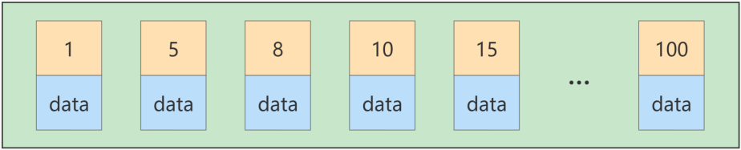
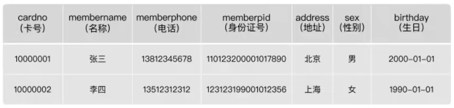
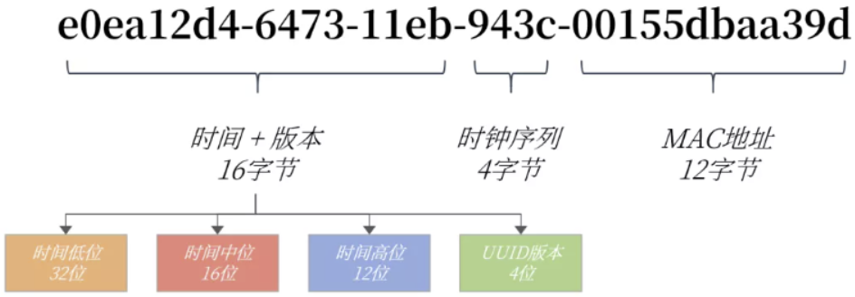

>*`Author: ACatSmiling`*
>
>*`Since: 2024-09-21`*

数据库调优的维度：

- 索引失效、没有充分利用所以 —— **`索引建立`**。
- 关联查询太多 JOIN（设计缺陷或不得已的需求）—— **`SQL 优化`**。
- 服务器调优及各个参数设置（缓冲、 线程数）—— **`调整 my.cnf`**。
- 数据过多 —— **`分库分表`**。

关于数据库调优的知识点非常分散，不同 DBMS，不同的公司，不同的职位，不同的项目遇到的问题都不尽相同。

虽然 SQL 查询优化的技术很多，但是大体方向上完全可以分为`物理查询优化`和`逻辑查询优化`两大块。

- 物理查询优化：通过`索引`和`表连接方式`等技术来进行优化，这里重点需要掌握索引的使用。
- 逻辑查询优化：通过`SQL 等价变换`提升查询效率，直白一点来讲就是，换一种执行效率更高的查询写法。

## 数据准备

创建存储过程：

```mysql
# 创建往 stu 表中插入数据的存储过程
mysql> DELIMITER //
mysql> CREATE PROCEDURE insert_stu(  START INT , max_num INT )
    -> BEGIN 
    -> DECLARE i INT DEFAULT 0; 
    -> SET autocommit = 0; # 设置手动提交事务
    -> REPEAT # 循环
    -> SET i = i + 1; # 赋值
    -> INSERT INTO student (stuno, name ,age ,classId ) VALUES
    -> ((START+i),rand_string(6),rand_num(1,50),rand_num(1,1000)); 
    -> UNTIL i = max_num 
    -> END REPEAT; 
    -> COMMIT; # 提交事务
    -> END //
Query OK, 0 rows affected (0.02 sec)

mysql> DELIMITER ;

# 创建往 class 表中插入数据的存储过程
mysql> DELIMITER //
mysql> CREATE PROCEDURE `insert_class`( max_num INT )
    -> BEGIN 
    -> DECLARE i INT DEFAULT 0; 
    -> SET autocommit = 0;  
    -> REPEAT 
    -> SET i = i + 1; 
    -> INSERT INTO class ( classname,address,monitor ) VALUES
    -> (rand_string(8),rand_string(10),rand_num(1,100000)); 
    -> UNTIL i = max_num 
    -> END REPEAT; 
    -> COMMIT;
    -> END //
Query OK, 0 rows affected (0.01 sec)

mysql> DELIMITER ;
```

调用存储过程：

```mysql
# 往 class 表添加 1 万条数据
mysql> CALL insert_class(10000);
Query OK, 0 rows affected (6.75 sec)

# 往 stu 表添加 80 万条数据
mysql> CALL insert_stu(100000, 800000);
Query OK, 0 rows affected (4 min 30.96 sec)
```

查看数据是否添加成功：

```mysql
mysql> SELECT COUNT(*) FROM class;
+----------+
| COUNT(*) |
+----------+
|    10000 |
+----------+
1 row in set (0.00 sec)

mysql> SELECT COUNT(*) FROM student;
+----------+
| COUNT(*) |
+----------+
|   800000 |
+----------+
1 row in set (0.02 sec)
```

创建删除某个表的索引的存储过程，避免手动删除索引：

```mysql
mysql> DELIMITER //
mysql> CREATE  PROCEDURE `proc_drop_index`(dbname VARCHAR(200),tablename VARCHAR(200))
    -> BEGIN
    ->    DECLARE done INT DEFAULT 0;
    ->    DECLARE ct INT DEFAULT 0;
    ->    DECLARE _index VARCHAR(200) DEFAULT '';
    ->    DECLARE _cur CURSOR FOR  SELECT  index_name  FROM
    -> 		information_schema.STATISTICS  WHERE table_schema=dbname AND table_name=tablename AND
    -> 		seq_in_index=1 AND  index_name <>'PRIMARY'; # 每个游标必须使用不同的 declare continue handler for not found set done=1 来控制游标的结束
    ->    DECLARE  CONTINUE HANDLER FOR NOT FOUND set done=2; # 若没有数据返回，程序继续，并将变量 done 设为 2
    ->     OPEN _cur;
    ->     FETCH _cur INTO _index;
    ->     WHILE _index<>'' DO
    ->        SET @str = CONCAT("drop index ", _index , " on " , tablename );
    ->        PREPARE sql_str FROM @str ;
    ->        EXECUTE sql_str;
    ->        DEALLOCATE PREPARE sql_str;
    ->        SET _index='';
    ->        FETCH _cur INTO _index;
    ->     END WHILE;
    ->  CLOSE _cur;
    -> END //
Query OK, 0 rows affected (0.01 sec)

mysql> DELIMITER ;
```

>调用方法：`CALL proc_drop_index("dbname", "tablename");`。

## 索引失效案例

MySQL 中提高性能的一个最有效的方式是对数据表设计合理的索引。索引提供了高校访问数据的方法，并且加快了查询的速度，因此索引对查询的速度有着至关重要的影响。

- 使用索引可以快速的定位表中的某条记录，从而提高数据库查询的速度，提高数据库的性能。
- 如果查询时没有使用索引，查询语句就会扫描表中的所有记录。在数据量大的情况下，这样查询的速度会很慢。

大多数情况下都（默认）采用 B+Tree 来构建索引。只是空间列类型的索引使用 R-Tree，并且 Memory 表还支持 Hash 索引。

其实，用不用索引，最终都是优化器说了算。优化器时基于`cost 开销 (CostBaseOptimizer)`，它不是基于规则（Rule-BasedOptimizer），也不是基于语义。因此，优化器总是选择开销最小的。另外，SQL 语句是否使用索引，跟数据库版本、数据量、数据选择度都有关系。

> cost 开销的单位不是时间。

### 全值匹配

**`全值匹配时，可以充分的利用组合索引，会匹配符合字段最多的组合索引。`**

如下所示，系统中经常出现的 SQL 语句，当没有建立索引时，`possible_keys`和`key`都为 NULL：

```mysql
mysql> EXPLAIN SELECT SQL_NO_CACHE * FROM student WHERE age = 30;
+----+-------------+---------+------------+------+---------------+------+---------+------+--------+----------+-------------+
| id | select_type | table   | partitions | type | possible_keys | key  | key_len | ref  | rows   | filtered | Extra       |
+----+-------------+---------+------------+------+---------------+------+---------+------+--------+----------+-------------+
|  1 | SIMPLE      | student | NULL       | ALL  | NULL          | NULL | NULL    | NULL | 742203 |    10.00 | Using where |
+----+-------------+---------+------------+------+---------------+------+---------+------+--------+----------+-------------+
1 row in set, 2 warnings (0.00 sec)

mysql> EXPLAIN SELECT SQL_NO_CACHE * FROM student WHERE age = 30 AND classId = 4;
+----+-------------+---------+------------+------+---------------+------+---------+------+--------+----------+-------------+
| id | select_type | table   | partitions | type | possible_keys | key  | key_len | ref  | rows   | filtered | Extra       |
+----+-------------+---------+------------+------+---------------+------+---------+------+--------+----------+-------------+
|  1 | SIMPLE      | student | NULL       | ALL  | NULL          | NULL | NULL    | NULL | 742203 |     1.00 | Using where |
+----+-------------+---------+------------+------+---------------+------+---------+------+--------+----------+-------------+
1 row in set, 2 warnings (0.00 sec)

mysql> EXPLAIN SELECT SQL_NO_CACHE * FROM student WHERE age = 30 AND classId = 4 AND NAME = 'abcd';
+----+-------------+---------+------------+------+---------------+------+---------+------+--------+----------+-------------+
| id | select_type | table   | partitions | type | possible_keys | key  | key_len | ref  | rows   | filtered | Extra       |
+----+-------------+---------+------------+------+---------------+------+---------+------+--------+----------+-------------+
|  1 | SIMPLE      | student | NULL       | ALL  | NULL          | NULL | NULL    | NULL | 742203 |     0.10 | Using where |
+----+-------------+---------+------------+------+---------------+------+---------+------+--------+----------+-------------+
1 row in set, 2 warnings (0.00 sec)
```

>`SQL_NO_CACHE`表示不使用查询缓存。

此时执行 SQL，数据查询速度会比较慢：

```mysql
mysql> SELECT SQL_NO_CACHE * FROM student WHERE age = 30 AND classId = 4 AND NAME = 'abcd';
Empty set, 1 warning (0.22 sec)
```

接下来建立索引：

```mysql
mysql> CREATE INDEX idx_age ON student(age);
Query OK, 0 rows affected (3.44 sec)
Records: 0  Duplicates: 0  Warnings: 0

mysql> CREATE INDEX idx_age_classid ON student(age, classId);
Query OK, 0 rows affected (3.60 sec)
Records: 0  Duplicates: 0  Warnings: 0

mysql> CREATE INDEX idx_age_classid_name ON student(age, classId, name);
Query OK, 0 rows affected (4.10 sec)
Records: 0  Duplicates: 0  Warnings: 0
```

>上面建立索引是与三条 SQL 的使用场景对应的，遵守了`全值匹配`的规则，就是说建立几个复合索引字段，最好的就是用上这几个字段，且按照顺序来用。

建立索引后执行，发现使用到了联合索引（组合索引字段最多的），且耗时明显减少：

```mysql
# 全值匹配，使用的是组合字段最多的索引 idx_age_classid_name
mysql> EXPLAIN SELECT SQL_NO_CACHE * FROM student WHERE age = 30 AND classId = 4 AND NAME = 'abcd';
+----+-------------+---------+------------+------+----------------------------------------------+----------------------+---------+-------------------+------+----------+-------+
| id | select_type | table   | partitions | type | possible_keys                                | key                  | key_len | ref               | rows | filtered | Extra |
+----+-------------+---------+------------+------+----------------------------------------------+----------------------+---------+-------------------+------+----------+-------+
|  1 | SIMPLE      | student | NULL       | ref  | idx_age,idx_age_classid,idx_age_classid_name | idx_age_classid_name | 73      | const,const,const |    1 |   100.00 | NULL  |
+----+-------------+---------+------------+------+----------------------------------------------+----------------------+---------+-------------------+------+----------+-------+
1 row in set, 2 warnings (0.01 sec)

mysql> SELECT SQL_NO_CACHE * FROM student WHERE age = 30 AND classId = 4 AND NAME = 'abcd';
Empty set, 1 warning (0.00 sec)
```

>注意：上面的索引可能不生效，在数据量较大的情况下，进行全值匹配`SELECT *`，优化器可能经过计算发现，我们使用索引查询所有的数据后，还需要对查找到的数据进行回表操作，性能还不如全表扫描。此处因为没有造这么多数据，所以不演示效果。

### 最左匹配原则

在 MySQL 建立联合索引时会遵守**`最佳左前缀匹配原则`**，即最左优先，在检索数据时从组合索引的最左边开始匹配，如果第一个字段匹配不上，则整个组合索引都不会生效。

- 下面的 SQL 将使用索引 idx_age：

  ```mysql
  mysql> EXPLAIN SELECT SQL_NO_CACHE * FROM student WHERE student.age = 30 AND student.name = 'abcd';
  +----+-------------+---------+------------+------+----------------------------------------------+---------+---------+-------+-------+----------+-------------+
  | id | select_type | table   | partitions | type | possible_keys                                | key     | key_len | ref   | rows  | filtered | Extra       |
  +----+-------------+---------+------------+------+----------------------------------------------+---------+---------+-------+-------+----------+-------------+
  |  1 | SIMPLE      | student | NULL       | ref  | idx_age,idx_age_classid,idx_age_classid_name | idx_age | 5       | const | 30518 |    10.00 | Using where |
  +----+-------------+---------+------------+------+----------------------------------------------+---------+---------+-------+-------+----------+-------------+
  1 row in set, 2 warnings (0.00 sec)
  ```

- 下面的 SQL 不会使用索引，因为没有创建 classId 或者 name 的索引：

  ```mysql
  mysql> EXPLAIN SELECT SQL_NO_CACHE * FROM student WHERE student.classId = 4 AND student.name = 'abcd';
  +----+-------------+---------+------------+------+---------------+------+---------+------+--------+----------+-------------+
  | id | select_type | table   | partitions | type | possible_keys | key  | key_len | ref  | rows   | filtered | Extra       |
  +----+-------------+---------+------------+------+---------------+------+---------+------+--------+----------+-------------+
  |  1 | SIMPLE      | student | NULL       | ALL  | NULL          | NULL | NULL    | NULL | 742203 |     1.00 | Using where |
  +----+-------------+---------+------------+------+---------------+------+---------+------+--------+----------+-------------+
  1 row in set, 2 warnings (0.00 sec)
  ```

- 下面的 SQL 查询就是遵守这一原则的正确打开方式：

  ```mysql
  mysql> EXPLAIN SELECT SQL_NO_CACHE * FROM student WHERE student.age = 30 AND student.classId = 4 AND student.name = 'abcd';
  +----+-------------+---------+------------+------+----------------------------------------------+----------------------+---------+-------------------+------+----------+-------+
  | id | select_type | table   | partitions | type | possible_keys                                | key                  | key_len | ref               | rows | filtered | Extra |
  +----+-------------+---------+------------+------+----------------------------------------------+----------------------+---------+-------------------+------+----------+-------+
  |  1 | SIMPLE      | student | NULL       | ref  | idx_age,idx_age_classid,idx_age_classid_name | idx_age_classid_name | 73      | const,const,const |    1 |   100.00 | NULL  |
  +----+-------------+---------+------------+------+----------------------------------------------+----------------------+---------+-------------------+------+----------+-------+
  1 row in set, 2 warnings (0.01 sec)
  ```

- 下面的 SQL 也会使用索引，因为**优化器会执行优化，调整查询条件的顺序**，但开发中应保持良好的开发习惯，保持条件中字段的顺序匹配索引的组合顺序： 

  ```mysql
  mysql> EXPLAIN SELECT SQL_NO_CACHE * FROM student WHERE student.classId = 4 AND student.age = 30 AND student.name = 'abcd';
  +----+-------------+---------+------------+------+----------------------------------------------+----------------------+---------+-------------------+------+----------+-------+
  | id | select_type | table   | partitions | type | possible_keys                                | key                  | key_len | ref               | rows | filtered | Extra |
  +----+-------------+---------+------------+------+----------------------------------------------+----------------------+---------+-------------------+------+----------+-------+
  |  1 | SIMPLE      | student | NULL       | ref  | idx_age,idx_age_classid,idx_age_classid_name | idx_age_classid_name | 73      | const,const,const |    1 |   100.00 | NULL  |
  +----+-------------+---------+------------+------+----------------------------------------------+----------------------+---------+-------------------+------+----------+-------+
  1 row in set, 2 warnings (0.00 sec)
  ```

- 如果删去索引 idx_age 和 idx_age_classid，只保留 idx_age_classid_name，执行如下 SQL，也会使用索引。

  ```mysql
  mysql> DROP INDEX idx_age ON student;
  Query OK, 0 rows affected (0.02 sec)
  Records: 0  Duplicates: 0  Warnings: 0
  
  mysql> DROP INDEX idx_age_classid ON student;
  Query OK, 0 rows affected (0.02 sec)
  Records: 0  Duplicates: 0  Warnings: 0
  
  # 使用了 idx_age_classid_name索引，但是 key_len 是 5，也就是说只使用了 age 部分的排序，因为 age 是 int 类型，4 个字节加上 null 值列表一共 5 个字节。仔细想想，B+Tree 是先按照 age 排序，再按照 classid 排序，最后按照 name 排序，因此不能跳过 classId 的排序直接就使用 name 的排序，所以只使用了 age 的索引
  mysql> EXPLAIN SELECT SQL_NO_CACHE * FROM student WHERE student.age = 30 AND student.name = 'abcd';
  +----+-------------+---------+------------+------+----------------------+----------------------+---------+-------+-------+----------+-----------------------+
  | id | select_type | table   | partitions | type | possible_keys        | key                  | key_len | ref   | rows  | filtered | Extra                 |
  +----+-------------+---------+------------+------+----------------------+----------------------+---------+-------+-------+----------+-----------------------+
  |  1 | SIMPLE      | student | NULL       | ref  | idx_age_classid_name | idx_age_classid_name | 5       | const | 31982 |    10.00 | Using index condition |
  +----+-------------+---------+------------+------+----------------------+----------------------+---------+-------+-------+----------+-----------------------+
  1 row in set, 2 warnings (0.00 sec)
  
  ```

综上，MySQL 可以为多个字段创建索引，一个索引可以包括 16 个字段，`对于多列字段，过滤条件要使用索引必须按照索引建立时的顺序，依次满足，一旦跳过某个字段，索引后面的字段都无法使用，如果查询条件中没有使用这些字段中的第一个字段时，多列索引不会被使用。`

### 主键插入顺序

对于一个使用 InnoDB 存储引擎的表来说，在没有显式的创建索引时，表中的数据实际上都是存储在聚簇索引的叶子节点上的。而记录又是存储在数据页中，数据页和记录又是按照记录主键值从小到大的顺序进行排序，所以如果我们插入的记录的主键是依次增大的话，那我们每插满一个数据页就换到下一个数据页继续插入，而如果我们插入的主键值忽大忽小的话，就比较麻烦。假设某个数据页存储的记录已经满了，它存储的主键值在 1 ~ 100 之间：



如果此时再插入一条主键值为 9 的记录，那它插入的位置就如下图：


可这个数据页已经满了，再插进来咋办呢？我们需要把`当前页面分裂成两个页面`，把本页中的一些`记录移动`到新创建的这个页中。页面分裂和记录移位意味着什么？意味着：`性能损耗`！所以如果想尽量避免这样无谓的性能损耗，最好让插入的记录的`主键值依次递增`，这样就不会发生这样的性能损耗了。 所以我们建议：`让主键具有 AUTO_INCREMENT，让存储引擎自己为表生成主键，而不是手动插入。`比如 person_info 表：

```mysql
CREATE TABLE person_info(
    id INT UNSIGNED NOT NULL AUTO_INCREMENT,
    name VARCHAR(100) NOT NULL,
    birthday DATE NOT NULL,
    phone_number CHAR(11) NOT NULL,
    country varchar(100) NOT NULL,
    PRIMARY KEY (id),
    KEY idx_name_birthday_phone_number (name(10), birthday, phone_number)
);
```

自定义的主键列 id 拥有 AUTO_INCREMENT 属性，在插入记录时存储引擎会自动填入自增的主键值。这样的主键占用空间小，顺序写入，可以减少页分裂。

### 计算导致索引失效

在 student 表的字段 stuno 上创建索引：

```mysql
mysql> CREATE INDEX idx_sno ON student(stuno);
Query OK, 0 rows affected (2.73 sec)
Records: 0  Duplicates: 0  Warnings: 0
```

**`当有计算条件时，索引失效。`**示例如下：

```mysql
mysql> EXPLAIN SELECT SQL_NO_CACHE id, stuno, NAME FROM student WHERE stuno = 900001;
+----+-------------+---------+------------+------+---------------+---------+---------+-------+------+----------+-------+
| id | select_type | table   | partitions | type | possible_keys | key     | key_len | ref   | rows | filtered | Extra |
+----+-------------+---------+------------+------+---------------+---------+---------+-------+------+----------+-------+
|  1 | SIMPLE      | student | NULL       | ref  | idx_sno       | idx_sno | 4       | const |    1 |   100.00 | NULL  |
+----+-------------+---------+------------+------+---------------+---------+---------+-------+------+----------+-------+
1 row in set, 2 warnings (0.00 sec)

# 有计算条件，索引失效
mysql> EXPLAIN SELECT SQL_NO_CACHE id, stuno, NAME FROM student WHERE stuno + 1 = 900001; 
+----+-------------+---------+------------+------+---------------+------+---------+------+--------+----------+-------------+
| id | select_type | table   | partitions | type | possible_keys | key  | key_len | ref  | rows   | filtered | Extra       |
+----+-------------+---------+------------+------+---------------+------+---------+------+--------+----------+-------------+
|  1 | SIMPLE      | student | NULL       | ALL  | NULL          | NULL | NULL    | NULL | 742203 |   100.00 | Using where |
+----+-------------+---------+------------+------+---------------+------+---------+------+--------+----------+-------------+
1 row in set, 2 warnings (0.00 sec)
```

可以看到如果对索引进行了表达式计算，索引就失效了。这是因为我们需要把索引字段的值都取出来，然后一次进行表达式的计算来进行条件判断，因此采用的就是`全表扫描`的方式，运行时间也会慢很多：

```mysql
mysql> SELECT SQL_NO_CACHE id, stuno, NAME FROM student WHERE stuno = 900001;
Empty set, 1 warning (0.00 sec)

mysql> SELECT SQL_NO_CACHE id, stuno, NAME FROM student WHERE stuno + 1 = 900001; 
+--------+--------+--------+
| id     | stuno  | NAME   |
+--------+--------+--------+
| 800000 | 900000 | skWeFP |
+--------+--------+--------+
1 row in set, 1 warning (0.18 sec)
```

### 函数导致索引失效

在 student 表的字段 name 上创建索引：

```mysql
mysql> CREATE INDEX idx_name ON student(NAME); 
Query OK, 0 rows affected (3.58 sec)
Records: 0  Duplicates: 0  Warnings: 0
```

**`当有函数条件时，索引失效。`**示例如下

```mysql
mysql> EXPLAIN SELECT SQL_NO_CACHE * FROM student WHERE student.name LIKE 'abc%';
+----+-------------+---------+------------+-------+---------------+----------+---------+------+------+----------+-----------------------+
| id | select_type | table   | partitions | type  | possible_keys | key      | key_len | ref  | rows | filtered | Extra                 |
+----+-------------+---------+------------+-------+---------------+----------+---------+------+------+----------+-----------------------+
|  1 | SIMPLE      | student | NULL       | range | idx_name      | idx_name | 63      | NULL |   40 |   100.00 | Using index condition |
+----+-------------+---------+------------+-------+---------------+----------+---------+------+------+----------+-----------------------+
1 row in set, 2 warnings (0.00 sec)

# 有函数，索引失效
mysql> EXPLAIN SELECT SQL_NO_CACHE * FROM student WHERE LEFT(student.name, 3) = 'abc';
+----+-------------+---------+------------+------+---------------+------+---------+------+--------+----------+-------------+
| id | select_type | table   | partitions | type | possible_keys | key  | key_len | ref  | rows   | filtered | Extra       |
+----+-------------+---------+------------+------+---------------+------+---------+------+--------+----------+-------------+
|  1 | SIMPLE      | student | NULL       | ALL  | NULL          | NULL | NULL    | NULL | 742203 |   100.00 | Using where |
+----+-------------+---------+------------+------+---------------+------+---------+------+--------+----------+-------------+
1 row in set, 2 warnings (0.00 sec)
```

查询效率也慢很多：

```mysql
mysql> SELECT SQL_NO_CACHE * FROM student WHERE student.name LIKE 'abc%';
+--------+--------+--------+------+---------+
| id     | stuno  | name   | age  | classId |
+--------+--------+--------+------+---------+
| 580020 | 680020 | ABcHeA |   14 |     850 |
| 519840 | 619840 | ABcHgL |    9 |     671 |
| 626755 | 726755 | ABcHhL |   11 |     915 |
| 311719 | 411719 | AbCHJl |    9 |     177 |
|  97823 | 197823 | aBCihn |   44 |     540 |
| 385679 | 485679 | AbCIJw |    7 |     364 |
| 160879 | 260879 | ABcIjX |   12 |     256 |
| 371703 | 471703 | aBCijy |   38 |     355 |
| 201505 | 301505 | ABcIkb |   25 |     386 |
| 371290 | 471290 | aBCiky |   39 |     446 |
| 463195 | 563195 | AbCILD |   33 |     608 |
| 472221 | 572221 | AbCJMI |    6 |     586 |
| 605967 | 705967 | AbCJNL |   16 |     430 |
| 289583 | 389583 | abcjNn |   50 |     184 |
| 621037 | 721037 | ABcJor |   42 |     166 |
| 164750 | 264750 | ABcJpw |   13 |     993 |
| 763434 | 863434 | ABcKqB |   33 |     683 |
| 477662 | 577662 | aBCkqY |   48 |     821 |
| 351310 | 451310 | abckQz |    3 |     740 |
| 469852 | 569852 | aBCksi |   37 |     219 |
| 300036 | 400036 | abckSJ |   41 |      64 |
| 277597 | 377597 | aBCktm |    6 |     833 |
| 120380 | 220380 | abckTN |    9 |     565 |
| 336922 | 436922 | AbCKTn |   35 |     649 |
| 625396 | 725396 | AbCKUq |   46 |     578 |
|  10062 | 110062 | ABcLuR |   50 |     431 |
| 340986 | 440986 | aBClus |   28 |     698 |
| 600606 | 700606 | ABcLuT |    9 |     208 |
| 275797 | 375797 | ABcLvT |   10 |     283 |
| 377409 | 477409 | AbCLVu |   12 |      19 |
| 440071 | 540071 | abclVU |   36 |     882 |
|  87638 | 187638 | ABcLvV |   18 |     969 |
| 175531 | 275531 | abclVV |   42 |     372 |
| 321836 | 421836 | ABcLvV |   19 |      90 |
|   2012 | 102012 | AbCLWB |   43 |     618 |
| 400060 | 500060 | abclWY |    4 |     431 |
| 528467 | 628467 | aBClxC |   22 |     528 |
| 622236 | 722236 | abclXc |   22 |      21 |
|  37117 | 137117 | AbCLXF |    9 |      28 |
|  89616 | 189616 | abclXf |   35 |     118 |
+--------+--------+--------+------+---------+
40 rows in set, 1 warning (0.00 sec)

mysql> SELECT SQL_NO_CACHE * FROM student WHERE LEFT(student.name, 3) = 'abc';
+--------+--------+--------+------+---------+
| id     | stuno  | name   | age  | classId |
+--------+--------+--------+------+---------+
|   2012 | 102012 | AbCLWB |   43 |     618 |
|  10062 | 110062 | ABcLuR |   50 |     431 |
|  37117 | 137117 | AbCLXF |    9 |      28 |
|  87638 | 187638 | ABcLvV |   18 |     969 |
|  89616 | 189616 | abclXf |   35 |     118 |
|  97823 | 197823 | aBCihn |   44 |     540 |
| 120380 | 220380 | abckTN |    9 |     565 |
| 160879 | 260879 | ABcIjX |   12 |     256 |
| 164750 | 264750 | ABcJpw |   13 |     993 |
| 175531 | 275531 | abclVV |   42 |     372 |
| 201505 | 301505 | ABcIkb |   25 |     386 |
| 275797 | 375797 | ABcLvT |   10 |     283 |
| 277597 | 377597 | aBCktm |    6 |     833 |
| 289583 | 389583 | abcjNn |   50 |     184 |
| 300036 | 400036 | abckSJ |   41 |      64 |
| 311719 | 411719 | AbCHJl |    9 |     177 |
| 321836 | 421836 | ABcLvV |   19 |      90 |
| 336922 | 436922 | AbCKTn |   35 |     649 |
| 340986 | 440986 | aBClus |   28 |     698 |
| 351310 | 451310 | abckQz |    3 |     740 |
| 371290 | 471290 | aBCiky |   39 |     446 |
| 371703 | 471703 | aBCijy |   38 |     355 |
| 377409 | 477409 | AbCLVu |   12 |      19 |
| 385679 | 485679 | AbCIJw |    7 |     364 |
| 400060 | 500060 | abclWY |    4 |     431 |
| 440071 | 540071 | abclVU |   36 |     882 |
| 463195 | 563195 | AbCILD |   33 |     608 |
| 469852 | 569852 | aBCksi |   37 |     219 |
| 472221 | 572221 | AbCJMI |    6 |     586 |
| 477662 | 577662 | aBCkqY |   48 |     821 |
| 519840 | 619840 | ABcHgL |    9 |     671 |
| 528467 | 628467 | aBClxC |   22 |     528 |
| 580020 | 680020 | ABcHeA |   14 |     850 |
| 600606 | 700606 | ABcLuT |    9 |     208 |
| 605967 | 705967 | AbCJNL |   16 |     430 |
| 621037 | 721037 | ABcJor |   42 |     166 |
| 622236 | 722236 | abclXc |   22 |      21 |
| 625396 | 725396 | AbCKUq |   46 |     578 |
| 626755 | 726755 | ABcHhL |   11 |     915 |
| 763434 | 863434 | ABcKqB |   33 |     683 |
+--------+--------+--------+------+---------+
40 rows in set, 1 warning (0.23 sec)
```

### 类型转换（自动或手动）导致索引失效

**`当有类型转换 (自动或手动) 条件时，索引失效。`**示例如下：

```mysql
mysql> EXPLAIN SELECT SQL_NO_CACHE * FROM student WHERE name = '123';
+----+-------------+---------+------------+------+---------------+----------+---------+-------+------+----------+-------+
| id | select_type | table   | partitions | type | possible_keys | key      | key_len | ref   | rows | filtered | Extra |
+----+-------------+---------+------------+------+---------------+----------+---------+-------+------+----------+-------+
|  1 | SIMPLE      | student | NULL       | ref  | idx_name      | idx_name | 63      | const |    1 |   100.00 | NULL  |
+----+-------------+---------+------------+------+---------------+----------+---------+-------+------+----------+-------+
1 row in set, 2 warnings (0.00 sec)

# 有类型转换，索引失效
mysql> EXPLAIN SELECT SQL_NO_CACHE * FROM student WHERE name = 123;
+----+-------------+---------+------------+------+---------------+------+---------+------+--------+----------+-------------+
| id | select_type | table   | partitions | type | possible_keys | key  | key_len | ref  | rows   | filtered | Extra       |
+----+-------------+---------+------------+------+---------------+------+---------+------+--------+----------+-------------+
|  1 | SIMPLE      | student | NULL       | ALL  | idx_name      | NULL | NULL    | NULL | 742203 |    10.00 | Using where |
+----+-------------+---------+------------+------+---------------+------+---------+------+--------+----------+-------------+
1 row in set, 5 warnings (0.00 sec)
```

> `name = 123`发生了类型转换，相当于使用了隐形函数，索引失效。
>
> **设计实体类属性时，一定要与数据库字段类型相对应。否则，就会出现类型转换的情况，进而导致索引失效。**

### 范围条件右边的列索引失效

先删除 student 表上的所有索引，再重新创建索引：

```mysql
# 调用存储过程删除所有索引
mysql> CALL proc_drop_index('atguigudb1','student');
Query OK, 0 rows affected (0.06 sec)

# 验证是否删除成功
mysql> SELECT index_name FROM information_schema.STATISTICS WHERE table_schema='atguigudb1' AND table_name='student' AND seq_in_index=1 AND index_name <>'PRIMARY';
Empty set (0.00 sec)

# 重新创建组合索引
mysql> CREATE INDEX idx_age_classId_name ON student(age, classId, name);
Query OK, 0 rows affected (4.67 sec)
Records: 0  Duplicates: 0  Warnings: 0

# 验证是否创建成功
mysql> SELECT index_name FROM information_schema.STATISTICS WHERE table_schema='atguigudb1' AND table_name='student' AND seq_in_index=1 AND index_name <>'PRIMARY';
+----------------------+
| INDEX_NAME           |
+----------------------+
| idx_age_classId_name |
+----------------------+
1 row in set (0.01 sec)
```

**`对于有范围条件的，如 <、<=、>、>= 和 between 等，范围右边的列不能使用索引。`**示例如下：

```mysql
#  key_len 为 10，只用到了组合索引的前两个字段
mysql> EXPLAIN SELECT SQL_NO_CACHE * FROM student WHERE student.age = 30 AND student.classId > 20 AND student.name = 'abc';
+----+-------------+---------+------------+-------+----------------------+----------------------+---------+------+-------+----------+-----------------------+
| id | select_type | table   | partitions | type  | possible_keys        | key                  | key_len | ref  | rows  | filtered | Extra                 |
+----+-------------+---------+------------+-------+----------------------+----------------------+---------+------+-------+----------+-----------------------+
|  1 | SIMPLE      | student | NULL       | range | idx_age_classId_name | idx_age_classId_name | 10      | NULL | 32002 |    10.00 | Using index condition |
+----+-------------+---------+------------+-------+----------------------+----------------------+---------+------+-------+----------+-----------------------+
1 row in set, 2 warnings (0.00 sec)
```

即使是改变查询条件的顺序，依然不能使用全部索引。因为优化器会自动满足最左前缀原则 ，即优化器会`先根据组合索引进行排序`，组合索引的顺序决定了哪些列不能正常使用索引。

```mysql
mysql> EXPLAIN SELECT SQL_NO_CACHE * FROM student WHERE student.age = 30 AND student.name ='abc' AND student.classId > 20;
+----+-------------+---------+------------+-------+----------------------+----------------------+---------+------+-------+----------+-----------------------+
| id | select_type | table   | partitions | type  | possible_keys        | key                  | key_len | ref  | rows  | filtered | Extra                 |
+----+-------------+---------+------------+-------+----------------------+----------------------+---------+------+-------+----------+-----------------------+
|  1 | SIMPLE      | student | NULL       | range | idx_age_classId_name | idx_age_classId_name | 10      | NULL | 32002 |    10.00 | Using index condition |
+----+-------------+---------+------------+-------+----------------------+----------------------+---------+------+-------+----------+-----------------------+
1 row in set, 2 warnings (0.00 sec)
```

> 扩展：为什么范围查询会导致索引失效？
>
> **因为根据范围查找筛选后的数据，无法保证范围查找后面的字段是有序的。**例如：a_b_c 这个索引，根据 b 范围查找 > 2 的，在满足 b > 2 的情况下，如 b 为 "3, 4"，c 可能是 "5, 3"，因为 c 是无序的，那么 c 的索引也便失效了。

针对上述情况，可以建立如下索引（范围字段放在最后）进行改进：

```mysql
# 将 classId 放到组合索引最后
mysql> CREATE INDEX idx_age_name_classId ON student(age, name, classId);
Query OK, 0 rows affected (4.84 sec)
Records: 0  Duplicates: 0  Warnings: 0

# 同一个查询，使用到了全部的组合索引字段
mysql> EXPLAIN SELECT SQL_NO_CACHE * FROM student WHERE student.age = 30 AND student.name ='abc' AND student.classId > 20;
+----+-------------+---------+------------+-------+-------------------------------------------+----------------------+---------+------+------+----------+-----------------------+
| id | select_type | table   | partitions | type  | possible_keys                             | key                  | key_len | ref  | rows | filtered | Extra                 |
+----+-------------+---------+------------+-------+-------------------------------------------+----------------------+---------+------+------+----------+-----------------------+
|  1 | SIMPLE      | student | NULL       | range | idx_age_classId_name,idx_age_name_classId | idx_age_name_classId | 73      | NULL |    1 |   100.00 | Using index condition |
+----+-------------+---------+------------+-------+-------------------------------------------+----------------------+---------+------+------+----------+-----------------------+
1 row in set, 2 warnings (0.00 sec)
```

在应用开发中范围查询，例如：金额查询，日期查询往往都是范围查询。此时，**应将查询条件放置 WHERE 语句最后，在创建的组合索引中，也需要把范围涉及到的字段写在最后。**

### 不等于（!= 或者 <>）索引失效

**`对于有不等于 (!= 或者 <>) 判断的，索引失效。`**示例如下：

```mysql
mysql> CREATE INDEX idx_name ON student(NAME);
Query OK, 0 rows affected (3.80 sec)
Records: 0  Duplicates: 0  Warnings: 0

mysql> EXPLAIN SELECT SQL_NO_CACHE * FROM student WHERE student.name <> 'abc';
+----+-------------+---------+------------+------+---------------+------+---------+------+--------+----------+-------------+
| id | select_type | table   | partitions | type | possible_keys | key  | key_len | ref  | rows   | filtered | Extra       |
+----+-------------+---------+------------+------+---------------+------+---------+------+--------+----------+-------------+
|  1 | SIMPLE      | student | NULL       | ALL  | idx_name      | NULL | NULL    | NULL | 742203 |    50.16 | Using where |
+----+-------------+---------+------------+------+---------------+------+---------+------+--------+----------+-------------+
1 row in set, 2 warnings (0.00 sec)

mysql> EXPLAIN SELECT SQL_NO_CACHE * FROM student WHERE student.name != 'abc';
+----+-------------+---------+------------+------+---------------+------+---------+------+--------+----------+-------------+
| id | select_type | table   | partitions | type | possible_keys | key  | key_len | ref  | rows   | filtered | Extra       |
+----+-------------+---------+------------+------+---------------+------+---------+------+--------+----------+-------------+
|  1 | SIMPLE      | student | NULL       | ALL  | idx_name      | NULL | NULL    | NULL | 742203 |    50.16 | Using where |
+----+-------------+---------+------------+------+---------------+------+---------+------+--------+----------+-------------+
1 row in set, 2 warnings (0.00 sec)
```

### IS NULL 可以使用索引，IS NOT NULL 无法使用索引

示例如下：

```mysql
mysql> EXPLAIN SELECT SQL_NO_CACHE * FROM student WHERE name IS NULL;
+----+-------------+---------+------------+------+---------------+----------+---------+-------+------+----------+-----------------------+
| id | select_type | table   | partitions | type | possible_keys | key      | key_len | ref   | rows | filtered | Extra                 |
+----+-------------+---------+------------+------+---------------+----------+---------+-------+------+----------+-----------------------+
|  1 | SIMPLE      | student | NULL       | ref  | idx_name      | idx_name | 63      | const |    1 |   100.00 | Using index condition |
+----+-------------+---------+------------+------+---------------+----------+---------+-------+------+----------+-----------------------+
1 row in set, 2 warnings (0.00 sec)

# IS NOT NULL，索引失效
mysql> EXPLAIN SELECT SQL_NO_CACHE * FROM student WHERE name IS NOT NULL;
+----+-------------+---------+------------+------+---------------+------+---------+------+--------+----------+-------------+
| id | select_type | table   | partitions | type | possible_keys | key  | key_len | ref  | rows   | filtered | Extra       |
+----+-------------+---------+------------+------+---------------+------+---------+------+--------+----------+-------------+
|  1 | SIMPLE      | student | NULL       | ALL  | idx_name      | NULL | NULL    | NULL | 742203 |    50.00 | Using where |
+----+-------------+---------+------------+------+---------------+------+---------+------+--------+----------+-------------+
1 row in set, 2 warnings (0.00 sec)
```

因此，最好在设计数据库的时候就将 `字段设置 NOT NULL 约束`。比如可以将 INT 类型的字段，默认设置为 0，将字符串类型的字段，默认设置为空字符串（""）。

> 扩展：同理，在查询中使用`NOT LIKE`也无法使用索引，会导致全表扫描。

### LIKE 以通配符 % 开头索引失效

**`在使用 LIKE 关键字时，如果匹配字符串的第一个字符为 "%"，索引失效。`**只有 "%" 不在第一个位置，索引才会起作用。

```mysql
mysql> EXPLAIN SELECT SQL_NO_CACHE * FROM student WHERE NAME LIKE 'ab%';
+----+-------------+---------+------------+-------+---------------+----------+---------+------+------+----------+-----------------------+
| id | select_type | table   | partitions | type  | possible_keys | key      | key_len | ref  | rows | filtered | Extra                 |
+----+-------------+---------+------------+-------+---------------+----------+---------+------+------+----------+-----------------------+
|  1 | SIMPLE      | student | NULL       | range | idx_name      | idx_name | 63      | NULL | 1201 |   100.00 | Using index condition |
+----+-------------+---------+------------+-------+---------------+----------+---------+------+------+----------+-----------------------+
1 row in set, 2 warnings (0.00 sec)

# % 放在首位，索引失效
mysql> EXPLAIN SELECT SQL_NO_CACHE * FROM student WHERE NAME LIKE '%ab%';
+----+-------------+---------+------------+------+---------------+------+---------+------+--------+----------+-------------+
| id | select_type | table   | partitions | type | possible_keys | key  | key_len | ref  | rows   | filtered | Extra       |
+----+-------------+---------+------------+------+---------------+------+---------+------+--------+----------+-------------+
|  1 | SIMPLE      | student | NULL       | ALL  | NULL          | NULL | NULL    | NULL | 742203 |    11.11 | Using where |
+----+-------------+---------+------------+------+---------------+------+---------+------+--------+----------+-------------+
1 row in set, 2 warnings (0.00 sec)
```

>拓展：Alibaba Java 开发手册。
>
>**【强制】页面搜索严禁左模糊或者全模糊，如果需要请走搜索引擎来解决。**

### OR 前后存在非索引的列，索引失效

在 WHERE 子句中，如果在 OR 前的条件列进行了索引，而在 OR 后的条件列没有进行索引，那么索引会失效。也就是说，**`OR 前后的两个条件中的列都是索引时，查询中才使用索引。`**因为 OR 的含义就是两个只要满足一个即可，因此只有一个条件列进行了索引是没有意义的，只要有条件列没有进行索引，就会进行全表扫描，因此索引的条件列也会失效。（OR 前后一个使用索引，一个进行全表扫描，合起来还没有直接进行全表扫描更快。）

示例如下：

```mysql
#  创建索引，此时只有 OR 前面的字段有索引
mysql> CREATE INDEX idx_age ON student(age);
Query OK, 0 rows affected (3.28 sec)
Records: 0  Duplicates: 0  Warnings: 0

# 未使用索引
mysql> EXPLAIN SELECT SQL_NO_CACHE * FROM student WHERE age = 10 OR classid = 100;
+----+-------------+---------+------------+------+---------------------------------------------------+------+---------+------+--------+----------+-------------+
| id | select_type | table   | partitions | type | possible_keys                                     | key  | key_len | ref  | rows   | filtered | Extra       |
+----+-------------+---------+------------+------+---------------------------------------------------+------+---------+------+--------+----------+-------------+
|  1 | SIMPLE      | student | NULL       | ALL  | idx_age_classId_name,idx_age_name_classId,idx_age | NULL | NULL    | NULL | 742203 |    11.88 | Using where |
+----+-------------+---------+------------+------+---------------------------------------------------+------+---------+------+--------+----------+-------------+
1 row in set, 2 warnings (0.00 sec)

# 再为 OR 后面的字段创建一个索引
mysql> CREATE INDEX idx_cid ON student(classid);
Query OK, 0 rows affected (3.09 sec)
Records: 0  Duplicates: 0  Warnings: 0

# 使用了索引
mysql> EXPLAIN SELECT SQL_NO_CACHE * FROM student WHERE age = 10 OR classid = 100;
+----+-------------+---------+------------+-------------+-----------------------------------------------------------+-----------------+---------+------+-------+----------+-------------------------------------------+
| id | select_type | table   | partitions | type        | possible_keys                                             | key             | key_len | ref  | rows  | filtered | Extra                                     |
+----+-------------+---------+------------+-------------+-----------------------------------------------------------+-----------------+---------+------+-------+----------+-------------------------------------------+
|  1 | SIMPLE      | student | NULL       | index_merge | idx_age_classId_name,idx_age_name_classId,idx_age,idx_cid | idx_age,idx_cid | 5,5     | NULL | 30807 |   100.00 | Using union(idx_age,idx_cid); Using where |
+----+-------------+---------+------------+-------------+-----------------------------------------------------------+-----------------+---------+------+-------+----------+-------------------------------------------+
1 row in set, 2 warnings (0.00 sec)
```

### 数据库和表的字符集统一使用 utf8mb4/utf8mb3

统一使用 utf8mb4（5.5.3 版本以上支持）兼容性更好，统一字符集可以避免由于字符集转换产生的乱码。**`不同的字符集进行比较前，需要进行转换，会造成索引失效。`**

### 小结

一般性建议：

- 对于单列索引，尽量选择针对当前 QUERY 过滤性更好的索引。
- 在选择组合索引的时候，当前 QUERY 中过滤性最好的字段在索引字段顺序中，位置越靠前越好。
- 在选择组合索引的时候，尽量选择能够包含当前 QUERY 中的 WHERE 子句中更多字段的索引。
- 在选择组合索引的时候，如果某个字段可能出现范围查询时，尽量把这个字段放在索引次序的最后面。

总之，书写 SQL 语句时，尽量避免造成索引失效的情况。

## 关联查询优化

### 数据准备

创建 Type 表：

```mysql
mysql> CREATE TABLE IF NOT EXISTS `type` (
    -> `id` INT(10) UNSIGNED NOT NULL AUTO_INCREMENT,
    -> `card` INT(10) UNSIGNED NOT NULL,
    -> PRIMARY KEY (`id`)
    -> );
Query OK, 0 rows affected, 2 warnings (0.02 sec)
```

创建 Book 表：

```mysql
mysql> CREATE TABLE IF NOT EXISTS `book` (
    -> `bookid` INT(10) UNSIGNED NOT NULL AUTO_INCREMENT,
    -> `card` INT(10) UNSIGNED NOT NULL,
    -> PRIMARY KEY (`bookid`)
    -> );
Query OK, 0 rows affected, 2 warnings (0.05 sec)
```

插入数据：

```mysql
# type 表插入 20 条数据，以下 SQL 执行 20 次
mysql> INSERT INTO type(card) VALUES(FLOOR(1 + RAND() * 20));
Query OK, 1 row affected (0.01 sec)

# book 表插入 20 条数据，以下 SQL 执行 20 次
mysql> INSERT INTO book(card) VALUES(FLOOR(1 + RAND() * 20));
Query OK, 1 row affected (0.00 sec)

mysql> SELECT COUNT(*) FROM type;
+----------+
| COUNT(*) |
+----------+
|       20 |
+----------+
1 row in set (0.01 sec)

mysql> SELECT COUNT(*) FROM book;
+----------+
| COUNT(*) |
+----------+
|       20 |
+----------+
1 row in set (0.01 sec)
```

### 采用左外连接

多表查询分为外连接和内连接，而外连接又分为左外连接，右外连接和满外连接。其中外连接中，左外连接与右外连接可以通过交换表来相互改造，其原理也是类似的，而满外连接无非是二者的一个综合，因此外连接只介绍左外连接的优化即可。

首先，当没有使用索引时，进行 EXPLAIN 分析，可以看到是全表扫描：

```mysql
mysql> EXPLAIN SELECT SQL_NO_CACHE * FROM type LEFT JOIN book ON type.card = book.card;
+----+-------------+-------+------------+------+---------------+------+---------+------+------+----------+--------------------------------------------+
| id | select_type | table | partitions | type | possible_keys | key  | key_len | ref  | rows | filtered | Extra                                      |
+----+-------------+-------+------------+------+---------------+------+---------+------+------+----------+--------------------------------------------+
|  1 | SIMPLE      | type  | NULL       | ALL  | NULL          | NULL | NULL    | NULL |   20 |   100.00 | NULL                                       |
|  1 | SIMPLE      | book  | NULL       | ALL  | NULL          | NULL | NULL    | NULL |   20 |   100.00 | Using where; Using join buffer (hash join) |
+----+-------------+-------+------------+------+---------------+------+---------+------+------+----------+--------------------------------------------+
2 rows in set, 2 warnings (0.00 sec)
```

- 在上面的查询 SQL 中，type 表是驱动表，book 表是被驱动表。在执行查询时，会先查找驱动表中符合条件的数据，再根据驱动表查询到的数据，在被驱动表中根据匹配条件查找对应的数据。因此被驱动表嵌套查询的次数是 20 * 20 = 400 次。实际上，由于总是需要在被驱动表中进行查询，优化器帮我们已经做了优化，上面的查询结果中可以看到，使用了`join buffer`，将数据缓存起来，提高检索的速度。

然后，为了提高外连接的性能，添加以下索引：

```mysql
# book 表 card 字段添加索引
mysql> CREATE INDEX Y ON book(card);
Query OK, 0 rows affected (0.03 sec)
Records: 0  Duplicates: 0  Warnings: 0

mysql> EXPLAIN SELECT SQL_NO_CACHE * FROM type LEFT JOIN book ON type.card = book.card;
+----+-------------+-------+------------+------+---------------+------+---------+----------------------+------+----------+-------------+
| id | select_type | table | partitions | type | possible_keys | key  | key_len | ref                  | rows | filtered | Extra       |
+----+-------------+-------+------------+------+---------------+------+---------+----------------------+------+----------+-------------+
|  1 | SIMPLE      | type  | NULL       | ALL  | NULL          | NULL | NULL    | NULL                 |   20 |   100.00 | NULL        |
|  1 | SIMPLE      | book  | NULL       | ref  | Y             | Y    | 4       | atguigudb1.type.card |    1 |   100.00 | Using index |
+----+-------------+-------+------------+------+---------------+------+---------+----------------------+------+----------+-------------+
2 rows in set, 2 warnings (0.00 sec)
```

- 对于外层表来说，虽然其查询仍然是全表扫描，但是因为是左外连接，LEFT JOIN 左边的表的数据无论是否满足条件都会保留，因此全表扫描也是可以的。另外可以看到第二行的 type 变为了 ref，rows 也变成了 1，优化比较明显。这是由左连接特性决定的。**`LEFT JOIN 条件用于确定如何从右表搜索行，左边一定都有，所以右边是关键点，一定需要建立索引。`**

当然也可以给 type 表建立索引：

```mysql
# type 表 card 字段添加索引
mysql> CREATE INDEX X ON type(card);
Query OK, 0 rows affected (0.03 sec)
Records: 0  Duplicates: 0  Warnings: 0

# 虽然 type 表 card 字段建立了索引，但是无法避免全表扫描
mysql> EXPLAIN SELECT SQL_NO_CACHE * FROM type LEFT JOIN book ON type.card = book.card;
+----+-------------+-------+------------+-------+---------------+------+---------+----------------------+------+----------+-------------+
| id | select_type | table | partitions | type  | possible_keys | key  | key_len | ref                  | rows | filtered | Extra       |
+----+-------------+-------+------------+-------+---------------+------+---------+----------------------+------+----------+-------------+
|  1 | SIMPLE      | type  | NULL       | index | NULL          | X    | 4       | NULL                 |   20 |   100.00 | Using index |
|  1 | SIMPLE      | book  | NULL       | ref   | Y             | Y    | 4       | atguigudb1.type.card |    1 |   100.00 | Using index |
+----+-------------+-------+------------+-------+---------------+------+---------+----------------------+------+----------+-------------+
2 rows in set, 2 warnings (0.00 sec)
```

> 注意：**`外连接的关联条件中，两个关联字段的类型、字符集一定要保持一致，否则索引会失效。`**

删除索引 Y，继续查询：

```mysql
# 删除索引
mysql> DROP INDEX Y ON book;
Query OK, 0 rows affected (0.01 sec)
Records: 0  Duplicates: 0  Warnings: 0

mysql> EXPLAIN SELECT SQL_NO_CACHE * FROM type LEFT JOIN book ON type.card = book.card;
+----+-------------+-------+------------+-------+---------------+------+---------+------+------+----------+--------------------------------------------+
| id | select_type | table | partitions | type  | possible_keys | key  | key_len | ref  | rows | filtered | Extra                                      |
+----+-------------+-------+------------+-------+---------------+------+---------+------+------+----------+--------------------------------------------+
|  1 | SIMPLE      | type  | NULL       | index | NULL          | X    | 4       | NULL |   20 |   100.00 | Using index                                |
|  1 | SIMPLE      | book  | NULL       | ALL   | NULL          | NULL | NULL    | NULL |   20 |   100.00 | Using where; Using join buffer (hash join) |
+----+-------------+-------+------------+-------+---------------+------+---------+------+------+----------+--------------------------------------------+
2 rows in set, 2 warnings (0.00 sec)
```

- book 表使用了 join buffer，再次验证了左外连接左边的表是驱动表，右边的表是被驱动表，后面将与内连接在这一点进行对比。

>**左外链接左表是驱动表右表是被驱动表，右外链接和此相反，内链接则是按照数据量的大小，数据量少的是驱动表，多的是被驱动表。**

### 采用内连接

删除现有的索引，换成 INNER JOIN（MySQL 会自动选择驱动表）：

```mysql
mysql> DROP INDEX X ON type;
Query OK, 0 rows affected (0.01 sec)
Records: 0  Duplicates: 0  Warnings: 0

mysql> DROP INDEX Y ON book;
ERROR 1091 (42000): Can't DROP 'Y'; check that column/key exists

mysql> EXPLAIN SELECT SQL_NO_CACHE * FROM type INNER JOIN book ON type.card = book.card;
+----+-------------+-------+------------+------+---------------+------+---------+------+------+----------+--------------------------------------------+
| id | select_type | table | partitions | type | possible_keys | key  | key_len | ref  | rows | filtered | Extra                                      |
+----+-------------+-------+------------+------+---------------+------+---------+------+------+----------+--------------------------------------------+
|  1 | SIMPLE      | type  | NULL       | ALL  | NULL          | NULL | NULL    | NULL |   20 |   100.00 | NULL                                       |
|  1 | SIMPLE      | book  | NULL       | ALL  | NULL          | NULL | NULL    | NULL |   20 |    10.00 | Using where; Using join buffer (hash join) |
+----+-------------+-------+------------+------+---------------+------+---------+------+------+----------+--------------------------------------------+
2 rows in set, 2 warnings (0.00 sec)
```

为 book 表添加索引：

```mysql
mysql> ALTER TABLE book ADD INDEX Y (card);
Query OK, 0 rows affected (0.03 sec)
Records: 0  Duplicates: 0  Warnings: 0

# 此时，book 表使用了索引，type 表没有索引，type 表为驱动表，book 表为被驱动表
mysql> EXPLAIN SELECT SQL_NO_CACHE * FROM type INNER JOIN book ON type.card = book.card;
+----+-------------+-------+------------+------+---------------+------+---------+----------------------+------+----------+-------------+
| id | select_type | table | partitions | type | possible_keys | key  | key_len | ref                  | rows | filtered | Extra       |
+----+-------------+-------+------------+------+---------------+------+---------+----------------------+------+----------+-------------+
|  1 | SIMPLE      | type  | NULL       | ALL  | NULL          | NULL | NULL    | NULL                 |   20 |   100.00 | NULL        |
|  1 | SIMPLE      | book  | NULL       | ref  | Y             | Y    | 4       | atguigudb1.type.card |    1 |   100.00 | Using index |
+----+-------------+-------+------------+------+---------------+------+---------+----------------------+------+----------+-------------+
2 rows in set, 2 warnings (0.00 sec)
```

向 type 表中再增加 20 条数据，观察情况：

```mysql
mysql> INSERT INTO type(card) VALUES(FLOOR(1 + RAND() * 20));
Query OK, 1 row affected (0.02 sec)

mysql> SELECT COUNT(*) FROM type;
+----------+
| COUNT(*) |
+----------+
|       40 |
+----------+
1 row in set (0.00 sec)

mysql> SELECT COUNT(*) FROM book;
+----------+
| COUNT(*) |
+----------+
|       20 |
+----------+
1 row in set (0.00 sec)

# 此时，虽然 book 表数据少于 type 表，但是因为 type 表有索引，type 表为驱动表，book 表仍然为被驱动表
mysql> EXPLAIN SELECT SQL_NO_CACHE * FROM type INNER JOIN book ON type.card = book.card;
+----+-------------+-------+------------+------+---------------+------+---------+----------------------+------+----------+-------------+
| id | select_type | table | partitions | type | possible_keys | key  | key_len | ref                  | rows | filtered | Extra       |
+----+-------------+-------+------------+------+---------------+------+---------+----------------------+------+----------+-------------+
|  1 | SIMPLE      | type  | NULL       | ALL  | NULL          | NULL | NULL    | NULL                 |   40 |   100.00 | NULL        |
|  1 | SIMPLE      | book  | NULL       | ref  | Y             | Y    | 4       | atguigudb1.type.card |    1 |   100.00 | Using index |
+----+-------------+-------+------------+------+---------------+------+---------+----------------------+------+----------+-------------+
2 rows in set, 2 warnings (0.00 sec)
```

为 type 表增加索引：

```mysql
mysql> ALTER TABLE type ADD INDEX X (card);
Query OK, 0 rows affected (0.04 sec)
Records: 0  Duplicates: 0  Warnings: 0

# 此时，type 表和 book 表都有索引，因为 book 表的数据少于 type 表，所以 book 表为驱动表，type 表为被驱动表
mysql> EXPLAIN SELECT SQL_NO_CACHE * FROM type INNER JOIN book ON type.card = book.card;
+----+-------------+-------+------------+-------+---------------+------+---------+----------------------+------+----------+-------------+
| id | select_type | table | partitions | type  | possible_keys | key  | key_len | ref                  | rows | filtered | Extra       |
+----+-------------+-------+------------+-------+---------------+------+---------+----------------------+------+----------+-------------+
|  1 | SIMPLE      | book  | NULL       | index | Y             | Y    | 4       | NULL                 |   20 |   100.00 | Using index |
|  1 | SIMPLE      | type  | NULL       | ref   | X             | X    | 4       | atguigudb1.book.card |    2 |   100.00 | Using index |
+----+-------------+-------+------------+-------+---------------+------+---------+----------------------+------+----------+-------------+
2 rows in set, 2 warnings (0.00 sec)
```

**对于内连接，查询优化器可以决定谁作为驱动表，谁作为被驱动表。`当都没有索引时，表数据量少的是驱动表，多的是被驱动表；当只有一方有索引时，没有索引的表是驱动表，有索引的表是被驱动表（因为被驱动表查询次数更多）；当都有索引时，则是表数据量少的是驱动表，多的是被驱动表（小表驱动大表）。`**

>上面的规律不是一成不变的，如果一个表有索引，但是数据量很小，一个表没有索引，但是数据量很大，情况会是怎样的呢？我们要明白`优化器的优化原理：对于内连接，MySQL 会选择扫描次数比较少的作为驱动表，因此实际生产中最好使用 EXPLAIN 测试验证。`

### JOIN 语句原理

JOIN 方式连接多表，本质就是各个表之间数据的循环匹配。MySQL 5.5 版本之前，MySQL 只支持一种表间关联方式，就是`嵌套循环（Nested Loop）`。如果关联表的数据量很大，则 JOIN 关联的执行时间会非常漫长。在 MySQL 5.5 以后的版本中，MySQL 通过引入 BNLJ 算法来优化嵌套执行。

#### 驱动表和被驱动表

`驱动表就是主表，被驱动表就是从表、非驱动表。`

对于内连接：

```mysql
SELECT * FROM A JOIN B ON ...
```

- A 不一定是驱动表，优化器会根据查询语句做优化，决定先查哪张表。**先查询的哪张表就是驱动表，反之就是被驱动表。**通过 EXPLAIN 关键字可以查看。

对于外连接：

```mysql
SELECT * FROM A LEFT JOIN B ON ...
# 或
SELECT * FROM B RIGHT JOIN A ON ...
```

- 通常，大家会认为 A 就是驱动表，B 就是被驱动表，但也未必。测试如下：

  ```mysql
  mysql> CREATE TABLE a(f1 INT,f2 INT,INDEX(f1)) ENGINE=INNODB;
  Query OK, 0 rows affected (0.05 sec)
  
  mysql> CREATE TABLE b(f1 INT,f2 INT) ENGINE=INNODB;
  Query OK, 0 rows affected (0.06 sec)
  
  mysql> INSERT INTO a values(1,1),(2,2),(3,3),(4,4),(5,5),(6,6);
  Query OK, 6 rows affected (0.01 sec)
  Records: 6  Duplicates: 0  Warnings: 0
  
  mysql> INSERT INTO b values(3,3),(4,4),(5,5),(6,6),(7,7),(8,8);
  Query OK, 6 rows affected (0.00 sec)
  Records: 6  Duplicates: 0  Warnings: 0
  
  # 测试
  mysql> EXPLAIN SELECT * FROM a LEFT JOIN b ON a.f1 = b.f1 WHERE a.f2 = b.f2;
  +----+-------------+-------+------------+------+---------------+------+---------+-----------------+------+----------+-------------+
  | id | select_type | table | partitions | type | possible_keys | key  | key_len | ref             | rows | filtered | Extra       |
  +----+-------------+-------+------------+------+---------------+------+---------+-----------------+------+----------+-------------+
  |  1 | SIMPLE      | b     | NULL       | ALL  | NULL          | NULL | NULL    | NULL            |    6 |   100.00 | Using where |
  |  1 | SIMPLE      | a     | NULL       | ref  | f1            | f1   | 5       | atguigudb1.b.f1 |    1 |    16.67 | Using where |
  +----+-------------+-------+------------+------+---------------+------+---------+-----------------+------+----------+-------------+
  2 rows in set, 1 warning (0.00 sec)
  ```

- 虽然 SQL 语句是 a LEFT JOIN b，但实际执行时，b 是驱动表，a 是被驱动表。这是因为`查询优化器会把外连接改造为内连接，然后根据其优化策略选择驱动表与被驱动表。`

#### Simple Nested-Loop Join（简单嵌套循环连接）

算法相当简单，从表 A 取出一条数据 1，然后遍历表 B，将匹配到的数据放到 result。以此类推，驱动表 A 中的每一条记录，都会与被动驱动表 B 的全部记录进行判断：


可以看到这种方式效率是非常低的，假设以上述表 A 数据 100 条，表 B 数据 1000 条，则 A * B = 10 万次。开销统计如下：

| 开销统计         | SNLJ                      |
| ---------------- | ------------------------- |
| 外表扫描次数     | 1                         |
| 内表扫描次数     | A                         |
| 读取记录数       | A + B * A                 |
| JOIN 比较次数    | B * A                     |
| 回表读取记录次数 | 0（没有索引，不涉及回表） |

当然，MySQL 肯定不会这么粗暴的进行表的连接，所以就出现了后面的两种优化算法。另外，从读取记录数来看：A + B * A中，驱动表 A 对性能的影响权重更大，因此，优化器会选择小表驱动大表。

#### Index Nested-Loop Join（索引嵌套循环连接）

Index Nested-Loop Join，其优化的思路主要是为了`减少内层表数据的匹配次数`，所以`要求被驱动表上必须有索引`才行。**通过外层表匹配条件直接与内层索引进行匹配，避免和内层表的每条记录进行比较，这样极大地减少了对内层表的匹配次数。**


驱动表中的每条记录通过被驱动表的索引进行访问，因为索引查询的成本是比较固定的，故 MySQL 优化器都倾向于使用记录数少的表作为驱动表（外表）。

| 开销统计         | SNLJ      | INLJ                    |
| ---------------- | --------- | ----------------------- |
| 外表扫描次数     | 1         | 1                       |
| 内表扫描次数     | A         | 0                       |
| 读取记录数       | A + B * A | A + B(match)            |
| JOIN 比较次数    | B * A     | A * Index(Height)       |
| 回表读取记录次数 | 0         | B(match)（if possible） |

如果被驱动表加索引，效率是非常高的，如果索引不是主键索引，还需要进行一次回表查询。相比之下，如果被驱动表的索引是主键索引，效率会更高。

#### Block Nested-Loop Join（快嵌套循环连接）

如果存在索引，那么会使用 INDEX 的方式进行 JOIN，如果 JOIN 的列没有索引，则被驱动表要扫描的次数太多了。因为每次访问被驱动表，其表中的记录都会被加载到内存中，然后再从驱动表中取一条与其匹配，匹配结束后清除内存，然后再从驱动表中加载一条记录，然后把驱动表的记录再加载到内存匹配，这样周而复始，大大增加了 I/O 次数。为了减少被驱动表的 I/O 次数，就出现了`Block Nested-Loop Join`的方式。


**BNLJ 不再是逐条获取驱动表的数据，而是一块一块的获取，并引入了 join buffer 缓冲区，将驱动表 JOIN 相关的部分数据列（每一批次的大小受 join buffer 的限制）缓存到 join buffer 中，然后全表扫描被驱动表，被驱动表的每一条记录一次性和 join buffer 中的所有驱动表记录进行匹配（内存中操作），将简单嵌套循环中的多次比较合并成一次，降低了被驱动表的访问频率。**

> 注意：**这里缓存的不只是关联表的列，SELECT 后面的列也会缓存起来，在一个有 N 个JOIN 关联的 SQL 中会分配 N - 1 个 join buffer。所以查询的时候尽量减少不必要的字段，这样可以让 join buffer 中存放更多的列。**

| 开销统计         | SNLJ      | INLJ                    | BNLJ                                              |
| ---------------- | --------- | ----------------------- | ------------------------------------------------- |
| 外表扫描次数     | 1         | 1                       | 1                                                 |
| 内表扫描次数     | A         | 0                       | A * used_column_size / join_buffer_size + 1       |
| 读取记录数       | A + B * A | A + B(match)            | A + B * (A * used_column_size / join_buffer_size) |
| JOIN 比较次数    | B * A     | A * Index(Height)       | B * A                                             |
| 回表读取记录次数 | 0         | B(match)（if possible） | 0                                                 |

参数设置：

- `block_nested_loop`：通过`SHOW VARIABLES LIKE '%optimizer_switch%'`查看 block_nested_loop 状态，默认是开启的。

  ```mysql
  mysql> SHOW VARIABLES LIKE '%optimizer_switch%';
  +------------------+------------------------------------------------------------------------------------------------------------------------------------------------------------------------------------------------------------------------------------------------------------------------------------------------------------------------------------------------------------------------------------------------------------------------------------------------------------------------------------------------------------------------------------------------------------------------------+
  | Variable_name    | Value                                                                                                                                                                                                                                                                                                                                                                                                                                                                                                                                                                        |
  +------------------+------------------------------------------------------------------------------------------------------------------------------------------------------------------------------------------------------------------------------------------------------------------------------------------------------------------------------------------------------------------------------------------------------------------------------------------------------------------------------------------------------------------------------------------------------------------------------+
  | optimizer_switch | index_merge=on,index_merge_union=on,index_merge_sort_union=on,index_merge_intersection=on,engine_condition_pushdown=on,index_condition_pushdown=on,mrr=on,mrr_cost_based=on,block_nested_loop=on,batched_key_access=off,materialization=on,semijoin=on,loosescan=on,firstmatch=on,duplicateweedout=on,subquery_materialization_cost_based=on,use_index_extensions=on,condition_fanout_filter=on,derived_merge=on,use_invisible_indexes=off,skip_scan=on,hash_join=on,subquery_to_derived=off,prefer_ordering_index=on,hypergraph_optimizer=off,derived_condition_pushdown=on |
  +------------------+------------------------------------------------------------------------------------------------------------------------------------------------------------------------------------------------------------------------------------------------------------------------------------------------------------------------------------------------------------------------------------------------------------------------------------------------------------------------------------------------------------------------------------------------------------------------------+
  1 row in set (0.01 sec)
  ```

- `join_buffer_size`：驱动表能不能一次加载完，要看 join buffer 能不能存储所有的数据，`默认情况下 join_buffer_size = 256 KB`。join buffer size 的最大值在 32 位系统可以申请 4 GB，而在 64 位操做系统下可以申请大于 4 GB 的 join_buffer空间（64 位 Windows 除外，其大值会被截断为 4 GB，并发出警告）。

#### 小结

- 保证被驱动表的 JOIN 字段已经创建了索引（减少内层表的循环匹配次数）。
- 需要 JOIN 的字段，数据类型保持绝对一致。
- LEFT JOIN 时，选择小表作为驱动表， 大表作为被驱动表，减少外层循环的次数。
- INNER JOIN 时，MySQL 会自动将小结果集的表选为驱动表，选择相信 MySQL 优化策略。
- 能够直接多表关联的尽量直接关联，不用子查询。（减少查询的趟数）
- 不建议使用子查询，建议将子查询 SQL 拆开，并结合程序多次查询，或使用 JOIN 来代替子查询。
- 衍生表建不了索引。
- 默认效率比较：INLJ > BNLJ > SNLJ。
- 正确理解小表驱动大表：大小不是指表中的记录数，而是永远用小结果集驱动大结果集（其本质就是减少外层循环的数据数量）。 比如 A 表有 100 条记录，B 表有 1000 条记录，但是 WHERE 条件过滤后，B 表结果集只留下 50 个记录，A 表结果集有 80 条记录，此时就可能是 B 表驱动 A 表。其实上面的例子还是不够准确，因为结果集的大小也不能粗略的用结果集的行数表示，而是表行数 * 每行大小。其实要理解这一点，只需要结合 join buffer 就好了，因为表行数 * 每行大小越小，其占用内存越小，就可以在 join buffer 中尽量少的次数加载完了。

#### Hash Join

`从 MySQL 8.0.20 版本开始，将废弃 BNLJ，因为加入了 Hash Join，默认都会使用 Hash Join。`

Nested Loop 与 Hash Join 对比如下：

| 类型     | Nested Loop                                                  | Hash Join                                                    |
| -------- | ------------------------------------------------------------ | ------------------------------------------------------------ |
| 使用条件 | 任何条件                                                     | 等值连接（=）                                                |
| 相关资源 | CPU、磁盘 I/O                                                | 内存、临时空间                                               |
| 特点     | 当有高选择性索引或进行限制性搜索时效率比较高，能够快速返回第一次的搜索结果 | 当缺乏索引或者索引条件模糊时，Hash Join 比 Nested Loop 有效。在数据仓库环境下，如果表的记录数多，效率高 |
| 缺点     | 当索引丢失或者查询条件限制不够时，效率很低；当表的记录数较多，效率低 | 为建立哈希表，需要大量内存。第一次的结果返回较慢             |

- Nested Loop：对于被连接的数据子集较小的情况，Nested Loop 是个较好的选择。
- Hash Join 是做`大数据集连接`时的常用方法，优化器使用两个表中较小（相对较小）的表利用 join key 在内存中建立`散列表`，然后扫描较大的表并探测散列表，找出与 Hash 表匹配的行。
  - 这种方式适用于较小的表完全可以放于内存中的情况，这样总成本就是访问两个表的成本之和。
  - 在表很大的情况下并不能完全放入内存，这时优化器会将它分割成若干不同的分区，不能放入内存的部分就把该分区写入磁盘的临时段，此时要求有较大的临时段，从而尽量提高 I/O 的性能。
  - 它能够很好的工作于没有索引的大表和并行查询的环境中，并提供最好的性能。大多数人都说它是 Join 的重型升降机。Hash Join 只能应用于等值连接（如 WHERE A.COL1 = B.COL2），这是由 Hash 的特点决定的。

## 子查询优化

MySQL 从 4.1 版本开始支持子查询，使用子查询可以进行 SELECT 语句的嵌套查询，即一个 SELECT 查询的结果作为另一个 SELECT 语句的条件，子查询可以一次性完成很多逻辑上需要多个步骤才能完成的操作。

子查询是 MySQL 的一项重要的功能，可以帮助我们通过一个 SQL 语句实现比较复杂的查询。但是，`子查询的执行效率不高，通常可以将其优化成一个连接查询。`

原因：

- 执行子查询时，MySQL 需要为内层查询语句的查询结果建立一个`临时表`，然后外层查询语句从临时表中查询记录。查询完毕后，再撤销这些临时表。这样会消耗过多的 CPU 和 IO 资源，产生大量的慢查询。
- 子查询的结果集存储的临时表，不论是内存临时表还是磁盘临时表都`不会存在索引`，所以查询性能会受到一定的影响。
- 对于返回结果集越大的子查询，其对查询性能的影响也就越大。

在 MySQL 中，可以使用连接（JOIN）查询来替代子查询。 连接查询`不需要建立临时表`，其`速度比子查询要快`，如果查询中`使用索引`的话，性能就会更好。

示例 1：查询学生表中是班长的学生信息。

- 使用子查询：

  ```mysql
  # 创建班级表中班长的索引
  mysql> CREATE INDEX idx_monitor ON class(monitor);
  Query OK, 0 rows affected (0.11 sec)
  Records: 0  Duplicates: 0  Warnings: 0
  
  # 询班长的信息
  mysql> EXPLAIN SELECT * FROM student stu1 WHERE stu1.stuno IN (SELECT monitor FROM class c WHERE monitor IS NOT NULL);
  +----+--------------+-------------+------------+--------+---------------------+---------------------+---------+-----------------------+--------+----------+--------------------------+
  | id | select_type  | table       | partitions | type   | possible_keys       | key                 | key_len | ref                   | rows   | filtered | Extra                    |
  +----+--------------+-------------+------------+--------+---------------------+---------------------+---------+-----------------------+--------+----------+--------------------------+
  |  1 | SIMPLE       | stu1        | NULL       | ALL    | NULL                | NULL                | NULL    | NULL                  | 742203 |   100.00 | NULL                     |
  |  1 | SIMPLE       | <subquery2> | NULL       | eq_ref | <auto_distinct_key> | <auto_distinct_key> | 5       | atguigudb1.stu1.stuno |      1 |   100.00 | NULL                     |
  |  2 | MATERIALIZED | c           | NULL       | index  | idx_monitor         | idx_monitor         | 5       | NULL                  |   9952 |   100.00 | Using where; Using index |
  +----+--------------+-------------+------------+--------+---------------------+---------------------+---------+-----------------------+--------+----------+--------------------------+
  3 rows in set, 1 warning (0.00 sec)
  ```

- 推荐，使用连接查询：

  ```mysql
  mysql> EXPLAIN SELECT stu1.* FROM student stu1 JOIN class c ON stu1.stuno = c.monitor WHERE c.monitor IS NOT NULL;
  +----+-------------+-------+------------+------+---------------+-------------+---------+-----------------------+--------+----------+-------------+
  | id | select_type | table | partitions | type | possible_keys | key         | key_len | ref                   | rows   | filtered | Extra       |
  +----+-------------+-------+------------+------+---------------+-------------+---------+-----------------------+--------+----------+-------------+
  |  1 | SIMPLE      | stu1  | NULL       | ALL  | NULL          | NULL        | NULL    | NULL                  | 742203 |   100.00 | Using where |
  |  1 | SIMPLE      | c     | NULL       | ref  | idx_monitor   | idx_monitor | 5       | atguigudb1.stu1.stuno |      1 |   100.00 | Using index |
  +----+-------------+-------+------------+------+---------------+-------------+---------+-----------------------+--------+----------+-------------+
  2 rows in set, 1 warning (0.00 sec)
  ```

示例 2：所有不为班长的同学。

- 使用子查询：

  ```mysql
  # 查询不为班长的学生信息
  mysql> EXPLAIN SELECT SQL_NO_CACHE a.* FROM student a WHERE a.stuno NOT IN (SELECT monitor FROM class b WHERE monitor IS NOT NULL);
  +----+-------------+-------+------------+-------+---------------+-------------+---------+------+--------+----------+--------------------------+
  | id | select_type | table | partitions | type  | possible_keys | key         | key_len | ref  | rows   | filtered | Extra                    |
  +----+-------------+-------+------------+-------+---------------+-------------+---------+------+--------+----------+--------------------------+
  |  1 | PRIMARY     | a     | NULL       | ALL   | NULL          | NULL        | NULL    | NULL | 742203 |   100.00 | Using where              |
  |  2 | SUBQUERY    | b     | NULL       | index | idx_monitor   | idx_monitor | 5       | NULL |   9952 |   100.00 | Using where; Using index |
  +----+-------------+-------+------------+-------+---------------+-------------+---------+------+--------+----------+--------------------------+
  2 rows in set, 2 warnings (0.00 sec)
  ```

- 推荐，使用连接查询：

  ```mysql
  mysql> EXPLAIN SELECT SQL_NO_CACHE a.* FROM student a LEFT OUTER JOIN class b ON a.stuno =b.monitor WHERE b.monitor IS NULL;
  +----+-------------+-------+------------+------+---------------+-------------+---------+--------------------+--------+----------+--------------------------+
  | id | select_type | table | partitions | type | possible_keys | key         | key_len | ref                | rows   | filtered | Extra                    |
  +----+-------------+-------+------------+------+---------------+-------------+---------+--------------------+--------+----------+--------------------------+
  |  1 | SIMPLE      | a     | NULL       | ALL  | NULL          | NULL        | NULL    | NULL               | 742203 |   100.00 | NULL                     |
  |  1 | SIMPLE      | b     | NULL       | ref  | idx_monitor   | idx_monitor | 5       | atguigudb1.a.stuno |      1 |   100.00 | Using where; Using index |
  +----+-------------+-------+------------+------+---------------+-------------+---------+--------------------+--------+----------+--------------------------+
  2 rows in set, 2 warnings (0.00 sec)
  ```

>尽量不要使用 NOT IN 或者 NOT EXISTS，用`LEFT JOIN xxx ON xx WHERE xx IS NULL`替代。

## ORDER BY 排序优化

### 排序方式

问题：在 WHERE 条件字段上加索引，但是为什么在 ORDER BY 字段上还要加索引呢？

在 MySQL 中，支持两种排序方式，分别是`FileSort`和`Index 排序`。

- Index 排序中，索引可以保证数据的有序性，就不需要再进行排序，效率更更高。

- FileSort 排序则一般在`内存中`进行排序，占用 CPU 较多。如果待排序的结果较大，会产生临时文件 I/O 到磁盘进行排序的情况，效率低。

优化建议：

- SQL 中，可以在 WHERE 子句和 ORDER BY 子句中使用索引，目的是`在 WHERE 子句中避免全表扫描`，`在 ORDER BY 子句中避免使用 FileSort 排序`。当然，某些情况下全表扫描，或者 FileSort 排序不一定比索引慢。但总的来说，我们还是要避免，以提高查询效率。
- **尽量使用 Index 完成 ORDER BY 排序。如果 WHERE 和 ORDER BY 后面是相同的列就使用单索引列；如果不同就使用联合索引。**
- **无法使用 Index 时，需要对 FileSort 方式进行调优。**

###  优化实例

执先案例前，调用存储过程删除 student 和 class 表上的索引，只留主键：

```mysql
mysql> CALL proc_drop_index('atguigudb1','student');
Query OK, 0 rows affected (0.10 sec)

mysql> CALL proc_drop_index('atguigudb1','class');
Query OK, 0 rows affected (0.01 sec)

mysql> SELECT index_name FROM information_schema.STATISTICS WHERE table_schema='atguigudb1' AND table_name='student' AND seq_in_index=1 AND index_name <>'PRIMARY';
Empty set (0.00 sec)

mysql> SELECT index_name FROM information_schema.STATISTICS WHERE table_schema='atguigudb1' AND table_name='class' AND seq_in_index=1 AND index_name <>'
PRIMARY';
Empty set (0.00 sec)
```

#### 使用 LIMIT 参数

不加 LIMIT 参数：

```mysql
# 全表扫描，使用 filesort 排序
mysql> EXPLAIN SELECT SQL_NO_CACHE * FROM student ORDER BY age, classid;  
+----+-------------+---------+------------+------+---------------+------+---------+------+--------+----------+----------------+
| id | select_type | table   | partitions | type | possible_keys | key  | key_len | ref  | rows   | filtered | Extra          |
+----+-------------+---------+------------+------+---------------+------+---------+------+--------+----------+----------------+
|  1 | SIMPLE      | student | NULL       | ALL  | NULL          | NULL | NULL    | NULL | 742203 |   100.00 | Using filesort |
+----+-------------+---------+------------+------+---------------+------+---------+------+--------+----------+----------------+
1 row in set, 2 warnings (0.00 sec)
```

加上 LIMIT 参数：

```mysql
# 全表扫描，使用 filesort 排序
mysql> EXPLAIN SELECT SQL_NO_CACHE * FROM student ORDER BY age, classid LIMIT 10;
+----+-------------+---------+------------+------+---------------+------+---------+------+--------+----------+----------------+
| id | select_type | table   | partitions | type | possible_keys | key  | key_len | ref  | rows   | filtered | Extra          |
+----+-------------+---------+------------+------+---------------+------+---------+------+--------+----------+----------------+
|  1 | SIMPLE      | student | NULL       | ALL  | NULL          | NULL | NULL    | NULL | 742203 |   100.00 | Using filesort |
+----+-------------+---------+------------+------+---------------+------+---------+------+--------+----------+----------------+
1 row in set, 2 warnings (0.00 sec)
```

#### 使用索引

创建索引，但是不加 LIMIT 限制，索引失效：

```mysql
mysql> CREATE  INDEX idx_age_classid_name ON student (age, classid, name);
Query OK, 0 rows affected (4.40 sec)
Records: 0  Duplicates: 0  Warnings: 0

# 未加 LIMIT 参数，全表扫描，使用 filesort 排序
mysql> EXPLAIN  SELECT SQL_NO_CACHE * FROM student ORDER BY age, classid; 
+----+-------------+---------+------------+------+---------------+------+---------+------+--------+----------+----------------+
| id | select_type | table   | partitions | type | possible_keys | key  | key_len | ref  | rows   | filtered | Extra          |
+----+-------------+---------+------------+------+---------------+------+---------+------+--------+----------+----------------+
|  1 | SIMPLE      | student | NULL       | ALL  | NULL          | NULL | NULL    | NULL | 742203 |   100.00 | Using filesort |
+----+-------------+---------+------------+------+---------------+------+---------+------+--------+----------+----------------+
1 row in set, 2 warnings (0.00 sec)
```

- 虽然建立了索引，但是未加 LIMIT 参数得时候，优化器通过计算发现，需要回表的数据量特别大，使用索引的性能代价反而比不上不用索引的，因此并未使用索引。

现在，添加 LIMIT 参数：

```mysql
# 可以看到，使用了索引
mysql> EXPLAIN  SELECT SQL_NO_CACHE * FROM student ORDER BY age, classid LIMIT 10;
+----+-------------+---------+------------+-------+---------------+----------------------+---------+------+------+----------+-------+
| id | select_type | table   | partitions | type  | possible_keys | key                  | key_len | ref  | rows | filtered | Extra |
+----+-------------+---------+------------+-------+---------------+----------------------+---------+------+------+----------+-------+
|  1 | SIMPLE      | student | NULL       | index | NULL          | idx_age_classid_name | 73      | NULL |   10 |   100.00 | NULL  |
+----+-------------+---------+------------+-------+---------------+----------------------+---------+------+------+----------+-------+
1 row in set, 2 warnings (0.00 sec)
```

假如只查询组合索引中有的字段，观察结果：

```mysql
# 可以看到，此时也使用了索引，因为不涉及回表
mysql> EXPLAIN  SELECT SQL_NO_CACHE age, classid, name, id FROM student ORDER BY age, classid;  
+----+-------------+---------+------------+-------+---------------+----------------------+---------+------+--------+----------+-------------+
| id | select_type | table   | partitions | type  | possible_keys | key                  | key_len | ref  | rows   | filtered | Extra       |
+----+-------------+---------+------------+-------+---------------+----------------------+---------+------+--------+----------+-------------+
|  1 | SIMPLE      | student | NULL       | index | NULL          | idx_age_classid_name | 73      | NULL | 742203 |   100.00 | Using index |
+----+-------------+---------+------------+-------+---------------+----------------------+---------+------+--------+----------+-------------+
1 row in set, 2 warnings (0.00 sec)
```

#### ODRER BY 时顺序错误，索引失效

```mysql
# 创建索引 age，classid，stuno
mysql> CREATE INDEX idx_age_classid_stuno ON student (age, classid, stuno);
Query OK, 0 rows affected (4.25 sec)
Records: 0  Duplicates: 0  Warnings: 0

# 索引失效
mysql> EXPLAIN SELECT * FROM student ORDER BY classid LIMIT 10;
+----+-------------+---------+------------+------+---------------+------+---------+------+--------+----------+----------------+
| id | select_type | table   | partitions | type | possible_keys | key  | key_len | ref  | rows   | filtered | Extra          |
+----+-------------+---------+------------+------+---------------+------+---------+------+--------+----------+----------------+
|  1 | SIMPLE      | student | NULL       | ALL  | NULL          | NULL | NULL    | NULL | 742203 |   100.00 | Using filesort |
+----+-------------+---------+------------+------+---------------+------+---------+------+--------+----------+----------------+
1 row in set, 1 warning (0.00 sec)

# 索引失效
mysql> EXPLAIN SELECT * FROM student ORDER BY classid, name LIMIT 10;  
+----+-------------+---------+------------+------+---------------+------+---------+------+--------+----------+----------------+
| id | select_type | table   | partitions | type | possible_keys | key  | key_len | ref  | rows   | filtered | Extra          |
+----+-------------+---------+------------+------+---------------+------+---------+------+--------+----------+----------------+
|  1 | SIMPLE      | student | NULL       | ALL  | NULL          | NULL | NULL    | NULL | 742203 |   100.00 | Using filesort |
+----+-------------+---------+------------+------+---------------+------+---------+------+--------+----------+----------------+
1 row in set, 1 warning (0.00 sec)

# 索引有效
mysql> EXPLAIN SELECT * FROM student ORDER BY age, classid, stuno LIMIT 10;
+----+-------------+---------+------------+-------+---------------+-----------------------+---------+------+------+----------+-------+
| id | select_type | table   | partitions | type  | possible_keys | key                   | key_len | ref  | rows | filtered | Extra |
+----+-------------+---------+------------+-------+---------------+-----------------------+---------+------+------+----------+-------+
|  1 | SIMPLE      | student | NULL       | index | NULL          | idx_age_classid_stuno | 14      | NULL |   10 |   100.00 | NULL  |
+----+-------------+---------+------------+-------+---------------+-----------------------+---------+------+------+----------+-------+
1 row in set, 1 warning (0.00 sec)

# 索引有效
mysql> EXPLAIN SELECT * FROM student ORDER BY age, classid LIMIT 10;
+----+-------------+---------+------------+-------+---------------+----------------------+---------+------+------+----------+-------+
| id | select_type | table   | partitions | type  | possible_keys | key                  | key_len | ref  | rows | filtered | Extra |
+----+-------------+---------+------------+-------+---------------+----------------------+---------+------+------+----------+-------+
|  1 | SIMPLE      | student | NULL       | index | NULL          | idx_age_classid_name | 73      | NULL |   10 |   100.00 | NULL  |
+----+-------------+---------+------------+-------+---------------+----------------------+---------+------+------+----------+-------+
1 row in set, 1 warning (0.00 sec)

# 索引有效
mysql> EXPLAIN SELECT * FROM student ORDER BY age LIMIT 10;
+----+-------------+---------+------------+-------+---------------+----------------------+---------+------+------+----------+-------+
| id | select_type | table   | partitions | type  | possible_keys | key                  | key_len | ref  | rows | filtered | Extra |
+----+-------------+---------+------------+-------+---------------+----------------------+---------+------+------+----------+-------+
|  1 | SIMPLE      | student | NULL       | index | NULL          | idx_age_classid_name | 73      | NULL |   10 |   100.00 | NULL  |
+----+-------------+---------+------------+-------+---------------+----------------------+---------+------+------+----------+-------+
1 row in set, 1 warning (0.00 sec)
```

#### ODRER BY 时规则不一致，索引失效 

**`顺序错，不索引；方向反，不索引。`**

```mysql
# 索引失效
mysql> EXPLAIN SELECT * FROM student ORDER BY age DESC, classid ASC LIMIT 10;
+----+-------------+---------+------------+------+---------------+------+---------+------+--------+----------+----------------+
| id | select_type | table   | partitions | type | possible_keys | key  | key_len | ref  | rows   | filtered | Extra          |
+----+-------------+---------+------------+------+---------------+------+---------+------+--------+----------+----------------+
|  1 | SIMPLE      | student | NULL       | ALL  | NULL          | NULL | NULL    | NULL | 742203 |   100.00 | Using filesort |
+----+-------------+---------+------------+------+---------------+------+---------+------+--------+----------+----------------+
1 row in set, 1 warning (0.00 sec)

# 索引失效
mysql> EXPLAIN SELECT * FROM student ORDER BY classid DESC, name DESC LIMIT 10;
+----+-------------+---------+------------+------+---------------+------+---------+------+--------+----------+----------------+
| id | select_type | table   | partitions | type | possible_keys | key  | key_len | ref  | rows   | filtered | Extra          |
+----+-------------+---------+------------+------+---------------+------+---------+------+--------+----------+----------------+
|  1 | SIMPLE      | student | NULL       | ALL  | NULL          | NULL | NULL    | NULL | 742203 |   100.00 | Using filesort |
+----+-------------+---------+------------+------+---------------+------+---------+------+--------+----------+----------------+
1 row in set, 1 warning (0.00 sec)

# 索引失效
mysql> EXPLAIN SELECT * FROM student ORDER BY age ASC, classid DESC LIMIT 10; 
+----+-------------+---------+------------+------+---------------+------+---------+------+--------+----------+----------------+
| id | select_type | table   | partitions | type | possible_keys | key  | key_len | ref  | rows   | filtered | Extra          |
+----+-------------+---------+------------+------+---------------+------+---------+------+--------+----------+----------------+
|  1 | SIMPLE      | student | NULL       | ALL  | NULL          | NULL | NULL    | NULL | 742203 |   100.00 | Using filesort |
+----+-------------+---------+------------+------+---------------+------+---------+------+--------+----------+----------------+
1 row in set, 1 warning (0.00 sec)

# 索引有效（方向保持一致，要正都正，要反都反）
mysql> EXPLAIN SELECT * FROM student ORDER BY age DESC, classid DESC LIMIT 10;
+----+-------------+---------+------------+-------+---------------+----------------------+---------+------+------+----------+---------------------+
| id | select_type | table   | partitions | type  | possible_keys | key                  | key_len | ref  | rows | filtered | Extra               |
+----+-------------+---------+------------+-------+---------------+----------------------+---------+------+------+----------+---------------------+
|  1 | SIMPLE      | student | NULL       | index | NULL          | idx_age_classid_name | 73      | NULL |   10 |   100.00 | Backward index scan |
+----+-------------+---------+------------+-------+---------------+----------------------+---------+------+------+----------+---------------------+
1 row in set, 1 warning (0.00 sec)
```

#### 无过滤，不索引

```mysql
# 索引有效
mysql> EXPLAIN SELECT * FROM student WHERE age = 45 ORDER BY classid;
+----+-------------+---------+------------+------+--------------------------------------------+----------------------+---------+-------+-------+----------+-------+
| id | select_type | table   | partitions | type | possible_keys                              | key                  | key_len | ref   | rows  | filtered | Extra |
+----+-------------+---------+------------+------+--------------------------------------------+----------------------+---------+-------+-------+----------+-------+
|  1 | SIMPLE      | student | NULL       | ref  | idx_age_classid_name,idx_age_classid_stuno | idx_age_classid_name | 5       | const | 29880 |   100.00 | NULL  |
+----+-------------+---------+------------+------+--------------------------------------------+----------------------+---------+-------+-------+----------+-------+
1 row in set, 1 warning (0.00 sec)

# 索引有效
mysql> EXPLAIN SELECT * FROM student WHERE age = 45 ORDER BY classid, name;
+----+-------------+---------+------------+------+--------------------------------------------+----------------------+---------+-------+-------+----------+-------+
| id | select_type | table   | partitions | type | possible_keys                              | key                  | key_len | ref   | rows  | filtered | Extra |
+----+-------------+---------+------------+------+--------------------------------------------+----------------------+---------+-------+-------+----------+-------+
|  1 | SIMPLE      | student | NULL       | ref  | idx_age_classid_name,idx_age_classid_stuno | idx_age_classid_name | 5       | const | 29880 |   100.00 | NULL  |
+----+-------------+---------+------------+------+--------------------------------------------+----------------------+---------+-------+-------+----------+-------+
1 row in set, 1 warning (0.00 sec)

# 索引失效
mysql> EXPLAIN SELECT * FROM student WHERE classid = 45 ORDER BY age;
+----+-------------+---------+------------+------+---------------+------+---------+------+--------+----------+-----------------------------+
| id | select_type | table   | partitions | type | possible_keys | key  | key_len | ref  | rows   | filtered | Extra                       |
+----+-------------+---------+------------+------+---------------+------+---------+------+--------+----------+-----------------------------+
|  1 | SIMPLE      | student | NULL       | ALL  | NULL          | NULL | NULL    | NULL | 742203 |    10.00 | Using where; Using filesort |
+----+-------------+---------+------------+------+---------------+------+---------+------+--------+----------+-----------------------------+
1 row in set, 1 warning (0.00 sec)

# 索引有效
mysql> EXPLAIN SELECT * FROM student WHERE classid = 45 ORDER BY age LIMIT 10;
+----+-------------+---------+------------+-------+---------------+----------------------+---------+------+------+----------+-------------+
| id | select_type | table   | partitions | type  | possible_keys | key                  | key_len | ref  | rows | filtered | Extra       |
+----+-------------+---------+------------+-------+---------------+----------------------+---------+------+------+----------+-------------+
|  1 | SIMPLE      | student | NULL       | index | NULL          | idx_age_classid_name | 73      | NULL |   10 |    10.00 | Using where |
+----+-------------+---------+------------+-------+---------------+----------------------+---------+------+------+----------+-------------+
1 row in set, 1 warning (0.01 sec)

# student 表创建 classid 索引
mysql> CREATE INDEX idx_cid ON student(classid);
Query OK, 0 rows affected (3.46 sec)
Records: 0  Duplicates: 0  Warnings: 0

# 索引有效
mysql> EXPLAIN SELECT * FROM student WHERE classid = 45 ORDER BY age;
+----+-------------+---------+------------+------+---------------+---------+---------+-------+------+----------+----------------+
| id | select_type | table   | partitions | type | possible_keys | key     | key_len | ref   | rows | filtered | Extra          |
+----+-------------+---------+------------+------+---------------+---------+---------+-------+------+----------+----------------+
|  1 | SIMPLE      | student | NULL       | ref  | idx_cid       | idx_cid | 5       | const |  804 |   100.00 | Using filesort |
+----+-------------+---------+------------+------+---------------+---------+---------+-------+------+----------+----------------+
1 row in set, 1 warning (0.00 sec)
```

#### 小结

```mysql
对于索引：
INDEX a_b_c(a, b, c)

ORDER BY 能使用索引最左前缀，字段排序规则要保持一致
- ORDER BY a
- ORDER BY a, b
- ORDER BY a, b, c
- ORDER BY a DESC, b DESC, c DESC

如果 WHERE 使用索引的最左前缀定义为常量，则 ORDER BY 能使用索引 
- WHERE a = const ORDER BY b, c
- WHERE a = const AND b = const ORDER BY c
- WHERE a = const ORDER BY b, c
- WHERE a = const AND b > const ORDER BY b, c

不能使用索引进行排序
- ORDER BY a ASC, b DESC, c DESC /* 排序不一致 */ 
- WHERE g = const ORDER BY b, c /* 丢失 a 索引 */
- WHERE a = const ORDER BY c /* 丢失 b 索引 */
- WHERE a = const ORDER BY a, d /* d 不是索引的一部分 */
- WHERE a IN (...) ORDER BY b, c /* 对于排序来说，多个相等条件也是范围查询 */
```

> 可以从 SQL 执行顺序方面来思考，WHERE 的执行顺序，排在 ORDER BY 之前。

### 避免 FileSort 排序实例

下面，通过一个案例来实战 FileSort 和 Index 两种排序。`对 ORDER BY 子句，尽量使用 Index 方式排序，避免使用 FileSort 方式排序。`

场景：查询年龄为 30 岁的，且学生编号小于 101000 的学生，按用户名称排序。

执行前先清除 student 上的索引，只留主键：

```mysql
mysql> CALL proc_drop_index('atguigudb1','student');
Query OK, 0 rows affected (0.06 sec)

mysql> SELECT index_name FROM information_schema.STATISTICS WHERE table_schema='atguigudb1' AND table_name='student' AND seq_in_index=1 AND index_name <>'PRIMARY';
Empty set (0.01 sec)
```

测试以下的查询，此时显然使用的是 FileSort 进行排序：

```mysql
# type 是 ALL，即最坏的情况，Extra 里还出现了 Using filesort，也是最坏的情况，优化是必须的
mysql> EXPLAIN SELECT SQL_NO_CACHE * FROM student WHERE age = 30 AND stuno <101000 ORDER BY name;
+----+-------------+---------+------------+------+---------------+------+---------+------+--------+----------+-----------------------------+
| id | select_type | table   | partitions | type | possible_keys | key  | key_len | ref  | rows   | filtered | Extra                       |
+----+-------------+---------+------------+------+---------------+------+---------+------+--------+----------+-----------------------------+
|  1 | SIMPLE      | student | NULL       | ALL  | NULL          | NULL | NULL    | NULL | 742203 |     3.33 | Using where; Using filesort |
+----+-------------+---------+------------+------+---------------+------+---------+------+--------+----------+-----------------------------+
1 row in set, 2 warnings (0.00 sec)
```

**方案一：为了去掉 FileSort 我们可以创建特定索引。**

```mysql
# 创建索引
mysql> CREATE INDEX idx_age_name ON student(age, name);
Query OK, 0 rows affected (4.06 sec)
Records: 0  Duplicates: 0  Warnings: 0

# 可以看到已经使用了索引，虽然仅仅使用到了 age 这个字段
mysql> EXPLAIN SELECT SQL_NO_CACHE * FROM student WHERE age = 30 AND stuno < 101000 ORDER BY name;
+----+-------------+---------+------------+------+---------------+--------------+---------+-------+-------+----------+-------------+
| id | select_type | table   | partitions | type | possible_keys | key          | key_len | ref   | rows  | filtered | Extra       |
+----+-------------+---------+------------+------+---------------+--------------+---------+-------+-------+----------+-------------+
|  1 | SIMPLE      | student | NULL       | ref  | idx_age_name  | idx_age_name | 5       | const | 30062 |    33.33 | Using where |
+----+-------------+---------+------------+------+---------------+--------------+---------+-------+-------+----------+-------------+
1 row in set, 2 warnings (0.00 sec)
```

**方案二：尽量让 WHERE 的过滤条件和排序使用上索引。**

```mysql
# 删除旧索引
mysql> DROP INDEX idx_age_name ON student;
Query OK, 0 rows affected (0.02 sec)
Records: 0  Duplicates: 0  Warnings: 0

# 新建索引
mysql> CREATE INDEX idx_age_stuno_name ON student (age, stuno, name);
Query OK, 0 rows affected (4.05 sec)
Records: 0  Duplicates: 0  Warnings: 0

# 测试结果，虽然使用了索引，但是用的 FileSort 方式排序
mysql> EXPLAIN SELECT SQL_NO_CACHE * FROM student WHERE age = 30 AND stuno <101000 ORDER BY name;
+----+-------------+---------+------------+-------+--------------------+--------------------+---------+------+------+----------+---------------------------------------+
| id | select_type | table   | partitions | type  | possible_keys      | key                | key_len | ref  | rows | filtered | Extra                                 |
+----+-------------+---------+------------+-------+--------------------+--------------------+---------+------+------+----------+---------------------------------------+
|  1 | SIMPLE      | student | NULL       | range | idx_age_stuno_name | idx_age_stuno_name | 9       | NULL |   17 |   100.00 | Using index condition; Using filesort |
+----+-------------+---------+------------+-------+--------------------+--------------------+---------+------+------+----------+---------------------------------------+
1 row in set, 2 warnings (0.00 sec)
```

原因：因为所有的排序都是在条件过滤之后才执行的，所以，如果条件过滤大部分数据的话，剩下几百几千条数据进行排序其实并不是很消耗性能，即使索引优化了排序，但实际提升性能很有限。相对的 stuno < 10100 这个条件，如果没有用到索引的话，要对几万条数据进行扫描，这是非常消耗性能的，所以索引放在这个字段上性价比最高，是最优选择。

结论：

- **两个索引同时存在，MySQL 自动选择最优的方案。（对于这个例子，MySQL 选择 idx_age_stuno_name）。但是，随着数据量的变化，选择的索引也会随之变化的 。**
- **当 "范围条件" 和 "GROUP BY 或者 ORDER BY" 的字段出现二选一时，优先观察条件字段的过滤数量，如果过滤的数据足够多，而需要排序的数据并不多时，优先把索引放在范围字段上。反之，亦然。**

### FileSort 算法

排序的字段若不在索引列上，则 FileSort 会有两种算法：`双路排序`和`单路排序`。

#### 双路排序（慢）

MySQL 4.1 之前是使用`双路排序`，字面意思就是两次扫描磁盘，最终得到数据， 读取行指针和 ORDER BY 列，对它们进行排序，然后扫描已经排序好的列表，按照列表中的值重新从列表中读取对应的数据输出。

- 从磁盘取排序字段，在 buffer 进行排序，再从 磁盘取其他字段。

因为取一批数据，要对磁盘进行两次扫描，众所周知，I/O 是很耗时的，所以在 MySQL 4.1 之后，出现了第二种改进的算法，就是单路排序。

#### 单路排序（快）

从磁盘读取查询需要的所有列，按照 ORDER BY 列在 buffer 对它们进行排序，然后扫描排序后的列表进行输出，它的效率更快一些，避免了第二次读取数据。并且把随机 I/O 变成了顺序 I/O，但是它会使用更多的空间， 因为它把每一行都保存在内存中了。

单路排序总体是好过双路排序的，但是单路排序也存在问题：在 sort_buffer 中，单路排序比多路排序要`占用更多空间`。因为单路排序是把所有字段都取出，所以可能取出的数据的总大小超出了 sort_buffer 的容量，导致每次只能取 sort_buffer 容量大小的数据，再进行排序（创建 temp 文件，多路合并），排完再取 sort_buffer 容量大小，依次进行，从而导致`多次 I/O`。单路排序本来想省一次 I/O 操作，反而导致了大量的 I/O 操作，得不偿失。

优化策略：

- `提高 sort_buffer_size。`

  - 不管用哪种算法，提高这个参数都会提高效率，但是要根据系统的能力去提高，因为这个参数是针对每个进程（connection）的 1MB ~ 8MB 之间调整。MySQL 5.7，InnoDB 存储引擎默认值都是 1048576 字节，即 1MB。

    ```mysql
    mysql> SHOW VARIABLES LIKE '%sort_buffer_size%';
    +-------------------------+---------+
    | Variable_name           | Value   |
    +-------------------------+---------+
    | innodb_sort_buffer_size | 1048576 |
    | myisam_sort_buffer_size | 8388608 |
    | sort_buffer_size        | 262144  |
    +-------------------------+---------+
    3 rows in set (0.00 sec)
    ```

- `提高 max_length_for_sort_data。`

  - 提高这个参数，会增加改进算法的概率。但是如果设的太高，数据总容量超出 sort_buffer_size 的概率就增大，明显症状是高的磁盘 I/O 活动和低的处理器使用率。如果需要返回的列的总长度大于 max_length_for_sort_data，使用双路算法，否则使用单路算法，可以在 1024 ~ 8192 字节之间调整。

    ```mysql
    mysql> SHOW VARIABLES LIKE'%max_length_for_sort_data%';
    +--------------------------+-------+
    | Variable_name            | Value |
    +--------------------------+-------+
    | max_length_for_sort_data | 4096  |
    +--------------------------+-------+
    1 row in set (0.00 sec)
    ```

- `ORDER BY 时避免使用 SELECT *，尽量只 Query 所需要的字段。`

  - 当 Query 的字段大小综合小于 max_length_for_sort_data，而且排序字段不是 TEXT|BLOG 类型时，会使用改进后的算法——单路排序，否则用老算法——多路排序。
  - 两种算法的数据都有可能超出 sort_buffer_size 的容量，超出之后，会创建 tmp 文件进行合并排序，导致多次 I/O，但是用单路排序算法的风险会更大一些，所以要提高 sort_buffer_size。

## GROUP BY 分组优化

- **GROUP BY 使用索引的原则几乎跟 ORDER BY 一致 ，GROUP BY 即使没有过滤条件用到索引，也可以直接使用索引。**
- **GROUP BY 先排序再分组，遵照索引建的最佳左前缀法则。**
- **当无法使用索引列，增大 max_length_for_sort_data 和 sort_buffer_size 参数的设置。**
- **WHERE 效率高于 HAVING，能写在 WHERE 限定的条件就不要写在 HAVING 中了。**
- **减少使用 ORDER BY，和业务沟通能不排序就不排序，或将排序放到程序端去做。ORDER BY、GROUP BY、DISTINCT 这些语句较为耗费 CPU，数据库的 CPU 资源是极其宝贵的。**
- **包含了 ORDER BY、GROUP BY、DISTINCT 这些查询的语句，WHERE 条件过滤出来的结果集请保持在 1000 行以内，否则 SQL 会很慢。**

## LIMIT 分页优化

一般分页查询时，通过创建覆盖索引能够比较好地提高性能。一个常见又非常头疼的问题就是`LIMIT 2000000, 10`，此时需要 MySQL 排序前 2000010 记录，仅仅返回 2000000-2000010 的记录，其他记录丢弃，查询排序的代价非常大。

```mysql
mysql> EXPLAIN SELECT * FROM student LIMIT 2000000, 10;
+----+-------------+---------+------------+------+---------------+------+---------+------+--------+----------+-------+
| id | select_type | table   | partitions | type | possible_keys | key  | key_len | ref  | rows   | filtered | Extra |
+----+-------------+---------+------------+------+---------------+------+---------+------+--------+----------+-------+
|  1 | SIMPLE      | student | NULL       | ALL  | NULL          | NULL | NULL    | NULL | 742203 |   100.00 | NULL  |
+----+-------------+---------+------------+------+---------------+------+---------+------+--------+----------+-------+
1 row in set, 1 warning (0.00 sec)
```

**优化思路一**

- 在索引上完成排序分页操作，最后根据主键关联回原表查询所需要的其他列内容。

  ```mysql
  mysql> EXPLAIN SELECT * FROM student t, (SELECT id FROM student ORDER BY id LIMIT 2000000, 10) a WHERE t.id = a.id;
  +----+-------------+------------+------------+--------+---------------+---------+---------+------+--------+----------+-------------+
  | id | select_type | table      | partitions | type   | possible_keys | key     | key_len | ref  | rows   | filtered | Extra       |
  +----+-------------+------------+------------+--------+---------------+---------+---------+------+--------+----------+-------------+
  |  1 | PRIMARY     | <derived2> | NULL       | ALL    | NULL          | NULL    | NULL    | NULL | 742203 |   100.00 | NULL        |
  |  1 | PRIMARY     | t          | NULL       | eq_ref | PRIMARY       | PRIMARY | 4       | a.id |      1 |   100.00 | NULL        |
  |  2 | DERIVED     | student    | NULL       | index  | NULL          | PRIMARY | 4       | NULL | 742203 |   100.00 | Using index |
  +----+-------------+------------+------------+--------+---------------+---------+---------+------+--------+----------+-------------+
  3 rows in set, 1 warning (0.00 sec)
  ```

**优化思路二**

- 该方案适用于主键自增的表，可以把 LIMIT 查询转换成某个位置的查询。

  ```mysql
  mysql> EXPLAIN SELECT * FROM student WHERE id > 2000000 LIMIT 10;
  +----+-------------+---------+------------+-------+---------------+---------+---------+------+------+----------+-------------+
  | id | select_type | table   | partitions | type  | possible_keys | key     | key_len | ref  | rows | filtered | Extra       |
  +----+-------------+---------+------------+-------+---------------+---------+---------+------+------+----------+-------------+
  |  1 | SIMPLE      | student | NULL       | range | PRIMARY       | PRIMARY | 4       | NULL |    1 |   100.00 | Using where |
  +----+-------------+---------+------------+-------+---------------+---------+---------+------+------+----------+-------------+
  1 row in set, 1 warning (0.00 sec)
  
  mysql> SELECT * FROM student LIMIT 2000000, 10;
  Empty set (0.20 sec)
  
  mysql> SELECT * FROM student WHERE id > 2000000 LIMIT 10;
  Empty set (0.00 sec)
  ```

## 优先考虑覆盖索引

### 什么是覆盖索引

理解方式一：索引是高效找到行的一个方法，但是一般数据库也能使用索引找到一个列的数据，因此它不必读取整个行。毕竟索引叶子节点存储了它们索引的数据；当能通过读取索引就可以得到想要的数据，那就不需要读取行了。一个索引包含了满足查询结果的数据就叫做`覆盖索引`。

理解方式二：**非聚簇复合索引的一种形式，它包括在查询里的 SELECT、JOIN 和 WHERE 子句用到的所有列（即建索引的字段正好是覆盖查询条件中所涉及的字段）。**

简单说就是， `覆盖索引的 "索引列 + 主键" 包含了 SELECT 到 FROM 之间查询的列`。

示例一：

```mysql
# 先删除索引
mysql> CALL proc_drop_index('atguigudb1','student');
Query OK, 0 rows affected (0.02 sec)

mysql> SELECT index_name FROM information_schema.STATISTICS WHERE table_schema='atguigudb1' AND table_name='student' AND seq_in_index=1 AND index_name <>'PRIMARY';
Empty set (0.00 sec)

# 新建索引，student 表的 age 和 name 字段
mysql> CREATE INDEX idx_age_name ON student (age, name);
Query OK, 0 rows affected (4.20 sec)
Records: 0  Duplicates: 0  Warnings: 0

# 使用了不等于条件，索引失效
mysql> EXPLAIN SELECT * FROM student WHERE age <> 20;
+----+-------------+---------+------------+------+---------------+------+---------+------+--------+----------+-------------+
| id | select_type | table   | partitions | type | possible_keys | key  | key_len | ref  | rows   | filtered | Extra       |
+----+-------------+---------+------------+------+---------------+------+---------+------+--------+----------+-------------+
|  1 | SIMPLE      | student | NULL       | ALL  | idx_age_name  | NULL | NULL    | NULL | 742203 |   100.00 | Using where |
+----+-------------+---------+------------+------+---------------+------+---------+------+--------+----------+-------------+
1 row in set, 1 warning (0.00 sec)

# 也使用了不等于条件，但使用了索引 idx_age_name，因为当前查询的字段只有 age 和 name，idx_age_name 在此处是覆盖索引
mysql> EXPLAIN SELECT age,NAME FROM student WHERE age <> 20;
+----+-------------+---------+------------+-------+---------------+--------------+---------+------+--------+----------+--------------------------+
| id | select_type | table   | partitions | type  | possible_keys | key          | key_len | ref  | rows   | filtered | Extra                    |
+----+-------------+---------+------------+-------+---------------+--------------+---------+------+--------+----------+--------------------------+
|  1 | SIMPLE      | student | NULL       | index | idx_age_name  | idx_age_name | 68      | NULL | 742203 |   100.00 | Using where; Using index |
+----+-------------+---------+------------+-------+---------------+--------------+---------+------+--------+----------+--------------------------+
1 row in set, 1 warning (0.00 sec)
```

>**注意：前面提到如果使用上 <> 就不会使用上索引，这并不是绝对的，比如上面这条 SQL。需要明确的一点是，关于索引失效以及索引优化，都是根据`效率`来决定的。对于二级索引来说：查询时间 = 二级索引计算时间 + 回表查询时间，由于此处使用的是覆盖索引，回表查询时间 = 0，索引优化器考虑到这一点，就使用上二级索引了。**

示例二：

```mysql
mysql> EXPLAIN SELECT * FROM student WHERE NAME LIKE '%abc';
+----+-------------+---------+------------+------+---------------+------+---------+------+--------+----------+-------------+
| id | select_type | table   | partitions | type | possible_keys | key  | key_len | ref  | rows   | filtered | Extra       |
+----+-------------+---------+------------+------+---------------+------+---------+------+--------+----------+-------------+
|  1 | SIMPLE      | student | NULL       | ALL  | NULL          | NULL | NULL    | NULL | 742203 |    11.11 | Using where |
+----+-------------+---------+------------+------+---------------+------+---------+------+--------+----------+-------------+
1 row in set, 1 warning (0.00 sec)

# 与示例一的 <> 同理，此处，LIKE 的 % 在开头，但仍然使用了索引 idx_age_name，idx_age_name 在此处也是覆盖索引
mysql> EXPLAIN SELECT id, age FROM student WHERE NAME LIKE '%abc';
+----+-------------+---------+------------+-------+---------------+--------------+---------+------+--------+----------+--------------------------+
| id | select_type | table   | partitions | type  | possible_keys | key          | key_len | ref  | rows   | filtered | Extra                    |
+----+-------------+---------+------------+-------+---------------+--------------+---------+------+--------+----------+--------------------------+
|  1 | SIMPLE      | student | NULL       | index | NULL          | idx_age_name | 68      | NULL | 742203 |    11.11 | Using where; Using index |
+----+-------------+---------+------------+-------+---------------+--------------+---------+------+--------+----------+--------------------------+
1 row in set, 1 warning (0.00 sec)
```

### 覆盖索引的利弊

**好处：**

1. **可以避免 Innodb 表进行索引的二次查询（回表）。**
   - Innodb 是以聚集索引的顺序来存储的，对于 Innodb 来说，二级索引在叶子节点中所保存的是行的主键信息，如果是用二级索引查询数据，在查找到相应的键值后，还需通过主键进行二次查询才能获取真实所需要的其他字段的数据。
   - 在覆盖索引中，二级索引的键值中可以获取所要的数据，避免了对主键的二次查询，减少了 I/O 操作，提升了查询效率。

2. **可以把随机 I/O 变成顺序 I/O 加快查询效率。**
   - 由于覆盖索引是按键值的顺序存储的，对于 I/O 密集型的范围查找来说，对比随机从磁盘读取每一行的数据 I/O 要少的多，因此利用覆盖索引在访问时也可以把磁盘的随机读取的 I/O 转变成索引查找的顺序 I/O。
   - 由于覆盖索引可以减少树的搜索次数，显著提升查询性能，所以使用覆盖索引是一个常用的性能优化手段。


**弊端：**

- 索引字段的维护总是有代价的。因此，在建立冗余索引来支持覆盖索引时就需要权衡考虑了。这是业务 DBA，或者称为业务数据架构师的工作。

## 如何给字符串添加索引

假设有一张教师表，表定义如下：

```mysql
CREATE TABLE teacher(
    ID bigint unsigned PRIMARY KEY,
    email varchar(64),
    ...
)ENGINE=innodb;
```

讲师要使用邮箱登录，所以业务代码中一定会出现类似于这样的语句：

```mysql
SELECT col1, col2 FROM teacher WHERE email = 'xxx';
```

如果 email 这个字段上没有索引，那么这个语句就只能做`全表扫描` 。

### 前缀索引

MySQL是支持`前缀索引`的。默认地，如果你创建索引的语句不指定前缀长度，那么索引就会包含整个字符串。

```mysql
ALTER TABLE teacher ADD INDEX index1(email); 
# 或
ALTER TABLE teacher ADD INDEX index2(email(6)); 
```

这两种不同的定义在数据结构和存储上有什么区别呢？下图就是这两个索引的示意图：


如果使用的是 index1 （即 email 整个字符串的索引结构），执行顺序是这样的：

- 从 index1 索引树找到满足索引值是 "zhangssxyz@xxx.com" 的这条记录，取得 ID2 的值；

- 到主键上查到主键值是 ID2 的行，判断 email 的值是正确的，将这行记录加入结果集；
- 取 index1 索引树上刚刚查到的位置的下一条记录，发现已经不满足email = "zhangssxyz@xxx.com" 的条件了，循环结束。
- 这个过程中，只需要回主键索引取一次数据，所以系统认为只扫描了一行。

如果使用的是 index2（即 email(6) 索引结构），执行顺序是这样的：

- 从 index2 索引树找到满足索引值是 "zhangs " 的记录，找到的第一个是 ID1；
- 到主键上查到主键值是 ID1 的行，判断出 email 的值不是 "zhangssxyz@xxx.com"，这行记录丢弃；
- 取 index2 上刚刚查到的位置的下一条记录，发现仍然是 "zhangs"，取出 ID2，再到 ID 索引上取整行然后判断，这次值对了，将这行记录加入结果集；
- 重复上一步，直到在 idxe2 上取到的值不是 "zhangs" 时，循环结束。
- 也就是说`使用前缀索引，定义好长度，就可以做到既节省空间，又不用额外增加太多的查询成本。`前面已经讲过区分度，区分度越高越好。因为区分度越高，意味着重复的键值越少。

### 前缀索引对覆盖索引的影响

前面我们说了使用`前缀索引可能会增加扫描行数`，这会影响到性能。其实，前缀索引的影响不止如此，我们再看一下另外一个场景：

如果使用 index1（即 email 整个字符串的索引结构）的话，可以利用覆盖索引，从 index1 查到结果后直接就返回了，不需要回到 ID 索引再去查一次。而如果使用 index2（即 email(6) 索引结构）的话，就不得不回到 ID 索引再去判断 email 字段的值。

即使你将 index2 的定义修改为 email(18) 的前缀索引，这时候虽然 index2 已经包含了所有的信息，但 InnoDB 还是要回到 id 索引再查一下，因为系统并不确定前缀索引的定义是否截断了完整信息。

结论：`使用前缀索引就用不上覆盖索引对查询性能的优化了`，这也是你在选择是否使用前缀索引时需要考虑的一个因素。

### 拓展内容

对于类似于邮箱这样的字段来说，使用前缀索引的效果可能还不错。但是，遇到前缀的区分度不够好的情况时，我们要怎么办呢?

比如，我们国家的身份证号，一共 18 位，其中前 6 位是地址码，所以同一个县的人的身份证号前 6 位一般会是相同的。

假设你维护的数据库是一个市的公民信息系统，这时候如果对身份证号做长度为 6 的前缀索引的话，这个索引的区分度就非常低了。按照我们前面说的方法，可能你需要创建长度为 12 以上的前缀索引，才能够满足区分度要求。

但是，索引选取的越长，占用的磁盘空间就越大，相同的数据页能放下的索引值就越少，搜索的效率也就会越低。
那么，如果我们能够确定业务需求里面只有按照身份证进行等值查询的需求，还有没有别的处理方法呢？要求这种方法，既可以占用更小的空间，也能达到相同的查询效率。有!

**第一种方式是使用`倒序存储`。**如果你存储身份证号的时候把它倒过来存，每次查询的时候：

```mysql
mysql> SELECT field list FROM teacher WHERE id_card = reverse(input_id_card_string);
```

由于身份证号的最后 6 位没有地址码这样的重复逻辑，所以最后这 6 位很可能就提供了足够的区分度。当然，实践中你还要使用 COUNT(DISTINCT) 方法去做验证区分度。

**第二种方式是`使用 hash 字段`。**你可以在表上再创建一个整数字段，来保存身份证的校验码，同时在这个字段上创建索引。

```mysql
mysql> ALTER TABLE teacher ADD id_card_crc int unsignedadd INDEX(id_card_crc);
```

然后每次插入新记录的时候，都同时用 crc32() 这个函数得到校验码填到这个新字段，由于校验码可能存在冲突，也就是说两个不同的身份证号通过 crc32() 函数得到的结果可能是相同的，所以你的查询语句 WHERE 部分要判断 id_card 的值是否精确相同。

```mysql
mysql> SELECT field list FROM teacher WHERE id_card_rc = crc32(input_id_card_string) AND id_card = input id_card_string;
```

这样，索引的长度变成了 4 个字节，比原来小了很多。

>从查询效率上看，**使用 hash 字段方式的查询性能相对更稳定一些**，因为 crc32 算出来的值虽然有冲突的概率，但是概率非常小，可以认为每次查询的平均扫描行数接近 1。而倒序存储方式毕竟还是用的前缀索引的方式，也就是说还是会增加扫描行数。

## 索引条件下推（索引下推）

Index Condition Pushdown (ICP) 是 MySQL 5.6 中新特性，是一种在存储引擎层使用索引过滤数据的一种优化方式。`ICP 可以减少存储引擎访问基表的次数，以及 MySQL 服务器访问存储引擎的次数。`

**索引中包含某个字段，但是实际查询没有使用到这个字段的索引（失效了，比如该字段的条件为 "%a%"），此时可以使用这个字段在索引中进行条件过滤，从而可以减少回表的记录条数，这种情况就叫做`索引条件下推/索引下推`。**

### 使用前后对比

**在不使用 ICP 索引扫描的过程：**

- Storage 层：只将满足 index key 条件的索引记录对应的整行记录取出，返回给 Server 层。
- Server 层：对返回的数据，使用后面的 WHERE 条件过滤，直至返回最后一行。

**使用 ICP 扫描的过程：**

- Storage层：首先将 index key 条件满足的索引记录区间确定，然后在索引上使用 index filter 进行过滤。将满足的 index filter 条件的索引记录才去回表取出整行记录返回 Server 层。不满足 index filter 条件的索引记录丢弃，不回表、也不会返回 Server 层。
- Server 层：对返回的数据，使用 table filter 条件做最后的过滤。

**使用前后的成本差别：**

- 使用 ICP 前，存储层多返回了需要被 index filter 过滤掉的整行记录。
- 使用 ICP 后，直接就去掉了不满足 index filter 条件的记录，省去了这些记录回表和传递到 Server 层的成本。
- ICP 的加速效果取决于在存储引擎内通过 ICP 筛选掉的数据的比例。

### ICP 的开启、关闭

默认情况下`启用`索引条件下推。可以通过设置系统变量`optimizer_switch `控制`index_condition_pushdown`：

```mysql
mysql> SHOW VARIABLES LIKE '%optimizer_switch%';
+------------------+------------------------------------------------------------------------------------------------------------------------------------------------------------------------------------------------------------------------------------------------------------------------------------------------------------------------------------------------------------------------------------------------------------------------------------------------------------------------------------------------------------------------------------------------------------------------------+
| Variable_name    | Value                                                                                                                                                                                                                                                                                                                                                                                                                                                                                                                                                                        |
+------------------+------------------------------------------------------------------------------------------------------------------------------------------------------------------------------------------------------------------------------------------------------------------------------------------------------------------------------------------------------------------------------------------------------------------------------------------------------------------------------------------------------------------------------------------------------------------------------+
| optimizer_switch | index_merge=on,index_merge_union=on,index_merge_sort_union=on,index_merge_intersection=on,engine_condition_pushdown=on,index_condition_pushdown=on,mrr=on,mrr_cost_based=on,block_nested_loop=on,batched_key_access=off,materialization=on,semijoin=on,loosescan=on,firstmatch=on,duplicateweedout=on,subquery_materialization_cost_based=on,use_index_extensions=on,condition_fanout_filter=on,derived_merge=on,use_invisible_indexes=off,skip_scan=on,hash_join=on,subquery_to_derived=off,prefer_ordering_index=on,hypergraph_optimizer=off,derived_condition_pushdown=on |
+------------------+------------------------------------------------------------------------------------------------------------------------------------------------------------------------------------------------------------------------------------------------------------------------------------------------------------------------------------------------------------------------------------------------------------------------------------------------------------------------------------------------------------------------------------------------------------------------------+
1 row in set (0.00 sec)

# 关闭索引下推
mysql> SET optimizer_switch='index_condition_pushdown=off';
Query OK, 0 rows affected (0.00 sec)

# 打开索引下推
mysql> SET optimizer_switch='index_condition_pushdown=on';
Query OK, 0 rows affected (0.00 sec)
```

>当使用索引条件下推时，`EXPLAIN`语句输出的结果中`Extra`列内容如果显示为`Using index condition`，即为索引条件下推。

### ICP 使用案例

建表：

```mysql
mysql> CREATE TABLE people (
    -> `id` int NOT NULL AUTO_INCREMENT,
    -> `zipcode` varchar(20) COLLATE utf8_bin DEFAULT NULL,
    -> `firstname` varchar(20) COLLATE utf8_bin DEFAULT NULL,
    -> `lastname` varchar(20) COLLATE utf8_bin DEFAULT NULL,
    -> `address` varchar(50) COLLATE utf8_bin DEFAULT NULL,
    -> PRIMARY KEY (`id`),
    -> KEY `zip_last_first` (`zipcode`, `lastname`, `firstname`)
    -> ) ENGINE=InnoDB AUTO_INCREMENT=5 DEFAULT CHARSET=utf8mb3 COLLATE=utf8_bin;
Query OK, 0 rows affected, 6 warnings (0.04 sec)
```

插入数据：

```mysql
INSERT INTO people VALUES
(1, '000001', 'san', 'zhang', 'beijing'),
(2, '000002', 'si', 'li', 'nanjing'),
(3, '000003', 'wu', 'wang', 'shanghai'),
(4, '000001', 'liu', 'zhao', 'tianjin');
```

为该表定义联合索引 zip_last_first(zipcode, lastname, firstname) 。如果我们知道了一个人的邮编，但是不确定这个人的姓氏，可以进行如下检索：

```mysql
mysql> SELECT * FROM people WHERE zipcode= '000001' AND lastname LIKE '%zhang%' AND address LIKE '%beijing%';
+----+---------+-----------+----------+---------+
| id | zipcode | firstname | lastname | address |
+----+---------+-----------+----------+---------+
|  1 | 000001  | san       | zhang    | beijing |
+----+---------+-----------+----------+---------+
1 row in set (0.00 sec)

# 查询计划
mysql> EXPLAIN SELECT * FROM people WHERE zipcode= '000001' AND lastname LIKE '%zhang%' AND address LIKE '%beijing%';
+----+-------------+--------+------------+------+----------------+----------------+---------+-------+------+----------+------------------------------------+
| id | select_type | table  | partitions | type | possible_keys  | key            | key_len | ref   | rows | filtered | Extra                              |
+----+-------------+--------+------------+------+----------------+----------------+---------+-------+------+----------+------------------------------------+
|  1 | SIMPLE      | people | NULL       | ref  | zip_last_first | zip_last_first | 63      | const |    2 |    25.00 | Using index condition; Using where |
+----+-------------+--------+------------+------+----------------+----------------+---------+-------+------+----------+------------------------------------+
1 row in set, 1 warning (0.00 sec)
```

- 从查询计划可以看出，Extra 中显示了 Using index condition，这表示使用了索引下推。即：先使用索引的 zipcode 字段进行匹配，然后索引下推使用 lastname 字段进行过滤，最后再进行回表。
- 另外，Using where 表示条件中包含需要过滤的非索引列的数据，即 "address LIKE '%beijing%'" 这个条件并不是索引列，需要在服务端过滤掉。

> 为了便于 MySQL 客户端查询，将相关汉字替换为了拼音。

这个 PEOPLE 表中存在两个索引，分别是：

- 主键索引（简图）：

  

- 二级索引 zip_last_first：

  

下面关闭 IPC，再次查看执行计划：

```mysql
mysql> SET optimizer_switch='index_condition_pushdown=off';
Query OK, 0 rows affected (0.00 sec)

# 关闭 IPC 后，不再使用索引下推
mysql> EXPLAIN SELECT * FROM people WHERE zipcode= '000001' AND lastname LIKE '%zhang%' AND address LIKE '%beijing%';
+----+-------------+--------+------------+------+----------------+----------------+---------+-------+------+----------+-------------+
| id | select_type | table  | partitions | type | possible_keys  | key            | key_len | ref   | rows | filtered | Extra       |
+----+-------------+--------+------------+------+----------------+----------------+---------+-------+------+----------+-------------+
|  1 | SIMPLE      | people | NULL       | ref  | zip_last_first | zip_last_first | 63      | const |    2 |    25.00 | Using where |
+----+-------------+--------+------------+------+----------------+----------------+---------+-------+------+----------+-------------+
1 row in set, 1 warning (0.00 sec)
```

### 开启和关闭 ICP 的性能对比

创建存储过程，主要目的是插入很多 000001 的数据，这样查询的时候，为了在存储引擎层坐果率，减少 I/O，也为了减少缓冲池（缓存数据页，没有 I/O）的作用。

```mysql
mysql> DELIMITER //
mysql> CREATE PROCEDURE inser_people(max_num INT)
    -> BEGIN
    -> DECLARE i INT DEFAULT 0;
    -> SET autocommit = 0;
    -> REPEAT
    -> SET i = i + 1;
    -> INSERT INTO people(zipcode, firstname, lastname, address) VALUES('000001', 'liu', 'zhao', 'tianjin');
    -> UNTIL i = max_num
    -> END REPEAT;
    -> COMMIT;
    -> END //
Query OK, 0 rows affected (0.01 sec)

mysql> DELIMITER ;
```

调用存储过程：

```mysql
mysql> CALL inser_people(1000000);
Query OK, 0 rows affected (27.68 sec)
```

首先，打开 profiling：

```mysql
mysql> SET profiling=1;
Query OK, 0 rows affected, 1 warning (0.00 sec)
```

执行 SQL 语句，此时索引下推打开：

```mysql
mysql>  SET optimizer_switch='index_condition_pushdown=on';
Query OK, 0 rows affected (0.00 sec)

mysql> SELECT * FROM people WHERE zipcode = '000001' AND lastname LIKE '%zhang%';
+----+---------+-----------+----------+---------+
| id | zipcode | firstname | lastname | address |
+----+---------+-----------+----------+---------+
|  1 | 000001  | san       | zhang    | beijing |
+----+---------+-----------+----------+---------+
1 row in set (0.25 sec)
```

再次执行 SQL 语句，此时索引下推关闭：

```mysql
mysql> SET optimizer_switch='index_condition_pushdown=off';
Query OK, 0 rows affected (0.00 sec)

mysql> SELECT * FROM people WHERE zipcode = '000001' AND lastname LIKE '%zhang%';
+----+---------+-----------+----------+---------+
| id | zipcode | firstname | lastname | address |
+----+---------+-----------+----------+---------+
|  1 | 000001  | san       | zhang    | beijing |
+----+---------+-----------+----------+---------+
1 row in set (2.52 sec)
```

查看当前会话所产生的所有 profiles：

```mysql
mysql> SHOW profiles\G;
*************************** 1. row ***************************
Query_ID: 1
Duration: 0.24520475
   Query: SELECT * FROM people WHERE zipcode = '000001' AND lastname LIKE '%zhang%'
*************************** 2. row ***************************
Query_ID: 2
Duration: 2.52617775
   Query: SELECT * FROM people WHERE zipcode = '000001' AND lastname LIKE '%zhang%'
3 rows in set, 1 warning (0.00 sec)

ERROR: 
No query specified
```

- 多次测试效率对比来看，使用 ICP 优化的查询效率会好一些。这里建议多存储一些数据，效果更明显。

### ICP 的使用条件

- 只能用于二级索引（Secondary Index）。
- EXPLAIN 显示的执行计划中 type 值（join 类型）为 range 、ref、eq_ref 或者 ref_or_null 。
- 并非全部 WHERE 条件都可以用 ICP 筛选，如果 WHERE 条件的字段不在索引列中，还是要读取整表的记录到 Server 端做 WHERE 过滤。(IPC 是 Storage 层行为)
- ICP 可以用于 MyISAM 和 InnnoDB 存储引擎。
- MySQL 5.6 版本的不支持分区表的 ICP 功能，5.7 版本的开始支持。
- 当 SQL 使用覆盖索引时，不支持 ICP 优化方法。

## 普通索引 vs 唯一索引

在不同的业务场景下，应该选择普通索引，还是唯一索引？

假设你在维护一个居民系统，每个人都有一个唯一的身份证号，而且业务代码已经保证了不会写入两个重复的身份证号。如果居民系统需要按照身份证号查姓名：

```mysql
SELECT name FROM CUser WHERE id_card = 'xxxxxxxyyyyyyzzzzz';
```

所以，你一定会考虑在 id_card 字段上建索引。

由于身份证号字段比较大，不建议把身份证号当做主键。现在有两个选择，要么给 id_card 字段创建唯一素引，要么创建一个普通索引。如果业务代码已经保证了不会写入重复的身份证号，那么这两个选择逻辑上都是正确的。

你知道的，InnoDB 的数据是按数据页为单位来读写的。也就是说，当需要读一条记录的时候，并不是将这个记录本身从磁盘读出来，而是以页为单位，将其整体读入内存。在 InnoDB中，每个数据页的大小默认是 16 KB。

从性能的角度考虑，你选择唯一索引还是普通索引呢？选择的依据是什么呢？

假设，我们有一个主键列为 id 的表，表中有字段 k，并且在 k 上有索引，假设字段 k 上的值都不重复。 这个表的建表语句是：

```mysql
CREATE TABLE test(
    id int PRIMARY KEY,
    k int NOT null,
    name varchar(16),
    index (k)
)ENGINE=InnoDB;
```

表中 R1 ~ R5 的 (id, k) 值分别为 (100, 1)、(200, 2)、(300, 3)、(500, 5) 和 (600, 6)。

### 查询过程

假设，执行查询的语句是 "SELECT id FROM test WHERE k = 5"。

- 对于普通索引来说，查找到满足条件的第一个记录 (5, 500) 后，需要查找下一个记录，直到碰到第一个不满足 k = 5 条件的记录。
- 对于唯一索引来说，由于索引定义了唯一性，查找到第一个满足条件的记录后，就会停止继续检索。

那么，这个不同带来的性能差距会有多少呢？答案是， 微乎其微。

你知道的，InnoDB 的数据是按数据页为单位来读写的。也就是说，当需要读一条记录的时候，并不是将这个记录本身从磁盘读出来，而是以页为单位，将其整体读入内存。在 InnoDB 中，每个数据页的大小默认是 16KB。

因为引擎是按页读写的，所以说，当找到 k = 5 的记录的时候，它所在的数据页就都在内存里了。那么，对于普通索引来说，要多做的那一次 "查找和判断下一条记录" 的操作，就只需要一次指针寻找和一次计算。

当然，如果 k = 5 这个记录刚好是这个数据页的最后一个记录，那么要取下一个记录，必须读取下一个数据页，这个操作会稍微复杂一些。

但是，我们之前计算过，对于整型字段，一个数据页可以放近千个 key，因此出现这种情况的概率会很低。所以我们计算平均性能差异时，仍可以认为这个操作成本对于现在的 CPU 来说可以忽略不计。

### 更新过程

为了说明普通索引和唯一索引对更新语句性能的影响这个问题，介绍一下`change buffer`。

当需要更新一个数据页时，如果数据页在内存中就直接更新，而如果这个数据页还没有在内存中的话， 在不影响数据一致性的前提下，InooDB 会将这些更新操作缓存在 change buffer 中，这样就不需要从磁盘中读入这个数据页了。在下次查询需要访问这个数据页的时候，将数据页读入内存，然后执行 change buffer 中与这个页有关的操作。通过这种方式就能保证这个数据逻辑的正确性。

将 change buffer 中的操作应用到原数据页，得到最新结果的过程称为`merge`。除了`访问这个数据页`会触发 merge 外，系统有`后台线程`会定期 merge。在`数据库正常关闭 (shutdown)`的过程中，也会执行 merge 操作。

如果能够将更新操作先记录在 change buffer，`减少读磁盘`，语句的执行速度会得到明显的提升。而且， 数据读入内存是需要占用 buffer pool 的，所以这种方式还能够`避免占用内存`，提高内存利用率。

那么，什么条件下可以使用 change buffer 呢？

对干唯一索引来说，所有的更新操作都要先判断这个操作是否违反唯一性约束。比如，要插入 (4, 400) 这个记录，就要先判断现在表中是否已经存在 k = 4 的记录，而这必须要将数据页读入内存才能判断。如果都已经读入到内存了，那直接更新内存会更快，就没必要使用 change buffer 了。

因此，`唯一索引的更新就不能使用 change buffer，实际上也只有普通索引可以使用。`

change buffer 用的是 buffer pool 里的内存，因此不能无限增大。change buffer 的大小，可以通过参数`innodb_change_buffer_maxsize`来动态设置。这个参数设置为 50 的时候，表示 changebuffer 的大小最多只能占用 buffer pool 的 50%。

```mysql
mysql> SHOW VARIABLES LIKE '%change_buffer%';
+-------------------------------+-------+
| Variable_name                 | Value |
+-------------------------------+-------+
| innodb_change_buffer_max_size | 25    |
| innodb_change_buffering       | all   |
+-------------------------------+-------+
2 rows in set (0.01 sec)
```

那么，如果要在这张表中插入一个新记录 (4, 400) 的话，InnoDB 的处理流程是怎样的？

第一种情况是，这个记录要更新的目标页在内存中。这时：

- 对干唯一索引来说，找到 3 和 5 之间的位置，判断为没有冲突，插入这个值，语句执行结束。
- 对于普通索引来说，找到 3 和 5 之间的位置，插入这个值，语句执行结束。
- 这样看来，普通索引和唯一索引对更新语句性能影响的差别，只是一个判断，只会耗费微小的 CPU 时间。

第二种情况是，这个记录要更新的目标页不在内存中。这时：

- 对于唯一索引来说，需要将数据页读入内存，判断有没有冲突，插入这个值，语句执行结束。
- 对于普通索引来说，则是将更新记录在 change buffer，语句执行就结束了。

将数据从磁盘读入内存涉及随机 I/O 的访问，是数据库里面成本最高的操作之一。change buffer 因为减少了随机磁盘访问，所以对更新性能的提升是会很明显的。

>案例：
>
>某个业务的库内存命中率突然从 99% 降低到了 75%，整个系统处于阻塞状态，更新语句全部堵住。而探究其原因后，发现这个业务有大量插入数据的操作，而他在前一天把其中的某个普通索引改成了唯一索引。

### change buffer 的使用场景

change buffer 只限于用在普通索引的场景下，而不适用于唯一索引。那么，现在有一个问题就是：普通索引的所有场景，使用 change buffer 都可以起到加速作用吗？

因为 merge 的时候是真正进行数据更新的时刻，而 change buffer 的主要目的就是将记录的变更动作缓存下来，所以`在一个数据页做 merge 之前，change buffer 记录的变更越多（也就是这个页面上要更新的次数越多），收益就越大。`

因此，对于`写多读少`的业务来说，页面在写完以后马上被访问到的概率比较小，此时 change buffer 的使用效果最好。这种业务模型常见的就是账单类、日志类的系统。

反过来，假设一个业务的更新模式是写入之后马上会做查询，那么即使满足了条件，将更新先记录在 change buffer，之后由于马上要访问这个数据页，会立即触发 merge 过程，这样随机访问 I/O 的次数不会减少，反而增加了 change buffer 的维护代价。所以，对于这种业务模式来说，changebuffer 反而起到了副作用。

- 普通索引和唯一索引应该怎么选择？其实，这两类索引在查询能力上是没差别的，主要考虑的是对`更新性能`的影响。所以，建议你`尽量选择普通索引`。
- 在实际使用中会发现，普通索引和 change buffer 的配合使用，对于`数据量大`的表的更新优化还是很明显的。
- 如果所有的更新后面，都马上`伴随着对这个记录的查询，那么你应该关闭change buffer`。而在其他情况下，change buffer 都能提升更新性能。
- 由于唯一索引用不上 change buffer 的优化机制，因此如果`业务可以接受`，从性能角度出发建议优先考虑`非唯一索引`。但是如果 "业务可能无法确保" 的情况下，怎么处理呢？
  - 首先，`业务正确性优先`。我们的前提是 "业务代码已经保证不会写入重复数据" 的情况下，讨论性能问题。如果业务不能保证，或者业务就是要求数据库来做约束，那么没得选，必须创建唯一索引。 这种情况下，本节的意义在于，如果碰上了大量插入数据慢、内存命中率低的时候，给你多提供一个排查思路。
  - 然后，在一些 "`归档库`" 的场景，你是可以考虑使用唯一索引的。比如，线上数据只需要保留半年， 然后历史数据保存在归档库。这时候，归档数据已经是确保没有唯一键冲突了。要提高归档效率， 可以考虑把表里面的唯一索引改成普通索引。

## 其它查询优化策略

### EXISTS 和 IN 的区分

**问题：**

不太理解哪种情况下应该使用 EXISTS，哪种情况应该用 IN。选择的标准是看能否使用表的索引吗？

回答:

索引是个前提，其实选择与否还是要看表的大小。你可以将选择的标准理解为`小表驱动大表`，在这种方式下效率是最高的。

比如下面这样：

```mysql
SELECT * FROM A WHERE cc IN (SELECT cc FROM B)

SELECT * FROM A WHERE EXISTS (SELECT cc FROM B WHERE B.cc = A.cc)
```

- 当 A 小于 B 时，用 EXISTS。因为 EXISTS 的实现，相当于外表循环，实现的逻辑类似于：

  ```mysql
  for i in A
      for j in B
          if j.cc == i.cc then ...
  ```

- 当 B 小于 A 时用 IN，因为实现的逻辑类似于：

  ```mysql
  for i in B
      for j in A
          if j.cc == i.cc then ...
  ```

结论：**哪个表小就用哪个表来驱动，A 表小就用 EXISTS ，B 表小就用 IN。**

### COUNT(*) 与 COUNT(具体字段) 效率对比

问：在 MySQL 中统计数据表的行数，可以使用三种方式`SELECT COUNT(*)`、`SELECT COUNT(1)`和`SELECT COUNT(具体字段)`，使用这三者之间的查询效率是怎样的？

答：

前提：如果你要统计的是某个字段的非空数据行数，则另当别论，毕竟比较执行效率的前提是结果一样才可以。

**环节 1：**COUNT(\*) 和 COUNT(1) 都是对所有结果进行 COUNT，`COUNT(*) 和 COUNT(1) 本质上并没有区别`（二者执行时间可能略有差别，不过你还是可以把它俩的执行效率看成是相等的）。如果有 WHERE 子句，则是对所有符合筛选条件的数据行进行统计；如果没有 WHERE 子句，则是对数据表的数据行数进行统计。

**环节 2：**COUNT(\*) 和 COUNT(1) 的使用，如果是 MyISAM 存储引擎，统计数据表的行数只需要`O(1)`的复杂度，这是因为每张 MyISAM 的数据表都有一个 meta 信息存储了 row_count 值，而一致性则由表级锁来保证。如果是 InnoDB 存储引擎，因为 InnoDB 支持事务，采用行级锁和 MVCC 机制，所以无法像 MyISAM 一样，维护一个 row_count 变量，因此需要采用扫描全表，是`O(n)`的复杂度，进行循环 + 计数的方式来完成统计。

**环节 3：**`在 InnoDB 引擎中，如果采用 COUNT(具体字段) 来统计数据行数，要尽量采用二级索引。`因为主键采用的索引是聚簇索引，聚簇索引包含的信息多，资源消耗明显会大于二级索引。对于 COUNT(*) 和COUNT(1) 来说，它们不需要查找具体的行，只是统计行数，系统会自动采用占用空间更小的二级索引来进行统计，如果有多个二级索引，会使用 keylen 小的二级索引进行扫描，当没有二级索引的时候，才会采用主键索引来进行统计。

### 关于 SELECT(*)

在表查询中，建议明确字段，不要使用 \* 作为查询的字段列表，`推荐使用 SELECT <字段列表> 查询`。原因：

1. MySQL 在解析的过程中，会通过`查询数据字典`将 "*" 按序转换成所有列名，这会大大的耗费资源和时间。
2. 无法使用`覆盖索引`。

### LIMIT 1 对优化的影响

针对的是会扫描全表的 SQL 语句，如果你可以确定结果集只有一条，那么加上`LIMIT 1`的时候，当找到一条结果的时候就不会继续扫描了，这样会加快查询速度。

如果数据表已经对字段建立了唯一索引，那么可以通过索引进行查询，不会全表扫描的话，就不需要加上`LIMIT 1`了。

### 多使用 COMMIT

只要有可能，在程序中尽量多使用 COMMIT，这样程序的性能得到提高，需求也会因为 COMMIT 所释放的资源而减少。

COMMIT 所释放的资源:

- 回滚段上用于恢复数据的信息。
- 被程序语句获得的锁。
- redo/undo log buffer 中的空间。
- 管理上述 3 种资源中的内部花费。

## 淘宝数据库，主键如何设计的

聊一个实际问题：淘宝的数据库，主键是如何设计的？

某些错的离谱的答案还在网上年复一年的流传着，甚至还成为了所谓的 MySQL 军规。其中，一个最明显的错误就是关于 MySQL 的主键设计。

大部分人的回答如此自信：用 8 字节的 BIGINT 做主键，而不要用 INT。错!

这样的回答，只站在了数据库这一层，而没有`从业务的角度`思考主键。主键就是一个自增 ID 吗？站在 2022 年的新年档口，用自增做主键，架构设计上可能连及格都拿不到。

### 自增 ID 的问题

自增 ID 做主键，简单易懂，几乎所有数据库都支持自增类型，只是实现上各自有所不同而已。自增 ID 除了简单，其他都是缺点，总体来看存在以下几方面的问题：

1. **可靠性不高**

存在自增 ID 回溯的问题，这个问题直到最新版本的 MySQL 8.0 才修复。

2. **安全性不高**

对外暴露的接口可以非常容易猜测对应的信息。比如：/user/1/ 这样的接口，可以非常容易猜测用户 ID 的值为多少，总用户数量有多少，也可以非常容易地通过接口进行数据的爬取。

3. **性能差**

自增 ID 的性能较差，需要在数据库服务器端生成。

4. **交互多**

业务还需要额外执行一次类似 last_insert_id() 的函数才能知道刚才插入的自增值，这需要多一次的网络交互。在海量并发的系统中，多 1 条 SQL，就多一次性能上的开销。

5. **局部唯一性**

最重要的一点，自增 ID 是局部唯一，只在当前数据库实例中唯一，而不是全局唯一，无法保证在任意服务器间都是唯一的。对于目前分布式系统来说，这简直就是噩梦。

### 业务字段做主键

为了能够唯一地标识一个会员的信息，需要为`会员信息表`设置一个主键。那么，怎么为这个表设置主键，才能达到我们理想的目标呢？这里我们考虑业务字段做主键。 表数据如下：



在这表里，哪个字段比较合适呢？

#### 选择卡号（cardno）

会员卡号（cardno）看起来比较合适，因为会员卡号不能为空，而且有唯一性，可以用来标识一条会员记录。

```mysql
mysql> CREATE TABLE demo.membermaster
-> (
-> cardno CHAR(8) PRIMARY KEY, -- 会员卡号为主键 -> membername TEXT
-> memberphone TEXT,
-> memberpid TEXT,
-> memberaddress TEXT,
-> sex TEXT,
-> birthday DATETIME
-> );
Query OK, 0 rows affected (0.06 sec)
```

不同的会员卡号对应不同的会员，字段 cardno 唯一地标识某一个会员。如果都是这样，会员卡号与会员一一对应，系统是可以正常运行的。

但实际情况是， `会员卡号可能存在重复使用的情况`。比如，张三因为工作变动搬离了原来的地址，不再到商家的门店消费了（退还了会员卡），于是张三就不再是这个商家门店的会员了。但是，商家不想让这个会员卡空着，就把卡号是 10000001 的会员卡发给了王五。

从系统设计的角度看，这个变化只是修改了会员信息表中的卡号是 10000001 这个会员信息，并不会影响到数据一致性。也就是说，修改会员卡号是 10000001 的会员信息，系统的各个模块，都会获取到修改后的会员信息，不会出现有的模块获取到修改之前的会员信息，有的模块获取到修改后的会员信息， 而导致系统内部数据不一致的情况。因此，从信息系统层面上看是没问题的。

但是从使用系统的业务层面来看，就有很大的问题了，会对商家造成影响。

比如，我们有一个销售流水表（trans），记录了所有的销售流水明细。2020 年 12 月 01 日，张三在门店购买了一本书，消费了 89 元。那么，系统中就有了张三买书的流水记录，如下所示：


接着，我们查询一下 2020 年 12 月 01 日的会员销售记录：

```mysql
mysql> SELECT b.membername,c.goodsname,a.quantity,a.salesvalue,a.transdate
-> FROM demo.trans AS a
-> JOIN demo.membermaster AS b
-> JOIN demo.goodsmaster AS c
-> ON (a.cardno = b.cardno AND a.itemnumber=c.itemnumber); 
+------------+-----------+----------+------------+---------------------+ 
| membername | goodsname | quantity | salesvalue |           transdate | 
+------------+-----------+----------+------------+---------------------+ 
| 张三        |        书 |    1.000 |      89.00 | 2020-12-01 00:00:00 | 
+------------+-----------+----------+------------+---------------------+ 
1 row in set (0.00 sec)
```

如果会员卡 10000001 又发给了王五，我们会更改会员信息表。导致查询时：

```mysql
mysql> SELECT b.membername,c.goodsname,a.quantity,a.salesvalue,a.transdate
-> FROM demo.trans AS a
-> JOIN demo.membermaster AS b
-> JOIN demo.goodsmaster AS c
-> ON (a.cardno = b.cardno AND a.itemnumber=c.itemnumber); 
+------------+-----------+----------+------------+---------------------+ 
| membername | goodsname | quantity | salesvalue | transdate           | 
+------------+-----------+----------+------------+---------------------+ 
| 王五        |        书 |    1.000 |      89.00 | 2020-12-01 00:00:00 | 
+------------+-----------+----------+------------+---------------------+ 
1 row in set (0.01 sec)
```

这次得到的结果是：王五在 2020 年 12 月 01 日，买了一本书，消费 89 元。显然是错误的！结论：`千万不能把会员卡号当做主键`。

#### 选择会员电话或身份证号

会员电话可以做主键吗？不行的。在实际操作中，`手机号也存在被运营商收回，重新发给别人用的情况。`

那身份证号行不行呢？好像可以。因为身份证决不会重复，身份证号与一个人存在一一对 应的关系。可问题是，`身份证号属于个人隐私`，顾客不一定愿意给你。要是强制要求会员必须登记身份证号，会把很多客人赶跑的。其实，客户电话也有这个问题，这也是我们在设计会员信息表的时候，允许身份证号和电话都为空的原因。

所以，建议`尽量不要用跟业务有关的字段做主键`。毕竟，作为项目设计的技术人员，我们谁也无法预测在项目的整个生命周期中，哪个业务字段会因为项目的业务需求而有重复，或者重用之类的情况出现。

> 经验：刚开始使用 MySQL 时，很多人都很容易犯的错误是喜欢用业务字段做主键，想当然地认为了解业务需求，但实际情况往往出乎意料，而更改主键设置的成本非常高。

### 淘宝的主键设计

在淘宝的电商业务中，订单服务是一个核心业务。请问， 订单表的主键淘宝是如何设计的呢？是自增ID吗？

打开淘宝，看一下订单信息：


从上图可以发现，订单号不是自增 ID！我们详细看下上述 4 个订单号：

```tex
1550672064762308113
1481195847180308113
1431156171142308113
1431146631521308113
```

订单号是 19 位的长度，且订单的最后 5 位都是一样的，都是 08113。且订单号的前面 14 位部分是单调递增的。

大胆猜测，淘宝的订单 ID 设计应该是：`订单ID = 时间 + 去重字段 + 用户 ID 后 6 位尾号`。

这样的设计能做到全局唯一，且对分布式系统查询及其友好。

### 推荐的主键设计

`非核心业务`：对应表的主键自增 ID，如告警、日志、监控等信息。

`核心业务`：**主键设计至少应该是全局唯一且是单调递增**。全局唯一保证在各系统之间都是唯一的，单调递增是希望插入时不影响数据库性能。

这里推荐最简单的一种主键设计：`UUID`。

#### UUID

**UUID 的特点：**全局唯一，占用 36 字节，数据无序，插入性能差。

**认识 UUID：**

- 为什么 UUID 是全局唯一的？
- 为什么 UUID 占用 36 个字节？
- 为什么 UUID 是无序的？

MySQL 数据库的 UUID 组成如下所示：

```tex
UUID = 时间 + UUID 版本（16 字节）- 时钟序列（4 字节） - MAC 地址（12 字节）
```

以 UUID 值 e0ea12d4-6473-11eb-943c-00155dbaa39d 举例：



1. 为什么 UUID 是全局唯一的？
   - 在 UUID 中时间部分占用 60 位，存储的类似 TIMESTAMP 的时间戳，但表示的是从 1582-10-15 00:00:00.00 到现在的 100 ns 的计数。可以看到 UUID 存储的时间精度比 TIMESTAMPE 更高，时间维度发生重复的概率降低到 1/100 ns。
   - 时钟序列是为了避免时钟被回拨导致产生时间重复的可能性。MAC 地址用于全局唯一。


2. 为什么 UUID 占用 36 个字节？
   - UUID 根据字符串进行存储，设计时还带有无用 "-" 字符串，因此总共需要 36 个字节。


3. 为什么 UUID 是随机无序的呢？
   - 因为 UUID 的设计中，将时间低位放在最前面，而这部分的数据是一直在变化的，并且是无序。


#### 改造UUID

若将时间高低位互换，则时间就是单调递增的了，也就变得单调递增了。MySQL 8.0 可以更换时间低位和时间高位的存储方式，这样无序的 UUID 就是有序的 UUID 了。

MySQL 8.0 还解决了 UUID 存在的空间占用的问题，除去了 UUID 字符串中无意义的 "-" 字符串，并且将字符串用二进制类型保存，这样存储空间降低为了 16 字节。

可以通过 MySQL 8.0 提供的`uuid_to_bin`函数实现上述功能，同样的，MySQL 也提供了`bin_to_uuid`函数进行转化：

```mysql
mysql> SET @uuid = UUID();
Query OK, 0 rows affected (0.00 sec)

mysql> SELECT @uuid, uuid_to_bin(@uuid), uuid_to_bin(@uuid, TRUE);
+--------------------------------------+----------------------------------------+----------------------------------------------------+
| @uuid                                | uuid_to_bin(@uuid)                     | uuid_to_bin(@uuid, TRUE)                           |
+--------------------------------------+----------------------------------------+----------------------------------------------------+
| 394569c7-7b7d-11ee-bd87-0242ac160002 | 0x394569C77B7D11EEBD870242AC160002     | 0x11EE7B7D394569C7BD870242AC160002                 |
+--------------------------------------+----------------------------------------+----------------------------------------------------+
1 row in set (0.00 sec)
```

**通过函数`uuid_to_bin(@uuid, TRUE)`，可以将无序的 UUID 转化为有序的 UUID，具有`全局唯一 + 单调递增`的特点，这不就是我们想要的主键！**

#### 有序 UUID 性能测试

16 字节的有序 UUID，相比之前 8 字节的自增ID，性能和存储空间对比究竟如何呢？

我们来做一个测试，插入 1 亿条数据，每条数据占用 500 字节，含有 3 个二级索引，最终的结果如下所示：


从上图可以看到插入 1 亿条数据有序 UUID 是最快的，而且在实际业务使用中有序 UUID 在`业务端就可以生成`，还可以进一步减少 SQL 的交互次数。

另外，虽然有序 UUID 相比自增 ID 多了 8 个字节，但实际只增大了 3G 的存储空间，还可以接受。

>在当今的互联网环境中，非常不推荐自增 ID 作为主键的数据库设计，更推荐类似有序 UUID 的全局唯一的实现。
>
>另外在真实的业务系统中，主键还可以加入业务和系统属性，如用户的尾号，机房的信息等。这样的主键设计就更为考验架构师的水平了。

#### 非 MySQL 8.0 版本

手动赋值字段做主键！

比如，设计各个分店的会员表的主键，因为如果每台机器各自产生的数据需要合并，就可能会出现主键重复的问题。

可以在总部 MySQL 数据库中，有一个管理信息表，在这个表中添加一个字段，专门用来记录当前会员编号的最大值。

门店在添加会员的时候，先到总部 MySQL 数据库中获取这个最大值，在这个基础上加 1，然后用这个值作为新会员的 id 的同时，更新总部 MySQL 数据库管理信息表中的当前会员编号的最大值。

这样一来，各个门店添加会员的时候，都对同一个总部 MySQL 数据库中的数据表字段进行操作，就解决了各门店添加会员时会员编号冲突的问题。

## 原文链接

https://github.com/ACatSmiling/zero-to-zero/blob/main/RelationalDatabase/mysql-advanced.md