>*`Author: ACatSmiling`*
>
>*`Since: 2024-09-21`*

## 数据库事务概述

事务是数据库区别于文件系统的重要特性之一，当有了事务就会让数据库始终保持`一致性`，同时还能通过事务的机制`恢复到某个时间点`，这样可以保证已提交到数据库的修改不会因为系统崩溃而丢失。

### 存储引擎支持情况

`SHOW ENGINES `命令，可以查看当前 MySQL 支持的存储引擎都有哪些，以及这些存储引擎是否支持事务。

```mysql
mysql> SHOW ENGINES;
+--------------------+---------+----------------------------------------------------------------+--------------+------+------------+
| Engine             | Support | Comment                                                        | Transactions | XA   | Savepoints |
+--------------------+---------+----------------------------------------------------------------+--------------+------+------------+
| ndbcluster         | NO      | Clustered, fault-tolerant tables                               | NULL         | NULL | NULL       |
| FEDERATED          | NO      | Federated MySQL storage engine                                 | NULL         | NULL | NULL       |
| MEMORY             | YES     | Hash based, stored in memory, useful for temporary tables      | NO           | NO   | NO         |
| InnoDB             | DEFAULT | Supports transactions, row-level locking, and foreign keys     | YES          | YES  | YES        |
| PERFORMANCE_SCHEMA | YES     | Performance Schema                                             | NO           | NO   | NO         |
| MyISAM             | YES     | MyISAM storage engine                                          | NO           | NO   | NO         |
| ndbinfo            | NO      | MySQL Cluster system information storage engine                | NULL         | NULL | NULL       |
| MRG_MYISAM         | YES     | Collection of identical MyISAM tables                          | NO           | NO   | NO         |
| BLACKHOLE          | YES     | /dev/null storage engine (anything you write to it disappears) | NO           | NO   | NO         |
| CSV                | YES     | CSV storage engine                                             | NO           | NO   | NO         |
| ARCHIVE            | YES     | Archive storage engine                                         | NO           | NO   | NO         |
+--------------------+---------+----------------------------------------------------------------+--------------+------+------------+
11 rows in set (0.00 sec)
```

可以看出，`在 MySQL 中，只有 InnoDB 是支持事务的。`

### 基本概念

**`事务`：一组逻辑操作单元（一组 SQL），使数据从一种状态变换到另一种状态。**

**`事务处理的原则`**：保证所有事务都作为`一个工作单元`来执行，即使出现了故障，都不能改变这种执行方式。当在一个事务中执行多个操作时，要么所有的事务都被提交（`commit`），那么这些修改就`永久`地保存下来；要么数据库管理系统将`放弃`所作的所有`修改`，整个事务回滚（`rollback`）到最初状态。

示例：

```mysql
# AA 用户给 BB 用户转账 100
UPDATE accounts SET money = money - 50 WHERE NAME = 'AA';

# 服务器宕机
UPDATE accounts SET money = money + 50 WHERE NAME = 'BB';
```

### 事务的 ACID 特性

#### 原子性（Atomicity）

**`原子性`：是指事务是一个不可分割的工作单位，要么全部提交，要么全部失败回滚。**即，要么转账成功，要么转账失败，是不存在中间的状态。如果无法保证原子性会怎么样？那就会出现数据不一致的情形，A 账户减去 100 元，而 B 账户增加 100 元操作失败，系统将无故丢失 100 元。

#### 一致性（Consistency）

**`一致性`：是指事务执行前后，数据从一个合法性状态变换到另外一个合法性状态。这种状态是`语义上的`而不是语法上的，跟具体的业务有关。**

那什么是合法的数据状态呢？满足预定的约束的状态就叫做合法的状态。通俗一点，这状态是由你自己来定义的（比如满足现实世界中的约束）。满足这个状态，数据就是一致的，不满足这个状态，数据就是不一致的。如果事务中的某个操作失败了，系统就会自动撤销当前正在执行的事务，返回到事务操作之前的状态。

举例 1：A 账户有 200 元，转账 300 元出去，此时 A 账户余额为 -100 元。你自然就发现了此时数据是不一致的，为什么呢？因为你定义了一个状态，余额这列必须 >= 0。

举例 2：A 账户 200 元，转账 50 元给 B 账户，A 账户的钱扣了，但是 B 账户因为各种意外，余额并没有增加。你也知道此时数据是不一致的，为什么呢？因为你定义了一个状态，要求 A + B 的总余额必须不变。

举例 3：在数据表中将姓名字段设置为唯一性约束，这时当事务进行提交或者事务发生回滚的时候，如果数据表中的姓名不唯一，就破坏了事务的一致性要求。

> 国内很多网站上对一致性的阐述有误，具体可以参考 wikipedia 对 Consistency 的阐述。

#### 隔离型（Isolation）

**`隔离性`：是指一个事务的执行不能被其他事务干扰 ，即一个事务内部的操作及使用的数据对并发的其他事务是隔离的，并发执行的各个事务之间不能互相干扰。**

如果无法保证隔离性会怎么样？假设 A 账户有 200 元，B 账户 0 元。A 账户往 B 账户转账两次，每次金额为 50 元，分别在两个事务中执行。如果无法保证隔离性，会出现下面的情形：

```mysql
UPDATE accounts SET money = money - 50 WHERE NAME = 'AA';
UPDATE accounts SET money = money + 50 WHERE NAME = 'BB';
```

根据图解，发现出现了线程安全的问题，从而导致转账前后总金额不一致的情况：

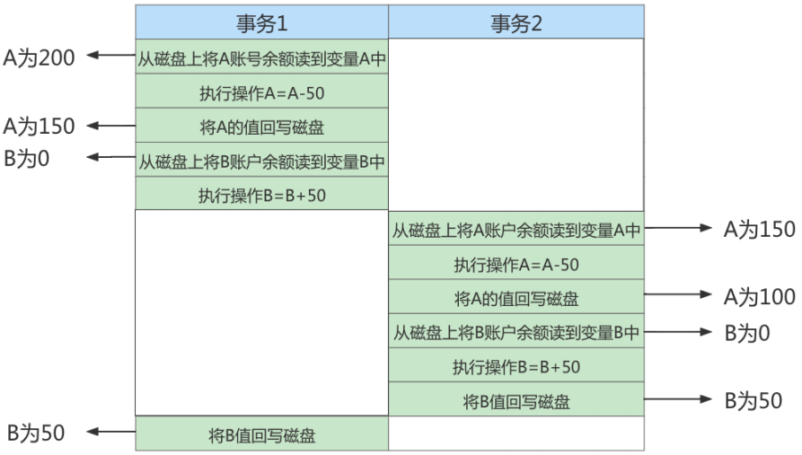

>可以联系 JUC 中的临界区的概念，为了避免各个线程都执行临界区的代码，必须加 Synchronized。

#### 持久性（Durability）

**`持久性`：是指一个事务一旦被提交，它对数据库中数据的改变就是`永久性`的 ，接下来的其他操作和数据库故障不应该对其有任何影响。**

持久性是通过`事务日志`来保证的，事务日志包括了`重做日志`和`回滚日志`。当我们通过事务对数据进行修改的时候，首先会将数据库的变化信息记录到重做日志中，然后再对数据库中对应的行进行修改。这样做的好处是，即使数据库系统崩溃，数据库重启后也能找到没有更新到数据库系统中的重做日志，重新执行，从而使事务具有持久性。

#### 小结

ACID 是事务的四大特性，在这四个特性中，`原子性是基础，隔离性是手段，一致性是约束条件，而持久性是目的。`

数据库事务，其实就是数据库设计者为了方便起见，把需要保证原子性、隔离性、一致性和持久性的一个或多个数据库操作称为一个事务。一句话，事务就是 ACID。

### 事物的状态

我们现在知道，事务是一个抽象的概念，它其实对应着一个或多个数据库操作，MySQL 根据这些操作所执行的不同阶段把事务大致划分成几个状态。

一个基本的状态转换图如下所示：

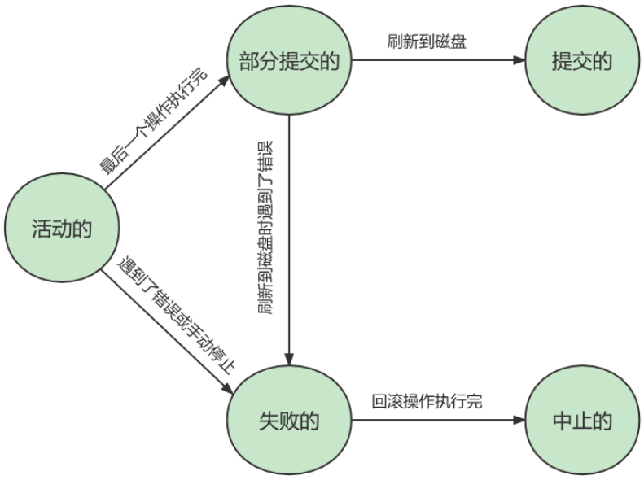

图中可见，只有当事务处于`提交的`或者`中止的`状态时，一个事务的生命周期才算是结束了。**对于已经提交的事务来说，该事务对数据库所做的修改将永久生效，对于处于中止状态的事务，该事务对数据库所做的所有修改被回滚到没执行该事务之前的状态。**

#### 活动的（active）

事务对应的数据库操作正在执行过程中时，就说该事务处在`活动的`状态。比如转账的事务（两条 DML）在执行。

#### 部分提交的（partially committed）

当事务中的最后一个操作执行完成，但由于操作都在内存中执行，所造成的影响并`没有刷新到磁盘`时，我们就说该事务处在`部分提交的`状态。比如转账的事务执行完成，但是还没有进行提交。

#### 失败的（failed）

当事务处在`活动的`或者`部分提交的`状态时，可能遇到了**某些错误**（数据库自身的错误、操作系统错误或者直接断电等）而无法继续执行，或者**人为的停止**当前事务的执行，就说该事务处在`失败的`状态。 比如正在转账时，银行突然断电了，事务就会被停止。

#### 中止的（aborted）

如果事务执行了一部分而变为`失败的`状态，那么就需要把已经修改的事务中的操作还原到事务执行前的状态。换句话说，就是要撤销失败事务对当前数据库造成的影响。把这个撤销的过程称之为`回滚`。当`回滚`操作执行完毕时，也就是数据库恢复到了执行事务之前的状态，就说该事务处在了`中止的`状态。比如当事务执行失败后，需要进行回滚，回滚完毕后的状态就是中止态。

#### 提交的（committed）

当一个处在`部分提交的`状态的事务将修改过的数据都`同步到磁盘`上之后，就可以说该事务处在了`提交的`状态。

## 如何使用事务

使用事务有两种方式，分别为`显式事务`和`隐式事务`。

### 显式事务

**事务的完成过程：**

- 步骤 1：开启事务。
- 步骤 2：一系列的 DML 操作。
- …
- 步骤 3：事务结束，表现为两种状态：提交的状态（COMMIT）、中止的状态（ROLLBACK）。

**步骤 1：`START TRANSACTION`或者`BEGIN`命令，显式开启一个事务。**

```mysql
BEGIN;

# 或者
START TRANSACTION;
```

- `START TRANSACTION`语句相较于`BEGIN`特别之处在于，后边能跟随几个`修饰符`：

  - `READ ONLY`：标识当前事务是一个`只读事务`，也就是属于该事务的数据库操作只能读取数据，而不能修改数据。
  - `READ WRITE`：标识当前事务是一个`读写事务`，也就是属于该事务的数据库操作既可以读取数据，也可以修改数据。
  - `WITH CONSISTENT SNAPSHOT`：启动`一致性读`。

- 示例：

  ```mysql
  START TRANSACTION READ ONLY; # 开启一个只读事务
  
  START TRANSACTION READ ONLY, WITH CONSISTENT SNAPSHOT; # 开启只读事务和一致性读
  
  START TRANSACTION READ WRITE,WITH CONSISTENT SNAPSHOT; # 开启读写事务和一致性读
  ```

>注意：
>
>- READ ONLY 和 READ WRITE 是用来设置所谓的事务访问模式的，就是以只读还是读写的方式来访问数据库中的数据。
>- 一个事务的访问模式不能同时既设置为只读的，又设置为读写的，所以不能同时把 READ ONLY 和 READ WRITE 放到 START TRANSACTION 语句后边。
>
>- **如果不显式指定事务的访问模式，那么该事务的访问模式就是`读写模式`。**

**步骤 2：一系列事务中的操作（主要是 DML，不含 DDL）。**

**步骤 3：提交事务或中止事务（即回滚事务）。**

```mysql
# 提交事务。当提交事务后，对数据库的修改是永久性的
COMMIT;

# 回滚事务。即撤销正在进行的所有没有提交的修改
ROLLBACK;

# 将事务回滚到某个保存点
ROLLBACK TO [SAVEPOINT]
```

其中关于`SAVEPOINT`相关操作有：

```mysql
# 在事务中创建保存点，方便后续针对保存点进行回滚。一个事务中可以存在多个保存点
SAVEPOINT 保存点名称;

# 删除某个保存点
RELEASE SAVEPOINT保存点名称;
```

### 隐式事务

MySQL 中有一个系统变量`autocommit`：

```mysql
mysql> SHOW VARIABLES LIKE 'autocommit';
+---------------+-------+
| Variable_name | Value |
+---------------+-------+
| autocommit    | ON    |
+---------------+-------+
1 row in set (0.01 sec)
```

默认情况下，如果不显式的使用`START TRANSACTION`或者`BEGIN`语句开启一个事务，那么每一条语句都算是一个独立的事务，这种特性称之为事务的`自动提交`。下边这两条语句就相当于放到两个独立的事务中去执行：

```mysql
# 假设此时 autocommit 是默认值 on
UPDATE account SET balance = balance - 10 WHERE id = 1; # 此时这条 DML 操作是一个独立的事务

UPDATE account SET balance = balance + 10 WHERE id = 2; # 此时这条 DML 操作是一个独立的事务
```

当然，如果想关闭这种自动提交的功能，可以使用下边两种方法之一：

- 显式的的使用`START TRANSACTION`或者`BEGIN`语句开启一个事务，这样在本次事务提交或者回滚前会暂时关闭掉自动提交的功能。

- 把系统变量`autocommit `的值设置为`OFF `。

  ```mysql
  SET autocommit = OFF;
  
  # 或
  SET autocommit = 0;
  ```

**关闭自动提交之后，写入的多条语句就算是属于同一个事务了。**直到我们显式的写出`COMMIT`语句来把这个事务提交掉，或者显式的写出`ROLLBACK`语句来把这个事务回滚掉。

> 补充：Oracle 默认不自动提交，需要手写 COMMIT 命令，而 MySQL 默认自动提交。

### 隐式提交数据的情况

- **使用数据定义语言**（Data definition language，缩写为 DDL）

  - 数据库对象，指的就是`数据库`、`表`、`视图`、`存储过程`等结构。当使用`CREATE `、`ALTER`、`DROP`等语句去修改数据库对象时，会隐式的提交前边语句所属于的事务。即：

    ```mysql
    BEGIN;
    
    SELECT ... # 事务中的一条语句
    UPDATE ... # 事务中的一条语句
    ...  # 事务中的其它语句
    
    CREATE TABLE ... # 此语句会隐式的提交前边语句所属于的事务
    ```

- **隐式使用或修改 MySQL 数据库中的表**

  - 当使用`ALTER USER`、`CREATE USER`、`DROP USER` 、`GRANT`、`RENAME USER`、`REVOKE`、`SET PASSWORD`等语句时，会隐式的提交前边语句所属于的事务。

- **事务控制或使用关于锁定的语句**

  - 当在一个事务还没提交或者回滚时，就又使用`START TRANSACTION`或者`BEGIN`语句开启了另一个事务时，会隐式的提交前边语句所属于的事务。即：

    ```mysql
    BEGIN;
    
    SELECT ... # 事务中的一条语句
    UPDATE ... # 事务中的一条语句
    ...       # 事务中的其它语句
    
    BEGIN;   # 此语句会隐式的提交前面语句所属于的事务
    ```

  - 当前的 autocommit 系统变量的值为 OFF ，我们手动把它调为`ON`时，会隐式的提交前边语句所属于的事务。

  - 使用`LOCK TABLES`、`UNLOCK TABLES`等关于锁定的语句，会隐式的提交前边语句所属于的事务。

- **使用加载数据的语句**

  - 使用`LOAD DATA`语句来批量往数据库中导入数据时，会隐式的提交前边语句所属于的事务。

- **使用 MySQL 复制的一些语句**

  - 使用`START SLAVE`、`STOP SLAVE`、`RESET SLAVE`、`CHANGE MASTER TO`等语句时，会隐式的提交前边语句所属于的事务。

- **使用其它的一些语句**

  - 使用`ANALYZE TABLE`、`CACHE INDEX`、`CHECK TABLE`、`FLUSH`、`LOAD INDEX INTO CACHE `、`OPTIMIZE TABLE`、`REPAIR TABLE`、`RESET `等语句时，会隐式的提交前边语句所属于的事务。

### 示例：提交与回滚

我们看下在 MySQL 的默认状态下，下面这个事务最后的处理结果是什么。

先创建 user3 表：

```mysql
mysql> USE atguigudb2;
Database changed

mysql> CREATE TABLE user3(NAME VARCHAR(15) PRIMARY KEY);
Query OK, 0 rows affected (0.03 sec)
```

**情况一：**

```mysql
mysql> BEGIN;
Query OK, 0 rows affected (0.00 sec)

mysql> INSERT INTO user3 VALUES('zhangsan'); # 此时不会自动提交数据
Query OK, 1 row affected (0.00 sec)

mysql> COMMIT;
Query OK, 0 rows affected (0.01 sec)

mysql> BEGIN;
Query OK, 0 rows affected (0.00 sec)

mysql> INSERT INTO user3 VALUES('lisi'); # 此时不会自动提交数据
Query OK, 1 row affected (0.00 sec)

mysql> INSERT INTO user3 VALUES('lisi'); # 受主键的影响，添加失败
ERROR 1062 (23000): Duplicate entry 'lisi' for key 'user3.PRIMARY'
mysql> ROLLBACK;
Query OK, 0 rows affected (0.00 sec)

mysql> SELECT * FROM user3;
+----------+
| NAME     |
+----------+
| zhangsan |
+----------+
1 row in set (0.00 sec)
```

**情况二：**

```mysql
mysql> TRUNCATE TABLE user3; # DDL 操作会自动提交数据，不受 autocommit 变量的影响
Query OK, 0 rows affected (0.04 sec)

mysql> BEGIN;
Query OK, 0 rows affected (0.00 sec)

mysql> INSERT INTO user3 VALUES('zhangsan'); # 此时不会自动提交数据
Query OK, 1 row affected (0.00 sec)

mysql> COMMIT;
Query OK, 0 rows affected (0.01 sec)

mysql> INSERT INTO user3 VALUES('lisi'); # 默认情况下（即 autocommit 为 true），DML 操作也会自动提交数据
Query OK, 1 row affected (0.00 sec)

mysql> INSERT INTO user3 VALUES('lisi'); # 事务的失败的状态
ERROR 1062 (23000): Duplicate entry 'lisi' for key 'user3.PRIMARY'
mysql> ROLLBACK;
Query OK, 0 rows affected (0.00 sec)

mysql> SELECT * FROM user3;
+----------+
| NAME     |
+----------+
| lisi     |
| zhangsan |
+----------+
2 rows in set (0.00 sec)
```

**情况三：**

```mysql
mysql> TRUNCATE TABLE user3; # DDL 操作会自动提交数据，不受 autocommit 变量的影响
Query OK, 0 rows affected (0.04 sec)

mysql> SELECT @@completion_type;
+-------------------+
| @@completion_type |
+-------------------+
| NO_CHAIN          |
+-------------------+
1 row in set (0.00 sec)

mysql> SET @@completion_type = 1;
Query OK, 0 rows affected (0.00 sec)

mysql> BEGIN;
Query OK, 0 rows affected (0.00 sec)

mysql> INSERT INTO user3 VALUES('zhangsan');
Query OK, 1 row affected (0.00 sec)

mysql> COMMIT;
Query OK, 0 rows affected (0.01 sec)

mysql> SELECT * FROM user3;
+----------+
| NAME     |
+----------+
| zhangsan |
+----------+
1 row in set (0.00 sec)

mysql> INSERT INTO user3 VALUES('lisi');
Query OK, 1 row affected (0.00 sec)

mysql> INSERT INTO user3 VALUES('lisi');
ERROR 1062 (23000): Duplicate entry 'lisi' for key 'user3.PRIMARY'
mysql> ROLLBACK;
Query OK, 0 rows affected (0.00 sec)

mysql> SELECT * FROM user3;
+----------+
| NAME     |
+----------+
| zhangsan |
+----------+
1 row in set (0.00 sec)
```

- 可以看到，相同的 SQL 代码，情况三只是在事务开始之前设置了`SET @@completion_type = 1`，但结果就和情况一的不一样，只有一个 "张三"。这是为什么呢？

这里讲解下 MySQL 中`completion_type`参数的作用，实际上这个参数有 3 种可能：

- `completion = 0`，这是`默认情况`。当执行 COMNIT 的时候会提交事务，在执行下一个事务时，还需要使用`START TRANSACTION`或者`BEGIN`来开启事务。
- `completion = 1`，这种情况下，当提交事务后，相当于执行了`COMMIT AND CHAIN`，也就是开启一个`链式事务`，即提交事务之后会开启一个相同隔离级别的事务。
- `completion = 2`，这种情况下，`CONMMIT = COMMIT AND RELEASE`，也就是提交后，会自动与服务器断开连接。

当我们设置 autocommit = 0 时，不论是否采用 START TRANSACTION 或者 BEGIN 的方式来开启事务，都需要用 COMMIT 进行提交，让事务生效，使用 ROLLBACK 对事务进行回滚。

当我们设置 autocommit = 1 时，每条 SQL 语句都会自动进行提交。不过这时，如果你采用 START TRANSACTION 或者 BEGIN 的方式来显式地开启事务，那么这个事务只有在 COMMIT 时才会生效，在 ROLLBACK 时才会回滚。

### 示例：测试不支持事务的 Engine

创建测试的表：

```mysql
mysql> CREATE TABLE test1(i INT) ENGINE = INNODB;
Query OK, 0 rows affected (0.03 sec)

mysql> CREATE TABLE test2(i INT) ENGINE = MYISAM;
Query OK, 0 rows affected (0.01 sec)
```

针对于 InnoDB 表，ROLLBACK 会生效：

```mysql
mysql> BEGIN;
Query OK, 0 rows affected (0.00 sec)

mysql> INSERT INTO test1 VALUES (1);
Query OK, 1 row affected (0.00 sec)

mysql> ROLLBACK;
Query OK, 0 rows affected (0.00 sec)

# 执行完，发现表为空，说明回滚成功
mysql> SELECT * FROM test1;
Empty set (0.00 sec)
```

针对于 MyISAM表，不支持事务，BEGIN、ROLLBACK 都会失效：

```mysql
mysql> BEGIN;
Query OK, 0 rows affected (0.00 sec)

mysql> INSERT INTO test2 VALUES (1);
Query OK, 1 row affected (0.00 sec)

mysql> ROLLBACK;
Query OK, 0 rows affected, 1 warning (0.00 sec)

# 执行完，发现表中有上面插入的记录，说明 MyISAM 不支持事务
mysql> SELECT * FROM test2;
+------+
| i    |
+------+
|    1 |
+------+
1 row in set (0.00 sec)
```

### 示例：SAVEPOINT

创建测试表，并简单测试：

```mysql
mysql> CREATE TABLE user4(name VARCHAR(15), balance DECIMAL(10, 2));
Query OK, 0 rows affected (0.03 sec)

mysql> BEGIN;
Query OK, 0 rows affected (0.01 sec)

mysql> INSERT INTO user4(name, balance) VALUES('zhangsan', 1000);
Query OK, 1 row affected (0.01 sec)

mysql> COMMIT;
Query OK, 0 rows affected (0.01 sec)

# 执行完，发现表中有上面插入的记录，说明默认创建的表是 InnoDB 的
mysql> SELECT * FROM user4;
+----------+---------+
| NAME     | balance |
+----------+---------+
| zhangsan | 1000.00 |
+----------+---------+
1 row in set (0.00 sec)
```

测试`SAVEPOINT`：

```mysql
# 开启事务
mysql> BEGIN;
Query OK, 0 rows affected (0.00 sec)

mysql> UPDATE user4 SET balance = balance - 100 WHERE name = 'zhangsan';
Query OK, 1 row affected (0.00 sec)
Rows matched: 1  Changed: 1  Warnings: 0

mysql> UPDATE user4 SET balance = balance - 100 WHERE name = 'zhangsan';
Query OK, 1 row affected (0.00 sec)
Rows matched: 1  Changed: 1  Warnings: 0

# 设置保存点（类似于虚拟机的快照）
mysql> SAVEPOINT s1;
Query OK, 0 rows affected (0.00 sec)

mysql> UPDATE user4 SET balance = balance + 1 WHERE name = 'zhangsan';
Query OK, 1 row affected (0.00 sec)
Rows matched: 1  Changed: 1  Warnings: 0

# 回滚到保存点
mysql> ROLLBACK TO s1;
Query OK, 0 rows affected (0.00 sec)

# 执行完，发现 balance=800，说明回滚到保存点 s1 成功
mysql> SELECT * FROM user4;
+----------+---------+
| NAME     | balance |
+----------+---------+
| zhangsan |  800.00 |
+----------+---------+
1 row in set (0.00 sec)

# 由于还没有 commit，所以可以对此次事务彻底回滚
mysql> ROLLBACK;
Query OK, 0 rows affected (0.00 sec)

# 执行完，发现 balance=1000，说明回滚成功
mysql> SELECT * FROM user4;
+----------+---------+
| NAME     | balance |
+----------+---------+
| zhangsan | 1000.00 |
+----------+---------+
1 row in set (0.00 sec)
```

## 事务隔离级别

MySQL 是一个`客户端／服务器`架构的软件，对于同一个服务器来说，可以有若干个客户端与之连接，每个客户端与服务器连接上之后，就可以称为一个会话（`Session`）。每个客户端都可以在自己的会话中向服务器发出请求语句，一个请求语句可能是某个事务的一部分，也就是对于服务器来说可能同时处理多个事务。事务有`隔离性`的特性，理论上在某个事务`对某个数据进行访问`时，其他事务应该进行`排队` ，当该事务提交之后，其他事务才可以继续访问这个数据。但是这样对`性能影响太大` ，我们既想保持事务的隔离性，又想让服务器在处理访问同一数据的多个事务时`性能尽量高些`，那就看二者如何权衡取舍了。

### 数据准备

```mysql
mysql> CREATE TABLE student (
    ->   studentno INT,
    ->   name VARCHAR(20),
    ->   class varchar(20),
    ->   PRIMARY KEY (studentno)
    -> ) Engine=InnoDB CHARSET=utf8;
Query OK, 0 rows affected, 1 warning (0.03 sec)

mysql> INSERT INTO student VALUES(1, 'xiaogu', '1 ban');
Query OK, 1 row affected (0.01 sec)

mysql> SELECT * FROM student;
+-----------+--------+-------+
| studentno | name   | class |
+-----------+--------+-------+
|         1 | xiaogu | 1 ban |
+-----------+--------+-------+
1 row in set (0.00 sec)
```

### 数据并发问题

针对事务的隔离性和并发性怎么做取舍呢？先看一下访问相同数据的事务在`不保证串行执行`（也就是执行完一个再执行另一个）的情况下可能会出现哪些问题。

#### 脏写（Dirty Write）

对于两个事务 Session A、Session B，如果事务 Session A`修改了`另一个`未提交`事务 Session B`修改过`的数据，那就意味着发生了**`脏写`**。

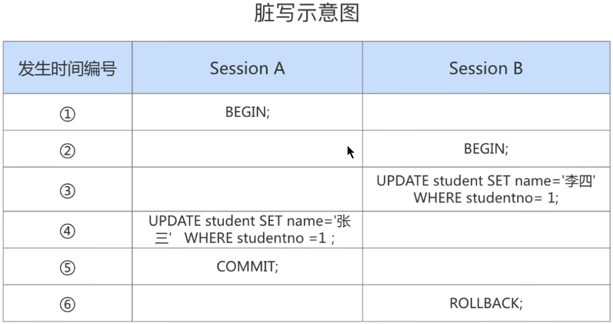

Session A 和 Session B 各开启了一个事务，Session B 中的事务先将 studentno 列为 1 的记录的 name 列更新为 "李四"，然后 Session A 中的事务接着又把这条 studentno 列为 1 的记录的 name 列更新为 "张三"。如果之后 Session B 中的事务进行了回滚，那么 Session A 中的更新也将不复存在，这科现象被称之为`脏写`。

这时，Session A 中的事务就没有效果了，明明把数据更新了，最后也提交事务了，最后看到的数据什么变化也没有。这里大家对事务的隔离级别比较了解的话，会发现默认隔离级别下，上面 Session A 中的更新语句会处于等待状态，这里只是跟大家说明一下会出现这样现象。

#### 脏读（Dirty Read）

对于两个事务 Session A、Session B，Session A`读取`了已经被 Session B`更新`但还`没有被提交`的字段。之后，如果 Session B`回滚`，Session A`读取`的内容就是`临时且无效`的。

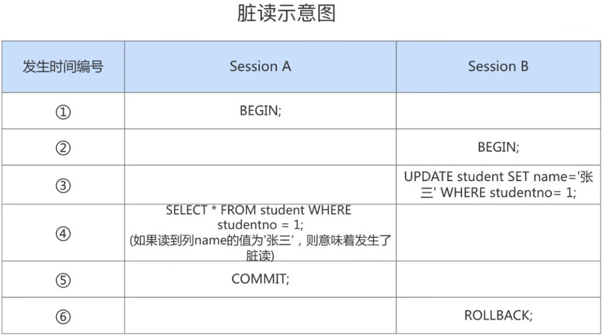

Session A 和 Session B 各开启了一个事务，Session B 中的事务先将 studentno 列为 1 的记录的 name 列更新为 "张三"，然后 Session A 中的事务再去查询这条 studentno 为 1 的记录，如果读到列 name 的值为 "张三"，而 Session B 中的事务稍后进行了回滚，那么 Session A 中的事务相当于读到了一个不存在的数据，这种现象被称之为`脏读`。

#### 不可重复读（Non-Repeatable Read）

对于两个事务 Session A、Session B，Session A`读取`了一个字段，然后 Session B`更新`了该字段。之后，如果 Session A`再次读取`同一个字段，` 值就不同`了，那就意味着发生了**`不可重复读`**。

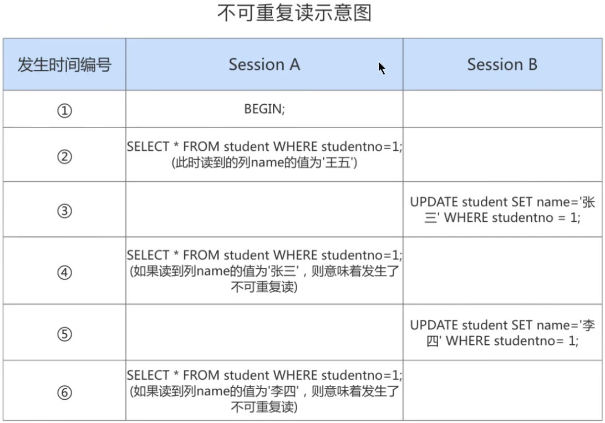

在 Session B 中提交了几个隐式事务（注意是隐式事务，意味着语句结束事务就提交了），这些事务都修改了 studentno 列为 1 的记录的列 name 的值，每次事务提交之后，如果 Session A 中的事务都可以查看到最新的值，这种现象被称之为`不可重复读`。

#### 幻读（Phantom）

对于两个事务 Session A、Session B，Session A 从一个表中`读取`了一个字段，然后 Session B 在该表中`插入`了一些新的行。之后，如果 Session A`再次读取` 同一个表，就会多出几行，那就意味着发生了**`幻读`**。

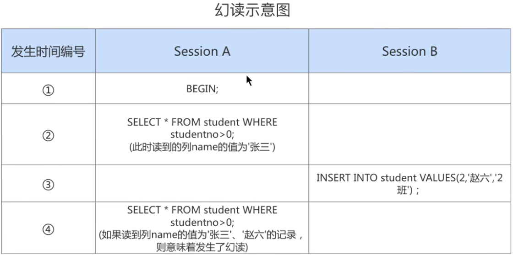

Session A 中的事务先根据 studentno > 0 这个条件查询表 student，得到了 name 列值为 "张三" 的记录；之后，Session B 中提交了一个隐式事务，该事务向表 student 中插入了一条新记录；之后，Session A 中的事务再根据相同的条件 studentno > 0 查询表 student，得到的结果集中包含 Session B 中的事务新插入的那条记录，这种现象被称之为`幻读` 。我们把新插入的那些记录称之为`幻影记录`。

>注意：
>
>- 如果 Session B 中删除了一些符合 studentno > 0 的记录而不是插入新记录，那 Session A 之后再根据 studentno > 0 的条件读取的记录变少了，这种现象`不属于幻读`，幻读强调的是`一个事务按照某个相同条件多次读取记录时，后续读取读到了之前没有读到的记录`。
>- 对于先前已经读到的记录，之后又读取不到这种情况，这相当于对每一条记录都发生了`不可重复读`的现象。幻读只是重点强调了读取到了之前读取没有获取到的记录。

### SQL 中的四种隔离级别

上面介绍了几种并发事务执行过程中可能遇到的一些问题，这些问题有轻重缓急之分，我们给这些问题按照严重性来排一下序：**`脏写 > 脏读 > 不可重复读 > 幻读`**。

我们愿意舍弃一部分隔离性来换取一部分性能在这里就体现在：**设立一些隔离级别，隔离级别越低，并发问题发生的就越多。** `SQL 标准`中设立了 4 个`隔离级别`：

- **`READ-UNCOMMITTED`**：**读未提交**，在该隔离级别，所有事务都可以看到其他未提交事务的执行结果。**可以避免脏写，但不能避免脏读、不可重复读、幻读。**
- **`READ-COMMITTED`**：**读已提交**，它满足了隔离的简单定义：一个事务只能看见已经提交事务所做的改变。这是大多数数据库系统的默认隔离级别（但不是 MySQL 默认的）。**可以避免脏写和脏读，但不能避免可重复读和幻读。**
- **`REPEATABLE-READ`**：**可重复读**，事务 A 在读到一条数据之后，此时事务 B 对该数据进行了修改并提交，那么事务 A 再读该数据，读到的还是原来的内容。**可以避免脏写、脏读和不可重复读，但不能避免幻读。**这是 MySQL 的默认隔离级别。
- **`SERIALIZABLE `**：**可串行化**，确保事务可以从一个表中读取相同的行。在这个事务持续期间，禁止其他事务对该表执行插入、更新和删除操作。**可以避免脏写、脏读、不可重复读和幻读，但性能十分低下。**

`SQL 标准`中规定，针对不同的隔离级别，并发事务可以发生不同严重程度的问题，具体情况如下：


- YES 表示没有解决。

>`脏写`怎么没涉及到？**因为脏写这个问题太严重了，不论是哪种隔离级别，都不允许脏写的情况发生。**

不同的隔离级别有不同的现象，并有不同的锁和并发机制，隔离级别越高，数据库的并发性能就越差，4 种事务隔离级别与并发性能的关系如下：

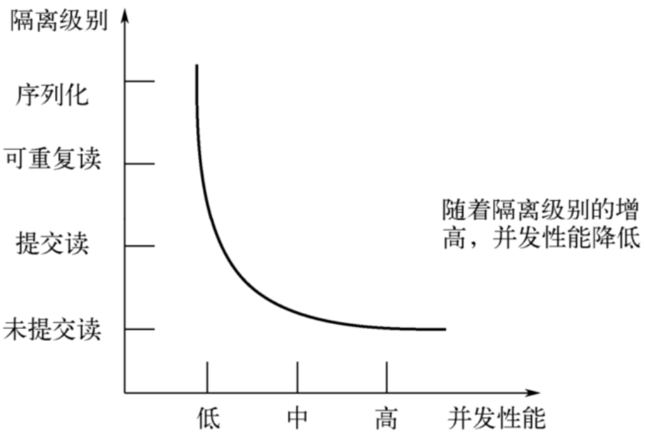

### MySQL 支持的四种隔离级别

不同的数据库厂商对 SQL 标准中规定的四种隔离级别支持不一样。比如，`Oracle 就只支持 READ-COMNITTED（默认隔离级别）和 SERIALIZABLE 隔离级别`。MySQL 虽然支持 4 种隔离级别，但与 SQL 标准中所规定的各级隔离级别允许发生的问题却有些出入，MySQL 在 REPEATABLE READ 隔离级别下，是可以禁止幻读问题的发生的，禁止幻读的原因在后面 "多版本并发控制" 章节讲解。

MySQL 的默认隔离级别为`REPEATABLE-READ`，可以手动修改一下事务的隔离级别：

```mysql
# MySQL 5.7.20 版本之后，引入 transaction_isolation 来替换 tx_isolation
mysql> SHOW VARIABLES LIKE 'transaction_isolation';
+-----------------------+-----------------+
| Variable_name         | Value           |
+-----------------------+-----------------+
| transaction_isolation | REPEATABLE-READ |
+-----------------------+-----------------+
1 row in set (0.01 sec)

# 或者不同 MySQL 版本中均可使用
mysql> SELECT @@transaction_isolation;
+-------------------------+
| @@transaction_isolation |
+-------------------------+
| REPEATABLE-READ         |
+-------------------------+
1 row in set (0.01 sec)
```

- MySQL 5.7.20 的版本之前，使用`SHOW VARIABLES LIKE 'tx_isolation';`命令查看隔离级别。

### 如何设置事务的隔离级别

**1. 通过下面的语句修改事务的隔离级别。**

```mysql
SET [GLOBAL|SESSION] TRANSACTION ISOLATION LEVEL <隔离级别>;

# 其中，隔离级别格式：
> READ-UNCOMMITTED
> READ-COMMITTED
> REPEATABLE-READ
> SERIALIZABLE
```

或者：

```mysql
SET [GLOBAL|SESSION] TRANSACTION_ISOLATION = '<隔离级别>'

#其中，隔离级别格式：
> READ-UNCOMMITTED
> READ-COMMITTED
> REPEATABLE-READ
> SERIALIZABLE
```

**2. 关于设置时使用 GLOBAL 或 SESSION 的影响。**

使用`GLOBAL`关键字（在全局范围影响）：

```mysql
SET GLOBAL TRANSACTION ISOLATION LEVEL SERIALIZABLE;
# 或
SET GLOBAL TRANSACTION_ISOLATION = 'SERIALIZABLE';
```

- 当前已经存在的会话无效。
- 只对执行完该语句之后产生的会话起作用。

使用`SESSION`关键字（在会话范围影响）：

```mysql
SET SESSION TRANSACTION ISOLATION LEVEL SERIALIZABLE;
# 或
SET SESSION TRANSACTION_ISOLATION = 'SERIALIZABLE';
```

- 对当前会话的所有后续的事务有效。
- 如果在事务之间执行，则对后续的事务有效。
- 该语句可以在已经开启的事务中间执行，但不会影响当前正在执行的事务。

如果在服务器启动时想改变事务的默认隔离级别，可以修改启动参数`TRANSACTION_ISOLATION`的值。比如，在启动服务器时指定了 "TRANSACTION_ISOLATION = 'SERIALIZABLE'"，那么事务的默认隔离级别就从原来的 REPEATABLE-READ 变成了 SERIALIZABLE。

>数据库规定了多种事务隔离级别，不同隔离级别对应不同的干扰程度，隔离级别越高，数据一致性就越好，但并发性越弱。

**3. 演示 GLOBAL。**

当前会话设置 "TRANSACTION_ISOLATION = 'SERIALIZABLE'"，当前会话隔离级别未变：

```mysql
mysql> SHOW VARIABLES LIKE 'transaction_isolation';
+-----------------------+-----------------+
| Variable_name         | Value           |
+-----------------------+-----------------+
| transaction_isolation | REPEATABLE-READ |
+-----------------------+-----------------+
1 row in set (0.00 sec)

mysql> SET GLOBAL TRANSACTION_ISOLATION = 'SERIALIZABLE';
Query OK, 0 rows affected (0.00 sec)

mysql> SHOW VARIABLES LIKE 'transaction_isolation';
+-----------------------+-----------------+
| Variable_name         | Value           |
+-----------------------+-----------------+
| transaction_isolation | REPEATABLE-READ |
+-----------------------+-----------------+
1 row in set (0.00 sec)
```

新会话隔离级别发生改变：

```mysql
mysql> SHOW VARIABLES LIKE 'transaction_isolation';
+-----------------------+--------------+
| Variable_name         | Value        |
+-----------------------+--------------+
| transaction_isolation | SERIALIZABLE |
+-----------------------+--------------+
1 row in set (0.00 sec)
```

把当前会话退出重新登陆后，隔离级别发生改变。

> MySQL 服务重启后，隔离级别又重新回到默认，因为设置的都是在内存级别的。

**4. 演示 SESSION。**

当前会话设置 "TRANSACTION_ISOLATION = 'SERIALIZABLE'"，当前会话隔离级别就发生了改变，其他会话也发生了改变。

```mysql
mysql> SHOW VARIABLES LIKE 'transaction_isolation';
+-----------------------+-----------------+
| Variable_name         | Value           |
+-----------------------+-----------------+
| transaction_isolation | REPEATABLE-READ |
+-----------------------+-----------------+
1 row in set (0.01 sec)

mysql> SET SESSION TRANSACTION_ISOLATION = 'SERIALIZABLE';
Query OK, 0 rows affected (0.01 sec)

mysql> SHOW VARIABLES LIKE 'transaction_isolation';
+-----------------------+--------------+
| Variable_name         | Value        |
+-----------------------+--------------+
| transaction_isolation | SERIALIZABLE |
+-----------------------+--------------+
1 row in set (0.01 sec)
```

### 不同隔离级别举例

创建数据表，并初始化数据：

```mysql
mysql> CREATE TABLE account(
    -> id INT PRIMARY KEY AUTO_INCREMENT,
    -> name VARCHAR(15),
    -> balance DECIMAL(15)
    -> );
Query OK, 0 rows affected (0.03 sec)

mysql> INSERT INTO account VALUES(1, 'zhangsan', '100'), (2, 'lisi', '0');
Query OK, 2 rows affected (0.01 sec)
Records: 2  Duplicates: 0  Warnings: 0
```

打开两个 Session，模拟两个事务，并将两个 Session 中的隔离级别都设置成 READ-UNCOMMITTED：

```mysql
mysql> SET SESSION TRANSACTION_ISOLATION = 'READ-UNCOMMITTED';
Query OK, 0 rows affected (0.00 sec)

mysql> SHOW VARIABLES LIKE 'transaction_isolation';
+-----------------------+------------------+
| Variable_name         | Value            |
+-----------------------+------------------+
| transaction_isolation | READ-UNCOMMITTED |
+-----------------------+------------------+
1 row in set (0.00 sec)
```

#### 演示 1：读未提交之脏读

案例一：

- 顺序 1：

  ```mysql
  # 事务 1 中更新数据，但是还没提交
  mysql> BEGIN;
  Query OK, 0 rows affected (0.00 sec)
  
  mysql> UPDATE account SET balance = balance + 100 WHERE id = 1;
  Query OK, 1 row affected (0.00 sec)
  Rows matched: 1  Changed: 1  Warnings: 0
  ```

- 顺序 2：

  ```mysql
  # 事务 2 中读取到了事务 1 还没提交的数据，出现了脏读
  mysql> SELECT * FROM account;
  +----+----------+---------+
  | id | name     | balance |
  +----+----------+---------+
  |  1 | zhangsan |     200 |
  |  2 | lisi     |       0 |
  +----+----------+---------+
  2 rows in set (0.00 sec)
  ```

- 顺序 3：

  ```mysql
  # 事务 1 回滚
  mysql> ROLLBACK;
  Query OK, 0 rows affected (0.01 sec)
  ```

- 顺序  4：

  ```mysql
  # 事务 2 读取的数据也变为之前的值
  mysql> SELECT * FROM account;
  +----+----------+---------+
  | id | name     | balance |
  +----+----------+---------+
  |  1 | zhangsan |     100 |
  |  2 | lisi     |       0 |
  +----+----------+---------+
  2 rows in set (0.00 sec)
  ```

案例二：

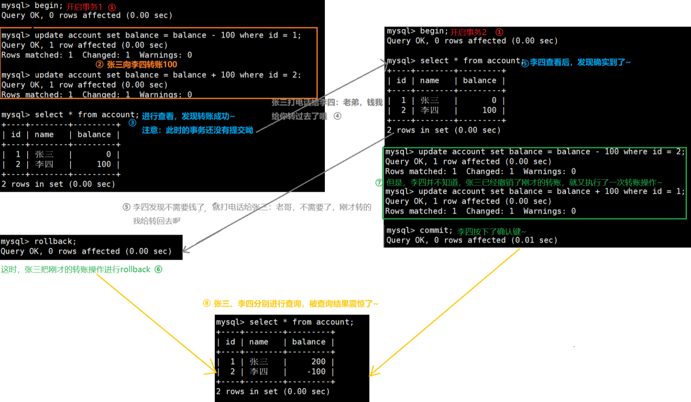

#### 演示 2：读已提交之不可重复读

环境准备：

```mysql
mysql> TRUNCATE TABLE account;
Query OK, 0 rows affected (0.02 sec)

mysql> INSERT INTO account VALUES(1, '张三', '100'), (2, '李四', '0');
Query OK, 2 rows affected (0.01 sec)
Records: 2  Duplicates: 0  Warnings: 0

mysql> SELECT * FROM account;
+----+--------+---------+
| id | name   | balance |
+----+--------+---------+
|  1 | 张三   |     100 |
|  2 | 李四   |       0 |
+----+--------+---------+
2 rows in set (0.01 sec)
```

将两个 Session 的隔离级别设置为 READ-COMMITTED：

```mysql
mysql> SET SESSION transaction_isolation = 'READ-COMMITTED';
Query OK, 0 rows affected (0.00 sec)

mysql> SELECT @@transaction_isolation;
+-------------------------+
| @@transaction_isolation |
+-------------------------+
| READ-COMMITTED          |
+-------------------------+
1 row in set (0.00 sec)
```

演示图解：

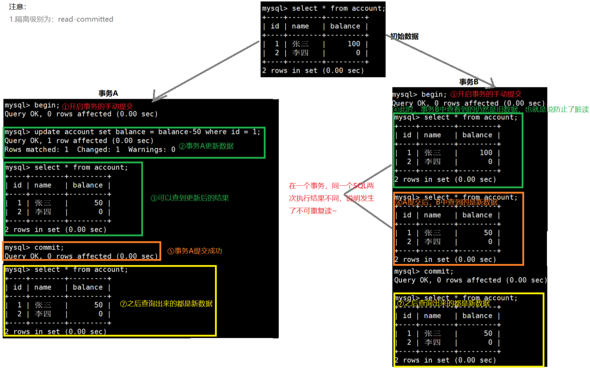

#### 演示 3：可重复读

将两个 Session 的隔离级别设置为 REPEATABLE-READ：

```mysql
mysql> SET SESSION transaction_isolation = 'REPEATABLE-READ';
Query OK, 0 rows affected (0.00 sec)

mysql> SELECT @@transaction_isolation;
+-------------------------+
| @@transaction_isolation |
+-------------------------+
| REPEATABLE-READ         |
+-------------------------+
1 row in set (0.00 sec)
```

演示图解：

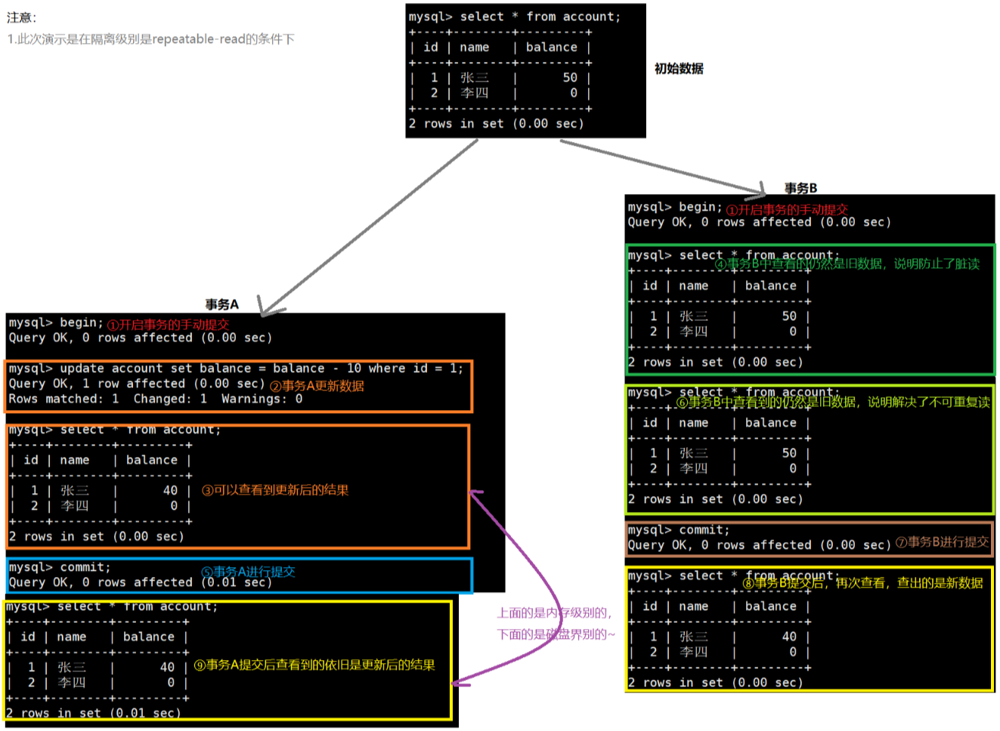

#### 演示 4：幻读

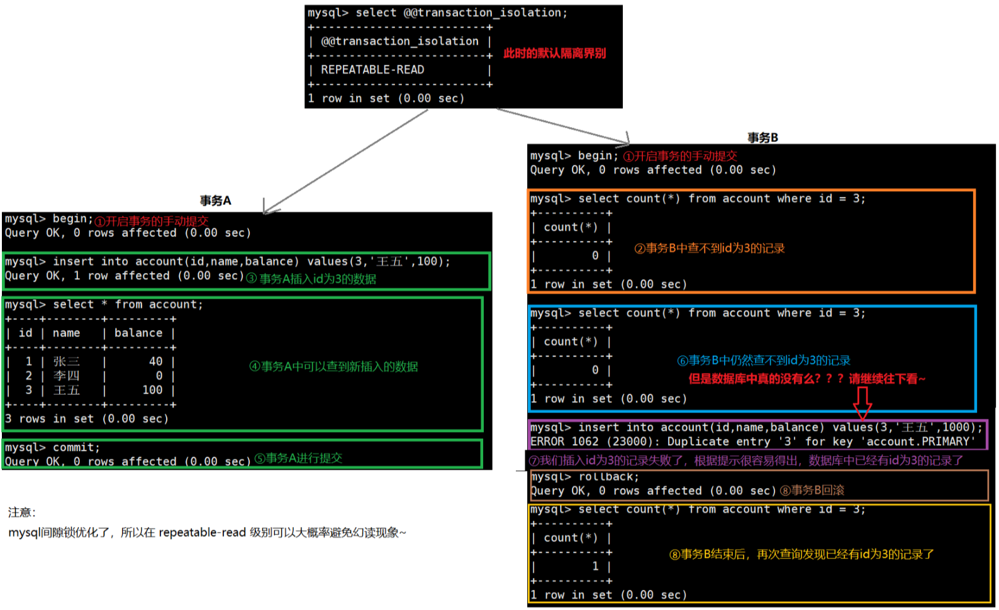

这里要灵活的理解读取的意思。第一次 SELECT 是读取，第二次的 INSERT 其实也属于隐式的读取，只不过是在 MySQL 的机制中读取的，**插入数据也是要先读取一下有没有主键冲突才能决定是否执行插入。**

**幻读，并不是说两次读取获取的结果集不同，幻读侧重的方面是某一次的 SELECT 操作得到的结果所表征的数据状态，无法支撑后续的业务操作。更为具体一些：SELECT 某记录是否存在，发现不存在，准备插入此记录，但执行 INSERT 时发现此记录已存在，无法插入，此时就发生了幻读（如上图所示）。**

在 REPEATABLE-READ 隔离级别下，step1、step2 是会正常执行的，step3 则会报错主键冲突，对于事务 B 的业务来说是执行失败的，这里事务 B 就是发生了幻读，因为事务 B 在 step1 中读取的数据状态并不能支撑后续的业务操作，事务 B："见鬼了，我刚才读到的结果应该可以支持我这样操作才对啊，为什么现在不可以？"事务 B 不敢相信的又执行了 step4，发现和 step1 读取的结果是一样的（REPEATABLE-READ下的 MVCC 机制)。此时，幻读无疑已经发生，事务 B 无论读取多少次，都查不到 id = 3 的记录，但它的确无法插入这条他通过读取来认定不存在的记录（此数据已被事务 A 插入)，对于事务 B 来说，它幻读了。

其实 REPEATABLE-READ（MySQL 默认隔离级别）也是可以避免幻读的，通过对 SELECT 操作手动加行 X 锁（独占锁）（SELECT … FOR UPDATE，这也正是 SERIALIZABLE 隔离级别下会隐式为你做的事情），同时，即便当前记录不存在，比如 id = 3 是不存在的，当前事务也会获得一把记录锁（因为 InnoDB 的行锁锁定的是索引，故记录实体存在与否没关系，存在就加`行 X 锁`，不存在就加`间隙锁`），他事务则无法插入此索引的记录，故杜绝了幻读。

在`SERIALIZABLE 隔离级别`下，step1 执行时，会隐式的添加`行（X）锁/gap（X）锁`的，从而 step2 会被阻塞，step3 会正常执行，待事务 1 提交后，事务 2 才能继续执行（主键冲突执行失败），对于事务 1 来说业务是正确的，成功的阻塞扼杀了扰乱业务的事务 2，对于事务 1 来说他前期读取的结果是可以支撑其后续业务的。

所以 MySQL 的幻读并非什么读取两次返回结果集不同，而是事务在插入事先检测不存在的记录时，惊奇的发现这些数据已经存在了，之前的检测读获取到的数据如同鬼影一般。

#### 演示 5：隔离级别是 SERIALIZABLE 时的效果

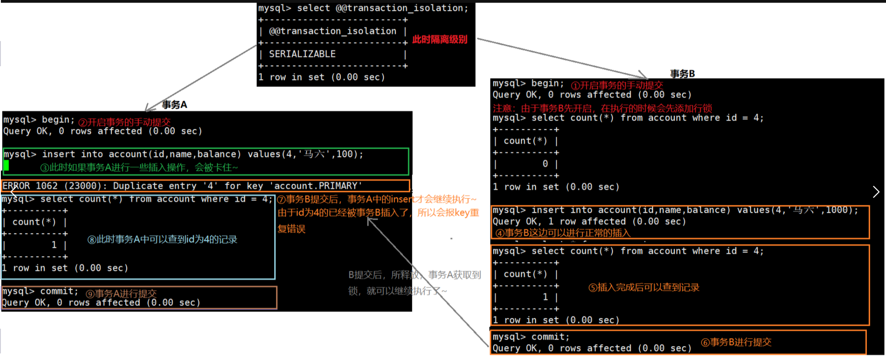

## 事务的常见分类

从事务理论的角度来看，可以把事务分为以下几种类型：

- 扁平事务（Flat Transactions）
- 带有保存点的扁平事务（Flat Transactions with Savepoints）
- 链事务（Chained Transactions）
- 嵌套事务（Nested Transactions）
- 分布式事务（Distributed Transactions）

下面简单介绍这几种类型：

- `扁平事务`：是事务类型中最简单的一种，但是在实际生产环境中，这可能是使用最频繁的事务。**在扁平事务中，所有操作都处于同一层次，其由 BEGIN WORK 开始，由 COMMIT WORK 或 ROLLBACK WORK 结束，其间的操作是原子的，要么都执行，要么都回滚。**因此，扁平事务是应用程序成为原子操作的基本组成模块。扁平事务虽然简单，但是在实际环境中使用最为频繁，也正因为其简单，使用频繁，故每个数据库系统都实现了对扁平事务的支持。**扁平事务的主要限制是不能提交或者回滚事务的某一部分，或分几个步骤提交。**扁平事务一般有三种不同的结果：

  - ① 事务成功完成。在平常应用中约占所有事务的 96%。
  - ② 应用程序要求停止事务。比如应用程序在捕获到异常时会回滚事务，约占事务的 3%。
  - ③ 外界因素强制终止事务。如连接超时或连接断开，约占所有事务的 1%。

- `带有保存点的扁平事务`：除了支持扁平事务支持的操作外，还允许在事务执行过程中回滚到同一事务中较早的一个状态。这是因为某些事务可能在执行过程中出现的错误并不会导致所有的操作都无效，放弃整个事务不合乎要求，开销太大。

  - `保存点 (Savepoint)`用来通知事务系统应该记住事务当前的状态，以便当之后发生错误时，事务能回到保存点当时的状态。对于扁平的事务来说，隐式的设置了一个保存点，然而在整个事务中，只有这一个保存点，因此，回滚只能会滚到事务开始时的状态。

- `链事务`：是指一个事务由多个子事务链式组成，它可以被视为保存点模式的一个变种。带有保存点的扁平事务，当发生系统崩溃时，所有的保存点都将消失，这意味着当进行恢复时，事务需要从开始处重新执行，而不能从最近的一个保存点继续执行。链事务的思想是：在提交一个事务时，释放不需要的数据对象，将必要的处理上下文隐式地传给下一个要开始的事务，前一个子事务的提交操作和下一个子事务的开始操作合并成一个原子操作，这意味着下一个事务将看到上一个事务的结果，就好像在一个事务中进行一样。这样，**在提交子事务时就可以释放不需要的数据对象，而不必等到整个事务完成后才释放**。其工作方式如下：

  

  - 链事务与带有保存点的扁平事务的不同之处体现在：

    - 带有保存点的扁平事务能回滚到任意正确的保存点，而链事务中的回滚仅限于当前事务，即只能恢复到最近的一个保存点。

    - 对于锁的处理，两者也不相同，链事务在执行 COMMIT 后即释放了当前所持有的锁，而带有保存点的扁平事务不影响迄今为止所持有的锁。

- `嵌套事务`：是个层次结构框架，由一个顶层事务（Top-Level Transaction）控制着各个层次的事务，顶层事务之下嵌套的事务被称为子事务（Subtransaction），其控制着每一个局部的变换，子事务本身也可以是嵌套事务。因此，嵌套事务的层次结构可以看成是一棵树。

- `分布式事务`：通常是在一个分布式环境下运行的扁平事务，因此，需要根据数据所在位置访问网络中不同节点的数据库资源。例如，一个银行用户从招商银行的账户向工商银行的账户转账 1000 元，这里需要用到分布式事务，因为不能仅调用某一家银行的数据库就完成任务。

## 原文链接

https://github.com/ACatSmiling/zero-to-zero/blob/main/RelationalDatabase/mysql-advanced.md