>*`Author: ACatSmiling`*
>
>*`Since: 2024-09-21`*

`锁`是计算机协调多个进程或线程并发访问某一资源的机制。在程序开发中会存在多线程同步的问题，当多个线程并发访问某个数据的时候，尤其是针对一些敏感的数据（比如订单、金额等)，就需要保证这个数据在任何时刻最多只有一个线程在访问，保证数据的完整性和一致性。在开发过程中加锁是为了保证数据的一致性，这个思想在数据库领域中同样很重要。

在数据库中，除传统的计算资源（如 CPU、RAM、I/O 等）的争用以外，数据也是一种供许多用户共享的资源。**为保证数据的一致性，需要对并发操作进行控制，因此产生了锁。同时，锁机制也为实现 MySQL 的各个隔离级别提供了保证。**锁冲突也是影响数据库并发访问性能的一个重要因素。所以锁对数据库而言显得尤其重要，也更加复杂。

## MySQL 并发事务访问相同记录

MySQL 并发事务访问相同记录的情况,大致可以划分为三种：

1. 读-读
2. 写-写
3. 读-写或写-读

### 读-读

`读-读`，即**并发事务相继读取相同的记录**。读取操作本身不会对记录有任何影响，并不会引起什么问题，所以`允许`这种情况的发生。

### 写-写

`写-写`，即**并发事务相继对相同的记录做出改动**。

在这种情况下会发生`脏写`的问题，任何一种隔离级别都不允许这种问题的发生。所以在多个未提交事务相继对一条记录做改动时，需要让它们`排队执行`，这个排队的过程其实是通过锁来实现的。这个所谓的锁其实是一个内存中的结构，在事务执行前本来是没有锁的，也就是说一开始是没有锁结构和记录进行关联的，如图所示：


当一个事务想对这条记录做改动时，首先会看看内存中有没有与这条记录关联的锁结构，当没有的时候就会在内存中生成一个锁结构与之关联。比如，事务`T1`要对这条记录做改动，就需要生成一个锁结构与之关联：


在锁结构里有很多信息，为了简化理解，只把两个比较重要的属性拿了出来:

- `trx 信息`：**代表这个锁结构是哪个事务生成的。**
- `is_waiting`：**代表当前事务是否在等待。**

当事务 T1 改动了这条记录后，就生成了一个锁结构与该记录关联，因为之前没有别的事务为这条记录加锁，所以 is_waiting 属性就是 false，把这个场景就称之为获取锁成功，或者加锁成功，然后就可以继续执行操作了。

在事务 T1 提交之前，另一个事务`T2`也想对该记录做改动，那么先看看有没有锁结构与这条记录关联，发现有一个锁结构与之关联后，然后也生成了一个锁结构与这条记录关联，不过锁结构的 is_waiting 属性值为 true，表示当前事务需要等待，把这个场景就称之为获取锁失败，或者加锁失败。如图所示：

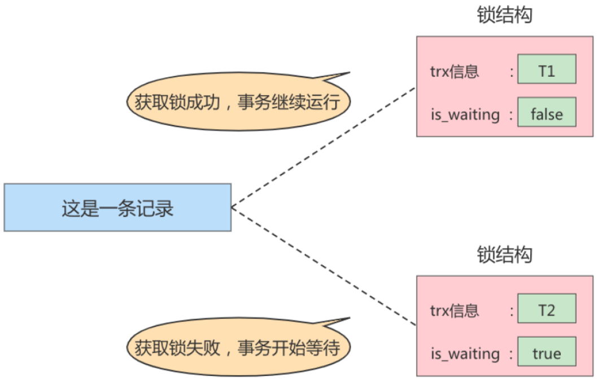

在事务 T1 提交之后，就会把该事务生成的锁结构释放掉，然后看看还有没有别的事务在等待获取锁，发现了事务 T2 还在等待获取锁，所以把事务 T2 对应的锁结构的 is_waiting 属性设置为 false，然后把该事务对应的线程唤醒，让它继续执行，此时事务 T2 就算获取到锁了。效果图就是这样：


小结几种说法:

- `不加锁`：意思就是不需要在内存中生成对应的锁结构，可以直接执行操作。
- `获取锁成功，或者加锁成功`：意思就是在内存中生成了对应的锁结构，而且锁结构的 is_waiting 属性为 false，也就是事务可以继续执行操作。
- `获取锁失败，或者加锁失败，或者没有获取到锁`：意思就是在内存中生成了对应的锁结构，不过锁结构的 is_waiting 属性为 true，也就是事务需要等待，不可以继续执行操作。

### 读-写或写-读

`读-写`或者`写-读`，即一个事务进行读取操作，另一个进行改动操作，这种情况下可能发生`脏读`、`不可重复读`、`幻读`的问题。

> 各个数据库厂商对 SQL 标准的支持都可能不一样，比如 **MySQL 在`REPEATABLE READ`隔离级别上就已经解决了幻读的问题**。

那么，怎么解决脏读、不可重复读、幻读这些问题呢？ 其实有两种可选的解决方案：

**`方案一：读操作利用多版本并发控制 MVCC，写操作进行加锁。`**

**所谓的 MVCC，就是生成一个 ReadView，通过 ReadView 找到符合条件的记录版本（历史版本由 undo 日志构建）。**查询语句只能读到在生成 ReadView 之前已提交事务所做的更改，在生成 ReadView 之前未提交的事务或者之后才开启的事务所做的更改是看不到的。而写操作肯定针对的是最新版本的记录，读记录的历史版本和改动记录的最新版本本身并不冲突，也就是采用 MVCC 时，读-写操作并不冲突。

>普通的 SELECT 语句在 READ COMMITTED 和 REPEATABLE READ 隔离级别下会使用到 MVCC 读取记录。
>
>- 在`READ COMMITTED`隔离级别下，一个事务在执行过程中，**每次执行 SELECT 操作时都会生成一个 ReadView**，ReadView 的存在本身就保证了事务不可以读取到未提交的事务所做的更改，也就是避免了脏读现象。
>- 在`REPEATABLE READ`隔离级别下，一个事务在执行过程中，**只有第一次执行 SELECT 操作才会生成一个 ReadView**，之后的 SELECT 操作都复用这个 ReadView，这样也就避免了不可重复读 和幻读的问题。

**`方案二：读、写操作都采用加锁的方式。`**

如果我们的一些业务场景不允许读取记录的旧版本，而是每次都必须去读取记录的最新版本。比如，在银行存款的事务中，你需要先把账户的余额读出来，然后将其加上本次存款的数额，最后再写到数据库中。在将账户余额读取出来后，就不想让别的事务再访问该余额，直到本次存款事务执行完成，其他事务才可以访问账户的余额。这样在读取记录的时候就需要对其进行加锁操作，这样也就意味着读操作和写操作也像写-写操作那样排队执行。

- 脏读问题的产生，是因为当前事务读取了另一个未提交事务写的一条记录，如果另一个事务在写记录的时候就给这条记录加锁，那么当前事务就无法继续读取该记录了，所以也就不会有脏读问题的产生了。
- 不可重复读问题的产生，是因为当前事务先读取一条记录，另外一个事务对该记录做了改动之后并提交之后，当前事务再次读取时会获得不同的值，如果在当前事务读取记录时就给该记录加锁，那么另一个事务就无法修改该记录，自然也不会发生不可重复读了。
- 幻读问题的产生，是因为当前事务读取了一个范围的记录，然后另外的事务向该范围内插入了新记录，当前事务再次读取该范围的记录时发现了新插入的新记录。采用加锁的方式解决幻读问题就有一些麻烦，因为当前事务在第一次读取记录时幻影记录并不存在，所以读取的时候加锁就有点尴尬（因为并不知道给谁加锁）。

小结对比发现：

- **采用 MVCC 方式的话，读-写操作彼此并不冲突，性能更高。**
- **采用加锁方式的话，读-写操作彼此需要排队执行，影响性能。**

一般情况下当然愿意采用 MVCC 来解决读-写操作并发执行的问题，但是业务在某些特殊情况下，要求必须采用加锁的方式执行。下面就讲解下 MySQL 中不同类别的锁。

## 锁的分类

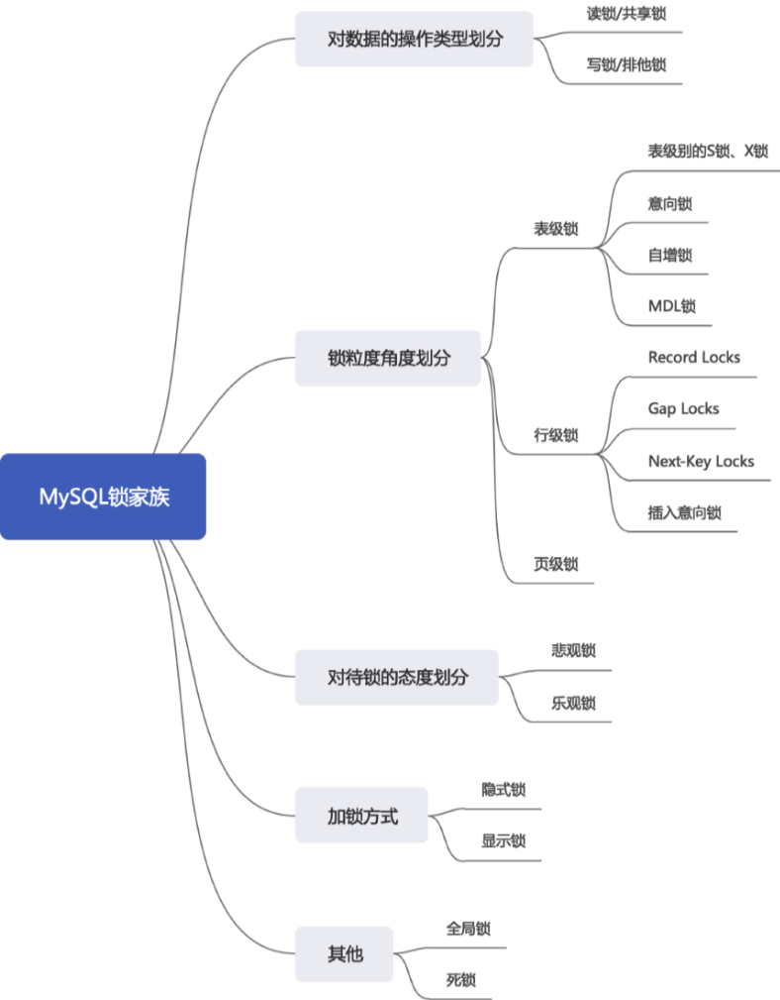

### 按数据操作的类型划分：读锁、写锁

对于数据库中并发事务的读-读情况并不会引起什么问题，对于写-写、读-写或写-读这些情况可能会引起一些问题，需要使用 MVCC 或者加锁的方式来解决它们。在使用加锁的方式解决问题时，由于既要允许读-读情况不受影响，又要使写-写、读-写或写-读情况中的操作相互阻塞，所以 MySQL 实现一个由两种类型的锁组成的锁系统来解决。这两种类型的锁，通常被称为`共享锁（Shared Lock，S Lock）和排他锁（Exclusive Lock，X Lock）`，也叫`读锁（Read Lock）和写锁（Write Lock）`。

- **读锁：也称为共享锁、英文用 S 表示。**针对同一份数据，多个事务的读操作可以同时进行而不会互相影响，相互不阻塞的。
- **写锁：也称为排他锁、英文用 X 表示。**当前写操作没有完成前，它会阻断其他写锁和读锁。这样就能确保在给定的时间里，只有一个事务能执行写入，并防止其他用户读取正在写入的同一资源。
- **举例（行级读写锁)︰** 如果一个事务 T1 已经获得了某个行 r 的读锁，那么此时另外的一个事务 T2 是可以再去获得这个行 r 的读锁的，因为读取操作并没有改变行 r 的数据。但是，如果某个事务 T3 想获得行 r 的写锁，则它必须等待事务 T1、T2 释放掉行 r 上的读锁才行。

> 注意：对于 InnoDB 引擎来说，读锁和写锁即可以加在表上，也可以加在行上。

`锁的兼容情况`（这里的兼容是指对同一张表或同一个记录的锁的兼容性情况）：

| 兼容情况 | X 锁   | S 锁   |
| -------- | ------ | ------ |
| X 锁     | 不兼容 | 不兼容 |
| S 锁     | 不兼容 | 兼容   |

#### 锁定读

在采用加锁方式解决脏读、不可重复读、幻读这些问题时，读取一条记录时需要获取该记录的 S 锁，其实是不严谨的，有时候需要在读取记录时就获取记录的 X 锁 ，来禁止别的事务读写该记录，为此 MySQL 提出了两种比较特殊的 SELECT 语句格式：

1. 对读取的记录加 S 锁∶

   ```mysql
   SELECT ... LOCK IN SHARE MODE
   # 或
   SELECT ... FOR SHARE # 8.0 新增语法
   ```

   - 在普通的 SELECT 语句后边加 LOCK IN SHARE MODE，如果当前事务执行了该语句，那么它会为读取到的记录加 S 锁，这样允许别的事务继续获取这些记录的 S 锁（比方说别的事务也使用 SELECT … LOCK IN SHARE MODE 语句来读取这些记录），但是不能获取这些记录的 X 锁（比如使用 SELECT … FOR UPDATE 语句来读取这些记录，或者直接修改这些记录）。**如果别的事务想要获取这些记录的 X 锁，那么它们会阻塞，直到当前事务提交之后将这些记录上的 S 锁释放掉。**

2. 对读取的记录加 X 锁：

   ```mysql
   SELECT ... FOR UPDATE
   ```

   - 在普通的 SELECT 语句后边加 FOR UPDATE，如果当前事务执行了该语句，那么它会为读取到的记录加 X 锁，这样既不允许别的事务获取这些记录的 S 锁（比方说别的事务使用 SELECT … LOCK IN SHARE MODE 语句来读取这些记录），也不允许获取这些记录的 X 锁（比如使用 SELECT … FOR UPDATE 语句来读取这些记录，或者直接修改这些记录)。**如果别的事务想要获取这些记录的 S 锁或者 X 锁，那么它们会阻塞，直到当前事务提交之后将这些记录上的 X 锁释放掉。**

**案例演示：**

- S ---> S：事务 A 先获取 account 表的 S 锁，此时，事务 B 也可以正常获得 account 表的 S 锁，并读取记录。

  

- S ---> X：事务 A 先获取 account 表的 S 锁，此时，事务 B 无法获取 account 表的 X 锁，被阻塞，直到事务 A 提交，事务 B 才可以正常获取 account 表的 X 锁。

  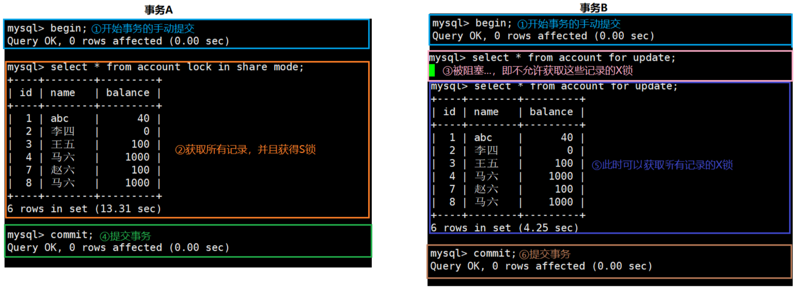

- X ---> S：事务 A 先获取 account 表的 X 锁，此时，事务 B 无法获取 account 表的 S 锁，被阻塞，直到事务 A 提交，事务 B 才可以正常获取 account 表的 S 锁。

  

- X ---> X：事务 A 先获取 account 表的 X 锁，此时，事务 B 无法获取 account 表的 X 锁，被阻塞，直到事务 A 提交，事务 B 才可以正常获取 account 表的 X 锁。

  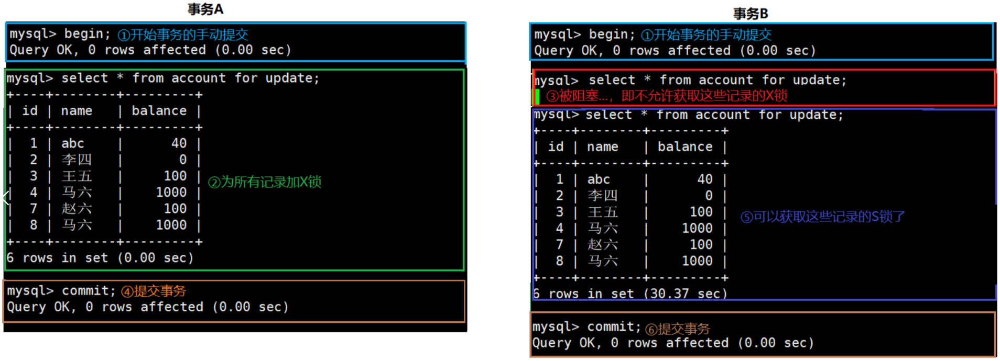

>在 MySQL 5.7 及之前的版本，SELECT … FOR UPDATE，如果获取不到锁，会一直等待，直到 innodb_lock_wait_timeout 超时。在 MySQL 8.0 版本中，在 SELECT … FOR UPDATE，SELECT … FOR SHARE 后添加`NOWAIT`、`SKIP LOCKED`语法，可以跳过锁等待，或者跳过锁定。
>
>如果查询的行已经加锁：
>
>- **那么 NOWAIT 会立即报错返回。**
>- **而 SKIP LOCKED 也会立即返回，只是返回的结果中不包含被锁定的行。**
>
>演示：
>
>```mysql
># 事务 A，开启事务，先获取 X 锁
>mysql> begin ;
>mysql> select * from account for update;
>+-- --+--------+- ------ +
>| id  |    NAME|  balance|
>|   1 │     张三|    40.00|
>|   2 |     李四|    0.00 |
>|   3 |     王五|   100.00|
>+--- -+--------+- ------ +
>
># 事务 B
>mysql> begin ;
>mysql> select * from account for update nowait;
># 报错返回
>ERROR 3572 (HYO00): Statement aborted because lock(s) could not be acquired immediately and NOMAIT is set.
>
>mysql> select * from account for update skip locked;
># 因为事务 A 获得 X 锁，所以查到的记录是空的
>Empty set (o.00 sec)
>
>mysql> commit;
>Query Ok,o rows affected (0.00 sec)
>```

#### 写操作

平常所用到的写操作无非是 DELETE、UPDATE、INSERT 这三种：

- `DELETE`：对一条记录做 DELETE 操作的过程，其实是先在 B+ 树中定位到这条记录的位置，然后获取这条记录的 X 锁，再执行 delete mark 操作。也可以把这个定位待删除记录在 B+ 树中位置的过程，看成是一个获取 X 锁的锁定读。
- `UPDATE`：在对一条记录做 UPDATE 操作时，分为三种情况。
  - 情况 1：**未修改该记录的键值（例如主键），并且被更新的列占用的存储空间在修改前后未发生变化。**则先在 B+ 树中定位到这条记录的位置，然后再获取一下记录的 X 锁，最后在原记录的位置进行修改操作。也可以把这个定位待修改记录在 B+ 树中位置的过程，看成是一个获取 X 锁的锁定读。
  - 情况 2：**未修改该记录的键值，并且至少有一个被更新的列占用的存储空间在修改前后发生变化。**则先在 B+ 树中定位到这条记录的位置，然后再获取一下记录的 X 锁，将该记录彻底删除掉（就是把记录彻底移入垃圾链表)，最后再插入一条新记录。这个定位待修改记录在 B+ 树中位置的过程，看成是一个获取 X 锁的锁定读，新插入的记录由 INSERT 操作提供的隐式锁进行保护。
  - 情况 3：**修改了该记录的键值。**则相当于在原记录上做 DELETE 操作之后再来一次 INSERT 操作，加锁操作就需要按照 DELETE 和 INSERT 的规则进行。（同情况 2）
- `INSERT`：一般情况下，新插入一条记录的操作并不加锁，通过一种称之为`隐式锁`的结构，来保护这条新插入的记录在本事务提交前不被别的事务访问。（因为插入之前就没有要锁的记录，所以也就不需要加 X 锁了）

### 按数据操作的粒度划分：表级锁、页级锁、行锁

为了尽可能提高数据库的并发度，每次锁定的数据范围越小越好，理论上每次只锁定当前操作的数据的方案会得到最大的并发度，但是管理锁是很耗资源的事情（涉及获取、检查、释放锁等动作）。因此数据库系统需要在`高并发响应`和`系统性能`两方面进行平衡，这样就产生了`锁粒度（Lock granularity）`的概念。

**对一条记录加锁影响的也只是这条记录而已，我们就说这个锁的粒度比较细；其实一个事务也可以在表级别进行加锁，自然就被称之为表级锁或者表锁，对一个表加锁影响整个表中的记录，我们就说这个锁的粒度比较粗。**锁的粒度主要分为`表级锁`、`页级锁`和`行锁`。

#### 表锁（Table Lock）

**`表锁`会锁定整张表，它是 MySQL 中最基本的锁策略，并不依赖于存储引擎（不管是 MySQL 的什么存储引擎，对于表锁的策略都是一样的），并且表锁是开销最小的策略（因为粒度比较大）。由于表级锁一次会将整个表锁定，所以可以很好的避免死锁问题。当然，锁的粒度大所带来最大的负面影响就是出现锁资源争用的概率也会最高，导致并发率大打折扣。**

##### 表级别的 S 锁和 X 锁

在对某个表执行 SELECT、INSERT、DELETE、UPDATE 语句时，InnoDB 存储引擎是不会为这个表添加表级别的 S 锁或者 X 锁的。在对某个表执行一些诸如 ALTER TABLE、DROP TABLE 这类的 DDL 语句时，其他事务对这个表并发执行诸如 SELECT、INSERT、DELETE、UPDATE 的语句会发生阻塞。同理，某个事务中对某个表执行 SELECT、INSERT、DELETE、UPDATE 语句时，在其他会话中对这个表执行 DDL 语句也会发生阻塞。这个过程其实是通过在 Server 层使用一种称之为`元数据锁（Metadata Locks，简称 MDL）`的结构来实现的。

**一般情况下，不会使用 InnoDB 存储引擎提供的表级别的 S 锁和 X 锁（因为 InnoDB 支持更小粒度的行锁），只会在一些特殊情况下，比方说崩溃恢复过程中用到。**比如，在系统变量 autocommit=0，innodb_table_locks = 1 时，`手动`获取 InnoDB 存储引擎提供的表 t 的 S 锁或者 X 锁，可以这么写：

- `LOCK TABLES t READ`：InnoDB 存储引擎会对表 t 加表级别的 S 锁 。
- `LOCK TABLES t WRITE`：InnoDB 存储引擎会对表 t 加表级别的 X 锁 。

> 尽量避免在使用 InnoDB 存储引擎的表上使用 LOCK TABLES 这样的手动锁表语句，它们并不会提供什么额外的保护，只是会降低并发能力而已。InnoDB 的厉害之处还是实现了更细粒度的`行锁`，关于 InnoDB 表级别的 S 锁和 X 锁，大家了解一下就可以了。

**举例：下面我们讲解 MyISAM 引擎下的表锁。**

- 步骤 1：创建表并添加数据。

  ```mysql
  CREATE TABLE mylock(
  id INT NOT NULL PRIMARY KEY auto_increment,NAME VARCHAR(20)
  )ENGINE myisam; # 存储引擎也可以使用 InnoDB，只是不建议
  
  # 插入一条数据
  INSERT INTO mylock(NAME) VALUES('a');
  
  # 查询表中所有的数据
  SELECT * FROM mylock;
  +----+------+
  | id | NAME |
  +----+------+
  |  1 | a    |
  +----+------+
  ```

- 步骤 2：查看表上加过的锁。

  ```mysql
  SHOW OPEN TABLES WHERE In_use > 0;
  # 或者
  SHOW OPEN TABLES; # 主要关注 In_use 字段的值 > 0
  
  SHOW OPEN TABLES; # 以下为部分输出，没有 In_use>0 的记录，表明当前数据库中没有被锁定的表
  +--------------------+---------------------------+--------+-------------+
  | Database           | Table                     | In_use | Name_locked |
  +--------------------+---------------------------+--------+-------------+
  | atguigudb3         | user1                     |      0 |           0 |
  | mysql              | tablespace_files          |      0 |           0 |
  | mysql              | column_statistics         |      0 |           0 |
  | atguigudb3         | account                   |      0 |           0 |
  | mysql              | table_stats               |      0 |           0 |
  | mysql              | check_constraints         |      0 |           0 |
  | mysql              | view_table_usage          |      0 |           0 |
  | mysql              | tables_priv               |      0 |           0 |
  | mysql              | column_type_elements      |      0 |           0 |
  | mysql              | foreign_key_column_usage  |      0 |           0 |
  | mysql              | time_zone_name            |      0 |           0 |
  .........................................................................
  | information_schema | TABLES                    |      0 |           0 |
  | mysql              | time_zone_transition_type |      0 |           0 |
  | mysql              | tablespaces               |      0 |           0 |
  +--------------------+---------------------------+--------+-------------+
  61 rows in set (0.01 sec)
  ```

- 步骤 3：手动增加表锁命令。

  ```mysql
  LOCK TABLES t READ: # 存储引擎会对表 t 加表级别的共享锁。共享锁也叫读锁或 S 锁，Share 的缩写
  LOCK TABLES t WRITE; # 存储引擎会对表 t 加表级别的排他锁。排它锁也叫独占锁、写锁或 X 锁，是 eXclusive 的缩写
  ```

  ```mysql
  # 示例
  mysql> LOCK TABLES mylock READ;
  Query OK, 0 rows affected (0.00 sec)
  
  mysql> SHOW OPEN TABLES WHERE In_use > 0;
  +----------------+--------+--------+-------------+
  | Database       | Table  | In_use | Name_locked |
  +----------------+--------+--------+-------------+
  | platform_basic | mylock |      1 |           0 |
  +----------------+--------+--------+-------------+
  1 row in set (0.00 sec)
  ```

- 步骤 4：释放锁。

  ```mysql
  # 释放锁
  UNLOCK TABLES; # 释放当前加锁的表
  ```

- 步骤 5：加读锁。为 mylock 表加 READ 锁（读阻塞写），观察阻塞的情况，流程如下：

  

  ```mysql
  ########################SessonA中########################################
  mysql> begin;
  Query OK, 0 rows affected (0.00 sec)
  
  mysql> lock tables mylock read; # 事务 A 为表加上读锁
  Query OK, 0 rows affected (0.00 sec)
  
  mysql> select * from mylock; # 事务 A 可读
  +----+------+
  | id | NAME |
  +----+------+
  |  1 | a    |
  +----+------+
  1 row in set (0.00 sec)
  
  mysql> update mylock set name = 'a1' where id = 1; # 事务 A 不可写
  ERROR 1099 (HY000): Table 'mylock' was locked with a READ lock and can't be updated
  
  mysql> select * from account; # 事务 A 不可操作其他表
  ERROR 1100 (HY000): Table 'account' was not locked with LOCK TABLES
  
  ##################################sessionB###############################
  mysql> select * from mylock; # 事务 B 可以读
  +----+------+
  | id | NAME |
  +----+------+
  |  1 | a    |
  +----+------+
  1 row in set (0.00 sec)
  
  mysql> update mylock set name = 'a2' where id = 1; # 事务 B 不可写，需要等待
  # 阻塞等待事务A释放锁....
  
  ########################SessionA##########################
  mysql> unlock tables; # 事务 A 释放锁
  Query OK, 0 rows affected (0.00 sec)
  
  ########################SessionB#########################
  mysql> update mylock set name = 'a2' where id = 1; # 事务 B 获取到锁，进行写操作
  Query OK, 1 row affected (13.41 sec)
  Rows matched: 1  Changed: 1  Warnings: 0
  
  mysql> select * from mylock; # 事务 B 提交后，数据发生变更
  +----+------+
  | id | NAME |
  +----+------+
  |  1 | a2   |
  +----+------+
  1 row in set (0.00 sec)
  ```

- 步骤 6∶加写锁。为 mylock 表加 WRITE 锁，观察阻塞的情况，流程如下：

  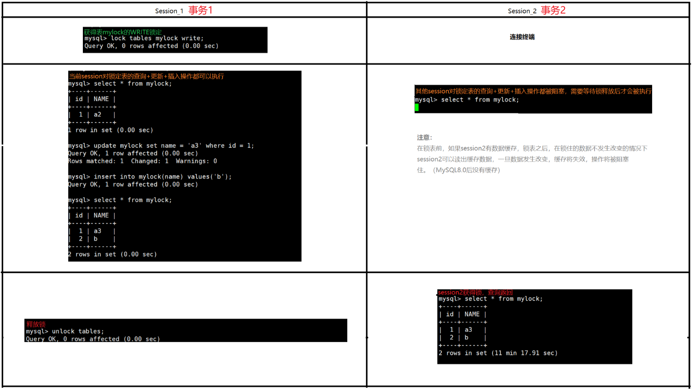

  ```mysql
  ########################SessionA########################################
  mysql> lock tables mylock write; # 事务 A 为表上加写锁
  Query OK, 0 rows affected (0.00 sec)
  
  mysql> select * from mylock; # 事务 A 可以读
  +----+------+
  | id | NAME |
  +----+------+
  |  1 | a1   |
  +----+------+
  1 row in set (0.00 sec)
  
  mysql> update mylock set name = 'a2' where id = 1; # 事务 A 可以写
  Query OK, 1 row affected (0.01 sec)
  Rows matched: 1  Changed: 1  Warnings: 0
  
  mysql> select * from account; # 事务 A 无法操作其他表
  ERROR 1100 (HY000): Table 'account' was not locked with LOCK TABLES
  
  ############################SessionB##################################
  mysql> select * from mylock; # 事务 B 不可以读
  # 阻塞等待事务A释放锁....
  
  mysql> update mylock set name = 'a3' where id = 1; # 事务 B 不可以写
  # 阻塞等待事务 A 释放锁....
  
  mysql> select * from account; # 事务 B 可以操作其他表
  +----+--------+---------+
  | id | name   | balance |
  +----+--------+---------+
  |  1 | abc    |      40 |
  |  2 | 李四   |       0 |
  |  3 | 王五   |     100 |
  |  4 | 马六   |    1000 |
  |  5 | 张三   |    6666 |
  +----+--------+---------+
  5 rows in set (0.01 sec)
  ```

总结：**MyISAM 在执行查询语句（SELECT）前，会给涉及的所有表加读锁，在执行增删改操作前，会给涉及的表加写锁。InnoDB 存储引擎是不会为这个表添加表级别的读锁或者写锁的。**

MySQL 的表级锁有两种模式：（以 MyISAM 表进行操作的演示）

- **表共享读锁（Table Read Lock）**

- **表独占写锁（Table Write Lock）**

- 二者的关系：

  | 锁类型 | 自己可读 | 自己可写 | 自己可操作其他表 | 他人可读   | 他人可写   |
  | ------ | -------- | -------- | ---------------- | ---------- | ---------- |
  | 读锁   | 是       | 否       | 否               | 是         | 否，需等待 |
  | 写锁   | 是       | 是       | 否               | 否，需等待 | 否，需等待 |

##### 意向锁（intention lock)

InnoDB 支持`多粒度锁（multiple granularity locking）`，它允许行级锁与表级锁共存，而`意向锁`就是其中的一种表锁。

- 意向锁的存在是为了协调行锁和表锁的关系，支持多粒度（表锁与行锁）的锁并存。
- 意向锁是一种不与行级锁冲突的表级锁，这一点非常重要。
- 意向锁表明 "某个事务正在某些行持有了锁或该事务准备去持有锁"。

**意向锁分为两种：**

- `意向共享锁（intention shared lock, IS）`：事务有意向对表中的某些行加共享锁（S 锁）。

  ```mysql
  # 事务要获取某些行的 S 锁，必须先获得表的 IS 锁
  SELECT column FROM table ... LOCK IN SHARE MODE;
  ```

- `意向排他锁（intention exclusive lock, IX）`：事务有意向对表中的某些行加排他锁（X 锁）。

  ```mysql
  # 事务要获取某些行的 X 锁，必须先获得表的 IX 锁
  SELECT column FROM table ... FOR UPDATE;
  ```

> 意向锁是由存储引擎自己维护的，用户无法手动操作意向锁，在为数据行加共享锁/排他锁之前，InooDB 会先获取该数据行所在数据表的对应意向锁。

**意向锁要解决的问题：**

现在有两个事务，分别是 T1 和 T2，其中 T2 试图在该表级别上应用共享或排它锁，如果没有意向锁存在，那么 T2 就需要去检查各个页或行是否存在锁；如果存在意向锁，那么此时就会受到由 T1 控制的表级别意向锁的阻塞。T2 在锁定该表前不必检查各个页或行锁，而只需检查表上的意向锁。**简单来说，意向锁就是给更大一级别的空间示意里面是否已经上过锁。**

在数据表的场景中，如果我们给某一行数据加上了排它锁，数据库会自动给更大一级的空间，比如数据页或数据表加上意向锁，告诉其他人这个数据页或数据表已经有人上过排它锁了，这样当其他人想要获取数据表排它锁的时候，只需要了解是否有人已经获取了这个数据表的意向排他锁即可。

- **如果事务想要获得数据表中某些记录的共享锁，就需要在数据表上添加意向共享锁。**
- **如果事务想要获得数据表中某些记录的排他锁，就需要在数据表上添加意向排他锁。**

这时，意向锁会告诉其他事务已经有人锁定了表中的某些记录。

举例：事务的隔离级别默认为 REPEATABLE-READ，如下所示。

```mysql
# 创建表 teacher，插入 6 条数据
CREATE TABLE `teacher`(
  id int NOT NULL,
  name varchar(255) NOT NULL,
  PRIMARY KEY (id)
)ENGINE=InnoDB DEFAULT CHARSET=utf8mb4 COLLATE=utf8mb4_0900_ai_ci;

INSERT INTO `teacher` VALUES
(1, 'zhangsan'),
(2 , 'lisi'),
(3, 'wangwu'),
(4, 'zhaoliu'),
(5, 'songhongkang'),
(6 , 'leifengyang');

# 查看数据
mysql> select * from teacher;
+----+--------------+
| id | name         |
+----+--------------+
|  1 | zhangsan     |
|  2 | lisi         |
|  3 | wangwu       |
|  4 | zhaoliu      |
|  5 | songhongkang |
|  6 | leifengyang  |
+----+--------------+
6 rows in set (0.00 sec)

# 假设事务 A 获取了某一行的排他锁，并未提交
begin;
SELECT * FROM teacher WHERE id = 6 FOR UPDATE;

# 事务 B 想要获取 teacher 表的表读锁，语句如下
begin ;
LOCK TABLES teacher READ;
# 阻塞...
```

因为共享锁与排他锁互斥，所以事务 B 在试图对 teacher 表加共享锁的时候，必须保证两个条件：

1. 当前没有其他事务持有 teacher 表的排他锁。
2. 当前没有其他事务持有 teacher 表中任意一行的排他锁。

为了检测是否满足第二个条件，事务 B 必须在确保 teacher 表不存在任何排他锁的前提下，去检测表中的每一行是否存在排他锁。很明显这是一个效率很差的做法，但是有了意向锁之后，情况就不一样了。

意向锁是怎么解决这个问题的呢？首先需要知道意向锁之间的兼容互斥性，如下所示：

| 兼容性           | 意向共享锁（IS） | 意向排他锁（IX） |
| ---------------- | ---------------- | ---------------- |
| 意向共享锁（IS） | 兼容             | 兼容             |
| 意向排他锁（IX） | 兼容             | 兼容             |

即**`意向锁之间是互相兼容`**的，虽然意向锁之间互相兼容，但是**`意向锁会与普通的表级的排他锁/共享锁互斥`**，如下所示：

| 兼容性          | 意向共享锁（IS） | 意向排他锁（IX） |
| --------------- | ---------------- | ---------------- |
| 表级共享锁（S） | 兼容             | 互斥             |
| 表级排他锁（X） | 互斥             | 互斥             |

> 注意：这里的排他锁/共享锁指的都是表锁，意向锁不会与行级的共享锁/排他锁互斥，**可以把意向锁看做是一种行级锁的标记**。

回到刚才 teacher 表的例子，事务 A 获取了某一行的排他锁，并未提交：

```mysql
BEGIN;
SELECT * FROM teacher WHERE id = 6 FOR UPDATE;
```

此时，teacher 表存在两把锁：teacher 表上的意向排他锁与 id 为 6 的数据行上的排他锁。然后，事务 B 想要获取 teacher 表的共享锁：

```mysql
BEGIN;
LOCK TABLES teacher READ;
```

**这个时候，事务 B 检测事务 A 持有 teacher 表的意向排他锁，就可以得知事务 A 必然持有该表中某些数据行的排他锁，那么事务 B 对 teacher 表的加锁请求就会被排斥（事务 B 阻塞），而无需去检测表中的每一行数据是否存在排他锁。**

> 总结来看，意向锁可以看作是一种标记，通过意向锁，可以在一个事务想要对表进行加锁请求时，快速的判断是否会被阻塞，提高效率。

**意向锁的并发性：**

**`意向锁不会与行级的共享锁/排他锁互斥`**！正因为如此，意向锁并不会影响到多个事务对不同数据行加排他锁时的并发性。（如果互斥，那么行级锁直接就退化成表锁了，就没有什么优势了）

我们扩展一下上面 teacher 表的例子，来概括一下意向锁的作用（一条数据从被锁定到被释放的过程中，可能存在多种不同锁，但是这里只着重表现意向锁）

1. 事务 A 先获取了某一行的排他锁，并未提交：

   ```mysql
   BEGIN;
   SELECT * FROM teacher WHERE id = 6 FOR UPDATE;
   ```

2. 此时，事务 A 获取了 teacher 表上的意向排他锁，事务 A 获取了 id 为 6 的数据行上的排他锁。之后，事务 B 想要获取 teacher 表的共享锁：

   ```mysql
   BEGIN;
   LOCK TABLES teacher READ;
   ```

3. 事务 B 检测到事务 A 持有 teacher 表的意向排他锁，则事务 B 对 teacher 表的加锁请求被排斥（事务 B 阻塞）。如果事务 C 想获取 teacher 表中某一行的排他锁：

   ```mysql
   BEGIN;
   SELECT * FROM teacher WHERE id = 5 FOR UPDATE;
   ```

4. 那么，事务 C 先申请 teacher 表的意向排他锁，事务 C 检测到事务 A 持有 teacher 表的意向排他锁，因为意向锁之间并不互斥，所以事务 C 获取到了 teacher 表的意向排他锁。因为 id 为 5 的数据行上不存在任何排他锁，最终，事务 C 成功获取到了该数据行上的排他锁。

从上面的案例可以得到如下结论：

- InnoDB 支持多粒度锁，特定场景下，行级锁可以与表级锁共存。
- 意向锁之间互不排斥，但除了 IS 与 S 兼容外，意向锁会与共享锁 / 排他锁互斥。
- **IX，IS 是表级锁，不会和行级的 X，S 锁发生冲突，只会和表级的 X，S 发生冲突。**
- 意向锁在保证并发性的前提下，实现了行锁和表锁共存，且满足事务隔离性的要求。

##### 自增锁（AUTO-INC 锁）

在使用 MySQL 过程中，我们可以为表的某个列添加`AUTO_INCREMENT`属性。举例：

```mysql
CREATE TABLE `teacher` (
  `id` int NOT NULL AUTO_INCREMENT,
  `name` varchar(255) NOT NULL,
  PRIMARY KEY (`id`)
) ENGINE=InnoDB DEFAULT CHARSET=utf8mb4 COLLATE=utf8mb4_0900_ai_ci;
```

由于这个表的 id 字段声明了 AUTO_INCREMENT，意味着在书写插入语句时不需要为其赋值，SQL 语句修改如下所示：

```mysql
INSERT INTO `teacher` (name) VALUES ('zhangsan'), ('lisi');
```

上边的插入语句并没有为 id 列显式赋值，所以系统会自动为它赋上递增的值，结果如下所示：

```mysql
SELECT * FROM teacher;
+----+----------+
| id | name |
+----+----------+
| 1 | zhangsan |
| 2 | lisi |
+----+----------+
```

现在看到的上面插入数据的方式，是一种简单的插入模式。**所有插入数据的方式总共分为三类，分别是 "Simple inserts"，"Bulk inserts" 和 "Mixed-mode inserts"。**

1. `Simple inserts（简单插入）`：**可以预先确定要插入的行数（当语句被初始处理时）的语句。**包括没有嵌套子查询的单行和多行 INSERT … VALUES() 和 REPLACE 语句。比如我们上面举的例子就属于该类插入，已经确定要插入的行数。

2. `Bulk inserts（批量插入）`：**事先不知道要插入的行数（和所需自动递增值的数量）的语句。**比如 INSERT … SELECT，REPLACE … SELECT 和 LOAD DATA 语句，但不包括纯 INSERT。InnoDB 在每处理一行，为 AUTO_INCREMENT 列分配一个新值。

3. `Mixed-mode inserts（混合模式插入）`：**其中一种是指那些是 Simple inserts 语句，但是指定部分新行的自动递增值。**例如 INSERT INTO teacher (id,name) VALUES (1,‘a’), (NULL,‘b’), (5,‘c’), (NULL,‘d’)，只是指定了部分 id 的值，其他部分 id 的值还是自增。另一种类型的混合模式插入是 INSERT … ON DUPLICATE KEY UPDATE。

对于上面数据插入的案例，MySQL 中采用了`自增锁`的方式来实现，**AUTO-INC 锁是当向使用含有 AUTO_INCREMENT 列的表中插入数据时需要获取的一种特殊的表级锁，在执行插入语句时就在表级别加一个 AUTO-INC 锁，然后为每条待插入记录的 AUTO_INCREMENT 修饰的列分配递增的值，在该语句执行结束后，再把 AUTO-INC 锁释放掉。**一个事务在持有 AUTO-INC 锁的过程中，其他事务的插入语句都要被阻塞，这可以保证一个语句中分配的递增值是连续的。也正因为此，其并发性显然并不高，当我们向一个有 AUTO_INCREMENT 关键字的主键插入值的时候，每条语句都要对这个表锁进行竞争，这样的并发潜力其实是很低下的，所以 InnoDB 通过`innodb_autoinc_lock_mode`的不同取值来提供不同的锁定机制，来显著提高 SQL 语句的可伸缩性和性能。

>innodb_autoinc_lock_mode 有三种取值，分别对应与不同锁定模式：
>
>- `innodb_autoinc_lock_mode = 0（"传统"锁定模式）`：在此锁定模式下，所有类型的 INSERT 语句都会获得一个特殊的表级 AUTO-INC 锁，用于插入具有 AUTO_INCREMENT 列的表。这种模式其实就如我们上面的例子，即每当执行 INSERT 的时候，都会得到一个表级锁（AUTO-INC 锁），使得语句中生成的 auto_increment 为顺序，且在 binlog 中重放的时候，可以保证 master 与 slave 中数据的 auto_increment 是相同的。因为是表级锁，当在同一时间多个事务中执行 INSERT 的时候，对于 AUTO-INC 锁的争夺会`限制并发`能力。
>- `innodb_autoinc_lock_mode = 1（"连续"锁定模式）`：在 MySQL 8.0 之前，连续锁定模式是默认的。在这个模式下，"Bulk inserts" 仍然使用 AUTO-INC 表级锁，并保持到语句结束。这适用于所有 INSERT … SELECT，REPLACE … SELECT 和 LOAD DATA 语句。同一时刻只有一个语句可以持有 AUTO-INC 锁。对于 "Simple inserts"（要插入的行数事先已知），则通过在 mutex（轻量锁）的控制下获得所需数量的自动递增值来避免表级 AUTO-INC 锁，它只在分配过程的持续时间内保持，而不是直到语句完成。"Simple inserts" 不使用表级 AUTO-INC 锁，除非 AUTO-INC 锁由另一个事务保持。如果另一个事务保持 AUTO-INC 锁，则 "Simple inserts" 等待 AUTO-INC 锁，如同它是一个 "Bulk inserts"。
>- `innodb_autoinc_lock_mode = 2（"交错"锁定模式）`：从 MySQL 8.0 开始，交错锁定模式是`默认`的。在这种锁定模式下，所有 INSERT 语句都不会使用表级 AUTO-INC 锁，并且可以同时执行多个语句。这是最快和最可扩展的锁定模式，但是当使用基于语句的复制或恢复方案时，从二进制日志重播 SQL 语句时，这是不安全的。在此锁定模式下，自动递增值保证在所有并发执行的所有类型的 INSERT 语句中是唯一且单调递增的。但是，由于多个语句可以同时生成数字（即，跨语句交叉编号），为任何给定语句插入的行生成的值可能不是连续的。如果执行的语句是 "Simple inserts"，其中要插入的行数已提前知道，除了 "Mixed-mode inserts" 之外，为单个语句生成的数字不会有间隙。然而，当执行 "Bulk inserts" 时，在由任何给定语句分配的自动递增值中可能存在间隙。

##### 元数据锁（MDL 锁）

MySQL 5.5 引入了`Meta Data Lock`，简称 MDL 锁，属于表锁范畴。**MDL 的作用是，保证读写的正确性。**比如，如果一个查询正在遍历一个表中的数据，而执行期间另一个线程对这个表结构做变更，增加了一列，那么查询线程拿到的结果跟表结构对不上，肯定是不行的。

因此，**当对一个表做增删改查操作（DML 操作）的时候，加 MDL 读锁；当要对表做结构变更操作（DDL 操作）的时候，加 MDL 写锁。**

- **读锁之间不互斥，因此可以有多个线程同时对一张表增删改查。**
- **读锁与写锁之间、写锁之间是互斥的，用来保证变更表结构操作的安全性，解决了 DML 和 DDL 操作之间的一致性问题。**
- **MDL 不需要显式使用，在访问一个表的时候会被自动加上。**

举例：元数据锁的使用场景模拟。

- 事务 A：从表中查询数据。

  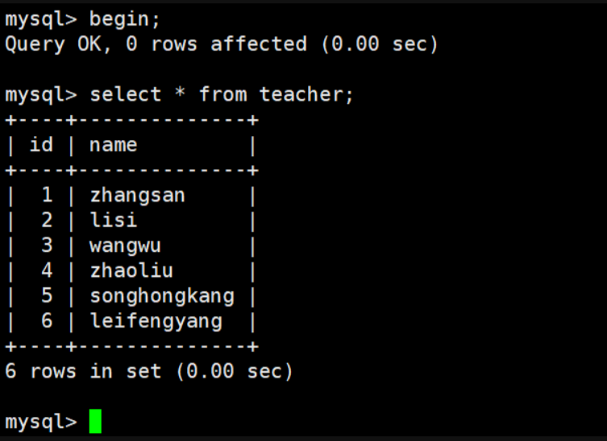

- 事务 B：修改表结构，增加新列。

  

- 事务 C：查看当前 MySQL 的进程，可以得出 B 中的阻塞就是因为 A 为 teacher 加了 MDL 锁。

  

- 在事务 B 中结束修改，重新进行读操作。

  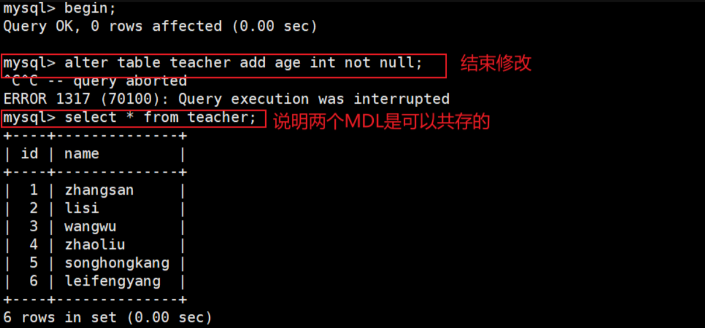

- 事务 B 中之前的所有进行提交，重新开启事务尽心修改，同时 C 中也开启一个事务进行查询。可以看出，事务 B 被阻塞，这是因为事务 A 拿到了 teacher 表的元数据读锁，事务 B 想申请 teacher 表的元数据写锁，由于读写锁互斥，事务 B 需要等待事务 A 释放元数据锁才能执行。而事务 C 要在表 teacher 上新申请 MDL 读锁的请求也会被事务 B 阻塞。如前面所说，所有对表的增删改查操作都需要先申请 MDL 读锁，现在就都会被阻塞了，也就等于这个表现在完全不可读写了，并发性大大降低！！！这也就是元数据锁可能带来的问题。

  

#### InnoDB 中的行锁（Row Lock）

**`行锁`也称为记录锁，顾名思义，就是锁住某一行（某条记录 Row)。需要的注意的是，MySQL 服务器层并没有实现行锁机制，行级锁只在存储引擎层实现。**

- 优点：**锁定力度小，发生锁冲突概率低，可以实现的并发度高。**
- 缺点：**对于锁的开销比较大，加锁会比较慢，容易出现死锁情况。**

InnoDB 与 MyISAM 的最大不同有两点：一是支持事务（TRANSACTION）；二是采用了行级锁。

演示环境搭建：

```mysql
# 创建表
CREATE TABLE student (
  id INT,
  name VARCHAR(20),
  class varchar (10) ,PRIMARY KEY (id)
)Engine=InnoDB CHARSET=utf8;

# 插入几条记录
INSERT INTO student VALUES
(1, '张三', '一班'),
(3, '李四', '一班'),
(8, '王五', '二班'),
(15, '赵六', '二班'),
(20, '钱七', '三班');

# 查看
SELECT *FROM student;
+----+--------+--------+
| id | name   | class  |
+----+--------+--------+
|  1 | 张三   | 一班   |
|  3 | 李四   | 一班   |
|  8 | 王五   | 二班   |
| 15 | 赵六   | 二班   |
| 20 | 钱七   | 三班   |
+----+--------+--------+
```

student 表中的聚簇索引的简图如下所示：


这里把 B+ 树的索引结构做了一个超级简化，只把索引中的记录给拿了出来，下面看看都有哪些常用的行锁类型。

##### 记录锁（Record Locks）

`记录锁`也就是仅仅把一条记录锁上，官方的类型名称为`LOCK_REC_NOT_GAP`。比如把 id 值为 8 的那条记录加一个记录锁的示意图如图所示，仅仅是锁住了 id 值为 8 的记录，对周围的数据没有影响：

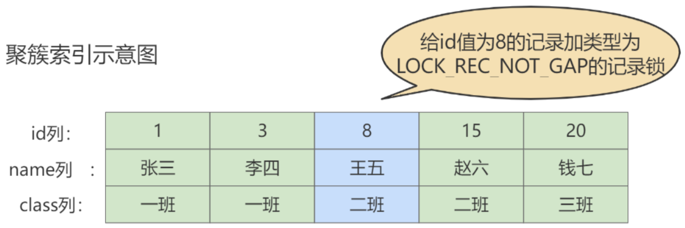

**举例如下：**

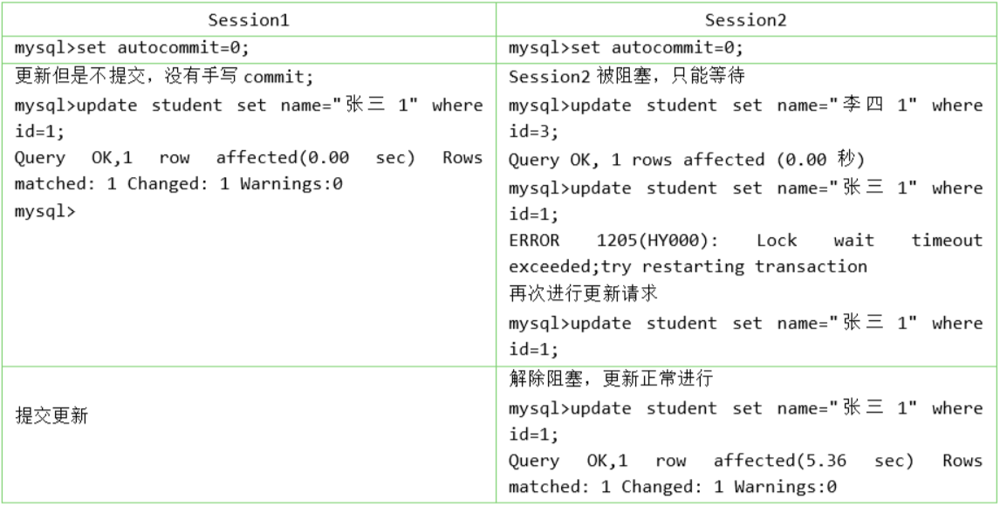

**代码演示：**

```mysql
###############################SessionA###################################
mysql> begin;
Query OK, 0 rows affected (0.00 sec)

mysql> update student set name = '张三1' where id = 1; # 为 id=1 的记录加 X 型的行锁
Query OK, 1 row affected (0.01 sec)
Rows matched: 1  Changed: 1  Warnings: 0

###############################SessionB###################################
mysql> begin;
Query OK, 0 rows affected (0.00 sec)

mysql> select * from student where id = 2 lock in share mode;
Empty set (0.00 sec)

mysql> select * from student where id = 3 lock in share mode;
+----+--------+--------+
| id | name   | class  |
+----+--------+--------+
|  3 | 李四   | 一班   |
+----+--------+--------+
1 row in set (0.00 sec)

mysql> select * from student where id = 1 lock in share mode; 
# 阻塞...，因为 sessonA 中的事务对该记录了 X 锁
ERROR 1205 (HY000): Lock wait timeout exceeded; # 执行超时

mysql> update student set name = '李四1' where id = 3; # 为 id=3 的记录加 X 型的锁
Query OK, 1 row affected (0.00 sec)
Rows matched: 1  Changed: 1  Warnings: 0

mysql> update student set name = '张三2' where id = 1;
# 阻塞...
ERROR 1205 (HY000): Lock wait timeout exceeded; # 执行超时

###############################SessionA###################################
mysql> commit; # 提交
Query OK, 0 rows affected (0.01 sec)

###############################SessionB###################################
mysql> update student set name = '张三2' where id = 1; # 再次尝试获取 X 锁，执行成功
Query OK, 1 row affected (5.74 sec)
Rows matched: 1  Changed: 1  Warnings: 0

mysql> select * from student;
+----+---------+--------+
| id | name    | class  |
+----+---------+--------+
|  1 | 张三2   | 一班   |
|  3 | 李四1   | 一班   |
|  8 | 王五    | 二班   |
| 15 | 赵六    | 二班   |
| 20 | 钱七    | 三班   |
+----+---------+--------+
5 rows in set (0.00 sec)
```

记录锁是有 S 锁和 X 锁之分的，称之为`S 型记录锁`和`X 型记录锁`。

- 当一个事务获取了一条记录的 S 型记录锁后，其他事务也可以继续获取该记录的 S 型记录锁，但不可以继续获取 X 型记录锁。
- 当一个事务获取了一条记录的 X 型记录锁后，其他事务既不可以继续获取该记录的 S 型记录锁，也不可以继续获取 X 型记录锁。

##### 间隙锁（Gap Locks）

MySQL 在 REPEATABLE-READ 隔离级别下是可以解决幻读问题的，解决方案有两种，可以使用 MVCC 方案解决，也可以采用 加锁 方案解决。但是在使用加锁方案解决时有个大问题，就是事务在第一次执行读取操作时，那些幻影记录尚不存在，我们无法给这些幻影记录加上记录锁。InnoDB 提出了一种称之为`Gap Locks`的锁，官方的类型名称为`LOCK_GAP`，我们可以简称为`gap 锁`。

比如，把 id 值为 5 的那条记录加一个 gap 锁的示意图如下：

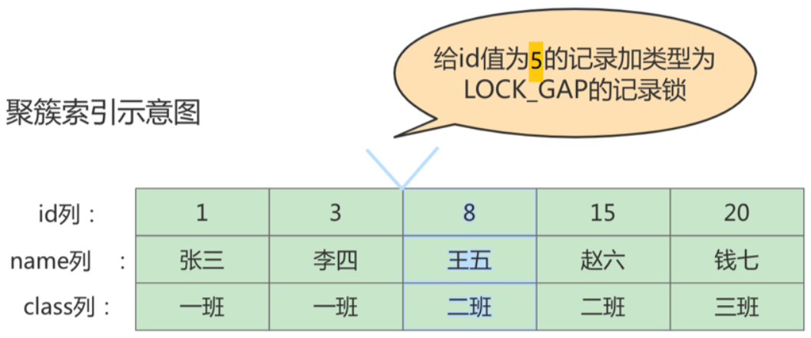

**图中 id 值为 5 的记录加了gap 锁，意味着不允许别的事务在 id 值为 5 的记录所在的间隙插入新记录，其实就是 id 列的值 (3, 8) 这个区间的新记录是不允许立即插入的。**比如，有另外一个事务再想插入一条 id 值为 4 的新记录，它定位到该条新记录在 id 为 5 的间隙锁的范围内，所以就会阻塞插入操作，直到拥有这个 gap 锁的事务提交了之后，id 列的值在区间 (3, 8) 中的新记录才可以被插入。

gap 锁仅仅是为了防止插入幻影记录而提出的。虽然有共享 gap 锁和独占 gap 锁这样的说法，但是它们起到的作用是相同的。而且如果对一条记录加了 gap 锁（不论是共享 gap 锁还是独占 gap 锁），并不会限制其他事务对这条记录加记录锁或者继续加 gap 锁。

**举例如下：**

| Session1                                               | Session2                                       |
| ------------------------------------------------------ | ---------------------------------------------- |
| select * from student where id = 5 lock in share mode; |                                                |
|                                                        | select * from student where id = 5 for update; |

这里 Session 2 并不会被堵住，因为表里并没有 id = 5 这个记录，因此 session 1 加的是间隙锁 (3, 8)，而 Session 2 也是在这个间隙加的间隙锁。它们有共同的目标，即保护这个间隙，不允许插入值。但，它们之间是不冲突的。

注意，给一条记录加了 gap 锁，只是不允许其他事务往这条记录前边的间隙插入新记录，那对于最后一条记录之后的间隙，也就是 student 表中 id 值为 20 的记录之后的间隙该咋办呢？也就是说给哪条记录加 gap 锁才能阻止其他事务插入 id 值在 (20, +∞) 这个区间的新记录呢？这时候我们在讲数据页时介绍的两条伪记录派上用场了：

- Infimum记录，表示该页面中最小的记录。
- Supremum记录，表示该页面中最大的记录。

为了实现阻止其他事务插入 id 值在 (20, +∞) 这个区间的新记录，可以给索引中的最后一条记录，也就是 id 值为 20 的那条记录所在页面的 Supremum 记录加上一个 gap 锁，如图所示：

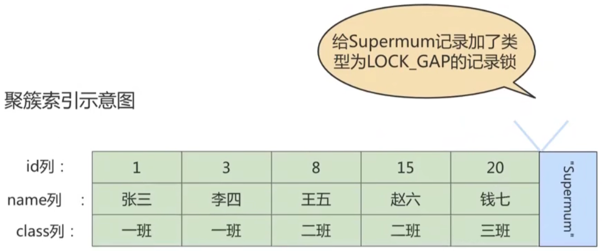

**代码演示：**

- 关于 X 和 S 锁互斥的知识回顾：

  ```mysql
  ###############################SessionA###################################
  mysql> begin;
  Query OK, 0 rows affected (0.00 sec)
  
  mysql> select * from student where id = 8 lock in share mode; # 为 id=8 的记录加 S 锁
  +----+--------+--------+
  | id | name   | class  |
  +----+--------+--------+
  |  8 | 王五   | 二班   |
  +----+--------+--------+
  1 row in set (0.00 sec)
  
  ###############################SessionB####################################
  mysql> select * from student where id = 8 for update; # A 已经为 id=8 的加了 S 锁，B 就不能加 X 锁了
  ^C^C -- query aborted
  ERROR 1317 (70100): Query execution was interrupted
  
  #################SessionA&SessionB########################################
  mysql> commit;
  Query OK, 0 rows affected (0.00 sec)
  ```

- 间隙锁：

  ```mysql
  #############################SessionA#####################################
  mysql> begin;
  Query OK, 0 rows affected (0.00 sec)
  
  # id=5 的记录不存在，所以无法加上记录锁，对于不存在的记录，加的是间隙锁 (3,8）
  mysql> select * from student where id = 5 lock in share mode; 
  Empty set (0.00 sec)
  
  ############################SessionB####################################
  mysql> begin;
  Query OK, 0 rows affected (0.00 sec)
  
  # 依旧加的是间隙锁，可以看出共享 gap 锁和独占 gap 锁作用相同，而且可以重复加
  mysql> select * from student where id = 5 for update;
  Empty set (0.00 sec)
  
  ##########################SessionC######################################
  mysql> insert into student(id,name,class) values(6,'tom','三班'); # 在间隙锁范围内，无法插入
  # 阻塞...
  ERROR 1205 (HY000): Lock wait timeout exceeded; try restarting transaction
  ```

- 可以这样实现加 id > 20的间隙锁：

  ```mysql
  mysql> select * from student where id = 25 lock in share mode;
  Empty set (0.00 sec)
  
  mysql> select * from student where id > 20 for update;
  Empty set (0.00 sec)
  ```

>**注意：如果记录存在，则使用`for update`或`lock in share mode`加的就是记录锁，如果记录不存在加的就是间隙锁。**

间隙锁的引入，可能会导致同样的语句锁住更大的范围，这其实是影响了并发度的。下面的例子会产生死锁：

| Session1                                                     | Session2                                             |
| ------------------------------------------------------------ | ---------------------------------------------------- |
| begin; select *from student where id = 5 for update;         | begin;select * from student where id = 5 for update; |
|                                                              | INSERT INTO student VALUES(5,'宋红康,‘二班’);阻塞    |
| INSERT INTO student VALUES(5,‘宋红康’,‘二班’);(ERROR 1213(40001):Deadlock found when trying to get lock; try restarting transaction) |                                                      |

- Session1 执行 select … for update 语句，由于 id = 5 这一行并不存在，因此会加上间隙锁 (3, 8)。
- Session2 执行 select … for update 语句，同样会加上间隙锁 (3, 8)，间隙锁之间不会冲突，因此这个语句可以执行成功。
- Session2 试图插入一行 (5,‘宋红康’,‘二班’)，被 Session1 的间隙锁挡住了，只好进入等待。
- Session1 试图插入一行 (5,‘宋红康’,‘二班’)，被 Session2 的间隙锁挡住了。至此，**两个 Session 陷入死锁**。

**代码演示：**

```mysql
#############################SessionA####################################
mysql> begin;
Query OK, 0 rows affected (0.00 sec)

mysql> select * from student where id = 5 lock in share mode; # 为 id=5 加间隙锁
Empty set (0.00 sec)

#############################SessionB####################################
mysql> begin;
Query OK, 0 rows affected (0.00 sec)

mysql> select * from student where id = 5 for update; # 为 id=5 加间隙锁
Empty set (0.00 sec)

mysql> insert into student(id,name,class) values(7,'Tom','一班'); # id=7 在间隙区间
# 阻塞...

###########################SessionA######################################
# 出现了死锁，此报错也可能在 B 中出现
mysql> insert into student(id,name,class) values(6,'Jane','一班'); 
ERROR 1213 (40001): Deadlock found when trying to get lock; try restarting transaction

##########################SessionB##################################
# 出现死锁后，按照策略，让 A 回滚，从而 B 中的 Insert 执行成功
mysql> insert into student(id,name,class) values(7,'Tom','一班'); 
Query OK, 1 row affected (0.00 sec)
```

**分析：为什么会出现死锁呢？**

当 SessionA 中执行 INSERT，就会造成 SessionB 中 INSERT 在等 SessionA 中的间隙锁释放，SessionA 中的 INSERT 在等 SessionB 中的间隙锁的释放（因为只有释放后，这俩各自的 INSERT 才会继续执行）。从而 SessionA 和 SessionB 相互等待，就产生了死锁。

那为啥发生死锁后，SessionA 执行失败，SessionB 又成功执行了呢？这涉及 MySQL 的`处理死锁机制`：**当 MySQL 发起死锁检测，发现死锁后，主动回滚死锁链条中的某一个事务（将持有最少行级排他锁的事务进行回滚），让其他事务得以继续执行！**（详见后文死锁章节分析）

##### 临键锁（Next-Key Locks）

有时候既想锁住某条记录，又想阻止其他事务在该记录前边的间隙插入新记录，所以 InnoDB 就提出了一种称之为`Next-Key Locks`的锁，官方的类型名称为`LOCK_ORDINARY`，我们也可以简称为`next-key 锁`。**Next-Key Locks 是在存储引擎是 Innodb、事务级别在 REPEATABLE-READ 的情况下使用的数据库锁，Innodb 默认的锁就是 Next-Key locks。**

比如，把 id 值为 8 的那条记录加一个 next-key 锁的示意图如下：

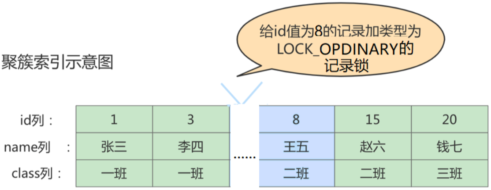

**next-key 锁的本质就是一个记录锁和一个 gap锁的合体，它既能保护该条记录，又能阻止别的事务将新记录插入被保护记录前边的间隙。**

```mysql
select * from student where id <=8 and id > 3 for update;
```

**代码演示：**

```mysql
#############################SessionA####################################
mysql> begin;
Query OK, 0 rows affected (0.00 sec)

# 为 (8,15] 加邻键锁（8~15 是间隙锁，加上 15 是记录锁）
mysql> select * from student where id <= 15 and id > 8 for update; 
+----+--------+--------+
| id | name   | class  |
+----+--------+--------+
| 15 | 赵六   | 二班   |
+----+--------+--------+
1 row in set (0.00 sec)

#############################SessionB####################################
mysql> begin;
Query OK, 0 rows affected (0.00 sec)

mysql> select * from student where id = 15 lock in share mode; # 无法获取记录 15 的 S 锁
^C^C -- query aborted
ERROR 1317 (70100): Query execution was interrupted

mysql> select * from student where id = 15 for update; # 无法获取记录 15 的 X 锁
^C^C -- query aborted
ERROR 1317 (70100): Query execution was interrupted

mysql> insert into student(id,name,class) values(12,'Tim','一班'); # 无法在间隙内插入数据
^C^C -- query aborted
ERROR 1317 (70100): Query execution was interrupted
    
###############################SessionA&SessionB#######################
mysql> commit;
Query OK, 0 rows affected (0.00 sec)
```

##### 插入意向锁（Insert Intention Locks）

我们说一个事务在插入一条记录时，需要判断一下插入位置是不是被别的事务加了 gap 锁 （ next-key 锁也包含 gap 锁 ），如果有的话，插入操作需要等待，直到拥有 gap 锁的那个事务提交。但是，InnoDB 规定事务在等待的时候，也需要在内存中生成一个锁结构，表明有事务想在某个间隙中插入新记录，只是现在在等待。InnoDB 就把这种类型的锁命名为`Insert Intention Locks`，官方的类型名称为`LOCK_INSERT_INTENTION`，我们称为`插入意向锁`。插入意向锁是一种 gap 锁，不是意向锁，在 INSERT 操作时产生。

>**插入意向锁是在插入一条记录行前，由 INSERT 操作产生的一种间隙锁，事实上，插入意向锁并不会阻止别的事务继续获取该记录上任何类型的锁。**

插入意向锁是在插入一条记录行前，由 INSERT 操作产生的一种间隙锁。该锁用以表示插入意向，当多个事务在同一区间（gap）插入位置不同的多条数据时，事务之间不需要互相等待。假设存在两条值分别为 8 和 15 的记录，两个不同的事务分别试图插入值为 11 和 12 的两条记录，每个事务在获取插入行上独占的（排他）锁前，都会获取 (8, 15) 之间的间隙锁，但是因为数据行之间并不冲突，所以两个事务之间并不会产生冲突（阻塞等待)。总结来说，插入意向锁的特性可以分成两部分：

1. 插入意向锁是一种特殊的间隙锁 —— 间隙锁可以锁定开区间内的部分记录。

2. 插入意向锁之间互不排斥，所以即使多个事务在同一区间插入多条记录，只要记录本身（主键、唯一索引）不冲突，那么事务之间就不会出现冲突等待。

**注意，虽然插入意向锁中含有意向锁三个字，但是它并不属于意向锁而属于间隙锁，因为意向锁是表锁而插入意向锁是行锁。**

比如，把 id 值为 8 的那条记录加一个插入意向锁，示意图如下：

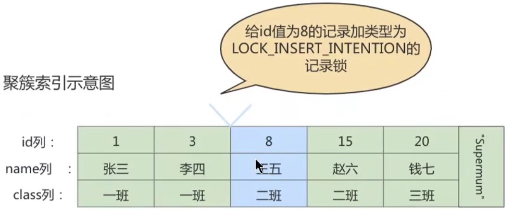

比如，现在 T1 为 id 值为 8 的记录加了一个 gap 锁，然后 T2 和 T3 分别想向 student 表中插入 id 值分别为 4、5 的两条记录，所以现在为 id 值为 8 的记录加的锁的示意图就如下所示：

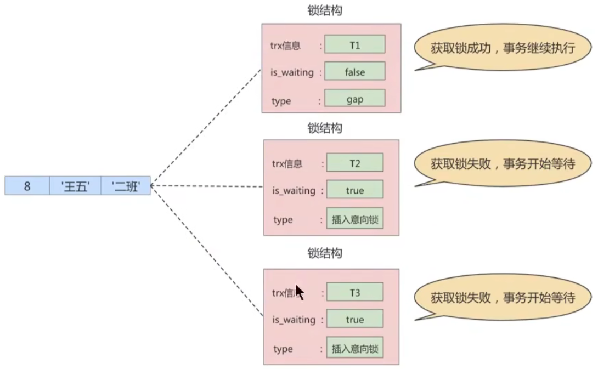

从图中可以看到，由于 T1 持有 gap 锁，所以 T2 和 T3 需要生成一个插入意向锁的锁结构并且处于等待状态。当 T1 提交后会把它获取到的锁都释放掉，这样 T2 和 T3 就能获取到对应的插入意向锁了（本质上就是把插入意向锁对应锁结构的 is_waiting 属性改为 false），T2 和 T3 之间也并不会相互阻塞，它们可以同时获取到 id 值为 8 的插入意向锁，然后执行插入操作。事实上，插入意向锁并不会阻止别的事务继续获取该记录上任何类型的锁。

**代码演示：**

```mysql
###############################SessionA####################################
mysql> begin;
Query OK, 0 rows affected (0.00 sec)

mysql> select * from student where id = 12 for update; # 加间隙锁
Empty set (0.00 sec)

###############################SessionB####################################
mysql> begin;
Query OK, 0 rows affected (0.00 sec)

mysql> insert into student(id,name,class) values(12,'Tim','一班'); 
# 阻塞..同时会加插入意向锁

##############################SessionC###################################
mysql> begin;
Query OK, 0 rows affected (0.00 sec)

mysql>  insert into student(id,name,class) values(11,'Tim','一班');
# 阻塞..同时会加插入意向锁。可以看出插入意向锁是相互兼容的，毕竟 id 都不同嘛

##############################SessionA#################################
mysql> commit; # 提交
Query OK, 0 rows affected (0.00 sec)

#############################SessionB###############################
mysql> insert into student(id,name,class) values(12,'Tim','一班'); # 插入成功
Query OK, 1 row affected (45.43 sec)

##############################SessionC#################################
mysql>  insert into student(id,name,class) values(11,'Tim','一班'); # 插入成功
Query OK, 1 row affected (0.00 sec)
```

#### 页锁

`页锁`就是在`页的粒度`上进行锁定，锁定的数据资源比行锁要多，因为一个页中可以有多个行记录。当使用页锁的时候，会出现数据浪费的现象，但这样的浪费最多也就是一个页上的数据行。**页锁的开销介于表锁和行锁之间，会出现死锁。锁定粒度介于表锁和行锁之间，并发度一般。**

>死锁演示：
>
>```mysql
>事务 A 目前锁定了页 A，想要锁定页 B 才可以执行完。
>事务 B 目前锁定了页 B，想要锁定页 A 才可以执行完。
>### 产生死锁
>```

每个层级的锁数量是有限制的，因为锁会占用内存空间，锁空间的大小是有限的。当某个层级的锁数量超过了这个层级的阈值时，就会进行`锁升级`。锁升级就是用更大粒度的锁替代多个更小粒度的锁，比如 InnoDB 中行锁升级为表锁，这样做的好处是占用的锁空间降低了，但同时数据的并发度也下降了。

### 按对待锁的态度划分：悲观锁、乐观锁

从对待锁的态度来看锁的话，可以将锁分成`乐观锁`和`悲观锁`，从名字中也可以看出这两种锁是两种`看待数据并发的思维方式`。需要注意的是，乐观锁和悲观锁并不是锁，而是`锁的设计思想`。

#### 悲观锁（Pessimistic Locking）

悲观锁是一种思想，顾名思义，就是很悲观，对数据被其他事务的修改持保守态度，会通过数据库自身的锁机制来实现，从而保证数据操作的排它性。

**悲观锁总是假设最坏的情况，每次去拿数据的时候都认为别人会修改，所以每次在拿数据的时候都会上锁，这样别人想拿这个数据就会阻塞，直到它拿到锁（共享资源每次只给一个线程使用，其它线程阻塞，用完后再把资源转让给其它线程）。**比如行锁，表锁等，读锁，写锁等，都是在做操作之前先上锁，当其他线程想要访问数据时，都需要阻塞挂起。Java 中 Synchronized 和 ReentrantLock 等独占锁，就是悲观锁思想的实现。

秒杀案例 1：商品秒杀过程中，库存数量的减少，避免出现超卖的情况。比如，商品表中有一个字段为 quantity 表示当前该商品的库存量。假设商品为华为 mate 40，id 为 1001，quantity 为 100 个。如果不使用锁的情况下，操作方法如下所示：

```mysql
# 第 1 步：查出商品库存
select quantity from items where id = 1001;

# 第 2 步：如果库存大于 0，则根据商品信息生产订单
insert into orders(item_id) values(1001);
                    
# 第 3 步：修改商品的库存，num 表示购买数量
update items set quantity = quantity - num where id = 1001;
```

这样写的话，在并发量小的公司没有大的问题，但是如果在高并发环境下，可能出现以下问题：

|      | 线程 A                    | 线程 B                    |
| ---- | ------------------------- | ------------------------- |
| 1    | step 1：查询还有100部手机 | step 1：查询还有100部手机 |
| 2    |                           | step 2：生成订单          |
| 3    | step 2：生成订单          |                           |
| 4    |                           | step 3：减库存1           |
| 5    | step 3：减库存2           |                           |

其中，线程 B 此时已经下单并且减完库存，这个时候线程 A 依然去执行 step 3，就可能会造成超卖。

我们使用悲观锁可以解决这个问题，商品信息从查询出来到修改，中间有一个生成订单的过程，使用悲观锁的原理就是，在查询 items 信息后就把当前的数据锁定，直到修改完毕后再解锁。那么整个过程中，因为数据被锁定了，就不会出现有第三者来对其进行修改了。而这样做的前提是需要将要执行的 SQL 语句放在同一个事务中，否则达不到锁定数据行的目的。修改如下：

```mysql
# 第 1 步：查出商品库存
select quantity from items where id = 1001 for update;

# 第 2 步：如果库存大于 0，则根据商品信息生产订单
insert into orders(item_id) values(1001);

# 第 3 步：修改商品的库存，num 表示购买数量
update items set quantity = quantity - num where id = 1001;
```

select … for update 是 MySQL 中的悲观锁。此时在 items 表中，id 为 1001 的那条数据就被锁定了，其他的要执行 select quantity from items where id = 1001 for update; 语句的事务，必须等本次事务提交之后才能执行，这样可以保证当前的数据不会被其它事务修改。

>注意，当执行 select quantity from items where id = 1001 for update; 语句之后，如果在其他事务中执行 select quantity from items where id = 1001; 语句，并不会受第一个事务的影响，仍然可以正常查询出数据。（存疑？）

另外，select … for update 语句执行过程中所有扫描的行都会被锁上，因此，在 MySQL 中用悲观锁必须确定使用了索引，而不是全表扫描，否则将会把整个表锁住（表锁）。

>**`InnoDB 行锁是通过给索引上的索引项加锁来实现的，只有通过索引条件检索数据，InnoDB 才使用行级锁，否则 InnoDB 将使用表锁。`**

悲观锁不适用的场景较多，它存在一些不足，因为悲观锁大多数情况下依靠数据库的锁机制来实现，以保证程序的并发访问性，同时这样对数据库性能开销影响也很大，特别是 `长事务` 而言，这样的`开销往往无法承受`，这时就需要乐观锁。

#### 乐观锁（Optimistic Locking）

**乐观锁认为对同一数据的并发操作不会总发生，属于小概率事件，不用每次都对数据上锁，但是在更新的时候会判断一下在此期间，别人有没有去更新这个数据，也就是不采用数据库自身的锁机制，而是通过程序来实现。**在程序上，可以采用`版本号机制`或者`CAS 机制`实现。**乐观锁适用于多读的应用类型，这样可以提高吞吐量。**在 Java 中 java.util.concurrent.atomic 包下的原子变量类就是使用了乐观锁的一种实现方式：CAS 实现的。

##### 乐观锁的版本号机制

在表中设计一个版本字段 version，第一次读的时候，会获取 version 字段的取值。然后对数据进行更新或删除操作时，会执行 UPDATE ... SET version = version + 1 WHERE version = version。此时，如果已经有事务对这条数据进行了更改，修改就不会成功。

这种方式类似我们熟悉的 SVN、CVS 版本管理系统，当修改了代码进行提交时，首先会检查当前版本号与服务器上的版本号是否一致，如果一致就可以直接提交，如果不一致就需要更新服务器上的最新代码，然后再进行提交。

##### 乐观锁的 CAS 机制

时间戳和版本号机制一样，也是在更新提交的时候，将`当前数据的时间戳和更新之前取得的时间戳`进行比较，如果两者一致则更新成功，否则就是版本冲突。

能看到乐观锁就是程序员自己控制数据并发操作的权限，基本是通过给数据行增加一个戳（版本号或者时间戳），从而证明当前拿到的数据是否最新。

秒杀案例 2：

```mysql
# 第 1 步：查出商品库存
select quantity from items where id = 1001;

# 第 2 步：如果库存大于 0，则根据商品信息生产订单
insert into orders(item_id) values(1001);

# 第 3 步：修改商品的库存，num 表示购买数量
update items set quantity = quantity - num, version = version + 1 where id = 1001 and version = #{version};
```

注意，如果数据表是`读写分离（主写从读）`的表，当 matser 表中写入的数据没有及时同步到 slave 表中时，会造成更新一直失败的问题（因为查询是 slave 表，而更新是 master 表，如果 master 表的数据没有及时同步到 slave 表，可能会出现 master 表与 slave 表的 version 不一致，导致更新失败）。此时，**需要强制读取 master 表中的数据**（即将 select 语句放到事务中即可，这时候查询的就是 master 主库了）。

如果`对同一条数据进行频繁的修改`的话，那么就会出现这么一种场景，每次修改都只有一个事务能更新成功，在业务感知上面就有大量的失败操作。我们把代码修改如下：

```mysql
# 第 1 步：查出商品库存
select quantity from items where id = 1001;

# 第 2 步：如果库存大于 0，则根据商品信息生产订单
insert into orders(item_id) values(1001);

# 第 3 步：修改商品的库存，num 表示购买数量
update items set quantity = quantity - num where id = 1001 and quantity - num > 0;
```

这样就会使每次修改都能成功，而且不会出现超卖的现象。

##### 两种锁的适用场景

从这两种锁的设计思想中，总结一下乐观锁和悲观锁的适用场景：

- `乐观锁适合读操作多的场景`，相对来说写的操作比较少。它的优点在于程序实现，不存在死锁问题，不过适用场景也会相对乐观，因为它阻止不了除了程序以外的数据库操作。

- `悲观锁适合写操作多的场景`，因为写的操作具有排它性。采用悲观锁的方式，可以在数据库层面阻止其他事务对该数据的操作权限，防止读-写和写-写的冲突。

把乐观锁和悲观锁总结如下图所示：


### 按加锁的方式划分：隐式锁、显式锁

#### 隐式锁

>回顾：
>
>- 一个事务在执行 INSERT 操作时，如果即将插入的间隙已经被其他事务加了 gap 锁，那么本次 INSERT 操作会阻塞，并且当前事务会在该间隙上加一个插入意向锁。【被动加锁】
>- 否则，一般情况下，新插入一条记录的操作并不加锁（后面会推翻这个结论，严格来说是加锁的，加的是隐式锁）。【主动加锁】

那如果一个事务首先插入了一条记录（此时并没有在内存生产与该记录关联的锁结构），然后另一个事务：

- 立即使用 SELECT … LOCK IN SHARE MODE 语句读取这条记录，也就是要获取这条记录的 S 锁，或者使用 SELECT … FOR UPDATE 语句读取这条记录，也就是要获取这条记录的 X 锁，怎么办？
  - 如果允许这种情况的发生，那么可能产生脏读问题。
- 立即修改这条记录，也就是要获取这条记录的 X 锁，怎么办?
  - 如果允许这种情况的发生，那么可能产生脏写问题。

这时候前边提过的`事务 id`又要起作用了。把聚簇索引和二级索引中的记录分开看一下：

- **情景一：**对于聚簇索引记录来说，有一个 trx_id 隐藏列，该隐藏列记录着最后改动该记录的事务 id。那么如果在当前事务中新插入一条聚簇索引记录后，该记录的 trx_id 隐藏列代表的的就是当前事务的事务id，如果其他事务此时想对该记录添加 S 锁或者 X 锁时，首先会看一下该记录的 trx_id 隐藏列代表的事务是否是当前的活跃事务，如果是的话，那么就帮助当前事务创建一个 X 锁 （也就是为当前事务创建一个锁结构，is_waiting 属性是 false），然后自己进入阻塞状态（也就是为自己也创建一个锁结构，is_waiting 属性是 true）。
- **情景二：**对于二级索引记录来说，本身并没有 trx_id 隐藏列，但是在二级索引页面的 Page Header 部分有一个 PAGE_MAX_TRX_ID 属性，该属性代表对该页面做改动的最大的事务 id，如果 PAGE_MAX_TRX_ID 属性值小于当前最小的活跃事务 id，那么说明对该页面做修改的事务都已经提交了，否则就需要在页面中定位到对应的二级索引记录，然后回表找到它对应的聚簇索引记录，然后再重复情景一的做法。
- 即：一个事务对新插入的记录可以不显式的加锁（生成一个锁结构），但是由于事务 id 的存在，相当于加了一个隐式锁。别的事务在对这条记录加 S 锁或者 X 锁时，由于隐式锁的存在，会先帮助当前事务生成一个锁结构，然后自己再生成一个锁结构后进入等待状态。隐式锁是一种延迟加锁的机制，从而来减少加锁的数量。

隐式锁在实际内存对象中并不含有这个锁信息。**只有当产生锁等待时，隐式锁转化为显式锁。**

InnoDB 的 INSERT 操作，对插入的记录不加锁，但是此时如果另一个线程进行当前读，类似以下的用例，整个过程会发生什么呢？

```mysql
############################SessionA#########################
mysql> begin;
Query OK, 0 rows affected (0.00 sec)

mysql> insert into student values(12,'关羽','三班'); # 此时相当于会加个隐式锁
Query OK, 1 row affected (0.00 sec)

###########################SessionC###############################
mysql> SELECT * FROM performance_schema.data_lock_waits\G; # 隐式锁是查不到的
Empty set (0.00 sec)

##########################SessionB################################
mysql> begin;
Query OK, 0 rows affected (0.00 sec)

mysql> select * from student lock in share mode; # 可以侧面得出结论，隐式锁是存在的
# 阻塞... # 阻塞也会导致事务 A 中的隐式锁转为显示锁

##########################SessionC###################################
mysql> SELECT * FROM performance_schema.data_lock_waits\G; # 查到由隐式锁转的显示锁
*************************** 1. row ***************************
                          ENGINE: INNODB
       REQUESTING_ENGINE_LOCK_ID: 140078105288944:47:4:10:140078009627240
REQUESTING_ENGINE_TRANSACTION_ID: 421553081999600
            REQUESTING_THREAD_ID: 49
             REQUESTING_EVENT_ID: 25
REQUESTING_OBJECT_INSTANCE_BEGIN: 140078009627240
         BLOCKING_ENGINE_LOCK_ID: 140078105288088:47:4:10:140078009620736
  BLOCKING_ENGINE_TRANSACTION_ID: 17430
              BLOCKING_THREAD_ID: 49
               BLOCKING_EVENT_ID: 25
  BLOCKING_OBJECT_INSTANCE_BEGIN: 140078009620736
1 row in set (0.00 sec)
```

**隐式锁的逻辑过程如下：**

1. InnoDB 的每条记录中都一个隐含的 trx_id 字段，这个字段存在于聚簇索引的 B+ 树中。
2. 在操作一条记录前，首先根据记录中的 trx_id 检查该事务是否是活动的事务（未提交或回滚）。如果是活动的事务，首先将隐式锁转换为显式锁（就是为该事务添加一个锁）。
3. 检查是否有锁冲突，如果有冲突，创建锁，并设置为 waiting 状态。如果没有冲突不加锁，跳到第五步。
4. 等待加锁成功，被唤醒，或者超时。
5. 写数据，并将自己的 事务 id 写入trx_id 字段。

#### 显式锁

通过特定的语句进行加锁，一般称之为显示加锁，例如：

- 显示加共享锁：

  ```mysql
  select ... lock in share mode;
  ```

- 显示加排他锁：

  ```mysql
  select ... for update;
  ```

### 其它锁之：全局锁

`全局锁`就是**对整个数据库实例加锁**。当你需要让整个库处于`只读状态`的时候，可以使用这个命令，之后其他线程的以下语句会被阻塞：数据更新语句（(数据的增删改）、数据定义语句（包括建表、修改表结构等）和更新类事务的提交语句。全局锁的典型使用场景是：做`全库逻辑备份`。

全局锁的命令：

```mysql
Flush tables with read lock;
```

###  其它锁之：死锁

#### 基本概念

`死锁`是**指两个或多个事务在同一资源上相互占用，并请求锁定对方占用的资源，从而导致恶性循环。**死锁举例如下：

举例一：

|      | 事务 1                                                       | 事务 2                                      |
| ---- | ------------------------------------------------------------ | ------------------------------------------- |
| 1    | start transaction;<br />update account set money = 10 where id = 1; | start transaction;                          |
| 2    |                                                              | update account set money = 10 where id = 2: |
| 3    | update account set money = 20 where id = 2;                  |                                             |
| 4    |                                                              | update account set money = 20 where id = 1; |

这时候，事务 1 在等待事务 2 释放 id = 2 的行锁，而事务 2 在等待事务 1 释放 id = 1 的行锁。 事务 1 和事务 2 在互相等待对方的资源释放，就是进入了死锁状态。当出现死锁以后，有两种策略 ：

- 一种策略是，**直接进入等待，直到超时。**这个超时时间可以通过参数`innodb_lock_wait_timeout`来设置。
- 另一种策略是，**发起死锁检测，发现死锁后，主动回滚死锁链条中的某一个事务（将持有最少行级排他锁的事务进行回滚），让其他事务得以继续执行。**将参数`innodb_deadlock_detect`设置为 on，表示开启这个逻辑。

在 InnoDB 中，innodb_lock_wait_timeout 的默认值是 50 秒，意味着如果采用第一个策略，当出现死锁以后，第一个被锁住的线程要过 50 秒才会超时退出，然后其他线程才有可能继续执行。对于在线服务来说，这个等待时间往往是无法接受的。

但是，我们又不可能直接把这个时间设置成一个很小的值，比如 1 秒。这样当出现死锁的时候，确实很快就可以解开，但如果不是死锁，而是简单的锁等待呢？所以，超时时间设置太短的话，会出现很多误伤。

**举例二：**

用户 A 给用户 B 转账 100，与此同时，用户 B 也给用户 A 转账 100。这个过程，可能导致死锁。

```mysql
# 事务 1
update account set balance = balance - 108 where name = 'A'; # 操作 1
update account set balance = balance + 100 where name = 'B'; # 操作 3

# 事务 2
update account set balance = balance - 100 where name = 'B'; # 操作 2
update account set balance = balance + 100 where name = 'A'; # 操作 4
```

**产生死锁的必要条件：**

1. 两个或者两个以上事务。
2. 每个事务都已经持有锁并且申请新的锁。
3. 锁资源同时只能被同一个事务持有或者不兼容。
4. 事务之间因为持有锁和申请锁导致彼此循环等待。

>死锁的关键在于：两个或以上的 Session 加锁的顺序不一致。

**代码演示：**

```mysql
#####################################SessionA########################
mysql> begin;
Query OK, 0 rows affected (0.00 sec)

mysql> update account set balance = balance - 10 where id = 1; # 为 id=1 的加 X 锁
Query OK, 1 row affected (0.00 sec)
Rows matched: 1  Changed: 1  Warnings: 0

###################################SessionB########################
mysql> begin;
Query OK, 0 rows affected (0.00 sec)

mysql> update account set balance = balance - 10 where id = 3; # 为 id=3 的加 X 锁
Query OK, 1 row affected (0.00 sec)
Rows matched: 1  Changed: 1  Warnings: 0

######################################SessionA###########################
mysql> update account set balance = balance + 10 where id = 3; # 想要获取 id 为 3 的 X 锁
# 阻塞...

#####################################SessionB####################
mysql> update account set balance = balance + 10 where id = 1; # 想要获取 id 为 1 的 X 锁
ERROR 1213 (40001): Deadlock found when trying to get lock; # 出现死锁

#################################SessionA############################
mysql> update account set balance = balance + 10 where id = 3; # 阻塞解开，继续执行
Query OK, 1 row affected (18.39 sec) # 具体死锁为啥会被解开，下面会讲哦
Rows matched: 1  Changed: 1  Warnings: 0
```

#### 如何处理死锁

**方式一：等待，直到超时（默认 innodb_lock_wait_timeout=50s）。**

即当两个事务互相等待时，当一个事务等待时间超过设置的阈值时，就将其回滚，另外事务继续进行。这种方法简单有效，在 InnoDB 中，参数 innodb_lock_wait_timeout 用来设置超时时间。

缺点：对于在线服务来说，这个等待时间往往是无法接受的。那将此值修改短一些，比如 1 秒，0.1 秒是否合适？不合适，容易误伤到普通的锁等待。

**方式二：使用死锁检测进行死锁处理。**

方式一检测死锁太过被动，InnoDB 还提供了`wait-for graph`算法来主动进行死锁检测，每当加锁请求无法立即满足需要并进入等待时，wait-for graph 算法都会被触发。

这是一种较为`主动的死锁检测机制`，要求数据库`保存锁的信息链表`和`事务等待链表`两部分信息。

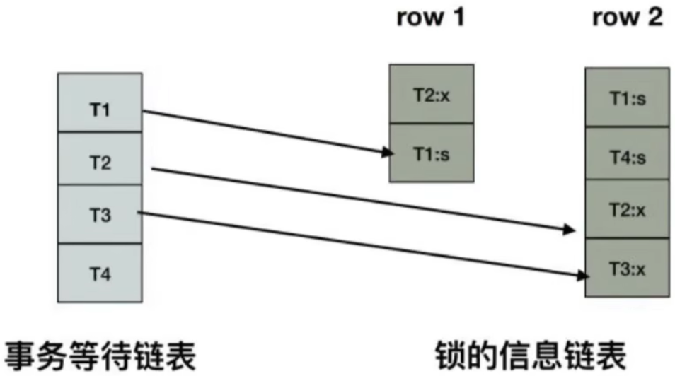

基于这两个信息，可以绘制 wait-for graph 算法等待图：

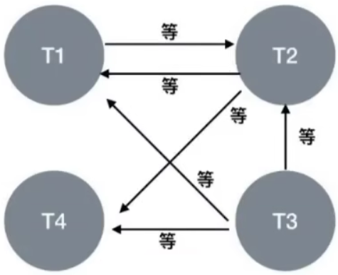

> 死锁检测的原理是构建一个以`事务为顶点、锁为边的有向图`，判断有向图是否存在`环`，存在即有死锁。

一旦检测到回路、有死锁，这时候 InnoDB 存储引擎会选择回滚 undo 量最小的事务，让其他事务继续执行（innodb_deadlock_detect=on 表示开启这个逻辑）。

缺点：每个新的被阻塞的线程，都要判断是不是由于自己的加入导致了死锁，这个操作时间复杂度是 O(n)。如果 100 个并发线程同时更新同一行，意味着要检测 100 * 100 = 1 万次，1 万个线程就会有 1 千万次检测。

**如何解决？**

- 方式 1：关闭死锁检测，但意味着可能会出现大量的超时，会导致业务有损。
- 方式 2：控制并发访问的数量。比如在中间件中实现对于相同行的更新，在进入引擎之前排队，这样在 InnoDB 内部就不会有大量的死锁检测工作。

>进一步的思路：可以考虑通过`将一行改成逻辑上的多行`来减少锁冲突。比如，连锁超市账户总额的记录，可以考虑放到多条记录上，账户总额等于这多个记录的值的总和。

#### 如何避免死锁

- 合理设计索引，使业务 SQL 尽可能通过索引定位更少的行，减少锁竞争。
- 调整业务逻辑 SQL 执行顺序，避免 update/delete 等长时间持有锁的 SQL 在事务前面。
- 避免大事务，尽量将大事务拆成多个小事务来处理，小事务缩短锁定资源的时间，发生锁冲突的几率也更小。
- 在并发比较高的系统中，不要显式加锁，特别是是在事务里显式加锁。如 select … for update 语句，如果是在事务里运行了 start transaction 或设置了 autocommit 等于 0，那么就会锁定所查找到的记录。
- 降低隔离级别。如果业务允许，将隔离级别调低也是较好的选择，比如将隔离级别从 RR 调整为 RC，可以避免掉很多因为 gap 锁造成的死锁。

## 锁的内存结构

前边说对一条记录加锁的本质就是在内存中创建一个`锁结构`与之关联，那么是不是一个事务对多条记录加锁，就要创建多个锁结构呢？比如：

```mysql
# 事务 T1
SELECT * FROM user LOCK IN SHARE MODE;
```

理论上创建多个锁结构没问题，但是如果一个事务要获取 10000 条记录的锁，生成 10000 个锁结构也太崩溃了！所以决定在对不同记录加锁时，如果符合下边这些条件的记录会放到一个锁结构中：

- 在同一个事务中进行加锁操作。
- 被加锁的记录在同一个页面中。
- 加锁的类型是一样的。
- 等待状态是一样的。

InnoDB 存储引擎中的锁结构如下：

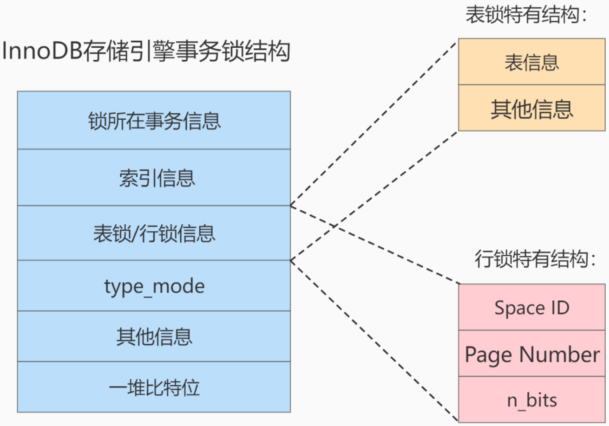

结构解析：

1. `锁所在的事务信息`

   - 不论是表锁还是行锁，都是在事务执行过程中生成的，哪个事务生成了这个锁结构，这里就记录这个事务的信息。
   - 此锁所在的事务信息在内存结构中只是一个指针，通过指针可以找到内存中关于该事务的更多信息，比方说事务id等。

2. `索引信息`

   - 对于行锁来说，需要记录一下加锁的记录是属于哪个索引的。这里也是一个指针。

3. `表锁/行锁信息`：表锁结构和行锁结构在这个位置的内容是不同的。

   - 表锁：记载着是对哪个表加的锁，还有其他的一些信息。
   - 行锁：记载了三个重要的信息。
     - Space ID：记录所在表空间。
     - Page Number：记录所在页号。
     - n_bits：对于行锁来说，一条记录就对应着一个比特位，一个页面中包含很多记录，用不同的比特位来区分到底是哪一条记录加了锁。为此在行锁结构的末尾放置了一堆比特位，这个 n_bits 属性代表使用了多少比特位。n_bits 的值一般都比页面中记录条数多一些，主要是为了之后在页面中插入了新记录后也不至于重新分配锁结构。

4. `type_mode`：这是一个 32 位的数，被分成了`lock_mode`、`lock_type`和`rec_lock_type`三个部分，如图所示。

   

   - `锁的模式 lock_mode`，占用低 4 位，可选的值如下：
     - LOCK_IS（十进制的 0）：表示共享意向锁，也就是 IS 锁。
     - LOCK_IX（十进制的 1）：表示独占意向锁，也就是 IX 锁。
     - LOCK_S（十进制的 2）：表示共享锁，也就是 S 锁。
     - LOCK_X（十进制的 3）：表示独占锁，也就是 X 锁。
     - LOCK_AUTO_INC（十进制的 4）：表示 AUTO-INC 锁。
     - 在 InnoDB 存储引擎中，LOCK_IS，LOCK_IX，LOCK_AUTO_INC 都算是表级锁的模式，LOCK_S 和 LOCK_X 既可以算是表级锁的模式，也可以是行级锁的模式。
   - `锁的类型 lock_type`，占用第 5～8 位，不过现阶段只有第 5 位和第 6 位被使用：
     - LOCK_TABLE（十进制的 16）：也就是当第 5 个比特位置为 1 时，表示表级锁。
     - LOCK_REC（十进制的 32）：也就是当第 6 个比特位置为 1 时，表示行级锁。
   - `行锁的具体类型 rec_lock_type`，使用其余的位来表示。只有在 lock_type 的值为 LOCK_REC 时，也就是只有在该锁为行级锁时，才会被细分为更多的类型：
     - LOCK_ORDINARY（十进制的 0）：表示 next-key 锁 。
     - LOCK_GAP（十进制的 512）：也就是当第 10 个比特位置为 1 时，表示 gap 锁。
     - LOCK_REC_NOT_GAP（十进制的 1024）：也就是当第 11 个比特位置为 1 时，表示正经记录锁。
     - LOCK_INSERT_INTENTION（十进制的 2048）：也就是当第 12 个比特位置为 1 时，表示插入意向锁。
     - 其他的类型：还有一些不常用的类型我们就不多说了。
   - `is_waiting 属性`，基于内存空间的节省，所以把 is_waiting 属性放到了 type_mode 这个 32 位的数字中：
     - LOCK_WAIT（十进制的 256）：当第 9 个比特位置为 1 时，表示 is_waiting 为 true，也就是当前事务尚未获取到锁，处在等待状态；当这个比特位为 0 时，表示 is_waiting 为 false，也就是当前事务获取锁成功。

5. `其他信息`：为了更好的管理系统运行过程中生成的各种锁结构而设计了各种哈希表和链表。

6. `一堆比特位`：如果是行锁结构的话，在该结构末尾还放置了一堆比特位，比特位的数量是由上边提到的 n_bits 属性表示的。InnoDB 数据页中的每条记录在记录头信息中都包含一个 heap_no 属性，伪记录 Infimum 的 heap_no 值为 0，Supremum 的 heap_no 值为 1，之后每插入一条记录，heap_no 值就增 1。锁结构最后的一堆比特位就对应着一个页面中的记录，一个比特位映射一个 heap_no，即一个比特位映射到页内的一条记录。

## 锁监控

关于 MySQL 锁的监控，我们一般可以通过检查`InnoDB_row_lock`等状态变量来分析系统上的行锁的争夺情况：

```mysql
mysql> show status like 'innodb_row_lock%';
+-------------------------------+--------+
| Variable_name                 | Value  |
+-------------------------------+--------+
| Innodb_row_lock_current_waits | 0      |
| Innodb_row_lock_time          | 129831 |
| Innodb_row_lock_time_avg      | 18547  |
| Innodb_row_lock_time_max      | 51095  |
| Innodb_row_lock_waits         | 7      |
+-------------------------------+--------+
5 rows in set (0.00 sec)
```

对各个状态量的说明如下：

- `Innodb_row_lock_current_waits`：当前正在等待锁定的数量。
- `Innodb_row_lock_time`：从系统启动到现在锁定总时间长度。（**等待总时长**）
- `Innodb_row_lock_time_avg`：每次等待所花平均时间。（**等待平均时长**）
- `Innodb_row_lock_time_max`：从系统启动到现在等待最常的一次所花的时间。
- `Innodb_row_lock_waits`：系统启动后到现在总共等待的次数。（**等待总次数**）
- 对于这 5 个状态变量，比较重要的 3 个是 Innodb_row_lock_time，Innodb_row_lock_time_avg 和 Innodb_row_lock_waits。

**其他监控方法：**

MySQL 把事务和锁的信息记录在了`information_schema`库中，涉及到的三张表分别是`INNODB_TRX`、`INNODB_LOCKS`和`INNODB_LOCK_WAITS`。

MySQL 5.7 及之前，可以通过 information_schema.INNODB_LOCKS 查看事务的锁情况，但只能看到阻塞事务的锁；如果事务并未被阻塞，则在该表中看不到该事务的锁情况。

MySQL 8.0 删除了 information_schema.INNODB_LOCKS，添加了`performance_schema.data_locks`，可以通过 performance_schema.data_locks 查看事务的锁情况，和 MySQL 5.7 及之前不同，**performance_schema.data_locks 不但可以看到阻塞该事务的锁，还可以看到该事务所持有的锁。**

同时，information_schema.INNODB_LOCK_WAITS 也被`performance_schema.data_lock_waits`所代替。

## 原文链接

https://github.com/ACatSmiling/zero-to-zero/blob/main/RelationalDatabase/mysql-advanced.md