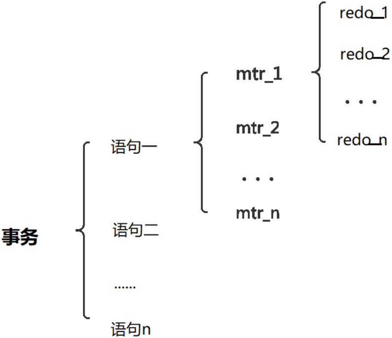

*`Author: ACatSmiling`*

*`Since: 2024-07-22`*

## MySQL 事务日志

事务有 4 种特性：`原子性`、`一致性`、`隔离性`和`持久性`。那么事务的 4 种特性到底是基于什么机制实现呢？

- 事务的**隔离性**由`锁机制`实现。
- 而事务的**原子性、一致性和持久性**由事务的`redo log`和`undo log`来保证。
  - redo log 称为`重做日志`，提供再写入操作，恢复提交事务修改的页操作，用来保证事务的**持久性**。
  - undo log 称为`回滚日志`，回滚行记录到某个特定版本，用来保证事务的**原子性、一致性**。

有的 DBA 或许会认为 undo log 是 redo log 的逆过程，其实不然。redo log 和 undo log 都可以视为是一种`恢复操作`。但是：

- redo log：是存储引擎层（InnoDB）生成的日志，记录的是`物理级别`上的页修改操作，比如页号 xxx、偏移量 yyy 写入了 zzz 数据。主要为了保证`数据的可靠性`。
- undo log：是存储引擎层（InnoDB）生成的日志，记录的是`逻辑操作`日志，比如对某一行数据进行了 INSERT 语句操作，那么 undo log 就记录一条与之相反的 DELETE 操作。主要用于事务的`回滚`（undo log 记录的是每个修改操作的`逆操作`）和`一致性非锁定读`（undo log 回滚行记录到某种特定的版本 ---> MVCC，即多版本并发控制）。

### redo log

InnoDB 存储引擎是`以页为单位`来管理存储空间的。在真正访问页面之前，需要把在`磁盘上的页`缓存到内存中的`Buffer Pool`之后才可以访问。所有的变更都必须先更新缓冲池中的数据，然后缓冲池中的脏页会以一定的频率被刷入磁盘（`checkpoint 机制`），通过缓冲池来优化 CPU 和磁盘之间的鸿沟，这样就可以保证整体的性能不会下降太快。

#### 为什么需要 redo log

一方面，缓冲池可以帮助我们消除 CPU 和磁盘之间的鸿沟，checkpoint 机制可以保证数据的最终落盘，然而由于 checkpoint 并不是每次变更的时候就触发的，而是 master 线程隔一段时间去处理的。所以最坏的情况就是事务提交后，刚写完缓冲池，数据库宕机了，那么这段数据就是丢失的，无法恢复。

另一方面，事务包含持久性的特性，就是说对于一个已经提交的事务，在事务提交后即使系统发生了崩溃，这个事务对数据库中所做的更改也不能丢失。

那么如何保证这个持久性呢？一个简单的做法：`在事务提交完成之前把该事务所修改的所有页面都刷新到磁盘`。但是这个简单粗暴的做法有些问题：

- **修改量与刷新磁盘工作量严重不成比例**
  - 有时候仅仅修改了某个页面中的一个字节，但是我们知道在 InnoDB 中是以页为单位来进行磁盘 I/O 的，也就是说在该事务提交时不得不将一个完整的页面从内存中刷新到慈盘，我们又知道一个页面默认是 16 KB 大小，只修改一个字节就要刷新 16 KB 的数据到磁盘上，显然是太小题大做了。
- **随机 I/O 刷新较慢**
  - 一个事务可能包含很多语句，即使是一条语句也可能修改许多页面，假如该事务修改的这些页面可能并不相邻，这就意味着在将某个事务修改的 Buffer Pool 中的页面刷新到磁盘时，需要进行很多的随机 I/O，随机 I/O 比顺序 I/O 要慢，尤其对于传统的机械硬盘来说。

另一个解决的思路：我们只是想让已经提交了的事务对数据库中数据所做的修改永久生效，即使后来系统崩溃，在重启后也能把这种修改恢复出来。所以，`其实没有必要在每次事务提交时就把该事务在内存中修改过的全部页面刷新到磁盘，只需要把修改了哪些东西记录一下就好。`比如，某个事务将 0 号系统表空间中第 10 号页面中偏移量为 100 处的值 1 改成 2，我们只需记录一下："将第 0 号表空间的第 10 号页面中偏移量为 100 处的值更新为 2"。

InnoDB 引擎的事务采用了`WAL 技术 (Write-Ahead Logging)`，这种技术的思想就是`先写日志，再写磁盘`，只有日志写入成功，才算事务提交成功，这里的日志就是 redo log。当发生宕机且数据未刷到磁盘的时候，可以通过 redo log 来恢复，保证 ACID 中的 D，这就是 redo log 的作用。


#### redo log 的好处和特点

好处：

- redo log 降低了刷盘频率。
- redo log 占用的空间非常小。redo log 存储`表空间 ID`、`页号`、`偏移量`以及`需要更新的值`，所需的存储空间是很小的，刷盘快。

特点：

- redo log 是顺序写入磁盘的。
  - 在执行事务的过程中，每执行一条语句，就可能产生若干条 redo log，这些日志是按照产生的顺序写入磁盘的，也就是使用顺序 I/O，效率比随机 I/O 快。
- 事务执行过程中，redo log 不断记录。
  - redo log 跟 bin log 的区别，redo log 是`存储引擎层`产生的，而 bin log 是`数据库层`产生的。假设一个事务，对表做 10 万行的记录插入，在这个过程中，一直不断的往 redo log 顺序记录，而 bin log 不会记录，直到这个事务提交，才会一次写入到 bin log 文件中（`bin log 是记录主从复制的文件`）。

#### redo log 的组成

redo log 可以简单分为以下两个部分：

- `重做日志缓冲 (redo log buffer)` ，保存在内存中，是易失的。
- `重做日志文件 (redo log file)`，保存在硬盘中，是持久的。

##### redo log buffer

在服务器启动时，就向操作系统申请了一大片称之为`redo log buffer`的`连续内存空间`，翻译成中文就是重做日志缓冲区。这片内存空间被划分成若干个连续的`redo log block`。`一个 redo log block 占用 512 字节大小`。


**参数设置：`innodb_log_buffer_size`。**

- redo log buffer 的大小，默认 16 MB，最大值是 4096 MB，最小值为 1 MB。

  ```mysql
  mysql> SHOW VARIABLES LIKE '%innodb_log_buffer_size%';
  +------------------------+----------+
  | Variable_name          | Value    |
  +------------------------+----------+
  | innodb_log_buffer_size | 16777216 |
  +------------------------+----------+
  1 row in set (0.00 sec)
  ```

##### redo log file

redo log file 如图所示，其中的`ib_logfile0`和`ib_logfile1`即为 redo log：


#### redo log 的整体流程

以一个更新事务为例，redo log 的流转过程，如下图所示：


- 第 1 步：先将原始数据从磁盘中读入内存中来，修改数据的内存拷贝。
- 第 2 步：生成一条重做日志，并写入 redo log buffer，记录的是数据被修改后的值。
- 第 3 步：当事务 COMMIT 时，将 redo log buffer 中的内容刷新到 redo log file，对 redo log file 采用追加写的方式。
- 第 4 步：定期将内存中修改的数据刷新到磁盘中。

>`Write-Ahead Log`：预先日志持久化，在持久化一个数据页之前，先将内存中相应的日志页持久化。

#### redo log 的刷盘策略

redo log 的写入并不是直接写入磁盘的，InnoDB 引擎会在写 redo log 的时候先写 redo log buffer，之后以`一定的频率`刷到真正的 redo log file 中。这里的一定频率怎么看待呢？这就是我们要说的`刷盘策略`。


注意，redo log buffer 刷盘到 redo log file 的过程，并不是真正的刷到磁盘中去，只是刷入到`文件系统缓存`（`page cache`）中去（OS buffer，这是现代操作系统为了提高文件写入效率做的一个优化），真正的写入会交给`系统自己来决定`（比如 page cache 足够大了）。那么对于 InnoDB 来说就存在一个问题，如果交给系统来同步，同样如果系统宕机，那么数据也丢失了（虽然整个系统宕机的概率还是比较小的）。

针对这种情况，InnoDB 给出`innodb_flush_log_at_trx_commit `参数，该参数控制 COMMIT 提交事务时，如何将 redo log buffer 中的日志刷新到 redo log file 中。它支持三种策略：

- `设置为 0`：每次提交事务时，不会将 redo log buffer 中的日志写入 page cache，而是通过一个单独的线程，**每秒**写入 page cache 并调用系统的 fsync() 函数写入磁盘的 redo log file。这种方式不是实时写磁盘的， 而是每隔 1 秒写一次日志，如果系统崩溃，可能会丢失 1 秒的数据。

- `设置为 1`：**默认值**，每次提交事务时，都会将 redo log buffer 中的日志写入 page cache 中，并且会调用 fsync() 函数将日志写入 redo log file 中。这种方式虽然不会再崩溃时丢失数据，但是性能比较差。

  ```mysql
  mysql> SHOW VARIABLES LIKE 'innodb_flush_log_at_trx_commit';
  +--------------------------------+-------+
  | Variable_name                  | Value |
  +--------------------------------+-------+
  | innodb_flush_log_at_trx_commit | 1     |
  +--------------------------------+-------+
  1 row in set (0.00 sec)
  ```

- `设置为 2`：每次提交事务时，都只将 redo log buffer 中的日志写入 page cache 中，之后每隔 1 秒，通过 fsync() 函数将 page cache 中的数据写入 redo log file 中。

>write：`刷盘`，指的是 MySQL 从 buffer pool 中将内容写到系统的 page cache 中，并没有持久化到系统磁盘上。这个速度其实是很快的。
>
>fsync：`持久化到磁盘`，指的是从系统的 page cache 中，将数据持久化到系统磁盘上。这个速度可以认为比较慢，而且也是 IOPS 升高的真正原因。

另外，InnoDB 存储引擎有一个后台线程，`每隔 1 秒`，就会把 redo log buffer 中的内容写到文件系统缓存（page cache），然后调用刷盘操作。


**也就是说，一个没有提交事务的 redo log 记录，也可能会刷盘。因为在事务执行过程 redo log 记录是会写入 redo log buffer 中，这些 redo log 记录会被后台线程刷盘。**


除了后台线程每秒 1 次的轮询操作，还有一种情况，当 redo log buffer 占用的空间即将达到 innodb_log_buffer_size 的`一半`的时候，后台线程会主动刷盘。

#### 不同刷盘策略演示

##### 刷盘策略分析

**1. innodb_flush_log_at_trx_commit = 1**


- innodb_flush_log_at_trx_commit = 1 时，`只要事务提交成功，都会主动同步刷盘，这个速度是很快的。`最终 redo log 记录就一定在硬盘里，不会有任何数据丢失。
- `如果事务执行期间 MySQL 挂了或宕机，这部分日志丢了，但是事务并没有提交，所以日志丢了也不会有损失。`可以保证 ACID 的 D，数据绝对不会丢失，但是这种效率是最差的。
- 建议使用默认值，虽然操作系统宕机的概率理论小于数据库宕机的概率，但是一般既然使用了事务，那么数据的安全相对来说更重要些。

**2. innodb_flush_log_at_trx_commit = 2**


- innodb_flush_log_at_trx_commit = 2 时，只要事务提交成功，redo log buffer 中的内容就会写入文件系统缓存（page cache）。
- 如果只是 MySQL 挂了不会有任何数据丢失，但是操作系统宕机可能会有 1 秒数据的丢失，这种情况下无法满足 ACID 中的 D。
- 数值 2 是一种折中的做法，它的 I/O 效率理论是高于 1，低于 0 的。当进行调优时，为了降低 CPU 的使用率，可以从 1 降成 2，因为 O/S 出现故障的概率很小。

**3. innodb_flush_log_at_trx_commit = 0**


- innodb_flush_log_at_trx_commit = 0 时，master thread 中每 1 秒进行一次重做日志的 fsync 操作，因此实例 crash，`最多丢失 1 秒钟内的事务`。（master thread 是负责将缓冲池中的数据异步刷新到磁盘，保证数据的一致性）
- 数值 0，是一种效率最高的做法，这种策略有丢失数据的风险，也无法保证 D。

> 一句话，**`0：延迟写，延迟刷`，`1：实时写，实时刷`，`2：实时写，延迟刷`**。

##### 示例

比较 innodb_flush_log_at_trx_commit 对事务的影响。准备数据：

```mysql
mysql> USE atguigudb2;
Database changed

mysql> CREATE TABLE test_load(
    -> a INT,
    -> b CHAR(80)
    -> )ENGINE=INNODB;
Query OK, 0 rows affected (0.04 sec)

mysql> DELIMITER //
mysql> CREATE PROCEDURE p_load(COUNT INT UNSIGNED)
    -> BEGIN
    -> DECLARE s INT UNSIGNED DEFAULT 1;
    -> DECLARE c CHAR(80)DEFAULT REPEAT('a',80);
    -> WHILE s<=COUNT DO
    -> INSERT INTO test_load SELECT NULL,c;
    -> COMMIT;
    -> SET s=s+1;
    -> END WHILE;
    -> END //
Query OK, 0 rows affected (0.01 sec)

mysql> DELIMITER ;
```

innodb_flush_log_at_trx_commit = 1 时：

```mysql
mysql> SHOW VARIABLES LIKE 'innodb_flush_log_at_trx_commit';
+--------------------------------+-------+
| Variable_name                  | Value |
+--------------------------------+-------+
| innodb_flush_log_at_trx_commit | 1     |
+--------------------------------+-------+
1 row in set (0.00 sec)

mysql> CALL p_load(30000);
Query OK, 0 rows affected (2 min 3.70 sec)
```

innodb_flush_log_at_trx_commit = 2 时：

```mysql
mysql> TRUNCATE TABLE test_load;
Query OK, 0 rows affected (0.04 sec)

mysql> SET GLOBAL innodb_flush_log_at_trx_commit = 2;
Query OK, 0 rows affected (0.00 sec)

mysql> SHOW VARIABLES LIKE 'innodb_flush_log_at_trx_commit';
+--------------------------------+-------+
| Variable_name                  | Value |
+--------------------------------+-------+
| innodb_flush_log_at_trx_commit | 2     |
+--------------------------------+-------+
1 row in set (0.00 sec)

mysql> CALL p_load(30000);
Query OK, 0 rows affected (1 min 4.00 sec)
```

innodb_flush_log_at_trx_commit = 0 时：

```mysql
mysql> TRUNCATE TABLE test_load;
Query OK, 0 rows affected (0.03 sec)

mysql> SET GLOBAL innodb_flush_log_at_trx_commit = 0;
Query OK, 0 rows affected (0.00 sec)

mysql> SHOW VARIABLES LIKE 'innodb_flush_log_at_trx_commit';
+--------------------------------+-------+
| Variable_name                  | Value |
+--------------------------------+-------+
| innodb_flush_log_at_trx_commit | 0     |
+--------------------------------+-------+
1 row in set (0.00 sec)

mysql> CALL p_load(30000);
Query OK, 0 rows affected (1 min 0.72 sec)
```

最终结果：

| innodb_flush_logat_trx_commit | 执行所用的时间 |
| ----------------------------- | -------------- |
| 0                             | 1 min 0.72 sec |
| 1                             | 2 min 3.70 sec |
| 2                             | 1 min 4.00 sec |

针对上述存储过程，为了提高事务的提交性能，应该在将 3 万行记录插入表后进行一次的 COMMIT 操作，而不是每插入一条记录后就进行一次 COMMIT 操作，这样做的好处是可以使事务方法在 ROLLBACK 时，回滚到事务最开始的确定状态。

>注意：虽然用户可以通过设置参数 innodb_flush_log_at_trx_commit 为 0 或 2 来提高事务提交的性能，但需清楚，这种设置方法丧失了事务的 ACID 特性。

#### 写入 redo log buffer 过程

##### Mini-Transaction

MySQL 把对底层页面中的一次原子访问的过程，称之为一个`Mini-Transaction`，简称 mtr。比如，向某个索引对应的 B+Tree 中，插入一条记录的过程就是一个 Mini-Transaction。`一个 mtr 可以包含一组 redo log`，在进行崩溃恢复时这一组 redo log 作为一个不可分割的整体。

一个事务可以包含若干条语句，`每一条语句其实是由若干个 mtr 组成，每一个 mtr 又可以包含若干条 redo log`，画个图表示它们的关系就是这样：



- 一个事务由多条 SQL 语句组成。
- 一条 SQL 语句包含多个 mtr，因为一条 SQL 可能改变多条记录。
- 一个 mtr 对应多条 redo log，因为 redo log 存放的是物理级别的修改，当插入语句且页分裂时，会出现大量比如 "A 页 xxx、偏移量 yy 写入了 zzz 数据"，"B 页面 aaa、偏移量 bb 写入了 ccc 数据" 这样的记录。

##### redo log 写入 redo log buffer

向 redo log buffer 中写入 redo log 的过程是顺序的，也就是先往前边的 block 中写，当该 block 的空闲空间用完之后，再往下一个 block 中写。当想往 redo log buffer 中写入 redo log 时，第一个遇到的问题就是应该写在哪个 block 的哪个偏移量处，所以 InnoDB 的设计者特意提供了一个称之为`buf_free`的全局变量，该变量指明后续写入的 redo log 应该写入到 redo log buffer 中的哪个位置，如图所示：


一个 mtr 执行过程中，可能产生若干条 redo log，`这些 redo log 是一个不可分割的组`，所以其实并不是每生成一条 redo log，就将其插入到 redo log buffer 中，而是每个 mtr 运行过程中产生的日志`先暂时存到一个地方`，当该 mtr 结束的时候，将过程中产生的一组 redo log 再全部复制到 redo log buffer 中。假设有两个名为 T1、T2 的事务，每个事务都包含 2 个 mtr，我们给这几个 mtr 命名一下：

- 事务 T1 的两个 mtr 分别称为 mtr_T1_1 和 mtr_T1_2。
- 事务 T2 的两个 mtr 分别称为 mtr_T2_1 和 mtr_T2_2。

每个 mtr 都会产生一组 redo log，用示意图来描述一下这些 mtr 产生的日志情况：


不同的事务可能是`并发`执行的，所以 T1、T2 之间的 mtr 可能是`交替执行`的。每当一个 mtr 执行完成时，伴随该 mtr 生成的一组 redo log 就需要被复制到 redo log buffer 中，也就是说，`不同事务的 mtr 可能是交替写入 redo log buffer 的`，我们画个示意图（为了美观，把一个 mtr 中产生的所有的 redo log 当作一个整体来画）：


有的 mtr 产生的 redo log 量可能非常大，比如 mtr_t1_2 产生的 redo log 占用空间比较大，占用了 3 个 block 来存储。

##### redo log block 的结构图

一个 redo log block 是由`日志头`、`日志体`、`日志尾`组成。日志头占用 12 字节，日志尾占用 8 字节，所以一个 block 真正能存储的数据就是 512 - 12 - 8 = 492 字节。


**真正的 redo log 都是存储到占用 496 字节大小的 log block body 中，图中的 log block header 和 log block trailer 存储的是一些管理信息。**我们来看看这些所谓的管理信息都有什么。


- `log block header`的属性分别如下：
  - `LOG_BLOCK_HDR_NO `：log buffer 是由 log block 组成，在内部 log buffer 就好似一个数组，因此 LOG_BLOCK_HDR_NO 用来标记这个数组中的位置。其是递增并且循环使用的，占用 4 个字节，但是由于第—位用来判新是否是 flush bit，所以最大的值为 2 GB。
  - `LOG_BLOCK_HDR_DATA_LEN`：表示 block 中已经使用了多少字节，初始值为`12`，因为 log block body 从第 12 个字节处开始。随着往 block 中写入的 redo log 越来越多，该属性值也跟着增长。如果 log block body 已经被全部写满，那么该属性的值被设置为`512`。
  - `LOG_BLOCK_FIRST_REC_GROUP `：一条 redo log 也可以称之为一条 redo 日志记录（redo log record)，一个 mtr 会生产多条 redo 日志记录，这些 redo 日志记录被称之为一个 redo 日志记录组（redo log record group）。LOG_BLOCK_FIRST_REC_GROUP 就代表该 block 中第一个 mtr 生成的 redo 日志记录组的偏移量（其实也就是这个 block 里，第一个 mtr 生成的第一条 redo 日志的偏移量）。如果该值的大小与 LOG_BLOCK_HDR_DATA_LEN 相同，则表示当前 log block 不包含新的日志。
  - `LOG_BLOCK_CHECKPOINT_NO`：占用 4 字节，表示该 log block 最后被写入时的`checkpoint`。
- `log block trailer`的属性如下：
  - `LOG_BLOCK_CHECKSUN`：表示 block 的校验值，用于正确性校验（其值和 LOG_BLOCK_HDR_NO 相同)，暂时不关心它。

#### redo log file 

##### 相关参数设置

- `innodb_log_group_home_dir `：指定 redo log 文件组所在的路径，默认值为`./`，表示在数据库的数据目录下。MySQL 的默认数据目录（`var/lib/mysql` ）下默认有两个名为`ib_logfile0 `和`ib_logfile1 `的文件，log buffer 中的日志，默认情况下就是刷新到这两个磁盘文件中。此 redo log 文件组位置可以修改。

  ```mysql
  mysql> SHOW VARIABLES LIKE 'innodb_log_group_home_dir';
  +---------------------------+-------+
  | Variable_name             | Value |
  +---------------------------+-------+
  | innodb_log_group_home_dir | ./    |
  +---------------------------+-------+
  1 row in set (0.00 sec)
  ```

- `innodb_log_files_in_group`：指明 redo log file 的个数，命名方式如 ib_logfile0，iblogfile1，…，iblogfilen。默认 2 个，最大 100 个。

  ```mysql
  mysql> SHOW VARIABLES LIKE 'innodb_log_files_in_group';
  +---------------------------+-------+
  | Variable_name             | Value |
  +---------------------------+-------+
  | innodb_log_files_in_group | 2     |
  +---------------------------+-------+
  1 row in set (0.00 sec)
  ```

- `innodb_flush_log_at_trx_commit`：控制 redo log 刷新到磁盘的策略，默认为`1`。

  ```mysql
  mysql> SHOW VARIABLES LIKE 'innodb_flush_log_at_trx_commit';
  +--------------------------------+-------+
  | Variable_name                  | Value |
  +--------------------------------+-------+
  | innodb_flush_log_at_trx_commit | 1     |
  +--------------------------------+-------+
  1 row in set (0.01 sec)
  ```

- `innodb_log_file_size`：单个 redo log file 设置大小，默认值为`48 MB `。最大值为 512 GB，注意最大值指的是整个 redo log 系列文件之和，即（innodb_log_files_in_group * innodb_log_file_size）不能大于最大值 512 GB。

  ```mysql
  mysql> SHOW VARIABLES LIKE 'innodb_log_file_size';
  +----------------------+----------+
  | Variable_name        | Value    |
  +----------------------+----------+
  | innodb_log_file_size | 50331648 |
  +----------------------+----------+
  1 row in set (0.00 sec
  ```

  - 根据业务修改其大小，以便容纳较大的事务。编辑 my.cnf 文件并重启数据库生效，如下所示：

    ```bash
    [root@centos7-mysql-1 mysql]#vim /etc/my.cnf
    innodb_log_file_size=200M
    ```

>在数据库实例更新比较频繁的情况下，可以适当加大 redo log 组数和大小。但也不推荐 redo log 设置过大，在 MySQL 崩溃恢复时，会重新执行 redo log 中的记录。

##### 日志文件组

从上边的描述中可以看到，磁盘上的 redo log file 不止一个，而是以一个`日志文件组`的形式出现的。这些文件以`ib_logfile[数字]`（`数字`可以是`0、1、2…`）的形式进行命名，每个 redo log file 大小都是一样的。

在将 redo log 写入日志文件组时，是从`ib_logfile0`开始写，如果`ib_logfile0`写满了，就接着`ib_logfile1`写。同理，`ib_logf1le1`写满了就去写`ib_logfile2`，依次类准。如果写到最后一个文件该咋办？那就`重新转到 ib_logfile0 继续写`，所以整个过程如下图所示：


总共的 redo log file 大小其实就是：`innodb_log_file_size * innodb_log_files_in_group`。

采用循环使用的方式向 redo log 文件组里写数据的话，会导致后写入的 redo log 覆盖掉前边写的 redo log，基于此，InnoDB 的设计者提出了 checkpoint 的概念。

##### checkpoint

在整个日志文件组中还有两个重要的属性，分别是`write pos`、`checkpoint`。

- write pos 是当前记录的位置，一边写一边后移。
- checkpoint 是当前要擦除的位置，也是往后推移。

**每次刷盘 redo log 记录到日志文件组中，write pos 位置就会后移更新。每次 MySQL 加载日志文件组恢复数据时，会清空加载过的 redo log 记录，并把 checkpoint 后移更新。**write pos 和 checkpoint 之间的还空着的部分，可以用来写入新的 redo log 记录。


如果 write pos 追上 checkpoint ，表示日志文件组满了，这时候不能再写入新的 redo log 记录，MySQL 得停下来，清空一些记录，把 checkpoint 推进一下。


#### 小结

InnoDB 的更新操作，采用的是 Write Ahead Log（预先日志持久化）策略，即先写日志，再写入磁盘：


### undo log

redo log 是事务持久性的保证，undo log 是事务原子性的保证。在事务中更新数据的前置操作，其实是要先写入一个 undo log。

#### 如何理解 undo log

事务需要保证原子性，也就是事务中的操作要么全部完成，要么什么也不做。但有时候事务执行到一半会出现一些情况，比如：

- 情况一：事务执行过程中可能遇到各种错误，比如`服务器本身的错误`，`操作系统错误 `，甚至是突然`断电`导致的错误。
- 情况二：程序员可以在事务执行过程中，手动输入`ROLLBACK `语句结束当前事务的执行。

以上情况出现，需要把数据改回原先的样子，这个过程称之为`回滚` ，这样就可以造成一个假象：这个事务看起来什么都没做，所以符合原子性要求。

每当我们要对一条记录做`改动`时（这里的改动可以指`INSERT`、`DELETE`、`UPDATE `），都需要 "留一手"---> **把回滚时所需的东西记下来**。比如：

- `插入一条记录`时，至少要把这条记录的`主键值`记下来，之后回滚的时候，只需要把这个主键值对应的记录`删除`就好了（对于每个 INSERT，InnoDB 存储引擎会添加一个 DELETE）。
- `删除一条记录`时，至少要把这条记录中的`内容`都记下来，之后回滚的时候，再把由这些内容组成的记录`插入`到表中就好了（对于每个 DELETE，InnoDB 存储引擎会添加一个 INSERT）。

- `修改一条记录`时，至少要把修改这条记录前的`旧值`都记录下来，之后回滚的时候，再把这条记录`更新`为旧值就好了（对于每个 UPDATE，InnoDB 存储引擎会执行一个相反的 UPDATE，将修改前的行放回去）。

MySQL 把这些为了回滚而记录的内容，称之为`撤销日志`或者`回滚日志`，即  undo log。

>说明：
>
>- 由于查询操作（`SELECT`）并不会修改任何用户记录，所以在查询操作执行时，`不需要记录`相应的 undo log。
>- `undo log 会产生 redo log`，也就是 undo log 的产生会伴随着 redo log 的产生，这是因为 undo log 也需要持久性的保护。

#### undo log 的作用

##### 回滚数据

用户对 undo log 可能有误解的认为：undo log 用于将数据库物理地恢复到执行语句或事务之前的样子。但事实并非如此，undo log 是`逻辑日志`，只是将数据库逻辑地恢复到原来的样子。所有修改都被逻辑地取消了，但是**数据结构和页本身在回滚之后可能大不相同**，比如新增的页不会逻辑的进行删除。

这是因为在多用户并发系统中，可能会有数十、数百甚至数千个并发事务，数据库的主要任务就是`协调对数据记录的并发访问`。比如，一个事务在修改当前一个页中某几条记录，同时还有别的事务在对同一个页中另几条记录进行修改。因此，不能将一个页回滚到事务开始的样子，因为这样会影响其他事务正在进行的工作。

##### MVCC

undo log 的另一个作用是`MVCC`，即在 InnoDB 存储引擎中，`MVCC 的实现是通过 undo log 来完成的`。当用户读取一行记录时，若该记录已经被其他事务占用，当前事务可以通过 undo log 读取之前的行版本信息，以此实现`非锁定读取`。

#### undo log 的存储结构

##### 回滚段与 undo 页

InnoDB 对 undo log 的管理采用段的方式，也就是 `回滚段 (rollback segment)`。每个回滚段记录了`1024 `个` undo log segment` ，而在每个 undo log segment 中进行`undo 页`的申请。

- 在 InnoDB 1.1 版本之前（不包括 1.1 版本），只有一个 rollback segment ，因此，支持同时在线的事务限制为`1024`个，实际上这对绝大多数的应用来说都已经够用。
- 从 1.1 版本开始，InnoDB 支持`最大 128 个rollback segment `，故其支持同时在线的事务限制，提高到了`128 * 1024`个。

虽然 InnoDB 1.1 版本支持了 128 个 rollback segment，但是这些 rollback segment 都存储于共享表空间`ibdata`中。从 InnoDB 1.2 版本开始，可通过参数对 rollback segment 做进一步的设置。这些参数包括：

- `innodb_undo_directory`：设置 rollback segment 文件所在的路径。这意味着，rollback segment 可以存放在共享表空间以外的位置，即可以设置为独立表空间。该参数的默认值为 "./"，表示当前 InnoDB 存储引擎的目录。
- `innodb_undo_logs`：设置 rollback segment 的个数，默认值为`128`。在 InnoDB 1.2 版本中，该参数用来替换之前版本的参数 innodb_rollback_segments。
- `innodb_undo_tablespaces`：设置构成 rollback segment 文件的数目，`默认值为 2`，这样 rollback segment 可以较为平均地分布在多个文件中。设置该参数后，会在路径 innodb_undo_directory 看到 undo 为前缀的文件，该文件就代表 rollback segment 文件。

>undo log 相关参数一般很少改动。

##### undo 页的重用

当开启一个事务需要写 undo log 的时候，就得先去 undo log segment 中找到一个空闲的位置，当有空位的时候，就去申请 undo 页，在这个申请到的 undo 页中进行 undo log 的写入。我们知道 MySQL 默认一页的大小是 16 KB。

为每一个事务分配一个页，是非常浪费的（除非你的事务非常长)，假设你的应用的 TPS（每秒处理的事务数目）为 1000，那么 1 秒就需要 1000 个页，大概需要 16 MB 的存储，1 分钟大概需要 1 GB 的存储。如果照这样下去除非 MySQL 清理的非常勤快，否则随着时间的推移，磁盘空间会增长的非常快，而且很多空间都是浪费的。

于是，undo 页就被设计的可以`重用`了，当事务提交时，`不会立刻删除 undo 页`。因为重用，所以这个 undo 页可能混杂着其他事务的 undo log。undo log 在 commit 后，会被放到一个链表中，然后判断 undo 页的使用空间是否小于 3 /4，如果`小于 3/4`的话，则表示当前的 undo 页可以被重用，那么它就不会被回收，其他事务的 undo log 可以记录在当前 undo 页的后面。由于 undo log 是`离散的`，所以清理对应的磁盘空间时，效率不高。

> 因为每一个事务分配一个页，造成极大的浪费，所以要重用 ---> 因为重用，所以当前日志的 undo 页，可能会有其他事务的 undo log  ---> 所以当前事务提交后，不能立即删除 undo 页，而是 undo log 放到链表中，尝试重用 undo 页。

##### 回滚段与事务

1. 每个事务只会使用一个回滚段，一个回滚段在同一时刻可能会服务于多个事务。

2. 当一个事务开始的时候，会指定一个回滚段，在事务进行的过程中，当数据被修改时，原始的数据会被复制到回滚段。

3. 在回滚段中，事务会不断填充盘区，直到事务结束或所有的空间被用完。如果当前的盘区不够用，事务会在段中请求扩展下一个盘区，如果所有已分配的盘区都被用完，事务会覆盖最初的盘区，或者在回滚段允许的情况下扩展新的盘区来使用。

4. 回滚段存在于 undo 表空间中，在数据库中可以存在多个 undo 表空间，但同一时刻只能使用一个 undo 表空间。

   ```mysql
   mysql> SHOW VARIABLES LIKE 'innodb_undo_tablespaces';
   +-------------------------+-------+
   | Variable_name           | Value |
   +-------------------------+-------+
   | innodb_undo_tablespaces | 2     |
   +-------------------------+-------+
   1 row in set (0.00 sec)
   ```

5. 当事务提交时，InnoDB 存储引擎会做以下两件事情：

   - 将 undo log 放入列表中，以供之后的 purge 操作。
   - 判断 undo log 所在的页是否可以重用，若可以分配给下个事务使用。

##### 回滚段中的数据分类

- `未提交的回滚数据 (uncommitted undo information)`：该数据所关联的事务并未提交，用于实现读一致性，所以该数据不能被其他事务的数据覆盖。

- `已经提交但未过期的回滚数据(committed undo information)`：该数据关联的事务已经提交，但是仍受到 "undo retention" 参数的保持时间的影响。
- `事务已经提交并过期的数据(expired undo information)`：该数据关联的事务已经提交，而且数据保存时间已经超过 "undo retention" 参数指定的时间，属于已经过期的数据。当回滚段满了之后，会优先覆盖 "事务已经提交并过期的数据"。

事务提交后并不能马上删除 undo log 及 undo log 所在的页，这是因为可能还有其他事务需要通过 undo log 来得到行记录之前的版本。因此，事务提交时将 undo log 放入一个`链表`中，是否可以最终删除 undo log 及 undo log 所在页，由`purge`线程来判断。

#### undo log 的类型

在 InnoDB 存储引擎中，undo log 分为：

- `insert undo log`
  - insert undo log 是指在`INSERT`操作中产生的 undo log。因为 INSERT 操作的记录，只对事务本身可见，对其他事务不可见（这是事务隔离性的要求），故该 undo log 可以在事务提交后直接删除，不需要进行 purge 操作。
- `update undo log`
  - update undo log 记录的是对`UPDATE`和`DELETE`操作产生的 undo log，该 undo log 可能需要提供`MVCC`机制，因此不能在事务提交时就进行删除。提交时放入 undo log 链表，等待 purge 线程进行最后的删除。

#### undo log 的生命周期

##### 简要生成过程

以下是  undo + redo 事务的简化过程。

假设有 2 个数值，分别为 A = 1 和 B = 2，然后将 A 修改为 3，B 修改为 4：

```mysql
1. start transaction;
2．记录A = 1到undo log;
3. update A = 3;
4. 记录A = 3到redo log;
5．记录B = 2到undo log;
6. update B = 4;
7. 记录B = 4到redo log;
8．将redo log刷新到磁盘;
9. commit;
```

- 在 1 ~ 8 步骤的任意一步，系统宕机，事务未提交，该事务就不会对磁盘上的数据做任何影响。
- 如果在 8 ~ 9 之间宕机，恢复之后可以选择回滚，也可以选择继续完成事务提交，因为此时 redo log 已经持久化。
- 若在 9 之后系统宕机，内存映射中变更的数据还来不及刷回磁盘，那么系统恢复之后，可以根据 redo log 把数据刷回磁盘。

只有 Buffer Pool 的流程：


有了 redo log 和 undo log 之后：


在更新 Buffer Pool 中的数据之前，需要先将该数据事务开始之前的状态写入 undo log 中。假设更新到一半出错了，就可以通过 undo log 来回滚到事务开始前。

##### 详细生成过程

对于 InnoDB 引擎来说，每个行记录除了记录本身的数据之外，还有几个隐藏的列：


- `DB_ROW_ID`：如果没有为表显式的定义主键，并且表中也没有定义唯一索引，那么 InnoDB 会自动为表添加一个 row_id 的`隐藏列`作为主键。
- `DB_TRX_ID`：每个事务都会分配一个事务 ID，当对某条记录发生变更时，就会将这个事务的事务 ID 写入 trx_id 中。
- `DB_ROLL_PTR`：回滚指针，本质上就是指句 undo log 的指针。

**当执行 INSERT 时：**

```mysql
BEGIN;

INSERT INTO user (name) VALUES ("tom");
```

插入的数据都会生成一条`insert undo log`，并且数据的回滚指针会指向它。undo log 会记录 undo log 的序号、插入主键的列和值。那么在进行 rollback 的时候，通过主键直接把对应的数据删除即可。


**当执行 UPDATE 时：**

对于更新的操作会产生`update undo log`，并且会分更新主键的和不更新主键的。

假设现在执行：

```mysql
UPDATE user SET name = "Sun" WHERE id = 1;
```


这时会把老的记录写入新的 undo log，让回滚指针指向新的 undo log，它的 undo no 是 1，并且新的 undo log 会指向老的 undo log，它的 undo no 是 0。

假设现在执行：

```mysql
UPDATE user SET id = 2 WHERE id = 1;
```


对于更新主键的操作，会先把原来的数据 deletemark 标识打开，这时并没有真正的删除数据，`真正的删除会交给清理线程去判断`，然后在后面插入一条新的数据，新的数据也会产生 undo log，并且 undo log 的序号会递增。

可以发现每次对数据的变更都会产生一个 undo log，当一条记录被变更多次时，那么就会产生多条 undo log，undo log 记录的是变更前的日志，并且每个 undo log 的序号是`递增`的，那么当要回滚的时候，按照序号`依次向前推`，就可以找到原始数据。

#### undo log 是如何回滚的

以上面的例子来说，假设执行 rollback，那么对应的流程应该是这样：

1. 通过 undo no = 3 的日志，把 id = 2 的数据删除。
2. 通过 undo no = 2 的日志，把 id = 1 的数据的 deletemark 还原成 0。
3. 通过 undo no = 1 的日志，把 id = 1 的数据的 name 还原成 Tom。
4. 通过 undo no = 0 的日志，把 id = 1 的数据删除。

#### undo log 的删除

对于`insert undo log`：

- 因为 INSERT 操作的记录，只对事务本身可见，对其他事务不可见。故该 undo log 可以在事务提交后直接删除，不需要进行 purge 操作。

对于`update undo log`：

- 该 undo log 可能需要提供 MVCC 机制，因此不能在事务提交时就进行删除。提交时放入 undo log 链表，等待 purge 线程进行最后的删除。

>purge 线程两个主要作用是：`清理 undo 页和清除 page 里面带有 Delete_Bit 标识的数据行`。在 InnoDB 中，事务中的 DELETE 操作，实际上并不是真正的删除掉数据行，而是一种`Delete Mark`操作，在记录上标识`Delete_Bit`，而不删除记录。这是一种 "假删除"，只是做了个标记，**真正的删除工作需要后台 purge 线程去完成**。

#### 小结


- redo log 是物理日志，记录的是数据页的物理变化。
- undo log 是逻辑日志，对事务回滚时，只是将数据库逻辑地恢复到原来的样子。
- undo log 不是 redo log 的逆过程。

## 原文链接

https://github.com/ACatSmiling/zero-to-zero/blob/main/RelationalDatabase/mysql-advanced.md