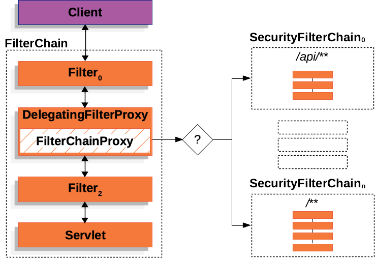

> *`Author: ACatSmiling`*
>
> *`Since: 2024-10-24`*

## 概述

Spring Security 的主要功能：

- **`身份认证（authentication）`**：**身份认证是验证谁正在访问系统资源，判断用户是否为合法用户。**认证用户的常见方式是要求用户输入用户名和密码。
- **`授权（authorization）`**：**用户进行身份认证后，系统会控制谁能访问哪些资源，这个过程叫做授权。**用户无法访问没有权限的资源。
- **`防御常见攻击（protection against common attacks）`**
  - **CSRF**
  - **HTTP Headers**
  - **HTTP Requests**

## 基础功能

Maven 引入依赖：

```xml
<dependency>
    <groupId>org.springframework.boot</groupId>
    <artifactId>spring-boot-starter-security</artifactId>
</dependency>
```

**Spring Security 启动时，默认实现了以下功能：**

- 保护应用程序 URL，要求对应用程序的任何交互进行身份验证。
- 程序启动时生成一个默认用户 user。
- 生成一个默认的随机密码，并将此密码记录在控制台上。
- 生成默认的登录表单和注销页面。
- 提供基于表单的登录和注销流程。
- 对于 Web 请求，重定向到登录页面。
- 对于服务请求，返回 401 未经授权。
- 处理跨站请求伪造（CSRF）攻击。
- 处理会话劫持攻击。
- 写入 Strict-Transport-Security 以确保 HTTPS。
- 写入 X-Content-Type-Options 以处理嗅探攻击。
- 写入 Cache Control 头来保护经过身份验证的资源。
- 写入 X-Frame-Options 以处理点击劫持攻击。

## 自动配置

```java
@EnableWebSecurity 
@Configuration
public class DefaultSecurityConfig {
    @Bean
    @ConditionalOnMissingBean(UserDetailsService.class)
    InMemoryUserDetailsManager inMemoryUserDetailsManager() { 
        String generatedPassword = // ...;
        return new InMemoryUserDetailsManager(User.withUsername("user")
                .password(generatedPassword).roles("USER").build());
    }

    @Bean
    @ConditionalOnMissingBean(AuthenticationEventPublisher.class)
    DefaultAuthenticationEventPublisher defaultAuthenticationEventPublisher(ApplicationEventPublisher delegate) { 
        return new DefaultAuthenticationEventPublisher(delegate);
    }
}
```

- 添加`@EnableWebSecurity`注解，启用 Spring Security 的 Web 安全配置，并添加一个默认的 Filter Chain。
- 生成一个 UserDetailsService Bean，用户名为 user，用户密码为一个随机的 UUID。
- 生成一个用于发布身份验证事件的 AuthenticationEventPublisher Bean。

### DefaultSecurityFilterChain

程序启动后，通过控制台输出，能够看到在`DefaultSecurityFilterChain`中输出的 Spring Security 默认加载的 SecurityFilter 信息。除此之外，也可以在 DefaultSecurityFilterChain 类中设置断点，然后查看默认的 16 个 Filter：

```java
public DefaultSecurityFilterChain(RequestMatcher requestMatcher, List<Filter> filters) {
    if (filters.isEmpty()) {
       logger.info(LogMessage.format("Will not secure %s", requestMatcher));
    }
    else {
       logger.info(LogMessage.format("Will secure %s with %s", requestMatcher, filters));
    }
    this.requestMatcher = requestMatcher;
    this.filters = new ArrayList<>(filters);
}
```


### SecurityProperties

Spring Boot 自动配置时，会将`spring.security`相关的属性，绑定到 SecurityProperties 类。这个类中有一个静态内部类 User，配置了默认的用户名（name = "user"）和密码（password = uuid）：

```java
/*
 * Copyright 2012-2023 the original author or authors.
 *
 * Licensed under the Apache License, Version 2.0 (the "License");
 * you may not use this file except in compliance with the License.
 * You may obtain a copy of the License at
 *
 *      https://www.apache.org/licenses/LICENSE-2.0
 *
 * Unless required by applicable law or agreed to in writing, software
 * distributed under the License is distributed on an "AS IS" BASIS,
 * WITHOUT WARRANTIES OR CONDITIONS OF ANY KIND, either express or implied.
 * See the License for the specific language governing permissions and
 * limitations under the License.
 */

package org.springframework.boot.autoconfigure.security;

import java.util.ArrayList;
import java.util.EnumSet;
import java.util.List;
import java.util.Set;
import java.util.UUID;

import org.springframework.boot.context.properties.ConfigurationProperties;
import org.springframework.boot.web.servlet.DispatcherType;
import org.springframework.boot.web.servlet.filter.OrderedFilter;
import org.springframework.core.Ordered;
import org.springframework.util.StringUtils;

/**
 * Configuration properties for Spring Security.
 *
 * @author Dave Syer
 * @author Andy Wilkinson
 * @author Madhura Bhave
 * @since 1.0.0
 */
@ConfigurationProperties(prefix = "spring.security")
public class SecurityProperties {

    /**
     * Order applied to the {@code SecurityFilterChain} that is used to configure basic
     * authentication for application endpoints. Create your own
     * {@code SecurityFilterChain} if you want to add your own authentication for all or
     * some of those endpoints.
     */
    public static final int BASIC_AUTH_ORDER = Ordered.LOWEST_PRECEDENCE - 5;

    /**
     * Order applied to the {@code WebSecurityCustomizer} that ignores standard static
     * resource paths.
     */
    public static final int IGNORED_ORDER = Ordered.HIGHEST_PRECEDENCE;

    /**
     * Default order of Spring Security's Filter in the servlet container (i.e. amongst
     * other filters registered with the container). There is no connection between this
     * and the {@code @Order} on a {@code SecurityFilterChain}.
     */
    public static final int DEFAULT_FILTER_ORDER = OrderedFilter.REQUEST_WRAPPER_FILTER_MAX_ORDER - 100;

    private final Filter filter = new Filter();

    private final User user = new User();

    public User getUser() {
       return this.user;
    }

    public Filter getFilter() {
       return this.filter;
    }

    public static class Filter {

       /**
        * Security filter chain order for Servlet-based web applications.
        */
       private int order = DEFAULT_FILTER_ORDER;

       /**
        * Security filter chain dispatcher types for Servlet-based web applications.
        */
       private Set<DispatcherType> dispatcherTypes = EnumSet.allOf(DispatcherType.class);

       public int getOrder() {
          return this.order;
       }

       public void setOrder(int order) {
          this.order = order;
       }

       public Set<DispatcherType> getDispatcherTypes() {
          return this.dispatcherTypes;
       }

       public void setDispatcherTypes(Set<DispatcherType> dispatcherTypes) {
          this.dispatcherTypes = dispatcherTypes;
       }

    }

    public static class User {

       /**
        * Default user name.
        */
       private String name = "user";

       /**
        * Password for the default user name.
        */
       private String password = UUID.randomUUID().toString();

       /**
        * Granted roles for the default user name.
        */
       private List<String> roles = new ArrayList<>();

       private boolean passwordGenerated = true;

       public String getName() {
          return this.name;
       }

       public void setName(String name) {
          this.name = name;
       }

       public String getPassword() {
          return this.password;
       }

       public void setPassword(String password) {
          if (!StringUtils.hasLength(password)) {
             return;
          }
          this.passwordGenerated = false;
          this.password = password;
       }

       public List<String> getRoles() {
          return this.roles;
       }

       public void setRoles(List<String> roles) {
          this.roles = new ArrayList<>(roles);
       }

       public boolean isPasswordGenerated() {
          return this.passwordGenerated;
       }

    }

}
```

通过修改 Spring Boot 的配置文件，可以自定义用户名和密码（此时，默认的 user 和随机生成的 UUID 密码会失效）：

```properties
# modify the default login user and password
spring.security.user.name=admin
spring.security.user.password=admin
```

## Architecture（系统架构）

> 官方文档：https://docs.spring.io/spring-security/reference/servlet/architecture.html

This section discusses Spring Security’s high-level architecture within Servlet based applications. We build on this high-level understanding within the [Authentication](https://docs.spring.io/spring-security/reference/servlet/authentication/index.html#servlet-authentication), [Authorization](https://docs.spring.io/spring-security/reference/servlet/authorization/index.html#servlet-authorization), and [Protection Against Exploits](https://docs.spring.io/spring-security/reference/servlet/exploits/index.html#servlet-exploits) sections of the reference.

本节是基于 Servlet 的应用程序中 Spring Security 的架构描述，在 Authentication，Authorization 和 Protection Against Exploits 三个章节中，有对架构的具体实现。

### Filter

Spring Security’s Servlet support is based on Servlet Filters, so it is helpful to look at the role of Filters generally first. The following image shows the typical layering of the handlers for a single HTTP request.

Spring Security 之所以默认帮助我们做了那么多事情，它的**`底层原理是传统的 Servlet 过滤器`**。下图展示了处理一个 Http 请求时，过滤器和 Servlet 的工作流程：


FilterChain, which contains the Filter instances and Servlet that should process the HttpServletRequest, based on the path of the request URI. In a Spring MVC application, the Servlet is an instance of [DispatcherServlet](https://docs.spring.io/spring-framework/docs/6.1.9/reference/html/web.html#mvc-servlet). At most, one Servlet can handle a single HttpServletRequest and HttpServletResponse. However, more than one Filter can be used to:

- Prevent downstream Filter instances or the Servlet from being invoked. In this case, the Filter typically writes the HttpServletResponse.
- Modify the HttpServletRequest or HttpServletResponse used by the downstream Filter instances and the Servlet.

The power of the Filter comes from the FilterChain that is passed into it.

在 Spring MVC 应用程序中，Servlet 是 DispatcherServlet 的一个实例。对于一个 Servlet，最多只能处理一个 HttpServletRequest 和 HttpServletResponse。但是，**我们可以在过滤器中对请求进行修改或增强，一个包含多个 Filter 的 FilterChain 可以实现很多功能。**

一个典型的 FilterChain 示例如下：

```java
public void doFilter(ServletRequest request, ServletResponse response, FilterChain chain) {
	// do something before the rest of the application
    chain.doFilter(request, response); // invoke the rest of the application
    // do something after the rest of the application
}
```

> 由于过滤器只影响下游过滤器实例和 Servlet，因此，调用每个过滤器的顺序极为重要。

### DelegatingFilterProxy

Spring provides a Filter implementation named [DelegatingFilterProxy](https://docs.spring.io/spring-framework/docs/6.1.9/javadoc-api/org/springframework/web/filter/DelegatingFilterProxy.html) that allows bridging between the Servlet container’s lifecycle and Spring’s ApplicationContext. The Servlet container allows registering Filter instances by using its own standards, but it is not aware of Spring-defined Beans. You can register DelegatingFilterProxy through the standard Servlet container mechanisms but delegate all the work to a Spring Bean that implements Filter.

Here is a picture of how DelegatingFilterProxy fits into the [Filter instances and the FilterChain](https://docs.spring.io/spring-security/reference/servlet/architecture.html#servlet-filters-review).

**`DelegatingFilterProxy`是 Spring Security 提供的一个 Filter 实现，可以在 Servlet 容器和 Spring 容器之间建立桥梁。通过使用 DelegatingFilterProxy，就可以将 Servlet 容器中的 Filter 实例放在 Spring 容器中管理。**

下图展示了 DelegatingFilterProxy 是如何与过滤器实例和 FilterChain 相结合的：


- DelegatingFilterProxy 从 Spring 的 ApplicationContext 中查找 Bean Filter~0~，然后调用 Bean Filter~0~。

下面是 DelegatingFilterProxy  的伪代码：

```java
public void doFilter(ServletRequest request, ServletResponse response, FilterChain chain) {
	Filter delegate = getFilterBean(someBeanName); 
	delegate.doFilter(request, response); 
}
```

Another benefit of DelegatingFilterProxy is that it allows delaying looking up Filter bean instances. This is important because the container needs to register the Filter instances before the container can start up. However, Spring typically uses a ContextLoaderListener to load the Spring Beans, which is not done until after the Filter instances need to be registered.

**DelegatingFilterProxy 的另一个好处是可以延迟查找过滤器 bean 实例。**这一点很重要，因为容器需要在启动之前注册过滤器实例。不过，Spring 通常使用 ContextLoaderListener 来加载 Spring Beans，而这要等到需要注册过滤器实例之后才能完成。

### FilterChainProxy

Spring Security’s Servlet support is contained within FilterChainProxy. FilterChainProxy is a special Filter provided by Spring Security that allows delegating to many Filter instances through [SecurityFilterChain](https://docs.spring.io/spring-security/reference/servlet/architecture.html#servlet-securityfilterchain). Since FilterChainProxy is a Bean, it is typically wrapped in a [DelegatingFilterProxy](https://docs.spring.io/spring-security/reference/servlet/architecture.html#servlet-delegatingfilterproxy).

Spring Security 的 Servlet 支持包含在 FilterChainProxy 中。**`FilterChainProxy`是 Spring Security 提供的一种特殊过滤器，允许通过 SecurityFilterChain 委托多个过滤器实例。**

> FilterChainProxy 是一个 Bean，它通常也会被封装在 DelegatingFilterProxy 中。

下图展示了 FilterChainProxy 的作用：


### SecurityFilterChain

[SecurityFilterChain](https://docs.spring.io/spring-security/site/docs/6.3.1/api/org/springframework/security/web/SecurityFilterChain.html) is used by [FilterChainProxy](https://docs.spring.io/spring-security/reference/servlet/architecture.html#servlet-filterchainproxy) to determine which Spring Security Filter instances should be invoked for the current request.

**`SecurityFilterChain`**被 FilterChainProxy 使用，负责查找当前的请求需要执行的 Security Filter 列表。

下图展示了 SecurityFilterChain 的作用：


The [Security Filters](https://docs.spring.io/spring-security/reference/servlet/architecture.html#servlet-security-filters) in SecurityFilterChain are typically Beans, but they are registered with FilterChainProxy instead of [DelegatingFilterProxy](https://docs.spring.io/spring-security/reference/servlet/architecture.html#servlet-delegatingfilterproxy). FilterChainProxy provides a number of advantages to registering directly with the Servlet container or [DelegatingFilterProxy](https://docs.spring.io/spring-security/reference/servlet/architecture.html#servlet-delegatingfilterproxy). 

SecurityFilterChain 中的安全过滤器通常是 Bean，但它们是通过 FilterChainProxy 而不是 DelegatingFilterProxy 注册的。与直接向 Servlet 容器或 DelegatingFilterProxy 注册相比，FilterChainProxy 有许多优点。

First, it provides a starting point for all of Spring Security’s Servlet support. For that reason, if you try to troubleshoot Spring Security’s Servlet support, adding a debug point in FilterChainProxy is a great place to start.

**首先，它为 Spring Security 的所有 Servlet 支持提供了一个起点。**因此，如果你想检查 Spring Security Servlet 支持的故障，在 FilterChainProxy 中添加调试点是一个很好的开始。

Second, since FilterChainProxy is central to Spring Security usage, it can perform tasks that are not viewed as optional. For example, it clears out the SecurityContext to avoid memory leaks. It also applies Spring Security’s [HttpFirewall](https://docs.spring.io/spring-security/reference/servlet/exploits/firewall.html#servlet-httpfirewall) to protect applications against certain types of attacks.

**其次，由于 FilterChainProxy 是 Spring Security 使用的核心，因此它可以执行一些不被视为可选的任务。**例如，它会清除 SecurityContext 以避免内存泄漏。它还会应用 Spring Security 的 HttpFirewall 来保护应用程序免受某些类型的攻击。

In addition, it provides more flexibility in determining when a SecurityFilterChain should be invoked. In a Servlet container, Filter instances are invoked based upon the URL alone. However, FilterChainProxy can determine invocation based upon anything in the HttpServletRequest by using the RequestMatcher interface.

**此外，它还能更灵活地确定何时调用 SecurityFilterChain。**在 Servlet 容器中，过滤器实例仅根据 URL 调用。但是，FilterChainProxy 可以通过使用 RequestMatcher 接口，根据 HttpServletRequest 中的任何内容确定调用。

### Multiple SecurityFilterChain

The following image shows multiple SecurityFilterChain instances:



In the [Multiple SecurityFilterChain](https://docs.spring.io/spring-security/reference/servlet/architecture.html#servlet-multi-securityfilterchain-figure) figure, FilterChainProxy decides which SecurityFilterChain should be used. Only the first SecurityFilterChain that matches is invoked. If a URL of `/api/messages/` is requested, it first matches on the SecurityFilterChain~0~ pattern of `/api/**`, so only SecurityFilterChain~0~ is invoked, even though it also matches on SecurityFilterChain~n~. If a URL of `/messages/` is requested, it does not match on the SecurityFilterChain~0~ pattern of `/api/**`, so FilterChainProxy continues trying each SecurityFilterChain. Assuming that no other SecurityFilterChain instances match, SecurityFilterChainn is invoked.

在上面的**`Multiple SecurityFilterChain`**图中，FilterChainProxy 决定使用哪个 SecurityFilterChain。**只有第一个匹配的 SecurityFilterChain 才会被调用。**

- 如果请求的 URL 是 `/api/messages/`，它首先与 `/api/**` 的 SecurityFilterChain~0~ 模式匹配，因此只调用 SecurityFilterChain~0~，尽管它也与 SecurityFilterChain~n~ 匹配。
- 如果请求的 URL 是 `/messages/`，则它与 `/api/**` 的 SecurityFilterChain~0~ 模式不匹配，因此 FilterChainProxy 会继续尝试每个 SecurityFilterChain。如果没有其他 SecurityFilterChain 实例能够匹配，则调用 SecurityFilterChain~n~。

Notice that SecurityFilterChain~0~ has only three security Filter instances configured. However, SecurityFilterChain~n~ has four security Filter instances configured. It is important to note that each SecurityFilterChain can be unique and can be configured in isolation. In fact, a SecurityFilterChain might have zero security Filter instances if the application wants Spring Security to ignore certain requests.

请注意，上图中，SecurityFilterChain~0~ 只配置了三个安全过滤器实例。但是，SecurityFilterChain~n~ 配置了四个安全过滤器实例。值得注意的是，每个 SecurityFilterChain 都可以是唯一的，并且可以单独配置。事实上，**如果应用程序希望 Spring Security 忽略某些请求，SecurityFilterChain 可能拥有零安全过滤器实例。**

### Security Filters

The Security Filters are inserted into the [FilterChainProxy](https://docs.spring.io/spring-security/reference/servlet/architecture.html#servlet-filterchainproxy) with the [SecurityFilterChain](https://docs.spring.io/spring-security/reference/servlet/architecture.html#servlet-securityfilterchain) API. Those filters can be used for a number of different purposes, like [authentication](https://docs.spring.io/spring-security/reference/servlet/authentication/index.html), [authorization](https://docs.spring.io/spring-security/reference/servlet/authorization/index.html), [exploit protection](https://docs.spring.io/spring-security/reference/servlet/exploits/index.html), and more. The filters are executed in a specific order to guarantee that they are invoked at the right time, for example, the Filter that performs authentication should be invoked before the Filter that performs authorization. It is typically not necessary to know the ordering of Spring Security’s Filters. However, there are times that it is beneficial to know the ordering, if you want to know them, you can check the [FilterOrderRegistration code](https://github.com/spring-projects/spring-security/tree/6.3.1/config/src/main/java/org/springframework/security/config/annotation/web/builders/FilterOrderRegistration.java).

**`Security Filters`通过 SecurityFilterChain API 插入到 FilterChainProxy 中。这些过滤器可用于多种不同目的，如身份验证、授权、漏洞保护等。`过滤器按特定顺序执行`，以确保在正确的时间调用。**例如，执行身份验证的过滤器应在执行授权的过滤器之前调用。通常情况下，没有必要知道 Spring Security 过滤器的顺序。不过，有时知道排序是有好处的，如果你想知道，可以查看 FilterOrderRegistration 代码。

假设有以下配置：

```java
@Configuration
@EnableWebSecurity
public class SecurityConfig {

    @Bean
    public SecurityFilterChain filterChain(HttpSecurity http) throws Exception {
        http
            .csrf(Customizer.withDefaults())
            .authorizeHttpRequests(authorize -> authorize
                .anyRequest().authenticated()
            )
            .httpBasic(Customizer.withDefaults())
            .formLogin(Customizer.withDefaults());
        return http.build();
    }

}
```

上述配置将导致以下过滤器排序：

| Filter                                                       | Added by                             |
| :----------------------------------------------------------- | :----------------------------------- |
| [CsrfFilter](https://docs.spring.io/spring-security/reference/servlet/exploits/csrf.html) | `HttpSecurity#csrf`                  |
| [UsernamePasswordAuthenticationFilter](https://docs.spring.io/spring-security/reference/servlet/authentication/passwords/form.html#servlet-authentication-form) | `HttpSecurity#formLogin`             |
| [BasicAuthenticationFilter](https://docs.spring.io/spring-security/reference/servlet/authentication/passwords/basic.html) | `HttpSecurity#httpBasic`             |
| [AuthorizationFilter](https://docs.spring.io/spring-security/reference/servlet/authorization/authorize-http-requests.html) | `HttpSecurity#authorizeHttpRequests` |

- First, the CsrfFilter is invoked to protect against [CSRF attacks](https://docs.spring.io/spring-security/reference/servlet/exploits/csrf.html).
- Second, the authentication filters are invoked to authenticate the request.
- Third, the AuthorizationFilter is invoked to authorize the request.

> There might be other Filter instances that are not listed above. If you want to see the list of filters invoked for a particular request, you can print them. 

#### Printing the Security Filters

Often times, it is useful to see the list of security Filters that are invoked for a particular request. For example, you want to make sure that the [filter you have added](https://docs.spring.io/spring-security/reference/servlet/architecture.html#adding-custom-filter) is in the list of the security filters.

The list of filters is printed at INFO level on the application startup, so you can see something like the following on the console output for example:（**过滤器列表会在应用程序启动时以 INFO 级别打印**，因此可以在控制台输出中看到如下内容）

```java
2024-07-05 11:24:10.196 [main] INFO  o.s.security.web.DefaultSecurityFilterChain - Will secure any request with [org.springframework.security.web.session.DisableEncodeUrlFilter@54af3cb9, org.springframework.security.web.context.request.async.WebAsyncManagerIntegrationFilter@236fdf, org.springframework.security.web.context.SecurityContextHolderFilter@7634f2b, org.springframework.security.web.header.HeaderWriterFilter@1c30cb85, org.springframework.web.filter.CorsFilter@16e99306, org.springframework.security.web.csrf.CsrfFilter@27585351, org.springframework.security.web.authentication.logout.LogoutFilter@19b07407, org.springframework.security.web.authentication.UsernamePasswordAuthenticationFilter@310a7859, org.springframework.security.web.authentication.ui.DefaultLoginPageGeneratingFilter@4d98e41b, org.springframework.security.web.authentication.ui.DefaultLogoutPageGeneratingFilter@653fb8d1, org.springframework.security.web.authentication.www.BasicAuthenticationFilter@4c531172, org.springframework.security.web.savedrequest.RequestCacheAwareFilter@15639d09, org.springframework.security.web.servletapi.SecurityContextHolderAwareRequestFilter@4fba8eec, org.springframework.security.web.authentication.AnonymousAuthenticationFilter@48581a3b, org.springframework.security.web.access.ExceptionTranslationFilter@624b523, org.springframework.security.web.access.intercept.AuthorizationFilter@4a89ef44]
```

And that will give a pretty good idea of the security filters that are configured for [each filter chain](https://docs.spring.io/spring-security/reference/servlet/architecture.html#servlet-securityfilterchain).

But that is not all, you can also configure your application to print the invocation of each individual filter for each request. That is helpful to see if the filter you have added is invoked for a particular request or to check where an exception is coming from. To do that, you can configure your application to [log the security events](https://docs.spring.io/spring-security/reference/servlet/architecture.html#servlet-logging).

但这还不是全部，也可以配置应用程序，打印每个请求调用每个过滤器的情况。这有助于查看添加的过滤器是否被某个请求调用，或检查异常来自何处。为此，可以对应用程序进行配置，以记录安全事件。

#### Adding a Custom Filter to the Filter Chain

Most of the time, the default security filters are enough to provide security to your application. However, there might be times that you want to add a custom Filter to the security filter chain.

For example, let’s say that you want to add a Filter that gets a tenant id header and check if the current user has access to that tenant. The previous description already gives us a clue on where to add the filter, since we need to know the current user, we need to add it after the authentication filters.

大多数情况下，默认的安全过滤器足以为应用程序提供安全保障，但有时可能需要在安全过滤器链中**添加一个自定义过滤器**。例如，需要添加一个过滤器，获取租户 id 头信息并检查当前用户是否有访问该租户的权限。 

First, let’s create the Filter:

```java
public class TenantFilter implements Filter {

    @Override
    public void doFilter(ServletRequest servletRequest, ServletResponse servletResponse, FilterChain filterChain) throws IOException, ServletException {
        HttpServletRequest request = (HttpServletRequest) servletRequest;
        HttpServletResponse response = (HttpServletResponse) servletResponse;

        String tenantId = request.getHeader("X-Tenant-Id"); 
        boolean hasAccess = isUserAllowed(tenantId); 
        if (hasAccess) {
            filterChain.doFilter(request, response); 
            return;
        }
        throw new AccessDeniedException("Access denied"); 
    }

}
```

The sample code above does the following:

1. Get the tenant id from the request header.
2. Check if the current user has access to the tenant id.
3. If the user has access, then invoke the rest of the filters in the chain.
4. If the user does not have access, then throw an AccessDeniedException.

>Instead of implementing Filter, you can extend from [OncePerRequestFilter](https://docs.spring.io/spring-framework/docs/6.1.9/javadoc-api/org/springframework/web/filter/OncePerRequestFilter.html) which is a base class for filters that are only invoked once per request and provides a doFilterInternal method with the HttpServletRequest and HttpServletResponse parameters.
>
>除了实现 Filter，也可以从**`OncePerRequestFilter`**扩展，它是每个请求只调用一次的过滤器的基类，并提供一个带有 HttpServletRequest 和 HttpServletResponse 参数的 doFilterInternal 方法。

Now, we need to add the filter to the security filter chain.

```java
@Bean
SecurityFilterChain filterChain(HttpSecurity http) throws Exception {
    http
        // ...
        .addFilterBefore(new TenantFilter(), AuthorizationFilter.class); 
    return http.build();
}
```

- Use HttpSecurity#addFilterBefore to add the TenantFilter before the AuthorizationFilter.

By adding the filter before the AuthorizationFilter we are making sure that the TenantFilter is invoked after the authentication filters. You can also use HttpSecurity#addFilterAfter to add the filter after a particular filter or HttpSecurity#addFilterAt to add the filter at a particular filter position in the filter chain.

And that’s it, now the TenantFilter will be invoked in the filter chain and will check if the current user has access to the tenant id.

通过使用**`HttpSecurity#addFilterBefore`**，在授权过滤器（AuthorizationFilter）之前添加过滤器，我们可以确保在身份验证过滤器之后调用租户过滤器（TenantFilter）。也可以使用**`HttpSecurity#addFilterAfter`**在特定过滤器之后添加过滤器，或者使用**`HttpSecurity#addFilterAt`**在过滤器链中的特定过滤器位置添加过滤器。

就这样，现在 TenantFilter 将在过滤器链中被调用，并检查当前用户是否拥有租户 ID 的访问权限。

Be careful when you declare your filter as a Spring bean, either by annotating it with @Component or by declaring it as a bean in your configuration, because Spring Boot will automatically [register it with the embedded container](https://docs.spring.io/spring-boot/docs/3.1.1/reference/html/web.html#web.servlet.embedded-container.servlets-filters-listeners.beans). That may cause the filter to be invoked twice, once by the container and once by Spring Security and in a different order.

**值得注意的是，当将过滤器声明为 Spring Bean 时，无论是使用 @Component 注解，还是在配置中将其声明为 Bean，因为 Spring Boot 会自动将其注册到嵌入式容器中，这可能会导致过滤器被调用两次，一次由容器调用，一次由 Spring Security 调用，而且调用顺序不同。**

If you still want to declare your filter as a Spring bean to take advantage of dependency injection for example, and avoid the duplicate invocation, you can tell Spring Boot to not register it with the container by declaring a FilterRegistrationBean bean and setting its enabled property to false。

如果仍想将过滤器声明为 Spring Bean 以利用依赖注入等功能，并避免重复调用，可以通过**声明一个 FilterRegistrationBean Bean，并将其启用属性设置为 false，从而告诉 Spring Boot 不要将其注册到容器中。**

```java
@Bean
public FilterRegistrationBean<TenantFilter> tenantFilterRegistration(TenantFilter filter) {
    FilterRegistrationBean<TenantFilter> registration = new FilterRegistrationBean<>(filter);
    registration.setEnabled(false);
    return registration;
}
```

>**Spring Security 的过滤器可能会被调用两次，一次由 Servlet 容器调用，一次由 Spring Security 调用，这指的是在同一请求处理过程中，一个自定义的过滤器执行了两次**。
>
>在应用部署时，通常会有一个名为 web.xml 的文件或者使用 Java 基于配置的方式来注册和管理 Filter。对于 Spring Security 来说，它同样拥有自己的一套过滤器链，用于处理认证、授权等安全相关的操作。当开发者在 Spring Security 中自定义一个过滤器并试图将其加入到安全过滤器链时，如果配置不当，就有可能出现过滤器被调用两次的情况。
>
>关于这个问题的进一步探讨，可以从以下几个方面展开：
>
>1. **Filter 的双重注册问题**
>
>  - `Servlet 容器注册`：当 Filter 实现类上使用了 @Bean 注解或在 Servlet 容器的配置文件中声明后，Servlet 容器会自动将其加入到执行链中。
>  - `Spring Security 注册`：同时如果在 Spring Security 的配置中又将该 Filter 加入到安全过滤器链，那么在请求处理流程中，这个 Filter 就会被执行两次。一次是作为普通的 Servlet Filter，另一次是作为安全过滤器链的一部分。
>
>2. Spring Security 过滤器链工作机制
>
>  - 过滤器链的顺序执行：Spring Security 将一系列的安全相关过滤器组成一个链，每个过滤器按顺序处理请求的不同方面，如身份验证、权限校验等。
>  - OncePerRequestFilter 的作用：为了确保每个请求只被过滤一次，Spring Security 专门提供了一个 OncePerRequestFilter 基类。自定义过滤器可以继承此基类以避免重复执行。
>
>3. 引发问题的常见原因
>
>  - 多次添加过滤器：在 Spring Security 的配置文件中，如果不小心将同一个过滤器添加多次，或者在不同位置添加了过滤器，会导致重复执行的问题。
>  - FilterBean 的自动注册：在 Spring 容器管理的 FilterBean 会被自动注册到 Servlet 的过滤器链中，如果再显式添加到 Spring Security 的链中，就会重复执行。
>
>4. 可能引发的相关问题
>
>  - 性能影响：过滤器被重复执行，会增加请求处理的时间和资源消耗，对系统性能产生不良影响。
>  - 逻辑错误：如果过滤器中包含有状态改变的逻辑，重复执行可能导致预期外的状态变化，从而引发逻辑错误和数据一致性问题。
>
>5. **解决方案及其应用**
>
>  - `移除重复注册`：检查并确保过滤器只在 Spring Security 的配置中注册一次，避免在 Servlet 容器和 Spring Security 中双重注册。
>  - `使用 FilterRegistrationBean`：利用 Spring 提供的 FilterRegistrationBean 来管理自定义过滤器的注册，它可以更清晰地控制过滤器的注册位置和条件。
>  - `添加已执行标记`：在过滤器执行时，通过设置请求属性或其他方式来标记过滤器是否已执行，从而避免重复执行的逻辑。
>
>综上所述，可以更好地理解和解决 Spring Security 中自定义过滤器被调用两次的问题。确保过滤器的正确配置和注册，有助于提高应用程序的性能和稳定性。在开发过程中，开发者应当仔细检查他们的配置，并测试过滤器的执行是否符合预期，以保障整个应用的安全性和高效性。

### Handling Security Exceptions

The [ExceptionTranslationFilter](https://docs.spring.io/spring-security/site/docs/6.3.1/api/org/springframework/security/web/access/ExceptionTranslationFilter.html) allows translation of [AccessDeniedException](https://docs.spring.io/spring-security/site/docs/6.3.1/api/org/springframework/security/access/AccessDeniedException.html) and [AuthenticationException](https://docs.spring.io/spring-security/site/docs/6.3.1/api//org/springframework/security/core/AuthenticationException.html) into HTTP responses.

ExceptionTranslationFilter is inserted into the [FilterChainProxy](https://docs.spring.io/spring-security/reference/servlet/architecture.html#servlet-filterchainproxy) as one of the [Security Filters](https://docs.spring.io/spring-security/reference/servlet/architecture.html#servlet-security-filters).

**`ExceptionTranslationFilter`作为 FilterChainProxy 之一插入到过滤器链代理中，它可以将`AccessDeniedException`和`AuthenticationException`转换为 HTTP 响应。**

The following image shows the relationship of ExceptionTranslationFilter to other components:


1. First, the ExceptionTranslationFilter invokes FilterChain.doFilter(request, response) to invoke the rest of the application.
2. If the user is not authenticated or it is an AuthenticationException, then *Start Authentication*.（如果用户未通过身份验证或出现 AuthenticationException，则启动身份验证。）
   - The [SecurityContextHolder](https://docs.spring.io/spring-security/reference/servlet/authentication/architecture.html#servlet-authentication-securitycontextholder) is cleared out.
   - The HttpServletRequest is [saved](https://docs.spring.io/spring-security/reference/servlet/architecture.html#savedrequests) so that it can be used to replay the original request once authentication is successful.
   - The AuthenticationEntryPoint is used to request credentials from the client. For example, it might redirect to a log in page or send a WWW-Authenticate header.
3. Otherwise, if it is an AccessDeniedException, then *Access Denied*. The AccessDeniedHandler is invoked to handle access denied.（如果是 AccessDeniedException，则表示拒绝访问。 调用 AccessDeniedHandler 来处理拒绝访问。）

> If the application does not throw an AccessDeniedException or an AuthenticationException, then ExceptionTranslationFilter does not do anything.
>
> **如果应用程序没有抛出 AccessDeniedException 或 AuthenticationException，则 ExceptionTranslationFilter 不会执行任何操作。**

ExceptionTranslationFilter 的伪代码示例：

```java
try {
	filterChain.doFilter(request, response); 
} catch (AccessDeniedException | AuthenticationException ex) {
	if (!authenticated || ex instanceof AuthenticationException) {
		startAuthentication(); 
	} else {
		accessDenied(); 
	}
}
```

1. As described in [A Review of Filters](https://docs.spring.io/spring-security/reference/servlet/architecture.html#servlet-filters-review), invoking FilterChain.doFilter(request, response) is the equivalent of invoking the rest of the application. This means that if another part of the application, ([FilterSecurityInterceptor](https://docs.spring.io/spring-security/reference/servlet/architecture.html#servlet-authorization-filtersecurityinterceptor) or method security) throws an AuthenticationException or AccessDeniedException it is caught and handled here.
2. If the user is not authenticated or it is an AuthenticationException, *Start Authentication*.
3. Otherwise, *Access Denied*.

### Saving Requests Between Authentication

As illustrated in [Handling Security Exceptions](https://docs.spring.io/spring-security/reference/servlet/architecture.html#servlet-exceptiontranslationfilter), when a request has no authentication and is for a resource that requires authentication, there is a need to save the request for the authenticated resource to re-request after authentication is successful. In Spring Security this is done by saving the HttpServletRequest using a [RequestCache](https://docs.spring.io/spring-security/reference/servlet/architecture.html#requestcache) implementation.

如 Handling Security Exceptions 章节所示，当请求没有经过身份验证，但请求的资源需要身份验证时，就需要保存身份验证资源的请求，以便在身份验证成功后重新请求。 在 Spring Security 中，这是通过使用 RequestCache 保存 HttpServletRequest 来实现的。

#### RequestCache

The HttpServletRequest is saved in the [RequestCache](https://docs.spring.io/spring-security/site/docs/6.3.1/api/org/springframework/security/web/savedrequest/RequestCache.html). When the user successfully authenticates, the RequestCache is used to replay the original request. The [RequestCacheAwareFilter](https://docs.spring.io/spring-security/reference/servlet/architecture.html#requestcacheawarefilter) uses the RequestCache to get the saved HttpServletRequest after the user authenticates, while the ExceptionTranslationFilter uses the RequestCache to save the HttpServletRequest after it detects AuthenticationException, before redirecting the user to the login endpoint.

**HttpServletRequest 保存在`RequestCache`中，当用户成功通过身份验证后，RequestCache 将用于重放原始请求。**RequestCacheAwareFilter 会在用户通过身份验证后使用 RequestCache 获取已保存的 HttpServletRequest，而 ExceptionTranslationFilter 会在检测到 AuthenticationException 后使用 RequestCache 保存 HttpServletRequest，然后再将用户重定向到登录端点。

By default, an HttpSessionRequestCache is used. The code below demonstrates how to customize the RequestCache implementation that is used to check the HttpSession for a saved request if the parameter named continue is present.

**默认情况下，使用的是`HttpSessionRequestCache`。**下面的代码演示了如何自定义 RequestCache 的实现，该实现用于在名为 continue 的参数存在时检查 HttpSession 是否存在已保存的请求。

```java
@Bean
DefaultSecurityFilterChain springSecurity(HttpSecurity http) throws Exception {
	HttpSessionRequestCache requestCache = new HttpSessionRequestCache();
	requestCache.setMatchingRequestParameterName("continue");
	http
		// ...
		.requestCache((cache) -> cache
			.requestCache(requestCache)
		);
	return http.build();
}
```

- RequestCache Only Checks for Saved Requests if continue Parameter Present.（**RequestCache 仅在存在 continue 参数时检查保存的请求**）

##### Prevent the Request From Being Saved

There are a number of reasons you may want to not store the user’s unauthenticated request in the session. You may want to offload that storage onto the user’s browser or store it in a database. Or you may want to shut off this feature since you always want to redirect the user to the home page instead of the page they tried to visit before login.

To do that, you can use [the NullRequestCache implementation](https://docs.spring.io/spring-security/site/docs/6.3.1/api/org/springframework/security/web/savedrequest/NullRequestCache.html).

某些时候，可能并不希望在 session 中存储用户未经身份验证的请求，此时，可以使用 NullRequestCache 实现：

```java
@Bean
SecurityFilterChain springSecurity(HttpSecurity http) throws Exception {
    RequestCache nullRequestCache = new NullRequestCache();
    http
        // ...
        .requestCache((cache) -> cache
            .requestCache(nullRequestCache)
        );
    return http.build();
}
```

#### RequestCacheAwareFilter

The [RequestCacheAwareFilter](https://docs.spring.io/spring-security/site/docs/6.3.1/api/org/springframework/security/web/savedrequest/RequestCacheAwareFilter.html) uses the [RequestCache](https://docs.spring.io/spring-security/reference/servlet/architecture.html#requestcache) to replay the original request.

### Logging

Spring Security provides comprehensive logging of all security related events at the DEBUG and TRACE level. This can be very useful when debugging your application because for security measures Spring Security does not add any detail of why a request has been rejected to the response body. If you come across a 401 or 403 error, it is very likely that you will find a log message that will help you understand what is going on.

Let’s consider an example where a user tries to make a POST request to a resource that has [CSRF protection](https://docs.spring.io/spring-security/reference/servlet/exploits/csrf.html) enabled without the CSRF token. With no logs, the user will see a 403 error with no explanation of why the request was rejected. However, if you enable logging for Spring Security, you will see a log message like this:

```java
2023-06-14T09:44:25.797-03:00 DEBUG 76975 --- [nio-8080-exec-1] o.s.security.web.FilterChainProxy        : Securing POST /hello
2023-06-14T09:44:25.797-03:00 TRACE 76975 --- [nio-8080-exec-1] o.s.security.web.FilterChainProxy        : Invoking DisableEncodeUrlFilter (1/15)
2023-06-14T09:44:25.798-03:00 TRACE 76975 --- [nio-8080-exec-1] o.s.security.web.FilterChainProxy        : Invoking WebAsyncManagerIntegrationFilter (2/15)
2023-06-14T09:44:25.800-03:00 TRACE 76975 --- [nio-8080-exec-1] o.s.security.web.FilterChainProxy        : Invoking SecurityContextHolderFilter (3/15)
2023-06-14T09:44:25.801-03:00 TRACE 76975 --- [nio-8080-exec-1] o.s.security.web.FilterChainProxy        : Invoking HeaderWriterFilter (4/15)
2023-06-14T09:44:25.802-03:00 TRACE 76975 --- [nio-8080-exec-1] o.s.security.web.FilterChainProxy        : Invoking CsrfFilter (5/15)
2023-06-14T09:44:25.814-03:00 DEBUG 76975 --- [nio-8080-exec-1] o.s.security.web.csrf.CsrfFilter         : Invalid CSRF token found for http://localhost:8080/hello
2023-06-14T09:44:25.814-03:00 DEBUG 76975 --- [nio-8080-exec-1] o.s.s.w.access.AccessDeniedHandlerImpl   : Responding with 403 status code
2023-06-14T09:44:25.814-03:00 TRACE 76975 --- [nio-8080-exec-1] o.s.s.w.header.writers.HstsHeaderWriter  : Not injecting HSTS header since it did not match request to [Is Secure]
```

It becomes clear that the CSRF token is missing and that is why the request is being denied.

To configure your application to log all the security events, you can add the following to your application:

- application.properties：

  ```properties
  logging.level.org.springframework.security=TRACE
  ```

- logback.xml：

  ```xml
  <configuration>
      <appender name="STDOUT" class="ch.qos.logback.core.ConsoleAppender">
          <!-- ... -->
      </appender>
      
      <!-- ... -->
      <logger name="org.springframework.security" level="trace" additivity="false">
          <appender-ref ref="Console" />
      </logger>
  </configuration>
  ```

