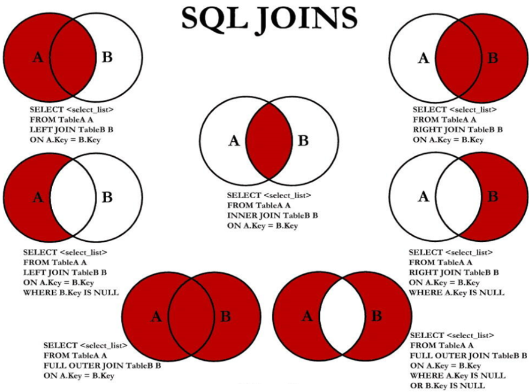
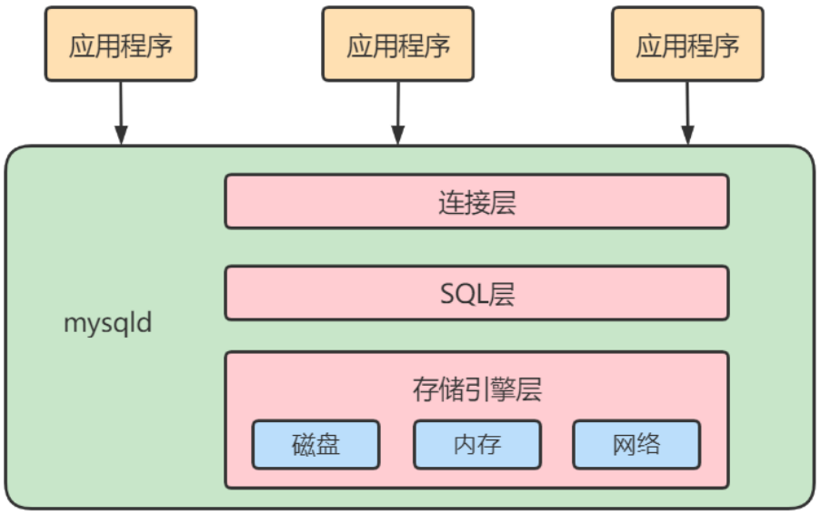
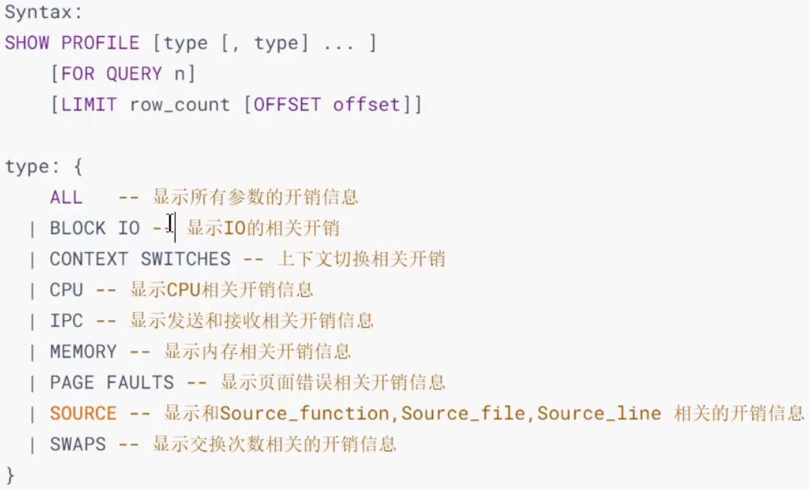
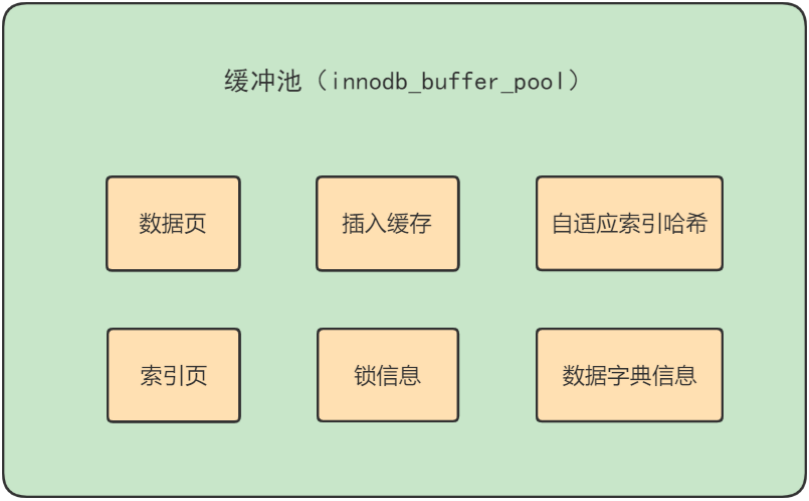
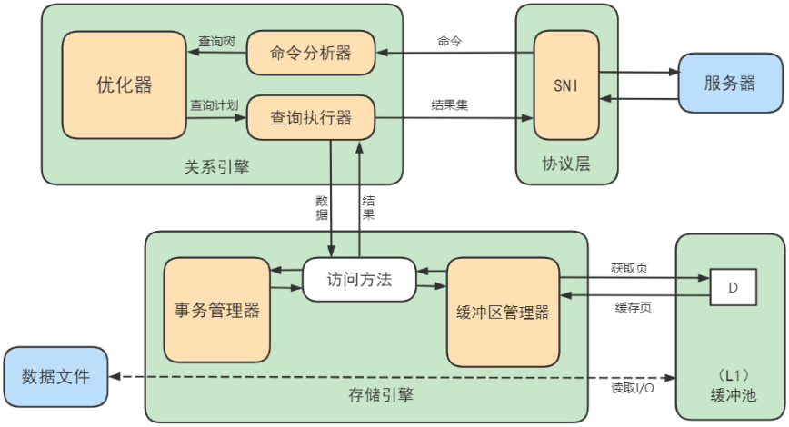
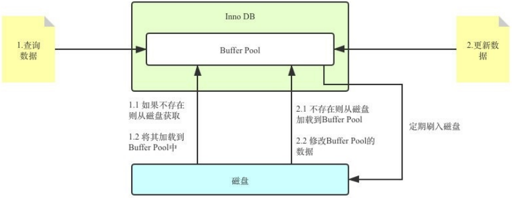
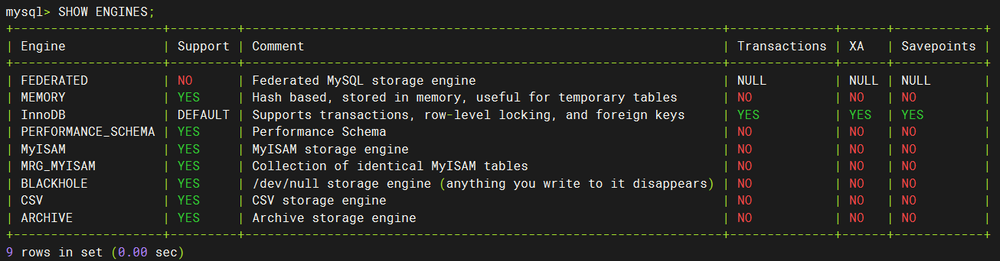

*`Author: ACatSmiling`*

*`Since: 2024-07-22`*

## SELECT 的执行过程

### SELECT 的查询结构

方式一：

```mysql
SELECT ..., ..., ...
FROM ..., ..., ...
WHERE 多表的连接条件
AND 不包含组函数的过滤条件
GROUP BY ..., ...
HAVING 包含组函数的过滤条件
ORDER BY ... ASC/DESC
LIMIT ...,...;
```

方式二：

```mysql
SELECT ..., ..., ...
FROM ...
JOIN ... ON 多表的连接条件
JOIN ... ON 多表的连接条件
...
WHERE 不包含组函数的过滤条件
AND/OR 不包含组函数的过滤条件
GROUP BY ..., ...
HAVING 包含组函数的过滤条件
ORDER BY ... ASC/DESC
LIMIT ..., ...;
```

其中：

- `FROM`：从哪些表中筛选。
- `ON`：关联多表查询时，去除笛卡尔积。
- `WHERE`：从表中筛选的条件。
- `GROUP BY`：分组依据。
- `HAVING`：在统计结果中再次筛选。
- `ORDER BY`：排序。
- `LIMIT`：分页。

### SELECT 的执行顺序

SELECT 查询时的两个顺序：

- **关键字的顺序是不能颠倒的**：

  

- **`SELECT 语句的执行顺序`**（在 MySQL 和 Oracle 中，SELECT 执行顺序基本相同）：

  

比如如下 SQL 语句，它的关键字顺序和执行顺序是下面这样的：

```mysql
SELECT DISTINCT player_id, player_name, COUNT(*) AS num # 顺序 5
FROM player JOIN team ON player.team_id = team.team_id # 顺序 1
WHERE height > 1.80 # 顺序 2
GROUP BY player.team_id # 顺序 3
HAVING num > 2 # 顺序 4
ORDER BY num DESC # 顺序 6
LIMIT 2 # 顺序 7
```

> 在 SELECT 语句执行这些步骤的时候，每个步骤都会产生一个`虚拟表`，然后将这个虚拟表传入下一个步骤中作为输入。需要注意的是，这些步骤隐含在 SQL 的执行过程中，对于用户来说是不可见的。

### SELECT 的执行原理

1. SELECT 是先执行`FROM 阶段`的。在这个阶段，如果是多张表联查，还会经历下面的几个步骤：
   1. 首先先通过 CROSS JOIN 求笛卡尔积，相当于得到虚拟表 vt1-1（virtual table）；
   2. 通过 ON 进行筛选，在虚拟表 vt1-1 的基础上进行筛选，得到虚拟表 vt1-2；
   3. 添加外部行。如果我们使用的是左连接、右链接或者全连接，就会涉及到外部行，也就是在虚拟表 vt1-2 的基础上增加外部行，得到虚拟表 vt1-3。
2. 如果操作的是两张以上的表，还会重复上面的步骤，直到所有表都被处理完为止，这个过程得到的是**原始数据**。
3. 当拿到了查询数据表的原始数据，也就是最终的虚拟表 vt1，就可以在此基础上再进行`WHERE 阶段`。在这个阶段中，会根据 vt1 表的结果进行筛选过滤，得到虚拟表 vt2。
4. 然后进入第三步和第四步，也就是`GROUP BY 和 HAVING 阶段`。在这个阶段中，实际上是在虚拟表 vt2 的基础上进行分组和分组过滤，得到中间的虚拟表 vt3 和 vt4。
5. 当完成了条件筛选部分之后，就可以筛选表中提取的字段，也就是进入到 SELECT 和 DISTINCT 阶段。
6. 之后，在`SELECT 阶段`会提取想要的字段，然后在`DISTINCT 阶段`过滤掉重复的行，分别得到中间的虚拟表 vt5-1 和 vt5-2。
7. 当提取了想要的字段数据之后，就可以按照指定的字段进行排序，也就是`ORDER BY 阶段`，得到虚拟表 vt6。
8. 最后在 vt6 的基础上，取出指定行的记录，也就是`LIMIT 阶段`，得到最终的结果，对应的是虚拟表 vt7。

当然，在写 SELECT 语句的时候，不一定存在所有的关键字，相应的阶段就会省略。

## 7 种 SQL JOINS 的实现



中图：内连接 A ∩ B。

```mysql
mysql> SELECT employee_id, last_name, department_name FROM employees e JOIN departments d ON e.department_id = d.department_id;
+-------------+-------------+------------------+
| employee_id | last_name   | department_name  |
+-------------+-------------+------------------+
|         200 | Whalen      | Administration   |
|         201 | Hartstein   | Marketing        |
|         202 | Fay         | Marketing        |
|         205 | Higgins     | Accounting       |
|         206 | Gietz       | Accounting       |
+-------------+-------------+------------------+
106 rows in set (0.00 sec)
```

> 本文内容，是基于 MySQL 8.0.11 版本。

左上图：左外连接。

```mysql
mysql> SELECT employee_id, last_name, department_name FROM employees e LEFT JOIN departments d ON e.department_id = d.department_id;
+-------------+-------------+------------------+
| employee_id | last_name   | department_name  |
+-------------+-------------+------------------+
|         100 | King        | Executive        |
|         101 | Kochhar     | Executive        |
|         102 | De Haan     | Executive        |
|         178 | Grant       | NULL             |
|         205 | Higgins     | Accounting       |
|         206 | Gietz       | Accounting       |
+-------------+-------------+------------------+
107 rows in set (0.00 sec)
```

右上图：右外连接。

```mysql
mysql> SELECT employee_id, last_name, department_name FROM employees e RIGHT JOIN departments d ON e.department_id = d.`department_id`;
+-------------+-------------+----------------------+
| employee_id | last_name   | department_name      |
+-------------+-------------+----------------------+
|         200 | Whalen      | Administration       |
|         201 | Hartstein   | Marketing            |
|         202 | Fay         | Marketing            |
|        NULL | NULL        | IT Helpdesk          |
|        NULL | NULL        | Government Sales     |
|        NULL | NULL        | Retail Sales         |
|        NULL | NULL        | Recruiting           |
|        NULL | NULL        | Payroll              |
+-------------+-------------+----------------------+
122 rows in set (0.00 sec)
```

左中图：A - A ∩ B。

```mysql
mysql> SELECT employee_id, last_name, department_name FROM employees e LEFT JOIN departments d ON e.department_id = d.department_id WHERE d.department_id IS NULL;
+-------------+-----------+-----------------+
| employee_id | last_name | department_name |
+-------------+-----------+-----------------+
|         178 | Grant     | NULL            |
+-------------+-----------+-----------------+
1 row in set (0.00 sec)
```

右中图：B - A ∩ B。

```mysql
mysql> SELECT employee_id, last_name, department_name FROM employees e RIGHT JOIN departments d ON e.department_id = d.department_id WHERE e.department_id IS NULL;
+-------------+-----------+----------------------+
| employee_id | last_name | department_name      |
+-------------+-----------+----------------------+
|        NULL | NULL      | Treasury             |
|        NULL | NULL      | Corporate Tax        |
|        NULL | NULL      | Control And Credit   |
|        NULL | NULL      | Shareholder Services |
|        NULL | NULL      | Benefits             |
|        NULL | NULL      | Manufacturing        |
|        NULL | NULL      | Construction         |
|        NULL | NULL      | Contracting          |
|        NULL | NULL      | Operations           |
|        NULL | NULL      | IT Support           |
|        NULL | NULL      | NOC                  |
|        NULL | NULL      | IT Helpdesk          |
|        NULL | NULL      | Government Sales     |
|        NULL | NULL      | Retail Sales         |
|        NULL | NULL      | Recruiting           |
|        NULL | NULL      | Payroll              |
+-------------+-----------+----------------------+
16 rows in set (0.00 sec)
```

左下图：满外连接，左中图 + 右上图，A∪B。

```mysql
# 没有去重操作，效率高
mysql> SELECT employee_id, last_name, department_name FROM employees e LEFT JOIN departments d ON e.department_id = d.department_id WHERE d.department_id IS NULL UNION ALL SELECT employee_id, last_name, department_name FROM employees e RIGHT JOIN departments d ON e.department_id = d.department_id;
+-------------+-------------+----------------------+
| employee_id | last_name   | department_name      |
+-------------+-------------+----------------------+
|         178 | Grant       | NULL                 |
|         200 | Whalen      | Administration       |
|         201 | Hartstein   | Marketing            |
|         202 | Fay         | Marketing            |
|         114 | Raphaely    | Purchasing           |
|        NULL | NULL        | Construction         |
|        NULL | NULL        | Contracting          |
|        NULL | NULL        | Operations           |
|        NULL | NULL        | IT Support           |
|        NULL | NULL        | NOC                  |
|        NULL | NULL        | IT Helpdesk          |
|        NULL | NULL        | Government Sales     |
|        NULL | NULL        | Retail Sales         |
|        NULL | NULL        | Recruiting           |
|        NULL | NULL        | Payroll              |
+-------------+-------------+----------------------+
123 rows in set (0.00 sec)
```

右下图：左中图 + 右中图，A ∪B - A ∩ B，或者 (A - A ∩ B) ∪ (B - A ∩ B)。

```mysql
mysql> SELECT employee_id, last_name, department_name FROM employees e LEFT JOIN departments d ON e.department_id = d.department_id WHERE d.department_id IS NULL UNION ALL SELECT employee_id, last_name, department_name FROM employees e RIGHT JOIN departments d ON e.department_id = d.department_id WHERE e.department_id IS NULL;
+-------------+-----------+----------------------+
| employee_id | last_name | department_name      |
+-------------+-----------+----------------------+
|         178 | Grant     | NULL                 |
|        NULL | NULL      | Treasury             |
|        NULL | NULL      | Corporate Tax        |
|        NULL | NULL      | Control And Credit   |
|        NULL | NULL      | Shareholder Services |
|        NULL | NULL      | Benefits             |
|        NULL | NULL      | Manufacturing        |
|        NULL | NULL      | Construction         |
|        NULL | NULL      | Contracting          |
|        NULL | NULL      | Operations           |
|        NULL | NULL      | IT Support           |
|        NULL | NULL      | NOC                  |
|        NULL | NULL      | IT Helpdesk          |
|        NULL | NULL      | Government Sales     |
|        NULL | NULL      | Retail Sales         |
|        NULL | NULL      | Recruiting           |
|        NULL | NULL      | Payroll              |
+-------------+-----------+----------------------+
17 rows in set (0.00 sec)
```

左中图语法格式：

```mysql
# 实现A - A ∩ B
SELECT 字段列表
FROM A表 LEFT JOIN B表
ON 关联条件
WHERE 从表关联字段 IS NULL AND 等其他子句;
```

右中图语法格式：

```mysql
# 实现B - A ∩ B
SELECT 字段列表
FROM A表 RIGHT JOIN B表
ON 关联条件
WHERE 从表关联字段 IS NULL AND 等其他子句;
```

左下图语法格式：

```mysql
# 实现查询结果是A ∪ B，用左外的A，union右外的B
SELECT 字段列表
FROM A表 LEFT JOIN B表
ON 关联条件
WHERE 等其他子句
UNION
SELECT 字段列表
FROM A表 RIGHT JOIN B表
ON 关联条件
WHERE 等其他子句;
```

> 建表语句：
>
> ```mysql
> /*Table structure for table `departments` */
> 
> DROP TABLE IF EXISTS `departments`;
> 
> CREATE TABLE `departments` (
>   `department_id` int(4) NOT NULL DEFAULT '0',
>   `department_name` varchar(30) NOT NULL,
>   `manager_id` int(6) DEFAULT NULL,
>   `location_id` int(4) DEFAULT NULL,
>   PRIMARY KEY (`department_id`),
>   UNIQUE KEY `dept_id_pk` (`department_id`),
>   KEY `dept_loc_fk` (`location_id`),
>   KEY `dept_mgr_fk` (`manager_id`),
>   CONSTRAINT `dept_loc_fk` FOREIGN KEY (`location_id`) REFERENCES `locations` (`location_id`),
>   CONSTRAINT `dept_mgr_fk` FOREIGN KEY (`manager_id`) REFERENCES `employees` (`employee_id`)
> ) ENGINE=InnoDB DEFAULT CHARSET=utf8;
> 
> /*Data for the table `departments` */
> 
> insert into `departments`(`department_id`,`department_name`,`manager_id`,`location_id`) values (10,'Administration',200,1700),(20,'Marketing',201,1800),(30,'Purchasing',114,1700),(40,'Human Resources',203,2400),(50,'Shipping',121,1500),(60,'IT',103,1400),(70,'Public Relations',204,2700),(80,'Sales',145,2500),(90,'Executive',100,1700),(100,'Finance',108,1700),(110,'Accounting',205,1700),(120,'Treasury',NULL,1700),(130,'Corporate Tax',NULL,1700),(140,'Control And Credit',NULL,1700),(150,'Shareholder Services',NULL,1700),(160,'Benefits',NULL,1700),(170,'Manufacturing',NULL,1700),(180,'Construction',NULL,1700),(190,'Contracting',NULL,1700),(200,'Operations',NULL,1700),(210,'IT Support',NULL,1700),(220,'NOC',NULL,1700),(230,'IT Helpdesk',NULL,1700),(240,'Government Sales',NULL,1700),(250,'Retail Sales',NULL,1700),(260,'Recruiting',NULL,1700),(270,'Payroll',NULL,1700);
> 
> /*Table structure for table `employees` */
> 
> DROP TABLE IF EXISTS `employees`;
> 
> CREATE TABLE `employees` (
>   `employee_id` int(6) NOT NULL DEFAULT '0',
>   `first_name` varchar(20) DEFAULT NULL,
>   `last_name` varchar(25) NOT NULL,
>   `email` varchar(25) NOT NULL,
>   `phone_number` varchar(20) DEFAULT NULL,
>   `hire_date` date NOT NULL,
>   `job_id` varchar(10) NOT NULL,
>   `salary` double(8,2) DEFAULT NULL,
>   `commission_pct` double(2,2) DEFAULT NULL,
>   `manager_id` int(6) DEFAULT NULL,
>   `department_id` int(4) DEFAULT NULL,
>   PRIMARY KEY (`employee_id`),
>   UNIQUE KEY `emp_email_uk` (`email`),
>   UNIQUE KEY `emp_emp_id_pk` (`employee_id`),
>   KEY `emp_dept_fk` (`department_id`),
>   KEY `emp_job_fk` (`job_id`),
>   KEY `emp_manager_fk` (`manager_id`),
>   CONSTRAINT `emp_dept_fk` FOREIGN KEY (`department_id`) REFERENCES `departments` (`department_id`),
>   CONSTRAINT `emp_job_fk` FOREIGN KEY (`job_id`) REFERENCES `jobs` (`job_id`),
>   CONSTRAINT `emp_manager_fk` FOREIGN KEY (`manager_id`) REFERENCES `employees` (`employee_id`)
> ) ENGINE=InnoDB DEFAULT CHARSET=utf8;
> 
> /*Data for the table `employees` */
> 
> insert into `employees`(`employee_id`,`first_name`,`last_name`,`email`,`phone_number`,`hire_date`,`job_id`,`salary`,`commission_pct`,`manager_id`,`department_id`) values (100,'Steven','King','SKING','515.123.4567','1987-06-17','AD_PRES',24000.00,NULL,NULL,90),(101,'Neena','Kochhar','NKOCHHAR','515.123.4568','1989-09-21','AD_VP',17000.00,NULL,100,90),(102,'Lex','De Haan','LDEHAAN','515.123.4569','1993-01-13','AD_VP',17000.00,NULL,100,90),(103,'Alexander','Hunold','AHUNOLD','590.423.4567','1990-01-03','IT_PROG',9000.00,NULL,102,60),(104,'Bruce','Ernst','BERNST','590.423.4568','1991-05-21','IT_PROG',6000.00,NULL,103,60),(105,'David','Austin','DAUSTIN','590.423.4569','1997-06-25','IT_PROG',4800.00,NULL,103,60),(106,'Valli','Pataballa','VPATABAL','590.423.4560','1998-02-05','IT_PROG',4800.00,NULL,103,60),(107,'Diana','Lorentz','DLORENTZ','590.423.5567','1999-02-07','IT_PROG',4200.00,NULL,103,60),(108,'Nancy','Greenberg','NGREENBE','515.124.4569','1994-08-17','FI_MGR',12000.00,NULL,101,100),(109,'Daniel','Faviet','DFAVIET','515.124.4169','1994-08-16','FI_ACCOUNT',9000.00,NULL,108,100),(110,'John','Chen','JCHEN','515.124.4269','1997-09-28','FI_ACCOUNT',8200.00,NULL,108,100),(111,'Ismael','Sciarra','ISCIARRA','515.124.4369','1997-09-30','FI_ACCOUNT',7700.00,NULL,108,100),(112,'Jose Manuel','Urman','JMURMAN','515.124.4469','1998-03-07','FI_ACCOUNT',7800.00,NULL,108,100),(113,'Luis','Popp','LPOPP','515.124.4567','1999-12-07','FI_ACCOUNT',6900.00,NULL,108,100),(114,'Den','Raphaely','DRAPHEAL','515.127.4561','1994-12-07','PU_MAN',11000.00,NULL,100,30),(115,'Alexander','Khoo','AKHOO','515.127.4562','1995-05-18','PU_CLERK',3100.00,NULL,114,30),(116,'Shelli','Baida','SBAIDA','515.127.4563','1997-12-24','PU_CLERK',2900.00,NULL,114,30),(117,'Sigal','Tobias','STOBIAS','515.127.4564','1997-07-24','PU_CLERK',2800.00,NULL,114,30),(118,'Guy','Himuro','GHIMURO','515.127.4565','1998-11-15','PU_CLERK',2600.00,NULL,114,30),(119,'Karen','Colmenares','KCOLMENA','515.127.4566','1999-08-10','PU_CLERK',2500.00,NULL,114,30),(120,'Matthew','Weiss','MWEISS','650.123.1234','1996-07-18','ST_MAN',8000.00,NULL,100,50),(121,'Adam','Fripp','AFRIPP','650.123.2234','1997-04-10','ST_MAN',8200.00,NULL,100,50),(122,'Payam','Kaufling','PKAUFLIN','650.123.3234','1995-05-01','ST_MAN',7900.00,NULL,100,50),(123,'Shanta','Vollman','SVOLLMAN','650.123.4234','1997-10-10','ST_MAN',6500.00,NULL,100,50),(124,'Kevin','Mourgos','KMOURGOS','650.123.5234','1999-11-16','ST_MAN',5800.00,NULL,100,50),(125,'Julia','Nayer','JNAYER','650.124.1214','1997-07-16','ST_CLERK',3200.00,NULL,120,50),(126,'Irene','Mikkilineni','IMIKKILI','650.124.1224','1998-09-28','ST_CLERK',2700.00,NULL,120,50),(127,'James','Landry','JLANDRY','650.124.1334','1999-01-14','ST_CLERK',2400.00,NULL,120,50),(128,'Steven','Markle','SMARKLE','650.124.1434','2000-03-08','ST_CLERK',2200.00,NULL,120,50),(129,'Laura','Bissot','LBISSOT','650.124.5234','1997-08-20','ST_CLERK',3300.00,NULL,121,50),(130,'Mozhe','Atkinson','MATKINSO','650.124.6234','1997-10-30','ST_CLERK',2800.00,NULL,121,50),(131,'James','Marlow','JAMRLOW','650.124.7234','1997-02-16','ST_CLERK',2500.00,NULL,121,50),(132,'TJ','Olson','TJOLSON','650.124.8234','1999-04-10','ST_CLERK',2100.00,NULL,121,50),(133,'Jason','Mallin','JMALLIN','650.127.1934','1996-06-14','ST_CLERK',3300.00,NULL,122,50),(134,'Michael','Rogers','MROGERS','650.127.1834','1998-08-26','ST_CLERK',2900.00,NULL,122,50),(135,'Ki','Gee','KGEE','650.127.1734','1999-12-12','ST_CLERK',2400.00,NULL,122,50),(136,'Hazel','Philtanker','HPHILTAN','650.127.1634','2000-02-06','ST_CLERK',2200.00,NULL,122,50),(137,'Renske','Ladwig','RLADWIG','650.121.1234','1995-07-14','ST_CLERK',3600.00,NULL,123,50),(138,'Stephen','Stiles','SSTILES','650.121.2034','1997-10-26','ST_CLERK',3200.00,NULL,123,50),(139,'John','Seo','JSEO','650.121.2019','1998-02-12','ST_CLERK',2700.00,NULL,123,50),(140,'Joshua','Patel','JPATEL','650.121.1834','1998-04-06','ST_CLERK',2500.00,NULL,123,50),(141,'Trenna','Rajs','TRAJS','650.121.8009','1995-10-17','ST_CLERK',3500.00,NULL,124,50),(142,'Curtis','Davies','CDAVIES','650.121.2994','1997-01-29','ST_CLERK',3100.00,NULL,124,50),(143,'Randall','Matos','RMATOS','650.121.2874','1998-03-15','ST_CLERK',2600.00,NULL,124,50),(144,'Peter','Vargas','PVARGAS','650.121.2004','1998-07-09','ST_CLERK',2500.00,NULL,124,50),(145,'John','Russell','JRUSSEL','011.44.1344.429268','1996-10-01','SA_MAN',14000.00,0.40,100,80),(146,'Karen','Partners','KPARTNER','011.44.1344.467268','1997-01-05','SA_MAN',13500.00,0.30,100,80),(147,'Alberto','Errazuriz','AERRAZUR','011.44.1344.429278','1997-03-10','SA_MAN',12000.00,0.30,100,80),(148,'Gerald','Cambrault','GCAMBRAU','011.44.1344.619268','1999-10-15','SA_MAN',11000.00,0.30,100,80),(149,'Eleni','Zlotkey','EZLOTKEY','011.44.1344.429018','2000-01-29','SA_MAN',10500.00,0.20,100,80),(150,'Peter','Tucker','PTUCKER','011.44.1344.129268','1997-01-30','SA_REP',10000.00,0.30,145,80),(151,'David','Bernstein','DBERNSTE','011.44.1344.345268','1997-03-24','SA_REP',9500.00,0.25,145,80),(152,'Peter','Hall','PHALL','011.44.1344.478968','1997-08-20','SA_REP',9000.00,0.25,145,80),(153,'Christopher','Olsen','COLSEN','011.44.1344.498718','1998-03-30','SA_REP',8000.00,0.20,145,80),(154,'Nanette','Cambrault','NCAMBRAU','011.44.1344.987668','1998-12-09','SA_REP',7500.00,0.20,145,80),(155,'Oliver','Tuvault','OTUVAULT','011.44.1344.486508','1999-11-23','SA_REP',7000.00,0.15,145,80),(156,'Janette','King','JKING','011.44.1345.429268','1996-01-30','SA_REP',10000.00,0.35,146,80),(157,'Patrick','Sully','PSULLY','011.44.1345.929268','1996-03-04','SA_REP',9500.00,0.35,146,80),(158,'Allan','McEwen','AMCEWEN','011.44.1345.829268','1996-08-01','SA_REP',9000.00,0.35,146,80),(159,'Lindsey','Smith','LSMITH','011.44.1345.729268','1997-03-10','SA_REP',8000.00,0.30,146,80),(160,'Louise','Doran','LDORAN','011.44.1345.629268','1997-12-15','SA_REP',7500.00,0.30,146,80),(161,'Sarath','Sewall','SSEWALL','011.44.1345.529268','1998-11-03','SA_REP',7000.00,0.25,146,80),(162,'Clara','Vishney','CVISHNEY','011.44.1346.129268','1997-11-11','SA_REP',10500.00,0.25,147,80),(163,'Danielle','Greene','DGREENE','011.44.1346.229268','1999-03-19','SA_REP',9500.00,0.15,147,80),(164,'Mattea','Marvins','MMARVINS','011.44.1346.329268','2000-01-24','SA_REP',7200.00,0.10,147,80),(165,'David','Lee','DLEE','011.44.1346.529268','2000-02-23','SA_REP',6800.00,0.10,147,80),(166,'Sundar','Ande','SANDE','011.44.1346.629268','2000-03-24','SA_REP',6400.00,0.10,147,80),(167,'Amit','Banda','ABANDA','011.44.1346.729268','2000-04-21','SA_REP',6200.00,0.10,147,80),(168,'Lisa','Ozer','LOZER','011.44.1343.929268','1997-03-11','SA_REP',11500.00,0.25,148,80),(169,'Harrison','Bloom','HBLOOM','011.44.1343.829268','1998-03-23','SA_REP',10000.00,0.20,148,80),(170,'Tayler','Fox','TFOX','011.44.1343.729268','1998-01-24','SA_REP',9600.00,0.20,148,80),(171,'William','Smith','WSMITH','011.44.1343.629268','1999-02-23','SA_REP',7400.00,0.15,148,80),(172,'Elizabeth','Bates','EBATES','011.44.1343.529268','1999-03-24','SA_REP',7300.00,0.15,148,80),(173,'Sundita','Kumar','SKUMAR','011.44.1343.329268','2000-04-21','SA_REP',6100.00,0.10,148,80),(174,'Ellen','Abel','EABEL','011.44.1644.429267','1996-05-11','SA_REP',11000.00,0.30,149,80),(175,'Alyssa','Hutton','AHUTTON','011.44.1644.429266','1997-03-19','SA_REP',8800.00,0.25,149,80),(176,'Jonathon','Taylor','JTAYLOR','011.44.1644.429265','1998-03-24','SA_REP',8600.00,0.20,149,80),(177,'Jack','Livingston','JLIVINGS','011.44.1644.429264','1998-04-23','SA_REP',8400.00,0.20,149,80),(178,'Kimberely','Grant','KGRANT','011.44.1644.429263','1999-05-24','SA_REP',7000.00,0.15,149,NULL),(179,'Charles','Johnson','CJOHNSON','011.44.1644.429262','2000-01-04','SA_REP',6200.00,0.10,149,80),(180,'Winston','Taylor','WTAYLOR','650.507.9876','1998-01-24','SH_CLERK',3200.00,NULL,120,50),(181,'Jean','Fleaur','JFLEAUR','650.507.9877','1998-02-23','SH_CLERK',3100.00,NULL,120,50),(182,'Martha','Sullivan','MSULLIVA','650.507.9878','1999-06-21','SH_CLERK',2500.00,NULL,120,50),(183,'Girard','Geoni','GGEONI','650.507.9879','2000-02-03','SH_CLERK',2800.00,NULL,120,50),(184,'Nandita','Sarchand','NSARCHAN','650.509.1876','1996-01-27','SH_CLERK',4200.00,NULL,121,50),(185,'Alexis','Bull','ABULL','650.509.2876','1997-02-20','SH_CLERK',4100.00,NULL,121,50),(186,'Julia','Dellinger','JDELLING','650.509.3876','1998-06-24','SH_CLERK',3400.00,NULL,121,50),(187,'Anthony','Cabrio','ACABRIO','650.509.4876','1999-02-07','SH_CLERK',3000.00,NULL,121,50),(188,'Kelly','Chung','KCHUNG','650.505.1876','1997-06-14','SH_CLERK',3800.00,NULL,122,50),(189,'Jennifer','Dilly','JDILLY','650.505.2876','1997-08-13','SH_CLERK',3600.00,NULL,122,50),(190,'Timothy','Gates','TGATES','650.505.3876','1998-07-11','SH_CLERK',2900.00,NULL,122,50),(191,'Randall','Perkins','RPERKINS','650.505.4876','1999-12-19','SH_CLERK',2500.00,NULL,122,50),(192,'Sarah','Bell','SBELL','650.501.1876','1996-02-04','SH_CLERK',4000.00,NULL,123,50),(193,'Britney','Everett','BEVERETT','650.501.2876','1997-03-03','SH_CLERK',3900.00,NULL,123,50),(194,'Samuel','McCain','SMCCAIN','650.501.3876','1998-07-01','SH_CLERK',3200.00,NULL,123,50),(195,'Vance','Jones','VJONES','650.501.4876','1999-03-17','SH_CLERK',2800.00,NULL,123,50),(196,'Alana','Walsh','AWALSH','650.507.9811','1998-04-24','SH_CLERK',3100.00,NULL,124,50),(197,'Kevin','Feeney','KFEENEY','650.507.9822','1998-05-23','SH_CLERK',3000.00,NULL,124,50),(198,'Donald','OConnell','DOCONNEL','650.507.9833','1999-06-21','SH_CLERK',2600.00,NULL,124,50),(199,'Douglas','Grant','DGRANT','650.507.9844','2000-01-13','SH_CLERK',2600.00,NULL,124,50),(200,'Jennifer','Whalen','JWHALEN','515.123.4444','1987-09-17','AD_ASST',4400.00,NULL,101,10),(201,'Michael','Hartstein','MHARTSTE','515.123.5555','1996-02-17','MK_MAN',13000.00,NULL,100,20),(202,'Pat','Fay','PFAY','603.123.6666','1997-08-17','MK_REP',6000.00,NULL,201,20),(203,'Susan','Mavris','SMAVRIS','515.123.7777','1994-06-07','HR_REP',6500.00,NULL,101,40),(204,'Hermann','Baer','HBAER','515.123.8888','1994-06-07','PR_REP',10000.00,NULL,101,70),(205,'Shelley','Higgins','SHIGGINS','515.123.8080','1994-06-07','AC_MGR',12000.00,NULL,101,110),(206,'William','Gietz','WGIETZ','515.123.8181','1994-06-07','AC_ACCOUNT',8300.00,NULL,205,110);
> ```

## 逻辑架构

### 逻辑架构简图

MySQL 是典型的 C/S 架构，即`Client/Server`架构，服务器端程序使用的是`mysqld`。

不论客户端进程和服务器进程是采用哪种方式进行通信，最后实现的效果都是：`客户端进程向服务器进程发送一段文本 (SQL 语句)，服务器进程处理后再向客户端进程发送一段文本 (处理结果)`。

MySQL 的逻辑架构图，可以简化如下：



- **`连接层`**：客户端和服务器端建立连接，客户端发送 SQL 至服务器端。
- **`SQL 层（服务层）`**：对 SQL 语句进行查询处理；与数据库文件的存储方式无关。
- **`存储引擎层`**：与数据库文件打交道，负责数据的存储和读取。

### SQL 的执行流程

SQL 语句在 MySQL 中的执行流程是：**`SQL 语句 ---> [查询缓存] ---> 解析器 ---> 优化器 ---> 执行器 ---> 返回结果。`**


>从 MySQL 5.7.20 开始，不再推荐使用查询缓存，并在 MySQL 8.0 中删除。

### SQL 的执行原理

面对复杂的逻辑架构图，我们需要抓取最核心的部分：`SQL 的执行原理`。不同的 DBMS 的 SQL 的执行原理是相通的，只是在不同的软件中，各有各的实现路径。

既然一条 SQL 语句会经历不同的模块，那我们就来看下，在不同的模块中，SQL 执行所使用的资源（时间）是怎样的。

下面演示如何在 MySQL 中对一条 SQL 语句的执行时间进行分析。

**第一步，确认 profiling 是否开启。**

了解查询语句底层执行的过程：`select @@profiling;`，或者`show variables like '%profiling%'`查看是否开启计划。开启它可以让 MySQL 收集在 SQL 执行时所使用的资源情况，命令如下：

```mysql
mysql> SELECT @@profiling;
+-------------+
| @@profiling |
+-------------+
|           0 |
+-------------+
1 row in set, 1 warning (0.00 sec)

mysql> SHOW VARIABLES LIKE '%profiling%';
+------------------------+-------+
| Variable_name          | Value |
+------------------------+-------+
| have_profiling         | YES   |
| profiling              | OFF   |
| profiling_history_size | 15    |
+------------------------+-------+
3 rows in set (0.01 sec)

# profiling = 0 代表关闭，需要把 profiling 打开，即设置为 1
mysql> SET profiling = 1;
Query OK, 0 rows affected, 1 warning (0.00 sec)
```

> Profiling 功能由 MySQL 会话变量 profiling 控制，默认是 OFF（关闭状态）。

**第二步，多次执行相同的 SQL 查询。**

```mysql
mysql> SELECT COUNT(1) FROM employees;
+----------+
| COUNT(1) |
+----------+
|      107 |
+----------+
1 row in set (0.01 sec)

mysql> SELECT COUNT(1) FROM employees;
+----------+
| COUNT(1) |
+----------+
|      107 |
+----------+
1 row in set (0.00 sec)

mysql> SELECT COUNT(1) FROM employees;
+----------+
| COUNT(1) |
+----------+
|      107 |
+----------+
1 row in set (0.00 sec)

mysql> SELECT COUNT(1) FROM employees;
+----------+
| COUNT(1) |
+----------+
|      107 |
+----------+
1 row in set (0.00 sec)

mysql> SELECT COUNT(1) FROM employees;
+----------+
| COUNT(1) |
+----------+
|      107 |
+----------+
1 row in set (0.01 sec)
```

**第三步，查看 profiles。**

```mysql
# 查看当前会话产生的所有 profiles
mysql> SHOW profiles;
+----------+------------+-----------------------------------+
| Query_ID | Duration   | Query                             |
+----------+------------+-----------------------------------+
|        1 | 0.00148825 | SHOW VARIABLES LIKE '%profiling%' |
|        2 | 0.00018850 | SELECT DATABASE()                 |
|        3 | 0.00016375 | SELECT DATABASE()                 |
|        4 | 0.00073875 | show databases                    |
|        5 | 0.00081400 | show tables                       |
|        6 | 0.00087100 | SELECT COUNT(1) FROM employees    |
|        7 | 0.00092375 | SELECT COUNT(1) FROM employees    |
|        8 | 0.00126200 | SELECT COUNT(1) FROM employees    |
|        9 | 0.00078000 | SELECT COUNT(1) FROM employees    |
|       10 | 0.00096625 | SELECT COUNT(1) FROM employees    |
+----------+------------+-----------------------------------+
10 rows in set, 1 warning (0.00 sec)
```

**第四步，查看 profile。**

```mysql
# 默认显示最后一次查询的执行计划，查看程序的执行步骤
mysql> SHOW profile;
+--------------------------------+----------+
| Status                         | Duration |
+--------------------------------+----------+
| starting                       | 0.000132 |
| Executing hook on transaction  | 0.000029 |
| starting                       | 0.000022 |
| checking permissions           | 0.000013 |  # 权限检查
| Opening tables                 | 0.000079 |  # 打开表
| init                           | 0.000009 |  # 初始化
| System lock                    | 0.000013 |  # 锁系统
| optimizing                     | 0.000006 |  # 优化查询
| statistics                     | 0.000024 |
| preparing                      | 0.000019 |  # 准备
| executing                      | 0.000537 |  # 执行
| end                            | 0.000006 |
| query end                      | 0.000003 |
| waiting for handler commit     | 0.000006 |
| closing tables                 | 0.000005 |
| freeing items                  | 0.000060 |
| cleaning up                    | 0.000007 |
+--------------------------------+----------+
17 rows in set, 1 warning (0.00 sec)
```

```mysql
# 也可以查询指定的 Query ID，Query 10 即为最后一次查询的 ID，与上面的结果相同
mysql> SHOW profile FOR QUERY 10;
+--------------------------------+----------+
| Status                         | Duration |
+--------------------------------+----------+
| starting                       | 0.000132 |
| Executing hook on transaction  | 0.000029 |
| starting                       | 0.000022 |
| checking permissions           | 0.000013 |
| Opening tables                 | 0.000079 |
| init                           | 0.000009 |
| System lock                    | 0.000013 |
| optimizing                     | 0.000006 |
| statistics                     | 0.000024 |
| preparing                      | 0.000019 |
| executing                      | 0.000537 |
| end                            | 0.000006 |
| query end                      | 0.000003 |
| waiting for handler commit     | 0.000006 |
| closing tables                 | 0.000005 |
| freeing items                  | 0.000060 |
| cleaning up                    | 0.000007 |
+--------------------------------+----------+
17 rows in set, 1 warning (0.00 sec)
```

```mysql
# 还可以查询更丰富的内容，例如 CPU、IO 阻塞
mysql> SHOW profile cpu, block io FOR QUERY 10;
+--------------------------------+----------+----------+------------+--------------+---------------+
| Status                         | Duration | CPU_user | CPU_system | Block_ops_in | Block_ops_out |
+--------------------------------+----------+----------+------------+--------------+---------------+
| starting                       | 0.000132 | 0.000075 |   0.000061 |            0 |             0 |
| Executing hook on transaction  | 0.000029 | 0.000013 |   0.000011 |            0 |             0 |
| starting                       | 0.000022 | 0.000011 |   0.000010 |            0 |             0 |
| checking permissions           | 0.000013 | 0.000008 |   0.000006 |            0 |             0 |
| Opening tables                 | 0.000079 | 0.000043 |   0.000036 |            0 |             0 |
| init                           | 0.000009 | 0.000005 |   0.000003 |            0 |             0 |
| System lock                    | 0.000013 | 0.000007 |   0.000006 |            0 |             0 |
| optimizing                     | 0.000006 | 0.000003 |   0.000003 |            0 |             0 |
| statistics                     | 0.000024 | 0.000013 |   0.000010 |            0 |             0 |
| preparing                      | 0.000019 | 0.000011 |   0.000009 |            0 |             0 |
| executing                      | 0.000537 | 0.000849 |   0.000000 |            0 |             0 |
| end                            | 0.000006 | 0.000006 |   0.000000 |            0 |             0 |
| query end                      | 0.000003 | 0.000002 |   0.000000 |            0 |             0 |
| waiting for handler commit     | 0.000006 | 0.000006 |   0.000000 |            0 |             0 |
| closing tables                 | 0.000005 | 0.000005 |   0.000000 |            0 |             0 |
| freeing items                  | 0.000060 | 0.000060 |   0.000000 |            0 |             0 |
| cleaning up                    | 0.000007 | 0.000006 |   0.000000 |            0 |             0 |
+--------------------------------+----------+----------+------------+--------------+---------------+
17 rows in set, 1 warning (0.00 sec)

mysql> SHOW profile cpu, block io FOR QUERY 9;
+--------------------------------+----------+----------+------------+--------------+---------------+
| Status                         | Duration | CPU_user | CPU_system | Block_ops_in | Block_ops_out |
+--------------------------------+----------+----------+------------+--------------+---------------+
| starting                       | 0.000073 | 0.000039 |   0.000032 |            0 |             0 |
| Executing hook on transaction  | 0.000003 | 0.000002 |   0.000001 |            0 |             0 |
| starting                       | 0.000006 | 0.000003 |   0.000003 |            0 |             0 |
| checking permissions           | 0.000004 | 0.000002 |   0.000002 |            0 |             0 |
| Opening tables                 | 0.000027 | 0.000015 |   0.000012 |            0 |             0 |
| init                           | 0.000004 | 0.000002 |   0.000001 |            0 |             0 |
| System lock                    | 0.000006 | 0.000003 |   0.000003 |            0 |             0 |
| optimizing                     | 0.000004 | 0.000002 |   0.000002 |            0 |             0 |
| statistics                     | 0.000014 | 0.000008 |   0.000006 |            0 |             0 |
| preparing                      | 0.000012 | 0.000007 |   0.000006 |            0 |             0 |
| executing                      | 0.000524 | 0.000477 |   0.000390 |            0 |             0 |
| end                            | 0.000009 | 0.000003 |   0.000003 |            0 |             0 |
| query end                      | 0.000003 | 0.000002 |   0.000001 |            0 |             0 |
| waiting for handler commit     | 0.000006 | 0.000003 |   0.000002 |            0 |             0 |
| closing tables                 | 0.000006 | 0.000003 |   0.000003 |            0 |             0 |
| freeing items                  | 0.000073 | 0.000040 |   0.000033 |            0 |             0 |
| cleaning up                    | 0.000008 | 0.000004 |   0.000003 |            0 |             0 |
+--------------------------------+----------+----------+------------+--------------+---------------+
17 rows in set, 1 warning (0.00 sec)
```

除了查看 CPU、IO 阻塞等参数情况，还可以查看下列参数的利用情况：



### 数据库缓冲池（Buffer Pool）

InnoDB 存储引擎是以页为单位来管理存储空间的，我们进行的增删改查操作其实本质上都是在访问页面（包括读页面、写页面、创建新页面等操作）。`磁盘 I/O 需要消耗的时间很多，而在内存中进行操作，效率则会高很多。`为了能让数据表或者索引中的数据随时被所用，DBMS 会申请`占用内存来作为数据缓冲池`，在真正访问页面之前，需要把在磁盘上的页缓存到内存中的 Buffer Pool 之后才可以访问。

这样做的好处是可以让磁盘活动最小化，从而`减少与磁盘直接进行 I/O 的时间`。要知道，这种策略对提升 SQL 语句的查询性能来说至关重要，如果索引的数据在缓冲池里，那么访问的成本就会降低很多。

#### 查询缓存 vs 缓冲池

##### 查询缓存

查询缓存是提前把`查询结果缓存`起来，这样下次不需要执行就可以直接拿到结果。需要说明的是，在 MySQL 中的查询缓存，不是缓存查询计划，而是查询对应的结果。因为命中条件苛刻，而且只要数据表发生变化，查询缓存就会失效，因此命中率低。

##### 缓冲池

首先需要了解在 InnoDB 存储引擎中，缓冲池都包括了哪些。

在 InnoDB 存储引擎中有一部分数据会放到内存中，缓冲池则占了这部分内存的大部分，它用来存储各种数据的缓存，如下图所示：



从图中，能看到 InnoDB 缓冲池包括了数据页、索引页、插入缓冲、锁信息、自适应 Hash 和数据字典信息等。

**缓存池的重要性：**

对于使用 InnoDB 作为存储引擎的表来说，不管是用于存储用户数据的索引（包括聚簇索引和二级索引），还是各种系统数据，都是以`页`的形式存放在`表空间`中的，而所谓的表空间只不过是 InnoDB 对文件系统上一个或几个实际文件的抽象，也就是说数据归根结底还是存储在磁盘上。同时，磁盘的速度，远远跟不上 CPU 的速度。因此，缓冲池可以很大程度上消除 CPU 和磁盘之间的鸿沟。

所以，InnoDB 存储引擎在处理客户端的请求时，当需要访问某个页的数据时，就会把`完整的页数据全部加载到内存中`，也就是说，即使只需要访问一个页的一条记录，也需要先把整个页的数据加载到内存中。将整个页加载到内存中后，就可以进行读写访问，在进行完读写访问之后，并不会立即把页对应的内存空间释放掉，而是将其缓存起来，这样将来有请求再次访问该页面时，就可以省去磁盘 I/O 的开销。

**缓存原则：**

`位置 * 频次`这个原则，可以对磁盘 I/O 访问效率进行优化。

**首先，位置决定效率。**提供缓冲池就是为了在内存中可以直接访问数据。

**其次，频次决定优先级顺序。**因为缓冲池的大小是有限的，比如磁盘有 200 GB，但是内存只有 16 GB，缓冲池大小只有 1 GB，就无法将所有数据都加载到缓冲池里，这时就涉及到优先级顺序，会`优先对使用频次高的热数据进行加载`。

**缓冲池的预读特性：**

缓冲池的作用是提升磁盘 I/O 效率，而进行读取数据的时候，存在一个`局部性原理`（空间局部性和时间局部性），也就是使用了一些数据后，`大概率还会使用它周围的一些数据`，因此采用`预读`的机制提前加载，可以减少未来可能的磁盘 I/O 操作。

#### 缓冲池如何读取数据

缓冲池管理器会尽量将经常使用的数据保存起来，在数据库进行页面读操作的时候，首先会判断该页面是否在缓冲池中，如果存在就直接读取，如果不存在，就会通过内存或磁盘将页面存放到缓冲池中再进行读取。

缓存在数据库中的结构和作用如下图所示：



如果执行 SQL 语句的时候更新了缓存池中的数据，那么这些数据会马上同步到磁盘上吗？

实际上，当对数据库中的记录进行修改的时候，首先会修改缓冲池中页里面的记录信息，然后数据库会`以一定的频率刷新到磁盘上`。

注意：并不是每一次发生更新操作，都会立刻进行磁盘回写，缓冲池会采用一种叫做`checkpoint`的机制，将数据回写到磁盘上，这样做的好处就是提升了数据库的整体性能。

比如，当缓冲池不够用时，需要释放掉一些不常用的页，此时就可以强行采用 checkpoint 的方式，将不常用的脏页回写到磁盘上，然后再从缓冲池中将这些页释放掉。这些`脏页（dirty page）`指的是缓冲池中被修改过的页，与磁盘上的数据页不一致。 

#### 查看和设置缓冲池的大小

如果你使用的是 MySQL MyISAM 存储引擎，它只缓存索引，不缓存数据，对应的键缓存参数`key_buffer_size`，你可以用它进行查看。

如果你使用的是 InnoDB 存储引擎，可以通过查看`innodb_buffer_pool_size`变量来查看缓冲池的大小。命令如下：

```mysql
mysql> SHOW VARIABLES LIKE 'innodb_buffer_pool_size';
+-------------------------+-----------+
| Variable_name           | Value     |
+-------------------------+-----------+
| innodb_buffer_pool_size | 134217728 |
+-------------------------+-----------+
1 row in set (0.00 sec)
```

InnoDB 的缓冲池大小，默认只有 $134217728 / 1024 / 1024 = 128$ MB。缓冲池大小可以修改，比如改为 256 MB：

```mysql
mysql> SET GLOBAL innodb_buffer_pool_size = 268435456;
Query OK, 0 rows affected (0.00 sec)

mysql> SHOW VARIABLES LIKE 'innodb_buffer_pool_size';
+-------------------------+-----------+
| Variable_name           | Value     |
+-------------------------+-----------+
| innodb_buffer_pool_size | 268435456 |
+-------------------------+-----------+
1 row in set (0.00 sec)
```

> 也可以通过配置文件修改：
>
> ```tex
> [server]
> innodb_buffer_pool_size = 268435456
> ```

#### 多个缓冲池实例

Buffer Pool 本质是 InnoDB 向操作系统申请的一块`连续的内存空间`，在多线程环境下，访问 Buffer Pool 中的数据都需要`加锁`处理。在 Buffer Pool 特别大而且多线程并发访问特别高的情况下，单一的 Buffer Pool 可能会影响请求的处理速度。所以在 Buffer Pool 特别大的时候，可以把它们`拆分成若干个小的 Buffer Pool`，每个 Buffer Pool 都称之为一个`实例`，它们彼此是独立的，独立的申请内存空间，独立的管理各种链表。因此，在多线程并发访问时并不会相互影响，从而提高并发处理能力。

可以在服务器启动的时候，通过设置`innodb_buffer_pool_instances`的值，来修改 Buffer Pool 实例的个数：

```tex
[server]
innodb_buffer_pool_instances = 1
```

这样就表明我们要创建 1 个 Buffer Pool 实例。

命令查看缓冲池实例的个数：

```mysql
mysql> SHOW VARIABLES LIKE 'innodb_buffer_pool_instances';
+------------------------------+-------+
| Variable_name                | Value |
+------------------------------+-------+
| innodb_buffer_pool_instances | 1     |
+------------------------------+-------+
1 row in set (0.00 sec)
```

每个 Buffer Pool 实例实际占用的内存空间：`innodb_buffer_pool_size/innodb_buffer_pool_instances`。也就是总共的缓冲池大小除以实例的个数，结果就是每个 Buffer Pool 实例占用的内存空间大小。

不过也不是 Buffer Pool 的实例创建的越多越好，分别`管理各个 Buffer Pool 也需要性能开销`，InnoDB 规定：**当 innodb_buffer_pool_size 的值小于 1 GB 的时候，设置多个实例是无效的，此时，InnoDB 会默认把 innodb_buffer_pool_instances 的值修改为 1。当 innodb_buffer_pool_size 的值大于或等于 1 GB 的时候，建议设置多个实例。**

#### 引申问题

Buffer Pool 是 MySQL 内存结构中十分核心的一个组成，可以先把它想象成一个黑盒子。

黑盒下的更新数据流程：



当查询数据的时候，会先去 Buffer Pool 中查询，如果 Buffer Pool 中不存在，存储引擎会先将数据从磁盘加载到 Buffer Pool 中，然后将数据返回给客户端。同理，当更新某个数据的时候，如果这个数据不存在于 Buffer Pool 中，存储引擎也会先将数据从磁盘加载到 Buffer Pool 中，然后修改 Buffer Pool 中的数据，被修改过的数据（脏数据），会在之后统一刷入磁盘中。

这个过程存在一个问题，假如修改 Buffer Pool 中的数据成功，但还未将数据刷入磁盘时，MySQL 服务发生异常宕机。此时，更新后的数据只存在于 Buffer Pool 中，因为 MySQL 宕机，会导致这部分修改的数据丢失。再者，更新操作到一半时，MySQL 服务发生异常宕机，此时，需要回滚到更新之前的状态，又该如何处理呢？

答案是：`redo log 和 undo log`。

## 存储引擎

为了便于管理，人们把`连接管理`、`查询缓存`、`语法解析`、`查询优化`这些并不涉及真实数据存储的功能划分为`MySQL Server`的功能，把真实存取数据的功能划分为`存储引擎`的功能。在 MySQL Server 完成了查询优化后，只需要按照生成的`执行计划`调用底层存储引擎提供的 API，获取到数据后返回给客户端就可以了。

简而言之，**`存储引擎就是指表的类型`**。存储引擎最开始叫表处理器，后来改名为存储引擎，它的功能就是接收上层传下来的指令，然后对表中的数据进行提取或写入操作。

### 查看存储引擎

查看 MySQL 提供的存储引擎：



```mysql
mysql> SHOW ENGINES;
+--------------------+---------+----------------------------------------------------------------+--------------+------+------------+
| Engine             | Support | Comment                                                        | Transactions | XA   | Savepoints |
+--------------------+---------+----------------------------------------------------------------+--------------+------+------------+
| FEDERATED          | NO      | Federated MySQL storage engine                                 | NULL         | NULL | NULL       |
| MEMORY             | YES     | Hash based, stored in memory, useful for temporary tables      | NO           | NO   | NO         |
| InnoDB             | DEFAULT | Supports transactions, row-level locking, and foreign keys     | YES          | YES  | YES        |
| PERFORMANCE_SCHEMA | YES     | Performance Schema                                             | NO           | NO   | NO         |
| MyISAM             | YES     | MyISAM storage engine                                          | NO           | NO   | NO         |
| MRG_MYISAM         | YES     | Collection of identical MyISAM tables                          | NO           | NO   | NO         |
| BLACKHOLE          | YES     | /dev/null storage engine (anything you write to it disappears) | NO           | NO   | NO         |
| CSV                | YES     | CSV storage engine                                             | NO           | NO   | NO         |
| ARCHIVE            | YES     | Archive storage engine                                         | NO           | NO   | NO         |
+--------------------+---------+----------------------------------------------------------------+--------------+------+------------+
9 rows in set (0.00 sec)
```

### 设置系统默认的存储引擎

查看默认的存储引擎：

```mysql
# 方式一
mysql> SHOW VARIABLES LIKE '%storage_engine%';
+---------------------------------+-----------+
| Variable_name                   | Value     |
+---------------------------------+-----------+
| default_storage_engine          | InnoDB    |
| default_tmp_storage_engine      | InnoDB    |
| disabled_storage_engines        |           |
| internal_tmp_mem_storage_engine | TempTable |
+---------------------------------+-----------+
4 rows in set (0.00 sec)

# 方式二
mysql> SELECT @@default_storage_engine;
+--------------------------+
| @@default_storage_engine |
+--------------------------+
| InnoDB                   |
+--------------------------+
1 row in set (0.00 sec)
```

如果在创建表的语句中没有显式指定表的存储引擎的话，那就会`默认使用 InnoDB 作为表的存储引擎`。如果想改变表的默认存储引擎的话，可以这样写启动服务器的命令行：

```mysql
SET DEFAULT_STORAGE_ENGINE = MyISAM;
```

或者修改 my.cnf 文件，然后重启服务：

```tex
default-storage-engine=MyISAM
```

### 设置表的存储引擎

存储引擎是负责对表中的数据进行提取和写入工作的，`可以为不同的表设置不同的存储引擎`，也就是说不同的表可以有不同的物理存储结构，不同的提取和写入方式。

#### 创建表时指定存储引擎

显式的指定表的存储引擎：

```mysql
CREATE TABLE 表名(
	建表语句;
) ENGINE = 存储引擎名称;
```

#### 修改表的存储引擎

如果表已经建好了，也可以修改表的存储引擎：

```mysql
ALTER TABLE 表名 ENGINE = 存储引擎名称;
```

修改完后，可以查看表结构验证是否修改成功，例如：

```mysql
mysql> SHOW CREATE TABLE engine_demo_table\G
*************************** 1. row ***************************
Table: engine_demo_table
Create Table: CREATE TABLE `engine_demo_table` (
  `i` int(11) DEFAULT NULL
) ENGINE=InnoDB DEFAULT CHARSET=utf8
1 row in set (0.01 sec)
```

### MyISAM vs InnoDB

MySQL 5.5 之前默认的存储引擎是 MyISAM，5.5 之后改为了 InnoDB。

**首先，对于 InnoDB 存储引擎，提供了良好的事务管理、崩溃修复能力和并发控制。**因为 InnoDB 存储引擎支持事务，所以对于要求事务完整性的场合，需要选择 InnoDB。比如数据操作除了插入和查询以外，还包含很多更新、删除操作，像财务系统等对数据准确性要求较高的系统。缺点是读写效率稍差，占用的数据空间相对较大。

**其次，对于 MyISAM 存储引擎，如果是小型应用，系统以读操作和插入操作为主，只有很少的更新、删除操作，并且对事务的要求没有那么高，则可以选择这个存储引擎。**MyISAM 存储引擎的优势在于占用空间小、处理速度快。缺点是不支持事务的完整性和并发性。

这两种存储引擎各有特点，当然，在 MySQL 中，也可以针对不同的数据表，可以选择不同的存储引擎。

| 对比项         | MyISAM                                                     | InnoDB                                                       |
| -------------- | ---------------------------------------------------------- | ------------------------------------------------------------ |
| 外键           | 不支持                                                     | 支持                                                         |
| 事务           | 不支持                                                     | 支持                                                         |
| 行表锁         | 表锁，即使操作一条记录，也会锁住整个表，不适合高并发的操作 | 行锁，操作时只锁某一行，对其他行没有影响，适合高并发的操作   |
| 缓存           | 只缓存索引，不缓存真实数据                                 | 不仅缓存索引，也缓存真实数据，对内存要求较高，而且内存大小对性能有决定性的影响 |
| 自带系统表使用 | Y                                                          | N                                                            |
| 关注点         | 性能：节省资源、消耗少、简单业务                           | 事务：并发写、事务、更大资源                                 |
| 默认安装       | Y                                                          | Y                                                            |
| 默认使用       | N                                                          | Y                                                            |

### InnoDB 架构

- `缓冲池`：缓冲池是主内存中的一部分空间，用来缓存已使用的表和索引数据。缓冲池使得经常被使用的数据能够直接在内存中获得，从而提高速度。
- `更改缓存`：更改缓存是一个特殊的数据结构，当受影响的索引页不在缓存中时，更改缓存会缓存辅助索引页的更改。索引页被其他读取操作时会加载到缓存池，缓存的更改内容就会被合并。不同于集群索引，辅助索引并非独一无二的。当系统大部分闲置时，清除操作会定期运行，将更新的索引页刷入磁盘。更新缓存合并期间，可能会大大降低查询的性能。在内存中，更新缓存占用一部分 InnoDB 缓冲池。在磁盘中，更新缓存是系统表空间的一部分。更新缓存的数据类型由 innodb_change_buffering 配置项管理。
- `自适应哈希索引`：自适应哈希索引将负载和足够的内存结合起来，使得 InnoDB 像内存数据库一样运行，不需要降低事务上的性能或可靠性。这个特性通过 innodb_adaptive_hash_index 选项配置，或者通过 --skip-innodb_adaptive_hash_index 命令行在服务启动时关闭。
- `重做日志缓存`：重做日志缓存存放要放入重做日志的数据。重做日志缓存大小通过 innodb_log_buffer_size 配置项配置。重做日志缓存会定期地将日志文件刷入磁盘。大型的重做日志缓存使得大型事务能够正常运行而不需要写入磁盘。
- `系统表空间`：系统表空间包括 InnoDB 数据字典、双写缓存、更新缓存和撤销日志，同时也包括表和索引数据。多表共享，系统表空间被视为共享表空间。
- `双写缓存`：双写缓存位于系统表空间中，用于写入从缓存池刷新的数据页。只有在刷新并写入双写缓存后，InnoDB 才会将数据页写入合适的位置。
- `撤销日志`：撤销日志是一系列与事务相关的撤销记录的集合，包含如何撤销事务最近的更改。如果其他事务要查询原始数据，可以从撤销日志记录中追溯未更改的数据。撤销日志存在于撤销日志片段中，这些片段包含于回滚片段中。
- `每个表一个文件的表空间`：每个表一个文件的表空间是指每个单独的表空间创建在自身的数据文件中，而不是系统表空间中。这个功能通过 innodb_file_per_table 配置项开启。每个表空间由一个单独的 .ibd 数据文件代表，该文件默认被创建在数据库目录中。
- `通用表空间`：使用 CREATE TABLESPACE 语法创建共享的 InnoDB 表空间。通用表空间可以创建在 MySQL 数据目录之外能够管理多个表并支持所有行格式的表。
- `撤销表空间`：撤销表空间由一个或多个包含撤销日志的文件组成。撤销表空间的数量由 innodb_undo_tablespaces 配置项配置。
- `临时表空间`：用户创建的临时表空间和基于磁盘的内部临时表都创建于临时表空间。innodb_temp_data_file_path 配置项定义了相关的路径、名称、大小和属性。如果该值为空，默认会在 innodb_data_home_dir 变量指定的目录下创建一个自动扩展的数据文件。
- `重做日志`：重做日志是基于磁盘的数据结构，在崩溃恢复期间使用，用来纠正数据。正常操作期间，重做日志会将请求数据进行编码，这些请求会改变 InnoDB 表数据。遇到意外崩溃后，未完成的更改会自动在初始化期间重新进行。

## 原文链接

https://github.com/ACatSmiling/zero-to-zero/blob/main/RelationalDatabase/mysql.md