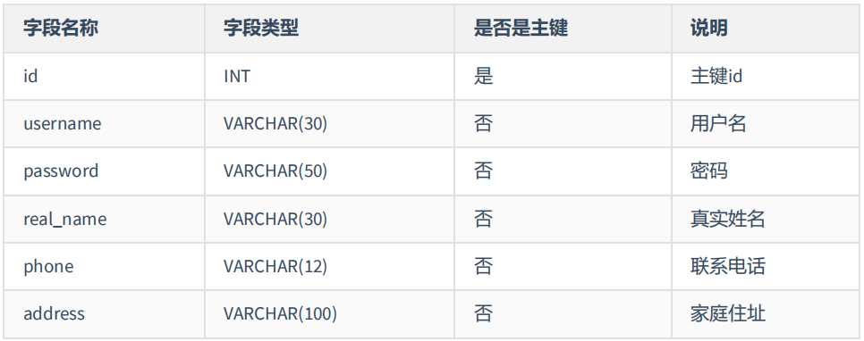
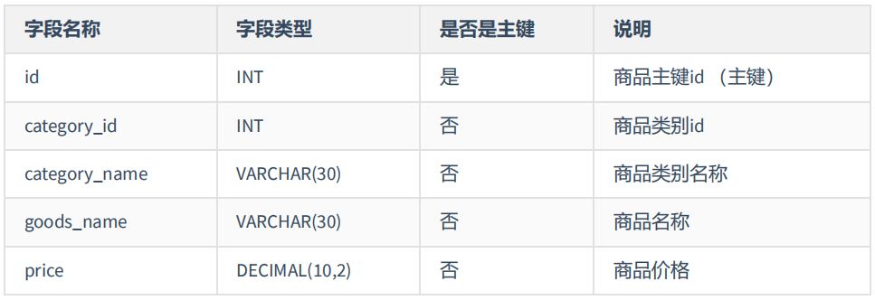
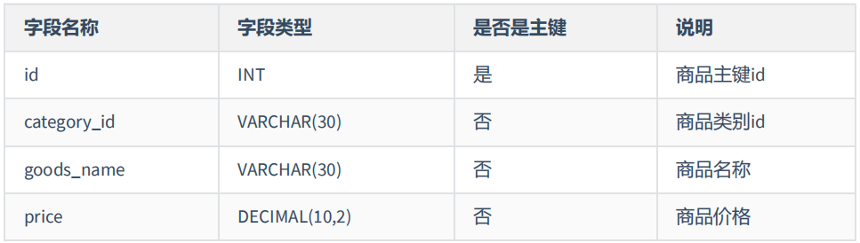
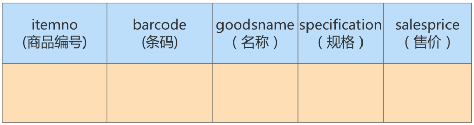
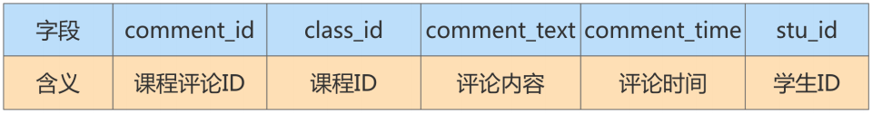
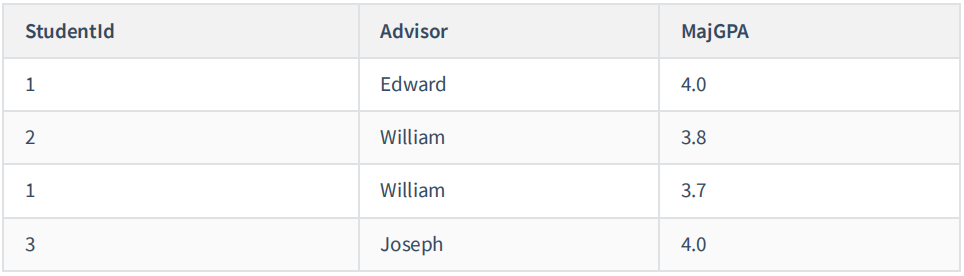

*`Author: ACatSmiling`*

*`Since: 2024-07-23`*

## 为什么需要数据库设计

我们在设计数据表的时候，要考虑很多问题。比如：

- 用户都需要什么数据？需要在数据表中保存哪些数据？
- 如何保证数据表中数据的`正确性`？当插入、删除、更新的时候该进行怎样的`约束检查`？
- 如何降低数据表的`数据冗余度`，保证数据表不会因为用户量的增长而迅速扩张？
- 如何让负责数据库维护的人员`更方便`的使用数据库？
- 使用数据库的应用场景也各不相同，可以说针对不同的情况，设计出来的数据表可能千差万别。

现实情况中，面临的场景：

- 数据冗余、信息重复，存储空间浪费。
- 数据更新、插入、删除的异常。
- 无法正确表示信息。
- 丢失有效信息。
- 程序性能差。

良好的数据库设计，则有以下优点：

- 节省数据的存储空间。
- 能够保证数据的完整性。
- 方便进行数据库应用系统的开发。

总之，开始设置数据库的时候，我们就需要重视数据表的设计。为了建立`冗余较小`、`结构合理`的数据库，设计数据库时`必须遵循一定的规则`。

## 范式

### 范式简介

**在关系型数据库中，关于数据表设计的基本原则、规则就称为`范式`。**可以理解为，一张数据表的设计结构需要满足的某种设计标准的`级别`。要想设计一个结构合理的关系型数据库，必须满足一定的范式。

范式的英文名称是 Normal Form，简称 NF。它是英国人 E.F.Codd 在上个世纪 70 年代提出关系数据库模型后总结出来的。范式是关系数据库理论的基础，也是我们在设计数据库结构过程中所要遵循的`规则`和`指导方法`。

### 范式都包括哪些

目前关系型数据库有六种常见范式，按照范式级别，从低到高分别是：`第一范式 (1NF)、第二范式 (2NF)、第三范式 (3NF)、巴斯-科德范式 (BCNF)、第四范式 (4NF) 和第五范式 (5NF，又称完美范式)。`

数据库的范式设计越高阶，冗余度就越低，同时高阶的范式一定符合低阶范式的要求，满足最低要求的范式是第一范式（1NF）。在第一范式的基础上，进一步满足更多规范要求的称为第二范式（2NF），其余范式以此类推。


`一般来说，在关系型数据库设计中，最高也就遵循到 BCNF，普遍的是 3NF。`但范式不是绝对的，有时候为了提高某些查询性能，我们还需要破坏范式规则，也就是`反规范化`。

### 键和相关属性的概念

范式的定义会使用到主键和候选键，数据库中的键（Key）由一个或者多个属性组成。数据表中常用的几种键和属性的定义：

- `超键`：能`唯一标识`元组的属性集叫做超键。（属性集，可以理解为一个或多个字段的组合）
- `候选键`：如果超键不包括多余的属性，那么这个超键就是候选键。用户可以从候选键中选择一个作为主键。
- `外键`∶如果数据表 R1 中的某属性集不是 R1 的主键，而是另一个数据表 R2 的主键，那么这个属性集就是数据表 R1 的外键。
- `主属性`：包含在任一候选键中的属性称为主属性。
- `非主属性`：与主属性相对，指的是不包含在任何一个候选键中的属性。

通常，我们也将候选键称之为`码`，把主键也称为`主码`。因为键可能是由多个属性组成的，针对单个属性，我们还可以用主属性和非主属性来进行区分。

举例来说，假设有两个表：

- 球员表（player）：球员编号 | 姓名 | 身份证号 | 年龄 | 球队编号


- 球队表（team）：球队编号 | 主教练 | 球队所在地

那么：

- 超键：对于球员表来说，超键就是包括球员编号或者身份证号（球员编号或者身份证号是能唯一标识元组的）的任意组合，比如（球员编号）、（球员编号，姓名）、（身份证号，年龄）等。
- 候选键：就是最小的超键，对于球员表来说，候选键就是（球员编号）或者（身份证号）。
- 主键：我们自己选定，也就是从候选键中选择一个，比如（球员编号）。
- 外键：球员表中的球队编号。
- 主属性、非主属性：在球员表中，主属性是（球员编号）（身份证号），其他的属性（姓名）（年龄）（球队编号）都是非主属性。

### 第一范式

**第一范式主要是确保数据表中每个字段的值必须具有`原子性`，也就是说数据表中每个字段的值为`不可再次拆分的最小数据单位`。**

我们在设计某个字段的时候，对于字段 x 来说，不能把字段 x 拆分成字段 x_1 和字段 x_2。事实上，任何的 DBMS 都会满足第一范式的要求，不会将字段进行拆分。

**示例一：**

- 假设一家公司要存储员工的姓名和联系方式。它创建一个如下表：

  

- 该表不符合 1NF ，因为规则说 "表的每个属性必须具有原子（单个）值"，lisi 和 zhaoliu 员工的 emp_mobile 值违反了该规则。为了使表符合 1NF ，我们应该有如下表数据：

  

**示例二：**

- user 表的设计不符合第一范式：

  

- 其中，user_info 字段为用户信息，可以进一步拆分成更小粒度的字段，不符合数据库设计对第一范式的要求。将 user_info 拆分后如下：

  

**示例三：**

- 属性的原子性是主观的 。例如，Employees 关系中雇员姓名应当使用 1 个（fullname），2 个（firstname 和 lastname），还是3个（firstname、middlename 和 lastname）属性表示呢？答案取决于应用程序。如果应用程序需要分别处理雇员的姓名部分（如：用于搜索目的），则有必要把它们分开。否则，不需要。

  

  

### 第二范式

**第二范式要求，在满足第一范式的基础上，还要满足数据表里的每一条数据记录，都是`可唯一标识`的（也就是一定有主键）。而且所有非主键字段，都必须`完全依赖主键`，不能只依赖主键的一部分。**如果知道主键的所有属性的值，就可以检索到任何元组（行）的任何属性的任何值。（要求中的主键，其实可以拓展替换为候选键）

另外第二范式只能完全函数依赖，不能部分函数依赖。

**示例一：**

- 成绩表 （学号，课程号，成绩）关系中，（学号，课程号）可以决定成绩，但是学号不能决定成绩，课程号也不能决定成绩，所以 "（学号，课程号）---> 成绩" 就是`完全依赖关系`。

**示例二：**

- `比赛表 player_game`，里面包含球员编号、姓名、年龄、比赛编号、比赛时间和比赛场地等属性，这里候选键和主键都为（球员编号，比赛编号），我们可以通过候选键（或主键）来决定如下的关系：

  ```tex
  (球员编号, 比赛编号) → (姓名, 年龄, 比赛时间, 比赛场地，得分)
  ```

- 但是这个数据表不满足第二范式，因为数据表中的字段之间还存在着如下的对应关系：

  ```tex
  # 姓名和年龄部分依赖球员编号
  (球员编号) → (姓名，年龄)
  
  # 比赛时间, 比赛场地部分依赖(球员编号, 比赛编号)
  (比赛编号) → (比赛时间, 比赛场地)
  ```

对于非主属性来说，并非完全依赖候选键。这样会产生怎样的问题呢？（为什么要满足 2NF）

- `数据冗余`： 如果一个球员可以参加 m 场比赛，那么球员的姓名和年龄就重复了 m - 1 次。一个比赛也可能会有 n 个球员参加，比赛的时间和地点就重复了 n - 1 次。

- `插入异常`： 如果我们想要添加一场新的比赛，但是这时还没有确定参加的球员都有谁，那么就没法插入。

- `删除异常`： 如果我要删除某个球员编号，如果没有单独保存比赛表的话，就会同时把比赛信息删除掉。

- `更新异常`： 如果我们调整了某场比赛的时间，那么数据表中所有这场比赛的时间都需要进行调整，否则就会出现一场比赛时间不同的情况。

为了避免出现上述的情况，我们可以把球员比赛表设计为下面的三张表：

| 表名                        | 属性（字段）                       |
| --------------------------- | ---------------------------------- |
| 球员 player 表              | 球员编号、姓名和年龄等属性         |
| 比赛 game 表                | 比赛编号、比赛时间和比赛场地等属性 |
| 球员比赛关系 player_game 表 | 球员编号、比赛编号和得分等属性     |

这样的话，每张数据表都符合第二范式，也就避免了异常情况的发生。

> **1NF 告诉我们`字段属性`需要是原子性的，而 2NF 告诉我们`一张表就是一个独立的对象`，一张表只表达一个意思。**

**示例三：**

- 定义一个名为 Orders 的关系，表示订单和订单行的信息：

  

  - 违反了第二范式，因为有非主键属性仅依赖于候选键（或主键）的一部分。例如，可以仅通过 orderid 找到订单的 orderdate，以及 customerid 和 companyname，而没有必要再去使用 productid。

- 修改为 Orders 表和 OrderDetails 表如下，此时符合第二范式。

  

> 小结：`第二范式要求实体的属性完全依赖主关键字。`如果存在不完全依赖，那么这个属性和主关键字的这一部分应该分离出来形成一个新的实体，新实体与元实体之间是一对多的关系。

### 第三范式

**第三范式是在第二范式的基础上，确保数据表中的`每一个非主键字段都和主键字段直接相关`，也就是说，要求数据表中的所有非主键字段不能依赖于其他非主键字段。**即，不能存在非主属性 A 依赖于非主属性 B，非主属性 B 依赖于主键 C 的情况，即存在 "A ---> B ---> C" 的决定关系。通俗地讲，该规则的意思是所有非主键属性之间不能有传递依赖关系，必须相互独立。（这里的主键可以拓展为候选键）

**示例一：**

- **部门信息表：**每个部门有部门编号（dept_id）、部门名称、部门简介等信息。
- **员工信息表：**每个员工有员工编号、姓名、部门编号。列出部门编号后就不能再将部门名称、部门简介等与部门有关的信息再加入员工信息表中。
- 如果不存在部门信息表，则根据第三范式（3NF）也应该构建它，否则就会有大量的数据冗余。

**示例二：**

- 如下表，商品类别名称依赖于商品类别编号，不符合第三范式：

  

- 将其修改为商品表和商品类别表，商品表 goods 通过商品类别 id 字段（category_id）与商品类别表 goods_category 进行关联。

  

**示例三：**

- 球员 player 表 ：球员编号、姓名、球队名称和球队主教练。现在，我们把属性之间的依赖关系画出来，如下图所示：

  

- 可以看到，球员编号决定了球队名称，同时球队名称决定了球队主教练，非主属性球队主教练就会传递依赖于球员编号，因此不符合 3NF 的要求。

- 如果要达到 3NF 的要求，需要把数据表拆成下面这样：

  | 表名   | 属性（字段）             |
  | ------ | ------------------------ |
  | 球队表 | 球员编号、姓名和球队名称 |
  | 球员表 | 球队名称、球队主教练     |

**示例四：**

- 修改第二范式中的示例三。

- 此时的 Orders 关系包含 orderid、orderdate、customerid 和 companyname 属性，主键定义为 orderid。customerid 和 companyname 均依赖于主键 orderid。例如，你需要通过 orderid 主键来查找代表订单中客户的 customerid，同样，你需要通过 orderid 主键查找订单中客户的公司名称（companyname）。然而， customerid 和 companyname 也是互相依靠的。为满足第三范式，可以改写如下：

  

>符合 3NF 后的数据模型通俗地讲，2NF 和 3NF 通常以这句话概括：`"每个非键属性依赖于键，依赖于整个键，并且除了键别无他物"。`

### 小结

关于数据表的设计，有三个范式要遵循：

- 第一范式（1NF），`确保每列保持原子性`**（不允许存在小表）**。数据库的每一列都是不可分割的原子数据项，不可再分的最小数据单元，而不能是集合、数组、记录等非原子数据项。
- 第二范式（2NF），`确保每列都和主键完全依赖`**（不能存在联合主键）**。尤其在复合主键的情况向下，非主键部分不应该依赖于部分主键。
- 第三范式（3NF），`确保每列都和主键直接相关`，而不是间接相关**（不存在传递依赖）**。

**范式的优点：**数据的标准化有助于消除数据库中的数据冗余，`第三范式通常被认为在性能、拓展性和数据完整性方面达到了最好的平衡。`

**范式的缺点：**范式的使用，可能降低查询的效率。因为范式等级越高，设计出来的数据表就越多、越精细，数据的冗余度就越低，进行数据查询的时候就可能需要关联多张表，这不但代价昂贵，也可能使一些索引策略无效。

范式只是提出了设计的标准，实际上设计数据表时，未必一定要符合这些标准。开发中，我们会出现为了性能和读取效率违反范式化的原则，通过增加少量的冗余或重复的数据来提高数据库的读性能，减少关联查询，join 表的次数，实现空间换取时间的目的。因此，在实际的设计过程中要理论结合实际，灵活运用。

>范式本身没有优劣之分，只有适用场景不同。没有完美的设计，只有合适的设计，我们在数据表的设计中，还需要根据需求将范式和反范式混合使用。

## 反范式化

### 概述

有的时候，不能简单按照规范要求设计数据表，因为有的数据看似冗余，其实对业务来说十分重要。这个时候，我们就要`遵循业务优先的原则`，首先满足业务需求，再尽量减少冗余。

如果数据库中的数据量比较大，系统的 UV 和 PV 访问频次比较高，则完全按照 MySQL 的三大范式设计数据表，读数据时会产生大量的关联查询，在一定程度上会影响数据库的读性能。如果我们想对查询效率进行优化，反范式化也是一种优化思路。此时，可以通过在数据表中增加冗余字段来提高数据库的读性能。

> **规范化 VS 性能：**
>
> 1. 为满足某种商业目标，数据库性能比规范化数据库更重要。
> 2. 在数据规范化的同时，要综合考虑数据库的性能。
> 3. 通过在给定的表中添加额外的字段，以大量减少需要从中搜索信息所需的时间。
> 4. 通过在给定的表中插入计算列，以方便查询。

### 应用举例

**示例一：**

- 员工的信息存储在 employees 表中，部门信息存储在 departments 表中，通过 employees 表中的 department_id 字段与 departments 表建立关联关系。如果要查询一个员工所在部门的名称，可以使用下面的 SQL。如果经常需要进行这个操作，连接查询就会浪费很多时间。可以在 employees 表中增加一个冗余字段 department_name，这样就不用每次都进行连接操作了。

  ```mysql
  SELECT employee_id, department_name FROM employees e JOIN departments d ON e.department_id = d.department_id;
  ```

**示例二：**

- 反范式化的 goods商品信息表 设计如下：

  

**示例三：**

- 假设有 2 个表，分别是商品流水表（trans）和商品信息表（goodsinfo）。商品流水表里有 400 万条流水记录，商品信息表里有 2000 条商品记录。

  - 商品流水表：

    

  - 商品信息表：

    

- 上面这两个表，都是符合第三范式要求的。但是，在项目的实施过程中，对流水的查询频率很高，而且为了获取商品名称，基本都会用到与商品信息表的连接查询。为了减少连接，可以直接把商品名称字段加到流水表里面。这样一来，就可以直接从流水表中获取商品名称字段了。虽然增加了冗余字段，但是避免了关联查询，提升了查询的效率。新的商品流水表如下所示：

  

**示例四：**

- 课程评论表 class_comment，对应的字段名称及含义如下：

  

- 学生表 student，对应的字段名称及含义如下：

  

- 在实际应用中，我们在显示课程评论的时候，通常会显示这个学生的昵称，而不是学生 ID，因此，当我们想要查询某个课程的前 1000 条评论时，需要关联 class_comment 和 student这两张表来进行查询。

**实验数据：模拟两张百万量级的数据表**

为了更好地进行 SQL 优化实验，我们需要给学生表和课程评论表随机模拟出百万量级的数据。我们可以通过存储过程来实现模拟数据。

- 创建表：

  ```mysql
  mysql> set names utf8;
  Query OK, 0 rows affected, 1 warning (0.00 sec)
  
  mysql> CREATE DATABASE atguigudb2;
  Query OK, 1 row affected (0.01 sec)
  
  mysql> USE atguigudb2;
  Database changed
  
  # 学生表
  mysql> CREATE TABLE student(
      -> stu_id INT PRIMARY KEY AUTO_INCREMENT,
      -> stu_name VARCHAR(25),
      -> create_time DATETIME
      -> );
  Query OK, 0 rows affected (0.03 sec)
  
  # 课程评论表
  mysql> CREATE TABLE class_comment(
      -> comment_id INT PRIMARY KEY AUTO_INCREMENT,
      -> class_id INT,
      -> comment_text VARCHAR(35),
      -> comment_time DATETIME,
      -> stu_id INT
      -> );
  Query OK, 0 rows affected (0.03 sec)
  ```

- 创建存储过程：

  ```mysql
  # 创建向学生表中添加数据的存储过程
  mysql> DELIMITER //
  mysql> CREATE PROCEDURE batch_insert_student(IN START INT(10),IN max_num INT (10))
      -> BEGIN
      -> DECLARE i INT DEFAULT 0;
      -> DECLARE date_start DATETIME DEFAULT ('2017-01-01 00:00:00');
      -> DECLARE date_temp DATETIME;
      -> SET date_temp = date_start;
      -> SET autocommit=0;
      -> REPEAT
      -> SET i=i+1;
      -> SET date_temp = DATE_ADD(date_temp,INTERVAL RAND( )*60 SECOND);
      -> INSERT INTO student(stu_id, stu_name,create_time)
      -> VALUES ((START+i), CONCAT ('stu_',i), date_temp) ;
      -> UNTIL i = max_num
      -> END REPEAT;
      -> COMMIT;
      -> END //
  Query OK, 0 rows affected, 2 warnings (0.02 sec)
  
  mysql> DELIMITER ;
  
  # 创建向课程评论表中添加数据的存储过程
  mysql> DELIMITER //
  mysql> CREATE PROCEDURE batch_insert_class_comments(IN START INT(10),IN max_num INT (10))
      -> BEGIN
      -> DECLARE i INT DEFAULT 0;
      -> DECLARE date_start DATETIME DEFAULT ('2018-01-01 00:00:00');
      -> DECLARE date_temp DATETIME;
      -> DECLARE comment_text VARCHAR(25);
      -> DECLARE stu_id INT;
      -> SET date_temp = date_start;
      -> SET autocommit=0;
      -> REPEAT
      -> SET i=i+1;
      -> SET date_temp = DATE_ADD(date_temp,INTERVAL RAND( )*60 SECOND);
      -> SET comment_text=SUBSTR(MD5(RAND()),1,20);
      -> SET stu_id=FLOOR(RAND()*1000000);
      -> INSERT INTO `class_comment`(`comment_id`,`class_id`,`comment_text`,`comment_time`,`stu_id`)
      -> VALUES ((START+i),10001,comment_text,date_temp,stu_id);
      -> UNTIL i = max_num
      -> END REPEAT;
      -> COMMIT;
      -> END //
  Query OK, 0 rows affected, 2 warnings (0.01 sec)
  
  mysql> DELIMITER ;
  ```

- 调用存储过程：

  ```mysql
  # 调用存储过程，学生id从10001开始，添加1000000条数据
  mysql> CALL batch_insert_student(10000, 1000000);
  Query OK, 0 rows affected (31.58 sec)
  
  # 添加数据的过程的调用，一个1000000条数据
  mysql> CALL batch_insert_class_comments(10000, 1000000);
  Query OK, 0 rows affected (34.81 sec)
  
  mysql> SELECT COUNT(*) FROM student;
  +----------+
  | COUNT(*) |
  +----------+
  |  1000000 |
  +----------+
  1 row in set (0.03 sec)
  
  mysql> SELECT COUNT(*) FROM class_comment;
  +----------+
  | COUNT(*) |
  +----------+
  |  1000000 |
  +----------+
  1 row in set (0.03 sec)
  ```

- 测试：

  ```mysql
  mysql> SELECT p.comment_text, p.comment_time, stu.stu_name FROM class_comment AS p LEFT JOIN student AS stu ON p.stu_id = stu.stu_id WHERE p.class_id = 10001 ORDER BY p.comment_id DESC LIMIT 10000;
  +----------------------+---------------------+------------+
  | comment_text         | comment_time        | stu_name   |
  +----------------------+---------------------+------------+
  | ea4d03873f7f3a26e1ba | 2018-12-14 03:26:26 | stu_209036 |
  | 1fe6697da6c77d637497 | 2018-12-14 03:26:22 | stu_740513 |
  | 5fafc1b2b297f23159cd | 2018-12-14 03:26:21 | stu_168595 |
  | badca0f8d453eb0b67bf | 2018-12-10 15:29:16 | stu_288793 |
  | 219f577d16b8005ca971 | 2018-12-10 15:28:48 | stu_259916 |
  | dcb3e24911b5bcaa47a8 | 2018-12-10 15:28:11 | stu_815722 |
  +----------------------+---------------------+------------+
  10000 rows in set (0.04 sec)
  ```

  - 运行时长为 0.04 秒，对于网站的响应来说，这已经很慢了，用户体验会非常差。如果我们想要提升查询的效率，可以允许适当的数据冗余，也就是在商品评论表中增加用户昵称字段，在 class_comment 数据表的基础上增加 stu_name 字段，就得到了 class_comment2 数据表。

- 反范式优化实验对比：

  ```mysql
  # 进行反范式化设计
  
  # 表的复制
  mysql> CREATE TABLE class_comment1 AS SELECT * FROM class_comment;
  Query OK, 1000000 rows affected (5.70 sec)
  Records: 1000000  Duplicates: 0  Warnings: 0
  
  # 添加主键，保证class_comment1与class_comment的结构相同
  mysql> ALTER TABLE class_comment1 ADD PRIMARY KEY(comment_id);
  Query OK, 0 rows affected (8.74 sec)
  Records: 0  Duplicates: 0  Warnings: 0
  
  mysql> SHOW INDEX FROM class_comment1;
  +----------------+------------+----------+--------------+-------------+-----------+-------------+----------+--------+------+------------+---------+---------------+---------+------------+
  | Table          | Non_unique | Key_name | Seq_in_index | Column_name | Collation | Cardinality | Sub_part | Packed | Null | Index_type | Comment | Index_comment | Visible | Expression |
  +----------------+------------+----------+--------------+-------------+-----------+-------------+----------+--------+------+------------+---------+---------------+---------+------------+
  | class_comment1 |          0 | PRIMARY  |            1 | comment_id  | A         |      996244 |     NULL |   NULL |      | BTREE      |         |               | YES     | NULL       |
  +----------------+------------+----------+--------------+-------------+-----------+-------------+----------+--------+------+------------+---------+---------------+---------+------------+
  1 row in set (0.00 sec)
  
  # 向课程评论表中增加stu_name字段
  mysql> ALTER TABLE class_comment1 ADD stu_name VARCHAR(25);
  Query OK, 0 rows affected (0.02 sec)
  Records: 0  Duplicates: 0  Warnings: 0
  
  # 给新添加的字段赋值
  mysql> UPDATE class_comment1 c SET stu_name = (SELECT stu_name FROM student s WHERE c.stu_id = s.stu_id);
  Query OK, 989941 rows affected (32.28 sec)
  Rows matched: 1000000  Changed: 989941  Warnings: 0
  ```

- 如果我们想要查询课程 ID 为 10001 的前 10000 条评论，需要写成下面这样：

  ```mysql
  mysql> SELECT comment_text, comment_time, stu_name FROM class_comment1 WHERE class_id = 10001 ORDER BY class_id DESC LIMIT 10000;
  +----------------------+---------------------+------------+
  | comment_text         | comment_time        | stu_name   |
  +----------------------+---------------------+------------+
  | 98ac57e47f969ccb3d5e | 2018-01-01 00:00:58 | stu_657565 |
  | 9417961cb63119c96cbc | 2018-01-01 00:01:10 | stu_236175 |
  | cb5b9be56b3ce6de9f0f | 2018-01-01 00:01:30 | stu_659727 |
  | 339b5f86158833d800c0 | 2018-01-04 11:59:26 | stu_411945 |
  | 2e069c3facbd62cf2051 | 2018-01-04 11:59:37 | stu_759542 |
  | 979fd006b1ea975b5c4d | 2018-01-04 12:00:28 | stu_160871 |
  +----------------------+---------------------+------------+
  10000 rows in set (0.00 sec)
  ```

  - 优化之后只需要扫描一次聚集索引即可，运行时间为 0.00 秒，查询时间比之前少很多。 你能看到，在数据量大的情况下，查询效率会有显著的提升。

### 反范式的新问题

- `存储空间变大`了。
- 一个表中字段做了修改，另一个表中冗余的字段也需要做同步修改，否则`数据不一致`。
- 若采用存储过程来支持数据的更新、删除等额外操作，如果更新频繁，会非常`消耗系统资源`。
- 在`数据量小`的情况下，反范式不能体现性能的优势，可能还会让数据库的设计更加`复杂`。

### 反范式的适用场景

当`冗余信息有价值`或者能`大幅度提高查询效率`的时候，我们才会采取反范式的优化。

1. 增加冗余字段的建议。
   - 这个冗余字段不需要经常进行修改。
   - 这个冗余字段查询的时候不可或缺（因为经常要用，所以才增加该冗余字段）。


2. 历史快照、历史数据的需要。
   - 在现实生活中，我们经常需要一些冗余信息，比如订单中的收货人信息，包括姓名、电话和地址等。每次发生的订单收货信息都属于历史快照，需要进行保存，但用户可以随时修改自己的信息，这时保存这些冗余信息是非常有必要的。


反范式优化也常用在数据仓库的设计中，因为数据仓库通常存储历史数据，对增删改的实时性要求不强，对历史数据的分析需求强。这时适当允许数据的冗余度，更方便进行数据分析。

简单总结下数据仓库和数据库在使用上的区别：

- 数据库设计的目的在于捕获数据，而数据仓库设计的目的在于分析数据；
- 数据库对数据的增删改实时性要求强，需要存储在线的用户数据，而数据仓库存储的一般是历史数据；
- 数据库设计需要尽量避免冗余，但为了提高查询效率也允许一定的冗余度，而数据仓库在设计上更偏向采用反范式设计。

> 注意：反范式反的是第二范式或第三范式，第一范式是一定要遵守的。

## 巴斯范式

人们在 3NF 的基础上进行了改进，提出了`巴斯范式 (BCNF)`，也叫做`巴斯-科德范式 (Boyce-Codd NormalForm)`。BCNF 被认为没有新的设计规范加入，`只是对第三范式中设计规范要求更强`，使得数据库冗余度更小。所以，称为是修正的第三范式，或扩充的第三范式，BCNF 不被称为第四范式。

若一个关系达到了第三范式，并且它只有一个候选键，或者它的每个候选键都是单属性，则该关系自然达到 BCNF。

> 一般来说，一个数据库设计符合 3NF 或 BCNF 就可以了。

### 案例

我们分析如下表的范式情况：


在这个表中，一个仓库只有一个管理员，同时一个管理员也只管理一个仓库。先来梳理下这些属性之间的依赖关系。

- 仓库名决定了管理员，管理员也决定了仓库名，同时（仓库名，物品名）的属性集合可以决定数量这个属性。这样，我们就可以找到数据表的候选键。


- 候选键：是（管理员，物品名）和（仓库名，物品名），然后从候选键中选择一个作为主键，比如（仓库名，物品名）。
- 主属性：包含在任一候选键中的属性，也就是仓库名，管理员和物品名。

- 非主属性 ：数量这个属性。

### 是否符合三范式

如何判断一张表的范式呢？需要根据范式的等级，从低到高来进行判断：

- 首先，数据表每个属性都是原子性的，符合 1NF 的要求；


- 其次，数据表中非主属性 "数量" 都与候选键全部依赖，（仓库名，物品名）决定数量，（管理员，物品名）决定数量。因此，数据表符合 2NF 的要求；


- 最后，数据表中的非主属性，不传递依赖于候选键。因此符合 3NF 的要求。

### 存在的问题

既然数据表已经符合了 3NF 的要求，是不是就不存在问题了呢？来看下面的情况：

- 增加一个仓库，但是还没有存放任何物品。根据数据表实体完整性的要求，主键不能有空值，因此会出现插入异常 ；
- 如果仓库更换了管理员，就可能会修改数据表中的多条记录；
- 如果仓库里的商品都卖空了，那么此时仓库名称和相应的管理员名称也会随之被删除。

可以能看到，即便数据表符合 3NF 的要求，同样可能存在插入，更新和删除数据的异常情况。

### 问题解决

首先需要确认造成异常的原因：主属性仓库名对于候选键（管理员，物品名）是部分依赖的关系，这样就有可能导致上面的异常情况。因此引入 BCNF，它在 3NF 的基础上消除了主属性对候选键的部分依赖或者传递依赖关系。

如果在关系 R 中，U 为主键，A 属性是主键的一个属性，若存在 A ---> Y，Y 为主属性（也就是非候选码中的属性），则该关系不属于 BCNF。

根据 BCNF 的要求，需要把仓库管理关系 warehouse_keeper 表拆分成下面这样：

- 仓库表 ：（仓库名，管理员）
- 库存表 ：（仓库名，物品名，数量）

这样就不存在主属性对于候选键的部分依赖或传递依赖，上面数据表的设计就符合 BCNF。

> 再举例如下：
>
> 有一个学生导师表，其中包含字段：学生 ID，专业，导师，专业 GPA，这其中学生 ID 和专业是联合主键。
>
> 
>
> 这个表的设计满足三范式，但是这里存在另一个依赖关系，"专业" 依赖于 "导师"，也就是说每个导师只做一个专业方面的导师，只要知道了是哪个导师，自然就知道是哪个专业的了。
>
> 所以这个表的部分主键 Major 依赖于非主键属性 Advisor，那么我们可以进行以下的调整，拆分成 2 个表：
>
> 学生导师表：
>
> 
>
> 导师表：
>
> 

## 第四范式

`多值依赖`的概念：

- 多值依赖即属性之间的一对多关系，记为 K →→ A。
- 函数依赖事实上是单值依赖，所以不能表达属性值之间的一对多关系。
- 平凡的多值依赖∶全集 U = K + A，一个 K 可以对应于多个 A，即 K →→ A。此时整个表就是一组一对多关系。
- 非平凡的多值依赖：全集 U = K + A + B，一个 K 可以对应于多个 A，也可以对应于多个 B，A 与 B 互相独立，即 K →→ A，K →→ B。整个表有多组一对多关系，且有："一" 部分是相同的属性集合，"多" 部分是互相独立的属性集合。

**示例一：**

职工表（职工编号，职工孩子姓名，职工选修课程）。

在这个表中，同一个职工可能会有多个职工孩子姓名。同样，同一个职工也可能会有多个职工选修课程，即这里存在着多值事实，不符合第四范式。

如果要符合第四范式，只需要将上表分为两个表，使它们只有一个多值事实，例如： 职工表一（职工编号，职工孩子姓名），职工表二（职工编号，职工选修课程），两个表都只有一个多值事实，所以符合第四范式。

**示例二：**

比如建立课程、教师、教材的模型。我们规定，每门课程有对应的一组教师，每门课程也有对应的一组教材，一门课程使用的教材和教师没有关系。我们建立的关系表如下：课程 ID，教师 ID，教材 ID，这三列作为联合主键。

为了表述方便，我们用教师 Name 代替 ID，这样更容易看懂：


这个表除了主键，就没有其他字段了，所以肯定满足 BCNF，但是却存在多值依赖导致的异常。

假如下学期想采用一本新的英版高数教材，但是还没确定具体哪个老师来教，那么就无法在这个表中维护 Course 高数和 Book 英版高数教材的的关系。

解决办法是把这个多值依赖的表拆解成 2 个表，分别建立关系。这是拆分后的表：


## 第五范式、域键范式

除了第四范式外，还有更高级的`第五范式 (又称完美范式) 和域键范式 (DKNF)`。

在满足第四范式（4NF）的基础上，消除不是由候选键所蕴含的连接依赖。如果关系模式 R 中的每一个连接依赖均由 R 的候选键所隐含，则称此关系模式符合第五范式。

函数依赖是多值依赖的一种特殊的情况，而多值依赖实际上是连接依赖的一种特殊情况。但连接依赖不像函数依赖和多值依赖可以由语义直接导出 ，而是在关系连接运算时才反映出来。存在连接依赖的关系模式仍可能遇到数据冗余及插入、修改、删除异常等问题。

第五范式处理的是无损连接问题，这个范式基本`没有实际意义`，因为无损连接很少出现，而且难以察觉。而域键范式试图定义一个终极范式 ，该范式考虑所有的依赖和约束类型，但是实用价值也是最小的，只存在理论研究中。

## 原文链接

https://github.com/ACatSmiling/zero-to-zero/blob/main/RelationalDatabase/mysql-advanced.md