*`Author: ACatSmiling`*

*`Since: 2024-07-21`*

## 概述

锁的种类：

- **单机版**：同一个 JVM 虚拟机内，使用 Synchronized 或者 Lock 接口。
- **分布式**：多个不同的 JVM 虚拟机，单机版的线程锁机制不再起作用，资源类需要在不同的服务器之间共享。

>Synchronized 或者 Lock 接口，二者都是 JVM 级别的锁，对于单机服务，能够很好的实现并发控制，但是对于分布式服务，这二者是无法完成并发控制的。此时，需要借助第三方组件，实现锁的控制，第三方组件可以是 MySQL，Redis，Zookeeper 等。

分布式锁需要具备的特性：

- **独占性**：同一个锁，任何时刻只能有且仅有一个线程持有。
- **高可用**：能够满足高并发情形下的性能要求；在 Redis 集群环境下，不能因为某一个节点异常而出现获取锁和释放锁失败的情况。
- **防死锁**：杜绝死锁，必须有超时控制机制或者撤销操作，要有锁最终释放的机制。
- **不乱抢**：防止张冠李戴，一个线程不能私下释放其他线程的锁，只能是自己的锁自己释放。
- **可重入**：同一个节点的同一个线程，如果获取锁之后，可以再次获取这个锁。

## 手写 Redis 分布式锁

### 基础案例

业务框架：

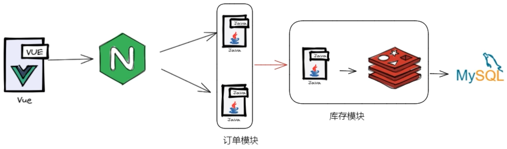

创建 Spring Boot 项目，platform-redis-distributed-lock1。

pom.xml：

```xml
<?xml version="1.0" encoding="UTF-8"?>
<project xmlns="http://maven.apache.org/POM/4.0.0"
         xmlns:xsi="http://www.w3.org/2001/XMLSchema-instance"
         xsi:schemaLocation="http://maven.apache.org/POM/4.0.0 http://maven.apache.org/xsd/maven-4.0.0.xsd">
    <modelVersion>4.0.0</modelVersion>
    <parent>
        <groupId>cn.zero.cloud</groupId>
        <artifactId>platform</artifactId>
        <version>1.0.0-SNAPSHOT</version>
    </parent>

    <artifactId>platform-redis-distributed-lock1</artifactId>

    <properties>
        <maven.compiler.source>17</maven.compiler.source>
        <maven.compiler.target>17</maven.compiler.target>
        <project.build.sourceEncoding>UTF-8</project.build.sourceEncoding>
    </properties>

    <dependencies>
        <dependency>
            <groupId>org.projectlombok</groupId>
            <artifactId>lombok</artifactId>
            <optional>true</optional>
        </dependency>
        
        <dependency>
            <groupId>org.apache.commons</groupId>
            <artifactId>commons-lang3</artifactId>
        </dependency>

        <dependency>
            <groupId>org.springframework.boot</groupId>
            <artifactId>spring-boot-starter-web</artifactId>
        </dependency>

        <dependency>
            <groupId>org.springframework.boot</groupId>
            <artifactId>spring-boot-starter-data-redis</artifactId>
        </dependency>
    </dependencies>

</project>
```

application.yaml：

```yaml
server:
  port: 3786
  servlet:
    context-path: /redis

spring:
  profiles:
    default: dev
```

application-dev.yaml：

```yaml
spring:
  config:
    import:
      - "classpath:conf/redis.properties"
```

redis.properties：

```properties
# redis config
#spring.data.redis.username=redis
spring.data.redis.password=123456
spring.data.redis.database=0
spring.data.redis.timeout=1000
spring.data.redis.ssl.enabled=false

# redis lettuce pool config
spring.data.redis.lettuce.pool.max-active=8
spring.data.redis.lettuce.pool.max-wait=-1
spring.data.redis.lettuce.pool.min-idle=1
spring.data.redis.lettuce.pool.max-idle=10
spring.data.redis.lettuce.shutdown-timeout=100ms

# redis stand-alone config
spring.data.redis.host=192.168.1.20
spring.data.redis.port=6379
```

RedisConfig.java：

```java
package cn.zero.cloud.platform.config;

import cn.hutool.core.util.ReflectUtil;
import com.fasterxml.jackson.databind.ObjectMapper;
import com.fasterxml.jackson.datatype.jsr310.JavaTimeModule;
import org.springframework.context.annotation.Bean;
import org.springframework.context.annotation.Configuration;
import org.springframework.data.redis.connection.RedisConnectionFactory;
import org.springframework.data.redis.core.RedisTemplate;
import org.springframework.data.redis.serializer.RedisSerializer;

/**
 * @author Xisun Wang
 * @since 2024/6/14 23:20
 */
@Configuration
public class RedisConfig {
    @Bean
    public RedisTemplate<String, Object> redisTemplate(RedisConnectionFactory redisConnectionFactory) {
        RedisTemplate<String, Object> redisTemplate = new RedisTemplate<>();

        redisTemplate.setConnectionFactory(redisConnectionFactory);

        // 使用 String 序列化方式，序列化 key
        redisTemplate.setKeySerializer(RedisSerializer.string());
        redisTemplate.setHashKeySerializer(RedisSerializer.string());

        // 使用 JSON 序列化方式 (使用的是 Jackson 库)，序列化 value
        redisTemplate.setValueSerializer(buildRedisSerializer());
        redisTemplate.setHashValueSerializer(buildRedisSerializer());

        redisTemplate.afterPropertiesSet();
        return redisTemplate;
    }

    public static RedisSerializer<?> buildRedisSerializer() {
        RedisSerializer<Object> json = RedisSerializer.json();

        // 解决 LocalDateTime 的序列化
        ObjectMapper objectMapper = (ObjectMapper) ReflectUtil.getFieldValue(json, "mapper");
        objectMapper.registerModules(new JavaTimeModule());
        return json;
    }
}
```

InventoryController.java：

```java
package cn.zero.cloud.platform.controller;

import cn.zero.cloud.platform.service.InventoryService;
import org.springframework.beans.factory.annotation.Autowired;
import org.springframework.http.HttpStatus;
import org.springframework.http.MediaType;
import org.springframework.web.bind.annotation.GetMapping;
import org.springframework.web.bind.annotation.RequestMapping;
import org.springframework.web.bind.annotation.ResponseStatus;
import org.springframework.web.bind.annotation.RestController;

/**
 * @author XiSun
 * @version 1.0
 * @since 2024/6/21 22:20
 */
@RestController
@RequestMapping(value = "/distributed/lock")
public class InventoryController {
    private final InventoryService inventoryService;

    @Autowired
    public InventoryController(InventoryService inventoryService) {
        this.inventoryService = inventoryService;
    }

    @GetMapping(value = "/inventory/sale", produces = MediaType.APPLICATION_JSON_VALUE)
    @ResponseStatus(HttpStatus.OK)
    public String sale() {
        return inventoryService.sale();
    }
}
```

InventoryServiceImpl.java：

```java
package cn.zero.cloud.platform.service.impl;

import cn.zero.cloud.platform.service.InventoryService;
import lombok.extern.slf4j.Slf4j;
import org.springframework.beans.factory.annotation.Autowired;
import org.springframework.beans.factory.annotation.Value;
import org.springframework.data.redis.core.RedisTemplate;
import org.springframework.stereotype.Service;

import java.util.concurrent.locks.Lock;
import java.util.concurrent.locks.ReentrantLock;

/**
 * @author XiSun
 * @version 1.0
 * @since 2024/6/21 22:22
 */
@Slf4j
@Service
public class InventoryServiceImpl implements InventoryService {
    @Value("${server.port}")
    private String port;

    private final RedisTemplate<String, Object> redisTemplate;

    @Autowired
    public InventoryServiceImpl(RedisTemplate<String, Object> redisTemplate) {
        this.redisTemplate = redisTemplate;
    }

    private final Lock lock = new ReentrantLock();

    @Override
    public String sale() {
        String retMessage;
        lock.lock();
        try {
            // 1. 查询库存信息
            String result = (String) redisTemplate.opsForValue().get("inventory001");
            // 2. 判断库存是否足够
            int inventoryNumber = result == null ? 0 : Integer.parseInt(result);
            // 3. 扣减库存
            if (inventoryNumber > 0) {
                redisTemplate.opsForValue().set("inventory001", String.valueOf(--inventoryNumber));
                retMessage = "成功卖出一个商品，库存剩余: " + inventoryNumber;
            } else {
                retMessage = "商品卖完了";
            }
            log.info("retMessage: {}", retMessage);
        } finally {
            lock.unlock();
        }
        return retMessage + "\t" + "服务端口号：" + port;
    }
}
```

启动服务，浏览器访问 http://localhost:3786/redis/distributed/lock/inventory/sale，不断刷新，可以发现，服务可以正常运行。


### 分布式服务

以 platform-redis-distributed-lock1 为模板，新建 platform-redis-distributed-lock2，用来模拟分布式服务，除端口外，其他相同。

- platform-redis-distributed-lock1 端口为 3786。
- platform-redis-distributed-lock2 端口为 3787。

使用 Nginx 负载均衡配置：

```shell
upstream redislock {
    server 192.168.1.17:3786 weight=1;
    server 192.168.1.17:3787 weight=2;
}

server {
    listen       80;
    listen  [::]:80;
    server_name  redis.zeloud.cn;

    location / {
        #root   /apps/html;
        proxy_pass  http://redislock;
        index  index.html index.htm;
    }

    error_page   500 502 503 504  /50x.html;
    location = /50x.html {
        root   /apps/html;
    }
}
```

- redis.zeloud.cn 是我个人域名，指向本机的虚拟机地址。

- 因为 Nginx 是部署在本机的虚拟机上，而微服务运行在本机的 IDEA，需要注意防火墙策略，否则可能虚拟机上的 Nginx 无法访问本机的服务端口。

  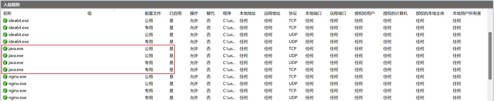

  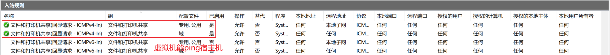

 启动两个服务，浏览器访问 http://redis.zeloud.cn/redis/distributed/lock/inventory/sale，不断刷新，可以发现，服务在两个端口间切换。


- 在非高并发的情况下，上面的代码，看起来功能是正常的。

将 Redis 库存量 inventory001 的值重新设置为 200，然后使用 [jmeter](https://jmeter.apache.org/) 进行高并发测试（线程数设置的也是 200，如果程序正常，最后库存应该为 0）：

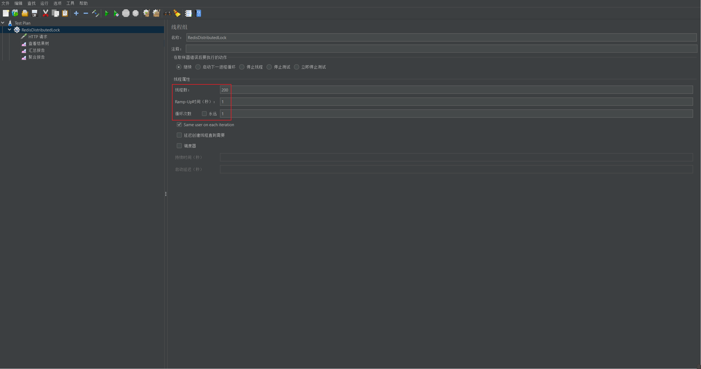

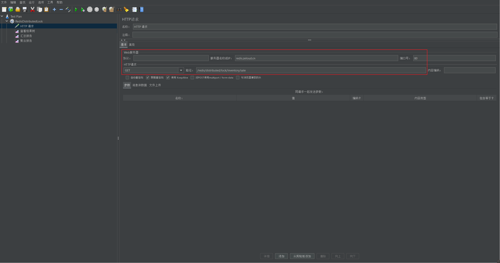

jmeter 测试完成后，查看 Redis 中库存量（每次测试的库存量可能不相同，但很少会为 0）：

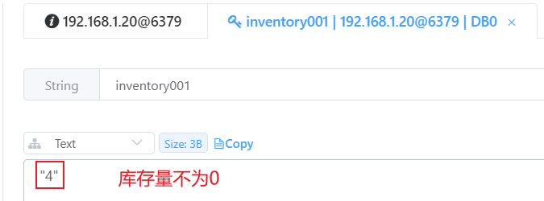

通过日志也可以发现，同一个订单号的商品，在不同的端口上进行了售卖：

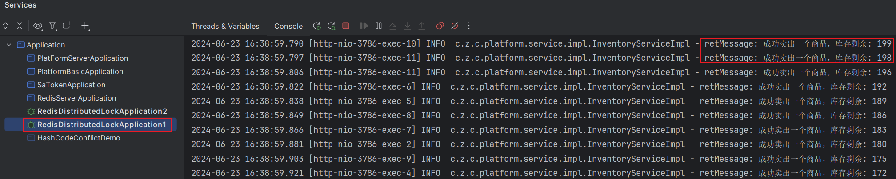

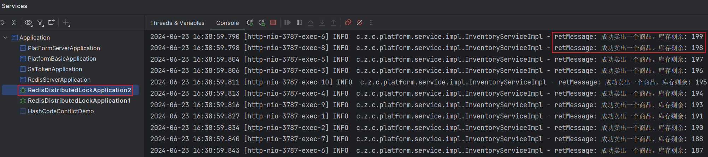

由以上测试，可以发现，高并发情况下，商品出现了超卖的异常情况。分析其原因：

1. 在单机环境下，可以使用 Synchronized 或 Lock 来实现并发锁控制。 
2. 但是在分布式系统中，因为竞争的线程可能不在同一个节点上（即不再同一个 JVM 中），所以需要一个让所有进程都能访问到的锁来实现（比如 Redis 或者 Zookeeper）。
3. 结论：不同进程 JVM 层面的锁就不管用了，那么可以利用第三方的一个组件来获取锁，未获取到锁，则阻塞当前想要运行的线程。

### 分布式锁

官网：https://redis.io/docs/latest/develop/use/patterns/distributed-locks/

#### 改进版本一：递归重试

通过**递归重试**的方式，不断尝试获取锁，直到成功：

```java
// 改进版本一：使用递归重试的方式，不断获取锁，直到成功。存在的问题：递归容易导致 StackOverflowError，不推荐
@Override
public String sale() {
    String retMessage = "";
    String key = "RedisDistributedLock";
    String uuidValue = IdUtil.simpleUUID() + ":" + Thread.currentThread().getId();

    Boolean flag = redisTemplate.opsForValue().setIfAbsent(key, uuidValue);
    if (Boolean.FALSE.equals(flag)) {
        // 暂停 20 毫秒后递归调用
        try {
            TimeUnit.MILLISECONDS.sleep(20);
        } catch (InterruptedException e) {
            log.info("thread sleep error: ", e);
        }

        // 如果没拿到锁，则递归重试
        sale();
    } else {
        try {
            // 1. 查询库存信息
            String result = (String) redisTemplate.opsForValue().get("inventory001");
            // 2. 判断库存是否足够
            int inventoryNumber = result == null ? 0 : Integer.parseInt(result);
            // 3. 扣减库存
            if (inventoryNumber > 0) {
                redisTemplate.opsForValue().set("inventory001", String.valueOf(--inventoryNumber));
                retMessage = "成功卖出一个商品，库存剩余: " + inventoryNumber;
            } else {
                retMessage = "商品卖完了";
            }
            log.info("retMessage: {}", retMessage);
        } finally {
            redisTemplate.delete(key);
        }
    }
    return retMessage + "\t" + "服务端口号：" + port;
}
```

启动服务，使用 jmeter 测试 3000 并发量，最终库存量为 0，程序也无异常：

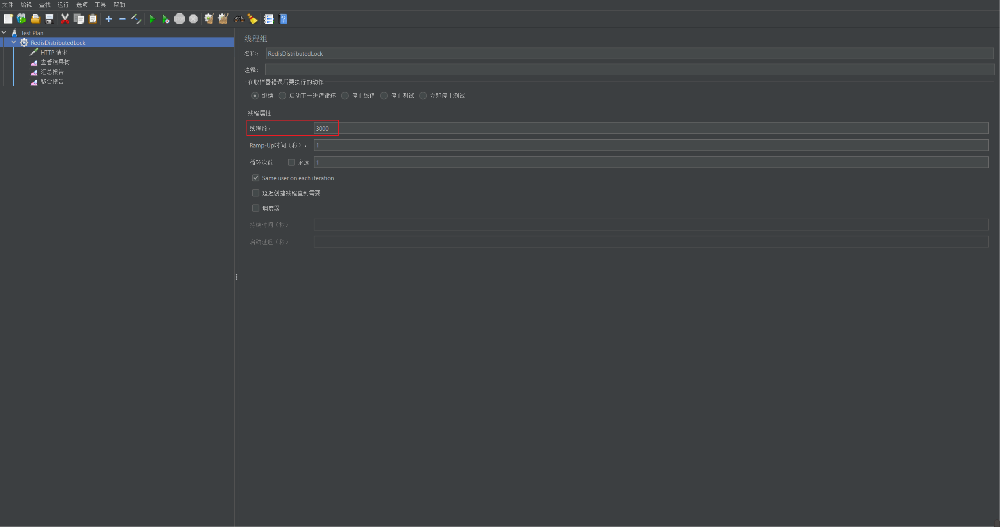


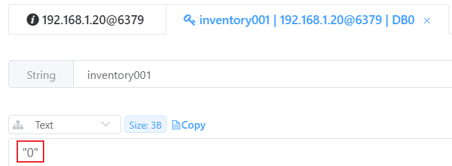

>考虑到 Nginx 的 worker_connections 设置的是 1024，因此不宜做太高的并发量测试，否则会出现因 Nginx 连接不足导致的异常，最终导致测试结果异常：
>
>```shell
>2024/06/23 21:41:59 [alert] 28#28: *38666 1024 worker_connections are not enough while connecting to upstream, client: 192.168.1.17, server: redis.zeloud.cn, request: "GET /redis/distributed/lock/inventory/sale HTTP/1.1", upstream: "http://192.168.1.17:3787/redis/distributed/lock/inventory/sale", host: "redis.zeloud.cn"
>2024/06/23 21:41:59 [alert] 24#24: *38667 1024 worker_connections are not enough while connecting to upstream, client: 192.168.1.17, server: redis.zeloud.cn, request: "GET /redis/distributed/lock/inventory/sale HTTP/1.1", upstream: "http://192.168.1.17:3787/redis/distributed/lock/inventory/sale", host: "redis.zeloud.cn"
>2024/06/23 21:41:59 [alert] 22#22: *38668 1024 worker_connections are not enough while connecting to upstream, client: 192.168.1.17, server: redis.zeloud.cn, request: "GET /redis/distributed/lock/inventory/sale HTTP/1.1", upstream: "http://192.168.1.17:3786/redis/distributed/lock/inventory/sale", host: "redis.zeloud.cn"
>2024/06/23 21:41:59 [alert] 25#25: *38669 1024 worker_connections are not enough while connecting to upstream, client: 192.168.1.17, server: redis.zeloud.cn, request: "GET /redis/distributed/lock/inventory/sale HTTP/1.1", upstream: "http://192.168.1.17:3787/redis/distributed/lock/inventory/sale", host: "redis.zeloud.cn"
>2024/06/23 21:41:59 [alert] 26#26: *38670 1024 worker_connections are not enough while connecting to upstream, client: 192.168.1.17, server: redis.zeloud.cn, request: "GET /redis/distributed/lock/inventory/sale HTTP/1.1", upstream: "http://192.168.1.17:3787/redis/distributed/lock/inventory/sale", host: "redis.zeloud.cn"
>2024/06/23 21:41:59 [alert] 29#29: *38671 1024 worker_connections are not enough while connecting to upstream, client: 192.168.1.17, server: redis.zeloud.cn, request: "GET /redis/distributed/lock/inventory/sale HTTP/1.1", upstream: "http://192.168.1.17:3787/redis/distributed/lock/inventory/sale", host: "redis.zeloud.cn"
>```
>
>
>
>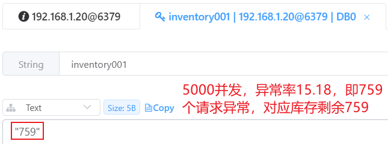
>
>如果需要测试更大的并发量，需要同步调整 worker_connections 的大小。

#### 改进版本二：自旋

在改进版本一中，使用递归重试的方法，虽然能够正确获取结果，但是容易导致 StackOverflowError（高并发情形，严禁使用递归重试），因此不太推荐此方式。**同时，也为了防止虚假唤醒，使用 while 替代 if，用自旋替代递归重试：**

```java
// 改进版本二：使用 while 替换 if，自旋替换递归重试。存在的问题：程序异常可能导致 finally 模块代码不能正常执行，进而导致锁不能正常释放，需要给锁添加过期时间
@Override
public String sale() {
    String retMessage = "";
    String key = "RedisDistributedLock";
    String uuidValue = IdUtil.simpleUUID() + ":" + Thread.currentThread().getId();

    while (Boolean.FALSE.equals(redisTemplate.opsForValue().setIfAbsent(key, uuidValue))) {
        // 暂停 20 毫秒，类似 CAS 自旋
        try {
            TimeUnit.MILLISECONDS.sleep(20);
        } catch (InterruptedException e) {
            log.info("thread sleep error: ", e);
        }
    }
    try {
        // 1. 查询库存信息
        String result = (String) redisTemplate.opsForValue().get("inventory001");
        // 2. 判断库存是否足够
        int inventoryNumber = result == null ? 0 : Integer.parseInt(result);
        // 3. 扣减库存
        if (inventoryNumber > 0) {
            redisTemplate.opsForValue().set("inventory001", String.valueOf(--inventoryNumber));
            retMessage = "成功卖出一个商品，库存剩余: " + inventoryNumber;
        } else {
            retMessage = "商品卖完了";
        }
        log.info("retMessage: {}", retMessage);
    } finally {
        redisTemplate.delete(key);
    }
    return retMessage + "\t" + "服务端口号：" + port;
}
```

启动服务，使用 jmeter 测试 3000 并发量，最终库存量为 0，程序也无异常。

#### 改进版本三：过期时间

在改进版本二中，如果程序执行过程中发生异常，导致代码没有成功执行 finally，也就无法删除锁。因此，**需要给锁添加一个过期时间，即使程序发生异常，锁也能正常释放，同时，需要保证加锁和设置锁过期时间的原子性。**

```java
// 改进版本三：设置锁的过期时间，并保证和加锁操作的原子性。存在的问题：如果某一个线程业务执行的时间，超过了锁的有效期，那么当这个线程执行完成，删除锁时，会删除其他正常线程的锁
@Override
public String sale() {
    String retMessage = "";
    String key = "RedisDistributedLock";
    String uuidValue = IdUtil.simpleUUID() + ":" + Thread.currentThread().getId();

    // 加锁和设置锁的过期时间，必须保证原子性，不能分开写：redisTemplate.opsForValue().setIfAbsent(key, uuidValue); 和 redisTemplate.expire(key, 30L, TimeUnit.SECONDS);
    while (Boolean.FALSE.equals(redisTemplate.opsForValue().setIfAbsent(key, uuidValue, 30L, TimeUnit.SECONDS))) {
        // 暂停 20 毫秒，类似 CAS 自旋
        try {
            TimeUnit.MILLISECONDS.sleep(20);
        } catch (InterruptedException e) {
            log.info("thread sleep error: ", e);
        }
    }
    try {
        // 1 查询库存信息
        String result = (String) redisTemplate.opsForValue().get("inventory001");
        // 2 判断库存是否足够
        int inventoryNumber = result == null ? 0 : Integer.parseInt(result);
        // 3 扣减库存
        if (inventoryNumber > 0) {
            redisTemplate.opsForValue().set("inventory001", String.valueOf(--inventoryNumber));
            retMessage = "成功卖出一个商品，库存剩余: " + inventoryNumber;
        } else {
            retMessage = "商品卖完了";
        }
        log.info("retMessage: {}", retMessage);
    } finally {
        redisTemplate.delete(key);
    }
    return retMessage + "\t" + "服务端口号：" + port;
}
```

#### 改进版本四：防止误删

在改进版本三中，虽然保证了加锁和设置锁的过期时间的原子性，但是，如果某一个线程业务执行的时间，超过了锁的有效期，那么当这个线程执行完成，删除锁时，会删除其他正常线程的锁。即，存在锁误删的问题。因此，**在删除锁的时候，需要保证，只能删除自己持有的锁。**

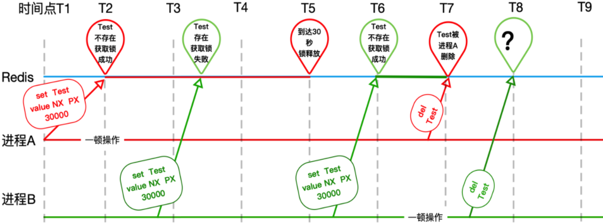

```java
// 改进版本四：只能释放当前线程设置的锁，不能误删其他线程的锁。存在的问题：释放锁的时候，判断锁是否是当前线程设置的、以及删除锁的操作，二者不是原子性
@Override
public String sale() {
    String retMessage = "";
    String key = "RedisDistributedLock";
    String uuidValue = IdUtil.simpleUUID() + ":" + Thread.currentThread().getId();

    // 加锁和设置锁的过期时间，必须保证原子性，不能分开写：redisTemplate.opsForValue().setIfAbsent(key, uuidValue); 和 redisTemplate.expire(key, 30L, TimeUnit.SECONDS);
    while (Boolean.FALSE.equals(redisTemplate.opsForValue().setIfAbsent(key, uuidValue, 30L, TimeUnit.SECONDS))) {
        // 暂停 20 毫秒，类似 CAS 自旋
        try {
            TimeUnit.MILLISECONDS.sleep(20);
        } catch (InterruptedException e) {
            log.info("thread sleep error: ", e);
        }
    }
    try {
        // 1. 查询库存信息
        String result = (String) redisTemplate.opsForValue().get("inventory001");
        // 2. 判断库存是否足够
        int inventoryNumber = result == null ? 0 : Integer.parseInt(result);
        // 3. 扣减库存
        if (inventoryNumber > 0) {
            redisTemplate.opsForValue().set("inventory001", String.valueOf(--inventoryNumber));
            retMessage = "成功卖出一个商品，库存剩余: " + inventoryNumber;
        } else {
            retMessage = "商品卖完了";
        }
        log.info("retMessage: {}", retMessage);
    } finally {
        // 判断加锁与解锁是不是同一个客户端，同一个才行，判断 value 值，自己只能删除自己的锁，不误删他人的
        String value = (String) redisTemplate.opsForValue().get(key);
        if (StringUtils.isNotBlank(value) && value.equalsIgnoreCase(uuidValue)) {
            redisTemplate.delete(key);
        }
    }
    return retMessage + "\t" + "服务端口号：" + port;
}
```

#### 改进版本五：原子性释放锁

在改进版本四中，解决了误删其他线程持有的锁的问题，但是释放锁的时候，判断锁是否是当前线程设置的，以及删除锁的操作不是原子性。因此，**采用 Lua 脚本保证释放锁过程的原子性。**

```java
// 改进版本五：使用 Lua 脚本，保证释放锁过程的原子性。存在的问题：获取锁时不可重入
@Override
public String sale() {
    String retMessage = "";
    String key = "RedisDistributedLock";
    String uuidValue = IdUtil.simpleUUID() + ":" + Thread.currentThread().getId();

    // 加锁和设置锁的过期时间，必须保证原子性，不能分开写：redisTemplate.opsForValue().setIfAbsent(key, uuidValue); 和 redisTemplate.expire(key, 30L, TimeUnit.SECONDS);
    while (Boolean.FALSE.equals(redisTemplate.opsForValue().setIfAbsent(key, uuidValue, 30L, TimeUnit.SECONDS))) {
        // 暂停 20 毫秒，类似 CAS 自旋
        try {
            TimeUnit.MILLISECONDS.sleep(20);
        } catch (InterruptedException e) {
            log.info("thread sleep error: ", e);
        }
    }
    try {
        // 1. 查询库存信息
        String result = (String) redisTemplate.opsForValue().get("inventory001");
        // 2. 判断库存是否足够
        int inventoryNumber = result == null ? 0 : Integer.parseInt(result);
        // 3. 扣减库存
        if (inventoryNumber > 0) {
            redisTemplate.opsForValue().set("inventory001", String.valueOf(--inventoryNumber));
            retMessage = "成功卖出一个商品，库存剩余: " + inventoryNumber;
        } else {
            retMessage = "商品卖完了";
        }
        // log.info("retMessage: {}", retMessage);
    } finally {
        // 将判断 + 删除自己的合并为 Lua 脚本保证原子性
        String luaScript =
                "if (redis.call('GET',KEYS[1]) == ARGV[1]) then " +
                        "return redis.call('DEL',KEYS[1]) " +
                        "else " +
                        "return 0 " +
                        "end";
        Boolean execute = redisTemplate.execute(new DefaultRedisScript<>(luaScript, Boolean.class), List.of(key), uuidValue);
        log.info("Trace of redis distributed lock, release lock: {}", execute);
    }
    return retMessage + "\t" + "服务端口号：" + port;
}
```

#### 改进版本六：可重入

在改进版本五中，保证了释放锁过程的原子性，但获取锁的时候，使用 SETNX 命令，无法实现锁的可重入性。因此，**使用 HSET 命令，替换 SETNX 命令，实现可重入性。**

利用 HSET 命令实现可重入时时，加锁和解锁有下面一系列的执行操作：

```shell
# EXISTS 命令：判断锁是否存在
127.0.0.1:6379> EXISTS RedisDistributedLock
(integer) 0

# HSET 命令：锁不存在，第一次加锁
127.0.0.1:6379> HSET RedisDistributedLock c3de0046cbd647abba9e6eec94ee7686:1 1
(integer) 1

# HINCRBY 命令：锁已存在，可重入
127.0.0.1:6379> HINCRBY RedisDistributedLock c3de0046cbd647abba9e6eec94ee7686:1 1
(integer) 2
127.0.0.1:6379> HINCRBY RedisDistributedLock c3de0046cbd647abba9e6eec94ee7686:1 1
(integer) 3
127.0.0.1:6379> HINCRBY RedisDistributedLock c3de0046cbd647abba9e6eec94ee7686:1 1
(integer) 4

# HET 命令：获取锁重入的次数为 4 次
127.0.0.1:6379> HGET RedisDistributedLock c3de0046cbd647abba9e6eec94ee7686:1
"4"

# HINCRBY 命令：对可重入的锁，解锁 (加锁几次，解锁几次，一一对应)
127.0.0.1:6379> HINCRBY RedisDistributedLock c3de0046cbd647abba9e6eec94ee7686:1 -1
(integer) 3
127.0.0.1:6379> HINCRBY RedisDistributedLock c3de0046cbd647abba9e6eec94ee7686:1 -1
(integer) 2
127.0.0.1:6379> HINCRBY RedisDistributedLock c3de0046cbd647abba9e6eec94ee7686:1 -1
(integer) 1
127.0.0.1:6379> HINCRBY RedisDistributedLock c3de0046cbd647abba9e6eec94ee7686:1 -1
(integer) 0

# DEL 命令：可重入锁释放完成，删除锁
127.0.0.1:6379> DEL RedisDistributedLock
(integer) 1
```

为了满足原子性，需要将上面的加锁命令，和解锁命令，使用 Lua 脚本完成。

**加锁命令：**

- Version 1：

  ```lua
  if redis.call('EXISTS',KEYS[1]) == 0 then
    redis.call('HSET',KEYS[1],ARGV[1],1)
    redis.call('EXPIRE',KEYS[1],ARGV[2])
    return 1
  elseif redis.call('HEXISTS',KEYS[1],ARGV[1]) == 1 then
    redis.call('HINCRBY',KEYS[1],ARGV[1],1)
    redis.call('EXPIRE',KEYS[1],ARGV[2])
    return 1
  else
    return 0
  end
  ```

- Version 2：简化脚本，使用 hincrby 命令替代 hset 命令。（key 不存在时，hincrby 命令也可以设置值）

  ```lua
  if redis.call('EXISTS',KEYS[1]) == 0 or redis.call('HEXISTS',KEYS[1],ARGV[1]) == 1 then
    redis.call('HINCRBY',KEYS[1],ARGV[1],1)
    redis.call('EXPIRE',KEYS[1],ARGV[2])
    return 1
  else
    return 0
  end
  ```

  - KEYS[1]：锁的 key。
  - ARGV[1]：锁的 value。
  - ARGV[2]：锁的 TTL。

- 测试 Lua 脚本：

  ```lua
  127.0.0.1:6379> EVAL "if redis.call('EXISTS',KEYS[1]) == 0 or redis.call('HEXISTS',KEYS[1],ARGV[1]) == 1 then redis.call('HINCRBY',KEYS[1],ARGV[1],1) redis.call('EXPIRE',KEYS[1],ARGV[2]) return 1 else return 0 end" 1 RedisDistributedLock c3de0046cbd647abba9e6eec94ee7686:1 30
  (integer) 1
  127.0.0.1:6379> HGET RedisDistributedLock c3de0046cbd647abba9e6eec94ee7686:1
  "1"
  127.0.0.1:6379> EVAL "if redis.call('EXISTS',KEYS[1]) == 0 or redis.call('HEXISTS',KEYS[1],ARGV[1]) == 1 then redis.call('HINCRBY',KEYS[1],ARGV[1],1) redis.call('EXPIRE',KEYS[1],ARGV[2]) return 1 else return 0 end" 1 RedisDistributedLock c3de0046cbd647abba9e6eec94ee7686:1 30
  (integer) 1
  127.0.0.1:6379> HGET RedisDistributedLock c3de0046cbd647abba9e6eec94ee7686:1
  "2"
  127.0.0.1:6379> EVAL "if redis.call('EXISTS',KEYS[1]) == 0 or redis.call('HEXISTS',KEYS[1],ARGV[1]) == 1 then redis.call('HINCRBY',KEYS[1],ARGV[1],1) redis.call('EXPIRE',KEYS[1],ARGV[2]) return 1 else return 0 end" 1 RedisDistributedLock c3de0046cbd647abba9e6eec94ee7686:1 30
  (integer) 1
  127.0.0.1:6379> HGET RedisDistributedLock c3de0046cbd647abba9e6eec94ee7686:1
  "3"
  127.0.0.1:6379> EVAL "if redis.call('EXISTS',KEYS[1]) == 0 or redis.call('HEXISTS',KEYS[1],ARGV[1]) == 1 then redis.call('HINCRBY',KEYS[1],ARGV[1],1) redis.call('EXPIRE',KEYS[1],ARGV[2]) return 1 else return 0 end" 1 RedisDistributedLock c3de0046cbd647abba9e6eec94ee7686:1 30
  (integer) 1
  127.0.0.1:6379> HGET RedisDistributedLock c3de0046cbd647abba9e6eec94ee7686:1
  "4"
  ```

  - 通过测试，Lua 脚本可以正常执行加锁功能，并实现了锁的可重入。

**解锁命令：**

- Lua 脚本：

  ```java
  if redis.call('HEXISTS',KEYS[1],ARGV[1]) == 0 then
   return nil
  elseif redis.call('HINCRBY',KEYS[1],ARGV[1],-1) == 0 then
   return redis.call('del',KEYS[1])
  else 
   return 0
  end
  ```

- 测试 Lua 脚本：

  ```shell
  127.0.0.1:6379> TTL RedisDistributedLock
  (integer) 25
  127.0.0.1:6379> EVAL "if redis.call('HEXISTS',KEYS[1],ARGV[1]) == 0 then return nil elseif redis.call('HINCRBY',KEYS[1],ARGV[1],-1) == 0 then return redis.call('del',KEYS[1]) else  return 0 end" 1 RedisDistributedLock c3de0046cbd647abba9e6eec94ee7686:1
  (integer) 0
  127.0.0.1:6379> EVAL "if redis.call('HEXISTS',KEYS[1],ARGV[1]) == 0 then return nil elseif redis.call('HINCRBY',KEYS[1],ARGV[1],-1) == 0 then return redis.call('del',KEYS[1]) else  return 0 end" 1 RedisDistributedLock c3de0046cbd647abba9e6eec94ee7686:1
  (integer) 0
  127.0.0.1:6379> EVAL "if redis.call('HEXISTS',KEYS[1],ARGV[1]) == 0 then return nil elseif redis.call('HINCRBY',KEYS[1],ARGV[1],-1) == 0 then return redis.call('del',KEYS[1]) else  return 0 end" 1 RedisDistributedLock c3de0046cbd647abba9e6eec94ee7686:1
  (integer) 0
  127.0.0.1:6379> EVAL "if redis.call('HEXISTS',KEYS[1],ARGV[1]) == 0 then return nil elseif redis.call('HINCRBY',KEYS[1],ARGV[1],-1) == 0 then return redis.call('del',KEYS[1]) else  return 0 end" 1 RedisDistributedLock c3de0046cbd647abba9e6eec94ee7686:1
  (integer) 1
  127.0.0.1:6379> HGET RedisDistributedLock c3de0046cbd647abba9e6eec94ee7686:1
  (nil)
  ```

在以上分析的基础上，新建 RedisDistributedLock.java，实现 Lock 接口，并满足 Lock 接口的规范：

```java
package cn.zero.cloud.platform.lock;

import jakarta.annotation.Nonnull;
import lombok.extern.slf4j.Slf4j;
import org.springframework.data.redis.core.RedisTemplate;
import org.springframework.data.redis.core.script.DefaultRedisScript;

import java.util.Collections;
import java.util.List;
import java.util.concurrent.TimeUnit;
import java.util.concurrent.locks.Condition;
import java.util.concurrent.locks.Lock;

/**
 * @author Xisun Wang
 * @since 2024/6/25 22:42
 */
@Slf4j
public class RedisDistributedLock implements Lock {
    private final RedisTemplate<String, Object> redisTemplate;

    private final String lockName;
    private final Object lockValue;
    private long expireTime;

    public RedisDistributedLock(RedisTemplate<String, Object> redisTemplate, String lockName, Object lockValue, long expireTime) {
        this.redisTemplate = redisTemplate;
        this.lockName = lockName;
        this.lockValue = lockValue;
        this.expireTime = expireTime;
    }

    @Override
    public void lock() {
        boolean isLock = tryLock();
        log.info("Trace of redis distributed lock, GetLockResult, lockName: {}, lockValue: {}, expireTime: {}, isLock: {}", lockName, lockValue, expireTime, isLock);
    }

    @Override
    public void lockInterruptibly() throws InterruptedException {
        // Redis 分布式锁用不到此方法，无需实现
    }

    @Override
    public boolean tryLock() {
        try {
            return tryLock(-1L, TimeUnit.SECONDS);
        } catch (InterruptedException e) {
            log.info("Trace of redis distributed lock, GetLockError, lockName: {}, lockValue: {}, error message: ", lockName, lockValue, e);
        }
        return false;
    }

    @Override
    public boolean tryLock(long time, @Nonnull TimeUnit unit) throws InterruptedException {
        if (time != -1L) {
            this.expireTime = unit.toSeconds(time);
        }

        String script =
                "if redis.call('EXISTS',KEYS[1]) == 0 or redis.call('HEXISTS',KEYS[1],ARGV[1]) == 1 then " +
                        "redis.call('HINCRBY',KEYS[1],ARGV[1],1) " +
                        "redis.call('EXPIRE',KEYS[1],ARGV[2]) " +
                        "return 1 " +
                        "else " +
                        "return 0 " +
                        "end";

        while (Boolean.FALSE.equals(redisTemplate.execute(new DefaultRedisScript<>(script, Boolean.class), List.of(lockName), lockValue, expireTime))) {
            TimeUnit.MILLISECONDS.sleep(50);
        }

        return true;
    }

    @Override
    public void unlock() {
        String script = "if redis.call('HEXISTS',KEYS[1],ARGV[1]) == 0 then " +
                "return nil " +
                "elseif redis.call('HINCRBY',KEYS[1],ARGV[1],-1) == 0 then " +
                "return redis.call('del',KEYS[1]) " +
                "else " +
                "return 0 " +
                "end";

        Boolean isUnlock = redisTemplate.execute(new DefaultRedisScript<>(script, Boolean.class), Collections.singletonList(lockName), lockValue);
        log.info("Trace of redis distributed lock, DeleteLockResult, lockName: {}, lockValue: {}, expireTime: {}, isUnlock: {}", lockName, lockValue, expireTime, isUnlock);

        if (isUnlock == null) {
            throw new RuntimeException("This lock '" + lockName + "' doesn't EXIST");
        }
    }

    @Override
    public Condition newCondition() {
        // Redis 分布式锁用不到此方法，无需实现
        return null;
    }
}
```

新建 RedisDistributedLockFactory.java，实现按需扩展：

```java
package cn.zero.cloud.platform.factory;

import cn.zero.cloud.platform.lock.RedisDistributedLock;
import org.springframework.beans.factory.annotation.Autowired;
import org.springframework.data.redis.core.RedisTemplate;
import org.springframework.stereotype.Component;

import java.util.concurrent.locks.Lock;

/**
 * @author Xisun Wang
 * @since 2024/6/25 23:11
 */
@Component
public class RedisDistributedLockFactory {
    private final RedisTemplate<String, Object> redisTemplate;

    @Autowired
    public RedisDistributedLockFactory(RedisTemplate<String, Object> redisTemplate) {
        this.redisTemplate = redisTemplate;
    }

    public Lock getDistributedLock(String lockType, String lockName, Object lockValue, long expireTime) {
        if (lockType == null) {
            return null;
        }

        if ("REDIS".equalsIgnoreCase(lockType)) {
            return new RedisDistributedLock(redisTemplate, lockName, lockValue, expireTime);
        } else if ("ZOOKEEPER".equalsIgnoreCase(lockType)) {
            // TODO Zookeeper 版本的分布式锁实现
            return null;
        } else if ("MYSQL".equalsIgnoreCase(lockType)) {
            // TODO MySQL 版本的分布式锁实现
            return null;
        }

        return null;
    }
}
```

InventoryServiceImpl.java：

```java
package cn.zero.cloud.platform.service.impl;

import cn.hutool.core.util.IdUtil;
import cn.zero.cloud.platform.factory.RedisDistributedLockFactory;
import cn.zero.cloud.platform.service.InventoryService;
import lombok.extern.slf4j.Slf4j;
import org.springframework.beans.factory.annotation.Autowired;
import org.springframework.beans.factory.annotation.Value;
import org.springframework.data.redis.core.RedisTemplate;
import org.springframework.stereotype.Service;

import java.util.concurrent.locks.Lock;

/**
 * @author Xisun Wang
 * @since 2024/6/21 22:22
 */
@Slf4j
@Service
public class InventoryServiceImpl implements InventoryService {
    @Value("${server.port}")
    private String port;

    @Value("${lock.type}")
    private String lockType;

    private final RedisTemplate<String, Object> redisTemplate;

    private final RedisDistributedLockFactory redisDistributedLockFactory;


    @Autowired
    public InventoryServiceImpl(RedisTemplate<String, Object> redisTemplate, RedisDistributedLockFactory redisDistributedLockFactory) {
        this.redisTemplate = redisTemplate;
        this.redisDistributedLockFactory = redisDistributedLockFactory;
    }

    // 改进版本六：实现锁的可重入。存在的问题：锁没有自动续期功能
    @Override
    public String sale() {
        String lockName = "RedisDistributedLock";
        // 注意，对于可重入锁，订单号，也就是 lockValue，需要保持一致
        String lockValue = IdUtil.simpleUUID() + ":" + Thread.currentThread().getId();
        long expireTime = 30L;

        Lock lock = redisDistributedLockFactory.getDistributedLock(lockType, lockName, lockValue, expireTime);
        lock.lock();
        String retMessage;
        try {
            // 1. 查询库存信息
            String result = (String) redisTemplate.opsForValue().get("inventory001");
            // 2. 判断库存是否足够
            int inventoryNumber = result == null ? 0 : Integer.parseInt(result);
            // 3. 扣减库存
            if (inventoryNumber > 0) {
                redisTemplate.opsForValue().set("inventory001", String.valueOf(--inventoryNumber));
                retMessage = "成功卖出一个商品，库存剩余：" + inventoryNumber;
            } else {
                retMessage = "商品卖完了";
            }

            testReEnter(lockName, lockValue, expireTime);
        } finally {
            lock.unlock();
        }
        return retMessage + "\t" + "订单号：" + lockValue + "\t" + "服务端口号：" + port;
    }

    private void testReEnter(String lockName, Object lockValue, long expireTime) {
        Lock lock = redisDistributedLockFactory.getDistributedLock(lockType, lockName, lockValue, expireTime);
        lock.lock();
        try {
            log.info("################测试可重入锁1####################################");
            testReEnter2(lockName, lockValue, expireTime);
        } finally {
            lock.unlock();
        }
    }

    private void testReEnter2(String lockName, Object lockValue, long expireTime) {
        Lock lock = redisDistributedLockFactory.getDistributedLock(lockType, lockName, lockValue, expireTime);
        lock.lock();
        try {
            log.info("################测试可重入锁2####################################");
        } finally {
            lock.unlock();
        }
    }
}
```

#### 改进版本七：自动续期

在改进版本六中，实现了锁的可重入性。但是，一个线程获取锁后，会设置锁的有效期，如果在有效期内业务未执行完，锁就会失效，其他线程可以继续获取锁，这个时候，业务上可能就会出现异常。因此，**为了确保锁的过期时间大于业务的执行时间，需要给锁添加续期功能。**

对于 Redis 锁的续期功能，可以由 Lua 脚本实现：

```lua
if redis.call('HEXISTS',KEYS[1],ARGV[1]) == 1 then
  return redis.call('expire',KEYS[1],ARGV[2])
else
  return 0
end
```

RedisDistributedLock.java：

```java
package cn.zero.cloud.platform.lock;

import jakarta.annotation.Nonnull;
import lombok.extern.slf4j.Slf4j;
import org.springframework.data.redis.core.RedisTemplate;
import org.springframework.data.redis.core.script.DefaultRedisScript;

import java.util.*;
import java.util.concurrent.TimeUnit;
import java.util.concurrent.locks.Condition;
import java.util.concurrent.locks.Lock;

/**
 * @author Xisun Wang
 * @since 2024/6/25 22:42
 */
@Slf4j
public class RedisDistributedLock implements Lock {
    private final RedisTemplate<String, Object> redisTemplate;

    private final String lockName;
    private final Object lockValue;
    private long expireTime;

    public RedisDistributedLock(RedisTemplate<String, Object> redisTemplate, String lockName, Object lockValue, long expireTime) {
        this.redisTemplate = redisTemplate;
        this.lockName = lockName;
        this.lockValue = lockValue;
        this.expireTime = expireTime;
    }

    @Override
    public void lock() {
        boolean isLock = tryLock();
        log.info("Trace of redis distributed lock, GetLockResult, lockName: {}, lockValue: {}, expireTime: {}, isLock: {}", lockName, lockValue, expireTime, isLock);
    }

    @Override
    public void lockInterruptibly() throws InterruptedException {
        // Redis 分布式锁用不到此方法，无需实现
    }

    @Override
    public boolean tryLock() {
        try {
            return tryLock(-1L, TimeUnit.SECONDS);
        } catch (InterruptedException e) {
            log.info("Trace of redis distributed lock, GetLockError, lockName: {}, lockValue: {}, error message: ", lockName, lockValue, e);
        }
        return false;
    }

    @Override
    public boolean tryLock(long time, @Nonnull TimeUnit unit) throws InterruptedException {
        if (time != -1L) {
            this.expireTime = unit.toSeconds(time);
        }

        String script =
                "if redis.call('EXISTS',KEYS[1]) == 0 or redis.call('HEXISTS',KEYS[1],ARGV[1]) == 1 then " +
                        "redis.call('HINCRBY',KEYS[1],ARGV[1],1) " +
                        "redis.call('EXPIRE',KEYS[1],ARGV[2]) " +
                        "return 1 " +
                        "else " +
                        "return 0 " +
                        "end";

        while (Boolean.FALSE.equals(redisTemplate.execute(new DefaultRedisScript<>(script, Boolean.class), List.of(lockName), lockValue, expireTime))) {
            TimeUnit.MILLISECONDS.sleep(50);
        }

        // 自动续期
        renewExpire();

        return true;
    }

    @Override
    public void unlock() {
        String script = "if redis.call('HEXISTS',KEYS[1],ARGV[1]) == 0 then " +
                "return nil " +
                "elseif redis.call('HINCRBY',KEYS[1],ARGV[1],-1) == 0 then " +
                "return redis.call('del',KEYS[1]) " +
                "else " +
                "return 0 " +
                "end";

        Boolean isUnlock = redisTemplate.execute(new DefaultRedisScript<>(script, Boolean.class), Collections.singletonList(lockName), lockValue);
        log.info("Trace of redis distributed lock, DeleteLockResult, lockName: {}, lockValue: {}, expireTime: {}, isUnlock: {}", lockName, lockValue, expireTime, isUnlock);

        if (isUnlock == null) {
            throw new RuntimeException("This lock '" + lockName + "' doesn't EXIST");
        }
    }

    /**
     * 锁的自动续期
     */
    private void renewExpire() {
        String script =
                "if redis.call('HEXISTS',KEYS[1],ARGV[1]) == 1 then " +
                        "return redis.call('EXPIRE',KEYS[1],ARGV[2]) " +
                        "else " +
                        "return 0 " +
                        "end";

        new Timer().schedule(new TimerTask() {
            @Override
            public void run() {
                if (Boolean.TRUE.equals(redisTemplate.execute(new DefaultRedisScript<>(script, Boolean.class), Collections.singletonList(lockName), lockValue, expireTime))) {
                    renewExpire();
                }
            }
        }, (this.expireTime * 1000) / 3);
    }

    @Override
    public Condition newCondition() {
        // Redis 分布式锁用不到此方法，无需实现
        return null;
    }
}
```

InventoryServiceImpl.java：

```java
package cn.zero.cloud.platform.service.impl;

import cn.hutool.core.util.IdUtil;
import cn.zero.cloud.platform.factory.RedisDistributedLockFactory;
import cn.zero.cloud.platform.service.InventoryService;
import lombok.extern.slf4j.Slf4j;
import org.springframework.beans.factory.annotation.Autowired;
import org.springframework.beans.factory.annotation.Value;
import org.springframework.data.redis.core.RedisTemplate;
import org.springframework.stereotype.Service;

import java.util.concurrent.TimeUnit;
import java.util.concurrent.locks.Lock;

/**
 * @author Xisun Wang
 * @since 2024/6/21 22:22
 */
@Slf4j
@Service
public class InventoryServiceImpl implements InventoryService {
    @Value("${server.port}")
    private String port;

    @Value("${lock.type}")
    private String lockType;

    private final RedisTemplate<String, Object> redisTemplate;

    private final RedisDistributedLockFactory redisDistributedLockFactory;


    @Autowired
    public InventoryServiceImpl(RedisTemplate<String, Object> redisTemplate, RedisDistributedLockFactory redisDistributedLockFactory) {
        this.redisTemplate = redisTemplate;
        this.redisDistributedLockFactory = redisDistributedLockFactory;
    }

    // 改进版本七：实现锁的自动续期，后台自定义扫描程序，如果规定时间内没有完成业务逻辑，会调用加钟自动续期的脚本
    @Override
    public String sale() {
        String lockName = "RedisDistributedLock";
        // 注意，对于可重入锁，订单号，也就是 lockValue，需要保持一致
        String lockValue = IdUtil.simpleUUID() + ":" + Thread.currentThread().getId();
        long expireTime = 30L;

        Lock lock = redisDistributedLockFactory.getDistributedLock(lockType, lockName, lockValue, expireTime);
        lock.lock();
        String retMessage;
        try {
            // 1. 查询库存信息
            String result = (String) redisTemplate.opsForValue().get("inventory001");
            // 2. 判断库存是否足够
            int inventoryNumber = result == null ? 0 : Integer.parseInt(result);
            // 3. 扣减库存
            if (inventoryNumber > 0) {
                redisTemplate.opsForValue().set("inventory001", String.valueOf(--inventoryNumber));
                retMessage = "成功卖出一个商品，库存剩余：" + inventoryNumber;
            } else {
                retMessage = "商品卖完了";
            }

            // 暂停 120 秒，测试自动续期
            try {
                TimeUnit.SECONDS.sleep(120);
            } catch (InterruptedException e) {
                throw new RuntimeException(e);
            }
        } finally {
            lock.unlock();
        }
        return retMessage + "\t" + "订单号：" + lockValue + "\t" + "服务端口号：" + port;
    }
}
```

启动服务，因为程序要等待 120 秒，远大于锁的过期时间，观察 Redis 中的锁，可以发现，每过 10 秒，锁的过期时间都会重新设置。当程序最终完成时会删除锁，自动续期的任务也会完成。

至此，完成了 Redis 分布式锁的手写。

> **注意：对于此自研手写的 Redis 分布式锁，一般中小公司，非特别高的并发场景足够使用，对于并发场景要求特别高的，建议使用官方推荐的方案，详见下一章。**

## Redlock 算法和底层原码分析

官网：https://redis.io/docs/latest/develop/use/patterns/distributed-locks/

Distributed locks are a very useful primitive in many environments where different processes must operate with shared resources in a mutually exclusive way.

There are a number of libraries and blog posts describing how to implement a DLM (Distributed Lock Manager) with Redis, but every library uses a different approach, and many use a simple approach with lower guarantees compared to what can be achieved with slightly more complex designs.

This page describes a more canonical algorithm to implement distributed locks with Redis. We propose an algorithm, called **Redlock**, which implements a DLM which we believe to be safer than the vanilla single instance approach. We hope that the community will analyze it, provide feedback, and use it as a starting point for the implementations or more complex or alternative designs.

对于使用 Redis 实现分布式锁的方案，有很多 blog 描述了不同的方式，而 Redis 官方，推荐了一种比普通的单实例方法更安全的算法，即**`Redlock`**。

### Redlock 对不同语言的实现

**对于不同的语言，Redis 提供了对应的 Redlock 算法实现：**

- [Redlock-rb](https://github.com/antirez/redlock-rb) (Ruby implementation). There is also a [fork of Redlock-rb](https://github.com/leandromoreira/redlock-rb) that adds a gem for easy distribution.
- [RedisQueuedLocks](https://github.com/0exp/redis_queued_locks) (Ruby implementation).
- [Redlock-py](https://github.com/SPSCommerce/redlock-py) (Python implementation).
- [Pottery](https://github.com/brainix/pottery#redlock) (Python implementation).
- [Aioredlock](https://github.com/joanvila/aioredlock) (Asyncio Python implementation).
- [Redlock-php](https://github.com/ronnylt/redlock-php) (PHP implementation).
- [PHPRedisMutex](https://github.com/malkusch/lock#phpredismutex) (further PHP implementation).
- [cheprasov/php-redis-lock](https://github.com/cheprasov/php-redis-lock) (PHP library for locks).
- [rtckit/react-redlock](https://github.com/rtckit/reactphp-redlock) (Async PHP implementation).
- [Redsync](https://github.com/go-redsync/redsync) (Go implementation).
- [Redisson](https://github.com/mrniko/redisson) (Java implementation).
- [Redis::DistLock](https://github.com/sbertrang/redis-distlock) (Perl implementation).
- [Redlock-cpp](https://github.com/jacket-code/redlock-cpp) (C++ implementation).
- [Redis-plus-plus](https://github.com/sewenew/redis-plus-plus/#redlock) (C++ implementation).
- [Redlock-cs](https://github.com/kidfashion/redlock-cs) (C#/.NET implementation).
- [RedLock.net](https://github.com/samcook/RedLock.net) (C#/.NET implementation). Includes async and lock extension support.
- [ScarletLock](https://github.com/psibernetic/scarletlock) (C# .NET implementation with configurable datastore).
- [Redlock4Net](https://github.com/LiZhenNet/Redlock4Net) (C# .NET implementation).
- [node-redlock](https://github.com/mike-marcacci/node-redlock) (NodeJS implementation). Includes support for lock extension.
- [Deno DLM](https://github.com/oslabs-beta/Deno-Redlock) (Deno implementation)
- [Rslock](https://github.com/hexcowboy/rslock) (Rust implementation). Includes async and lock extension support.

对于 Java 语言开发工作者，我们重点关注`Redisson`。

### 分布式锁安全性和有效性的保证

We are going to model our design with just three properties that, from our point of view, are the minimum guarantees needed to use distributed locks in an effective way.

1. Safety property: Mutual exclusion. At any given moment, only one client can hold a lock.
2. Liveness property A: Deadlock free. Eventually it is always possible to acquire a lock, even if the client that locked a resource crashes or gets partitioned.
3. Liveness property B: Fault tolerance. As long as the majority of Redis nodes are up, clients are able to acquire and release locks.

对于一个分布式锁，Redis 官方认为，最低需要保证以下三个方面：

1. 安全性：互斥性。在任何时刻，只能由一个客户端可以持有锁。
2. 有效性 A：无死锁。
3. 有效性 B：容错性。只要大多数 Redis 节点正常运行，客户端就能获取和释放锁。

### 为什么基于故障转移的实现是不足够的

To understand what we want to improve, let’s analyze the current state of affairs with most Redis-based distributed lock libraries.

The simplest way to use Redis to lock a resource is to create a key in an instance. The key is usually created with a limited time to live, using the Redis expires feature, so that eventually it will get released (property 2 in our list). When the client needs to release the resource, it deletes the key.

Superficially this works well, but there is a problem: this is a single point of failure in our architecture. What happens if the Redis master goes down? Well, let’s add a replica! And use it if the master is unavailable. This is unfortunately not viable. By doing so we can’t implement our safety property of mutual exclusion, because Redis replication is asynchronous.

There is a race condition with this model:

1. Client A acquires the lock in the master.
2. The master crashes before the write to the key is transmitted to the replica.
3. The replica gets promoted to master.
4. Client B acquires the lock to the same resource A already holds a lock for. **SAFETY VIOLATION!**

Sometimes it is perfectly fine that, under special circumstances, for example during a failure, multiple clients can hold the lock at the same time. If this is the case, you can use your replication based solution. Otherwise we suggest to implement the solution described in this document.

就如上一章我们手写的 Redis 分布式锁，通常情况下，是能够正常工作的。但其仍然会存在一个问题（**`单点故障`**）：Redis 主服务器宕机了该怎么办？**由于 Redis 的主从复制是异步的，这也就意味着，如果 Redis 主服务器宕机，那么其上正在被使用的锁就不复存在，此时，分布式锁互斥的安全特性，就无法得到满足。**如下图所示：

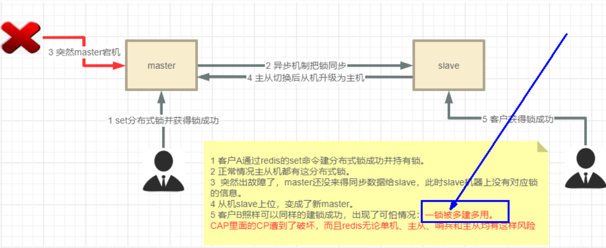

1. 线程 1 首先获取锁成功，将键值对写入 Redis 的 Master 节点，在 Redis 将该键值对同步到 Slave 节点之前，Master 发生了故障；
2. Redis 触发故障转移，其中一个 Slave 升级为新的 Master，此时新上位的 Master，并不包含线程 1 写入的键值对，因此线程 2 尝试获取锁也可以成功拿到锁；
3. 此时，相当于有两个线程获取到了锁，可能会导致各种预期之外的情况发生，例如最常见的脏数据。

### Redlock 算法

In the distributed version of the algorithm we assume we have N Redis masters. Those nodes are totally independent, so we don’t use replication or any other implicit coordination system. We already described how to acquire and release the lock safely in a single instance. We take for granted that the algorithm will use this method to acquire and release the lock in a single instance. In our examples we set N=5, which is a reasonable value, so we need to run 5 Redis masters on different computers or virtual machines in order to ensure that they’ll fail in a mostly independent way.

In order to acquire the lock, the client performs the following operations:

1. It gets the current time in milliseconds.
2. It tries to acquire the lock in all the N instances sequentially, using the same key name and random value in all the instances. During step 2, when setting the lock in each instance, the client uses a timeout which is small compared to the total lock auto-release time in order to acquire it. For example if the auto-release time is 10 seconds, the timeout could be in the ~ 5-50 milliseconds range. This prevents the client from remaining blocked for a long time trying to talk with a Redis node which is down: if an instance is not available, we should try to talk with the next instance ASAP.
3. The client computes how much time elapsed in order to acquire the lock, by subtracting from the current time the timestamp obtained in step 1. If and only if the client was able to acquire the lock in the majority of the instances (at least 3), and the total time elapsed to acquire the lock is less than lock validity time, the lock is considered to be acquired.
4. If the lock was acquired, its validity time is considered to be the initial validity time minus the time elapsed, as computed in step 3.
5. If the client failed to acquire the lock for some reason (either it was not able to lock N/2+1 instances or the validity time is negative), it will try to unlock all the instances (even the instances it believed it was not able to lock).

在该算法的分布式版本中，我们假设有 N 个 Redis 主节点。这些节点是完全独立的，因此我们不使用复制或任何其他隐式协调系统。我们已经介绍了如何在单个实例中安全地获取和释放锁。我们假定算法将使用这种方法在单个实例中获取和释放锁。在我们的示例中，我们设置了 N = 5，这是一个合理的值，因此我们需要在不同的计算机或虚拟机上运行 5 个 Redis 主节点，以确保它们以基本独立的方式发生故障。

为了获取锁，客户端会执行以下操作：

1. 它会以毫秒为单位获取当前时间。
2. 它尝试在所有 N 个实例中依次获取锁，在所有实例中使用相同的键名和随机值。在第 2 步中，在每个实例中设置锁时，客户端会使用一个与总锁自动释放时间相比较小的超时来获取锁。例如，如果自动释放时间为 10 秒，那么超时时间可以在 5 ~ 50 毫秒之间。这样可以防止客户端在尝试与宕机的 Redis 节点通信时长时间处于阻塞状态：如果某个实例不可用，我们应尽快尝试与下一个实例通信。
3. 客户端会从当前时间中减去步骤 1 中获得的时间戳，计算获取锁所需的时间。如果且只有当客户端能在大多数实例（至少 3 个）中获取锁，且获取锁所耗费的总时间小于锁的有效时间时，才认为获取了锁。
4. 如果锁已被获取，则其有效时间被认为是初始有效时间减去步骤 3 计算出的已用时间。
5. 如果客户机因某种原因未能获取锁（要么无法锁定 N/2+1 个实例，要么有效时间为负），它将尝试解锁所有实例（甚至是它认为无法锁定的实例）。

简而言之，**Redis 为了解决分布式锁的单点故障，提供了一种`Redlock 算法`，用来实现基于多个实例的分布式锁。**

- 锁变量由多个实例维护，即使有实例发生了故障，锁变量仍然是存在的，客户端还是可以完成锁操作。
- Redlock 算法是实现高可靠分布式锁的一种有效解决方案，可以在实际开发中使用。

#### 设计理念

Redlock 算法方案也是基于（SET 加锁、Lua 脚本解锁）进行改良的，所以 Redis 之父 Antirez 只描述了差异的地方，大致方案如下。

假设我们有 N 个 Redis 主节点，例如 N = 5，这些节点是完全独立的，我们不使用复制或任何其他隐式协调系统，

为了取到锁客户端执行以下操作：

1. 获取当前时间，以毫秒为单位；
2. 依次尝试从 5 个实例，使用相同的 key 和随机值（例如 UUID）获取锁。当向 Redis 请求获取锁时，客户端应该设置一个超时时间，这个超时时间应该小于锁的失效时间。例如你的锁自动失效时间为 10 秒，则超时时间应该在 5 ~ 50 毫秒之间。这样可以防止客户端在试图与一个宕机的 Redis 节点对话时长时间处于阻塞状态。如果一个实例不可用，客户端应该尽快尝试去另外一个 Redis 实例请求获取锁；
3. 客户端通过当前时间减去步骤 1 记录的时间来计算获取锁使用的时间。当且仅当从大多数（N/2+1，至少是 3 个节点）的 Redis 节点都取到锁，并且获取锁使用的时间小于锁失效时间时，锁才算获取成功；
4. 如果取到了锁，其真正有效时间等于初始有效时间减去获取锁所使用的时间（步骤 3 计算的结果）；
5. 如果由于某些原因未能获得锁（无法在至少 N/2+1 个 Redis 实例获取锁、或获取锁的时间超过了有效时间），客户端应该在所有的 Redis 实例上进行解锁（即便某些 Redis 实例根本就没有加锁成功，防止某些节点获取到锁但是客户端没有得到响应而导致接下来的一段时间不能被重新获取锁）。

Redlock 算法方案为了解决数据不一致的问题，直接舍弃了异步复制，只使用 Master 节点，同时由于舍弃了 Slave，为了保证可用性，引入了 N 个节点，官方建议是 5 个节点，至少是 3 个节点。同时，客户端只有在满足下面的这两个条件时，才能认为是加锁成功：

- 条件 1：客户端从超过半数（大于等于 N/2+1）的 Redis 实例上成功获取到了锁。

- 条件 2：客户端获取锁的总耗时没有超过锁的有效时间。

#### 容错公式

Redlock 算法要求的 Redis 实例数：**`N/2+1`**。

- N 是最终部署机器数，X 是容错机器数。
- 容错：指失败了多少台机器实例后还是可以容忍的，所谓的容忍就是数据一致性还是可以 ok 的，CP 数据一致性还是可以满足。
  - 假如在集群环境中，Redis 失败 1 台，可接受。则 2X + 1 = 2 * 1 + 1 = 3，即部署 3 台实例，失败 1 台，剩下 2 台可以正常工作，那就部署 3 台。
  - 假如在集群环境中，Redis 失败 2 台，可接受。则 2X + 1 = 2 * 2 + 1 = 5，即部署 5 台实例，失败 2 台，剩下 3 台可以正常工作，那就部署 5 台。
- 为什么是奇数：以最少的机器，做最多的产出效果。
  - 假如在集群环境中，Redis 失败 1 台，可接受。则 2X + 2 = 2 * 1 + 2 = 4，即部署 4 台，其效果与部署 3 台是一样的。
  - 假如在集群环境中，Redis 失败 2 台，可接受。则 2X + 2 = 2 * 2 + 2 = 6，即部署 6 台，其效果与部署 5 台是一样的。

#### 落地实现

对于 Java 开发工作者，Redlock 算法的实现，对应的是 Redisson。

Redisson 官网：https://redisson.org/

Redisson Github：https://github.com/redisson/redisson

Redisson distributed locks：https://github.com/redisson/redisson/wiki/8.-distributed-locks-and-synchronizers

### Redisson 版本分布式锁

引入依赖：

```xml
<dependency>
    <groupId>org.redisson</groupId>
    <artifactId>redisson</artifactId>
    <version>3.31.0</version>
</dependency>
```

#### 单机版

在查看 Redisson 如何实现 Redlock 算法之前，我们先看 Redisson 如何实现单机版分布式锁，对应的就是上一章我们手写的 Redis 分布式锁。

RedisConfig.java 中添加配置：

```java
/**
 * 单 Redis 节点模式
 *
 * @return Redisson
 */
@Bean
public RedissonClient redisson() {
    Config config = new Config();
    config.useSingleServer()
            .setAddress("redis://192.168.1.20:6379")
            .setDatabase(1)
            .setPassword("123456");
    return Redisson.create(config);
}
```

InventoryController.java 新增 Redisson 版本的方法：

```java
@GetMapping(value = "/saleByRedisson", produces = MediaType.APPLICATION_JSON_VALUE)
@ResponseStatus(HttpStatus.OK)
public String saleByRedisson() {
    return inventoryService.saleByRedisson();
}
```

InventoryServiceImpl.java：

```java
// 改进版本八：Redisson 版本的分布式锁
@Override
public String saleByRedisson() {
    String lockName = "RedisDistributedLock";
    // 注意，对于可重入锁，订单号，也就是 lockValue，需要保持一致
    String lockValue = IdUtil.simpleUUID() + ":" + Thread.currentThread().getId();

    RLock lock = redisson.getLock(lockName);

    lock.lock();
    String retMessage;
    try {
        // 1. 查询库存信息
        String result = (String) redisTemplate.opsForValue().get("inventory001");
        // 2. 判断库存是否足够
        int inventoryNumber = result == null ? 0 : Integer.parseInt(result);
        // 3. 扣减库存
        if (inventoryNumber > 0) {
            redisTemplate.opsForValue().set("inventory001", String.valueOf(--inventoryNumber));
            retMessage = "成功卖出一个商品，库存剩余：" + inventoryNumber;
        } else {
            retMessage = "商品卖完了";
        }
    } finally {
        lock.unlock();
    }
    return retMessage + "\t" + "订单号：" + lockValue + "\t" + "服务端口号：" + port;
}
```

jmeter 压测：

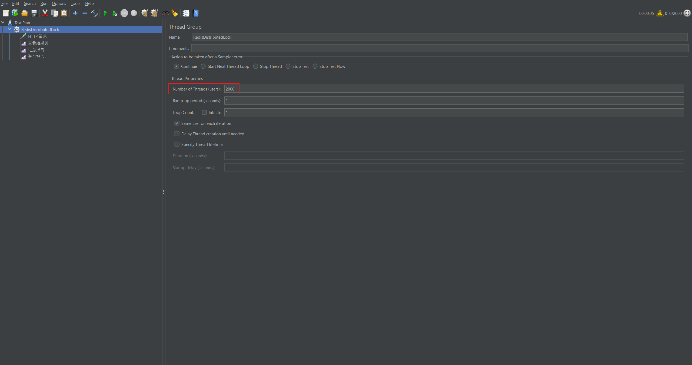

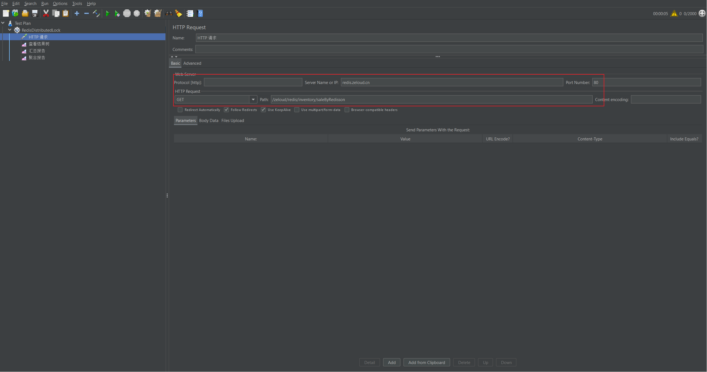


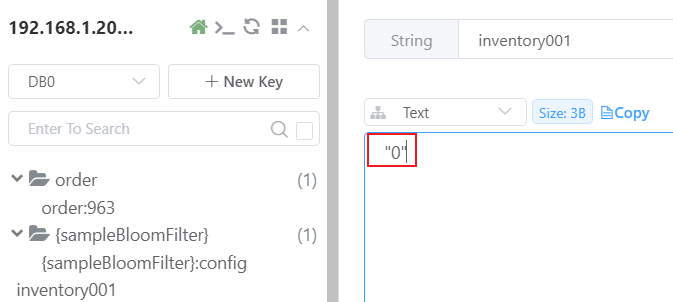

> 注意：分布式锁 RedisDistributedLock 在 DB1 上，在压测过程中，查看 Redis DB1，可以偶尔看到存在的锁 RedisDistributedLock。

##### Bug 说明

上面的代码，在实际运行的过程中，可能会出现如下异常：

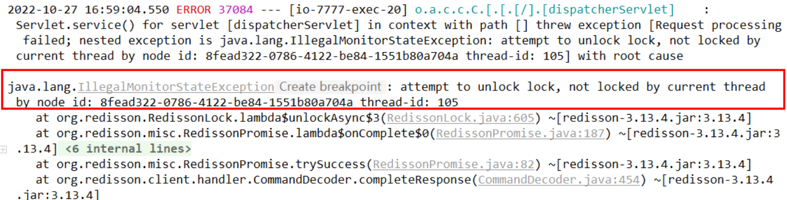

其原因是一个线程误删了其他线程持有的锁，进而导致其他线程在释放锁时出现异常，将上述代码改进如下，添加防止误删的判断：

```java
// 改进版本八：Redisson 版本的分布式锁
@Override
public String saleByRedisson() {
    String lockName = "RedisDistributedLock";
    // 注意，对于可重入锁，订单号，也就是 lockValue，需要保持一致
    String lockValue = IdUtil.simpleUUID() + ":" + Thread.currentThread().getId();

    RLock lock = redisson.getLock(lockName);

    lock.lock();
    String retMessage;
    try {
        // 1. 查询库存信息
        String result = (String) redisTemplate.opsForValue().get("inventory001");
        // 2. 判断库存是否足够
        int inventoryNumber = result == null ? 0 : Integer.parseInt(result);
        // 3. 扣减库存
        if (inventoryNumber > 0) {
            redisTemplate.opsForValue().set("inventory001", String.valueOf(--inventoryNumber));
            retMessage = "成功卖出一个商品，库存剩余：" + inventoryNumber;
        } else {
            retMessage = "商品卖完了";
        }
    } finally {
        // 防止误删其他线程持有的锁
        if (lock.isLocked() && lock.isHeldByCurrentThread()) {
            lock.unlock();
        }
    }
    return retMessage + "\t" + "订单号：" + lockValue + "\t" + "服务端口号：" + port;
}
```

#### 源码分析

Redisson 获取锁的方法：

```java
RLock lock = redisson.getLock(lockName);
```

默认返回的是 RedissonLock：

```java
@Override
public RLock getLock(String name) {
    return new RedissonLock(commandExecutor, name);
}
```

##### 过期时间

在[官方文档](https://github.com/redisson/redisson/wiki/8.-distributed-locks-and-synchronizers)中，有下面的介绍：

If Redisson instance which acquired lock crashes then such lock could hang forever in acquired state. To avoid this Redisson maintains lock watchdog, it prolongs lock expiration while lock holder Redisson instance is alive. By default lock watchdog timeout is 30 seconds and can be changed through [Config.lockWatchdogTimeout](https://github.com/redisson/redisson/wiki/2.-Configuration#lockwatchdogtimeout) setting.

Redisson 在成功获取锁之后，会给锁添加一个**`watchdog`**，默认情况下，watchdog 的超时时间是 30 秒（也就是锁的过期时间），可以通过 lockWatchdogTimeout 配置项修改。

查看 RedissonLock.java 源码：

```java
public class RedissonLock extends RedissonBaseLock {

    private static final Logger LOGGER = LoggerFactory.getLogger(RedissonLock.class);

    protected long internalLockLeaseTime;

    protected final LockPubSub pubSub;

    final CommandAsyncExecutor commandExecutor;

    public RedissonLock(CommandAsyncExecutor commandExecutor, String name) {
        super(commandExecutor, name);
        this.commandExecutor = commandExecutor;
        this.internalLockLeaseTime = getServiceManager().getCfg().getLockWatchdogTimeout();
        this.pubSub = commandExecutor.getConnectionManager().getSubscribeService().getLockPubSub();
    }
}
```

构造方法中，this.internalLockLeaseTime 即为默认的 watchdog 的超时时间：

```java
public class Config {
    private long lockWatchdogTimeout = 30 * 1000;
}
```

##### 加锁流程

查看 RedissonLock.java 源码，获取加锁的流程：lock() ---> tryAcquire() ---> tryAcquireAsync()。

```java
@Override
public void lock() {
    try {
        lock(-1, null, false);
    } catch (InterruptedException e) {
        throw new IllegalStateException();
    }
}
```

```java
private void lock(long leaseTime, TimeUnit unit, boolean interruptibly) throws InterruptedException {
    long threadId = Thread.currentThread().getId();
    // tryAcquire()，尝试获取锁
    Long ttl = tryAcquire(-1, leaseTime, unit, threadId);
    ...
}
```

```java
private Long tryAcquire(long waitTime, long leaseTime, TimeUnit unit, long threadId) {
    return get(tryAcquireAsync0(waitTime, leaseTime, unit, threadId));
}
```

```java
private RFuture<Long> tryAcquireAsync0(long waitTime, long leaseTime, TimeUnit unit, long threadId) {
    return getServiceManager().execute(() -> tryAcquireAsync(waitTime, leaseTime, unit, threadId));
}
```

```java
// Redisson 加锁的核心代码
private RFuture<Long> tryAcquireAsync(long waitTime, long leaseTime, TimeUnit unit, long threadId) {
    RFuture<Long> ttlRemainingFuture;
    if (leaseTime > 0) {
        // 如果设置了 leaseTime，则以设置的值作为锁的过期时间
        ttlRemainingFuture = tryLockInnerAsync(waitTime, leaseTime, unit, threadId, RedisCommands.EVAL_LONG);
    } else {
        // 如果未设置 leaseTime，则以默认的 internalLockLeaseTime 作为锁的过期时间，即 30 秒
        ttlRemainingFuture = tryLockInnerAsync(waitTime, internalLockLeaseTime,
                TimeUnit.MILLISECONDS, threadId, RedisCommands.EVAL_LONG);
    }
    CompletionStage<Long> s = handleNoSync(threadId, ttlRemainingFuture);
    ttlRemainingFuture = new CompletableFutureWrapper<>(s);

    CompletionStage<Long> f = ttlRemainingFuture.thenApply(ttlRemaining -> {
        // lock acquired
        if (ttlRemaining == null) {
            if (leaseTime > 0) {
                internalLockLeaseTime = unit.toMillis(leaseTime);
            } else {
                // 加锁成功，自动续期
                scheduleExpirationRenewal(threadId);
            }
        }
        return ttlRemaining;
    });
    return new CompletableFutureWrapper<>(f);
}
```

```java
// Redisson 加锁的 Lua 脚本：
// 1. 锁不存在，则通过 hincrby 创建，并设置过期时间，加锁成功；
// 2. 锁已存在，并且是当前线程持有，则通过 hincrby 将值新增 1，实现可重入，重置过期时间，加锁成功；
// 3. 锁已存在，但不是当前线程持有，则返回锁的过期时间，加锁失败。
<T> RFuture<T> tryLockInnerAsync(long waitTime, long leaseTime, TimeUnit unit, long threadId, RedisStrictCommand<T> command) {
    return evalWriteSyncedAsync(getRawName(), LongCodec.INSTANCE, command,
               "if ((redis.call('exists', KEYS[1]) == 0) " +
                "or (redis.call('hexists', KEYS[1], ARGV[2]) == 1)) then " +
                "redis.call('hincrby', KEYS[1], ARGV[2], 1); " +
                "redis.call('pexpire', KEYS[1], ARGV[1]); " +
                "return nil; " +
                "end; " +
                "return redis.call('pttl', KEYS[1]);",
            Collections.singletonList(getRawName()), unit.toMillis(leaseTime), getLockName(threadId));
}
```

##### 全局标识符

在 tryLockInnerAsync() 方法中，执行加锁的 Lua 脚本时，可以看到，RedissonLock 锁对应的 key 是由 getLockName(threadId) 方法获取，该方法位于其父类 RedissonBaseLock.java 中：

```java
protected String getLockName(long threadId) {
    return id + ":" + threadId;
}
```

threadId 由`long threadId = Thread.currentThread().getId();`方法获取，对于 id 值，回头查看，当执行`RLock lock = redisson.getLock(lockName);`，获取 RLock 时，查看构造方法：

```java
@Override
public RLock getLock(String name) {
    return new RedissonLock(commandExecutor, name);
}
```

```java
public RedissonLock(CommandAsyncExecutor commandExecutor, String name) {
    super(commandExecutor, name);
    this.commandExecutor = commandExecutor;
    this.internalLockLeaseTime = getServiceManager().getCfg().getLockWatchdogTimeout();
    this.pubSub = commandExecutor.getConnectionManager().getSubscribeService().getLockPubSub();
}
```

```java
public RedissonBaseLock(CommandAsyncExecutor commandExecutor, String name) {
    super(commandExecutor, name);
    this.id = getServiceManager().getId();
    this.internalLockLeaseTime = getServiceManager().getCfg().getLockWatchdogTimeout();
    this.entryName = id + ":" + name;
}
```

查看`this.id = getServiceManager().getId();`：

```java
public ServiceManager getServiceManager() {
    return commandExecutor.getServiceManager();
}
```

```java
public ServiceManager getServiceManager() {
    return connectionManager.getServiceManager();
}
```

```java
@Override
public ServiceManager getServiceManager() {
    return serviceManager;
}
```

serviceManager 是 MasterSlaveConnectionManager.java 的一个属性：

```java
public MasterSlaveConnectionManager(BaseMasterSlaveServersConfig<?> cfg, Config configCopy) {
    if (cfg instanceof MasterSlaveServersConfig) {
        this.config = (MasterSlaveServersConfig) cfg;
        if (this.config.getSlaveAddresses().isEmpty()
                && (this.config.getReadMode() == ReadMode.SLAVE || this.config.getReadMode() == ReadMode.MASTER_SLAVE)) {
            throw new IllegalArgumentException("Slaves aren't defined. readMode can't be SLAVE or MASTER_SLAVE");
        }
    } else {
        this.config = create(cfg);
    }

    // 新建一个 ServiceManager
    serviceManager = new ServiceManager(this.config, configCopy);
    subscribeService = new PublishSubscribeService(this);
}
```

在 ServiceManager.java 中，可以看到，id 是一个 UUID：

```java
public final class ServiceManager {
    private final String id = UUID.randomUUID().toString();
}
```

RedissonLock 的全局标识符，与上一章手写 Redis 分布式锁时设置的全局标识符，是相同的，都是由**`UUID + ThreadId`**组成。

这一点，也可以 debug 代码，查看 Redis 中存储的锁的值验证：

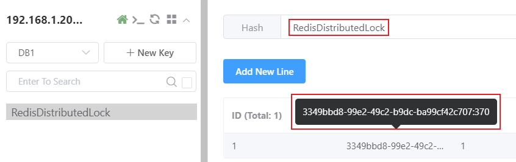

##### 自动续期

查看 scheduleExpirationRenewal() 方法，watchdog 工作流程：**客户端 A 加锁成功，就会启动一个 watchdog 看门狗，它是一个后台线程，会每隔 10 秒检查一下，如果客户端 A 还持有锁 key，那么就会不断的延长锁 key 的生存时间，默认每次续命又从 30 秒新开始。**

```java
protected void scheduleExpirationRenewal(long threadId) {
    ExpirationEntry entry = new ExpirationEntry();
    ExpirationEntry oldEntry = EXPIRATION_RENEWAL_MAP.putIfAbsent(getEntryName(), entry);
    if (oldEntry != null) {
        oldEntry.addThreadId(threadId);
    } else {
        entry.addThreadId(threadId);
        try {
            renewExpiration();
        } finally {
            if (Thread.currentThread().isInterrupted()) {
                cancelExpirationRenewal(threadId, null);
            }
        }
    }
}
```

```java
private void renewExpiration() {
    ExpirationEntry ee = EXPIRATION_RENEWAL_MAP.get(getEntryName());
    if (ee == null) {
        return;
    }

    // 定义一个定时器，delay 的时间是 internalLockLeaseTime/3，即每过 10 秒，执行一次
    Timeout task = getServiceManager().newTimeout(new TimerTask() {
        @Override
        public void run(Timeout timeout) throws Exception {
            ExpirationEntry ent = EXPIRATION_RENEWAL_MAP.get(getEntryName());
            if (ent == null) {
                return;
            }
            Long threadId = ent.getFirstThreadId();
            if (threadId == null) {
                return;
            }

            // 开启一个异步线程
            CompletionStage<Boolean> future = renewExpirationAsync(threadId);
            future.whenComplete((res, e) -> {
                if (e != null) {
                    log.error("Can't update lock {} expiration", getRawName(), e);
                    EXPIRATION_RENEWAL_MAP.remove(getEntryName());
                    return;
                }

                if (res) {
                    // reschedule itself
                    renewExpiration();
                } else {
                    cancelExpirationRenewal(null, null);
                }
            });
        }
    }, internalLockLeaseTime / 3, TimeUnit.MILLISECONDS); // internalLockLeaseTime/3，即每过 10 秒，执行一次

    ee.setTimeout(task);
}
```

```java
// 自动续期的 Lua 脚本：
// 1. 锁仍存在，则重新设置过期时间，默认为 30 秒；
// 2. 锁不存在，则返回 0，说明锁已被业务线程删除。
protected CompletionStage<Boolean> renewExpirationAsync(long threadId) {
    return evalWriteSyncedAsync(getRawName(), LongCodec.INSTANCE, RedisCommands.EVAL_BOOLEAN,
            	  "if (redis.call('hexists', KEYS[1], ARGV[2]) == 1) then " +
                    "redis.call('pexpire', KEYS[1], ARGV[1]); " +
                    "return 1; " +
                    "end; " +
                    "return 0;",
            Collections.singletonList(getRawName()),
            internalLockLeaseTime, getLockName(threadId));
}
```

##### 解锁流程

解锁的流程：RedissonLock.java 未重写父类的 unlock() 方法，直接调用 RedissonBaseLock.java 的 unlock() 方法。

```java
@Override
public void unlock() {
    try {
        get(unlockAsync(Thread.currentThread().getId()));
    } catch (RedisException e) {
        if (e.getCause() instanceof IllegalMonitorStateException) {
            throw (IllegalMonitorStateException) e.getCause();
        } else {
            throw e;
        }
    }

//    Future<Void> future = unlockAsync();
//    future.awaitUninterruptibly();
//    if (future.isSuccess()) {
//        return;
//    }
//    if (future.cause() instanceof IllegalMonitorStateException) {
//        throw (IllegalMonitorStateException)future.cause();
//    }
//    throw commandExecutor.convertException(future);
}
```

```java
@Override
public RFuture<Void> unlockAsync(long threadId) {
    return getServiceManager().execute(() -> unlockAsync0(threadId));
}
```

```java
private RFuture<Void> unlockAsync0(long threadId) {
    CompletionStage<Boolean> future = unlockInnerAsync(threadId);
    CompletionStage<Void> f = future.handle((res, e) -> {
        cancelExpirationRenewal(threadId, res);

        if (e != null) {
            if (e instanceof CompletionException) {
                throw (CompletionException) e;
            }
            throw new CompletionException(e);
        }
        if (res == null) {
            IllegalMonitorStateException cause = new IllegalMonitorStateException("attempt to unlock lock, not locked by current thread by node id: "
                    + id + " thread-id: " + threadId);
            throw new CompletionException(cause);
        }

        return null;
    });

    return new CompletableFutureWrapper<>(f);
}
```

```java
protected final RFuture<Boolean> unlockInnerAsync(long threadId) {
    String id = getServiceManager().generateId();
    MasterSlaveServersConfig config = getServiceManager().getConfig();
    int timeout = (config.getTimeout() + config.getRetryInterval()) * config.getRetryAttempts();
    timeout = Math.max(timeout, 1);
    RFuture<Boolean> r = unlockInnerAsync(threadId, id, timeout);
    CompletionStage<Boolean> ff = r.thenApply(v -> {
        CommandAsyncExecutor ce = commandExecutor;
        if (ce instanceof CommandBatchService) {
            ce = new CommandBatchService(commandExecutor);
        }
        ce.writeAsync(getRawName(), LongCodec.INSTANCE, RedisCommands.DEL, getUnlockLatchName(id));
        if (ce instanceof CommandBatchService) {
            ((CommandBatchService) ce).executeAsync();
        }
        return v;
    });
    return new CompletableFutureWrapper<>(ff);
}
```

最终，仍是由 RedissonLock.java 中的 unlockInnerAsync() 方法完成解锁操作。

```java
// 解锁的 Lua 脚本：
// 1. 如果锁不存在，或者释放锁的线程并非是持有锁的线程，返回 null；
// 2. 如果锁存在，则通过 hincrby 将值减 1，先释放一次锁，若此时剩余次数还是大于 0，说明当前锁是可重入锁，重新设置其过期时间；
// 3. 如果 hincrby 将值减 1，释放一次锁后，此时的剩余次数小于等于 0，则删除当前锁，并发布锁释放的消息，解锁成功。
protected RFuture<Boolean> unlockInnerAsync(long threadId, String requestId, int timeout) {
    return evalWriteSyncedAsync(getRawName(), LongCodec.INSTANCE, RedisCommands.EVAL_BOOLEAN,
                  "local val = redis.call('get', KEYS[3]); " +
                    "if val ~= false then " +
                        "return tonumber(val);" +
                    "end; " +

                    "if (redis.call('hexists', KEYS[1], ARGV[3]) == 0) then " +
                        "return nil;" +
                    "end; " +
                    "local counter = redis.call('hincrby', KEYS[1], ARGV[3], -1); " +
                    "if (counter > 0) then " +
                        "redis.call('pexpire', KEYS[1], ARGV[2]); " +
                        "redis.call('set', KEYS[3], 0, 'px', ARGV[5]); " +
                        "return 0; " +
                    "else " +
                        "redis.call('del', KEYS[1]); " +
                        "redis.call(ARGV[4], KEYS[2], ARGV[1]); " +
                        "redis.call('set', KEYS[3], 1, 'px', ARGV[5]); " +
                        "return 1; " +
                    "end; ",
                Arrays.asList(getRawName(), getChannelName(), getUnlockLatchName(requestId)),
                LockPubSub.UNLOCK_MESSAGE, internalLockLeaseTime,
                getLockName(threadId), getSubscribeService().getPublishCommand(), timeout);
}
```

#### 多机版

**如 Redlock 算法一节所说，单机版的 Redis 分布式锁，会存在单点故障的缺陷。也正是为了解决这种缺陷，Redis 官方提出了 Redlock 算法。**下面，我们就看一下，在 Redisson 中，是如何实现 Redlock 算法的落地的。

首先，使用 docker compoese 启动 3 台独立的 Redis 容器（**3 台 Redis 容器之间是独立的，实际生产时，应放在不同的物理机上**）：

```yaml
version: "3.4"

networks:
  apps:
    name: apps
    external: false

services:
  redis-redlock-node1:
    image: redis:7.0.11
    container_name: redis-redlock-node1
    hostname: zeloud.redis.redlock.node1
    ports:
      - 6381:6381
    volumes:
      - /home/zeloud/apps/redis/redlock/node1/conf/redis.conf:/usr/local/etc/redis/redis.conf
      - /home/zeloud/apps/redis/redlock/node1/data:/data
    command: redis-server /usr/local/etc/redis/redis.conf
    networks:
      - apps
    restart: on-failure:3

  redis-redlock-node2:
    image: redis:7.0.11
    container_name: redis-redlock-node2
    hostname: zeloud.redis.redlock.node2
    ports:
      - 6382:6382
    volumes:
      - /home/zeloud/apps/redis/redlock/node2/conf/redis.conf:/usr/local/etc/redis/redis.conf
      - /home/zeloud/apps/redis/redlock/node2/data:/data
    command: redis-server /usr/local/etc/redis/redis.conf
    networks:
      - apps
    restart: on-failure:3

  redis-redlock-node3:
    image: redis:7.0.11
    container_name: redis-redlock-node3
    hostname: zeloud.redis.redlock.node3
    ports:
      - 6383:6383
    volumes:
      - /home/zeloud/apps/redis/redlock/node3/conf/redis.conf:/usr/local/etc/redis/redis.conf
      - /home/zeloud/apps/redis/redlock/node3/data:/data
    command: redis-server /usr/local/etc/redis/redis.conf
    networks:
      - apps
    restart: on-failure:3
```

redis.properties 添加 3 台 Redis 服务器的配置：

```properties
# redis config
#spring.data.redis.username=redis
spring.data.redis.password=123456
spring.data.redis.database=0
spring.data.redis.timeout=1000
spring.data.redis.ssl.enabled=false

# redis lettuce pool config
spring.data.redis.lettuce.pool.max-active=8
spring.data.redis.lettuce.pool.max-wait=-1
spring.data.redis.lettuce.pool.min-idle=1
spring.data.redis.lettuce.pool.max-idle=10
spring.data.redis.lettuce.shutdown-timeout=100ms

# redis stand-alone config
spring.data.redis.host=192.168.1.20
spring.data.redis.port=6379

# redis cluster config
#spring.data.redis.cluster.nodes=192.168.1.20:6371,192.168.1.20:6372,192.168.1.20:6373,192.168.1.20:6374,192.168.1.20:6375,192.168.1.20:6376
#spring.data.redis.cluster.max-redirects=5

# redlock config
zero.loud.redis.redlock.single-address1=192.168.1.20:6381
zero.loud.redis.redlock.single-address2=192.168.1.20:6382
zero.loud.redis.redlock.single-address3=192.168.1.20:6383
```

RedlockProperties.java：

```java
package cn.zero.cloud.redis.redlock.conf.properties;

import lombok.AllArgsConstructor;
import lombok.Data;
import lombok.NoArgsConstructor;
import org.springframework.boot.context.properties.ConfigurationProperties;
import org.springframework.stereotype.Component;

/**
 * @author Xisun Wang
 * @since 2024/7/1 22:03
 */
@Data
@NoArgsConstructor
@AllArgsConstructor
@ConfigurationProperties(prefix = "zero.loud.redis.redlock")
@Component
public class RedlockProperties {
    private String singleAddress1;

    private String singleAddress2;

    private String singleAddress3;
}
```

RedisConfig.java：

```java
package cn.zero.cloud.redis.redlock.conf;

import cn.hutool.core.util.ReflectUtil;
import cn.zero.cloud.redis.redlock.conf.properties.RedlockProperties;
import com.fasterxml.jackson.databind.ObjectMapper;
import com.fasterxml.jackson.datatype.jsr310.JavaTimeModule;
import org.redisson.Redisson;
import org.redisson.api.RedissonClient;
import org.redisson.config.Config;
import org.springframework.beans.factory.annotation.Autowired;
import org.springframework.context.annotation.Bean;
import org.springframework.context.annotation.Configuration;
import org.springframework.data.redis.connection.RedisConnectionFactory;
import org.springframework.data.redis.core.RedisTemplate;
import org.springframework.data.redis.serializer.RedisSerializer;

/**
 * @author Xisun Wang
 * @since 2024/7/1 22:08
 */
@Configuration
public class RedisConfig {
    private final RedlockProperties redlockProperties;

    @Autowired
    public RedisConfig(RedlockProperties redlockProperties) {
        this.redlockProperties = redlockProperties;
    }

    @Bean
    public RedisTemplate<String, Object> redisTemplate(RedisConnectionFactory redisConnectionFactory) {
        RedisTemplate<String, Object> redisTemplate = new RedisTemplate<>();

        redisTemplate.setConnectionFactory(redisConnectionFactory);

        // 使用 String 序列化方式，序列化 key
        redisTemplate.setKeySerializer(RedisSerializer.string());
        redisTemplate.setHashKeySerializer(RedisSerializer.string());

        // 使用 JSON 序列化方式 (使用的是 Jackson 库)，序列化 value
        redisTemplate.setValueSerializer(buildRedisSerializer());
        redisTemplate.setHashValueSerializer(buildRedisSerializer());

        // 初始化 RedisTemplate 序列化设置
        redisTemplate.afterPropertiesSet();
        return redisTemplate;
    }

    public static RedisSerializer<?> buildRedisSerializer() {
        RedisSerializer<Object> json = RedisSerializer.json();

        // 解决 LocalDateTime 的序列化
        ObjectMapper objectMapper = (ObjectMapper) ReflectUtil.getFieldValue(json, "mapper");
        objectMapper.registerModules(new JavaTimeModule());
        return json;
    }

    @Bean
    public RedissonClient redissonClient1() {
        Config config = new Config();
        String node = redlockProperties.getSingleAddress1();
        node = node.startsWith("redis://") ? node : "redis://" + node;
        config.useSingleServer()
                .setAddress(node)
                .setDatabase(1)
                .setPassword("123456");
        return Redisson.create(config);
    }

    @Bean
    RedissonClient redissonClient2() {
        Config config = new Config();
        String node = redlockProperties.getSingleAddress2();
        node = node.startsWith("redis://") ? node : "redis://" + node;
        config.useSingleServer()
                .setAddress(node)
                .setDatabase(1)
                .setPassword("123456");
        return Redisson.create(config);
    }

    @Bean
    RedissonClient redissonClient3() {
        Config config = new Config();
        String node = redlockProperties.getSingleAddress3();
        node = node.startsWith("redis://") ? node : "redis://" + node;
        config.useSingleServer()
                .setAddress(node)
                .setDatabase(1)
                .setPassword("123456");
        return Redisson.create(config);
    }
}
```

InventoryController.java：

```java
package cn.zero.cloud.redis.redlock.controller;

import cn.zero.cloud.redis.redlock.service.InventoryService;
import org.springframework.beans.factory.annotation.Autowired;
import org.springframework.http.HttpStatus;
import org.springframework.http.MediaType;
import org.springframework.web.bind.annotation.GetMapping;
import org.springframework.web.bind.annotation.RequestMapping;
import org.springframework.web.bind.annotation.ResponseStatus;
import org.springframework.web.bind.annotation.RestController;

/**
 * @author Xisun Wang
 * @since 2024/6/21 22:20
 */
@RestController
@RequestMapping(value = "/inventory")
public class InventoryController {
    private final InventoryService inventoryService;

    @Autowired
    public InventoryController(InventoryService inventoryService) {
        this.inventoryService = inventoryService;
    }

    @GetMapping(value = "/saleByRedlock", produces = MediaType.APPLICATION_JSON_VALUE)
    @ResponseStatus(HttpStatus.OK)
    public String saleByRedlock() {
        return inventoryService.saleByRedlock();
    }
}
```

InventoryServiceImpl.java：

```java
package cn.zero.cloud.redis.redlock.service.impl;

import cn.hutool.core.util.IdUtil;
import cn.zero.cloud.redis.redlock.service.InventoryService;
import lombok.extern.slf4j.Slf4j;
import org.redisson.RedissonMultiLock;
import org.redisson.api.RLock;
import org.redisson.api.RedissonClient;
import org.springframework.beans.factory.annotation.Autowired;
import org.springframework.beans.factory.annotation.Value;
import org.springframework.data.redis.core.RedisTemplate;
import org.springframework.stereotype.Service;

/**
 * @author Xisun Wang
 * @since 2024/6/21 22:22
 */
@Slf4j
@Service
public class InventoryServiceImpl implements InventoryService {
    @Value("${server.port}")
    private String port;

    private final RedisTemplate<String, Object> redisTemplate;

    private final RedissonClient redissonClient1;

    private final RedissonClient redissonClient2;

    private final RedissonClient redissonClient3;

    @Autowired
    public InventoryServiceImpl(RedisTemplate<String, Object> redisTemplate,
                                RedissonClient redissonClient1,
                                RedissonClient redissonClient2,
                                RedissonClient redissonClient3) {
        this.redisTemplate = redisTemplate;
        this.redissonClient1 = redissonClient1;
        this.redissonClient2 = redissonClient2;
        this.redissonClient3 = redissonClient3;
    }

    @Override
    public String saleByRedlock() {
        String lockName = "RedisDistributedLock";
        String lockValue = IdUtil.simpleUUID() + ":" + Thread.currentThread().getId();

        // 获取锁
        RLock lock1 = redissonClient1.getLock(lockName);
        RLock lock2 = redissonClient2.getLock(lockName);
        RLock lock3 = redissonClient3.getLock(lockName);

        RedissonMultiLock redLock = new RedissonMultiLock(lock1, lock2, lock3);

        redLock.lock();
        String retMessage;
        try {
            // 1. 查询库存信息
            String result = (String) redisTemplate.opsForValue().get("inventory001");
            // 2. 判断库存是否足够
            int inventoryNumber = result == null ? 0 : Integer.parseInt(result);
            // 3. 扣减库存
            if (inventoryNumber > 0) {
                redisTemplate.opsForValue().set("inventory001", String.valueOf(--inventoryNumber));
                retMessage = "成功卖出一个商品，库存剩余：" + inventoryNumber;
            } else {
                retMessage = "商品卖完了";
            }
        } finally {
            redLock.unlock();
        }
        return retMessage + "\t" + "订单号：" + lockValue + "\t" + "服务端口号：" + port;
    }
}
```

> 参考：https://github.com/redisson/redisson/wiki/8.-distributed-locks-and-synchronizers，8.3. MultiLock 一节。

## 原文链接

https://github.com/ACatSmiling/zero-to-zero/blob/main/NoSQL/redis.md