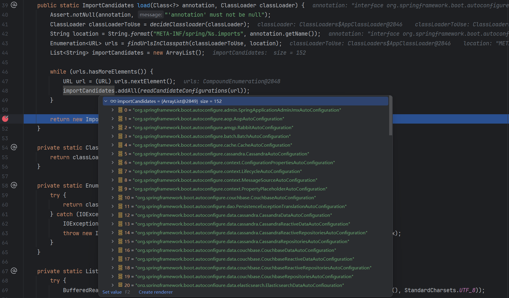

*`Author: ACatSmiling`*

*`Since: 2024-07-23`*

## 核心场景启动器

Spring Boot 的每个场景启动器都引入了一个**`spring-boot-starter`**，这是 Spring Boot 的核心场景启动器。

```xml
<dependency>
  <groupId>org.springframework.boot</groupId>
  <artifactId>spring-boot-starter</artifactId>
</dependency>
```

> 本文代码基于 Spring Boot 3.2.4 版本。

在 spring-boot-starter 中，又引入了**`spring-boot-autoconfigure`**包，spring-boot-autoconfigure 里面事先定义了所有场景的所有配置，只要这个包下的所有类都能生效，那么相当于 Spring Boot 官方写好的整合功能就生效了。

```xml
<dependency>
  <groupId>org.springframework.boot</groupId>
  <artifactId>spring-boot-autoconfigure</artifactId>
</dependency>
```

但是 Spring Boot 默认只扫描主程序所在的包，因此扫描不到 spring-boot-autoconfigure 下定义好的所有配置类，这部分的工作，是由**`@EnableAutoConfiguration`**注解完成的。

## 引导加载自动配置类

主程序：

```java
@SpringBootApplication
public class MainApplication {
    public static void main(String[] args) {
        SpringApplication.run(MainApplication.class, args);
    }
}
```

### @SpringBootApplication

**`@SpringBootApplication`**：

```java
@Target(ElementType.TYPE)
@Retention(RetentionPolicy.RUNTIME)
@Documented
@Inherited
@SpringBootConfiguration
@EnableAutoConfiguration
@ComponentScan(excludeFilters = { @Filter(type = FilterType.CUSTOM, classes = TypeExcludeFilter.class),
		@Filter(type = FilterType.CUSTOM, classes = AutoConfigurationExcludeFilter.class) })
public @interface SpringBootApplication {
}
```

#### @SpringBootConfiguration

`@SpringBootConfiguration`：是`@Configuration`的派生注解，表明当前主类实际上也是一个配置类。

#### @ComponentScan

`@ComponentScan`：指定扫描的包，默认为当前主类所在包及其子包。

#### @EnableAutoConfiguration

**`@EnableAutoConfiguration`**：

```java
@Target(ElementType.TYPE)
@Retention(RetentionPolicy.RUNTIME)
@Documented
@Inherited
@AutoConfigurationPackage
@Import(AutoConfigurationImportSelector.class)
public @interface EnableAutoConfiguration {
}
```

##### @AutoConfigurationPackage

**`@AutoConfigurationPackage`：**

```java
@Target(ElementType.TYPE)
@Retention(RetentionPolicy.RUNTIME)
@Documented
@Inherited
@Import(AutoConfigurationPackages.Registrar.class)
public @interface AutoConfigurationPackage {
}
```

###### @Import(AutoConfigurationPackages.Registrar.class)

向容器中注册了一个 AutoConfigurationPackages.Registrar.class 组件：

```java
/**
 * {@link ImportBeanDefinitionRegistrar} to store the base package from the importing
 * configuration.
 */
static class Registrar implements ImportBeanDefinitionRegistrar, DeterminableImports {

    @Override
    public void registerBeanDefinitions(AnnotationMetadata metadata, BeanDefinitionRegistry registry) {
       register(registry, new PackageImports(metadata).getPackageNames().toArray(new String[0]));
    }

    @Override
    public Set<Object> determineImports(AnnotationMetadata metadata) {
       return Collections.singleton(new PackageImports(metadata));
    }

}
```

- `new PackageImports(metadata).getPackageNames()`：拿到元注解所包含的包信息，实际上就是主类所在的包，如 cn.zero.cloud.business。
- `register()`的功能，也就是将主类所在包下的所有组件，批量注册到容器中，这也就是默认包路径为主类所在包的原因。

##### @Import(AutoConfigurationImportSelector.class)

向容器中注册了一个 AutoConfigurationImportSelector.class 组件，执行如下方法：

```java
@Override
public String[] selectImports(AnnotationMetadata annotationMetadata) {
    if (!isEnabled(annotationMetadata)) {
       return NO_IMPORTS;
    }
    AutoConfigurationEntry autoConfigurationEntry = getAutoConfigurationEntry(annotationMetadata);
    return StringUtils.toStringArray(autoConfigurationEntry.getConfigurations());
}
```

执行`getAutoConfigurationEntry(annotationMetadata)`方法，向容器中批量注册一些组件：

```java
/**
 * Return the {@link AutoConfigurationEntry} based on the {@link AnnotationMetadata}
 * of the importing {@link Configuration @Configuration} class.
 * @param annotationMetadata the annotation metadata of the configuration class
 * @return the auto-configurations that should be imported
 */
protected AutoConfigurationEntry getAutoConfigurationEntry(AnnotationMetadata annotationMetadata) {
    if (!isEnabled(annotationMetadata)) {
       return EMPTY_ENTRY;
    }
    AnnotationAttributes attributes = getAttributes(annotationMetadata);
    List<String> configurations = getCandidateConfigurations(annotationMetadata, attributes);
    configurations = removeDuplicates(configurations);
    Set<String> exclusions = getExclusions(annotationMetadata, attributes);
    checkExcludedClasses(configurations, exclusions);
    configurations.removeAll(exclusions);
    configurations = getConfigurationClassFilter().filter(configurations);
    fireAutoConfigurationImportEvents(configurations, exclusions);
    return new AutoConfigurationEntry(configurations, exclusions);
}
```

执行`getCandidateConfigurations(annotationMetadata, attributes)`方法：

```java
/**
 * Return the auto-configuration class names that should be considered. By default,
 * this method will load candidates using {@link ImportCandidates}.
 * @param metadata the source metadata
 * @param attributes the {@link #getAttributes(AnnotationMetadata) annotation
 * attributes}
 * @return a list of candidate configurations
 */
protected List<String> getCandidateConfigurations(AnnotationMetadata metadata, AnnotationAttributes attributes) {
    List<String> configurations = ImportCandidates.load(AutoConfiguration.class, getBeanClassLoader())
       .getCandidates();
    // 从类路径下获取预先定义的组件，Spring Boot 2 中此文件名为 spring.factories
    Assert.notEmpty(configurations,
          "No auto configuration classes found in "
                + "META-INF/spring/org.springframework.boot.autoconfigure.AutoConfiguration.imports. If you "
                + "are using a custom packaging, make sure that file is correct.");
    return configurations;
}
```

>Spring Boot 3 中，事先定义的组件位于 spring-boot-autoconfigure 包类路径下的`META-INF/spring/org.springframework.boot.autoconfigure.AutoConfiguration.imports`文件，在 Spring Boot 2 中，对应的文件名是 spring.factories。
>
>```java
>protected List<String> getCandidateConfigurations(AnnotationMetadata metadata, AnnotationAttributes attributes) {
>   List<String> configurations = SpringFactoriesLoader.loadFactoryNames(getSpringFactoriesLoaderFactoryClass(),
>         getBeanClassLoader());
>   Assert.notEmpty(configurations, "No auto configuration classes found in META-INF/spring.factories. If you "
>         + "are using a custom packaging, make sure that file is correct.");
>   return configurations;
>}
>```

执行`ImportCandidates.load(AutoConfiguration.class, getBeanClassLoader())`方法，获取类路径下配置文件中事先定义的，所有待批量注册的组件（配置类）：

```java
/**
 * Loads the names of import candidates from the classpath.
 *
 * The names of the import candidates are stored in files named
 * {@code META-INF/spring/full-qualified-annotation-name.imports} on the classpath.
 * Every line contains the full qualified name of the candidate class. Comments are
 * supported using the # character.
 * @param annotation annotation to load
 * @param classLoader class loader to use for loading
 * @return list of names of annotated classes
 */
public static ImportCandidates load(Class<?> annotation, ClassLoader classLoader) {
    Assert.notNull(annotation, "'annotation' must not be null");
    ClassLoader classLoaderToUse = decideClassloader(classLoader);
    String location = String.format(LOCATION, annotation.getName());
    Enumeration<URL> urls = findUrlsInClasspath(classLoaderToUse, location);
    List<String> importCandidates = new ArrayList<>();
    while (urls.hasMoreElements()) {
       URL url = urls.nextElement();
       // 获取配置文件中的预定义组件的全路径
       importCandidates.addAll(readCandidateConfigurations(url));
    }
    return new ImportCandidates(importCandidates);
}
```



## 按需开启自动配置项

在上面的分析中，Spring Boot 在启动时，默认会加载 152 个自动配置的组件。但在实际启动时，各 xxxxAutoConfiguration 组件，会根据`@Conditional`注解，即按照条件装配规则，实现按需配置。我们选取如下几个组件进行分析。

### AopAutoConfiguration

`org.springframework.boot.autoconfigure.aop.AopAutoConfiguration`，其装配规则如下：

```java
package org.springframework.boot.autoconfigure.aop;

import org.aspectj.weaver.Advice;

import org.springframework.aop.config.AopConfigUtils;
import org.springframework.beans.factory.config.BeanFactoryPostProcessor;
import org.springframework.beans.factory.support.BeanDefinitionRegistry;
import org.springframework.boot.autoconfigure.AutoConfiguration;
import org.springframework.boot.autoconfigure.condition.ConditionalOnClass;
import org.springframework.boot.autoconfigure.condition.ConditionalOnMissingClass;
import org.springframework.boot.autoconfigure.condition.ConditionalOnProperty;
import org.springframework.context.annotation.Bean;
import org.springframework.context.annotation.Configuration;
import org.springframework.context.annotation.EnableAspectJAutoProxy;

/**
 * {@link org.springframework.boot.autoconfigure.EnableAutoConfiguration
 * Auto-configuration} for Spring's AOP support. Equivalent to enabling
 * {@link EnableAspectJAutoProxy @EnableAspectJAutoProxy} in your configuration.
 * <p>
 * The configuration will not be activated if {@literal spring.aop.auto=false}. The
 * {@literal proxyTargetClass} attribute will be {@literal true}, by default, but can be
 * overridden by specifying {@literal spring.aop.proxy-target-class=false}.
 *
 * @author Dave Syer
 * @author Josh Long
 * @since 1.0.0
 * @see EnableAspectJAutoProxy
 */
@AutoConfiguration
// 当配置文件中配置了 spring.aop.auto 属性，且值为 true 时，AopAutoConfiguration 生效，默认为 true
@ConditionalOnProperty(prefix = "spring.aop", name = "auto", havingValue = "true", matchIfMissing = true)
public class AopAutoConfiguration {

    // 当 org.aspectj.weaver.Advice.class 文件存在时，AspectJAutoProxyingConfiguration 才生效
    @Configuration(proxyBeanMethods = false)
    @ConditionalOnClass(Advice.class)
    static class AspectJAutoProxyingConfiguration {

       @Configuration(proxyBeanMethods = false)
       @EnableAspectJAutoProxy(proxyTargetClass = false)
       @ConditionalOnProperty(prefix = "spring.aop", name = "proxy-target-class", havingValue = "false")
       static class JdkDynamicAutoProxyConfiguration {

       }

       @Configuration(proxyBeanMethods = false)
       @EnableAspectJAutoProxy(proxyTargetClass = true)
       @ConditionalOnProperty(prefix = "spring.aop", name = "proxy-target-class", havingValue = "true",
             matchIfMissing = true)
       static class CglibAutoProxyConfiguration {

       }

    }

    // 当 org.aspectj.weaver.Advice.class 文件不存在，且配置文件中 spring.aop.proxy-target-class 属性值为 true (默认为 true)时，ClassProxyingConfiguration 生效
    @Configuration(proxyBeanMethods = false)
    @ConditionalOnMissingClass("org.aspectj.weaver.Advice")
    @ConditionalOnProperty(prefix = "spring.aop", name = "proxy-target-class", havingValue = "true",
          matchIfMissing = true)
    static class ClassProxyingConfiguration {

       @Bean
       static BeanFactoryPostProcessor forceAutoProxyCreatorToUseClassProxying() {
          return (beanFactory) -> {
             if (beanFactory instanceof BeanDefinitionRegistry registry) {
                AopConfigUtils.registerAutoProxyCreatorIfNecessary(registry);
                AopConfigUtils.forceAutoProxyCreatorToUseClassProxying(registry);
             }
          };
       }

    }

}
```

可以看出，当导入 spring-boot-starter-aop 依赖时，会注册 AspectJAutoProxyingConfiguration 配置类，否则，注册 ClassProxyingConfiguration 配置类，后者是 Spring Boot 默认的的 AOP 功能。

### DispatcherServletAutoConfiguration

`org.springframework.boot.autoconfigure.web.servlet.DispatcherServletAutoConfiguration`，其装配规则如下：

```java
package org.springframework.boot.autoconfigure.web.servlet;

import java.util.Arrays;
import java.util.List;

import jakarta.servlet.MultipartConfigElement;
import jakarta.servlet.ServletRegistration;

import org.springframework.beans.factory.ObjectProvider;
import org.springframework.beans.factory.config.ConfigurableListableBeanFactory;
import org.springframework.boot.autoconfigure.AutoConfiguration;
import org.springframework.boot.autoconfigure.AutoConfigureOrder;
import org.springframework.boot.autoconfigure.EnableAutoConfiguration;
import org.springframework.boot.autoconfigure.condition.ConditionMessage;
import org.springframework.boot.autoconfigure.condition.ConditionMessage.Style;
import org.springframework.boot.autoconfigure.condition.ConditionOutcome;
import org.springframework.boot.autoconfigure.condition.ConditionalOnBean;
import org.springframework.boot.autoconfigure.condition.ConditionalOnClass;
import org.springframework.boot.autoconfigure.condition.ConditionalOnMissingBean;
import org.springframework.boot.autoconfigure.condition.ConditionalOnWebApplication;
import org.springframework.boot.autoconfigure.condition.ConditionalOnWebApplication.Type;
import org.springframework.boot.autoconfigure.condition.SpringBootCondition;
import org.springframework.boot.context.properties.EnableConfigurationProperties;
import org.springframework.boot.web.servlet.ServletRegistrationBean;
import org.springframework.boot.web.servlet.support.SpringBootServletInitializer;
import org.springframework.context.annotation.Bean;
import org.springframework.context.annotation.ConditionContext;
import org.springframework.context.annotation.Conditional;
import org.springframework.context.annotation.Configuration;
import org.springframework.context.annotation.Import;
import org.springframework.core.Ordered;
import org.springframework.core.annotation.Order;
import org.springframework.core.type.AnnotatedTypeMetadata;
import org.springframework.web.multipart.MultipartResolver;
import org.springframework.web.servlet.DispatcherServlet;

/**
 * {@link EnableAutoConfiguration Auto-configuration} for the Spring
 * {@link DispatcherServlet}. Should work for a standalone application where an embedded
 * web server is already present and also for a deployable application using
 * {@link SpringBootServletInitializer}.
 *
 * @author Phillip Webb
 * @author Dave Syer
 * @author Stephane Nicoll
 * @author Brian Clozel
 * @since 2.0.0
 */
// 当前配置类的配置顺序
@AutoConfigureOrder(Ordered.HIGHEST_PRECEDENCE)
// 在 ServletWebServerFactoryAutoConfiguration 后配置
@AutoConfiguration(after = ServletWebServerFactoryAutoConfiguration.class)
// 当项目是一个原生的 Web Servlet 应用时
@ConditionalOnWebApplication(type = Type.SERVLET)
// 当容器中存在 DispatcherServlet 时
@ConditionalOnClass(DispatcherServlet.class)
public class DispatcherServletAutoConfiguration {

    /**
     * The bean name for a DispatcherServlet that will be mapped to the root URL "/".
     */
    public static final String DEFAULT_DISPATCHER_SERVLET_BEAN_NAME = "dispatcherServlet";

    /**
     * The bean name for a ServletRegistrationBean for the DispatcherServlet "/".
     */
    public static final String DEFAULT_DISPATCHER_SERVLET_REGISTRATION_BEAN_NAME = "dispatcherServletRegistration";

    @Configuration(proxyBeanMethods = false)
    @Conditional(DefaultDispatcherServletCondition.class)
    // 当容器中存在 ServletRegistration 时
    @ConditionalOnClass(ServletRegistration.class)
    // 开启 WebMvcProperties 类的配置绑定功能，并注册到容器中
    @EnableConfigurationProperties(WebMvcProperties.class)
    protected static class DispatcherServletConfiguration {

       // 注册 DispatcherServlet 组件到容器中，名字为 dispatcherServlet
       @Bean(name = DEFAULT_DISPATCHER_SERVLET_BEAN_NAME)
       public DispatcherServlet dispatcherServlet(WebMvcProperties webMvcProperties) {
          // 新建了一个 DispatcherServlet 对象
          DispatcherServlet dispatcherServlet = new DispatcherServlet();
          dispatcherServlet.setDispatchOptionsRequest(webMvcProperties.isDispatchOptionsRequest());
          dispatcherServlet.setDispatchTraceRequest(webMvcProperties.isDispatchTraceRequest());
          configureThrowExceptionIfNoHandlerFound(webMvcProperties, dispatcherServlet);
          dispatcherServlet.setPublishEvents(webMvcProperties.isPublishRequestHandledEvents());
          dispatcherServlet.setEnableLoggingRequestDetails(webMvcProperties.isLogRequestDetails());
          return dispatcherServlet;
       }

       @SuppressWarnings({ "deprecation", "removal" })
       private void configureThrowExceptionIfNoHandlerFound(WebMvcProperties webMvcProperties,
             DispatcherServlet dispatcherServlet) {
          dispatcherServlet.setThrowExceptionIfNoHandlerFound(webMvcProperties.isThrowExceptionIfNoHandlerFound());
       }

       // 注册 MultipartResolver 组件到容器中，即文件上传解析器
       @Bean
       // 当容器中存在 MultipartResolver 时
       @ConditionalOnBean(MultipartResolver.class)
       // 当容器中没有 name 为 multipartResolver 的 MultipartResolver 对象时
       @ConditionalOnMissingBean(name = DispatcherServlet.MULTIPART_RESOLVER_BEAN_NAME)
       public MultipartResolver multipartResolver(MultipartResolver resolver) {
          // 当容器中有 MultipartResolver 的对象，resolver 参数会自动绑定该对象
          // 此方法的作用是，防止有些用户配置的文件上传解析器不符合规范：
          // 将用户自己配置的文件上传解析器重新注册给容器，并重命名为 multipartResolver (方法名)
          // (Spring Boot 中的文件上传解析器的名字，就叫 multipartResolver)
          // Detect if the user has created a MultipartResolver but named it incorrectly
          return resolver;
       }

    }
    
    ...
}
```

- `@ConditionalOnWebApplication(type = Type.SERVLET)`：Spring Boot 支持两种类型的 Web 应用开发，一种是响应式，一种是原生 Servlet。响应式 Web 开发需要导入`spring-boot-starter-webflux`依赖，原生 Servlet Web 开发需要导入`spring-boot-starter-web`依赖。

- `@ConditionalOnClass(DispatcherServlet.class)`：在主类中可以验证项目中存在 DispatcherServlet 类。

  ```java
  @SpringBootApplication
  public class MainApplication {
      public static void main(String[] args) {
          ConfigurableApplicationContext run = SpringApplication.run(MainApplication.class, args);
  
          String[] beanNamesForType = run.getBeanNamesForType(DispatcherServlet.class);
          System.out.println(beanNamesForType.length);// 1
      }
  }
  ```

### HttpEncodingAutoConfiguration

`org.springframework.boot.autoconfigure.web.servlet.HttpEncodingAutoConfiguration`，其装配规则如下：

```java
package org.springframework.boot.autoconfigure.web.servlet;

import org.springframework.boot.autoconfigure.AutoConfiguration;
import org.springframework.boot.autoconfigure.EnableAutoConfiguration;
import org.springframework.boot.autoconfigure.condition.ConditionalOnClass;
import org.springframework.boot.autoconfigure.condition.ConditionalOnMissingBean;
import org.springframework.boot.autoconfigure.condition.ConditionalOnProperty;
import org.springframework.boot.autoconfigure.condition.ConditionalOnWebApplication;
import org.springframework.boot.autoconfigure.web.ServerProperties;
import org.springframework.boot.context.properties.EnableConfigurationProperties;
import org.springframework.boot.web.server.WebServerFactoryCustomizer;
import org.springframework.boot.web.servlet.filter.OrderedCharacterEncodingFilter;
import org.springframework.boot.web.servlet.server.ConfigurableServletWebServerFactory;
import org.springframework.boot.web.servlet.server.Encoding;
import org.springframework.context.annotation.Bean;
import org.springframework.core.Ordered;
import org.springframework.web.filter.CharacterEncodingFilter;

/**
 * {@link EnableAutoConfiguration Auto-configuration} for configuring the encoding to use
 * in web applications.
 *
 * @author Stephane Nicoll
 * @author Brian Clozel
 * @since 2.0.0
 */
@AutoConfiguration
// 开启 ServerProperties 类的配置绑定功能，并注册到容器中
@EnableConfigurationProperties(ServerProperties.class)
// 当项目是一个原生的 Web Servlet 应用时
@ConditionalOnWebApplication(type = ConditionalOnWebApplication.Type.SERVLET)
// 当容器中存在 CharacterEncodingFilter 时
@ConditionalOnClass(CharacterEncodingFilter.class)
// 当配置文件中 server.servlet.encoding 属性值为 enabled (默认为 true) 时
@ConditionalOnProperty(prefix = "server.servlet.encoding", value = "enabled", matchIfMissing = true)
public class HttpEncodingAutoConfiguration {

    private final Encoding properties;

    public HttpEncodingAutoConfiguration(ServerProperties properties) {
       this.properties = properties.getServlet().getEncoding();
    }

    // 向容器中注册一个 CharacterEncodingFilter 组件，此组件就是解决 Spring Boot 收到的请求出现乱码的问题
    @Bean
    // 当容器中没有这个 Bean 时才配置，即用户未配置时，Spring Boot 才主动配置一个
    @ConditionalOnMissingBean
    public CharacterEncodingFilter characterEncodingFilter() {
       CharacterEncodingFilter filter = new OrderedCharacterEncodingFilter();
       filter.setEncoding(this.properties.getCharset().name());
       filter.setForceRequestEncoding(this.properties.shouldForce(Encoding.Type.REQUEST));
       filter.setForceResponseEncoding(this.properties.shouldForce(Encoding.Type.RESPONSE));
       return filter;
    }

    @Bean
    public LocaleCharsetMappingsCustomizer localeCharsetMappingsCustomizer() {
       return new LocaleCharsetMappingsCustomizer(this.properties);
    }

    static class LocaleCharsetMappingsCustomizer
          implements WebServerFactoryCustomizer<ConfigurableServletWebServerFactory>, Ordered {

       private final Encoding properties;

       LocaleCharsetMappingsCustomizer(Encoding properties) {
          this.properties = properties;
       }

       @Override
       public void customize(ConfigurableServletWebServerFactory factory) {
          if (this.properties.getMapping() != null) {
             factory.setLocaleCharsetMappings(this.properties.getMapping());
          }
       }

       @Override
       public int getOrder() {
          return 0;
       }

    }

}
```

> HttpEncodingAutoConfiguration 配置类，可以防止 Spring Boot 乱码。

## 修改默认配置

一般来说，Spring Boot 默认会在底层配好所有需要的组件，但是**如果用户自己配置了，就会以用户配置的优先。**

以 CharacterEncodingFilter 为例，如果用户希望按自己的需求进行配置，可以在配置类中自行添加：

```java
@Configuration
public class MyConfig {
    @Bean
    public CharacterEncodingFilter characterEncodingFilter() {
        // filter的实现代码
    }
}
```

从前面对 HttpEncodingAutoConfiguration 的分析可以看出，当用户自己配置了 CharacterEncodingFilter 的实例时，Spring Boot 就不会再配置。

当然，也可以根据组件 @ConfigurationProperties 注解绑定的属性，按需做相应的修改。

## 总结

Spring Boot 先加载所有默认的自动配置类，即 xxxxxAutoConfiguration.class，每个自动配置类按照条件进行生效。xxxxxAutoConfiguration.class 在配置时，会从对应的 xxxxxProperties.class 中取值，而 xxxxxProperties.class 会和配置文件中对应的值进行绑定（@EnableConfigurationProperties 注解）。

- 生效的配置类，会给容器中装配很多不同功能的组件。
- 这些组件装配到容器中后，项目就具有了该组件所具有的功能。
- 如果用户自行配置了某一个组件，则以用户配置的优先。

若想实现定制化配置，有两种方法：

  - 方法一：用户自行配置组件，添加`@Bean`注解，用以替换 Spring Boot 底层的默认组件。
  - 方法二：用户查看该组件从配置文件种获取的是什么属性的值，然后按需求自行修改对应的属性值。比如 HttpEncodingAutoConfiguration 对应的就是配置文件中的`server.servlet.encoding`属性。

> 更多配置项取值，参考：https://docs.spring.io/spring-boot/docs/current/reference/html/application-properties.html#application-properties

自动配置过程：**xxxxxAutoConfiguration.class ---> 注册组件 ---> 从 xxxxxProperties.class 里面拿值 ----> 绑定 application.properties 文件**。可以看出，一般通过修改 application.properties 文件中相应的配置，就可完成 Spring Boot 功能的修改。

## 原文链接

https://github.com/ACatSmiling/zero-to-zero/blob/main/SpringEcosystem/spring-boot.md