*`Author: ACatSmiling`*

*`Since: 2024-07-19`*

## IoC

**`IoC`**：**Inversion of Control，控制反转。**是`面向对象编程中的一种设计原则/设计思想`，旨在`降低代码之间的耦合度，提高系统的灵活性和可维护性`。其核心思想是`通过反转对象的控制权，将对象创建与对象之间的调用过程交给专门的容器进行管理`（如 Spring 框架中的 IoC 容器），而不是由程序代码直接控制（即由容器来负责对象的创建和依赖关系的注入，从而实现对象之间的解耦）。

### 实现方式

**`依赖注入`**：Dependency Injection，是 IoC 的一种实现方式，通过容器在运行期动态地将依赖关系注入到组件之中。依赖注入可以通过`构造函数注入`、`Setter 方法注入`和`接口注入`等方式实现。

`依赖查找`：IoC 的另一种实现方式，但不如依赖注入常用。在这种方式下，组件通过容器提供的 API 来查找并获取它所依赖的对象。

> `事件驱动`：Event-Driven，应用程序组件对特定事件的发生做出响应，而不是直接调用其他组件的方法。这种方式下，组件之间的耦合度降低，因为它们不直接调用对方的方法，而是通过事件来交互。
>
> 事件驱动是一种编程方式，IoC 是一种设计思想，二者都是旨在降低组件之间的耦合度，从而提高程序的灵活性和可用性，但本质上有所区别。

### BeanFactory

**`BeanFactory`**是 Spring 框架中的一个核心接口，它提供了高级的 IoC 容器机制。**BeanFactory 负责实例化、配置和管理应用程序中的各种对象，这些对象在 Spring 中被称为 Beans。**

BeanFactory 接口定义了 Spring 容器的最基本功能，它提供了以下几个核心方法：

- `getBean(String name)`：根据 Bean 的名称获取一个 Bean 实例。

  ```java
  /**
   * Return an instance, which may be shared or independent, of the specified bean.
   * <p>This method allows a Spring BeanFactory to be used as a replacement for the
   * Singleton or Prototype design pattern. Callers may retain references to
   * returned objects in the case of Singleton beans.
   * <p>Translates aliases back to the corresponding canonical bean name.
   * <p>Will ask the parent factory if the bean cannot be found in this factory instance.
   * @param name the name of the bean to retrieve
   * @return an instance of the bean.
   * Note that the return value will never be {@code null} but possibly a stub for
   * {@code null} returned from a factory method, to be checked via {@code equals(null)}.
   * Consider using {@link #getBeanProvider(Class)} for resolving optional dependencies.
   * @throws NoSuchBeanDefinitionException if there is no bean with the specified name
   * @throws BeansException if the bean could not be obtained
   */
  Object getBean(String name) throws BeansException;
  ```

- `getBean(Class<T> requiredType)`：根据 Bean 的类型获取一个 Bean 实例。

  ```java
  /**
   * Return the bean instance that uniquely matches the given object type, if any.
   * <p>This method goes into {@link ListableBeanFactory} by-type lookup territory
   * but may also be translated into a conventional by-name lookup based on the name
   * of the given type. For more extensive retrieval operations across sets of beans,
   * use {@link ListableBeanFactory} and/or {@link BeanFactoryUtils}.
   * @param requiredType type the bean must match; can be an interface or superclass
   * @return an instance of the single bean matching the required type
   * @throws NoSuchBeanDefinitionException if no bean of the given type was found
   * @throws NoUniqueBeanDefinitionException if more than one bean of the given type was found
   * @throws BeansException if the bean could not be created
   * @since 3.0
   * @see ListableBeanFactory
   */
  <T> T getBean(Class<T> requiredType) throws BeansException;
  ```

- `containsBean(String name)`：检查容器中是否包含指定名称的 Bean。

  ```java
  /**
   * Does this bean factory contain a bean definition or externally registered singleton
   * instance with the given name?
   * <p>If the given name is an alias, it will be translated back to the corresponding
   * canonical bean name.
   * <p>If this factory is hierarchical, will ask any parent factory if the bean cannot
   * be found in this factory instance.
   * <p>If a bean definition or singleton instance matching the given name is found,
   * this method will return {@code true} whether the named bean definition is concrete
   * or abstract, lazy or eager, in scope or not. Therefore, note that a {@code true}
   * return value from this method does not necessarily indicate that {@link #getBean}
   * will be able to obtain an instance for the same name.
   * @param name the name of the bean to query
   * @return whether a bean with the given name is present
   */
  boolean containsBean(String name);
  ```

- `isSingleton(String name)`：判断指定名称的 Bean 是否是单例（Singleton 模式）。

  ```java
  /**
   * Is this bean a shared singleton? That is, will {@link #getBean} always
   * return the same instance?
   * <p>Note: This method returning {@code false} does not clearly indicate
   * independent instances. It indicates non-singleton instances, which may correspond
   * to a scoped bean as well. Use the {@link #isPrototype} operation to explicitly
   * check for independent instances.
   * <p>Translates aliases back to the corresponding canonical bean name.
   * <p>Will ask the parent factory if the bean cannot be found in this factory instance.
   * @param name the name of the bean to query
   * @return whether this bean corresponds to a singleton instance
   * @throws NoSuchBeanDefinitionException if there is no bean with the given name
   * @see #getBean
   * @see #isPrototype
   */
  boolean isSingleton(String name) throws NoSuchBeanDefinitionException;
  ```

- `isPrototype(String name)`：判断指定名称的 Bean 是否是多例（Prototype 模式）。

  ```java
  /**
   * Is this bean a prototype? That is, will {@link #getBean} always return
   * independent instances?
   * <p>Note: This method returning {@code false} does not clearly indicate
   * a singleton object. It indicates non-independent instances, which may correspond
   * to a scoped bean as well. Use the {@link #isSingleton} operation to explicitly
   * check for a shared singleton instance.
   * <p>Translates aliases back to the corresponding canonical bean name.
   * <p>Will ask the parent factory if the bean cannot be found in this factory instance.
   * @param name the name of the bean to query
   * @return whether this bean will always deliver independent instances
   * @throws NoSuchBeanDefinitionException if there is no bean with the given name
   * @since 2.0.3
   * @see #getBean
   * @see #isSingleton
   */
  boolean isPrototype(String name) throws NoSuchBeanDefinitionException;
  ```

- `getType(String name)`：获取指定名称的 Bean 的类型。

  ```java
  /**
   * Determine the type of the bean with the given name. More specifically,
   * determine the type of object that {@link #getBean} would return for the given name.
   * <p>For a {@link FactoryBean}, return the type of object that the FactoryBean creates,
   * as exposed by {@link FactoryBean#getObjectType()}. This may lead to the initialization
   * of a previously uninitialized {@code FactoryBean} (see {@link #getType(String, boolean)}).
   * <p>Translates aliases back to the corresponding canonical bean name.
   * <p>Will ask the parent factory if the bean cannot be found in this factory instance.
   * @param name the name of the bean to query
   * @return the type of the bean, or {@code null} if not determinable
   * @throws NoSuchBeanDefinitionException if there is no bean with the given name
   * @since 1.1.2
   * @see #getBean
   * @see #isTypeMatch
   */
  @Nullable
  Class<?> getType(String name) throws NoSuchBeanDefinitionException;
  ```

### ApplicationContext 

在实际使用中，BeanFactory 往往通过其子接口**`ApplicationContext`**来实现，后者是一个更为功能丰富的容器接口。**ApplicationContext 提供了事件发布、国际化支持、环境抽象以及更多的企业级服务。在 Spring 应用中，通常推荐使用 ApplicationContext，因为它提供了比 BeanFactory 更完整的功能集合。**

- `资源访问`：ApplicationContext 提供了统一的资源访问方式，例如读取文件和类路径资源。
- `国际化`：支持国际化（i18n）的消息访问，允许定义消息的文本资源。
- `事件发布`：ApplicationContext 可以发布事件给感兴趣的事件监听器。这是一个事件驱动编程的功能，可以用于应用程序组件之间的通信。
- `环境抽象`：提供了对外部化配置以及环境（如生产、开发环境）的抽象。
- `应用层面的服务`：支持邮件服务、任务调度、JNDI 访问等企业级服务。
- `AOP（面向切面编程）集成`：ApplicationContext 支持 AOP 服务，可以非侵入性地添加横切关注点（如日志、事务管理）。
- `声明式事务管理`：提供了声明式事务管理的功能，允许用户通过配置来管理事务。
- `Web 应用集成`：对于 Web 应用，Spring 提供了专门的 WebApplicationContext，它是 ApplicationContext 的扩展，提供了 Web 应用所需的功能。

简单来说，BeanFactory 是一个管理和配置 Beans 的工厂接口，它的实现类负责实例化、配置和组装 Beans。Spring 通过依赖注入的方式管理这些 Beans 的依赖关系，从而将对象的创建和依赖关系的管理与应用程序的业务逻辑解耦。在更高级的 ApplicationContext 的实现中，BeanFactory 通常作为基础框架部分被包含使用。

ApplicationContext 的 Diagrams 结构图如下所示：

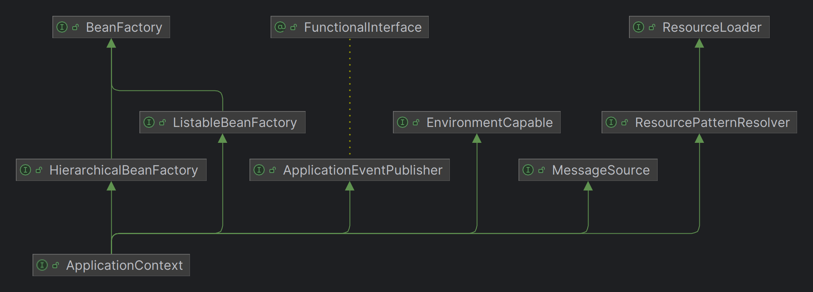

在 Spring 中，ApplicationContext 接口的实现类常用 ClassPathXmlApplicationContext 和 AnnotationConfigApplicationContext，它们提供了两种不同的构建和管理 Spring 应用程序上下文的方式。另外，针对 Web 应用开发，ApplicationContext  接口还提供了一个 WebApplicationContext 子接口。

>具体地说，ClassPathXmlApplicationContext 和 AnnotationConfigApplicationContext，二者都是 ApplicationContext 接口的子接口 ConfigurableApplicationContext 接口的实现类。

#### ClassPathXmlApplicationContext

**`ClassPathXmlApplicationContext`**：**是一个从类路径下加载 XML 配置文件并初始化 Spring 容器的实现类。**这种方法主要用于基于 XML 的配置方式。当创建 ClassPathXmlApplicationContext 的实例时，需要提供一个或多个 Spring 配置文件的路径，Spring 容器会加载这些文件，并根据其中定义的 Bean 和配置信息来构建应用程序上下文。
创建 ClassPathXmlApplicationContext 的示例代码如下：

```java
ApplicationContext context = new ClassPathXmlApplicationContext("applicationContext.xml");
```

在这个例子中，会在类路径中查找名为 applicationContext.xml 的配置文件，Spring 容器会根据该文件中定义的 Bean 配置来初始化应用程序上下文。

ClassPathXmlApplicationContext 的 Diagrams 结构图如下所示：

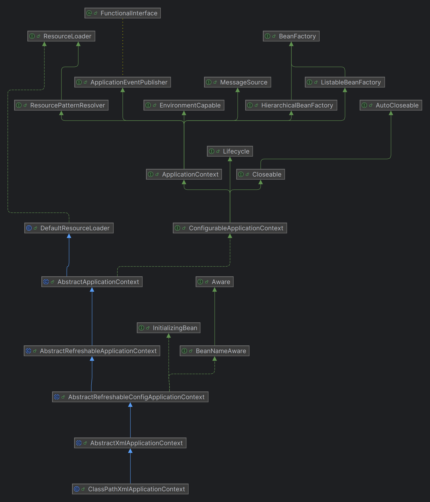

#### AnnotationConfigApplicationContext

**`AnnotationConfigApplicationContext`**：**是针对 Java 注解配置的 ApplicationContext 实现，它允许开发者通过 Java 注解而不是 XML 文件来配置 Spring 容器。**这种方式支持更加现代的编程习惯，允许通过注解（如 @Configuration, @Component, @Service 等）来声明 Bean 和它们的依赖。使用 AnnotationConfigApplicationContext 时，需要提供一个或多个带有 @Configuration 注解的 Java 配置类，这些类中包含了 Bean 的定义和配置信息。

创建 AnnotationConfigApplicationContext 的示例代码如下：

```java
ApplicationContext context = new AnnotationConfigApplicationContext(AppConfig.class);
```

在这个例子中，AppConfig 是一个带有 @Configuration 注解的 Java 配置类，Spring 容器会根据这个类中的注解配置来初始化应用程序上下文。

AnnotationConfigApplicationContext 的 Diagrams 结构图如下所示：

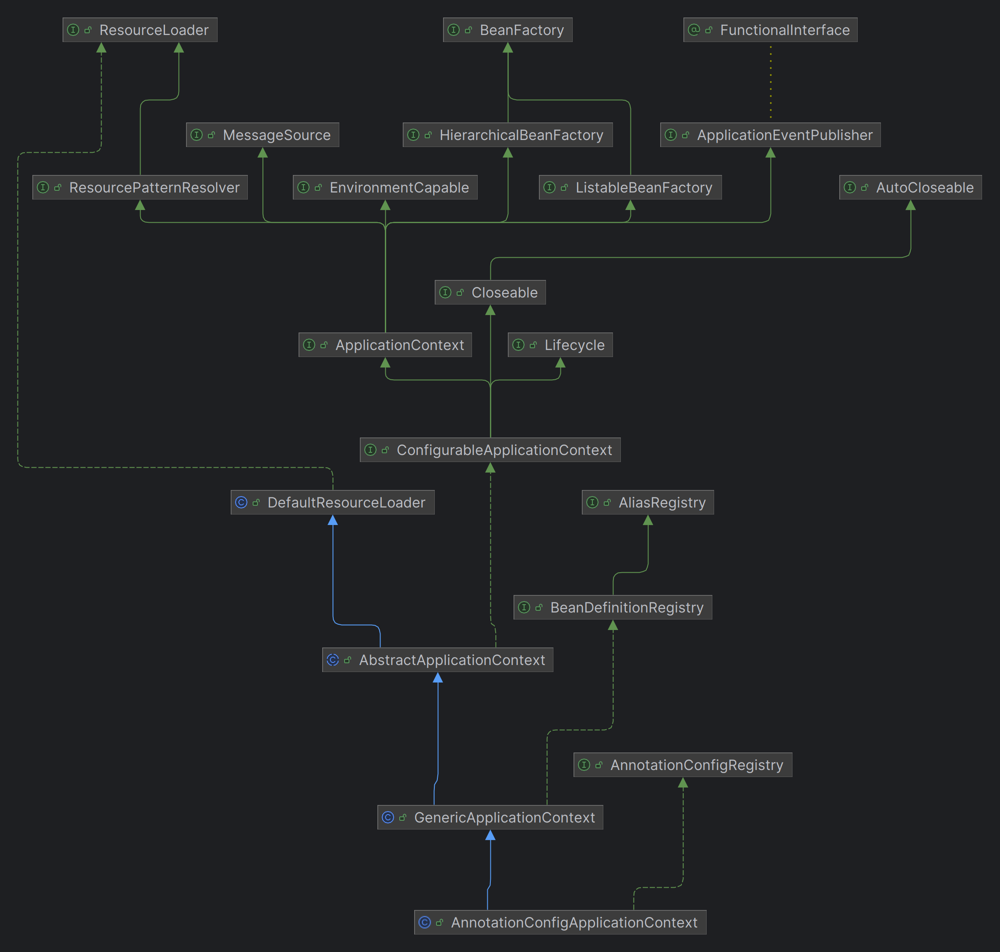

#### WebApplicationContext

**`WebApplicationContext`**：**为在 Web 应用程序环境中运行的 Spring 应用程序提供了上下文功能。**与标准的 ApplicationContext 相比，WebApplicationContext 是专门为 Web 应用设计的，并添加了一些特有的特性和功能。

WebApplicationContext 的一些主要特性包括：

1. `Servlet 生命周期的集成`：WebApplicationContext 与 Web 应用程序的生命周期紧密集成，它能够在 Servlet 容器（如 Tomcat）初始化时启动，并在 Servlet 容器关闭时清理资源。
2. `Web 资源的访问`：提供了访问 Web 资源（如 Servlet 上下文和 Servlet 配置）的能力。
3. `作用域扩展`：除了标准的 Spring 作用域（singleton、prototype 等），WebApplicationContext 还提供了 Web 相关的作用域，例如 request、session 和 application 作用域，分别对应于一个 HTTP 请求的生命周期、用户的 HTTP 会话以及整个 Web 应用的生命周期。
4. `特定于 Web 的 Bean`：能够定义和管理特定于 Web 的 Bean，如控制器、视图解析器、本地化资源和主题解析器等。

在 Spring MVC 框架中，WebApplicationContext 是非常关键的一个概念。它通常在 Web 应用程序启动时由 ContextLoaderListener 或者 DispatcherServlet 初始化。这些组件会加载 Spring 配置文件（XML 或 Java 配置），并创建一个相应的 WebApplicationContext 实例。

创建 WebApplicationContext 的示例代码通常不会直接出现在应用程序代码中，而是在 web.xml 或 Spring 的 Java 配置中声明。以下是通过 web.xml 使用 ContextLoaderListener 初始化 WebApplicationContext 的示例：

```xml
<web-app>
    <!-- ... 其他配置 ... -->

    <!-- ContextLoaderListener 加载应用上下文 -->
    <listener>
        <listener-class>org.springframework.web.context.ContextLoaderListener</listener-class>
    </listener>

    <!-- 指定 Spring 配置文件的位置 -->
    <context-param>
        <param-name>contextConfigLocation</param-name>
        <param-value>/WEB-INF/applicationContext.xml</param-value>
    </context-param>

    <!-- ... 其他配置 ... -->
</web-app>
```

在基于 Java 配置的 Spring MVC 应用中，可以通过继承 AbstractAnnotationConfigDispatcherServletInitializer 类来替代 web.xml 配置，并在其中设置 WebApplicationContext：

```java
public class WebAppInitializer extends AbstractAnnotationConfigDispatcherServletInitializer {

    @Override
    protected Class<?>[] getRootConfigClasses() {
        return new Class<?>[] { RootConfig.class };
    }

    @Override
    protected Class<?>[] getServletConfigClasses() {
        return new Class<?>[] { WebConfig.class };
    }

    @Override
    protected String[] getServletMappings() {
        return new String[] { "/" };
    }
}
```

在上面的例子中，RootConfig 和 WebConfig 分别是根应用上下文和 DispatcherServlet 应用上下文的 Java 配置类。WebAppInitializer 会自动加载这些配置类，并初始化 WebApplicationContext。

WebApplicationContext 的 Diagrams 结构图如下所示：

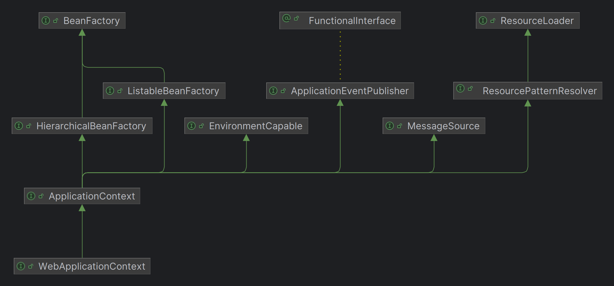

### Bean 的生命周期

**`Spring Bean 的生命周期`**：**是指 Bean 从创建到销毁过程中的各个阶段。**在 Spring 框架中，Bean 的完整生命周期经历了多个步骤，包括**实例化、属性赋值、初始化和销毁**。

以下是 Bean 生命周期过程的主要步骤：

1. `Bean 定义`：将 Bean 的配置信息加载到容器中。这可以通过 XML 配置文件、Java 注解或 Java 配置类来完成。
2. `Bean 实例化`：Spring 容器使用 Bean 的定义信息创建 Bean 实例。这通常通过调用类的无参构造方法或工厂方法来完成。
3. `属性赋值`：如果 Bean 配置中包含属性（property）值，那么这些属性将会被设置到新创建的 Bean 实例上。
4. `BeanNameAware`：如果 Bean 实现了 BeanNameAware 接口，Spring 将会调用 setBeanName() 方法，传递 Bean 的 ID。
5. `BeanFactoryAware 和 ApplicationContextAware`：如果 Bean 实现了 BeanFactoryAware 或 ApplicationContextAware 接口，Spring 容器将调用 setBeanFactory() 或 setApplicationContext() 方法，传递 Spring BeanFactory 或 ApplicationContext 实例。
6. `其他 Aware 接口`：如 EnvironmentAware、ResourceLoaderAware、MessageSourceAware 等，如果 Bean 实现了这些接口，相应的方法也会被调用。
7. `BeanPostProcessor（前置处理）`：BeanPostProcessor 的 postProcessBeforeInitialization 方法将会被调用。这给了开发者在 Bean 初始化之前对其进行额外处理的机会。
8. `InitializingBean`：如果 Bean 实现了 InitializingBean 接口，afterPropertiesSet() 方法将被调用。
9. `自定义 init 方法`：如果在 Bean 的配置中指定了 init 方法，该方法将被调用。
10. `BeanPostProcessor（后置处理）`：BeanPostProcessor 的 postProcessAfterInitialization 方法将会被调用。这给了开发者在 Bean 初始化之后对其进行额外处理的机会。
11. `Bean 使用`：此时，Bean 已经准备好被应用程序使用了。
12. `DisposableBean`：当容器关闭时，如果 Bean 实现了 DisposableBean 接口，destroy() 方法将被调用。
13. `自定义 destroy 方法`：如果在 Bean 的配置中指定了 destroy 方法，该方法将在 Bean 销毁时被调用。

通过这些步骤，Spring 容器管理 Bean 的整个生命周期，确保了资源的正确分配和释放。开发者可以通过实现特定的接口或指定方法来插入自己的逻辑，从而在 Bean 的生命周期的各个阶段执行自定义的行为。

值得注意的是，Spring Boot 项目中往往通过注解和自动配置来简化 Spring Bean 的声明和管理，但上述的生命周期概念仍然适用。

### Bean 的循环依赖

在 Spring [官方文档](https://docs.spring.io/spring-framework/reference/core/beans/dependencies/factory-collaborators.html)对`Circular dependencies`进行了明确的说明（当前最新版本为 6.1.11）：

```tex
If you use predominantly constructor injection, it is possible to create an unresolvable circular dependency scenario.

For example: Class A requires an instance of class B through constructor injection, and class B requires an instance of class A through constructor injection. If you configure beans for classes A and B to be injected into each other, the Spring IoC container detects this circular reference at runtime, and throws a BeanCurrentlyInCreationException.

One possible solution is to edit the source code of some classes to be configured by setters rather than constructors. Alternatively, avoid constructor injection and use setter injection only. In other words, although it is not recommended, you can configure circular dependencies with setter injection.

Unlike the typical case (with no circular dependencies), a circular dependency between bean A and bean B forces one of the beans to be injected into the other prior to being fully initialized itself (a classic chicken-and-egg scenario).
```

#### 案例演示

pom.xml：

```x
<?xml version="1.0" encoding="UTF-8"?>
<project xmlns="http://maven.apache.org/POM/4.0.0"
         xmlns:xsi="http://www.w3.org/2001/XMLSchema-instance"
         xsi:schemaLocation="http://maven.apache.org/POM/4.0.0 http://maven.apache.org/xsd/maven-4.0.0.xsd">
    <modelVersion>4.0.0</modelVersion>
    <parent>
        <groupId>cn.zero.cloud</groupId>
        <artifactId>zeloud-self-studies</artifactId>
        <version>1.0.0-SNAPSHOT</version>
    </parent>

    <artifactId>zeloud-self-study-spring</artifactId>
    <packaging>jar</packaging>

    <properties>
        <java.version>17</java.version>
        <maven.compiler.source>17</maven.compiler.source>
        <maven.compiler.target>17</maven.compiler.target>
        <project.build.sourceEncoding>UTF-8</project.build.sourceEncoding>
    </properties>

    <dependencies>
        <dependency>
            <groupId>org.springframework</groupId>
            <artifactId>spring-context</artifactId>
        </dependency>
    </dependencies>

</project>
```

>说明：本文中的代码，基于 Spring 6.1.5 版本。

创建两个类 A 和 B：

```java
package cn.zero.cloud.spring.circular;

/**
 * @author Xisun Wang
 * @since 2024/7/13 14:46
 */
public class A {
    private B b;

    public A() {
        System.out.println("Class A was created successfully");
    }

    public B getB() {
        return b;
    }

    public void setB(B b) {
        this.b = b;
    }
}
```

```java
package cn.zero.cloud.spring.circular;

/**
 * @author Xisun Wang
 * @since 2024/7/13 14:46
 */
public class B {
    private A a;

    public B() {
        System.out.println("Class B was created successfully");
    }

    public A getA() {
        return a;
    }

    public void setA(A a) {
        this.a = a;
    }
}
```

创建 Spring 配置文件 applicationContext.xml：

```xml
<?xml version="1.0" encoding="UTF-8"?>
<beans xmlns="http://www.springframework.org/schema/beans"
       xmlns:xsi="http://www.w3.org/2001/XMLSchema-instance"
       xsi:schemaLocation="http://www.springframework.org/schema/beans
                           http://www.springframework.org/schema/beans/spring-beans.xsd">

    <bean id="a" class="cn.zero.cloud.spring.circular.A" scope="singleton">
        <property name="b" ref="b"/>
    </bean>

    <bean id="b" class="cn.zero.cloud.spring.circular.B" scope="singleton">
        <property name="a" ref="a"/>
    </bean>
</beans>
```

- scope 默认为 singleton。

创建 Spring 容器测试类：

```java
package cn.zero.cloud.spring.circular;

import org.springframework.context.support.ClassPathXmlApplicationContext;

/**
 * Spring 容器测试类
 *
 * @author Xisun Wang
 * @since 2024/7/13 21:16
 */
public class ClientSpringContainer {
    public static void main(String[] args) {
        ClassPathXmlApplicationContext context = new ClassPathXmlApplicationContext("applicationContext.xml");
        A a = context.getBean("a", A.class);
        B b = context.getBean("b", B.class);
    }
}
```

输出结果：

```java
2024-07-14 09:00:25.888 [main] DEBUG o.s.context.support.ClassPathXmlApplicationContext - Refreshing org.springframework.context.support.ClassPathXmlApplicationContext@3745e5c6
2024-07-14 09:00:26.046 [main] DEBUG o.s.beans.factory.xml.XmlBeanDefinitionReader - Loaded 2 bean definitions from class path resource [applicationContext.xml]
2024-07-14 09:00:26.082 [main] DEBUG o.s.b.factory.support.DefaultListableBeanFactory - Creating shared instance of singleton bean 'a'
Class A was created successfully
2024-07-14 09:00:26.095 [main] DEBUG o.s.b.factory.support.DefaultListableBeanFactory - Creating shared instance of singleton bean 'b'
Class B was created successfully
```

修改配置文件中 A 和 B 的 scope 为 prototype：

```java
<?xml version="1.0" encoding="UTF-8"?>
<beans xmlns="http://www.springframework.org/schema/beans"
       xmlns:xsi="http://www.w3.org/2001/XMLSchema-instance"
       xsi:schemaLocation="http://www.springframework.org/schema/beans
                           http://www.springframework.org/schema/beans/spring-beans.xsd">

    <bean id="a" class="cn.zero.cloud.spring.circular.A" scope="prototype">
        <property name="b" ref="b"/>
    </bean>

    <bean id="b" class="cn.zero.cloud.spring.circular.B" scope="prototype">
        <property name="a" ref="a"/>
    </bean>
</beans>
```

重新运行测试类，输出结果：

```java
2024-07-14 09:01:18.855 [main] DEBUG o.s.context.support.ClassPathXmlApplicationContext - Refreshing org.springframework.context.support.ClassPathXmlApplicationContext@3745e5c6
2024-07-14 09:01:18.984 [main] DEBUG o.s.beans.factory.xml.XmlBeanDefinitionReader - Loaded 2 bean definitions from class path resource [applicationContext.xml]
Class A was created successfully
Class B was created successfully
Exception in thread "main" org.springframework.beans.factory.BeanCreationException: Error creating bean with name 'a' defined in class path resource [applicationContext.xml]: Cannot resolve reference to bean 'b' while setting bean property 'b'
	at org.springframework.beans.factory.support.BeanDefinitionValueResolver.resolveReference(BeanDefinitionValueResolver.java:377)
	at org.springframework.beans.factory.support.BeanDefinitionValueResolver.resolveValueIfNecessary(BeanDefinitionValueResolver.java:135)
	at org.springframework.beans.factory.support.AbstractAutowireCapableBeanFactory.applyPropertyValues(AbstractAutowireCapableBeanFactory.java:1685)
	at org.springframework.beans.factory.support.AbstractAutowireCapableBeanFactory.populateBean(AbstractAutowireCapableBeanFactory.java:1434)
	at org.springframework.beans.factory.support.AbstractAutowireCapableBeanFactory.doCreateBean(AbstractAutowireCapableBeanFactory.java:599)
	at org.springframework.beans.factory.support.AbstractAutowireCapableBeanFactory.createBean(AbstractAutowireCapableBeanFactory.java:522)
	at org.springframework.beans.factory.support.AbstractBeanFactory.doGetBean(AbstractBeanFactory.java:344)
	at org.springframework.beans.factory.support.AbstractBeanFactory.getBean(AbstractBeanFactory.java:205)
	at org.springframework.context.support.AbstractApplicationContext.getBean(AbstractApplicationContext.java:1240)
	at cn.zero.cloud.spring.circular.ClientSpringContainer.main(ClientSpringContainer.java:14)
Caused by: org.springframework.beans.factory.BeanCreationException: Error creating bean with name 'b' defined in class path resource [applicationContext.xml]: Cannot resolve reference to bean 'a' while setting bean property 'a'
	at org.springframework.beans.factory.support.BeanDefinitionValueResolver.resolveReference(BeanDefinitionValueResolver.java:377)
	at org.springframework.beans.factory.support.BeanDefinitionValueResolver.resolveValueIfNecessary(BeanDefinitionValueResolver.java:135)
	at org.springframework.beans.factory.support.AbstractAutowireCapableBeanFactory.applyPropertyValues(AbstractAutowireCapableBeanFactory.java:1685)
	at org.springframework.beans.factory.support.AbstractAutowireCapableBeanFactory.populateBean(AbstractAutowireCapableBeanFactory.java:1434)
	at org.springframework.beans.factory.support.AbstractAutowireCapableBeanFactory.doCreateBean(AbstractAutowireCapableBeanFactory.java:599)
	at org.springframework.beans.factory.support.AbstractAutowireCapableBeanFactory.createBean(AbstractAutowireCapableBeanFactory.java:522)
	at org.springframework.beans.factory.support.AbstractBeanFactory.doGetBean(AbstractBeanFactory.java:344)
	at org.springframework.beans.factory.support.AbstractBeanFactory.getBean(AbstractBeanFactory.java:200)
	at org.springframework.beans.factory.support.BeanDefinitionValueResolver.resolveReference(BeanDefinitionValueResolver.java:365)
	... 9 more
Caused by: org.springframework.beans.factory.BeanCurrentlyInCreationException: Error creating bean with name 'a': Requested bean is currently in creation: Is there an unresolvable circular reference?
	at org.springframework.beans.factory.support.AbstractBeanFactory.doGetBean(AbstractBeanFactory.java:266)
	at org.springframework.beans.factory.support.AbstractBeanFactory.getBean(AbstractBeanFactory.java:200)
	at org.springframework.beans.factory.support.BeanDefinitionValueResolver.resolveReference(BeanDefinitionValueResolver.java:365)
	... 17 more
```

通过以上测试，可以发现，当 Spring 容器中 Bean 的 scope 为 prototype 时，循环依赖的问题无法解决，Spring 容器创建对象时，抛出了`BeanCurrentlyInCreationException`。由此，可以得出结论：**Spring 容器中，默认的单例（Singleton）场景，支持循环依赖，原型（Prototype）场景，不支持循环依赖，会抛出 BeanCurrentlyInCreationException。**

#### DefaultSingletonBeanRegistry

`DefaultSingletonBeanRegistry`中，定义了三个 Map，俗称`三级缓存`，这就是 Spring 解决循环依赖的方法：

```java
/**
 * Generic registry for shared bean instances, implementing the
 * {@link org.springframework.beans.factory.config.SingletonBeanRegistry}.
 * Allows for registering singleton instances that should be shared
 * for all callers of the registry, to be obtained via bean name.
 *
 * <p>Also supports registration of
 * {@link org.springframework.beans.factory.DisposableBean} instances,
 * (which might or might not correspond to registered singletons),
 * to be destroyed on shutdown of the registry. Dependencies between
 * beans can be registered to enforce an appropriate shutdown order.
 *
 * <p>This class mainly serves as base class for
 * {@link org.springframework.beans.factory.BeanFactory} implementations,
 * factoring out the common management of singleton bean instances. Note that
 * the {@link org.springframework.beans.factory.config.ConfigurableBeanFactory}
 * interface extends the {@link SingletonBeanRegistry} interface.
 *
 * <p>Note that this class assumes neither a bean definition concept
 * nor a specific creation process for bean instances, in contrast to
 * {@link AbstractBeanFactory} and {@link DefaultListableBeanFactory}
 * (which inherit from it). Can alternatively also be used as a nested
 * helper to delegate to.
 *
 * @author Juergen Hoeller
 * @since 2.0
 * @see #registerSingleton
 * @see #registerDisposableBean
 * @see org.springframework.beans.factory.DisposableBean
 * @see org.springframework.beans.factory.config.ConfigurableBeanFactory
 */
public class DefaultSingletonBeanRegistry extends SimpleAliasRegistry implements SingletonBeanRegistry {
	/** Cache of singleton objects: bean name to bean instance. */
	private final Map<String, Object> singletonObjects = new ConcurrentHashMap<>(256);

	/** Cache of singleton factories: bean name to ObjectFactory. */
	private final Map<String, ObjectFactory<?>> singletonFactories = new HashMap<>(16);

	/** Cache of early singleton objects: bean name to bean instance. */
	private final Map<String, Object> earlySingletonObjects = new ConcurrentHashMap<>(16);
}
```

- `singletonObjects`：**第一级缓存，也叫单例池，是一个 ConcurrentHashMap，key 为 String（即 Bean 名称），value 为 Object（即 Bean 实例），存放的是`已经经历了完整生命周期的 Bean 对象`（`已实例化、属性填充完整、初始化的成品`）。**
- `earlySingletonObjects`：**第二级缓存，是一个 ConcurrentHashMap，key 为 String（即 Bean 名称），value 为 Object（即 Bean 实例），存放的是`早期暴露出来的 Bean 对象`，Bean 的生命周期未结束（`已实例化、属性未填充完整、未初始化的半成品`）。**
- `singletonFactories`：**第三级缓存，是一个 HashMap，key 为 String（即 Bean 名称），value 为 ObjectFactory<?>（即 Bean 工厂），存放的是`可以生成 Bean 的工厂`。**

解决循环依赖问题的条件：

1. 循环依赖的 Bean 必须是 singleton，因为 prototype 的 Bean，每次都需要创建新的对象。
2. 循环依赖的 Bean 不能全是构造器注入，且 beanName 的字母顺序在前的 Bean 不能是构造器注入。

>在 Spring 中创建 Bean 分三步：
>
>1. `实例化`：doCreateBean，即 new 一个对象。
>2. `属性注入`：populateBean， 即 set 一些属性值。
>3. `初始化`：initializeBean，即执行一些 aware 接口中的方法，如 initMethod，AOP 代理等。
>
>如果 Bean 全是构造器注入，比如`public A(B b)`，那表明在  new A 的时候，就需要先得到 B，此时需要  new B，但是 B 也是`public B(A a)`，在 new B 的时候，需要先得到 A。由此，陷入一个套娃死循环，A 和 B 都无法创建，循环依赖问题无法解决。
>
>如果一个 Bean 是 Setter 注入，另一个 Bean 是构造器注入，则需要分情况：
>
>1. `假设 A 通过 Setter 注入 B，B 通过构造器注入 A，此时，循环依赖问题可以解决。`
>   - 因为 A 是 Setter 注入，A 可以正常 new 一个实例，当其 Setter 注入属性 B 时，需要先 new B，此时，因为 B 是构造器注入，可以将前面 new 出来的 A 实例注入，完成 B 的初始化。最后，初始化完成的 B，可以正常使 A 完成初始化。
>2. `假设 A 通过构造器注入 B，B 通过 Setter 注入 A，此时，循环依赖问题无法解决。`
>   - 因为 A 是构造器注入，在 new A 的时候，需要先 new B，此时，因为 B 是 Setter 注入，B 在属性注入 A 的时候，发现找不到 A，B 初始化也失败。最终，A 和 B 都无法创建成功。或许，你会认为，可以先实例化 B 啊，然后能成功实例化 A。确实，思路没错，但是， `Spring 容器是按照字母序创建 Bean 的，A 的创建永远排在 B 前面，`所以无法完成。

结论：

1. **Spring 容器中，`只有单例的 Bean 会通过三级缓存提前暴露来解决循环依赖的问题`，而非单例的 Bean，每次从容器中获取的都是一个新的对象，即都会重新创建，所以非单例的 Bean 是没有缓存的，不会将其放到三级缓存中，也就无法解决缓存依赖的问题。**
2. **如果循环依赖的 Bean 都是构造器注入，无法解决。**
3. **如果循环依赖的 Bean 不完全是构造器注入，则可能成功，可能失败，具体跟 BeanName 的字母序有关系。**

#### 二级缓存的必要性

Spring 在解决循环依赖的过程中，二级缓存看起来是没有必要的，只依靠一级缓存和三级缓存也可以做到解决循环依赖的问题。确实如此，只要两个缓存可以做到解决循环依赖的问题，但是有一个前提，即 Bean 没被 AOP 进行切面代理，**如果 Bean 被 AOP 进行了切面代理，那么只使用两个缓存是无法解决问题。**

原因是，对于被 AOP 进行切面代理的 Bean，每次执行`singleFactory.getObject()`方法，都会返回一个新的代理对象，所以，需要借助二级缓存，将第一次调用产生的代理对象放入二级缓存中，以保证循环依赖的问题被正常处理。

#### 源码流程图

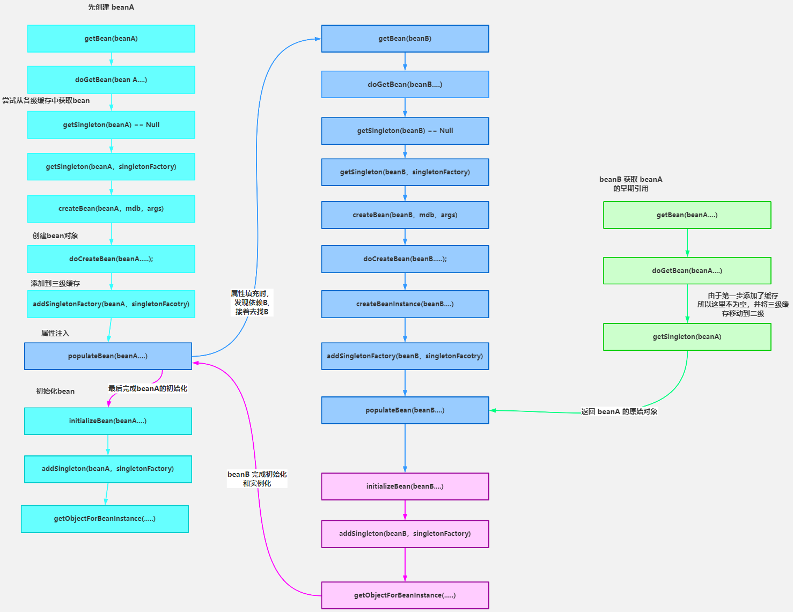

- `getSingleton(beanName)`：获取 Bean。
- `doCreateBean(beanName, mbdToUse, args)`：实例化 Bean。
- `populateBean(beanName, mbd, instanceWrapper)`：属性填充 Bean。
- `initializeBean(beanName, exposedObject, mbd)`：初始化 Bean。
- `addSingleton(beanName, singletonObject)`：添加 Bean。

#### 源码 Debug

在 ClientSpringContainer.java 测试类中，创建 ApplicationContext 的时候，设置断点：

```java
// 断点 1
ClassPathXmlApplicationContext context = new ClassPathXmlApplicationContext("applicationContext.xml");
```

F7 Step Into 方法内部，定位到 ClassPathXmlApplicationContext.java 的构造方法，调用`refresh()`方法：

```java
public ClassPathXmlApplicationContext(
       String[] configLocations, boolean refresh, @Nullable ApplicationContext parent)
       throws BeansException {

    super(parent);
    setConfigLocations(configLocations);
    if (refresh) {
       // 断点 2
       refresh();
    }
}
```

F7 Step Into，定位到 org.springframework.context.support.AbstractApplicationContext#refresh，调用`finishBeanFactoryInitialization(beanFactory)`方法：

```java
@Override
public void refresh() throws BeansException, IllegalStateException {
    this.startupShutdownLock.lock();
    try {
       ...

       try {
          ...

          // 断点 3
          // Instantiate all remaining (non-lazy-init) singletons.
          finishBeanFactoryInitialization(beanFactory);

       }

       ...
}
```

F7 Step Into，定位到 org.springframework.context.support.AbstractApplicationContext#finishBeanFactoryInitialization，调用`preInstantiateSingletons()`方法：

```java
protected void finishBeanFactoryInitialization(ConfigurableListableBeanFactory beanFactory) {
    ...
        
    // 断点 4
    // Instantiate all remaining (non-lazy-init) singletons.
    beanFactory.preInstantiateSingletons();
}
```

F7 Step Into，定位到 org.springframework.beans.factory.support.DefaultListableBeanFactory#preInstantiateSingletons，调用`getBean(beanName)`方法：

```java
@Override
public void preInstantiateSingletons() throws BeansException {
    if (logger.isTraceEnabled()) {
       logger.trace("Pre-instantiating singletons in " + this);
    }

    // Iterate over a copy to allow for init methods which in turn register new bean definitions.
    // While this may not be part of the regular factory bootstrap, it does otherwise work fine.
    List<String> beanNames = new ArrayList<>(this.beanDefinitionNames);

    // Trigger initialization of all non-lazy singleton beans...
    for (String beanName : beanNames) {
       RootBeanDefinition bd = getMergedLocalBeanDefinition(beanName);
       // bd.isSingleton()：要求是单例的 Bean
       // bd.isLazyInit()：判断 Bean 是否是延迟加载
       if (!bd.isAbstract() && bd.isSingleton() && !bd.isLazyInit()) {
          if (isFactoryBean(beanName)) {
             Object bean = getBean(FACTORY_BEAN_PREFIX + beanName);
             if (bean instanceof SmartFactoryBean<?> smartFactoryBean && smartFactoryBean.isEagerInit()) {
                getBean(beanName);
             }
          }
          else {
             // 断点 5
             getBean(beanName);
          }
       }
    }

    ...
}
```

>此时，可以看到，所有需要初始化，且非延迟加载的单例 Bean 对象列表（优先创建的是 a）：
>
>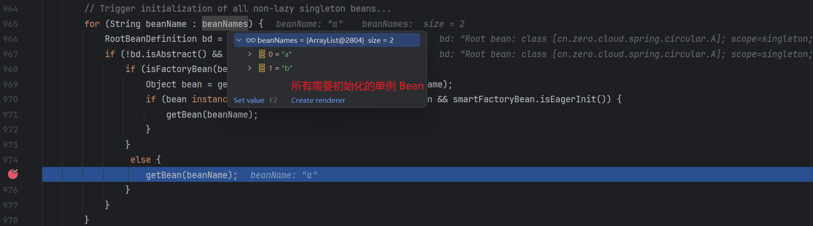

F7 Step Into，定位到 org.springframework.beans.factory.support.AbstractBeanFactory#doGetBean，调用**`getSingleton(beanName)`**方法：

```java
protected <T> T doGetBean(
       String name, @Nullable Class<T> requiredType, @Nullable Object[] args, boolean typeCheckOnly)
       throws BeansException {

    // 处理 Bean 别名解析
    String beanName = transformedBeanName(name);
    Object beanInstance;

    // 断点 6
    // Eagerly check singleton cache for manually registered singletons.
    Object sharedInstance = getSingleton(beanName);
    if (sharedInstance != null && args == null) {
       if (logger.isTraceEnabled()) {
          if (isSingletonCurrentlyInCreation(beanName)) {
             logger.trace("Returning eagerly cached instance of singleton bean '" + beanName +
                   "' that is not fully initialized yet - a consequence of a circular reference");
          }
          else {
             logger.trace("Returning cached instance of singleton bean '" + beanName + "'");
          }
       }
       beanInstance = getObjectForBeanInstance(sharedInstance, name, beanName, null);
    }
    
    ...
}
```

> Spring 源码中，以 doXxx 开头的方法，往往都是实际的业务处理方法。

F7 Step Into，定位到 org.springframework.beans.factory.support.DefaultSingletonBeanRegistry#getSingleton(java.lang.String, boolean)，此时，对于 Bean a，一级缓存 singletonObjects 中明显不存在，同时，isSingletonCurrentlyInCreation(beanName) 也为 false（Bean a 此时还未处于创建的状态），因此，getSingleton 方法直接 return 一个 null：

```java
@Nullable
protected Object getSingleton(String beanName, boolean allowEarlyReference) {
    // 检查 singletonObjects，即一级缓存中是否存在 Bean a，很明显，此时不存在，singletonObject 为 null
    // Quick check for existing instance without full singleton lock
    Object singletonObject = this.singletonObjects.get(beanName);
    // 此时，判断条件为 false，方法直接返回 singletonObject，是一个 null
    if (singletonObject == null && isSingletonCurrentlyInCreation(beanName)) {
       ...
    }
    return singletonObject;
}
```

>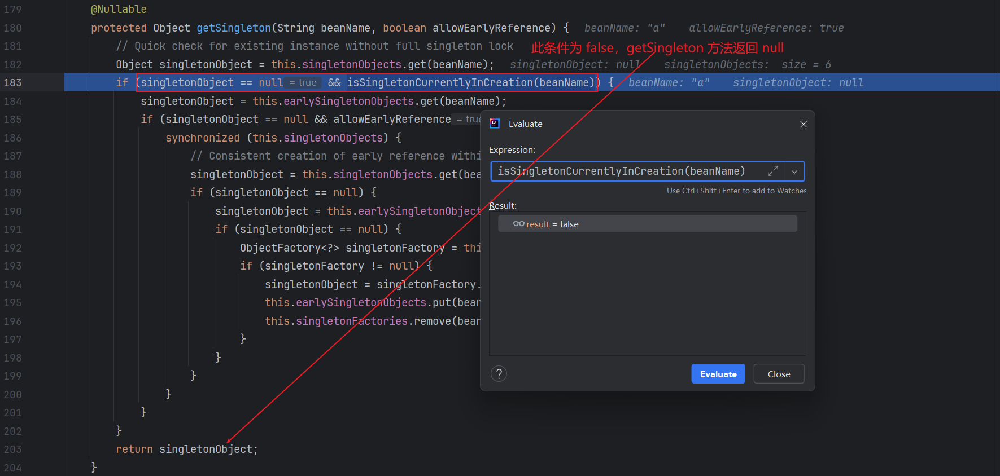

**getSingleton 方法返回了一个 null，说明 Spring 容器中暂时不存在 Bean a，接下来，我们需要创建一个 Bean a。**此时，程序执行回到断点 6 处：


F8 Step Over 继续往下执行：


F8 Step Over 继续往下执行，最终定位到如下位置：

```java
// Create bean instance.
if (mbd.isSingleton()) {
    // 断点 7
    sharedInstance = getSingleton(beanName, () -> {
       try {
          return createBean(beanName, mbd, args);
       }
       catch (BeansException ex) {
          // Explicitly remove instance from singleton cache: It might have been put there
          // eagerly by the creation process, to allow for circular reference resolution.
          // Also remove any beans that received a temporary reference to the bean.
          destroySingleton(beanName);
          throw ex;
       }
    });
    beanInstance = getObjectForBeanInstance(sharedInstance, name, beanName, mbd);
}
```

F7 Step Into，定位到 org.springframework.beans.factory.support.DefaultSingletonBeanRegistry#getSingleton(java.lang.String, org.springframework.beans.factory.ObjectFactory<?>)，调用`singletonFactory.getObject()`方法：

```java
public Object getSingleton(String beanName, ObjectFactory<?> singletonFactory) {
    Assert.notNull(beanName, "Bean name must not be null");
    synchronized (this.singletonObjects) {
       Object singletonObject = this.singletonObjects.get(beanName);
       // 因为一级缓存中仍不存在 Bean a，方法继续往下执行
       if (singletonObject == null) {
           ...
               
           try {
                // 断点 8
                singletonObject = singletonFactory.getObject();
                newSingleton = true;
            }
           
           ...
       }
       return singletonObject;
    }
}
```

>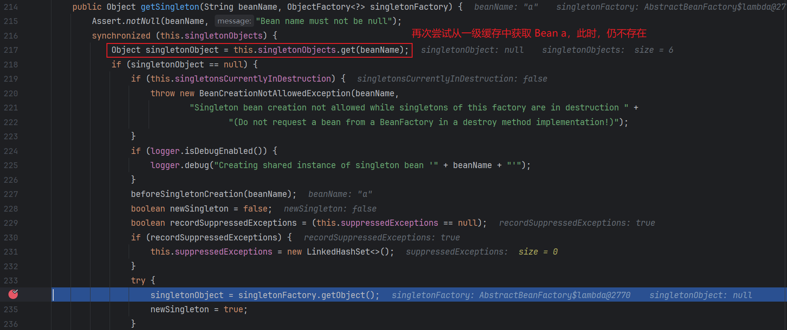

F7 Step Into，进入 singletonFactory.getObject() 方法内部，会回到断点 7 处，也就是说，在断点 7 处，如果 getSingleton() 方法没有获取到 Bean a，就会调用第二个参数，最终调用`createBean(beanName, mbd, args)`方法：

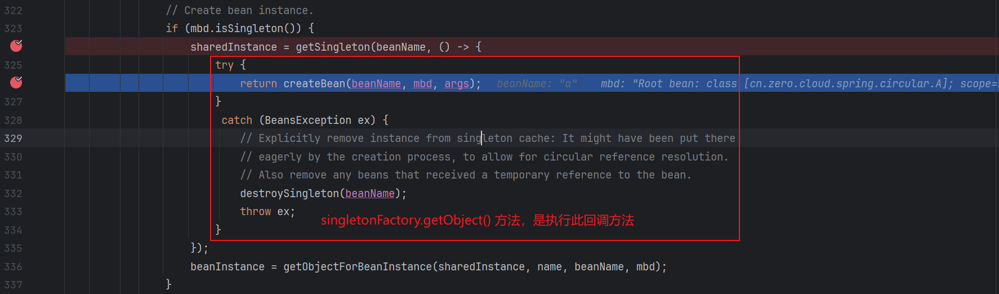

F7 Step Into，定位到 org.springframework.beans.factory.support.AbstractAutowireCapableBeanFactory#createBean(java.lang.String, org.springframework.beans.factory.support.RootBeanDefinition, java.lang.Object[])，调用**`doCreateBean(beanName, mbdToUse, args)`**方法，开始创建 Bean a：

```java
@Override
protected Object createBean(String beanName, RootBeanDefinition mbd, @Nullable Object[] args)
       throws BeanCreationException {

    ...

    try {
       // 断点 9
       Object beanInstance = doCreateBean(beanName, mbdToUse, args);
       if (logger.isTraceEnabled()) {
          logger.trace("Finished creating instance of bean '" + beanName + "'");
       }
       return beanInstance;
    }
    
    ...
}
```

F7 Step Into，定位到 org.springframework.beans.factory.support.AbstractAutowireCapableBeanFactory#doCreateBean，调用`createBeanInstance(beanName, mbd, args)`：

```java
protected Object doCreateBean(String beanName, RootBeanDefinition mbd, @Nullable Object[] args)
       throws BeanCreationException {

    // Instantiate the bean.
    BeanWrapper instanceWrapper = null;
    if (mbd.isSingleton()) {
       instanceWrapper = this.factoryBeanInstanceCache.remove(beanName);
    }
    if (instanceWrapper == null) {
       // 断点 10
       instanceWrapper = createBeanInstance(beanName, mbd, args);
    }
    
    ...
}
```

>F7 Step Into，定位到 org.springframework.beans.factory.support.AbstractAutowireCapableBeanFactory#createBeanInstance，此方法内部可以看到 Spring 使用了大量反射。

F8 Step Over，可以看到，Spring 对于单例的 Bean，默认支持循环依赖：

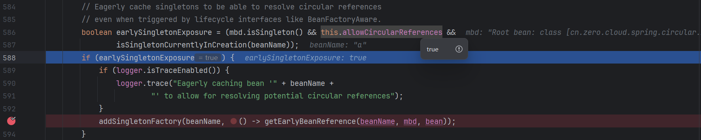

F8 Step Over，调用`addSingletonFactory(beanName, () -> getEarlyBeanReference(beanName, mbd, bean))`：

```java
protected Object doCreateBean(String beanName, RootBeanDefinition mbd, @Nullable Object[] args)
       throws BeanCreationException {
    ...
    // Eagerly cache singletons to be able to resolve circular references
    // even when triggered by lifecycle interfaces like BeanFactoryAware.
    boolean earlySingletonExposure = (mbd.isSingleton() && this.allowCircularReferences &&
            isSingletonCurrentlyInCreation(beanName));
    if (earlySingletonExposure) {
        if (logger.isTraceEnabled()) {
            logger.trace("Eagerly caching bean '" + beanName +
                    "' to allow for resolving potential circular references");
        }
        // 断点 11
        addSingletonFactory(beanName, () -> getEarlyBeanReference(beanName, mbd, bean));
    }
    
    ...
}
```

F7 Step Into，定位到 org.springframework.beans.factory.support.DefaultSingletonBeanRegistry#addSingletonFactory，**在此方法中，会将 Bean a 对应的 ObjectFactory<?>，添加到三级缓存 singletonFactories 中**：

```java
/**
 * Add the given singleton factory for building the specified singleton
 * if necessary.
 * <p>To be called for eager registration of singletons, e.g. to be able to
 * resolve circular references.
 * @param beanName the name of the bean
 * @param singletonFactory the factory for the singleton object
 */
protected void addSingletonFactory(String beanName, ObjectFactory<?> singletonFactory) {
    Assert.notNull(singletonFactory, "Singleton factory must not be null");
    synchronized (this.singletonObjects) {
       if (!this.singletonObjects.containsKey(beanName)) {
          this.singletonFactories.put(beanName, singletonFactory);
          this.earlySingletonObjects.remove(beanName);
          this.registeredSingletons.add(beanName);
       }
    }
}
```

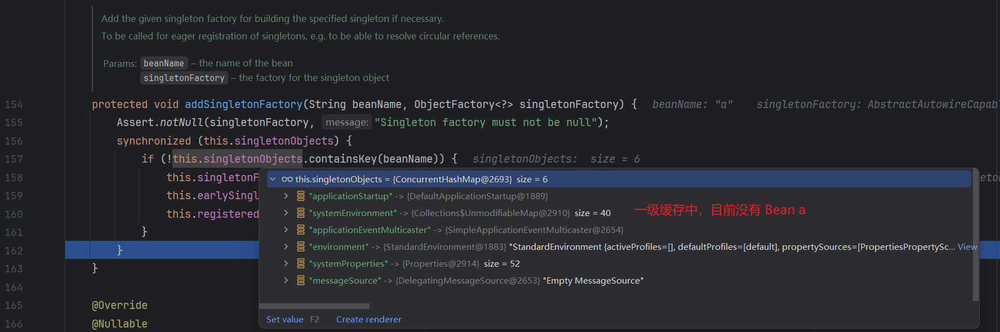

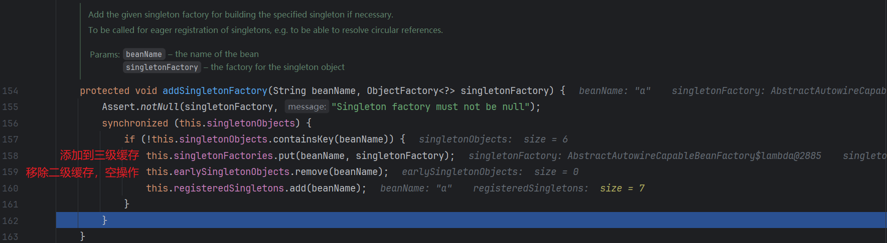

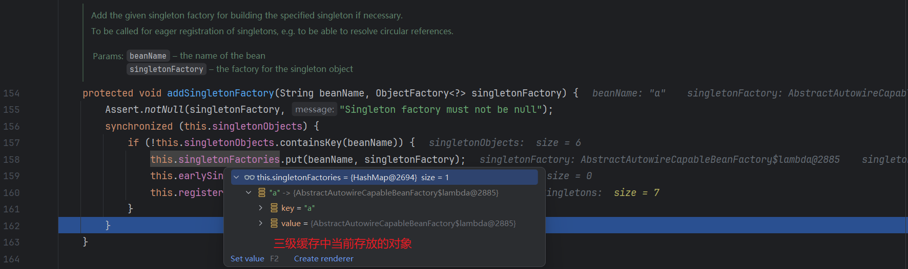

断点 11 处执行完后，继续 F8 Step Over，调用**`populateBean(beanName, mbd, instanceWrapper)`**方法，开始属性填充：

```java
protected Object doCreateBean(String beanName, RootBeanDefinition mbd, @Nullable Object[] args)
       throws BeanCreationException {
    ...
        
    // Initialize the bean instance.
    Object exposedObject = bean;
    try {
        // 断点 12，Bean a 属性填充
        populateBean(beanName, mbd, instanceWrapper);
        exposedObject = initializeBean(beanName, exposedObject, mbd);
    }
    
    ...
}
```

F7 Step Into，定位到 org.springframework.beans.factory.support.AbstractAutowireCapableBeanFactory#populateBean，最终会调用`applyPropertyValues(beanName, mbd, bw, pvs)`方法：

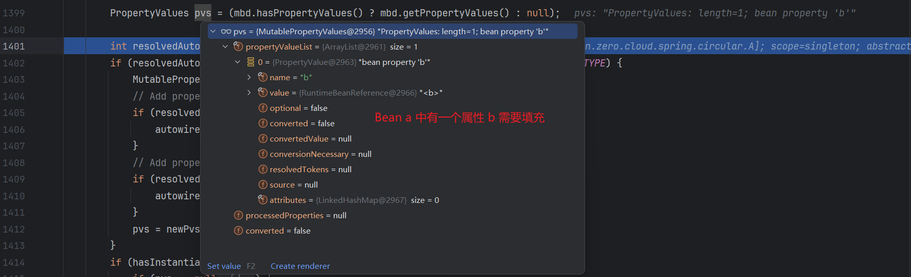

```java
protected void populateBean(String beanName, RootBeanDefinition mbd, @Nullable BeanWrapper bw) {
    ...

    // Bean a 中有一个属性 b 需要填充
    PropertyValues pvs = (mbd.hasPropertyValues() ? mbd.getPropertyValues() : null);

    ...

    if (pvs != null) {
       // 断点 13
       applyPropertyValues(beanName, mbd, bw, pvs);
    }
}
```

F7 Step Into，定位到 org.springframework.beans.factory.support.AbstractAutowireCapableBeanFactory#applyPropertyValues，调用`valueResolver.resolveValueIfNecessary(pv, originalValue)`方法：

```java
protected void applyPropertyValues(String beanName, BeanDefinition mbd, BeanWrapper bw, PropertyValues pvs) {
    ...

    // Create a deep copy, resolving any references for values.
    List<PropertyValue> deepCopy = new ArrayList<>(original.size());
    boolean resolveNecessary = false;
    for (PropertyValue pv : original) {
       if (pv.isConverted()) {
          deepCopy.add(pv);
       }
       else {
          String propertyName = pv.getName();
          Object originalValue = pv.getValue();
          if (originalValue == AutowiredPropertyMarker.INSTANCE) {
             Method writeMethod = bw.getPropertyDescriptor(propertyName).getWriteMethod();
             if (writeMethod == null) {
                throw new IllegalArgumentException("Autowire marker for property without write method: " + pv);
             }
             originalValue = new DependencyDescriptor(new MethodParameter(writeMethod, 0), true);
          }
          // 断点 14
          Object resolvedValue = valueResolver.resolveValueIfNecessary(pv, originalValue);
          Object convertedValue = resolvedValue;
          boolean convertible = isConvertibleProperty(propertyName, bw);
          
          ...
       }
    }
    
    ...
}
```

> 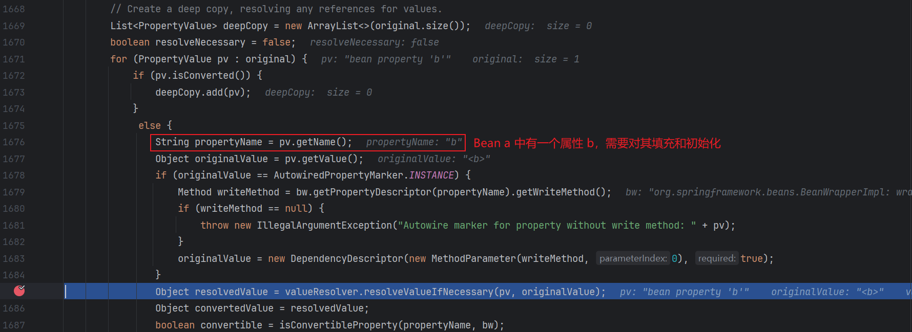

F7 Step Into，定位到 org.springframework.beans.factory.support.BeanDefinitionValueResolver#resolveValueIfNecessary，调用`resolveReference(argName, ref)`方法：

```java
@Nullable
public Object resolveValueIfNecessary(Object argName, @Nullable Object value) {
    // We must check each value to see whether it requires a runtime reference
    // to another bean to be resolved.
    if (value instanceof RuntimeBeanReference ref) {
       // 断点 15
       return resolveReference(argName, ref);
    }
}
```

F7 Step Into，定位到 org.springframework.beans.factory.support.BeanDefinitionValueResolver#resolveReference，调用`this.beanFactory.getBean(resolvedName)`方法：

```java
@Nullable
private Object resolveReference(Object argName, RuntimeBeanReference ref) {
    try {
       ...
           
       else {
          String resolvedName;
          if (beanType != null) {
             NamedBeanHolder<?> namedBean = this.beanFactory.resolveNamedBean(beanType);
             bean = namedBean.getBeanInstance();
             resolvedName = namedBean.getBeanName();
          }
          else {
             resolvedName = String.valueOf(doEvaluate(ref.getBeanName()));
             // 断点 16，Bean a 需要获取 Bean b 进行属性填充
             bean = this.beanFactory.getBean(resolvedName);
          }
          this.beanFactory.registerDependentBean(resolvedName, this.beanName);
       }
       if (bean instanceof NullBean) {
          bean = null;
       }
       return bean;
    }
    
    ...
}
```

F7 Step Into，定位到 org.springframework.beans.factory.support.AbstractBeanFactory#getBean(java.lang.String)，回到了最初获取 Bean a 一样的地方**（从此处开始，暂时变为了 Bean b 的获取和创建流程）**：

```java
@Override
public Object getBean(String name) throws BeansException {
    return doGetBean(name, null, null, false);
}
```

>

F7 Step Into，继续执行，再次定位到 org.springframework.beans.factory.support.AbstractBeanFactory#doGetBean，继续调用`getSingleton(beanName)`方法，回到了断点 6：

```java
protected <T> T doGetBean(
       String name, @Nullable Class<T> requiredType, @Nullable Object[] args, boolean typeCheckOnly)
       throws BeansException {
    // 处理 Bean 别名解析
    String beanName = transformedBeanName(name);
    Object beanInstance;

    // 断点 6，Bean b
    // Eagerly check singleton cache for manually registered singletons.
    Object sharedInstance = getSingleton(beanName);
    if (sharedInstance != null && args == null) {
       if (logger.isTraceEnabled()) {
          if (isSingletonCurrentlyInCreation(beanName)) {
             logger.trace("Returning eagerly cached instance of singleton bean '" + beanName +
                   "' that is not fully initialized yet - a consequence of a circular reference");
          }
          else {
             logger.trace("Returning cached instance of singleton bean '" + beanName + "'");
          }
       }
       beanInstance = getObjectForBeanInstance(sharedInstance, name, beanName, null);
    }
    
    ...
}
```

> 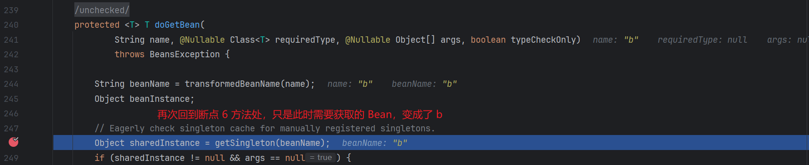

后续的流程，重复和创建 Bean a 一样的过程，此处不再赘述，直到 Bean b 的属性需要填充 a 的时候：

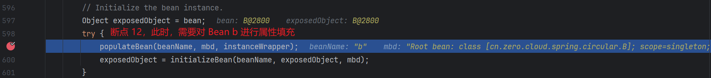

在断点 12 处，F7 Step Into，再次定位到 org.springframework.beans.factory.support.AbstractAutowireCapableBeanFactory#populateBean，最终调用`applyPropertyValues(beanName, mbd, bw, pvs)`方法：

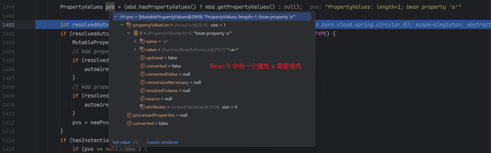

```java
protected void populateBean(String beanName, RootBeanDefinition mbd, @Nullable BeanWrapper bw) {
    ...

    // Bean b 中有一个属性 a 需要填充
    PropertyValues pvs = (mbd.hasPropertyValues() ? mbd.getPropertyValues() : null);

    ...

    if (pvs != null) {
       // 断点 13，Bean b
       applyPropertyValues(beanName, mbd, bw, pvs);
    }
}
```

F7 Step Into，再次定位到 org.springframework.beans.factory.support.AbstractAutowireCapableBeanFactory#applyPropertyValues，调用`valueResolver.resolveValueIfNecessary(pv, originalValue)`方法：

```java
protected void applyPropertyValues(String beanName, BeanDefinition mbd, BeanWrapper bw, PropertyValues pvs) {
    ...

    // Create a deep copy, resolving any references for values.
    List<PropertyValue> deepCopy = new ArrayList<>(original.size());
    boolean resolveNecessary = false;
    for (PropertyValue pv : original) {
       if (pv.isConverted()) {
          deepCopy.add(pv);
       }
       else {
          String propertyName = pv.getName();
          Object originalValue = pv.getValue();
          if (originalValue == AutowiredPropertyMarker.INSTANCE) {
             Method writeMethod = bw.getPropertyDescriptor(propertyName).getWriteMethod();
             if (writeMethod == null) {
                throw new IllegalArgumentException("Autowire marker for property without write method: " + pv);
             }
             originalValue = new DependencyDescriptor(new MethodParameter(writeMethod, 0), true);
          }
          // 断点 14，Bean b
          Object resolvedValue = valueResolver.resolveValueIfNecessary(pv, originalValue);
          Object convertedValue = resolvedValue;
          boolean convertible = isConvertibleProperty(propertyName, bw);
          
          ...
       }
    }
    
    ...
}
```

>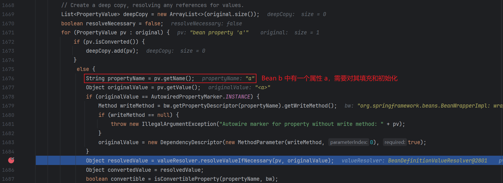

F7 Step Into，再次定位到 org.springframework.beans.factory.support.BeanDefinitionValueResolver#resolveValueIfNecessary，调用`resolveReference(argName, ref)`方法：

```java
@Nullable
public Object resolveValueIfNecessary(Object argName, @Nullable Object value) {
    // We must check each value to see whether it requires a runtime reference
    // to another bean to be resolved.
    if (value instanceof RuntimeBeanReference ref) {
       // 断点 15，Bean b
       return resolveReference(argName, ref);
    }
}
```

F7 Step Into，再次定位到 org.springframework.beans.factory.support.BeanDefinitionValueResolver#resolveReference，调用`this.beanFactory.getBean(resolvedName)`方法：

```java
@Nullable
private Object resolveReference(Object argName, RuntimeBeanReference ref) {
    try {
       ...
           
       else {
          String resolvedName;
          if (beanType != null) {
             NamedBeanHolder<?> namedBean = this.beanFactory.resolveNamedBean(beanType);
             bean = namedBean.getBeanInstance();
             resolvedName = namedBean.getBeanName();
          }
          else {
             resolvedName = String.valueOf(doEvaluate(ref.getBeanName()));
             // 断点 16，Bean b 需要获取 Bean a
             bean = this.beanFactory.getBean(resolvedName);
          }
          this.beanFactory.registerDependentBean(resolvedName, this.beanName);
       }
       if (bean instanceof NullBean) {
          bean = null;
       }
       return bean;
    }
    
    ...
}
```

>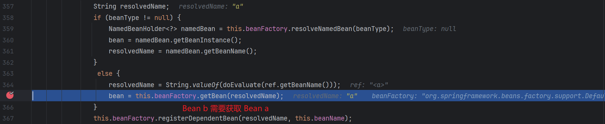

F7 Step Into，再次定位到 org.springframework.beans.factory.support.AbstractBeanFactory#getBean(java.lang.String)，又一次执行此方法，此处是为了获取 Bean a：

```java
@Override
public Object getBean(String name) throws BeansException {
    return doGetBean(name, null, null, false);
}
```

F7 Step Into，继续执行，第三次定位到 org.springframework.beans.factory.support.AbstractBeanFactory#doGetBean，第三次调用`getSingleton(beanName)`方法，回到了断点 6：

```java
protected <T> T doGetBean(
       String name, @Nullable Class<T> requiredType, @Nullable Object[] args, boolean typeCheckOnly)
       throws BeansException {
    // 处理 Bean 别名解析
    String beanName = transformedBeanName(name);
    Object beanInstance;

    // 断点 6，Bean a
    // Eagerly check singleton cache for manually registered singletons.
    Object sharedInstance = getSingleton(beanName);
    if (sharedInstance != null && args == null) {
       if (logger.isTraceEnabled()) {
          if (isSingletonCurrentlyInCreation(beanName)) {
             logger.trace("Returning eagerly cached instance of singleton bean '" + beanName +
                   "' that is not fully initialized yet - a consequence of a circular reference");
          }
          else {
             logger.trace("Returning cached instance of singleton bean '" + beanName + "'");
          }
       }
       beanInstance = getObjectForBeanInstance(sharedInstance, name, beanName, null);
    }
    
    ...
}
```

> 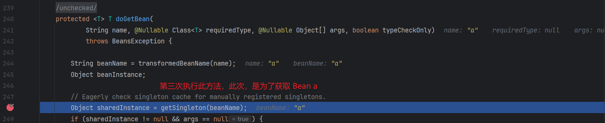

F7 Step Into，第三次定位到 org.springframework.beans.factory.support.DefaultSingletonBeanRegistry#getSingleton(java.lang.String, boolean)，此时，对于 Bean a，一级缓存 singletonObjects 和二级缓存 earlySingletonObjects 中仍不存在，但此时，isSingletonCurrentlyInCreation(beanName) 为 true（Bean a 此时处于创建的状态），因此，最终在三级缓存 singletonFactories 中找到 Bean a：

```java
@Nullable
protected Object getSingleton(String beanName, boolean allowEarlyReference) {
    // Quick check for existing instance without full singleton lock
    Object singletonObject = this.singletonObjects.get(beanName);
    if (singletonObject == null && isSingletonCurrentlyInCreation(beanName)) {
       singletonObject = this.earlySingletonObjects.get(beanName);
       if (singletonObject == null && allowEarlyReference) {
          synchronized (this.singletonObjects) {
             // Consistent creation of early reference within full singleton lock
             singletonObject = this.singletonObjects.get(beanName);
             if (singletonObject == null) {
                singletonObject = this.earlySingletonObjects.get(beanName);
                if (singletonObject == null) {
                   // 三级缓存中有 Bean a
                   ObjectFactory<?> singletonFactory = this.singletonFactories.get(beanName);
                   if (singletonFactory != null) {
                      singletonObject = singletonFactory.getObject();
                      // 将 Bean a 放入二级缓存，如果是 AOP 进行切面代理的 Bean，此时是第一次调用 singletonFactory.getObject()，直接存入二级缓存
                      this.earlySingletonObjects.put(beanName, singletonObject);
                      // 移除三级缓存中的 Bean a
                      this.singletonFactories.remove(beanName);
                   }
                }
             }
          }
       }
    }
    return singletonObject;
}
```

>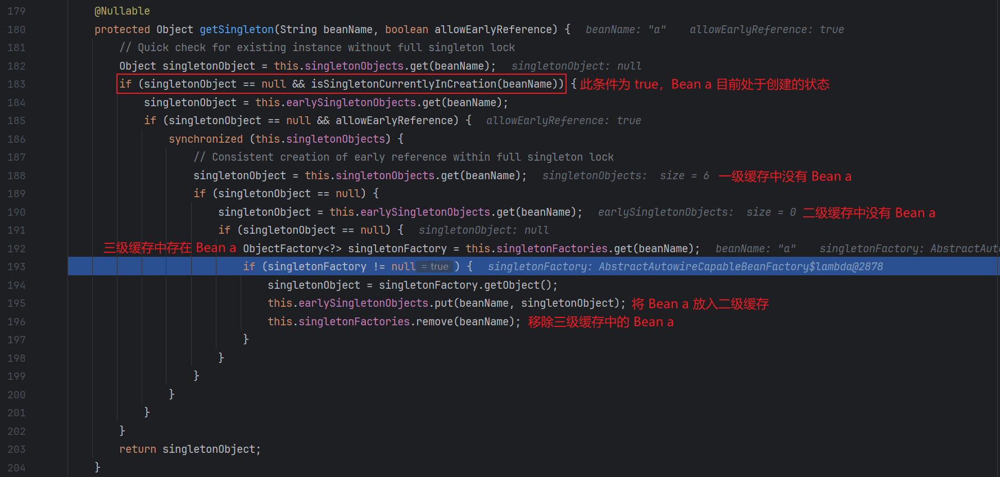
>
>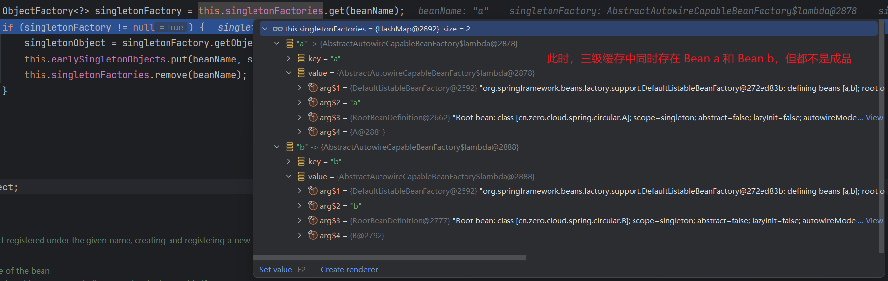
>
>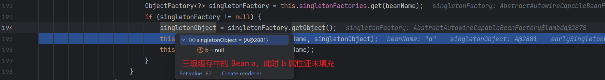

> **`此时，Bean a 从三级缓存，移入到二级缓存中。`**

F8 Step Over，一路返回，直到 Bean b 属性填充的地方`populateBean(beanName, mbd, instanceWrapper)`方法，此时，属性 a 填充完成，下一步，执行 Bean b 的初始化`initializeBean(beanName, exposedObject, mbd)`方法：

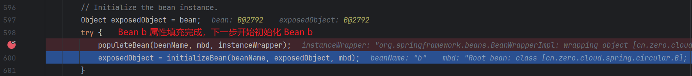

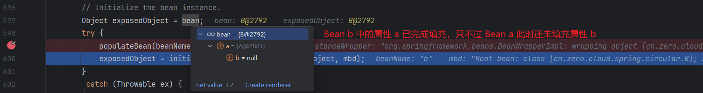

F7 Step Into initializeBean(beanName, exposedObject, mbd) 方法，在此方法中，实现了 Bean b 的初始化，和后置处理器的相关方法调用：

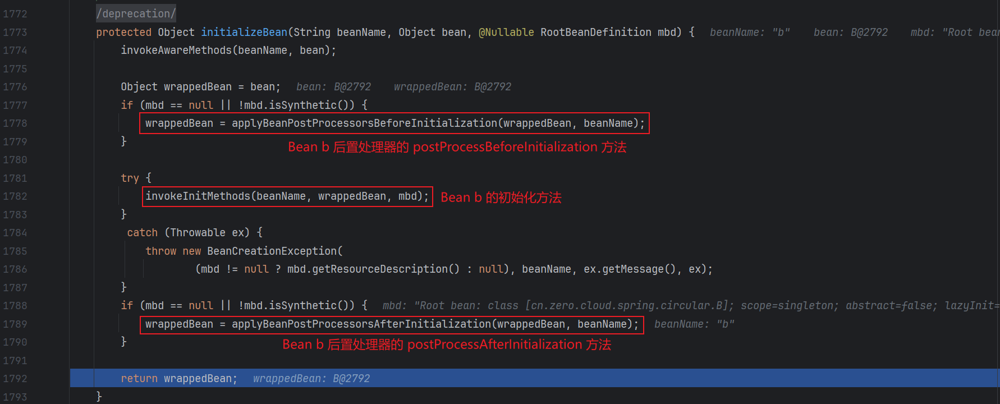

F8 Step Over，一路回到 org.springframework.beans.factory.support.DefaultSingletonBeanRegistry#getSingleton(java.lang.String, org.springframework.beans.factory.ObjectFactory<?>)，Bean b 创建完成，调用**`addSingleton(beanName, singletonObject)`**方法：

```java
public Object getSingleton(String beanName, ObjectFactory<?> singletonFactory) {
	try {
        // 断点 8
        singletonObject = singletonFactory.getObject();
        newSingleton = true;
    }
    catch (IllegalStateException ex) {
        // Has the singleton object implicitly appeared in the meantime ->
        // if yes, proceed with it since the exception indicates that state.
        singletonObject = this.singletonObjects.get(beanName);
        if (singletonObject == null) {
            throw ex;
        }
    }
    catch (BeanCreationException ex) {
        if (recordSuppressedExceptions) {
            for (Exception suppressedException : this.suppressedExceptions) {
                ex.addRelatedCause(suppressedException);
            }
        }
        throw ex;
    }
    finally {
        if (recordSuppressedExceptions) {
            this.suppressedExceptions = null;
        }
        afterSingletonCreation(beanName);
    }
    if (newSingleton) {
        // 断点 17
        addSingleton(beanName, singletonObject);
    }
}
```

F7 Step Into，定位到 org.springframework.beans.factory.support.DefaultSingletonBeanRegistry#addSingleton，此时，会将 Bean b 放入一级缓存，并移除二级缓存和三级缓存中的 Bean b（**实际上，二级缓存中并没有 Bean b，只有 Bean a，而此时的三级缓存中也只有 Bean b，没有 Bean a**）：

```java
protected void addSingleton(String beanName, Object singletonObject) {
    synchronized (this.singletonObjects) {
       this.singletonObjects.put(beanName, singletonObject);
       this.singletonFactories.remove(beanName);
       this.earlySingletonObjects.remove(beanName);
       this.registeredSingletons.add(beanName);
    }
}
```

> 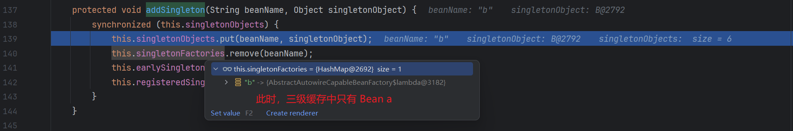
>
> 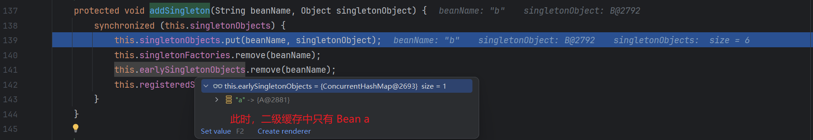

- **可以看到，Bean b 是直接从三级缓存移入一级缓存中的，它没有出现在二级缓存中。而 Bean a 则是从三级缓存到二级缓存，再到一级缓存的变化过程。**

F8 Step Over，一路返回，直到 Bean a 属性填充的地方`populateBean(beanName, mbd, instanceWrapper)`方法，此时，属性 b 填充完成，下一步，执行 Bean a 的初始化`initializeBean(beanName, exposedObject, mbd)`方法：

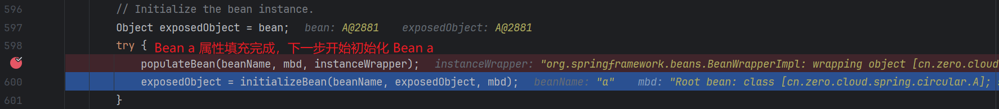

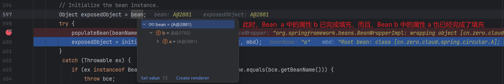

F8 Step Over，一路返回，直到调用`addSingleton(beanName, singletonObject)`方法，即断点 17 处，F7 Step Into，此时，会将 Bean a 放入一级缓存，并移除二级缓存和三级缓存中的 Bean a：

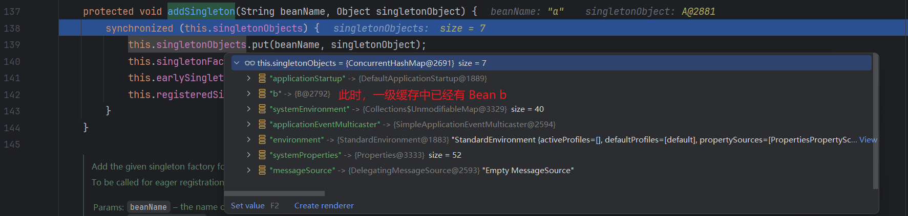

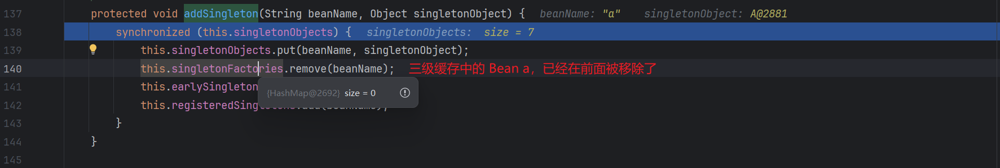

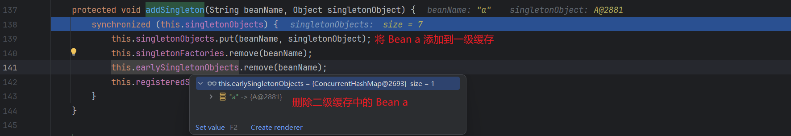

至此，循环依赖的 Bean a 和 Bean b，通过三级缓存机制，都完成了创建。

## AOP

**`AOP`**：**Aspect-Oriented Programming，面向切面编程。**是`一种编程范式`，它允许开发者`将那些横切整个应用程序的关注点（cross-cutting concerns）与业务逻辑（核心关注点）分离开来`。在传统的面向对象编程（OOP）中，实现某些功能（如日志、安全、事务等）时，代码往往会散布在多个模块或类中，这可能导致代码重复且难以维护。AOP 通过提供一种将这些功能模块化的方式，帮助开发者提高代码的模块化程度和可维护性。

AOP 主要概念包括：

1. `Aspect（切面）`：一个关注点的模块化，这个关注点可能会横切多个对象。比如，日志记录可以是一个切面，因为几乎每个方法都需要日志记录功能。
2. `Join point（连接点）`：程序执行的某个特定位置，比如方法调用或异常处理的点。在 Spring AOP 中，一个连接点总是代表一个方法的执行。
3. `Pointcut（切点）`：匹配连接点的断言。切点表达式决定了某个特定的方法是否被一个切面的通知所影响。简单来说，它定义了 "我们在什么地方应用切面"。
4. `Advice（通知）`：在切点匹配的连接点上所采取的动作。主要有以下类型：
  - `Before advice（前置通知）`：在目标方法执行之前执行的通知。
  - `After returning advice（后置通知）`：在目标方法正常执行之后执行的通知。
  - `After throwing advice（异常通知）`：在方法抛出异常退出时执行的通知。
  - `After advice（最终通知）`：无论目标方法如何结束，该通知都会执行。
  - `Around advice（环绕通知）`：包围一个连接点的通知，可以在方法调用之前和之后自定义行为。
5. `Target object（目标对象）`：被一个或多个切面通知的对象。**在 Spring AOP 中，这些对象总是代理对象。**
6. `AOP proxy（AOP 代理）`：AOP 框架创建的对象，用来实现切面契约（如方法拦截）。**在 Spring AOP 中，这通常是 JDK 动态代理或 CGLIB 代理。**
7. `Weaving（织入）`：把切面与其他应用程序类型或对象连接起来，以创建通知对象的过程。这可以在编译时（例如使用 AspectJ 编译器）、加载时或运行时完成。Spring AOP 如同其他纯 Java AOP 框架一样，在运行时完成织入。

Spring AOP 专注于提供运行时织入的 AOP 支持，并且它在概念上是面向代理的。这意味着 Spring AOP 不需要特殊的编译过程或类加载器来实现 AOP 功能，而是动态地在运行时将通知应用到 Spring 管理的 Bean 上。Spring AOP 对于简单的场景非常有用，但如果需要完整的 AOP 支持（例如在字段访问时进行通知），则可能需要使用更强大的 AOP 实现，如 AspectJ。

### AspectJ

**`AspectJ`**：**是一个成熟的 AOP 框架，它支持完整的 AOP 概念，包括在编译时和加载时织入。**它比 Spring AOP 提供了更多的织入点，可以实现更复杂的 AOP 场景。与 Spring AOP 相比，AspectJ 是一个更全面的 AOP 解决方案，它提供了更多的控制和灵活性，但也带来了更复杂的配置和使用门槛。

在 Spring 框架中，Spring AOP 和 AspectJ 都可以使用。对于大多数 Spring 应用程序，Spring AOP 提供的运行时代理机制已经足够用于处理常见的切面逻辑。对于更高级的需求，Spring 还支持与 AspectJ 的集成，允许开发者利用 AspectJ 的强大功能，同时享受 Spring 框架的便利。

使用 Spring AOP 通常涉及以下步骤：

1. `定义切面`：创建一个类并使用 **@Aspect 注解**来标识它作为切面。
2. `声明切点`：使用 **@Pointcut 注解**来定义切点表达式，指定哪些方法将被通知。
3. `编写通知`：使用 **@Before、@AfterReturning、@AfterThrowing、@After 和 @Around 注解**来编写不同类型的通知逻辑。
4. `配置 AOP`：如果使用的是基于 Java 的配置，需要在配置类上添加 @EnableAspectJAutoProxy 注解来启用 AOP 代理的自动创建。如果使用的是 XML 配置，需要添加 <aop:aspectj-autoproxy /> 元素。
5. `将切面注册到 Spring 容器中`：作为 Bean 注册切面，以便能够由 Spring 容器管理。

>Spring AOP 的依赖：
>
>```xml
><!-- Spring AOP 依赖 -->
><dependency>
>    <groupId>org.springframework</groupId>
>    <artifactId>spring-aop</artifactId>
>    <version>5.3.x</version> <!-- 请将 x 替换为实际的版本号 -->
></dependency>
>
><!-- AspectJ 依赖 -->
><dependency>
>    <groupId>org.aspectj</groupId>
>    <artifactId>aspectjweaver</artifactId>
>    <version>1.9.x</version> <!-- 请将 x 替换为实际的版本号 -->
></dependency>
>```
>
>如果使用 Spring Boot，添加 spring-boot-starter-aop 依赖即可：
>
>```xml
><dependency>
>    <groupId>org.springframework.boot</groupId>
>    <artifactId>spring-boot-starter-aop</artifactId>
></dependency>
>```
>
>此时，@EnableAspectJAutoProxy 是自动启用的，不需要显式地添加这个注解。Spring Boot 自动配置会负责设置合适的 AOP 配置，包括启用 AspectJ 自动代理。

以下是一个简单的 Spring AOP 示例，展示如何定义一个简单的日志记录切面：

```java
@Aspect
@Component
public class LoggingAspect {

    @Pointcut("execution(* com.example.service.*.*(..))")
    private void serviceLayer() {
    }

    @Before("serviceLayer()")
    public void logBefore(JoinPoint joinPoint) {
        System.out.println("Before method: " + joinPoint.getSignature().getName());
    }

    @AfterReturning(pointcut = "serviceLayer()", returning = "result")
    public void logAfterReturning(JoinPoint joinPoint, Object result) {
        System.out.println("Method returned value is : " + result);
    }

    // ... 其他通知 ...
}
```

在上面的例子中，我们定义了一个切面 LoggingAspect，它包含了两个通知：logBefore（方法执行之前记录日志）和 logAfterReturning（方法正常返回后记录返回值）。@Pointcut 注解定义了切点表达式，指定了通知将应用于 com.example.service 包下所有类的所有方法。通过在 Spring 容器中注册这个切面，我们能够实现 AOP 的日志记录功能。

### 切入点表达式

`切点表达式`：Pointcut Expression，是 AspectJ 表达式语言的一部分，它指定了何时以及在哪里应用通知（Advice）。切点表达式通常与 @Pointcut 注解一起使用，在 Spring AOP 中定义如下：

```java
@Pointcut("expression")
```

在这里，expression 是实际的切点表达式，它可以包含各种匹配模式和指示符。下面是切点表达式的语法结构和组成部分：
1. `设计符（Designator）`：表示要匹配的连接点类型，比如 execution，within，this，target，args，@annotation 等。
2. `返回类型`：表示方法的返回类型，可以是具体的类型如 int，String 等，或者使用 * 代表所有类型。
3. `方法签名`：包括全限定类名和方法名，例如 com.example.service.MyService.* 会匹配 MyService 类中的所有方法。可以使用 .. 表示任意个数的参数。
4. `参数列表`：表示方法参数，可以是具体类型列表或者通配符。例如 (..) 匹配任意数量和类型的参数，而 () 仅匹配无参方法。
5. `异常类型`：可以指定方法抛出的异常类型。

一个典型的切点表达式的示例如下：

```java
@Pointcut("execution(* com.example.service.*.*(..))")
```

这个表达式的组成部分解释如下：

- `execution`：设计符，指明这个表达式是要匹配方法执行的连接点。
- `*`：通配符，表示任意返回类型。
- `com.example.service.*`：类路径通配符，表示 com.example.service 包下的任意类。
- `*`：方法名通配符，表示匹配所有方法。
- `(..)`：参数列表通配符，表示匹配任意参数的方法。

总结来说，切点表达式定义了 "何处" 和 "何时" 执行 AOP 通知，它是通过匹配连接点（如方法执行、构造函数调用等）来实现的。设计良好的切点表达式可以精确地捕获你想要增强的应用程序行为。

**除了前面举例使用的 execution 设计符，还可以使用 @annotation 设计符，这在想要基于自定义注解增强方法行为时非常有用。**以 @Around 注解与 @annotation 设计符结合使用为例，来创建一个环绕通知，它针对带有特定注解的方法执行。

假设有一个自定义注解 @LogExecutionTime，功能上希望记录所有带有这个注解的方法的执行时间。首先，需要定义这个注解：

```java
@Target(ElementType.METHOD)
@Retention(RetentionPolicy.RUNTIME)
public @interface LogExecutionTime {
    // 可以添加注解属性
}
```

接下来，创建一个切面，并在其中定义一个环绕通知，它会捕获所有带有 @LogExecutionTime 注解的方法：

```java
@Aspect
@Order(1)
@Component
public class PerformanceAspect {

    @Around("@annotation(LogExecutionTime)")
    public Object logExecutionTime(ProceedingJoinPoint joinPoint) throws Throwable {
        long start = System.currentTimeMillis();

        try {
            // 执行目标方法
            Object result = joinPoint.proceed();
            return result;
        } finally {
            // 计算执行时间
            long executionTime = System.currentTimeMillis() - start;
            System.out.println(joinPoint.getSignature() + " executed in " + executionTime + "ms");
        }
    }
}
```

在上面的切面中，@Around 注解与 @annotation 设计符结合使用，指定了当一个方法被 @LogExecutionTime 注解标记时，环绕通知 logExecutionTime 应该被执行。

然后，在业务逻辑代码中，可以使用 @LogExecutionTime 注解来标注需要记录执行时间的方法：

```java
@Service
public class MyService {

    @LogExecutionTime
    public void someMethodToLog() {
        // 方法的业务逻辑
    }
}
```

现在，每当调用 someMethodToLog() 方法时，PerformanceAspect 中的 logExecutionTime 环绕通知会自动执行，并记录该方法的执行时间。

### 工作原理

Spring AOP 的底层原理主要`基于代理模式`，它`使用了 JDK 动态代理或 CGLIB 代理来创建目标对象的代理`，从而在不改变原有业务逻辑的情况下，实现了横切逻辑的注入。

以下是 Spring AOP 的底层的主要工作流程：

1. `代理模式`：AOP 通过创建原始对象的 "代理" 对象来工作。代理对象会包含附加的行为（即切面代码），并将对原始对象的所有调用重定向至代理对象。当代理对象接收到调用时，它会根据配置执行相应的切面逻辑，然后再将调用传递给原始对象。
2. `JDK 动态代理`：**如果目标对象实现了接口，Spring AOP 默认会使用 JDK 动态代理。**JDK 动态代理通过反射机制在运行时创建一个实现了目标对象接口的代理类。这个代理类会将所有方法调用转发到 InvocationHandler 实现类的 invoke() 方法中。
3. `CGLIB 代理`：**如果目标对象没有实现任何接口，Spring AOP 会使用 CGLIB（Code Generation Library）来创建代理。**CGLIB 是一个强大的高性能代码生成库，它在运行时扩展目标类并生成子类。这个子类被用作代理对象，可以拦截对父类方法的所有调用。
4. `AOP 代理的创建`：在 Spring 容器启动时，如果检测到类被 AOP 相关注解（如 @Aspect）或配置文件中的 AOP 配置标记，则 Spring 会自动为这些类创建代理对象。这个过程通常由 Spring 的 Bean 后处理器（BeanPostProcessors）实现，特别是 AnnotationAwareAspectJAutoProxyCreator。
5. `切面（Aspect）和通知（Advice）`：切面是模块化横切关注点的实现，包含了通知（Advice）和切点（Pointcut）。通知定义了切面的具体行为，比如何时执行（前置、后置、环绕等）。切点定义了通知应当应用的位置（即哪些方法调用）。
6. `拦截器链（Interceptor Chain）`：当对代理对象进行方法调用时，Spring AOP 会构建一个拦截器链，这个链中包含了与方法调用匹配的所有通知。这些通知按照顺序被执行，从而实现了横切逻辑的注入。
7. `通知的执行`：在调用链的执行过程中，环绕通知（Around Advice）可以决定是否继续执行链中的下一个通知或目标方法，也可以在方法执行前后添加额外行为。最终，目标方法会被执行，然后按照相反的顺序执行剩下的通知。
8. `AOP 联盟接口`：Spring AOP 遵循了 AOP 联盟的 API 和标准，这是一套定义了 AOP 的核心概念和接口的规范。例如，MethodInterceptor 接口用于环绕通知，Joinpoint 提供了对当前方法、执行对象等的访问。

9. `AspectJ 支持`：虽然 Spring AOP 本身不提供完整的 AspectJ 的支持（如编译时织入），但它可以与 AspectJ 的注解一起使用，如 @Aspect、@Before、@After 等，来定义切面和通知。Spring AOP 使用 AspectJ 的切点解析系统，这允许使用 AspectJ 风格的切点表达式来定义切点。
10. `代理调用的性能影响`：代理机制在方法调用过程中引入了额外的层，这会导致一定程度的性能开销。为了最小化性能影响，Spring AOP 通常仅应用于单例 Bean，并且一般只在有横切需求的时候使用。
11. `BeanPostProcessor 和 AOP`：Spring 通过 BeanPostProcessor 接口允许对 Bean 的实例化过程进行干预。AOP 正是利用这一点，在 Bean 实例化之后但在其被注入到其他 Bean 之前，将代理对象织入到 Spring 容器中。
12. `AOP 上下文传播`：AOP 上下文（如安全上下文、事务上下文等）通常是通过线程本地存储（ThreadLocal）来保持的，确保即使是在多线程环境中，上下文也是安全的。
13. `加载时织入（Load-Time Weaving，LTW）`：Spring 还支持加载时织入，这是一种使用特殊的类加载器在类加载到 JVM 时应用 AOP 通知的技术，这需要使用 AspectJ 的编织器和 Spring 的 LoadTimeWeaver 接口。

总结来说，**Spring AOP 的工作原理主要是通过代理模式，在运行时为目标对象创建代理，并通过这些代理将切面逻辑织入到应用程序中。**通过这种方式，Spring AOP 能够将横切关注点（如日志、事务等）与业务逻辑分离，从而提高代码的模块化和可维护性。

## 事务管理

Spring 事务管理是 Spring 框架提供的一种机制，它允许开发人员以声明式或编程式的方式管理事务。

以下是 Spring 事务管理的关键概念和组件：

1. `事务抽象`：Spring 提供了一个抽象层来统一不同事务管理 API 的事务模型（如 JDBC、JPA、Hibernate 等）。这种抽象使得开发者可以不必关心具体的事务管理实现，而是可以专注于业务逻辑。
2. `事务管理器`：Spring 的事务管理器是实现事务管理的核心组件，它处理事务的创建、提交和回滚。根据不同的持久化技术，Spring 提供了不同的事务管理器实现，如 **DataSourceTransactionManager（用于 JDBC）**、HibernateTransactionManager 等。
3. `声明式事务管理`：声明式事务管理是通过配置来管理事务，**通常使用 @Transactional 注解**。只要在类或方法上添加了这个注解，Spring 就会自动为其方法调用创建和管理事务。**声明式事务管理是推荐的方式，因为它将事务管理代码与业务逻辑代码分离。**
4. `编程式事务管理`：编程式事务管理是通过编写代码来管理事务。Spring 提供了 TransactionTemplate 或 PlatformTransactionManager API，允许开发人员在代码中直接控制事务的边界和行为。这种方式灵活但代码侵入性较强，通常只在声明式事务管理无法满足需求时使用。
5. `事务的传播行为`：Spring 提供了多种事务传播行为，定义了在方法调用时事务如何传播。例如，REQUIRED 表示当前方法必须在一个事务中运行，如果调用者已经在事务中，则加入该事务，否则创建一个新的事务。
6. `事务的隔离级别`：事务的隔离级别定义了一个事务可能受其他并发事务影响的程度。Spring 支持多种隔离级别，如 READ_UNCOMMITTED、READ_COMMITTED、REPEATABLE_READ 和 SERIALIZABLE。
7. `事务超时和只读标志`：可以为事务指定超时，超过指定时间未完成则自动回滚。只读标志可以告知事务管理器当前事务不会进行任何修改，以便进行一些优化处理。

### PlatformTransactionManager

**`PlatformTransactionManager`**：**是 Spring 框架中用于事务管理的核心接口，它为不同的事务管理策略提供了一致的编程模型。**具体的实现类则针对不同的事务管理机制，例如 JDBC、Hibernate、JPA 或者 JTA 等。

#### 配置事务管理器

配置步骤：

1. `选择实现类`：根据业务的数据访问技术，选择合适的 PlatformTransactionManager 实现。例如，如果使用的是 JDBC，那么应该使用 DataSourceTransactionManager，对于 JPA，使用 JpaTransactionManager，Hibernate 则使用 HibernateTransactionManager，而对于全局事务（如分布式事务）则使用 JtaTransactionManager。

2. `声明 Bean`：在 Spring 配置文件或者使用 Java 配置类中声明一个 PlatformTransactionManager 的 bean。

    - XML 配置示例：

        ```xml
        <bean id="transactionManager" class="org.springframework.jdbc.datasource.DataSourceTransactionManager">
        	<property name="dataSource" ref="dataSource"/>
        </bean>
        ```

    - Java 配置示例：

        ```java
        @Bean
        public PlatformTransactionManager transactionManager(DataSource dataSource) {
        	return new DataSourceTransactionManager(dataSource);
        }
        ```

3. `关联数据源`：确保事务管理器有一个数据源（DataSource）或者实体管理器工厂（EntityManagerFactory）与之相关联。

#### 使用事务管理器

当在 Spring 配置中声明了 PlatformTransactionManager 的 Bean 之后，就可以通过以下两种方式使用事务管理器：
1. `声明式事务管理`：最常用的方法，使用 @Transactional 注解来声明方法的事务行为。Spring 容器会自动检测 @Transactional 注解，并使用配置的事务管理器来管理事务的边界和行为。

2. `编程式事务管理`：使用 TransactionTemplate 或者直接使用 PlatformTransactionManager 的方法来在代码中控制事务。这种方法灵活但编码复杂，通常只在特殊情况下使用。下面是一个使用 TransactionTemplate 的示例：

  ```java
  @Autowired
  private PlatformTransactionManager transactionManager;
  
  public void executeTransactionally(MyBusinessLogic businessLogic) {
      TransactionTemplate transactionTemplate = new TransactionTemplate(transactionManager);
      transactionTemplate.execute(new TransactionCallbackWithoutResult() {
          @Override
          protected void doInTransactionWithoutResult(TransactionStatus status) {
              try {
                  // 执行业务逻辑
                  businessLogic.execute();
              } catch (SomeBusinessException ex) {
                  // 设置回滚标记
                  status.setRollbackOnly();
              }
          }
      });
  }
  ```

在大多数情况下，声明式事务管理通过 @Transactional 注解提供了足够的功能和便利性，并且是推荐的方法，编程式事务管理则在需要更细粒度控制事务时才会使用。

### @Transactional

**`@Transactional 注解`**：是 Spring 框架提供的一种声明式事务管理机制。**它可以应用于类定义或者方法上，当应用在类上时，表示该类中的所有公共方法都会被事务管理；当应用在方法上时，则只有标记了该注解的方法会被事务管理。**

以下是 @Transactional 注解的主要作用：

1. `创建和管理事务`：该注解告诉 Spring 容器，被注解的方法需要在一个数据库事务中执行。根据配置，Spring 可以为每个方法调用创建一个新的事务或者使用现有的事务。
2. `事务传播行为`：你可以指定方法的事务传播行为，控制当前事务方法是应该加入已存在的事务中执行，还是应该开启一个新的事务执行。这是**通过 propagation 属性来设置**的。
3. `事务隔离级别`：可以指定事务的隔离级别，这样就能够控制事务内部和外部的交互，以避免问题如脏读、不可重复读、幻读等。这是**通过 isolation 属性来设置**的。
4. `事务超时`：可以设置事务的超时时间，超时时间定义了事务在被强制回滚之前可以运行多长时间。这是**通过 timeout 属性来设置**的。
5. `只读事务`：可以声明事务是否为只读。设置事务为只读可以帮助数据库优化事务。对于只读操作，这可以提高性能。这是**通过 readOnly 属性来设置**的。
6. `异常回滚规则`：可以指定哪些异常应该触发事务回滚。默认情况下，运行时异常（RuntimeException 及其子类）和错误（Error）将导致事务回滚，而检查型异常（非 RuntimeException 的异常）不会导致事务回滚。**通过 rollbackFor 和 noRollbackFor 属性可以细化控制回滚行为**。

使用示例：

```java
@Service
public class MyService {

    @Transactional(readOnly = true)
    public MyData readData(Long id) {
        // 这个方法有一个只读事务，通常用于查询操作
    }

    @Transactional(propagation = Propagation.REQUIRES_NEW, isolation = Isolation.SERIALIZABLE, timeout = 60)
    public void updateData(MyData data) {
        // 这个方法将在一个新的事务中运行，并且拥有 SERIALIZABLE 的隔离级别和 60 秒的超时时间
    }
}
```

在上面的例子中，readData 方法被标记为只读事务，而 updateData 方法被标记为在新事务中运行，并使用最高的隔离级别 SERIALIZABLE。

#### 事务传播行为

@Transactional 注解使用 propagation 属性设置事务的传播行为，事务的传播行为定义了一个事务性方法如何关联到已存在的事务当中。

以下是 Spring 支持的几种事务传播类型：

1. `REQUIRED`：如果当前存在事务，则加入该事务；如果当前没有事务，则创建一个新的事务。这是最常见的选择，默认设置。
2. `SUPPORTS`：如果当前存在事务，则加入该事务；如果没有，则以非事务的方式执行。适用于不需要事务控制的方法。
3. `MANDATORY`：如果当前存在事务，则加入该事务；如果没有，则抛出异常。适用于必须在事务环境下执行的操作。
4. `REQUIRES_NEW`：总是启动一个新的事务，如果当前存在事务，则将当前事务挂起。适用于需要独立事务控制的情况。
5. `NOT_SUPPORTED`：总是以非事务方式执行，如果当前存在事务，则将当前事务挂起。适用于不应在事务环境中运行的操作。
6. `NEVER`：总是以非事务方式执行，如果当前存在事务，则抛出异常。这个选项表明方法不应在事务环境中运行。
7. `NESTED`：如果当前存在事务，则在嵌套事务内执行。如果当前没有事务，则行为与REQUIRED一样。嵌套事务可以单独回滚而不影响外部事务。注意，并不是所有的事务管理器都支持嵌套事务。

使用示例：

```java
@Transactional(propagation = Propagation.REQUIRED)
public void someTransactionalMethod() {
    // ...
}
```

实际开发中，根据具体业务需求和操作，合理选择传播行为是非常重要的。例如，如果方法必须在事务的上下文中执行，但是不想中断现有的事务流程，那么 REQUIRES_NEW 或者 NESTED 可能是一个好的选择。反之，如果方法不需要事务，可以选择 NOT_SUPPORTED 或 NEVER。默认的 REQUIRED 适用于大多数场景，它能够确保事务的存在，并在需要的时候创建新事务。

#### 事务隔离级别

@Transactional 注解使用 isolation 属性设置事务的隔离级别，事务的隔离级别定义了一个事务可能受其他并发事务影响的程度。
以下是定义在 org.springframework.transaction.annotation.Isolation 枚举中的隔离级别，这些隔离级别对应于 SQL 标准中定义的隔离级别：

1. `DEFAULT`：使用底层数据源的默认隔离级别。大多数情况下，默认值是 READ_COMMITTED。
2. `READ_UNCOMMITTED`：允许事务读取未提交的数据变更，可能会导致脏读、不可重复读和幻读。
3. `READ_COMMITTED`：允许事务读取并发事务已经提交的数据。可以防止脏读，但是不可重复读和幻读仍然可能发生。
4. `REPEATABLE_READ`：确保如果在事务期间多次读取同一数据，则会看到相同的数据，即事务可以重复读取之前读取的数据。可以防止脏读和不可重复读，但幻读仍然可能发生。
5. `SERIALIZABLE`：这是最严格的隔离级别，事务完全串行化顺序执行，以此确保一个事务不会看到其他事务的中间状态。这个级别可以防止脏读、不可重复读和幻读，但是它可能导致大量的性能开销，并且增加了死锁的风险。

> 注意：以上是 SQL 标准中定义的隔离级别，对于不同的数据库实现可能不同，比如在 MySQL 中，默认的 REPEATABLE READ 隔离级别就已经解决了幻读的问题。因此，使用 @Transactional 设置事务隔离级别时，需要结合底层数据源。

使用示例：

```java
@Transactional(isolation = Isolation.REPEATABLE_READ)
public void someTransactionalMethod() {
    // ...
}
```

合理选择隔离级别对于保证数据库操作的准确性和效率至关重要。较低的隔离级别（如 READ_UNCOMMITTED 和 READ_COMMITTED）通常具有更高的并发性能，但是可能会面临脏读、不可重复读和幻读等并发问题。较高的隔离级别（如 REPEATABLE_READ 和 SERIALIZABLE）可以提供更好的数据一致性保证，但可能会降低并发性能并增加死锁的可能性。

因此，在选择事务隔离级别时，需要根据应用程序的具体需求和数据库的性能特性进行权衡。

#### 工作原理

@Transactional 注解背后的原理主要`基于 Spring AOP（面向切面编程）`。

以下是 @Transactional 注解的主要工作流程：

1. `代理创建`：当 Spring 应用程序启动时，如果配置了 \<tx:annotation-driven/> 或者 @EnableTransactionManagement，Spring 容器会扫描所有的 Bean，查找哪些类和方法上标有 @Transactional 注解。
2. `AOP 代理`：对于标有 @Transactional 注解的 Bean，Spring 会为它们创建一个 AOP 代理（这个代理可以是 JDK 动态代理或者 CGLIB 代理）。这个代理将拦截对被代理对象的所有方法调用。
3. `事务拦截`：当代理对象的方法被调用时，代理会先调用事务拦截器（TransactionInterceptor），该拦截器会根据 @Transactional 注解的属性来创建或者加入一个现有的事务。
4. `事务边界管理`：TransactionInterceptor 与 PlatformTransactionManager 一起协作，确保在方法开始执行前开启事务，在方法执行结束后根据执行情况（是否出现异常）提交或回滚事务。
5. `事务同步`：如果事务成功开启，所有的数据库操作都会在这个事务的上下文中执行。Spring 还会负责事务的同步，比如确保在当前事务中使用相同的数据库连接。

#### 失效情形

在某些情况下，@Transactional 注解可能失效，导致事务管理不按预期进行。以下是一些常见的导致 @Transactional 注解失效的情形：
1. `注解用于非 public 方法`：@Transactional 注解默认只能应用于 public 方法。如果将它用于 protected、private 或 package-private 方法上，事务是不会被 Spring 代理捕获的，因此注解会失效。
2. `方法内部调用`：当事务方法在同一个类内部被直接调用时，如 this.someTransactionalMethod()，事务的代理机制并不会被触发，因为代理是在方法外部的调用才能介入的。
3. `自调用问题`：类似于方法内部调用，当一个类自身的一个非事务方法内部调用另一个有 @Transactional 注解的方法时，由于事务代理没有介入，所以事务不会生效。解决方法是使用方法注入或者从 Spring 容器中获取代理对象。
4. `异常处理不当`：默认情况下，只有运行时异常会触发事务回滚。如果方法抛出的是检查型异常，并且没有在 @Transactional 注解中明确指定回滚条件，事务不会回滚。
5. `不支持的事务传播行为`：如果选择的传播行为不支持当前事务上下文，则可能导致事务失效。如 Propagation.NEVER 或 Propagation.NOT_SUPPORTED。
6. `数据库不支持事务`：使用的数据库必须支持事务。如果你使用的是一个不支持事务的数据库（比如某些 NoSQL 数据库），@Transactional 注解将无效。
7. `事务管理器配置错误`：如果 Spring 配置中事务管理器没有配置正确，或者有多个事务管理器而没有指定使用哪一个，那么 @Transactional 注解可能不会正确工作。
8. `Spring Bean 配置错误`：如果事务性的类没有被 Spring 作为 Bean 管理，比如没有在 Spring 容器中声明，而是通过 new 关键字手动实例化的，事务注解也不会生效。
9. `代理方式`：如果类是通过实现接口创建的代理（JDK 动态代理），那么只有接口中定义的方法可以应用事务。如果使用 CGLIB 代理而类是 final 的，同样会导致事务失效。
10. `多线程环境`：当在多线程环境下运行事务方法时，事务上下文可能无法正确地传播到新线程中，导致事务失效。

为了确保 @Transactional 注解能够正确工作，应该：

- **确保相关的类和方法由 Spring 管理，即它们应该是 Spring 容器中的 Bean。**
- **使用公共方法来应用 @Transactional 注解。**
- **如果需要在非运行时异常时回滚，使用 rollbackFor 属性明确指定。**
- **确保正确配置了事务管理器，并且如果有多个，正确地指定了要使用的事务管理器。**
- **理解并正确设置事务的传播行为。**
- **如果是自调用情况，考虑重构代码，使得事务方法能够通过代理对象调用，或者使用 ApplicationContext 来获取代理对象。**
- **如果类实现了接口，确保事务方法在接口中被声明过，或者显式地使用基于类的代理（如 CGLIB）。**
- **避免在类定义为 final 的情况下使用基于类的代理，因为这会导致 CGLIB 代理失败。**

通过注意这些细节，可以确保 @Transactional 注解能够按照预期工作，正确地管理事务边界。如果发现事务没有如预期工作，检查上述列表中的每一项，通常可以帮助快速定位问题。在调试过程中，启用 Spring 事务管理的详细日志也是一个好方法，它可以提供更多关于事务行为的信息。

## 原文链接

https://github.com/ACatSmiling/zero-to-zero/blob/main/SpringEcosystem/spring.md